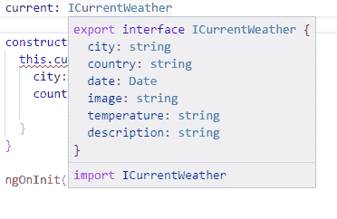
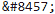
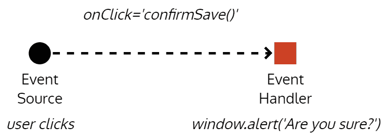
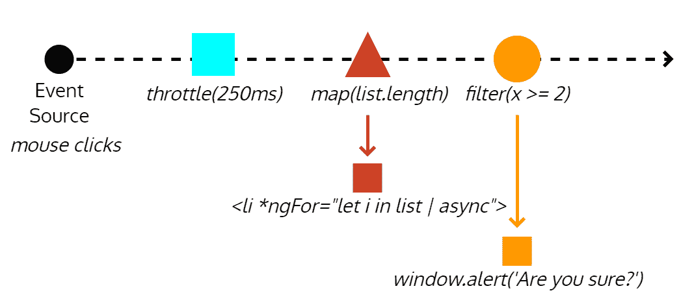
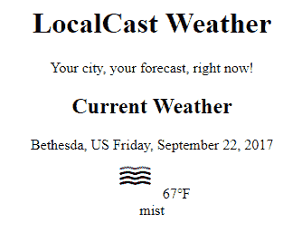

# 九、创建本地天气 Web 应用

我们将设计和构建一个简单的本地天气应用，使用 Angular 和第三方 web API，使用迭代开发方法。在学习 Angular、TypeScript、Visual Studio 代码、反应式编程和 RxJS 的细微差别和最佳使用方法的同时，您将首先关注交付价值

在本章中，您将学习以下内容：

*   使用华夫格作为连接 GitHub 的看板规划路线图
*   制作一个新的 UI 元素，使用组件和界面显示当前天气信息
*   使用 Angular Services 和 HttpClient 从 OpenWeatherMap API 检索数据
*   利用可观测流使用 RxJS 转换数据

本书中提供的代码示例需要第 5 版和第 6 版。Angular 5 代码在运行时与 Angular 6 兼容。到 2019 年 10 月，LTS 将支持 Angular 6。代码存储库的最新版本可在以下位置找到：

*   LocalCast 天气，网址：[Github.com/duluca/local-Weather-app](https://github.com/duluca/local-weather-app)
*   LemonMart，网址：[Github.com/duluca/lemon-mart](https://github.com/duluca/lemon-mart)

# 使用华夫格规划要素路线图

在开始编码之前制定一个粗略的行动计划是非常重要的，这样你和你的同事或客户就会知道你计划执行的路线图。无论您是为自己还是为他人构建应用，当您在休息后返回项目时，一堆活生生的功能将始终作为一个很好的提醒，或者作为一个信息辐射器，防止不断请求状态更新。

在敏捷开发中，您可能已经使用了各种各样的票务系统或工具来展示看板或看板。我最喜欢的工具是 Waffle.io，[https://waffle.io/](https://waffle.io/) ，因为它直接与 GitHub 存储库的问题集成，并通过标签跟踪问题的状态。这样，您就可以继续使用您选择的工具与存储库进行交互，并且仍然可以轻松地散发信息。在下一节中，您将建立一个华夫格项目来实现这一目标。

# 建立华夫饼项目

现在，我们将建立华夫饼项目：

1.  转到 Waffle.io[https://waffle.io/](https://waffle.io/) 。
2.  点击登录或免费开始。
3.  选择 Public&Private Repos 以允许访问您的所有存储库。
4.  单击创建项目。
5.  搜索本地天气应用存储库并将其选中。

6.  点击继续。

您将获得两个初学者布局模板，如下图所示：


Waffle.io Default Board Layouts

对于这个简单的项目，您将选择 Basic。但是，Advanced layout 演示了如何通过添加其他列（如 Review）来修改华夫格的默认设置，以说明参与该过程的测试人员或产品所有者。您可以进一步定制任何电路板以适应现有流程。

7.  选择基本布局并单击“创建项目”。
8.  您将看到为您创建的新板。


Empty Waffle Board

默认情况下，华夫格将用作看板。允许您将任务从一种状态移动到另一种状态。但是，默认视图将显示存储库中存在的所有问题。要将华夫格用作 Scrum 板，您需要将问题分配给代表 Sprint 的 GitHub 里程碑。然后，您可以使用过滤功能仅显示该里程碑中的问题，或者以另一种方式显示当前 sprint 中的问题。

在华夫饼干上，您可以通过点击比例图标将故事点附加到问题上。这些列将自动显示代表优先级的总计和卡片订单，并在会话之间保留。此外，您可以切换到“度量”视图以获取里程碑耗损和吞吐量图表和统计信息。

# 为您的本地天气应用创建问题

现在，我们将创建一个积压问题，您将使用这些问题跟踪您在实现应用设计时的进度。在创建问题时，您应该专注于交付能够为用户带来一些价值的功能迭代。用户或客户对实现这些结果所必须清除的技术障碍不感兴趣。

以下是我们计划在第一个版本中构建的功能：

*   显示当前位置当天的天气信息
*   显示当前位置的预测信息
*   添加城市搜索功能，以便用户可以查看其他城市的天气信息
*   添加首选项窗格以存储用户的默认城市
*   使用 Angular 材质改善应用的用户体验

继续在华夫饼干或 GitHub 上创建您的问题；你喜欢哪个都行。在为 Sprint 1 创建范围时，我对特性有一些其他想法，所以我只是添加了这些问题，但我没有将它们分配给个人或里程碑。我还继续向我打算研究的问题添加了故事点。下面是董事会的样子，因为我将开始编写第一个故事：


A snapshot of the initial state of the board at [https://waffle.io/duluca/local-weather-app](https://waffle.io/duluca/local-weather-app) Ultimately, Waffle provides an easy-to-use GUI so that non-technical people can easily interact with GitHub issues. By allowing non-technical people to participate in the development process on GitHub, you unlock the benefit of GitHub becoming the single source of information for your entire project. Questions, answers, and discussions around features and issues are all tracked as part of GitHub issues, instead of being lost in emails. You can also store wiki type documentation on GitHub, so by centralizing all project-related information, data, conversations, and artifacts on GitHub, you are greatly simplifying a potentially complicated interaction of multiple systems that require continued maintenance, at a high cost. For private repositories and on-premise Enterprise installations, GitHub has a very reasonable cost. If you're sticking with open source, as we are in this chapter, all these tools are free. As a bonus, I created a rudimentary wiki page on my repository at [https://github.com/duluca/local-weather-app/wiki](https://github.com/duluca/local-weather-app/wiki). Note that you can't upload images to `README.md` or wiki pages. To get around this limitation, you can create a new issue, upload an image in a comment, and copy and paste the URL for it to embed images to `README.md` or wiki pages. In the sample wiki, I followed this technique to embed the wireframe design into the page.

有了具体的路线图，现在就可以开始实现应用了。

# 使用组件和接口制作 UI 元素

您将利用 Angular 组件、接口和服务以解耦、内聚和封装的方式构建当前天气功能。

Angular 应用的登录页默认位于`app.component.html`中。因此，首先用基本的 HTML 编辑`AppComponent`的模板，为应用展示最初的登陆体验。

We are now beginning the development of Feature 1: Display Current Location weather information for the current day, so, you can move the card in Waffle to the In Progress column.

我们将添加一个标题作为`h1`标记，然后是我们应用的标语作为`div`和占位符，用于显示当前天气，如以下代码块所示：

```ts
src/app/app.component.html
<div style="text-align:center">
  <h1>
  LocalCast Weather
  </h1>
  <div>Your city, your forecast, right now!</div>
  <h2>Current Weather</h2>
  <div>current weather</div>
</div>
```

At this point, you should run `npm start` and navigate to `http://localhost:5000` on your browser so that you can observe the changes you're making in real time.

# 添加 Angular 分量

我们需要显示`<div>current weather</div>`所在的当前天气信息。为了实现这一点，您需要构建一个负责显示天气数据的组件。

创建单独组件背后的原因是一种架构最佳实践，它被编码在**模型视图模型**（**MVVM**设计模式中。您以前可能听说过**模型视图控制器**（**MVC**模式）。大约在 2005-2015 年间编写的绝大多数基于 web 的代码都是按照 MVC 模式编写的。MVVM 在重要方面不同于 MVC 模式。正如我在 2013 年关于 DevPro 的文章中所解释的：

[An effective implementation of MVVM] inherently enforces proper separation of concerns. Business logic is clearly separated from presentation logic. So when a View is developed, it stays developed, because fixing a bug in one View's functionality doesn't impact other views. On the flip side, if [you use] visual inheritance effectively and [create] reusable user controls, fixing a bug in one place can fix issues throughout the application.

Angular 提供了 MVVM 的有效实现。

ViewModels neatly encapsulate any presentation logic and allow for simpler View code by acting as a specialized version of the model. The relationship between a View and ViewModel is straightforward, allowing for more natural ways to wrap UI behavior in reusable user controls.

您可以在[上阅读更多关于建筑细微差别的说明 http://bit.ly/MVVMvsMVC](http://bit.ly/MVVMvsMVC) 。

接下来，您将使用 Angular CLI 的`ng generate`命令创建第一个 Angular 组件，其中包括视图和 ViewModel：

1.  在终端执行`npx ng generate component current-weather`

Ensure that you are executing `ng` commands under the `local-weather-app` folder, and not under the `root` project folder. In addition, note that `npx ng generate component current-weather` can be rewritten as `ng g c current-weather`. Going forward, this book will utilize the shorthand format and expect you to prepend `npx`, if necessary.

2.  观察`app`文件夹中创建的新文件：

```ts
src/app
├── app.component.css
├── app.component.html
├── app.component.spec.ts
├── app.component.ts
├── app.module.ts
├── current-weather
  ├── current-weather.component.css
  ├── current-weather.component.html
  ├── current-weather.component.spec.ts
  └── current-weather.component.ts
```

生成的组件有四个部分：

*   `current-weather.component.css`包含特定于组件的任何 CSS，并且是可选文件
*   `current-weather.component.html`包含定义组件外观和绑定呈现的 HTML 模板，可以将其视为视图，与使用的任何 CSS 样式结合使用
*   `current-weather.component.spec.ts`包含基于 Jasmine 的单元测试，您可以扩展它来测试组件功能
*   `current-weather.component.ts`包含类定义上方的`@Component`修饰符，是将 CSS、HTML 和 JavaScript 代码连接在一起的粘合剂。该类本身可以被视为 ViewModel，从服务中提取数据并执行任何必要的转换以公开视图的合理绑定，如下所示：

```ts
src/app/current-weather/current-weather.component.ts
import { Component, OnInit } from '@angular/core'
@Component({
  selector: 'app-current-weather',
  templateUrl: './current-weather.component.html',
  styleUrls: ['./current-weather.component.css'],
})
export class CurrentWeatherComponent implements OnInit {
  constructor() {}

  ngOnInit() {}
}
```

如果您计划编写的组件很简单，那么可以使用内联样式和内联模板重写它，以简化代码的结构

3.  使用内联模板和样式更新`CurrentWeatherComponent`：

```ts
src/app/current-weather/current-weather.component.ts import { Component, OnInit } from '@angular/core'

@Component({
  selector: 'app-current-weather',
  template: `
  <p>
    current-weather works!
  </p>
  `,
  styles: ['']
})
export class CurrentWeatherComponent implements OnInit {
constructor() {}

ngOnInit() {}
}
```

当您执行 generate 命令时，除了创建组件外，该命令还将您创建的新模块添加到`app.module.ts`，避免了将组件连接在一起的繁琐任务：

```ts
src/app/app.module.ts ...
import { CurrentWeatherComponent } from './current-weather/current-weather.component'
...
@NgModule({
declarations: [AppComponent, CurrentWeatherComponent],
...
```

The bootstrap process of Angular is, admittedly, a bit convoluted. This is the chief reason Angular CLI exists. `index.html` contains an element named `<app-root>`. When Angular begins execution, it first loads `main.ts`, which configures the framework for browser use and loads the app module. App module then loads all its dependencies and renders within the aforementioned `<app-root>` element. In [Chapter 12](12.html), *Create a Router-First Line-of-Business App*, when we build a line-of-business app, we will create our own feature modules to take advantage of the scalability features of Angular.

现在，我们需要在初始`AppComponent`模板上显示我们的新组件，以便最终用户可以看到：

4.  将`CurrentWeatherComponent`添加到`AppComponent`中，将`<div>current weather</div>`替换为`<app-current-weather></app-current-weather>`：

```ts
src/app/app.component.html
<div style="text-align:center">
<h1>
 LocalCast Weather
 </h1>
 <div>Your city, your forecast, right now!</div>
 <h2>Current Weather</h2>
 <app-current-weather></app-current-weather>
</div>
```

5.  如果一切正常，您应该看到：


Initial render of your local weather app Note the icon and name in the tab of the browser window. As a web development norm, in the `index.html` file, update the `<title>` tag and the `favicon.ico` file with the name and icon of your application to customize the browser tab information. If your favicon doesn't update, append the `href` attribute with a unique version number, such as `href="favicon.ico?v=2"`. As a result, your app will start looking like a real web app, instead of a CLI-generated starter project.

# 使用接口定义模型

现在您的`View`和`ViewModel`已经就位，您需要定义您的`Model`。如果回顾设计，您将看到组件需要显示：

*   城市
*   国
*   当前日期
*   当前图像
*   当前温度
*   当前天气描述

您将首先创建一个表示此数据结构的接口：

1.  在终端执行`npx ng generate interface ICurrentWeather`
2.  观察一个新生成的名为`icurrent-weather.ts`的文件，其接口定义为空，如下所示：

```ts
src/app/icurrent-weather.ts
export interface ICurrentWeather {
}
```

这不是一个理想的设置，因为我们可能会在应用中添加许多接口，跟踪各种接口可能会变得单调乏味。随着时间的推移，当您将这些接口的具体实现添加为类时，将类及其接口放在它们自己的文件中是有意义的。

Why not just call the interface `CurrentWeather`? This is because later on we may create a class to implement some interesting behavior for `CurrentWeather`. Interfaces establish a contract, establishing the list of available properties on any class or interface that implements or extends the interface. It is always important to be aware of when you're using a class versus an interface. If you follow the best practice to always start your interface names with a capital `I`, you will always be conscious of what type of an object you are passing around. Hence, the interface is named `ICurrentWeather`.

3.  将`icurrent-weather.ts`重命名为`interfaces.ts`
4.  将接口名称的大小写改为`ICurrentWeather`

5.  另外，按照如下方式实现接口：

```ts
src/app/interfaces.ts
export interface ICurrentWeather {
  city: string
  country: string
  date: Date
  image: string
  temperature: number
  description: string
}
```

这个接口及其作为类的最终具体表示是 MVVM 中的模型。到目前为止，我已经强调了 Angular 的各个部分如何适合 MVVM 模式；接下来，我将提到这些部分的实际名称。

现在，我们可以将接口导入组件，并开始在`CurrentWeatherComponent`模板中连接绑定。

6.  进口`ICurrentWeather`
7.  切换回`templateUrl`和``styleUrls``
8.  定义一个名为`current`且类型为`ICurrentWeather`的局部变量

```ts
src/app/current-weather/current-weather.component.ts import { Component, OnInit } from '@angular/core'
import { ICurrentWeather } from '../interfaces'

@Component({
  selector: 'app-current-weather',
  templateUrl: './current-weather.component.html',
  styleUrls: ['./current-weather.component.css'],
})
export class CurrentWeatherComponent implements OnInit {
  current: ICurrentWeather

  constructor() {}

  ngOnInit() {}
}
```

If you just type `current: ICurrentWeather`, you can use the auto-fixer to automatically insert the import statement.

在构造函数中，您将临时使用虚拟数据填充当前属性以测试绑定。

9.  将伪数据实现为 JSON 对象，并使用 as 运算符声明其遵守`ICurrentWeather`：

```ts
src/app/current-weather/current-weather.component.ts
...
constructor() {
  this.current = {
    city: 'Bethesda',
    country: 'US',
    date: new Date(),
    image: 'iimg/sunny.svg',
    temperature: 72,
    description: 'sunny',
  } as ICurrentWeather
}
...
```

In the `src/assets` folder, create a subfolder named `img` and place an image of your choice to reference in your dummy data.

您可能会忘记创建的界面中的确切属性。您可以用鼠标按住*Ctrl*并将鼠标悬停在界面名称上方，快速查看它们，如图所示：



*Ctrl* + hover-over the interface

现在，您可以更新模板，用基本的基于 HTML 的布局连接绑定。

10.  实施模板：

```ts
src/app/current-weather/current-weather.component.html <div>
  <div>
    <span>{{current.city}}, {{current.country}}</span>
    <span>{{current.date | date:'fullDate'}}</span>
  </div>
  <div>
    
    <span>{{current.temperature | number:'1.0-0'}}℉</span>
  </div>
  <div>
    {{current.description}}
  </div>
</div>
```

为了更改`current.date`的显示格式，我们使用了上面的`DatePipe`，传入`'fullDate'`作为格式选项。在 Angular 中，可以使用各种开箱即用和自定义管道`|`操作符来更改数据的外观，而无需实际更改基础数据。这是一个非常强大、方便和灵活的系统，可以共享此类用户界面逻辑，而无需编写重复的样板代码。在前面的示例中，如果我们希望以更紧凑的形式表示当前日期，则可以传入`'shortDate'`。有关各种`DatePipe`选项的更多信息，请参阅[中的文档 https://angular.io/api/common/DatePipe](https://angular.io/api/common/DatePipe) 。若要格式化`current.temperature`以便不显示小数，您可以使用`DecimalPipe`。文件位于[https://angular.io/api/common/DecimalPipe](https://angular.io/api/common/DecimalPipe) 。

Note that you can render ℃ and ℉ using their respective HTML codes:  for ℃ and  for ℉.

11.  如果一切正常，您的应用应该与此屏幕截图相似：


App after wiring up bindings with dummy data

祝贺您，您已成功连接第一个组件。

# 使用 Angular Services 和 HttpClient 检索数据

现在您需要将您的`CurrentWeather`组件连接到`OpenWeatherMap`API。在接下来的章节中，我们将介绍以下步骤以实现此目标：

1.  创建一个新的 Angular 服务
2.  导入`HttpClientModule`并将其注入服务
3.  发现`OpenWeatherMap`API

4.  创建符合 API 形状的新接口
5.  写一个`get`请求
6.  将新服务注入到`CurrentWeather`组件中
7.  从`CurrentWeather`组件的`init`函数调用服务
8.  最后，使用 RxJS 函数将 API 数据映射到本地`ICurrentWeather`类型，以便组件可以使用它

# 创建新的 Angular 服务

任何接触组件边界之外的代码都应该存在于服务中；这包括组件间通信，除非存在父子关系，以及任何类型的 API 调用和从 cookie 或浏览器的 localStorage 缓存或检索数据的任何代码。这是一种关键的体系结构模式，可使应用长期保持可维护性。我在我的 DevPro MVVM 文章[中进一步阐述了这个想法 http://bit.ly/MVVMvsMVC](http://bit.ly/MVVMvsMVC) 。

要创建 Angular 服务，请执行以下操作：

1.  在终端执行`npx ng g s weather --flat false`
2.  观察新创建的`weather`文件夹：

```ts
src/app
...
└── weather
   ├── weather.service.spec.ts
   └── weather.service.ts
```

生成的服务包括两部分：

*   `weather.service.spec.ts`包含基于 Jasmine 的单元测试，您可以扩展这些测试来测试您的服务功能。
*   `weather.service.ts`包含类定义上方的`@Injectable`修饰符，利用 Angular 的提供者系统，可以将此服务注入其他组件。这将确保我们的服务是单例的，这意味着无论在别处注入多少次，都只实例化一次。

服务已生成，但不是自动提供的。要执行此操作，请执行以下步骤：

1.  打开`app.module.ts`
2.  在 providers 数组中键入`WeatherService`
3.  使用自动修复程序为您导入类：

```ts
src/app/app.module.ts
...
import { WeatherService } from './weather/weather.service'
...
@NgModule({
  ...
  providers: [WeatherService],
  ...
```

If you installed the recommended extension TypeScript Hero, the import statement will be automatically added for you. You won't have to use the auto-fixer to do it. Going forward, I will not call out the need to import modules.

# 注入依赖项

为了进行 API 调用，您将利用 Angular 中的`HttpClient`模块。正式文件（[https://angular.io/guide/http](https://angular.io/guide/http) 简要说明了本模块的优点：

"With HttpClient, @angular/common/http provides a simplified API for HTTP functionality for use with Angular applications, building on top of the XMLHttpRequest interface exposed by browsers. Additional benefits of HttpClient include testability support, strong typing of request and response objects, request and response interceptor support, and better error handling via APIs based on Observables."

我们先将`HttpClientModule`导入到我们的应用中，这样我们就可以将模块中的`HttpClient`注入到`WeatherService`中：

1.  将`HttpClientModule`添加到`app.module.ts`中，如下所示：

```ts
src/app/app.module.ts
...
import { HttpClientModule } from '@angular/common/http'
...
@NgModule({
  ...
  imports: [
    ...
    HttpClientModule,
    ...
```

2.  在`WeatherService`中注入`HttpClientModule`提供的`HttpClient`，如下所示：

```ts
src/app/weather/weather.service.ts
import { HttpClient } from '@angular/common/http'
import { Injectable } from '@angular/core'

@Injectable()
export class WeatherService {
  constructor(private httpClient: HttpClient) {}
}
```

现在，`httpClient`已准备好用于您的服务。

# 探索 OpenWeatherMapAPI

因为`httpClient`是强类型的，所以我们需要创建一个符合我们将调用的 API 形状的新接口。要做到这一点，您需要熟悉当前的天气数据 API。

1.  导航至[阅读文档 http://openweathermap.org/current](http://openweathermap.org/current) ：


OpenWeatherMap Current Weather Data API Documentation

您将使用按城市名称命名的 API，该 API 允许您通过提供城市名称作为参数来获取当前天气数据。因此，您的 web 请求将如下所示：

```ts
api.openweathermap.org/data/2.5/weather?q={city name},{country code}
```

2.  在文档页面上，单击 API 调用示例下的链接，您将看到如下示例响应：

```ts
http://samples.openweathermap.org/data/2.5/weather?q=London,uk&appid=b1b15e88fa797225412429c1c50c122a1
{
  "coord": {
    "lon": -0.13,
    "lat": 51.51
  },
  "weather": [
    {
      "id": 300,
      "main": "Drizzle",
      "description": "light intensity drizzle",
      "icon": "09d"
    }
  ],
  "base": "stations",
  "main": {
    "temp": 280.32,
    "pressure": 1012,
    "humidity": 81,
    "temp_min": 279.15,
    "temp_max": 281.15
  },
  "visibility": 10000,
  "wind": {
    "speed": 4.1,
    "deg": 80
  },
  "clouds": {
    "all": 90
  },
  "dt": 1485789600,
  "sys": {
    "type": 1,
    "id": 5091,
    "message": 0.0103,
    "country": "GB",
    "sunrise": 1485762037,
    "sunset": 1485794875
  },
  "id": 2643743,
  "name": "London",
  "cod": 200
}
```

考虑到您已经创建的现有`ICurrentWeather`接口，此响应包含的信息超出了您的需要。因此，您将编写一个符合此响应形状的新接口，但只指定要使用的数据片段。这个接口只存在于`WeatherService`中，我们不会导出它，因为应用的其他部分不需要知道这个类型。

3.  在`import`和`@Injectable`语句之间的`weather.service.ts`中创建一个名为`ICurrentWeatherData`的新接口
4.  新界面应如下所示：

```ts
src/app/weather/weather.service.ts
interface ICurrentWeatherData {
  weather: [{
    description: string,
    icon: string
  }],
  main: {
    temp: number
  },
  sys: {
    country: string
  },
  dt: number,
  name: string
}
```

With the `ICurrentWeatherData` interface, we are defining new anonymous types by adding children objects to the interface with varying structures. Each of these objects can be individually extracted out and defined as their own named interface. Especially, note that `weather` will be an array of the anonymous type that has the `description` and `icon` properties.

# 存储环境变量

很容易遗漏，但前面部分中的示例 URL 包含一个必需的`appid`参数。您必须将此密钥存储在 Angular 应用中。您可以将其存储在 weather service 中，但实际上，当应用从开发环境转移到测试、暂存和生产环境时，它们需要能够针对不同的资源集。Angular 提供了两个现成的环境：一个`prod`，另一个作为默认环境。

Before you can continue, you need to sign up for a free `OpenWeatherMap` account and retrieve your own `appid`. You can read the documentation for `appid` at [http://openweathermap.org/appid ](http://openweathermap.org/appid)for more detailed information.

1.  复制您的`appid`，它将包含一个长字符串和数字
2.  将您的`appid `存储在`environment.ts`中
3.  配置`baseUrl`供以后使用：

```ts
src/environments/environment.ts
export const environment = {
  production: false,
  appId: 'xxxxxxxxxxxxxxxxxxxxxxxxxxxxxxxx',
  baseUrl: 'http://',
}
```

In code, we use a camel-case `appId` to keep our coding style consistent. Since URL parameters are case-insensitive, `appId` will work as well as `appid`.

# 实现 HTTP GET 操作

现在，我们可以在天气服务中实现 GET 呼叫：

1.  在名为`getCurrentWeather`的`WeatherService`类中添加一个新函数
2.  导入`environment`对象
3.  执行`httpClient.get`功能

4.  返回 HTTP 调用的结果：

```ts
src/app/weather/weather.service.ts
import { environment } from '../../environments/environment'
...
export class WeatherService {
  constructor(private httpClient: HttpClient) { }

  getCurrentWeather(city: string, country: string) {
    return this.httpClient.get<ICurrentWeatherData>(
        `${environment.baseUrl}api.openweathermap.org/data/2.5/weather?` +
          `q=${city},${country}&appid=${environment.appId}`
    )
  }
}
```

Note the use of ES2015's String Interpolation feature. Instead of building your string by appending variables to one another like `environment.baseUrl + 'api.openweathermap.org/data/2.5/weather?q=' + city + ',' + country + '&appid=' + environment.appId`, you can use the backtick syntax to wrap ``your string``. Inside the backticks, you can have newlines and also directly embed variables into the flow of your string by wrapping them with the `${dollarbracket}` syntax. However, when you introduce a newline in your code, it will be interpreted as a literal newline—`\n`. In order to break up the string in your code, you may add a backslash `\`, but then the next line of your code can have no indentation. It is easier to just concatenate multiple templates, as shown in the preceding code sample. Note the use TypeScript Generics with the get function using the caret syntax like `<TypeName>`. Using generics is development-time quality of life feature. By providing the type information to the function, input and/or return variables types of that function will be displayed as you write your code and validated during development and also at compile time.

# 从组件检索服务数据

为了能够使用`CurrentWeather`组件中的`getCurrentWeather`功能，您需要将服务注入组件中：

1.  将`WeatherService`注入`CurrentWeatherComponent`类的构造函数中
2.  删除在构造函数中创建虚拟数据的现有代码：

```ts
src/app/current-weather/current-weather.component.ts
constructor(private weatherService: WeatherService) { }
```

3.  在`ngOnInit`函数中调用`getCurrentWeather`函数：

```ts
src/app/current-weather/current-weather.component.ts
ngOnInit() {
  this.weatherService.getCurrentWeather('Bethesda', 'US')
    .subscribe((data) => this.current = data)
}
```

公平的警告，不要期望这个代码正在工作。您应该会看到一个错误，因此让我们了解下一节中的内容。

Angular components have a rich collection of lifecycle hooks that allow you to inject your custom behavior when a component is being rendered, refreshed, or destroyed. `ngOnInit()` is the most common lifecycle hook you will be using. It is only called once when a component is first instantiated or visited. This is where you will want to perform your service calls. For a deeper understanding of component lifecycle hooks, check out the documentation at [https://angular.io/guide/lifecycle-hooks](https://angular.io/guide/lifecycle-hooks). Note that the anonymous function you have passed to `subscribe` is an ES2015 arrow function. If you're not familiar with arrow functions, it may be confusing at first. Arrow functions are actually quite elegant and simple.

考虑下面的箭头函数：OrthT2。

当您编写一个简单转换一段数据的 arrow 函数时，有一个特殊的条件，例如：
`(data) => { data.main.temp }`
此函数有效地将`ICurrentWeatherData`作为输入并返回 temp 属性。return 语句是隐式的。如果您将其重写为常规函数，它将如下所示：
`function(data) { return data.main.temp }`

当`CurrentWeather`组件加载时，`ngOnInit`会触发一次，调用`getCurrentWeather`函数返回一个类型为`Observable<ICurrentWeatherData>`的对象。如官方文档所述，*是 RxJS*最基本的构建块，代表事件发射器，它将发射随时间推移接收到的`ICurrentWeatherData`类型的任何数据。`Observable`对象本身是良性的，除非正在侦听，否则不会导致触发网络事件。你可以在[reactivex.io/rxjs/class/es6/Observable.js~Observable.html](http://reactivex.io/rxjs/class/es6/Observable.js~Observable.html)上阅读更多关于可观测的内容。

通过对可观察对象调用`.subscribe`，您实际上是在将侦听器连接到发射器。您已经在`subscribe`方法中实现了一个匿名函数，该函数将在接收到新数据并发出事件时执行。匿名函数将数据对象作为参数，在本例中的具体实现是将数据段分配给名为 current 的局部变量。无论何时更新 current，您先前实现的模板绑定都将拉入新数据并在视图上呈现。即使`ngOnInit`只执行一次，对可观察对象的订阅仍然存在。因此，每当有新数据时，当前变量将被更新，视图将重新渲染以显示最新数据。

当前错误的根本原因是正在发送的数据类型为`ICurrentWeatherData`；然而，我们的组件只理解由`ICurrentWeather`接口描述的数据。在下一节中，您将需要深入研究 RxJS，以了解如何最好地完成该任务。

Beware, VS Code and CLI sometimes stop working. As previously noted, as you code, the `npm start` command is running in the integrated terminal of VS Code. Angular CLI, in combination with the Angular Language Service plug-in, continuously watches for code changes and transpiles your TypeScript code to JavaScript, so you can observe your changes with live-reloading in the browser. The great thing is that when you make coding errors, in addition to the red underlining in VS Code, you will also see some red text in the terminal or even the browser, because the transpilation has failed. In most cases, when correcting the error, the red underlining will go away and Angular CLI will automatically retranspile your code and everything will work. However, under certain scenarios, you will note that VS Code will fail to pick typing changes in the IDE, so you won't get autocompletion help or the CLI tool will get stuck with message saying webpack: Failed to compile. 
You have two main strategies to recover from such conditions:

1.  点击终端，点击*Ctrl*+*C***停止运行 CLI 任务，执行`npm start`重启**
***   如果**1**不起作用，请使用*Alt*+*F4*退出 Windows 或 Windows 的 VS 代码⌘ + macOS 的*Q*并重新启动**

 **考虑到 Angular 和 VS 代码的每月发布周期，我相信工具最终只能改进。

# 使用 RxJS 转换数据

RxJS 代表反应式扩展，它是一个模块化库，支持反应式编程，它本身是一种异步编程范式，允许通过转换、过滤和控制函数操纵数据流。您可以将反应式编程看作是基于事件编程的一种演变。

# 理解反应式编程

在事件驱动编程中，您将定义事件处理程序并将其附加到事件源。更具体地说，如果您有一个保存按钮，它会显示一个`onClick`事件，您将实现一个`confirmSave`功能，当触发时，会显示一个弹出窗口，询问用户您确定吗？。查看下图，了解此过程的可视化。



Event-Driven Implementation

简而言之，每个用户操作将触发一次事件。如果用户多次单击 save 按钮，此模式将很乐意呈现与单击次数相同的弹出窗口，这没有多大意义。

发布-订阅（pub/sub）模式是一种不同类型的事件驱动编程。在这种情况下，我们可以编写多个处理程序来同时处理给定事件的结果。假设你的应用刚刚收到一些更新的数据。发布者将检查其订阅者列表，并将更新的数据传递给每个订阅者。请参阅下图，更新的数据事件如何触发一个`updateCache`函数，该函数可以使用新数据更新本地缓存，一个`fetchDetails`函数可以从服务器检索有关数据的更多详细信息，以及一个`showToastMessage`函数，该函数可以通知用户应用刚刚收到新数据。所有这些事件都可以异步发生；然而，`fetchDetails`和`showToastMessage`函数将接收到比实际需要更多的数据，并且尝试以不同的方式组合这些事件来修改应用行为可能会变得非常复杂。


Pub/Sub Pattern Implementation

在反应式编程中，一切都被视为一个流。流将包含随时间发生的事件，这些事件可以包含一些数据，也可以不包含任何数据。下图显示了应用监听用户鼠标单击的场景。不受控制的用户点击流毫无意义。通过对该流应用`throttle`函数，您可以对其施加一定的控制，因此每 250**毫秒**（**毫秒**）只会收到一次更新。如果您订阅此新事件，每 250 毫秒，您将收到一个单击事件列表。您可以尝试从每个单击事件中提取一些数据，但在本例中，您只对发生的单击事件的数量感兴趣。我们可以使用`map`函数将原始事件数据塑造成点击次数。

再往下看，我们可能只对有两次或两次以上点击的事件感兴趣，因此我们可以使用`filter`函数只对实质上是双击的事件进行操作。每当我们的过滤器事件触发时，这意味着用户打算双击，您可以通过弹出警报来处理该信息。流的真正威力来自这样一个事实：当事件通过各种控制、转换和过滤函数时，您可以随时选择对其进行操作。您可以选择使用`*ngFor`和 Angular 的`async`管道在 HTML 列表上显示点击数据，因此用户可以监控每 250ms 捕获的点击数据类型。



A Reactive Data Stream Implementation

# 实现反应式转换

为了避免将来从您的服务返回非预期类型的数据时出错，您需要更新`getCurrentWeather`函数，将返回类型定义为`Observable<ICurrentWeather>`并导入`Observable`类型，如图所示：

```ts
src/app/weather/weather.service.ts
import { Observable } from 'rxjs'
import { ICurrentWeather } from '../interfaces'
...

export class WeatherService {
  ...
  getCurrentWeather(city: string, country: string): Observable<ICurrentWeather> {
  }
  ...
}
```

现在，VS 代码将告诉您类型`Observable<ICurrentWeatherData>`不可分配给类型`Observable<ICurrentWeather>`：

1.  编写一个名为`transformToICurrentWeather`的转换函数，可以将`ICurrentWeatherData`转换为`ICurrentWeather`
2.  另外，编写一个名为`convertKelvinToFahrenheit`的辅助函数，将 API 提供的开尔文温度转换为华氏温度：

```ts
src/app/weather/weather.service.ts export class WeatherService {...
  private transformToICurrentWeather(data: ICurrentWeatherData): ICurrentWeather {
    return {
      city: data.name,
      country: data.sys.country,
      date: data.dt * 1000,
      image: `http://openweathermap.oimg/w/${data.weather[0].icon}.png`,
      temperature: this.convertKelvinToFahrenheit(data.main.temp),
      description: data.weather[0].description
    }
  }

  private convertKelvinToFahrenheit(kelvin: number): number {
    return kelvin * 9 / 5 - 459.67
  }
}
```

Note that you need to be converting the icon property to an image URL at this stage. Doing this in the service helps preserve encapsulation, binding the icon value to the URL in the view template will break the **Separation of concerns** (**SoC**) principle. If you wish to create truly modular, reusable, and maintainable components, you must remain vigilant and strict in terms of enforcing SoC. The documentation for Weather Icons and details of how the URL should be formed, including all the available icons can be found at [http://openweathermap.org/weather-conditions](http://openweathermap.org/weather-conditions). On a separate note, the argument can be made that Kelvin to Fahrenheit conversion is actually a view concern, but we have implemented it in the service. This argument holds water, especially considering that we have a planned feature to be able to toggle between Celsius and Fahrenheit. A counter argument would be that at this time, we only need to display in Fahrenheit and it is part of the job of the weather service to be able to convert the units. This argument makes sense as well. The ultimate implementation will be to write a custom Angular Pipe and apply it in the template. A pipe can easily bind with the planned toggle button as well. However, at this time, we only need to display in Fahrenheit and I would err on the side of *not*over-engineering a solution.

3.  将`ICurrentWeather.date`更新为`number`类型

While writing the transformation function, you will note that the API returns the date as a number. This number represents time in seconds since the UNIX epoch (timestamp), which is January 1st, 1970 00:00:00 UTC. However, `ICurrentWeather` expects a `Date` object. It is easy enough to convert the timestamp by passing it into the constructor of the `Date` object like `new Date(data.dt)`. This is fine, but also unnecessary, since Angular's `DatePipe` can directly work with the timestamp. In the name of relentless simplicity and maximally leveraging the functionality of the frameworks we use, we will update `ICurrentWeather` to use `number`. There's also a performance and memory benefit to this approach if you're transforming massive amounts of data, but that concern is not applicable here. There's one caveat—JavaScript's timestamp is in milliseconds, but the server value is in seconds, so a simple multiplication during the transformation is still required.

4.  在其他导入语句的正下方导入 RxJS`map`操作符：

```ts
src/app/weather/weather.service.ts
import { map } from 'rxjs/operators'
```

It may seem odd to have to manually import the `map` operator. RxJS is a very capable framework with a wide API surface. Observable alone has over 200 methods attached to it. Including all of these methods by default creates development time issues with too many functions to choose from and also, it negatively impacts the size of the final deliverable, including app performance and memory use. So you must add each operator you intend to use individually.

5.  通过`pipe`对`httpClient.get`方法返回的数据流应用`map`功能
6.  将`data`对象传递到`transformToICurrentWeather`函数：

```ts
src/app/weather/weather.service.ts
...
return this.httpClient
  .get<ICurrentWeatherData>(
    `http://api.openweathermap.org/data/2.5/weather?q=${city},${country}&appid=${environment.appId}`
  ).pipe(
    map(data => 
      this.transformToICurrentWeather(data)
    )
  )
...
```

现在传入的数据可以在流经流时进行转换，确保`OpenWeatherMap`当前天气 API 数据的形状正确，因此`CurrentWeather`组件可以使用它。

7.  确保你的应用成功编译
8.  在浏览器中检查结果：



Displaying Live Data from OpenWeatherMap

最后，你应该看到你的应用能够从`OpenWeatherMap`中提取实时数据，并正确地将服务器数据转换为你期望的格式。

You have completed the development of Feature 1: Display Current Location weather information for the current day. Commit your code and move the card in Waffle to the Done column.

9.  最后，我们可以将此任务移动到“完成”列：


Waffle.io Kanban Board Status

# 总结

祝贺您，在本章中，您使用灵活的体系结构创建了第一个 Angular 应用，同时避免了过度工程化。这是可能的，因为我们首先建立了一个路线图，并将其编成看板，供您的同事和同事看到。我们一直专注于实现我们正在开发的第一个特性，并且没有偏离计划。

现在，您可以使用 Angular CLI 和优化的 VS 代码开发环境来帮助您减少所需的编码量。您可以利用 TypeScript 匿名类型和可观察流将复杂的 API 数据精确地重新塑造为简单格式，而无需创建一次性接口。

通过主动声明函数的输入和返回类型以及使用泛型函数，您学会了避免编码错误。您使用了日期和十进制管道来确保数据按照所需的格式进行格式化，同时将与格式化相关的问题主要保留在此类逻辑所属的模板中。

最后，您使用接口在组件和服务之间进行通信，而不会将外部数据结构泄漏给内部组件。通过组合应用所有这些技术（Angular、RxJS 和 TypeScript 允许我们这么做），您已经确保了关注点和封装的正确分离。因此，`CurrentWeather`组件现在是一个真正可重用和可组合的组件；这不是一个容易实现的壮举。

在下一章中，我们将通过排除应用错误，并使用 Docker 将 Angular 应用容器化，为 Angular 应用的生产版本做好准备，以便将其发布到 web 上。**