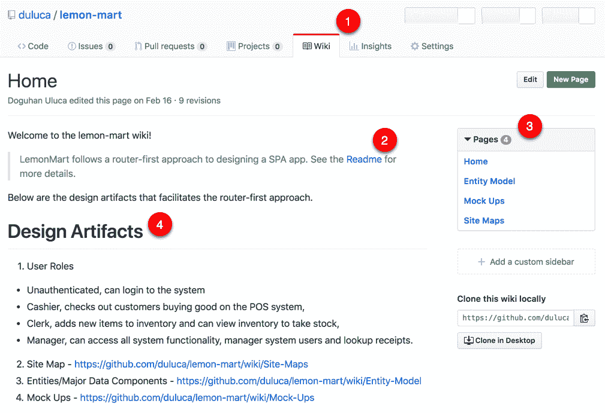
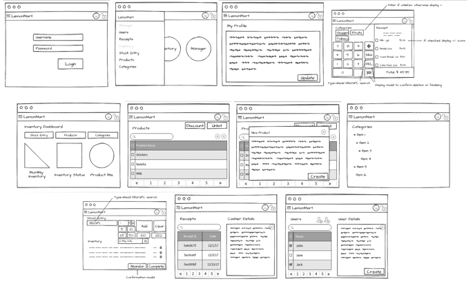
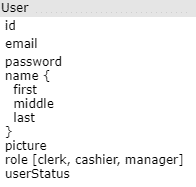
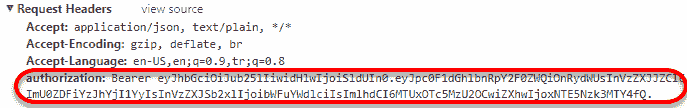
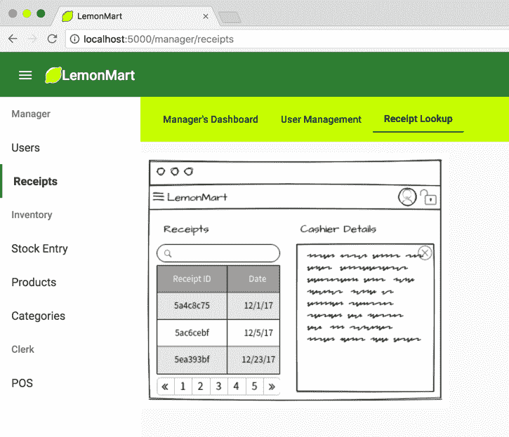
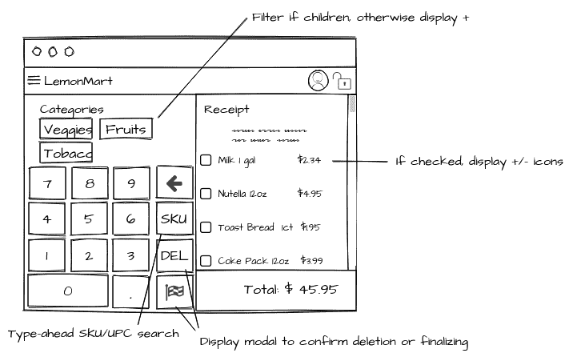

# 十四、设计认证和授权

设计一个高质量的身份验证和授权系统而不挫败最终用户是一个很难解决的问题。身份验证是验证用户身份的行为，授权指定用户访问资源的权限。这两个过程（简称 auth）必须无缝地协同工作，以满足具有不同角色、需求和作业功能的用户的需求。在今天的 web 中，用户对通过浏览器遇到的任何身份验证系统都有很高的期望基准，因此这是应用的一个非常重要的部分，可以在第一次就完全正确。

用户应该始终知道他们在应用中可以做什么和不能做什么。如果存在错误、故障或错误，应清楚地告知用户发生此类错误的原因。随着应用的增长，很容易错过触发错误条件的所有方式。您的实现应该易于扩展或维护，否则应用的这个基本主干将需要大量维护。在本章中，我们将介绍创建优秀的 auth-UX 和实现可靠的基线体验的各种挑战。

我们将通过实现 LemonMart 的身份验证和授权体验，继续采用路由优先的方法来设计 SPA。在[第 12 章](12.html)*创建路由一线业务 App*中，我们定义了用户角色，完成了所有主要路由的构建，完成了 LemonMart 的粗略行走骨架导航体验，因此我们做好了实施基于角色的路由以及拉动这种实现的细微差别的准备。

在[第 13 章](13.html)*持续集成和 API 设计*中，我们讨论了围绕主要数据组件进行设计的想法，因此您已经熟悉用户实体的外观，这将有助于实现基于令牌的登录体验，包括在实体内缓存角色信息。

在深入研究 auth 之前，我们将讨论在开始实现各种条件导航元素之前为应用完成高级实体模型的重要性，这些元素在设计阶段可能会发生重大变化。

在本章中，您将了解以下主题：

*   高级用户体验设计的重要性
*   基于令牌的身份验证
*   条件导航
*   侧导航栏
*   警报的可重用 UI 服务
*   缓存数据
*   JSON Web 令牌
*   Angular HTTP 拦截器
*   路由防护装置

# 包装实物模型

实物模型对于确定我们在整个应用中需要什么样的组件和用户控件非常重要。跨组件使用的任何用户控件或组件都需要在根级别定义，其他控件或组件的作用域为它们自己的模块。

我们已经确定了子模块，并为它们设计了登录页，以完成行走骨架。现在我们已经定义了主要的数据组件，我们可以完成应用其余部分的模型。在高水平设计屏幕时，请记住以下几点：

*   用户能否以尽可能少的导航完成其角色所需的常见任务？
*   用户能否通过屏幕上的可见元素轻松访问应用的所有信息和功能？
*   用户能否轻松搜索所需的数据？
*   一旦用户找到感兴趣的记录，他们可以轻松地深入查看详细记录或查看相关记录吗？
*   弹出式警报真的有必要吗？你知道用户不会读的，对吧？

请记住，没有一种正确的方法可以设计任何用户体验，这就是为什么在设计屏幕时，始终牢记模块化和可重用性。

在生成各种设计构件（如模型或设计决策）时，请注意将它们发布在所有团队成员都可以访问的 wiki 上：

1.  在 GitHub 上，切换到 Wiki 选项卡
2.  您可以在[Github.com/duluca/lemon-mart/wiki](https://github.com/duluca/lemon-mart/wiki)上查看我的示例 wiki，如图所示：



GitHub.com LemonMart Wiki

3.  创建 wiki 页面时，请确保在任何其他可用文档（如自述文件）之间进行交叉链接
4.  请注意，GitHub 在 wiki 的页面下显示子页面
5.  但是，另一个摘要是有帮助的，比如设计工件部分，因为有些人可能会错过右边的导航元素
6.  完成模型后，将其发布到 wiki 上

您可以在此处看到 wiki 的摘要视图：



Summary view of Lemon Mart mock-ups

7.  或者，将模型放在行走骨架应用中，以便测试人员能够更好地预见尚未开发的功能

模型完成后，我们现在可以通过身份验证和授权工作流继续实现 LemonMart。

# 设计身份验证和授权工作流

设计良好的身份验证工作流是无状态的，因此没有过期会话的概念。用户可以自由地从任意多个设备和选项卡同时或超时与您的无状态 REST API 交互。**JSON Web 令牌**（**JWT**实现基于分布式声明的身份验证，可以使用**进行数字签名或集成保护和/或加密报文认证码**（**MAC**）。这意味着一旦用户的身份通过验证（比如密码质询），他们就会收到一个编码的索赔单或令牌，然后可以使用该令牌向系统发出未来的请求，而无需重新验证用户的身份。服务器可以独立地验证此声明的有效性并处理请求，而无需事先知道是否与此用户进行了交互。因此，我们不必存储有关用户的会话信息，从而使我们的解决方案无状态，易于扩展。每个令牌将在预定义的时间段后过期，并且由于其分布式性质，它们不能被远程或单独撤销；但是，我们可以通过插入自定义帐户和用户角色状态检查来增强实时安全性，以确保经过身份验证的用户有权访问服务器端资源。

JSON Web Tokens implement IETF industry standard RFC7519, found at [https://tools.ietf.org/html/rfc7519](https://tools.ietf.org/html/rfc7519).

良好的授权工作流能够根据用户的角色进行有条件的导航，从而自动将用户带到最佳登录屏幕；它们不会显示不适合其角色的路由或元素，如果错误地尝试访问授权路径，则会阻止它们这样做。您必须记住，任何基于客户端角色的导航都只是为了方便，而不是为了安全。这意味着对服务器的每次调用都应该包含必要的头信息和安全令牌，以便服务器可以重新验证用户，独立验证其角色，然后才允许他们检索安全数据。客户端身份验证不可信，这就是为什么密码重置屏幕必须使用服务器端呈现技术构建，以便用户和服务器都可以验证目标用户是否与系统交互。

在以下部分中，我们将围绕用户数据实体设计一个功能齐全的 auth 工作流，如下所示：



User entity

# 添加身份验证服务

我们将首先创建一个具有真实和虚假登录提供者的身份验证服务：

1.  添加身份验证和授权服务：

```ts
$ npx ng g s auth -m app --flat false
```

2.  确保在`app.module`中提供服务：

```ts
src/app/app.module.ts
import { AuthService } from './auth/auth.service'
...  
providers: [AuthService],
```

为服务创建单独的文件夹将组织各种相关组件进行身份验证和授权，例如角色的`enum`定义。此外，我们还可以在同一个文件夹中添加一个`authService`伪代码，这对于编写单元测试至关重要。

3.  将用户角色定义为`enum`：

```ts
src/app/auth/role.enum.ts
export enum Role {
  None = 'none',
  Clerk = 'clerk',
  Cashier = 'cashier',
  Manager = 'manager',
}
```

# 实现基本的身份验证服务

现在，让我们构建一个本地身份验证服务，使我们能够基于身份验证状态和用户角色演示健壮的登录表单、缓存和条件导航概念：

1.  首先安装 JWT 解码库，对于伪造身份验证，安装 JWT 编码库：

```ts
$ npm install jwt-decode fake-jwt-sign
$ npm install -D @types/jwt-decode
```

2.  为`auth.service.ts`定义您的导入：

```ts
src/app/auth/auth.service.ts
import { HttpClient } from '@angular/common/http'
import { Injectable } from '@angular/core'

import { sign } from 'fake-jwt-sign' // For fakeAuthProvider only
import * as decode from 'jwt-decode'

import { BehaviorSubject, Observable, of, throwError as observableThrowError } from 'rxjs'
import { catchError, map } from 'rxjs/operators'

import { environment } from '../../environments/environment'
import { Role } from './role.enum'
...
```

3.  实现一个`IAuthStatus`接口存储解码后的用户信息，一个助手接口，默认安全`defaultAuthStatus`：

```ts
src/app/auth/auth.service.ts
...
export interface IAuthStatus {
  isAuthenticated: boolean
  userRole: Role
  userId: string
}

interface IServerAuthResponse {
  accessToken: string
}

const defaultAuthStatus = { isAuthenticated: false, userRole: Role.None, userId: null }
...
```

`IAuthUser`是一个代表典型 JWT 形状的接口，您可以从您的身份验证服务中收到该接口。它包含关于用户及其角色的最少信息，因此可以将其附加到服务器调用的`header`中，并选择性地缓存在`localStorage`中以记住用户的登录状态。在前面的实现中，我们假设默认角色为`Manager`。

4.  使用`BehaviorSubject`定义`AuthService`类，锚定用户当前`authStatus`，并在构造函数中配置`authProvider`可以处理`email`和`password`并返回`IServerAuthResponse`：

```ts
src/app/auth/auth.service.ts ...
@Injectable({
  providedIn: 'root'
})
export class AuthService {
   private readonly authProvider: (
    email: string,
    password: string
  ) => Observable<IServerAuthResponse>

  authStatus = new BehaviorSubject<IAuthStatus>(defaultAuthStatus)

  constructor(private httpClient: HttpClient) {
     // Fake login function to simulate roles
    this.authProvider = this.fakeAuthProvider
    // Example of a real login call to server-side
    // this.authProvider = this.exampleAuthProvider
  }
  ...
```

注意，`fakeAuthProvider`被配置为该服务的`authProvider`。真正的身份验证提供商可能类似于以下代码，其中用户的电子邮件和密码被发送到 POST 端点，该端点验证其信息，创建并返回 JWT 供我们的应用使用：

```ts
example
private exampleAuthProvider(
  email: string,
  password: string
): Observable<IServerAuthResponse> {
  return this.httpClient.post<IServerAuthResponse>(`${environment.baseUrl}/v1/login`, {
    email: email,
    password: password,
  })
}
```

这非常简单，因为繁重的工作是在服务器端完成的。也可以向第三方拨打此电话。

Note that the API version, `v1`, in the URL path is defined at the service and not as part of the `baseUrl`. This is because each API can change versions independently from each other. Login may remain `v1` for a long time, while other APIs may be upgraded to `v2`, `v3`, and such.

5.  实现一个模拟身份验证过程的`fakeAuthProvider`，包括动态创建一个假的 JWT：

```ts
src/app/auth/auth.service.ts
  ...
  private fakeAuthProvider(
    email: string,
    password: string
  ): Observable<IServerAuthResponse> {
    if (!email.toLowerCase().endsWith('@test.com')) {
      return observableThrowError('Failed to login! Email needs to end with @test.com.')
    }

    const authStatus = {
      isAuthenticated: true,
      userId: 'e4d1bc2ab25c',
      userRole: email.toLowerCase().includes('cashier')
        ? Role.Cashier
        : email.toLowerCase().includes('clerk')
          ? Role.Clerk
          : email.toLowerCase().includes('manager') ? Role.Manager : Role.None,
    } as IAuthStatus

    const authResponse = {
      accessToken: sign(authStatus, 'secret', {
        expiresIn: '1h',
        algorithm: 'none',
      }),
    } as IServerAuthResponse

    return of(authResponse)
  }
  ...
```

`fakeAuthProvider`在服务中实现了服务器端方法，因此您可以方便地在微调 auth 工作流的同时测试代码。它创建并签署了一个 JWT，带有临时的`fake-jwt-sign`库，这样我们也可以演示如何处理正确格式的 JWT。

Do not ship your Angular app with the `fake-jwt-sign` dependency, since it is meant to be server-side code.

6.  在我们继续之前，实现一个`transformError`函数来处理`common/common.ts`下可观察流中的混合`HttpErrorResponse`和字符串错误：

```ts
src/app/common/common.ts
import { HttpErrorResponse } from '@angular/common/http'
import { throwError } from 'rxjs'

export function transformError(error: HttpErrorResponse | string) {
  let errorMessage = 'An unknown error has occurred'
  if (typeof error === 'string') {
    errorMessage = error
  } else if (error.error instanceof ErrorEvent) {
    errorMessage = `Error! ${error.error.message}`
  } else if (error.status) {
    errorMessage = `Request failed with ${error.status} ${error.statusText}`
  }
  return throwError(errorMessage)
}
```

7.  实现将从`LoginComponent`调用的`login`函数，如下一节所示
8.  添加``import { transformError } from '../common/common'``

9.  还应实现相应的`logout`功能，该功能可通过顶部工具栏中的注销按钮调用，也可通过失败的登录尝试调用，或者如果在用户导航应用时路由身份验证卫士检测到未经授权的访问尝试，这是本章后面讨论的主题：

```ts
src/app/auth/auth.service.ts
  ...
  login(email: string, password: string): Observable<IAuthStatus> {
    this.logout()

    const loginResponse = this.authProvider(email, password).pipe(
      map(value => {
        return decode(value.accessToken) as IAuthStatus
      }),
      catchError(transformError)
    )

    loginResponse.subscribe(
      res => {
        this.authStatus.next(res)
      },
      err => {
        this.logout()
        return observableThrowError(err)
      }
    )

    return loginResponse
  }

  logout() {
    this.authStatus.next(defaultAuthStatus)
  }
}
```

`login`方法通过调用`logout`方法、使用`email`和`password`信息调用`authProvider`，并在必要时抛出错误来封装正确的操作顺序。

`login`方法遵循开放/封闭原则，从实体设计开始，通过我们向其外部提供不同的身份验证提供程序的能力对其进行扩展，但由于身份验证提供程序封装了功能上的差异，因此对修改仍然是封闭的。

在下一节中，我们将实现`LoginComponent`，以便用户可以输入用户名和密码信息并尝试登录。

# 实现登录组件

`login`组件利用我们刚刚创建的`authService`并使用反应式表单实现验证错误。登录组件的设计应该独立于任何其他组件，因为在路由事件期间，如果我们发现用户没有正确的身份验证或授权，我们会将他们导航到该组件。我们可以将此原始 URL 捕获为`redirectUrl`，这样，一旦用户成功登录，我们就可以将他们导航回该 URL。

1.  让我们从实现到`login`组件的路由开始：

```ts
src/app/app-routing.modules.ts
...
  { path: 'login', component: LoginComponent },
  { path: 'login/:redirectUrl', component: LoginComponent },
...
```

2.  现在实现组件本身：

```ts
src/app/login/login.component.ts
import { Component, OnInit } from '@angular/core'
import { FormBuilder, FormGroup, Validators, NgForm } from '@angular/forms'
import { AuthService } from '../auth/auth.service'
import { Role } from '../auth/role.enum'

@Component({
  selector: 'app-login',
  templateUrl: 'login.component.html',
  styles: [
    `
    .error {
        color: red
    }
    `,
    `
    div[fxLayout] {margin-top: 32px;}
    `,
  ],
})
export class LoginComponent implements OnInit {
  loginForm: FormGroup
  loginError = ''
  redirectUrl
  constructor(
    private formBuilder: FormBuilder,
    private authService: AuthService,
    private router: Router,
    private route: ActivatedRoute
  ) {
    route.paramMap.subscribe(params => (this.redirectUrl = params.get('redirectUrl')))
  }

  ngOnInit() {
    this.buildLoginForm()
  }

  buildLoginForm() {
    this.loginForm = this.formBuilder.group({
      email: ['', [Validators.required, Validators.email]],
      password: ['', [
        Validators.required,
        Validators.minLength(8),
        Validators.maxLength(50),
      ]],
    })
  }

  async login(submittedForm: FormGroup) {
    this.authService
      .login(submittedForm.value.email, submittedForm.value.password)
      .subscribe(authStatus => {
        if (authStatus.isAuthenticated) {
          this.router.navigate([this.redirectUrl || '/manager'])
        }
      }, error => (this.loginError = error))
  }
}
```

作为成功登录尝试的结果，我们利用路由将经过身份验证的用户导航到他们的配置文件。如果服务器通过服务发送错误，我们将该错误分配给`loginError`。

3.  下面是一个登录表单的实现，用于捕获和验证用户的`email`和`password`，如果存在任何服务器错误，则显示它们：

```ts
src/app/login/login.component.html
<div fxLayout="row" fxLayoutAlign="center">
  <mat-card fxFlex="400px">
    <mat-card-header>
      <mat-card-title>
        <div class="mat-headline">Hello, Lemonite!</div>
      </mat-card-title>
    </mat-card-header>
    <mat-card-content>
      <form [formGroup]="loginForm" (ngSubmit)="login(loginForm)" fxLayout="column">
        <div fxLayout="row" fxLayoutAlign="start center" fxLayoutGap="10px">
          <mat-icon>email</mat-icon>
          <mat-form-field fxFlex>
            <input matInput placeholder="E-mail" aria-label="E-mail" formControlName="email">
            <mat-error *ngIf="loginForm.get('email').hasError('required')">
              E-mail is required
            </mat-error>
            <mat-error *ngIf="loginForm.get('email').hasError('email')">
              E-mail is not valid
            </mat-error>
          </mat-form-field>
        </div>
        <div fxLayout="row" fxLayoutAlign="start center" fxLayoutGap="10px">
          <mat-icon matPrefix>vpn_key</mat-icon>
          <mat-form-field fxFlex>
            <input matInput placeholder="Password" aria-label="Password" type="password" formControlName="password">
            <mat-hint>Minimum 8 characters</mat-hint>
            <mat-error *ngIf="loginForm.get('password').hasError('required')">
              Password is required
            </mat-error>
            <mat-error *ngIf="loginForm.get('password').hasError('minlength')">
              Password is at least 8 characters long
            </mat-error>
            <mat-error *ngIf="loginForm.get('password').hasError('maxlength')">
              Password cannot be longer than 50 characters
            </mat-error>
          </mat-form-field>
        </div>
        <div fxLayout="row" class="margin-top">
          <div *ngIf="loginError" class="mat-caption error">{{loginError}}</div>
          <div class="flex-spacer"></div>
          <button mat-raised-button type="submit" color="primary" [disabled]="loginForm.invalid">Login</button>
        </div>
      </form>
    </mat-card-content>
  </mat-card>
</div>
```

The Login button is disabled until email and password meets client site validation rules. Additionally, `<mat-form-field>` will only display one `mat-error` at a time, unless you create more space for more errors, so be sure place your error conditions in the correct order.

完成`login`组件的实现后，现在可以更新主屏幕，有条件地显示或隐藏我们创建的新组件。

4.  更新`home.component`以在用户打开应用时显示登录：

```ts
src/app/home/home.component.ts

  template: `
    <div *ngIf="displayLogin">
      <app-login></app-login>
    </div>
    <div *ngIf="!displayLogin">
      <span class="mat-display-3">You get a lemon, you get a lemon, you get a lemon...</span>
    </div>
  `,

export class HomeComponent implements OnInit {
  displayLogin = true
  ...
```

Don't forget to import the requisite dependent modules for the code above in to your Angular application. It is intentionally left as an exercise for the reader to locate and import the missing modules. 

您的应用应类似于此屏幕截图：


LemonMart with login

考虑到用户的身份验证状态，在实现和显示/隐藏 sidenav 菜单、配置文件和注销图标方面还有一些工作要做。

# 条件导航

在创建无挫折的用户体验时，有条件的导航是必要的。通过选择性地显示用户可以访问的元素并隐藏他们不可以访问的元素，我们允许用户自信地浏览应用。

让我们从用户登录应用后隐藏登录组件开始：

1.  在`home`组件上，导入`home.component`中的`authService`
2.  将`authStatus`设置为名为`displayLogin`的局部变量：

```ts
src/app/home/home.component
...
import { AuthService } from '../auth/auth.service'
...
export class HomeComponent implements OnInit {
  private _displayLogin = true
  constructor(private authService: AuthService) {}

  ngOnInit() {
    this.authService.authStatus.subscribe(
      authStatus => (this._displayLogin = !authStatus.isAuthenticated)
    )
  }

  get displayLogin() {
    return this._displayLogin
  }
}
```

A property getter for `displayLogin` here is necessary, otherwise you may receive a Error: ExpressionChangedAfterItHasBeenCheckedError: Expression has changed after it was checked message. This error is a side effect of how the Angular component life-cycle and change detection works. This behavior may very well change in future Angular versions.

3.  在`app`组件上，订阅身份验证状态，并将当前值存储在名为`displayAccountIcons`的局部变量中：

```ts
src/app/app.component.ts

import { Component, OnInit } from '@angular/core'
import { AuthService } from './auth/auth.service'
...
export class AppComponent implements OnInit {
  displayAccountIcons = false
  constructor(..., private authService: AuthService) { 
  ...
  ngOnInit() {
    this.authService.authStatus.subscribe(
      authStatus => (this.displayAccountIcons = authStatus.isAuthenticated)
    )
  }
  ...
}
```

4.  使用`*ngIf`隐藏所有针对登录用户的按钮：

```ts
src/app/app.component.ts 
<button *ngIf="displayAccountIcons" ... >
```

现在，当用户注销时，您的工具栏应该看起来完全干净，没有按钮，如图所示：


LemonMart toolbar after log in

# 通用验证

在继续之前，我们需要对`loginForm`进行验证。当我们在[第 15 章](15.html)、*Angular App Design and Recipes*中实现更多表单时，您会意识到，在模板或反应式表单中重复输入表单验证会变得单调、快速。反应式表单的部分吸引力在于它是由代码驱动的，因此我们可以轻松地将验证提取到共享类、单元测试中，并重用它们：

1.  在`common`文件夹下创建一个`validations.ts`文件
2.  实施电子邮件和密码验证：

```ts
src/app/common/validations.ts
import { Validators } from '@angular/forms'

export const EmailValidation = [Validators.required, Validators.email]
export const PasswordValidation = [
  Validators.required,
  Validators.minLength(8),
  Validators.maxLength(50),
]
```

Depending on your password validation needs, you can use a `RegEx` pattern with the `Validations.pattern()` function to enforce password complexity rules or leverage the OWASP npm package, `owasp-password-strength-test`, to enable pass-phrases as well as set more flexible password requirements.

3.  使用新的验证更新`login`组件：

```ts
src/app/login/login.component.ts
import { EmailValidation, PasswordValidation } from '../common/validations'
  ...
     this.loginForm = this.formBuilder.group({
      email: ['', EmailValidation],
      password: ['', PasswordValidation],
    })
```

# 用户界面服务

当我们开始处理复杂的工作流（如 auth 工作流）时，能够以编程方式为用户显示 toast 通知非常重要。在其他情况下，我们可能希望在使用更具侵入性的弹出通知执行破坏性操作之前请求确认。

无论您使用什么组件库，只要显示一个快速通知，对同一个锅炉板重新编码都会变得单调乏味。UI 服务可以整洁地封装默认实现，也可以根据需要进行自定义：

1.  在`common`下新建`uiService`
2.  执行`showToast`功能：

```ts
src/app/common/ui.service.ts
import { Injectable, Component, Inject } from '@angular/core'
import {
  MatSnackBar,
  MatSnackBarConfig,
  MatDialog,
  MatDialogConfig,
} from '@angular/material'
import { Observable } from 'rxjs'

@Injectable()
export class UiService {
  constructor(private snackBar: MatSnackBar, private dialog: MatDialog) {}

  showToast(message: string, action = 'Close', config?: MatSnackBarConfig) {
    this.snackBar.open(
      message,
      action,
      config || {
        duration: 7000,
      }
    )
  }
...
}
```

对于 showDialog 函数，我们必须实现一个基本对话框组件：

1.  在`app.module`中提供的`common`文件夹下添加一个新的`simpleDialog`，带有内联模板和样式

```ts
app/common/simple-dialog/simple-dialog.component.ts
@Component({
  template: `
    <h2 mat-dialog-title>data.title</h2>
    <mat-dialog-content>
      <p>data.content</p>
    </mat-dialog-content>
    <mat-dialog-actions>
      <span class="flex-spacer"></span>
      <button mat-button mat-dialog-close *ngIf="data.cancelText">data.cancelText</button>
      <button mat-button mat-button-raised color="primary" [mat-dialog-close]="true"
        cdkFocusInitial>
        data.okText
      </button>
    </mat-dialog-actions>
  `,
})
export class SimpleDialogComponent {
  constructor(
    public dialogRef: MatDialogRef<SimpleDialogComponent, Boolean>,
    @Inject(MAT_DIALOG_DATA) public data: any
  ) {}
}
```

Note that `SimpleDialogComponent` should not have app selector like  `selector: 'app-simple-dialog'` since we only plan to use it with `UiService`. Remove this property from your component.

2.  然后执行`showDialog`功能，显示`SimpleDialogComponent`：

```ts
app/common/ui.service.ts
...
showDialog(
    title: string,
    content: string,
    okText = 'OK',
    cancelText?: string,
    customConfig?: MatDialogConfig
  ): Observable<Boolean> {
    const dialogRef = this.dialog.open(
      SimpleDialogComponent,
      customConfig || {
        width: '300px',
        data: { title: title, content: content, okText: okText, cancelText: cancelText },
      }
    )

    return dialogRef.afterClosed()
  }
}
```

`ShowDialog`返回一个`Observable<boolean>`，因此您可以根据用户的选择执行后续操作。点击确定返回`true`，取消返回`false`。

在`SimpleDialogComponent`中，使用`@Inject`，我们可以使用`showDialog`发送的所有变量来定制对话框的内容。

Don't forget to update `app.module.ts` and `material.module.ts` with the various dependencies that are being introduced.

3.  登录后更新`login`组件以显示 toast 消息：

```ts
src/app/login/login.component.ts
import { UiService } from '../common/ui.service'
...
constructor(... ,
    private uiService: UiService)
...
  .subscribe(authStatus => {
        if (authStatus.isAuthenticated) {
          this.uiService.showToast(`Welcome! Role: ${authStatus.userRole}`)
          ...
```

用户登录后将显示 toast 消息，如图所示：


Material Snack bar The `snackBar` will either take the full width of the screen or a portion depending on the size of the browser.

# 使用 cookie 和本地存储进行缓存

我们必须能够缓存已登录用户的身份验证状态。否则，每次刷新页面时，用户都必须执行登录例程。我们需要更新`AuthService`，使其保持身份验证状态。

存储数据有三种主要方式：

*   `cookie`
*   `localStorage`
*   `sessionStorage`

Cookie 不应用于存储安全数据，因为它们可能会被不良行为者嗅探或窃取。此外，Cookie 可以存储 4KB 的数据，并且可以设置为过期。

`localStorage`与`sessionStorage`相似。它们是受保护和隔离的浏览器端存储，允许为应用存储大量数据。两个商店都不能设置过期日期和时间。当浏览器窗口关闭时，删除`sessionStorage`值。这些值在页面重新加载和恢复后仍然有效。

JSON Web Tokens are encrypted, and they include a timestamp for expiration, in essence, countering the weaknesses of `cookie` and `localStorage`. Either option should be secure to use with JWTs.

让我们从实现一个缓存服务开始，该服务可以抽象出`AuthService`可以使用的缓存身份验证信息的方法：

1.  首先创建一个封装缓存方法的摘要`cacheService`：

```ts
src/app/auth/cache.service.ts
export abstract class CacheService {
  protected getItem<T>(key: string): T {
    const data = localStorage.getItem(key)
    if (data && data !== 'undefined') {
      return JSON.parse(data)
    }
    return null
  }

  protected setItem(key: string, data: object | string) {
    if (typeof data === 'string') {
      localStorage.setItem(key, data)
    }
    localStorage.setItem(key, JSON.stringify(data))
  }

  protected removeItem(key: string) {
    localStorage.removeItem(key)
  }

  protected clear() {
    localStorage.clear()
  }
}

```

该缓存服务基类可用于为任何服务提供缓存功能。这与创建集中缓存服务并将其注入另一个服务不同。通过避免集中的值存储，我们避免了各种服务之间的相互依赖。

2.  更新`AuthService`扩展`CacheService`并实现`authStatus`的缓存：

```ts
auth/auth.service
...
export class AuthService extends CacheService {
  authStatus = new BehaviorSubject<IAuthStatus>(
    this.getItem('authStatus') || defaultAuthStatus
  )

  constructor(private httpClient: HttpClient) {
    super()
    this.authStatus.subscribe(authStatus => this.setItem('authStatus', authStatus))
    ...
  }
  ...
}
```

这里演示的技术可用于持久化任何类型的数据，并有意利用 RxJS 事件来更新缓存。您可能会注意到，我们不需要更新登录函数来调用`setItem`，因为它已经调用了`this.authStatus.next`，我们只需点击数据流即可。这有助于保持无状态，并通过将函数彼此分离来避免副作用。

When initializing the `BehaviorSubject`, take care to handle the `undefined/null` case, when loading data from the cache and still provide a default implementation. You can implement your own custom cache expiration scheme in `setItem` and `getItem` functions or leverage a service created by a third party.

如果您正在寻找一个高安全性的应用，您可以选择只缓存 JWT 以确保额外的层安全性。在任何一种情况下，JWT 都应该单独缓存，因为令牌必须随每个请求一起发送到头中的服务器。了解基于令牌的身份验证是如何工作的，以避免泄露泄露机密，这一点很重要。在下一节中，我们将回顾 JWT 的生命周期，以提高您的理解。

# JSON Web 令牌生命周期

JSON Web 令牌使用加密令牌机制来补充无状态 REST API 体系结构，该机制允许对客户端发送的请求进行方便、分布式和高性能的身份验证和授权。基于令牌的身份验证方案有三个主要组件：

*   客户端，捕获登录信息并隐藏不允许的操作以获得良好的用户体验
*   服务器端，验证每个请求都经过身份验证并且具有适当的授权
*   身份验证服务，生成并验证加密令牌，独立验证来自数据存储的用户请求的身份验证和授权状态

安全系统假定在所述主要组件之间发送/接收的数据在传输过程中是加密的。这意味着您的 RESTAPI 必须使用正确配置的 SSL 证书托管，通过 HTTPS 为所有 API 调用提供服务，以便在客户端和服务器之间永远不会暴露用户凭据。类似地，任何数据库或第三方服务调用都应该通过 HTTPS 进行。此外，任何存储密码的数据存储都应该使用安全的单向散列算法，并具有良好的盐析实践。任何其他敏感用户信息都应使用安全的双向加密算法进行加密。遵循这种分层的安全方法至关重要，因为攻击者需要完成一项不太可能的壮举，即同时破坏所有实现的安全层，从而对您的业务造成有意义的损害。

下一个序列图突出显示了基于 JWT 的身份验证的生命周期：


Life-Cycle of JWT-based authentication

最初，用户通过提供用户名和密码登录。验证后，用户的身份验证状态和角色将加密到 JWT，并带有过期日期和时间，然后发送回浏览器。

您的 Angular（或任何其他 SPA）应用可以将此令牌安全地缓存在本地或会话存储中，这样用户就不会被迫在每次请求时登录，更糟糕的是，我们不会在浏览器中存储用户凭据。让我们更新身份验证服务，以便它可以缓存令牌。

1.  更新服务以能够设置、获取、解码和清除令牌，如图所示：

```ts
src/app/auth/auth.service.ts
...
  private setToken(jwt: string) {
    this.setItem('jwt', jwt)
  }

  private getDecodedToken(): IAuthStatus {
    return decode(this.getItem('jwt'))
  }

  getToken(): string {
    return this.getItem('jwt') || ''
  }

  private clearToken() {
    this.removeItem('jwt')
  }
```

2.  登录时调用`setToken`，注销时调用`clearToken`，如下所示：

```ts
src/app/auth/auth.service.ts
...
  login(email: string, password: string): Observable<IAuthStatus> {
    this.logout()

    const loginResponse = this.authProvider(email, password).pipe(
      map(value => {
        this.setToken(value.accessToken)
        return decode(value.accessToken) as IAuthStatus
      }),
      catchError(transformError)
    )
  ...
  logout() {
    this.clearToken()
    this.authStatus.next(defaultAuthStatus)
  }
```

每个后续请求都将在请求头中包含 JWT。您应该保护每个 API 以检查和验证接收到的令牌。例如，如果用户想要访问他们的配置文件，`AuthService`将验证令牌以检查用户是否经过身份验证，但需要进一步的数据库调用来检查用户是否也被授权查看数据。这确保了对用户访问系统的独立确认，并防止对未过期令牌的任何滥用。

如果一个经过身份验证的用户调用一个 API，而他们没有适当的授权，比如说如果一个职员想要访问所有用户的列表，那么`AuthService`将返回一个错误状态，客户端将收到一个 403 禁止响应，该响应将作为错误消息显示给用户。

用户可以使用过期的令牌发出请求；发生这种情况时，会向客户端发送 401 未经授权的响应。作为一种良好的用户体验实践，我们应该自动提示用户再次登录，并让他们在不丢失任何数据的情况下恢复其工作流。

总之，真正的安全性是通过健壮的服务器端实现来实现的，任何客户端实现在很大程度上都是为了围绕良好的安全实践实现良好的用户体验。

# HTTP 拦截器

实现 HTTP 拦截器，将 JWT 注入发送给用户的每个请求的头中，并通过请求用户登录来优雅地处理身份验证失败：

1.  在`auth`下创建`authHttpInterceptor`：

```ts
src/app/auth/auth-http-interceptor.ts
import {
  HttpEvent,
  HttpHandler,
  HttpInterceptor,
  HttpRequest,
} from '@angular/common/http'
import { Injectable } from '@angular/core'
import { Router } from '@angular/router'
import { Observable, throwError as observableThrowError } from 'rxjs'
import { catchError } from 'rxjs/operators'
import { AuthService } from './auth.service'

@Injectable()
export class AuthHttpInterceptor implements HttpInterceptor {
  constructor(private authService: AuthService, private router: Router) {}
  intercept(req: HttpRequest<any>, next: HttpHandler): Observable<HttpEvent<any>> {
    const jwt = this.authService.getToken()
    const authRequest = req.clone({ setHeaders: { authorization: `Bearer ${jwt}` } })
    return next.handle(authRequest).pipe(
      catchError((err, caught) => {
        if (err.status === 401) {
          this.router.navigate(['/user/login'], {
            queryParams: { redirectUrl: this.router.routerState.snapshot.url },
          })
        }

        return observableThrowError(err)
      })
    )
  }
}
```

注意，`AuthService`用于检索令牌，并且在 401 错误后为登录组件设置了`redirectUrl`。

2.  更新`app`模块以提供拦截器：

```ts
src/app/app.module.ts
 providers: [
    ...
    {
      provide: HTTP_INTERCEPTORS,
      useClass: AuthHttpInterceptor,
      multi: true,
    },
  ],
```

当应用获取`lemon.svg`文件时，您可以在 Chrome Dev Tools | Network（Chrome 开发工具网络）选项卡中观察拦截器的运行情况，如下所示：



Request header for lemon.svg

# 侧导航

启用“移动优先”工作流，并提供简单的导航机制，以快速跳转到所需的功能。使用身份验证服务，在给定用户当前角色的情况下，仅显示他们可以访问的功能的链接。我们将实施侧导航模型，如下所示：


Side navigation mock-up

让我们将侧导航的代码作为一个单独的组件来实现，以便更易于维护：

1.  在`app.module`中创建并声明`NavigationMenuComponent`

```ts
src/app/app.module.ts
@NgModule({
  declarations: [
    ...
    NavigationMenuComponent,
  ],
```

The side navigation isn't technically required until after a user is logged in. However, in order to be able to launch the side navigation menu from the toolbar, we need to be able to trigger it from `app.component`. Since this component will be simple, we will eagerly load it. To do this lazily, Angular does have a Dynamic Component Loader pattern, which has a high implementation overhead that will only make sense if multi-hundred kilobyte savings will be made.

`SideNav`将从工具栏触发，它附带一个`<mat-sidenav-container>`父容器，承载`SideNav`本身和应用的内容。因此，我们需要通过在`<mat-sidenav-content>`中放置`<router-outlet>`来呈现所有应用内容。

2.  导入`MatSidenavModule`和`MatListModule`到 material.module

```ts
src/app/material.module.ts
@NgModule({
  imports: [
    ...
    MatSidenavModule,
    MatListModule,
  ],
  exports: [
    ...
    MatSidenavModule,
    MatListModule,
  ]
```

3.  定义一些样式，以确保 web 应用将扩展以填充整个页面，并在桌面和移动场景中保持适当的滚动：

```ts
src/app/app.component.ts
styles: [
    `.app-container {
      display: flex;
      flex-direction: column;
      position: absolute;
      top: 0;
      bottom: 0;
      left: 0;
      right: 0;
    }
    .app-is-mobile .app-toolbar {
      position: fixed;
      z-index: 2;
    }
    .app-sidenav-container {
      flex: 1;
    }
    .app-is-mobile .app-sidenav-container {
      flex: 1 0 auto;
    },
    mat-sidenav {
      width: 200px;
    }
    `
  ],
```

4.  在`AppComponent`中导入`ObservableMedia`服务：

```ts
src/app/app.component.ts
constructor(
    ...
    public media: ObservableMedia
  ) {
  ...
}
```

5.  使用响应性`SideNav`更新模板，该模板将在手机中滑动内容或在桌面场景中将内容推到一边：

```ts
src/app/app.component.ts
...
template: `
  <div class="app-container">
    <mat-toolbar color="primary" fxLayoutGap="8px" class="app-toolbar"
      [class.app-is-mobile]="media.isActive('xs')">
      <button *ngIf="displayAccountIcons" mat-icon-button (click)="sidenav.toggle()">
        <mat-icon>menu</mat-icon>
      </button>
      <a mat-icon-button routerLink="/home">
        <mat-icon svgIcon="lemon"></mat-icon><span class="mat-h2">LemonMart</span>
      </a>
      <span class="flex-spacer"></span>
      <button *ngIf="displayAccountIcons" mat-mini-fab routerLink="/user/profile"
        matTooltip="Profile" aria-label="User Profile"><mat-icon>account_circle</mat-icon>
      </button>
      <button *ngIf="displayAccountIcons" mat-mini-fab routerLink="/user/logout"
        matTooltip="Logout" aria-label="Logout"><mat-icon>lock_open</mat-icon>
      </button>
    </mat-toolbar>
    <mat-sidenav-container class="app-sidenav-container"
                          [style.marginTop.px]="media.isActive('xs') ? 56 : 0">
      <mat-sidenav #sidenav [mode]="media.isActive('xs') ? 'over' : 'side'"
                  [fixedInViewport]="media.isActive('xs')" fixedTopGap="56">
        <app-navigation-menu></app-navigation-menu>
      </mat-sidenav>
      <mat-sidenav-content>
        <router-outlet class="app-container"></router-outlet>
      </mat-sidenav-content>
    </mat-sidenav-container>
  </div>
`,
```

The preceding template leverages Angular Flex Layout media observable for a responsive implementation that was injected earlier.

由于`SiveNav`中显示的链接长度可变，并遵循各种基于角色的业务规则，因此最好在单独的组件中实现。

6.  为`displayAccountIcons`和`setTimeout`实现一个属性 getter，这样可以避免类似`ExpressionChangedAfterItHasBeenCheckedError`的错误

```ts
src/app/app.component.ts export class AppComponent implements OnInit {
  _displayAccountIcons = false
  ...
  ngOnInit() {
    this.authService.authStatus.subscribe(authStatus => {
      setTimeout(() => {
        this._displayAccountIcons = authStatus.isAuthenticated
      }, 0)
    })
  }
```

```ts
  get displayAccountIcons() {
    return this._displayAccountIcons
  }
}
```

7.  在`NavigationMenuComponent`中实现导航链接：

```ts
src/app/navigation-menu/navigation-menu.component.ts
...
  styles: [
    `
    .active-link {
      font-weight: bold;
      border-left: 3px solid green;
    }
  `,
  ],
  template: `
    <mat-nav-list>
      <h3 matSubheader>Manager</h3>
      <a mat-list-item routerLinkActive="active-link" routerLink="/manager/users">Users</a>
      <a mat-list-item routerLinkActive="active-link" routerLink="/manager/receipts">Receipts</a>
      <h3 matSubheader>Inventory</h3>
      <a mat-list-item routerLinkActive="active-link" routerLink="/inventory/stockEntry">Stock Entry</a>
      <a mat-list-item routerLinkActive="active-link" routerLink="/inventory/products">Products</a>
      <a mat-list-item routerLinkActive="active-link" routerLink="/inventory/categories">Categories</a>
      <h3 matSubheader>Clerk</h3>
      <a mat-list-item routerLinkActive="active-link" routerLink="/pos">POS</a>
    </mat-nav-list>
  `,
...
```

`<mat-nav-list>`在功能上等同于`<mat-list>`，因此您可以使用该组件的文档进行布局。请注意此处经理、存货和职员的分标题：



Manager dashboard showing receipt lookup on desktop

`routerLinkActive="active-link"`高亮显示所选收货路线，如前一屏幕截图所示。

此外，您可以看到移动设备在外观和行为方面的差异，如下所示：


Manager dashboard showing receipt lookup on mobile

# 注销

现在我们正在缓存登录状态，我们需要实现注销体验：

1.  在`AuthService`中，实现`logout`功能：

```ts
src/app/auth/auth.service.ts
...
  logout() {
    this.clearToken()
    this.authStatus.next(defaultAuthStatus)
  }
```

2.  实施`logout`组件：

```ts
src/app/user/logout/logout.component.ts
import { Component, OnInit } from '@angular/core'
import { Router } from '@angular/router'
import { AuthService } from '../../auth/auth.service'

@Component({
  selector: 'app-logout',
  template: `
    <p>
      Logging out...
    </p>
  `,
  styles: [],
})
export class LogoutComponent implements OnInit {
  constructor(private router: Router, private authService: AuthService) {}

  ngOnInit() {
    this.authService.logout()
    this.router.navigate(['/'])
  }
}
```

正如您所注意到的，注销后，用户将被导航回主页。

# 登录后基于角色的路由

这是应用中最基本、最重要的部分。通过延迟加载，我们确保只加载最小数量的资产，以允许用户登录。

用户登录后，应根据其用户角色将其路由到相应的登录屏幕，这样他们就不会猜测需要如何使用应用。例如，出纳只需访问 POS 即可结帐客户，这样他们就可以自动转到该屏幕。

您可以找到 POS 屏幕的模型，如图所示：



Point-of-Sale screen mock-up Let's ensure that users get routed to the appropriate page after logging in by updating the `LoginComponent`:

1.  将`login`逻辑更新为每个角色的路由：

```ts
app/src/login/login.component.ts  

async login(submittedForm: FormGroup) {
    ...
    this.router.navigate([
      this.redirectUrl || this.homeRoutePerRole(authStatus.userRole)
    ])
    ...
  }

  homeRoutePerRole(role: Role) {
    switch (role) {
      case Role.Cashier:
        return '/pos' 
      case Role.Clerk:
        return '/inventory' 
      case Role.Manager:
        return '/manager' 
      default:
        return '/user/profile'
    }
  }
```

类似地，职员和经理也会被路由到他们的登录屏幕，以访问完成任务所需的功能，如前所示。由于我们实现了一个默认的管理员角色，相应的着陆体验将自动启动。硬币的另一面是有意或无意尝试访问用户不应该访问的路由。在下一节中，我们将了解路由防护，它可以帮助检查身份验证，甚至在呈现表单之前加载必要的数据。

# 路由防护装置

路由防护可以进一步解耦和重用逻辑，并更好地控制组件生命周期。

以下是您最有可能使用的四种主要防护装置：

1.  `CanActivate`和`CanActivateChild`，用于检查对路由的授权访问
2.  `CanDeactivate`，用于在驶离航线前请求许可
3.  `Resolve`，允许从路由参数预取数据
4.  `CanLoad`，允许在加载功能模块资产之前执行自定义逻辑

参考以下章节了解如何利用`CanActivate`和`CanLoad`。`Resolve`防护将在[第 15 章](15.html)、*Angular App Design and Recipes*中介绍。

# 授权守卫

Auth Guards 通过允许或禁止在加载功能模块或组件以及向服务器发出任何数据请求之前意外导航到该功能模块或组件来实现良好的 UX。

例如，当经理登录时，他们会自动路由到`/manager/home`路径。浏览器将缓存此 URL，职员意外导航到同一 URL 是完全合理的。Angular 不知道用户是否可以访问特定路径，并且在没有`AuthGuard`的情况下，它将愉快地呈现管理器的主页，并触发最终将失败的服务器请求。

Regardless of the robustness of your frontend implementation, every REST API you implement should be properly secured server-side. Let's update the router so that `ProfileComponent` can't be activated without an authenticated user and the `ManagerModule` won't load unless a manager is logging in using an `AuthGuard`:

1.  实施`AuthGuard`服务：

```ts
src/app/auth/auth-guard.service.ts
import { Injectable } from '@angular/core'
import {
  CanActivate,
  Router,
  ActivatedRouteSnapshot,
  RouterStateSnapshot,
  CanLoad,
  CanActivateChild,
} from '@angular/router'
import { AuthService, IAuthStatus } from './auth.service'
import { Observable } from 'rxjs'
import { Route } from '@angular/compiler/src/core'
import { Role } from './role.enum'
import { UiService } from '../common/ui.service'

@Injectable({
  providedIn: 'root'
})
export class AuthGuard implements CanActivate, CanActivateChild, CanLoad {
  protected currentAuthStatus: IAuthStatus
  constructor(
    protected authService: AuthService,
    protected router: Router,
    private uiService: UiService
  ) {
    this.authService.authStatus.subscribe(
      authStatus => (this.currentAuthStatus = authStatus)
    )
  }

  canLoad(route: Route): boolean | Observable<boolean> | Promise<boolean> {
    return this.checkLogin()
  }

  canActivate(
    route: ActivatedRouteSnapshot,
    state: RouterStateSnapshot
  ): boolean | Observable<boolean> | Promise<boolean> {
    return this.checkLogin(route)
  }

  canActivateChild(
    childRoute: ActivatedRouteSnapshot,
    state: RouterStateSnapshot
  ): boolean | Observable<boolean> | Promise<boolean> {
    return this.checkLogin(childRoute)
  }

  protected checkLogin(route?: ActivatedRouteSnapshot) {
    let roleMatch = true
    let params: any
    if (route) {
      const expectedRole = route.data.expectedRole

      if (expectedRole) {
        roleMatch = this.currentAuthStatus.userRole === expectedRole
      }

      if (roleMatch) {
        params = { redirectUrl: route.pathFromRoot.map(r => r.url).join('/') }
      }
    }

    if (!this.currentAuthStatus.isAuthenticated || !roleMatch) {
      this.showAlert(this.currentAuthStatus.isAuthenticated, roleMatch)

      this.router.navigate(['login', params  || {}])
      return false
    }

    return true
  }

  private showAlert(isAuth: boolean, roleMatch: boolean) {
    if (!isAuth) {
      this.uiService.showToast('You must login to continue')
    }

    if (!roleMatch) {
      this.uiService.showToast('You do not have the permissions to view this resource')
    }
  }
}
```

2.  使用`CanLoad`防护装置防止加载延迟加载的模块，如管理器模块：

```ts
src/app/app-routing.module.ts
...
  {
    path: 'manager',
    loadChildren: './manager/manager.module#ManagerModule',
    canLoad: [AuthGuard],
  },
...
```

在这种情况下，当加载`ManagerModule`时，在`canLoad`事件中会激活`AuthGuard`，并且`checkLogin`功能会验证用户的身份验证状态。如果防护返回`false`，模块将不会加载。此时，我们没有元数据来检查用户的角色。

3.  使用`CanActivate`防护装置防止单个组件激活，例如用户的`profile`：

```ts
user/user-routing.module.ts
...
{ path: 'profile', component: ProfileComponent, canActivate: [AuthGuard] },
...
```

在`user-routing.module`的情况下，`AuthGuard`在`canActivate`事件期间被激活，`checkLogin`功能控制该路线可以导航到哪里。由于用户正在查看自己的配置文件，因此无需在此处检查用户的角色。

4.  使用带有`expectedRole`属性的`CanActivate`或`CanActivateChild`来防止其他用户激活组件，例如`ManagerHomeComponent`：

```ts
mananger/manager-routing.module.ts
...
  {
    path: 'home',
    component: ManagerHomeComponent,
    canActivate: [AuthGuard],
    data: {
      expectedRole: Role.Manager,
    },
  },
 {
    path: 'users',
    component: UserManagementComponent,
    canActivate: [AuthGuard],
    data: {
      expectedRole: Role.Manager,
    },
  },
  {
    path: 'receipts',
    component: ReceiptLookupComponent,
    canActivate: [AuthGuard],
    data: {
      expectedRole: Role.Manager,
    },
  },
...
```

在`ManagerModule`中，我们可以验证用户是否有权访问特定的路由。我们可以通过在路由定义中定义一些元数据来实现这一点，比如`expectedRole`，它将通过`canActivate`事件传递到`checkLogin`函数中。如果用户已通过身份验证，但其角色与`Role.Manager`不匹配，`AuthGuard`将返回 false，并且将阻止导航。

5.  确保`AuthService`和`AuthGuard`都在`app.module`和`manager.module`中提供，因为它们都在两种上下文中使用

一如既往，在继续之前，确保所有测试都通过执行`npm test`和`npm run e2e`。

# 验证服务伪造和常见测试提供商

我们需要实现一个`AuthServiceFake`，以便我们的单元测试通过并使用一个类似于[第 12 章](12.html)*中提到的`commonTestingModules`的模式，创建一个路由第一业务线应用*，以便在我们的规范文件中方便地提供这个伪代码

为了确保我们的 fake 将具有与实际`AuthService`相同的公共功能和属性，让我们首先创建一个接口：

1.  将`IAuthService`添加到`auth.service.ts`

```ts
src/app/auth/auth.service.ts export interface IAuthService {
  authStatus: BehaviorSubject<IAuthStatus>
  login(email: string, password: string): Observable<IAuthStatus>
  logout()
  getToken(): string
}
```

2.  确保`AuthService`实现了接口
3.  导出`defaultAuthStatus`供再次使用

```ts
src/app/auth/auth.service.ts

export const defaultAuthStatus = {
  isAuthenticated: false,
  userRole: Role.None,
  userId: null,
}export class AuthService extends CacheService implements IAuthService 
```

现在，我们可以创建一个实现相同接口的 fake，但它提供的函数与任何外部身份验证系统都没有任何依赖关系。

1.  在`auth`下新建一个名为`auth.service.fake.ts`的文件：

```ts
src/app/auth/auth.service.fake.ts
import { Injectable } from '@angular/core'
import { BehaviorSubject, Observable, of } from 'rxjs'
import { IAuthService, IAuthStatus, defaultAuthStatus } from './auth.service'

@Injectable()
export class AuthServiceFake implements IAuthService {
  authStatus = new BehaviorSubject<IAuthStatus>(defaultAuthStatus)
  constructor() {}

  login(email: string, password: string): Observable<IAuthStatus> {
    return of(defaultAuthStatus)
  }

  logout() {}

  getToken(): string {
    return ''
  }
}
```

2.  用`commonTestingProviders`更新`common.testing.ts`：

```ts
src/app/common/common.testing.ts

export const commonTestingProviders: any[] = [
  { provide: AuthService, useClass: AuthServiceFake },
  UiService,
]
```

3.  观察`app.component.spec.ts`中伪码的使用情况：

```ts
src/app/app.component.spec.ts ...
  TestBed.configureTestingModule({
    imports: commonTestingModules,
    providers: commonTestingProviders.concat([
      { provide: ObservableMedia, useClass: ObservableMediaFake },
      ...
```

我们之前创建的空`commonTestingProviders`数组正在与特定于`app.component`的赝品连接，因此我们的新`AuthServiceFake`应该自动应用。

4.  更新`AuthGuard`的 spec 文件，如下所示：

```ts
src/app/auth/auth-guard.service.spec.ts ...
   TestBed.configureTestingModule({
      imports: commonTestingModules,
      providers: commonTestingProviders.concat(AuthGuard)
    })
```

5.  继续并将此技术应用于依赖于`AuthService`和`UiService`的所有规范文件
6.  值得注意的例外是在`auth.service.spec.ts`中，您*不*想使用假，因为`AuthService`是被测试的类，请确保它的配置如下所示：

```ts
src/app/auth/auth.service.spec.ts
...
  TestBed.configureTestingModule({
    imports: [HttpClientTestingModule],
    providers: [AuthService, UiService],
  })
```

7.  此外，`SimpleDialogComponent`测试需要剔除一些外部依赖项，如：

```ts
src/app/common/simple-dialog/simple-dialog.component.spec.ts
  ...
    providers: [{
      provide: MatDialogRef,
      useValue: {}
    }, {
      provide: MAT_DIALOG_DATA,
      useValue: {} // Add any data you wish to test if it is passed/used correctly
    }],
  ...
```

记住，在你所有的测试都通过之前不要继续！

# 总结

您现在应该熟悉如何创建高质量的身份验证和授权体验。我们首先回顾了完成和记录整个应用的高级用户体验设计的重要性，以便我们能够正确地设计一个良好的有条件导航体验。我们创建了一个可重用的 UI 服务，这样我们就可以方便地将警报注入到应用的流控制逻辑中。

我们介绍了基于令牌的身份验证和 JWTs 的基本原理，这样您就不会泄露任何关键的用户信息。我们了解到缓存和 HTTP 拦截器是必要的，这样用户就不必在每个请求中输入登录信息。最后，我们讨论了防止用户在未经授权的屏幕上绊倒的路由防护，并重申了应用的真正安全性应该在服务器端实现的观点。

在下一章中，我们将浏览一个全面的 Angular 秘籍列表，以完成我们的业务线应用 LemonMart 的实现。