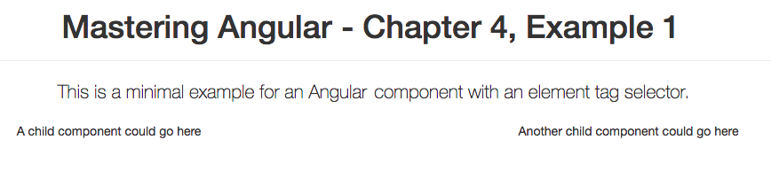
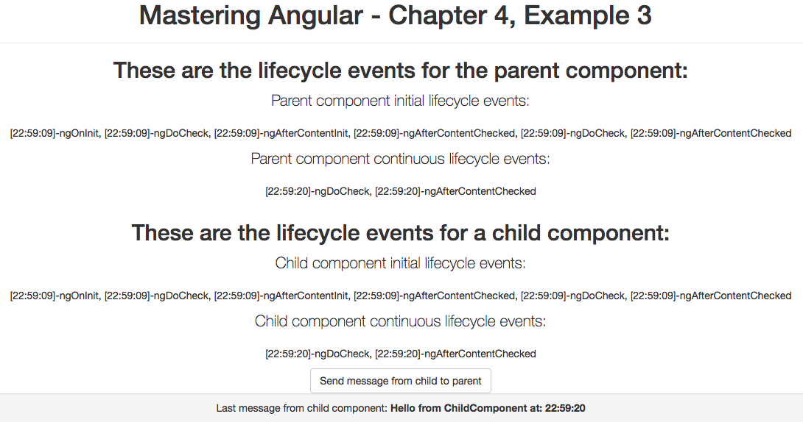

# 四、使用组件


在本章中，我们将讨论使用 Angular 组件的不同技术和策略：

*   初始化和配置组件
*   带构件的建筑
*   组件生命周期
*   在组件之间共享数据和通信

本章假设读者具备 JavaScript 和 TypeScript 编程基础知识以及 web 开发的一般知识，并熟悉本书中[第 1 章](01.html)*、**架构概述以及在*Angular 构建简单应用的内容。本章中的所有示例都使用 TypeScript，也可以在 GitHub 上的[上找到 https://github.com/popalexandruvasile/mastering-angular2/tree/master/Chapter4](https://github.com/popalexandruvasile/mastering-angular2/tree/master/Chapter4) 。

A telling sign of a successful open source project is excellent documentation, and Angular is no exception to this rule. I strongly recommend reading through all the available documentation from [https://angular.io/](https://angular.io/) and following the examples available there as well. As a general rule, all the examples from this chapter follow the format and conventions from the official documentation, and I have used a simplified version of the Angular example seed from [https://github.com/angular/quickstart](https://github.com/angular/quickstart) as an example. If you want to experiment or play with your own Angular creations, you can use the contents of the `Example1` folder from the code for this chapter as a starting point.


# 组件 101


组件是 Angular 应用的构建块，任何此类应用都需要至少定义一个称为根组件的组件，然后才能执行。


# 基本根组件


Angular 将组件定义为一个类，该类具有特定元数据，该元数据将其与 HTML 模板和类似 jQuery 的 HTML DOM 选择器相关联：

*   组件模板可以绑定到属于组件类的任何属性或函数
*   组件选择器（类似于 jQuery 选择器）可以以定义组件插入点的元素标记、属性或样式类为目标

当在 Angular 应用中执行时，组件通常会在特定页面位置呈现 HTML 片段，该页面位置可以响应用户输入并显示动态数据。

组件元数据以 TypeScript 装饰器的形式表示，并支持本章示例中将介绍的其他配置。

`TypeScript` decorators are covered in [Chapter 1](01.html), *Architectural Overview and Building a Simple App in Angular*. They are essential for understanding how components are configured, and they are currently proposed to become part of the JavaScript specification (ECMAScript).

本章中的第一个示例适用于同时也是根组件的基本组件（任何 Angular 应用都需要至少一个根组件来初始化其组件树）：

```ts
import { Component } from '@angular/core'; 
@Component({ 
    selector: 'my-app', 
    template: ` 
    <div class="container text-center"> 
      <div class="row"> 
        <div class="col-md-12"> 
          <div class="page-header"> 
            <h1>{{title}}</h1> 
          </div> 
          <p class="lead">{{description}}</p> 
        </div> 
      </div> 
      <div class="row"> 
        <div class="col-md-6"> 
          <p>A child component could go here</p> 
        </div> 
        <div class="col-md-6"> 
          <p>Another child component could go here</p> 
        </div> 
      </div>           
    </div>     
    ` 
}) 
export class AppComponent {  
  title: string; 
  description: string; 
  constructor(){ 
    this.title = 'Mastering Angular - Chapter 4, Example 1'; 
    this.description = 'This is a minimal example for an Angular 2   
    component with an element tag selector.'; 
  } 
} 

```

组件模板依赖于 Bootstrap 前端设计框架（[http://getbootstrap.com/](http://getbootstrap.com/) ），并绑定到组件类的属性以检索其显示的部分文本。它包含从组件类的属性中插入数据的模板表达式，例如`{{title}}`。

根组件使用内联模板（模板内容与其组件位于同一文件中）和元素选择器，该选择器将在`index.html`页面中呈现组件模板，替换突出显示的文本：

```ts
<!DOCTYPE html> 
<html> 
  <head> 
    <title>Mastering Angular example</title> 
    ... 
  </head> 
  <body> 
    <my-app>Loading...</my-app> 
  </body> 
</html>    

```

要查看正在运行的示例，可以从本章的源代码中运行`Example1`文件夹中的以下命令行：

```ts
npm run start  

```

您可以在下一个屏幕截图中查看渲染组件：



Angular 应用至少需要一个根模块，在`main.ts`文件中，我们正在 Bootstrap 此模块作为示例：

```ts
import { platformBrowserDynamic } from '@angular/platform-browser-dynamic'; 
import { AppModule } from './app.module'; 
platformBrowserDynamic().bootstrapModule(AppModule);  

```

我们使用`app.module.ts`模块文件定义应用根模块：

```ts
import { NgModule } from '@angular/core'; 
import { BrowserModule } from '@angular/platform-browser'; 
import { AppComponent } from './app.component'; 
@NgModule({ 
  imports:      [ BrowserModule ], 
  declarations: [ AppComponent ], 
  bootstrap:    [ AppComponent ] 
}) 
export class AppModule { } 

```

模块可以使用`imports`属性导入其他模块，并且模块可以在`bootstrap`属性下定义一个或多个根组件。每个这样的根组件将初始化自己的组件树，在我们的示例中，它只包含一个组件。在模块中使用之前，需要在`declarations`属性中添加任何组件、指令或管道。


# 定义子组件


虽然根组件表示 Angular 应用的容器，但您还需要根组件的直接或间接后代的其他组件。渲染根组件时，它还将渲染其所有子组件。

这些子组件可以从其父组件接收数据，也可以将数据发送回。让我们在前一个更复杂的示例中查看其中一些概念。注意，在`Example1`中，我们建议在根组件模板中插入子组件；其中一个子组件的定义如下：

```ts
import { Component, Input, Output, EventEmitter } from '@angular/core'; 
@Component({ 
    selector: 'div[my-child-comp]', 
    template: ` 
        <p>{{myText}}</p> 
        <button class="btn btn-default" type="button" (click)="onClick()">Send message</button>` 
}) 
export class ChildComponent {  
  private static instanceCount: number = 0; 
  instanceId: number; 
  @Input() myText: string; 
  @Output() onChildMessage = new EventEmitter<string>();   
  constructor(){ 
    ChildComponent.instanceCount += 1; 
    this.instanceId = ChildComponent.instanceCount; 
  } 
  onClick(){ 
    this.onChildMessage.emit(`Hello from ChildComponent with instance  
    id: ${this.instanceId}`); 
  } 
} 

```

第一个高亮显示的代码段显示了使用自定义元素属性而不是自定义元素标记的组件选择器。在使用现有的 CSS 样式和 HTML 标记时，通常需要确保 Angular 组件自然地与其上下文外观集成。这就是属性或 CSS 选择器被证明非常有用的地方。

乍一看，该组件类结构与[T0]中的组件类结构有些相似——除了第二个突出显示的代码段中的两个新装饰器。第一个修饰符是`@Input()`，它应该应用于任何可以从父组件接收数据的组件属性。第二个 decorator 是`@Output()`，它应该应用于任何可以向父组件发送数据的属性。Angular 2 定义了一个`EventEmitter`类，该类使用与 Node.js`EventEmitter`或 jQuery 事件类似的方法来帮助生成和使用事件。在`onClick()`方法中生成`string`类型的输出事件，任何父组件都可以订阅此事件以从子组件接收数据。

The EventEmitter class extends the RxJS Subject class, which in turn is a special type of RxJS Observable that allows multicasting. Further details about observables, subscribers, and other reactive programming concepts can be found in [Chapter 7](07.html), *Asynchronous Programming Using Observables*.

我们利用 TypeScript 中的`static`类属性来生成唯一的实例标识符`instanceId`，该标识符用于子组件通过`onChildMessage`输出属性发送的消息中。我们将使用此消息来明确每个子组件实例向其订阅者发送一条唯一的消息，这是我们示例中的`AppComponent`根组件：

```ts
@Component({ 
    selector: 'div.container.my-app', 
    template: ` 
    <div class="container text-center"> 
      <div class="row"><div class="col-md-12"> 
          <div class="page-header"><h1>{{title}}</h1></div> 
          <p class="lead">{{description}}</p> 
      </div></div> 
      <div class="row"> 
        <div class="col-md-6" my-child-comp myText="A child component 
 goes here" (onChildMessage)="onChildMessageReceived($event)"> 
 </div>       
        <div class="col-md-6" my-child-comp 
 [myText]="secondComponentText" 
 (onChildMessage)="onChildMessageReceived($event)"></div>          
        </div> 
      <div class="row"><div class="col-md-12"><div class="well well-
       sm">          
            <p>Last message from child components: <strong> 
               {{lastMessage}}</strong>
            </p> 
           </div></div></div>           
    </div> 
}) 
export class AppComponent {  
  title: string; 
  description: string; 
  secondComponentText: string; 
  lastMessage: string; 
  constructor(){ 
    this.title = 'Mastering Angular - Chapter 4, Example 2'; 
    this.description = 'This is an example for an Angular 2 root   
    component with an element and class selector and a child component 
    with an element attribute selector.'; 
    this.secondComponentText = 'Another child component goes here'; 
  } 

  onChildMessageReceived($event: string) 
  { 
    this.lastMessage = $event; 
  } 
} 

```

突出显示的代码显示了根组件如何引用和绑定`ChildComponent`元素。`onChildMessage`输出属性绑定到`AppComponent`方法，使用与 Angular 2 绑定本机 HTML DOM 事件相同的括号表示法；例如，`<button (click)="onClick($event)">`。

输入属性仅被分配给第一个`ChildComponent`实例的静态值，并通过括号符号绑定到`AppComponentsecondComponentText`属性。当我们简单地分配固定值时，不需要括号符号，Angular 2 在绑定到本机 HTML 元素属性时也使用括号符号；例如，[T2]。

If you are not yet familiar with how Angular binds to a native HTML element properties and events, you can refer to [Chapter 6](06.html), *Creating Directives and Implementing Change Detection*, for further reference.

对于这两个`ChildComponent`实例，我们使用相同的`AppComponentonChildMessageReceived`方法，使用简单的事件处理方法绑定`onChildMessage`事件，该方法将在应用页面上显示最后一个子组件消息。根组件选择器被更改为使用元素标记和 CSS 类选择器，这种方法产生了一个结构更简单的`index.html`文件。

我们必须修改`AppModule`定义，以确保`AppComponent`和同一模块中的任何其他组件都可以引用`ChildComponent`：

```ts
@NgModule({ 
  imports:      [ BrowserModule ], 
  declarations: [ AppComponent, ChildComponent ], 
  bootstrap:    [ AppComponent ] 
}) 
export class AppModule { } 

```

您可以在本章代码的`Example2`文件夹中找到此示例。这里所涉及的概念，如组件属性和事件、组件数据流和组件组合，对于构建相对复杂的应用有很大帮助，我们将在本章中进一步探讨这些概念。

Alongside components, Angular has the concept of directives, which can also be found in Angular 1\. Each Angular component is also a directive, and we can roughly define a directive as a component without any template. The `@Component` decorator interface extends the `@Directive` decorator interface, and we will discuss more about directives in [Chapter 6](06.html), *Creating Directives and Implementing Change Detection*.


# 组件生命周期


Angular 渲染的每个组件都有自己的生命周期：初始化、检查更改和销毁（以及其他事件）。Angular 提供了一种`hook`方法，我们可以在其中插入应用代码以参与组件生命周期。这些方法可通过 TypeScript 函数接口获得，该接口可由组件类选择性地实现，如下所示：

*   `ngOnChanges`：在`ngOnInit`之前初始化数据绑定组件属性，每次更改数据绑定组件属性时调用。它也是指令生命周期的一部分（惯例是接口实现功能名称在接口名称中添加了`ng`前缀；例如`ngOnInit`和`OnInit`。
*   `ngOnInit`：在第一个`ngOnChanges`之后，当数据绑定组件属性和输入属性都初始化时调用一次。它也是指令生命周期的一部分。
*   `ngDoCheck`：这是 Angular 变化检测过程的一部分，应用于执行自定义变化检测逻辑。它也是指令生命周期的一部分。
*   `ngAfterContentInit`：在第一次调用`ngDoCheck`后，组件模板完全初始化时调用一次。
*   `ngAfterContentChecked`：在`ngAfterContentInit`之后和每次`ngDoCheck`调用之后，在验证组件内容时调用一次。
*   `ngAfterViewInit`：在第一个`ngAfterContentChecked`之后，在初始化所有组件视图及其子视图时调用一次。
*   `ngAfterViewChecked`：在`ngAfterViewInit`之后和每次`ngAfterContentChecked`调用之后，当验证所有组件视图及其子视图时，调用一次。
*   `ngOnDestroy`：组件即将销毁时调用，用于清理操作；例如，取消订阅可观察对象和从事件中分离。

我们将修改前面的示例以展示其中一些生命周期`hooks`，并且我们将使用一个父组件和一个子组件来显示或将其所有生命周期事件记录到控制台。根据以下屏幕截图，在组件完全加载之前触发的事件将与初始加载后发生的事件分开显示/记录：



父组件的代码与子组件的代码非常相似，子组件有一个按钮，可以根据需要向父组件发送消息。发送消息时，`child`组件和父组件都会响应由 Angular 的变更检测机制生成的生命周期事件。您可以在本章源代码的`Example3`文件夹中找到的`child.component.ts`文件中看到子组件的代码：

```ts
import {Component, Input, Output, EventEmitter, OnInit, OnChanges, DoCheck, AfterContentInit, AfterContentChecked, AfterViewInit, AfterViewChecked} from '@angular/core'; 
@Component({ 
  selector: 'div[my-child-comp]', 
  template: ` 
  <h2>These are the lifecycle events for a child component:</h2> 
  <p class="lead">Child component initial lifecycle events:</p> 
  <p>{{initialChildEvents}}</p> 
  <p class="lead">Child component continuous lifecycle events:</p> 
  <p>{{continuousChildEvents}}</p> 
  <button class="btn btn-default" type="button" (click)="onClick()">Send message from child to parent</button>` 
}) 
export class ChildComponent implements OnInit, OnChanges, DoCheck, AfterContentInit, AfterContentChecked, AfterViewInit, AfterViewChecked { 
  initialChildEvents: string[]; 
  continuousChildEvents: string[]; 
  @Output() onChildMessage = new EventEmitter<string>(); 
  private hasInitialLifecycleFinished: boolean = false; 
  private ngAfterViewCheckedEventCount: number = 0; 
  constructor() { 
    this.initialChildEvents = []; 
    this.continuousChildEvents = []; 
  } 
  private logEvent(message: string) { 
        if (!this.hasInitialLifecycleFinished) { 
            this.initialChildEvents.push(message); 
        } else { 
            this.continuousChildEvents.push(message); 
        } 
    } 
  ngOnChanges(): void { 
    this.logEvent(` [${new Date().toLocaleTimeString()}]-ngOnChanges`); 
  } 
  ngOnInit(): void { 
    this.logEvent(` [${new Date().toLocaleTimeString()}]-ngOnInit`); 
  } 
  ngDoCheck(): void { 
    this.logEvent(` [${new Date().toLocaleTimeString()}]-ngDoCheck`); 
  } 
  ngAfterContentInit(): void { 
    this.logEvent(` [${new Date().toLocaleTimeString()}]-
    ngAfterContentInit`); 
  } 
  ngAfterContentChecked(): void { 
    this.logEvent(` [${new Date().toLocaleTimeString()}]-
    ngAfterContentChecked`); 
  } 
  ngAfterViewInit(): void { 
    console.log(`child: [${new Date().toLocaleTimeString()}]-
    ngAfterViewInit`); 
  } 
  ngAfterViewChecked(): void { 
    this.ngAfterViewCheckedEventCount += 1; 
    if (this.ngAfterViewCheckedEventCount === 2) { 
      this.hasInitialLifecycleFinished = true; 
    } 
    console.log(`child: [${new Date().toLocaleTimeString()}]-
    ngAfterViewChecked`); 
  } 
  onClick() { 
    this.onChildMessage.emit(`Hello from ChildComponent at: ${new 
    Date().toLocaleTimeString()}`); 
  } 
} 

```

所有以`ng`开头的方法都是组件生命周期挂钩，触发时，大多数方法都会记录存储在组件中并通过数据绑定显示的事件（请参阅前面代码列表中突出显示的代码片段）。两个生命周期挂钩--`ngAfterViewInit`和`ngAfterViewChecked`--将事件记录到控制台，而不是将它们存储为组件数据，因为组件生命周期中该点组件状态的任何更改都将在应用中生成异常。例如，我们将`ngAfterViewInit`方法主体更改为：

```ts
ngAfterViewInit(): void { 
    this.logEvent(` [${new Date().toLocaleTimeString()}]-
    ngAfterViewInit); 
} 

```

如果查看应用页面浏览器控制台，则在进行更改后应会看到以下错误消息：

表达式在选中后已更改。

在示例的初始运行中，在任何用户交互之前，每个组件已经触发了两次`ngDoCheck`和`ngAfterContentChecked`方法（如果您查看浏览器控制台输出，则触发`ngAfterViewChecked`。此外，每次我们按下示例按钮，都会触发相同的三种方法，每个组件触发一次。实际上，除了`ngOnChanges`、`ngOnInit`和`ngAfterViewInit`之外，您可能很少使用这些生命周期挂钩，除非您正在编写更高级的组件或组件库。我们将在[第 6 章](06.html)*创建指令和实施变更检测*中重新讨论这些核心生命周期挂钩，因为它们在表单和其他交互组件的上下文中非常有用。


# 在组件之间通信和共享数据


我们已经使用了最简单的方式在组件之间通信和共享数据：`Input`和`Output`装饰器。用`Input`装饰符修饰的属性通过传递数据来初始化组件，`Output`装饰符可用于分配事件监听器，这些监听器将从组件接收数据。从本章源代码的`Example2`文件夹中可以看到这种方法。


# 从父组件引用子组件


我们可以使用模板引用变量或通过`ViewChild`和`ViewChildren`属性修饰符将目标组件注入父组件，从而绕过对组件属性和事件的声明性绑定。在这两种场景中，我们都获得了对目标组件的引用，并且可以通过编程方式分配其属性或调用其方法。为了实际演示这些功能，我们将稍微修改`Example2`中的`ChildComponent`类，并确保`myText`属性具有默认文本集。这可以在本章源代码的`Example4`文件夹中找到的`child.component.ts`文件中突出显示的代码片段中看到：

```ts
... 
export class ChildComponent {  
  private static instanceCount: number = 0;  
  instanceId: number; 
  @Input() myText: string; 
  @Output() onChildMessage = new EventEmitter<string>(); 

  constructor(){ 
    ChildComponent.instanceCount += 1; 
    this.instanceId = ChildComponent.instanceCount; 
    this.myText = 'This is the default child component text.'; 
  } 

  onClick(){ 
    this.onChildMessage.emit(`Hello from ChildComponent with instance 
    id: ${this.instanceId}`); 
  } 
} 

```

然后我们将更改`app.component.ts`文件，以包括第一个子组件的模板参考方法和第二个子组件的组件注入方法：

```ts
import { Component, ViewChildren, OnInit, QueryList } from '@angular/core'; 
import { ChildComponent } from './child.component'; 
@Component({ 
    selector: 'div.container.my-app', 
    template: ` 
    <div class="container text-center"> 
      <div class="row"><div class="col-md-12"> 
          <div class="page-header"><h1>{{title}}</h1></div> 
          <p class="lead">{{description}}</p>           
      </div></div> 
      <div class="row"> 
        <div class="col-md-6"> 
          <button class="btn btn-default" type="button" 
 (click)="firstChildComponent.myText='First child component 
 goes here.'">Set first child component text</button> 
          <button class="btn btn-default" type="button" 
 (click)="firstChildComponent.onChildMessage.subscribe(onFirstChildComp
 onentMessageReceived)">Set first child component message 
 output</button> 
         </div>       
         <div class="col-md-6"> 
        <button class="btn btn-default" type="button" 
 (click)="setSecondChildComponentProperties()">Set second 
 child component properties</button> 
         </div>          
         </div>       
      <div class="row"> 
      <div class="col-md-6 well well-sm" my-child-comp 
 #firstChildComponent></div>       
        <div class="col-md-6 well well-sm" my-child-comp 
 id="secondChildComponent"></div>       
      </div> 
      <div class="row"><div class="col-md-12"><div class="well well-
      sm">          
            <p>Last message from child components: <strong>
            {{lastMessage}}</strong></p> 
      </div></div></div>           
    </div>` 
}) 
export class AppComponent {  
  title: string; 
  description: string; 
  lastMessage: string; 
  @ViewChildren(ChildComponent) childComponents: 
  QueryList<ChildComponent>; 
  constructor(){ 
    this.title = 'Mastering Angular - Chapter 4, Example 4'; 
    this.description = 'This is an example for how to reference 
    existing components from a parent component.'; 
    this.lastMessage = 'Waiting for child messages ...'; 
  } 
  onFirstChildComponentMessageReceived($event: string) 
  { 
    alert($event); 
  }   
  setSecondChildComponentProperties(){     
    this.childComponents.last.myText = "The second child component goes 
    here."; 
    this.childComponents.last.onChildMessage.subscribe( (message: 
    string) => {  
      this.lastMessage = message + ' (the message will be reset in 2 
      seconds)'; 
      setTimeout( ()=>{ this.lastMessage = 'Waiting for child messages 
      ...';}, 2000); 
    }); 
  } 
} 

```

首先，第三个突出显示的 HTML 代码段中的两个子组件没有任何属性或事件绑定。第一个子组件有一个`#firstChildComponent`属性，表示模板引用变量。


# 模板引用变量


可以在 Angular 模板中针对任何组件、指令或 DOM 元素设置模板引用变量，并使引用可用于当前模板。在上例中第一个突出显示的 HTML 片段中，我们有两个按钮，它们使用内联 Angular 表达式设置`myText`属性，并通过`firstChildComponent`模板引用变量绑定到`onChildMessage`事件。在运行该示例时，如果单击 Set first child component 文本按钮，然后单击 Set first child component message output 按钮，我们将直接通过模板引用变量操纵第一个子组件，如前面示例中第一个高亮显示的 HTML 片段所示。这种方法适合于初始化和读取组件属性，但当我们需要绑定到组件事件时，它会变得很麻烦。

A template reference variable cannot be accessed in a component class; hence, the contrived way we have is to bind to the first child component event. However, this type of variable will prove very useful when working with forms, and we will revisit them in [Chapter 6](06.html), *Creating Directives and Implementing Change Detection*.


# 注射子组件


对于第二个子组件，我们使用了一种基于通过`app.component.ts`文件中的此属性声明注入组件的技术：

```ts
@ViewChildren(ChildComponent) childComponents: QueryList<ChildComponent>; 

```

`ViewChildren`装饰器使用`ChildComponent`类型的选择器，该选择器将识别父组件模板中的所有`ChildComponent`实例并将其收集到`QueryList`类型的专用列表中。此列表允许迭代子组件实例，我们可以使用`AppComponent. setSecondChildComponentProperties()`方法中的`QueryList.Last()`调用获取第二个子组件的引用。运行本章源代码的`Example4`文件夹中的代码时，如果单击“设置第二个子组件属性”按钮，则上一个代码列表中的第二个 HTML 片段将立即生效。

注入子组件是一种通用技术，我们可以以更高效的方式从父组件代码访问引用的组件。


# 将服务与组件一起使用


我们现在将再次进化`Example2`并将在组件级别定义的一些代码重构为 Angular 服务。

服务是一个 TypeScript 类，它有一个名为`Injectable`的修饰符，没有任何参数，允许服务成为 Angular 2 中依赖注入（DI）机制的一部分。DI 将确保每个应用只创建一个服务实例，并且该实例将被注入任何在构造函数声明中将其声明为依赖项的类中。除了特定的 decorator 之外，服务通常需要在模块定义中声明为提供者，但也可以在组件、指令或管道定义中声明。在开始本节的示例之前，您可以在[第 12 章](12.html)、*实现 Angular 服务*中找到有关服务的更多信息。

Even if a service does not have other dependencies, it is a good practice to ensure that it is decorated with Injectable in case it has dependencies in the future and to simplify its usage when used as a dependency.

对于我们的示例，我们将在本章源代码的`Example2`代码的基础上构建到`Example4`文件夹中的一个新示例中。我们首先将父组件和`child`组件的大部分逻辑提取到一个新的服务类中：

```ts
import {Injectable,EventEmitter} from '@angular/core'; 
@Injectable() 
export class AppService { 
  private componentDescriptions: string[]; 
  private componentMessages: string[]; 
  public appServiceMessage$ = new EventEmitter <string> (); 
  constructor() { 
    this.componentDescriptions = [ 
      'The first child component goes here', 
      'The second child component goes here' 
    ]; 
    this.componentMessages = []; 
  } 
  getComponentDescription(index: number): string { 
    return this.componentDescriptions[index]; 
  } 
  sendMessage(message: string): void { 
    this.componentMessages.push(message); 
    this.appServiceMessage$.emit(message); 
  } 
  getComponentMessages(): string[] { 
    return this.componentMessages; 
  } 
} 

```

该服务将子组件使用的描述存储在`componentDescriptions`数组中，并通过`sendMessage()`方法提供消息处理程序，该方法还将任何处理过的消息存储在`AppService.componentMessages`属性中。`EventEmitter`类型的子组件`onChildMessage`属性从`Example2`移动到`AppService.appServiceMessage$`，可用于任何需要它的组件或服务。`child`组件定义现在大大简化：

```ts
import {Component, Input, Output, EventEmitter, OnInit} from '@angular/core'; 
import {AppService} from './app.service'; 

@Component({ 
  selector: 'div[my-child-comp]', 
  template: ` 
        <p>{{myText}}</p> 
        <button class="btn btn-default" type="button" 
        (click)="onClick()">Send message</button>` 
}) 
export class ChildComponent implements OnInit { 
  @Input() index: number; 
  myText: string; 
  constructor(private appService: AppService) {} 
  ngOnInit() { 
    this.myText = this.appService.getComponentDescription(this.index); 
  } 

  onClick() { 
    if (this.appService.getComponentMessages().length > 3) { 
      this.appService.sendMessage(`There are too many messages ...`); 
      return; 
    } 
    this.appService.sendMessage(`Hello from ChildComponent with index: 
    ${this.index}`); 
  } 
} 

```

`Child`组件消息现在通过`AppService`发送。`sendMessage()`方法。此外，唯一的`@Input()`属性称为`index`，它存储用于通过`AppService.getComponentDescription()`方法设置`myText`属性的组件索引。除了`index`属性外，`ChildComponent`类完全依赖`AppService`来读写数据。

`AppComponent`类现在只有很少的逻辑，尽管它显示`AppService`实例提供的所有消息，但它也在`ngOnInit`方法中注册了一个自定义订阅，该方法存储最后接收到的消息。`EventEmitter`类型的`AppService.appServiceMessage$`属性为有兴趣使用此事件的任何其他 Angular 类提供公共订阅：

```ts
import { Component, OnInit } from '@angular/core'; 
import { AppService } from './app.service'; 
@Component({ 
    selector: 'div.container.my-app', 
    template: `<div class="container text-center"> 
      <div class="row"><div class="col-md-12"> 
          <div class="page-header"><h1>{{title}}</h1></div> 
          <p class="lead">{{description}}</p> 
      </div></div> 
      <div class="row"> 
        <div class="col-md-6 well" my-child-comp index="0"></div>       
        <div class="col-md-6 well" my-child-comp index="1"></div>          
      </div> 
      <div class="row"><div class="col-md-12"><div class="well well-
       sm"> 
            <p><strong>Last message received:</strong> 
             {{lastMessageReceived}}</p> 
            <p><strong>Messages from child components:</strong> 
            {{appService.getComponentMessages()}}</p> 
       </div></div></div>           
    </div>` 
}) 
export class AppComponent implements OnInit {  
  title: string; 
  description: string; 
  lastMessageReceived: string; 
  constructor(private appService: AppService){ 
    this.title = 'Mastering Angular - Chapter 4, Example 4'; 
    this.description = 'This is an example of how to communicate and 
    share data between components via services.';     
  }  
  ngOnInit(){ 
    this.appService.appServiceMessage$.subscribe((message:string) => { 
      this.lastMessageReceived = message; 
    }); 
  } 
} 

```

在本例中，我们从一个依赖于`@Input()`属性来获取所需数据的`ChildComponent`类开始；我们切换到一个只需要一个键值就可以从服务类获取数据的类。这两种编写组件的风格并不相互排斥，使用服务为编写模块化组件提供了进一步的支持。


# 总结


在本章中，我们首先查看一个基本组件示例，然后探讨父组件和子组件。在接触组件的生命周期之后，给出了如何在组件之间通信和共享数据的示例。