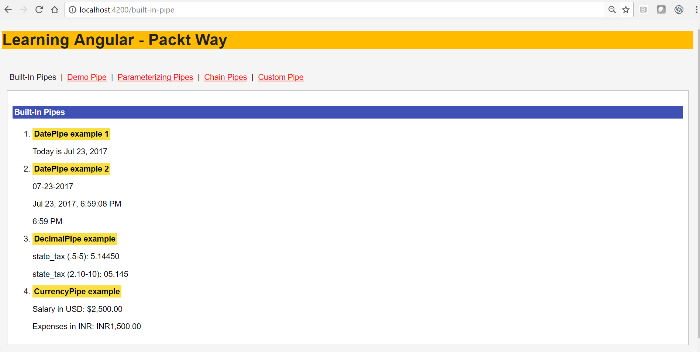
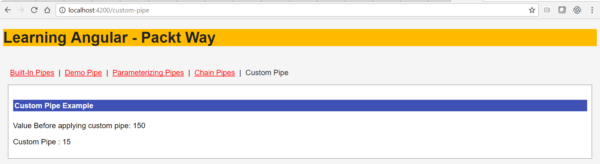

# 十一、实现 Angular 管道


在本章中，您将学习 Angular 管道。将 Angular 管道视为过滤器的现代化版本，包括帮助我们在模板中格式化值的函数。Angular 中的管道基本上是 Angular v1 中过滤器的扩展。我们可以在模板中轻松使用许多有用的内置管道。您将了解内置管道，我们还将创建自己的自定义用户定义管道。

在本章末尾，您将学习并实施以下内容：

*   角管简介
*   定义和实现管道
*   了解各种内置管道
    *   日期管
    *   十进制管
    *   电流管
    *   小写的 Epipe 和大写的 Casepipe
    *   JSON 管道
    *   切片管
    *   异步管道
*   学习实现自定义用户定义的管道
*   参数化管道
*   用链条拴住管道
*   了解纯净和不纯净管道


# 角管-概述


管道允许我们在显示模板之前格式化模板视图中的值。例如，在大多数现代应用中，我们希望显示术语，如今天、明天等，而不是系统日期格式，如 2017 年 4 月 13 日 08:00。让我们来看看更真实的场景。

是否希望应用中的提示文本始终为小写？没问题；定义并使用`LowercasePipe`。在天气应用中，如果您想将月份名称显示为 MAR 或 APR 而不是其全名，请使用`DatePipe`。

很酷，对吧？你明白了。管道帮助您添加业务规则，这样您就可以在数据实际显示在模板中之前对其进行转换。
与 Angular 管道相关的一个好方法是通过 Angular 1.x 过滤器，但管道不仅仅是过滤。

We have used the Angular router to define the route path, so we have all the functionalities of pipes in one page; you can create it in the same or different apps. Feel free to use your creativity.

在 Angular 1.x 中，我们有过滤器——管道是过滤器的替代品。

在下一节中，您将学习如何定义和使用 Angular 管道。


# 定义管道


管道操作符定义为管道符号（`|`，后跟管道名称：

```ts
{{ appvalue | pipename }}

```

以下是一个简单的`lowercase`管道示例：

```ts
{{"Sridhar Rao" | lowercase}} 

```

在前面的代码中，我们使用[T0]管道将文本转换为小写。

现在，让我们使用`lowercase`管道示例编写一个`Component`示例：

```ts
@Component({
 selector: 'demo-pipe',
 template: `
 Author name is {{authorName | lowercase}}
 `
})
export class DemoPipeComponent {
 authorName = 'Sridhar Rao';
}

```

让我们详细分析前面的代码：

*   我们定义了一个`DemoPipeComponent`组件类
*   我们创建了一个字符串变量[T0]，并分配了值[T1]
*   在模板视图中，我们显示了`authorName`；然而，在我们将其打印到 UI 之前，我们使用`lowercase`管道对其进行了转换

运行前面的代码，您将看到以下输出：


做得好！在前面的示例中，我们使用了内置管道。在后续部分中，您将了解有关内置管道的更多信息，并创建一些自定义管道。

Note that the pipe operator only works in your templates and not inside controllers.


# 内置管道


Angular pipes 是 Angular 1.x 过滤器的现代化版本。Angular 附带了许多预定义的内置管道。我们可以在视图中直接使用它们，并动态转换数据。

以下是 Angular 内置支持的所有管道的列表：

*   日期管
*   十进制管
*   电流管
*   小写的 Epipe 和大写的 Casepipe
*   JSON 管道
*   切片管
*   异步管道

在以下几节中，让我们实现并了解有关各种管道的更多信息，并查看它们的实际情况。


# 日期管


DatePipe，顾名思义，允许我们格式化或转换与日期相关的值。DatePipe 还可以用于根据运行时传递的参数转换不同格式的值。

通用语法显示在以下代码段中：

```ts
{{today | date}} // prints today's date and time
{{ today | date:'MM-dd-yyyy' }} //prints only Month days and year
{{ today | date:'medium' }} 
{{ today | date:'shortTime' }} // prints short format

```

让我们详细分析前面的代码段：

*   如前一节所述，通用语法是一个变量，后跟一个（`|`）管道操作符，然后再后跟管道操作符的名称
*   我们使用 DatePipe 来转换`today`变量
*   另外，在前面的示例中，您会注意到我们向管道操作符传递了一些参数；我们将在下一节介绍管道的传递参数

现在，让我们创建一个完整的`DatePipe`组件示例；下面是实现`DatePipe`组件的代码片段：

```ts
import { Component } from '@angular/core';

@Component({
 template: `
 <h5>Built-In Pipes</h5>
 <ol>
 <li>
 <strong class="packtHeading">DatePipe example 1</strong>
 <p>Today is {{today | date}}
 </li>
 <li>
 <strong class="packtHeading">DatePipe example 2</strong>
 <p>{{ today | date:'MM-dd-yyyy' }} 
 <p>{{ today | date:'medium' }}
 <p>{{ today | date:'shortTime' }} 
 </li>
 </ol>
 `,
})
export class PipeComponent {
 today = new Date();
}

```

让我们详细分析前面的代码段：

1.  我们创建了一个`PipeComponent`组件类。
2.  我们定义了一个`today`变量。
3.  在视图中，我们将变量的值转换为基于不同参数的各种表达式。

现在，运行应用，我们将看到以下输出：


您在本节中了解了[T0]。在以下部分中，您将继续学习和实现其他内置管道，并创建一些自定义用户定义管道。


# 十进制管


在本节中，您将了解另一个内置管道——DecimalPipe。

DecimalPipe 允许我们根据区域规则格式化数字。DecimalPipe 还可用于转换不同格式的数字。

一般语法如下：

```ts
appExpression | number [:digitInfo]

```

在前面的代码段中，我们使用数字管道，并且可以选择传递参数。

让我们来看看如何创建一个实现小数点的 AutoT0A.以下是相同的示例代码：

```ts
import { Component } from '@angular/core';
@Component({
 template: `
  <h5>Built-In Pipes</h5>
 <ol>
<li>
<strong class="packtHeading">DecimalPipe example</strong>
 <p>state_tax (.5-5): {{state_tax | number:'.5-5'}}</p>
 <p>state_tax (2.10-10): {{state_tax | number:'2.3-3'}}</p>
 </li>
 </ol>
 `,
})
export class PipeComponent {
 state_tax: number = 5.1445;
}

```

让我们详细分析前面的代码段：

1.  我们定义了一个组件类，即[T0]。
2.  我们定义了一个`state_tax`变量。
3.  然后我们在视图中改变了[T0]。
4.  第一个管道操作符告诉表达式打印小数，最多五位小数。
5.  第二个管道操作符告诉表达式将值打印到小数点后三位。

前面的管道组件示例的输出如下所示：


毫无疑问，数字管道是各种应用中最有用和最常用的管道之一。我们可以变换数值，特别是处理小数和浮点。


# 电流管


对于那些想要迎合跨国地理环境的应用，我们需要显示特定于国家的代码及其各自的货币值——这就是`CurrencyPipe`拯救我们的地方。

`CurrencyPipe`运算符用于在数值前追加`country`代码或`currency`符号。

请看实现[T0]运算符的代码片段：

```ts
{{ value | currency:'USD' }}

Expenses in INR: {{ expenses | currency:'INR' }}

```

让我们详细分析前面的代码段：

1.  第一行代码显示了编写`CurrencyPipe`的一般语法。
2.  第二行显示了货币语法，我们使用它来转换`expenses`值，并将印度货币符号附加到它上面。

既然我们已经知道了如何使用`CurrencyPipe`操作符，那么让我们结合一个示例来显示多种`currency`和`country`格式；下面是完整的组件类，它实现了一个`CurrencyPipe`操作符：

```ts
import { Component } from '@angular/core';

@Component({
 selector: 'currency-pipe',
 template: `
 <h5>CurrencyPipe Example</h5>
 <ol>
 <li>
 <p>Salary in USD: {{ salary | currency:'USD':true }}</p>
 <p>Expenses in INR: {{ expenses | currency:'INR':false }}</p>
 </li>
 </ol>
 `
})
export class CurrencyPipeComponent {
 salary: number = 2500;
 expenses: number = 1500;
}

```

让我们详细分析前面的代码：

1.  我们创建了一个组件类`CurrencyPipeComponent`，并声明了几个变量，即`salary`和`expenses`。
2.  在组件模板中，我们通过添加`country`和`currency`细节来转换变量的显示。
3.  在第一个管道操作符中，我们使用了`'currency : USD'`，它将在变量之前附加（$）美元符号。
4.  在第二个管道操作符中，我们使用了`'currency : 'INR':false'`，它将添加货币代码，`false`将告诉它不要打印符号。

现在，启动应用，我们将看到以下输出：



在本节中，我们讨论并实现了`CurrencyPipe`。在以下部分中，我们将继续探索和学习其他内置管道以及更多内容。


# 小写的 Epipe 和大写的 Casepipe


正如名称所示，小写的 epipe 和大写的 casepipe 分别有助于将文本转换为小写和大写。

请看以下代码段：

```ts
Author is Lowercase {{authorName | lowercase }}
Author in Uppercase is {{authorName | uppercase }}

```

让我们详细分析前面的代码：

1.  第一行代码使用`lowercase`管道将`authorName`的值转换为小写。
2.  第二行代码使用`uppercase`管道将`authorName`的值转换为大写。

现在我们已经了解了如何定义小写和大写管道，现在是创建一个完整的组件示例的时候了，它实现了以小写和大写显示作者姓名的管道。

请看以下代码段：

```ts
import { Component } from '@angular/core';

@Component({
 selector: 'textcase-pipe',
 template: `
 <h5>Built-In LowercasPipe and UppercasePipe</h5>
 <ol>
 <li>
 <strong>LowercasePipe example</strong>
 <p>Author in lowercase is {{authorName | lowercase}}
 </li>
 <li>
 <strong>UpperCasePipe example</strong>
 <p>Author in uppercase is {{authorName | uppercase}}
 </li>
 </ol>
 `
})
export class TextCasePipeComponent {
 authorName = "Sridhar Rao";
}

```

让我们详细分析前面的代码：

1.  我们创建了一个组件类`TextCasePipeComponent`，并定义了一个`authorName`变量。
2.  在组件视图中，我们使用了`lowercase`和`uppercase`管道。
3.  第一个管道将变量的值转换为小写文本。
4.  第二个管道将变量的值转换为大写文本。

运行应用，我们将看到以下输出：


在本节中，您学习了如何使用`lowercase`和`uppercase`管道来转换值。


# JSON 管道


与 Angular 1.x 中的 JSON 过滤器类似，我们有 JSON 管道，它帮助我们将字符串转换为 JSON 格式的字符串。

在小写或大写的管道中，我们转换字符串；使用 JSON 管道，我们可以将字符串转换并显示为 JSON 格式的字符串。

通用语法显示在以下代码段中：

```ts
<pre>{{ myObj | json }}</pre>

```

现在，让我们使用前面的语法创建一个完整的`Component`示例，它使用 JSON 管道：

```ts
import { Component } from '@angular/core';

@Component({ 
 template: `
 <h5>Author Page</h5>
 <pre>{{ authorObj | json }}</pre>
 `
})
export class JSONPipeComponent {
 authorObj: any; 
 constructor() {
 this.authorObj = {
 name: 'Sridhar Rao',
 website: 'http://packtpub.com',
 Books: 'Mastering Angular2'
 };
 }
}

```

让我们详细分析前面的代码：

1.  我们创建了一个组件类`JSONPipeComponent`和`authorObj`，并将 JSON 字符串分配给变量。
2.  在组件模板视图中，我们转换并显示 JSON 字符串。

运行应用，我们将看到以下输出：


JSON 很快就成为 web 应用在服务和客户端技术之间集成的事实标准。因此，每次我们需要在视图中将值转换为 JSON 结构时，JSON 管道都会派上用场。


# 切片管


SlicePipe 非常类似于数组切片 JavaScript 函数。切片管道从两个指定索引之间的字符串中提取字符，并返回新的子字符串。

定义切片管道的一般语法如下所示：

```ts
{{email_id | slice:0:4 }}

```

在前面的代码片段中，我们对电子邮件地址进行切片，以仅显示变量值[T0]的前四个字符。

现在我们知道了如何使用切片管，让我们把它放在一个组件中。

以下是实现 SlicePipe 的完整代码段：

```ts
import { Component } from '@angular/core';

@Component({
 selector: 'slice-pipe',
 template: `
 <h5>Built-In Slice Pipe</h5>
 <ol>
 <li>
 <strong>Original string</strong>
 <p> Email Id is {{ emailAddress }}
 </li>
 <li>
 <strong>SlicePipe example</strong>
 <p>Sliced Email Id is {{emailAddress | slice : 0: 4}}
 </li>
 </ol>
 `
})
export class SlicePipeComponent {
 emailAddress = "test@packtpub.com";
}

```

让我们详细分析前面的代码段：

1.  我们创建了一个`SlicePipeComponent`类。
2.  我们定义了一个字符串变量`emailAddress`并给它赋值`test@packtpub.com`。
3.  然后，我们将 SlicePipe 应用于[T0]变量。
4.  我们从`0`位置开始得到子字符串，从`emailAddress`的变量值中得到`4`字符。

运行应用，我们将看到以下输出：


SlicePipe 无疑是一个非常有用的内置管道，尤其是处理字符串或子字符串。


# 异步管道


异步管道允许我们直接将承诺或观察映射到模板视图中。为了更好地理解异步管道，让我先介绍一个可观察的管道。

Observable 是 Angular 可注入服务，可用于将数据流传输到应用中的多个部分。在下面的代码片段中，我们使用一个`async`管道作为承诺来解析返回的作者列表：

```ts
<ul id="author-list">
 <li *ngFor="let author of authors | async" >
 <!-- loop the object here -->
 </li>
</ul>

```

`async`管道现在订阅`Observable`（作者）并检索最后一个值。

让我们看一下如何将`async`管道同时用作`Promise`和`Observable`的示例。

在我们的`app.component.ts`文件中添加以下代码行：

```ts
 getAuthorDetails(): Observable<Author[]> {
  return this.http.get(this.url).map((res: Response) => res.json());
 }

 getAuthorList(): Promise<Author[]> {
  return this.http.get(this.url).toPromise().then((res: Response) => 
   res.json());
 }

```

让我们详细分析前面的代码段：

1.  我们创建了一个`getAuthorDetails`方法，并附加了一个可观察的方法。该方法将返回来自`url`的响应，这是一个 JSON 输出。
2.  在`getAuthorList`方法中，我们绑定了一个承诺，需要在`http`请求调用的`url`返回的输出中解析或拒绝。

在本节中，我们已经了解了`async`管道的工作原理。你会发现这与处理服务非常相似。我们可以映射一个承诺或一个可观察的，并将结果映射到模板。


# 参数化管道


管道也可以采用参数。我们可以沿着管道传递参数。参数在管道后用冒号（`:`分隔：

```ts
{{appValue | Pipe1: parameter1: parameter2 }}

```

让我们快速构建一个简单的管道示例，以查看它的运行情况。下面是一个带有`MM-dd-yyyy`参数的`DatePipe`示例：

```ts
{{today | date:'MM-dd-yyyy' }} 

```

具有参数的管道的另一个示例如下所示：

```ts
{{salary | currency:'USD':true}}

```

让我们详细分析前面的代码段：

1.  我们将 USD 作为参数传递给`CurrencyPipe`，这将告诉管道显示货币代码，例如*USD*表示美元，*EUR*表示欧元。
2.  `true`参数表示显示货币符号（$）。默认情况下，它设置为 false。

让我们看一下它们的运行情况，以及组件的完整代码：

```ts
import { Component } from '@angular/core';

@Component({
 template: `
 <h5>Parametrizing pipes</h5>

 <p>Date with parameters {{ today | date:'MM-dd-yyyy' }} 
 <p>Salary in USD: {{salary | currency:'USD':true}}</p>
 `,
})
export class ParamPipeComponent {
 today = new Date();
 salary: number = 1200;
}

```

在前面的代码片段中，我们创建了一个`ParamPipeComponent`类并定义了`today`和`salary`变量。
在`Component`模板视图中，我们传递`DatePipe`的`date:'MM-dd-yyyy'`参数和`CurrencyPipe`的`currency:'USD' :true`参数。
这是前面代码的输出：


在前面的示例中，我们将自定义参数（如`currency`和`date`格式）传递给管道，并相应地查看输出。

在大多数应用用例中，我们需要将参数传递给管道，以基于业务逻辑转换值。在本节中，我们重点讨论通过传递值来参数化管道。

到目前为止，我们一直在使用内置管道并向管道传递参数。

在以下部分中，您将了解如何链接管道、创建自定义管道以及将参数传递给自定义用户定义管道。


# 链式管道


我们可以将多条管道连接在一起。这在需要关联多个需要应用的管道的场景中特别有用，最终输出将与应用的所有管道进行转换。

将触发工作流或链，并逐个应用管道。链管道语法的示例如下所示：

```ts
{{today | date | uppercase | slice:0:4}}

```

我们在前面的代码中应用了两个链管道。首先，将`DatePipe`应用于`today`变量，然后应用`uppercase`管道。以下是`ChainPipeComponent`的完整代码片段：

```ts
import {Component } from '@angular/core';

@Component({
 template: `
 <h5>Chain Pipes</h5>
 <p>Month is {{today | date | uppercase | slice:0:4}}
 `,
})
export class ChainPipeComponent {
 today = new Date();
}

```

我们已经使用了切片来只显示月份的前四个字符。以下屏幕截图显示了前面组件的输出：


应用链管时要记住的一些关键事项如下：

*   执行顺序是从左到右
*   管道一个接一个地铺设

在本节中，您了解了如何在我们的应用中将多个管道链接在一起。在下一节中，您将详细了解如何创建自己的自定义管道。


# 创建自定义管道


到目前为止，一切顺利。管道确实给我们留下了深刻的印象，但是等等，我们可以用管道做更多很棒的事情。正如您所看到的，内置管道非常有限，数量很少。我们当然需要创建自己的定制管道，以满足我们应用的功能。

在本节中，您将学习如何为我们的应用创建自定义管道。

在本例中，我们将构建一个管道，它将是一个税务计算器。我们传递产品的价格，并使用管道功能自动计算和显示销售税。魔法，对吧？

要创建自定义管道，我们需要执行以下步骤：

1.  创建一个模板将其应用于管道（在我们的示例中，它是[T0]）。
2.  创建一个管道文件，即[T0]。
    1.  每个管道文件都必须从 Angular 核心导入管道。
    2.  定义管道元数据。
    3.  创建`Component`类。它应该具有`transform`功能，该功能保存管道应该做什么的业务逻辑。

在下面的代码片段中，我们正在定义一个名为`UpdateTaxPipe`的自定义管道，它将接受一个`percentage`参数，并进行增值税计算，并将其显示在我们的模板中：

```ts
{{ productPrice | UpdateTaxPipe: percentage }}

```

让我们创建我们的`update-tax.pipe.ts`文件：

```ts
import { Pipe, PipeTransform } from '@angular/core';

@Pipe({
 name : "UpdateTaxPipe"
})

export class UpdateTaxPipe implements PipeTransform{
 transform(value:number, taxVal: number):number{
 return (value*taxVal)/100;
 }
}

```

让我们详细分析前面的代码段：

1.  为了告诉 Angular 这是一个管道，我们应用了从 core Angular 库导入的`@Pipe`装饰器。
2.  我们使用`name`管道元数据创建了一个名为`UpdateTaxPipe`的定制管道。
3.  我们创建了一个`transform`方法，该方法对于管道是必需的，并在该方法中定义了我们的业务逻辑和规则。
4.  我们将两个参数传递给`transform`方法，它返回更新后的值。

Angular looks for and executes the `transform` method, regardless of whether we include the interface PipeTransform or not.

运行应用，我们将看到如下屏幕截图所示的输出：



在本节中，您学习了如何创建自定义管道。创建用户定义的管道非常简单。定制管道无疑有助于我们轻松集成应用的业务逻辑。

Try and create custom pipes, which can fit the write once and use logic many times and also in many component views; for example, validating a phone number, address, and so on.


# 纯净和不纯净的管道


管道还接受名为 Pure 的元数据。管道有两种状态：

*   纯管
*   不纯管


# 纯管道


纯管道仅在输入参数的值更改时执行。它不会记住或跟踪以前的任何值或状态。Angular 内置管均为`pure`管。

All the pipes we have seen so far as examples are Pure Pipes.


# 不纯管道


无论值或参数是否发生变化，每个变化检测周期都会调用一个不纯管道。为了使用不纯净的管道，我们应该使用管道装饰器`pure`作为`false`。

By default, all pipe decorators have `pure` set as `true`.

将管道装饰器值设置为`pure`将检查管道的输出，无论其值是否更改，并将不断更新管道提供的值。

定义不纯管道与创建任何自定义用户定义管道相同，唯一的区别是在`@Pipe`装饰器中，我们将通过将值设置为`false`来明确提及要不纯的管道。

以下是通过将“管道”的值设置为 false 来定义不纯净管道的语法：

```ts
import { Pipe, PipeTransform } from '@angular/core';

@Pipe({
  name: 'authorName'
  pure: false
})

```

在本节中，您了解了不同类型的 Angular 管道，即纯管道和非纯管道。仅当输入组件的值更改时，才会调用纯管道。无论值是否更改，每次更改检测时都会调用不纯管道。


# 总结


在本章中，您学习了所有关于角管道的知识。Angular 管道在转换视图样板中的数据时非常有用。Angular pipes 是 Angular 1.x 中提供的过滤器的现代化版本。

我们可以在模板中轻松使用许多有用的内置管道操作符。在本章中，您了解了内置管道以及创建的自定义用户定义管道。

使用数字时，我们可以使用`DatePipe`、`DecimalPipe`和`CurrencyPipe`。在专门处理字符串时，我们始终可以使用 SlicePipe、[T3]和[T4]。

当我们主要处理服务器端响应或进行异步调用并处理响应时，可以使用`JSONPipe`和`asyncPipe`。我们还介绍了将参数传递到管道以及根据应用的需要进行自定义。

我们探讨了如何创建和实现自定义用户定义的管道，这些管道还可以根据我们的应用需要使用参数来更好地自定义管道。

所以，继续，用管道变换视图。

在下一章中，您将学习如何实现 Angular 服务。您将了解服务和工厂、创建 Angular 服务、使用服务从组件访问数据以及创建异步服务。