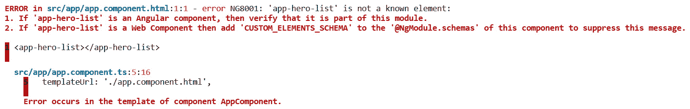
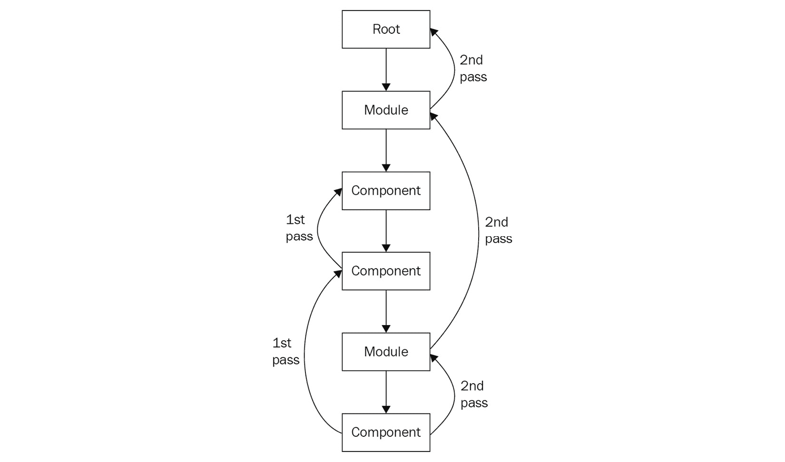

# 五、构建一个 Angular App

在我们的旅程中，我们已经达到了一个阶段，我们可以通过将组件嵌套在其他组件中（类似于组件树），成功地开发更复杂的应用。然而，将我们所有的业务逻辑捆绑到单个组件中并不是一条可行之路。我们的应用可能很快就无法维护。在本章的后面，我们将研究 Angular 的依赖关系管理机制为游戏带来的克服这些问题的优势。

在本章中，我们将学习如何基于组件树构建应用体系结构，并将它们组织成模块。我们还将了解新的 Angular 依赖项注入机制，它帮助我们以最小的工作量和最佳的结果在整个应用中声明和使用依赖项。在本章结束时，您将能够创建一个 Angular 应用，该应用的结构正确，可以使用模块和服务强制分离关注点。

我们将讨论以下主题：

*   将组件组织成模块
*   使用 Angular CLI 文件夹结构组织 Angular 项目
*   依赖注入的不同方法
*   将依赖项注入到组件中
*   覆盖整个组件树中的全局依赖项

让我们开始吧！

# 技术要求

本章的源代码可从以下 GitHub 链接获得：

[https://github.com/PacktPublishing/Learning-Angular--Third-Edition/tree/master/ch05](https://github.com/PacktPublishing/Learning-Angular--Third-Edition/tree/master/ch05) 。

# 将组件组织成模块

正如我们在[*第 3 章*](03.html#_idTextAnchor092)*组件交互和交互通信*中了解到的，Angular 10 应用被表示为组件树。顶部的主组件（通常放在主 HTML 索引文件的某个地方）充当全局占位符，子组件在其中变成其他嵌套子组件的主机，依此类推。基于 web 组件体系结构的现代 web 应用通常符合这种树层次结构。

这种方法有明显的优点。一方面，可重用性不会受到损害，我们可以在整个组件树中重用组件，而无需付出多少努力。其次，由此产生的粒度减少了设想、设计和维护大型应用所需的负担。我们只需关注单个 UI，然后围绕新的抽象层包装其功能，直到我们从头包装一个完整的应用。

或者，我们也可以用另一种方式处理我们的 web 应用，并将我们的组件分组到称为**模块**的内聚功能块中。我们从一个更通用的功能开始，最终将应用分成更小的部分，这些部分将成为我们的 web 组件：


图 5.1–将组件分组为模块

后者已成为构建基于组件的架构时最常用的方法。基于模块的方法可以更好地扩展，并且更易于测试。如果我们把一个模块看作是应用的一个单独的特性，它允许我们独立于其他功能开发特定的功能。它极大地增强了大型组织中的团队管理，在这些组织中，每个开发团队都可以在单独的功能中工作。功能可以逐步部署，确保我们的应用无缝运行。

## 引入角模

我们已经解决了现代 web 开发人员在构建 web 应用时面临的许多最常见的问题。因此，定义一个将它们划分为可管理单元的体系结构是有意义的。

Angular 的方法是 Angular 模块的概念。Angular 模块是特定代码块的容器，该代码块遵循相同的功能。Angular 模块的功能专用于应用域，如订单或客户，或特定工作流，如用户注册。通常，它解决了应用可以拥有的一组特定功能。正如我们在前几章中了解到的，Angular 应用至少有一个主模块`AppModule`。我们也可以创建其他模块，通常称为*功能模块*。这些代表了应用的主要特征。

## 创建您的第一个模块

要在 Angular 应用中创建新模块，请使用 Angular CLI 的`generate`命令，同时将模块名称作为参数传递：

```ts
ng generate module heroes
```

前面的命令在`app`文件夹中创建一个`heroes`文件夹。这是具有相同`heroes`功能的 Angular 瑕疵的物理容器：


图 5.2–Heroes 文件夹结构

它还为负责注册这些工件的 Angular 模块创建一个 TypeScript 文件：

```ts
import { NgModule } from '@angular/core';
import { CommonModule } from '@angular/common';
@NgModule({
  declarations: [],
  imports: [
    CommonModule
  ]
})
export class HeroesModule { }
```

Angular 模块是一个标有`@NgModule`装饰符的类型脚本`class`，它定义了以下属性：

*   `declarations`：在模块中注册的组件、指令和管道。
*   `imports`：包含该模块使用的声明的其他模块。Angular CLI 在此属性中为我们自动定义了`CommonModule`。它是一个总是在 Angular 应用中使用的模块，因为它包含我们通常希望使用的所有内置指令和管道。当您导入一个已经导入您的模块时，请小心不要陷入循环引用中。
*   `exports`：在`declarations`中定义并可供其他模块使用的 Angular 伪影。这是模块的公共 API。它定义了什么是可公开访问的或不可公开访问的。未显式导出的所有其他内容都将被视为模块的私有或内部内容。
*   `providers`：从模块提供的、可从应用的任何模块访问的服务。在*部分，我们将在*部分了解更多关于提供者的信息。
*   `bootstrap`: The main component of the application that will be rendered when the application starts up. This property is set only once in the main application module, `AppModule`, and is usually `AppComponent`. Typically, you should not change it unless there is a particular reason to do so.

    重要提示

    主应用模块`AppModule`不需要导入`CommonModule`。相反，它导入`BrowserModule`，用于在自行导出`CommonModule`的浏览器平台中运行 Angular 应用。

创建新的 Angular 应用时，第一步是定义应用需要的不同功能。我们应该记住，每个人都应该独立于其他人而有意义。一旦我们定义了所需的特性集，我们将为每个特性创建一个模块。然后，每个模块将填充构成其所代表的功能的组件、指令、管道和服务。在定义功能集时，请始终记住封装和可重用性原则。第二步是开始创建用于在屏幕上可视化功能的组件。

## 向模块注册组件

当使用 Angular CLI 的`generate`命令时，有两种方法向模块注册组件：隐式地在相应模块的文件夹中运行该命令，或显式地使用其可用选项之一。我们在[*第 3 章*](03.html#_idTextAnchor092)*组件交互和交互通信*中看到了第一个选项，因此我们将在这里重点介绍后一个选项。我们可以使用以下命令创建组件并同时注册它：

```ts
ng generate component heroes/heroList --module=heroes
```

`--module`参数表示组件注册的模块。它也可以在生成指令和管道时使用。Angular CLI 在查找要使用的正确 Angular 模块方面非常智能。在这种情况下，它会在`heroes`文件夹中查找相对于当前路径的`heroes.module.ts`文件。或者，我们可以传递 Angular 模块文件的整个路径：

```ts
ng generate component heroes/heroList --module=heroes/heroes.module.ts
```

您注意到组件的名称是`heroes/heroList`了吗？这是另一种语法，我们可以在其中传递要创建 Angular 工件的文件夹的名称。在模块文件夹中创建模块的工件是一个很好的实践。它可以帮助您一目了然地看到模块的功能，并在开发过程中专注于该特定模块。当您决定对代码进行重构并且必须移动整个模块时，它也很有用。创建组件时，您可能已经注意到组件的文件夹以及必要的文件不是`heroList`，而是`hero-list`。这是 Angular CLI 的一项功能，在创建文件夹和文件时，会将骆驼盒转换为烤肉串盒。它还将组件的选择器转换为烤肉串大小写格式。

在实际应用中，功能模块不是独立的模块，而是与其他模块共享其封装的功能（组件、指令和管道）。

## 公开模块特性

在前面的部分中，我们在一个单独的模块中创建了`HeroListComponent`。现在是在我们的 Angular 应用中显示此组件的时候了。我们已经知道，首先在 Angular 应用中显示的组件是`AppComponent`。所以，我们需要找到一种方法在这个组件中声明`HeroListComponent`，这样它也会显示出来。在[*第 3 章*](03.html#_idTextAnchor092)*组件交互和交互*中，我们了解了组件的选择器，以及它如何提供一种用 HTML 定义组件的方法。就像`index.html`一样，我们使用`AppComponent`的选择器，我们可以在`AppComponent`的模板中使用`HeroListComponent`的选择器：

```ts
<app-hero-list></app-hero-list>
```

如果我们尝试使用`ng serve`运行 Angular 应用，我们将得到以下错误：



图 5.3–Angular 编译器错误

Angular 编译器无法识别`app-hero-list`选择器，因为它是在不同的 Angular 模块中声明的。`AppComponent`在`AppModule`的`declarations`属性中定义。`HeroListComponent`在模块的`declarations`中定义。如果您使用的是 VSCode，并且安装了 Angular Language Service extension，那么在开始构建应用之前很久就会出现错误：


图 5.4–Angular 语言服务错误

您可能认为我们可以在`AppModule`的`declarations`属性中定义`HeroListComponent`。由于以下原因，不鼓励采用这种方法：

*   它违背了 Angular 模块的基本原理，其中每个模块包含一组具有单一功能和责任形式的 Angular 工件。`AppModule`的目的是协调整个应用，而不是绑定到特定功能。
*   Angular 组件只能在一个模块中声明。同样的规则也适用于指令和管道。

正确的方法是使用每个模块的`imports`和`exports`属性。首先，英雄模块必须导出`HeroListComponent`，以便在需要它的角模块中可用：

HEROLES.module.ts

```ts
import { NgModule } from '@angular/core';
import { CommonModule } from '@angular/common';
import { HeroListComponent } from './hero-list/hero-list.component';
@NgModule({
  declarations: [HeroListComponent],
  imports: [
    CommonModule
  ],
  exports: [HeroListComponent]
})
export class HeroesModule { }
```

任何 Angular 模块现在都可以导入`HeroesModule`以访问其导出的工件，包括`AppModule`：

app.module.ts

```ts
import { BrowserModule } from '@angular/platform-browser';
import { NgModule } from '@angular/core';
import { AppComponent } from './app.component';
import { HeroesModule } from './heroes/heroes.module';
@NgModule({
  declarations: [
    AppComponent
  ],
  imports: [
    BrowserModule,
    HeroesModule
  ],
  providers: [],
  bootstrap: [AppComponent]
})
export class AppModule { }
```

重要提示

Angular 模块的`imports`和`exports`属性不应与 Angular 模块文件顶部的`import`语句混淆，也不应与 Angular 模块的`class`前面的`export`关键字混淆。这些关键字指的是 JavaScript 模块，而不是 Angular 模块。

始终记住`exports`属性是指可以放置在模块`declarations`属性中的任何工件；即组件、指令和管道。相反，`imports`属性定义了整个 Angular 模。Angular 模块不关心其他模块的单个导出工件。这与最终使用导出工件的 Angular 组件有关。Angular 模块应该关心它向其他模块公开哪些工件，因为它可能不想授予对所有工件的访问权。

到目前为止，我们已经看到了两种类型的模块：主应用模块`AppModule`和功能模块。我们还可以在 Angular 应用中使用其他类型的模块，以满足特定的目的和需求。我们将在下一节中介绍这些。

## 通过模块扩展功能

Angular 模块用于对类似功能进行分组，并将该功能提供给其他模块。它们可以根据功能类型和 Angular 应用加载它们的方式进行进一步组织。我们可以根据模块所代表的功能来划分模块：

*   **根模块**：这是 Angular 应用的主模块，按惯例命名为`AppModule`。它在应用启动时启动。它旨在通过导入所有其他模块来协调应用。Angular 应用只能有一个根模块。
*   **功能模块**：它们通常代表 Angular 应用的主要功能。它们包含一组特定的功能，如订单、产品和客户，并帮助我们将应用划分为特定的领域。它们还旨在让开发人员与应用的其余部分隔离工作，从而更轻松地交付功能。功能模块通常不是独立的，而是从`AppModule`导入的。
*   **核心模块**：此模块通常包含不适合特定模块的应用范围的工件。这些工件是在我们的应用中使用过一次的组件，例如包含应用主菜单的顶栏、包含版权信息的页脚组件或加载微调器。它还包含可在模块之间共享的服务，如本地缓存服务或自定义记录器。此模块在`AppModule`中只能加载一次。
*   **共享模块**：此模块包含可在功能模块中使用的组件、指令和管道。它还可以为其他导出的模块提供容器，这些模块包含可重用的构件，例如用于处理 HTML 表单的模块`CommonModule`或`ReactiveFormsModule`。共享模块从要使用其导出工件的每个功能模块导入。

我们还可以根据 Angular 框架如何加载模块来区分模块：

*   **即时加载模块**：这些是应用启动时加载的模块。您可以通过是否在另一个模块的`imports`属性中声明来区分急切加载的模块。
*   **延迟加载模块**：这些是导航到我们的应用路径或用户操作（如单击按钮）后按需加载的模块。延迟加载的模块没有在模块的`imports`属性中声明，但它们有其特定的加载方式，我们将在[*第 7 章*](07.html#_idTextAnchor168)*中了解，通过路由*浏览组件。Angular 加载模块的方式与应用的最终捆绑包直接相关。在[*第 12 章*](12.html#_idTextAnchor268)*中，我们将看到 Angular 应用投入生产*，我们加载 Angular 模块的方式直接影响我们应用的构建过程。

对于小规模的 Angular 应用，Angular 模块可能不是必需的，但在处理大型企业 Angular 项目时，Angular 模块是必不可少的资产。在下一节中，我们将探讨这样一个项目的结构，并简要概述 Angular CLI 为我们创建的各种文件。

# 配置应用

正如我们在前几章中了解到的，Angular CLI 在命令行中运行`ng new`命令时，为我们构建一个新的 Angular 项目做了大部分工作。它创建了在零时间内启动并运行初始 Angle skeleton 应用所需的最少数量的文件。

## 配置工作区

下面的命令创建了一个 Angular CLI 工作区，其根级别有一个 Angular 应用，名为`my-app`：

```ts
ng new my-app
```

工作区包含 Angular CLI 构建、测试和发布 Angular 应用所需的各种配置文件：


图 5.5–Angular CLI 10 工作空间

以下是每一项的简要概述：

*   `e2e`：包含端到端测试和运行它们的配置文件。
*   `node_modules`：包括开发和运行 Angular 应用所需的 npm 包。
*   `src`：包含 Angular 应用需要的所有源文件。
*   `.browserslistrc`：定义 Angular 应用支持哪些浏览器和版本。
*   `.editorconfig`：定义编辑器的编码样式。
*   `.gitignore`：指定 Git 不应跟踪的文件和文件夹。
*   `angular.json`：Angular CLI 工作区的主配置文件。
*   `karma.conf.js`：运行单元测试的主配置文件。
*   `package.json`和`package-lock.json`：提供开发、测试和运行 Angular 应用所需的 npm 包及其确切版本的定义。
*   `README.md`：包含如何启动 Angular 应用指南的自述文件。
*   `tsconfig.app.json`：特定于 Angular 应用的类型脚本配置。
*   `tsconfig.base.json`：特定于 Angular CLI 工作区的类型脚本配置。
*   `tsconfig.spec.json`：特定于单元测试的类型脚本配置。
*   `tslint.json`: Defines coding rules specific to the workspace to enforce readability, maintainability, and functionality.

    重要提示

    Angular CLI 工作区可以有多个 Angular 项目，例如其他 Angular 应用或 Angular 库。这种方法适用于希望遵循 monorepo 开发风格的组织，即所有 Angular 项目都存在于单个源代码存储库中。

作为开发人员，我们应该只关心编写实现应用功能的源代码。尽管如此，掌握应用如何编排和配置的基本知识有助于我们更好地理解机制，并在必要时进行干预。

## 开发应用

当我们开发 Angular 应用时，很可能会与`src`文件夹进行交互。这是我们编写应用代码和测试的地方。它也是我们定义应用样式和我们使用的任何静态资产（如图标、图像和 JSON 文件）的地方：


图 5.6–Angular 应用示例结构

`src`文件夹包含以下组件：

*   `app`：包含应用的所有 Angular 相关文件。在开发过程中，您大部分时间都与此文件夹进行交互。在前面的屏幕截图中，我们可以看到它包含了`shared`模块、`core`模块以及`heroes`和`villains`功能模块。
*   `assets`：包含字体、图像和图标等静态资产。
*   `environments`：根据服务或构建 Angular app 时使用的目标环境，包含特定于环境的文件。
*   `favicon.ico`：显示在浏览器选项卡中的图标以及页面标题。
*   `index.html`：Angular 应用的主 HTML 页面。
*   `main.ts`：Angular app 的主要入口点。
*   `polyfills.ts`：包含支持浏览器特定功能的脚本。并非所有浏览器都支持所有最新功能。例如，还有一些 JavaScript 特性还没有得到所有浏览器的完全支持。Angular 通过提供 polyfills 来添加对这些浏览器的支持，从而克服了这种类型的限制。
*   `styles.css`：包含应用范围的样式。这些是全局应用于 Angular 应用的 CSS 样式。
*   `test.ts`：Angular app 单元测试的主要入口点。不太可能编辑此文件。

Angular 应用在部署到生产环境之前，可以在不同的环境中进行测试，以确保它能够按照提供的规范工作，并且不会出现任何问题。在下一节中，我们将学习如何配置和使用这样的环境。

## 配置环境

在应用的开发过程中，我们通常在特定开发环境的边界内工作。我们在一台拥有大量内存和存储空间的高速计算机中编写代码，并使用大型宽幅显示器预览我们的应用。开发环境不能保证与最终用户使用的环境相同。大多数 bug 发生在生产环境中，很难跟踪。一个组织在开发和生产之间也可以有多个环境，例如测试或登台。我们必须能够针对每个应用测试我们的应用，以确保它正常工作。

Angular CLI 使我们能够为每个环境定义不同的配置，并使用每个环境为应用提供服务、构建和测试。我们可以运行这些命令，同时使用以下语法将配置名称作为参数传递：

```ts
ng command --configuration=name
```

这里，`command`可以是`serve`、`build`或`test`。定义新的环境配置时，我们需要做的第一件事是在`environments`文件夹中创建相应的环境文件。默认情况下，Angular CLI 创建两个环境文件：

*   `environment.ts`：表示开发环境
*   `environment.prod.ts`：表示生产环境

如果我们想定义一个登台环境，我们需要创建一个名为`environment.staging.ts`的文件。每个文件的命名遵循`environment.{env}.ts`的约定，其中`{env}`是我们要添加的环境的不同名称。

每个环境文件导出一个`environment`对象：

环境科技

```ts
export const environment = {
  production: false
};
```

导出对象的属性必须在所有环境文件中定义。环境文件是定义后端 API URL 的好地方。`production`属性默认设置为区分环境是否在生产环境中工作。您可能已经注意到，在 Angular 应用的`main.ts`文件中，我们这样使用它：

梅因酒店

```ts
import { enableProdMode } from '@angular/core';
import { platformBrowserDynamic } from '@angular/platform-browser-dynamic';
import { AppModule } from './app/app.module';
import { environment } from './environments/environment';
if (environment.production) {
  enableProdMode();
}
platformBrowserDynamic().bootstrapModule(AppModule)
  .catch(err => console.error(err));
```

`enableProdMode`启用生产模式并禁用不必要的框架断言和检查，如浏览器控制台中的警告消息，这可能会降低应用的速度。

创建环境文件后，我们需要在工作区的`angular.json`配置文件中定义适当的配置。它包含一个定义基本 CLI 命令的`architect`属性，如`serve`、`build`和`test`。每个命令都包含`configurations`属性中每个环境的配置。每个配置都包含一个`fileReplacements`属性，该属性定义了在执行特定命令时将替换开发文件的环境文件：

```ts
"production": {
  "fileReplacements": [
    {
      "replace": "src/environments/environment.ts",
      "with": "src/environments/environment.prod.ts"
    }
  ]
}
```

当我们运行`ng build --configuration=production`命令时，Angular CLI 将`environment.ts`文件替换为`environment.prod.ts`文件，这是特定于生产目标环境的。在登台的情况下，我们需要添加一个`staging`属性，并将`with`属性设置为登台环境文件的相对路径，即`src/environments/environment.staging.ts`。

在处理大型企业应用时，将组件组织到 Angular 模块中，并在 Angular CLI 工作区中对其进行结构化是至关重要的。在某些时候，我们的模块及其组件将需要使用**依赖项注入（DI）**机制相互交互，如下一节所述。

# 依赖注入如何在 Angular 中工作

依赖注入是一种应用设计模式，我们在其他语言（如 C#和 Java）中也会遇到这种模式。随着应用的增长和发展，我们的每个代码实体在内部都需要其他对象的实例，这些对象被称为依赖关系。将这些依赖项传递给消费者代码实体的行为称为**注入**，它还需要另一个代码实体的参与，称为**注入**。注入器负责实例化和引导所需的依赖项，以便它们在被注入消费者时可以使用。这一点很重要，因为消费者不知道如何实例化其依赖项，只知道他们实现的用于使用依赖项的接口。

Angular 包括一个顶级的依赖项注入机制，用于将所需的依赖项暴露给 Angular 应用的任何 Angular 工件。在深入研究这个主题之前，让我们先看看 Angular 中的依赖项注入试图解决的问题。

在[*第 4 章*](04.html#_idTextAnchor113)*使用管道和指令增强组件*中，我们学习了如何使用`ngFor`指令显示对象列表。我们使用了在`HeroesComponent``class`中声明的`Hero`对象的静态列表，如下所示：

heromes.component.ts

```ts
import { Component, OnInit } from '@angular/core';
import { Hero } from '../hero.model';
@Component({
  selector: 'app-heroes',
  templateUrl: './heroes.component.html',
  styleUrls: ['./heroes.component.css']
})
export class HeroesComponent implements OnInit {
  heroes: Hero[] = [
    { id: 1, name: 'Boothstomper', team: 'avengers' },
    { id: 2, name: 'Drogfisher', team: 'avengers' },
    { id: 3, name: 'Bloodyllips', team: 'villains' },
    { id: 4, name: 'Mr Bu Moverse', team: 'villains' },
    { id: 5, name: 'Piranhaelli', team: '' }
  ];
  constructor() { }
  ngOnInit(): void {
  }
  trackByHeroes(index: number, hero: Hero): number {
    return hero.id;
  }
}
```

这种方法有两个主要缺点：

*   在实际应用中，我们很少处理静态数据。它通常来自后端 API 或其他服务。
*   英雄列表与组件紧密耦合。Angular 组件负责表示逻辑，不应该关心如何从静态列表或远程端点获取数据。他们只需要在模板中显示它。因此，它们将业务逻辑委托给服务来处理此类任务。

在下一节中，我们将学习如何使用 Angular 服务避免这些障碍。我们将创建一个 Angular 服务，它将自动返回英雄列表。因此，我们将有效地将业务逻辑任务从组件中委派出去。记住：**组件应该只关注表示逻辑**。

## 将复杂任务委托给服务

为了创建新的 Angular 服务，我们使用 Angular CLI 的`generate`命令，同时将服务的名称作为参数传递：

```ts
ng generate service heroes/hero
```

这将在`heroes`模块文件夹中创建 Angular 服务文件`hero.service.ts`以及附带的单元测试文件`hero.service.spec.ts`：


图 5.7–Heroes 文件夹结构

我们通常根据服务所代表的功能来命名服务。每个服务都有一个上下文。当它开始跨越不同上下文之间的边界时，这表明您应该将其划分为不同的服务。

有 Angular 的服务是一个带有修饰符的打字脚本`class`。装饰器将`class`标识为一个 Angular 服务，可以将其注入到 Angular 组件或另一个 Angular 服务中。它通过一个选项`providedIn`接受一个对象作为参数。默认情况下，Angular 服务不会像组件、指令和管道一样注册到特定模块。相反，它是在一个喷油器上注册的–Angular 应用的`root`喷油器–如`providedIn`选项中所定义：

```ts
import { Injectable } from '@angular/core';
@Injectable({
  providedIn: 'root'
})
export class HeroService {
  constructor() { }
}
```

我们的服务不包含任何实现。让我们添加一些逻辑，以便我们的组件可以使用它：

1.  创建一个名为`getHeroes`的方法；暂时将方法主体留空。
2.  该方法将返回一个`Hero`对象数组。将方法的返回类型设置为`Hero[]`。
3.  Copy the contents of the `heroes` property from `HeroesComponent` in the body of the `getHeroes` method. Remove the `team` property from each object.

    不要忘记在方法中添加`return`关键字。该服务现在应该如下所示：

    hero.service.ts

    ```ts
    import { Injectable } from '@angular/core';
    import { Hero } from './hero.model';
    @Injectable({
      providedIn: 'root'
    })
    export class HeroService {
      constructor() { }
      getHeroes(): Hero[] {
        return [
          { id: 1, name: 'Boothstomper' },
          { id: 2, name: 'Drogfisher' },
          { id: 3, name: 'Bloodyllips' },
          { id: 4, name: 'Mr Bu Moverse' },
          { id: 5, name: 'Piranhaelli' }
        ];
      }
    }
    ```

    就这样！我们已经成功地将我们的组件与 hero 数据解耦，并将其逻辑提取到 Angular 服务中！现在，我们需要将它注入到我们的组件中并使用它。

4.  在`HeroListComponent`中声明`heroes`属性。
5.  创建一个名为`heroService`的`private`属性，并将其类型设置为`HeroService`：

    ```ts
    private heroService: HeroService;
    ```

6.  使用组件的`constructor`：

    ```ts
    constructor() {
      this.heroService = new HeroService();
    }
    ```

    中的`new`关键字实例化属性
7.  在`ngOnInit`方法中调用`heroService`的`getHeroes`方法，并将返回值赋给`heroes`属性：

    ```ts
    ngOnInit(): void {
      this.heroes = this.heroService.getHeroes();
    }
    ```

使用`ng serve`命令运行应用，以验证英雄列表是否正确显示在页面上：


图 5.8——英雄名单

令人惊叹的我们已经成功地将组件与服务连接起来，我们的应用看起来很棒。看起来是这样，但事实并非如此。实际执行中存在一些问题。如果`HeroService`的`constructor`组件必须更改，可能为了适应另一个依赖关系，`HeroListComponent`也应该更改其`constructor`的实现。因此，很明显，`HeroListComponent`与`HeroService`的实施紧密耦合。这防止我们在需要时更改、覆盖或整齐地测试服务。它还意味着每次我们呈现一个`HeroListComponent`时都会创建一个新的`HeroService`对象，这在特定场景中可能并不理想，例如当我们期望使用实际的单例服务时。

依赖性注入系统试图通过提出几种模式来解决这些问题，构造函数注入模式是 Angular 强制的模式。我们可以将前面的代码片段重构为：

```ts
import { Component, OnInit } from '@angular/core';
import { Hero } from '../hero.model';
import { HeroService } from '../hero.service';
@Component({
  selector: 'app-hero-list',
  templateUrl: './hero-list.component.html',
  styleUrls: ['./hero-list.component.css']
})
export class HeroListComponent implements OnInit {
  heroes: Hero[];
  constructor(private heroService: HeroService) { }
  ngOnInit(): void {
    this.heroes = this.heroService.getHeroes();
  }
}
```

现在，组件不需要知道如何实例化服务。另一方面，它希望这样的依赖项在实例化之前已经可用，以便可以通过其`constructor`注入。这种方法更容易测试，因为它允许我们覆盖它，或者根据需要模拟它。

当我们创建一个新的 Angular 服务时，Angular CLI 在默认情况下向应用的根注入器注册此服务。在下一节中，我们将学习依赖注入离子机制的内部结构以及根注入器的工作原理。

## 在整个应用中提供依赖关系

Angular 框架提供了一个实际的注入器，它可以内省用于注释 Angular 伪影`constructor`组件中参数的标记。它返回一个由每个依赖项表示的类型的单例实例，这样我们就可以直接在我们的`class`的实现中使用它。喷油器维护 Angular 应用需要的所有依赖项的列表。当组件或其他工件想要使用依赖项时，注入器首先检查是否已经创建了该依赖项的实例。如果没有，它将创建一个新组件，将其返回给组件，并保留一个副本以供进一步使用。下次请求相同的依赖项时，它将返回先前创建的副本。但是喷油器如何知道 Angular 应用需要哪些依赖项呢？

当我们创建 Angular 服务时，我们使用`@Injectable`装饰器的`providedIn`属性来定义如何将其提供给应用。也就是说，我们为该服务创建了一个**提供商**。提供者是一个配方，包含关于如何创建特定服务的指南。在应用启动期间，框架负责使用服务提供者配置注入器，以便它知道如何根据请求创建一个注入器。默认情况下，在使用 CLI 创建时，使用根注入器配置 Angular 服务。根注入器创建通过应用全局可用的单例服务。或者，我们可以将不同的值传递给`providedIn`属性，以使用不同类型的注入器注册服务：

*   Angular 模块：我们可以传递 Angular 模块的`class`属性，使服务仅对该模块可用。
*   `any`：在注入服务的每个 Angular 工件中提供服务的新实例。
*   `platform`：在同一平台上提供服务的同一实例。当我们在一个页面上有多个 Angular 应用时，这尤其方便。

在*将组件组织到模块*部分中，我们了解到 Angular 模块的`@NgModule`装饰器具有`providers`属性，我们可以在其中注册服务。以这种方式注册服务与直接从`AppModule`导入 Angular 模块时使用`providedIn: root`配置服务相同。它们之间的主要区别在于`providedIn`语法是可树抖动的。

重要提示

树抖动是查找应用中未使用的依赖项并将其从最终捆绑包中删除的过程。在 Angular 的上下文中，Angular 编译器可以检测任何模块都不使用的 Angular 服务并将其删除，从而生成更小的包。

当您使用`@NgModule`装饰器提供服务时，Angular 编译器无法说明该服务是否在该模块中的某个位置使用。因此，它首先将服务包含在应用包*中*。因此，最好使用`@Injectable`装饰器而不是`@NgModule`装饰器。除非您想满足特定情况，否则您应该始终向根注入器注册服务。

根部喷油器并非 Angular 应用中的唯一喷油器。延迟加载模块和组件也有自己的喷油器。Angular 应用的喷油器是分层的。每当 Angular 组件在其构造函数中定义令牌时，注入器都会在已注册的提供程序池中搜索与该令牌匹配的类型。如果没有找到匹配项，它将委托父组件的提供程序上的搜索，并继续在组件注入器树中冒泡。如果提供程序查找完成且不匹配，它将返回到请求提供程序的组件的注入器，并弹出模块注入器层次结构，直到到达根注入器。如果未找到匹配项，Angular 将抛出异常。

下图显示了 Angular DI 机构的工作原理：



图 5.9–喷油器树

当组件请求依赖项时，应用将进入一个过程，该过程分为两个阶段，称为过程：

*   **第 1 遍**：通过组件树向上搜索所有父组件的喷油器。如果找到依赖项，它将停止并将其实例返回给请求它的组件。否则，它将进入第二遍。
*   **第二个****通过**：搜索所有父模块的注入器，包括应用的根注入器。如果未找到依赖项，则抛出错误。否则，返回组件依赖关系的实例。

零部件创建其喷油器，以便其子零部件可以立即使用喷油器。我们将在下一节详细了解这一点。

## 将依赖项注入组件树

`@Component`装饰器有一个`providers`属性，类似于`@NgModule`装饰器，用于向组件注入器注册服务。向组件注入器注册的服务可用于两个目的：

*   它可以与提供服务的组件的子组件共享。
*   每次呈现提供服务的组件时，它都可以创建服务的多个副本。

在下面的部分中，我们将更详细地了解如何应用每种不同的方法。

### 通过组件共享依赖关系

通过组件注入器提供的服务可以在父组件注入器的子组件之间共享，并且可以立即在其构造器处进行注入器。子组件从父组件重用相同的服务实例。让我们通过一个示例来更好地理解这一点，并测试上一章的一些学习成果：

1.  在`heroes`模块内创建一个名为`favorite-heroes`的新组件。
2.  Add the newly created component at the end of the `HeroListComponent` template.

    `HeroListComponent`模板应如下所示：

    ```ts
    <h3>My heroes</h3>
    <ul>
      <li *ngFor="let hero of heroes">
        {{hero.name}}
      </li>
    </ul>
    <app-favorite-heroes></app-favorite-heroes>
    ```

3.  打开`hero-list.component.ts`文件，将`HeroService`添加到`@Component`装饰器的`providers`属性中。
4.  将`HeroService`注入`FavoriteHeroesComponent`的`constructor`中。
5.  在组件的`ngOnInit`方法中，调用服务的`getHeroes`方法，将返回值设置为`heroes`属性。
6.  使用`FavoriteHeroesComponent`模板中的`ngFor`指令显示英雄列表。
7.  Our favorite heroes will be a subset of the initial list of heroes. Apply the `slice` pipe to the `ngFor` statement to display the first three heroes only.

    `FavoriteHeroesComponent`模板应如下所示：

favorite-heros.component.html

```ts
<h3>My favorite heroes</h3>
<ul>
  <li *ngFor="let hero of heroes | slice:0:3">
    {{hero.name}}
  </li>
</ul>
```

当使用`ng serve`运行应用时，您应该会看到以下输出：


图 5.10–应用输出

让我们更详细地解释一下我们在上一个例子中做了什么。我们将`HeroService`注入`FavoriteHeroesComponent`的`constructor`中，但我们没有通过其注射器提供。那么，组件如何知道如何创建`HeroService`的实例并使用它呢？没有。当我们将该组件添加到`HeroListComponent`模板时，我们将其作为该组件的直接子组件，从而使其能够访问其提供的所有服务。在一个简单的例子中，`FavoriteHeroesComponent`可以使用`HeroService`开箱即用，因为它是通过其父组件`HeroListComponent`提供的。

因此，即使`HeroService`最初是在根注入器中注册的，我们也能够在`HeroListComponent`注入器中注册它。在下一节中，我们将研究如何实现这种行为。

### 根部与部件注入器

我们已经了解到，当我们使用 Angular CLI 创建 Angular 服务时，该服务默认在应用的根注入器中提供。当通过部件的喷油器提供维修时，这有什么区别？

应用根注入器提供的服务在整个应用中都是可用的。当一个组件想要使用这样的服务时，它只需要通过它的`constructor`注入它，仅此而已。现在，如果组件通过其注入器提供相同的服务，它将获得一个与根注入器完全不同的服务实例。这是一种称为**服务范围限制**的技术，因为我们将服务范围限制到特定的组件树：


图 5.11–服务范围限制

如上图所示，`HeroService`可以通过两个注入器提供：应用根注入器和`HeroListComponent`注入器。`FavoriteHeroesComponent`将`HeroService`注入其`constructor`中使用。正如我们已经看到的，`FavoriteHeroesComponent`是`HeroListComponent`的子组件。根据我们在*中看到的在*部分提供依赖关系的应用注入器树，它将首先询问父组件`HeroListComponent`的注入器提供服务的情况。`HeroListComponent`确实提供了`HeroService`，所以它创建了一个新的服务实例并返回给`FavoriteHeroesComponent`。

现在，考虑我们的应用中的另一个组件，称为 OutT0T，希望使用 Oracle T1。由于它不是`HeroListComponent`的子组件，并且不包含任何提供所需服务的父组件，因此它最终将到达应用根注入器。幸运的是，`HeroService`也在根注入器中注册。根注入器检查是否已经为该服务创建了实例。如果没有，它将创建一个名为`heroService`的新项目，并将其返回到`CmpA`。它还将`heroService`保存在本地服务池中，供以后使用。

现在，假设另一个类似于`CmpA`的组件，称为`CmpB`，也希望使用`HeroService`，并请求应用根注入器。根注入器知道它已经创建了该服务的实例`heroService`，并立即将其返回给`CmpB`组件。

### 具有多个实例的沙箱组件

当我们通过组件注入器提供服务并将其注入组件的`constructor`时，每次在页面上呈现组件时都会创建一个新实例。当我们希望为每个组件提供本地缓存服务时，这会很方便。

在`heroes`模块中，我们已经在`HeroListComponent`中显示了可用英雄的列表。让我们更进一步，将特定英雄的细节作为一个单独的组件显示出来。遵循以下步骤：

1.  在`heroes`模块内创建一个名为`hero-detail`的新组件。
2.  在组件中添加一个具有`number`类型的`@Input`属性，以便我们可以传递要显示的英雄的 ID。
3.  在组件的文件夹中创建一个名为`hero-detail`的服务。我们在其中创建服务的位置与提供服务的注入器无关。这只是一种视觉表现，以便我们能够快速确定它的使用位置。如果我们在`heroes`模块的文件夹中创建了该服务，我们可能会推断整个模块都可以使用该服务。
4.  将`HeroService`注入`HeroDetailService`的`constructor`成分中。这种技术在服务中称为**服务。**
5.  在`HeroDetailService`中创建一个名为`getHero`的方法，该方法以英雄 ID 为参数，调用`HeroService`的`getHeroes`方法，并在结果中搜索给定的英雄 ID。
6.  Remove the `providedIn` property from the `@Injectable` decorator as we will be providing the service in `HeroDetailComponent`.

    `HeroDetailService`应该是这样的：

    hero-detail.service.ts

    ```ts
    import { Injectable } from '@angular/core';
    import { Hero } from '../hero.model';
    import { HeroService } from '../hero.service';
    @Injectable()
    export class HeroDetailService {
      private hero: Hero;
      constructor(private heroService: HeroService) { }
      getHero(id: number): Hero {
        const heroes = this.heroService.getHeroes();
        if (!this.hero) {
          this.hero = heroes.find(hero => hero.id === id);
        }
        return this.hero;
      }
    }
    ```

7.  将`HeroDetailService`添加到`HeroDetailComponent`的`providers`数组中，并创建一个名为`hero`的属性来存储特定英雄的详细信息。
8.  将`HeroDetailService`注入组件的`constructor`中。
9.  在组件的`ngOnInit`方法中调用`HeroDetailService`的`getHero`方法。将输入属性`id`作为参数传递，并将返回的值赋给`hero`属性。
10.  Finally, display the `id` and `name` components of the `hero` property in the template of the component:

    最后的`HeroDetailComponent`应该是这样的：

hero-detail.component.ts

```ts
import { Component, OnInit, Input } from '@angular/core';
import { HeroDetailService } from './hero-detail.service';
import { Hero } from '../hero.model';
@Component({
  selector: 'app-hero-detail',
  templateUrl: './hero-detail.component.html',
  styleUrls: ['./hero-detail.component.css'],
  providers: [HeroDetailService]
})
export class HeroDetailComponent implements OnInit {
  hero: Hero;
  @Input() id: number;
  constructor(private heroDetailService:   HeroDetailService) { }
  ngOnInit(): void {
    this.hero = this.heroDetailService.getHero(this.id);
  }
}
```

要显示应用的最终输出，请编辑`hero-list.component.html`文件并更改`li`标记元素的内容，使其使用`HeroDetailComponent`选择器：

```ts
<h3>My heroes</h3>
<ul>
  <li *ngFor="let hero of heroes">
    <app-hero-detail [id]="hero.id"></app-hero-detail>
  </li>
</ul>
```

页面的最终输出应如下所示：


图 5.12–应用输出

使用`HeroListComponent`的`ngFor`方法渲染的每个`HeroDetailComponent`都会创建一个专用的`HeroDetailService`实例。这不能被组件的任何其他实例共享，也不能被更改，提供它的组件除外。尽量在`HeroListComponent`中提供`HeroDetailService`而不是`HeroDetailComponent`；您将看到，只有第一个英雄被渲染多次。在这种情况下，只有一个在子组件之间共享的服务实例。

通过这些，我们了解了如何将依赖项注入组件层次结构，以及如何通过在组件树中向上冒泡请求来执行提供者查找。但是，如果我们想要约束这样的注入或查找操作，该怎么办？我们将在下一节中看到如何做到这一点。

### 限制组件树中的依赖项注入

在前面的部分中，我们看到了`HeroListComponent`如何在其`providers`属性中注册`HeroService`，从而使所有子组件都可以立即使用它。组件可能包含不同级别的子组件。也就是说，它的子组件可以有其他子组件，依此类推。有时，我们可能需要限制依赖项的注入，以便只触及层次结构中紧挨着特定组件的那些依赖项。我们可以通过在`@Component`decorator 的`viewProviders`属性中注册服务来实现这一点。在前面的示例中，我们可以将`HeroService`的向下注入限制为一个级别，如下代码所示：

```ts
@Component({
  selector: 'app-hero-list',
  templateUrl: './hero-list.component.html',
  styleUrls: ['./hero-list.component.css'],
  viewProviders: [HeroService]
})
```

在这里，我们定义`HeroService`只能由位于`HeroListComponent`视图中的部件的喷油器访问，而不能由这些部件的子部件访问。此技术的使用仅限于零部件，因为它们仅具有特征视图。

### 限制提供程序查找

就像我们可以限制依赖项注入一样，我们可以只将依赖项查找限制到下一个更高级别。为此，我们只需要将`@Host`装饰器应用于那些我们想要限制其提供者查找的依赖参数：

```ts
import { Component, OnInit, Host } from '@angular/core';
import { HeroService } from '../hero.service';
import { Hero } from '../hero.model';
@Component({
  selector: 'app-favorite-heroes',
  templateUrl: './favorite-heroes.component.html',
  styleUrls: ['./favorite-heroes.component.css']
})
export class FavoriteHeroesComponent implements OnInit {
  heroes: Hero[];
  constructor(@Host() private heroService: HeroService) { }
  ngOnInit(): void {
    this.heroes = this.heroService.getHeroes();
  }
}
```

根据前面的示例，`FavoriteHeroesComponent`注入器将在其父组件的提供程序中查找`HeroService`类型。如果`HeroListComponent`不提供服务，则不会弹出喷油器层次结构；相反，它将停止并抛出异常。我们可以配置注入器，以便在使用`@Optional`装饰器装饰服务时不会引发错误：

```ts
constructor(@Host() @Optional() private heroService: HeroService) { }
```

`@Host`和`@Optional`装饰符定义了注入器在什么级别搜索依赖项。另外还有两个装饰师，分别是`@Self`和`@SkipSelf`。使用`@Self`装饰器时，注入器会在当前组件的注入器中查找相关性。相反，`@SkipSelf`装饰器指示喷油器跳过本地喷油器并在喷油器层次结构中进一步搜索。

到目前为止，我们已经了解了 Angular 的 DI 框架如何使用类作为依赖标记来内省所需的类型，并从注入器层次结构中可用的任何提供程序返回它。然而，在某些情况下，我们可能需要重写`class`的实例或提供非实际类的类型，例如基元类型。

## 覆盖注入器层次结构中的提供程序

我们已经学习了如何使用类提供者语法，即`providers: [HeroService]`。这是`provide`对象文字的简写：

```ts
providers: [{provide: HeroService, useClass: HeroService}]
```

它包含两个属性：

*   `provide`：用于配置喷油器的令牌。依赖项的使用者将`class`注入到其构造函数中。
*   第二个是喷油器将向用户提供的实际实现。这可以是一个`class`、一个值或一个工厂`function`。

让我们看一些示例，以了解如何使用这种语法。

我们已经了解到，组件可以与子组件共享其依赖关系，例如`FavoriteHeroesComponent`。如果它需要通过`HeroService`的精简版本获取数据，而不是直接从`HeroListComponent`的服务实例获取数据，该怎么办？我们可以创建一个新的服务来扩展`HeroService`并使用`slice`数组方法而不是管道过滤数据：

hero-favorite.service.ts

```ts
import { Injectable } from '@angular/core';
import { HeroService } from './hero.service';
import { Hero } from './hero.model';
@Injectable({
  providedIn: 'root'
})
export class HeroFavoriteService extends HeroService {
  constructor() {
    super();
  }
  getHeroes(): Hero[] {
    return super.getHeroes().slice(0, 3);
  }
}
```

然后我们可以使用`useClass`语法将其添加到`FavoriteHeroesComponent`的`providers`属性中：

```ts
@Component({
  selector: 'app-favorite-heroes',
  templateUrl: './favorite-heroes.component.html',
  styleUrls: ['./favorite-heroes.component.css'],
  providers: [{
    provide: HeroService,
    useClass: HeroFavoriteService
  }]
})
```

`useClass`属性实质上覆盖了`FavoriteHeroesComponent`的`HeroService`的初始实现。

或者，根据其他要求，我们可以多走一步，使用`function`返回我们需要的特定对象实例。在前面的示例中，我们可以创建一个工厂并返回`HeroFavoriteService`或`HeroService`，具体取决于`boolean`条件：

英雄小队

```ts
import { HeroFavoriteService } from './hero-favorite.service';
import { HeroService } from './hero.service';
export function heroSquadFactory(isFavorite: boolean) {
  return () => {
    if (isFavorite) {
      return new HeroFavoriteService();
    }
    return new HeroService();
  };
}
```

然后我们可以修改`FavoriteHeroesComponent`的`providers`属性，使其如下所示：

```ts
providers: [{
  provide: HeroService,
  useFactory: heroSquadFactory(true)
}]
```

还值得注意的是，如果这两个服务还将其他依赖项注入到它们的`constructor`中，那么前面的语法就不够了。例如，如果两个服务都依赖于我们将在下一章学习的内置 Angular HTTP 客户端的`HttpClient`服务，那么我们应该将其添加到`provide`对象文本的`deps`属性中：

```ts
providers: [{
  provide: HeroService,
  useFactory: heroSquadFactory(true),
  deps: [HttpClient]
}]
```

然后，我们需要将其注入`heroSquadFactory`：

```ts
export function heroSquadFactory(isFavorite: boolean) {
  return (http: HttpClient) => {
    if (isFavorite) {
      return new HeroFavoriteService();
    }
    return new HeroService();
  };
}
```

如果我们想要提供的依赖项不是`class`而是值，如`string`或`object`会怎样？我们可以使用`useValue`语法来完成此任务。在现实世界的应用中，通常将应用设置保持在一个常量对象中。我们如何使用`useValue`语法在组件中提供这些设置？假设我们的应用设置如下：

```ts
export interface AppConfig {
  title: string;
  version: number;
}
export const appSettings: AppConfig = {
  title: 'My app',
  version: 1.0
};
```

您可能认为我们可以将这些设置提供为`{ provide: AppConfig, useValue: appSettings }`，但这将抛出一个错误，因为`AppConfig`是`interface`，而不是`class`。接口是 TypeScript 中的语法糖，在编译过程中会被丢弃。相反，我们应该提供一个`InjectionToken`对象：

```ts
export const APP_CONFIG = new InjectionToken<AppConfig>('app.config');
```

然后我们可以在`provide`文本对象中使用和装饰符，将其注入到我们的组件中：

app.component.ts

```ts
import { Component, Inject } from '@angular/core';
import { APP_CONFIG, appSettings, AppConfig } from './app.config';
@Component({
  selector: 'app-root',
  templateUrl: './app.component.html',
  styleUrls: ['./app.component.css'],
  providers: [{
    provide: APP_CONFIG,
    useValue: appSettings
  }]
})
export class AppComponent {
  title: string;
  version: number;
  constructor(@Inject(APP_CONFIG) config: AppConfig) {
    this.title = config.title;
    this.version = config.version;
  }
}
```

注意，尽管`AppConfig``interface`在注入过程中没有重要作用，但我们需要它来提供对配置对象的输入。

Angular DI 是一种强大而健壮的机制，它允许我们有效地管理应用的依赖关系。Angular 团队已经投入了大量精力使其易于使用，并且从开发人员的 Angular 消除了讨价还价。正如我们所看到的，组合是丰富的，我们使用的组合取决于我们如何利用它们的用例。

# 总结

本章为你将在角上构建的所有伟大应用奠定基础。事实上，Angular 依赖关系管理实现是该框架的精华之一，并且可以节省时间。基于组件树和模块的应用架构改进了开发工作流，并帮助我们设计应用功能。Angular CLI 在为大型 Angular 应用设置方便的工作空间方面做得非常好。

本章总结了 Angular 的核心及其应用架构，并制定了从现在开始在这个新的令人兴奋的框架上构建应用时将遵循的标准。

在下一章中，我们将重点介绍一些具体的工具和模块，这些工具和模块可用于在构建 web 项目时解决日常问题。我们将学习如何使用 Angular 开发更好的 HTTP 网络客户端。