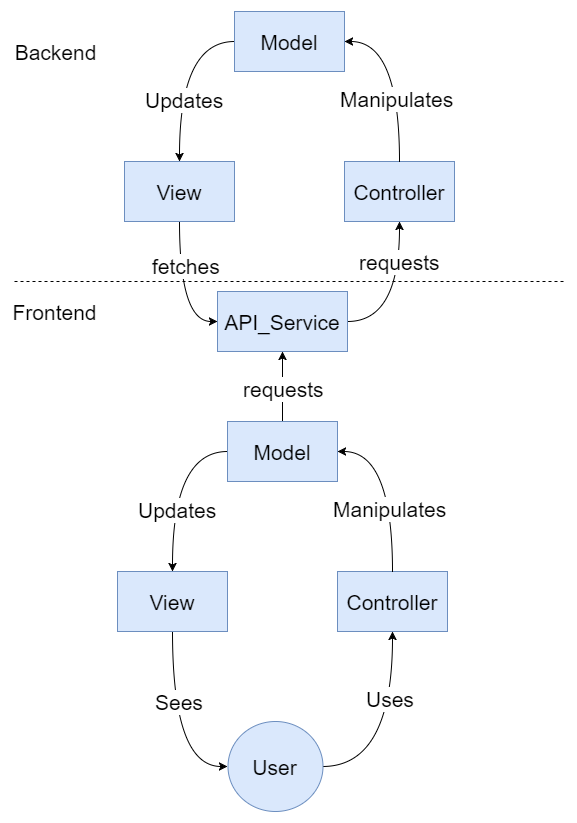
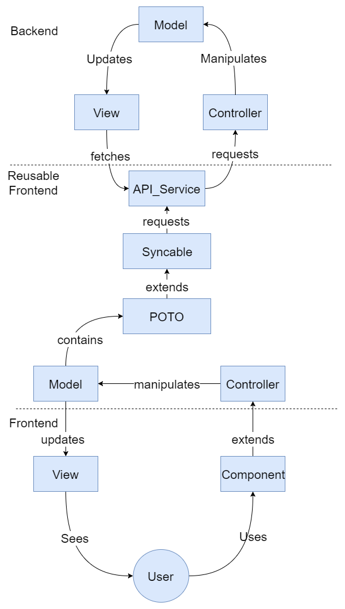

# 四、导航模式

在本章中，我们将探讨一些最有用的导航面向对象模式，并学习如何以角度的方式应用它们。导航模式用于组织与用户在应用程序上的导航相关的事件。

Angular 本身就是一个面向对象的框架，它迫使您以某种方式进行大部分开发。例如，您需要具有组件、服务、管道等。强制使用这些构建块有助于构建一个好的体系结构，非常类似于 Zend 框架对 PHP 的作用，或者 Ruby on Rails 对 Ruby 的作用。当然，除此之外，框架可以让您的生活更轻松，加快开发时间。

虽然设计事物的角度远高于平均水平，但我们总能做得更好。我并不认为我在本章中介绍的是终极设计，你将能够使用它们来解决任何问题，从面包店一号寻呼机到火星一号任务的仪表盘。不幸的是，这种设计并不存在，但它将最终改善你的工具带。

在本章中，我们将了解以下模式：

*   模型视图控制器
*   重演

# MVC

哦，MVC，很好的老 MVC。多年来你为我们服务得很好。现在，人们希望你退休，如果可能的话，不要大惊小怪。就连我也能看出，年轻的单向用户界面体系结构可以比你更聪明，让你看起来像是过去的遗物。

在本节中，我们将首先描述模型视图控制器是什么，而不管用于实现它的编程语言是什么，然后我们将看到将 MVC 应用于前端编程的缺点。最后，我将介绍一种实现 MVC 的方法，该方法在实现、维护和性能方面对 Angular 很有意义。

# 整体模型视图控制器

模型-视图-控制器设计模式背后的整个原理相对简单。实际上，如下图所示，它由三个块组成：模型、视图和控制器：


Model-view-controller overview

组成部分如下：

*   模型根据控制器发送的命令存储应用程序所需的数据。
*   控制器接收来自用户的操作（例如单击按钮），并相应地指示模型更新。它还可以在任何给定时刻切换使用哪个视图。
*   每次模型更改时都会生成和更新视图。

就这样。

让我们看看纯类型脚本中的简单 MVC 实现是什么样子。

首先，让我们定义一个`Movie`类，就像我们在[第 3 章](3.html)*经典模式*中所做的那样。在这个版本的`Movie`类中，我们只有两个属性：`title`和`release_year`，它们是使用 TypeScript 构造函数定义的：

```ts
class Movie{ 

    constructor(private title:string, private release_year:number){} 

    public getTitle():string{ 
        return this.title; 
    } 
    public getReleaseYear():number{ 
        return this.release_year; 
    } 
} 
```

然后，我们定义一个`Model`类，该类使用`reference`关键字导入包含`Movie`类的`movie.ts`文件。这个负责更新视图的模型类有一个电影数组和两个方法。第一种方法`addMovie(title:string, year:number)`是`public`，并在`movies`属性的末尾追加一个新电影。它还调用类的第二个方法`appendView(movie:Movie)`，即`private`。第二种方法根据模型视图控制器定义操纵视图。视图操作相当简单：我们在视图的`#movie`元素中添加了一个新的`li`标记。新创建的`li`标签的内容是电影名称和发行年份的串联：

```ts
/// <reference path="./movie.ts"/> 

class Model{ 

    private movies:Movie[] = []; 

    constructor(){ 
    } 

    public addMovie(title:string, year:number){ 
        let movie:Movie = new Movie(title, year); 
        this.movies.push(movie); 
        this.appendView(movie); 
    } 

    private appendView(movie:Movie){ 
        var node = document.createElement("LI");  
        var textnode = document.createTextNode(movie.getTitle() + "-" + movie.getReleaseYear());  
        node.appendChild(textnode); 
        document.getElementById("movies").appendChild(node); 
    } 

} 
```

现在我们可以为纯 TypeScript 模型视图控制器定义一个控制器。控制器具有在构造函数中启动的`private model:Model`属性。此外，还定义了一种`click`方法。该方法在标题和发布年份的参数中分别取一个`string`和一个`number`。如您所见，`click`方法将标题和发布年份转发给模型的`addMovie`方法。然后，控制器的工作就完成了。它不会操纵视图。您还会注意到`controller.ts`文件的最后一行：`let controller = new Controller();`。此行允许我们创建视图可以绑定到的控制器实例：

```ts

/// <reference path="./model.ts"/> 

class Controller{ 

    private model:Model; 

    constructor(){ 

        this.model = new Model(); 
    } 

    click(title:string, year:number){ 

        console.log(title, year); 
        this.model.addMovie(title, year); 

    } 

} 
let controller = new Controller(); 
```

模型-视图-控制器实现的最后一部分是视图。我们有一个简单的 HTML 表单，在提交时调用以下内容：`controller.click(this.title.value, this.year.value); return false;`。`controller`已在`controller.ts`文件中用`let controller = new Controller();`定义。然后，对于参数，我们发送`this.title.value`和`this.year.value`，其中`this`表示`<form>`。`title`和`year`分别指电影的标题和发行年份字段。我们还必须添加`return false;`以防止页面重新加载。实际上，HTML 表单在提交时的默认行为是导航到操作 URL：

```ts
<html> 
    <head> 
        <script src="mvc.js"></script> 
    </head> 
    <body> 
        <h1>Movies</h1> 

        <div id="movies"> 

        </div> 

        <form action="#" onsubmit="controller.click(this.title.value, this.year.value); return false;"> 

            Title: <input name="title" type="text" id="title"> 
            Year: <input name="year" type="text" id="year"> 
           <input type="submit"> 
        </form> 

    </body> 
</html> 
```

在头部，我们添加了由以下命令生成的`mvc.js`脚本：`tsc --out mvc.js controller.ts model.ts movie.ts`。生成的 JavaScript 如下所示：

```ts
var Movie = /** @class */ (function () { 
    function Movie(title, release_year) { 
        this.title = title; 
        this.release_year = release_year; 
    } 
    Movie.prototype.getTitle = function () { 
        return this.title; 
    }; 
    Movie.prototype.getReleaseYear = function () { 
        return this.release_year; 
    }; 
    return Movie; 
}()); 
/// <reference path="./movie.ts"/> 
var Model = /** @class */ (function () { 
    function Model() { 
        this.movies = []; 
    } 
    Model.prototype.addMovie = function (title, year) { 
        var movie = new Movie(title, year); 
        this.movies.push(movie); 
        this.appendView(movie); 
    }; 
    Model.prototype.appendView = function (movie) { 
        var node = document.createElement("LI"); 
        var textnode = document.createTextNode(movie.getTitle() + "-" + movie.getReleaseYear()); 
        node.appendChild(textnode); 
        document.getElementById("movies").appendChild(node); 
    }; 
    return Model; 
}()); 
/// <reference path="./model.ts"/> 
var Controller = /** @class */ (function () { 
    function Controller() { 
        this.model = new Model(); 
    } 
    Controller.prototype.click = function (title, year) { 
        console.log(title, year); 
        this.model.addMovie(title, year); 
    }; 
    return Controller; 
}()); 
var controller = new Controller(); 
```

在执行端，在加载时，HTML 页面将与以下屏幕截图中的页面类似：


Model-view-controller at loading point

然后，如果使用表单并添加电影，它将自动影响视图并显示新电影：


Model-view-controller after using the form

# 前端的模型视图控制器限制

那么，当涉及到 Angular 等框架支持的前端编程时，为什么模型-视图-控制器模式没有被广泛使用呢？首先，如果您正在为提供服务的应用程序使用 Angular，那么您可能有一个后端，可以与之交换某种信息。然后，如果您的后端也使用模型-视图-控制器设计模式，那么您将得到以下层次结构：



Model-view-controller frontend and backend

在这个层次结构中，我们在另一个 MVC 实现之上有一个 MVC 实现。这些实现通过向后端控制器发送请求并解析结果视图的 API 服务相互通信。作为一个具体的例子，如果你的用户必须登录你的应用程序，他们将在前端看到`signin`视图，该视图由`user`型号和`signin`控制器驱动。输入所有信息（电子邮件地址、密码）后，用户单击登录按钮。此单击触发模型更新，然后模型使用 API 服务触发 API 调用。API 服务向 API 的“用户/登录”端点发出请求。在后端，请求由`user`控制器接收并转发到`user`型号。后端`user`模型将查询您的数据库，查看是否有与提供的电子邮件地址和密码匹配的用户。最后，将输出一个视图，其中包含登录成功时的用户信息。回到前端，API 服务将解析生成的视图，并将相关信息返回到前端`user`模型。反过来，前端`user`模型将更新前端`view`。

对于一些开发人员来说，许多层和架构在前端和后端都有点重复的事实让人感觉不对劲，尽管它通过定义良好的关注点分离带来了可维护性。

双模型视图控制器不是唯一的问题。另一个问题是前端模型将不是*纯*模型，因为它们必须考虑与 UI 本身有关的变量，如可视选项卡、表单有效性等。因此，前端模型往往会变成可怕的代码块，其中 UI 变量与用户的实际表示相互摩擦。

现在，和往常一样，您可以避免这些陷阱并利用 MVC 模式的优势。让我们在下一节中看看如何操作。

# Angular 的模型视图控制器

在本节中，我将以 Angular 的形式介绍一个 MVC 的体系结构，它已经证明了自己。过去 18 个月，我在`toolwatch.io`（网络、安卓和 iOS）使用了这种架构。显然，我们在 web 版本或移动应用程序上提出的功能是相同的，并且以相同的方式工作。视图和导航模式有哪些更改。

下图显示了总体架构：



MVC for Angular

从上到下，我们有后端、前端的可重用部分和专用前端（移动或 web）。正如您所看到的，在后端，没有任何变化。我们保留了经典的 MVC。请注意，前端部件也可以与非 MVC 后端一起使用。

我们的模型将使用该服务通过一个假设的脚本从远程数据库获取、放置和删除一个普通的 TypeScript 对象；JSON API。

下面是我们的`user`类型脚本对象的外观：

```ts
class User { 

    public constructor(private _email:string, private _password:string){} 

    get email():string{ 
        return this._password; 
    } 

    get password():string{ 
        return this._email; 
    } 

    set email(email:string){ 
        this._password = email; 
    } 

    set password(password:string){ 
        this._email = password; 
    } 
} 
```

这里没什么特别的；只有包含两个属性的普通 TypeScript 对象：`email:_string`和`password:_string`。这两个属性在构造函数中使用 TypeScript 内联声明样式初始化。我们还利用 TypeScript 的 getter/setter 来访问`_password:string`和`_email:string`属性。您可能已经注意到，TypeScript 的 getter/setter 看起来像 C#properties。嗯，微软是 TypeScript 的主要工业调查公司之一，所以这是有道理的。

我确实喜欢编写的简洁性，尤其是当与构造函数中的内联属性声明相结合时。然而，我不喜欢的是必须使用带下划线的变量名。问题是，这个类型脚本将再次被转换为 JavaScript，在 JavaScript 中，变量和函数比 Java 或 C#更抽象。

实际上，在我们当前的示例中，我们可以如下调用`User`类的 getter：

```ts
user:User = new User('mathieu.nayrolles@gmail.com', 'password');

 console.log(user.email); // will print mathieu.nayrolles@gmail.com
```

正如您所看到的，TypeScript 并不关心它调用的目标的类型。它可以是名为`email`的变量或名为`email()`的函数。不管怎样，它都是有效的。对于 JavaScript 中的面向对象程序员来说，这些奇怪行为背后的基本原理是，可以接受执行以下操作：

```ts

 var email = function(){
     return "mathieu.nayrolles@gmail.com";
 }
 console.log(email);
```

因此，我们需要用不同的名称来区分函数的实际变量，从而得到`_`。

现在让我们回到 MVC 实现，因为我们有一个傻瓜式的用户对象可以操作。现在，我们可以有一个`user`模型来操作`user`POTO（普通旧类型脚本对象）和图形界面所需的变量：

```ts
import { User } from '../poto/user'; 
import { APIService } from '../services/api.service'; 

export class UserModel{ 

    private user:User; 
    private _loading:boolean = false; 

    public constructor(private api:APIService){} 

    public signin(email:string, password:string){ 

        this._loading = true; 

        this.api.getUser(email, password).then( 

            user => { 
                this.user = user; 
                this._loading = false; 
            } 
        ); 
    } 

    public signup(email:string, password:string){ 

        this._loading = true; 
        this.api.postUser(email, password).then( 
            user => { 
                this.user = user; 
                this._loading = false; 
            }    
        ); 
    } 

    get loading():boolean{ 
        return this._loading; 
    } 

} 
```

我们的模型名为`UserModel`，注射了`APIService`。`APIService`的实现留给读者作为练习。除了`APIService`之外，`UserModel`还拥有`user:User`和`loading:bool`属性。`user:User`代表实际用户及其密码和电子邮件地址。然而，`loading:bool`将用于确定加载微调器是否应在视图中可见。如您所见，`UserModel`定义了`signin`和`signup`方法。在这些方法中，我们调用`APIService`的`getUser`和`postUser`方法，这两个方法都在参数中接受用户，并返回包含已通过 JSON API 同步的用户的承诺。收到这些承诺后，我们关闭`loading:bool`旋转器。

以下是`APIService`：

```ts
import { Injectable } from '@angular/core'; 
import { Http }  from '@angular/http'; 
import { User } from '../poto/user'; 
import { Observable } from 'rxjs/Rx'; 
import 'rxjs/Rx'; 
import { resolve } from 'dns'; 
import { reject } from 'q'; 

@Injectable() 
export class APIService { 

  private userURL:string = "img/users.json"; 

  constructor(private http: Http) { } 

  /** 
   * Return a Promise to a USer matching id 
   * @param  {string}            email 
   * @param  {string}            password 
   * @return {Promise<User>}    
   */ 
  public getUser(email:string, password:string):Promise<User>{ 
      console.log('getUser', email, password); 

        return this.http.get(this.userURL) 
        /** 
         * Transforms the result of the http get, which is observable 
         * into one observable by item. 
         */ 
        .flatMap(res => res.json().users) 
        /** 
         * Filters users by their email & password 
         */ 
        .filter((user:any)=>{ 
            console.log("filter", user); 
            return (user.email === email && user.password == password) 
        }) 
        .toPromise() 
        /** 
         * Map the json user item to the User model 
        */ 
        .then((user:any) => { 
            console.log("map", user);  
            return new User( 
                email, 
                password 
            ) 
        }); 
  }  

   /** 
   * Post an user Promise to a User 
   * @param  {string}            email 
   * @param  {string}            password 
   * @return {Promise<User>}    
   */ 
  public postUser(email:string, password:string):Promise<User>{ 

    return new Promise<User>((resolve, reject) => { 
        resolve(new User( 
            email, 
            password 
        )); 
    }); 
  } 

} 
```

`APIService`通过 HTTP 调用解析包含用户的本地 JSON 文件：

```ts
{ 
    "users":[{ 
        "email":"mathieu.nayrolles@gmail.com", 
        "password":"password" 
    }] 
} 
```

`getUser(email:string, password:string):Promise<User>`和`postUser(email:string, password:string):Promise<User>`正在使用承诺，就像我们在上一章中向您展示的一样。

然后是控制器，它也是角度环境中的一个组件，因为角度组件控制显示的视图，依此类推：

```ts
@Component({
     templateUrl: 'user.html'
 })
 export class UserComponent{

     private model:UserModel;

     public UserComponent(api:APIService){

         this.model = new UserModel(api);
     }

     public signinClick(email:string, password:string){
         this.model.signin(email, password);
     }

     public signupClick(email:string, password:string){
         this.model.signup(email, password);
     }

 }
```

如您所见，控制器（组件）非常简单。我们只有一个对模型的引用，我们收到一个注入的`APIService`将被传输到模型。然后，我们有`signinClick`和`signupClick`方法，它们接收来自视图的用户输入并将其传输到模型。最后一块视图如下所示：

```ts

 <h1>Signin</h1>

 <form action="#" onsubmit="signinClick(this.email.value, this.password.value); return false;">

     email: <input name="email" type="text" id="email">
     password: <input name="password" type="password" id="password">
    <input [hidden]="model.loading" type="submit">
    <i [hidden]="!model.loading" class="fa fa-spinner" aria-hidden="true"></i>
 </form>

 <h1>Signup</h1>

 <form action="#" onsubmit="signupClick(this.email.value, this.password.value); return false;">

     email: <input name="email" type="text" id="email">
     password: <input name="password" type="password" id="password">
     <input [hidden]="model.loading" type="submit">
     <i [hidden]="!model.loading" class="fa fa-spinner" aria-hidden="true"></i>
 </form>
```

在这里，我们有两个表格：一个用于签名，另一个用于注册。除了他们使用的`onsubmit`方法外，其他形式都很相似。签到表使用控制器的`signinClick`方法，签到表使用`signupClick`方法。除了这两个表单之外，我们还在每个表单上都有一个*字体可怕的*微调器，只有在用户模型*加载*时才可见。我们通过使用`[hidden]`角度指令`[hidden]="!model.loading"`来实现这一点。同样，在加载模型时，“提交”按钮也会隐藏。

这里是一个应用于 Angular 的功能性 MVC。

正如我在本节开头所说的，对我来说，MVC 模式在 Angular 中的真正用处来自于它的可扩展性。事实上，利用 TypeScript 的面向对象特性（以及随之而来的特性），我们可以为不同的角度应用专门化控制器和模型。例如，如果您有一个 Angular 网站和一个 Angular 移动应用程序，就像我对`toolwatch.io`所做的那样，那么您就有了可以在双方使用的业务逻辑。这将是一个遗憾，有两个登录，两个注册，以及随着时间的推移，当我们只有一个代码和维护的一切！

例如，在`toolwatch.io`，web 应用程序使用标准 Angular，我们使用 Ionic 和 Angular 构建移动应用程序。显然，我们在移动应用程序（Android 和 iOS）和网站之间共享了很多前端逻辑。最终，它们趋向于实现相同的目的和功能。唯一的区别是用来利用这些功能的媒介。

在下图中，我粗略地描述了一种利用 MVC 模式的更完整的方式，重点是可重用性和可扩展性：


MVC for Angular

同样，后端保持原样。我们有相同的 MVC 模式。作为提醒，后端的 MVC 模式完全取决于您，例如，您可以利用前端 MVC 模式和功能性 Go 后端。与之前版本的 MVC 不同之处在于引入了*可重用前端*部件。在这一部分中，我们仍然有一个 API 服务负责使用 JSON API。然后，我们有一个实现`IModel`接口的模型：

```ts

 export interface IModel{

     protected get(POTO):POTO;
     protected put(POTO):POTO;
     protected post(POTO):POTO;
     protected delete(POTO):boolean;
     protected patch(POTO):POTO;

 }
```

此接口定义了后续模型中必须实现的`put`、`post`、`delete`和`patch`方法。这些方法作为参数并返回的`POTO`类型是程序中任何域模型的母类。域模型表示您的业务逻辑的可同步实体，如我们以前使用的`User`。不要混淆域模型和模型视图控制器的模型部分。它们根本不是一回事。在这种架构中，`User`将花费`POTO`。

模型（本次为模型视图控制器）除实现`IModel`接口外，还包含一个`POTO`。它还包含更新视图所需的变量和方法。正如我在本节前面所展示的，模型本身的实现相当简单。但是，我们可以通过利用 TypeScript 的通用方面将事情提升到一个新的高度，并设想如下：

```ts

 export class AbstractModel<T extends POTO> implements IModel{
     protected T domainModel;

     public AbstractModel(protected api:APIService){}

     protected get(POTO):T{
         //this.api.get ...
     };
     protected put(T):T{
         //this.api.put...
     };
     protected post(T):T{
         //this.api.post...
     };
     protected delete(T):boolean{
         //this.api.delete...
     };
     protected patch(T):T{
         //this.api.patch...
     };
 }

 export class UserModel extends AbstractModel<User>{

     public AbstractModel(api:APIService){
         super(api);
     }

     public signin(email:string, password:string){

         this._loading = true;

         this.get(new User(email, password)).then(

             user => {
                 this.user = user;
                 this._loading = false;
             }
         );
     }

     public signup(email:string, password:string){

         this._loading = true;
         this.post(new User(email, password)).then(
             user => {
                 this.user = user;
                 this._loading = false;
             }   
         );
     }
     //Only the code specialized for the UI ! 
 }
```

这里，我们有一个受`POTO`约束的通用`AbstractModel`。这意味着`AbstractModel`泛型类（在 C++等语言中称为模板）的实际实例被约束为具有专门化`POTO`的类。换言之，只能使用`User`等领域模型。到目前为止，关注点分离及其可重用性都非常好。可重用部件的最后一部分是控制器。在我们的注册/登录示例中，它看起来非常像：

```ts
export class UserController{

     public UserComponent(protected model:UserModel){
     }

     public signin(email:string, password:string){
         this.model.signin(email, password);
     }

     public signup(email:string, password:string){
         this.model.signup(email, password);
     }

 }
```

现在，为什么我们需要一个额外的构建块，为什么我们不能像使用角度模型视图控制器的简单版本那样使用一个简单的角度组件？好吧，问题是，取决于你在角核（离子，流星，等等）上使用什么，组件不一定是主要的构建块。例如，在 Ionic2 世界中，您使用`Pages`，这是经典组件的自定义版本。

因此，例如，移动部件将如下所示：

```ts
export class LoginPage extends UserController{

     public LoginPage(api:APIService){
         super(new UserModel(api));
     }

     //Only what's different on mobile !

 }
```

如果需要，还可以扩展`UserModel`并添加一些专门化，如上图所示。在浏览器端：

```ts
@Component({
     templateUrl: 'login.html'
 })
 export class LoginComponent extends UserController{

     public UserComponent(api:APIService){

         super(new UserModel(api));
     }

     //Only what's different on browser !

 }
```

同样，您也可以扩展`UserModel`并添加一些专门化。要覆盖的唯一剩余块是视图。让我失望的是，没有办法使用扩展或样式文件。因此，除非移动应用程序和浏览器应用程序之间的 HTML 文件完全相同，否则客户端之间的 HTML 文件注定会重复。根据经验，这种情况并不经常发生。

整个可重用前端可以作为 Git 子模块、独立库或`NgModule`交付。我个人使用 git 子模块的方法，因为它允许我拥有两个独立的存储库，同时在对共享前端执行修改时，在我正在使用的客户端上享受自动刷新。

请注意，如果有多个前端连接到同一后端，而不是多个类型的前端，则此模型视图控制器也可以工作。例如，在电子商务设置中，您可能希望有不同品牌的网站来销售在同一后端管理的不同产品，就像 Magento 的视图一样。

# 重演

Redux 是一种模式，允许您以安全的方式管理事件和应用程序状态。它允许您确保在单个不可访问的位置管理由导航事件或非导航事件导致的应用程序范围的状态。

通常，应用程序的状态存储在 TypeScript 接口中。按照上一节中使用的示例，我们将使用使用 JSON 的自定义`APIService`为用户实现登录/注销功能。在我们的例子中，应用程序只有一个状态：`logged`。因此，接口将如下所示：

```ts
export interface IAppState { 
    logged: boolean; 
} 
```

此接口仅包含一个记录的布尔值。为这样一个公共变量提供一个接口似乎有些过分，但当应用程序开始增长时，您会发现它非常方便。我们的应用程序状态只能通过`Action`进行操作。动作是 redux 框架内的一种事件，由`Reducer`触发和拦截。`Reducer`截取操作并操纵应用程序的状态。`Reducer`是唯一可以发生状态变化的地方。

现在我们已经对 redux 模式有了一个快速的概述，是时候深入研究它的实现了。首先，我们需要创建一个新的 Angular 项目并安装所需的软件包：

*   `**ng new ng-redux**`
*   `**cd ng-redux**`
*   `**npm install  – save redux @angular-redux/store**`

接下来，我们将创建我们的操作。作为提醒，操作由应用程序触发，并被`reducer`拦截，以操纵应用程序状态。在我们的应用程序中，我们只有两个操作：登录和注销：

```ts
import { Injectable } from '@angular/core'; 
import { Action } from 'redux'; 

@Injectable() 
export class LoginAction { 
  static LOGIN = 'LOGIN'; 
  static LOGOUT = 'LOGOUT'; 

  loggin(): Action { 
    return { type: LoginAction.LOGIN }; 
  } 

  logout(): Action { 
    return { type: LoginAction.LOGOUT }; 
  } 
} 
```

正如我们在前面的代码中所看到的，`LoginAction`类是一个角度服务，因为它是可注入的。因此，我们架构的任何一部分都可以通过 Angular 的自动依赖项注入机制（如前一章所述）接收操作列表。另一件需要注意的事情是，我们的两个动作正在返回，`Actions`。`action`类由`type`字段组成，我们使用静态字符串变量来填充它们。

列表中的下一项是 reducer，它截获触发的动作并相应地操纵应用程序的状态。减速器可按如下方式实现：

```ts
import { Action } from 'redux'; 
import { LoginAction } from './app.actions'; 

export interface IAppState { 
    logged: boolean; 
} 

export const INITIAL_STATE: IAppState = { 
  logged: false, 
}; 

export function rootReducer(lastState: IAppState, action: Action): IAppState { 
  switch(action.type) { 
    case LoginAction.LOGIN: return { logged: !lastState.logged }; 
    case LoginAction.LOGOUT: return { logged: !lastState.logged }; 
  } 

  // We don't care about any other actions right now. 
  return lastState; 
}
```

目前，我们的 reducer 只管理两个操作：登录和注销。在接收到动作时，我们使用 switch 语句检查动作类型，并简单地反转记录状态的值。由于我们的接口，这是我们唯一可以修改应用程序状态的地方。乍一看，它可能被视为一个瓶颈和关注点分离不良。现在，瓶颈部分，在所有发生在那里的意义上，是设计的。Redux 背后的主要思想是，复杂的有状态 JavaScript 应用程序很难管理，因为应用程序的状态可以以多种方式更改。例如，异步调用和导航事件都可以以微妙且难以调试的方式更改应用程序的整体状态。在这里，使用 Redux 功能，一切都在同一个地方进行管理。对于非常有效的分离关注点参数，没有什么可以阻止我们在命名良好的松散耦合函数中操纵状态（例如，在我们的例子中为`return { logged: !lastState.logged };`）。

现在，我们的存储、Redux 和操作已经实现，我们可以开始在组件中操作它们：

```ts
import { Component, OnDestroy } from '@angular/core'; 

import { NgRedux } from '@angular-redux/store'; 
import { LoginAction } from './app.actions'; 
import { IAppState } from "./store"; 
import { APIService } from './api.service'; 

@Component({ 
  selector: 'app-root', 
  templateUrl: './app.component.html', 
  styleUrls: ['./app.component.css'] 
}) 
export class AppComponent implements OnDestroy {  
  title = 'app'; 
  subscription; 
  logged: boolean; 

  constructor(                           
    private ngRedux: NgRedux<IAppState>, 
    private api:APIService) { 

      this.subscription = ngRedux.select<boolean>('logged') 
      .subscribe(logged => this.logged = logged);    
    }  

  login(email:string, password:string) { 
    this.api.login(email, password); 
  } 

  logout() { 
    this.api.logout(); 
  } 

  ngOnDestroy() {                     
    this.subscription.unsubscribe();  
  }     
} 
```

这里发生了很多事情。让我们把它一块一块地分解。首先，是构造器：

```ts
constructor(                           
    private ngRedux: NgRedux<IAppState>, 
    private api:APIService) { 

      this.subscription = ngRedux.select<boolean>('logged') 
      .subscribe(logged => this.logged = logged);    
    }  
```

在这个构造器中，我们希望接收到一个控制我们的状态的注入`NgRedux<IAppState>`和一个从上一节稍微修改的`APIService`，以适应我们的新模式。在构造函数内部，我们有`ngRedux.select<boolean>('logged')`指令，它允许我们从`IAppState`接口访问记录的变量的可观察值。如您所见，通过设计，此处不可能更改`logged`的值，因为您只能获得一个可观察到的值。作为一个可观察对象，我们可以订阅它，并在其值发生变化时定义一个组件。在我们的例子中，我们将 logged 类成员的值影响为 logged 状态的新值。

接下来是作为`ApiService`调用代理的登录和注销方法：

```ts
  login(email:string, password:string) { 
    this.api.login(email, password); 
  } 

  logout() { 
    this.api.logout(); 
  } 
```

最后，通过实现`OnDestroy`接口，我们可以看到`ngOnDestroy`功能的强制实现。虽然不是强制性的，`ngOnDestroy`功能从记录的观察者处取消订阅，如果记录的状态发生变化且组件不再存在，这将节省我们几毫秒的时间：

```ts
  ngOnDestroy() {                     
    this.subscription.unsubscribe();  
  }     
```

让我们看看链接到我们组件的 HTML。它相当简单，只显示 logged state 的值和两个按钮，您已经猜到了，这两个按钮允许我们登录和退出应用程序：

```ts
<div style="text-align:center"> 
  <p>{{logged}}</p> 
  <button (click)="login('foo', 'bar')">Login</button> 
  <button (click)="logout()">Logout</button> 
</div> 
```

下面是它的样子：


列表中的下一项是对`APIService`的修改，以便它使用我们的新模式而不是 MVC：

```ts
import { Injectable } from '@angular/core'; 
import { Http }  from '@angular/http'; 
import { User } from './user'; 
import 'rxjs/Rx'; 
import { NgRedux } from '@angular-redux/store'; 
import { LoginAction } from './app.actions'; 
import {IAppState } from './store'; 

@Injectable() 
export class APIService { 

  private userURL:string = "img/users.json"; 

  constructor( 
      private http: Http,  
      private ngRedux: NgRedux<IAppState>,  
      private actions: LoginAction) { } 

  /** 
   * Return a Promise to a USer matching id 
   * @param  {string}            email 
   * @param  {string}            password 
   * @return {Promise<User>}    
   */ 
  public login(email:string, password:string){ 
        console.log('login', email, password); 

        this.http.get(this.userURL) 
        /** 
         * Transforms the result of the http get, which is observable 
         * into one observable by item. 
         */ 
        .flatMap(res => res.json().users) 
        /** 
         * Filters users by their email & password 
         */ 
        .filter((user:any)=>{ 
            console.log("filter", user); 
            return (user.email === email && user.password == password) 
        }) 
        .toPromise() 
        /** 
         * Map the json user item to the User model 
        */ 
        .then((user:any) => { 
            console.log("map", user);  
            this.ngRedux.dispatch(this.actions.loggin()); 
        }); 
  }  

   /** 
   * Logout a User 
   */ 
  public logout(){ 
        this.ngRedux.dispatch(this.actions.logout()); 
  } 

} 
```

在这个版本中，我们使用相同的技术，只是我们不再回复承诺。事实上，在这个版本中，我们只需向我们的 reducer 发送以下操作：

```ts
this.ngRedux.dispatch(this.actions.loggin()); 
```

以及：

```ts
this.ngRedux.dispatch(this.actions.logout()); 
```

再次，对国家的修改是间接的；我们只是简单地发送一个将被还原程序捕获的操作，而不是操纵状态。换句话说，它是安全的，集中在一个点上。

最后，我们需要调整主应用程序模块以反映我们的所有更改：

```ts
import { BrowserModule } from '@angular/platform-browser'; 
import { NgModule } from '@angular/core'; 
import { HttpModule } from '@angular/http'; 

import { NgReduxModule, NgRedux } from '@angular-redux/store'; 
import { AppComponent } from './app.component'; 

import { rootReducer, IAppState, INITIAL_STATE } from './store'; 
import { LoginAction } from './app.actions'; 
import { APIService } from './api.service'; 

@NgModule({ 
  declarations: [ 
    AppComponent 
  ], 
  imports: [ 
    NgReduxModule, 
    HttpModule, 
  ], 
  providers: [APIService, LoginAction], 
  bootstrap: [AppComponent] 
}) 
export class AppModule {  

  constructor(ngRedux: NgRedux<IAppState>) { 
    // Tell @angular-redux/store about our rootReducer and our initial state. 
    // It will use this to create a redux store for us and wire up all the 
    // events. 
    ngRedux.configureStore( 
      rootReducer, 
      INITIAL_STATE); 
  } 
} 
```

我们首先导入了`NgRedux`模块和`HttpModule`，将在应用程序中使用。然后，`AppModule`的构造函数将接收一个注入的`NgRedux`实例并配置我们的 Redux 存储。存储区还接收我们先前初始化的默认状态。

# 总结

在本章中，我们看到了两种模式：Redux 和 MVC。Redux 和 MVC 可用于实现相同的目的（管理应用程序对异步事件或用户操作的响应状态）。这两种模式都有优点和缺点。在我看来，MVC 在 Angular 应用程序中的优势在于，所有内容都定义得很好，并且相互分离。实际上，我们有一个域对象（`User`）、一个模型（`UserModel`）和一个链接到组件的视图。我们在许多组件和视图中看到了相同的模型和域对象，这有利于跨应用程序重用。问题是，在我们的应用程序中创建新功能可能会变得昂贵，因为您必须创建或至少修改一大块体系结构。

此外，无论是错误的还是设计的，如果您跨多个组件和服务共享模型，识别和消除 bug 的来源可能会非常痛苦。Redux 模式是最近才出现的，最重要的是，它更适合 JavaScript 生态系统，因为它是为它创建的。在我们的应用程序中添加状态方面的功能并以安全的方式操作它们相对容易。根据经验，我可以向您保证，在使用 Redux 模式时，整个团队被迷惑了好几天的 bug 要少得多。但是，应用程序中的关注点分离不太清楚，在最复杂的应用程序中，您可能会得到上千行 Redux。当然，我们可以在根减缩器之外创建几个减缩器，用大功能分隔存储区，并创建辅助函数来操纵状态。由于它不是由模式强加的，所以我发现自己经常在查看重构成本高昂的大量缩减器。

在下一章中，我们将研究 Angular 应用程序的稳定性模式，这将确保我们的应用程序在遇到所有不利因素时仍然可用。