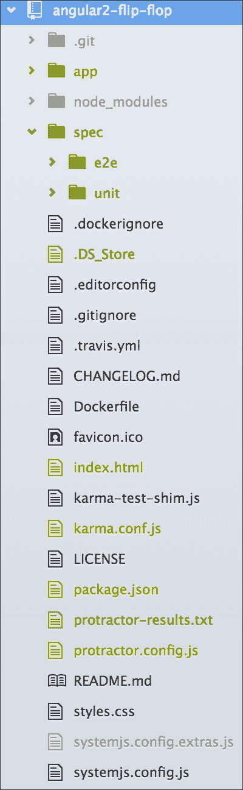
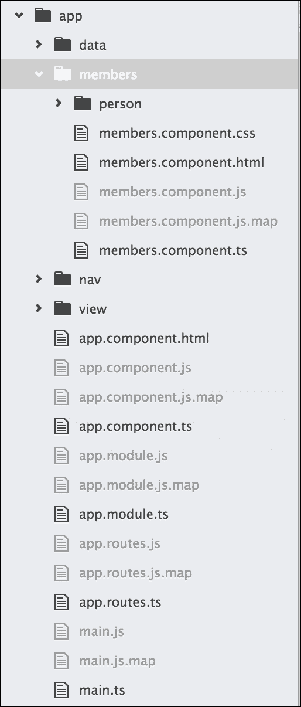
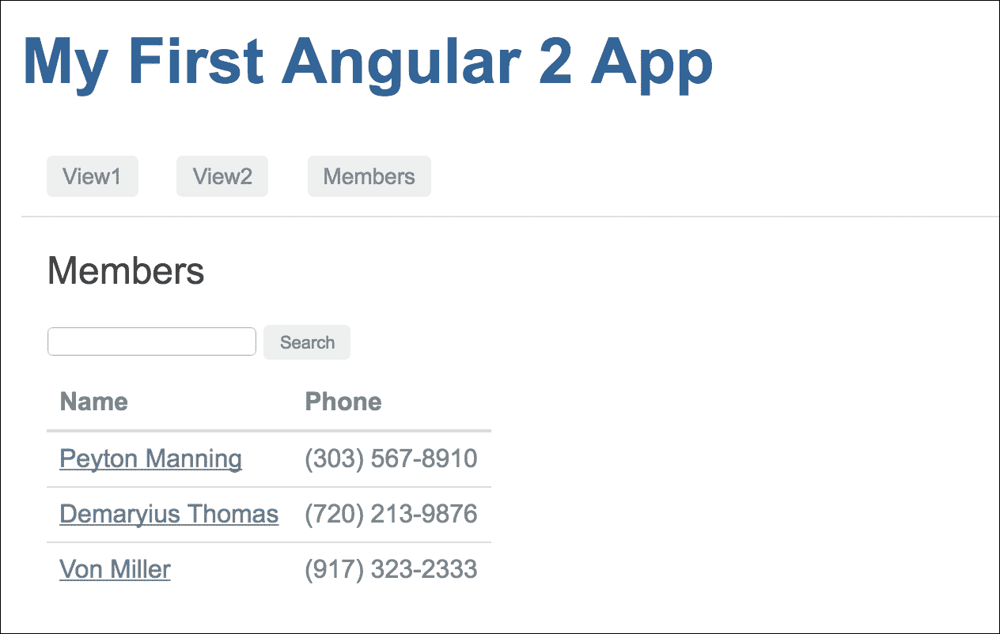
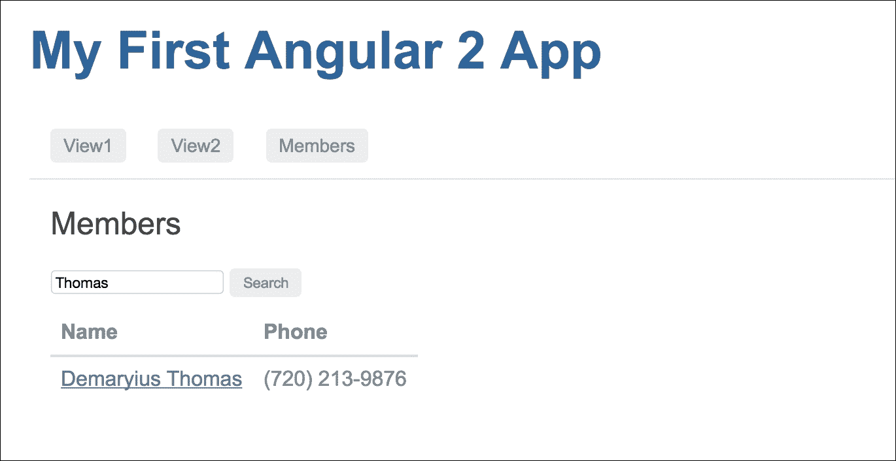

# 七、触发器

此时，我们应该对使用 TDD 执行角度应用程序的初始实现充满信心。此外，我们应该熟悉使用测试优先的方法。测试优先的方法在学习阶段是非常好的，但有时当我们遇到很多错误时，时间会变得很糟糕。对于简单且已知的行为，使用测试优先的方法可能不太好。

我们已经看到了测试优先的方法是如何工作的，所以我们可以通过检查任何特性而不创建那些组件来跳过这些步骤。除此之外，我们还可以更进一步，使我们更有信心更快地编写组件。我们可以准备好组件，然后编写端到端测试规范来测试预期的行为。如果 e2e 测试失败，我们可以在 Protractor 调试器中触发错误。

在本章中，我们将继续扩展应用 TDD（但不是测试优先方法）与角度测量的知识。这里我们不讨论基本角度分量生态系统的细节；相反，我们将前进一步，包括更多的角度特征。我们将进一步了解以下主题：

*   角路线
*   导航到路线
*   与路由参数数据通信
*   带有 CSS 和 HTML 元素的 Protractor 位置引用

# TDD 的基本原理

在本章中，我们将介绍如何将 TDD 应用于搜索应用程序的路线和导航。在进入演练之前，我们需要了解本章将使用的一些技术、配置和功能，包括以下内容：

*   Protractor 定位器
*   无头浏览器测试

在回顾了这些概念之后，我们可以继续进行漫游。

## Protractor 定位器

Protractor 定位器是每个人都应该花一些时间学习的关键组件。在前面的 Protractor 章节中，我们通过工作示例了解了一些常用的定位器。这里我们将提供一些 Protractor`Locator`的示例。

Protractor 定位器允许我们在 HTML 页面中查找元素。在本章中，我们将看到 CSS、HTML 和特定于角度的定位器的作用。定位器被传递到`element`功能。`element`函数将查找并返回页面上的元素。通用定位器语法如下所示：

```ts
element(by.<LOCATOR>); 

```

在前面的代码中，`<LOCATOR>`是一个占位符。以下各节介绍了其中几个定位器。

### CSS 定位器

CSS 用于向 HTML 页面添加布局、颜色、格式和样式。从端到端测试的角度来看，元素的外观和样式可能是规范的一部分。举个例子，考虑下面的 HTML 片段：

```ts
<div class="anyClass" id="anyId"></div> 
// ... 
var e1 = element(by.css('.anyClass')); 
var e2 = element(by.css('#anyId')); 
var e3 = element(by.css('div')); 
var e4 = $('div'); 

```

这四个选项都将选择`div`元素。

### 按钮和链接定位器

除了能够选择和解释事物的外观外，能够在页面中找到按钮和链接也很重要。这将允许测试轻松地与站点交互。以下是几个例子：

*   `buttonText`定位器：

```ts
        <button>anyButton</button> 
        // ... 
        var b1 = element(by.buttonText('anyButton')); 

```

*   `linkText`定位器：

```ts
        <a href="#">anyLink</a> 
        // ... 
        var a1 = element(by.linkText('anyLink')); 

```

### URL 位置引用

在测试角度路由时，我们需要能够测试测试的 URL。通过在 URL 和位置周围添加测试，我们必须确保应用程序使用特定的路由。这一点很重要，因为路由为我们的应用程序提供了一个接口。以下是如何在 Protractor 测试中获取 URL 引用：

```ts
var location = browser.getLocationAbsUrl(); 

```

现在，我们已经了解了如何使用不同的定位器，是时候使用这些知识了。

# 准备角度项目

获得快速设置项目的流程和方法非常重要。您花在思考目录结构和所需工具上的时间越少，您可以花在开发上的时间就越多！

因此，在前面的章节中，我们研究了如何将 Angular 的简单现有项目开发为`quickstart`项目（[https://github.com/angular/quickstart [T2]。](https://github.com/angular/quickstart)

然而，有些人使用`angular2-seed`（[https://github.com/mgechev/angular2-seed](https://github.com/angular/angular-seed) ）项目，或创建自定义模板。虽然这些技术很有用，也有它们的优点，但当从角度出发时，理解从头开始构建应用程序需要什么是至关重要的。通过自己构建目录结构和安装工具，我们将更好地理解 Angular。

您将能够根据特定的应用程序和需求做出布局决策，而不是将它们装配到其他模块中。随着您的成长，成为一名更好的角度开发人员，这一步可能不需要，并且将成为您的第二天性。

## 加载现有项目

首先，我们将从[的角度`quickstart`项目中克隆该项目 https://github.com/angular/quickstart](https://github.com/angular/quickstart) ，重命名为`angular-flip-flop`，我们的项目文件夹结构如下：


在前面的章节中，我们讨论了如何设置项目，了解了涉及的不同组件，并走过了整个过程。我们将跳过这些细节，并假设您可以回忆起如何执行必要的安装。

## 准备项目

本`quickstart`项目没有将基地`href`包含在项目登录页（`index.html`中。我们需要这样才能完美地进行路由，因此让我们在`index.html`的`<head>`部分添加一行（`base href`：

```ts
<base href="/"> 

```

这里，我们的引导组件在应用程序组件中，HTML 模板在组件本身中。在继续之前，我们应该将模板分离到一个新文件中。

为此，我们将更新我们的应用程序组件（`app/app.component.ts`，如下所示：

```ts
import { Component } from '@angular/core'; 

@Component({ 
  moduleId: module.id, 
  selector: 'my-app', 
  templateUrl: 'app.component.html' 
}) 
export class AppComponent { 

}; 

```

让我们在`app/app.component.html`处创建单独的模板文件。代码如下所示：

```ts
<h1>My First Angular 2 App</h1> 

```

## 项目运行

让我们继续，并准备使用以下命令运行：

```ts
$ cd angular-flip-flop
$ npm install // To install the required node modules. 
$ npm run // To build and run the project in http server. 

```

要确认安装并运行项目，应用程序将自动在 web 浏览器中运行。

以下是运行项目后的预期输出：


## 项目重组

让我们稍微改变一下项目结构，但不要太多。默认情况下，它将单元测试包含在与组件文件相同的位置，并将 e2e 测试文件分隔在`e2e/`文件夹中`app/`文件夹之外。

但是，我们会将所有测试保持在同一位置，即在`app`之外；我们将所有测试保留为`spec/e2e`和`spec/unit`。

目标是将测试规范与组件分离。这样，我们就可以将单元测试文件保存在`spec/unit`文件夹的外部。

因此，我们当前的文件夹结构如下所示：



### 注

只要我们更改了单元测试和 e2e 测试的路径，我们就必须更改 Karma 配置和 Protractor 配置文件中的路径。

# 设置无头浏览器测试 Karma

在前面的章节中，我们使用默认配置运行 Karma。默认的 Chrome 配置会在每次测试时启动 Chrome。针对应用程序将在其中运行的实际代码和浏览器进行测试是一个强大的工具。但是，启动时，浏览器可能并不总是知道您希望它的行为。从单元测试的角度来看，您可能不希望在窗口中启动浏览器。原因可能是测试可能需要很长时间才能运行，或者您可能并不总是安装浏览器。

幸运的是，Karma 能够轻松配置无头浏览器 PhantomJS。无头浏览器在后台运行，不会在 UI 中显示网页。PhantomJS headless 浏览器是一个非常好的测试工具。它甚至可以设置为截图您的测试！阅读更多关于如何实现这一点以及 PhantomJS 网站[T0]上使用的 WebKit 的信息 http://phantomjs.org/ 。下面的设置配置将向我们展示如何使用 Karma 为无头浏览器测试设置 PhantomJS。

## 预配置

安装 Karma 后，它会自动包含 PhantomJS 浏览器插件。为进一步参考，该插件位于[https://github.com/karma-runner/karma-phantomjs-launcher](https://github.com/karma-runner/karma-phantomjs-launcher) 。不需要进行更多的安装或配置。

但是，如果您的安装程序声明缺少`karma-phantomjs-launcher`，您可以使用`npm`轻松安装，如下所示：

```ts
$ npm install karma-phantomjs-launcher --save -dev

```

## 配置

PhantomJS 在 Karma 配置的`browsers`部分配置。打开`karma.conf.js`文件并更新以下详细信息：

```ts
browsers: ['PhantomJS'], 

```

在`plugins`选项中也可以这样做：

```ts
plugins: [ 
        ......... 
        require('karma-phantomjs-launcher'), 
    ], 

```

现在项目已经初始化并配置了 headless browser 测试，您可以通过下面的演练看到它的运行。

# 角航线和导航的穿行

此漫游将利用角度路线。路线是 Angular 的一个非常有用的功能，就像它之前在 Angular 1.x 中一样，但功能更强大。它们允许我们使用不同的组件控制应用程序的某些方面。

本演练将在组件之间切换，向我们展示如何使用 TDD 构建路由。以下是规范。将有一个导航菜单，它有两个菜单项，**View1**和**View2**：

*   在导航菜单中，点击标签**View1**
*   内容区（路由出口）将加载/翻转**视图 1**内容

这是第二部分：

*   在导航菜单中，点击标签**View2**
*   内容区（路由出口）将加载/翻转**视图 2**内容

从本质上讲，这将是一个在两个视图之间进行切换的应用程序。

## 设置角度路线

路由是 Angular 中的可选服务，因此它不包含在 Angular 核心中。如果我们需要使用路由，我们必须在应用程序中安装 Angular`router`服务。

只要我们已经从`quickstart`克隆了我们的项目，我们应该没问题，因为它最近已经将 Angular router 添加到了它的依赖项中，但是我们应该检查并确认。如果它在`package.json`中的依赖项中没有`@angular/router`，我们可以使用`npm`安装角度路由，如下所示：

```ts
$ npm install @angular/router --save

```

### 确定方向

管线指定了一个位置并期望得到一个结果。从角度来看，必须首先指定管线，然后将其与某些组件关联。

为了在我们的应用程序中实现路由，我们需要在应用程序模块中导入路由模块，它将在应用程序中注册路由。之后，我们需要配置所有路由，并将该配置传递给应用程序模块。

### 路由模块

要在应用程序中实现路由，我们需要导入位于`app/app.module.ts`的应用模块中的`RouterModule`，如下所示：

```ts
import {RouterModule} from "@angular/router"; 

```

这只会使`router`模块在应用程序系统中可用，但我们必须有一个路由配置，以定义整个应用程序中所有可能的路由，然后通过应用程序模块将该配置导入应用程序生态系统。

### 配置路由

在我们配置路由之前，它是无用的，为此，我们首先需要导入`router`组件。配置将主要包含一个数组列表，其中路由路径和相关组件作为键值对存在。我们可以将配置阵列添加到应用程序模块，也可以创建单独的配置文件并将应用程序模块包含在其中。我们将选择第二个选项，以便将路由配置与应用程序模块分离。

让我们在应用程序根目录中创建路由配置文件`app/app.routes.ts`。首先，我们需要从 Angular 服务中导入 Angular`Routes`，如下所示：

```ts
import {Routes} from '@angular/router';

```

从路由配置文件中，我们需要导出配置阵列，如下所示：

```ts
export const rootRouterConfig: Routes = [ 
 // List of routes will come here 
]; 

```

### 应用中的路由

我们已经将`router`模块导入我们位于`app/app.module.ts`的应用程序模块。

然后，我们需要将路由配置文件（`rootRouterConfig`导入到此应用模块文件，如下所示：

```ts
import {rootRouterConfig} from "./app.routes";

```

在应用模块中，我们知道`NgModule`将可选模块导入到应用生态系统中，同样地，为了将路由包括在应用中，`RouterModule`有一个称为`RouterModule.forRoot(RouterConfig)`的功能，它接受`routerConfiguration`在整个应用中实现路由。

应用模块（`app/app.module.ts`将导入`RouterModule`如下：

```ts
@NgModule({ 
  declarations: [AppComponent, ........], 
  imports     : [........., RouterModule.forRoot(rootRouterConfig)], 
  bootstrap   : [AppComponent] 
}) 
export class AppModule { 
} 

```

### 配置中的路由

现在，让我们向位于`app/app.routes.ts`的`Routes`配置阵列添加一些路由。路由配置数组包含一些作为键值对的对象，每个对象中大多包含两到三个元素。

数组对象中的第一个元素包含`path`，第二个元素包含要为该`path`加载的相关`component`。

让我们向配置阵列添加两条路由，如下所示：

```ts
export const rootRouterConfig: Routes = [ 
  { 
    path: 'view1',  
    component: View1Component 
  }, 
  { 
    path: 'view2',  
    component: View2Component 
  } 
]; 

```

在这里，定义了两条路线`view1`和`view2`，并为该路线分配了两个组件进行装载。

在某些情况下，我们可能需要从一个路由重定向到另一个路由。例如，对于应用程序的根路径（`''`，我们可能计划重定向到`view1`路由。为此，我们必须在对象中设置`redirectTo`元素，并指定一些路由名称作为其值。我们还需要添加一个额外的元素作为`pathMatch`，并将其值设置为`full`，以便在重定向到其他路径之前匹配完整路径。

代码如下所示：

```ts
export const rootRouterConfig: Routes = [ 
  { 
    path: '',  
    redirectTo: 'view1',  
    pathMatch: 'full' 
  }, 
  .............. 
]; 

```

因此，是的，我们的初始路线配置已准备就绪。现在，完整配置将如下所示：

```ts
import {Routes} from '@angular/router'; 
import {View1Component} from './view/view1.component'; 
import {View2Component} from './view/view2.component'; 

export const rootRouterConfig: Routes = [ 
  { 
    path: '',  
    redirectTo: 'view1',  
    pathMatch: 'full' 
  }, 
  { 
    path: 'view1',  
    component: View1Component 
  }, 
  { 
    path: 'view2',  
    component: View2Component 
  } 
]; 

```

我应该在这里提到，我们必须导入`view1`和`view2`组件，因为我们在路由配置中使用了它们。

有关角度路线的详细信息，请参阅[https://angular.io/docs/ts/latest/guide/router.html](https://angular.io/docs/ts/latest/guide/router.html) 。

## 在路线上动手

到目前为止，我们已经安装并导入了路由模块，配置了路由，并将其包含在应用程序生态系统中。我们仍然需要做一些相关的任务，例如创建路由出口、创建导航和创建路由中定义的组件，以获得路由的实际操作经验。

### 定义路由出口

只要在`appComponent`中配置了路由，我们就需要一个占位符来加载路由的导航组件，该组件定义为路由出口。

`RouterOutlet`是一个占位符，根据应用程序的路径动态填充。

对于我们的应用，我们将把`router-outlet`放在位于（`/app/app.component.html`的`appComponent`模板中，如下所示：

```ts
<router-outlet></router-outlet> 

```

### 准备导航

在路由配置中，我们为我们的应用设置了两条路径`/view1`和`/view2`。现在，让我们创建带有两条路线路径的导航菜单，以简化导航。为此，我们可以创建一个单独的简单组件，以便为整个应用程序组件隔离导航。

在`/app/nav/navbar.component.ts`处为`NavbarComponent`创建一个新的组件文件，如下所示：

```ts
import {Component} from '@angular/core'; 

@Component({ 
  selector: 'app-navbar', 
  templateUrl: 'navbar.component.html', 
  styleUrls: ['navbar.component.css'] 
}) 
export class NavbarComponent {} 

```

另外，在（`/app/nav/navbar.component.html`处为导航组件创建一个模板，如下所示：

```ts
<main> 
  <nav> 
    <a [routerLink]="['/view1']">View1</a> 
    <a [routerLink]="['/view2']">View2</a> 
    <a [routerLink]="['/members']">Members</a>      
  </nav> 
</main> 

```

### 注

暂时不要为导航中的`members`链接操心；我会在后面的部分告诉你它是什么。

让我们为导航组件创建基本 CSS 样式，以便更好地查看`/app/nav/navbar.component.css`，如下所示：

```ts
:host { 
  border-color: #e1e1e1; 
  border-style: solid; 
  border-width: 0 0 1px; 
  display: block; 
  height: 48px; 
  padding: 0 16px; 
} 

nav a { 
  color: #8f8f8f; 
  font-size: 14px; 
  font-weight: 500; 
  margin-right: 20px; 
  text-decoration: none; 
  vertical-align: middle; 
} 

nav a.router-link-active { 
  color: #106cc8; 
} 

```

我们有一个导航组件。现在我们必须将其绑定到我们的应用程序组件，这是我们的应用程序登录页。

为此，我们必须将以下内容附加到位于`/app/app.component.html`的`appComponent`模板中：

```ts
<h1>My First Angular 2 App</h1> 
<app-navbar></app-navbar> 
<router-outlet></router-outlet> 

```

### 准备组件

对于每个定义的路由，我们将需要创建一个单独的组件，因为每个路由都将与一个组件相关联。

在这里，我们有两个已定义的路由，我们需要创建两个单独的组件来处理路由的导航。我们将根据需要创建`View1Component`和`View2Component`。

在`/app/view/view1.component.ts`处为`View 1`组件创建一个新的组件文件，如下所示：

```ts
import {Component} from '@angular/core'; 

@Component({ 
  selector: 'app-view1', 
  template: '<div id="view1">I am view one component</div>' 
}) 
export class View1Component { } 

```

为`View 2`组件（`/app/view/view2.component.ts`创建另一个组件文件：

```ts
import {Component} from '@angular/core'; 

@Component({ 
  selector: 'app-view2', 
  template: '<div id="view2">I am view two component</div>' 
}) 
export class View2Component { } 

```

我们已经准备好我们的路线和相关组件（`Navigation`、`View1`和`View2`）。希望一切正常，我们可以在浏览器中看到应用程序的输出。

等等，在浏览器中查看预期输出之前，让我们使用端到端测试来测试预期结果。现在我们知道了预期的行为，我们将根据预期编写 e2e 测试规范。一旦我们准备好 e2e 测试规范，我们将看到它如何满足我们的期望。

## 组装触发器/触发器测试

按照 3 个 As 中的第一个*组装*，以下步骤将向我们展示如何组装测试：

1.  从 Protractor 基础模板开始，如下所示：

    ```ts
            describe('Given views should flip through navigation         
            interaction', () => { 
              beforeEach( () => { 
                // ..... 
            }); 

            it('Should fliped to the next view', () => { 
               // ....  
            }); 
            }); 

    ```

2.  使用以下代码导航到应用程序的根目录：

    ```ts
            browser.get('view1'); 

    ```

3.  `beforeEach`方法需要确认显示了正确的组件视图。这可以使用 CSS 定位器来查找`view1`的`div`标记。预期如下：

    ```ts
            var view1 = element(by.css('#view1')); 
            expect(view1.isPresent()).toBeTruthy(); 

    ```

4.  然后，添加一个`view2`不可见的预期：

    ```ts
            var view2 = element(by.css('#view2')); 
            expect(view2.isPresent()).toBeFalsy(); 

    ```

5.  然后通过获取`view1`组件

    ```ts
            var view1 = element(by.css('#view1')); 
            expect(view1.getText()).toEqual('I am view one component'); 

    ```

    的全文来添加进一步的确认

### 切换到下一个视图

前面的测试需要确认当导航中点击`view2`链接时，`view2`组件的内容将被加载。为了测试这一点，我们可以使用`by.linkText`定位器。下面是它的外观：

```ts
var view2Link = element(by.linkText('View2')); 
view2Link.click(); 

```

`beforeEach`功能现在完成，如下所示：

```ts
var view1 = element(by.css('#view1')); 
var view2 = element(by.css('#view2')); 
beforeEach(() => { 
    browser.get('view1'); 
    expect(view1.isPresent()).toBeTruthy(); 
    var view2Link = element(by.linkText('View2')); 
    view2Link.click(); 
}) 

```

接下来，我们将添加断言。

### 断言翻转

断言将再次使用 Protractor 的 CSS 定位器，如图所示，以确定`view2`是否可用：

```ts
it('Should fliped to View2 and view2 should visible', () => { 
  expect(view2.isPresent()).toBeTruthy(); 
}); 

```

我们还需要确认`view1`不再可用。添加`view1`不应存在的期望，如下所示：

```ts
it('Should fliped to View2 and view1 should not visible', () => { 
  expect(view1.isPresent()).toBeFalsy(); 
}); 

```

另外，为了确保，我们可以检查`view2`内容是否已加载，如下所示：

```ts
it('Should fliped to View2 and should have body content as expected',  () => { 
    expect(view2.getText()).toEqual('I am view two component'); 
}); 

```

由于我们要通过点击导航中的`view2`链接从`view1`组件切换到`view2`组件，我们通过点击导航中的`view1`链接回到`view1`组件，希望事情能如预期的那样工作：

```ts
it('Should flipped to View1 again and should visible', () => { 
    var view1Link = element(by.linkText('View1')); 
    view1Link.click(); 
    expect(view1.isPresent()).toBeTruthy(); 
    expect(view2.isPresent()).toBeFalsy(); 
  }); 

```

测试现已完成。

## 运行触发器/触发器测试

我们的测试规范已经准备好了，是时候运行它并查看结果了。

首先，我们必须使用以下命令通过 HTTP 服务器保持项目运行：

```ts
$ npm start

```

然后，我们必须运行 Protractor。确定正在运行的应用程序和 Protractor 配置文件的端口号；为了确保安全，请在配置中更新正在运行的服务器端口。要运行 Protractor，请使用以下命令：

```ts
$ npm run e2e

```

结果如下：

```ts
Suite: Given views should flip through navigation in 
    passed - View1 should have body content as expected 
    passed - Should flipped to View2 and view2 should visible 
    passed - Should flipped to View2 and should have body content
    as expected 
    passed - Should flipped to View1 again and should visible 
        Suite passed: Given views should flip through navigation in 

```

Protractor 测试已按照我们的预期通过。现在，我们可以查看一下浏览器，检查是否与 e2e 测试结果的工作方式相同。

## 在浏览器中打开应用程序

只要我们已经为 e2e 测试运行了`npm start`命令，我们的应用程序就可以在本地主机上的特定端口`3000`上运行。默认情况下，它将在浏览器中打开。

预期输出如以下屏幕截图所示：


# 寻找 TDD 方式

本演练将向我们展示如何构建一个简单的搜索应用程序。它有两个组件：第一个讨论搜索查询组件，第二个使用路由显示搜索结果详细信息。

## 遍历搜索查询

正在构建的应用程序是一个搜索应用程序。第一步是用搜索结果设置搜索区域。假设我正在执行搜索。在这种情况下，将发生以下操作：

*   已键入搜索查询
*   结果显示在搜索框的底部

这个应用程序非常类似于我们在[第 6 章](6.html "Chapter 6. The First Step")、*的**第一步*中看到的测试、布局和方法。应用程序需要使用输入、响应单击并确认结果数据。由于测试和代码使用与前一个示例相同的功能，因此不值得提供搜索功能的完整演练。下面的小节将显示所需的代码，并给出一些解释。

## 搜索查询测试

以下代码表示搜索查询功能的测试：

```ts
describe('Given should test the search feature', () => { 
    let searchBox, searchButton, searchResult; 

    beforeEach(() => { 

    //ASSEMBLE  
    browser.get(''); 
    element(by.linkText('Search')).click(); 
    searchResult = element.all(by.css('#searchList tbody tr')); 
    expect(searchResult.count()).toBe(3); 

    //ACT 
    searchButton = element(by.css('form button')); 
    searchBox = element(by.css('form input')); 
    searchBox.sendKeys('Thomas'); 
    searchButton.click(); 
    }); 

    //Assert 
    it('There should be one item in search result', () => { 
    searchResult = element.all(by.css('#searchList tbody tr')); 
    expect(searchResult.count()).toBe(1); 
    }); 
}); 

```

我们应该注意到与之前的测试类似的情况。编写该功能是为了镜像用户在搜索框中键入的行为。测试找到输入字段，键入一个值，然后选择显示为**搜索**的按钮。断言确认结果包含单个值。

## 搜索应用程序

要执行搜索操作，我们需要创建一个搜索组件，该组件将包含一个用于接受用户输入（搜索查询）的输入字段和一个用于通过单击事件执行用户操作的按钮。除此之外，它可能还有一个占位符来包含搜索结果。

只要我们的应用程序已经包含了路由，我们就可以为特定的路由放置搜索组件。

注意，我们将搜索组件称为`MembersComponent`，因为我们在搜索组件中处理了一些成员数据。路线也将基于此进行配置。

因此，在我们现有的`app.routes.ts`文件中，我们将添加以下搜索路径：

```ts
export const rootRouterConfig: Routes = [ 
  { 
    path: '/members', 
    component: MembersComponent 
  } 
................... 
]; 

```

## 搜索组件

搜索组件（`MembersComponent`将是此处搜索功能的主要类。它将执行搜索并返回搜索结果。

在搜索组件的初始加载期间，它将不会有任何搜索查询，因此我们已将行为设置为返回所有数据。然后，在搜索触发器之后，它将基于搜索查询返回数据。

搜索组件将放置在`app/members/members.compoennt.ts`中。在代码中，首先，我们必须导入所需的角度服务，如下所示：

```ts
import { Component, OnInit } from '@angular/core'; 
import { Http, Response } from '@angular/http'; 
import { Router } from '@angular/router'; 

```

我们将使用`Http`服务进行 AJAX 调用，默认情况下，`Http`服务返回一个可观察的对象。然而，处理承诺比处理可观察对象更容易。所以，我们将把这个可观察的物体转化为承诺。Angular 建议使用`rxjs`模块，该模块具有`toPromise`方法，用于将可观测对象转换为承诺。因此，我们将导入`rxjs`模块，如下所示：

```ts
import 'rxjs/add/operator/toPromise'; 

```

Angular 介绍了在初始化组件时要执行的`ngOnInit()`方法，类似于任何类中的 contractor 方法，但它有助于运行测试规范。为此，我们从 Angular core 导入了`OnInit`接口，`Component`类将实现`OnInit`接口以获得`ngOnInit`方法。

除此之外，`Component`类还应该注入所需的模块，如`Http`和`Router`，如下所示：

```ts
export class MembersComponent implements OnInit { 
    constructor(private http:Http, private router:Router) { 
  } 
} 

```

如前所述，我们将使用`ngOnInit()`方法，并由此初始化搜索机制，如下所示：

```ts
export class MembersComponent implements OnInit { 
 ngOnInit() { 
    this.search(); 
  } 

```

这里，我们将在成员列表上应用`search`特性，为此，我们在`app/data/people.json`处有一些虚拟数据。我们将从这里检索数据，并对数据执行搜索操作。让我们看看如何：

*   `getData()`方法将从 API 检索数据并返回承诺。

```ts
        getData() { 
            return this.http.get('app/data/people.json') 
            .toPromise() 
            .then(response => response.json()); 
        } 

```

*   `searchQuery()`方法将解析返回的承诺，并根据搜索查询生成数据数组。如果未提供搜索查询，它将以数组形式返回完整的数据集：

```ts
        searchQuery(q:string) { 
            if (!q || q === '*') { 
              q = ''; 
            } else { 
              q = q.toLowerCase(); 
            } 
            return this.getData() 
              .then(data => { 
              let results:Array<Person> = []; 
              data.map(item => { 
                if (JSON.stringify(item).toLowerCase().includes(q)) { 
                  results.push(item); 
                } 
              }); 
              return results; 
            }); 
        } 

```

*   `search()`方法将在前端为要绑定的模板准备数据集：

```ts
        search(): void { 
          this.searchQuery(this.query) 
          .then(results => this.memberList = results); 
        } 

```

这里还有一个可选方法，用于导航到成员详细信息组件。我们称之为`person`组件。在这里，`viewDetails()`方法将传递成员 ID，`router.navigate()`方法将应用程序导航到以 ID 为参数的`person`组件，如下所示：

```ts
viewDetails(id:number) { 
    this.router.navigate(['/person', id]); 
  } 

```

`MembersComponent`的完整代码如下：

```ts
import { Component, OnInit } from '@angular/core'; 
import { Http, Response } from '@angular/http'; 
import { Router } from '@angular/router'; 
import 'rxjs/add/operator/toPromise'; 
import { Person } from './person/person.component'; 

@Component({ 
  selector: 'app-member', 
  moduleId: module.id, 
  templateUrl: 'members.component.html', 
  styleUrls: ['members.component.css'] 
}) 
export class MembersComponent implements OnInit { 
  memberList: Array<Person> = []; 
  query: string; 

  constructor(private http:Http, private router:Router) { 
  } 

  ngOnInit() { 
    this.search(); 
  } 

  viewDetails(id:number) { 
    this.router.navigate(['/person', id]); 
  } 

  getData() { 
    return this.http.get('app/data/people.json') 
      .toPromise() 
      .then(response => response.json()); 
  } 

  search(): void { 
    this.searchQuery(this.query) 
    .then(results => this.memberList = results); 
  } 

  searchQuery(q:string) { 
    if (!q || q === '*') { 
      q = ''; 
    } else { 
      q = q.toLowerCase(); 
    } 
    return this.getData() 
      .then(data => { 
      let results:Array<Person> = []; 
      data.map(item => { 
        if (JSON.stringify(item).toLowerCase().includes(q)) { 
          results.push(item); 
        } 
      }); 
      return results; 
    }); 
  } 
} 

```

`search`组件模板包含搜索表单和有结果显示时的搜索结果列表。

模板如下所示：

```ts
<h2>Members</h2> 

<form> 
  <input type="search" [(ngModel)]="query" name="query" (keyup.enter)="search()"> 
  <button type="button" (click)="search()">Search</button> 
</form> 

<table *ngIf="memberList" id="searchList"> 
  <thead> 
  <tr> 
    <th>Name</th> 
    <th>Phone</th> 
  </tr> 
  </thead> 
  <tbody> 
  <tr *ngFor="let member of memberList; let i=index"> 
    <td><a href="javascript:void(0)" (click)="viewDetails(member.id)">{{member.name}}</a></td> 
    <td>{{member.phone}}</td> 
  </tr> 
  </tbody> 
</table> 

```

前面的角度组件与前面章节中已经显示的类似。

我们使用的是一个来自`people.json`文件的虚拟数据集，其中包含有地址的人的信息。我们希望将信息分为两部分，一部分作为摘要信息，另一部分包含地址详细信息。当我们使用这个数据集时，为这个数据集建立一个对象模型将很容易。

摘要数据集将定义为`Person`对象，地址详细信息将定义为`Address`。让我们在`app/members/person/person.component.ts`处创建一个 person 对象，并将两个对象模型放在同一个文件中。

`Person`和`Address`的两个对象模型类如下所示：

```ts
export class Person { 
  id:number; 
  name:string; 
  phone:string; 
  address:Address; 

  constructor(obj?:any) { 
    this.id = obj && Number(obj.id) || null; 
    this.name = obj && obj.name || null; 
    this.phone = obj && obj.phone || null; 
    this.address = obj && obj.address || null; 
  } 
} 

export class Address { 
  street:string; 
  city:string; 
  state:string; 
  zip:string; 

  constructor(obj?:any) { 
    this.street = obj && obj.street || null; 
    this.city = obj && obj.city || null; 
    this.state = obj && obj.state || null; 
    this.zip = obj && obj.zip || null; 
  } 
} 

```

## 给我看看搜索结果！

既然**搜索**按钮设置了所需的功能，结果应该只包含基于搜索查询的数据，而不是所有数据。让我们看看用户规范。

给定一组搜索结果：

*   我们将有基于搜索查询的成员列表
*   我们将单击任何成员的名称并导航到详细信息组件以了解详细信息

遵循自上而下的方法，第一步是 Protractor 测试，然后是使应用程序完全功能化的必要步骤。

### 测试搜索结果

正如规范所述，我们需要利用现有的搜索结果。我们可以添加到现有的搜索查询测试中，而不是从头开始创建测试。从搜索查询测试中嵌入的基本测试开始，如下所示：

```ts
describe('Given should test the search result in details view', () => { 
  beforeEach(() => { 
  }); 

  it('should be load the person details page', () => { 
  }); 
}); 

```

下一步是构建测试。

### 组装搜索结果测试

在这种情况下，搜索结果已从搜索查询测试中可用。我们不必为测试添加更多的设置步骤。

### 选择搜索结果

测试对象就是结果。测试是选择结果，然后应用程序必须执行某些操作。在 Protractor 中写入的步骤如下：

1.  Select the `resultItem`. As we will be representing the details using a route, we will create a link to the details page and click on the link. Here is how to create a link:

    选择`resultItem`中的链接。这将使用当前选定的元素，然后查找满足条件的所有子元素。其代码如下：

    ```ts
            let resultItem = element(by.linkText('Demaryius Thomas')); 

    ```

2.  现在，要选择链接，请添加以下代码：

    ```ts
            resultItem.click(); 

    ```

### 确认搜索结果

现在已经选择了搜索项，我们需要验证结果详细信息页面是否可见。此时最简单的解决方案是确保“详细信息”视图可见。这可以使用 Protractor 的 CSS 定位器来查找搜索细节视图。以下是为确认搜索结果而添加的代码：

```ts
it('Should be load the person details page', () => { 
    var resultDetail = element(by.css('#personDetails')) 
    expect(resultDetail.isDisplayed()).toBeTruthy(); 
}) 

```

以下是完整的测试：

```ts
describe('Given should test the search result in details view', () => { 

  beforeEach(() => { 
    browser.get('members'); 
    let searchButton = element(by.css('form button')); 
    let searchBox = element(by.css('form input')); 
    searchBox.sendKeys('Thomas'); 
    searchButton.click(); 
    let resultItem = element(by.linkText('Demaryius Thomas')); 
    resultItem.click(); 
  }); 

  it('should be load the person details page', () => { 
    var resultDetail = element(by.css('#personDetails')) 
    expect(resultDetail.isDisplayed()).toBeTruthy(); 
  }); 

}); 

```

现在测试已经设置好，我们可以继续到生命周期的下一个阶段并运行它。

## 搜索结果组件

搜索结果组件（我们命名为`Person`的组件）将路由接受`params`路由中的人员 ID，并基于该 ID 搜索数据。

搜索结果组件将放置在`app/members/person/person.component.ts`中。在代码中，首先，我们必须导入所需的角度服务，如下所示：

```ts
import { Component, OnInit } from '@angular/core'; 
import { Http, Response } from '@angular/http'; 
import { Router, ActivatedRoute, Params } from '@angular/router'; 

```

我们已经在`members`组件中看到了一些角度服务。在这里，我们将主要讨论`ActivatedRoute`，因为它是新的。这是一个角度路由模块，用于与当前/激活的路由交互：当我们需要访问当前路由中的`params`时，我们将通过此模块访问它们。

正如我们所讨论的，初始化组件时需要[T0]；因此，我们在`ngOnInit()`方法上调用了`ActivatedRoute`。它将为我们提供当前的路由参数，我们将获得预期的 ID，用于从演示成员数据集中检索特定的`Person`，如下所示：

```ts
export class PersonComponent implements OnInit { 
  person: Person; 
  constructor(private http:Http, private route: ActivatedRoute, 
  private router: Router) { 
  } 

  ngOnInit() { 
    this.route.params.forEach((params: Params) => { 
       let id = +params['id']; 
       this.getPerson(id).then(person => { 
         this.person = person; 
       }); 
     }); 
  } 

```

我们在`app/data/people.json`有一些虚拟数据。这与`members`组件中使用的数据相同。我们将根据所选 ID 检索数据，如下所示：

```ts
getData() { 
    return this.http.get('app/data/people.json') 
      .toPromise() 
      .then(response => response.json()); 
  } 

```

`getData()`方法将从 API 中检索数据并返回承诺：

```ts
getPerson(id:number) { 
    return this.getData().then(data => data.find(member => 
    member.id === id)); 
  } 

```

`getPerson()`方法将解析返回的承诺，并根据所选 ID 返回`Person`对象。

关于`PersonComponent`的完整代码如下：

```ts
import { Component, OnInit } from '@angular/core'; 
import { Http, Response } from '@angular/http'; 
import { Router, ActivatedRoute, Params } from '@angular/router'; 
import 'rxjs/add/operator/toPromise'; 

@Component({ 
  selector: 'app-person', 
  moduleId: module.id, 
  templateUrl: 'person.component.html', 
  styleUrls: ['../members.component.css'] 
}) 
export class PersonComponent implements OnInit { 
  person: Person; 
  constructor(private http:Http, private route: ActivatedRoute, private router: Router) { 
  } 

  ngOnInit() { 
    this.route.params.forEach((params: Params) => { 
       let id = +params['id']; 
       this.getPerson(id).then(person => { 
         this.person = person; 
       }); 
     }); 
  } 

  getPerson(id:number) { 
    return this.getData().then(data => data.find(member => member.id === id)); 
  } 

  getData() { 
    return this.http.get('app/data/people.json') 
      .toPromise() 
      .then(response => response.json()); 
  } 
} 

```

`search`组件模板包含搜索表单和搜索结果列表（当有一些结果要显示时）。

模板如下所示：

```ts
<h2>Member Details</h2> 

<table *ngIf="person" id="personDetails"> 
  <tbody> 
  <tr> 
    <td>Name :</td> 
    <td>{{person.name}}</td> 
  </tr> 
    <tr> 
      <td>Phone: </td> 
      <td>{{person.phone}}</td> 
    </tr> 
    <tr> 
      <td>Street: </td> 
      <td>{{person.address.street}}</td> 
    </tr> 
    <tr> 
      <td>City: </td> 
      <td>{{person.address.city}}</td> 
    </tr> 
    <tr> 
      <td>State: </td> 
      <td>{{person.address.state}}</td> 
    </tr> 
    <tr> 
      <td>Zip: </td> 
      <td>{{person.address.zip}}</td> 
  </tr> 
  </tbody> 
</table> 

```

## 路线中的搜索结果

我们有搜索结果/`Person`组件，但我们忘了在路由配置中包含该组件。如果没有这一点，我们将有一个例外，因为如果没有路径中的`Person`组件，就无法从`members`列表导航到`Person`组件。

因此，在我们现有的`app.routes.ts`文件中，我们将添加以下搜索路径：

```ts
export const rootRouterConfig: Routes = [ 
  { 
    path: '/person/:id', 
    component: PersonComponent 
  } 
................... 
]; 

```

# 运行搜索轮

我们的应用程序已经准备好了重构、路由配置、e2e 测试以及组件及其子组件。我们将查看项目的当前文件结构和输出。

## App 结构

我们的应用程序中有两个主要文件夹，一个是`app`目录，另一个是`spec/test`目录。

让我们看看我们`app`目录的当前结构：



这是`test`目录：


## 我们跑吧

我们的搜索功能已准备好运行。如果我们运行`npm start`，默认情况下，我们的应用程序将在端口`3000`上的浏览器中运行。让我们导航到**成员**以获取搜索功能的输出。搜索功能 URL 为`http://localhost:3000/members`。

当我们登陆**成员**页面时，实际上会加载所有数据，因为搜索输入为空，这意味着没有搜索查询。输出应如下所示：



现在让我们通过搜索查询查看**成员**页面。如果我们输入`Thomas`作为查询和搜索，它只会给我们一个数据行，如下所示：



我们在数据列表中有一行。现在是查看数据细节的时候了。点击**托马斯**后，我们会看到托马斯的详细信息，地址如下：


万岁！整个应用程序按预期在浏览器中运行。

## e2e 现在怎么样了！

该项目正在浏览器中运行，我们已经对每个组件进行了 e2e 测试。让我们看看当我们一起运行整个应用程序的 e2e 测试时，e2e 测试是如何反应的。

让我们跑`npm run e2e`；输出如下图所示：


# 自测题

问题 1。导航后，哪个自定义占位符用于加载组件？

```ts
<router-output> </router-output> 

<router-outlet> </router-outlet> 

<router-link> </router-link> 

```

问题 2。给定以下角度分量，您将如何选择`element`并模拟单击？

```ts
<a href="#">Some Link</a> 
$('a').click();. 
element(by.css('li)).click();. 
element(by.linkText('Some Link')).click();. 

```

第三季度。使用带角度的管线时，需要安装`@angular/router`。

*   符合事实的
*   错误的

# 总结

本章向我们展示了如何使用 TDD 构建角度应用程序。到目前为止，该方法一直从用户角度关注规范，并采用自顶向下的方法使用 TDD。这项技术帮助我们为用户测试和完成可用的小型组件。

随着应用程序的增长，其复杂性也随之增加。在下一章中，我们将探讨自下而上的方法，并了解何时使用该技术而不是自上而下的方法。

本章向我们展示了如何使用 TDD 开发基于组件的应用程序，通过路由进行导航。路由允许我们很好地分离组件和视图。我们研究了几种 Protractor 定位器的用法，从 CSS 到转发器、链接文本和内部定位器。除了使用 Protractor 外，我们还学习了如何使用无头浏览器配置 Karma，并开始实际操作。