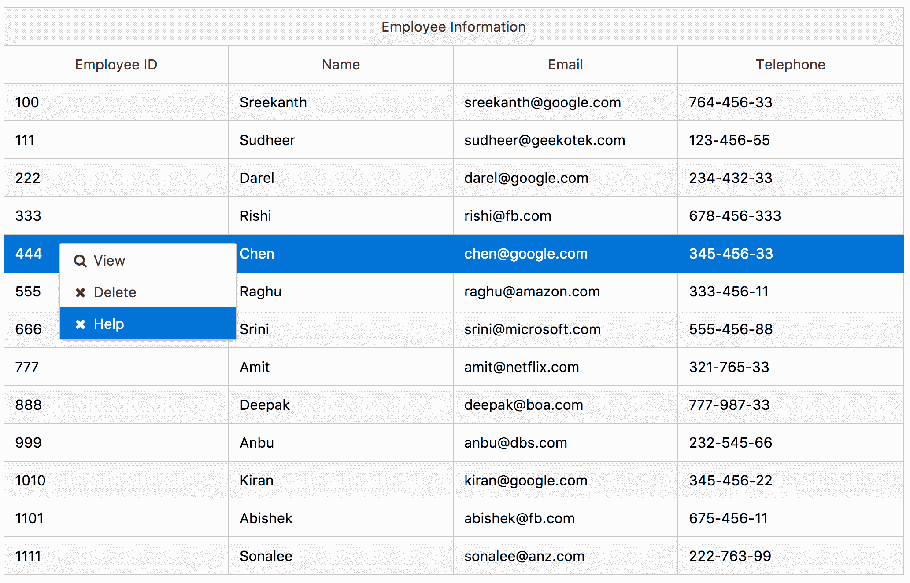
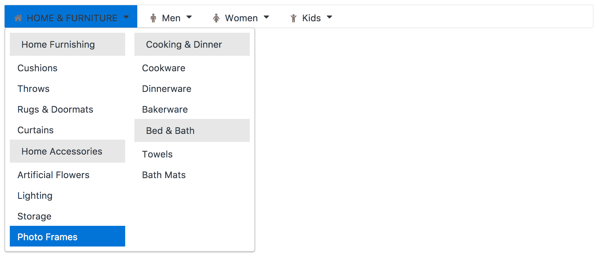
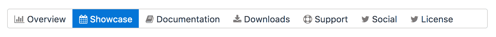
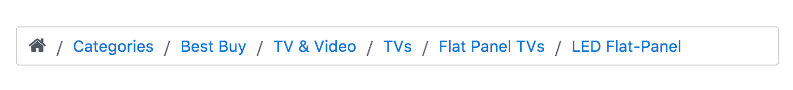

# 七、无尽的菜单变化


在本章中，您将了解几种菜单变体。PrimeNG 的菜单满足所有主要要求。现在，每个网站都有菜单。通常，菜单作为要导航的链接或要执行的命令的列表呈现给用户。菜单有时是按层次组织的，允许在菜单结构的不同级别进行导航。

将菜单项安排在逻辑组中可以方便用户快速找到相关任务。它们有很多方面，比如静态的、动态的、分层的、混合的、iPod 风格的等等，没有留下任何需要改进的地方。读者将面临许多讨论菜单结构、配置选项、自定义以及与其他组件集成的食谱。还将解释在向导和工作流中有帮助的菜单式组件。

在本章中，我们将介绍以下主题：

*   使用 MenuModel API 创建编程菜单
*   静态和动态定位菜单
*   通过菜单栏访问命令
*   带有嵌套项的上下文菜单
*   SlideMenu-iPod 风格的菜单
*   分层菜单-嵌套叠加中的子菜单
*   MegaMenu-多列菜单
*   PanelMenu-手风琴和树的混合
*   TabMenu-菜单项作为选项卡
*   面包屑-提供有关页面层次结构的上下文信息


# 使用 MenuModel API 创建编程菜单


PrimeNG 提供了一个`MenuModel`API，所有菜单组件都将共享该 API 来指定菜单项和子菜单。`MenuModel`API 的核心项是`MenuItem`类，有`label`、`icon`、`url`等选项，子菜单项有`items`选项，等等。

让我们以菜单组件为例来表示一个通用工具栏用户界面。菜单组件通过`model`属性将`MenuItem`类数组绑定为项，如下所示：

```ts
<p-menu [model]="items"></p-menu>

```

`MenuItem`是`MenuModel`API 中的关键项目。它具有以下属性列表。每个特性都使用类型、默认值及其说明进行描述：

| **名称** | **型** | **违约** | **说明** |
| `label` | `string` | `null` | 该项目的案文。 |
| `icon` | `string` | `null` | 项目的图标。 |
| `command` | `function` | `null` | 单击项时要执行的回调。 |
| `url` | `string` | `null` | 单击项目时导航的外部链接。 |
| `routerLink` | `array` | `null` | 内部导航的 RouterLink 定义。 |
| `items` | `array` | `null` | 子菜单项的数组。 |
| `expanded` | `boolean` | `false` | 子菜单的可见性。 |
| `disabled` | `boolean` | `false` | 当设置为`true`时，禁用菜单项。 |
| `visible` | `boolean` | `true` | 是否创建菜单项的 DOM 元素。 |
| `target` | `string` | `null` | 指定打开链接文档的位置。 |

Table 1.0


# 菜单操作


带有纯只读标签和图标的菜单项并不是真正有用的。具有用户操作的菜单组件需要执行业务实现或导航到其他资源。菜单操作的主要组件是命令调用和导航。这可以通过`MenuItem`接口的`url`和`routerLink`属性来实现。

`MenuItem`API 的 URL 和路由链接选项的示例用法如下：

```ts
{label: 'View', icon: 'fa-search', command: 
  (event) => this.viewEmployee(this.selectedEmployee)}

{label: 'Help', icon: 'fa-close', url: 
  'https://www.opm.gov/policy-data- oversight/worklife/employee-
  assistance-programs/'}

```

在下面的部分中，您将看到这个`MenuModel`API 将如何在各种菜单组件中使用。


# 静态和动态定位菜单


菜单是支持动态和静态定位的导航或命令组件。这是所有菜单组件变体中的基本菜单组件。默认情况下，菜单是静态定位的，但通过提供`target`属性使其成为动态的。静态定位菜单作为目标（即[T1]）附加到页面主体，而分配给其他元素则创建动态定位菜单。

包含项目文档或文件类型菜单项的基本菜单示例如下：

```ts
<p-menu [model]="items"></p-menu>

```

菜单项列表需要在组件类中组织。例如，标题为`Edit`的根菜单项将具有嵌套项，如下所示：

```ts
this.items=[
{
    label: 'Edit',
    icon: 'fa-edit',
    items: [
        {label: 'Undo', icon: 'fa-mail-forward'},
        {label: 'Redo', icon: 'fa-mail-reply'}
    ]
},
//More items ...
}

```

以下屏幕截图显示基本菜单（包含所有菜单项）示例的快照结果：


从前面的快照中，您可以看到菜单组件以内联格式显示。但是，通过启用`popup`属性以显示为叠加，可以更改此行为。

菜单组件定义了`Menu`API 的`toggle`、`show`和`hide`方法。以表格形式列出的每种方法的详细说明如下：

| **名称** | **参数** | **说明** |
| `toggle` | `event: browser event` | 切换弹出菜单的可见性。 |
| `show` | `event: browser event` | 显示弹出菜单。 |
| `hide` | - | 隐藏弹出菜单。 |

Table 2.0 The complete demo application with instructions is available on GitHub at
[https://github.com/ova2/angular-development-with-primeng/tree/master/chapter7/menu](https://github.com/ova2/angular-development-with-primeng/tree/master/chapter7/menu).


# 通过菜单栏访问命令


菜单栏组件是一组具有嵌套子菜单的水平菜单组件（或具有一组用于页面导航的下拉菜单的组件）。和任何其他菜单组件一样，MenuBar 使用一个公共菜单模型 API，其中包含一个`MenuItem`接口列表。子菜单的嵌套级别没有限制。让我们来看一个窗口或应用特定菜单的基本菜单栏示例。这为打开文件、编辑操作、与应用交互、显示帮助文档等常见功能提供了访问权限，如下所示：

```ts
<p-menubar [model]="items"></p-menubar>

```

菜单项列表需要在组件类中组织。例如，标题为`Edit`的根菜单项将具有嵌套项，如下所示：

```ts
this.items = [
  {
    label: 'Edit',
    icon: 'fa-edit',
    items: [
      {label: 'Cut', icon: 'fa-cut'},
      {label: 'Copy', icon: 'fa-copy'},
      {label: 'Paste', icon: 'fa-paste'},
      {label: 'Undo', icon: 'fa-mail-forward'},
      {label: 'Redo', icon: 'fa-mail-reply'},
      {label: 'Find', icon: 'fa-search', items: [
        {label: 'Find Next'},
        {label: 'Find Previous'}
      ]}
    ]
  },
  // more items......
];

```

以下屏幕截图显示基本菜单栏（包含所有菜单项）示例的快照结果：


组件蒙皮可以通过`style`和`styleClass`属性实现。Priming 4.1 允许通过将自定义内容（表单控件）放置在菜单栏标记中来进行自定义。

The complete demo application with instructions is available on GitHub at
[https://github.com/ova2/angular-development-with-primeng/tree/master/chapter7/menubar](https://github.com/ova2/angular-development-with-primeng/tree/master/chapter7/menubar).


# 带有嵌套项的上下文菜单


ContextMenu 是一个带有**图形用户界面****【GUI】**表示的菜单，只需右键单击即可显示在页面顶部。通过单击鼠标右键，将在目标图元上显示叠加菜单。有两种类型的上下文菜单，一种用于文档，另一种用于特定组件。除了这两个组件之外，还有一个与 DataTable 等组件的特殊集成。

默认情况下，上下文菜单以全局设置附加到文档。显示文档或文件类型菜单的基本上下文菜单示例如下：

```ts
<p-contextMenu [global]="true" [model]="documentItems"></p-contextMenu>

```

菜单项列表需要在组件类中组织。例如，标题为`File`的根菜单项将具有嵌套项，如下所示：

```ts
this.documentItems = [
  {
    label: 'File',
    icon: 'fa-file-o',
    items: [{
      label: 'New',
      icon: 'fa-plus',
      items: [
        {label: 'Project'},
        {label: 'Other'},
      ],
      expanded: true
    },
    {label: 'Open'},
    {label: 'Quit'}
    ],
  },
  // more items ...
];

```

以下屏幕截图显示了基本上下文菜单（包含所有菜单项）示例的快照结果：


单击此组件的外部后，关联菜单将消失。


# 上下文菜单的自定义目标


可以使用`target`属性更改上下文菜单的默认全局设置（即，上下文菜单将显示在全局文档目标以外的其他元素上）。让我们看一个上下文菜单示例，其中在右键点击图像元素的顶部出现叠加或弹出，如下所示：

```ts
<p-contextMenu [target]="image" [model]="targetItems" >
</p-contextMenu>


```

在这种情况下，只需定义菜单项数组，就可以从上下文菜单执行下一个和上一个操作。


# 数据表集成


在上一节中，您已经了解了如何使用`target`属性将上下文菜单与其他元素集成。但与 DataTable 组件的集成是另一种情况，需要特殊处理。这种组合是 web 开发中经常使用的用例之一。

DataTable 使用`contextMenu`属性提供对上下文菜单的引用（即，上下文菜单的模板引用变量应分配给 DataTable 的`contextMenu`属性）。与 DataTable 集成的上下文菜单将编写如下：

```ts
<p-contextMenu #contextmenu [model]="tableItems"></p-contextMenu>
<p-dataTable [value]="employees" selectionMode="single" [(selection)]="selectedEmployee" [contextMenu]="contextmenu">
  <p-header>Employee Information</p-header>
  <p-column field="id" header="Employee ID"></p-column>
  <p-column field="name" header="Name"></p-column>
  <p-column field="email" header="Email"></p-column>
  <p-column field="contact" header="Telephone"></p-column>
</p-dataTable>

```

上下文菜单模型绑定到一系列菜单项，如`View`和`Delete`选项，如下所示：

```ts
this.tableItems = [
 {label: 'View', icon: 'fa-search', command: (event) => 
   this.viewEmployee(this.selectedEmployee)},
 {label: 'Delete', icon: 'fa-close', command: (event) => 
   this.deleteEmployee(this.selectedEmployee)},
 {label: 'Help', icon: 'fa-close',
   url: 'https://www.opm.gov/policy-data-oversight/worklife/
   employee-assistance-programs/'}
];

```

在前面的示例中，我们执行了命令操作，用消息通知用户。但在实时中，所有 CRUD 操作都与数据库同步。以下屏幕截图显示了上下文菜单与 DataTable 组件集成的快照结果，例如：



根据前面的快照，单击鼠标右键选择表行，并在该行上显示叠加。菜单项选择既可以执行业务逻辑，也可以导航到各种网页。

The complete demo application with instructions is available on GitHub at
[https://github.com/ova2/angular-development-with-primeng/tree/master/chapter7/contextmenu](https://github.com/ova2/angular-development-with-primeng/tree/master/chapter7/contextmenu).


# SlideMenu–iPod 风格的菜单


SlideMenu 是一个组件，用于显示具有幻灯片动画效果的子菜单。这种幻灯片菜单组件是 iPod 风格菜单小部件的最佳示例。默认情况下，幻灯片菜单显示为内嵌菜单组件。显示文档或文件类型菜单的基本幻灯片菜单示例如下：

```ts
<p-slideMenu [model]="items"></p-slideMenu>

```

菜单项列表需要在组件类中使用进行组织。例如，标题为`File`的根菜单项将具有嵌套项，如下所示：

```ts
this.items = [
  {
    label: 'File',
    icon: 'fa-file-o',
    items: [
    {
      label: 'New',
      icon: 'fa-plus',
      items: [
        {label: 'Project'},
        {label: 'Other'},
      ]
    },
    {label: 'Open'},
    {label: 'Quit'}
    ]
  },
  // more items ...
]

```

以下屏幕截图显示了基本幻灯片菜单的快照结果，例如，单击文件菜单项时显示文件菜单项：


如前面的快照所示，幻灯片菜单以内联格式显示。通过启用`popup`属性，以弹出方式显示。在幻灯片菜单弹出窗口的底部，会出现一个带有后退标签的后退按钮，但也可以使用`backLabel`属性进行自定义。

使用 API 方法访问幻灯片菜单，如`toggle`、`show`和`hide`方法。幻灯片菜单提供各种动画效果，默认效果为`easing-out`。可以使用`effect`属性更改此默认行为。类似地，幻灯片菜单的默认效果持续时间为 500 毫秒，但这可以使用`effectDuration`属性进行自定义。

任何可视组件的尺寸都非常需要，必须进行配置。考虑到该标准，菜单尺寸的尺寸是可配置的。子菜单宽度通过`menuWidth`属性控制，默认为 180（通常以像素为单位）。此外，可滚动区域的高度通过`viewportHeight`属性控制，默认值为 175 像素（即，如果菜单高度超过此默认值，则会显示滚动条）。

The complete demo application with instructions is available on GitHub at
[https://github.com/ova2/angular-development-with-primeng/tree/master/chapter7/slidemenu](https://github.com/ova2/angular-development-with-primeng/tree/master/chapter7/slidemenu).


# 分层菜单–嵌套叠加中的子菜单


TieredMenu 组件以嵌套叠加模式显示子菜单。默认情况下，幻灯片菜单显示为内嵌菜单组件。显示文档或文件类型菜单的基本分层菜单示例如下：

```ts
<p-tieredMenu [model]="items"></p-tieredMenu>

```

菜单项列表需要在组件类中使用进行组织。例如，标题为`File`的根菜单项将具有嵌套项，如下所示：

```ts
this.items = [
 {
   label: 'File',
   icon: 'fa-file-o',
   items: [
 {
   label: 'New',
   icon: 'fa-plus',
   items: [
   {label: 'Project'},
   {label: 'Other'},
 ]
 },
   {label: 'Open'},
   {label: 'Quit'}
 },
 // more items
]

```

以下屏幕截图显示了基本分层菜单示例的快照结果：


如前面的快照所示，幻灯片菜单以内联格式显示。通过启用`popup`属性，以弹出方式显示。Priming 4.1 引入了`appendTo`属性来附加叠加层。使用 API 方法访问幻灯片菜单，如`toggle`、`show`和`hide`。

幻灯片菜单和分层菜单组件之间的主要区别在于，幻灯片菜单通过替换父菜单来显示子菜单，而分层菜单以叠加模式显示子菜单。在菜单部分*表 2.0*中解释了幻灯片菜单和分层菜单的 API 方法，并以表格形式提供了更多详细信息。

The complete demo application with instructions is available on GitHub at
[https://github.com/ova2/angular-development-with-primeng/tree/master/chapter7/tieredmenu](https://github.com/ova2/angular-development-with-primeng/tree/master/chapter7/tieredmenu).


# MegaMenu 多列菜单


MegaMenu 类似于一个下拉菜单，可扩展为一个相对较大且复杂的界面，而不是一个简单的命令列表。它同时显示根项目的子菜单。MegaMenu 由嵌套菜单项组成，其中每个项的根项是一个二维数组，用于定义叠加菜单中的列。

零售商应用购买服装项目的基本 MegaMenu 示例如下所示：

```ts
<p-megaMenu [model]="items"></p-megaMenu>

```

菜单项列表需要在组件类中使用进行组织。例如，标题为 Home&Furniture 的根菜单项将具有嵌套项，如图所示：

```ts
this.items = [
  {
    label: 'HOME & FURNITURE', icon: 'fa-home',
    items: [
    [
      {
        label: 'Home Furnishing',
        items: [{label: 'Cushions'}, {label: 'Throws'}, 
        {label: 'Rugs & Doormats'},
               {label: 'Curtains'}]
      },
     {
       label: 'Home Accessories',
       items: [{label: 'Artificial Flowers'}, {label: 'Lighting'}, 
               {label: 'Storage'}, {label: 'Photo Frames'}]
     }
   ],
   [
     {
       label: 'Cooking & Dinner',
       items: [{label: 'Cookware'}, {label: 'Dinnerware'}, 
       {label: 'Bakerware'}]
     },
     {
       label: 'Bed & Bath',
       items: [{label: 'Towels'}, {label: 'Bath Mats'}]
     }
   ]
   ]
  },
  // more items...
];

```

以下屏幕截图显示基本 MegaMenu（包含所有菜单项）示例的快照结果：



MegaMenu 的默认方向为水平。这也可以使用`orientation`属性（即`orientation="vertical"`以垂直方式定位）。垂直菜单如以下快照所示：


Priming 4.1 允许通过将自定义内容（表单控件）放置在 MegaMenu 标记中来实现。

The complete demo application with instructions is available on GitHub at
[https://github.com/ova2/angular-development-with-primeng/tree/master/chapter7/megamenu](https://github.com/ova2/angular-development-with-primeng/tree/master/chapter7/megamenu).


# PanelMenu–手风琴和树的混合


PanelMenu 是垂直堆叠手风琴和层次树组件的混合体。每个父菜单项都有一个可切换的面板；通过面板，它以层次树格式显示子菜单项。显示文档或文件类型菜单的基本面板菜单示例如下：

```ts
<p-panelMenu [model]="items" ></p-panelMenu>

```

菜单项列表需要在组件类中组织。例如，标题为“帮助”的根菜单项将包含嵌套项，如下所示：

```ts
this.items = [
  {
    label: 'Help',
    icon: 'fa-question',
    items: [
           {label: 'Contents'},
           {label: 'Search', icon: 'fa-search',
             items: [{label: 'Text', items: [{label: 'Workspace'}]}, 
             {label: 'File'}]}
    ]
  },
  //more items ...
];

```

以下屏幕截图显示了基本面板菜单示例的快照结果：


每个菜单项的初始状态通过`expanded`属性（即`expanded="true"`进行控制，该属性在`MenuItem`界面级别可用。

The complete demo application with instructions is available on GitHub at
[https://github.com/ova2/angular-development-with-primeng/tree/master/chapter7/panelmenu](https://github.com/ova2/angular-development-with-primeng/tree/master/chapter7/panelmenu).


# TabMenu-菜单项作为选项卡


TabMenu 是一个导航/命令组件，它将项目显示为选项卡标题（即，父根项目以水平堆叠选项卡的形式表示）。单击每个选项卡，可以执行各种菜单操作。

基本选项卡式菜单示例以各种选项卡的形式显示 PrimeNG 网站信息，如下所示：

```ts
<p-tabMenu [model]="items"></p-tabMenu>

```

菜单项列表需要在组件类中组织。例如，PrimeNG 的各种详细信息在不同的水平选项卡中使用以下菜单项进行解释：

```ts
this.items = [
  {label: 'Overview', icon: 'fa-bar-chart', routerLink: 
  ['/pages/overview']},
  {label: 'Showcase', icon: 'fa-calendar', command: (event) => {
    this.msgs.length = 0;
    this.msgs.push({severity: 'info', summary: 'PrimeNG Showcase', 
    detail:'Navigate all components'});}
  },
  {label: 'Documentation', icon: 'fa-book', 
    url:'https://www.primefaces.org/documentation/'},
  {label: 'Downloads', icon: 'fa-download', routerLink: 
    ['/pages/downloads']},
  {label: 'Support', icon: 'fa-support', 
    url:'https://www.primefaces.org/support/'},
  {label: 'Social', icon: 'fa-twitter', 
    url:'https://twitter.com/prime_ng'},
  {label: 'License', icon: 'fa-twitter', 
    url:'https://www.primefaces.org/license/'}
];

```

以下屏幕截图显示了选项卡式面板菜单示例的快照结果：



默认情况下，TabMenu 在第一个选项卡上显示或激活。但是选项卡的默认可见性或初始显示可以在`activeItem`属性的帮助下更改。

The complete demo application with instructions is available on GitHub at
[https://github.com/ova2/angular-development-with-primeng/tree/master/chapter7/tabmenu](https://github.com/ova2/angular-development-with-primeng/tree/master/chapter7/tabmenu).


# 面包屑–提供有关页面层次结构的上下文信息


面包屑组件提供有关页面层次结构的上下文信息。它允许您跟踪它们在程序、文档和网站中的位置。这通常在网页顶部显示为水平，由大于运算符（>）作为层次分隔符分隔。此菜单变体包含一个用于定义其项的通用菜单模型 API。这些菜单项（菜单项集合）连接到一个`model`属性。

电子商务应用购买电子产品的基本面包屑示例如下：

```ts
<p-breadcrumb [model]="items"></p-breadcrumb>

```

项目的`model`属性是`MenuItem`类型的数组。本节开头介绍了`MenuModel`API 的可能选项或特性。在本例中，我们为菜单项定义了标签和命令操作。菜单项列表需要按如下所示进行组织以显示项目：

```ts
this.items.push({
  label: 'Categories', command: (event) => {
    this.msgs.length = 0;
    this.msgs.push({severity: 'info', summary: event.item.label});
  }
});
this.items.push({
  label: 'Best Buy', command: (event) => {
    this.msgs.length = 0;
    this.msgs.push({severity: 'info', summary: event.item.label});
  }
});
this.items.push({
  label: 'TV & Video', command: (event) => {
    this.msgs.length = 0;
    this.msgs.push({severity: 'info', summary: event.item.label});
  }
});
this.items.push({
  label: 'TVs', command: (event) => {
    this.msgs.length = 0;
    this.msgs.push({severity: 'info', summary: event.item.label});
  }
});
this.items.push({
  label: 'Flat Panel TVs', command: (event) => {
    this.msgs.length = 0;
    this.msgs.push({severity: 'info', summary: event.item.label});
  }
});
this.items.push({label: 'LED Flat-Panel', url: 'https://en.wikipedia.org/wiki/LED_display'});

```

以下屏幕截图以基本面包屑的快照结果为例：



主页图标也是菜单项的一部分，可以使用`MenuItem`类型的`home`属性进行自定义。因此，菜单项的所有功能也适用于主菜单项。必须为面包屑组件定义`home`属性，如下所示：

```ts
<p-breadcrumb [model]="items" [home]="home"></p-breadcrumb>

```

component 类保存主菜单项，如下所示：

```ts
home: MenuItem;

this.home = {
  label: 'Home',icon: 'fa-globe', command: (event) => {
    this.msgs.length = 0;
    this.msgs.push({severity: 'info', summary: "Home"});
  }
};

```

这是组件支持的自定义图标属性，可在`MenuItem`中定义。

The complete demo application with instructions is available on GitHub at
[https://github.com/ova2/angular-development-with-primeng/tree/master/chapter7/breadcrumb](https://github.com/ova2/angular-development-with-primeng/tree/master/chapter7/breadcrumb).


# 总结


在本章末尾，您现在知道了如何处理各种菜单组件，以及如何将它们放在特定用例的页面上。首先，我们从 MenuModel API 开始创建一个项目数组，然后将菜单组件作为基本组件引入，然后将 MenuBar 移动到带有嵌套复杂子菜单的 MegaMenu 组件，然后是其他菜单变体，如幻灯片菜单、分层菜单和面板菜单。

后来，我们将上下文菜单和面包屑组件作为另一种菜单操作。在下一章中，您将看到作为 API 的图表模型，以及如何为数据的可视化表示创建出色的图表和地图。所有这些组件都以一步一步的方式解释了所有可能的功能。