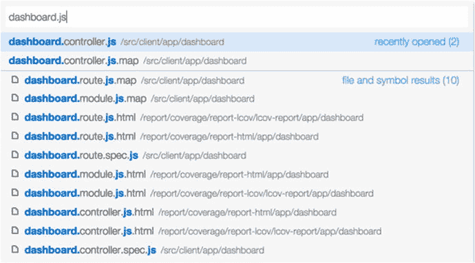
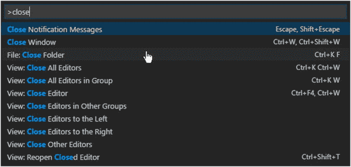
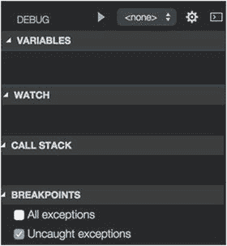
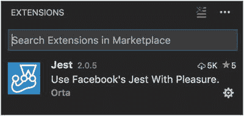

# 五、Visual Studio Code

许多编辑器都可以使用 TypeScript，包括 Visual Studio、Visual Studio Code、WebStorm、WebEssentials、Eclipse 等等。

不同的人喜欢不同的编辑器，不同的开发人员可以在同一个项目中使用不同的编辑器，而不会引起很多问题。没有“正确”或“错误”的编辑器。

我将介绍 Visual Studio Code，因为它非常好用，而且是免费的。我建议你去 [`https://code.visualstudio.com`](https://code.visualstudio.com) 点击下载链接安装这个编辑器。如果您最终不喜欢 Visual Studio Code，您可以轻松地删除它并选择不同的代码。

我选择 Visual Studio Code 是因为它是微软开发的开源源代码编辑器，可用于 Windows、Linux 和 macOS。它包括对调试、嵌入式 Git 控件、语法高亮、智能代码完成、代码片段和代码重构的支持。它是由编写 TypeScript 的同一批人编写的，所以我们知道它可以很好地与它一起工作。它还可以很好地与 JavaScript、PHP 等等一起工作。而且比较紧凑。

有时我会转而使用 Webstorm，因为它能更好地重构代码。然而，Visual Studio Code 90%的时间都工作得很好。

## Visual Studio Code 入门

如果您还没有这样做，请转到 [`https://code.visualstudio.com`](https://code.visualstudio.com) ，下载 Visual Studio Code，并安装它。图 [5-1](#Fig1) 显示下载页面。


图 5-1

Download page for Visual Studio Code

安装程序后，要启动 shell，请双击 Visual Studio Code 图标将其打开。单击文件➤打开文件夹，然后选择项目的根文件夹。

导航到项目的根文件夹。输入命令`code .`(代码空格周期)。

### 查看文件、命令和热键

按 Ctrl+P 会在顶部的文本框下面列出文件，如图 [5-2](#Fig2) 所示。当您键入时，它会过滤列表。



图 5-2

Filtering the list of files

按 Ctrl+Shift+P 会在顶部文本框的下方列出顶部的命令，如图 [5-2](#Fig2) 所示。当您键入时，它会过滤列表。



图 5-3

Filtering the list of commands

### 开始构建

编辑项目根文件夹中的 tasks.json 文件(见图 [5-4](#Fig4) )。这个配置文件指定了我们将在示例项目中使用的构建命令。它在命令行上运行`npm run build`来调用构建。有关 Webpack 和构建过程的更多信息，请参见第 [10 章](10.html)。


图 5-4

Editing tasks.json

若要开始生成，请按 Ctrl+Shift+B。生成输出将显示在输出窗格中。通常运行需要 10-30 秒。见图 [5-5](#Fig5) 。


图 5-5

Build output will appear in the Output pane

要查看构建错误，请按 Ctrl+Shift+M。错误列在屏幕顶部(参见图 [5-6](#Fig6) )。单击错误以导航到错误的来源。


图 5-6

Any errors would be listed at the top of the screen

## 介绍界面

Visual Studio Code 在左侧显示了一个侧边栏，提供不同的模式(图 [5-7](#Fig7) )并在右侧显示了一个编辑区域。


图 5-7

The Visual Studio sidebar has four modes: Explorer, Search, Git, and Debug (from top to bottom).

您可以使用 Ctrl+B 键盘快捷键来显示和隐藏侧栏。

您可以在四种主要的侧边栏模式之间轻松切换:Explorer、Search、Git 和 Debug。有不同的方式来切换模式:

*   单击侧边栏图标。
*   单击查看并选择您的模式。
*   使用热键(在以下章节中给出)。

### 探险家

浏览器窗格(图 [5-8](#Fig8) )是侧边栏之后的第一个窗格。它分为两个部分:工作文件(上面的)和项目文件(下面的—在这种情况下，称为 Temp)。单击文件列表中的文件，将其显示在右侧进行编辑。


图 5-8

Explorer pane

要激活或聚焦浏览器窗格，请单击边栏中的文件图标，单击查看➤浏览器，或按 Ctrl+E

#### 工作文件

编辑文件时，它们会出现在工作文件中。如果您一次只编辑几个项目文件，将这些文件列在工作文件部分的顶部会很方便。当你将鼠标悬停在“工作文件”标题上时，它会显示一个 X，允许你根据需要清除列表。

#### 项目文件

项目文件是项目中所有文件以及文件夹的列表。

### 搜索

搜索(图 [5-9](#Fig9) )的工作方式就像它在大多数程序中一样(见图 [5-9](#Fig9) )。要激活或聚焦搜索窗格，请单击边栏中的放大镜图标，单击查看➤搜索，或按 Ctrl+Shift+F


图 5-9

Search

### 饭桶

要激活或聚焦 Git 窗格，单击侧栏中的 Git 图标，单击查看➤ Git，或按 Gtrl+Shift+G。参见图 [5-10](#Fig10) 。


图 5-10

Git

*   “视图”菜单“选项”“Git”。
*   control–Shift–G

### 调试

要激活或聚焦调试窗格，请单击边栏中的调试图标，单击查看➤调试，或按 Ctrl+Shift+D。参见图 [5-11](#Fig11) 。



图 5-11

Debug

调试对于调试服务器端代码比调试浏览器端代码更有用，所以对于 Angular 来说可能没有太大用处。如果您在浏览器上启用远程调试并连接到它，您可以使用该调试器来调试浏览器代码，但使用可用的(优秀的)浏览器调试器可能更容易，如 Google Chrome 中的调试器。

要调试您的服务器端代码，您必须首先设置一个调试启动任务。这使您能够设置调试启动配置，用于启动服务器端代码并开始调试它。

要进行调试，请执行以下操作:

1.  单击边栏中的调试图标，或者使用已经提到的另一个选项。
2.  单击齿轮图标打开调试配置设置(在中)。settings/launch.json)。
3.  选择您的调试配置(在齿轮图标旁边),然后单击 play 启动它。

## 扩展ˌ扩张

要激活或聚焦扩展窗格，单击左侧的扩展图标(图 [5-12](#Fig12) )，单击查看➤扩展，或按 Ctrl+Shift+X。图 [5-13](#Fig13) 显示了扩展窗格。



图 5-13

Extensions pane


图 5-12

Extensions icon

将扩展安装到 Visual Studio Code 中非常容易。我工作的 Angular 5 项目有一个包含林挺的构建过程，它检查代码以确保它遵循风格指南。如果用户添加了太多空白，构建通常会失败。这变得很烦人，在代码中安装 linter 扩展是一个好主意，这样它可以在林挺问题发生时突出显示这些问题(在左下角有一个警告)。

要查看与扩展相关的命令，请输入以下内容:

```ts
extensions

```

这将显示如图 [5-14](#Fig14) 所示的可用扩展命令列表。


图 5-14

Extensions commands

要在代码中安装扩展，请输入以下命令并按照说明进行操作:

```ts
ext install

```

要在代码中设置 TypeScript linter，请输入以下命令并遵循说明(参见图 [5-15](#Fig15) ):


图 5-15

Installing the TypeScript linter

```ts
ext install tslin

```

A Few Other Handy Things To Note

作为一个丰富的编辑环境，虚拟工作室代码提供了智能感知代码选择和完成。如果语言服务知道可能的完成方式，IntelliSense 建议将在您键入时弹出。您可以通过按 Ctrl+空格键来手动触发它。

要保存您的工作，可以使用普通的“文件”菜单“保存”命令，就像 Ctrl+S 快捷键一样。

Visual Studio Code 允许您自由地进出代码。例如，您可以按住 Ctrl 并单击来“钻取到”代码，例如钻取到一个方法。当您需要详细查看某个东西时，这非常有用，但是您需要能够回到您所在的位置。这就是向后和向前导航的用武之地。要向后导航，请按 Ctrl+或单击查看➤向后导航。要向前导航，请按 Ctrl+Shift+或单击查看➤向前导航。

## 摘要

希望现在您已经安装了 Visual Studio Code 并检查了它。请注意，您安装的版本中显示的屏幕可能与本章中的屏幕截图略有不同。这个程序经常更新。

还要记住，你没有被“锁定”在任何特定的编辑器中。我选择 Visual Studio Code 与本书一起使用，因为它简单易用，易于上手。如果您想使用另一个编辑器来处理本书中的代码示例，请继续。

现在您已经安装了一个编辑器，我们可以继续我们的开发环境，并准备开始编码。当你用 Angular 开发代码时，你最终会使用大量的第三方代码——也就是其他人写的代码。你尽量不要从头开始写！

因此，您的项目将依赖于其他人的代码。Node 的目的是管理这些依赖关系，所以我们将在下一章讨论 Node。