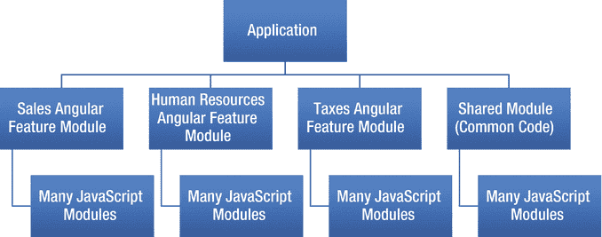
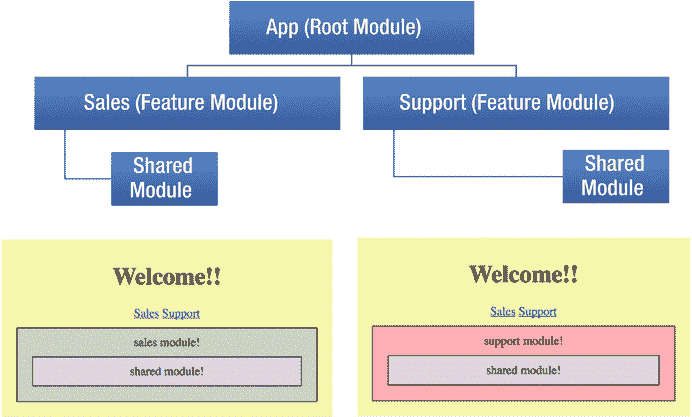

# 九、模块简介

模块这个词指的是独立的、可重用的代码的小单元。典型的模块是专用于单一目的的内聚代码块。模块在代码中导出一些有价值的东西，通常是一样东西，比如一个对象。

本章主要介绍不同模块的概念。它没有包括很多编码示例——您将在后面编写模块。

JavaScript 给了你做很多糟糕事情的自由——你没有义务写可重用的代码。你可以把你的代码散布在任何地方。随着 JavaScript 及其环境的成熟，这种情况必须改变。您需要通过隐藏对象的内部工作方式并让公共接口从外部可用来简化对象。您需要能够将代码打包成可重用的块，这些块可以彼此独立地打包和部署。你还需要能够按需加载它们，而不是在应用启动时(缓慢地)加载所有内容。

## 不同类型的模块

本章介绍 AngularJS、Angular 和 JavaScript 模块化代码的三种方式:



图 9-1

Angular applications are made up of Angular modules and JavaScript modules

*   Angular 的原始版本中包含的 AngularJS 模块系统:这使您能够在粗粒度级别模块化代码。
*   ES6 和 TypeScript 中现在可用的 JavaScript 模块:这些模块使您能够在细粒度级别模块化代码。记住，每个源代码文件都有一个模块。ts 或者。js)。
*   Angular 模块系统:这使您能够在粗粒度级别模块化代码。您可以将 Angular 代码单元捆绑到模块中。例如，如果你正在用 Angular 编写一个系统，其中包含一个销售应用、一个人力资源应用和一个税务应用，你可以将这三个应用分割成独立的功能模块和一个共享公共代码的共享模块，如图 [9-1](#Fig1) 所示。

## AngularJS 模块系统

AngularJS 有自己的模块系统，非常简单。您有一个 Angular 模块，其中可能包含 Angular 控制器、指令等。

在图 [9-2](#Fig2) 中，我们声明了模块 xxx，它依赖于许多其他模块:ngCookies、ngRoute、ngResource、ngSanitize、angularSpinner、ui.bootstrap.demo、ui.bootstrap、ui.select、wj 和 angularModalService。在代码之后，我们将声明这个模块 xxx 中的项目。


图 9-2

Declaring module xxx

## JavaScript 模块

JavaScript 过去常常使用库，这些库对于开发人员在某个领域的开发非常有用。例如，JQuery 曾经帮助开发人员进行 UI 开发。这些库写得很好，但没有作为模块实现。相反，它们是作为 JavaScript 脚本实现的(如。js 脚本文件)，它将创建 JavaScript 对象来做事情。这是在 JavaScript 模块系统存在之前。

现在 ES6 和更高版本支持模块。在 Javascript 模块中，每个文件都是一个模块。你可以自己编模块，也可以用别人的模块。您可以使用 Node 将依赖模块拉入您的项目中(进入 node_modules 文件夹)。

当我们在 TypeScript 中用 Angular 5 编码时，我们使用两个 JavaScript 模块关键字:

*   `Export`:导出模块代码
*   `Import`:导入模块代码

### 导出代码

您将应用编写为小模块的集合。您的代码使用`export`关键字将对象从模块导出到外部世界。例如，下面的代码用于告诉 TypeScript 您正在导出类`App`以便在其他地方使用:

```ts
export class App {...}

```

下面是如何从模块中导出默认对象:

```ts
module "foo" {
  export default function() { console.log("hello!") }
}

```

### 导入代码

语句告诉 TypeScript 从某处获取模块代码。某处可以来自其他人的模块，也可以来自同一项目中的本地代码。

#### 从其他人的模块中导入代码

当您使用`import`语句从其他人的模块中获取代码时，您需要标识模块名和您想要导入的项的名称，在`from`之后指定模块名。这通常是从节点模块导入代码的方式。例如，从 Angular 导入元件:

```ts
import { Component } from '@angular/core';

```

以下是如何从 ngx-bootstrap 导入日期选择器:

```ts
import { DatepickerModule } from 'ngx-bootstrap/datepicker';

```

#### 导入您的项目代码

当从同一项目中的本地代码导入代码时，需要指定该代码的相对路径。下面的例子指定了一个相对路径(`./`)。这告诉 TypeScript 该代码与将要使用该模块的代码在同一个文件夹中:

```ts
import {AppComponent} from './app.component';

```

以下是一些更重要的语法:

*   全部导入:

    ```ts
    import * as myModule from 'my-module';

    ```

*   使用命名导入时，名称需要与模块中导出的对象名称完全匹配:

    ```ts
    import { myMember } from 'my-module';

    ```

*   对于来自一个模块的多个命名导入，名称需要与模块中导出的对象名称完全匹配:

    ```ts
    import { foo, bar } from 'my-module';

    ```

*   对于从模块的默认导入，名称不需要与模块中导出的任何对象匹配。它可以是一个别名。它知道它必须从模块

    ```ts
    import myDefault from 'my-module';

    ```

    导入默认对象

## Angular 模块系统

Angular 模块系统是 Angular bundles 编码成可重用模块的方式。使用该模块系统，Angular 系统代码本身被模块化。许多第三方使用模块为 Angular 提供了额外的功能，您可以轻松地将这些功能包含到您的应用中。

Angular 为什么不直接用 JavaScript 模块？为什么强迫开发者使用自己的模块系统？首先，它确实使用了标准的 JavaScript 模块，但是还不够。它们使得 Angular 不容易声明由不同对象捆绑在一起组成的长块 Angular 代码——例如，组件、服务和管道。在 Angular 2 的早期，开发人员没有 Angular 模块的选项，开发人员使用模块加载器来加载和启动应用(System.js)。对我来说，它在实践中并不奏效。它很难学，很容易坏，而且太复杂了。

当 Angular2 处于测试阶段时，我参与了它的工作，并喜欢这个产品，但我讨厌它在模块加载方面的复杂性，因为我不得不学习 System.js 等。我后来回到它身边，发现您可以快速而简单地使用 Angular CLI 来构建一个使用 Webpack 进行部署的模块化应用。我欢迎 Angular 模块系统，并认为它与 CLI 和 Webpack 配合得很好。

### 开始项目中的模块

你已经用过角模块系统了，即使你没有意识到。如果您打开使用 CLI 创建的启动项目，您将看到已经有一个文件 app.module.ts。模块。让我们打开来看看:

```ts
import { BrowserModule } from '@angular/platform-browser';
import { NgModule } from '@angular/core';
import { FormsModule } from '@angular/forms';
import { HttpModule } from '@angular/http';

import { AppComponent } from './app.component';

@NgModule({
  declarations: [
    AppComponent
  ],
  imports: [
    BrowserModule,
    FormsModule,
    HttpModule
  ],
  providers: [],
  bootstrap: [AppComponent]
})
export class AppModule { }

```

让我们看看这里的一些元素:

*   `@NgModule`注解:这个注解是这个类最重要的部分。这是一个函数，它接受一个对象，并使用该对象向 Angular 提供关于模块的元数据:如何编译它以及如何运行它。所以，`@NgModule`是 Angular 的声明方式，让你告诉 Angular 如何把这些部分组合在一起。注意，`@NgModule`本身需要从顶部的`@angular/core`导入。
*   `declarations`:这应该是你的模块使用的 Angular 组件、指令和管道的数组，而不是其他任何东西——没有 ES6 类或其他任何东西。当您使用 CLI 命令`ng generate component`添加一个组件时，它会导入该组件并将其添加到这个声明列表中。如果您添加并使用一个组件，而没有在这里声明它，您将在浏览器控制台收到一条错误消息。
*   `import`:这应该是这里应用需要的 Angular 模块数组。这些模块必须使用`@NgModule`来定义。Angular 本身有许多有用的系统模块，默认情况下，CLI 为您提供了其中的几个模块，包括浏览器模块、表单模块和 http 模块。
*   `providers`:这应该是应用所需的 Angular 对象的数组`provider`。这些`provider`对象是服务类和值，它们通过依赖注入被注入到你的类中。如果您有一个公共服务对象供组件用来与服务器通信，那么您可以在这里将其添加为提供者。
*   你可以使用模块来包含你的应用的代码。要运行，您的应用需要知道如何启动以及应该从哪个组件启动(根)。这是您指定根组件的地方，当应用启动时，它将被创建并装载到 HTML 中。这个根组件通常被称为 AppComponent。

### 根模块

您的 Angular 应用可以包含多个模块。但是它总是有一个起点，一个用来引导自己的模块。这是根模块，通常称为 AppModule。

### 路由模块

我们稍后将讨论路由，但路由对于 Angular 应用非常重要。它允许用户将组件映射到 URL 并导航用户界面。当我们使用 CLI 构建 Angular 应用时，它会为您的应用路由构建一个单独的模块，通常在 app-routing.ts 文件中。这看起来可能是多余的，但它非常巧妙地将 Angular 路由对象与您的应用的路由设置打包到一个模块中，该模块为您的应用处理所有路由。

### 功能模块

领域驱动设计(DDD)是一种软件开发方法，通过将实现与演进的模型相联系来解决复杂的需求。DDD 经常不得不处理非常大、复杂的业务需求建模，它的方法是将这些需求分解到不同的环境中。有界上下文是业务需求中可以逻辑分离的领域，如图 [9-3](#Fig3) 所示。


图 9-3

Bounded contexts

如你所见，在图 [9-3](#Fig3) 中有两个上下文:销售和支持。每一个都可以是你 Angular 应用的一个独立部分。事实上，每一个都可以包含在它自己独立的模块中，称为特性模块。每个模块可以包含特定的代码，以满足其他地方不需要的特定需求。例如，销售模块可以包含一个 Angular UI 来管理销售渠道，这在其他任何地方都不会使用。因此，功能模块通常包含不打算在该模块之外使用的代码。

需要时，根模块可以包括所需数量的功能模块。例如，当用户点击销售菜单时，特征模块甚至可以按需加载。

### 共享模块

您可以将功能模块视为不共享的代码块。共享模块则相反——它们包含最常用的模块化代码，因此可以尽可能多地重用。当需要时，根模块可以包括所需数量的共享模块。

## Angular 模块系统:示例模块-ex100

这个例子是一个关于如何一起使用根模块、特性模块和共享模块的非常基本的练习。

该示例的组件顶部有两个链接:销售和支持。您可以单击每个链接，在两个组件之间浏览应用。销售和支持这两个组件都是独立的功能模块。

这个例子有一个根模块，App，特性模块(已经提到过)，以及一个来自共享模块的组件 shared，如图 [9-4](#Fig4) 所示。



图 9-4

Example of Angular module system

让我们看一下这个例子:

1.  使用 CLI 构建应用:使用以下命令:

    ```ts
    ng new modules-ex100

    ```

2.  开始`ng serve`:使用以下代码:

    ```ts
    cd modules-ex100
    ng serve

    ```

3.  打开应用:启动 web 浏览器并导航到 localhost:4200。你应该看到“欢迎使用 app！”
4.  生成模块:让我们使用 CLI 来生成附加模块:

    ```ts
    ng generate module shared
    ng generate module routing --routing
    ng generate module sales
    ng generate module support

    ```

5.  生成组件:让我们使用 CLI 来生成附加组件:

    ```ts
    ng generate component sales
    ng generate component support
    ng generate component shared

    ```

6.  编辑组件样式:编辑文件 sales.component.css 并将其更改为以下内容:

    ```ts
    div {
        background-color: #bdcebe;
        border: 1px solid #000000;
        padding: 10px;
        margin: 10px;
    }

    ```

    编辑文件 support.component.css 并将其更改为以下内容:

    ```ts
    div {
        background-color: #eca1a6;
        border: 1px solid #000000;
        padding: 10px;
        margin: 10px;
    }

    ```

    编辑文件 shared.component.css 并将其更改为以下内容:

    ```ts
    div {
        background-color: #d6cbd3;
        border: 1px solid #000000;
        padding: 10px;
        margin: 10px;
    }

    ```

    编辑文件 app.component.css 并将其更改为以下内容:

    ```ts
    div {
        background-color: #e3eaa7;
        border: 10px;
        padding: 10px;
    }

    ```

7.  编辑组件模板:编辑文件 sales.component.html，更改为:

    ```ts
    <div>
      sales module!
      <app-shared></app-shared>
    </div>

    ```

    编辑文件 support.component.html，更改为:

    ```ts
    <div>
      support module!
      <app-shared></app-shared>
    </div>

    ```

    编辑文件 shared.component.html，更改为:

    ```ts
    <div>
      shared module!
    </div>

    ```

    编辑文件 app.component.html，更改为:

    ```ts
    <div style="text-align:center">
      <h1>
        Welcome!!
      </h1>
      <a [routerLink]="['sales']">Sales</a>
      <a [routerLink]="['support']">Support</a>
       <router-outlet></router-outlet>
    </div>

    ```

8.  编辑路由模块:编辑 routing.module.ts 文件，并将其更改为:

    ```ts
    import { NgModule } from '@angular/core';
    import { CommonModule } from '@angular/common';
    import { Routes, RouterModule } from '@angular/router';
    import { SalesComponent } from '../sales/sales.component';
    import { SupportComponent } from '../support/support.component';

    const routes: Routes = [
      {
        path: 'sales',
        component: SalesComponent
      },
      {
        path: 'support',
        component: SupportComponent
      },
      {
        path: '**',
        component: SalesComponent
      }
    ];

    @NgModule({
      imports: [RouterModule.forRoot(routes)],
      exports: [RouterModule],
      providers: []
    })
    export class RoutingModule { }

    ```

9.  编辑销售模块:编辑文件 sales.module.ts，并将其更改为:

    ```ts
    import { NgModule } from '@angular/core';
    import { CommonModule } from '@angular/common';
    import { SalesComponent } from './sales.component';

    @NgModule({
      imports: [
        CommonModule
      ],
      declarations: [SalesComponent]
    })
    export class SalesModule { }

    ```

10.  编辑共享模块:编辑 shared.module.ts 文件，并将其更改为:

    ```ts
    import { NgModule } from '@angular/core';
    import { CommonModule } from '@angular/common';
    import { SharedComponent } from './shared.component';

    @NgModule({
      imports: [
        CommonModule
      ],
      exports: [
        SharedComponent
      ],
      declarations: [SharedComponent]
    })
    export class SharedModule { }

    ```

11.  编辑支持模块:编辑 support.module.ts 文件，并将其更改为:

    ```ts
    import { NgModule } from '@angular/core';
    import { CommonModule } from '@angular/common';
    import { SupportComponent } from './support.component';

    @NgModule({
      imports: [
        CommonModule
      ],
      declarations: [SupportComponent]
    })
    export class SupportModule { }

    ```

12.  编辑 App 模块:编辑 app.module.ts 文件，修改为:

    ```ts
    import { BrowserModule } from '@angular/platform-browser';
    import { NgModule } from '@angular/core';

    import { AppComponent } from './app.component';
    import { RoutingModule } from './routing/routing.module';
    import { SalesComponent } from './sales/sales.component';
    import { SupportComponent } from './support/support.component';
    import { SharedModule } from './shared/shared.module';

    @NgModule({
      declarations: [
        AppComponent,
        SalesComponent,
        SupportComponent
      ],
      imports: [
        BrowserModule,
        RoutingModule,
        SharedModule
      ],
      providers: [],
      bootstrap: [AppComponent]
    })
    export class AppModule { }

    ```

你的应用应该工作在本地主机:4200。请注意以下几点:

*   路由模块提供应用路由的代码。根应用导入这个模块，所有路由代码都准备好了，可以使用了。
*   共享模块提供共享组件。根应用只需要导入这个模块就可以访问它的组件。
*   销售和支持模块不必导入共享模块或共享组件，即使它在销售和支持组件中使用。
*   销售和支持模块只导入 Angular 公共模块。这个公共模块与我们的代码无关。这是 Angular 提供基本 Angular 指令代码的方式，如`NgIf`、`NgFor`等等。

### 部署:独立模块

从一个根模块访问特性模块、共享模块等等的能力听起来很棒，但是问题是您可能需要单独更新特性模块，特别是如果您有一个单独的团队在处理每个特性。例如，“销售”人员可能与“支持”人员有不同的发布日期。不幸的是，这个例子被部署在一组 Webpack 模块中。

如果您希望销售可以与支持分开部署，那么每一个都应该在自己的文件夹中有自己的单页应用。这使得部署工作变得更加轻松。

### 部署:使用节点管理对公共代码的依赖

部署的另一个问题是公共代码。销售人员可能需要与支持人员不同的通用代码版本。一个可能使用新的公共对象，另一个可能不使用。这是考虑使用 Node 来管理每个项目对公共代码的依赖的好时机。

您可以从 Angular 项目创建节点模块。记住，Angular 有通过节点模块部署的模块。这有点超出了本书的范围，但我自己已经做到了这一点，这要感谢下面这篇高超的文章:`https://medium.com/@cyrilletuzi/how-to-build-and-publish-an-angular-module-7ad19c0b4464`。

要做到这一点，您需要从公共代码库中设置一些代码，比如 GitHub。这里有一个我放在 GitHub 上的非常简单的例子: [`https://github.com/markclowisg/sharedcomponents`](https://github.com/markclowisg/sharedcomponents) 。

#### 有用的节点命令

当一起使用 Angular 和 Node 时，您可能还想考虑使用节点包管理器命令`npm link`和`npm scope`:

*   当构建节点模块时，这非常有用。它允许您设置一个链接，这样依赖项目就可以使用您的节点代码，而不必不断地重新构建和重新部署到您的存储库中。在本地做所有事情并在以后复制到您的存储库中要容易得多。
*   当你有几个 npm 公共代码项目，并且你想把它们分组在一个名字前缀下时，这是很有用的。Angular 用它的`@angular` npm 包前缀来做这件事。你可以考虑一下这个。如果您为“abc”公司工作，并且您有两个用于组件和服务的通用 npm 包，您可能想要使用范围，这样它们可以是`@abc/components`和`@abc/services`。

## 摘要

本章涵盖了与模块化相关的广泛主题。它向您介绍了模块化的概念以及如何在 JavaScript 和 Angular 中实现它。

如果你觉得这一章太难了，不要担心。您可以跳过“部署”部分，稍后再回到这个部分。模块化可能看起来很复杂，有点迟钝，但是它有价值，可以使你的项目更容易维护。

下一章将介绍 Webpack，Angular CLI 使用它将您的代码打包成可部署的文件。