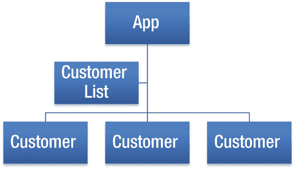
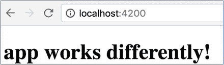
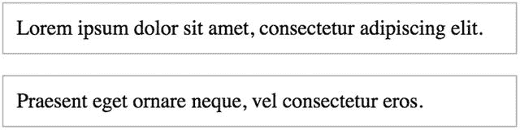
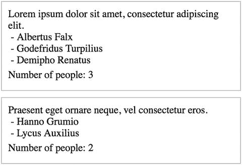
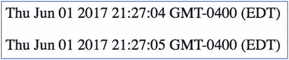
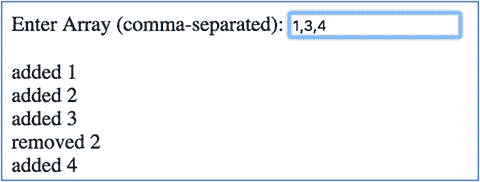
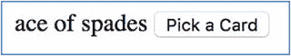
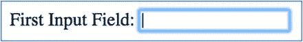

# 十二、更多组件

本章的目的是通过更高级的主题进一步增强您的组件知识。

## 组件和子组件

众所周知，组件是用户界面中的一个构建块。Angular 应用总是有一个应用(或根)组件。这个组件(像其他组件一样)在 HTML 中有一个标签，并且有 Angular 地引导到那个组件中。这个应用组件(像其他组件一样)可以包含其他(子)组件。

因此，组件可以包含其他组件。这就是所谓的构图。正如我在前面的章节中提到的，组件就像是 UI 的乐高积木。组合是用这些乐高积木组合成一个应用的艺术。我用一个例子介绍一下作文。

当您编写单页应用时，惯例是您有一个组件层次结构—一个组合。图 [12-1](#Fig1) 给出了一个例子。



图 12-1

Hierarchy of components

当你用一个组合编码时，你必须非常小心地把数据(称为状态)存储在正确的位置，这样它就不会重复(存储两次)。脸书大学的皮特·亨特在 T2 写了一篇关于这个的精彩文章。这篇文章是关于 React 的，但是同样的规则也适用于 Angular。

## 数据向下流动

数据应该从较高级别的组件向下流到较低级别的组件。当您创建一个从外部接收数据的组件时，您必须使用`@Input` decorator 显式地告诉 Angular 期望该数据作为输入。您将`@Input`装饰器放在数据将从外部注入的实例变量旁边。

当您从外部将数据传递到组件中时，您使用输入属性将数据传递到组件中。

有时，您可能希望输入属性的名称不同于它将被注入到的实例变量的名称。这时您需要使用一个`alias`，它允许您指定输入属性名。在`@Input`装饰器中，`alias`可以在圆括号内指定。图 [12-2](#Fig2) 给出了一个例子。


图 12-2

Passing data to car components

该组件将数据从应用传递到汽车组件。这将是更多组件示例-ex100:

1.  使用 CLI 构建应用:使用以下命令:

    ```ts
    ng new more-components-ex100 --inline-template --inline-style

    ```

2.  开始`ng serve`:使用以下代码:

    ```ts
    cd more-components-ex100
    ng serve

    ```

3.  打开应用:打开 web 浏览器并导航到 localhost:4200。你应该看到“欢迎使用 app！”
4.  编辑 app 类:编辑 app.component.ts，修改为:

    ```ts
    import { Component } from '@angular/core';
    import { ICar } from './icar';

    @Component({
      selector: 'app-root',
      template: `
      <car *ngFor="let car of cars" [theCar]="car"></car>
      `,
      styles: []
    })
    export class AppComponent {
      cars:Array<ICar> = [
        {make: 'bmw', model: 'm3'},
        {make: 'porsche', model: '911'},
        {make: 'bmw', model: 'm3'}
      ];
    }

    ```

5.  创建`ICar`界面:使用以下命令:

    ```ts
    ng generate interface ICar

    ```

6.  编辑 ICar 界面:编辑 icar.ts，更改为:

    ```ts
    export interface ICar {
        make: string,
        model: string
    }

    ```

7.  创建`Car`类:使用下面的代码:

    ```ts
    ng generate component Car --inline-template --inline-style --flat

    ```

8.  编辑`Car`类:编辑 car.component.ts，修改为:

    ```ts
    import { Component, Input } from '@angular/core';
    import { ICar } from './icar';

    @Component({
      selector: 'car',
      template: `
        <p>
          {{car.make}} : {{car.model}}
        </p>
      `,
      styles: []
    })
    export class CarComponent {
      @Input('theCar') car: ICar;
    }

    ```

你的应用应该工作在本地主机:4200。请注意以下几点:

*   应用组件有一个三辆汽车的列表。我们使用`ngFor`指令遍历汽车列表，为每辆汽车生成一个汽车组件。我们使用`theCar`输入属性将汽车传递给汽车组件。
*   我们有一个汽车组件来显示每辆汽车。在 car 组件中，我们使用`theCar`别名输入属性从外部接受 Car 实例变量。

Warning

您可以通过`@Input()`属性和`@Component`注释的`inputs`元素传递包含字段的对象。例如，您可以执行一个 HTTP 请求来获取一个包含名称和地址的 customer 对象，然后通过一个属性将它传递给一个子组件来显示它。这样做很好，但是请记住，在服务器返回响应之前，您传递的属性可能为空。因此，子组件可能试图显示像空对象的名称和地址这样的元素，这可能导致 Angular 抛出异常，并且在数据从服务器返回时不显示数据。这让我好几次措手不及。解决这个问题的方法是使用 Elvis 操作符。

## 向上流动的事件

有时您需要组合包含子组件的父组件并控制它们。父组件需要有响应子组件上发生的事情(事件)的代码。事件应该向上流动，从较低级别的组件向上发出，并由较高级别的组件响应。

下面是如何设置子组件以将自定义事件传递给父组件:

1.  导入`EventEmitter`类。
2.  通过使用`@Component`指令的`events`元素来指定您的组件将发出的定制事件。你一定要记得这样做！
3.  在类中创建一个事件发射器作为实例变量。
4.  当您想要发出一个事件时，调用事件发射器方法`emit`。

下面是如何设置一个父组件来接收子组件的自定义事件:

1.  将带有自定义事件的组件添加到另一个组件中。记得导入它并在`@Component`注释的`directive`元素中指定它。
2.  将带有自定义事件的组件添加到另一个组件的模板标记中。编辑模板中的标记，使用圆括号中的事件名称和它将触发的模板语句来响应自定义事件，例如:`(wordInput)="wordInputEvent($event)"`。请注意，这使用了与非自定义事件相同的语法。

## 通过@Output()发出输出

您在子组件/指令中创建了一个类型为`EventEmitter`的`@Output()`实例变量。您可以修改子组件/指令，以便在需要时使用该实例变量来发出事件。您可以修改父组件，用 template 语句绑定其模板中同名的事件属性。Angular 将从子组件/指令向父组件发出事件，并将调用模板语句。图 [12-3](#Fig3) 给出了一个例子。


图 12-3

Emitting output

图 [12-3](#Fig3) 显示了事件如何从一个组件向上流向另一个组件。这将是更多组件示例-ex200:

1.  使用 CLI 构建应用:使用以下命令:

    ```ts
    ng new more-components-ex200 --inline-template --inline-style

    ```

2.  开始`ng serve`:使用以下代码:

    ```ts
    cd more-components-ex200
    ng serve

    ```

3.  打开应用:打开 web 浏览器并导航到 localhost:4200。你应该看到“欢迎使用 app！”
4.  编辑 app 类:编辑 app.component.ts，修改为:

    ```ts
    import { Component } from '@angular/core';
    import { ICar } from './icar';

    @Component({
      selector: 'app-root',
      template: `
      <car *ngFor="let car of cars" (carDelete)="deleteCar(car)" [theCar]="car">
      </car>
      `,
      styles: []
    })

    export class AppComponent {
      cars:Array<ICar> = [
        {make: 'bmw', model: 'm3'},
        {make: 'porsche', model: '911'},
        {make: 'ford', model: 'mustang'}
      ];

      deleteCar(car: ICar){
        alert('Deleting car:' + JSON.stringify(car));
      }
    }

    ```

5.  创建`ICar`接口:使用下面的代码:

    ```ts
    ng generate interface ICar

    ```

6.  编辑`ICar`界面:编辑 icar.ts，更改为:

    ```ts
    export interface ICar {
        make: string,
        model: string
    }

    ```

7.  创建`Car`类:使用下面的代码:

    ```ts
    ng generate component Car --inline-template --inline-style --flat

    ```

8.  编辑`Car`类:编辑 car.component.ts，修改为:

    ```ts
    import { Component, Input, Output, EventEmitter } from '@angular/core';
    import { ICar } from './icar';

    @Component({
      selector: 'car',
      template: `
        <p>
          {{car.make}} : {{car.model}}
          <button (click)="delete(car)">Delete</button>
        </p>
      `,
      styles: []
    })
    export class CarComponent {
      @Input('theCar') car: ICar;
      @Output() carDelete = new EventEmitter();

      delete(car: ICar){
        this.carDelete.emit(car);
      }
    }

    ```

你的应用应该工作在本地主机:4200。请注意以下几点:

*   应用组件有一个包含三个`Car`的列表。它监听`carDelete`事件，当事件发生时触发`deleteCar`方法。
*   我们有一个汽车组件来显示每辆汽车。它包含一个删除按钮，当用户单击它时会发出一个`carDelete`事件。

## 构图:示例

让我们使用 Angular CLI 创建一个包含其他组件的组件的简单示例。我们将编写一个包含客户列表的应用，该列表包含三个客户，如图 [12-4](#Fig4) 所示。


图 12-4

Customer list with three customers

这将是更多组件示例-ex300:

1.  使用 CLI 构建应用:使用以下命令:

    ```ts
    ng new more-components-ex300 --inline-template --inline-style

    ```

    注意`--inline-template`和`--inline-style`参数。这些命令告诉 CLI 将模板和样式合并到组件的类中，使组件定义成为一个文件，而不是三个文件——当您有很少样式的小模板时，这要容易得多。当您开始编写更大的组件时，您可能需要重新考虑这一点。当您使用这个命令(以及下面的命令)时，您可以添加`--spec`参数来告诉 CLI 不要为应用和组件创建. spec.ts 文件。我只是留下了`spec`文件单独生成。
2.  开始`ng serve`:使用以下代码:

    ```ts
    cd more-components-ex300
    ng serve

    ```

3.  打开应用:打开 web 浏览器并导航到 localhost:4200。你应该看到“欢迎使用 app！”
4.  创建客户列表组件:使用下面的代码:

    ```ts
    ng generate component customer-list --flat --inline-template --inline-style

    ```

    注意我们如何再次使用`--inline-template`和`inline-style`参数将组件合并到一个文件中。我们还使用参数`--spec false`告诉 CLI 不要生成. spec.ts 测试文件。
5.  创建客户组件:使用下面的代码:

    ```ts
    ng generate component customer --flat --inline-template --inline-style

    ```

    我们再次使用`--inline-template`和`inline-style`参数将组件合并到一个文件中。我们使用参数`--spec false`告诉 CLI 不要生成. spec.ts 测试文件。
6.  编辑 app 组件:将下面的代码复制粘贴到 app.component.ts:

    ```ts
    import { Component } from '@angular/core';

    @Component({
      selector: 'app-root',
      template: `
      <div class="app">
      [app]
      <app-customer-list>
      </app-customer-list>
      </div>
      `,
      styles: ['.app {background-color:#d5f4e6;margin:10px;padding:10px;}']
    })

    export class AppComponent {
    }

    ```

7.  编辑客户列表组件:将下面的代码复制粘贴到 customer-list.component.ts:

    ```ts
    import { Component, OnInit } from '@angular/core';

    @Component({
      selector: 'app-customer-list',
      template: `
        <div class="customerList">
        <p>
        [customer list]
        </p>
        <app-customer>
        </app-customer>
        <app-customer>
        </app-customer>
        <app-customer>
        </app-customer>
        </div>
      `,
      styles: ['.customerList {background-color:#80ced6;margin:10px;padding:10px;}']
    })
    export class CustomerListComponent implements OnInit {

      constructor() { }

      ngOnInit() {
      }

    }

    ```

8.  编辑客户组件:将以下代码复制并粘贴到 customer.component.ts:

    ```ts
    import { Component, OnInit } from '@angular/core';

    @Component({
      selector: 'app-customer',
      template: `
        <div class="customer">
          [customer]
        </div>
      `,
      styles: ['.customer {background-color:#fefbd8;margin:10px;padding:10px}']
    })
    export class CustomerComponent implements OnInit {

      constructor() { }

      ngOnInit() {
      }

    }

    ```

你的应用应该工作在本地主机:4200。您已经编写了一个由不同组件组成的应用。请注意以下几点:

*   每个组件的顶部都有一个指定选择器的`@Component`指令。例如，customer 组件:

    ```ts
    @Component({
      selector: 'app-customer',

    ```

    当您需要将该组件包含在另一个组件中时，您可以使用选择器作为标记。例如，客户列表组件使用客户组件的标记三次将其包含在模板中:

    ```ts
    <app-customer>
    </app-customer>
    <app-customer>
    </app-customer>
    <app-customer>
    </app-customer>

    ```

*   文件 app.module.ts 已被 CLI 修改。每个组件都作为一个声明添加到模块中(稍后将详细介绍模块)。

## 数据向下流动:示例

让我们修改示例 more-components-ex300，将数据从客户列表组件向下传递到客户组件，如图 [12-5](#Fig5) 所示。


图 12-5

Customer list with three customers

这将是更多组件示例-ex400。

### 编辑客户组件

我们编辑客户组件以接受来自外部的输入数据:

*   修改导入以包含来自 Angular core:

    ```ts
    import { Component, OnInit, Input } from '@angular/core';

    ```

    的`Input`类
*   更改模板以包含实例变量`customer` : `{{customer.name}}`和`{{customer.city}}`的字符串插值。这将输出`customer`实例变量

    ```ts
      template: `
        <div class="customer">
          {{customer.name}} | {{customer.city}}
        </div>
      `,

    ```

    的`name`和`city`属性的内容
*   将实例变量`customer`声明为输入变量:

    ```ts
    @Input() customer;

    ```

### 编辑客户列表组件

我们编辑客户列表组件，使用单向数据绑定将数据传递给客户组件(稍后将详细介绍):

*   将以下标签

    ```ts
    <app-customer>
    </app-customer>
    <app-customer>
    </app-customer>
    <app-customer>
    </app-customer>

    ```

    替换为:

    ```ts
    <app-customer *ngFor="let customer of customerList" [customer]="customer">
    </app-customer>

    ```

*   声明实例变量`customerList`并用数据填充它。在`export`之后、`constructor`之前添加代码:

    ```ts
      private customerList = [
        { name: 'Brian', city: 'Atlanta'},
        { name: 'Peter', city: 'San Francisco'},
        { name: 'Janet', city: 'Colorado'},
      ];

    ```

你的应用应该工作在本地主机:4200。您修改了组件列表以包含客户列表数据，并使用单向(向下)数据绑定将该数据向下传递给客户。请注意以下几点:

*   客户列表组件将客户列表数据设置为实例变量，模板引用该变量。
*   客户列表组件在模板中使用了一个`ngFor`。这允许模板遍历客户列表，为每个客户创建一个`customer`变量，并通过一个绑定属性将其传递给客户组件。
*   客户组件声明了一个名为`customer`的实例变量。它使用注释`@Input()`告诉 Angular 从外部自动设置它的值。注意，`Input`类必须在客户组件类的顶部导入。
*   客户组件使用模板中的`{{customer.name}}`和`{{customer.city}}`输出名为`customer`的实例变量的`name`和`city`属性。

## 向上流动的事件:示例

让我们修改前面的示例，从客户组件向客户列表组件触发事件，如图 [12-6](#Fig6) 所示。这将是示例 ex300，它基于示例更多组件-ex500。


图 12-6

Firing events

这将是示例 ex300。

### 编辑客户组件

我们编辑客户组件，以便在用户单击客户时输出一个单击事件:

*   修改`import`以包括来自 Angular 核心的`Output`和`EventEmitter`类:

    ```ts
    import { Component, OnInit, Input, Output, EventEmitter } from '@angular/core';

    ```

*   修改模板以在用户点击客户:

    ```ts
    template: `
        <div class="customer"(click)="onClicked()">
          {{customer.name}} | {{customer.city}}
        </div>
      `,

    ```

    时调用方法`onClicked`
*   将事件发射器的实例变量添加到 TypeScript 类:

    ```ts
    @Output() clicked: EventEmitter<String> = new EventEmitter<String>();

    ```

*   将`onClicked`方法添加到 TypeScript 类:

    ```ts
    onClicked(){
      this.clicked.emit(this.customer.name);
    }

    ```

### 编辑客户列表组件

我们编辑客户列表组件来响应客户组件发出的`clicked`事件:

*   修改模板以绑定到`clicked`事件，当事件发生时调用`onCustomerClicked`方法:

    ```ts
    <app-customer *ngFor="let customer of customerList" [customer]="customer" (clicked)="onCustomerClicked($event)">

    ```

*   添加方法`onCustomerClicked`来接收事件数据，并显示一个带有客户名称:

    ```ts
    onCustomerClicked(customerName:String){
      alert('Customer Clicked:' + customerName);
    }

    ```

    的警告框

你的应用应该工作在本地主机:4200。当你点击一个客户时，应用现在应该显示一个警告框。请注意事件是如何从多个客户组件流向单个客户列表组件的。还要注意以下几点:

*   customer 组件为输出带有字符串数据的事件的事件发射器设置一个实例变量。它使用一个注释`@Output()`告诉 Angular 其他组件应该能够绑定到这个事件。
*   客户组件模板包括 Angular 指令`(click)`，用于监听和响应用户点击`div`。它触发一个使用事件发射器输出事件的方法。
*   客户列表组件包括一个事件处理程序，用于监听和响应客户组件中的定制`clicked`事件。
*   客户列表组件包含在`onCustomerClicked`方法中的代码，用于接收来自事件的数据并显示一个警告框。

## 模板参考变量

模板引用变量是对模板中一个或多个元素的引用。可以用`ref-`前缀代替`#`。

一旦声明了模板引用变量，就可以在模板或代码中使用它。然而，你需要知道这个变量不是由 Angular 设置的，直到`ngAfterViewInit`生命周期方法已经完成(本书后面会有更多关于 Angular 生命周期的内容)。

### ViewChild:示例

`ViewChild`声明对组件中子元素的引用。当声明实例变量时，在括号中指定一个选择器，用于将子元素绑定到实例变量。

该示例显示了文本(参见图 [12-7](#Fig7) ),它看起来类似于 CLI 默认应用。这是更多组件示例-ex600。



图 12-7

`ViewChild` example

如果您检查代码，您会看到它使用一个模板变量来引用`h1`元素:

```ts
<h1 #title></h1>

```

在组件加载完视图后，它有代码来设置它的内部 HTML:

```ts
  ngAfterViewInit(){
    this.title.nativeElement.innerHTML = 'app works differently!'
  }

```

还要注意，模板变量由模板中的一些插值引用:

```ts
The title is {{title.innerHTML}}

```

我们来看更多示例-组件-ex600:

1.  使用 CLI 构建应用:使用以下命令:

    ```ts
    ng new more-components-ex600 --inline-template

    ```

    记住`--inline-template`告诉 CLI 在生成新应用时使用内联模板。
2.  开始`ng serve`:使用以下代码:

    ```ts
    cd more-components-ex600
    ng serve

    ```

3.  打开应用:打开 web 浏览器并导航到 localhost:4200。你应该看到“欢迎使用 app！”
4.  编辑类:编辑 app.component.ts，修改为:

    ```ts
    import { Component, ElementRef, ViewChild, AfterViewInit } from '@angular/core';

    @Component({
      selector: 'app-root',
      template: `
      <h1 #title></h1>
      The title is {{title.innerHTML}}
      `,
      styleUrls: ['./app.component.css']
    })
    export class AppComponent implements AfterViewInit  {
      @ViewChild('title') title: ElementRef;

      ngAfterViewInit(){
        this.title.nativeElement.innerHTML = 'app works differently!'
      }
    }

    ```

5.  查看应用:您应该看到“应用的工作方式不同！”

### ViewChildren:示例

`ViewChildren`声明对组件中多个子元素的引用。当声明实例变量时，在括号中指定一个选择器，用于将子元素绑定到实例变量。

该选择器可以是子类型(即`Child`Angular 元素的类)或模板引用(`#name`)。

本例使用`ViewChildren`来访问段落列表(见图 [12-8](#Fig8) )。我们使用`ViewChildren`和一系列子引用名，用逗号分隔。这是更多组件示例-ex700。


图 12-8

Accessing a list of paragraphs

我们来看更多示例-组件-ex700:

1.  使用 CLI 构建应用:使用以下命令:

    ```ts
    ng new more-components-ex700 --inline-template

    ```

2.  开始`ng serve`:使用以下代码:

    ```ts
    cd more-components-ex700
    ng serve

    ```

3.  打开应用:打开 web 浏览器并导航到 localhost:4200。你应该看到“欢迎使用 app！”
4.  编辑类:编辑 app.component.ts，修改为:

    ```ts
    import { Component, ViewChildren, AfterViewInit } from '@angular/core';

    @Component({
      selector: 'app-root',
      template: `
      <p #paragraph1>Lorem ipsum dolor sit amet, consetetur sadipscing elitr, sed diam nonumy eirmod tempor invidunt ut labore et dolore magna aliquyam erat, sed diam voluptua. </p>
      <p #paragraph2>At vero eos et accusam et justo duo dolores et ea rebum. Stet clita kasd gubergren, no sea takimata sanctus est Lorem ipsum dolor sit amet. Lorem ipsum dolor sit amet, consetetur sadipscing elitr,  sed diam nonumy eirmod tempor invidunt ut labore et dolore magna aliquyam erat, sed diam voluptua.</p>
      <p *ngIf="note">{{note}}</p>
      `,
      styles: ['p { background-color: #FFE5CC; padding: 15px; text-align: center}']
    })
    export class AppComponent implements AfterViewInit{
      @ViewChildren('paragraph1, paragraph2') paragraphs;
      note: string = '';

      ngAfterViewInit(){
        setTimeout(_ => this.note = 'Number of Paragraphs:' + this.paragraphs.length);
      }
    }

    ```

你的应用应该工作在本地主机:4200。您应该会看到两段文本，下面有一个段落计数，如图 [12-8](#Fig8) 所示。

### NgContent 和 Transclusion:示例

Transclusion 是将内容从组件标签内的区域包含和转移到组件的模板中。`NgContent`标签用于传输。它甚至有一个选择器，允许您选择要包含的内容。如果您在选择器中使用了一个`[`(如在`[test]`中)，那么它可以用来选择具有该属性的内容(例如，`<div test>hejwejgwegrhj</div>`)。

这个例子非常简单，没有使用选择器。它只包括组件标签之间的文本。这是 more-components-ex800 的示例(见图 [12-9](#Fig9) )。



图 12-9

Text between component tags

我们来看更多示例-组件-ex800:

1.  使用 CLI 构建应用:使用以下命令:

    ```ts
    ng new more-components-ex800 --inline-template

    ```

2.  开始`ng serve`:使用以下代码:

    ```ts
    cd more-components-ex800
    ng serve

    ```

3.  打开应用:打开 web 浏览器并导航到 localhost:4200。你应该看到“欢迎使用 app！”
4.  编辑类:这次我们将把两个`Component`类添加到同一个文件中。编辑 app.component.ts 并将其更改为以下内容:

    ```ts
    import { Component } from '@angular/core';

    @Component({
      selector: 'Paragraph',
      template: `
      <p><ng-content></ng-content></p>
      `,
      styles: ['p { border: 1px solid #c0c0c0; padding: 10px }']
    })
    export class Paragraph {
    }

    @Component({
      selector: 'app-root',
      template: `
      <p>
      <Paragraph>Lorem ipsum dolor sit amet, consectetur adipiscing elit. </Paragraph>
      <Paragraph>Praesent eget ornare neque, vel consectetur eros. </Paragraph>
      </p>
      `,
      styleUrls: ['./app.component.css']
    })
    export class AppComponent {
      title = "welcome to app!";
    }

    ```

5.  编辑模块:我们在同一个文件中有两个`Component`类。我们需要确保两个`Component`都在模块定义中声明——否则，它们将不可用。编辑 app.module.ts 并将其更改为以下内容:

    ```ts
    import { BrowserModule } from '@angular/platform-browser';
    import { NgModule } from '@angular/core';
    import { FormsModule } from '@angular/forms';
    import { HttpModule } from '@angular/http';

    import { AppComponent, Paragraph } from './app.component';

    @NgModule({
      declarations: [
        AppComponent,
        Paragraph
      ],
      imports: [
        BrowserModule,
        FormsModule,
        HttpModule
      ],
      providers: [],
      bootstrap: [AppComponent]
    })
    export class AppModule { }

    ```

你应该会看到两段文字，如图 [12-9](#Fig9) 所示。

### ContentChild:示例

您可以使用`ngContent`来包含附加内容。Transclusion 指的是将内容注入 DOM 中的特定元素。您可以使用`ContentChild`来声明对被包含的附加内容中的`child`元素的引用。

这个例子与前一个例子相似，只是它使用了`ContentChild`来获取对被交叉包含的内容中的`title`元素的引用(参见图 [12-10](#Fig10) )。然后，它包含来自该元素的内部 HTML。这是更多组件示例-ex900。


图 12-10

Text between component tags

我们来看更多示例-组件-ex900:

1.  使用 CLI 构建应用:使用以下命令:

    ```ts
    ng new more-components-ex900 --inline-template

    ```

2.  开始`ng serve`:使用以下代码:

    ```ts
    cd more-components-ex900
    ng serve

    ```

3.  打开应用:打开 web 浏览器并导航到 localhost:4200。你应该看到“欢迎使用 app！”
4.  编辑类:编辑 app.component.ts 并将其更改为:

    ```ts
    import { Component, ContentChild } from '@angular/core';

    @Component({
      selector: 'Paragraph',
      template: `
      <div>
      <b>{{title.nativeElement.innerHTML}}</b>
      <p><ng-content></ng-content></p>
      </div>
      `,
      styles: ['p { border: 1px solid #c0c0c0 }']
    })
    export class Paragraph {
      @ContentChild('title') title;
    }

    @Component({
      selector: 'app-root',
      template: `
      <p>
      <Paragraph><title #title>Paragraph 1</title>Lorem ipsum dolor sit amet, consectetur adipiscing elit. In pulvinar egestas massa sit amet scelerisque.</Paragraph>
      <Paragraph><title #title>Paragraph 2</title>Praesent eget ornare neque, vel consectetur eros. Morbi gravida finibus arcu, vel mattis justo dictum a.</Paragraph>
      </p>
      `,
      styleUrls: ['./app.component.css']
    })
    export class AppComponent {
      title = 'welcome to app!';
    }

    ```

5.  编辑模块:我们在同一个文件中有两个`Component`类。我们需要确保两个`Component`都在模块定义中声明——否则，它们将不可用。编辑 app.module.ts 并将其更改为以下内容:

    ```ts
    import { BrowserModule } from '@angular/platform-browser';
    import { NgModule } from '@angular/core';
    import { FormsModule } from '@angular/forms';
    import { HttpModule } from '@angular/http';

    import { AppComponent, Paragraph } from './app.component';

    @NgModule({
      declarations: [
        AppComponent,
        Paragraph
      ],
      imports: [
        BrowserModule,
        FormsModule,
        HttpModule
      ],
      providers: [],
      bootstrap: [AppComponent]
    })
    export class AppModule { }

    ```

您应该会看到两段文字。

### 内容儿童:示例

您可以使用`ContentChildren`在包含的附加内容中声明对多个子元素的引用。

这个例子与前一个例子相似，只是它使用`ContentChild`来获取对被交叉包含的内容中的`title`元素的引用(参见图 [12-11](#Fig11) )。然后，它包含来自该元素的内部 HTML。这是更多组件示例-ex1000。



图 12-11

List of people and people count

我们来看更多示例-组件-ex1000:

1.  使用 CLI 构建应用:使用以下命令:

    ```ts
    ng new more-components-ex1000 --inline-template

    ```

2.  开始`ng serve`:使用以下代码:

    ```ts
    cd more-components-ex1000
    ng serve

    ```

3.  打开应用:打开 web 浏览器并导航到 localhost:4200。你应该看到“欢迎使用 app！”
4.  编辑类:编辑 app.component.ts 并将其更改为:

    ```ts
    import { Component, ContentChildren } from '@angular/core';

    @Component({
      selector: 'Person',
      template: `
      <div>&nbsp;-&nbsp;<ng-content></ng-content></div>
      `,
      styles: ['']
    })
    export class Person {
    }

    @Component({
      selector: 'Paragraph',
      template: `
      <div>
      <ng-content></ng-content>
      <p *ngIf="people">Number of people: {{people.length}}</p>
      </div>
      `,
      styles: ['div { border: 1px solid #c0c0c0; margin:10px; padding:10px }', 'p { margin: 5px 0 }']
    })
    export class Paragraph {
      @ContentChildren(Person) people;
    }

    @Component({
      selector: 'app-root',
      template: `
      <Paragraph>Lorem ipsum dolor sit amet, consectetur adipiscing elit.
        <Person>Albertus Falx</Person>
        <Person>Godefridus Turpilius</Person>
        <Person>Demipho Renatus</Person>
      </Paragraph>
      <Paragraph>Praesent eget ornare neque, vel consectetur eros.
        <Person>Hanno Grumio</Person>
        <Person>Lycus Auxilius</Person>
      </Paragraph>
        `,
      styleUrls: ['./app.component.css']
    })
    export class AppComponent {
      title = 'welcome to app!';
    }

    ```

5.  编辑模块:我们在同一个文件中有三个`Component`类。我们需要确保两个`Component`都在模块定义中声明——否则，它们将不可用。编辑 app.module.ts 并将其更改为以下内容:

    ```ts
    import { BrowserModule } from '@angular/platform-browser';
    import { NgModule } from '@angular/core';
    import { FormsModule } from '@angular/forms';
    import { HttpModule } from '@angular/http';

    import { AppComponent, Paragraph, Person } from './app.component';

    @NgModule({
      declarations: [
        AppComponent,
        Paragraph,
        Person
      ],
      imports: [
        BrowserModule,
        FormsModule,
        HttpModule
      ],
      providers: [],
      bootstrap: [AppComponent]
    })
    export class AppModule { }

    ```

您应该会看到两段文字。每一段都要有一个人数列表，底部有一个人数，如图 [12-11](#Fig11) 。

## 组件类生命周期

像 AngularJS 一样，Angular 为您管理组件——当它创建组件、更新组件、销毁组件时，等等。每个组件都有所谓的生命周期事件:出生和生活事件，如变化和死亡。有时你需要添加额外的代码，当这些事件发生时，Angular 会为你触发这些代码。

### 构造函数与 OnInit

有时你需要设置你的组件并初始化它。这里有两种选择:可以使用构造函数或`OnInit`生命周期方法。当组件第一次初始化时，触发`OnInit`生命周期方法。

Tip

你应该使用哪一个取决于你，但是许多人遵循这个一般的经验法则。我们主要使用`ngOnInit`进行初始化/声明，避免在构造函数中工作。构造函数应该只用于初始化类成员，但不应该做实际的“工作”

一旦组件加载并可见，您可能需要添加一些代码来做一些事情。例如，将输入焦点放在第一个字段上，这样用户就可以开始输入了。您可能认为可以将这段代码添加到组件类构造函数中，但这是不正确的，因为构造函数是在组件可见之前触发的。事实上，您可能会在视图初始化之后将这段代码添加到`ngAfterViewInit`。

### 接口

要挂钩到生命周期方法，组件的类应该实现所需的接口。然后，该接口将强制您实现相应的方法。

例如，要实现一个在视图初始化后触发的方法，您应该实现接口`AfterViewInit`，它需要方法`ngAfterViewInit`。表 [12-1](#Tab1) 有更多的细节。

表 12-1

Interfaces and Methods

<colgroup><col align="left"> <col align="left"> <col align="left"></colgroup> 
| 连接 | 方法 | 描述 |
| :-- | :-- | :-- |
| `OnChanges` | `ngOnChanges` | 当输入或输出绑定值更改时调用 |
| `OnInit` | `ngOnInit` | 第一个`ngOnChanges`之后 |
| `DoCheck` | `ngDoCheck` | 开发人员的自定义变更检测 |
| `AfterContentInit` | `ngAfterContentInit` | 组件内容初始化后 |
| `AfterContentChecked` | `ngAfterContentChecked` | 每次检查成分含量后 |
| `AfterViewInit` | `ngAfterViewInit` | 组件视图初始化后 |
| `AfterViewChecked` | `ngAfterViewChecked` | 每次检查组件视图后 |
| `OnDestroy` | `ngOnDestroy` | 就在指令被销毁之前 |

### NgOnChanges:示例

当绑定属性的值更改时，将调用此回调。每当输入属性的值改变时，它就执行。它将接收一个包含绑定的当前和先前值的变更映射，该映射被封装在一个`SimpleChange`中(参见图 [12-12](#Fig12) )。这是更多组件示例-ex1100。


图 12-12

Component with a text box that lets you enter text

当您进行更改时，更改会记录在下面。我们来看更多示例-组件-ex1100:

1.  使用 CLI 构建应用:使用以下命令:

    ```ts
    ng new more-components-ex1100 --inline-template --inline-style

    ```

2.  开始`ng serve`:使用以下代码:

    ```ts
    cd more-components-ex1100
    ng serve

    ```

3.  打开应用:打开 web 浏览器并导航到 localhost:4200。你应该看到“欢迎使用 app！”
4.  编辑类:编辑 app.component.ts 并将其更改为:

    ```ts
    import { Component, Input, OnChanges, SimpleChanges } from '@angular/core';

    @Component({
      selector: 'name',
      template: `
      <p *ngFor="let change of changes">
      {{change}}
      </p>
      `,
      styles: []
    })
    export class NameComponent implements OnChanges{
      @Input('name') nm;
      changes: Array<string> = [''];

      ngOnChanges(changes: SimpleChanges){
        this.changes.push(JSON.stringify(changes));
      }
    }

    @Component({
      selector: 'app-root',
      template: `
      Change this field: <input [(ngModel)]="name" />
      <hr/>
      History
      <name [name]="name"></name>
      `,
      styles: []
    })
    export class AppComponent{
      name: string = '';
    }

    ```

5.  编辑模块:编辑 app.module.ts，修改为:

    ```ts
    import { BrowserModule } from '@angular/platform-browser';
    import { NgModule } from '@angular/core';
    import { FormsModule } from '@angular/forms';
    import { HttpModule } from '@angular/http';

    import { AppComponent, NameComponent } from './app.component';

    @NgModule({
      declarations: [
        AppComponent,
        NameComponent
      ],
      imports: [
        BrowserModule,
        FormsModule,
        HttpModule
      ],
      providers: [],
      bootstrap: [AppComponent]
    })
    export class AppModule { }

    ```

你的应用应该工作在本地主机:4200。请注意以下几点:

*   这两个组件驻留在同一个文件中，但是它们必须在模块中分别导入和声明。
*   app 组件使用双向绑定到`name`实例变量。它将`name`实例变量传递给`Name`组件。
*   `Name`组件使用生命周期方法`ngOnChanges`来监听输入属性的变化(在本例中是`name`)。当这个方法被触发时，它使用 JSON.stringify 将一个表示更改的字符串转储到下面的更改列表中。

### NgOnInit:示例

一旦 Angular 创建完组件并初始化它，这个回调就被调用。它在构造函数之后和第一次触发`ngOnChange`之后被直接调用。这是一个显示日志的组件，如图 [12-13](#Fig13) 所示。这将是更多组件示例-ex2000。



图 12-13

Displaying logs

组件初始化和调用生命周期方法`ngOnInit`的日志。我们来看更多示例-组件-ex2000:

1.  使用 CLI 构建应用:使用以下命令:

    ```ts
    ng new more-components-ex1200 --inline-template --inline-style

    ```

2.  开始`ng serve`:使用以下代码:

    ```ts
    cd more-components-ex1200
    ng serve

    ```

3.  打开应用:打开 web 浏览器并导航到 localhost:4200。你应该看到“欢迎使用 app！”
4.  编辑类:编辑 app.component.ts，修改为:

    ```ts
    import { Component, OnInit } from '@angular/core';

    @Component({
      selector: 'app-root',
      template: `
      <p *ngFor="let log of logs">
      {{log}}
      </p>
      `,
      styles: []
    })
    export class AppComponent implements OnInit{
      logs: Array<string> = [ new Date()+''];

      constructor(){
        for (let i=0;i<1000;i++){
          console.log(i);
        }
      }

      ngOnInit(){
        this.logs.push(new Date()+'');
      }
    }

    ```

你的应用应该工作在本地主机:4200。请注意以下几点:

*   定义实例变量时，日志被初始化。
*   构造函数有一些代码来减缓组件的创建。
*   当 Angular 完成创建组件时，日志会增加。

### NgDoCheck:示例

每次检查组件或指令的输入属性时，都会调用此回调。我们可以使用这个生命周期挂钩，用我们自己的定制检查逻辑来扩展检查。

这是一个让你创建一个数组的组件，它会计算出你改变了什么，如图 [12-14](#Fig14) 所示。这将是更多组件示例-ex1300。



图 12-14

Creating an array and figuring out what you change

让我们做得更多-组件-ex1300:

1.  使用 CLI 构建应用:使用以下命令:

    ```ts
    ng new more-components-ex1300 --inline-template --inline-style

    ```

2.  开始`ng serve`:使用以下代码:

    ```ts
    cd more-components-ex1300
    ng serve

    ```

3.  打开应用:打开 web 浏览器并导航到 localhost:4200。你应该看到“欢迎使用 app！”
4.  编辑类:编辑 app.component.ts 并将其更改为:

    ```ts
    import { Component, Input, DoCheck, IterableDiffers } from '@angular/core';

    @Component({
      selector: 'numbers',
      template: `
      {{numbers}}
      <br/>
      <p *ngFor="let change of changes">
      {{change}}
      </p>
      `,
      styles: ['p{padding:0;margin:0}']
    })
    export class NumbersComponent implements DoCheck {
      @Input('numbers') numbersArray: Array<string>;
      changes: Array<string> = [];
      differ;

      constructor(private differs: IterableDiffers) {
        this.differ = differs.find([]).create(null);
      }

      ngDoCheck() {
        const differences = this.differ.diff(this.numbersArray);
        if (differences) {
          if (differences.forEachAddedItem) {
            differences.forEachAddedItem((item) => {
              if ((item) && (item.item)){
                this.changes.push('added ' + item.item);

              }
            });
          }
          if (differences.forEachRemovedItem) {
            differences.forEachRemovedItem((item) => {
              if ((item) && (item.item)){
                this.changes.push('removed ' + item.item);
              }
            });
          }
        }
      }
    }

    @Component({
      selector: 'app-root',
      template: `
      Enter Array (comma-separated): <input [(ngModel)]="numbers" (onModelChange)="onModelChange"/>
      <br/>
      <numbers [numbers]="numbers.split(',')"></numbers>
      `,
      styles: []
    })
    export class AppComponent {
      numbers = '';
    }

    ```

5.  编辑模块:编辑 app.module.ts，修改为:

    ```ts
    import { BrowserModule } from '@angular/platform-browser';
    import { NgModule } from '@angular/core';
    import { FormsModule } from '@angular/forms';
    import { HttpModule } from '@angular/http';

    import { AppComponent, NumbersComponent } from './app.component';

    @NgModule({
      declarations: [
        AppComponent,
        NumbersComponent
      ],
      imports: [
        BrowserModule,
        FormsModule,
        HttpModule
      ],
      providers: [],
      bootstrap: [AppComponent]
    })
    export class AppModule {}

    ```

你的应用应该工作在本地主机:4200。请注意以下几点:

*   app 组件将`input`字符串解析成一个数组，并将其传递给`Numbers`组件。
*   `Numbers`组件有一个通过构造函数注入的`Iterable Differ`,因此它可以是一个实例变量并在以后使用。
*   当输入发生变化并且`Numbers`组件的`input`属性发生变化时，该组件使用`differ`来分析这些变化，并将每个变化添加到变化日志中。

### NgAfterContentInit:示例

这个回调在 ngOnInit 之后被调用:当组件或指令的内容已经被初始化并且绑定已经被第一次检查时。

在本例中，app 组件声明了一个 crew 结构，其内容中包含成员，如图 [12-15](#Fig15) 所示。稍后，此生命周期回调用于选择列表中的第一个组员。这将是更多组件示例-ex1400。


图 12-15

Declaring a crew structure and selecting a member

是时候做更多示例了-组件-ex1400:

1.  使用 CLI 构建应用:使用以下命令:

    ```ts
    ng new more-components-ex1400 --inline-template --inline-style

    ```

2.  开始`ng serve`:使用以下代码:

    ```ts
    cd more-components-ex1400
    ng serve

    ```

3.  打开应用:打开 web 浏览器并导航到 localhost:4200。你应该看到“欢迎使用 app！”
4.  编辑类:编辑 app.component.ts 并将其更改为:

    ```ts
    import { Component, Input, AfterContentInit, ContentChildren, QueryList } from '@angular/core';

    @Component({
      selector: 'member',
      template: `
      <p [style.backgroundColor]="getBackgroundColor()"><ng-content></ng-content></p>
      `,
      styles: ["p{padding: 5px}"]
    })
    export class MemberComponent {

      selected = false;
      getBackgroundColor(){
        return this.selected ? "#FFCCCC" : "#CCFFFF";
      }
    }

    @Component({
      selector: 'crew',
      template: `
      <p><ng-content></ng-content></p>
      `,
      styles: []
    })
    export class CrewComponent implements AfterContentInit {
      @ContentChildren(MemberComponent) members: QueryList<MemberComponent>;

      ngAfterContentInit() {
        this.members.first.selected = true;
      }
    }

    @Component({
      selector: 'app-root',
      template: `
      <crew>
        <member>Captain Kirk</member>
        <member>Spock</member>
        <member>Sulu</member>
        <member>Bones</member>
        <member>Checkov</member>
      </crew>
      `,
      styles: []
    })
    export class AppComponent {}

    ```

5.  编辑模块:编辑 app.module.ts，修改为:

    ```ts
    import { BrowserModule } from '@angular/platform-browser';
    import { NgModule } from '@angular/core';
    import { FormsModule } from '@angular/forms';
    import { HttpModule } from '@angular/http';

    import { AppComponent, CrewComponent, MemberComponent } from './app.component';

    @NgModule({
      declarations: [
        AppComponent,
        CrewComponent,
        MemberComponent
      ],
      imports: [
        BrowserModule,
        FormsModule,
        HttpModule
      ],
      providers: [],
      bootstrap: [AppComponent]
    })
    export class AppModule { }

    ```

你的应用应该工作在本地主机:4200。请注意以下几点:

*   app 组件声明了一个成员在其内容中的 crew 结构。
*   Crew 组件声明实例变量`members`(使用`@ContentChildren`声明)以映射到内容中自己的`crew`标签内的船员列表。这个变量属于`QueryList`类型，因此可以更容易地查询它。
*   一旦 Angular 为您设置了 members 的实例变量，Crew 内容就会使用生命周期方法`ngAfterContentInit`来访问它。然后，这个生命周期方法设置第一个`member`的`selected`实例变量，以便突出显示他或她。
*   成员组件显示了`member`标签中的内容，并根据`selected`实例变量设置了组件的背景颜色。

### NgAfterContentChecked:示例

每次检查完组件或指令的内容后，都会执行该回调，当检查完组件的所有绑定时，该回调会有效；即使他们没有改变。这个例子允许你挑选一张牌，如图 [12-16](#Fig16) 所示。这将是更多组件示例-ex1500。



图 12-16

Picking a card

我们来看更多示例-组件-ex1500:

1.  使用 CLI 构建应用:使用以下命令:

    ```ts
    ng new more-components-ex1500 --inline-template --inline-style

    ```

2.  开始`ng serve`:使用以下代码:

    ```ts
    cd more-components-ex1500
    ng serve

    ```

3.  打开应用:打开 web 浏览器并导航到 localhost:4200。你应该看到“欢迎使用 app！”
4.  编辑类:编辑 app.component.ts 并将其更改为:

    ```ts
    import { Component, ContentChild, AfterContentChecked } from '@angular/core';

    @Component({
      selector: 'card',
      template: `
      <ng-content></ng-content>
      `,
      styles: []
    })
    export class CardComponent {
    }

    @Component({

      selector: 'app-root',
      template: `
      <card>{{card}}</card>
      <button (click)="pickCard($event)">Pick a Card</button>
      `,
      styles: []
    })
    export class AppComponent implements AfterContentChecked {
      card = CARD_ACE_OF_SPADES;

      @ContentChild(CardComponent) contentChild: CardComponent;

      ngAfterContentChecked() {
        console.log("content inside card has been checked: " + this.card);
      }

      pickCard() {
        this.card = this.card === CARD_ACE_OF_SPADES ? CARD_TEN_OF_CLUBS : CARD_ACE_OF_SPADES;
      }
    }

    const CARD_ACE_OF_SPADES = 'ace of spades';
    const CARD_TEN_OF_CLUBS = 'ten of clubs';

    ```

5.  编辑模块:编辑 app.module.ts，修改为:

    ```ts
    import { BrowserModule } from '@angular/platform-browser';
    import { NgModule } from '@angular/core';
    import { FormsModule } from '@angular/forms';
    import { HttpModule } from '@angular/http';

    import { AppComponent, CardComponent } from './app.component';

    @NgModule({
      declarations: [
        AppComponent,
        CardComponent
      ],
      imports: [
        BrowserModule,
        FormsModule,
        HttpModule
      ],
      providers: [],
      bootstrap: [AppComponent]
    })
    export class AppModule { }

    ```

你的应用应该工作在本地主机:4200。请注意以下几点:

*   app 组件使用卡片组件来显示当前卡片。当前 card 是一个实例变量，其值作为内部内容放在 Card 组件中。
*   app 组件有一个按钮可以让你翻到另一张卡。它会更改实例变量的值。
*   app 组件有一个`ngAfterContentChecked`方法，当 Card 组件中的内容改变时会自动触发该方法。当当前卡片改变时触发。

### NgAfterViewInit:示例

这个回调在组件视图及其子视图被创建并初始化后被调用。这对于执行组件初始化很有用。请注意，`@ViewChild`和`@ViewChildren`实例变量此时已经设置好并可用(与组件生命周期的早期不同)。本示例向您展示如何设置初始输入焦点，如图 [12-17](#Fig17) 所示。这将是更多组件示例-ex1600。



图 12-17

Setting initial inpur focus

我们来看更多示例-组件-ex1600:

1.  使用 CLI 构建应用:使用以下命令:

    ```ts
    ng new more-components-ex1600 --inline-template --inline-style

    ```

2.  开始`ng serve`:使用以下代码:

    ```ts
    cd more-components-ex1600
    ng serve

    ```

3.  打开应用:打开 web 浏览器并导航到 localhost:4200。你应该看到“欢迎使用 app！”
4.  编辑类:编辑 app.component.ts，修改为:

    ```ts
    import { Component, AfterViewInit, ViewChild } from '@angular/core';

    @Component({
      selector: 'app-root',
      template: `
        First Input Field: <input #firstInput />
      `,
      styles: []
    })
    export class AppComponent implements AfterViewInit{
      @ViewChild('firstInput') firstInput;

      ngAfterViewInit(){
        // ViewChild variables are available in this method.
        // Set initial focus.
        this.firstInput.nativeElement.focus();
      }
    }

    ```

你的应用应该工作在本地主机:4200。请注意以下几点:

*   app 组件设置`firstInput`实例变量来引用声明为# `firstInput`的模板变量。
*   app 组件有一个`ngAfterViewInit`方法，一旦视图被初始化并且`firstInput`实例变量可用，就会触发该方法。此方法设置初始输入焦点。

### NgAfterViewChecked:示例

每次检查组件视图后都会调用这个回调。它只适用于组件，当所有子指令的绑定都被检查时，即使它们没有改变。如果组件正在等待来自其子组件的东西，这可能会很有用。

不要在这里设置任何绑定到模板的变量。如果这样做，您将收到“检查后表达式已更改”错误。

该示例允许您输入一些内容，并显示一条消息，提示您输入的内容是否为数字，如图 [12-18](#Fig18) 所示。这将是更多组件示例-ex1700。


图 12-18

Displaying whether input is numeric or not

我们来看更多示例-组件-ex1700:

1.  使用 CLI 构建应用:使用以下命令:

    ```ts
    ng new more-components-ex1700 --inline-template --inline-style

    ```

2.  开始`ng serve`:使用以下代码:

    ```ts
    cd more-components-ex1700
    ng serve

    ```

3.  打开应用:打开 web 浏览器并导航到 localhost:4200。你应该看到“欢迎使用 app！”
4.  编辑类:编辑 app.component.ts，修改为:

    ```ts
    import { Component, ViewChild, AfterViewChecked } from '@angular/core';

    @Component({
      selector: 'app-root',
      template: `
      <input [(ngModel)]="input"/>
      <br/>
      {{input}}
      <br/>
      <div #message></div>
      `,
      styles: []
    })
    export class AppComponent implements AfterViewChecked {
      input: string = '';

      @ViewChild('message') message;

      ngAfterViewChecked(){
        console.log('AfterViewChecked');
        if (isNaN(parseInt(this.input))){
          this.message.nativeElement.innerHTML = "Input not numeric.";
        }else{
          this.message.nativeElement.innerHTML = "Input is numeric.";
        }
      }
    }

    ```

5.  编辑类:编辑 app.module.ts，修改为:

    ```ts
    import { BrowserModule } from '@angular/platform-browser';
    import { NgModule } from '@angular/core';
    import { AppComponent } from './app.component';
    import { FormsModule } from '@angular/forms';

    @NgModule({
      declarations: [
        AppComponent
      ],
      imports: [
        BrowserModule,
        FormsModule
      ],
      providers: [],
      bootstrap: [AppComponent]
    })
    export class AppModule { }

    ```

你的应用应该工作在本地主机:4200。请注意以下几点:

*   app 组件设置`message`实例变量来引用声明为# `message`的模板变量。
*   app 组件有一个`ngAfterViewChecked`方法，一旦检查了视图的绑定，就会触发该方法。这是我们检查输入并设置`message`来指示用户输入是否为数字的方法。

### NgOnDestroy:示例

当组件、指令、管道或服务被销毁时，将调用此回调。在这里添加代码以销毁任何可能作为实例变量保留的引用(也就是说，清理您的引用)。

这个例子使用一个时间间隔计时器来计数，当组件被破坏时，这个计时器就会被破坏，如图 [12-19](#Fig19) 所示。这是准备处理组件的最佳位置，例如，取消后台任务。这将是更多组件示例-ex1800。


图 12-19

Counting up with an interval timer

现在我们来看更多示例-组件-ex1800:

1.  使用 CLI 构建应用:使用以下命令:

    ```ts
    ng new more-components-ex1800 --inline-template --inline-style

    ```

2.  开始`ng serve`:使用以下代码:

    ```ts
    cd more-components-ex1800
    ng serve

    ```

3.  打开应用:打开 web 浏览器并导航到 localhost:4200。你应该看到“欢迎使用 app！”
4.  编辑类:编辑 app.component.ts，修改为:

    ```ts
    import { Component, OnInit, OnDestroy } from '@angular/core';

    @Component({
      selector: 'app-root',
      template: `
      <h1>
        {{count}}
      </h1>
      `,
      styles: []
    })
    export class AppComponent implements OnInit, OnDestroy{
      interval;
      count = 0;

      ngOnInit(){
        this.interval = setInterval(() => {
          this.count++;
        })
      }

      ngOnDestroy(){
        clearInterval(this.interval);
        delete this.interval;
      }
    }

    ```

你的应用应该工作在本地主机:4200。请注意以下几点:

*   app 组件有一个`ngOnInit`方法，一旦加载就被触发。它初始化时间间隔，该时间间隔递增计数。
*   app 组件有一个在被销毁时触发的`ngOnDestroy`方法。它清除间隔，停止向上计数。

## 摘要

这是一个重要的章节，因为你将花费大部分时间编写组件。你需要知道你的用户界面是由一系列组件组成的，每一个组件从创建到销毁都有自己的生命周期。

注意您的数据是如何向下流动的，从高级组件向下到低级组件，这也是非常重要的。你需要知道事件如何向相反的方向发展。

在下一章，我们将讨论如何创建服务对象来执行非可视任务，并使用依赖注入将这些对象插入到组件中。