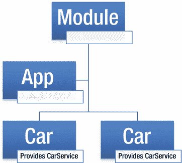
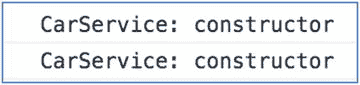
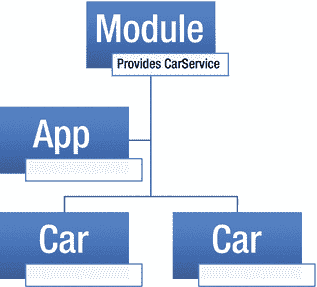
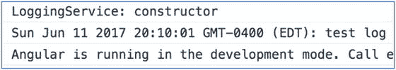

# 十三、依赖注入

在软件工程中，依赖注入是一种软件设计模式，它实现了用于解决依赖的控制反转。依赖是可以使用的对象(服务)。注入是将依赖关系传递给使用它的依赖对象(客户机)。在习惯了 Angular 之后，你会认为依赖注入是理所当然的，因为它太容易使用了。

例如，这段代码

```ts
var svc = new ShippingService(new ProductLocator(),
   new PricingService(), new InventoryService(),
   new TrackingRepository(new ConfigProvider()),
   new Logger(new EmailLogger(new ConfigProvider())));

```

可以被这样的东西代替:

```ts
var svc = container.Resolve<IShippingService>();

```

依赖注入的一些优点包括:

*   你的代码更干净，可读性更强。
*   对象是松散耦合的。
*   有可能消除或至少减少组件不必要的依赖。
*   减少组件的依赖性通常会使它更容易在不同的上下文中重用。
*   提高组件的可测试性。
*   将依赖关系移动到组件的接口，这样您就不用显式地引用依赖关系，而是通过接口来引用它们。

## 服务和供应器

Angular 提供的服务列于表 [13-1](#Tab1) 中。

表 13-1

Angular’s Provided Services

<colgroup><col align="left"> <col align="left"></colgroup> 
| 服务 | 描述 |
| :-- | :-- |
| 超文本传送协议（Hyper Text Transport Protocol 的缩写） | 对于与服务器的 HTTP 通信 |
| 形式 | 表单处理程序代码 |
| 路由器 | 页面导航代码 |
| 动画 | 用户界面动画 |
| 用户界面库 | 例如，`NgBootstrap` |

Tip

您可以从 [`www.ngmodules.org`](http://www.ngmodules.org) 下载其他服务。

您可能希望编写以下服务的特定实现:

*   服务器通信
*   安全
*   审计
*   记录
*   会议

请记住，您的实现可以“包装”其他服务。例如，您的服务器通信服务本身可以使用 Angular Http 服务并添加更多的功能，实现不同的东西，或者只是具有不同的配置。

编写服务时，通常将它们编写为 TypeScript 类，每个类一个文件(filename.service.ts)。使用`@Injectable()`注释将这些类标记为可注入的是一个好主意。`@Injectable()`将一个类标记为可用于实例化的注入器。一般来说，当试图实例化一个没有标记为`@Injectable()`的类时，注入器会报告一个错误。

提供者用于注册类、函数或值，以便依赖注入可以使用它们。`Injector`类使用提供者来提供信息，这样它就可以创建一个对象的实例来注入另一个对象。因此，提供者基本上是如何创建对象实例的信息源。该信息包括令牌，即可能需要创建的对象的标识符。当你在 Angular 代码中看到`provider()`时，你看到的是一个 Angular 函数的调用，用来注册如何创建一个对象的信息。

有三种类型的提供者:类提供者、工厂提供者和值提供者。在这一章的后面，我将首先介绍类提供者，因为它们是最常用的。

每个组件都有自己的注入器，用于提供者为组件创建对象。当组件有子组件时，注射器为子组件创建子注射器。

当依赖注入需要将一个对象注入到一个组件中时，它会尝试使用`get`方法在本地注入器(即组件的注入器)中解析该对象。如果不能解决这个问题(换句话说，如果对象不存在于注入器中)，它将尝试在父组件的注入器中解决该对象，依此类推，一直到应用组件。这确保了优先使用最近的(本地)注射器提供者，而不是更高级别的提供者。这就是所谓的隐藏，类似于同名的局部变量优先于同名的全局变量。

通常 Angular 会为您处理从属关系的解析和创建。然而，`Injector`类提供了您自己调用它的方法——例如，`resolveAndCreate`。

## 创建服务:示例

这是一个简单的组件，它使用服务来提供关于汽车的信息。这将是依赖注入示例 ex100。它将在汽车组件中提供服务，如图 [13-1](#Fig1) 所示。



图 13-1

Component using a service to provide information

让我们试试这个练习:

1.  使用 CLI 构建应用:使用以下命令:

    ```ts
    ng new dependency-injection-ex100 --inline-template --inline-style

    ```

2.  开始`ng serve`:使用以下代码:

    ```ts
    cd dependency-injection-ex100
    ng serve

    ```

3.  打开应用:打开 web 浏览器并导航到 localhost:4200。你应该看到“应用工作！”
4.  创建服务类:创建 car.service.ts 并将其更改为:

    ```ts
    import { Injectable } from '@angular/core';

    @Injectable()
    export class CarService {
        constructor(){
            console.log('CarService: constructor');
        }
        // Some dummy method.
        isSuperCharged(car: string){
            return car === 'Ford GT' ? 'yes' : 'no';
        }
    }

    ```

5.  编辑类:编辑 app.component.ts，修改为:

    ```ts
    import { Component, OnInit, Input } from '@angular/core';
    import { CarService } from './car.service';

    @Component({
      selector: 'car',
      template: `
      <h3>
        {{name}} Is Supercharged: {{supercharged}}
      </h3>
      `,
      styles: [],
      providers: [CarService]
    })
    export class CarComponent implements OnInit{
      @Input() name;
      supercharged: string = '';
      constructor(private service: CarService){}
      ngOnInit(){
        this.supercharged = this.service.isSuperCharged(this.name);
      }
    }

    @Component({

      selector: 'app-root',
      template: `
      <car name="Ford GT"></car>
      <car name="Corvette Z06"></car>
      `,
      styles: []
    })
    export class AppComponent {
      title = 'app works!';
    }

    ```

6.  编辑模块:编辑 app.module.ts，修改为:

    ```ts
    import { BrowserModule } from '@angular/platform-browser';
    import { NgModule } from '@angular/core';
    import { FormsModule } from '@angular/forms';
    import { HttpModule } from '@angular/http';

    import { AppComponent, CarComponent } from './app.component';

    @NgModule({
      declarations: [
        AppComponent, CarComponent
      ],
      imports: [
        BrowserModule,
        FormsModule,
        HttpModule
      ],
      providers: [],
      bootstrap: [AppComponent]
    })
    export class AppModule { }

    ```

你的应用应该工作在本地主机:4200。请注意以下几点:


图 13-2

Returning a yes or no

*   `car`服务在构造函数中输出一个日志。该服务包含一个方法`isSuperCharged`，该方法接收汽车名称作为参数，并相应地返回 yes 或 no，如图 [13-2](#Fig2) 所示。
*   app 组件有一个使用了两次的 car 组件。car 组件将`car`服务指定为提供者。汽车组件调用`service`方法`isSuperCharged`，方法`ngOnInit. ngOnInit`在组件初始化后被触发。

为什么会创建同一服务的多个实例？打开控制台，你会看到类似图 [13-3](#Fig3) 的东西。



图 13-3

Constructor invoked twice

正如您所看到的，构造函数被调用了两次，因为服务被创建了两次。这是因为`CarService`是在汽车组件中提供的，并且汽车组件被创建了两次。以下是汽车部件的摘录:

```ts
@Component({
  selector: 'car',
  ...
  providers: [CarService]
})
export class CarComponent implements OnInit{
  ...
  constructor(private service: CarService){}
  ...
}

```

我们想要的是创建服务的单个实例，如图 [13-4](#Fig4) 所示。


图 13-4

We want one instance of a service created

要做到这一点，我们只需将提供者转移到应用级别或只使用一次的类。在代码示例中，我们可以在

如果我们想要共享服务的单例，该怎么办？我们没有指定我们在`Car`对象上需要它，因为有多个`Car`。我们需要指定我们在应用级别的其他地方需要该服务。

让我们转换我们的应用来共享服务的一个实例。

## 转换应用以共享服务的一个实例:示例依赖项-注入-ex200

这是一个使用服务提供汽车信息的简单组件，如图 [13-5](#Fig5) 所示。


图 13-5

Service providing information about cars

示例 dependency-injection-ex200 与 dependency-injection-ex100 相同，只是它在 app 组件中提供服务，因此只创建一个`CarService`实例，如图 [13-6](#Fig6) 所示。


图 13-6

One instance of `CarService` provided in the app component

让我们做练习依赖-注射-ex200:

1.  使用 CLI 构建应用:使用以下命令:

    ```ts
    ng new dependency-injection-ex200 --inline-template --inline-style

    ```

2.  开始`ng serve`:使用以下代码:

    ```ts
    cd dependency-injection-ex200
    ng serve

    ```

3.  打开应用:打开 web 浏览器并导航到 localhost:4200。你应该看到“应用工作！”
4.  创建服务类:这与前面的例子相同。编辑 car.service.ts 并将其更改为以下内容:

    ```ts
    import { Injectable } from '@angular/core';

    @Injectable()
    export class CarService {
        constructor(){
            console.log('CarService: constructor');
        }
        // Some dummy method.
        isSuperCharged(car: string){
            return car === 'Ford GT' ? 'yes' : 'no';
        }
    }

    ```

5.  编辑类:这与前面的例子不同。编辑 app.component.ts 并将其更改为以下内容:

    ```ts
    import { Component, OnInit, Input } from '@angular/core';
    import { CarService } from './car.service';

    @Component({
      selector: 'car',
      template: `
      <h3>
        {{name}} Is Supercharged: {{supercharged}}
      </h3>
      `,
      styles: [],
      providers: []
    })
    export class CarComponent implements OnInit{
      @Input() name;
      supercharged: string = '';
      constructor(private service: CarService){}
      ngOnInit(){
        this.supercharged = this.service.isSuperCharged(this.name);
      }
    }

    @Component({
      selector: 'app-root',
      template: `
      <car name="Ford GT"></car>
      <car name="Corvette Z06"></car>
      `,
      styles: [],
      providers: [CarService]
    })
    export class AppComponent {
      title = 'app works!';
    }

    ```

6.  编辑模块:这与前面的例子相同。编辑 app.module.ts 并将其更改为以下内容:

    ```ts
    import { BrowserModule } from '@angular/platform-browser';
    import { NgModule } from '@angular/core';
    import { FormsModule } from '@angular/forms';
    import { HttpModule } from '@angular/http';

    import { AppComponent, CarComponent } from './app.component';

    @NgModule({
      declarations: [
        AppComponent, CarComponent
      ],
      imports: [
        BrowserModule,
        FormsModule,
        HttpModule
      ],
      providers: [],
      bootstrap: [AppComponent]
    })
    export class AppModule { }

    ```

你的应用应该工作在本地主机:4200。请注意，`CarService`构造函数在控制台中只记录一次。这是因为它只需要在 app 组件中创建一次，就可以被所有子组件使用。

## 转换应用以共享服务的一个实例:示例依赖项-注入-ex300

这是一个使用服务提供汽车信息的简单组件，如图 [13-7](#Fig7) 所示。


图 13-7

Service providing information about cars

示例 dependency-injection-ex300 与 dependency-injection-ex200 相同，只是它在模块中提供服务，因此只创建了一个`CarService`实例，可以在应用中的任何地方使用，如图 [13-8](#Fig8) 所示。



图 13-8

One instance of `CarService` provided in the module

让我们做练习依赖-注射-ex300:

1.  使用 CLI 构建应用:使用以下命令:

    ```ts
    ng new dependency-injection-ex300 --inline-template --inline-style

    ```

2.  开始`ng serve`:使用以下代码:

    ```ts
    cd dependency-injection-ex300
    ng serve

    ```

3.  打开应用:打开 web 浏览器并导航到 localhost:4200。你应该看到“应用工作！”
4.  创建服务类:这与前面的例子相同。编辑 car.service.ts 并将其更改为以下内容:

    ```ts
    import { Injectable } from '@angular/core';

    @Injectable()
    export class CarService {
        constructor(){
            console.log('CarService: constructor');
        }
        // Some dummy method.
        isSuperCharged(car: string){
            return car === 'Ford GT' ? 'yes' : 'no';
        }
    }

    ```

5.  编辑类:这与前面的例子不同。编辑 app.component.ts 并将其更改为以下内容:

    ```ts
    import { Component, OnInit, Input } from '@angular/core';
    import { CarService } from './car.service';

    @Component({
      selector: 'car',
      template: `
      <h3>
        {{name}} Is Supercharged: {{supercharged}}
      </h3>
      `,
      styles: []
    })
    export class CarComponent implements OnInit{

      @Input() name;
      supercharged: string = '';
      constructor(private service: CarService){}
      ngOnInit(){
        this.supercharged = this.service.isSuperCharged(this.name);
      }
    }

    @Component({
      selector: 'app-root',
      template: `
      <car name="Ford GT"></car>
      <car name="Corvette Z06"></car>
      `,
      styles: []
    })
    export class AppComponent {
      title = 'app works!';
    }

    ```

6.  编辑模块:这不同于前面的例子。编辑 app.module.ts 并将其更改为以下内容:

    ```ts
    import { BrowserModule } from '@angular/platform-browser';
    import { NgModule } from '@angular/core';
    import { FormsModule } from '@angular/forms';
    import { HttpModule } from '@angular/http';

    import { AppComponent, CarComponent } from './app.component';
    import { CarService } from './car.service';

    @NgModule({
      declarations: [
        AppComponent, CarComponent
      ],
      imports: [
        BrowserModule,
        FormsModule,
        HttpModule
      ],
      providers: [CarService],
      bootstrap: [AppComponent]
    })
    export class AppModule { }

    ```

你的应用应该工作在本地主机:4200。请注意，`CarService`构造函数在控制台中只记录一次。这是因为它只需要在 App 模块中创建一次，就可以被所有子组件使用。

## 类提供者:示例依赖注入 ex350

如前所述，有三种类型的提供者:类提供者、工厂提供者和值提供者。类提供者允许我们告诉提供者哪个类用于依赖项。

图 [13-9](#Fig9) 显示了一个依赖于`Watch`服务的组件。


图 13-9

Component relying on a `Watch` service

让我们看看依赖注入示例 ex350:

1.  使用 CLI 构建应用:使用以下命令:

    ```ts
    ng new dependency-injection-ex350 --inline-template --inline-style

    ```

2.  开始`ng serve`:使用以下代码:

    ```ts
    cd dependency-injection-ex350
    ng serve

    ```

3.  打开应用:打开 web 浏览器并导航到 localhost:4200。你应该看到“应用工作！”
4.  编辑类:编辑 app.component.ts，修改为:

    ```ts
    import { Component } from '@angular/core';

    class Watch {
      getTime(): string {
        return new Date() + "";
      }
    }

    class Seiko extends Watch {
      getTime(): string{
        return "Seiko Time:" + super.getTime();

      }
    }

    @Component({
      selector: 'app-root',
      template: `
      <h1>
        {{watch.getTime()}}
      </h1>
      `,
      styles: [],
      providers: [{
        provide: Watch,
        useClass: Seiko
      }]
    })
    export class AppComponent {
      constructor(private watch:Watch){}
    }

    ```

你的应用应该工作在本地主机:4200。注意，当我们使用`@Component`注释的`Provider`元素来创建依赖关系时，我们指定了`Watch`的子类(一个精工)。

## 工厂提供者:示例依赖项-注入-ex400

工厂提供程序使用函数为 Angular 提供对象的实例。当您需要基于某些数据动态地更改您想要创建的对象时，这很有用。

这是一个使用日志服务的简单组件:

1.  使用 CLI 构建应用:使用以下命令:

    ```ts
    ng new dependency-injection-ex400 --inline-template --inline-style

    ```

2.  开始`ng serve`:使用以下代码:

    ```ts
    cd dependency-injection-ex400
    ng serve

    ```

3.  打开应用:打开 web 浏览器并导航到 localhost:4200。你应该看到“应用工作！”
4.  创建服务类:这与前面的例子相同。创建 logging.service.ts 并将其更改为以下内容:

    ```ts
    import { Injectable } from '@angular/core';

    @Injectable()
    export class LoggingService {
        constructor(private dateAndTime: boolean){
            console.log('LoggingService: constructor');
        }
        log(message){
            console.log((this.dateAndTime ? new Date() + ': ' : '') + message);
        }
    }

    ```

5.  编辑类:编辑 app.component.ts，修改为:

    ```ts
    import { Component } from '@angular/core';
    import { LoggingService } from './logging.service';

    @Component({
      selector: 'app-root',
      template: `
      <h1>
        {{title}}
      </h1>
      `,
      styles: [],
      providers: [provideLoggingService()]
    })
    export class AppComponent {
      constructor(private logging: LoggingService){
        logging.log('test log');
      }
      title = 'app works!';
    }
    export const LOGGING_USE_DATE = false;
    export function provideLoggingService() {
      return {
        provide: LoggingService,
        useFactory: () => new LoggingService(LOGGING_USE_DATE)
      }
    }

    ```

你的应用应该工作在本地主机:4200。请注意，该日志服务可以选择包含日志日期和时间。您可以使用日志记录服务的构造函数进行设置。工厂提供者用于提供日志服务的实例。

图 [13-10](#Fig10) 显示了测井包含的日期；



图 13-10

Date included in logging

```ts
export const LOGGING_USE_DATE = true;
export function provideLoggingService() {
  return {
    provide: LoggingService,
    useFactory: () => new LoggingService(LOGGING_USE_DATE)
  }
}

```

图 [13-10](#Fig10) 显示了不包括在测井中的日期；


图 13-11

Date not included in logging

```ts
export const LOGGING_USE_DATE = false;
export function provideLoggingService() {
  return {
    provide: LoggingService,
    useFactory: () => new LoggingService(LOGGING_USE_DATE)
  }
}

```

## 工厂提供者:示例依赖注入 ex500

这是一个显示扑克牌的简单组件，如图 [13-12](#Fig12) 所示。


图 13-12

Displaying a playing card

让我们以依赖注入 ex500 为例:

1.  使用 CLI 构建应用:使用以下命令:

    ```ts
    ng new dependency-injection-ex500 --inline-template --inline-style

    ```

2.  开始`ng serve`:使用以下代码:

    ```ts
    cd dependency-injection-ex500
    ng serve

    ```

3.  打开应用:打开 web 浏览器并导航到 localhost:4200。你应该看到“应用工作！”
4.  创建`Card`类:这与前面的例子相同。编辑 card.ts 并将其更改为以下内容:

    ```ts
    import { Injectable } from '@angular/core';

    @Injectable()
    export class Card {
        constructor(public suite: string, public rank: string) {}
        toString(): string {
            return "Card is " + this.rank + " of " + this.suite;
        }
    }

    ```

5.  编辑类:编辑 app.component.ts，修改为:

    ```ts
    import { Component } from '@angular/core';
    import { Card } from './card';
    @Component({
      selector: 'app-root',
      template: `
      <h1>
        {{title}}
      </h1>
      `,
      styles: [],
      providers: [{
        provide: Card,
        useFactory: () => {
          const suite: number = Math.floor(Math.random() * 4);
          const suiteName: string =
            suite == 0 ? "Clubs" :
            suite == 1 ? "Diamonds" :
            suite == 2 ? "Hearts" : "Spades";
          const rank: number = Math.floor(Math.random() * 15);
          const rankName: string =
            rank == 0 ? "Ace" :
            rank == 1 ? "Joker" :
            rank == 2 ? "King" :
            rank == 3 ? "Queen" :
            (rank - 3).toString();
          return new Card(suiteName, rankName);
        }
      }]
    })

    export class AppComponent {
      title = 'app works!';
      constructor(card:Card){
        this.title = card.toString();

      }
    }

    ```

## 价值提供者:示例依赖关系-注入-ex600

您已经看到了类提供者和工厂提供者的代码和示例。现在让我们看看价值提供者。值提供者只是提供一个对象的值，如图 [13-13](#Fig13) 所示。


图 13-13

Value of an object

让我们看一下依赖注入示例 ex600:

1.  使用 CLI 构建应用:使用以下命令:

    ```ts
    ng new dependency-injection-ex600 --inline-template --inline-style

    ```

2.  开始`ng serve`:使用以下代码:

    ```ts
    cd dependency-injection-ex600
    ng serve

    ```

3.  打开应用:打开 web 浏览器并导航到 localhost:4200。你应该看到“应用工作！”
4.  编辑类:编辑 app.component.ts，修改为:

    ```ts
    import { Component, Injector } from '@angular/core';

    @Component({
      selector: 'app-root',
      template: `
      <h1>
        {{title}}
      </h1>
      `,
      styles: [],
      providers: [{
        provide: 'language',
        useValue: 'en'
      }]
    })
    export class AppComponent {
      title: string = '';
      constructor(private injector: Injector){
        this.title = 'Language is: ' + injector.get('language');
      }
     }

    ```

## 注射器 API

您还不需要非常详细地了解注射器 API。如果你在本章的这一点上感到不知所措，请随意跳到下一章，稍后再回到这一章。

然而，如果您想要对创建依赖关系有更多的控制，您可以直接访问`Injector`对象。`Injector`是角芯包中的一类。它是一个依赖注入容器，用于实例化对象和解析依赖关系。

如果您试图解析和创建(使用`Injector`)的类本身有依赖关系，`Injector`会自动尝试为您解析和创建这些依赖关系。你也可以使用`Provider`类中的附加选项。

这里有一个例子:

```ts
import { Injector } from '@angular/core';

const injector = Injector.resolveAndCreate([Car, Engine, Tires, Doors]);

const car = injector.get(Car);

```

另一个例子是:

```ts
import { Injector } from '@angular/core';

const injector = Injector.resolveAndCreate(
  [
    provide(Car, useClass: Car)),
    provide(Engine, useClass: Engine)),
    provide(Tires, useClass: Tires)),
    provide(Doors, useClass: Doors))
  ]
);

const car = injector.get(Car);

```

## 摘要

本章涵盖了很多内容，从依赖注入的概念一直到`Injector`本身。此时，您不需要了解关于注射器 API 的一切。

您需要知道的是 Angular 中依赖注入的基础——如何设置您的提供者和使用构造器注入。我希望您遵循了这些示例，并且它们帮助您理解依赖注入是如何工作的。

通过依赖注入来使用服务是你会一直用到的。大多数情况下，您的应用将使用每个服务的一个实例。每个服务有一个实例非常有用，因为您可以使用这些服务来保存多个组件访问的状态信息(例如客户列表)。此外，有时您将使用单实例服务作为组件之间的“通信”桥梁。

在下一章，我们将开始讨论第三方部件库。当大公司为你提供经过良好测试和设计精美的 UI 小部件库时，为什么要花费宝贵的时间来开发定制的外观呢？