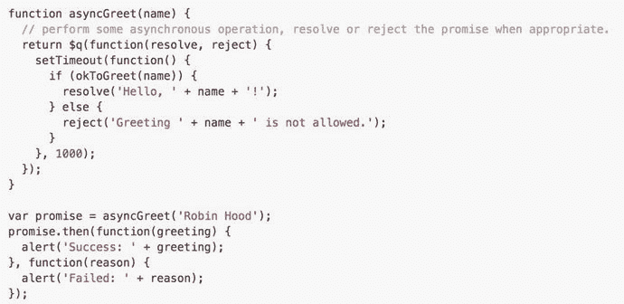
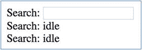

# 十七、Angular 和 RxJS

在前一章中，我们浏览了反应式扩展的核心概念，并学习了 RxJS 中的可观察对象、观察者、订阅和操作符。现在，我们将看看如何在 Angular 中使用反应式扩展。

在写 AngularJS 的时候，反应式扩展还没有出现，但是 promises 出现了。AngularJS 使用了很多 promise 对象，包括$http、$interval 和$timeout 模块。Promise 对象可以用来表示异步结果:成功(返回值)或失败(返回错误)。Promise 对象用于与服务器和许多其他对象的 HTTP 通信。图 [17-1](#Fig1) 给出了一个例子。



图 17-1

Promise objects in AngularJS

在 Angular，承诺正在消失，取而代之的是可观的。不过，它们并没有完全消失。

可观察到的东西比承诺有一些优势:

*   Promises 只发出一个值/错误。随着时间的推移，可观测量可以发出多个值。例如，使用 observable，您可以在一段时间内监听 web 套接字上的事件。有承诺只能听一次。
*   您可以使用带有观察点的运算符进行映射、过滤等操作。
*   你可以取消可观测量。

## 可观测量和 Angular

Angular 在 DOM 事件和 HTTP 服务中使用异步数据流的可观察对象。在监听 DOM(文档对象模型)事件的过程中，您可以观察到用户在用户界面中正在做什么的稳定数据流，比如击键、鼠标事件等等。对于 Http 服务，您可以监听服务器响应，打开连接并响应传入的数据。

### Observables 和 DOM 事件:示例

DOM 是表示 HTML 文档中的对象并与之交互的一种方式。文档节点被组织在一个称为 DOM 树的结构中，树中的对象使用对象上的方法进行寻址和操作。

Angular DOM 事件是可以观察到的。为了使用 DOM 事件，我们将使用模块 Rx。DOM(RxJS 的 HTML DOM 绑定)到 rx.angular。

您可以过滤事件，并将观看多个不同的事件和在一个地方观察结合起来。

这个例子检测用户在 5 秒钟内没有做任何事情。当这种情况发生时，我们在组件的显示中添加一行“idle”，如图 [17-2](#Fig2) 所示。这将是示例 rxjs-和-angular-ex100。



图 17-2

Displaying idle users

让我们来看看这个例子:

1.  使用 CLI 构建应用:使用以下命令:

    ```ts
    ng new rxjs-and-angular-ex100 --inline-template --inline-style

    ```

2.  开始`ng serve`:使用以下代码:

    ```ts
    cd rxjs-and-angular-ex100
    ng serve

    ```

3.  打开应用:打开 web 浏览器并导航到 localhost:4200。你应该看到“欢迎使用 app！”
4.  编辑类:编辑 app.component.ts，修改为:

    ```ts
    import { Component } from '@angular/core';
    import * as Rx from 'rxjs';

    @Component({
      selector: 'app-root',
      template: `
        Search: <input type="text">
        <div *ngFor="let log of _logs">Search:&nbsp;{{log}}</div>
      `,
      styles: []
    })
    export class AppComponent {
      _logs: Array<string> = [];
      constructor(){
        const observable: Rx.Observable<any> = Rx.Observable.merge(
          Rx.Observable.fromEvent(document,'keydown'),
          Rx.Observable.fromEvent(document,'click'),
          Rx.Observable.fromEvent(document,'mousemove'),
          Rx.Observable.fromEvent(document,'scroll'),
          Rx.Observable.fromEvent(document,'touchstart')
        );
        const idleEventObservable = observable.bufferTime(5000)
          .filter(function(arr) {
            return arr.length == 0;
          })
        .subscribe(idleEvent => this._logs.push('idle'));
      }
    }

    ```

你的应用应该工作在本地主机:4200。请注意，在构造函数中，我们将来自文档事件`keydown`、`click`、`mousemove`、`scroll`和`touchstart`的排放合并为一个可观察值。我们将其缓冲为每 5 秒一次，并过滤掉这段时间内发生的事件。然后我们订阅结果，当结果出现时，我们添加一个“空闲”日志，显示在组件中。

### 可观察对象和 HTTP 服务

#### $http 和 http 模块

AngularJS 有自己的 Http 模块。$http 服务是一个核心的 AngularJS 服务，它通过浏览器的`XMLHttpRequest`对象或 JSONP 促进了与远程 http 服务器的通信。

Angular 2 & 4 Http 模块(@angular/http)类似于 Angular 第一版中的 Http 模块，除了它使用了反应式扩展——换句话说，就是 observables。反应式扩展带来了很多好处，提供了前面章节中提到的所有操作符。

当 Angular 5 发布时，它包含了一个新的 httpClient 模块(@angular/common/http)来取代之前的 Http 模块。您仍然可以使用旧的 Http 模块(@angular/http)，但它已被弃用，并将在未来的版本中被删除。

下一章将介绍新的 Angular HttpClient 模块。

## 摘要

本章非常短，但您现在应该了解以下内容:

*   Angular 使用 observables 来处理 DOM 事件和 HTTP 服务调用的结果(调用服务器上的 HTTP 服务并接收结果)。
*   可观测量使用户能够使用 RxJS 处理数据流。例如，您可以发出一个 HTTP 调用来获取一些数据，并使用 RxJS `map`操作符来转换结果。

我使用 RxJs 处理过几次 DOM 事件，但是我经常在 HTTP 服务中使用 RxJs 操作符。我将在下一章介绍 HTTP 服务以及如何在 RxJs 中使用它们。