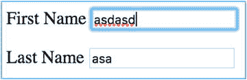
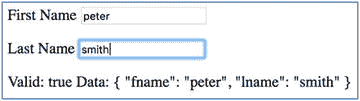
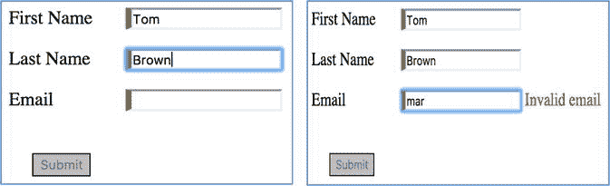
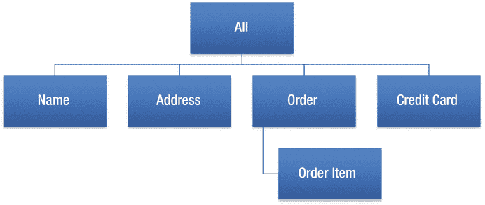
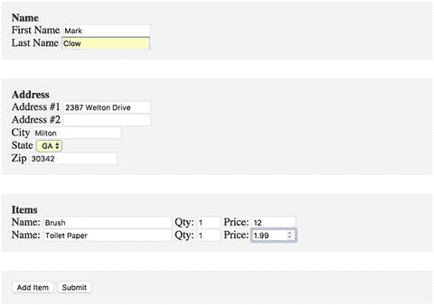
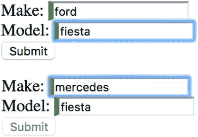

# 十九、表单

没有表单，您无法在应用中输入数据。AngularJS 允许用户快速创建表单，使用`NgModel`指令将输入元素绑定到$scope 中的数据。您也可以在 Angular 中做同样的事情，但是 Angular 4 有一个新的表单模块，可以更容易地执行以下操作:

*   动态创建表单
*   用通用验证器验证输入(必需)
*   用自定义验证器验证输入
*   测试表格

## 两种书写表格的方式

您可以像以前在 AngularJS 中一样继续编写表单，但是我推荐使用新的表单模块，因为它为您做了更多的工作。表单模块提供了两种处理表单的主要方式:模板驱动的表单和反应式表单。这两种方式都适用于同一个表单模块。

### 模板驱动的表单

这与 Angular.JS 中的工作方式类似。我们构建 HTML 模板并添加一些指令来指定附加信息(如验证规则)，Angular 负责在幕后为我们构建模型对象:底层表单、表单组和控件。

*   优点:简单，快速入门，非常适合简单的表单，不需要知道表单模型对象是如何工作的
*   缺点:HTML 和业务规则是耦合的，没有单元测试

### 反应式表单

反应式表单不同。我们自己构建模型对象(包括验证表单规则)，表单绑定(并同步)到模板。我通常使用反应式表单多于模板驱动的表单。

*   优点:更多的控制，对于更高级的表单是完美的，支持单元测试，HTML 和业务规则是分离的
*   缺点:需要知道表单模型对象是如何工作的，需要更多的时间来开发

在撰写本书时，Angular CLI 生成的项目已经建立了对表单模块的节点依赖。您所要做的就是调整您的模块来导入表单模块。下面是 app.module.ts 文件的一个示例:

```ts
import { BrowserModule } from '@angular/platform-browser';
import { NgModule } from '@angular/core';
import { FormsModule } from '@angular/forms';

import { AppComponent } from './app.component';

@NgModule({
  declarations: [
    AppComponent
  ],
  imports: [
    BrowserModule,
    FormsModule
  ],
  providers: [],
  bootstrap: [AppComponent]
})
export class AppModule { }

```

## 表单模型对象

本节适用于两种形式的写作:模板和反应。两者使用相同的模型对象。让我们快速浏览一下。

### NgForm

存储表单的状态信息，包括以下内容:

*   表单内所有控件的值
*   表单中的字段组
*   表单中的字段
*   验证器

### 表单组

存储一组`FormControl`实例的值和有效状态:

*   表单组中所有控件的值

### 表单控件

存储单个控件的值和有效状态，例如列表框:

*   价值
*   验证状态
*   状态(例如，禁用)

您可以添加订户来响应表单控件值的更改:

```ts
this.form.controls['make'].valueChanges.subscribe(
        (value) => { console.log(value); }
);

```

您可以添加订户来响应表单控制状态的更改:

```ts
this.form.controls['make'].statusChanges.subscribe(
        (value) => { console.log(value); }
);

```

示例输出:

```ts
INVALID
VALID

```

### 表单阵列

这用于跟踪多个`FormControl`、`FormGroup`或`FormArray`的值和状态。这对于处理多个表单对象和跟踪整体有效性和状态很有用。

## 表单和 CSS

本节适用于两种编写表单的方法:模板和反应式。当您进行表单验证时，您需要在无效数据出现时突出显示它。表单模块被设计成与 CSS 一起工作，使得突出显示无效的用户输入变得非常容易。表 [19-1](#Tab1) 中列出的样式会自动添加到表单元素中——你需要做的只是添加 CSS 代码来产生所需的视觉效果。

表 19-1

Styles Added to Form Elements

<colgroup><col align="left"> <col align="left"></colgroup> 
| 风格 | 描述 |
| :-- | :-- |
| `ng-touched` | 控件失去焦点时应用的样式 |
| `ng-untouched` | 如果控件尚未失去焦点，则应用样式 |
| `ng-valid` | 控件通过验证时应用的样式 |
| `ng-invalid` | 控件未通过验证时应用的样式 |
| `ng-dirty` | 如果用户已经与控件集成，则应用样式 |
| `ng-pristine` | 用户尚未与控件交互时应用的样式 |

## 模板表单:示例

如前所述，模板表单使用指令来创建表单模型对象。您在模板中构建输入表单和输入，并添加一些指令，表单就准备好了，可以工作了。模板表单非常适合快速构建具有简单验证的简单表单。

模板表单异步工作。因此，在视图初始化和指令处理完成之前，模型对象是不可用的。甚至不是所有的模型对象在`AfterViewInit`生命周期方法中都可用。

要使用 Angular 模板表单，您的应用模块需要从@angular/forms 节点模块导入表单模块:

```ts
import { BrowserModule } from '@angular/platform-browser';
import { NgModule } from '@angular/core';
import { FormsModule } from '@angular/forms';

import { AppComponent } from './app.component';

@NgModule({
  declarations: [
    AppComponent
  ],
  imports: [
    BrowserModule,
    FormsModule
  ],
  providers: [],
  bootstrap: [AppComponent]
})
export class AppModule { }

```

让我们来创建一个模板表单，看看需要什么来使它工作。这是表格示例-ex100。

1.  使用 CLI 构建应用:使用以下命令:

    ```ts
    ng new forms-ex100 --inline-template --inline-style

    ```

2.  开始`ng serve`:使用以下代码:

    ```ts
    cd forms-ex100
    ng serve

    ```

3.  打开应用:打开 web 浏览器并导航到 localhost:4200。你应该看到“应用工作！”
4.  编辑模块:编辑 app.module.ts，修改为:

    ```ts
    import { BrowserModule } from '@angular/platform-browser';
    import { NgModule } from '@angular/core';
    import { FormsModule } from '@angular/forms';

    import { AppComponent } from './app.component';

    @NgModule({
      declarations: [
        AppComponent
      ],
      imports: [
        BrowserModule,
        FormsModule
      ],
      providers: [],
      bootstrap: [AppComponent]
    })
    export class AppModule { }

    ```

5.  编辑组件:编辑 app.component.ts，修改为:

    ```ts
    import { Component, ViewChild } from '@angular/core';
    import { NgForm, RequiredValidator } from '@angular/forms';

    @Component({
      selector: 'app-root',
      template: `
      <form #f novalidate>
        <p>First Name <input name="fname"/></p>
        <p>Last Name <input name="lname"/></p>
        Valid: {{ f.valid }}
        Data: {{ f.value | json }}
      </form>
      `,
      styles: []
    })
    export class AppComponent {
      @ViewChild('f') f: NgForm;
    }

    ```

6.  View app: Notice that this component just displays the input forms, as shown in Figure [19-1](#Fig1). It doesn’t display any further information.

    

    图 19-1

    Displaying input forms  
7.  编辑组件:现在我们将向表单添加一些指令和输入标签，以使表单作为模板表单工作。这些变化在下面的代码中以粗体突出显示:

    ```ts
    import { Component, ViewChild } from '@angular/core';
    import { NgForm, RequiredValidator } from '@angular/forms';

    @Component({
      selector: 'app-root',
      template: `
      <form #f="ngForm" novalidate>
        <p>First Name <input name="fname" ngModel required /></p>
        <p>Last Name <input name="lname" ngModel required /></p>
        Valid: {{ f.valid }}
        Data: {{ f.value | json }}
      </form>  `,
      styles: []
    })
    export class AppComponent {
        @ViewChild('f') f: NgForm;
    }

    ```

8.  View app: Note that this component displays the input forms and the state of the form in Figure [19-2](#Fig2)—its validity and its data.

    

    图 19-2

    State of the form  

这展示了使用`ngForm`和`ngModel`指令制作模板表单有多快，其中的`form`对象保存表单状态(包括数据)。还要注意 HTML 输入字段是如何使用`name`属性的——这是由表单指令获取的，用来标识控件及其值。

## 模板变量和数据绑定:示例

有时，您需要访问每个控件来访问其状态、值等。您可以使用以下语法将模板变量设置为控件的`ngModel`(即其`FormControl`对象)。您也可以使用`ViewChild`来访问作为变量的`FormControl`:

```ts
import { Component, ViewChild } from '@angular/core';
import { NgForm, FormControl, RequiredValidator } from '@angular/forms';

@Component({
  selector: 'app-root',
  template: `
  <form #f="ngForm" novalidate>
    <p>First Name <input name="fname" ngModel #fname="ngModel" required />
    </p>
    <h2>Form Template Variable</h2>
    Valid {{ fname.valid}}
    Data: {{ fname.value | json }}
    <h2>From Instance Variable</h2>
    Valid {{ fname2.valid}}
    Data: {{ fname2.value | json }}
  </form>  `,
  styles: []
})
export class AppComponent {
    @ViewChild('f') f: NgForm;
    @ViewChild('fname') fname2: FormControl;
}

```

您还可以使用模板变量来查询表单控件状态，如表 [19-2](#Tab2) 所示。这使得在模板中添加隐藏和显示错误消息的逻辑变得非常容易。

表 19-2

Template Variables

<colgroup><col align="left"> <col align="left"></colgroup> 
| 可变的 | 描述 |
| :-- | :-- |
| `.touched` | 用户是否在该字段中进行了任何输入？返回真或假。 |
| `.valid` | 字段输入是否通过验证？返回真或假。 |
| `.value` | 当前表单值。 |
| `.hasError('required')` | 是否出现了指定的错误？返回真或假。 |

有时，您需要将每个控件的值双向绑定到模型，以便可以根据需要获取和设置每个控件的值。如果要设置表单控件，这很有用。更改`ngModel`指令以使用双向绑定，并将其链接到实例变量——在下面的例子中是`_name`:

```ts
<input type="text" class="form-control" name="name" placeholder="Name (last, first)" [(ngModel)]="_name" required>

```

让我们来创建一个模板表单并将表单控件绑定到实例变量。让我们用 bootstrap 样式构建这个表单，这样它看起来会很好。提交表单有一个根据用户输入启用或禁用的按钮，如图 [19-3](#Fig3) 所示。


图 19-3

Creating a template form binding form controls to instance variables

这将是表格示例-ex200:

1.  使用 CLI 构建应用:使用以下命令:

    ```ts
    ng new forms-ex200 --inline-template --inline-style

    ```

2.  开始`ng serve`:使用以下代码:

    ```ts
    cd forms-ex200
    ng serve

    ```

3.  打开应用:打开 web 浏览器并导航到 localhost:4200。你应该看到“应用工作！”
4.  编辑网页:编辑 index.html 文件，将其更改为:

    ```ts
    <!doctype html>
    <html lang="en">
    <head>
      <meta charset="utf-8">
      <title>FormsEx200</title>
      <base href="/">

      <link rel="stylesheet" href="https://maxcdn.bootstrapcdn.com/bootstrap/4.0.0-alpha.6/css/bootstrap.min.css" integrity="sha384-rwoIResjU2yc3z8GV/NPeZWAv56rSmLldC3R/AZzGRnGxQQKnKkoFVhFQhNUwEyJ" crossorigin="anonymous">
      <script src="https://code.jquery.com/jquery-3.1.1.slim.min.js" integrity="sha384-A7FZj7v+d/sdmMqp/nOQwliLvUsJfDHW+k9Omg/a/EheAdgtzNs3hpfag6Ed950n" crossorigin="anonymous"></script>
      <script src="https://cdnjs.cloudflare.com/ajax/libs/tether/1.4.0/js/tether.min.js" integrity="sha384-DztdAPBWPRXSA/3eYEEUWrWCy7G5KFbe8fFjk5JAIxUYHKkDx6Qin1DkWx51bBrb" crossorigin="anonymous"></script>
      <script src="https://maxcdn.bootstrapcdn.com/bootstrap/4.0.0-alpha.6/js/bootstrap.min.js" integrity="sha384-vBWWzlZJ8ea9aCX4pEW3rVHjgjt7zpkNpZk+02D9phzyeVkE+jo0ieGizqPLForn" crossorigin="anonymous"></script>

      <meta name="viewport" content="width=device-width, initial-scale=1">
      <link rel="icon" type="image/x-icon" href="favicon.ico">
    </head>
    <body>
      <app-root></app-root>
    </body>
    </html>

    ```

5.  编辑模块:编辑 app.module.ts 文件，将其更改为:

    ```ts
    import { BrowserModule } from '@angular/platform-browser';
    import { NgModule } from '@angular/core';
    import { FormsModule } from '@angular/forms';

    import { AppComponent } from './app.component';

    @NgModule({
      declarations: [
        AppComponent
      ],
      imports: [
        BrowserModule,
        FormsModule
      ],
      providers: [],
      bootstrap: [AppComponent]
    })
    export class AppModule { }

    ```

6.  编辑组件:编辑 app.component.ts 文件，将其更改为:

    ```ts
    import { Component, ViewChild } from '@angular/core';
    import { NgForm, RequiredValidator } from '@angular/forms';

    @Component({
      selector: 'app-root',
      template: `
      <form #appointmentForm="ngForm" novalidate (ngSubmit) = "onSubmitForm(appointmentForm)">
        <legend>Appointment</legend>
        <div class="form-group">
          <label for="name">Name</label>
          <input type="text" class="form-control" name="name" placeholder="Name (last, first)" [(ngModel)]="_name" required>
        </div>
        <div class="form-group">
          <label for="password">Password</label>
          <input type="password" class="form-control" name="password" placeholder="Password" [(ngModel)]="_password" required>
        </div>
        <div class="form-group">
          <div class="form-check">
            <div>
              <label>Appointment Time</label>
            </div>
            <label class="form-check-label">
              <input type="radio" class="form-check-input" name="time" value="12pm" [(ngModel)]="_time" required>
              12pm
            </label>
          </div>
          <div class="form-check">
            <label class="form-check-label">
              <input type="radio" class="form-check-input" name="time" value="2pm" [(ngModel)]="_time" required>
              2pm
            </label>
          </div>
          <div class="form-check">
            <label class="form-check-label">
              <input type="radio" class="form-check-input" name="time" value="4pm" [(ngModel)]="_time" required>
              4pm
            </label>
          </div>
        </div>
        <div class="form-group">

          <label for="exampleTextarea">Ailment</label><textarea class="form-control" name="ailment" rows="3" [(ngModel)]="_ailment" required ></textarea>
        </div>
        <button type="submit" class="btn btn-primary" [disabled]="!_appointmentForm.valid">Submit</button>
        Valid: {{ _appointmentForm.valid }}
        Data: {{ _appointmentForm.value | json }}
      </form>
      `,
      styles: ['form { padding: 20px }', '.form-group { padding-top: 20px }']
    })
    export class AppComponent {
      @ViewChild('appointmentForm') _appointmentForm: NgForm;
      _name: string = 'mark';
      _password: string = '';
      _time: string = '';
      _ailment: string = '';

      onSubmitForm() {
        alert("Submitting data:" + JSON.stringify(this._appointmentForm.value));
      }
    }

    ```

你的应用应该工作在本地主机:4200。注意，文件 index.html 被修改为链接到引导 CSS 和 JavaScript 文件。

文件 app.component 执行以下操作:

*   设置一个模板变量`appointmentForm`的表单。表单在提交时触发方法`onSubmitForm`。
*   设置输入字段，并使用双向绑定和`ngModel`指令将每个字段的值链接到一个实例变量。
*   模板中包含以下标记以启用或禁用提交按钮:

    ```ts
    <button type="submit" class="btn btn-primary" [disabled]="!_appointmentForm.valid">Submit</button>

    ```

*   在下面显示表单有效性和值。

## 模板表单和 CSS:示例

让我们通过创建一个带有颜色编码的输入表单来形成验证状态。绿色表示有效输入，红色表示无效输入。还有错误信息的代码，如图 [19-4](#Fig4) 所示。



图 19-4

Input form with color coding

这将是表格示例-ex300:

1.  使用 CLI 构建应用:使用以下命令:

    ```ts
    ng new forms-ex300 --inline-template --inline-style

    ```

2.  开始`ng serve`:使用以下代码:

    ```ts
    cd forms-ex300
    ng serve

    ```

3.  打开应用:打开 web 浏览器并导航到 localhost:4200。你应该看到“应用工作！”
4.  编辑样式:编辑文件 styles.css，并将其更改为:

    ```ts
    input.ng-valid {
      border-left: 5px solid #42A948; /* green */
    }

    input.ng-invalid {
      border-left: 5px solid #a94442; /* red */
    }

    .error {
        color: #ff0000;
    }

    label {
        display: inline-block;
        width: 100px;
    }

    button {
        border: 1px solid black;
        margin: 20px;
    }

    ```

5.  编辑模块:编辑文件 app.module.ts，修改为:

    ```ts
    import { BrowserModule } from '@angular/platform-browser';
    import { NgModule } from '@angular/core';
    import { FormsModule } from '@angular/forms';

    import { AppComponent } from './app.component';

    @NgModule({
      declarations: [
        AppComponent
      ],
      imports: [
        BrowserModule,
        FormsModule
      ],
      providers: [],
      bootstrap: [AppComponent]
    })
    export class AppModule { }

    ```

6.  编辑组件:编辑 app.component.ts 文件，将其更改为:

    ```ts
    import { Component, ViewChild } from '@angular/core';
    import { NgForm, FormControl, RequiredValidator } from '@angular/forms';

    @Component({
      selector: 'app-root',
      template: `
      <form #f="ngForm" novalidate>
        <p><label>First Name</label><input name="fname" ngModel #fname="ngModel" required />
        <span class="error" *ngIf="fname.touched && fname.hasError('required')">Required</span>
        </p>
        <p><label>Last Name</label><input name="lname" ngModel #lname="ngModel" required />
        <span class="error" *ngIf="lname.touched && lname.hasError('required')">Required</span>
        </p>
        <p><label>Email</label><input name="email" ngModel #email="ngModel" required email />
        <span class="error" *ngIf="email.touched && email.hasError('required')">Required</span>
        <span class="error" *ngIf="email.value && email.touched && email.hasError('email')">Invalid email</span>
        </p>
        <button (click)="onSubmit()" [disabled]="!f.valid">Submit</button>
      </form>`,
      styles: []
    })
    export class AppComponent {
        onSubmit(){
          alert('Submitted');
        }
    }

    ```

你的应用应该工作在本地主机:4200。请注意以下几点:

*   文件 styles.css 将所需的样式应用于适当的状态——例如，当表单控件有有效数据时，将`ng-valid`样式设置为显示绿色指示器。
*   app.component.ts 文件包含根据表单控件状态显示错误信息的逻辑。

## 反应式表单:示例

您为表单构建模型对象——它们与模板表单相同——然后将它们绑定到模板中的输入控件。因此，您正在类中构建表单控件，并修改模板以链接到这些控件。这使您可以完全控制表单、表单值和表单验证。您可以直接操作模型对象(例如，更改值)，绑定会立即同步生效。事实上，值和有效性的更新总是同步的，并且在您的控制之下。

要使用 Angular 模板表单，您的应用模块需要从@angular/forms 节点模块导入反应式表单模块:

```ts
import { BrowserModule } from '@angular/platform-browser';
import { NgModule } from '@angular/core';
import { ReactiveFormsModule } from '@angular/forms';

import { AppComponent } from './app.component';

@NgModule({
  declarations: [
    AppComponent
  ],
  imports: [
    BrowserModule,
    ReactiveFormsModule
  ],
  providers: [],
  bootstrap: [AppComponent]
})
export class AppModule { }

```

要将模板绑定到模型，您需要在组件的模板中创建 HTML `form`和 HTML 输入。然后在组件的类中创建一个表单模型。现在，您使用以下指令将两者绑定在一起:

*   `<form [formGroup]="registerForm">`:连接表单模型和模板中的`form` HTML。
*   `<fieldset formGroupName="address">`:连接表单组和模板中的`fieldset` HTML。
*   `<input formControlName="name">`:连接模型中的表单控件和模板中的`form input` HTML。

让我们来创建一个反应式表单，看看需要什么来使它工作。这将是表格示例-ex400:

1.  使用 CLI 构建应用:使用以下命令:

    ```ts
    ng new forms-ex400 --inline-template --inline-style

    ```

2.  开始`ng serve`:使用以下代码:

    ```ts
    cd forms-ex400
    ng serve

    ```

3.  打开应用:打开 web 浏览器并导航到 localhost:4200。你应该看到“应用工作！”
4.  编辑样式:编辑文件 styles.css，并将其更改为:

    ```ts
    input.ng-valid {
      border-left: 5px solid #42A948; /* green */
    }

    input.ng-invalid {
      border-left: 5px solid #a94442; /* red */
    }

    .error {
        color: #ff0000;
    }

    label {
        display: inline-block;
        width: 100px;
    }

    button {
        border: 1px solid black;
        margin: 20px;
    }

    ```

5.  编辑模块:编辑 app.module.ts 文件，将其更改为:

    ```ts
    import { BrowserModule } from '@angular/platform-browser';
    import { NgModule } from '@angular/core';
    import { ReactiveFormsModule } from '@angular/forms';

    import { AppComponent } from './app.component';

    @NgModule({
      declarations: [
        AppComponent
      ],
      imports: [
        BrowserModule,
        ReactiveFormsModule
      ],
      providers: [],
      bootstrap: [AppComponent]
    })
    export class AppModule { }

    ```

6.  编辑组件:编辑 app.component.ts 文件，将其更改为:

    ```ts
    import { Component, OnInit } from '@angular/core';
    import { FormGroup, FormControl, FormControlName, Validators } from '@angular/forms';

    @Component({
      selector: 'app-root',
      template: `
        <form #form [formGroup]="formGroup" (ngSubmit)="onSubmit(form)" novalidate>
          <label>Name:
            <input formControlName="name">
          </label>
          <br/>
          <label>Location:
            <input formControlName="location">
          </label>
          <br/>
          <input type="submit" value="Submit" [disabled]="!formGroup.valid">
        </form>
      `,
      styles: []
    })
    export class AppComponent implements OnInit{

      formGroup: FormGroup;

      ngOnInit(){
        this.formGroup = new FormGroup({
          name: new FormControl('', Validators.required),
          location: new FormControl('', Validators.required)
        });
      }

      onSubmit(form: FormGroup){
        alert('sumit');
      }
    }

    ```

你的应用应该工作在本地主机:4200。请注意以下几点:

*   文件 styles.css 设置 css 样式。
*   app.component.ts 文件包含表单模板中的 HTML。
*   当组件初始化时，app.component.ts 文件初始化模型，这是一个在`ngInit`方法中带有表单控件的表单组。
    *   app.component.ts 文件将模板中的 HTML 链接到模型。它使用以下代码将 HTML `form`链接到`formGroup`:

        ```ts
        <form #form [formGroup]="formGroup" (ngSubmit)="onSubmit(form)" novalidate>

        ```

    *   它使用以下代码将 HTML `input`链接到`formControl`:

        ```ts
        <input formControlName="name">

        ```

### 反应式表单:表单生成器

`FormBuilder`类旨在帮助您用更少的代码构建表单模型。将`FormBuilder`注入到你的组件的类中，并使用表 [19-3](#Tab3) 中列出的方法。

表 19-3

FormBuilder Methods

<colgroup><col align="left"> <col align="left"> <col align="left"> <col align="left"></colgroup> 
| 方法 | 目的 | 争论 | 返回 |
| :-- | :-- | :-- | :-- |
| `group` | 创建表单组 | 配置对象，额外参数(验证器，异步验证器) | `FormGroup` |
| `control` | 创建表单控件 | 当前表单状态(值/禁用状态)，验证器数组，异步验证器数组 | `FormControl` |
| `array` | 创建表单数组 | 配置对象(数组)、验证器、异步验证器 | `FormArray` |

在接下来的例子中，我们将开始使用`FormBuilder`。

### 反应式表单:表单组嵌套示例

有时我们的表单由多种不同的元素组成。例如，如果您正在输入客户订单，信息可以按以下方式组织:

*   名字
*   地址
*   命令
    *   订单项目
*   信用卡信息

每个元素都可以包含一个或多个表单控件，所以我们需要能够管理每个元素。这就是表单组的用武之地。在这种情况下，你可以拥有如图 [19-5](#Fig5) 所示的表单组层次结构。



图 19-5

Hierarchy of form groups

该示例使用户能够输入并提交一个订单，其中包括客户名称、客户地址和商品列表，如图 [19-6](#Fig6) 所示。



图 19-6

Entering and submitting an order

这将是表格示例-ex500:

1.  使用 CLI 构建应用:使用以下命令:

    ```ts
    ng new forms-ex500 --inline-template --inline-style

    ```

2.  开始`ng serve`:使用以下代码:

    ```ts
    cd forms-ex500
    ng serve

    ```

3.  打开应用:打开 web 浏览器并导航到 localhost:4200。你应该看到“应用工作！”
4.  编辑模块:编辑 app.module.ts 文件，将其更改为:

    ```ts
    import { BrowserModule } from '@angular/platform-browser';
    import { NgModule } from '@angular/core';
    import { ReactiveFormsModule } from '@angular/forms';

    import { AppComponent } from './app.component';

    @NgModule({
      declarations: [
        AppComponent
      ],
      imports: [
        BrowserModule,
        ReactiveFormsModule
      ],
      providers: [],
      bootstrap: [AppComponent]
    })
    export class AppModule { }

    ```

5.  编辑组件类:编辑 app.component.ts 文件，将其更改为:

    ```ts
    import { Component, OnInit } from '@angular/core';
    import { FormGroup, FormArray, FormBuilder, Validators } from '@angular/forms';

    @Component({
      selector: 'app-root',
      templateUrl: 'app.component.html',
      styles: ['div { background-color: #f2f2f2; padding: 15px; margin: 5px }',
        'p { margin: 0px }'
      ]
    })

    export class AppComponent implements OnInit {

      public _parentForm: FormGroup;
      public _name: FormGroup;
      public _addr: FormGroup;
      public _items: FormArray;

      constructor(private _fb: FormBuilder){}

      ngOnInit() {
        this._name = this._fb.group({
            fname: ['', [Validators.required]],
            lname: ['', [Validators.required]]
          });
        this._addr = this._fb.group({
            addr1: ['', [Validators.required]],
            addr2: [''],
            city: ['', [Validators.required]],
            state: ['', [Validators.required]],
            zip: ['', [Validators.required, Validators.minLength(5), Validators.maxLength(5)]],
          });
        this._items = this._fb.array(
          [this.createItemFormGroup()]
        );
        this._parentForm = this._fb.group({
          name: this._name,
          addr: this._addr,
          items: this._items
        });
      }

      createItemFormGroup(){
         return this._fb.group({
                name: ['', Validators.required],
                qty: ['1', Validators.required],
                price: ['', Validators.required]
            });
      }

      addItem(){
        this._items.push(this.createItemFormGroup());
      }

      deleteItem(index){
        delete this._items[index];
      }

      onSubmit(form: FormGroup){
        alert('Submitted');
      }
    }

    ```

6.  编辑组件模板:编辑文件 app.component.html，将其更改为:

    ```ts
    <form [formGroup]="_parentForm" novalidate (ngSubmit)="onSubmit(parentForm)">
      <div formGroupName="name">
        <b>Name</b>
        <br/>
        <label>First Name
          <input type="text" formControlName="fname">
          <small *ngIf="_name.controls.fname.touched && !_name.controls.fname.valid">Required.</small>
        </label>
        <br/>
        <label>Last Name
          <input type="text" formControlName="lname">
          <small *ngIf="_name.controls.lname.touched && !_name.controls.lname.valid">Required.</small>
        </label>
      </div>
      <br/>
      <div formGroupName="addr">
        <b>Address</b>
        <br/>
        <label class="left">Address #1
          <input type="text" formControlName="addr1">
          <small *ngIf="_addr.controls.addr1.touched && !_addr.controls.addr1.valid">Required.</small>
        </label>
        <br/>
        <label>Address #2
          <input type="text" formControlName="addr2">
        </label>
        <br/>
        <label>City
          <input type="text" formControlName="city">
          <small *ngIf="_addr.controls.city.touched && !_addr.controls.city.valid">Required.</small>
        </label>
        <br/>
        <label>State
          <select formControlName="state">
            <option>AL</option>
            <option>GA</option>
            <option>FL</option>
          </select>
          <small *ngIf="_addr.controls.state.touched && !_addr.controls.state.valid">Required.</small>
        </label>
        <br/>
        <label>Zip
          <input type="number" formControlName="zip">
          <small *ngIf="_addr.controls.zip.touched && !_addr.controls.zip.valid">Required.</small>
        </label>
      </div>
      <br/>
      <div formArrayName="items">

        <b>Items</b>
        <br/>
        <p [formGroupName]="i" *ngFor="let item of _items.controls;let i=index">
          <label>Name:&nbsp;<input type="text" formControlName="name" size="30">
            <small *ngIf="item.controls.name.touched && !item.controls.name.valid">Required.</small>
          </label>
          <label>Qty:&nbsp;<input type="number" formControlName="qty" min="1" max="10">
            <small *ngIf="item.controls.qty.touched && !item.controls.qty.valid">Required.</small>
          </label>
          <label>Price:&nbsp;<input type="number" formControlName="price" min="0.01" max="1000" step=".01">
            <small *ngIf="item.controls.price.touched && !item.controls.price.valid">Required.</small>
          </label>
        </p>
      </div>
      <br/>
      <div>
        <input type="button" value="Add Item" (click)="addItem()"/>
        <input type="submit" value="Submit" [disabled]="!_parentForm.valid"/>
      </div>
    </form>

    ```

你的应用应该工作在本地主机:4200。请注意以下几点:

*   我们至少有四个固定的`FormGroup`对象:一个用于名称，一个用于地址，一个用于第一项，另一个用于父表单。
*   `FormArray`包含一个`FormGroup`对象，但是如果用户点击添加项目按钮，它可以包含其他`FormGroup`对象。
*   整个表单的有效性仍然控制着 Submit 按钮的启用和禁用。

## 验证器

Angular 为我们的表单提供了一些验证器。您可以向同一个`FormControl`(在`FormGroup`中的一个项目)添加多个验证器:

*   所需验证:

    ```ts
    this.form = fb.group({
                'name': ['', Validators.required],
            });

    ```

*   最小长度验证:

    ```ts
    this.form = fb.group({
                'name': ['', Validators.required, Validators.minLength(4)]
            });

    ```

*   最大长度验证:

    ```ts
    this.form = fb.group({
                'name': ['', Validators.required, Validators.maxLength(4)]
            });
      }

    ```

### 组合多个验证器

`Validators`类提供了`compose`方法，允许用户为一个控件指定多个验证器:

```ts
constructor(private fb: FormBuilder){
    this.form = fb.group({
            'name': ['', Validators.compose( [Validators.required, Validators.maxLength(6)] ) ],
        });
  }

```

### 自定义验证示例

Angular Forms 模块允许您创建一个自定义类来验证您的输入。验证方法是静态的，只有在出错时才返回验证结果。如果一切正常，这个方法返回一个空值。这个自定义类可以在指定`FormBuilder`中的字段时使用，也可以在组件模板中使用，以提供可视提示。

该组件不允许用户进入奔驰，如图 [19-7](#Fig7) 所示。



图 19-7

Custom validation

这将是表格示例-ex600:

1.  使用 CLI 构建应用:使用以下命令:

    ```ts
    ng new forms-ex600 --inline-template --inline-style

    ```

2.  开始`ng serve`:使用以下代码:

    ```ts
    cd forms-ex600
    ng serve

    ```

3.  打开应用:打开 web 浏览器并导航到 localhost:4200。你应该看到“应用工作！”
4.  编辑样式:编辑文件 styles.css，并将其更改为:

    ```ts
    input.ng-valid {
      border-left: 5px solid #42A948; /* green */
    }

    input.ng-invalid {
      border-left: 5px solid #a94442; /* red */
    }

    ```

5.  编辑模块:编辑 app.module.ts 文件，将其更改为:

    ```ts
    import { BrowserModule } from '@angular/platform-browser';
    import { NgModule } from '@angular/core';
    import { ReactiveFormsModule } from '@angular/forms';

    import { AppComponent } from './app.component';

    @NgModule({
      declarations: [
        AppComponent
      ],
      imports: [
        BrowserModule,
        ReactiveFormsModule
      ],
      providers: [],
      bootstrap: [AppComponent]
    })
    export class AppModule { }

    ```

6.  编辑组件:编辑 app.component.ts 文件，将其更改为:

    ```ts
    import { Component, OnInit } from '@angular/core';
    import { AbstractControl, FormGroup, FormControl, FormControlName, Validators } from '@angular/forms';

    export function validateNotMercedes(control: AbstractControl) {
        return (control.value.toLowerCase() != 'mercedes') ?
          null :
          { validateNotMercedes: {
            valid: false
          }
        }
    }

    @Component({
      selector: 'app-root',
      template: `
        <form #form [formGroup]="formGroup" (ngSubmit)="onSubmit(form)" novalidate>
          <label>Make:
            <input formControlName="make">
          </label>
          <br/>
          <label>Model:
            <input formControlName="model">
          </label>
          <br/>
          <input type="submit" value="Submit" [disabled]="!formGroup.valid">
        </form>
      `,
      styles: []
    })
    export class AppComponent implements OnInit{

      formGroup: FormGroup;

      ngOnInit(){
        this.formGroup = new FormGroup({
          make: new FormControl('', [Validators.required, validateNotMercedes]),
          model: new FormControl('', Validators.required)
        });
      }

      onSubmit(form: FormGroup){
        alert('sumit');
      }
    }

    ```

你的应用应该工作在本地主机:4200。请注意以下几点:

*   文件 app.component.ts 中的代码导出`validateNotMercedes`函数来验证 make。注意，它返回一个 null 来表示有效性——否则，它返回一个属性`valid`设置为 false 的对象。
*   文件 app.component.ts 中的代码使用`FormControl`对象设置表单组。注意这里的`make FormControl`是如何将`validateNotMercedes`函数指定为验证器的。

## 摘要

你不必使用有角的表单模块，但是它们为你做了很多工作，节省了你很多时间。Angular 为您提供了两种选择:快速简单的模板表单和更高级的反应式表单。您需要了解这两者，因为它们都非常有用并且实现得很好。他们可能需要一些时间来学习，但回报是值得的。

下一章讨论管道。管道不是必不可少的，但可能很有用。