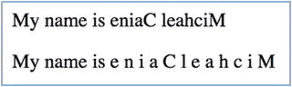

# 二十、管道

从安古拉吉斯时代起，管道就已经存在了。它们在转换数据时很有用，尤其是在整个应用中使用相同的转换时。管道可以很容易地将这些转换添加到组件模板中。

## 弯管

Angular 包括几个要添加到模板中的管道。您不需要导入它们，也不需要将它们添加为指令或任何东西——只需开始使用它们。

### 小写字母

```ts
Lowercase: {{ "The Quick Brown Fox Jumped Over The Lazy Dogs" | lowercase }}

```

生产:

```ts
Lowercase: the quick brown fox jumped over the lazy dogs

```

### 大写字母

```ts
Uppercase: {{ "The Quick Brown Fox Jumped Over The Lazy Dogs" | uppercase }}

```

生产:

```ts
Uppercase: THE QUICK BROWN FOX JUMPED OVER THE LAZY DOGS

```

### 货币

```ts
Currency: {{ 2012.55 | currency }}

```

生产:

```ts
Currency: USD2,012.55

```

### 英国英镑货币

```ts
UK Pound Currency: {{ 2012.55 | currency: 'gbp':true }}

```

生产:

```ts
UK Pound Currency: £2,012.55

```

### 百分比

```ts
Percentage: {{ 0.5 | percent }}

```

生产:

```ts
Percentage: 50%

```

### 日期

```ts
Date: {{ dt | date }}

```

生产:

```ts
Date: Jul 12, 2017

```

### 短期的

```ts
Short Date: {{ dt | date:shortdate }}

```

生产:

```ts
Short Date: Jul 12, 2017

```

### 特殊日期格式

```ts
Special Date Format: {{ dt | date:'yMMMMEEEEd' }}

```

生产:

```ts
Special Date Format: Wednesday, July 12, 2017

```

表 [20-1](#Tab1) 列出了预定义的日期格式。

表 20-1

Predefined Date Formats

<colgroup><col align="left"> <col align="left"> <col align="left"></colgroup> 
| 名字 | 格式 | 示例(英语/美国) |
| :-- | :-- | :-- |
| `medium` | yMMMdjms | 2010 年 9 月 3 日，下午 12:05:08 |
| `short` | yMdjm | 2010 年 3 月 9 日下午 12 时 05 分 |
| `fullDate` | yMMMMEEEEd | 2010 年 9 月 3 日星期五 |
| `longDate` | ymmmmm | 2010 年 9 月 3 日 |
| `mediumDate` | yMMMd | 2010 年 9 月 3 日 |
| `shortDate` | 宜昌船舶柴油机厂 | 9/3/2010 |
| `mediumTime` | （同 JavaMessageService）Java 消息服务 | 下午 12 时 05 分 08 秒 |
| `shortTime` | 牙买加 | 下午 12 点 05 分 |

表 [20-2](#Tab2) 显示了如何组合日期格式元素。

表 20-2

Combining Date Formats

<colgroup><col align="left"> <col align="left"> <col align="left"> <col align="left"> <col align="left"> <col align="left"></colgroup> 
| 名字 | 格式 | 完整的文本表单 | 文本形式简短 | 数字形式 | 数字形式 2 位数 |
| :-- | :-- | :-- | :-- | :-- | :-- |
| `era` | G | 俄文 | G |   |   |
| `year` | y |   |   | y | 尤尼克斯 |
| `month` | M | 嗯 | 嗯 | M | 梅智节拍器 |
| `day` | D |   |   | d | 截止日期（Deadline Date 的缩写） |
| `weekday` | E | 依依社区防屏蔽 | 东方马脑脊髓炎 |   |   |
| `hour` | J |   |   | j | 姐姐 |
| `12 hour` | H |   |   | h | 倍硬 |
| `24 hour` | H |   |   | H | 殿下 |
| `minute` | M |   |   | m | 梅智节拍器 |
| `second` | S |   |   | s | 悬浮物 |
| `timezone` | z / Z | z | Z |   |   |

### 数据

```ts
{{ {customerName: 'Mark', 'address': '2312 welton av 30333'} | json }}

```

生产:

```ts
{ "customerName": "Mark", "address": "2312 welton av 30333" }

```

前面的示例执行了以下操作:

*   生成包含两个属性的 JavaScript 对象:客户姓名和地址
*   将这个 JavaScript 对象传递给`json`管道
*   `json`管道输出所提供对象的 JSON 表示

## 弯管:示例

图 [20-1](#Fig1) 所示的组件使用各种角管显示信息。


图 20-1

Showing various Angular pipes

这将是示例管道-ex100:

1.  使用 CLI 构建应用:使用以下命令:

    ```ts
    ng new pipes-ex100 --inline-template --inline-style

    ```

2.  开始`ng serve`:使用以下代码:

    ```ts
    cd pipes-ex100
    ng serve

    ```

3.  打开应用:打开 web 浏览器并导航到 localhost:4200。你应该看到“应用工作！”
4.  编辑组件:编辑 app.component.ts 文件，将其更改为:

    ```ts
    import { Component } from '@angular/core';

    @Component({
      selector: 'app-root',
      template: `
        <p>
          Lowercase: {{ "The Quick Brown Fox Jumped Over The Lazy Dogs" | lowercase }}
        </p>
        <p>
          Uppercase: {{ "The Quick Brown Fox Jumped Over The Lazy Dogs" | uppercase }}
        </p>
        <p>
          Currency: {{ 2012.55 | currency }}
        </p>
        <p>
          UK Pound Currency: {{ 2012.55 | currency: 'gbp':true }}
        </p>
        <p>
          Percentage: {{ 0.5 | percent }}
        </p>
        <p>
          Date: {{ dt | date }}
        </p>
        <p>
          Short Date: {{ dt | date:shortdate }}
        </p>
        <p>
          Special Date Format: {{ dt | date:'yMMMMEEEEd' }}
        </p>
      `,
      styles: []
    })
    export class AppComponent {
      dt = new Date();
    }

    ```

该应用应该工作，并显示格式化的数据。

## 自定义管道:示例

编写定制管道非常简单。但是，引入了一些新语法，因此需要记住一些事情:

*   使用定制管道的组件需要将`Pipe`类声明为导入，并在`@Component`注释中指定它。
*   管道类以`@Pipe`注释为前缀。它还需要导入`Pipe`和`PipeTransform`，以及实现`PipeTransform`接口。

您可以使用 Angular CLI 命令`ng generate pipe <pipe name>`在 CLI 生成的项目中生成自定义管道。忽略<管道名> .pipe.spec.ts 文件(用于测试)，但编辑<管道名> .pipe.ts 文件:

```ts
ng generate pipe reverse

installing pipe
  create src/app/reverse.pipe.spec.ts
  create src/app/reverse.pipe.ts
  update src/app/app.module.ts

```

您的自定义管道应该是实现`PipeTransform`接口的 TypeScript 类:

```ts
interface PipeTransform {
  transform(value: any, ...args: any[]): any
}

```

图 [20-2](#Fig2) 所示的组件允许用户反转一些文本。它还有一个可选参数—反转文本的每个字符之间的空格数。



图 20-2

Reversing text with a pipe

这将是示例管道-ex200:

1.  使用 CLI 构建应用:使用以下命令:

    ```ts
    ng new pipes-ex200

    ```

2.  开始`ng serve`:使用以下代码:

    ```ts
    cd pipes-ex200
    ng serve

    ```

3.  打开应用:打开 web 浏览器并导航到 localhost:4200。你应该看到“应用工作！”
4.  生成管道:使用 CLI 生成自定义管道:

    ```ts
    ng generate pipe reverse

    ```

5.  编辑管道:编辑 reverse.pipe.ts 文件，并将其更改为:

    ```ts
    import { Pipe, PipeTransform } from '@angular/core';

    @Pipe({
      name: 'reverse'
    })
    export class ReversePipe implements PipeTransform {

      transform(value: any, args?: any): any {
        let spaces = 0;
        if (args){
          spaces = parseInt(args);
        }
        let reversed = '';
        for (let i=value.length-1;i>=0;i--){
          reversed += value.substring(i, i+1);
          reversed += Array(spaces + 1).join(' ');
        }
        return reversed;
      }
    }

    ```

6.  编辑组件:编辑 app.component.ts 文件，将其更改为:

    ```ts
    import { Component } from '@angular/core';
    import { ReversePipe } from './reverse.pipe';
    @Component({
      selector: 'app-root',
      template: `
        <p>My name is {{name | reverse}}
        <p>My name is {{name | reverse:5}}
      `,
      styles: []
    })
    export class AppComponent {
      name: string = 'Michael Caine';
    }

    ```

该应用应该工作，并显示格式化的数据。请注意以下几点:

1.  类`ReversePipe`像任何管道一样实现了`PipeTransform`接口。
2.  类`ReversePipe`通过使用`Array`对象构造函数添加额外的空格。如果向构造函数提供单个值，它会将数组长度设置为该值。然后，`join`方法指定一个字符串来分隔数组的每个元素。

## 摘要

这简短的一章展示了管道的用处。我在以下情况下使用它们:

*   当我需要在整个应用中以标准方式格式化数据时，例如，货币。
*   当我想调试一些实例变量时，我有时会用一个`json`管道将它们添加到模板中。这使得它们的当前状态始终可见，这样我就可以看到它们是如何变化的。

我们将在下一章继续讨论，并涵盖更高级的主题:区域和变化检测。