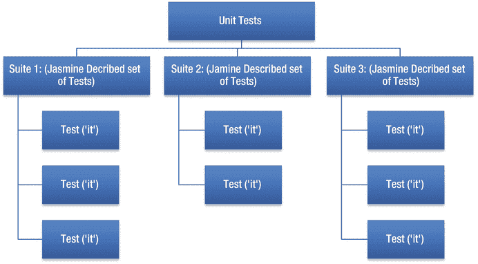
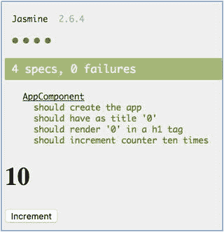

# 二十二、测试

这本书主要是关于如何开始高效地使用 Angular，但是如果没有至少介绍测试你写的代码的方法，这本书是不完整的。测试框架相当复杂，所以不要指望看完这一章就能了解它的一切。

我将介绍一些概念，然后详细介绍如何编写代码来自动测试用 Angular CLI 生成的项目。

单元测试是对应用的最小可能单元的测试，无论是手动的还是自动的。单元测试的目的是确保代码按预期执行，并且新代码不会破坏旧代码。测试驱动开发的过程是按以下顺序开发代码:

1.  编写测试代码(测试工具)
2.  编写应用代码以通过测试
3.  清理和重构应用代码以通过编码标准
4.  检查它是否仍然通过测试

这个过程应该应用于较小的代码单元，并且应该经常重复这个过程。单元测试在现代软件开发过程中是必不可少的。

软件开发使用了开发人员从中央存储库中取出最新代码并对其进行处理的过程。工作完成后(代码经过测试)，开发人员签入完成的代码。持续集成是一天数次将所有开发人员代码集成(或合并)到共享代码库中的过程。尽可能频繁地集成代码突出了快速合并问题，并避免了更大的代码不兼容性。我们的目标是在尽可能短的时间内签出代码，并在有人在此期间做了太多更改之前尽快签入和集成更改。

图 [22-1](#Fig1) 显示了一个(非常通用的)开发过程工作图。它没有考虑代码分支、合并问题和其他因素。


图 22-1

The development process

自动化单元测试需要一些前期工作，但是从长远来看，可以节省人们的时间。自动化测试可以很快发现问题，至少应该在以下两种情况下使用它们:

*   当用户要签入代码变更时，他们应该在本地机器上调用自动化单元测试，以确保代码按预期运行。
*   每当开发人员签入代码更改时，构建服务器都应该调用自动化单元测试。构建服务器还应该跟踪这些测试的结果，让人们知道他们是通过了还是失败了。

集成测试发生在单元测试之后。它测试组合代码，模拟用户运行完整的应用。这是更高层次的测试——在不了解系统结构或实现的情况下测试系统的各个方面。集成测试确保应用按照用户的预期工作，并且应用的各个组成部分能够协同工作。

您的 Angular 应用由具有依赖性的组件组成。您需要开发您的单元测试，以便它们独立地测试代码单元。例如，如果您想测试一个使用服务从服务器获取数据的组件，您可能需要分别测试组件和服务。您可能需要执行以下操作:

*   编写代码来测试组件，向它注入一个以预定方式运行的服务的模拟(虚拟)版本。模拟服务模拟服务的输出。这样，您就可以测试组件是否按照预期处理服务的输出。
*   编写测试服务的代码，注入一个与服务器对话的通信层(后端)的模拟版本(例如，Http 服务)。模拟通信层模拟连接，这些模拟连接能够模拟来自服务器的响应。这样，您就不需要真正的服务器，并且可以测试组件是否按照预期处理来自服务器的输出。

让测试变得复杂的一点是，我们测试的许多代码都是异步的，这意味着它不会阻塞并等待代码完成。测试库(和您的测试代码)有处理异步操作的代码，这使事情变得更加复杂。有时，代码必须在一个特殊的异步区域中运行，以模拟这些操作。

## 因果报应

Karma 是 Angular 团队在 AngularJS 开发过程中开发的一个自动化测试运行器。Karma 可以在真正的浏览器上快速运行单元测试。

您使用 Karma 来启动一个运行一组 Jasmine 测试的服务器。Karma 打开一个 web 浏览器并自动执行测试，您可以看到它在那个浏览器中运行测试。有时它甚至会在测试后让浏览器保持打开状态。

当您构建 CLI 项目时，它会创建 karma.conf.js 文件，允许您为项目配置 karma。配置选项包括基本路径、包含/排除哪些测试文件、autowatch 文件、在哪些浏览器上进行测试、颜色、超时、测试框架(例如 Jasmine，将在下一节中介绍)、服务器主机名和端口(例如 localhost:8080)、日志记录、插件、预处理程序、报告程序、单次运行等等。

Tip

如果您想在测试完成后让浏览器保持打开状态，那么单次运行配置非常有用。如果出现故障，并且您需要通过查看浏览器的开发人员工具来了解发生了什么，这有时会很有用。

## 茉莉

Jasmine 是一个开源的自动化单元测试 JavaScript 框架，通常用于 Angular 和其他 JavaScript 库。

当您编写 Jasmine 测试时，您必须遵循 Jasime 的做事方式。您在. spec.ts 文件中编写描述的测试集(每个文件一个或多个)，每个描述的测试集包含多个测试。每个测试对它测试的代码做一些事情，得到一个结果，然后检查结果的有效性。图 [22-2](#Fig2) 展示了茉莉的结构。



图 22-2

Jasmine structure

Jasmine 单元测试有两层结构:

*   一套“描述的”测试:开发人员使用`describe`函数建立一套一起执行的测试。例如，连通性测试。请注意，`describe`方法也用于为要测试的对象提供依赖关系。在`describe`中声明的变量对于套件中的任何`it`代码块都是可用的。
*   `it`在“描述的”测试套件中执行测试的代码块:开发人员使用`it`函数建立一个测试，在那里执行代码，并在预期和实际结果之间进行比较。开发人员在测试中使用`expect`方法来设定结果预期。如果满足这些条件，代码就通过了测试，否则就失败了。Jasmine 使用“匹配器”来比较预期和实际结果，例如，`expect(a).toEqual(12)`:

```ts
describe("[The class you are about to test]", () => {

  beforeEachProviders(() => {
    return [Array of dependencies];
  });
  it("test1", injectAsync([TestComponentBuilder], (tcb: TestComponentBuilder) => {
    return tcb.createAsync([The class you are about to test]).then((fixture) => {

          // test code ...
      // expect a result
    });
  }));

  it("test2", injectAsync([TestComponentBuilder], (tcb: TestComponentBuilder) => {
    return tcb.createAsync([The class you are about to test]).then((fixture) => {

          // test code ...
      // expect a result
    });
  }));

});

```

### 茉莉概念

表 22-1

Jasmine Concepts

<colgroup><col align="left"> <col align="left"> <col align="left"></colgroup> 
| 名字 | 描述 | 代码关键字 |
| :-- | :-- | :-- |
| 套房 | 对应于需要测试的代码区域的一组描述的测试。每个单元测试文件通常有一套测试，例如 app.component.suite.ts。但是，在一个单元测试文件中可以有一组以上的测试。 | `describe` |
| 投机 | 执行代码并根据预期检查结果的测试。一个套件中可以有多个规格。 | `it` |
| 预期 | 在测试中用于检查结果。 | `expect` |
| 匹配项 | 由预期使用，将预期指定为规则。 | `toBe`、`toEqual`、`toBeNull`、`toContain`、`toThrow`、`toThrowError`等等 |

表 22 是您需要学习的 Jasmine 概念以及与每个概念相关的代码关键字。看一看一个基本 Jasmine 测试的代码(在表格下面),看看它与表格中的概念是如何对应的。

```ts
describe("CalcUtils", function() {                              // suite
//Spec for sum operation
    it("2 plus 2 equals 4", function() {                        // spec
        var calc = new CalcUtils();
        expect(calc.sum(2,2))                                   // expect
                .toEqual(4);                                    // matcher
    });

    //Spec for sum operation with decimal
    it("2.5 plus 2 equals 4.5", function() {                    // spec
        var calc = new CalcUtils();
        expect(calc.sum(2.5,2))                                 // expect
                .toEqual(4.5);                                  // matcher
    });
});

```

### Jasmine 安装和拆卸

您有一套测试(`describe` d)，其中包含一个或多个测试(`spec` s)。通常情况下，`spec`会非常相似，会一次又一次地测试同一个物体。这可能会导致重复代码，因为在每一个`spec`中，您将实例化要测试的对象，测试它，然后销毁它。你可以在表 [22-1](#Tab1) 后面的代码中看到这一点。

Jasmine 提供了一个解决方案:`setup`和`teardown`方法。这些函数在每个测试(`spec`)运行之前和之后立即被调用。这使您能够用尽可能少的代码来设置所有的测试并清理所有的测试。

看看`setup`如何清理我们刚刚看到的代码:

```ts
describe("CalcUtils", function() {                             // suite
    var calc;

    //This will be called before running each spec
    beforeEach(function() {                                    // setup
        var calc = new CalcUtils();
    });

    describe("calculation tests", function(){                  // suite

        //Spec for sum operation
        it("2 plus 2 equals 4", function() {                   // spec
            expect(calc.sum(2,2))                              // expect
                    .toEqual(4);                               // matcher
        });

        //Spec for sum operation with decimal
        it("2 plus 2 equals 4", function() {                   // spec
            expect(calc.sum(2.5,2))                            // expect
                    .toEqual(4.5);                             // matcher
        });

    });
});

```

## 硬币指示器 （coin-levelindicator 的缩写）命令行界面（Command Line Interface for batch scripting）

当我们使用 Angular CLI 生成我们的 Angular 项目时，它会自动(默认)为您生成与 Karma 和 Jasmine 一起工作的单元测试代码。例如，当您生成 Angular 项目时，它会生成一个名为 app.component.ts 的应用组件和一个名为 app.component.spec.ts 的单元测试文件。这个单元测试文件已经包含了对组件进行单元测试的方法。

### 运行单元测试

当您发出以下命令时，Angular 执行项目(当前工作目录中的项目)的编译，然后调用 Karma 来运行所有的单元测试:

```ts
ng test

```

这个命令包括一个文件监视器。如果您更改其中一个项目文件，它将自动重新生成项目并重新运行测试。

### 单元测试文件

当您使用 Angular CLI 生成 Angular 项目时，该项目会生成使用 Karma 和 Jasmine 的单元测试文件。这些单元测试文件

*   通常以. spec.ts 结尾
*   遵循 Jasmine 格式，有一个包含一组`it`测试的`describe`块。
*   可以被修改，允许您添加更多的测试。
*   可以从头开始写，Karma 会帮你捡起并运行它们。
*   使用 Angular @angular/core/testing 模块中的许多 Angular 测试对象。

### 依赖注入

每个描述的测试套件都有点像一个“迷你模块”，因为它运行具有依赖性的代码，因此需要像模块一样设置它们(Angular @NgModule)。

## Angular 测试对象

Angular 提供了一个包含辅助对象的模块@angular/core/testing，使得编写单元测试更加容易:

```ts
import { TestBed, async } from '@angular/core/testing';

```

表 [22-2](#Tab2) 列出了你最有可能在测试模块中使用的对象。

表 22-2

Angular Testing Objects

<colgroup><col align="left"> <col align="left"> <col align="left"></colgroup> 
| 名字 | 类型 | 描述 |
| :-- | :-- | :-- |
| `TestBed` | 班级 | 使开发人员能够创建要测试的代码可以在其中运行的外壳，并提供以下内容:外壳内组件的实例化控制组件的依赖注入的方法查询组件的 DOM 元素的方法调用 Angular 变化检测的方法编译要测试的组件的方法 |
| `async` | 功能 | 它采用一个无参数函数，并返回一个函数，该函数成为`beforeEach`的真参数。以免异步执行`beforeEach`(规范`setup`)中的初始化代码。 |

## 组件夹具

`TestBed`方法`createComponent`使您能够在测试外壳中创建组件，并返回一个`ComponentFixture`对象的实例。组件夹具非常有用的原因之一是它提供了对正在调试的组件的访问。

`ComponentFixture`的`debugElement`属性表示 Angular 分量及其对应的 DOM 元素。它包含以下属性，如表 [22-3](#Tab3) 所示。

表 22-3

`debugElement` Properties

<colgroup><col align="left"> <col align="left"></colgroup> 
| 财产 | 描述 |
| :-- | :-- |
| `componentInstance` | 对组件类的引用，如果您想访问组件中的实例变量和方法，这很有用 |
| `nativeElement` | 对 DOM 中组件类对应的`html`元素的引用，如果您想访问 DOM 以查看模板是如何呈现组件的，这很有用 |

### 件实例

在夹具的`debugElement`属性中，用户可以通过`componentInstance`属性访问 Angular 分量。一旦你访问了`debugElement`，你就可以在你的组件中调用你的方法来测试它。

### 本土元素

同样在`debugElement`中，用户可以通过`nativeElement`属性访问 DOM 元素。`nativeElement`为我们提供了由 Angular 组件生成的 HTML 的`root`元素。这个`root`元素由一个`HTMLElement`对象表示，这是一个具有许多属性和方法的成熟对象。

`HTMLElement`对象不是特定于 Angular 的，但它是 web 开发中非常常用的对象。详见 [`https://developer.mozilla.org/en-US/docs/Web/API/HTMLElement`](https://developer.mozilla.org/en-US/docs/Web/API/HTMLElement) 。

当您为`debugElement`获取`nativeElement`时，这将为您的组件返回`HTMLElement`对象，而不是整个 DOM！

有时，开发人员会错误地认为这个元素包含组件范围之外的 HTML 元素。他们不会有空的！

表 [22-4](#Tab4) 中列出了`HTMLElement`的一些更有用的方法和属性。

表 22-4

`HTMLElement` Methods and Properties

<colgroup><col align="left"> <col align="left"></colgroup> 
| 名字 | 描述 |
| :-- | :-- |
| `innerText`(属性) | 用于返回元素内部的文本。请记住，这个元素可能包含意外的空白。 |
| `innerHTML`(属性) | 返回属于组件的元素内标记的 HTML 语法。 |
| `outerHTML`(属性) | 返回元素内部标记的 HTML 语法，包括其后代。 |
| `querySelector`(方法) | 返回第一个元素，该元素是调用它的元素的后代，与指定的选择器组匹配。有助于在属于组件的元素中查找元素。例如，下面的代码期望定义带有 CSS 类`button-primary`按钮的按钮:`expect(element.querySelector("button.button-primary")).toBeDefined();` |
| `querySelectorAll`(方法) | 返回一个所有元素的`NodeList`,这些元素是调用它的元素的子元素，并且与指定的 CSS 选择器组相匹配。有助于在属于组件的元素中查找子元素。例如，这段代码获得了元素:`let textAreas = element.querySelectorAll("text-area");`中的`text-area`元素的列表 |
| `getAttribute` `([name])`(方法) | 返回元素的属性(由名称标识)，例如`disabled`。下面的代码期望`approveButton`是`disabled` : `expect(approveButton.getAttribute("disabled"))` `.toBeDefined();` |

## CLI 单元测试:示例

第一个例子并不激动人心，但它将展示一个示例 CLI 项目的生成，并检查生成的测试代码。这将是示例测试-ex100:

1.  使用 CLI 构建应用:使用以下命令:

    ```ts
    ng new testing-ex100 --inline-template --inline-style

    ```

2.  导航到文件夹:使用以下命令:

    ```ts
    cd testing-ex100

    ```

3.  打开文件:打开 app.component.spec.ts 并注意以下内容:
    *   在每个规范之前调用`beforeEach`方法。此方法配置测试模块来测试 AppComponent 组件。
    *   有三个规格(测试)。使用测试模块中的`async`方法异步调用每一个。
    *   第一个规范创建一个 fixture，然后从`debug`元素获取组件实例。它检查组件是否真实(即是否有指定的值)。
    *   第二个规范创建一个 fixture，然后从`debug`元素获取组件实例。它检查组件的`title`实例变量是否有值‘app’。
    *   第三个规范(test)创建一个 fixture，然后从 debug 元素获取组件的元素。它检查该元素是否有包含值“欢迎使用应用！”的“h1”元素 
4.  Run tests: Use the following command:

    ```ts
    ng test

    ```

    Now let’s create a simple component (Figure [22-3](#Fig3)) that allows you to increment a counter. Then we’ll write a unit test for it.

    

    图 22-3

    Incrementing a counter This will be example testing-ex200:  
5.  使用 CLI 构建应用:使用以下命令:

    ```ts
    ng new testing-ex200 --inline-template --inline-style

    ```

6.  开始`ng serve`:使用以下代码:

    ```ts
    cd testing-ex200
    ng serve

    ```

7.  打开应用:打开 web 浏览器并导航到 localhost:4200。你应该看到“欢迎使用 app！”
8.  编辑类:编辑 app.component.ts 文件，将其更改为:

    ```ts
    import { Component } from '@angular/core';

    @Component({
      selector: 'app-root',
      template: `
        <h1>
          {{counter}}
        </h1>
        <button (click)="incrementCounter()">Increment Counter</button>
      `,
      styles: []
    })
    export class AppComponent {
      counter = 0;

      incrementCounter(){
        this.counter++;
      }
    }

    ```

9.  编辑单元测试:编辑 app.component.spec.ts 文件，并将其更改为:

    ```ts
    import { TestBed, async } from '@angular/core/testing';
    import { AppComponent } from './app.component';

    describe('AppComponent', () => {
      beforeEach(async(() => {
        TestBed.configureTestingModule({
          declarations: [
            AppComponent
          ],
        }).compileComponents();
      }));

      it('should create the app', async(() => {
        const fixture = TestBed.createComponent(AppComponent);
        const app = fixture.debugElement.componentInstance;
        expect(app).toBeTruthy();
      }));

      it(`should have as title '0'`, async(() => {
        const fixture = TestBed.createComponent(AppComponent);
        const app = fixture.debugElement.componentInstance;
        expect(app.counter).toEqual(0);
      }));

      it(`should render '0' in a h1 tag`, async(() => {
        const fixture = TestBed.createComponent(AppComponent);
        fixture.detectChanges();
        const compiled = fixture.debugElement.nativeElement;
        expect(compiled.querySelector('h1').textContent).toContain('0');
      }));

      it('should increment counter ten times', async(() => {
        const fixture = TestBed.createComponent(AppComponent);
        fixture.detectChanges();
        const compiled = fixture.debugElement.nativeElement;
        for (let i=0;i<10;i++){
          compiled.querySelector('button').click();
          fixture.detectChanges();
          const nbrStr = (i + 1) + '';
          expect(compiled.querySelector('h1').textContent).toContain(nbrStr);
          }
        }));

    });

    ```

10.  运行测试:使用以下命令:

    ```ts
    ng test

    ```

请注意，在末尾添加了一个额外的测试，它会点击 Increment 按钮十次。还要注意，单击按钮后，在调用`fixture.detectChanges`方法执行变更检测之前，附加测试不会起作用。

## 使用假 Http 响应进行测试

### 介绍

在现实世界中，我们的 Angular 应用必须一直使用 HTTP 与服务器通信。当我们编写单元测试时，我们不能假设有一个 API 端点可供我们测试。所有的服务器都可能关闭。可能没有备用服务器。我们需要做的是不使用真正的服务器，模拟(伪造)我们的 Angular 应用和服务器之间的 HTTP 通信。通过这种方式，我们可以编写测试来查看我们的应用如何处理来自 HTTP 服务器的各种响应。

幸运的是，Angular 背后的 Google 工程师让我们的生活变得更加轻松，特别是现在我们有了 Angular 5 和 HttpClient 模块，它位于@angular/common/http 名称空间中。这个新的 HttpClient 模块有自己的新测试模块，称为 HttpClientTestingModule，它驻留在@angular/common/http/testing 名称空间中，可以用来为单元测试创建假的 http 响应。

### 如何使用 HttpClientTestingModule 创建假的 Http 响应

1.  将 HttpClientTestingModule 导入到单元测试中。
2.  将 HttpClient 和 HttpClientTestingModule 注入到您的测试中。
3.  通过调用下面的方法之一来设置一个测试请求对象，告诉 HttpClientTestingModule 在测试中应该接收到多少个 http 请求(见下面)。HttpClientTestingModule 将断言它收到的请求数与其预期的相匹配。【T6 请求数量 http clienttestingmodule 方法`Unsure``match``0``expectNone``1``expectOne`T39】
4.  您在测试请求对象上调用“flush”方法来发送回模拟结果。

### 使用 HttpClient 的测试服务:示例

对于第三个例子，我们将创建一个简单的组件，它使用一个服务使您能够使用 http 服务搜索踪迹(图 [22-4](#Fig4) )。然后，我们将为服务编写一个单元测试，并测试它如何处理服务器响应。


图 22-4

Component to search for trails

1.  对使用服务的组件进行单元测试，并测试它如何处理服务器响应。

这将是示例测试-ex300:

1.  使用 CLI 构建应用:使用以下代码:

    ```ts
    ng new testing-ex300 --inline-template --inline-style

    ```

2.  开始`ng serve`:使用以下代码:

    ```ts
    cd testing-ex300
    ng serve

    ```

3.  打开应用:打开 web 浏览器并导航到 localhost:4200。你应该看到“欢迎使用 app！”
4.  编辑模块:编辑 app.module.ts 文件，将其更改为:

    ```ts
    import { BrowserModule } from '@angular/platform-browser';
    import { NgModule } from '@angular/core';
    import { FormsModule } from '@angular/forms';
    import { HttpClientModule, HttpClient } from '@angular/common/http';
    import { AppComponent } from './app.component';
    import { Service } from './service';

    @NgModule({
      declarations: [
        AppComponent
      ],
      imports: [
        BrowserModule,
        FormsModule,
        HttpClientModule
      ],
      providers: [HttpClient, Service],
      bootstrap: [AppComponent]
    })
    export class AppModule { }

    ```

5.  编辑类:编辑 app.component.ts 文件，将其更改为:

    ```ts
    import { Component } from '@angular/core';
    import { Service } from './service';
    import { FormsModule } from '@angular/forms';

    @Component({
      selector: 'app-root',
      template: `
        <h2>Trail Finder</h2>
        <input [(ngModel)]="_search" placeholder="city">
        <button (click)="doSearch()">Find Me a Trail</button>
        <div id="notFound" class="notFound" *ngIf="_searched && !_result">
          We could not find a trail here. :(
        </div>
        <div class="found" *ngIf="_searched && _result">
        <p id="name">Name: {{_result?.name}}</p>
        <p id="state">State: {{_result?.state}}</p>
        <p id="directions">Directions: {{_result?.directions}}</p>
        <p>Activities:</p>
        <ul id="activities" *ngIf="_result?.activities">
          <li *ngFor="let activity of _result.activities">
            {{activity.activity_type_name}} {{activity.description}}
          </li>
        </ul>
      `,
      styles: [`.found {
        border: 1px solid black;
        background-color: #8be591;
        color: black;
        margin: 10px;
        padding: 10px;
      }`,
      `.notFound {
        border: 1px solid black;
        background-color: #d13449;
        color: white;
        margin: 10px;
        padding: 10px;
      }`]
    })
    export class AppComponent {
      _search = 'Atlanta';
      _searched = false;
      _result = '';

      constructor(private _service: Service) {
      }

      doSearch() {
        this._service.search(this._search).subscribe(
          res => {
            this._result = res;
          },
          err => {
            console.log(err);
          },
          () => {
            this._searched = true;
          }
        );
      }
    }

    ```

6.  添加服务类:创建文件 service.ts 并将其更改为:

    ```ts
    import { Injectable } from '@angular/core';
    import { HttpClient, HttpHeaders } from '@angular/common/http';
    import 'rxjs/Rx';

    @Injectable()
    export class Service {
    constructor(private _http: HttpClient){}
    search(search) {
      const concatenatedUrl: string =
        "https://trailapi-trailapi.p.mashape.com?q[city_cont]=" +
        encodeURIComponent(search);
      const mashapeKey = 'OxWYjpdztcmsheZU9AWLNQcE9g9wp1qdRkFjsneaEp2Yf68nYH';
      const httpHeaders: HttpHeaders = new HttpHeaders(
        {'Content-Type': 'application/json',
       'X-Mashape-Key': mashapeKey});
      return this._http
        .get<any>(concatenatedUrl, { headers: httpHeaders })
        .map(res => {
          // return the first place.
          if ((res) && (res['places']) && (res['places'].length) && (res['places'].length > 0)){
            return res['places'][0];
          }else{
            // otherwise return nothing
            return undefined;
          }
         })
         .catch(err => {
           console.log(‘error',err)
           return undefined;
         });
      }
    }

    ```

7.  该应用现在应该可以工作了:返回到您的 web 浏览器并导航到 localhost:4200。你应该能够搜索踪迹。
8.  添加服务单元测试:创建文件 service.spec.ts，并将其更改为:

    ```ts
    import { TestBed, getTestBed, async } from '@angular/core/testing';
    import { HttpClientTestingModule, HttpTestingController } from '@angular/common/http/testing';
    import { FormsModule } from '@angular/forms';
    import { AppComponent } from './app.component';
    import { Service } from './service';
    import { HttpClientModule } from '@angular/common/http/src/module';
    import 'rxjs/Rx';

    describe('AppComponent (data found)', () => {
      let service: Service;
      let httpMock: HttpTestingController;

      beforeEach(() => {

        TestBed.configureTestingModule({
          imports: [HttpClientTestingModule],
          providers: [Service]
        });

        service = TestBed.get(Service);
        httpMock = TestBed.get(HttpTestingController);

      });

      it('should return the first place if there is one', async() => {
        service.search("Atlanta").subscribe((res: any) => {
            expect(res.name).toContain('Boat Rock');
            expect(res.city).toBe('Atlanta');
            expect(res.state).toBe('Georgia');
            expect(res.country).toBe('United States');
            expect(res.directions).toContain('Interstate 20 and Fulton Industrial');
            expect(res.activities.length).toBe(1);
            });
        const req = httpMock.expectOne('https://trailapi-trailapi.p.mashape.com?q[city_cont]=Atlanta');
        const mockData =
        {
          "places":[
              {
                "city":"Atlanta",
                "state":"Georgia",
                "country":"United States",
                "name":"Boat Rock",
                "parent_id":null,
                "unique_id":5370,

                "directions":"From the intersection of Interstate 20 and Fulton Industrial Boulevard go south for 3.8 miles, turn left onto Bakers Ferry Road SW, go 0.5 miles, turn left on Boat Rock Road SW, go 0.4 miles, look for small gravel driveway on the right, pull into small 6 car parking lot. There is a small kiosk at the edge of the lot with a rough map of the area and a trail leading up to the boulders. The lake area is located a few hundred yards to the southeast (see drtopo map).<br /><br /><br /><br /><br /><br />1220 Boat Rock Road Mapquest Link ",
                "lat":0.0,
                "lon":0.0,
                "description":null,
                "date_created":null,
                "children":[
                ],
                "activities":[
                    {
                      "name":"Boat Rock",
                      "unique_id":"2-1012",
                      "place_id":5370,
                      "activity_type_id":2,
                      "activity_type_name":"hiking",
                      "url":"http://www.tripleblaze.com/trail.php?c=3&i=1012",
                      "attribs":{
                          "\"length\"":"\"1\""
                      },
                      "description":"For those of us who like hiking AND rock climbing! Very cool place just inside of Atlanta. We took our children here and they could climb some of the boulders. A great experience for families and it's fun getting to watch the expert climbers on the rocks!",
                      "length":1.0,
                      "activity_type":{
                          "created_at":"2012-08-15T16:12:21Z",
                          "id":2,
                          "name":"hiking",
                          "updated_at":"2012-08-15T16:12:21Z"
                      },
                      "thumbnail":"http://images.tripleblaze.com/2009/07/Myspace-Pictures-130-0.jpg",
                      "rank":null,
                      "rating":0.0
                    }
                ]
              }
          ]
        }
        req.flush(mockData); // valid response from server
        httpMock.verify();
      });

      it('should return undefined if there is empty response from the server', async() => {
        service.search("Atlanta").subscribe((res: any) => {
            expect(res).toBe(undefined);
            });
        const req = httpMock.expectOne('https://trailapi-trailapi.p.mashape.com?q[city_cont]=Atlanta');
        req.flush(''); // empty response from server
        httpMock.verify();
      });

      it('should return undefined if there is empty response object from the server', async() => {
        service.search("Atlanta").subscribe((res: any) => {
            expect(res).toBe(undefined);
            });
        const req = httpMock.expectOne('https://trailapi-trailapi.p.mashape.com?q[city_cont]=Atlanta');
        req.flush('{}'); // empty response object from server
        httpMock.verify();
      });
    });

    ```

9.  运行测试:使用以下命令:

    ```ts
    ng test

    ```

请注意以下几点:

*   在“beforeEach”(在每个“it”测试之前触发)中，我们:
    *   将我们的测试床配置为导入 HttpClientTestingModule，而不是 HttpClient。这将使我们能够模拟 Http 响应。
    *   我们获得对服务的引用。
    *   我们得到一个对 http 测试控制器的引用。
*   在每个测试中，我们对来自服务的可观察响应的订阅设置期望，以便它可以测试返回的数据:

    ```ts
    service.search("Atlanta").subscribe((res: any) => {
      expect(res).toBe(undefined);
    });

    ```

*   在每个测试中，我们调用 http 测试控制器中的方法‘expect one ’,告诉它预期一个 http 请求，它的 URI 应该是:

    ```ts
    const req = httpMock.expectOne('https://trailapi-trailapi.p.mashape.com?q[city_cont]=Atlanta');

    ```

*   “expectOne”方法返回一个 TestRequest 对象。在下一行，我们告诉 TestRequest“刷新”一个响应(在本例中是一个空响应):

    ```ts
    req.flush('');

    ```

*   在使用“flush”方法发送回模拟响应后，我们调用“verify”方法来确保没有未完成的 Http 请求:

    ```ts
    httpMock.verify();

    ```

### 测试使用服务的组件:示例

对于第四个例子，我们将建立在前一个例子的基础上。我们将为使用服务的组件添加单元测试，使您能够搜索踪迹(图 [22-4](#Fig4) )。

1.  添加组件测试类:创建 app.component.spec.ts 文件，并将其更改为:

    ```ts
    import { TestBed, getTestBed, async } from '@angular/core/testing';
    import { HttpClientTestingModule, HttpTestingController } from '@angular/common/http/testing';
    import { FormsModule } from '@angular/forms';
    import { AppComponent } from './app.component';
    import { Service } from './service';
    import { HttpClient, HttpClientModule } from '@angular/common/http';
    import 'rxjs/Rx';

    describe('AppComponent (data found)', () => {
      let service: Service;
      let httpMock: HttpTestingController;
      let fixture, app, compiled;

      beforeEach(() => {

        TestBed.configureTestingModule({
          declarations: [AppComponent],
          imports: [FormsModule, HttpClientTestingModule],
          providers: [HttpClient, Service]
        }).compileComponents();

        service = TestBed.get(Service);

        httpMock = TestBed.get(HttpTestingController);

        fixture = TestBed.createComponent(AppComponent);
        app = fixture.debugElement.componentInstance;
        expect(app).toBeTruthy();
        fixture.detectChanges();
        compiled = fixture.debugElement.nativeElement;
        compiled.querySelector('button').click();

      });

      it('should display the first place if there is one', async() => {

        const req = httpMock.expectOne('https://trailapi-trailapi.p.mashape.com?q[city_cont]=Atlanta');
        const mockData =
        {
          "places":[
              {
                "city":"Atlanta",
                "state":"Georgia",
                "country":"United States",
                "name":"Boat Rock",
                "parent_id":null,
                "unique_id":5370,
                "directions":"From the intersection

    of Interstate 20 and Fulton Industrial Boulevard go south for 3.8 miles, turn left onto Bakers Ferry Road SW, go 0.5 miles, turn left on Boat Rock Road SW, go 0.4 miles, look for small gravel driveway on the right, pull into small 6 car parking lot. There is a small kiosk at the edge of the lot with a rough map of the area and a trail leading up to the boulders. The lake area is located a few hundred yards to the southeast (see drtopo map).<br /><br /><br /><br /><br /><br />1220 Boat Rock Road Mapquest Link ",
                "lat":0.0,
                "lon":0.0,
                "description":null,
                "date_created":null,
                "children":[
                ],
                "activities":[
                    {
                      "name":"Boat Rock",
                      "unique_id":"2-1012",
                      "place_id":5370,
                      "activity_type_id":2,
                      "activity_type_name":"hiking",
                      "url":"http://www.tripleblaze.com/trail.php?c=3&i=1012",
                      "attribs":{
                          "\"length\"":"\"1\""
                      },
                      "description":"For those of us who like hiking AND rock climbing!

    Very cool place just inside of Atlanta. We took our children here and they could climb some of the boulders. A great experience for families and it's fun getting to watch the expert climbers on the rocks!",
                      "length":1.0,
                      "activity_type":{
                          "created_at":"2012-08-15T16:12:21Z",
                          "id":2,
                          "name":"hiking",
                          "updated_at":"2012-08-15T16:12:21Z"
                      },
                      "thumbnail":"http://images.tripleblaze.com/2009/07/Myspace-Pictures-130-0.jpg",
                      "rank":null,
                      "rating":0.0
                    }
                ]
              }
          ]
        }
        req.flush(mockData);
        httpMock.verify();

        fixture.detectChanges();

        expect(compiled.querySelector('#notFound')).toBeNull();
        expect(compiled.querySelector('#name').textContent).
            toContain('Boat Rock');
        expect(compiled.querySelector('#state').textContent).
            toContain('Georgia');
      });

      it('should display a not found message

    if there is empty response from the server', async() => {
        const req = httpMock.expectOne('https://trailapi-trailapi.p.mashape.com?q[city_cont]=Atlanta');
        req.flush('');
        httpMock.verify();

        fixture.detectChanges();

        expect(compiled.querySelector('#notFound').textContent).
            toContain('We could not find a trail here. :(');
        expect(compiled.querySelector('#name')).toBeNull();
        expect(compiled.querySelector('#state')).toBeNull();
      });

      it('should display a not found message undefined if there is empty response object from the server', async() => {
        const req = httpMock.expectOne('https://trailapi-trailapi.p.mashape.com?q[city_cont]=Atlanta');
        req.flush('{}');
        httpMock.verify();

        fixture.detectChanges();

        expect(compiled.querySelector('#notFound').textContent).
            toContain('We could not find a trail here. :(');
        expect(compiled.querySelector('#name')).toBeNull();
        expect(compiled.querySelector('#state')).toBeNull();
      });
    });

    ```

2.  运行测试:使用以下命令:

    ```ts
    ng test

    ```

请注意以下几点:

*   在“beforeEach”(在每个“it”测试之前触发)中，我们:
    *   配置我们的测试平台以导入 FormsModule(组件处理输入所需的)和 HttpClientTestingModule。HttpClientTestingModule 将使我们能够模拟 Http 响应。我们还将 HttpClient 和服务设置为提供者。请注意，我们调用“compileComponents”来确保任何组件都已编译就绪。
    *   我们获得对服务的引用。
    *   我们得到一个对 http 测试控制器的引用。
    *   我们在测试平台中创建 AppComponent 的一个实例。
    *   我们检测变化，以允许 Angular 在此时执行它需要的任何变化检测。
    *   我们获得了对组件的 DOM 元素的引用。
    *   我们在 DOM 元素中获取一个对按钮的引用，然后单击它。这模拟用户点击“搜索”按钮。
*   在每次测试中，我们:
    *   按照与上例类似的方式，对同一搜索设置不同的响应。
    *   我们检测变化，以允许 Angular 在此时执行它需要的任何变化检测。Angular 需要重新绘制 ui，以反映由于响应而导致的模型中的任何变化。不要漏掉这一行！
    *   我们检查 DOM 元素是否符合预期的结果。

## 摘要

你可以写一整本关于软件测试的书——事实上，没有人这么做过。这是一个复杂的话题。

显然写更多的测试更好，测试是一件好事。例如，如果你必须重构(或设计)你的代码，单元测试是非常好的。如果您重构的代码被单元测试很好地覆盖，并且您更改了您的代码，它仍然通过了测试，这将使您对重构的正确性更有信心。

编写测试代码可能是困难和复杂的，并且会花费大量的时间，所以我建议您考虑将测试集中在代码中最重要的部分:代码执行计算的地方，应用业务规则的地方，等等。您需要编写关注代码最重要部分的基本测试。之后，您可以优先测试应用的其余部分，并根据可用的时间来调整编写测试所花费的时间。

下一章将介绍视图封装和其他高级主题。