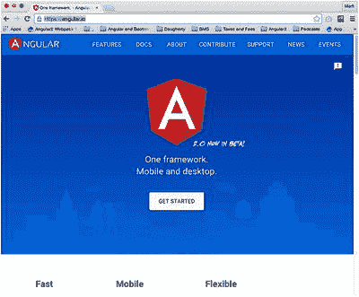

# 二十四、资源

我希望这本书对你有用。我不是凭空写的——我依赖于许多信息来源。我想分享一些资源，可以帮助你的 Angular 发展。

## Angular 官网

Angular 官方网站在 [`https://angular.io`](https://angular.io) ，其主页如图 [24-1](#Fig1) 所示。它包含了大量的信息，并且布局合理。这应该是你进行任何 Angular 研究的起点。

图 24-1

Angular website

我发现 [`https://angular.io/docs/ts/latest/api/`](https://angular.io/docs/ts/latest/api/) 的 API 预览页面特别有用。输入你要找的东西，它会显示搜索结果。这些搜索结果包括与搜索匹配的对象，按其包分组。这个包信息对于在类的顶部编写`import`非常有用。当您在搜索结果中单击某个对象时，它会向您显示有关其 API 的详细信息。

## 开源代码库

GitHub 位于 [`https://github.com`](https://github.com) ，是一个流行的基于 web 的 Git 仓库托管服务。开发人员用它来发布和管理他们的代码。GitHub 提供付费和免费账户。付费账户享有私有存储库的优势。但是免费账户很受欢迎，人们在编写开源软件项目时经常使用。GitHub 报告了超过 1200 万用户和超过 3100 万存储库，使其成为世界上最大的源代码主机。

Note

查看本书中的 [`https://github.com/markclow`](https://github.com/markclow) 代码示例和示例项目。

Git 是一个广泛用于软件开发的源代码管理系统。与更老、更传统的源代码管理系统不同，Git 允许开发人员以分布式方式工作，在他们的计算机上管理他们自己的本地存储库，不管有没有网络。没有“中央”存储库，只有“对等”分布式存储库。一旦开发人员完成了代码更改，他们就可以将他们的更改合并到共享存储库中。

## Angular 相关的博客

表 [24-1](#Tab1) 列出了一些你可能想关注的好的 Angular 相关博客。

表 24-1

Angular–related Blogs

<colgroup><col align="left"> <col align="left"></colgroup> 
| 博客地址 | 描述 |
| :-- | :-- |
| `http://blog.thoughtram.io` | 高级 Angular 文章 |
| `https://toddmotto.com` | 高级 Angular 文章 |
| `http://victorsavkin.com` | Angular 的物品 |
| `http://blog.jhades.org` | 大量的 JavaScript 和 Angular 文章 |
| `http://johnpapa.net` | 很多文章，包括 Angular 的文章 |

## 角空气

Angular Air 是一个关于 Angular 的精彩视频播客:点击 [`www.youtube.com/channel/UCdCOpvRk1lsBk26ePGDPLpQ`](http://www.youtube.com/channel/UCdCOpvRk1lsBk26ePGDPLpQ) 查看。

## 摘要

我希望你喜欢这本书。如果你发现任何代码不工作，给我发电子邮件到 markclow@hotmail.com，我会修复它。如果你觉得我在这本书里漏掉了一些有价值的东西，请发邮件给我。

就这些了，伙计们！我希望这本书对您有所帮助，并且您可以从 GitHub 下载并使用代码示例(参见本章前面的内容)。当我工作的时候，我当然经常浏览那个网站。

我很幸运能享受我正在做的事情。我希望你对你的工作有同样的感觉，对你职业的热爱让你有动力继续学习。

我祝你在努力中一切顺利。永远不要气馁:做大事是困难的！