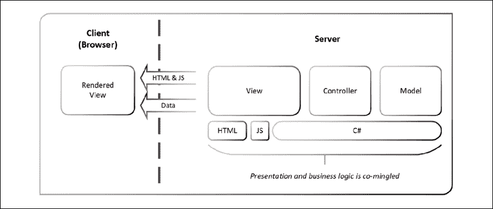
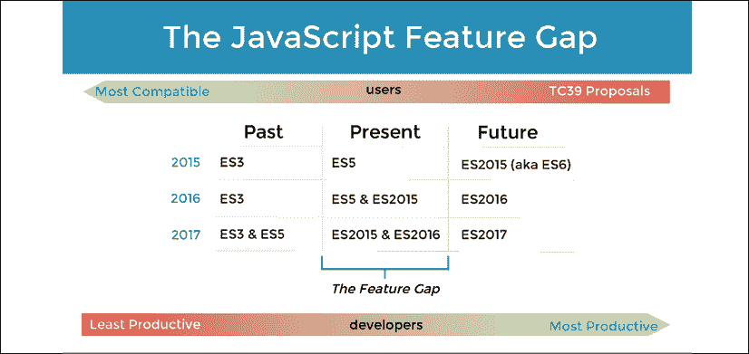
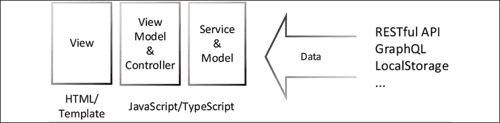
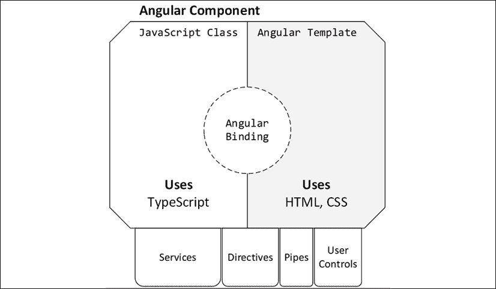
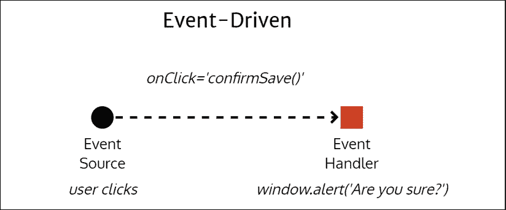
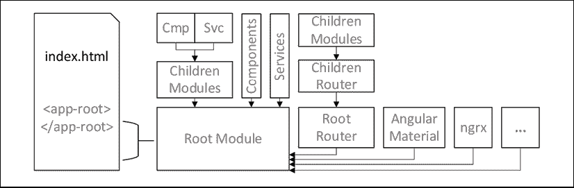
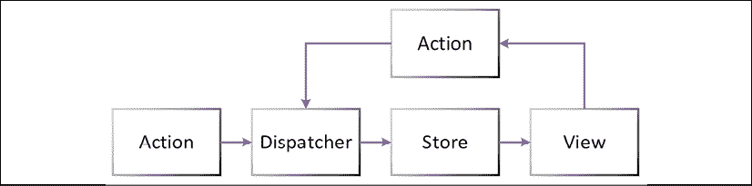
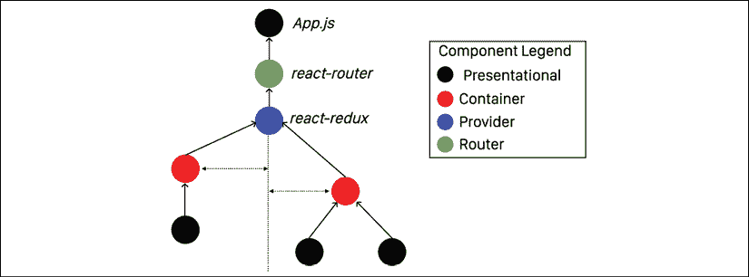

# 一、Angular 及其概念简介

起初是 HTML，然后是 DHTML。技术专家发明了 Java、JavaScript、PHP 等新技术，通过浏览器提供交互式体验。编程的圣杯是一次编写一个程序，然后在任何地方运行它。刹那间，**单页应用**（**SPAs**的时代诞生了。SPA 欺骗了浏览器，使其认为一个`index.html`可以容纳包含多个页面的整个应用。Backbone.js、Knockout.js 和 Angular.js 都来了又走了。每个人都在为非托管复杂性和 JavaScript 每周框架综合症而挣扎，寻找救世主。然后是 React、Angular 和 Vue。他们承诺解决所有问题，实现普遍可重用的 web 组件，并使学习、开发和扩展 web 应用更加容易。而且，他们确实做到了！有些人比其他人好。网络的青少年历史给我们上了几堂重要的课。第一，改变是不可避免的，第二，开发者的幸福感是一种珍贵的商品，可以成就或毁掉整个公司。

本章包括：

*   web 框架的历史
*   Angular 及其背后的哲学
*   反应式发展范式
*   高级 Angular 功能，包括状态管理
*   主要 Angular 发布和功能

本书的第一章旨在为本书其余部分提供理论和历史背景。在阅读本书其余部分时，请随意使用它作为参考。*第 2 章**设置您的开发环境*，介绍如何配置您的开发环境以获得良好的开发体验。随着*第 3 章*、*创建一个基本的 Angular 应用*，您开始实现您的第一个 Angular 应用。如果您已经对 Angular 有经验，您可以从*第 7 章**创建路由一线业务应用*开始，着手创建适合企业的可扩展应用。

本书的每一章都向您介绍了新概念，并强化了最佳实践，同时介绍了使用广泛使用的开源工具的最佳方式。在此过程中，提示和信息框涵盖了弥补您在 web 和现代 JavaScript 开发基础知识方面的任何知识差距的基础。在阅读内容时，请注意编号的步骤或要点，因为它们描述了您需要采取的行动。如果您跳过一节或一章，您可能会错过配置或技术中的细微变化，这可能会使您以后感到困惑。

本书中提供的代码样本是使用 Angular 9 开发的，计划在 2021 年 8 月之前处于**长期支持**（**LTS**）。在新版本取代 Angular 9 之后，您很可能正在阅读本书。不过，不要担心。本书采用了 Angular evergreen 的格言，即始终保持 Angular 的版本与最新版本保持同步。通过坚持平台基础知识和避免不必要的第三方库，可以保持最新。本书的示例项目最初是为 Angular 5 编写的，随着时间的推移，按照主动和增量的 Angular 升级计划进行更新，无需进行重大重写。我预计这些项目在未来的几年里，只要稍作修改，就能继续存在下去。这种可靠性是 Angular 团队出色兼容性工作的证明。

JavaScript、TypeScript 和 Angular 的世界在不断变化。书中的代码示例与您使用的工具为您生成的代码之间存在一些差异是正常的。出于这个原因，本书推荐的大多数最佳实践和配置项都是使用我创建的工具应用的，因此它们可以更新。以下是对支持本书内容的库、扩展和开源项目集合的高级概述：

图 1.1：为支持本书而开发的代码

上图是让您快速浏览一些运动部件。每个组件将在接下来的章节中详细介绍。本书样本代码的最新版本在 GitHub 上，位于下面链接的存储库中。这些存储库包含代码的最终和完成状态。为了便于在章节末尾验证您的进度，每个存储库中的`projects`文件夹都包含反映代码当前状态的章节快照：

*   对于*第 2 章*至*6*和*12*，本地广播天气：[https://github.com/duluca/local-weather-app](01.html)
*   对于*第 7 章*至*14*，柠檬超市：[https://github.com/duluca/lemon-mart](01.html)
*   For *Chapter 10*, Lemon Mart Server: [https://github.com/duluca/lemon-mart-server](01.html)

    您可以在*附录 C*、*保持 Angular 和 Tools 常青*中了解更多关于更新 Angular 的信息。您可以从[在线找到此附录 https://static.packt-cdn.com/downloads/9781838648800_Appendix_C_Keeping_Angular_and_Tools_Evergreen.pdf](01.html) 或[处 https://expertlysimple.io/stay-evergreen](01.html) 。

让我们来看看过去 20 年左右的 Web 开发历史，这样你就可以对 Angular 如何演变和演化进行上下文化。

# web 框架简史

重要的是要考虑为什么我们首先使用 Angular、反应或 VUE 等框架。随着 JavaScript 在浏览器中变得越来越流行和强大，Web 框架也随之兴起。2004 年，**异步 JavaScript 和 XML**（**AJAX**技术在创建网站时非常流行，这些网站没有依赖于整版刷新来创建动态体验，利用 HTML、JavaScript/ECMAScript 和 CSS 等标准化 web 技术。浏览器供应商应该实施由**万维网联盟**（**W3C**定义的这些技术。

**Internet Explorer**（**IE**是当时绝大多数互联网用户依赖的浏览器。微软利用其市场优势，推动专有技术和 API，以确保 IE 作为 go-to 浏览器的优势。当 Mozilla 的 Firefox 挑战 IE 的统治地位时，事情开始变得有趣起来，接着是谷歌的 Chrome 浏览器。随着这两种浏览器成功地获得了巨大的市场份额，web 开发环境变得一团糟。新的浏览器版本以极快的速度出现。相互竞争的公司和技术利益导致了 web 标准的不同实现。

这种分裂为开发人员在 web 上提供一致的体验创造了一个不可持续的环境。不同标准实现的不同质量、版本和名称带来了巨大的挑战，这就是如何成功编写代码，以便一致地操作浏览器的**文档对象模型**（**DOM**）。即使浏览器的 API 和功能有一点点不同，也足以破坏一个网站。

2006 年，jQuery 的开发是为了消除 API 和浏览器功能之间的差异。因此，您可以使用 jQuery，而不是反复编写代码来检查浏览器版本，这样做很好。它隐藏了特定于供应商的实现的所有复杂性，并在缺少功能时优雅地填补了空白。在长达 5 到 6 年的时间里，jQuery 成为了 web 开发框架。不使用 jQuery 编写交互式网站是不可想象的。

然而，要创造充满活力的用户体验，仅仅 jQuery 是不够的。本机 web 应用在浏览器中运行所有代码，这需要快速计算机运行动态解释的 JavaScript，并使用复杂的对象图呈现网页。早在 21 世纪初，许多用户在速度相对较慢的计算机上运行过时的浏览器，因此用户体验并不好。

传统上，软件体系结构分为三个主要层，如下图所示：

图 1.2：三层软件体系结构

表示层包含**用户界面**（**UI**相关代码，业务层包含业务逻辑，持久层包含数据存储相关代码。总体设计目标是在体系结构的组件之间实现低耦合和高内聚。低耦合意味着跨这些层的代码片段不应该相互依赖，应该是独立可替换的。高内聚性意味着相互关联的代码片段（如关于特定业务逻辑领域的代码）应该保持在一起。例如，当构建一个管理餐厅的应用时，预订系统的代码应该放在一起，而不是分散在库存跟踪或用户管理等其他系统中。现代 web 开发比基本的三层应用有更多的活动部分。下图显示了与表示层、业务层和持久性层相适应的其他层：

图 1.3：现代 web 体系结构

在上图中，您可以看到一个扩展的架构图，其中包括现代 web 开发的基本组件，其中包括一个 API 层，该层通常在表示层和业务层之间转换数据，一个工具和最佳实践层，该层定义了用于开发软件的各种方法，以及自动化测试层，在当今迭代和快速发展的开发周期中至关重要。

在 21 世纪初，许多互联网公司依赖服务器端呈现的网页。服务器动态创建呈现页面所需的所有 HTML、CSS 和数据。浏览器充当了一个美化的查看器，可以显示结果。下图显示了 ASP.NET MVC 栈中服务器端呈现的 web 应用的示例体系结构概述：

图 1.4：服务器端呈现的 MVC 体系结构

**模型-视图-控制器**（**MVC**是一种典型的代码模式，模型中有数据操作逻辑，控制器中有业务逻辑，视图中有表示逻辑。对于 ASP.NET MVC，控制器和模型使用 C#编码，视图使用 HTML、JavaScript 和 C#的模板版本创建。结果是浏览器接收 HTML、JavaScript 和所需的数据，通过 jQuery 和 AJAX magic，网页看起来是交互式的。服务器端渲染和 MVC 模式在今天仍然很流行和使用。有合理的利基用途，如 Facebook.com。Facebook 为数十亿台设备提供服务，从非常慢到非常快。如果没有服务器端渲染，Facebook 就不可能在其整个用户群中保证一致的**用户体验**（**UX**。我发现服务器端渲染和 MVC 的结合是一种复杂的执行模式。为了确保部件的低耦合，工程团队的每一位成员都必须非常有经验。高级开发人员高度集中的团队很难找到，这是一种轻描淡写的说法。

更复杂的是，C#（或任何其他服务器端语言）无法在浏览器中本机运行。因此，在服务器端渲染应用上工作的开发人员必须同样熟练地使用前端和后端技术。没有经验的开发人员很容易无意中将表示和业务逻辑混合在这样的实现中。当这种情况发生时，一个运行良好的系统不可避免的 UI 现代化就变得不可能了。换句话说，要用一个新的水槽来替换厨房里的水槽，你必须整修你的整个厨房。由于架构不足，组织通常每 10 年花费数百万美元编写和重写相同的应用。

在 21 世纪初，可以使用 Java 小程序、Flash 或 Silverlight 构建与服务器 API 分离的富 web 应用。然而，这些技术依赖于需要单独安装的浏览器插件。大多数情况下，这些插件已经过时，造成了严重的安全漏洞，并且在移动计算机上消耗了太多的电力。2008 年 iPhone 革命之后，很明显，尽管安卓操作系统做出了最好的尝试，但这样的插件不会在手机上运行。此外，苹果首席执行官史蒂夫·乔布斯（Steve Jobs）对这些不雅观的解决方案的蔑视标志着在浏览器中支持这些技术的时代已经结束。

在 20 世纪 10 年代初，主干网和 AngularJS 等框架开始出现，展示了如何构建具有本地感觉和速度的富 web 应用，并以一种看似经济高效的方式实现。下图显示了一个带有**代表性状态转移**（**REST**API 的**模型视图视图模型**（**MVVM**客户端）。当我们通过 API 将客户机与服务器分离时，我们可以在架构上分别实施表示和业务逻辑的实现。理论上，这种 RESTfulWeb 服务模式应该允许我们随时更换厨房水槽，而不必重新改造整个厨房。

图 1.5：富客户端解耦 MVVM 体系结构

观察上图中的方框几乎加倍。仅仅因为我们将客户机与服务器分离，我们最终不会简化体系结构。如果说有什么区别的话，那么围绕表示逻辑的体系结构将变得更加复杂。客户机和服务器都必须实现它们的表示层/API、业务层和持久层。

不幸的是，许多早期的开发工作利用了主干和 AngularJS 等框架，但由于未能正确地实现客户端架构，因此在自身的压力下失败了。

这些早期的开发工作还受到设计不当的 RESTfulWebAPI 的影响。大多数 API 没有对其 URI 进行版本化，这使得在支持现有客户端的同时引入新功能变得非常困难。此外，API 通常返回复杂的数据模型，将其内部关系数据模型暴露给 web 应用。此设计缺陷在看似不相关的 HTML 组件/视图与 SQL 创建的模型之间造成了紧密耦合。如果您没有实现额外的代码层来转换或映射数据结构，那么您就在层之间创建了无意的、不受控制的耦合。随着时间的推移，处理这种耦合变得非常昂贵，在大多数情况下需要进行大量的重写。

今天，我们使用 API 层在将数据模型发送到客户端之前将其展平，以避免此类问题。GraphQL 等较新技术更进一步，公开了定义良好的数据模型，并允许消费者查询其所需的确切数据。使用 GraphQL，HTTP 请求的数量和通过网络传输的数据量是最佳的，而开发人员不必创建许多专门的 API。

主干网和 AngularJS 证明，创建在浏览器中本机运行的 web 应用是可行的。当时所有 SPA 框架都依赖 jQuery 进行 DOM 操作。与此同时，网络标准不断发展，支持新标准的常青浏览器开始变得司空见惯。然而，变化是不断的，web 技术的发展使得优雅地发展第一代 SPA 框架是不可持续的。

下一代 web 框架需要解决许多问题；他们需要实施良好的架构；设计为与 web 标准一起发展；并且稳定且可扩展到企业需要，而不会崩溃。此外，这些新的框架需要得到开发人员的认可，因为生态系统中的快速变化让开发人员疲惫不堪。记住，不快乐的开发者不会创造成功的企业。实现这些目标需要与过去彻底决裂，因此 Angular 和反应成为以不同方式解决过去问题的平台。

# Angular 测量导论

Angular 是一个开源项目，由 Google 和一个开发者社区维护。新的 Angular 平台与您过去可能使用的遗留框架有很大不同。谷歌与微软合作，将 TypeScript 作为 Angular 的默认语言。TypeScript 是 JavaScript 的超集，它使开发人员能够针对传统浏览器（如 internetexplorer11），同时允许他们编写在 Chrome、Firefox 和 Edge 等常青浏览器中工作的现代 JavaScript 代码。AngularJS 的传统版本（1.x.x 范围内的版本）称为 AngularJS。版本 2.0.0 和更高版本称为 Angular。AngularJS 是一个整体式 JavaScript SPA 框架，AngularJS 是一个能够针对浏览器、混合移动框架、桌面应用和服务器端渲染视图的平台。

升级到新的 AngularJS 既危险又昂贵，因为即使是很小的更新也会引入新的编码模式和实验特性。每次更新都会引入不推荐或重构旧功能，这需要重写大部分代码。此外，更新的交付时间间隔不确定，这使得团队无法规划升级到新版本的资源。发布方法最终导致了一个不可预测的、不断发展的框架，似乎没有引导代码库前进的手。如果您使用 AngularJS，您可能会被困在特定的版本上，因为代码库的特定体系结构使您很难移动到新版本。2018 年，Angular 团队发布了 AngularJS 1.7 版的最后一次重大更新。此版本标志着遗留框架结束的开始，计划在 2021 年 7 月结束。

AngularJS 以各种可以想象的方式改进 AngularJS。平台遵循 semver，如[中所定义 https://semver.org/](01.html) ，其中，次要版本增量表示第二个主要版本的新功能添加和潜在弃用通知，但无重大更改。此外，谷歌的 Angular 团队承诺每 6 个月发布一次主要版本，以确定发布时间表。在这 6 个月的开发期之后，从 Angular 4 开始，所有主要版本都会在接下来的 12 个月内收到带有 bug 修复和安全补丁的 LTS。从发布到生命周期结束，每个主要版本都会收到 18 个月的更新。关于 AngularJS 和 AngularJS 的暂定释放和支持计划，请参阅下表：

图 1.6：暂定 Angular 释放和支撑计划

那么，这对你意味着什么？您可以确信您的 Angular 代码在大约 24 个月的时间范围内得到支持并向后兼容，即使您没有对其进行任何更改。因此，如果您在 2020 年 2 月在版本 9 中编写了 Angular 应用，那么您的代码在运行时与 Angular 10 兼容，并且将在 2021 年 10 月之前得到支持。要将 Angular 9 代码升级到 Angular 11，您需要确保没有使用 Angular 10 中收到弃用通知的任何弃用 API。

在实践中，大多数反对意见都是次要的，可以直接重构。除非您使用低级 API 来获得高度专业化的用户体验，否则更新代码库所需的时间和精力应该是最少的。然而，这是谷歌做出的承诺，而不是合同。Angular 团队有一个重要的动机来确保向后兼容性，因为 Google 在整个组织的任何时候都可以运行 1000 多个 Angular 应用，其中包含一个 Angular active 版本。所以，当你读到这篇文章时，谷歌的 1000 多个应用都将在 Angular 的最新版本上运行。

你可能认为谷歌有无限的资源来定期更新成千上万的应用。和任何组织一样，谷歌的资源也很有限，并非每个应用都由专门的团队积极维护。因此，Angular 团队必须通过自动化测试确保兼容性，并尽可能轻松地完成主要版本。在 Angular 6 中，通过引入`ng update`，更新过程变得更加简单。

Angular 团队使用自动化的 CLI 工具不断改进其发布过程，使不推荐的功能升级成为一项主要自动化、合理的工作。法国航空公司和荷兰皇家航空公司能够将 Angular 2 的升级时间从 30 天缩短到 Angular 7 的 1 天，证明了这一策略的好处。

一个可预测且支持良好的升级过程对于开发人员和组织来说都是一个好消息。您可以计划和分配必要的资源，而不必花费高昂的重写成本，将应用迁移到未来，而不必永远停留在 Angular 的遗留版本上。正如我在 2017 年的一篇博文中所写的，*是 Angular 4*的最佳新功能，在`bit.ly/NgBestFeature`中，信息是明确的：

> **对于开发人员和管理人员**：Angular 将继续留在这里，因此您应该投入时间、注意力和金钱来学习它——即使您目前正在爱上其他框架。
> 
> **对于决策者（首席信息官、首席技术官等）**：计划在未来 6 个月内开始向 Angular 过渡。这将是一项投资，你可以向有商业头脑的人解释，你的投资将在未来的许多年中产生回报，在最初的 LTS 窗口过期后很长一段时间，通过优雅的升级路径可以升级到下一个或更多。

那么，为什么谷歌（Angular）和微软（TypeScript 和 VisualStudio 代码）免费赠送这样的技术呢？原因有多种：

*   一个使开发 web 应用变得容易的复杂框架是技术实力的展示，它保留并吸引了开发人员人才
*   一个开放源代码框架可以让数以百万计的开发人员验证和调试新思想和工具
*   允许开发者更快地创造卓越的网络体验，最终为谷歌和微软带来更多的业务

我在这里没有看到任何邪恶的意图，欢迎开放、成熟和高质量的工具，如果需要，我可以根据自己的意愿进行修补和弯曲。不必支付专有技术支持合同的费用是一个受欢迎的奖励。

注意，在网络上寻找 Angular 帮助可能很棘手。您会注意到，有时 Angular 被称为 Angular 2 或 Angular 4。有时，AngularJS 和 AngularJS 都被称为 AngularJS。这是不正确的。Angular 的文档位于[Angular.io](01.html)。如果您登陆[angularjs.org](01.html)，您将了解到传统 angularjs 框架。

有关即将发布的 Angular 版本的最新更新，请查看[上的官方发布时间表 https://angular.io/guide/releases](01.html) 。

## 安格尔的哲学

你的时间是宝贵的，你的幸福是至高无上的，所以你在选择投资时间的技术时必须小心。考虑到这一点，我们需要回答这样一个问题：为什么要学习 Angular 而不是 React、Vue 或其他框架？Angular 是开始学习的一个很好的框架。框架和工具帮助您快速起步，并通过一个充满活力的社区和高质量的 UI 库继续取得成功，您可以使用这些库来交付出色的 web 应用。React 和 Vue 都是很棒的框架，各有优缺点。每个工具都有它的位置和用途。

在某些情况下，React 是项目的正确选择，在其他情况下，Vue 是正确的选择。无论如何，精通其他 web 框架只能帮助您进一步理解 Angular，并使您成为一名更好的总体开发人员。2012 年，当我意识到分离前端和后端关注点的重要性时，主干和 AngularJS 等 SPA 吸引了我的全部注意力。服务器端呈现的模板几乎不可能维护，并且是许多昂贵的软件系统重写的根本原因。如果您关心创建可维护的软件，那么您必须遵守 prime 指令；使 API 后面实现的业务逻辑与 UI 中实现的表示逻辑分离。

Angular 精确地符合帕累托原理或 80-20 法则。它已经成为一个成熟且不断发展的平台，允许您用 20%的精力完成 80%的任务。如前一节所述，每一个主要版本都支持 18 个月，形成了一个学习、更新和废弃旧功能的连续统一体。从一个完整的栈开发人员的 Angular 来看，这个连续体是非常宝贵的，因为您的技能和培训在未来的许多年中仍然是相关的和新鲜的。

Angular 背后的理念是在配置方面而不是常规方面犯错误。基于约定的框架，虽然从外表看可能很优雅，但对于新手来说，很难接受该框架。然而，基于配置的框架旨在通过显式配置和钩子公开其内部工作，您可以在其中将自定义行为附加到框架。本质上，AngularJS 拥有大量的魔法，这些魔法可能会令人困惑、不可预测，并且具有调试的挑战性，AngularJS 尝试的是非魔法的。

配置超过约定会导致冗长的编码。罗嗦是件好事。简洁的代码是可维护性的敌人，只会使原始作者受益。正如安迪·亨特和大卫·托马斯在《实用程序员》中所说的那样：

> 请记住，您（以及您之后的其他人）将阅读代码数百次，但只编写了几次。

此外，安迪·亨特的*设计法则*规定：

> 如果你不能轻易地把每一块都撕下来，那么设计就糟透了。

冗长、解耦、内聚和封装的代码是未来验证代码的关键。Angular 通过其各种机制实现了这些概念的正确执行。它摆脱了 AngularJS 中发明的许多自定义约定，例如`ng-click`，并引入了一种基于现有 HTML 元素和属性的更自然的语言。结果，`ng-click`变成了`(click)`，扩展了 HTML 而不是替换它。

接下来，我们将介绍 Angular 的常青思维和反应式编程范式，它们是 Angular 最初哲学的最新扩展。

## 角状常绿植物

当你学习 Angular 时，你不是在学习 Angular 的一个特定版本，而是在学习一个不断发展的平台。从初稿开始，我设计这本书的初衷是不强调你正在使用的特定版本的 Angular。这个有棱角的团队支持这个想法。多年来，我与 Angular 团队和社区内的思想领袖进行了多次对话，并听取了许多演讲。因此，我可以肯定，您可以依赖 Angular 作为一个成熟的 web 开发平台。Angular 经常接收更新，并非常注意向后兼容性。此外，任何因新版本而变得不兼容的代码都是在自动化工具的帮助下提出的，或者在如何通过[update.angular.io](01.html)更新代码的明确指导下提出的，因此您永远不会在互联网上猜测或搜索答案。Angular 团队致力于确保您——开发人员——拥有尽可能最好的 web 开发体验。

为了让开发人员了解这一思想，我和几位同事开发并发布了一个名为 Angular Evergreen 的 Visual Studio 代码扩展。

图 1.7：Angular 与代码扩展

此扩展检测您当前版本的 Angular，并将其与 Angular 的最新和下一版本进行比较。标有 next 的版本是为早期采用者准备的，用于测试您的代码与即将推出的版本 Angular 的兼容性。不要将下一个标记的版本用于生产部署。

有关 Angular Evergreen extension 的更多信息、功能请求和错误报告，请访问[https://AngularEvergreen.com](01.html) 。

Angular 的一个关键组件是 TypeScript，它允许平台保持常青。TypeScript 允许高效地实现新功能，同时支持旧浏览器，因此您的代码可以接触到尽可能多的用户。

## 打字稿

Angular 是使用 TypeScript 编码的。TypeScript 由 Microsoft 的 Anders Hejlsberg 创建，用于解决在企业级应用 JavaScript 的几个主要问题。

Anders Hejlsberg 是 Turbo Pascal 和 C#的创始人，也是 Delphi 的首席架构师。安德斯设计 C 语言是一种基于 C 和 C++的熟悉语法的开发人员友好语言。因此，C#成为微软流行的.NET 框架背后的语言。TypeScript 与 Turbo Pascal 和 C#以及他们的理想有着相似的血统，这使他们获得了巨大的成功。

JavaScript 是一种动态解释的语言，您编写的代码在运行时被浏览器解析和理解。像 Java 或 C#这样的静态类型语言有一个额外的编译步骤，编译器可以在编译时捕获编程和逻辑错误。与运行时相比，在编译时检测和修复 bug 要便宜得多。TypeScript 通过在语言中引入类型和泛型，将静态类型语言的优点引入 JavaScript。但是，TypeScript 不包括编译步骤，而是一个透明步骤。编译器使用 C/C++或使用 Java 或 C#的**中间语言**（**IL**）将代码编译成机器语言。然而，transpiler 只是将代码从一种方言翻译成另一种方言。因此，当构建、编译或传输 TypeScript 代码时，结果是纯 JavaScript。

JavaScript 的官方名称是 ECMAScript。该语言的功能集和语法由 ECMA 技术委员会 39 或简称 TC39 维护。

发丝还有另一个显著的好处。将 TypeScript 转换为 JavaScript 的相同工具可用于使用新语法将 JavaScript 重写为旧版本，旧版本浏览器可以解析和执行。从 1999 年到 2009 年，JavaScript 语言没有看到任何新特性。由于各种技术和政治原因，ECMAScript 放弃了版本 4。从 ES5 和 ES2015（也称为 ES6）的推出开始，浏览器供应商一直在努力在浏览器中实现新的 JavaScript 功能。因此，用户对这些新功能的采用率仍然很低。然而，这些新特性意味着开发人员可以更高效地编写代码。这产生了一个称为 JavaScript 特性间隙的间隙，如下图所示：

图 1.8:JavaScript 特性差距

JavaScript 的特性差距在不断缩小，因为 TC39 承诺每年更新 JavaScript。因此，TypeScript 代表了 JavaScript 的过去、现在和未来。现在，您可以使用 JavaScript 的未来功能，并且仍然能够以过去的浏览器为目标，最大限度地扩大您所能接触到的受众。

现在，让我们看一下 Angular 的底层架构。

## 基本 Angular 结构

Angular 遵循 MV*模式，它是 MVC 和 MVVM 模式的混合。之前，我们讨论了 MVC 模式。在高层，两种模式的体系结构相对相似，如下图所示：

图 1.9:MV*架构

这里的新概念是 ViewModel，它表示将视图连接到模型或服务的粘合代码。在 Angular 中，这种胶水称为粘合胶。而 MVC 框架如主干或 React 必须调用`render`方法来处理 HTML 模板，从 Angular 来说，这个过程对开发人员来说是无缝和透明的。绑定是 MVC 应用与 MVVM 应用的区别。

Angular 应用的最基本单位是组件。组件是用 TypeScript 编写的 JavaScript 类和用 HTML、CSS 和 TypeScript 编写的 Angular 模板的组合。类和模板通过绑定像拼图一样组合在一起，因此它们可以相互通信，如下图所示：

图 1.10：部件解剖图

类是【面向对象的编程】。如果你花时间深入 OOP 范例，你将提高你对 Angular 工作原理的理解。OOP 范例允许组件中的依赖服务的**依赖注入**（**DI**），因此您可以进行 HTTP 调用或触发 toast 消息以显示给用户，而无需将该逻辑拉入组件或复制代码。DI 使开发人员可以很容易地使用许多相互依赖的服务，而不必担心实例化、初始化或从内存中销毁这些对象的顺序。

Angular 模板还允许通过指令、管道、用户控件和其他组件进行类似的代码重用。这些代码片段封装了高度交互的最终用户代码。这种交互性代码通常很复杂，必须与业务逻辑或表示逻辑隔离，以保持代码的可维护性。

所有 Angular 组件、服务、指令、管道和用户控件都组织在模块下。每个 Angular 应用都由一个根模块引导，该根模块呈现您的第一个组件，注入任何服务并准备它可能需要的依赖项。您可以引入子模块来启用延迟加载等功能，这样您就不必一次将 web 应用的所有组件交付给浏览器。例如，向没有管理员权限的用户发送管理仪表板的代码是没有用的。

Angular 大量使用 RxJS 库，它将反应式开发模式引入 Angular，而不是传统的命令式开发模式。

# 反应式发展范式

Angular 支持多种编程风格。编码风格的多样性是为什么不同背景的程序员都能接受它的一个重要原因。无论你来自面向对象编程的背景，还是函数式编程的坚定信徒，你都可以使用 Angular 构建可行的应用。在*第 3 章*中*创建一个基本的 Angular 应用*中，您将开始在构建 LocalCast 天气应用时利用反应式编程概念。

作为一名程序员，您很可能已经习惯了命令式编程。命令式编程是指作为程序员，编写顺序代码，描述必须按照定义的顺序执行的所有操作，以及应用的状态，这取决于要正确设置的变量。编写循环、条件和调用函数；你触发事件并期望它们得到处理。命令式和顺序逻辑是您习惯于编码的方式。

反应式编程是函数式编程的一个子集。在函数式编程中，不能依赖以前设置的变量。您编写的每个函数都必须独立运行，接收自己的输入集并返回结果，而不受外部函数或类状态的影响。函数式编程非常支持**测试驱动开发**（**TDD**），因为每个函数都是一个可以单独测试的单元。因此，您编写的每个函数都是可组合的。因此，您可以将您编写的任何函数与任何其他函数混合、匹配和组合，并构造一系列调用，以产生预期的结果。

反应式编程为函数式编程增加了一个转折点。您不再处理纯逻辑，而是处理一个异步数据流，您可以使用一组可组合的函数将其转换并塑造成所需的任何形状。因此，当您订阅反应流中的事件时，您正在将您的编码范式从反应式编程转换为命令式编程。

在本书后面的部分中，当实现 LocalCast 天气应用时，您将在两个地方使用`subscribe`，即`CurrentWeather`和`CitySearch`组件。

请考虑下面的例子，Mike Pearson 在他的演讲中恰好提到了这个例子。

*反应性思考：最困难的*是提供从水龙头向取热水的说明，这有助于理解命令式编程和反应式编程之间的区别：

<colgroup><col> <col> <col></colgroup> 
| **从水龙头获取热水的说明** |
|  | **命令式** | **反应性** |
| 0 | 初始状态：水已关闭 | 初始状态：水已关闭 |
| 1. | 拿软管 | 打开热水龙头 |
| 2. | 向加热器喷水 |  |
| 3. | 打开热水龙头 |  |
| 4. | 发短信给公用事业公司去加油 |  |
| 5. | 等热水 |  |
| 6. | 撤消恢复初始状态的步骤 | 撤消恢复初始状态的步骤 |

如您所见，对于命令式编程，您必须定义代码执行的每个步骤。每一步都取决于前面的步骤，这意味着你必须考虑环境的状态，以确保成功的运行。在这样的环境中，很容易忘记一个步骤，并且很难测试每个步骤的正确性。在函数式反应式编程中，您使用异步数据流，从而生成易于与其他操作组合的无状态工作流。

RxJS 是一个库，它使您能够在反应式范例中实现代码。

## RxJS

RxJS 代表反应式扩展，这是一个支持反应式编程的模块化库，它本身是一种异步编程范式，允许通过转换、过滤和控制功能操纵数据流。您可以将反应式编程看作是基于事件编程的一种演变。

## 反应式数据流

在事件驱动的编程中，您将定义一个事件处理程序并将其附加到事件源。更具体地说，如果你有一个**保存**按钮，它会显示一个`onClick`事件，你会实现一个`confirmSave`功能，当触发时，会显示一个弹出窗口，询问用户**你确定吗？**。查看下图以了解此过程的可视化。

图 1.11：事件驱动的实现

简而言之，每个用户操作将触发一次事件。如果用户多次点击**保存**按钮，此模式将很乐意呈现与点击次数相同的弹出窗口，这没有多大意义。

发布-订阅（pub/sub）模式是一种不同类型的事件驱动编程。在这种情况下，我们可以编写多个处理程序来同时对给定事件的结果执行操作。假设你的应用刚刚收到一些更新的数据。发布者浏览其订阅者列表，并将更新的数据传递给每个订阅者。

有关更新的数据事件如何触发多个功能，请参阅下图：

*   一个`updateCache`函数用新数据更新本地缓存
*   `fetchDetails`函数从服务器检索有关数据的更多详细信息
*   `showToastMessage`功能通知用户应用刚刚收到新数据

图 1.12：发布/订阅模式实现

所有这些事件都可以异步发生；然而，`fetchDetails`和`showToastMessage`函数将接收到比它们需要的更多的数据，并且尝试以不同的方式组合这些事件来修改应用行为可能会变得复杂。

在反应式编程中，一切都被视为一个流。流将包含随时间发生的事件，这些事件可以包含一些数据，也可以不包含任何数据。下图显示了应用监听用户鼠标单击的场景。不受控制的用户点击流毫无意义。通过对该流应用`throttle`函数，您可以对其施加一定的控制，因此每 250**毫秒**（**毫秒**只会获得更新。如果您订阅此新事件，每 250 毫秒，您将收到一个单击事件列表。您可以尝试从每个单击事件中提取一些数据，但在本例中，您只对发生的单击事件的数量感兴趣。我们可以使用`map`函数将原始事件数据塑造成多次点击。

再往下看，我们可能只对有两次或两次以上点击的事件感兴趣，因此我们可以使用`filter`函数只对实质上是双击的事件进行操作。每当我们的过滤器事件触发时，这意味着用户打算双击，您可以通过弹出警报来处理该信息。

流的真正威力来自这样一个事实：当事件通过各种控制、转换和过滤函数时，您可以随时选择对其进行操作。您可以选择使用`*ngFor`和 Angular 的`async`管道在 HTML 列表上显示点击数据，因此用户可以监控每 250 毫秒捕获的点击数据类型。

图 1.13：反应式数据流实现

现在让我们来考虑一些更高级的 Angular 结构模式。

# 高级 Angular 建筑

如前所述，在*基本 Angular 架构*部分中，Angular 组件、服务和依赖项被组织到模块中。Angular 应用通过其根模块引导，如下图所示：

图 1.14：显示主要架构元素的 Angular 引导过程

根模块可以导入其他模块，还可以声明组件和提供服务。随着应用的增长，您需要创建包含其组件和服务的子模块。以这种方式组织应用可以实现延迟加载，从而可以控制应用的哪些部分在何时交付到浏览器。当您向应用添加更多功能时，您可以从其他库（如 Angular Material 或 NgRx）导入模块。实现路由可以在组件之间实现丰富的导航体验，从而允许路由配置协调组件的创建。

*第 7 章**创建路由第一条业务线 App*介绍了路由第一架构，在此我鼓励您通过提前创建所有路由来开始应用的开发。

在 Angular 中，默认情况下，服务作为单例提供给模块。你很快就会习惯这种行为。但是，您必须记住，如果您跨多个模块提供相同的服务，那么每个模块都有自己的所提供服务实例。在认证服务的情况下，我们希望在整个应用中只有一个实例，您必须小心仅在根模块级别提供该认证服务实例。在应用的根级别提供的任何服务、组件或模块都将在功能模块中可用。

除了模块，路由是下一个你必须掌握的最强大的技术。

## Angular 路由

`@angular/router`包中提供的 Angular 路由是建筑**单页应用**（**SPA**）的核心和关键部分，其行为和行为类似于常规网站，易于使用浏览器控件或缩放或微缩放控件导航。

Angular 路由具有延迟加载、路由出口、辅助路由、智能主动链路跟踪等高级功能，并且能够表示为`href`，这使得使用 RxJS`BehaviorSubject`的无状态数据驱动组件能够实现高度灵活的路由第一应用架构。

大型团队可以针对单个代码库进行工作，每个团队负责一个模块的开发，而无需相互干涉，同时实现轻松的连续集成。拥有数十亿行代码的谷歌，以一个很好的理由反对单一代码库：事后集成非常昂贵。

小型团队可以动态地重新组合 UI 布局，以快速响应更改，而无需重新构建代码。很容易低估由于后期游戏布局或导航的改变而浪费的时间。这样的变化更容易被大型团队吸收，但对于小型团队来说，这是一项代价高昂的工作。

考虑下面的图，其中，包含该模块的它有一个`rootRouter`；组件`a`、`master`、`detail`和`c`；`services`；`pipes`；以及`directives`为其提供和声明。当用户第一次导航到您的应用时，浏览器将解析并急切地加载所有这些组件。

图 1.15：Angular 结构

如果要实现一个延迟加载的路由`/b`，则需要创建一个名为`b`的功能模块，该模块有自己的`childRouter`；组件`d`、`e`和`f`；`services`；`pipes`；以及`directives`为其提供和声明。在传输期间，Angular 会将这些组件打包到一个单独的文件或捆绑包中，只有当用户导航到`/b`下的路径时，才会下载、解析和加载该捆绑包。

让我们更详细地研究延迟加载。

## 延迟加载

连接`/b/...`和`rootRouter`的虚线演示了延迟加载的工作原理。延迟加载允许开发人员快速实现亚秒级的第一次有意义的绘制。通过延迟加载其他模块，我们可以将交付给浏览器的包大小保持在最小。模块的大小会影响下载和加载速度，因为浏览器需要做的事情越多，用户看到应用第一个屏幕的时间就越长。通过定义延迟加载的模块，每个模块都打包为单独的文件，可以单独下载和加载，也可以按需下载和加载。

Angular Router 提供智能活动链接跟踪，这将带来卓越的开发人员和用户体验，从而非常容易实现突出显示功能，向用户指示当前活动的应用的当前选项卡或部分。辅助路由最大限度地重用组件，并帮助轻松完成复杂的状态转换。使用辅助管线，可以仅使用单个外部样板渲染多个主视图和详图视图。您还可以控制如何在浏览器的 URL 栏中向用户显示路由，并使用模板中的`routerLink`和代码中的`Router.navigate`组合路由，以驱动复杂场景。

在*第 7 章**创建路由第一条业务线应用*中，我介绍了实现路由的基础知识，高级秘籍在*第 11 章**秘籍中介绍——可重用性、路由和缓存*。

除了路由，如果您想构建复杂的应用，状态管理是另一个需要掌握的关键概念。

## 国家管理

类以 Angular 支持每个组件和服务。实例化时，类将成为内存中的对象。在处理对象时，如果将值存储在对象属性中，则将状态引入到 Angular 应用中。如果不受管理，状态将成为应用成功和可维护性的重大责任。

我是后端和前端无状态设计的爱好者。在我看来，状态是邪恶的，您应该注意不要在代码中引入状态。前面，我们讨论了 Angular 中的服务在默认情况下是单例的。这是一个在应用中引入状态的糟糕机会。您必须避免在服务中存储信息。在*第 7 章**创建路由一线业务应用*中，我向您介绍行为主体，它们充当您应用的数据锚。在这种情况下，我们将这些锚存储在服务中，以便它们可以跨组件共享以同步数据。

在 Angular 组件中，该类是一个 ViewModel，充当代码和模板之间的粘合代码。与服务相比，组件的寿命相对较短，在这种上下文中使用对象属性是可以的。

然而，除了设计之外，还有一些特定的用例可以引入健壮的机制来维护应用状态下的复杂数据模型。渐进式 web 应用和移动应用是一种无法保证连接性的用例。在这些情况下，必须能够保存并恢复应用的整个状态，才能为最终用户提供出色的**用户体验**（**UX**。

用于 Angular 的 NgRx 库利用通量模式为您的应用实现复杂的状态管理。在*第 6 章*、*表单、可观察对象和受试者*和*第 12 章*、*秘籍——主/细节、数据表和 NgRx*中，我使用 NgRx 为各种功能提供了替代实现，以展示更轻量级方法之间的实现差异。

### 通量模式

Flux 是 Facebook 创建的应用架构，用于帮助构建客户端 web 应用。Flux 模式定义了一系列组件，这些组件管理一个存储区，该存储区通过触发/处理操作的分派器存储应用的状态，并查看从存储区读取值的函数。使用 Flux 模式，您可以将应用的状态保持在一个存储中，在这个存储中，只有通过定义良好且解耦的函数才能访问该存储，从而形成可扩展性良好的体系结构，因为在隔离状态下，解耦的函数很容易推理并为其编写自动单元测试。

考虑下面的图表来理解这些组件之间的信息流：

图 1.16:NgRx 数据流

NgRx 使用 RxJS 以 Angular 实现通量模式。

### NgRx

NgRx 库将 Redux（一个流行的 React.js 库）反应状态管理引入基于 RxJS 的 Angular。NgRx 的状态管理允许开发人员编写原子的、自包含的和可组合的代码片段，创建操作、减缩器和选择器。这种反应式的编程允许隔离状态变化中的副作用，并与 React.js 的通用编码模式保持一致。NgRx 最终在 RxJS 等已经非常复杂和复杂的工具上创建了一个抽象层。

使用 NgRx 有很好的理由，比如如果您在应用中处理 3+个输入流。在这种情况下，处理如此多事件的开销使得在项目中引入新的编码范例是值得的。然而，大多数应用只有两个输入流：RESTAPI 和用户输入。在较小程度上，如果您首先离线编写**渐进式 Web 应用**（**PWAs**），则 NgRx 可能有意义，因为您可能需要保存复杂的状态信息，或者构建具有类似需求的利基企业应用。

以下是 NgRx 的架构概述：

Figure 1.17: NgRx architectural overview

把图的最顶层看作是可观察的动作流，在这里动作可以被发送，并被圈表示。效果和组件可以分派动作。还原器和效果可以作用于这些操作，将值存储在存储中或触发与服务器的交互。组件利用选择器从存储中读取值。

考虑到我对最小工具的积极态度以及 NgRx 在前面提到的利基受众之外缺乏明确的必要性，我不建议将 NgRx 作为默认选择。RxJS/BehaviorSubjects 功能强大，足以解锁复杂且可扩展的模式，帮助您构建出色的 Angular 应用，正如*第 12 章*、*秘籍——主/细节、数据表和 NgRx*中的章节所示。

您可以在[上阅读更多关于 NgRx 的信息 https://ngrx.io](01.html) 。

## React.js 体系结构

与 Angular 不同，React.js 总体上实现了通量模式。以下是 React 应用的以路由为中心的视图，其中组件/容器和提供者以严格的树状方式表示。

图 1.18:React.js 体系结构概述

在 React 的初始版本中，即使是最基本的功能也必须费力地在每个组件的继承树上/下传递值。后来，引入了 react-redux，因此每个组件都可以直接将值读/写到存储，而无需遍历树。

这个基本概述应该让您了解 Angular 和 React 之间的重大架构差异。然而，请记住，就像 Angular、React 一样，它的社区、模式和实践也在不断发展，并随着时间的推移变得更好。

您可以在[了解更多关于 React 的信息 https://reactjs.org](01.html) 。

# 显著的 Angular 特征

具体的 Angular 版本引入了值得注意的变化，以推进平台的理念，使其更加无缝和全面。我建议你看看这些开创性的版本所带来的独特变化。

## Angular 6

本书中的大部分（如果不是全部的话）内容、模式和实践都与 Angular 4 及以上兼容。然而，Angular 6 是 Angular 的一个开创性版本，它为平台以及整个生态系统的整体稳定性和内聚性带来了许多的改进。使用附加的 CLI 工具，可以更轻松地更新软件包的版本，并加快构建时间，从而改善代码构建视图反馈周期，从而大大改善了开发体验。使用 Angular 6，所有平台工具的版本都与 6.0 同步，从而更容易对生态系统进行推理。在下表中，您可以看到这如何使沟通工具兼容性变得更容易：

<colgroup><col> <col> <col></colgroup> 
|  | **之前** | **配 v6** |
| CLI | 1.7 | 6 |
| 有棱角的 | 5.2.10 | 6 |
| 布料 | 5.2.4 | 6 |

Angular CLI 6.0 提供了主要的新功能，如`ng update`和`ng add`命令；`ng update`可以更轻松地更新 Angular、npm 依赖项、RxJS 和 Angular Material 的版本，包括一些确定性代码重写功能，以将名称更改应用于 API 或函数。更新 Angular 版本的主题在*附录 C**保持 Angular 和 Tools 常青*中有详细介绍。您可以从[在线找到此附录 https://static.packt-cdn.com/downloads/9781838648800_Appendix_C_Keeping_Angular_and_Tools_Evergreen.pdf](01.html) 或在[处 https://expertlysimple.io/stay-evergreen](01.html) 。`ng add`为 Angular CLI 提供了原理图支持。使用 schematics，您可以编写自定义代码向 Angular 应用添加新功能，添加任何依赖项、样板配置代码或支架。一个很好的例子是，通过执行`ng add @angular/material`，可以将 Angular 材质添加到项目中。*第 5 章*、*用材质交付高质量 UX*深入介绍了向项目中添加 Angular 材质的主题。一个独立的材质更新工具旨在减少 Angular 材质更新的痛苦，可在[Github.com/Angular/Material-Update-tool](01.html)上找到，但希望将此功能合并到`ng update`中。进一步的原理图可以将它们自己的`generate`命令带到 CLI，随着时间的推移，您的生活更加轻松，代码库更加一致。此外，webpack 的第 4 版配置为将 Angular 应用构建到更小的模块中，使用 scope 托管，缩短应用的首次绘制时间。

Angular 6 的主要主题是引擎盖下的性能改进和定制元素支持。版本 6 在 65 KB 的基本捆绑包大小方面比 v5 提高了 12%，从快速 3G 到光纤连接的加载时间提高了 21-40%。随着应用的增长，Angular 利用更好的树抖动技术进一步从最终可交付成果中删减未使用的代码。速度是 Angular 6 中的 UX 功能。这是通过更好地支持 Angular**组件开发 Ki**t（**CDK**）、Angular 材质、动画和 i18n 来实现的。Angular Universal 允许服务器端辅助快速启动，Angular PWA 支持利用本机平台功能，如缓存和离线存储，因此在后续访问中，您的应用保持快速。RxJS 6 支持允许树摇动管道命令，更频繁地减少捆绑大小，并修复了`throttle`的行为，正如我在*第 6 章*中警告您的那样，*表单、可观察对象和主题*在众多错误修复和性能改进中。TypeScript2.7 为导入不同类型的 JavaScript 包提供了更好的支持，并提供了更高级的功能来捕获构建期间的编码错误。

Angular Material6 添加了新的用户控件，如 tree 和 badge，同时通过大量错误修复、功能完整性和现有组件的主题化，使库更加稳定。Angular Flex Layout 6 引入了 polyfills，使 Internet Explorer 11 能够支持 CSS Flexbox。这使得使用材质和 Flex 布局的 Angular 应用与上一代主流传统浏览器技术完全兼容，尽管在 2018 年 1 月与 Windows 8.1 一起离开主流支持，并被 Microsoft Edge 取代了 18 次，但该技术仍在企业和政府中持续存在。Angular 6 本身可以使用 polyfills 配置为兼容 IE9。这对于那些必须支持这种遗留浏览器并且仍然能够使用现代技术构建解决方案的开发人员来说是非常好的。

还发布了一些令人兴奋的新辅助工具，以支持高频、高性能或大型企业用例。Angular 生态系统欢迎 NgRx 库，将类似 Redux 的反应式状态管理引入基于 RxJS 的 Angular。Nx CLI 工具由 Angular 以前的团队成员构建，为 Angular 带来了一个固执己见的开发环境设置，适用于必须确保环境一致性的顾问和大型组织。本书遵循类似的模式，旨在教育您建立一致的体系结构和设计模式，以应用于您的应用。Google 的 Bazel 构建工具支持增量构建，因此应用中未更改的部分不需要重新构建，大大缩短了大型项目的构建时间，并允许在应用之间共享库的打包。

## Angular 8

正如本书的*前言*中所述，本书旨在对任何新版本的 Angular 有效。Angular 团队支持这一理念，他们希望不再强调您当前使用的 Angular 的具体版本，而不是专注于不断更新 Angular 的每个次要和主要版本。Angular 团队花费了大量的精力和精力来确保您编写的代码保持兼容，因为 Angular 的性能和功能集会随着时间的推移而提高。任何突破性的更改都可以得到自动化工具的支持，帮助您重写部分代码，或者计划好的弃用，让您有足够的时间逐步淘汰不受支持的代码。

Angular 7 带来了 TypeScript、RxJS 和 Node 的性能、可访问性和依赖性更新，以及 Angular 材质控件的重大更新和扩展；这些趋势是连续的。Angular 8 为 evergreen 浏览器引入了差异加载和对最小多边形填充的支持，为客户端节省了 7-20%的负载。

## Angular 9

Angular 9 及其后续的 9.1 更新通过提供 Ivy 渲染引擎和 TypeScript 3.8 支持，为框架带来了一些迄今为止最重要的更新。这一更新解决了许多技术债务问题，带来了 100 个 bug 修复和特性，并大大扩展了框架的自动化测试覆盖范围。Ivy 渲染引擎使您的应用具有更小的软件包大小和更快的加载时间。此外，Angular 9.1 使构建时间加快了 40%，单元测试运行时间提高了 40-50%，并通过更简单的栈跟踪和模板绑定提供了更好的调试功能。TypeScript 3.8 带来了新的语法优势，如可选链接和 nullish 运算符，使得在 Angular 的严格模式下处理 null 或未定义的值变得非常容易。

Ivy 渲染引擎的全部好处将在未来的更新中体现出来。Ivy 将允许创建微小且倾斜的 Angular 应用。在 Ivy 之前，描述 Angular 组件所需的元数据存储在模块中。通过 Ivy，组件实现了局部性原则，因此它们可以自我描述。这使得 Ivy 可以延迟加载单个组件并创建独立组件。想象一下，一个 Angular 库可以通过单个函数调用呈现组件，并且大小只有几千字节。这种小型化使得使用自定义元素（Web 组件规范的一部分）实现 Angular 元素成为可能。

版本 6 中引入的 Angular 元素允许您编写 Angular 组件，并使用任何 web 技术在任何其他 web 应用中重用该组件，本质上是声明您自己的自定义 HTML 元素。这些自定义元素与任何基于 HTML 的工具链（包括其他 web 应用库或框架）交叉兼容。为了实现这一点，整个 Angular 框架需要与新的自定义元素一起打包。这在 Angular 6 中是不可行的，因为这意味着每次创建新的用户控件时，至少要增加 65 KB。

2020 年初，Chrome、Edge 和 Firefox 支持本地定制元素，这与 2018 年初的现状相比发生了重大变化。Angular 9 默认情况下启用常春藤渲染引擎，Angular 的未来更新将使基本束大小小至 2.7KB，因此基于 Angular 的自定义元素的广泛使用可能很快成为现实。2020 年，所有主流浏览器都以本机方式支持自定义元素，让 Safari 成为实现该标准的最后一款浏览器。

始终检查[https://caniuse.com](01.html) 在对一种新的网络技术感到兴奋之前，确保您确实能够在您必须支持的浏览器中使用该功能。

[Angular.io](01.html)利用自定义元素演示该技术的可行性。该文档网站每月吸引 100 多万独立访客，因此它应该能够帮助在成熟时解决一些问题。自定义元素非常适合将交互式代码示例与静态内容一起托管。例如，2018 年初，[Angular.io](01.html)开始使用[StackBlitz.io](01.html)进行交互代码样本。

[StackBlitz.io](01.html)是一个神奇的工具，是浏览器中的一个丰富 IDE，因此您可以尝试不同的想法或运行 GitHub 存储库，而无需在本地提取或执行任何代码。

其他重要的更新包括 JavaScript 包的差异加载，以提高现代浏览器的加载时间和**交互**（**TTI**时间。AngularRouter 增加了向后兼容性，使执行遗留 AngularJS 项目的零碎升级成为可能。

谷歌规定，他们拥有的 2000 多个 Angular 项目必须都在同一版本的 Angular 上。这意味着 Angular 的每一个新更新都经过了很好的测试，并且没有任何向后兼容性方面的意外。

在版本 9 中打下了所有的基础之后，我们可以期待一个更灵活、功能更强大的框架。我希望你和我一样对它所开启的 Angular 和未来的可能性感到兴奋。系好安全带，多萝西，因为堪萨斯州要走了，再见。

# 总结

总之，web 技术已经发展到可以创建丰富、快速和本机 web 应用的地步，这些应用可以在今天部署的绝大多数桌面和移动浏览器上运行良好。Angular 已经发展成为一个成熟和稳定的平台，应用了过去的经验教训。它支持复杂的开发方法，使开发人员能够创建可维护、交互式和快速的应用。TypeScript、RxJS 和 NgRx 等技术支持面向对象编程、反应式编程和 Flux 模式中的模式。

Angular 的设计是完全被动的，因此，您必须调整您的编程风格以适应这种模式。此外，Angular 是一种常青的消费方式，因此始终保持您的 Angular 最新是一个好主意。

在 Angular 应用中利用承诺，而不是 Observable 和 async 管道，相当于忽略 Angular 团队和社区思想领袖交流过的所有建议和文档。从自助网站或以实验性思维撰写的博客文章中收集到的浅薄或断章取义的建议很容易让你陷入不良做法和习惯。官方文件应为您的圣经，可在[找到 https://angular.io/docs](01.html) 。

在下一章中，您将配置您的开发环境以优化它，从而在 macOS 和 Windows 操作系统之间获得良好且一致的 Angular 开发体验。在以下章节中，您将学习如何创建基本 Angular 应用，将其部署到 internet 上，然后学习创建可扩展应用的高级体系结构模式，学习如何使用最小平均值创建全栈 TypeScript 应用，并利用高级 DevOps 和持续集成技术。本书最后向您介绍了亚马逊网络服务和谷歌分析。

# 进一步阅读

*   *设计模式：可重用面向对象软件的元素*，Erich Gamma，Richard Helm，Ralph Johnson，John Vlissides，1994，Addison Wesley，ISBN 0-201-63361-2。
*   人类 JavaScript，Henrik Joreteg，2013，[http://read.humanjavascript.com](01.html) 。
*   TypeScript x MS Build 2017 的新功能，Anders Hejlsberg，2017，[https://www.youtube.com/watch?v=0sMZJ02rs2c](01.html) 。
*   *实用程序员，20 周年纪念版*，大卫·托马斯和安德鲁·亨特，2019 年，艾迪森·韦斯利，ISBN 978-0135957059。
*   *反应性思维：最难*，迈克·皮尔森，2019，[https://www.youtube.com/watch?v=-4cwkHNguXE](01.html)。
*   *与 RxJS 的数据合成，Deborah Kurata*、2019、[https://www.youtube.com/watch?v=Z76QlSpYcck](01.html) 。
*   流量模式深度概览，Facebook，2019，[https://facebook.github.io/flux/docs/in-depth-overview](01.html) 。

# 问题

尽可能回答以下问题，以确保您在不使用谷歌搜索的情况下理解了本章的关键概念。你需要帮助回答这些问题吗？参见*附录 D*、*自我评估答案*在线[https://static.packt-cdn.com/downloads/9781838648800_Appendix_D_Self-Assessment_Answers.pdf](01.html) 或访问[https://expertlysimple.io/angular-self-assessment](01.html) 。

1.  长青背后的概念是什么？
2.  使用反应流的双击示例，使用 RxJS 实现以下步骤：使用`fromEvent`函数从 HTML 目标侦听单击事件。使用`throttleTime`、`asyncScheduler`、`buffer`和`filter`操作符确定鼠标是否在 250ms 的时间范围内双击。如果检测到双击，则在浏览器中显示警报。提示：使用[https://stackblitz.com](01.html) 或实现您的代码并使用[https://rxjs.dev/](01.html) 寻求帮助。
3.  什么是 NgRx，它在 Angular 应用中扮演什么角色？
4.  模块、组件和服务在 Angular 上有什么区别？