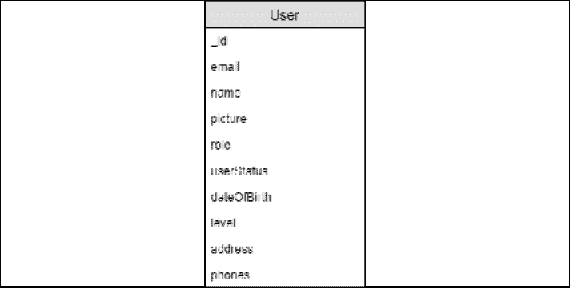
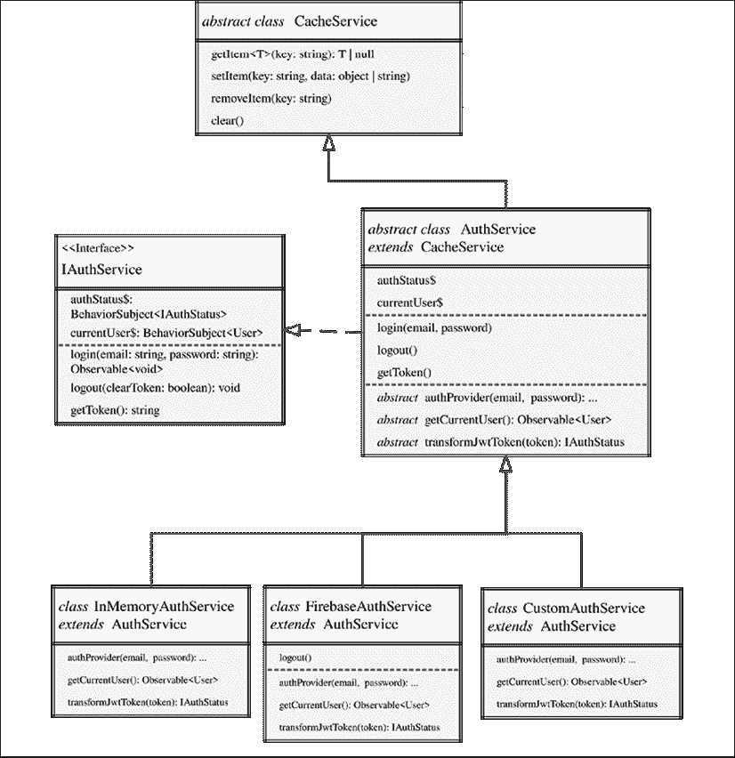
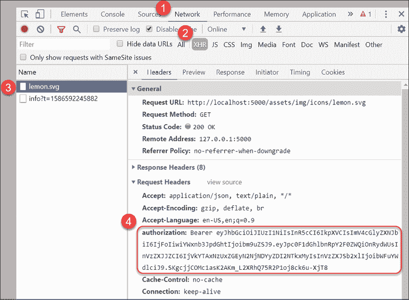
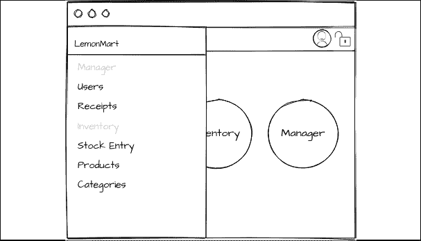
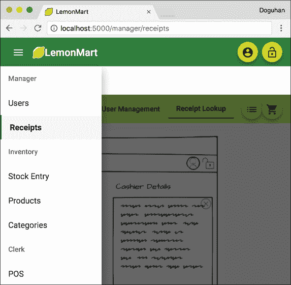
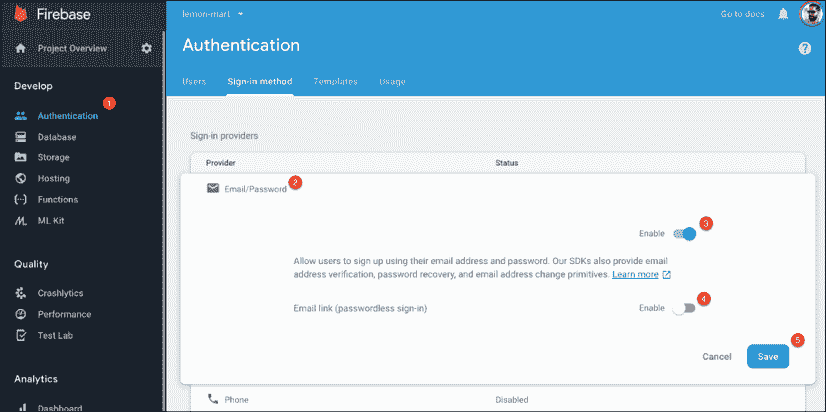
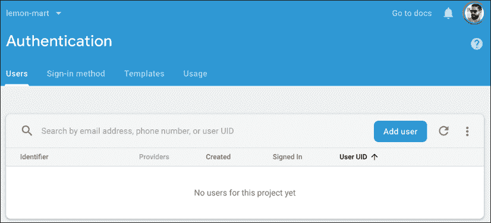

# 八、设计认证和授权

设计一个高质量的认证和授权系统而不让最终用户失望是一个很难解决的问题。认证是验证用户身份的行为，授权指定用户访问资源必须具有的权限。这两个过程（简称 auth）必须无缝地协同工作，以满足具有不同角色、需求和作业功能的用户的需求。

在今天的 web 上，用户对通过浏览器遇到的任何认证系统都有很高的期望基准，因此这是应用的一个重要部分，可以在第一次完全正确地使用它。用户应该始终知道他们在应用中可以做什么和不能做什么。如果存在错误、失败或错误，应清楚地告知用户发生这些错误的原因。随着应用的增长，很容易错过触发错误条件的所有方式。您的实现应该易于扩展或维护，否则应用的这个基本主干将需要大量维护。在本章中，我们将介绍创建优秀的 auth-UX 和实现可靠的基线体验的各种挑战。

我们将通过实现 LemonMart 的 auth 体验，继续采用路由优先的方法来设计 SPA。在*第 7 章*中*创建路由一线业务 App*中，我们定义了用户角色，完成了所有主要路由的构建，并完成了 LemonMart 的粗略行走骨架导航体验。这意味着我们已经准备好实现基于角色的有条件导航体验，它可以捕捉无缝认证体验的细微差别。

在本章中，我们将围绕上一章中定义的用户实体实现基于令牌的认证方案。为了实现健壮且可维护的实现，我们将深入研究具有抽象、继承和工厂的**面向对象编程**（**OOP**），同时实现缓存服务、UI 服务、，还有两种不同的认证方案：用于教育目的的内存中假认证服务和可以在现实应用中利用的 Google Firebase 认证服务。

在本章中，您将了解以下主题：

*   设计 auth 工作流
*   用于安全数据处理的 TypeScript 运算符
*   利用 OOP 概念的可重用服务
*   动态 UI 组件和导航
*   使用保护的基于角色的路由
*   Firebase 认证秘籍
*   使用工厂提供服务

本书样本代码的最新版本位于下面链接的存储库的 GitHub 上。存储库包含代码的最终和完成状态。您可以在本章末尾通过在`projects`文件夹下查找代码的章末快照来验证您的进度。

对于*第 8 章*：

1.  克隆存储库[https://github.com/duluca/lemon-mart](https://github.com/duluca/lemon-mart )
2.  在根文件夹上执行`npm install`以安装依赖项
3.  本章代码示例在子文件夹

    ```ts
    projects/ch8 
    ```

    下
4.  要运行本章的 Angular 应用，请执行

    ```ts
    npx ng serve ch8 
    ```

5.  要运行本章的 Angular 单元测试，请执行

    ```ts
    npx ng test ch8 --watch=false 
    ```

6.  要运行本章的 Angular e2e 测试，请执行

    ```ts
    npx ng e2e ch8 
    ```

7.  要为本章构建生产就绪的 Angular 应用，请执行

    ```ts
    npx ng build ch8 --prod 
    ```

请注意，存储库根目录下的`dist/ch8`文件夹将包含编译后的结果。

请注意，书中或 GitHub 上的源代码可能并不总是与 Angular CLI 生成的代码匹配。书中的代码和 GitHub 上的代码在实现上也可能有细微的差异，因为生态系统是不断发展的。随着时间的推移，示例代码自然会发生变化。此外，在 GitHub 上，希望找到更正、修复以支持库的更新版本，或者多种技术的并行实现供您观察。您只需要实现书中推荐的理想解决方案。如果发现错误或有问题，请在 GitHub 上创建问题或提交请求，以方便所有读者。

让我们先来看看基于令牌的认证工作流是如何工作的。

# 设计 auth 工作流

设计良好的认证工作流是无状态的，因此没有过期会话的概念。用户可以自由地与您的无状态 REST API 进行交互，可以同时或随时间从任意多个设备和选项卡进行交互。**JSON Web Token**（**JWT**）实现基于分布式声明的认证，可以使用**消息认证代码**（**MAC**进行数字签名或集成保护和/或加密。这意味着，一旦用户的身份通过认证（即，登录表单上的密码质询），他们将收到编码的索赔单或令牌，然后可以使用该令牌向系统发出未来的请求，而无需重新验证用户的身份。

服务器可以独立地验证此声明的有效性并处理请求，而无需事先知道是否与此用户进行了交互。因此，我们不必存储有关用户的会话信息，从而使我们的解决方案无状态，易于扩展。每个令牌将在预定义的时间段后过期，并且由于其分布式性质，它们不能被远程或单独撤销；但是，我们可以通过插入自定义帐户和用户角色状态检查来增强实时安全性，以确保经过认证的用户有权访问服务器端资源。

JWTs 实施**互联网工程任务组**（**IETF**）行业标准 RFC 7519，见[https://tools.ietf.org/html/rfc7519](https://tools.ietf.org/html/rfc7519) 。

良好的授权工作流能够根据用户的角色进行有条件的导航，从而自动将用户带到最佳登录屏幕；它们不会显示不适合其角色的路由或元素，如果错误地尝试访问受限路径，则会阻止它们这样做。您必须记住，任何基于客户端角色的导航都只是为了方便，而不是为了安全。这意味着对服务器的每次调用都应该包含必要的头信息，并带有安全令牌，以便服务器可以重新验证用户，并独立验证其角色。只有到那时，他们才被允许检索安全数据。客户端认证不可信，这就是为什么密码重置屏幕必须使用服务器端呈现技术构建，以便用户和服务器都可以验证目标用户是否与系统交互。

## JWT 生命周期

JWTs 通过加密令牌机制补充了无状态 REST API 体系结构，该机制允许对客户端发送的请求进行方便、分布式和高性能的认证和授权。基于令牌的认证方案有三个主要组件：

*   **客户端**：捕获登录信息并隐藏不允许的操作，以获得良好的用户体验
*   **服务器端**：验证每个请求都经过认证并且具有适当的授权
*   **认证服务**：生成并验证加密令牌，独立验证来自数据存储的用户请求的认证状态

安全系统假定客户端（应用和浏览器）、系统（服务器和服务）和数据库之间发送/接收的数据使用**传输层安全**（**TLS**）进行加密，本质上是**安全套接字层**（**SSL**的更新版本。这意味着您的 REST API 必须使用正确配置的 SSL 证书托管，通过 HTTPS 为所有 API 调用提供服务，以便在客户端和服务器之间永远不会暴露用户凭据。类似地，任何数据库或第三方服务调用都应该通过 TLS 进行。这确保了传输中数据的安全性。

在静止状态下（当数据位于数据库中时），应使用安全的单向散列算法和良好的盐析实践来存储密码。

所有关于大麻和盐腌的话题都让你想到早餐了吗？不幸的是，它们是与密码学相关的术语。如果您有兴趣了解更多信息，请查看这篇文章：[https://crackstation.net/hashing-security.htm](https://crackstation.net/hashing-security.htm) 。

敏感的用户信息，如**个人识别信息**（**PII**），应使用安全的双向加密算法进行静态加密，而不是密码。密码是散列的，因此我们验证用户提供了相同的密码，而系统不知道密码是什么。使用 PII，我们必须能够解密数据，以便向用户显示数据。但是由于数据在静止状态下被加密，如果数据库被破坏，那么被黑客攻击的数据就一文不值了。

遵循分层的安全方法至关重要，因为攻击者需要完成一项不太可能的壮举，即同时破坏您的所有安全层，从而对您的业务造成有意义的损害。

**有趣的事实**：当你听到大公司的大规模数据泄露事件时，大多数情况下，根本原因是缺乏正确的传输中或静态安全实施。有时这是因为持续加密/解密数据的计算成本太高，所以工程师依赖于防火墙。在这种情况下，一旦外围被突破，正如他们所说，狐狸就可以进入鸡舍。

考虑下面的序列图，它突出了基于 JWT 的认证的生命周期：


图 8.1：基于 JWT 的认证的生命周期

最初，用户通过提供用户名和密码登录。一旦验证，用户的认证状态和角色将在 JWT 中加密，并带有过期日期和时间，并将其发送回浏览器。

我们的 Angular（或任何其他）应用可以将该令牌安全地缓存在本地或会话存储中，这样用户就不会在每次请求时都被迫登录。这样，我们就不会求助于不安全的做法，比如将用户凭证存储在 cookie 中以提供良好的用户体验。

当您在本章后面实现自己的认证服务时，您将更好地了解 JWT 的生命周期。在以下部分中，我们将围绕**用户**数据实体设计一个功能齐全的 auth 工作流，如下所示：



图 8.2：用户实体

描述的用户实体与我们最初的实体模型略有不同。实体模型反映了数据在数据库中的存储方式。实体是用户记录的扁平（或简化）表示形式。即使是展平的实体也有复杂的对象，如**名称**，它具有第一、中间和最后的属性。此外，并非所有属性都是必需的。此外，当与 auth 系统和其他 API 交互时，我们可能会收到不完整、不正确或恶意形成的数据，因此我们的代码必须有效处理`null`和`undefined`变量。

接下来，让我们看看如何利用 TypeScript 操作符有效地处理意外数据。

# 用于安全数据处理的 TypeScript 运算符

JavaScript 是一种动态类型化语言。在运行时，执行我们代码的 JavaScript 引擎（如 Chrome 的 V8）不知道我们使用的变量类型。因此，发动机必须推断类型。我们可以有`boolean`、`number`、`array`或`string`等基本类型，也可以有一个复杂类型，本质上是一个 JSON 对象。此外，变量可以是`null`或`undefined`。广义而言，`undefined`表示尚未初始化的内容，`null`表示当前不可用的内容。

在强类型语言中，`undefined`的概念并不存在。基本类型有默认值，比如`number`是零或者`string`是空字符串。但是，复杂类型可以是`null`。`null`引用表示变量已定义，但后面没有值。

`null`参考文献的发明者托尼·霍尔（Tony Hoare）称其为“数十亿美元的错误”

TypeScript 将强类型语言的概念引入 JavaScript，因此它必须弥合这两个世界之间的鸿沟。因此，TypeScript 定义了诸如`null`、`undefined`、`any`和`never`之类的类型来理解 JavaScript 的类型语义。我在*进一步阅读*一节中添加了相关打字脚本文档的链接，以便更深入地了解打字脚本类型。

正如 TypeScript 文档所说，TypeScript 以不同的方式对待`null`和`undefined`以匹配 JavaScript 语义。例如，联合类型`string | null`与`string | undefined`和`string | undefined | null`不同。

还有另一个细微差别：使用`==`和`===`检查值是否等于`null`。使用双等于运算符，检查`foo != null`是否表示定义了`foo`而不是`null`。然而，使用三重等于运算符，`foo !== null`意味着`foo`不是`null`，而是可以是`undefined`。但是，这两个操作符不考虑变量的真实性，其中包括空字符串的情况。

这些细微的差异对您编写代码的方式有很大的影响，特别是当您使用`--strict`选项创建 Angular 应用时，使用严格的类型脚本规则时。记住 TypeScript 是开发时工具而不是运行时工具，这一点很重要。在运行时，我们仍然在处理动态类型语言的实际情况。仅仅因为我们将类型声明为字符串，并不意味着我们将收到字符串。

接下来，让我们看看如何处理与使用意外值相关的问题。

## 空和未定义检查

当使用其他库或处理应用外部发送或接收的信息时，您必须处理这样一个事实，即您收到的变量可能是`null`或`undefined`。

在您的应用之外意味着处理用户输入，从 cookie 或`localStorage`读取，从路由读取 URL 参数，或者通过 HTTP 进行 API 调用，举几个例子。

在我们的代码中，我们主要关心变量的真实性。这意味着一个变量是定义的，不是空的，如果它是一个基本类型，它有一个非默认的值。给出一个`string`，我们可以用一个简单的`if`语句来检查`string`是否真实：

```ts
**example**
const foo: string = undefined
if(foo) {
  console.log('truthy')
} else {
  console.log('falsy')
} 
```

如果`foo`为`null`、`undefined`或空字符串，则该变量的计算结果为`falsy`。对于某些情况，您可能希望使用条件运算符或三元运算符而不是`if-else`。

## 条件运算符或三元运算符

条件运算符或三元运算符具有`?:`语法。在问号的左侧，运算符接受条件语句。在右侧，我们提供结肠周围真假的结果：`conditional ? true-outcome : false-outcome`。条件或三元运算符是表示`if-else`条件的紧凑方式，对于提高代码库的可读性非常有用。此运算符不是`if-else`块的替代品，但在使用`if-else`条件的输出时，它非常有用。

考虑下面的例子：

```ts
**example**
const foo: string = undefined
let result = ''
if(foo) {
  result = 'truthy'
} else {
  result = 'falsy'
}
console.log(result) 
```

前面的`if-else`块可以重写为：

```ts
**example**
const foo: string = undefined
console.log(foo ? 'truthy' : 'falsy') 
```

在这种情况下，条件运算符或三元运算符使代码更紧凑，更容易一目了然。另一种常见情况是返回默认值，其中变量为`falsy`。

接下来我们将考虑零凝聚算子。

## 空合并运算符

空合并运算符为`||`。当条件的真实结果与条件本身相同时，此运算符可以避免重复。

考虑一下 Ty4T4 的例子，如果定义了 Tyr T0}，我们希望使用 AUT1 T1 的值，但是如果它是 Po.T2A.，我们需要一个默认值：

```ts
**example**
const foo: string = undefined
console.log(foo ? foo : 'bar') 
```

如您所见，`foo`重复了两次。我们可以通过使用空合并运算符来避免重复：

```ts
**example**
const foo: string = undefined
console.log(foo || 'bar') 
```

因此，如果`foo`为`undefined`、`null`或空字符串，则输出`bar`。否则，将使用`foo`的值。但在某些情况下，我们只需要在值为`undefined`或`null`时使用默认值。我们将考虑下一个合并的运算符。

## 零聚结算子

空的合并运算符为`??`。此运算符类似于空合并运算符，但有一个关键区别。在处理从 API 或用户输入接收的数据时，仅检查变量的真实性是不够的，其中空字符串可能是有效值。正如我们在本节前面所述，检查`null`和`undefined`并不像看上去那么简单。但我们知道，通过使用双等于运算符，我们可以确保`foo`已定义且不为空：

```ts
**example**
const foo: string = undefined
console.log(foo != null ? foo : 'bar') 
```

在前一种情况下，如果`foo`是空字符串或其他值，我们将得到`foo`输出的值。如果是`null`或`undefined`，我们将得到`'bar'`。更简洁的方法是使用空聚结操作符：

```ts
**example**
const foo: string = undefined
console.log(foo ?? 'bar') 
```

前面的代码将产生与前面示例相同的结果。然而，当处理复杂对象时，我们需要考虑它们的属性是否是 To.T0-或 Ont1？为此，我们将考虑可选链式运算符。

## 可选链接

可选的链接运算符为`?`。它就像 Angular 的安全导航操作员，在*第 3 章*中有介绍，*创建了一个基本的 Angular 应用*。可选链接确保在尝试访问子属性或调用函数之前定义了变量或属性，而不是`null`。因此语句`foo?.bar?.callMe()`执行时不会抛出错误，即使`foo`或`bar`是`null`或`undefined`。

考虑到 ToT4，用户 To5T6.实体，它有一个属性为 OntT1，，T2，和 T3 的属性。让我们看看如何使用空合并运算符为中间名安全地提供空字符串的默认值：

```ts
**example**
const user = {
  name: {
    first: 'Doguhan',
    middle: null,
    last: 'Uluca'
  } 
}
console.log((user && user.name && user.name.middle) ?? '') 
```

如您所见，在访问子属性之前，我们需要检查父对象是否真实。如果`middle`为`null`，则输出空字符串。可选链接使此任务更简单：

```ts
**example**
console.log(user?.name?.middle ?? '') 
```

通过将可选链接和空合并操作符结合使用，我们可以消除重复并交付能够有效处理 JavaScript 动态运行时现实的健壮代码。

无论是使用空值还是空值来设计代码，您都可以使用空值来进行决策。在下一节中，当我们实现用户实体时，您将看到这些选择是如何进行的。到目前为止，我们只使用接口来定义数据的形状。接下来，让我们构建用户实体，利用类、枚举和抽象等 OOP 概念以及认证服务来实现它。

# 利用 OOP 概念的可重用服务

如前所述，我们只使用接口来表示数据。在各种组件和服务之间传递数据时，我们仍然希望继续使用接口。接口非常适合描述一个实现所具有的属性或函数类型，但它们对这些属性或函数的行为没有任何建议。

通过 ES2015（ES6），JavaScript 获得了对类的本机支持，这是 OOP 范例的一个关键概念。类是行为的实际实现。与仅在文件中包含函数集合不同，类可以正确地封装行为。然后可以使用 new 关键字将类实例化为对象。

TypeScript 采用 ES2015（及更高版本）实现类，并引入必要的概念，如抽象类、私有、受保护和公共属性以及接口，以实现 OOP 模式。

与 RxJS 支持的反应式编程风格相比，OOP 是一种命令式编程风格。类构成了面向对象编程的基础，而可观察对象也构成了使用 RxJS 的反应式编程的基础。

我鼓励您熟悉 OOP 术语。有关一些有用的资源，请参阅*进一步阅读*部分。您应该熟悉：

1.  类与对象
2.  组成（接口）
3.  封装（私有、受保护和公共属性，以及属性 getter 和 setter）
4.  多态性（继承、抽象类和方法重写）

正如您所知，Angular 使用 OOP 模式来实现组件和服务。例如，接口用于实现生命周期挂钩，如`OnInit`。让我们看看这些模式是如何在 JavaScript 类的上下文中实现的。

## JavaScript 类

在本节中，我将演示如何在自己的代码设计中使用类来定义和封装模型的行为，例如`User`类。在本章后面，您将看到抽象基类的类继承示例，它允许我们以干净且易于维护的方式标准化实现和重用基类功能。

我必须指出，OOP 有非常有用的模式，可以提高代码的质量；然而，如果您过度使用它，那么您将开始失去 JavaScript 的动态、灵活和功能性的优点。

有时，您所需要的只是一个文件中的一组函数，您将在本书中看到这方面的示例。

演示类的价值的一个好方法是标准化默认`User`对象的创建。我们需要这个，因为`BehaviorSubject`对象需要用默认对象初始化。最好在一个位置执行此操作，而不是在多个位置复制粘贴相同的实现。对于`User`对象来说，拥有此功能而不是创建默认`User`对象的 Angular 服务是很有意义的。因此，让我们实现一个`User`类来实现这个目标。

让我们从定义接口和枚举开始：

1.  在`src/app/auth/auth.enum.ts`：

    ```ts
    **src/app/auth/auth.enum.ts**
    export enum Role {
      None = 'none',
      Clerk = 'clerk',
      Cashier = 'cashier',
      Manager = 'manager',
    } 
    ```

    位置将用户角色定义为`enum`
2.  在`src/app/user/user`文件夹下创建一个`user.ts`文件。
3.  Define a new interface named `IUser` in the `user.ts` file:

    ```ts
    **src/app/user/user/user.ts**
    import { Role } from '../../auth/auth.enum'
    export interface IUser {
      _id: string
      email: string
      name: IName
      picture: string
      role: Role | string
      userStatus: boolean
      dateOfBirth: Date | null | string
      level: number
      address: {
        line1: string
        line2?: string
        city: string
        state: string
        zip: string
      }
      phones: IPhone[]
    } 
    ```

    请注意，接口上定义的每个复杂属性也可以表示为`string`。在传输过程中，使用`JSON.stringify()`将所有对象转换为字符串。不包括类型信息。我们还利用接口来表示内存中的`Class`对象，这些对象可能具有复杂的类型。因此，我们的接口属性必须使用联合类型反映这两种情况。例如，`role`可以是`Role`或`string`类型。类似地，`dateOfBirth`可以是`Date`或`string`。

    我们将`address`定义为内联类型，因为我们不使用此类之外的地址概念。相比之下，我们将`IName`定义为自己的接口，因为在*第 11 章*、*秘籍——可重用性、路由和缓存*中，我们将为名称实现一个单独的组件。我们还为手机定义了一个单独的接口，因为它们被表示为一个数组。在开发表单时，我们需要能够在模板代码中处理单个数组元素，如`IPhone`。

    通常在接口名称前插入大写字母`I`，以便于识别。别担心，在 Android 手机上使用`IPhone`接口没有兼容性问题！

4.  In `user.ts`, define the `IName` and `IPhone` interfaces, and implement the `PhoneType` enum:

    ```ts
    **src/app/user/user/user.ts**
    export interface IName {
      first: string
      middle?: string
      last: string
    }
    export enum PhoneType {
      None = 'none',
      Mobile = 'mobile',
      Home = 'home',
      Work = 'work',
    }
    export interface IPhone {
      type: PhoneType
      digits: string
      id: number
    } 
    ```

    注意，在`PhoneType`枚举中，我们明确定义了`string`值。默认情况下，`enum`值在键入时转换为字符串，这可能导致数据库中存储的值与开发人员选择的变量名称拼写方式不同步。使用显式和所有小写值，我们减少了 bug 的风险。

5.  Finally, define the `User` class, which implements the `IUser` interface:

    ```ts
    **src/app/user/user/user.ts**
    export class User implements IUser {
      constructor(
        // tslint:disable-next-line: variable-name
        public _id = '',
        public email = '',
        public name = { first: '', middle: '', last: '' } as IName,
        public picture = '',
        public role = Role.None,
        public dateOfBirth: Date | null = null,
        public userStatus = false,
        public level = 0,
        public address = {
          line1: '',
          city: '',
          state: '',
          zip: '',
        },
        public phones: IPhone[] = []
      ) {}
      static Build(user: IUser) {
        if (!user) {
          return new User()
        }
        if (typeof user.dateOfBirth === 'string') {
          user.dateOfBirth = new Date(user.dateOfBirth)
        }
        return new User(
          user._id,
          user.email,
          user.name,
          user.picture,
          user.role as Role,
          user.dateOfBirth,
          user.userStatus,
          user.level,
          user.address,
          user.phones
        )
      }
    } 
    ```

    注意，通过将构造函数中具有默认值的所有属性定义为`public`属性，我们一举两得；否则，我们需要定义属性并分别初始化它们。这样，我们实现了一个简洁的实现。

    使用静态`Build`功能，我们可以使用从服务器接收到的数据快速水合对象。我们还可以实现`toJSON()`函数，在将数据发送到服务器之前自定义对象的序列化行为。但在此之前，让我们添加一个计算属性。

    我们可以在模板或 toast 消息中使用计算出的属性来方便地显示由多个部分组合而成的值。一个很好的例子是从`name`对象中提取全名作为`User`类中的属性。

    用于组合全名的计算属性封装了用于组合名字、中间名和姓氏的逻辑，因此您不必在多个位置重写此逻辑，遵守 DRY 原则！

6.  在`User` 类中实现一个`fullName`属性 getter:

    ```ts
    **src/app/user/user/user.ts**
    export class User implements IUser {
      ...
      **public get fullName(): string {**
     **if (!this.name) {**
     **return ''**
     **}**
     **if (this.name.middle) {**
     **return `${this.name.first} ${this.name.middle} ${this.name.last}`**
     **}**
     **return `${this.name.first} ${this.name.last}`**
     **}**
    } 
    ```

7.  Add `fullName` `IUser` as `readonly` and an optional property:

    ```ts
    **src/app/user/user/user.ts**
    export interface IUser {
      ...
      readonly fullName?: string
    } 
    ```

    您现在可以通过`IUser`接口使用`fullName`属性。

8.  执行`toJSON`功能：

    ```ts
    **src/app/user/user/user.ts**
    export class User implements IUser {
      ...

    **toJSON(): object {**
     **const serialized = Object.assign(this)**
     **delete serialized._id**
     **delete serialized.fullName**
     **return serialized**
     **}**
    } 
    ```

注意，当序列化对象时，我们删除了`_id`和`fullName`字段。这些是我们不希望存储在数据库中的值。`fullName`字段是计算属性，因此不需要存储。`_id`通常作为参数在`GET`或`PUT`调用中传递，以定位记录。这避免了可能导致覆盖现有对象的`id`字段的错误。

现在我们已经实现了`User data`实体，接下来让我们实现 auth 服务。

## 抽象与继承

我们的目标是设计一个灵活的认证服务，可以实现多个认证提供者。在本章中，我们将实现内存提供程序和 Google Firebase 提供程序。在*第 10 章*、*RESTful API 和全栈实现*中，我们将实现一个自定义提供程序与后端交互。

通过声明抽象基类，我们可以描述应用的常见登录和注销行为，因此当我们实现另一个认证提供程序时，我们不必重新设计应用。

此外，我们还可以声明抽象函数（基类的实现者必须实现这些函数），从而实现我们的设计。实现基类的任何类也将受益于在基类中实现的代码，因此我们不需要在两个不同的地方重复相同的逻辑。

下面的类图反映了我们的摘要`AuthService`的体系结构和继承层次结构：



图 8.3:AuthService 继承结构

`AuthService`实现的接口`IAuthService`，如图所示：

```ts
export interface IAuthService {
  readonly authStatus$: BehaviorSubject<IAuthStatus>
  readonly currentUser$: BehaviorSubject<IUser>
  login(email: string, password: string): Observable<void>
  logout(clearToken?: boolean): void
  getToken(): string
} 
```

接口反映服务公开的公共属性。该服务提供认证状态为`authStatus$`可观察，当前用户为`currentUser$`，并为`login`、`logout`、`getToken`提供三个功能。

`AuthService`从另一个名为`CacheService`的抽象类继承缓存功能。由于`AuthService`是一个抽象类，无法单独使用，因此我们实现了三个认证提供程序`InMemoryAuthService`、`FirebaseAuthService`和`CustomAuthService`，如图底部所示。

请注意，所有三个认证服务都实现了所有抽象功能。此外，`FirebaseAuthService`重写基`logout`函数以实现其自身的行为。所有三个类都从同一个抽象类继承并公开同一个公共接口。所有三个都将对不同的认证服务器执行相同的认证工作流。

内存中的认证服务不与服务器通信。该服务仅用于演示目的。它实现了伪 JWT 编码，因此我们可以演示 JWT 生命周期是如何工作的。

让我们从创建 auth 服务开始。

### 创建认证服务

我们将从创建抽象认证服务和内存中服务开始：

1.  添加认证服务：

    ```ts
    $ npx ng g s auth --flat false --lintFix 
    $ npx ng g s auth/inMemoryAuth --lintFix --skipTests 
    ```

2.  将`in-memory-auth.service.ts`重命名为`auth.inmemory.service.ts`，以便不同的认证提供程序在文件资源管理器中可视地分组。
3.  从`auth.service.ts`和`auth.inmemory.service.ts`的`@Injectable()`修饰符中删除配置对象`{ providedIn: 'root' }`。
4.  确保`app.module.ts`中提供了`authService`，但实际使用的是`InMemoryAuthService`，而不是抽象类：

    ```ts
    **src/app/app.module.ts**
    **import { AuthService } from './auth/auth.service'**
    **import { InMemoryAuthService } from './auth/auth.inmemory.service'**
    ...
      providers: [
        **{**
     **provide: AuthService,**
     **useClass: InMemoryAuthService**
     **},**
        ...
    ] 
    ```

为服务创建一个单独的文件夹，组织与 auth 相关的各种组件，例如用户角色的`enum`定义。此外，我们还可以在同一个文件夹中添加一个`authService`假文件，以便进行自动测试。

### 实现抽象认证服务

现在，让我们构建一个抽象的认证服务，它将协调登录和注销，同时封装如何管理 JWT、认证状态和有关当前用户的信息的逻辑。通过利用抽象类，我们应该能够针对任何认证提供者实现我们自己的认证服务，而无需修改应用的内部行为。

正在演示的抽象认证服务支持丰富而复杂的工作流。它是一种解决方案，您可以将其放入应用中，而无需修改内部逻辑。因此，这是一个复杂的解决方案。

此认证服务将使我们能够根据认证状态和用户角色演示使用电子邮件和密码登录、缓存和条件导航概念：

1.  首先安装 JWT 解码库，对于伪造认证，安装 JWT 编码库：

    ```ts
    $ npm install jwt-decode 
    $ npm install -D @types/jwt-decode 
    ```

2.  Implement an `IAuthStatus` interface to store decoded user information, a helper interface, and the secure by default `defaultAuthStatus`:

    ```ts
    **src/app/auth/auth.service.ts**
    import { Role } from './auth.enum'
    ...
    export interface IAuthStatus {
      isAuthenticated: boolean
      userRole: Role
      userId: string
    }
    export interface IServerAuthResponse {
      accessToken: string
    }
    export const defaultAuthStatus: IAuthStatus = {
      isAuthenticated: false,
      userRole: Role.None,
      userId: '',
    }
    ... 
    ```

    `IAuthStatus`是一个代表典型 JWT 形状的接口，您可以从您的认证服务中收到该接口。它包含有关用户和用户角色的最少信息。auth status 对象可以附加到对 API 的每个 REST 调用的头部，以验证用户的身份。认证状态可以选择性地缓存在`localStorage`中，以记住用户的登录状态；否则，他们将不得不在每次页面刷新时重新输入密码。

    在前面的实现中，我们假设默认角色为`None`，如`Role`枚举中所定义。通过默认情况下不给用户任何角色，我们遵循的是最低特权访问模型。用户使用从 auth API 收到的信息成功登录后，将设置用户的正确角色。

3.  在`auth.service.ts`

    ```ts
    **src/app/auth/auth.service.ts**
    export interface IAuthService {
      readonly authStatus$: BehaviorSubject<IAuthStatus>
      readonly currentUser$: BehaviorSubject<IUser>
      login(email: string, password: string): Observable<void>
      logout(clearToken?: boolean): void
      getToken(): string
    } 
    ```

    中定义的`IAuthService`接口
4.  将`AuthService`做成`abstract`类，如图所示：

    ```ts
    export **abstract** class AuthService 
    ```

5.  使用 VS 代码的快速修复功能实现接口`IAuthService`：

    ```ts
    **src/app/auth/auth.service.ts**
    @Injectable()
    export abstract class AuthService **implements IAuthService** {
      authStatus$: BehaviorSubject<IAuthStatus>
      currentUser$: BehaviorSubject<IUser>

      **constructor() {}**

      login(email: string, password: string): Observable<void> {
        throw new Error('Method not implemented.')
      }
      logout(clearToken?: boolean): void {
        throw new Error('Method not implemented.')
      }
      getToken(): string {
        throw new Error('Method not implemented.')
      }
    } 
    ```

6.  将和`currentUser$`属性实现为`readonly`，并用它们的默认值初始化我们的数据锚定：

    ```ts
    **src/app/auth/auth.service.ts**
    import { IUser, **User** } from '../user/user/user'
    ...
    @Injectable()
    export abstract class AuthService implements IAuthService {
      **readonly** authStatus$ = 
        **new BehaviorSubject<IAuthStatus>(defaultAuthStatus)** 
      **readonly** currentUser$ = 
        **new BehaviorSubject<IUser>(new User())**
      ...
    } 
    ```

注意，我们删除了属性的类型定义。相反，我们让 TypeScript 从初始化中推断类型。

您必须始终将数据锚声明为`readonly`，这样您就不会因为将数据锚重新初始化为新的`BehaviorSubject`而意外覆盖数据流。这样做会使以前的订户孤立，导致内存泄漏，并产生许多意外后果。

`IAuthService`的所有实现者都需要能够让用户登录，转换我们从服务器获取的令牌，以便我们能够读取并存储它，支持对当前用户的访问和认证状态，并提供一种让用户注销的方法。我们已经成功地为我们的公共方法引入了函数，并为我们的数据锚实现了默认值，以创建钩子供应用的其余部分使用。但到目前为止，我们只定义了我们的服务可以做什么，而没有定义它如何做。

与往常一样，细节是关键，而难点是“如何”。抽象函数可以帮助我们在应用中的服务中完成工作流的实现，同时保留服务中必须实现外部 API 的部分未定义。

### 抽象函数

实现抽象类的认证服务应该能够支持任何类型的认证提供者和任何类型的令牌转换，同时能够修改用户检索逻辑等行为。我们必须能够实现登录、注销、令牌和认证状态管理，而无需实现对特定服务的调用。

通过定义抽象函数，我们可以声明一系列必须实现给定输入和输出集的方法—一个没有实现的签名。然后，我们可以使用这些抽象函数来协调 auth 工作流的实现。

我们的设计目标是由开放/封闭原则驱动的。`AuthService`将通过其扩展能力开放扩展，以与任何类型的基于令牌的认证提供者一起工作，但不允许修改。一旦我们完成了`AuthService`的实现，我们就不需要修改它的代码来添加额外的认证提供者。

现在我们需要定义认证提供者必须实现的抽象函数，如本章前面的*图 8.3*所示：

*   `authProvider(email, password)`：`Observable<IServerAuthResponse>`可以通过提供商登录，并返回标准化的`IServerAuthResponse`
*   `transformJwtToken(token)`：`IAuthStatus`可以规范化提供者返回`IAuthStatus`接口的令牌
*   `getCurrentUser()`：`Observable<User>`可以检索登录用户的用户档案

我们可以然后在`login`、`logout`和`getToken`方法中使用这些功能来实现 auth 工作流：

1.  Define the abstract methods that the derived classes should implement as protected properties, so they're accessible in the derived class, but not publicly:

    ```ts
    **src/app/auth/auth.service.ts**
    ...
    **export abstract class AuthService implements IAuthService {**
     **protected abstract authProvider(**
     **email: string,**
     **password: string**
     **): Observable<IServerAuthResponse>**
     **protected abstract transformJwtToken(token: unknown):**
     **IAuthStatus**
     **protected abstract getCurrentUser(): Observable<User>**
         ...
    } 
    ```

    利用这些存根方法，我们现在可以实现一个`login`方法，该方法执行登录并检索当前登录的用户，确保更新`authStatus$`和`currentUser$`数据流。

2.  在我们继续之前，实现一个`transformError`函数来处理不同类型的错误，比如`HttpErrorResponse`和`string`，将它们提供给一个可观察的流。在`src/app/common`下名为`common.ts`的新文件中创建`transformError`函数：

    ```ts
    **src/app/common/common.ts**
    import { HttpErrorResponse } from '@angular/common/http'
    import { throwError } from 'rxjs'
    export function transformError(error: HttpErrorResponse | string) {
      let errorMessage = 'An unknown error has occurred'
      if (typeof error === 'string') {
        errorMessage = error
      } else if (error.error instanceof ErrorEvent) {
        errorMessage = `Error! ${error.error.message}`
      } else if (error.status) {
        errorMessage = 
          `Request failed with ${error.status} ${error.statusText}`
      } else if (error instanceof Error) {
        errorMessage = error.message
      }
      return throwError(errorMessage)
    } 
    ```

3.  In `auth.service.ts`, implement the `login` method:

    ```ts
    **src/app/auth/auth.service.ts**
    **import * as decode from 'jwt-decode'**
    **import { transformError } from '../common/common'**
    ...
      login(email: string, password: string): Observable<void> {
        **const loginResponse$ = this.authProvider(email, password)**
     **.pipe(**
     **map((value) => {**
     **const token = decode(value.accessToken)**
     **return this.transformJwtToken(token)**
     **}),**
     **tap((status) => this.authStatus$.next(status)),**
     **filter((status: IAuthStatus) => status.isAuthenticated),**
     **flatMap(() => this.getCurrentUser()),**
     **map(user => this.currentUser$.next(user)),**
     **catchError(transformError)**
     **)**
     **loginResponse$.subscribe({**
     **error: err => {**
     **this.logout()**
     **return throwError(err)**
     **},**
     **})**
     **return loginResponse$**
      } 
    ```

    `login`方法通过使用`email`和`password`信息调用`authProvider`，然后对接收到的 JWT 进行解码、转换和更新`authStatus$`来封装正确的操作顺序。那么只有当`status.isAuthenticated`是`true`时才调用`getCurrentUser()`。之后，`currentUser$`被更新，最后，我们使用自定义`transformError`函数捕获任何错误。

    我们通过调用`subscribe`激活可观察流。在发生错误的情况下，我们调用`logout()`来维护我们应用的正确状态，并通过使用`throwError`重新抛出错误来向`login`的使用者冒泡错误。

    现在需要实现相应的`logout`功能。如前所示，如果登录尝试失败，或者检测到未经授权的访问尝试，则通过应用工具栏上的**注销**按钮触发注销。当用户在应用中导航时，我们可以使用路由认证保护来检测未经授权的访问尝试，这是本章后面将讨论的主题。

4.  执行`logout`方法：

    ```ts
    **src/app/auth/auth.service.ts**
      ...
      logout(clearToken?: boolean): void {
        setTimeout(() => this.authStatus$.next(defaultAuthStatus), 0)
      } 
    ```

我们将`defaultAuthStatus`作为`authStatus$`流中的下一个值推出，从而注销。注意`setTimeout`的使用，它允许我们避免在应用的核心元素同时改变状态时出现计时问题。

想想`login`方法是如何遵循开/关原则的。该方法可以通过抽象函数`authProvider`、`transformJwtToken`和`getCurrentUser`进行扩展。通过在派生类中实现这些函数，我们可以在外部提供不同的认证提供程序，而无需修改`login`方法。因此，该方法的实现仍然不允许修改，因此遵循打开/关闭原则。

创建抽象类的真正价值在于能够以可扩展的方式封装公共功能。

您现在可以忽略`getToken`函数，因为我们还没有缓存 JWT。如果没有缓存，用户将不得不在每次页面刷新时登录。接下来让我们实现缓存。

### 使用本地存储的抽象缓存服务

我们必须能够缓存登录用户的认证状态。如前所述，否则，每次刷新页面时，用户都必须执行登录例程。我们需要更新`AuthService`，使其保持认证状态。

存储数据有三种主要方式：

*   `cookie`
*   `localStorage`
*   `sessionStorage`

Cookie 不应该被用来存储安全数据，因为它们可能被嗅探到或被坏人窃取。此外，Cookie 只能存储 4KB 的数据，并且可以设置为过期。

`localStorage`与`sessionStorage`相似。它们是受保护和隔离的浏览器端存储，允许为应用存储大量数据。与 Cookie 不同，您不能为存储在两个存储中的值设置过期日期和时间。与存储在 Cookie 中的信息相比，重新加载和恢复页面中存储的候选值更有效。

`localStorage`和`sessionStorage`之间的主要区别在于，当浏览器窗口关闭时，这些值将被删除。在大多数情况下，根据您的业务，用户登录会被缓存在几分钟到一个月或更长的时间内，因此依赖用户是否关闭浏览器窗口不是很有用。通过这个消除过程，我更喜欢`localStorage`，因为它提供了隔离和长期存储能力。

JWT 可以被加密，并包含到期时间戳。理论上，这与 Cookie 和`localStorage`的缺点相反。如果实现正确，两个选项都应该是安全的，可以与 JWTs 一起使用，但仍然首选`localStorage`。

让我们从实现一个缓存服务开始，它可以抽象出我们的缓存方法。然后，我们可以从该服务派生来缓存我们的认证信息：

1.  Start by creating an abstract `cacheService` that encapsulates the method of caching:

    ```ts
    **src/app/auth/cache.service.ts**
    export abstract class CacheService {
      protected getItem<T>(key: string): T | null {
        const data = localStorage.getItem(key)
        if (data != null) {
          return JSON.parse(data)
        }
        return null
      }
      protected setItem(key: string, data: object | string) {
        if (typeof data === 'string') {
          localStorage.setItem(key, data)
        }
        localStorage.setItem(key, JSON.stringify(data))
      }
      protected removeItem(key: string) {
        localStorage.removeItem(key)
      }
      protected clear() {
        localStorage.clear()
      }
    } 
    ```

    该缓存服务基类可用于为任何服务提供缓存功能。这与创建集中缓存服务并将其注入另一个服务不同。通过避免集中的价值存储，我们避免了各种服务之间的相互依赖性。

2.  更新`AuthService`以扩展`CacheService`，这将使我们能够在下一节中实现 JWT 的缓存：

    ```ts
    **src/app/auth/auth.service.ts**
    ...
    export abstract class AuthService 
      **extends CacheService** implements IAuthService { 
      constructor() {
        **super()**
      }
      ... 
    } 
    ```

注意，我们必须使用`super`方法从派生类的构造函数调用基类的构造函数。

让我们来看一个如何通过缓存`authStatus`对象的值来使用基类功能的示例：

```ts
**example**
authStatus$ = new BehaviorSubject<IAuthStatus>(
  this.getItem('authStatus') ?? defaultAuthStatus
)
constructor() {
  super()
  this.authStatus$.pipe(
    tap(authStatus => this.setItem('authStatus', authStatus))
  )
} 
```

本例中演示的技术利用 RxJS 可观测流，在`authStatus$`的值发生变化时更新缓存。您可以使用此模式持久化任何类型的数据，而不必在业务逻辑中添加缓存代码。在这种情况下，我们不需要更新`login`函数来调用`setItem`，因为它已经调用了`this.authStatus.next`，我们可以直接进入数据流。这有助于保持无状态，并通过将函数彼此分离来避免副作用。

注意，我们还使用`getItem`函数初始化`BehaviorSubject`。使用空合并运算符，我们仅在缓存数据不是`undefined`或`null`时使用缓存数据。否则，我们将提供默认值。

您可以在`setItem`和`getItem`函数中实现自己的自定义缓存过期方案，或者利用第三方创建的服务。

但是，为了增加一层安全性，我们不会缓存`authStatus`对象。相反，我们将只缓存编码的 JWT，它只包含足够的信息，因此我们可以验证发送到服务器的请求。了解基于令牌的认证如何工作以避免泄露泄露机密是很重要的。回顾本章前面的 JWT 生命周期，以提高您的理解。

接下来，让我们缓存令牌。

### 缓存 JWT

让我们更新认证服务，以便它可以缓存令牌。

1.  更新`AuthService`可以设置、获取和清除令牌，如图所示：

    ```ts
    **src/app/auth/auth.service.ts**
    ...
      protected setToken(jwt: string) {
        this.setItem('jwt', jwt)
      }
      getToken(): string {
        return this.getItem('jwt') ?? ''
      }
      protected clearToken() {
        this.removeItem('jwt')
      } 
    ```

2.  在`login`期间调用`clearToken`和`setToken`，在`logout`期间调用`clearToken`，如图所示：

    ```ts
    **src/app/auth/auth.service.ts**
    ...
      login(email: string, password: string): Observable<void> {
        **this.clearToken()**
        const loginResponse$ = this.authProvider(email, password)
          .pipe(
            map(value => {
              **this.setToken(value.accessToken)**
              const token = decode(value.accessToken)
              return this.transformJwtToken(token)
            }),
            tap((status) => this.authStatus$.next(status)),
            ...
      }
      logout(clearToken?: boolean) {
        **if (clearToken) {**
     **this.clearToken()**
     **}**
        setTimeout(() => this.authStatus$.next(defaultAuthStatus), 0)
      } 
    ```

每个后续请求都将在请求头中包含 JWT。您应该保护每个 API 以检查和验证接收到的令牌。例如，如果用户想要访问他们的个人资料，`AuthService`将验证令牌以检查用户是否经过认证；但是，仍然需要进一步的数据库调用来检查用户是否也有权查看数据。这确保了对用户访问系统的独立确认，并防止对未过期令牌的任何滥用。

如果一个经过认证的用户在没有适当授权的情况下调用 API，比如说如果一个职员想要访问所有用户的列表，那么`AuthService`将返回一个`falsy`状态，客户端将收到一个**403 禁止**响应，该响应将将作为错误消息显示给用户。

用户可以使用过期的令牌发出请求；发生这种情况时，会向客户端发送一个**401 未经授权的**响应。作为一种良好的用户体验实践，我们应该自动提示用户再次登录，并让他们在不丢失任何数据的情况下恢复其工作流。

总之，通过健壮的服务器端实现实现了真正的安全性。任何客户端实现在很大程度上都是为了围绕良好的安全实践实现良好的用户体验。

## 实现内存中的认证服务

现在，让我们实现一个我们可以实际使用的 auth 服务的具体版本：

1.  首先安装 JWT 解码库，对于伪造认证，安装 JWT 编码库：

    ```ts
    $ npm install fake-jwt-sign 
    ```

2.  扩展摘要`AuthService`：

    ```ts
    **src/app/auth/auth.inmemory.service.ts**
    import { AuthService } from './auth.service'
    @Injectable()
    export class InMemoryAuthService **extends AuthService** {
      constructor() {
        **super()**
     **console.warn(**
     **"You're using the InMemoryAuthService. Do not use this service in production."**
     **)**
      }
      ...
    } 
    ```

3.  Implement a fake `authProvider` function that simulates the authentication process, including creating a fake JWT on the fly:

    ```ts
    **src/app/auth/auth.inmemory.service.ts**
      import { sign } from 'fake-jwt-sign'//For InMemoryAuthService only
    ...
      protected authProvider(
        email: string,
        password: string
      ): Observable<IServerAuthResponse> {
        email = email.toLowerCase()
        if (!email.endsWith('@test.com')) {
          return throwError('Failed to login! Email needs to end with @test.com.')
        }
        const authStatus = {
          isAuthenticated: true,
          userId: this.defaultUser._id,
          userRole: email.includes('cashier')
            ? Role.Cashier
            : email.includes('clerk')
            ? Role.Clerk
            : email.includes('manager')
            ? Role.Manager
            : Role.None,
        } as IAuthStatus
        this.defaultUser.role = authStatus.userRole
        const authResponse = {
          accessToken: sign(authStatus, 'secret', {
            expiresIn: '1h',
            algorithm: 'none',
          }),
        } as IServerAuthResponse
        return of(authResponse)
      }
    ... 
    ```

    `authProvider`在服务中实现了一种服务器端方法，因此我们可以在微调 auth 工作流的同时方便地对代码进行实验。提供者使用临时的`fake-jwt-sign`库创建并签署 JWT，这样我也可以演示如何处理正确格式的 JWT。

    不要将 Angular 应用与`fake-jwt-sign`依赖项一起发布，因为它是服务器端代码。

    相比之下，真正的认证提供程序将包括对服务器的`POST`调用。请参见下面的示例代码：

    ```ts
    **example**
    private exampleAuthProvider(
      email: string,
      password: string
    ): Observable<IServerAuthResponse> { return this.httpClient.post<IServerAuthResponse>(
        `${environment.baseUrl}/v1/login`, 
        { email: email, password: password }
      )
    } 
    ```

    这非常简单，因为繁重的工作是在服务器端完成的。这个调用也可以调用第三方认证提供者，我将在本章后面的 Firebase 认证方法中介绍这一点。

    请注意，URL 路径中的 API 版本`v1`是在服务中定义的，而不是`baseUrl`的一部分。这是因为每个 API 都可以独立地更改版本。登录可能会保留`v1`很长时间，其他 API 可能会升级到`v2`、`v3`等。

4.  实现`transformJwtToken`将非常简单，因为登录功能为我们提供了一个符合`IAuthStatus`：

    ```ts
    **src/app/auth/auth.inmemory.service.ts**
    protected transformJwtToken(token: IAuthStatus): 
      IAuthStatus {
        return token
      } 
    ```

    的令牌
5.  Finally, implement `getCurrentUser`, which should return some default user:

    ```ts
    **src/app/auth/auth.inmemory.service.ts**
    protected getCurrentUser(): Observable<User> {
      return of(this.defaultUser)
    } 
    ```

    接下来，向类提供一个`defaultUser`作为私有财产；下面是我创建的一个。

6.  在`InMemoryAuthService`类

    ```ts
    **src/app/auth/auth.inmemory.service.ts**
    import { PhoneType, User } from '../user/user/user'
    ...
    private defaultUser = User.Build({
      _id: '5da01751da27cc462d265913',
      email: 'duluca@gmail.com',
      name: { first: 'Doguhan', last: 'Uluca' },
      picture: 'https://secure.gravatar.com/avatar/7cbaa9afb5ca78d97f3c689f8ce6c985',
      role: Role.Manager,
      dateOfBirth: new Date(1980, 1, 1),
      userStatus: true,
      address: {
        line1: '101 Sesame St.',
        city: 'Bethesda',
        state: 'Maryland',
        zip: '20810',
      },
      level: 2,
      phones: [
        {
          id: 0,
          type: PhoneType.Mobile,
          digits: '5555550717',
        },
      ],
    }) 
    ```

    中添加私有`defaultUser`属性

祝贺您，您已经实现了一个具体但仍然是假的认证服务。现在您已经有了内存中的认证服务，请确保运行 Angular 应用并确保没有错误。

让我们通过实现一个简单的登录和注销功能来测试 auth 服务，该功能可以通过 UI 访问。

### 简单登录

在我们实现一个功能齐全的`login`组件之前，让我们先将预先准备好的登录行为连接到`HomeComponent`中的**以管理员身份登录**按钮。在深入了解交付富 UI 组件的细节之前，我们可以测试 auth 服务的行为。

我们的目标是模拟以经理身份登录。为了实现这一点，我们需要硬编码电子邮件地址和密码来登录，并且在成功登录后，维护导航到`/manager`路线的功能。

请注意，在 GitHub 上，此部分的代码示例位于文件夹结构`projects/ch8`下名为`home.component.simple.ts`的文件中。备用文件仅用于参考目的，因为本章后面部分中的代码会发生显著变化。忽略文件名差异，因为它不会影响本节的编码。

让我们实现一个简单的登录机制：

1.  在`HomeComponent`中，实现使用`AuthService`：

    ```ts
    **src/app/home/home.component.ts**
    import { AuthService } from '../auth/auth.service'
    export class HomeComponent implements OnInit {
      constructor(**private authService: AuthService**) {}
      ngOnInit(): void {}
      **login() {**
     **this.authService.login('manager@test.com', '12345678')**
     **}**
    } 
    ```

    的`login`功能
2.  Update the template to remove the `routerLink` and instead call the `login` function:

    ```ts
    **src/app/home/home.component.ts**
    template: `
        <div fxLayout="column" fxLayoutAlign="center center">
          <span class="mat-display-2">Hello, Limoncu!</span>
          <button mat-raised-button color="primary" **(click)="login()"**>
            Login as Manager
          </button>
        </div>
      `, 
    ```

    成功登录后，我们需要导航到`/manager`路线。我们可以通过收听`AuthService`暴露的`authStatus$`和`currentUser$`可见光来验证我们是否成功登录。如果`authStatus$.isAuthenticated`为`true`且`currentUser$._id`为非空字符串，则表示我们拥有有效的登录名。我们可以使用 RxJS 的`combineLatest`操作符来监听这两个观测值。如果有一个有效的登录条件，我们就可以使用`filter`操作符反应性地导航到`/manager`路线。

3.  Update the `login()` function to implement the login conditional and upon success, navigate to the `/manager` route:

    ```ts
    **src/app/home/home.component.ts**
    constructor(
      private authService: AuthService,
      **private router: Router**
    ) {}

    login() {
      this.authService.login('manager@test.com', '12345678')
    **combineLatest([**
     **this.authService.authStatus$, this.authService.currentUser$**
    **])** 
     **.pipe(**
     **filter(([authStatus, user]) =>** 
     **authStatus.isAuthenticated && user?._id !== ''**
     **),**
     **tap(([authStatus, user]) => {**
     **this.router.navigate(['/manager'])**
     **})**
     **)**
     **.subscribe()**
    } 
    ```

    请注意，我们在最后订阅了`combineLatest`操作符，这对于激活可观察流至关重要。否则，我们的登录操作将保持休眠状态，除非其他组件订阅流。您只需要激活一次流。

4.  Now test out the new `login` functionality. Verify that the JWT is created and stored in `localStorage` using the **Chrome DevTools| Application** tab, as shown here:

    

    图 8.4：显示应用本地存储的 DevTools

您可以在**应用**页签下查看**本地存储**。确保突出显示应用的 URL。在步骤 3 中，您可以看到我们有一个名为`jwt`的密钥，该密钥具有有效的外观标记。

注意步骤 4 和 5 突出显示了两个警告，建议我们不要在生产代码中使用`InMemoryAuthService`和`fake-jwt-sign`包。

使用断点进行调试并逐步完成代码，以更具体地了解`HomeComponent`、`InMemoryAuthService`和`AuthService`如何协同工作以登录用户。

当您刷新页面时，请注意您仍在登录，因为我们正在本地存储中缓存令牌。

因为我们正在缓存登录状态，所以我们还需要实现注销体验来完成 auth 工作流。

### 注销

应用工具栏上的注销按钮已经连接，可以导航到我们之前创建的`logout`组件。让我们更新此组件，以便在导航到以下位置时可以注销用户：

1.  Implement the `logout` component:

    ```ts
    **src/app/user/logout/logout.component.ts**
    import { Component, OnInit } from '@angular/core' 
    import { Router } from '@angular/router'
    import { AuthService } from '../../auth/auth.service'
    @Component({
      selector: 'app-logout', 
      template: `<p>Logging out...</p>`,
    })
    export class LogoutComponent implements OnInit { 
      constructor(private router: Router, private authService: AuthService) {}
      ngOnInit() { 
        this.authService.logout(true)
        this.router.navigate(['/'])
      }
    } 
    ```

    注意，我们通过将`true`传递给`logout`函数来明确清除 JWT。调用`logout`后，我们将用户导航回主页。

2.  测试`logout`按钮。
3.  验证注销后是否清除了本地存储。

我们已经确定了一个可靠的登录和注销实现。然而，我们还没有完成 auth 工作流的基础知识。

接下来，我们需要考虑 JWT 的过期状态。

## 恢复 JWT 会话

如果你每次访问 Gmail 或 Amazon 都要登录，那就不是一个好的用户体验了。这就是我们缓存 JWT 的原因，但让您永远登录也是同样糟糕的 UX。JWT 有一个过期日期策略，提供商可以选择分钟数甚至月数，以允许您的令牌根据安全需要有效。内存中服务创建的令牌将在一小时内过期，因此如果用户在该帧内刷新其浏览器窗口，我们应该尊重有效令牌，并允许用户继续使用应用，而不要求他们重新登录。

另一方面，如果令牌过期，我们应该自动将用户导航到登录屏幕，以获得平滑的用户体验。

让我们开始：

1.  Update the `AuthService` class to implement a function named `hasExpiredToken` to check whether the token is expired, and a helper function named `getAuthStatusFromToken` to decode the token, as shown:

    ```ts
    **src/app/auth/auth.service.ts**
    ...
      protected hasExpiredToken(): boolean {
        const jwt = this.getToken()
        if (jwt) {
          const payload = decode(jwt) as any
          return Date.now() >= payload.exp * 1000
        }
        return true
      }
      protected getAuthStatusFromToken(): IAuthStatus {
        return this.transformJwtToken(decode(this.getToken()))
      } 
    ```

    保持代码干燥！更新`login()`功能，改为使用`getAuthStatusFromToken()`。

2.  Update the constructor of `AuthService` to check the status of the token:

    ```ts
    **src/app/auth/auth.service.ts**
    ...
    constructor() {
        super()
        if (this.hasExpiredToken()) {
          this.logout(true)
        } else {
          this.authStatus$.next(this.getAuthStatusFromToken())
        }
    } 
    ```

    如果令牌已过期，我们将用户注销并从`localStorage`中清除令牌。否则，我们解码令牌并将认证状态推送到数据流。

    这里考虑的一个拐角情况是，在恢复的情况下也触发当前用户的重新加载。我们可以通过实现一个新管道来实现这一点，该管道在激活时重新加载当前用户。

3.  首先，让我们将`login()`函数中现有的用户更新逻辑重构为一个名为`getAndUpdateUserIfAuthenticated`的私有属性，以便重用它：

    ```ts
    **src/app/auth/auth.service.ts**
    ...
      @Injectable()
    export abstract class AuthService extends CacheService implements IAuthService {
      **private getAndUpdateUserIfAuthenticated = pipe(**
     **filter((status: IAuthStatus) => status.isAuthenticated),**
     **flatMap(() => this.getCurrentUser()),**
     **map((user: IUser) => this.currentUser$.next(user)),**
     **catchError(transformError)**
     **)**
      ...
      login(email: string, password: string): Observable<void> {
        this.clearToken()
        const loginResponse$ = this.authProvider(email, password)
          .pipe(
            map((value) => {
              this.setToken(value.accessToken)
              const token = decode(value.accessToken)
              return this.transformJwtToken(token)
            }),
            tap((status) => this.authStatus$.next(status)),
            **this.getAndUpdateUserIfAuthenticated**
          )
        ...
      }
      ...
    } 
    ```

4.  In `AuthService`, define an observable property named `resumeCurrentUser$` as a fork of `authStatus$`, and use the `getAndUpdateUserIfAuthenticated` logic:

    ```ts
    **src/app/auth/auth.service.ts**
    ...
      protected readonly resumeCurrentUser$ = this.authStatus$.pipe(
        this.getAndUpdateUserIfAuthenticated 
      ) 
    ```

    一旦`resumeCurrentUser$`被激活且`status.isAuthenticated`为`true`，则会调用`this.getCurrentUser()`并更新`currentUser$`。

5.  如果令牌未过期，更新`AuthService`的构造函数激活管道：

    ```ts
    **src/app/auth/auth.service.ts**
    ...
    constructor() {
      super()
      if (this.hasExpiredToken()) {
        this.logout(true)
      } else {
        this.authStatus$.next(this.getAuthStatusFromToken())
        // To load user on browser refresh,
        // resume pipeline must activate on the next cycle
        // Which allows for all services to constructed properly
        setTimeout(() => this.resumeCurrentUser$.subscribe(), 0)
      }
    } 
    ```

使用前面的技术，我们可以检索最新的用户配置文件数据，而不必处理缓存问题。

为了试验令牌过期，我建议您在`InMemoryAuthService`中创建一个更快的过期令牌。

如前面的缓存部分所示，可以使用`this.setItem`缓存用户配置文件数据，并在首次启动时从缓存缓存配置文件数据。这将提供更快的用户体验，并涵盖用户可能脱机的情况。应用启动后，您可以异步获取新的用户数据，并在新数据出现时更新`currentUser$`。您需要添加额外的缓存并调整`getCurrentUser()`逻辑以使此类功能正常工作。哦，你需要做大量的测试！创建高质量的认证体验需要大量测试。

祝贺您，我们已经实现了一个健壮的认证工作流！接下来，我们需要将 auth 与 Angular 的 HTTP 客户端集成，以便将令牌附加到每个请求的 HTTP 头。

## HTTP 拦截器

实现一个 HTTP 拦截器，将 JWT 注入发送给用户的每个请求的头部，并通过请求用户重新登录，优雅地处理认证失败：

1.  Create an `AuthHttpInterceptor` under `auth`:

    ```ts
    **src/app/auth/auth-http-interceptor.ts**
    import {
      HttpEvent,
      HttpHandler,
      HttpInterceptor,
      HttpRequest,
    } from '@angular/common/http'
    import { Injectable } from '@angular/core'
    import { Router } from '@angular/router'
    import { Observable, throwError } from 'rxjs'
    import { catchError } from 'rxjs/operators'
    import { AuthService } from './auth.service'
    @Injectable()
    export class AuthHttpInterceptor implements HttpInterceptor {
      constructor(private authService: AuthService, private router: Router) {}
      intercept(req: HttpRequest<any>, next: HttpHandler): Observable<HttpEvent<any>> {
        const jwt = this.authService.getToken()
        const authRequest = req.clone({ setHeaders: { authorization: `Bearer ${jwt}` } })
        return next.handle(authRequest).pipe(
          catchError((err, caught) => {
            if (err.status === 401) {
              this.router.navigate(
                ['/login'], { queryParams: {
                  redirectUrl: this.router.routerState.snapshot.url},}
              )
            }
            return throwError(err)
          })
        )
      }
    } 
    ```

    请注意，`AuthService`用于检索令牌，并且在`401`错误后为`login`组件设置了`redirectUrl`。

2.  更新`app.module.ts`提供拦截器：

    ```ts
    **src/app/app.module.ts**
      providers: [
        ...
        {
          provide: HTTP_INTERCEPTORS,
          useClass: AuthHttpInterceptor,
          multi: true,
        },
      ], 
    ```

3.  Ensure that the interceptor is adding the token to requests. To do this, open the **Chrome DevTools | Network** tab, log in, and then refresh the page:

    

    图 8.5:lemon.svg 的请求头

在步骤**4**中，您现在可以观察正在运行的拦截器。`lemon.svg`文件的请求在请求头中有承载令牌。

现在我们已经有了 auth 机制，让我们充分利用我们用动态 UI 组件和基于角色的 UX 的条件导航系统编写的所有支持代码。

# 动态 UI 组件和导航

`AuthService`提供异步认证状态和用户信息，包括用户名和角色。我们可以利用所有这些信息为用户创造友好和个性化的体验。在下一节中，我们将实现`LoginComponent`，以便用户可以输入用户名和密码信息并尝试登录。

## 实现登录组件

`login`组件利用我们刚刚创建的`AuthService`并使用反应式表单实现验证错误。

请记住，在`app.module.ts`中，我们使用类`InMemoryAuthService`提供了`AuthService`。因此，在运行时，当`AuthService`注入`login`组件时，内存中的服务将是正在使用的服务。

`login`组件应设计为独立于任何其他组件呈现，因为在路由事件期间，如果我们发现用户未正确验证或授权，我们会将他们导航到此组件。我们可以将此原始 URL 捕获为`redirectUrl`，这样，一旦用户成功登录，我们就可以将他们导航回该 URL。

开始吧：

1.  安装`SubSink`包。
2.  使用内联样式在应用的根目录中创建一个名为`login`的新组件。
3.  Let's start with implementing the routes to the `login` component:

    ```ts
    **src/app/app-routing.modules.ts**
    ...
      { path: 'login', component: LoginComponent },
      { path: 'login/:redirectUrl', component: LoginComponent },
    ... 
    ```

    记住`'**'`路径必须是最后定义的路径。

4.  Using a similar `login` logic to the one we implemented in `HomeComponent`, now implement the `LoginComponent` with some styles:

    在接下来的步骤中，不要忘记将必要的依赖模块导入 Angular 应用。有意将此作为一个练习，供您查找和导入缺少的模块。

    ```ts
    **src/app/login/login.component.ts**
    …
    import { AuthService } from '../auth/auth.service'
    import { Role } from '../auth/role.enum'
    @Component({
      selector: 'app-login',
      templateUrl: 'login.component.html',
      styles: [
        `
          .error {
            color: red
          }
        `,
        `
          div[fxLayout] {
            margin-top: 32px;
          }
        `,
      ],
    })
    export class LoginComponent implements OnInit { 
      private subs = new SubSink()
      loginForm: FormGroup
      loginError = ''
      redirectUrl: string
      constructor(
        private formBuilder: FormBuilder,
        private authService: AuthService,
        private router: Router,
        private route: ActivatedRoute
      ) {
        this.subs.sink = route.paramMap.subscribe(
          params => (this.redirectUrl = 
            params.get('redirectUrl') ?? ''
          )
        )
      }
      ngOnInit() {
        this.authService.logout()
        this.buildLoginForm()
      }
      buildLoginForm() {
        this.loginForm = this.formBuilder.group({
          email: ['', [Validators.required, Validators.email]],
          password: ['', [
            Validators.required,
            Validators.minLength(8),
            Validators.maxLength(50),
          ]],
        })
      }
      async login(submittedForm: FormGroup) {
        this.authService
          .login(
            submittedForm.value.email,
            submittedForm.value.password
          )
          .pipe(catchError(err => (this.loginError = err)))
        this.subs.sink = combineLatest([
          this.authService.authStatus$,
          this.authService.currentUser$,
        ])
          .pipe(
            filter(
              ([authStatus, user]) =>
                authStatus.isAuthenticated && user?._id !== ''
            ),
            tap(([authStatus, user]) => {
              this.router.navigate([this.redirectUrl || '/manager'])
            })
          )
          .subscribe()
      } 
    } 
    ```

    我们正在使用`SubSink`管理我们的订阅。我们确保在调用`ngOnInit`时我们已注销。我们以标准方式构建反应形式。最后，`login`方法调用`this.authService.login`来启动登录过程。

    我们使用`combineLatest`同时监听`authStatus$`和`currentUser$`数据流。每次每个流中都有变化，我们的管道就会被执行。我们过滤掉不成功的登录尝试。作为成功登录尝试的结果，我们利用路由将经过认证的用户导航到他们的配置文件。如果服务器通过服务发送错误，我们将该错误分配给`loginError`。

5.  Here's an implementation for a login form to capture and validate a user's `email` and `password`, and if there are any server errors, display them:

    别忘了在`app.modules.ts`中导入`ReactiveFormsModule`。

    ```ts
    **src/app/login/login.component.html**
    <div fxLayout="row" fxLayoutAlign="center">
      <mat-card fxFlex="400px">
        <mat-card-header>
          <mat-card-title>
            <div class="mat-headline">Hello, Limoncu!</div>
          </mat-card-title>
        </mat-card-header>
        <mat-card-content>
          <form [formGroup]="loginForm" (ngSubmit)="login(loginForm)" fxLayout="column">
            <div fxLayout="row" fxLayoutAlign="start center" fxLayoutGap="10px">
              <mat-icon>email</mat-icon>
              <mat-form-field fxFlex>
                <input matInput placeholder="E-mail" aria-label="E- mail" formControlName="email">
                <mat-error *ngIf="loginForm.get('email')?.hasError('required')">
                  E-mail is required
                </mat-error>
                <mat-error *ngIf="loginForm.get('email')?.hasError('email')">
                  E-mail is not valid
                </mat-error>
              </mat-form-field>
            </div>
            <div fxLayout="row" fxLayoutAlign="start center" fxLayoutGap="10px">
              <mat-icon matPrefix>vpn_key</mat-icon>
              <mat-form-field fxFlex>
                <input matInput placeholder="Password" aria- label="Password" type="password" formControlName="password">
                <mat-hint>Minimum 8 characters</mat-hint>
                <mat-error *ngIf="loginForm.get('password')?.hasError('required')">
                  Password is required
                </mat-error>
                <mat-error *ngIf="loginForm.get('password')?.hasError('minlength')">
                  Password is at least 8 characters long
                </mat-error>
                <mat-error *ngIf="loginForm.get('password')?.hasError('maxlength')">
                  Password cannot be longer than 50 characters
                </mat-error>
              </mat-form-field>
            </div>
            <div fxLayout="row" class="margin-top">
              <div *ngIf="loginError" class="mat-caption error">{{loginError}}</div>
              <div class="flex-spacer"></div>
              <button mat-raised-button type="submit" color="primary" [disabled]="loginForm.invalid">Login</button>
            </div>
          </form>
        </mat-card-content>
      </mat-card>
    </div> 
    ```

    在电子邮件和密码符合客户端站点验证规则之前，**登录**按钮被禁用。此外，`<mat-form-field>`一次只显示一个`mat-error`，除非您为更多错误创建了更多空间，因此请确保按正确顺序放置错误条件。

    一旦完成`login`组件的实现，您现在可以更新主屏幕，有条件地显示或隐藏我们创建的新组件。

6.  更新`HomeComponent`以清理我们之前添加的代码，这样我们可以在用户登陆 app 主页时显示`LoginComponent`：

    ```ts
    **src/app/home/home.component.ts**
      ...
      template: `
        <div *ngIf="displayLogin">
          <app-login></app-login>
        </div>
        <div *ngIf="!displayLogin">
          <span class="mat-display-3">You get a lemon, you get a lemon, you get a lemon...</span>
        </div>
      `,
    }) 
    export class HomeComponent {
      displayLogin = true
      constructor() {
      }
    } 
    ```

您的应用应类似于此屏幕截图：


图 8.6：带有登录名的 LemonMart

鉴于用户的认证状态，在实现和显示/隐藏`sidenav`菜单、配置文件和注销图标方面仍有一些工作要做。

## 条件导航

条件导航对于创建无挫折的用户体验是必要的。通过选择性地显示用户有权访问的元素并隐藏他们无权访问的元素，我们允许用户自信地浏览应用。

让我们从用户登录应用后隐藏`login`组件开始：

1.  在`HomeComponent`上，将`AuthService`作为`public`变量注入构造函数：

    ```ts
    **src/app/home/home.component.simple.ts**
    ...
    import { AuthService } from '../auth/auth.service'
    ...
    export class HomeComponent { 
      constructor(**public** authService: AuthService) {}
    } 
    ```

2.  删除局部变量`displayLogin`，因为我们可以使用`async`管道直接点击模板中的 auth 状态。
3.  Implement a new template using the `ngIf; else` syntax, along with the `async` pipe, as shown here:

    ```ts
    **src/app/home/home.component.ts**
    ...
      template: `
        <div *ngIf= 
    "(authService.authStatus$ | async)?.isAuthenticated; else doLogin">
          <div class="mat-display-4">
            This is LemonMart! The place where
          </div>
          <div class="mat-display-4">
            You get a lemon, you get a lemon, you get a lemon...
          </div>
          <div class="mat-display-4">
            Everybody gets a lemon.
          </div>
        </div>
        <ng-template #doLogin>
          <app-login></app-login>
        </ng-template>  
      `, 
    ```

    使用`async`管道可避免类似`Error: ExpressionChangedAfterItHasBeenCheckedError: Expression has changed after it was checked`的错误。当您看到此错误时，停止使用局部变量，而是使用`async`管道。这是一种被动的行为！

4.  在`AppComponent`上，我们将遵循类似的模式，注入`AuthService`作为`public`变量：

    ```ts
    **src/app/app.component.ts**
    import { Component, OnInit } from '@angular/core'
    import { AuthService } from './auth/auth.service'
    ...
    export class AppComponent implements OnInit { 
      constructor(..., **public authService: AuthService**) {
      }
      ngOnInit(): void {}
      ...
    } 
    ```

5.  更新模板中的`mat-toolbar`，以便我们使用`async`管道

    ```ts
     <mat-toolbar ...
            ***ngIf="{**
     **status: authService.authStatus$ | async,**
     **user: authService.currentUser$ | async**
     **} as auth;"**> 
    ```

    同时监控`authStatus$`和`currentUser$`
6.  Use `*ngIf` to hide all buttons meant for logged-in users:

    ```ts
    **src/app/app.component.ts**
    <button ***ngIf="auth?.status?.isAuthenticated"** ... > 
    ```

    现在，当用户注销时，您的工具栏应该看起来完全干净，没有按钮，如下所示：

    

    图 8.7：用户登录前的 LemonMart 工具栏

7.  如果用户有图片：

    ```ts
    **src/app/app.component.ts**
    styles: [
    `
      .image-cropper {
        width: 40px;
        height: 40px;
        position: relative;
        overflow: hidden;
        border-radius: 50%;
        margin-top: -8px;
      }
    `],
    template: `
      ...
      <button
        *ngIf="auth?.status?.isAuthenticated"
        mat-mini-fab
        routerLink="/user/profile"
        matTooltip="Profile"
        aria-label="User Profile"
      >
        
        <mat-icon *ngIf="!auth?.user?.picture">account_circle</mat-icon>
      </button> 
    ```

    ，我们还可以替换`profile`按钮中的通用`account_circle`图标

我们现在有了一个功能强大的工具栏，它可以对应用的认证状态做出反应，还可以显示属于登录用户的信息。

## 表单的通用验证

在继续之前，我们需要重构`LoginComponent`的验证。当我们在*第 11 章*、*秘籍——可重用性、路由和缓存*中实现更多表单时，您将意识到在模板或反应式表单中重复键入表单验证变得单调、快速。反应式表单的一部分吸引力在于它们是由代码驱动的，因此我们可以轻松地将验证提取到共享类、单元测试中，并重用它们，如下所示：

1.  在`common`文件夹下创建一个`validations.ts`文件。
2.  执行电子邮件和密码验证：

    ```ts
    **src/app/common/validations.ts**
    import { Validators } from '@angular/forms'
    export const EmailValidation = [
      Validators.required, Validators.email
    ]
    export const PasswordValidation = [
      Validators.required,
      Validators.minLength(8),
      Validators.maxLength(50),
    ] 
    ```

根据您的密码验证需要，您可以使用带有`Validations.pattern()`功能的`RegEx`模式来强制执行密码复杂性规则，或利用 OWASP npm 包`owasp-password-strength-test`来启用密码短语，以及设置更灵活的密码要求。请参阅*进一步阅读*部分中的 OWASP 认证一般指南链接。

1.  使用新的验证更新`login`组件：

    ```ts
    **src/app/login/login.component.ts**
    import { EmailValidation, PasswordValidation } from '../common/validations'
      ...
        this.loginForm = this.formBuilder.group({
          email: ['', EmailValidation],
          password: ['', PasswordValidation],
        }) 
    ```

接下来，让我们在 Angular 服务中封装一些常见的 UI 行为。

## 用户界面服务

当我们开始处理复杂的工作流时，比如 auth 工作流，能够以编程方式为用户显示 toast 通知非常重要。在其他情况下，我们可能希望在使用更具侵入性的弹出通知执行破坏性操作之前请求确认。

无论您使用什么组件库，仅仅为了显示一个快速通知而重新编码同一个样板文件都会变得单调乏味。UI 服务可以整洁地封装默认实现，也可以根据需要进行自定义。

在 UI 服务中，我们将实现一个`showToast`和`showDialog`功能，可以触发通知或提示用户做出决定，这样我们就可以在实现业务逻辑的代码中使用它。

让我们开始：

1.  在`common`下创建一个名为`ui`的新服务。
2.  Implement a `showToast` function using `MatSnackBar`:

    在[查阅`MatSnackBar`的文件 https://material.angular.io](https://material.angular.io) 。

    别忘了在引入`app.module.ts`和`material.module.ts`时使用各种依赖项进行更新。

    ```ts
    **src/app/common/ui.service.ts**
    @Injectable({
      providedIn: 'root',
    })
    export class UiService {
      constructor(private snackBar: MatSnackBar, private dialog: MatDialog) {}
      showToast(message: string, action = 'Close', config?: MatSnackBarConfig) {
        this.snackBar.open( message,
        action,
        config || { duration: 7000}
        )
      }
    ...
    } 
    ```

    对于使用`MatDialog`的`showDialog`函数，我们必须实现一个基本的`dialog`组件。

    在[查阅`MatDialog`的文件 https://material.angular.io](https://material.angular.io) 。

3.  Add a new component named `simpleDialog` under the `common` folder provided in `app.module.ts` with inline templates and styling, skip testing, and a flat folder structure:

    ```ts
    **app/common/simple-dialog.component.ts**
    import { Component, Inject } from '@angular/core'
    import { MAT_DIALOG_DATA, MatDialogRef } from '@angular/material/dialog'
    @Component({
      // prettier-ignore
      template: `
        <h2 mat-dialog-title>{{ data.title }}</h2>
        <mat-dialog-content>
          <p>{{ data.content }}</p>
        </mat-dialog-content>
        <mat-dialog-actions>
          <span class="flex-spacer"></span>
          <button mat-button mat-dialog-close *ngIf="data.cancelText">
            {{ data.cancelText }}
          </button>
          <button mat-button mat-button-raised color="primary" [mat-dialog-close]="true"
            cdkFocusInitial>
            {{ data.okText }}
          </button>
        </mat-dialog-actions>
      `
    })
    export class SimpleDialogComponent {
      constructor(
        public dialogRef: MatDialogRef<SimpleDialogComponent, boolean>,
        @Inject(MAT_DIALOG_DATA) public data: any
      ) {}
    } 
    ```

    请注意，`SimpleDialogComponent`不应具有类似`selector: 'app-simple-dialog'`的应用选择器，因为我们只计划将其与`UiService`一起使用。从组件中删除此属性。

4.  Then, implement a `showDialog` function using `MatDialog` to display the `SimpleDialogComponent`:

    ```ts
    **app/common/ui.service.ts**
    ...
    showDialog(
      title: string,
      content: string,
      okText = 'OK',
      cancelText?: string,
      customConfig?: MatDialogConfig
    ): Observable<boolean> {
      const dialogRef = this.dialog.open(
        SimpleDialogComponent,
        customConfig || {
          width: '300px',
          data: { title, content, okText, cancelText },
        }
      )
      return dialogRef.afterClosed()
    } 
    ```

    `ShowDialog`返回一个`Observable<boolean>`，因此您可以根据用户的选择执行后续操作。点击**确定**返回`true`，点击**取消**返回`false`。

    在`SimpleDialogComponent`中，使用`@Inject`，我们可以使用`showDialog`发送的所有变量来定制对话框的内容。

5.  In `app.module.ts`, declare `SimpleDialogComponent` as an `entry` component:

    ```ts
    **src/app/app.module.ts**
    @NgModule({
      ...
      bootstrap: [AppComponent],
      **entryComponents: [SimpleDialogComponent],**
    })
    Export class AppModule {} 
    ```

    注意，对于 Ivy 渲染引擎，`entryComponents`应该是不必要的，在 Angular 9 中不推荐使用。但是，在发布时，仍然需要将该组件声明为`entry`组件。

6.  Update the `login()` function on the `LoginComponent` to display a toast message after login:

    ```ts
    **src/app/login/login.component.ts**
    import { UiService } from '../common/ui.service'
    ...
    constructor(... , **private uiService: UiService**)
      ...
      async login(submittedForm: FormGroup) {
        ...
        tap(([authStatus, user]) => {
          **this.uiService.showToast(**
     **`Welcome ${user.fullName}! Role: ${user.role}`**
     **)**
          ...
        })
     ... 
    ```

    现在，用户登录后将显示 toast 消息，如图所示：

    

    图 8.8：材质弹簧条

    `snackBar`将占据屏幕的全部宽度或部分宽度，具体取决于浏览器的大小。

7.  尝试显示一个对话框：

    ```ts
    **src/app/login/login.component.ts**
    this.uiService.showDialog(
      `Welcome ${user.fullName}!`, `Role: ${user.role}`
    ) 
    ```

既然您已经验证了`showToast`和`showDialog`都可以工作，您更喜欢哪一个？我的经验法则是，除非用户将要采取不可逆转的操作，否则您应该选择 toast 消息而不是对话框，这样您就不会中断用户的工作流。

接下来，让我们实现一个应用范围的侧导航体验，作为我们已有的基于工具栏的导航的替代，以便用户可以轻松地在模块之间切换。

## 侧导航

启用“移动优先”工作流，并提供简单的导航机制，以快速跳转到所需的功能。使用认证服务，在给定用户当前角色的情况下，仅显示他们可以访问的功能的链接。我们将实施侧导航模型，如下所示：



图 8.9：侧导航实体模型

让我们将侧导航的代码作为一个单独的组件来实现，以便更易于维护：

1.  In the root of the application, create a component named `NavigationMenu` with inline templates and styles.

    在用户登录之前，侧面导航在技术上是不需要的。然而，为了能够从工具栏启动侧导航菜单，我们需要能够从`AppComponent`触发它。由于这个组件很简单，我们将急切地加载它。为了懒散地做到这一点，Angular 确实有一个动态组件加载程序模式，该模式具有很高的实现开销，只有在节省数百 KB 时才有意义。

    `SideNav`将从工具栏触发，它附带一个`<mat-sidenav-container>`父容器，承载`SideNav`本身和应用的内容。因此，我们需要通过在`<mat-sidenav-content>`中放置`<router-outlet>`来呈现所有应用内容。

2.  在`AppComponent`中，定义一些样式，以确保 web 应用将扩展以填充整个页面，并在桌面和移动场景中保持适当的滚动：

    ```ts
    **src/app/app.component.ts**
    styles: [
      `
        .app-container {
          display: flex;
          flex-direction: column;
          position: absolute;
          top: 0;
          bottom: 0;
          left: 0;
          right: 0;
        }
        .app-is-mobile .app-toolbar {
          position: fixed;
          z-index: 2;
        }
        .app-sidenav-container {
          flex: 1;
        }
        .app-is-mobile .app-sidenav-container {
          flex: 1 0 auto;
        }
        mat-sidenav {
          width: 200px;
        }
        .image-cropper {
          width: 40px;
          height: 40px;
          position: relative;
          overflow: hidden;
          border-radius: 50%;
          margin-top: -8px;
        }
      `,
    ], 
    ```

3.  Inject the `MediaObserver` service from Angular Flex Layout in `AppComponent`. Also, implement `OnInit` and `OnDestory`, initialize `SubSink`, and add a Boolean property named `opened`:

    ```ts
    **src/app/app.component.ts**
    import { MediaObserver } from '@angular/flex-layout'
    export class AppComponent implements **OnInit, OnDestroy** {
      **private subs = new SubSink()**
     **opened: boolean**
      constructor(
        ...
     **public media: MediaObserver**
      ) {
      ...
      }
      ngOnDestroy() {
        this.subs.unsubscribe()
      }
      ngOnInit(): void {
        throw new Error('Method not implemented.')
      }
    } 
    ```

    要自动确定侧导航的打开/关闭状态，我们需要监视媒体观察者和认证状态。当用户登录时，我们希望显示侧导航，并在用户注销时将其隐藏。我们可以将`opened`设置为`authStatus$.isAuthenticated`的值。然而，如果我们只考虑 AUT2 T2，并且用户在移动设备上，我们将创建一个不太理想的 UX。观看媒体观察者的`mediaValue`，可以查看屏幕大小是否设置为超小，或者`xs`；如果是这样，我们可以保持侧面导航关闭。

4.  Update `ngOnInit` to implement the dynamic side navigation open/closed logic:

    ```ts
    **src/app/app.component.ts**
      ngOnInit() {
        this.subs.sink = combineLatest([
          this.media.asObservable(),
          this.authService.authStatus$,
        ])
          .pipe(
            tap(([mediaValue, authStatus]) => {
              if (!authStatus?.isAuthenticated) {
                this.opened = false
              } else {
                if (mediaValue[0].mqAlias === 'xs') {
                  this.opened = false
                } else {
                  this.opened = true
                }
              }
            })
          )
          .subscribe()
      } 
    ```

    通过监视媒体和 PoT T0 流，我们可以考虑未经验证的情况，即使有足够的屏幕空间，也不应该打开侧导航。

5.  Update the template with a responsive `SideNav` that will slide over the content in mobile or push the content aside in desktop scenarios:

    ```ts
    **src/app/app.component.ts**
    ...
    // prettier-ignore
    template: `
      **<div class="app-container">**
      <mat-toolbar color="primary" fxLayoutGap="8px"
        **class="app-toolbar"**
        **[class.app-is-mobile]="media.isActive('xs')"**
        *ngIf="{
          status: authService.authStatus$ | async,
          user: authService.currentUser$ | async
        } as auth;"
      >
        <button *ngIf="auth?.status?.isAuthenticated"
          mat-icon-button **(click)="sidenav.toggle()"**
        >
          <mat-icon>menu</mat-icon>
        </button>
        ...
      </mat-toolbar>
      **<mat-sidenav-container class="app-sidenav-container">**
        **<mat-sidenav #sidenav**
          **[mode]="media.isActive('xs') ? 'over' : 'side'"**
          **[fixedInViewport]="media.isActive('xs')"**
          **fixedTopGap="56" [(opened)]="opened"**
        **>**
          **<app-navigation-menu></app-navigation-menu>**
     **</mat-sidenav>**
     **<mat-sidenav-content>**
          <router-outlet></router-outlet>
        **</mat-sidenav-content>**
     **</mat-sidenav-container>**
     **</div>**
    `, 
    ```

    前面的模板利用了先前为响应实现而注入的 Angular Flex Layout media observer。

    您可以使用模板上方的`// prettier-ignore`指令来防止 Prettier 将模板拆分为太多行，这可能会在与此类似的某些情况下损害可读性。

    我们将在`NavigationMenuComponent`中实施导航链接。我们的应用中的链接数量可能会随着时间的推移而增加，并受各种基于角色的业务规则的约束。因此，如果我们在`app.component.ts`中实现这些链接，我们将面临文件变得太大的风险。此外，我们不希望`app.component.ts`经常更改，因为在那里进行的更改可能会影响整个应用。在单独的组件中实现链接是一种很好的做法。

6.  在`NavigationMenuComponent`：

    ```ts
    **src/app/navigation-menu/navigation-menu.component.ts**
    ...
      styles: [
        `
          .active-link {
            font-weight: bold;
            border-left: 3px solid green;
          }
        `,
      ],
      template: `
        <mat-nav-list>
          <h3 matSubheader>Manager</h3>
          <a mat-list-item
            routerLinkActive="active-link"
            routerLink="/manager/users">
              Users
          </a>
          <a mat-list-item
            routerLinkActive="active-link"
            routerLink="/manager/receipts">
              Receipts
          </a>
          <h3 matSubheader>Inventory</h3>
          <a mat-list-item
            routerLinkActive="active-link"
            routerLink="/inventory/stockEntry">
              Stock Entry
          </a>
          <a mat-list-item
            routerLinkActive="active-link"
            routerLink="/inventory/products">
              Products
          </a>
          <a mat-list-item
            routerLinkActive="active-link"
            routerLink="/inventory/categories">
              Categories
          </a>
          <h3 matSubheader>Clerk</h3>
          <a mat-list-item
            routerLinkActive="active-link"
            routerLink="/pos">
              POS
          </a>
        </mat-nav-list>
      `,
    ... 
    ```

    中实现导航链接

`<mat-nav-list>`在功能上等同于`<mat-list>`，因此您可以使用`MatList`的文档进行布局。观察**经理**、**存货**和**文员**的`subheaders`如下：


图 8.10:Manager 仪表板显示桌面上的收据查找

`routerLinkActive="active-link"`高亮显示所选**收货**路线，如前一屏幕截图所示。

另外，您可以看到移动设备在外观和行为上的差异如下：



图 8.11:Manager 仪表板显示手机上的收据查找

接下来，让我们实现基于角色的路由。

# 使用保护的基于角色的路由

这是应用中最基本、最重要的部分。通过延迟加载，我们已经确保只加载最小数量的资产，以允许用户登录。

用户登录后，应根据其用户角色将其路由到相应的登录屏幕，这样他们就不会猜测需要如何使用该应用。例如，出纳只需访问销售点（POS）即可结帐客户，这样他们就可以自动转到该屏幕。

以下是 POS 屏幕的模型：


图 8.12：POS 屏幕模型

让我们通过更新`LoginComponent`来确保用户在登录后被路由到适当的页面。

在名为`homeRoutePerRole`的函数中将`login`逻辑更新为按角色路由：

```ts
**app/src/login/login.component.ts**
async login(submittedForm: FormGroup) {
  ...
    this.router.navigate([
      this.redirectUrl ||
      **this.homeRoutePerRole(user.role as Role)**
    ])
  ...
}
**private homeRoutePerRole(role: Role) {**
 **switch (role) {**
 **case Role.Cashier:**
 **return '/pos'**
 **case Role.Clerk:**
 **return '/inventory'**
 **case Role.Manager:**
 **return '/manager'**
 **default:**
 **return '/user/profile'**
 **}**
**}** 
```

类似地，办事员和管理人员被路由到他们的登录屏幕，以访问完成任务所需的功能，如前所示。由于我们已经实现了一个默认的管理员角色，相应的登陆体验会自动启动。硬币的另一面是有意或无意尝试访问用户不应该访问的路由。在下一节中，您将了解路由防护，它可以帮助检查认证，甚至在呈现表单之前加载必要的数据。

## 路由防护装置

路由防护装置能够进一步解耦和重用逻辑，并更好地控制组件生命周期。

以下是您最有可能使用的四种主要防护装置：

1.  `CanActivate`和`CanActivateChild`：用于检查对路由的授权访问
2.  `CanDeactivate`：用于在驶离航线前请求许可
3.  `Resolve`：允许从路由参数预取数据
4.  `CanLoad`：允许在加载功能模块资产之前执行自定义逻辑

参考以下章节了解如何利用`CanActivate`和`CanLoad`。`Resolve`防护将在*第 11 章*、*秘籍*中介绍。

## 授权警卫

Auth guards 通过允许或禁止在模块加载之前或向服务器发出任何不正确的数据请求之前意外导航到功能模块或组件，从而实现良好的用户体验。例如，当管理器登录时，它们会自动路由到`/manager/home`路径。浏览器将缓存此 URL，职员意外导航到同一 URL 是完全合理的。Angular 不知道用户是否可以访问特定的路由，如果没有`AuthGuard`，它将愉快地呈现管理员的主页并触发服务器请求，最终失败。

不管前端实现的健壮性如何，您实现的每个 RESTAPI 都应该在服务器端得到适当的保护。

让我们更新路由，以便在没有经过认证的用户的情况下无法激活`ProfileComponent`，并且除非管理员使用`AuthGuard`登录，否则不会加载`ManagerModule`：

1.  实现一个`AuthGuard`服务：

    ```ts
    **src/app/auth/auth-guard.service.ts**
    import { Injectable } from '@angular/core'
    import {
      ActivatedRouteSnapshot,
      CanActivate,
      CanActivateChild,
      CanLoad,
      Route,
      Router,
      RouterStateSnapshot,
    } from '@angular/router'
    import { Observable } from 'rxjs'
    import { map, take } from 'rxjs/operators'
    import { UiService } from '../common/ui.service'
    import { Role } from './auth.enum'
    import { AuthService } from './auth.service'
    @Injectable({
      providedIn: 'root',
    })
    export class AuthGuard implements CanActivate, CanActivateChild, CanLoad {
      constructor(
        protected authService: AuthService,
        protected router: Router,
        private uiService: UiService
      ) {}
      canLoad(route: Route):
        boolean | Observable<boolean> | Promise<boolean> {
          return this.checkLogin()
      }
      canActivate(
        route: ActivatedRouteSnapshot,
        state: RouterStateSnapshot
      ): boolean | Observable<boolean> | Promise<boolean> {
        return this.checkLogin(route)
      }
      canActivateChild(
        childRoute: ActivatedRouteSnapshot,
        state: RouterStateSnapshot
      ): boolean | Observable<boolean> | Promise<boolean> {
        return this.checkLogin(childRoute)
      }
      protected checkLogin(route?: ActivatedRouteSnapshot):
        Observable<boolean> {
        return this.authService.authStatus$.pipe(
          map((authStatus) => {
            const roleMatch = this.checkRoleMatch(
              authStatus.userRole, route
            )
            const allowLogin = authStatus.isAuthenticated && roleMatch
            if (!allowLogin) {
              this.showAlert(authStatus.isAuthenticated, roleMatch)
              this.router.navigate(['login'], {
                queryParams: {
                  redirectUrl: this.getResolvedUrl(route),
                },
              })
            }
            return allowLogin
          }),
          take(1) // complete the observable for the guard to work
        )
      }
      private checkRoleMatch(
        role: Role,
        route?: ActivatedRouteSnapshot
      ) {
        if (!route?.data?.expectedRole) {
          return true
        }
        return role === route.data.expectedRole
      }
      private showAlert(isAuth: boolean, roleMatch: boolean) {
        if (!isAuth) {
          this.uiService.showToast('You must login to continue')
        }
        if (!roleMatch) {
          this.uiService.showToast(
            'You do not have the permissions to view this resource'
          )
        }
      }
      getResolvedUrl(route?: ActivatedRouteSnapshot): string {
        if (!route) {
          return ''
        }
        return route.pathFromRoot
          .map((r) => r.url.map((segment) => segment.toString())
          .join('/'))
          .join('/')
          .replace('//', '/')
      }
    } 
    ```

2.  Use the `CanLoad` guard to prevent the loading of a lazily loaded module, such as the manager's module:

    ```ts
    **src/app/app-routing.module.ts**
    ...
    {
      path: 'manager',
      loadChildren: () => import('./manager/manager.module')
        .then((m) => m.ManagerModule), 
      **canLoad: [AuthGuard],**
    },
    ... 
    ```

    在这种情况下，当加载`ManagerModule`时，在`canLoad`事件中会激活`AuthGuard`，并且`checkLogin`功能会验证用户的认证状态。如果防护返回`false`，模块将不会加载。此时，我们没有元数据来检查用户的角色。

3.  Use the `CanActivate` guard to prevent the activation of individual components, such as the user's `profile`:

    ```ts
    **src/app/user/user-routing.module.ts**
    ...
    { 
      path: 'profile', component: ProfileComponent, 
      **canActivate: [AuthGuard]** 
    },
    ... 
    ```

    在`user-routing.module.ts`的情况下，`AuthGuard`在`canActivate`事件期间被激活，`checkLogin`功能控制该路线可以导航到哪里。由于用户正在查看自己的配置文件，因此无需在此处检查用户的角色。

4.  使用具有`expectedRole`属性的`CanActivate`或`CanActivateChild`来防止其他用户激活组件，如`ManagerHomeComponent`：

    ```ts
    **src/app/mananger/manager-routing.module.ts**
    ...
      {
        path: 'home',
        component: ManagerHomeComponent,
        **canActivate: [AuthGuard],**
     **data: {**
     **expectedRole: Role.Manager,**
     **},**
      },
      {
        path: 'users',
        component: UserManagementComponent,
        **canActivate: [AuthGuard],**
     **data: {**
     **expectedRole: Role.Manager,**
     **},**
      },
      {
        path: 'receipts',
        component: ReceiptLookupComponent,
        **canActivate: [AuthGuard],**
     **data: {**
     **expectedRole: Role.Manager,**
     **},**
      },
    ... 
    ```

在`ManagerModule`中，我们可以验证用户是否有权访问特定的路由。我们可以通过在路由定义中定义一些元数据来实现这一点，比如`expectedRole`，它将由`canActivate`事件传递到`checkLogin`函数中。如果用户已通过认证，但其角色与`Role.Manager`不匹配，`AuthGuard`将返回`false`并阻止导航。

接下来，我们将介绍一些使测试通过的技术。

## 验证服务伪造和常见测试提供商

我们需要使用`common.testing.ts`中的`commonTestingProviders`功能，使用*第 7 章**中提到的类似`commonTestingModules`的模式，提供`AuthService`或`UiService`等模拟版本的服务，创建路由一线业务应用*。这样，我们就不必一遍又一遍地模仿相同的对象。

让我们使用`angular-unit-test-helper`中的`autoSpyObj`函数创建 spy 对象，并回顾一下我们需要实现的一些不太明显的更改，以使测试通过：

1.  更新`common.testing.ts`中的`commonTestingProviders`：

    ```ts
    **src/app/common/common.testing.ts**
    import { autoSpyObj } from 'angular-unit-test-helper'
    export const commonTestingProviders: any[] = [
      { provide: AuthService, useValue: autoSpyObj(AuthService) },
      { provide: UiService, useValue: autoSpyObj(UiService) }, 
    ] 
    ```

2.  Observe the fake being provided for the `MediaObserver` in `app.component.spec.ts` and update it to use `commonTestingModules`:

    ```ts
    **src/app/app.component.spec.ts**
    ...
      TestBed.configureTestingModule({
        **imports: commonTestingModules,**
        providers: commonTestingProviders.concat([
          **{ provide: MediaObserver, useClass: MediaObserverFake },**
    ... 
    ```

    查看`commonTestingProviders`数组如何与`app.component.ts`特定的赝品连接；我们的新模拟应该自动应用。

3.  更新`LoginComponent`的规范文件，以利用`commonTestingModules`和`commonTestingProviders`：

    ```ts
    **src/app/login/login.component.spec.ts**
    ...
      TestBed.configureTestingModule({
        **imports: commonTestingModules,**
     **providers: commonTestingProviders,**
        declarations: [LoginComponent],
      }).compileComponents() 
    ```

4.  继续并将此技术应用于依赖于`AuthService`和`UiService`的所有规范文件。
5.  值得注意的例外是服务，如在`auth.service.spec.ts`中，您*不*希望使用双精度测试。由于`AuthService`是被测试的类，请确保其配置如下：

    ```ts
    **src/app/auth/auth.service.spec.ts**
    ...
    TestBed.configureTestingModule({
      **imports: [HttpClientTestingModule],**
     **providers: [AuthService,** 
     **{ provide: UiService, useValue: autoSpyObj(UiService) }],**
    }) 
    ```

6.  更新`ui.service.spec.ts`时考虑了类似的因素。

记住，在所有测试都通过之前不要继续！

# Firebase 认证秘籍

我们可以利用当前的认证设置，并将其与真正的认证服务集成。对于本节，您需要一个免费的 Google 和 Firebase 帐户。Firebase 是谷歌的综合移动开发平台：[https://firebase.google.com](https://firebase.google.com) 。您可以创建一个免费帐户来托管您的应用，并利用 Firebase 认证系统。

Firebase 控制台，位于[处 https://console.firebase.google.com](https://console.firebase.google.com) 允许您管理用户并发送密码重置电子邮件，而无需为您的应用实现后端。稍后，您可以利用 Firebase 函数以无服务器方式实现 API。

首先，使用 Firebase 控制台将项目添加到 Firebase：


图 8.13:Firebase 控制台

1.  点击**添加项目**
2.  请提供您的项目名称
3.  为您的项目启用谷歌分析

这有助于在尝试之前创建一个谷歌分析账户，但它仍然可以工作。创建项目后，您应该会看到项目仪表板：


图 8.14:Firebase 项目概述

在左侧标有步骤**1**的位置，您可以看到可以添加到项目中的工具和服务的菜单。在顶部，标有步骤**2**，您可以在项目之间快速切换。首先，您需要向项目中添加一个应用。

## 添加应用

您的项目可以包括应用的多个发行版，如 web、iOS 和 Android 版本。在本章中，我们只对添加 web 应用感兴趣。

让我们开始：

1.  在您的项目仪表板上，单击 web 应用按钮添加一个应用，该应用在*图 8.14*中标记为步骤**3**
2.  提供应用昵称
3.  选择选项设置**Firebase 主机**
4.  点击**注册应用**按钮继续
5.  跳过**添加 Firebase SDK**部分
6.  按照说明安装 Firebase CLI:

    ```ts
    $ npm install -g firebase-tools 
    ```

7.  Sign in:

    ```ts
    $ firebase login 
    ```

    确保当前目录是项目的根文件夹。

8.  初始化您的项目：

    ```ts
    $ firebase init 
    ```

9.  选择**托管**选项；别担心，以后可以添加更多功能
10.  选择您创建的项目作为默认项目，即**lemon-mart-007**
11.  对于公共目录，输入`dist/lemon-mart`或`angular.json`文件中定义的`outputPath`
12.  Say **yes** to configure it as a single-page application.

    这将创建两个新文件：`firebase.json`和`.firebaserc`。

13.  Build your project for production:

    ```ts
    $ npx ng build --prod 
    ```

    或

    ```ts
    $ npm run build:prod 
    ```

14.  现在您可以通过执行以下命令来部署 Angular 应用：

    ```ts
    $ firebase deploy 
    ```

您的网站应该在类似于[的 URL 上可用 https://lemon-mart-007.firebaseapp.com](https://lemon-mart-007.firebaseapp.com) ，如终端所示。

将`.firebase`文件夹添加到`.gitignore`中，这样您就不会签入缓存文件。其他两个文件`firebase.json`和`.firebaserc`可以安全提交。

（可选）使用 Firebase 控制台将您拥有的自定义域名连接到帐户。

## 配置认证

现在，让我们配置认证。

在 Firebase 控制台中：

1.  Select **Authentication** from the side navigation:

    

    图 8.15:Firebase 认证页面

2.  选择**电子邮件/密码**作为提供者
3.  启用它
4.  不要启用电子邮件链接
5.  保存您的配置

您现在可以看到用户管理控制台：



图 8.16:Firebase 用户管理控制台

它的操作非常简单直观，所以我将把它的配置留给您作为练习。

## 实现 Firebase 认证

让我们从开始，向我们的应用添加 Angular Fire，Angular 的官方 Firebase 库：

```ts
$ npx ng add @angular/fire 
```

按照 Angular Fire 的快速入门指南完成 Angular 项目的库设置，您可以在 GitHub 上的自述文件[中找到链接 https://github.com/angular/angularfire2](https://github.com/angular/angularfire2) 。

1.  确保`app.module.ts`中提供了符合文件要求的 Firebase 模块。
2.  Ensure your Firebase config object is in all your `environment.ts` files.

    请注意，`environment.ts`中提供的任何信息都是公开信息。因此，当您将 Firebase API 密钥放入此文件时，它将公开可用。有一个很小的机会，另一个开发人员可能会滥用您的 API 密钥并增加您的账单。为了保护自己免受任何此类攻击，请查看 paachu 的这篇博文：*如何确保 Firebase 项目的安全，即使您的 API 密钥在[公开可用](https://medium.com/@impaachu/how-to-secure-your-firebase-project-even-when-your-api-key-is-publicly-)*https://medium.com/@impaachu/how-to-secure-your-firebase-project-even-when-your-api-key-is-public-available-a462a2a58843。

3.  新建一个`FirebaseAuthService`：

    ```ts
    $ npx ng g s auth/firebaseAuth --lintFix 
    ```

4.  将服务文件重命名为`auth.firebase.service.ts`。
5.  请务必移除`{ providedIn: 'root' }`。
6.  Implement Firebase auth by extending the abstract auth service:

    ```ts
    **src/app/auth/auth.firebase.service.ts**
    import { Injectable } from '@angular/core'
    import { AngularFireAuth } from '@angular/fire/auth'
    import { User as FirebaseUser } from 'firebase'
    import { Observable, Subject } from 'rxjs'
    import { map } from 'rxjs/operators'
    import { IUser, User } from '../user/user/user'
    import { Role } from './auth.enum'
    import {
      AuthService,
      IAuthStatus,
      IServerAuthResponse,
      defaultAuthStatus,
    } from './auth.service'
    interface IJwtToken {
      email: string
      iat: number
      exp: number
      sub: string
    }
    @Injectable()
    export class FirebaseAuthService extends AuthService {
      constructor(private afAuth: AngularFireAuth) {
        super()
      }
      protected authProvider(
        email: string,
        password: string
      ): Observable<IServerAuthResponse> {
        const serverResponse$ = new Subject<IServerAuthResponse>()
        this.afAuth.signInWithEmailAndPassword(email, password).then(
          (res) => {
            const firebaseUser: FirebaseUser | null = res.user
            firebaseUser?.getIdToken().then(
              (token) => serverResponse$.next(
                { accessToken: token } as IServerAuthResponse
              ),
              (err) => serverResponse$.error(err)
            )
          },
          (err) => serverResponse$.error(err)
        )
        return serverResponse$
      }
      protected transformJwtToken(token: IJwtToken): IAuthStatus {
        if (!token) {
          return defaultAuthStatus
        }
        return {
          isAuthenticated: token.email ? true : false,
          userId: token.sub,
          userRole: Role.None,
        }
      }
      protected getCurrentUser(): Observable<User> {
        return this.afAuth.user.pipe(map(this.transformFirebaseUser))
      }
      private transformFirebaseUser(firebaseUser: FirebaseUser): User
      {
        if (!firebaseUser) {
          return new User()
        }
        return User.Build({
          name: {
            first: firebaseUser?.displayName?.split(' ')[0] ||
              'Firebase',
            last: firebaseUser?.displayName?.split(' ')[1] || 'User',
          },
          picture: firebaseUser.photoURL,
          email: firebaseUser.email,
          _id: firebaseUser.uid,
          role: Role.None,
        } as IUser)
      }
      logout() {
        if (this.afAuth) {
          this.afAuth.signOut()
        }
        this.clearToken()
        this.authStatus$.next(defaultAuthStatus)
      }
    } 
    ```

    如您所见，我们只需实现我们已经建立的认证代码和 Firebase 的认证方法之间的增量。我们不需要复制任何代码，甚至将 Firebase`user`对象转换为应用的内部用户对象。

7.  To use Firebase authentication instead of in-memory authentication, update the `AuthService` provider in `app.module.ts`:

    ```ts
    **src/app/app.module.ts**
      {
        provide: AuthService,
        useClass: **FirebaseAuthService**,
      }, 
    ```

    完成这些步骤后，从 Firebase 认证控制台添加新用户，您应该能够使用真实认证登录。

    在通过互联网传输任何类型的**个人身份信息**（**PII**）或敏感信息（如密码）时，始终确保您正在使用 HTTPS。否则，您的信息将被登录到第三方服务器上，或被不良参与者捕获。

8.  在继续之前，再次确保更新单元测试：

    ```ts
    **src/app/auth/auth.firebase.service.spec.ts**
    import { AngularFireAuth } from '@angular/fire/auth'
    import { UiService } from '../common/ui.service'
    import { FirebaseAuthService } from './auth.firebase.service'
    TestBed.configureTestingModule({
      imports: [**HttpClientTestingModule**],
      providers: [
        **FirebaseAuthService,**
     **{ provide: UiService, useValue: autoSpyObj(UiService) },**
     **{ provide: AngularFireAuth,** 
     **useValue: autoSpyObj(AngularFireAuth)** 
     **},**
      ],
    }) 
    ```

停止在部署真正的认证方法之前，请从项目中删除`fake-jwt-sign`包。

祝贺您，您的应用已与 Firebase 集成！接下来，让我们讨论服务工厂，它可以帮助您动态切换抽象类的提供者。

# 使用工厂提供服务

您可以在加载期间动态选择提供程序，因此不必将代码更改为在认证方法之间切换，您可以参数化环境变量，这样不同类型的构建可以有不同的认证方法。这在针对您的应用编写自动化 UI 测试时特别有用，因为真正的认证即使不是不可能，也很难处理。

首先，我们将在`environment.ts`中创建一个`enum`来帮助定义我们的选项，然后我们将使用该`enum`在应用的引导过程中选择一个认证提供者。

让我们开始：

1.  创建一个名为`AuthMode`：

    ```ts
    **src/app/auth/auth.enum.ts**
    export enum AuthMode {
      InMemory = 'In Memory',
      CustomServer = 'Custom Server',
      Firebase = 'Firebase',
    } 
    ```

    的新`enum`
2.  在`environment.ts`：

    ```ts
    **src/environments/environment.ts**
    ...
      authMode: AuthMode.**InMemory**,
    ...
    **src/environments/environment.prod.ts**
    ...
      authMode: AuthMode.**Firebase**,
    ... 
    ```

    中添加`authMode`属性
3.  Create an `authFactory` function in a new file under `auth/auth.factory.ts`:

    ```ts
    **src/app/auth/auth.factory.ts**
    export function authFactory(afAuth: AngularFireAuth) {
      switch (environment.authMode) {
        case AuthMode.InMemory:
          return new InMemoryAuthService()
        case AuthMode.Firebase:
          return new FirebaseAuthService(afAuth)
        case AuthMode.CustomServer:
          throw new Error('Not yet implemented')
      }
    } 
    ```

    请注意，工厂必须导入任何依赖服务。

4.  更新`app.module.ts`中的`AuthService`提供者以使用工厂：

    ```ts
    **src/app/app.module.ts**
      providers: [
        {
          provide: AuthService,
          **useFactory: authFactory,**
     **deps: [AngularFireAuth],**
        }, 
    ```

注意可以从`AppModule`中删除`InMemoryAuthService`和`FirebaseAuthService`的导入。

有了此配置，无论何时为本地开发构建应用，都将使用内存中的认证服务，而生产（或产品）构建将使用 Firebase 认证服务。

# 总结

您现在应该熟悉如何创建高质量的 auth 体验。在本章中，我们定义了一个用户对象，我们可以将其从 JSON 对象分解或序列化为 JSON 对象，并应用面向对象的类设计和类型脚本操作符来安全地处理数据。

我们利用 OOP 设计原则，使用继承和抽象类来实现一个基本认证服务，该服务演示了开放/封闭原则。

我们介绍了基于令牌的认证和 JWTs 的基本原理，这样您就不会泄露任何关键的用户信息。您了解到缓存和 HTTP 拦截器是必要的，这样用户就不必在每个请求中输入登录信息。接下来，我们实现了两个不同的认证提供程序，一个在内存中，另一个在 Firebase 中。

然后，我们设计了一个很好的条件导航体验，通过将基本元素复制到项目中并实现自己的 auth 提供者，您可以在自己的应用中使用它。我们创建了一个可重用的 UI 服务，这样您就可以方便地将警报注入到应用的流控制逻辑中。

最后，我们讨论了防止用户在未经授权的屏幕上绊倒的路由防护，并重申了应用的真正安全性应该在服务器端实现的观点。您了解了如何使用工厂为不同的环境动态提供不同的认证提供程序。

在下一章中，我们将稍微改变一下方向，学习使用 Docker 进行集装箱运输。Docker 允许强大的工作流程，可以极大地改善开发体验，同时允许您以代码的形式实现服务器配置，当开发人员的软件崩溃时，这是他们最喜欢的借口：“但它在我的机器上工作！”

# 进一步阅读

*   *盐渍密码散列-正确操作，解除安全*、2019、[https://crackstation.net/hashing-security.htm](https://crackstation.net/hashing-security.htm) 。
*   *面向对象编程*、[https://en.wikipedia.org/wiki/Object-oriented_programming](https://en.wikipedia.org/wiki/Object-oriented_programming) 。
*   *类型脚本类*、[https://www.typescriptlang.org/docs/handbook/classes.html](https://www.typescriptlang.org/docs/handbook/classes.html) 。
*   *类型脚本基本类型*、[https://www.typescriptlang.org/docs/handbook/basic-types.html](https://www.typescriptlang.org/docs/handbook/basic-types.html) 。
*   *类型脚本高级类型*、[https://www.typescriptlang.org/docs/handbook/advanced-types.html](https://www.typescriptlang.org/docs/handbook/advanced-types.html) 。
*   *打字脚本 3.7 特点*、[https://www.typescriptlang.org/docs/handbook/release-notes/typescript-3-7.html](https://www.typescriptlang.org/docs/handbook/release-notes/typescript-3-7.html) 。
*   *Angular NgIf 指令*、[https://angular.io/api/common/NgIf](https://angular.io/api/common/NgIf) 。
*   *认证通用指南*、[https://github.com/OWASP/CheatSheetSeries/blob/master/cheatsheets/Authentication_Cheat_Sheet.md](https://github.com/OWASP/CheatSheetSeries/blob/master/cheatsheets/Authentication_Cheat_Sheet.md) 。
*   *如何在 API 密钥公开的情况下保护 Firebase 项目*，paachu，2019，[https://medium.com/@impaachu/how-to-secure-your-firebase-project-even-when-your-api-key-is-public-available-a462a2a58843](https://medium.com/@impaachu/how-to-secure-your-firebase-project-even-when-your-api-key-is-publicly-available-a462a2a58843)。

# 问题

尽可能回答以下问题，以确保您在不使用谷歌搜索的情况下理解了本章的关键概念。你需要帮助回答这些问题吗？参见*附录 D*、*自我评估答案*在线[https://static.packt-cdn.com/downloads/9781838648800_Appendix_D_Self-Assessment_Answers.pdf](https://static.packt-cdn.com/downloads/9781838648800_Appendix_D_Self-Assessment_Answers.pdf) 或访问[https://expertlysimple.io/angular-self-assessment](https://expertlysimple.io/angular-self-assessment) 。

1.  什么是运输和休息安全？
2.  认证和授权之间有什么区别？
3.  解释遗传和多态性。
4.  什么是抽象类？
5.  什么是抽象方法？
6.  解释`AuthService`如何遵循开/关原则。
7.  JWT 如何验证您的身份？
8.  RxJS 的`combineLatest`和`merge`操作符之间有什么区别？
9.  什么是路由防护？
10.  服务工厂允许你做什么？