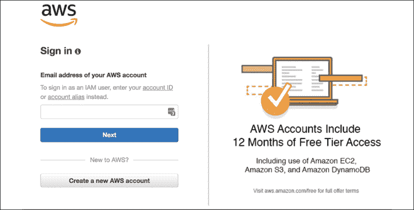
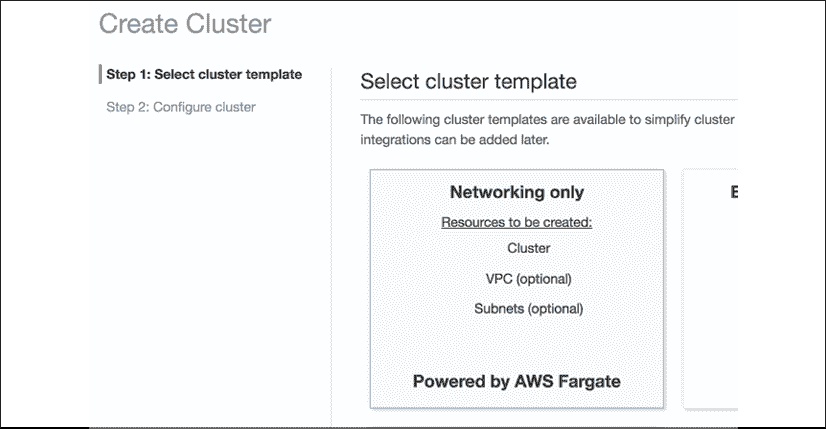
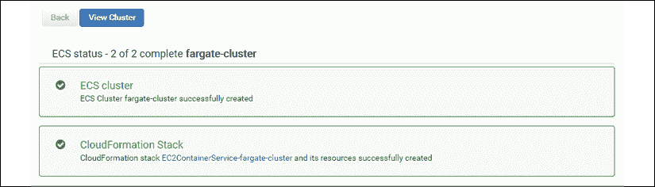
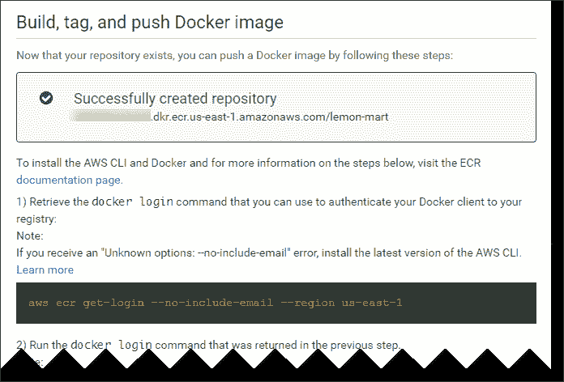
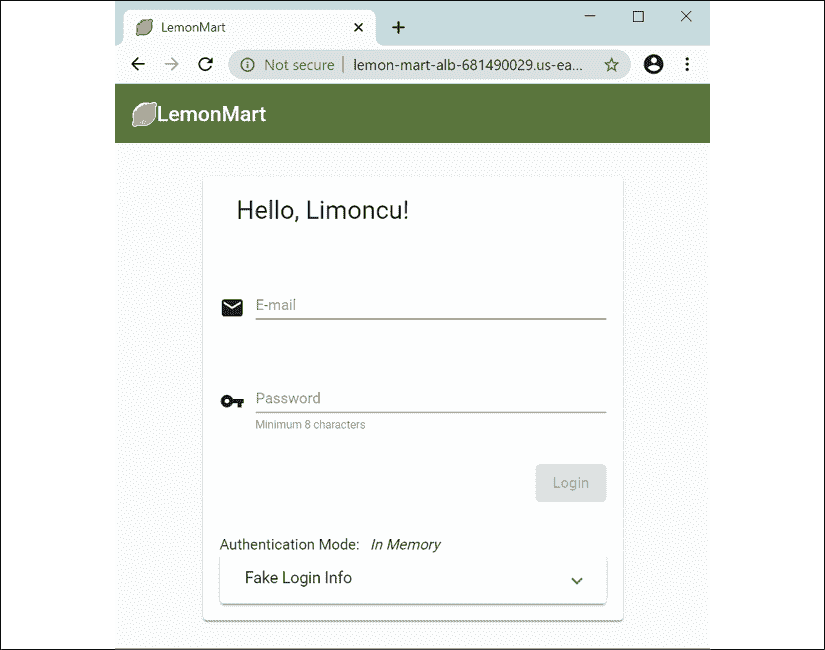
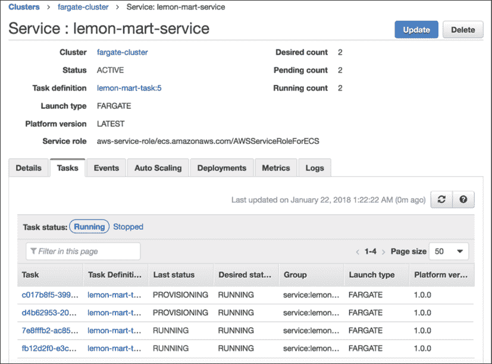

# 十三、AWS 上的高可用云基础设施

网络是一个充满敌意的环境。演员有好有坏。不良行为者可能会试图在您的安全性上戳出漏洞，或试图通过**分布式拒绝服务****DDoS**攻击摧毁您的网站。好演员，如果你幸运的话，会喜欢你的网站并且不会停止使用它。他们会给你大量的建议来改进你的网站，但他们也可能会遇到 bug，而且他们可能过于热情，以至于你的网站可能会因为高流量而慢下来。在 web 上进行真实世界的部署需要大量的专业知识才能使其正确。作为一名全栈开发人员，您只能了解硬件、软件和网络的许多细微差别。幸运的是，随着云服务提供商的出现，许多这种专业技能已经转化为软件配置，困难的硬件和网络问题由提供商解决。

云服务提供商的最佳功能之一是云可伸缩性，它指的是您的服务器自动向外扩展以响应大量意外流量，并在流量恢复到正常水平时向下扩展以节省成本。**亚马逊网络服务****AWS**超越了基本的云可伸缩性，引入了高可用性和容错概念，允许弹性本地和全球部署。我之所以选择向您介绍 AWS，是因为它具有巨大的功能，这远远超出了我在本书中将要讨论的内容。使用 Route 53，您可以获得免费 DDoS 保护；使用 API 网关，您可以创建 API 密钥；有了 AWS Lambda，你每月只需几美元就可以处理数百万笔交易；使用 CloudFront，您可以将内容缓存在分散在世界主要城市的秘密边缘位置。此外，蓝绿色部署允许您实现软件的无停机部署。

总的来说，您将在本章中学习的工具和技术适用于任何云提供商，并且正迅速成为任何全栈开发人员的关键知识。我们将讨论以下主题：

*   创建和保护 AWS 帐户
*   适当调整基础架构的大小，包括优化实例的简单负载测试
*   配置并部署到 AWS
    *   ECS Fargate 脚本蓝绿色部署
    *   演员表

本书示例代码的最新版本位于 GitHub 上的以下存储库链接。存储库包含代码的最终和完整状态。每个部分都包含信息框，可以帮助您找到 GitHub 上正确的文件名或分支，您可以使用这些文件名或分支来验证进度。

*第 13 章*的示例代码删除了前几章中的所有可选和替代实现，并且仅使用**lemon mart server**启用 auth。这是为了让读者能够参考**lemon mart**项目的干净实现。

*第 13 章*基于**柠檬城**的实例：

1.  在[克隆回购协议 https://github.com/duluca/lemon-mart](https://github.com/duluca/lemon-mart) 。
2.  使用`config.docker-integration.yml`验证您的`config.yml`实现。
3.  在根文件夹上执行`npm install`以安装依赖项。
4.  要运行 CircleCI Docker 集成配置，请执行`git checkout deploy_aws`。参见[中的拉动请求 https://github.com/duluca/lemon-mart/pull/27](https://github.com/duluca/lemon-mart/pull/27) 。
5.  本章代码示例在子文件夹

    ```ts
    projects/ch13 
    ```

    下
6.  要运行本章的 Angular 应用，请执行：

    ```ts
    npx ng serve ch13 
    ```

7.  要运行本章的 Angular 单元测试，请执行：

    ```ts
    npx ng test ch13 --watch=false 
    ```

8.  要运行本章的 Angular e2e 测试，请执行：

    ```ts
    npx ng e2e ch13 
    ```

9.  要为本章构建生产就绪的 Angular 应用，请执行：

    ```ts
    npx ng build ch13 --prod 
    ```

请注意，存储库根目录下的`dist/ch13`文件夹将包含编译后的结果。

请注意，书中或 GitHub 上的源代码可能并不总是与 Angular CLI 生成的代码匹配。书中的代码和 GitHub 上的代码在实现上也可能有细微的差异，因为生态系统是不断发展的。随着时间的推移，示例代码自然会发生变化。同样在 GitHub 上，希望找到更正、修复以支持库的更新版本，或者多种技术的并行实现供您观察。您只需要实现书中推荐的理想解决方案。如果发现错误或有问题，请在 GitHub 上创建问题或提交请求，以方便所有读者。

您可以在*附录 C*、*保持 Angular 和 Tools 常青*中了解更多关于更新 Angular 的信息。您可以从[在线找到此附录 https://static.packt-cdn.com/downloads/9781838648800_Appendix_C_Keeping_Angular_and_Tools_Evergreen.pdf](https://static.packt-cdn.com/downloads/9781838648800_Appendix_C_Keeping_Angular_and_Tools_Evergreen.) 或[处 https://expertlysimple.io/stay-evergreen](https://expertlysimple.io/stay-evergreen) 。

AWS 是一项非常受欢迎的服务，AWS 帐户更是黑客攻击的目标。让我们首先创建一个安全的 AWS 帐户。

# 创建安全的 AWS 账户

帐户访问和控制在任何云服务中都是至关重要的，这也包括 AWS。初始帐户创建后，您将拥有根凭据，即电子邮件和密码的组合。

让我们先创建一个 AWS 帐户：

1.  从导航到[开始 https://console.aws.amazon.com](https://console.aws.amazon.com) 。
2.  如果没有，请创建一个新帐户。
3.  If you are new to AWS, you can get 12 months of free tier access to various services, as shown on the sign-up screen here:

    

    图 13.1:AWS 帐户注册

    您的 AWS 账单与您的根凭证绑定。如果泄露，在您重新获得访问权限之前，您的帐户可能会受到很大的损害。

4.  Ensure that you enable 2FA on your root credentials.

    要添加另一层安全性，请继续，您需要停止使用根凭据登录 AWS 帐户。您可以使用 AWS**身份和访问管理**（**IAM**模块）创建用户帐户。如果这些帐户遭到破坏，与您的根帐户不同，您可以轻松快速地删除或替换它们。

5.  导航至**IAM 模块**。
6.  创建具有全局管理员权限的新用户帐户。
7.  使用这些凭据登录到 AWS 控制台。
8.  您还应该为这些凭据启用 2FA。
9.  A secure account setup looks as follows, with every status reported as green:

    

    图 13.2：安全设置后的 AWS IAM 模块

使用用户帐户的主要好处是编程访问。对于每个用户帐户，可以创建公共访问 ID 和私有访问密钥对。当您与第三方（如托管的持续集成服务、您自己的应用代码或 CLI 工具）合作时，您可以使用编程访问密钥连接到 AWS 资源。当访问密钥不可避免地泄漏时，禁用对旧密钥的访问并创建新密钥是快速而方便的。

此外，用户帐户访问可以通过非常精细的权限进行严格控制。您还可以创建具有一组权限的角色，并进一步控制 AWS 服务和某些外部服务之间的通信。

在创建用户帐户和角色时，总是在最小权限方面出错。当与不熟悉 AWS 的客户、承包商或同事一起工作时，这可能是一种挫折感；然而，这是一项值得进行的工作。

您的安全性和可靠性与您最薄弱的环节一样，所以您必须为故障做好计划，最重要的是，定期实施恢复计划。

## 保密

密码和私钥泄漏的发生频率比您想象的要高。您的密钥可能在不安全的公共 Wi-Fi 网络上被泄露；您可能会意外地将它们签入您的代码库，或者使用极不安全的通信方法，如电子邮件。

然而，意外的代码签入是最大的问题，因为大多数初级开发人员没有意识到在源代码管理系统中删除不是一个选项。

作为一名开发人员，有几个值得注意的最佳实践可以用来保护您的秘密：

1.  始终在公共 Wi-Fi 上使用 VPN 服务，如[tunnelbear.com](http://tunnelbear.com)。
2.  利用位于用户主文件夹下的`.aws/credentials`文件创建配置文件并存储访问密钥。
3.  作为团队规范，在`.gitignore`中的项目根目录中创建一个`.env`文件，以存储 CI 服务器稍后可能注入的任何机密。
4.  在推送提交之前，请始终检查提交。
5.  考虑注册一个可以监视你的秘密的服务，比如 GITGururin 在 To.T0.https://gitguardian.com/ ，对开源项目是免费的。

请注意，GitGuardian 将 Firebase 和 OpenWeather API 密钥标记为泄漏。这是一个误报，因为所讨论的密钥是公钥，必须发布才能使应用正常运行。

每次都遵循这些约定将使您养成一个好习惯，即从不向代码存储库签入机密。在下一节中，我们将深入探讨您的云环境的资源考虑因素。

# 适当规模的基础设施

优化基础架构的目的是保护公司的收入，同时最大限度地降低运营基础架构的成本。您的目标应该是确保用户不会遇到高延迟，也就是所谓的性能差，或者更糟糕的是，未完成或丢弃的请求，同时使您的冒险成为可持续的努力。

web 应用性能的三大支柱如下：

1.  CPU 利用率
2.  内存使用
3.  网络带宽

我有意将磁盘访问排除在关键考虑指标之外，因为只有在应用服务器或数据存储上执行的特定工作负载才会受到影响。只要应用资产通过**内容交付网络**（**CDN**交付，磁盘访问就很少会影响服务 web 应用的性能。也就是说，仍然要密切关注任何意外失控的磁盘访问，例如频繁创建临时文件和日志文件。例如，Docker 可以吐出可以轻松填满驱动器的日志。

在理想情况下，CPU、内存和网络带宽的使用应平均利用在可用容量的 60-80%左右。如果由于各种其他因素（如磁盘 I/O、速度较慢的第三方服务或效率低下的代码）而遇到性能问题，最有可能的情况是，其中一个指标将达到或接近最大容量，而另外两个指标处于空闲状态或严重未充分利用。这是一个使用更多 CPU、内存或带宽来补偿性能问题并均匀利用可用资源的机会。

将利用率定为 60-80%的原因是为了给新实例（服务器或容器）留出一些时间，以便为用户提供服务。在超过预定义阈值后，在配置新实例的同时，您可以继续为越来越多的用户提供服务，从而最大限度地减少未完成的请求。

在这本书中，我一直劝阻过多的工程或完美的解决方案。在当今复杂的 IT 环境中，几乎不可能预测您将在哪里遇到性能瓶颈。您的工程可能很容易花费 100000 美元以上的工程时间，而您的问题的解决方案可能是几百美元的新硬件，无论是网络交换机、固态驱动器、CPU 还是更多内存。

如果您的 CPU 太忙，您可能希望通过索引、哈希表或字典在代码中引入更多簿记逻辑，这些可以缓存在内存中，以加快逻辑的后续或中间步骤。例如，如果您不断运行数组查找操作来定位记录的特定属性，则可以对该记录执行操作，将记录的 ID 和/或属性保存在内存中的哈希表中，从而将运行时成本从*O（n）*降低到*O（1）*。

按照前面的示例，您可能会在哈希表中使用过多内存。在这种情况下，您可能希望更积极地使用备用网络带宽（如 Redis 实例）将缓存卸载或转移到较慢但更丰富的数据存储中。

如果您的网络利用率太高，您可能希望调查对滥用配额的客户使用具有过期链接、客户端缓存、节流请求和 API 访问限制的 CDN 的情况，或者优化实例，使其网络容量比其 CPU 或内存容量大得多。

## 优化实例

在前面的一个例子中，我演示了如何使用我的`duluca/minimal-node-web-server`Docker 图像来托管我们的 Angular 应用。尽管 Node.js 是一个非常轻量级的服务器，但它并没有被优化为一个 web 服务器。此外，Node.js 有一个单线程执行环境，这使得它对于同时向多个并发用户提供静态内容来说是一个糟糕的选择。

您可以通过执行`docker stats`来观察 Docker 镜像正在使用的资源：

```ts
$ docker stats
CONTAINER ID  CPU %  MEM USAGE / LIMIT  MEM %  NET I/O  BLOCK I/O    PIDS
27d431e289c9  0.00%  1.797MiB / 1.9GiB  0.09%  13.7kB / 285kB  0B / 0B  2 
```

以下是 Node 和基于 NGINX 的服务器在静止时使用的系统资源的比较结果：

<colgroup><col> <col> <col></colgroup> 
| **服务器** | **图像大小** | **内存使用** |
| `duluca/minimal-nginx-web-server` | 16.8 MB | 1.8MB |
| `duluca/minimal-node-web-server` | 71.8 MB | 37.0 MB |

然而，静态值只能说明故事的一部分。为了更好地理解，我们必须执行一个简单的负载测试，以查看负载下的内存和 CPU 利用率。

## 简单负载测试

为了更好地了解我们服务器的性能特征，让我们将其置于一定的负载下，并对其进行强调：

1.  Start your container using `docker run`:

    ```ts
    $ docker run --name <imageName> -d -p 8080:<internal_port>
    <imageRepo> 
    ```

    如果您正在为 Docker 使用 npm 脚本，请执行以下命令以启动容器：

    ```ts
    $ npm run docker:debug 
    ```

2.  Execute the following bash script to start the load test:

    ```ts
    $ curl -L http://bit.ly/load-test-bash | bash -s 100 "http://localhost:8080" 
    ```

    此脚本将每秒向服务器发送`100`请求，直到您终止它。

3.  执行`docker stats`观察性能特性。

以下是 CPU 和内存利用率的高级观察结果：

<colgroup><col> <col> <col> <col> <col></colgroup> 
| ****CPU 利用率统计**** | ****低**** | ****中**** | ****高**** | ****最大内存**** |
| `duluca/minimal-nginx-web-server` | 2% | 15% | 60% | 2.4 MB |
| `duluca/minimal-node-web-server` | 20% | 45% | 130% | 75MB |

如您所见，提供完全相同内容的两台服务器之间存在显著的性能差异。请注意，这种基于每秒请求数的测试有助于比较分析，并不一定反映真实世界的使用情况。

很明显，我们的 NGINX 服务器将为我们带来最好的回报。有了最佳解决方案，让我们在 AWS 上部署应用。

# 部署到 AWS ECS Fargate

AWS**弹性容器服务**（**ECS**）Fargate 是一种经济高效且易于配置的在云中部署容器的方式。

ECS 由四个主要部分组成：

1.  一个容器存储库，**弹性容器注册表**（**ECR**），您可以在其中发布 Docker 图像。
2.  服务、任务和任务定义，其中您将容器的运行时参数和端口映射定义为服务作为任务运行的任务定义。
3.  集群，EC2 实例的集合，可以在其中配置和扩展任务。
4.  Fargate 是一个托管集群服务，它将 EC2 实例、负载平衡器和安全组问题抽象出来。

在 AWS 控制台的右上角，确保选择离用户最近的区域。对我来说，这是美国东部地区。

我们的目标是创建一个高可用的蓝绿色部署，这意味着在服务器出现故障时，甚至在部署期间，至少有一个应用实例将启动并运行。这些概念在*第 14 章*、*谷歌分析和高级云运营*中详细探讨，在*可扩展环境中的每用户成本*部分。

## 配置 ECS 远门

您可以在 AWS**服务**菜单下访问 ECS 功能，选择**弹性容器服务**链接。

如果这是您第一次登录，您必须完成一个教程，在那里您将被迫创建一个示例应用。我建议您阅读本教程，然后删除示例应用。要删除服务，您需要将服务的任务数更新为 0。此外，请删除默认群集以避免任何不可预见的费用。

### 创建 Fargate 群集

让我们从配置 Fargate 集群开始，它在配置其他 AWS 服务时充当锚定点。我们的集群最终将运行一个集群服务，我们将在以下部分逐步建立该服务。

AWS Fargate 是在云中实现可伸缩容器编排解决方案的最佳选择。近年来，Kubernetes 作为一种可行的解决方案得到了广泛应用。Kubernetes 是 AWS ECS 的开源替代方案，具有更丰富的容器编排功能，可用于本地、云和云混合部署。AWS 确实为 Kubernetes（Amazon EKS）提供了 Amazon 弹性容器服务，但是 RedHat 的开源 OpenShift 平台更易于使用，与 vanilla Kubernetes 相比，它附带了电池。

让我们创建集群：

1.  导航至**弹性集装箱服务**。
2.  点击**集群****创建集群**。
3.  仅选择**网络。。。由 AWS Fargate**模板供电。
4.  Click on the **Next step** and you'll see the **Create Cluster** step, as shown:

    

    图 13.3:AWS ECS 创建集群

5.  将**集群名称**输入为`fargate-cluster`。
6.  创建一个**VPC**将您的资源与其他 AWS 资源隔离。
7.  点击**创建集群**完成设置。

您将看到您的行动摘要，如下所示：



图 13.4:AWS ECS Fargate 集群

现在您已经在自己的**虚拟私有云**（**VPC**中创建了一个集群，您可以在**弹性容器服务****集群**下查看。

### 创建容器存储库

接下来，我们需要建立一个存储库，以便发布我们在本地或 CI 环境中构建的容器映像：

本节假设您已经为 Docker 设置了 Docker 和 npm 脚本，详见*第 9 章*、*使用 Docker 的 DevOps*。您可以通过执行`npm i -g mrm-task-npm-docker`并将其与`npx mrm npm-docker`一起应用来获取这些脚本的最新版本。

1.  导航至**弹性集装箱服务**。
2.  点击**存储库****创建存储库**。
3.  将存储库名称输入为`lemon-mart`。
4.  复制屏幕上生成的**存储库 URI**。
5.  将应用的`package.json`文件中的 URI 粘贴为新的`imageRepo`变量：

    ```ts
    **package.json**
    ...
    "config": {
      "imageRepo": "000000000000.dkr.ecr.us-east-1.amazonaws.com/lemon-mart",
      ...
    } 
    ```

6.  点击**创建存储库**。
7.  点击**下一步**，然后点击**完成**完成设置。

在 summary 屏幕上，您将获得有关如何与 Docker 一起使用存储库的进一步说明。在本章的后面，我们将介绍为我们解决这一问题的脚本：



图 13.5:AWS ECS 存储库

您可以在**弹性容器服务****存储库**下查看您的新存储库。

我们将在即将到来的 AWS 部分*npm 脚本中介绍如何发布您的图像。*

让我们继续 ECS 的设置。

### 创建任务定义

使用存储库中定义的容器目标，我们可以定义任务定义，其中包含运行容器所需的元数据，例如端口映射、保留 CPU 和内存分配：

1.  导航至**弹性集装箱服务**。
2.  点击**任务定义****新建任务定义**。
3.  选择**Fargate**发射类型兼容性。
4.  输入**任务定义名称**为`lemon-mart-task`。
5.  选择**任务角色**为无（您可以稍后添加一个以启用对其他 AWS 服务的访问）。
6.  将**任务记忆**输入为`0.5 GB`。
7.  将**任务 CPU**输入为`0.25 CPU`。
8.  点击**添加容器**：
    *   将**容器名称**输入为`lemon-mart`。
    *   对于**映像**，粘贴来自早期的映像 repo URI，但在其上附加`:latest`标记，以便它总是提取存储库中的最新映像，例如`000000000000.dkr.ecr.us-east-1.amazonaws.com/lemon-mart:latest`。
    *   为 NGINX 设置一个**软限制**，为 Node.js 设置一个`128 MB`软限制`256 MB`。
    *   在**端口映射**下，为 NGINX 指定**集装箱端口**为`80`，为 Node.js 指定`3000`。
9.  接受其余的默认值。
10.  Click on **Add**; this is how your task definition will look before creating it:

    

    图 13.6:AWS ECS 任务定义

11.  点击**创建**完成设置。

在**弹性容器服务****任务定义**下查看您新的**任务定义**。

请注意，默认设置将启用 AWS CloudWatch 日志记录，这是一种可以追溯访问容器实例的控制台日志的方法。在本例中，将创建名为`/ecs/lemon-mart-task`的 CloudWatch 日志组。

在**云监控****日志**下查看您的新日志组。

如果要添加需要持久化数据的容器，任务定义允许您定义卷并将文件夹装载到 Docker 容器中。我已经发布了一个在[配置您的 ECS 容器的 AWS**弹性文件系统**（**EFS**的指南 https://bit.ly/mount-aws-efs-ecs-container](https://bit.ly/mount-aws-efs-ecs-container) 。

### 创建弹性负载平衡器

在高可用性部署中，您希望跨两个不同的**可用性区域**（**AZs**）运行容器的两个实例，正如我们刚才创建的任务定义所定义的那样。对于这种动态的向外扩展和向内扩展，我们需要配置一个**应用负载平衡器**（**ALB**来处理请求路由和释放：

1.  在单独的选项卡上，导航到**EC2****负载平衡器****创建负载平衡器**。
2.  创建一个**应用负载平衡器**。
3.  Enter **Name** as `lemon-mart-alb`.

    为了支持侦听器下的 SSL 通信，您可以在端口`443`上为 HTTPS 添加一个新的侦听器。可以通过 AWS 服务和向导方便地实现 SSL 设置。在 ALB 配置过程中，AWS 提供指向这些向导的链接以创建证书。然而，这是一个复杂的过程，根据您现有的域托管和 SSL 认证设置，这个过程可能会有所不同。在这本书中，我将跳过 SSL 配置。您可以在我在[上发布的指南中找到与 SSL 相关的步骤 https://bit.ly/setupAWSECSCluster](https://bit.ly/setupAWSECSCluster) 。

4.  在**可用性区域**下，选择为您的**fargate 集群**创建的**VPC**。
5.  选择列出的所有 AZ。
6.  展开**标记**并添加一个键/值对，以便能够识别 ALB，如`"App": "LemonMart"`。
7.  Click on **Next: Configure Security Settings**.

    如果添加了 HTTPS 侦听器，您将看到配置证书的选项。

    如果配置证书，请单击**从 ACM**（AWS 证书管理器）中选择证书，并选择**默认 ELB 安全策略**。

    如果您从未创建过证书，请单击**从 ACM**链接请求新证书以创建一个证书。如果您以前创建过证书，请转到**证书管理器**创建一个新的证书。然后，刷新并选择您的证书。

8.  点击**下一步：配置安全组**。
9.  Create a new cluster-specific security group, `lemon-mart-sg`, only allowing port `80` inbound or `443` if using HTTPS.

    在下一节中创建群集服务时，请确保此处创建的安全组是在服务创建过程中选择的安全组。否则，您的 ALB 将无法连接到您的实例。

10.  点击**下一步：配置路由**。
11.  将新的**目标群体**命名为`lemon-mart-target-group`。
12.  将协议类型从`instance`更改为`ip`。
13.  Under **Health check**, keep the default route, `/`, if serving a website on HTTP.

    运行状况检查对于扩展和部署操作的正常运行至关重要。这是 AWS 可以用来检查实例是否已成功创建的机制。

    如果部署 API 和/或将所有 HTTP 调用重定向到 HTTPS，请确保您的应用定义了未重定向到 HTTPS 的自定义路由。在 HTTP 服务器上，`GET /healthCheck`返回一条简单的 200 消息，上面写着`I'm healthy`并验证这不会重定向到 HTTPS。否则，当所有的健康检查失败和部署莫名其妙地失败时，您将经历许多痛苦和折磨，试图找出问题所在。`duluca/minimal-node-web-server`提供 HTTPS 重定向，以及一个仅限 HTTP 的`/healthCheck`现成端点。使用`duluca/minimal-nginx-web-server`，您需要提供自己的配置。

14.  点击**下一步：注册目标**。
15.  不要*注册任何**目标**或**IP 范围**。ECS Fargate 将神奇地为您管理这一切。如果您自己这样做，您将提供一个半破损的基础设施。*
16.  Click on **Next: Review**; your ALB settings should look similar to the ones shown:

    

    图 13.7:AWS 应用负载平衡器设置

17.  点击**创建**完成设置。

在下一节创建集群服务时，您将使用`lemon-mart-alb`。

### 创建群集服务

现在，我们将通过使用任务定义和我们创建的 ALB 在集群中创建一个服务，将所有这些结合在一起：

1.  导航至**弹性集装箱服务**。
2.  点击**集群****法门集群**。
3.  在**服务**选项卡下，点击**创建**。
4.  为**发射类型**选择`Fargate`。
5.  Select the task definition you created earlier.

    请注意，任务定义是版本化的，例如`lemon-mart-task:1`。如果要更改任务定义，AWS 将创建`lemon-mart-task:2`。要使更改生效，您需要使用此新版本更新服务。

6.  将**服务名称**输入为`lemon-mart-service`。
7.  对于**任务数**，选择`2`。
8.  对于**最小健康百分比**，选择`50`。
9.  For **Maximum percent**, select `200`.

    坚持使用**滚动更新**部署类型，因为我们将实施我们自己的蓝/绿部署策略。

10.  Click on **Next** **step**.

    将**最小健康百分比**设置为`100`，即使在部署过程中也能获得高可用性。Fargate 的定价是基于每秒的使用率，因此在部署应用时，您将为额外实例收取额外费用，而旧实例将被取消提供。

11.  在**配置网络**下，选择与前面的集群相同的`VPC`。
12.  选择所有可用的子网；对于高可用性，应该至少有两个。
13.  选择您在上一节中创建的名为`lemon-mart-sg`的安全组。（如果看不到，请刷新页面。）
14.  选择**负载平衡器**类型为**应用负载平衡器**。
15.  选择**柠檬玛特 alb**选项。
16.  点击**添加到负载平衡器**按钮，将**集装箱端口**添加到 ALB，如`80`或`3000`。
17.  选择您已经定义的**生产侦听器端口**。
18.  选择您已经定义的**目标群体**`lemon-mart-target-group`。
19.  取消选中**启用服务发现集成**。
20.  点击**下一步**。
21.  If you'd like your instances to scale out and in automatically, when their capacities reach a certain limit, then set **Auto Scaling**.

    我建议您在初始设置服务时跳过自动缩放设置，以便更容易解决任何潜在的配置问题。您可以稍后再来设置。自动任务扩展策略依赖于报警，例如 CPU 利用率。在*第 14 章*、*Google Analytics and Advanced Cloud Ops*中，在*可扩展环境中的每用户成本*部分，您可以阅读有关计算您的最佳目标服务器利用率的内容，并根据此数字设置警报。

22.  Click on **Next step** and review your changes, as illustrated:

    

    图 13.8:AWS Fargate 群集服务设置

23.  最后点击**创建服务**完成设置。

观察您在**弹性集装箱服务****集群****法门集群****柠檬城服务**下的新服务。在将映像发布到容器存储库之前，AWS 服务将无法提供实例，因为运行状况检查将持续失败。发布图像后，您需要确保您的服务的**事件**选项卡中没有错误。

AWS 是一个复杂的野兽，使用 Fargate，您可以避免很多复杂性。但是，如果您有兴趣使用自己的 EC2 实例建立自己的 ECS 群集，您可以享受 1-3 年的保留实例优惠。我在[上有一个 75+步的设置指南 https://bit.ly/setupAWSECSCluster](https://bit.ly/setupAWSECSCluster) 。

我们已经手动执行了许多步骤来创建集群。AWS CloudFormation 通过提供配置模板来解决此问题，您可以根据自己的需要进行自定义，也可以从头编写自己的模板脚本。如果你想认真对待 AWS，这种代码作为基础设施的设置绝对是一种选择。

对于生产部署，请确保您的配置是由 CloudFormation 模板定义的，这样就可以轻松地重新配置，而不是在发生与部署相关的失误时。

### 配置 DNS

要将域或子域名连接到应用，必须将 DNS 配置为指向 ALB。AWS 提供 Route 53 服务来管理您的域。

路由 53 可以轻松地将域或子域动态分配给 ALB：

1.  导航至**路线 53****托管区**。
2.  If you already have a domain registered, select it; otherwise, register it with **Create Hosted Zone**.

    请注意，您需要将域的名称服务器重新分配给 AWS 服务器才能生效。

3.  点击**创建记录集**。
4.  将**名称**输入为`lemonmart`。
5.  将**别名**设置为`yes`。
6.  从负载平衡器列表中选择**alb**。
7.  Click on **Create** to finish the setup:

    

    图 13.9:53 号路线-创建记录集

现在，您的站点将可以在您刚刚定义的子域上访问，例如，[http://lemonmart.angularforenterprise.com](http://lemonmart.angularforenterprise.com) 。

如果你不使用 53 号公路，不要惊慌。在您的域提供商的网站上，编辑`Zone`文件以创建 ALB DNS 地址的 A 记录，您就完成了。

#### 获取 ALB DNS 名称

要获取负载平衡器的 DNS 地址，请执行以下步骤：

1.  导航至**EC2****负载平衡器**。
2.  选择**柠檬玛特 alb**。
3.  在**说明**页签中，注意 DNS 名称；考虑这个例子：

现在我们已经配置了 AWSECS Fargate，让我们准备部署到 AWS 的 Angular 应用。

## 为 AWS 添加 npm 脚本

就像 Docker 的 npm 脚本一样，我开发了一套脚本，称为 AWS 的**npm 脚本**，可以在 Windows 10 和 macOS 上工作。这些脚本将允许您以壮观、无停机、蓝色/绿色的方式上传和发布 Docker 图像。您可以获取这些脚本的最新版本，并通过执行以下步骤在项目中自动配置它们：

我们正在**柠檬超市**项目中配置这些设置。

1.  为 AWS ECS 任务安装 npm 脚本：

    ```ts
    npm i -g mrm-task-npm-aws 
    ```

2.  为 Docker 配置应用 npm 脚本：

    ```ts
    npx mrm npm-aws 
    ```

现在，让我们配置脚本：

1.  确保在项目中设置了`mrm-task-npm-docker`脚本。
2.  创建一个`.env`文件并设置`AWS_ACCESS_KEY_ID`和`AWS_SECRET_ACCESS_KEY`：

    ```ts
    **.env**
    AWS_ACCESS_KEY_ID=your_own_key_id
    AWS_SECRET_ACCESS_KEY=your_own_secret_key 
    ```

3.  确保您的`.env`文件在`.gitignore`文件中，以保护您的机密。
4.  安装或升级至最新的 AWS CLI：
    *   关于 macOS，`brew install awscli`
    *   在 Windows 上，`choco install awscli`
5.  使用您的凭据登录到 AWS CLI：
    1.  运行`aws configure`。
    2.  配置 IAM 帐户时，您需要您的**访问密钥 ID**和**秘密访问密钥**。
    3.  将**默认区域名称**设置为`us-east-1`。
6.  Update `package.json` to add a new `config` property with the following configuration properties:

    ```ts
    **package.json**
      ...
      "config": {
        ...
        "awsRegion": "us-east-1",
        "awsEcsCluster": "fargate-cluster",
        "awsService": "lemon-mart-service"
      },
    ... 
    ```

    确保从为 Docker 配置 npm 脚本时开始更新`package.json`，以便`imageRepo`属性具有新 ECS 存储库的地址。

7.  确保 AWS 脚本已添加到`package.json`，如图所示：

    ```ts
    **package.json**
    ...
    "scripts": {
      ...
      "aws:login:win": "cross-conf-env 
         aws ecr get-login --no-include-email --region 
         $npm_package_config_awsRegion > 
         dockerLogin.cmd && call dockerLogin.cmd && 
         del dockerLogin.cmd",
      "aws:login:mac": "eval $(aws ecr get-login 
         --no-include-email --region $npm_package_config_awsRegion)",
        "aws:login": "run-p -cs aws:login:win aws:login:mac", 
    } 
    ```

通过执行`aws --version`检查您的 AWS CLI 版本。根据您的版本，您的`aws:login`需要不同。前面的脚本显示 AWS CLI v1 的登录脚本。如果您有 v2，您的登录命令将类似于以下脚本：

**在 macOS/Linux**上：

aws ecr 获取登录密码--region$npm_package_config_awsRegion|docker 登录--用户名 aws--密码 stdin$npm_package_config_imageRepo

**在 Windows**上：

密码| docker 登录--用户名 AWS--密码 stdin$npm_package_config_imageRepo:latest

`npm run aws:login`调用特定于平台的命令，自动执行其他多步骤操作，以从 AWS CLI 工具获取`docker login`命令，如图所示：

```ts
**example**
$ npm run aws:login 
docker login -u AWS -p eyJwYXl...3ODk1fQ== https://00000000000.dkr.ecr.us-east-1.amazonaws.com
$ docker login -u AWS -p eyJwYXl...3ODk1fQ== https://00000000000.dkr.ecr.us-east-1.amazonaws.com
WARNING! Using --password via the CLI is insecure. Use --password-stdin.
Login Succeeded 
```

首先执行`aws ecr get-login`，然后复制粘贴生成的`docker login`命令并执行它，以便本地 Docker 实例指向 AWS ECR。现在，让我们看看如何部署内置容器：

```ts
**package.json**
...
"scripts": {
...
"aws:deploy": "cross-conf-env docker run 
   --env-file ./.env silintl/ecs-deploy
   -c $npm_package_config_awsEcsCluster 
   -n $npm_package_config_awsService 
   -i $npm_package_config_imageRepo:latest 
   -r $npm_package_config_awsRegion --timeout 1000", 
}
...
example
$ docker image build . -f nginx.Dockerfile 
   -t 000000000.dkr.ecr.us-east-1.amazonaws.com/lemon-mart:latest
$ npm run docker:publish
$ npm run aws:deploy
Using image name: 0000000.dkr.ecr.us-east-1.amazonaws.com/lemon-mart:latest
Current task definition: arn:aws:ecs:us-east-1: 0000000:task-definition/lemon-mart-task:7
New task definition: arn:aws:ecs:us-east-1: 0000000:task-definition/lemon-mart-task:8
Service updated successfully, new task definition running.
Waiting for service deployment to complete...
Service deployment successful. 
```

我们首先为我们的 web 应用构建 NGINX 版本的 Docker 映像，因为我们正在 ECS 上监听端口`80`。然后，将容器发布到 ECR，最后执行`npm run aws:deploy`，它使用`silintl/ecs-deploy`Docker 容器运行蓝色/绿色部署。

蓝色/绿色部署如何使用 ECS 命令的细节超出了本书的范围。要查看更多使用本机 AWS ECS 命令的示例，请参阅位于[的`aws-samples`存储库 https://github.com/aws-samples/ecs-blue-green-deployment](https://github.com/aws-samples/ecs-blue-green-deployment) 。

我们可以将我们的命令组合在一起，以单个`release`命令的形式执行它们，如下所示：

```ts
**package.json**
...
"scripts": {
  ...
  "aws:release": "run-s -cs aws:login docker:publish aws:deploy"
}
... 
```

最后，`npm run aws:release`只是按照正确的顺序从 Docker 的 npm 脚本和`aws:deploy`命令中运行`aws:login, docker:publish`。

## 出版

您的项目已配置为部署在 AWS 上。您主要需要使用我们创建的两个命令来构建和发布图像：

1.  执行`docker:debug`在浏览器中测试、构建、标记、运行、跟踪并启动应用以测试图像：

    ```ts
    $ npm run docker:debug 
    ```

2.  Execute `aws:release` to configure Docker login with AWS, publish your latest image build, and release it on ECS:

    ```ts
    $ npm run aws:release 
    ```

    请注意，当背靠背运行多个命令且其中一个命令退出状态为`1`时，npm 将此视为失败。然而，这并不一定意味着你的行动失败了。始终滚动终端输出，查看是否抛出任何实际错误。

3.  Verify that your tasks are up and running at the **Service** level:

    

    图 13.10:AWS ECS 服务

    确保**运行计数**和**所需计数**相同。不匹配或部署需要很长时间通常意味着新容器的运行状况检查失败。查看**事件**选项卡了解更多信息。您的容器无法启动，或者您可能侦听了错误的端口。

4.  Verify that your instances are running at the **Task** level:

    

    图 13.11:AWS ECS 任务实例

    注意**公共 IP**地址并导航到该地址；例如，`http://54.164.92.137`，您应该看到您的应用或 LemonMart 正在运行。

5.  在 DNS 级别验证**负载平衡器**设置是否正确。
6.  Navigate to the **ALB DNS address**, for example [http://lemon-mart-alb-681490029.us-east-1.elb.amazonaws.com](http://lemon-mart-alb-681490029.us-east-1.elb.amazonaws.com), and confirm that the app renders as follows:

    

    图 13.12:AWS Fargate 上运行的 LemonMart

瞧！您的站点应该已启动并运行。

在第一个版本之后的后续版本中，您将能够观察到蓝绿色部署的实际情况，如图所示：



图 13.13：蓝绿部署期间的 AWS 服务

有两个任务正在运行，其中两个新任务正在配置中。在验证新任务时，**运行计数**将上升到四个任务。在验证新任务并清空旧任务的连接后，**运行计数**将返回到 2。

通过使用安装了`awscli`工具并运行 AWS 的 npm 脚本的容器，使用 AWS 凭据配置 CircleCI，您可以自动化部署。使用此技术，您可以实现到暂存环境的连续部署或到生产环境的连续交付。

## 使用 CircleCI 部署到 AWS

在*第 9 章*中*DevOps 使用 Docker*实现了一个基于多级`Dockerfile`的 CircleCI 管道，产生了 tar 和 gzip Docker 图像。我们还介绍了如何使用 CircleCI 实现部署步骤。利用我们在本章学到的知识，我们可以结合这两种策略，以便使用 CircleCI 部署到 AWS。

对于 AWS 部署，您可以使用`aws-cli`orb 和`deploy`作业。`deploy`作业将包含从缓存中恢复构建的 Docker 映像、登录 AWS 并将映像推送到 AWS ECS 容器存储库的步骤。

在**柠檬城**回购中，本节的`config.yml`文件名为`.circleci/config.docker-integration.yml`。您还可以在[上找到执行本章 CircleCI 中 YML 文件的 pull 请求 https://github.com/duluca/lemon-mart/pull/27](https://github.com/duluca/lemon-mart/pull/27) 使用分支`deploy_aws`。

为了推送容器，我们通过运行`npm run aws:deploy`进行部署。让我们在`config.yml`文件中添加一个新的`deploy`作业。

在**CircleCI 账户设置**或**组织设置**下，添加一个名为`aws`的新**上下文**。将`AWS_ACCOUNT_ID`、`AWS_ACCESS_KEY_ID`、`AWS_SECRET_ACCESS_KEY`和`AWS_DEFAULT_REGION`环境变量设置为上下文的一部分。

请参见此处的配置更改：

```ts
**.circleci/config.yml**
version: 2.1
orbs:
  **aws-cli: circleci/aws-cli@1.0.0**
...
jobs:
  ...
  **deploy:**
 **executor: aws-cli/default**
    working_directory: ~/repo
    steps:
      - attach_workspace:
          at: /tmp/workspace
      - checkout
      - setup_remote_docker
      - aws-cli/setup
      - run: npm ci
      - run:
          name: Restore .env files
          command: |
            set +H
            DOT_ENV=AWS_ACCESS_KEY_ID=$AWS_ACCESS_KEY_ID\\nAWS_SECRET_ACCESS_KEY=$AWS_SECRET_ACCESS_KEY
            echo -e $DOT_ENV > .env
      - run:
          name: Sign Docker into AWS ECR
          command: |
            aws ecr get-login-password --region us-east-1 | docker login --username AWS --password-stdin $AWS_ACCOUNT_ID.dkr.ecr.us-east-1.amazonaws.com/lemon-mart
      - run:
          name: Push it to ECR
          command: |
            docker load < /tmp/workspace/built-image.tar.gz
            ECR_URI=$AWS_ACCOUNT_ID.dkr.ecr.us-east-1.amazonaws.com/lemon-mart
            docker image tag lemon-mart:$CIRCLE_BRANCH $ECR_URI:$CIRCLE_BRANCH
            docker image tag $ECR_URI:$CIRCLE_BRANCH $ECR_URI:latest
            docker image push $ECR_URI:$CIRCLE_BRANCH
            docker image push $ECR_URI:latest      
      - run:
          name: Deploy
          **command: npm run aws:deploy** 
```

我们将`aws-cli`orb 配置为`aws-cli/setup`作业。然后我们执行`npm ci`，以便稍后可以运行我们的 npm 脚本。我们使用 CircleCI 环境变量恢复`.env`文件。我们使用 AWS ECR 登录信息配置 Docker，以便将容器推送到 Docker。我们存储上一步的`built-image.tar.gz`并使用`docker load`注释加载它。我们标记图像并将其推送到 ECR。最后，我们执行`npm run aws:deploy`，这将触发我们的蓝/绿部署。

最后，但并非最不重要的一点是，我们更新了`workflows`以包含`deploy`作业，并配置了前面定义的`aws context`：

```ts
**.circleci/config.yml**
...
workflows:
  version: 2
  build-and-deploy:
    jobs:
      - build
      - deploy:
          **context: aws**
          requires:
            - build 
```

在 CircleCI 中正确配置上下文至关重要。如果配置错误，你会发现自己陷入了卡夫卡式的错误迷宫、糟糕的文档和痛苦之中。不要说我没有警告你。

请参见此处成功部署的屏幕截图：


图 13.14:CircleCI 成功部署到 AWS Fargate 群集

请注意，部署步骤大约需要 7 分钟。这是因为蓝色/绿色部署确保我们的新部署是健康的，然后它将现有容器与新容器之间的连接排出，而默认设置需要 5 分钟。如果新部署不正常，部署步骤将超时并在 10 分钟后失败。

祝贺现在，我们可以以无停机、蓝色/绿色的方式持续部署到 AWS。这一切都很好，但是一个基本的高可用性配置需要多少成本？

为避免费用，请删除`lemon-mart-service`。为此，您需要首先将服务的任务数更新为 0。此外，请删除为您创建的默认群集，以避免任何不可预见的费用。

让我们在下一节中检查成本。

# AWS 计费

我在 AWS Fargate 上高度可用的 LemonMart 部署大约每月 45 美元。以下是分类：

<colgroup><col> <col></colgroup> 
| **说明** | **成本** |
| 亚马逊简单存储服务（S3） | $0.01 |
| 自动气象站数据传输 | $0.02 |
| 亚马逊云观察 | $0.00 |
| 亚马逊 EC2 集装箱服务（ECS Fargate） | $27.35 |
| Amazon 弹性计算云（EC2 负载平衡器实例） | $16.21 |
| 亚马逊 EC2 容器注册中心（ECR） | $0.01 |
| 亚马逊河 53 号公路 | $0.50 |
| **总计** | **$44.10** |

请注意，账单非常详细，但它确实准确地列出了我们最终使用的所有 AWS 服务。主要成本是在**EC2 容器服务**（**ECS**）上运行我们的 web 服务器的两个实例，以及在**弹性计算云**（**EC2**上运行负载平衡器。客观地说，45 美元/月似乎是一大笔钱来托管一个 web 应用。如果您愿意使用专用的 EC2 服务器建立自己的集群，您可以以 1 年或 3 年的增量付费，并获得高达 50%的成本节约，那么您的钱可能会多得多。Heroku 上有两个类似的高可用部署实例，起价为每月 50 美元，您还可以访问其他丰富的功能。类似地，Vercel 上的两个实例现在每月将花费 30 美元。请注意，Heroku 和 Vercel 现在都不允许您访问物理上不同的可用性区域。另一方面，Digital Ocean 允许您在不同的数据中心配置服务器；但是，您必须编写自己的基础结构。每月只需 15 美元，您就可以在三台服务器上建立自己的高可用性集群，并能够在其中托管多个站点。

# 总结

在本章中，您了解了正确保护 AWS 帐户的细微差别和各种安全注意事项。我们讨论了正确调整基础架构规模的概念。您以隔离的方式进行了简单的负载测试，以找出两个 web 服务器之间性能的相对差异。借助优化的 web 服务器，您配置了 AWS ECS Fargate 群集，以实现高可用的云基础设施。通过使用 AWS 的 npm 脚本，您了解了如何编写可重复、可靠、无停机的蓝色/绿色部署脚本。最后，您了解了在 AWS 和其他云提供商（如 Heroku、Vercel Now 和 Digital Ocean）上运行基础设施的基本成本。

在下一章（也是最后一章）中，我们将全面介绍全栈 web 开发人员在 web 上部署应用时应该了解的主题。我们将在 LemonMart 中添加 Google Analytics，以测量用户行为，利用高级负载测试了解部署配置良好的可扩展基础设施的财务影响，并通过自定义分析事件测量重要应用功能的实际使用情况。

# 运动

使用其`docker-compse.yml`文件将 LemonMart 的服务器基础设施部署到 AWS ECS。另外，使用 AWS**弹性文件系统**（**EFS**）配置 AWS ECS，以保存您的 MongoDB 数据：

1.  从[安装 ECS CLIhttps://docs.aws.amazon.com/AmazonECS/latest/developerguide/ECS_CLI_installation.html](https://docs.aws.amazon.com/AmazonECS/latest/developerguide/ECS_CLI_installation.html) 。
2.  将`mrm-task-npm-aws`脚本添加到`lemon-mart-server`的根目录中。
3.  在版本 3.0 中创建一个新的`docker-compose.aws.yml`并更新它，以引用容器的已发布版本。
4.  使用`npm run aws:publish:compose`命令，部署您的应用。

您可以在[使用最小平均值项目和链接的 GitHub GIST 作为指南 https://github.com/duluca/minimal-mean#continuous-集成和托管](https://github.com/duluca/minimal-mean#continuous-integration-and-hosting)。

# 进一步阅读

*   *AWS 认证解决方案架构师官方研究指南*，Joe Baron，Hisham Baz 等，2016，ISBN-13:978-1119138556。
*   *配置 AWS ECS 以访问 AWS EFS*2018，Doguhan Uluca，[https://bit.ly/mount-aws-efs-ecs-container](https://bit.ly/mount-aws-efs-ecs-container) 。
*   *蓝绿部署*，马丁·福勒，2010，[https://martinfowler.com/bliki/BlueGreenDeployment.html](https://martinfowler.com/bliki/BlueGreenDeployment.html) 。

# 问题

尽可能回答以下问题，以确保您在不使用谷歌搜索的情况下理解了本章的关键概念。你需要帮助回答这些问题吗？参见*附录 D*、*自我评估答案*在线[https://static.packt-cdn.com/downloads/9781838648800_Appendix_D_Self-Assessment_Answers.pdf](https://static.packt-cdn.com/downloads/9781838648800_Appendix_D_Self-Assessment_Answers.pdf) 或访问[https://expertlysimple.io/angular-self-assessment](https://expertlysimple.io/angular-self-assessment) 。

1.  正确调整基础架构的规模有哪些好处？
2.  与 AWS ECS 相比，使用 AWS ECS Fargate 有什么好处？
3.  您是否记得关闭 AWS 基础设施以避免收取额外费用？
4.  什么是蓝色/绿色部署？