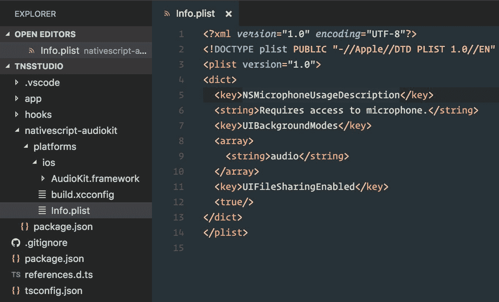
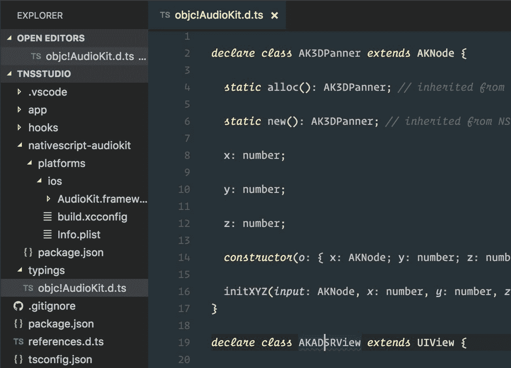
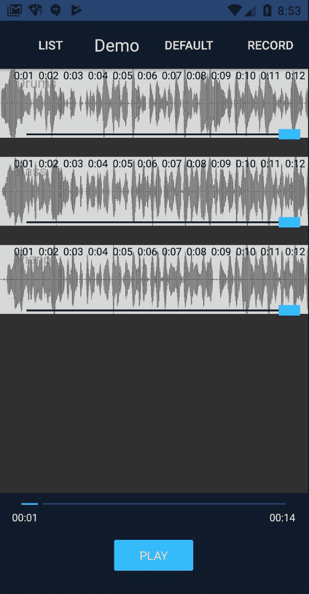

# 八、制作录音机

录制音频是我们的应用必须处理的性能最密集的操作。这也是访问本机 API 最有价值的特性之一。我们希望我们的用户能够在移动设备上以尽可能低的延迟进行录制，以实现最高的声音保真度。此外，此录制还可以选择在现有预录制曲目组合的顶部进行，所有曲目均同步播放。

由于我们应用开发的这一阶段将深入研究特定于平台的本机 API，因此我们将把实现分为两个阶段。我们将首先构建 iOS 特定的录音功能细节，然后是 Android。

在本章中，我们将介绍以下内容：

*   使用一致的 API 为 iOS 和 Android 构建功能丰富的跨平台录音机
*   集成 iOS 框架库，如 AudioKit（[http://audiokit.io](http://audiokit.io) ），完全由 Swift 建造
*   如何将 Swift/Objective C 方法转换为 NativeScript
*   基于本机 API 构建自定义的可重用 NativeScript 视图组件，以及如何在内部使用它们
*   配置可重复使用的角度组件，该组件既可以通过布线使用，也可以通过弹出模式打开
*   集成 Android Gradle 库
*   如何将 Java 方法转换为 NativeScript
*   在 NativeScript 的 ListView 中使用多个项模板

# 阶段 1–为 iOS 构建录音机

至少可以说，iOS 平台的音频功能令人印象深刻。一群才华横溢的音响发烧友和软件工程师合作，在平台的音频堆栈上构建了一个开源框架层。这项世界级的工程成果是令人惊叹的音频套件（[http://audiokit.io/](http://audiokit.io/) ），由无畏的 Aurelius Prochazka 领导，他是音频技术的真正先驱。

AudioKit 框架完全是用 Swift 编写的，它在与 NativeScript 集成时引入了几个有趣的表面级挑战。

# 挑战迂回-将基于 Swift 的库集成到 NativeScript 中

在撰写本文时，如果代码库通过所谓的**桥接头**将类和类型正确地公开给 Objective-C，NativeScript 可以与 Swift 一起工作，允许两种语言混合或匹配。您可以在此了解更多关于桥接头的内容：[https://developer.apple.com/library/content/documentation/Swift/Conceptual/BuildingCocoaApps/MixandMatch.html](https://developer.apple.com/library/content/documentation/Swift/Conceptual/BuildingCocoaApps/MixandMatch.html) 。 [](https://developer.apple.com/library/content/documentation/Swift/Conceptual/BuildingCocoaApps/MixandMatch.html) 当 Swift 代码库编译到框架中时，该桥接头自动生成。Swift 提供了丰富的语言功能，其中一些功能与 Objective C 没有直接关联。NativeScript 最终可能会提供对最新 Swift 语言增强功能的全功能支持，但在撰写本文时，需要考虑以下几点。

AudioKit 充分利用了 Swift 语言的优势，包括丰富的**枚举**功能。您可以在此处了解有关 Swift 语言中扩展的 enum 功能的更多信息：
[https://developer.apple.com/library/content/documentation/Swift/Conceptual/Swift_Programming_Language/Enumerations.html](https://developer.apple.com/library/content/documentation/Swift/Conceptual/Swift_Programming_Language/Enumerations.html)

文档中特别提到：“t*采用了许多传统上仅由类支持的功能，如计算属性以提供有关枚举当前值的附加信息，实例方法以提供与枚举表示的值相关的功能。*

此类*枚举*与目标 C 无关，因此无法在桥接标头中提供。在编译时生成桥接头时，任何使用 Swift 的外来*枚举*的代码都将被忽略，从而导致目标 C 无法与代码的这些部分交互。这意味着您将无法使用 NativeScript 中的 Swift 代码库中的方法，该代码库利用了这些现成的增强结构（*在撰写本文时*）。

为了解决这个问题，我们将分叉 AudioKit 框架，并展平`AKAudioFile`扩展文件中使用的外来枚举，这提供了一种功能强大且方便的导出方法，我们希望使用它来保存录制的音频文件。我们需要修改的外来*枚举*如下（[https://github.com/audiokit/AudioKit/blob/master/AudioKit/Common/Internals/Audio%20File/AKAudioFile%2BProcessingAsynchronously.swift](https://github.com/audiokit/AudioKit/blob/master/AudioKit/Common/Internals/Audio%20File/AKAudioFile%2BProcessingAsynchronously.swift) ：

```ts
// From AudioKit's Swift 3.x codebase

public enum ExportFormat {
  case wav
  case aif
  case mp4
  case m4a
  case caf

  fileprivate var UTI: CFString {
    switch self {
    case .wav:
      return AVFileTypeWAVE as CFString
    case .aif:
      return AVFileTypeAIFF as CFString
    case .mp4:
      return AVFileTypeAppleM4A as CFString
    case .m4a:
      return AVFileTypeAppleM4A as CFString
    case .caf:
      return AVFileTypeCoreAudioFormat as CFString
    }
  }

  static var supportedFileExtensions: [String] {
    return ["wav", "aif", "mp4", "m4a", "caf"]
  }
}
```

这与您可能熟悉的任何*枚举*不同；如您所见，除了枚举所具有的属性之外，它还包括属性。当编译此代码并生成桥接头以与 Objective-C 混合或匹配时，桥接头将排除使用此构造的任何代码。我们将把它展平，如下所示：

```ts
public enum ExportFormat: Int {
  case wav
  case aif
  case mp4
  case m4a
  case caf
}

static public func stringUTI(type: ExportFormat) -> CFString {
  switch type {
  case .wav:
    return AVFileTypeWAVE as CFString
  case .aif:
    return AVFileTypeAIFF as CFString
  case .mp4:
    return AVFileTypeAppleM4A as CFString
  case .m4a:
    return AVFileTypeAppleM4A as CFString
  case .caf:
    return AVFileTypeCoreAudioFormat as CFString
  }
}

static public var supportedFileExtensions: [String] {
  return ["wav", "aif", "mp4", "m4a", "caf"]
}
```

然后，我们将调整`AKAudioFile`扩展的部分以使用展平的属性。这将允许我们手动构建我们可以在应用中使用的`AudioKit.framework`，公开我们想要使用的方法：`exportAsynchronously`。

我们将不讨论手动构建`AudioKit.framework`的细节，因为这里有很好的文档记录：[https://github.com/audiokit/AudioKit/blob/master/Frameworks/INSTALL.md#building-从头开始的通用框架](https://github.com/audiokit/AudioKit/blob/master/AudioKit/Common/Internals/Audio%20File/AKAudioFile%2BProcessingAsynchronously.swift)。通过我们定制的框架，我们现在可以将其集成到我们的应用中。

# 将定制的 iOS 框架集成到 NativeScript 中

我们现在可以创建一个内部插件，将这个 iOS 框架集成到我们的应用中。以我们已经构建的自定义`AudioKit.framework`为例，在我们应用的根目录下创建一个`nativescript-audiokit`目录。然后我们在里面添加一个`platforms/ios`文件夹，将框架放入其中。这将让 NativeScript 知道如何将这些特定于 iOS 的文件构建到应用中。由于我们希望将此内部插件视为任何标准 npm 插件，因此我们还将直接在`nativescript-audiokit`文件夹中添加`package.json`，内容如下：

```ts
{
  "name": "nativescript-audiokit",
  "version": "1.0.0",
  "nativescript": {
    "platforms": {
      "ios": "3.0.0"
    }
  }
}
```

我们现在将使用以下命令将其添加到我们的应用中（NativeScript 将首先在本地查找并找到**NativeScript audiokit**插件）：

```ts
tns plugin add nativescript-audiokit
```

这将正确地将定制的 iOS 框架添加到我们的应用中。
但是，我们还需要两个非常重要的项目：

1.  由于 AudioKit 是基于 Swift 的框架，我们希望确保我们的应用包含适当的支持 Swift 库。添加新文件`nativescript-audiokit/platforms/ios/build.xcconfig`：

```ts
EMBEDDED_CONTENT_CONTAINS_SWIFT = true
```

2.  由于我们将使用用户的麦克风，因此我们希望确保在应用的属性列表中显示麦克风的使用情况。我们还将借此机会添加两个附加属性设置，以增强应用的功能。因此，我们总共将添加三个属性键，用于以下目的：
    *   让设备知道我们的应用需要访问麦克风，并确保在首次访问时请求用户的许可。
    *   如果将应用置于后台，则继续播放音频。
    *   当手机连接到电脑时，可以在 iTunes 中查看应用的`documents`文件夹。这将允许您通过应用的文档查看 iTunes 内部录制的文件。这可能有助于集成到桌面音频编辑软件中。

添加新文件`nativescript-audiokit/platforms/ios/Info.plist`，代码如下：

```ts
<?xml version="1.0" encoding="UTF-8"?>
<!DOCTYPE plist PUBLIC "-//Apple//DTD PLIST 1.0//EN" "http://www.apple.com/DTDs/PropertyList-1.0.dtd">
<plist version="1.0">
<dict>
  <key>NSMicrophoneUsageDescription</key>
 <string>Requires access to microphone.</string>
 <key>UIBackgroundModes</key>
 <array>
 <string>audio</string>
 </array>
 <key>UIFileSharingEnabled</key> 
 <true/>
</dict>
</plist>
```

下面是一个屏幕截图，可以更好地说明我们应用中的内部插件结构：



现在，当 NativeScript 构建 iOS 应用时，它将确保`AudioKit.framework`作为库包含，并将`build.xcconfig`和`Info.plist`的内容合并到我们的应用配置中。每当我们对这个内部插件文件夹（`nativescript-audiokit`中的文件进行更改时，我们都希望确保我们的应用能够接受这些更改。要做到这一点，我们只需删除并重新添加插件，现在让我们这样做：

```ts
tns plugin remove nativescript-audiokit
tns plugin add nativescript-audiokit
```

我们现在准备使用 AudioKit API for iOS 构建我们的录音机。

# 设置本机 API 类型检查并生成 AudioKit 类型脚本定义

我们要做的第一件事是安装`tns-platform-declarations`：

```ts
npm i tns-platform-declarations --save-dev
```

现在，我们在项目的根目录中创建一个名为`references.d.ts`的新文件，其内容如下：

```ts
/// <reference path="./node_modules/tns-platform-declarations/ios.d.ts" />
/// <reference path="./node_modules/tns-platform-declarations/android.d.ts" />
```

这为我们提供了 iOS 和 Android API 的完整类型检查和 intellisense 支持。

我们现在想要为 AudioKit 框架本身生成打字。我们可以执行此命令为包含的`AudioKit.framework`生成打字：

```ts
TNS_TYPESCRIPT_DECLARATIONS_PATH="$(pwd)/typings" tns build ios
```

我们正在将环境变量`TNS_TYPESCRIPT_DECLARATIONS_PATH`设置为当前工作目录（`pwd`，文件夹前缀为`typings`。当 NativeScript 创建 iOS 构建时，它还将为应用可用的所有本机 API（包括第三方库）生成类型定义文件。现在我们将看到一个`typings`文件夹出现在我们的项目中，其中包含两个文件夹：`i386`和`x86_64`。一个用于模拟器架构，另一个用于设备。两者都包含相同的输出，因此我们可以只关注其中一个。打开`i386`文件夹，您将找到一个`objc!AudioKit.d.ts`文件。

我们只想使用该文件，所以将其移动到`typings`文件夹的根目录：`typings/objc!AudioKit.d.ts`。然后我们可以删除`i386`和`x86_64`文件夹，因为我们不再需要它们（其他 API 定义文件通过`tns-platform-declarations`提供）。我们只是生成这些类型来获取 AudioKit 库的类型脚本定义。这是一次性的，可以轻松地与本机库集成，因此您可以安全地将此自定义`typings`文件夹添加到源代码管理中。

再次检查`tsconfig.json`并确保启用了`"skipLibCheck": true`选项。我们现在可以修改我们的`references.d.ts`文件，以包括 AudioKit 库的其他类型：

```ts
/// <reference path="./node_modules/tns-platform-declarations/ios.d.ts" />
/// <reference path="./node_modules/tns-platform-declarations/android.d.ts" />
/// <reference path="./typings/objc!AudioKit.d.ts" />
```

我们的项目结构现在应该如下所示：



# 用音频套件制作录音机

首先，我们将围绕与 AudioKit 录音 API 的交互创建一个模型。您可以直接从 Angular 组件或服务开始编写这些 API，但由于我们希望跨 iOS 和 Android 提供一致的 API，因此有一种更智能的方法来构建它。取而代之的是，我们将抽象一个简单的 API，它可以跨两个平台使用，它将在幕后利用正确的本机实现。

这里将有很多与 AudioKit 相关的有趣细节，但创建`app/modules/recorder/models/record.model.ts`时请使用以下内容，我们将在稍后解释其中的一些内容：

Later, we will add the `.ios.ts` suffix to this model, since it will contain iOS-specific implementation details. However, here in Phase 1, we will use the model directly (omitting the platform suffix) while we develop our iOS recorder.

```ts
import { Observable } from 'data/observable';
import { knownFolders } from 'file-system';

// all available states for the recorder 
export enum RecordState {
  readyToRecord,
  recording,
  readyToPlay,
  playing,
  saved,
  finish
}

// available events
export interface IRecordEvents {
  stateChange: string;
}

// for use when saving files
const documentsFilePath = function(filename: string) {
  return `${knownFolders.documents().path}/${filename}`;
}

export class RecordModel extends Observable {

  // available events to listen to
  private _events: IRecordEvents;

  // control nodes 
  private _mic: AKMicrophone;
  private _micBooster: AKBooster;
  private _recorder: AKNodeRecorder;

  // mixers
  private _micMixer: AKMixer;
  private _mainMixer: AKMixer;

  // state
  private _state: number = RecordState.readyToRecord;

  // the final saved path to use 
  private _savedFilePath: string;

  constructor() {
    super();
    // setup the event names
    this._setupEvents();

    // setup recording environment
    // clean any tmp files from previous recording sessions
    (<any>AVAudioFile).cleanTempDirectory();

    // audio setup 
    AKSettings.setBufferLength(BufferLength.Medium);

    try {
      // ensure audio session is PlayAndRecord
      // allows mixing with other tracks while recording
      AKSettings.setSessionWithCategoryOptionsError(
        SessionCategory.PlayAndRecord, 
        AVAudioSessionCategoryOptions.DefaultToSpeaker
      );
    } catch (err) {
      console.log('AKSettings error:', err);
    }

    // setup mic with it's own mixer
    this._mic = AKMicrophone.alloc().init();
    this._micMixer = AKMixer.alloc().init(null);
    this._micMixer.connect(this._mic);
    // Helps provide mic monitoring when headphones are plugged in
    this._micBooster = AKBooster.alloc().initGain(<any>this._micMixer, 0);

    try {
      // recorder takes the micMixer input node
      this._recorder = AKNodeRecorder.alloc()
        .initWithNodeFileError(<any>this._micMixer, null);
    } catch (err) {
      console.log('AKNodeRecorder init error:', err);
    }

    // overall main mixer uses micBooster
    this._mainMixer = AKMixer.alloc().init(null);
    this._mainMixer.connect(this._micBooster);

    // single output set to mainMixer 
    AudioKit.setOutput(<any>this._mainMixer);
    // start the engine!
    AudioKit.start();
  }

  public get events(): IRecordEvents {
    return this._events;
  }

  public get mic(): AKMicrophone {
    return this._mic;
  }

  public get recorder(): AKNodeRecorder {
    return this._recorder;
  }

  public get audioFilePath(): string {
    if (this._recorder) {
      return this._recorder.audioFile.url.absoluteString;
    }
    return '';
  }

  public get state(): number {
    return this._state;
  }

  public set state(value: number) {
    this._state = value;
    // always emit state changes
    this._emitEvent(this._events.stateChange, this._state);
  }

  public get savedFilePath() {
    return this._savedFilePath;
  }

  public set savedFilePath(value: string) {
    this._savedFilePath = value;
    if (this._savedFilePath)
      this.state = RecordState.saved;
  }

  public toggleRecord() {
    if (this._state !== RecordState.recording) {
      // just force ready to record
      // when coming from any state other than recording
      this.state = RecordState.readyToRecord;

      if (this._recorder) {
        try {
          // resetting (clear previous recordings)
          this._recorder.resetAndReturnError();
        } catch (err) {
          console.log('Recorder reset error:', err);
        }
      }
    }

    switch (this._state) {
      case RecordState.readyToRecord:
        if (AKSettings.headPhonesPlugged) {
          // Microphone monitoring when headphones plugged
          this._micBooster.gain = 1;
        }

        try {
          this._recorder.recordAndReturnError();
          this.state = RecordState.recording;
        } catch (err) {
          console.log('Recording failed:', err);
        }
        break;
      case RecordState.recording:
        this.state = RecordState.readyToPlay;
        this._recorder.stop();
        // Microphone monitoring muted when playing back
        this._micBooster.gain = 0;
        break;
    }
  } 

  public togglePlay() {
    if (this._state === RecordState.readyToPlay) {
      this.state = RecordState.playing;
    } else {
      this.stopPlayback();
    }
  }

  public stopPlayback() {
    if (this.state !== RecordState.recording) {
      this.state = RecordState.readyToPlay;
    }
  }

  public save() {
    let fileName = `recording-${Date.now()}.m4a`;
    this._recorder.audioFile
    .exportAsynchronouslyWithNameBaseDirExportFormatFromSampleToSampleCallback(
      fileName, BaseDirectory.Documents, ExportFormat.M4a, null, null, 
      (af: AKAudioFile, err: NSError) => {
        this.savedFilePath = documentsFilePath(fileName);
      });
  }

  public finish() {
    this.state = RecordState.finish;
  }

  private _emitEvent(eventName: string, data?: any) {
    let event = {
      eventName,
      data,
      object: this
    };
    this.notify(event);
  }

  private _setupEvents() {
    this._events = {
      stateChange: 'stateChange'
    };
  }
}
```

`RecordModel`的行为有点像状态机，它只能处于以下状态：

*   `readyToRecord`：默认启动状态。必须处于此状态才能进入录制状态。
*   `recording`：演播室里安静！正在录制。
*   `readyToPlay`：用户已停止录制，现在有一个录制的文件可用于播放混音。
*   `playing`：用户正在用混音回放录制的文件。
*   `saved`：用户选择保存录制，这将启动操作以保存带有活动合成的新曲目。
*   `finish`：一旦保存操作完成，记录器应关闭。

然后，我们定义记录器将提供的事件的形状`IRecordEvents`。在本例中，我们将有一个事件`stateChange`，当状态发生变化时，它将通知所有侦听器（*请参见状态设置器*。我们的模型将扩展 NativeScript 的`Observable`类（因此称为`RecordModel extends Observable`，它将为我们提供通知 API 来调度我们的事件。

然后，我们对我们将要使用的各种音频套件位设置了几个参考。设计的大部分内容都直接来自这个录音套件示例：[https://github.com/audiokit/AudioKit/blob/master/Examples/iOS/RecorderDemo/RecorderDemo/ViewController.swift](https://github.com/audiokit/AudioKit/blob/master/Examples/iOS/RecorderDemo/RecorderDemo/ViewController.swift) 。我们甚至使用相同的状态枚举设置（附带一些额外设置）。在他们的例子中，AudioKit 的`AKAudioPlayer`用于播放；但是，在我们的设计中，我们将把录制的文件加载到我们的多轨播放器设计中，用我们的混音播放它们。我们可以将 iOS 的`AKAudioPlayer`转换为`TrackPlayerModel`；但是，`TNSPlayer`（来自**nativescript audio**插件）是跨平台兼容的，可以正常工作。我们将很快介绍如何将这些新录制的文件加载到我们的设计中，但通知侦听器的状态将为我们提供在到达时处理所有这些问题所需的所有灵活性。

您可能想知道为什么我们要键入以下内容：

```ts
(<any>AVAudioFile).cleanTempDirectory();
```

好问题。AudioKIT 提供对核心基础类的扩展，如 AutoT0.这些被称为目标 C 中的`Categories`：[https://developer.apple.com/library/content/documentation/General/Conceptual/DevPedia-CocoaCore/Category.html](https://developer.apple.com/library/content/documentation/General/Conceptual/DevPedia-CocoaCore/Category.html) ；然而，在 Swift 中，它们被称为`Extensions`：[https://developer.apple.com/library/content/documentation/Swift/Conceptual/Swift_Programming_Language/Extensions.html](https://developer.apple.com/library/content/documentation/Swift/Conceptual/Swift_Programming_Language/Extensions.html) 。

如果您还记得，我们为 AudioKit 生成了 TypeScript 定义；但是，我们只保留了`objc!AudioKit.d.ts`文件以供参考。如果我们看了基础定义，我们就会看到扩展到 Ty1 T1。但是，由于我们没有保留这些定义，而是依赖于默认的`tns-platform-declarations`定义，因此我们的 TypeScript 编译器不知道这个`Extension`，所以我们只需输入 cast，因为我们知道 AudioKit 提供了这个功能。

同样重要的是`RecordModel`将音频会话设置为`PlayAndRecord`，因为这将允许我们在播放混音的同时进行录制：

```ts
AKSettings.setSessionWithCategoryOptionsError(
  SessionCategory.PlayAndRecord, 
  AVAudioSessionCategoryOptions.DefaultToSpeaker
);
```

您可能还想知道为什么有些类使用`init()`而其他类使用`init(null)`：

```ts
this._mic = AKMicrophone.alloc().init();
this._micMixer = AKMixer.alloc().init(null);
this._micMixer.connect(this._mic);
```

AudioKit 类的一些初始值设定项采用可选参数，例如，`AKMixer`采用`AVAudioNode`的可选`NSArray`进行连接。但是，我们的 TypeScript 定义是根据需要定义的，因此我们只是将`null`传递给该参数，而直接使用`connect`节点 API。

# 如何将 Swift/ObjC 方法转换为 NativeScript

`RecordModel`的最后一个关注点可能是`save`方法，它将我们的录音从应用的`tmp`目录导出到应用的`documents`文件夹，同时将其转换为较小的文件大小`.m4a`音频格式：

```ts
this._recorder.audioFile
  .exportAsynchronouslyWithNameBaseDirExportFormatFromSampleToSampleCallback(
    fileName, BaseDirectory.Documents, ExportFormat.M4a, null, null, 
    (af: AKAudioFile, err: NSError) => {
      this.savedFilePath = documentsFilePath(fileName);
  });
```

长方法名，对吗？是的，的确如此；一些 Swift/ObjC 参数化方法名称会崩溃，变得非常长。Swift 中的特定方法定义如下：

```ts
exportAsynchronously(name:baseDir:exportFormat:fromSample:toSample:callback:)
// converted to NativeScript:
exportAsynchronouslyWithNameBaseDirExportFormatFromSampleToSampleCallback
```

因为我们为 AudioKit 生成了 TypeScript 定义，所以他们在这里帮助了我们。然而，有时候，你没有那种奢侈。具有参数的各种参数的 Swift/ObjC 方法相互折叠，同时在方法名称的开头和参数参数名称的开头之间添加`With`，同时在折叠每个参数时将第一个字符大写。

# 构建用于本机音频波形显示的自定义可重用 NativeScript 视图

我们不会为波形显示创建角度组件，而是创建一个定制的 NativeScript 视图组件，该组件可接入本机 API，然后我们可以向 Angular 注册以在组件中使用。之所以这样做，是因为我们可以扩展 NativeScript 强大的`view`基类，它在为`view`使用底层本机 API 时提供了一个很好的 API。该波形显示将与我们刚刚创建的`RecordModel`协同工作，以实现设备麦克风的实时波形反馈显示。在我们的曲目列表中将这个波形显示作为静态音频文件波形呈现，作为我们的主合成视图的替代视图，这也将是令人惊讶的。AudioKit 提供类和 API 来完成所有这些。

由于我们希望能够在应用的任何地方使用它，我们将在共享模块目录中创建它；但是，请记住，它可以生活在任何地方。这在这里并不重要，因为这不是一个需要在`NgModule`中声明的角度分量。此外，由于这将专门用于本机 API，因此让我们在一个新的`native`文件夹中创建它，以可能容纳其他特定于 NativeScript 的视图组件。

用以下内容创建`app/modules/shared/native/waveform.ts`，我们稍后会解释：

```ts
import { View, Property } from 'ui/core/view';
import { Color } from 'color';

// Support live microphone display as well as static audio file renders
type WaveformType = 'mic' | 'file';

// define properties
export const plotColorProperty = new Property<Waveform, string>({ name: 'plotColor' });
export const plotTypeProperty = new Property<Waveform, string>({ name: 'plotType' });
export const fillProperty = new Property<Waveform, string>({ name: 'fill' });
export const mirrorProperty = new Property<Waveform, string>({ name: 'mirror' });

export interface IWaveformModel {
  readonly target: any;
  dispose(): void;
}
export class Waveform extends View {
  private _model: IWaveformModel;
  private _type: WaveformType;

  public set type(value: WaveformType) {
    this._type = value;
  }

  public get type() {
    return this._type;
  }

  public set model(value: IWaveformModel) {
    this._model = value;
  }

  public get model() {
    return this._model;
  }

  createNativeView() {
    switch (this.type) {
      case 'mic':
        this.nativeView = AKNodeOutputPlot.alloc()
          .initFrameBufferSize(this._model.target, CGRectMake(0, 0, 0, 0), 1024);
        break;
      case 'file':
        this.nativeView = EZAudioPlot.alloc().init();
        break;
    }
    return this.nativeView;
  }

  initNativeView() {
    if (this._type === 'file') {
      // init file with the model's target
      // target should be absolute url to path of file
      let file = EZAudioFile.alloc()
        .initWithURL(NSURL.fileURLWithPath(this._model.target));
      // render the file's data as a waveform
      let data = file.getWaveformData();
      (<EZAudioPlot>this.nativeView)
        .updateBufferWithBufferSize(data.buffers[0], data.bufferSize);
    }
  }

  disposeNativeView() {
    if (this.model && this.model.dispose) this.model.dispose();
  }

  [plotColorProperty.setNative](value: string) {
    this.nativeView.color = new Color(value).ios;
  }

  [fillProperty.setNative](value: string) {
    this.nativeView.shouldFill = value === 'true';
  }

  [mirrorProperty.setNative](value: string) {
    this.nativeView.shouldMirror = value === 'true';
  }

  [plotTypeProperty.setNative](value: string) {
    switch (value) {
      case 'buffer':
        this.nativeView.plotType = EZPlotType.Buffer;
        break;
      case 'rolling':
        this.nativeView.plotType = EZPlotType.Rolling;
        break;
    }
  }
}

// register properties with it's type
plotColorProperty.register(Waveform);
plotTypeProperty.register(Waveform);
fillProperty.register(Waveform);
mirrorProperty.register(Waveform);
```

我们正在使用 NativeScript 的`Property`类创建几个属性，这将为通过视图绑定属性公开本机视图属性增加极大的便利。在使用`Property`类定义这些属性时，这些设置器只有在`nativeView`被定义时才会被调用，避免了双重调用的属性设置器（一个通过纯 JS 属性设置器，这是可选的，另一个可能是在基础`nativeView`准备就绪时）。

When wanting to expose native view properties that could be bound via your custom component, define several `Property` classes for them, referencing the name you'd like to use for the view binding.

```ts
// define properties
export const plotColorProperty = new Property<Waveform, string>({ name: 'plotColor' });
export const plotTypeProperty = new Property<Waveform, string>({ name: 'plotType' });
export const fillProperty = new Property<Waveform, string>({ name: 'fill' });
export const mirrorProperty = new Property<Waveform, string>({ name: 'mirror' });
```

通过设置这些`Property`实例，我们现在可以在视图组件类中执行此操作：

```ts
[plotColorProperty.setNative](value: string) {
  this.nativeView.color = new Color(value).ios;
}
```

只有在`nativeView`准备就绪后才会调用，这正是我们想要的。在核心团队成员 Alex Vakrilov 撰写的草案中，您可以阅读更多关于这种特殊语法和符号的信息：
[https://gist.github.com/vakrilov/ca888a1ea410f4ea7a4c7b2035e06b07#registering-物业](https://gist.github.com/vakrilov/ca888a1ea410f4ea7a4c7b2035e06b07#registering-the-property)。

然后，在类的底部（定义之后），我们用`Property`实例注册该类：

```ts
// register properties
plotColorProperty.register(Waveform);
plotTypeProperty.register(Waveform);
fillProperty.register(Waveform);
mirrorProperty.register(Waveform);
```

好的，在解释了这些之后，让我们看看这个实现的其他一些元素。

我们在这里还介绍了一个有用的界面，稍后我们将应用于`RecordModel`：

```ts
export interface IWaveformModel {
  readonly target: any;
  dispose(): void;
}
```

这将有助于定义其他模型要实现的形状，确保它们符合波形显示所需的 API：

*   `target`：定义与本机类一起使用的键输入。
*   `dispose()`：每个模型都应提供此方法来处理视图被破坏时的任何清理。

This is the custom NativeScript 3.x View Life cycle call execution order:

1.  `createNativeView()`:`AnyNativeView;`//创建本地视图。

2.  `initNativeView()`:`void;`//初始化您的本地视图。

3.  `disposeNativeView()`:`void;`//清理您的本地视图。

从 NativeScript 的`View`类重写的`createNativeView`方法可能是最有趣的：

```ts
createNativeView() {
  switch (this.type) {
    case 'mic':
      this.nativeView = AKNodeOutputPlot.alloc()
        .initFrameBufferSize(this._model.target, CGRectMake(0, 0, 0, 0), 1024);
      break;
    case 'file':
      this.nativeView = EZAudioPlot.alloc().init();
      break;
  }
  return this.nativeView;
}
```

这里，我们允许`type`属性确定它应该呈现哪种类型的波形显示。
在`mic`的情况下，我们利用 AudioKit 的`AKNodeOutputPlot`（实际上在引擎盖下延伸了`EZAudioPlot`来初始化波形（即`audioplot`），使用我们模型的目标，这将最终成为我们 RecordModel 的麦克风。
在`file`的情况下，我们直接利用 AudioKit 的`EZAudioPlot`来创建表示音频文件的静态波形。

`initNativeView`方法也是从 NativeScript 的`View`类重写的，在其生命周期中被称为第二个方法，它提供了一种初始化本机视图的方法。你可能会发现有趣的是，我们在这里再次调用 setters。当通过 XML 设置组件绑定并实例化类时，首先调用 setter，即在调用`createNativeView`和`initNativeView`之前调用*。这就是我们将值缓存在私有引用中的原因。但是，我们也希望这些设置器使用 Angular 的视图绑定修改`nativeView`（动态更改时），这就是为什么我们在设置器中还有`if (this.nativeView)`可以在可用时动态更改`nativeView`。*

当`View`被销毁时，调用`disposeNativeView`方法（您猜到了，也是从`View`类的`{N}`中重写的），这就是我们调用模型的`dispose`方法（如果可用）的地方。

# 将自定义 NativeScript 视图集成到我们的 Angular 应用中

要在 Angular 中使用 NativeScript 波形视图，我们需要首先注册它。您可以在根模块、根应用组件或在启动时初始化的其他位置（通常不是在延迟加载的模块中）执行此操作。为了保持整洁，我们将在同一目录的`SharedModule`中注册，因此在`app/modules/shared/shared.module.ts`中添加以下内容：

```ts
...
// register nativescript custom components
import { registerElement } from 'nativescript-angular/element-registry';
import { Waveform } from './native/waveform';
registerElement('Waveform', () => Waveform);
...
@NgModule({...
export class SharedModule {...
```

`registerElement`方法允许我们定义要在 Angular components 中使用的组件的名称作为第一个参数，并接受一个解析器函数，该函数应返回用于它的 NativeScript`View`类。

现在让我们使用新的`IWaveformModel`并清理一些`RecordModel`来使用它，同时准备下一步创建我们的 Android 实现。让我们将`RecordModel`中的一些东西重构成一个公共文件，以便在 iOS 和 Android（即将推出！）模型之间共享代码。

创建`app/modules/recorder/models/record-common.ts`：

```ts
import { IWaveformModel } from '../../shared/native/waveform';
import { knownFolders } from 'file-system';

export enum RecordState {
  readyToRecord,
  recording,
  readyToPlay,
  playing,
  saved,
  finish
}

export interface IRecordEvents {
  stateChange: string;
}

export interface IRecordModel extends IWaveformModel {
  readonly events: IRecordEvents;
  readonly recorder: any;
  readonly audioFilePath: string;
  state: number; 
  savedFilePath: string;
  toggleRecord(): void;
  togglePlay(startTime?: number, when?: number): void;
  stopPlayback(): void;
  save(): void;
  finish(): void;
}

export const documentsFilePath = function(filename: string) {
  return `${knownFolders.documents().path}/${filename}`;
}
```

这包含了`RecordModel`顶部的大部分内容，并添加了`IRecordModel`接口，该接口扩展了`IWaveformModel`。自从我们构建了 iOS 实现以来，我们现在有了一个模型形状，希望我们的 Android 实现能够遵循。将该形状抽象为一个界面将为我们提供一条清晰的路径，以便在我们暂时转向 Android 时遵循。

为了方便起见，我们还将为我们的模型创建一个索引，该索引还将在`app/modules/recorder/models/index.ts`中公开此公共文件：

```ts
export * from './record-common.model';
export * from './record.model';
```

我们现在可以修改`RecordModel`来导入这些常用项，并实现这个新的`IRecordModel`接口。由于这个新接口也*扩展了*`IWaveformModel`，它会立即告诉我们需要实现`readonly target`**getter 和`dispose()`**方法，这是我们波形视图需要使用的：****

 ****```ts
import { Observable } from 'data/observable';
import { IRecordModel, IRecordEvents, RecordState, documentsFilePath } from './common';

export class RecordModel extends Observable implements IRecordModel {
  ...
  public get target() {
 return this._mic;
 }

  public dispose() {
 AudioKit.stop();
 // cleanup
 this._mainMixer = null;
 this._recorder = null;
 this._micBooster = null;
 this._micMixer = null;
 this._mic = null;
 // clean out tmp files
 (<any>AVAudioFile).cleanTempDirectory();
 }
  ...
```

`RecordModel`的`target`将是波形视图将使用的麦克风。我们的`dispose`方法将在执行参考清理时停止 AudioKit 引擎，并确保清理录制时创建的任何临时文件。

# 创建记录器视图布局

当用户点击应用右上角的记录时，它会提示用户进行身份验证，然后应用将路由到记录视图。此外，最好在模式弹出窗口中重用此记录视图，以显示合成包含曲目的时间，这样用户就不会觉得他们在录制时离开了合成。但是，当合成是新的时，可以通过路由导航到记录视图。我们将展示如何做到这一点，但首先让我们使用新的奇特波形视图和强大的新`RecordModel`设置布局。

在`app/modules/recorder/components/record.component.html`中添加以下内容：

```ts
<ActionBar title="Record" icon="" class="action-bar">
  <NavigationButton visibility="collapsed"></NavigationButton>
  <ActionItem text="Cancel" 
    ios.systemIcon="1" android.systemIcon="ic_menu_back" 
    (tap)="cancel()"></ActionItem>
</ActionBar>
<FlexboxLayout class="record">
  <GridLayout rows="auto" columns="auto,*,auto" class="p-10" *ngIf="isModal">
    <Button text="Cancel" (tap)="cancel()" 
      row="0" col="0" class="c-white"></Button>
  </GridLayout>
  <Waveform class="waveform" 
    [model]="recorderService.model" 
    type="mic" 
    plotColor="yellow" 
    fill="false" 
    mirror="true" 
    plotType="buffer">
  </Waveform>
  <StackLayout class="p-5">
    <FlexboxLayout class="controls">
      <Button text="Rewind" class="btn text-center" 
        (tap)="recorderService.rewind()" 
        [isEnabled]="state == recordState.readyToPlay || state == recordState.playing">
      </Button>
      <Button [text]="recordBtn" class="btn text-center" 
        (tap)="recorderService.toggleRecord()" 
        [isEnabled]="state != recordState.playing"></Button>
      <Button [text]="playBtn" class="btn text-center" 
        (tap)="recorderService.togglePlay()" 
        [isEnabled]="state == recordState.readyToPlay || state == recordState.playing">
      </Button>
    </FlexboxLayout>
    <FlexboxLayout class="controls bottom" 
      [class.recording]="state == recordState.recording">
      <Button text="Save" class="btn" 
        [class.save-ready]="state == recordState.readyToPlay" 
        [isEnabled]="state == recordState.readyToPlay"
        (tap)="recorderService.save()"></Button>
    </FlexboxLayout>
  </StackLayout>
</FlexboxLayout>
```

我们之所以使用`FlexboxLayout`，是因为我们希望波形视图能够延伸到整个可用的垂直空间，只留下位于底部的记录器控件。`FlexboxLayout`是一个非常通用的布局容器，它提供了和 web 上 flexbox 模型相同的大多数 CSS 样式属性。

有趣的是，我们在`GridLayout`容器中仅当显示为模态时才显示取消按钮，因为我们需要一种关闭模态的方法。通过模式打开视图时，操作栏将被忽略且不显示。

ActionBars are ignored when the view is opened via a modal, so they are not displayed in the modal. `ActionBar` is shown on navigated views only.

此外，我们的`ActionBar`设置在这里相当有趣，并且是 iOS 和 Android 差异最大的 NativeScript 视图布局领域之一。在 iOS 上，`NavigationButton`有一个默认行为，即自动从堆栈中弹出视图，并设置动画返回到上一个视图。此外，iOS 上的`NavigationButton`上的任何点击事件都会被完全忽略，而 Android 上的`NavigationButton`会触发点击事件。由于这一关键差异，我们希望通过使用`visibility="collapsed"`来完全忽略`ActionBar`的`NavigationButton`，以确保它永远不会显示。相反，我们将`ActionItem`与显式 tap 事件一起使用，以确保在两个平台的组件上触发正确的逻辑。

`NavigationButton` behavior on iOS and Android is different:

*   **iOS**：`NavigationButton`忽略（点击）事件，导航到视图时默认显示此按钮。

*   **安卓**：`NavigationButton`（点击）事件被触发。

您可以在这里看到正在使用的波形（自定义 NativeScript）视图。我们在绑定模型时使用 Angular 的绑定语法，因为它是一个对象。对于其他属性，我们直接指定它们的值，因为它们是基本值。然而，如果我们想通过用户交互动态地更改这些值，我们也可以对这些值使用 Angular 的绑定语法。例如，我们可以展示一个有趣的颜色选择器，它允许用户动态更改波形的颜色（`plotColor`。

我们将为记录组件`app/modules/recorder/components/record.component.css`提供特定于组件的样式表：

```ts
.record {
  background-color: rgba(0,0,0,.5);
  flex-direction: column;
  justify-content: space-around;
  align-items: stretch;
  align-content: center;
}

.record .waveform {
  background-color: transparent;
  order: 1;
  flex-grow: 1;
}

.controls {
  width: 100%;
  height: 200;
  flex-direction: row;
  flex-wrap: nowrap;
  justify-content: center;
  align-items: center;
  align-content: center;
}

.controls.bottom {
  height: 90;
  justify-content: flex-end;
}

.controls.bottom.recording {
  background-color: #B0342D;
}

.controls.bottom .btn {
  border-radius: 40;
  height: 62;
  padding: 2;
}

.controls.bottom .btn.save-ready {
  background-color: #42B03D;
}

.controls .btn {
  color: #fff;
}

.controls .btn[isEnabled=false] {
  background-color: transparent;
  color: #777;
}
```

如果您在 web 上使用过 flexbox 模型，这些 CSS 属性中的一些可能看起来很熟悉。了解更多关于 flexbox 样式的有趣资源是 Dave Geddes 的 flexbox 僵尸：[http://flexboxzombies.com](http://flexboxzombies.com.) 。

在这一点上，我们的 CSS 开始增长，我们可以用 SASS 清理很多东西。我们马上就来，坚持住！

现在，让我们看一下在 Tyt T0:

```ts
// angular
import { Component, OnInit, OnDestroy, Optional } from '@angular/core';

// libs
import { Subscription } from 'rxjs/Subscription';

// nativescript
import { RouterExtensions } from 'nativescript-angular/router';
import { ModalDialogParams } from 'nativescript-angular/directives/dialogs';
import { isIOS } from 'platform';

// app
import { RecordModel, RecordState } from '../models';
import { RecorderService } from '../services/recorder.service';

@Component({
  moduleId: module.id,
  selector: 'record',
  templateUrl: 'record.component.html',
  styleUrls: ['record.component.css']
})
export class RecordComponent implements OnInit, OnDestroy { 
  public isModal: boolean;
  public recordBtn: string = 'Record';
  public playBtn: string = 'Play';
  public state: number;
  public recordState: any = {};

  private _sub: Subscription;

  constructor(
    private router: RouterExtensions,
    @Optional() private params: ModalDialogParams,
    public recorderService: RecorderService
  ) { 
    // prepare service for brand new recording
    recorderService.setupNewRecording();

    // use RecordState enum names as reference in view
    for (let val in RecordState ) {
      if (isNaN(parseInt(val))) {
        this.recordState[val] = RecordState[val];
      }
    }
  }

  ngOnInit() {
    if (this.params && this.params.context.isModal) {
      this.isModal = true;
    }
    this._sub = this.recorderService.state$.subscribe((state: number) => {
      this.state = state;
      switch (state) {
        case RecordState.readyToRecord:
        case RecordState.readyToPlay:
          this._resetState();
          break;
        case RecordState.playing:
          this.playBtn = 'Pause';
          break;
        case RecordState.recording:
          this.recordBtn = 'Stop';
          break;
        case RecordState.finish:
          this._cleanup();
          break;
      }
    });
  }

  ngOnDestroy() {
    if (this._sub) this._sub.unsubscribe();
  }

  public cancel() {
    this._cleanup();
  }

  private _cleanup() {
    this.recorderService.cleanup();
    invokeOnRunLoop(() => {
      if (this.isModal) {
        this._close();
      } else {
        this._back();
      }
    });
  }

  private _close() {
    this.params.closeCallback();
  }

  private _back() {
    this.router.back();
  }

  private _resetState() {
    this.recordBtn = 'Record';
    this.playBtn = 'Play';
  }
}

/**
 * Needed on iOS to prevent this potential exception:
 * "This application is modifying the autolayout engine from a background thread after the engine was accessed from the main thread. This can lead to engine corruption and weird crashes."
 */
const invokeOnRunLoop = (function () {
  if (isIOS) {
    var runloop = CFRunLoopGetMain();
    return function(func) {
      CFRunLoopPerformBlock(runloop, kCFRunLoopDefaultMode, func);
      CFRunLoopWakeUp(runloop);
    }
  } else {
    return function (func) {
      func();
    }
  }
}());
```

从该文件的底部开始，您可能会想知道`invokeOnRunLoop`到底是什么*。*这是一种简便的方法，可以在螺纹可能会露出丑陋头部的情况下确保螺纹安全。在本例中，AudioKit 的引擎从`RecordModel`中的 UI 线程启动，因为 NativeScript 封送 UI 线程上的本机调用。然而，当我们的记录视图关闭时（无论它是从我们返回的模式视图），一些后台线程被调用。用`invokeOnRunLoop`包装我们关闭此视图的处理有助于解决此暂时异常。这是如何将 iOS`dispatch_async(dispatch_get_main_queue(…))`与 NativeScript 一起使用的答案。

在文件中，我们将遇到`this.recorderService.state$.subscribe((state: number) => …`。稍后，我们将实现一种将记录`state$`作为可观察对象进行观察的方法，因此我们的视图可以简单地对其状态变化做出反应。

同样值得注意的是，这是一种将`RecordState enum`折叠为属性的简便方法，我们可以将其用作视图绑定，以与当前状态（`this.state = state;`）进行比较。

构建组件时，`recorderService.setupNewRecording()`将为每次出现此视图时的全新录制做好准备。

最后，注意`@Optional()private params: ModalDialogParams`*的注入。*之前，我们提到*在模式弹出*中重用此记录视图会很好。有趣的是，`ModalDialogParams`仅在组件以模式打开时提供给组件。换句话说，Angular 的依赖注入不知道任何关于`ModalDialogParams`服务的信息，除非该组件是通过 NativeScript 的`ModalService`显式打开的，因此这将破坏我们最初设置的路由到此组件的能力，因为 Angular 的 DI 默认情况下无法识别这样的提供者。为了允许该组件继续作为路由组件工作，我们只需将该参数标记为`@Optional()`，它将在不可用时将其值设置为 null，而不是抛出依赖项注入错误。

这将允许我们的组件路由到，以及在模式中打开！如火如荼地重复使用！

为了有条件地通过路由导航到此组件，或者在模式中打开它，我们可以进行一些小的调整，记住`RecorderModule`是延迟加载的，所以我们希望在将其作为模式打开之前延迟加载模块。

打开`app/modules/mixer/components/action-bar/action-bar.component.ts`并进行以下修改：

```ts
// angular
import { Component, Input, Output, EventEmitter } from '@angular/core';

// nativescript
import { RouterExtensions } from 'nativescript-angular/router'; 

import { PlayerService } from '../../../player/services/player.service';

@Component({
  moduleId: module.id,
  selector: 'action-bar',
  templateUrl: 'action-bar.component.html'
})
export class ActionBarComponent {
  ...
  @Output() showRecordModal: EventEmitter<any> = new EventEmitter();
  ...
  constructor(
    private router: RouterExtensions,
 private playerService: PlayerService
  ) { }

  public record() {
 if (this.playerService.composition && 
 this.playerService.composition.tracks.length) {
      // display recording UI as modal
 this.showRecordModal.next();
 } else {
      // navigate to it
 this.router.navigate(['/record']);
 }
 }
}
```

在这里，如果组合包含轨迹，我们有条件地使用带有组件`Output`装饰器的`EventEmitter`发出一个事件；否则，我们将导航到记录视图。然后我们在视图模板中调整`Button`以使用以下方法：

```ts
<ActionItem (tap)="record()" ios.position="right">
  <Button text="Record" class="action-item"></Button>
</ActionItem>
```

我们现在可以将`app/modules/mixer/components/mixer.component.html`修改为将`Output`按其名称作为正常事件使用：

```ts
<action-bar [title]="composition.name" (showRecordModal)="showRecordModal()"></action-bar>
<GridLayout rows="*, auto" columns="*" class="page">
  <track-list [tracks]="composition.tracks" row="0" col="0"></track-list>
  <player-controls [composition]="composition" row="1" col="0"></player-controls>
</GridLayout>
```

现在来看有趣的部分。既然我们希望能够打开模式中的任何组件，不管它是否是延迟加载模块的一部分，那么让我们为`DialogService`添加一个新方法，该方法可以在任何地方使用。

对`app/modules/core/services/dialog.service.ts`进行以下更改：

```ts
// angular
import { Injectable, NgModuleFactory, NgModuleFactoryLoader, ViewContainerRef, NgModuleRef } from '@angular/core';

// nativescript
import * as dialogs from 'ui/dialogs';
import { ModalDialogService } from 'nativescript-angular/directives/dialogs';

@Injectable()
export class DialogService {

  constructor(
 private moduleLoader: NgModuleFactoryLoader,
 private modalService: ModalDialogService
 ) { }

  public openModal(componentType: any, vcRef: ViewContainerRef, context?: any, modulePath?: string): Promise<any> {
 return new Promise((resolve, reject) => {

 const launchModal = (moduleRef?: NgModuleRef<any>) => {
 this.modalService.showModal(componentType, {
 moduleRef,
 viewContainerRef: vcRef,
 context
 }).then(resolve, reject);
 };

      if (modulePath) {
        // lazy load module which contains component to open in modal
        this.moduleLoader.load(modulePath)
 .then((module: NgModuleFactory<any>) => {
 launchModal(module.create(vcRef.parentInjector));
 });
 } else {
        // open component in modal known to be available without lazy loading
        launchModal();
 }
 });
 }
  ...
}
```

在这里，我们注入了`ModalDialogService`和`NgModuleFactoryLoader`（实际上是`NSModuleFactoryLoader`，因为，如果您还记得的话，我们在[第 5 章](05.html#1T1400-289fe2426d594f99a90e4363b2c9c34d)、*路由和延迟加载*中提供了这两种方法，可以根据需要加载任何模块，以在模式中打开组件（在延迟加载的模块中声明）。*它也适用于不需要延迟加载的组件*。换句话说，如果提供，它将选择性地按照其路径惰性加载任何模块，然后使用其`NgModuleFactory`获取模块引用，我们可以将其作为选项（通过`moduleRef`键）传递到`this.modalService.showModal`，以打开在该惰性加载模块中声明的组件。

这将在以后再次派上用场；但是，现在我们对`app/modules/mixer/components/mixer.component.ts`进行以下更改，以使用它：

```ts
// angular
import { Component, OnInit, OnDestroy, ViewContainerRef } from '@angular/core';
import { ActivatedRoute } from '@angular/router';
import { Subscription } from 'rxjs/Subscription';

// app
import { DialogService } from '../../core/services/dialog.service';
import { MixerService } from '../services/mixer.service';
import { CompositionModel } from '../../shared/models';
import { RecordComponent } from '../../recorder/components/record.component';

@Component({
 moduleId: module.id,
 selector: 'mixer',
 templateUrl: 'mixer.component.html'
})
export class MixerComponent implements OnInit, OnDestroy {

  public composition: CompositionModel;
  private _sub: Subscription;

  constructor(
    private route: ActivatedRoute,
    private mixerService: MixerService,
    private dialogService: DialogService,
 private vcRef: ViewContainerRef
  ) { }

  public showRecordModal() {
 this.dialogService.openModal(
      RecordComponent,
      this.vcRef,
      { isModal: true },
      './modules/recorder/recorder.module#RecorderModule'
    );
 }
  ...
}
```

这将延迟加载`RecorderModule`，然后以弹出模式打开`RecordComponent`。凉的

# 使用 RecorderService 完成实现

现在，让我们用`app/modules/recorder/services/recorder.service.ts`中的`RecorderService`来完成这个实现：

```ts
// angular
import { Injectable } from '@angular/core';
import { Subject } from 'rxjs/Subject';
import { Subscription } from 'rxjs/Subscription';

// app
import { DialogService } from '../../core/services/dialog.service';
import { RecordModel, RecordState } from '../models';
import { PlayerService } from '../../player/services/player.service';
import { TrackModel } from '../../shared/models/track.model';

@Injectable()
export class RecorderService {
  public state$: Subject<number> = new Subject();
  public model: RecordModel;
  private _trackId: number;
  private _sub: Subscription;

  constructor(
    private playerService: PlayerService,
    private dialogService: DialogService
  ) { } 

  public setupNewRecording() {
    this.model = new RecordModel();
    this._trackId = undefined; // reset

    this.model.on(this.model.events.stateChange, this._stateHandler.bind(this));
    this._sub = this.playerService.complete$.subscribe(_ => {
      this.model.stopPlayback();
    });
  }

  public toggleRecord() {
    this.model.toggleRecord();
  }

  public togglePlay() {
    this.model.togglePlay();
  }

  public rewind() {
    this.playerService.seekTo(0); // reset to 0
  }

  public save() {
    this.model.save();
  }

  public cleanup() {
    // unbind event listener
    this.model.off(this.model.events.stateChange, this._stateHandler.bind(this));
    this._sub.unsubscribe();

    if (!this.model.savedFilePath) {
      // user did not save recording, cleanup
      this.playerService.removeTrack(this._trackId);
    }
  }

  private _stateHandler(e) {
    this.state$.next(e.data);

    switch (e.data) {
      case RecordState.readyToRecord:
        this._stopMix();
        break; 
      case RecordState.readyToPlay:
        this._stopMix();
        this._trackId = this.playerService
          .updateCompositionTrack(this._trackId, this.model.audioFilePath);
        break;
      case RecordState.playing:
        this._playMix();
        break;
      case RecordState.recording:
        this._playMix(this._trackId);
        break;
      case RecordState.saved:
        this._handleSaved();
        break;
    }
  }

  private _playMix(excludeTrackId?: number) {
    if (!this.playerService.playing) {
      // ensure mix plays
      this.playerService.togglePlay(excludeTrackId);
    }
  }

  private _stopMix() {
    if (this.playerService.playing) {
      // ensure mix stops
      this.playerService.togglePlay();
    }
    // always reset to beginning
    this.playerService.seekTo(0);
  }

  private _handleSaved() {
    this._sub.unsubscribe();
    this._stopMix();
    this.playerService
      .updateCompositionTrack(this._trackId, this.model.savedFilePath);
    this.playerService.saveComposition();
    this.model.finish();
  } 
}
```

我们录音服务的最高点是它能够对模型的状态变化做出反应。这反过来会在状态改变时发出可观察流通知观察者（我们的`RecordComponent`，并在内部执行控制`RecordModel`和`PlayerService`所需的工作。我们设计的关键在于，我们希望在录制时，我们的活跃作品的曲目在背景中播放，这样我们就可以与混音一起播放。这个案例很重要：

```ts
case RecordState.readyToPlay:
  this._stopMix();
  this._trackId = this.playerService
    .updateCompositionTrack(this._trackId, this.model.audioFilePath);
  break;
```

当`RecordModel`为`readyToPlay`时，我们知道已经创建了录音，现在可以播放了。我们停止播放混音，获取对录制文件路径的引用。然后，我们更新`PlayerService`以排队播放新曲目。稍后我们将显示更新后的`PlayerService`，它处理将新文件添加到混音中的操作，但它会像我们混音中的其他内容一样添加一个新的`TrackPlayer`。但是，该文件此时指向一个临时录制的文件，因为在用户决定正式提交并保存录制之前，我们不想保存合成。如果用户对录制不满意，录制会话将允许用户重新录制。这就是为什么我们提到`_trackId`。如果已经在混音中添加了录音，我们在重新录制时使用该`_trackId`将其排除，因为我们不希望听到我们正在重新录制的录音：

```ts
case RecordState.recording:
  this._playMix(this._trackId);
  break;
```

如果用户选择取消而不是保存，我们也会使用它来清理：

```ts
public cleanup() {
  // unbind event listener
  this.model.off(this.model.events.stateChange, this._stateHandler.bind(this));
  this._sub.unsubscribe();

  if (!this.model.savedFilePath) {
    // user did not save recording, cleanup
    this.playerService.removeTrack(this._trackId);
  }
}
```

让我们来看看我们需要做的修改以支持我们的录音：

```ts
...
import { MixerService } from '../../mixer/services/mixer.service';

@Injectable()
export class PlayerService {

  // default name of new tracks
  private _defaultTrackName: string = 'New Track';
  ...
  constructor(
    private ngZone: NgZone,
    private mixerService: MixerService
  ) { ... }
  ...
  public saveComposition() {
 this.mixerService.save(this.composition);
 }

  public togglePlay(excludeTrackId?: number) {
    if (this._trackPlayers.length) {
      this.playing = !this.playing;
      if (this.playing) {
        this.play(excludeTrackId);
      } else {
        this.pause();
      }
    }
  }

  public play(excludeTrackId?: number) {
    // for iOS playback sync
    let shortStartDelay = .01;
    let now = 0;

    for (let i = 0; i < this._trackPlayers.length; i++) {
      let track = this._trackPlayers[i];
      if (excludeTrackId !== track.trackId) {
        if (isIOS) {
          if (i == 0) now = track.player.ios.deviceCurrentTime;
          (<any>track.player).playAtTime(now + shortStartDelay);
        } else {
          track.player.play();
        }
      }
    }
  }

  public addTrack(track: ITrack): Promise<any> {
 return new Promise((resolve, reject) => {

 let trackPlayer = this._trackPlayers.find((p) => p.trackId === track.id);
 if (!trackPlayer) {
        // new track
 trackPlayer = new TrackPlayerModel();
 this._composition.tracks.push(track);
 this._trackPlayers.push(trackPlayer);
 } else {
        // update track
 this.updateTrack(track);
 }

 trackPlayer.load(
 track,
 this._trackComplete.bind(this),
 this._trackError.bind(this)
 ).then(_ => {
        // report longest duration as totalDuration
 this._updateTotalDuration();
 resolve();
 });
 })
 }  public updateCompositionTrack(trackId: number, filepath: string): number {
 let track;
 if (!trackId) {
      // Create a new track
 let cnt = this._defaultTrackNamesCnt();
 track = new TrackModel({
 name: `${this._defaultTrackName}${cnt ? ' ' + (cnt + 1) : ''}`,
 order: this.composition.tracks.length,
 filepath
 });
 trackId = track.id;
 } else {
      // find by id and update
 track = this.findTrack(trackId);
 track.filepath = filepath;
 }
 this.addTrack(track);
 return trackId;
 }

  private _defaultTrackNamesCnt() {
 return this.composition.tracks
 .filter(t => t.name.startsWith(this._defaultTrackName)).length;
 }
  ...
```

这些变化将支持我们的录音机的能力，互动的积极组成。

Note: Considerations when reusing a Component to lazy load in a modal as well as allow lazy loading via routing.

角度服务必须仅在*根*级别*提供*，如果它们是在所有延迟加载模块以及根模块之间共享的单例*。`RecorderService`在导航到时被延迟加载`RecordModule`，并且在模式中打开。由于我们现在将`PlayerService`注入我们的`RecorderService`（延迟加载）和`PlayerService`注入`MixerService`（在我们的应用中也作为根路由延迟加载），我们将不得不制造一个问题，我们的服务不再是单例服务。事实上，如果您尝试导航到`RecordComponent`，您甚至可能会看到这样的错误：*

JS: ERROR Error: Uncaught (in promise): Error: No provider for PlayerService!

为了解决这个问题，我们将从`PlayerModule`和`MixerModule`中删除提供者（因为这些模块都是延迟加载的），而只在我们的`CoreModule`中提供这些服务：

修改后的`app/modules/player/player.module.ts`如下：

```ts
...
// import { PROVIDERS } from './services'; // commented out now

@NgModule({
 ...
 // providers: [...PROVIDERS], // no longer provided here
 ...
})
export class PlayerModule {}
```

修改后的`app/modules/mixer/mixer.module.ts`如下：

```ts
...
// import { PROVIDERS } from './services'; // commented out now

@NgModule({
 ...
 // providers: [...PROVIDERS], // no longer provided here
 ...
})
export class MixerModule {}
```

更新为仅从`CoreModule`起作为真正的单身人士提供这些服务，`app/modules/core/core.module.ts`的代码如下：

```ts
...
import { PROVIDERS } from './services';
import { PROVIDERS as MIXER_PROVIDERS } from '../mixer/services';
import { PROVIDERS as PLAYER_PROVIDERS } from '../player/services';

...

@NgModule({
  ...
  providers: [
    ...PROVIDERS,
    ...MIXER_PROVIDERS,
 ...PLAYER_PROVIDERS
  ],
  ...
})
export class CoreModule {
```

这就是你如何解决这些问题的方法；但是，这正是我们在[第 10 章](https://cdp.packtpub.com/mastering_nativescript_mobile_development/wp-admin/post.php?post=104&action=edit#post_361)、*@Ngrx/store+@Ngrx/effects for State Management*中推荐使用 Ngrx 的原因，因为它可以帮助缓解这些依赖注入问题。

在这一点上，我们的设置工作得很好；但是，当我们开始集成 ngrx 以获得更具 Redux 风格的体系结构时，它可以得到极大的改进甚至简化。我们在这里做了一些反应性的事情，比如我们的`RecordComponent`对我们服务的`state$`可观测值作出反应；但是，我们需要将`MixerService`注入`PlayerService`，这在架构上感觉有点错误，因为`PlayerModule`不应该真正依赖`MixerModule`提供的任何东西。再次强调，*这在技术上很好，*但是当我们在[第 10 章](10.html#3JCK20-289fe2426d594f99a90e4363b2c9c34d)*@ngrx/store+@ngrx/effects for State Management*中开始使用 ngrx 时，您将看到我们如何在整个代码库中减少依赖混合。

让我们休息一会儿，放松一下，然后拍拍自己的背，因为这是一项令人印象深刻的工作。看看我们的劳动成果是什么：


# 第 2 阶段-为 Android 构建录音机

信不信由你，我们实际上已经在 Android 上完成了大部分的繁重工作！这就是 NativeScript 的魅力所在。设计一个有意义的 API，以及一个可以插入/播放底层本机 API 的体系结构，是 NativeScript 开发的关键。在这一点上，我们只需要将 Android 部件插入到我们设计的形状中。总而言之，我们现在有以下几点：

*   `RecorderService`与`PlayerService`协同工作，以协调我们的多轨处理能力
*   一个灵活的波形视图，可以在引擎盖下提供 Android 实现
*   `RecordModel`这应该进入相应的底层目标平台 API，并准备好将 Android 细节插入其中
*   构建了定义模型形状的接口，供 Android 模型简单实现，以了解应该定义哪个 API

让我们开始工作吧。

我们想将`record.model.ts`重命名为`record.model.ios.ts`，因为它是特定于 iOS 的，但在此之前，我们需要一个类型脚本定义文件（`.d.ts`，以便我们的代码库可以继续导入为`'record.model'`。有几种方法可以做到这一点，包括手动写出一个。但是，tsc 编译器有一个方便的`-d`标志，它将为我们生成定义文件：

```ts
tsc app/modules/recorder/models/record.model.ts references.d.ts -d true
```

This will spit out a ton of TypeScript warnings and errors; but, it doesn't matter in this case, since our definition file will be generated correctly. We don't need to generate JavaScript, just the definition, so you can ignore the wall of issues that results.

我们现在有两个新文件：

*   `record-common.model.d.ts`（*您可以删除此内容，因为我们不需要它*
*   `record.model.d.ts`

`record-common.model`文件是由`RecordModel`导入的，因此也会为其生成定义；但是，你可以*删除*那个。现在，我们有了定义文件，但是我们想稍微修改一下。我们不需要任何`private`声明和/或它包含的任何本机类型；您会注意到它包含以下内容：

```ts
...
readonly target: AKMicrophone;
readonly recorder: AKNodeRecorder;
...
```

由于这些都是特定于 iOS 的，我们希望将它们键入为*any*，因此它适用于 iOS 和 Android。这是经过我们修改后的情况：

```ts
import { Observable } from 'data/observable';
import { IRecordModel, IRecordEvents } from './common';
export declare class RecordModel extends Observable implements IRecordModel {
  readonly events: IRecordEvents;
  readonly target: any;
  readonly recorder: any;
  readonly audioFilePath: string;
  state: number;
  savedFilePath: string;
  toggleRecord(): void;
  togglePlay(): void;
  stopPlayback(): void;
  save(): void;
  dispose(): void;
  finish(): void;
}
```

很好，现在将`record.model.ts`重命名为`record.model.ios.ts`。我们现在已经完成了我们的 iOS 实现，并确保了最大限度的代码重用，从而将我们的重点转向 Android。NativeScript 将在构建时使用目标平台后缀文件，因此您不必担心只有 iOS 的代码最终会出现在 Android 上，反之亦然。

我们之前生成的`.d.ts`定义文件将在 JavaScript 转换时由 TypeScript 编译器使用，而运行时将使用特定于平台的 JS 文件（不带扩展名）。

好，现在创建`app/modules/recorder/models/record.model.android.ts`：

```ts
import { Observable } from 'data/observable';
import { IRecordModel, IRecordEvents, RecordState, documentsFilePath } from './common';

export class RecordModel extends Observable implements IRecordModel {

  // available events to listen to
  private _events: IRecordEvents;

  // recorder 
  private _recorder: any;

  // state
  private _state: number = RecordState.readyToRecord;

  // the final saved path to use 
  private _savedFilePath: string;

  constructor() {
    super();
    this._setupEvents();
    // TODO
  }

  public get events(): IRecordEvents {
    return this._events;
  }

  public get target() {
    // TODO
  }

  public get recorder(): any {
    return this._recorder;
  }

  public get audioFilePath(): string {
    return ''; // TODO
  }

  public get state(): number {
    return this._state;
  }

  public set state(value: number) {
    this._state = value;
    this._emitEvent(this._events.stateChange, this._state);
  }

  public get savedFilePath() {
    return this._savedFilePath;
  }

  public set savedFilePath(value: string) {
    this._savedFilePath = value;
    if (this._savedFilePath)
      this.state = RecordState.saved;
  }

  public toggleRecord() {
    if (this._state !== RecordState.recording) {
      // just force ready to record
      // when coming from any state other than recording
      this.state = RecordState.readyToRecord;
    }

    switch (this._state) {
      case RecordState.readyToRecord:
        this.state = RecordState.recording;
        break;
      case RecordState.recording:
        this._recorder.stop();
        this.state = RecordState.readyToPlay;
        break;
    }
  }

  public togglePlay() {
    if (this._state === RecordState.readyToPlay) {
      this.state = RecordState.playing;
    } else {
      this.stopPlayback();
    }
  }

  public stopPlayback() {
    if (this.state !== RecordState.recording) {
      this.state = RecordState.readyToPlay;
    }
  }

  public save() {
    // we will want to do this
    // this.savedFilePath = documentsFilePath(fileName);
  }

  public dispose() {
    // TODO
  }

  public finish() {
    this.state = RecordState.finish;
  }

  private _emitEvent(eventName: string, data?: any) {
    let event = {
      eventName,
      data,
      object: this
    };
    this.notify(event);
  }

  private _setupEvents() {
    this._events = {
      stateChange: 'stateChange'
    };
  }
}
```

这可能看起来很像 iOS 端，这是因为它几乎是一样的！事实上，这个设置非常有效，所以现在我们只想填写 Android 的细节。

# 在我们的 RecordModel 中使用 nativescript audio 的 Android TNSRecorder

我们可以为我们的录音机使用一些奇特的 Android API 和/或库，但在本例中，我们用于跨平台多轨播放器的**nativescript audio**插件也提供了一个跨平台录音机。我们甚至可以在 iOS 上使用它，但我们想专门使用 AudioKit 强大的 API。然而，在 Android 上，让我们使用插件中的记录器并对`record.model.android.ts`进行以下修改：

```ts
import { Observable } from 'data/observable';
import { IRecordModel, IRecordEvents, RecordState, documentsFilePath } from './common';
import { TNSRecorder, AudioRecorderOptions } from 'nativescript-audio';
import { Subject } from 'rxjs/Subject';
import * as permissions from 'nativescript-permissions';

declare var android: any;
const RECORD_AUDIO = android.Manifest.permission.RECORD_AUDIO;

export class RecordModel extends Observable implements IRecordModel {

  // available events to listen to
  private _events: IRecordEvents;

  // target as an Observable
  private _target$: Subject<number>;

  // recorder 
  private _recorder: TNSRecorder;
  // recorder options 
  private _options: AudioRecorderOptions;
  // recorder mix meter handling
  private _meterInterval: number;

  // state
  private _state: number = RecordState.readyToRecord;

  // tmp file path
  private _filePath: string;
  // the final saved path to use 
  private _savedFilePath: string;

  constructor() {
    super();
    this._setupEvents();

    // prepare Observable as our target
    this._target$ = new Subject();

    // create recorder
    this._recorder = new TNSRecorder();
 this._filePath = documentsFilePath(`recording-${Date.now()}.m4a`);
 this._options = {
      filename: this._filePath,
      format: android.media.MediaRecorder.OutputFormat.MPEG_4,
      encoder: android.media.MediaRecorder.AudioEncoder.AAC,
      metering: true, // critical to feed our waveform view
 infoCallback: (infoObject) => {
        // just log for now
        console.log(JSON.stringify(infoObject));
 },
 errorCallback: (errorObject) => {
 console.log(JSON.stringify(errorObject));
 }
 };
  }

  public get events(): IRecordEvents {
    return this._events;
  }

  public get target() {
    return this._target$;
  }

  public get recorder(): any {
    return this._recorder;
  }

  public get audioFilePath(): string {
    return this._filePath;
  }

  public get state(): number {
    return this._state;
  }

  public set state(value: number) {
    this._state = value;
    this._emitEvent(this._events.stateChange, this._state);
  }

  public get savedFilePath() {
    return this._savedFilePath;
  }

  public set savedFilePath(value: string) {
    this._savedFilePath = value;
    if (this._savedFilePath)
      this.state = RecordState.saved;
  }

  public toggleRecord() {
    if (this._state !== RecordState.recording) {
      // just force ready to record
      // when coming from any state other than recording
      this.state = RecordState.readyToRecord;
    }

    switch (this._state) {
      case RecordState.readyToRecord:
        if (this._hasPermission()) {
 this._recorder.start(this._options).then((result) => {
 this.state = RecordState.recording;
 this._initMeter();
 }, (err) => {
 this._resetMeter();
 });
 } else {
 permissions.requestPermission(RECORD_AUDIO).then(() => {
            // simply engage again
 this.toggleRecord();
 }, (err) => {
 console.log('permissions error:', err);
 });
 }
        break;
      case RecordState.recording:
        this._resetMeter();
        this._recorder.stop();
        this.state = RecordState.readyToPlay;
        break;
    }
  }

  public togglePlay() {
    if (this._state === RecordState.readyToPlay) {
      this.state = RecordState.playing;
    } else {
      this.stopPlayback();
    }
  }

  public stopPlayback() {
    if (this.state !== RecordState.recording) {
      this.state = RecordState.readyToPlay;
    }
  }

  public save() {
    // With Android, filePath will be the same, just make it final
    this.savedFilePath = this._filePath;
  }

  public dispose() {
    if (this.state === RecordState.recording) {
 this._recorder.stop();
 }
 this._recorder.dispose();
  }

  public finish() {
    this.state = RecordState.finish;
  }

  private _initMeter() {
 this._resetMeter();
 this._meterInterval = setInterval(() => {
 let meters = this.recorder.getMeters();
 this._target$.next(meters);
 }, 200); // use 50 for production - perf is better on devices
 }

 private _resetMeter() {
 if (this._meterInterval) {
 clearInterval(this._meterInterval);
 this._meterInterval = undefined;
 }
 }

 private _hasPermission() {
 return permissions.hasPermission(RECORD_AUDIO);
 }

  private _emitEvent(eventName: string, data?: any) {
    let event = {
      eventName,
      data,
      object: this
    };
    this.notify(event);
  }

  private _setupEvents() {
    this._events = {
      stateChange: 'stateChange'
    };
  }
}
```

哇！好吧，这里发生了很多有趣的事情。让我们为 Android 做一件必要的事情，并确保 API 级别 23+的权限得到正确处理。为此，您可以安装权限插件：

```ts
tns plugin add nativescript-permissions
```

我们还希望确保清单文件包含正确的权限密钥。

打开`app/App_Resources/Android/AndroidManifest.xml`并在正确位置添加以下内容：

```ts
<uses-permission android:name="android.permission.READ_EXTERNAL_STORAGE"/>
<uses-permission android:name="android.permission.WRITE_EXTERNAL_STORAGE"/>
<uses-permission android:name="android.permission.INTERNET"/>
<uses-permission android:name="android.permission.RECORD_AUDIO"/>
```

我们使用 nativescript 音频插件的`TNSRecorder`作为实现，并相应地连接到它的 API。`AudioRecorderOptions`提供`metering`选项，允许通过间隔监控话筒的仪表。

我们的总体设计最具通用性的是，我们模型的目标可以是任何东西。在本例中，我们创建一个可观察为`_target$`的 RxJS 主题，然后将其作为目标 getter 返回。这使我们能够通过波形可观察到的`Subject`发射麦克风的仪表值。你马上就会看到我们将如何利用这一点。

我们现在准备好继续我们的 Android 波形实现。

就像我们对模型所做的那样，我们希望将公共位重构成一个共享文件并处理后缀。

创建`app/modules/shared/native/waveform-common.ts`：

```ts
import { View } from 'ui/core/view';

export type WaveformType = 'mic' | 'file';

export interface IWaveformModel {
  readonly target: any;
  dispose(): void;
}

export interface IWaveform extends View {
  type: WaveformType;
  model: IWaveformModel;
  createNativeView(): any;
  initNativeView(): void;
  disposeNativeView(): void;
}
```

然后，只需调整`app/modules/shared/native/waveform.ts`即可使用：

```ts
...
import { IWaveform, IWaveformModel, WaveformType } from './waveform-common';

export class Waveform extends View implements IWaveform {
  ...
```

在重命名波形以包含`.ios`后缀之前，让我们先为其生成一个 TypeScript 定义文件：

```ts
tsc app/modules/shared/native/waveform.ts references.d.ts -d true --lib es6,dom,es2015.iterable --target es5
```

您可能会再次看到 TypeScript 错误或警告，但我们不需要担心这些，因为它仍然会生成一个`waveform.d.ts`文件。让我们稍微简化一下，只包含适用于 iOS 和 Android 的部分：

```ts
import { View } from 'ui/core/view';
export declare type WaveformType = 'mic' | 'file';
export interface IWaveformModel {
  readonly target: any;
  dispose(): void;
}
export interface IWaveform extends View {
  type: WaveformType;
  model: IWaveformModel;
  createNativeView(): any;
  initNativeView(): void;
  disposeNativeView(): void;
}
export declare class Waveform extends View implements IWaveform {}
```

好的，现在将`waveform.ts`重命名为`waveform.ios.ts`并创建`app/modules/shared/native/waveform.android.ts`：

```ts
import { View } from 'ui/core/view';
import { Color } from 'color';
import { IWaveform, IWaveformModel, WaveformType } from './common';

export class Waveform extends View implements IWaveform {
  private _model: IWaveformModel;
  private _type: WaveformType;

  public set type(value: WaveformType) {
    this._type = value;
  }

  public get type() {
    return this._type;
  }

  public set model(value: IWaveformModel) {
    this._model = value;
  }

  public get model() {
    return this._model;
  }

  createNativeView() {
    switch (this.type) {
      case 'mic':
        // TODO: this.nativeView = ?
        break;
      case 'file':
        // TODO: this.nativeView = ?
        break;
    }
    return this.nativeView;
  }

  initNativeView() {
    // TODO
  }

  disposeNativeView() {
    if (this.model && this.model.dispose) this.model.dispose();
  }
}
```

好极了！这是我们需要的基本设置，*但是我们应该使用什么本机 Android 视图？*

如果你在寻找开源 Android LIB，你可能会遇到一群非常有才华的开发人员，他们拥有**Yalantis**，这是一家位于乌克兰的出色的移动开发公司。Roman Kozlov 和他的团队创建了一个开源项目**Horizon**，它提供了漂亮的音频可视化效果：
[https://github.com/Yalantis/Horizon](https://github.com/Yalantis/Horizon)
[https://yalantis.com/blog/horizon-open-source-library-for-sound-visualization/](https://yalantis.com/blog/horizon-open-source-library-for-sound-visualization/)

与 iOS 一样，我们还希望准备一个多方面的波形视图，该视图还可以只渲染一个文件的静态波形。进一步查看开放源码选项，我们可能会遇到另一个拥有**语义**的天才团队，总部位于波兰首都华沙。他们为 Android 创建了一个功能强大的波形视图：
[https://github.com/Semantive/waveform-android](https://github.com/Semantive/waveform-android)

让我们为 Android 波形集成集成这两个库。

与我们集成 AudioKit for iOS 的方式类似，让我们使用以下设置在根目录中创建一个名为`android-waveform-libs`的文件夹，该文件夹提供`include.gradle`：


Why deviate from the `nativescript-` prefix when including native libs?
The prefix is a good way to go if you plan to refactor the internal plugin into an open source plugin published via npm for the community down the road, using [https://github.com/NathanWalker/nativescript-plugin-seed](https://github.com/NathanWalker/nativescript-plugin-seed) for instance.

有时，您只需要为一个特定平台集成几个本机 lib，就像我们在本例中所做的那样，因此我们不需要在文件夹上使用`nativescript-`前缀。

我们确保添加了`package.json`，因此我们可以像添加任何其他插件一样添加这些本机库：

```ts
{
  "name": "android-waveform-libs",
  "version": "1.0.0",
  "nativescript": {
    "platforms": {
      "android": "3.0.0"
    }
  }
}
```

现在，我们只需将它们作为插件添加到我们的项目中：

```ts
tns plugin add android-waveform-libs
```

我们现在准备将这些 LIB 集成到波形视图中。
我们对`app/modules/shared/native/waveform.android.ts`文件做如下修改：

```ts
import { View } from 'ui/core/view';
import { Color } from 'color';
import { Subscription } from 'rxjs/Subscription';
import { IWaveform, IWaveformModel, WaveformType } from './common';
import { screen } from 'platform';

declare var com;
declare var android;
const GLSurfaceView = android.opengl.GLSurfaceView;
const AudioRecord = android.media.AudioRecord;

// Horizon recorder waveform
// https://github.com/Yalantis/Horizon
const Horizon = com.yalantis.waves.util.Horizon;
// various recorder settings
const RECORDER_SAMPLE_RATE = 44100;
const RECORDER_CHANNELS = 1;
const RECORDER_ENCODING_BIT = 16;
const RECORDER_AUDIO_ENCODING = 3;
const MAX_DECIBELS = 120;

// Semantive waveform for files
// https://github.com/Semantive/waveform-android
const WaveformView = com.semantive.waveformandroid.waveform.view.WaveformView;
const CheapSoundFile = com.semantive.waveformandroid.waveform.soundfile.CheapSoundFile;
const ProgressListener = com.semantive.waveformandroid.waveform.soundfile.CheapSoundFile.ProgressListener;

export class Waveform extends View implements IWaveform {
  private _model: IWaveformModel;
  private _type: WaveformType;
  private _initialized: boolean;
 private _horizon: any;
 private _javaByteArray: Array<any>;
 private _waveformFileView: any;
 private _sub: Subscription;

  public set type(value: WaveformType) {
    this._type = value;
  }

  public get type() {
    return this._type;
  }

  public set model(value: IWaveformModel) {
    this._model = value;
    this._initView();
  }

  public get model() {
    return this._model;
  }

  createNativeView() {
    switch (this.type) {
      case 'mic':
        this.nativeView = new GLSurfaceView(this._context);
 this.height = 200; // GL view needs height
        break;
      case 'file':
        this.nativeView = new WaveformView(this._context, null);
 this.nativeView.setSegments(null);
 this.nativeView.recomputeHeights(screen.mainScreen.scale);

        // disable zooming and touch events
 this.nativeView.mNumZoomLevels = 0;
 this.nativeView.onTouchEvent = function (e) { return false; }
        break;
    }
    return this.nativeView;
  }

  initNativeView() {
    this._initView();
  }

  disposeNativeView() {
    if (this.model && this.model.dispose) this.model.dispose();
    if (this._sub) this._sub.unsubscribe();
  }

  private _initView() {
    if (!this._initialized && this.nativeView && this.model) {
      if (this.type === 'mic') {
        this._initialized = true;
 this._horizon = new Horizon(
 this.nativeView,
 new Color('#000').android,
 RECORDER_SAMPLE_RATE,
 RECORDER_CHANNELS,
 RECORDER_ENCODING_BIT
 );

 this._horizon.setMaxVolumeDb(MAX_DECIBELS);
 let bufferSize = 2 * AudioRecord.getMinBufferSize(
 RECORDER_SAMPLE_RATE, RECORDER_CHANNELS, RECORDER_AUDIO_ENCODING);
 this._javaByteArray = Array.create('byte', bufferSize);

 this._sub = this._model.target.subscribe((value) => {
 this._javaByteArray[0] = value;
 this._horizon.updateView(this._javaByteArray);
 });
      } else {
        let soundFile = CheapSoundFile.create(this._model.target, 
 new ProgressListener({
 reportProgress: (fractionComplete: number) => {
 console.log('fractionComplete:', fractionComplete);
 return true;
 }
 }));

 setTimeout(() => {
 this.nativeView.setSoundFile(soundFile);
 this.nativeView.invalidate();
 }, 0);
      }
    }
  }
}
```

我们通过定义需要访问的各种打包类的`const`引用来开始我们的 Android 实现，以减少每次在波形中引用完全限定的包位置。就像在 iOS 端一样，我们通过允许类型（`'mic'`或`'file'`驱动要使用的渲染来设计一个双用途波形。这使我们可以将其与记录视图一起重新使用，以实现实时麦克风可视化，而另一个则可以将轨迹静态渲染为波形（稍后将详细介绍！）。

地平线库使用 Android 的`GLSurfaceView`作为主要渲染，因此：

```ts
this.nativeView = new GLSurfaceView(this._context);
this.height = 200; // GL view needs height
```

在开发过程中，我们发现`GLSurfaceView`至少需要一个高度来约束它，否则它将以全屏高度渲染。因此，我们显式地为定制 NativeScript 视图设置了一个合理的`height`值`200`，它将自动为我们测量本机视图。有趣的是，我们还发现，有时我们的模特设定者会在`initNativeView`之前*开火，而其他时间在*之后*开火。因为模型是初始化地平线视图的关键绑定，我们设计了一个带有适当条件的自定义内部`_initView`方法，该方法可以从`initNativeView`调用，也可以在我们的模型设定器启动后调用。条件（`!this._initialized && this.nativeView && this.model`确保它只初始化一次。这是处理围绕这些方法调用序列的任何潜在竞争条件的方法。*

本机`Horizon.java`类提供了一个`update`方法，该方法需要一个带有签名的 Java 字节数组：

```ts
updateView(byte[] buffer)
```

为此，我们在 NativeScript 中所做的是保留对将用以下内容表示本机 Java 字节数组的构造的引用：

```ts
let bufferSize = 2 * AudioRecord.getMinBufferSize(
  RECORDER_SAMPLE_RATE, RECORDER_CHANNELS, RECORDER_AUDIO_ENCODING);
this._javaByteArray = Array.create('byte', bufferSize);
```

利用 Android 的`android.media.AudioRecord`类，结合我们设置的各种记录器设置，我们能够收集初始`bufferSize`，用于初始化字节数组大小。

然后，我们利用我们的总体通用设计，其中我们的模型在这个实现中的目标是一个可观察的 rxjs 主题，允许我们订阅它的事件流。对于`'mic'`类型，此流将是记录器的计量值更改，我们使用它填充字节数组，并反过来更新`Horizon`视图：

```ts
this._sub = this._model.target.subscribe((value) => {
  this._javaByteArray[0] = value;
  this._horizon.updateView(this._javaByteArray);
});
```

这为我们的录像机提供了一个很好的可视化效果，它将随着输入级别的变化而产生动画。这里是一个预览；但是，样式仍然有点难看，因为我们还没有应用任何 CSS 修饰：


对于我们的静态音频文件波形渲染，我们使用 Android 上下文初始化`WaveformView`。然后，我们使用它的 API 来配置它，以便在`createNativeView`中的构建过程中使用。

在初始化过程中，我们根据`WaveformView`的要求创建`CheapSoundFile`的实例，有趣的是，我们在`setTimeout`中使用`setSoundFile`，同时调用`this.nativeView.invalidate()`，调用`WaveformView`上的 invalidate。这将导致本机视图使用处理过的文件进行更新，如下所示（我们稍后将再次讨论样式优化）：



# 总结

本章介绍了大量关于如何在 iOS 和 Android 上使用本机 API 的强大概念和技术。了解如何使用开源本机库是充分利用应用开发和实现所需功能集的基础。直接从 TypeScript 访问这些 api，让您可以尽情享受永不离开首选开发环境的乐趣，并以一种有趣且可访问的方式使用您喜爱的语言。

此外，学习有关如何/何时创建自定义 NativeScript 视图以及在整个 Angular 应用中交互这些视图的坚实实践是充分利用这一技术堆栈的关键要素之一。

在下一章中，我们将提供一些额外的好处，通过使用更多的铃声和口哨来增强我们的曲目列表视图，利用您在这里学到的一些知识。****