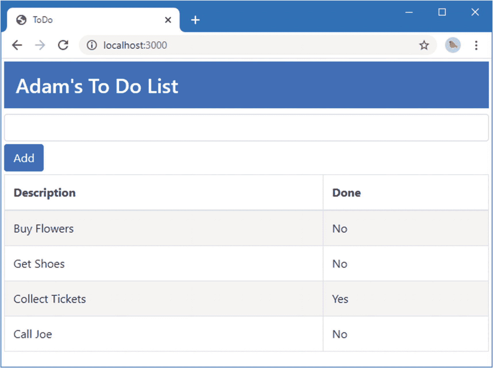
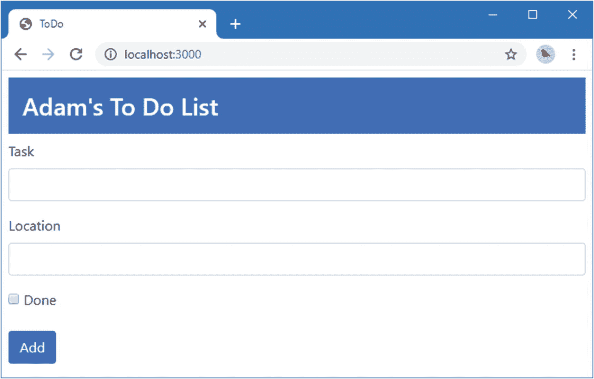
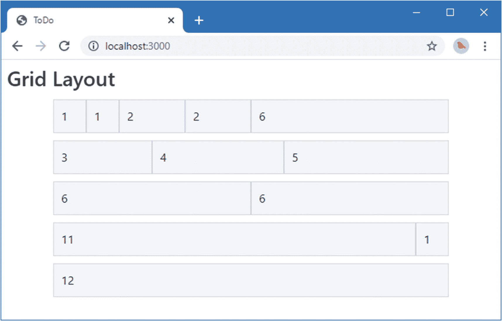
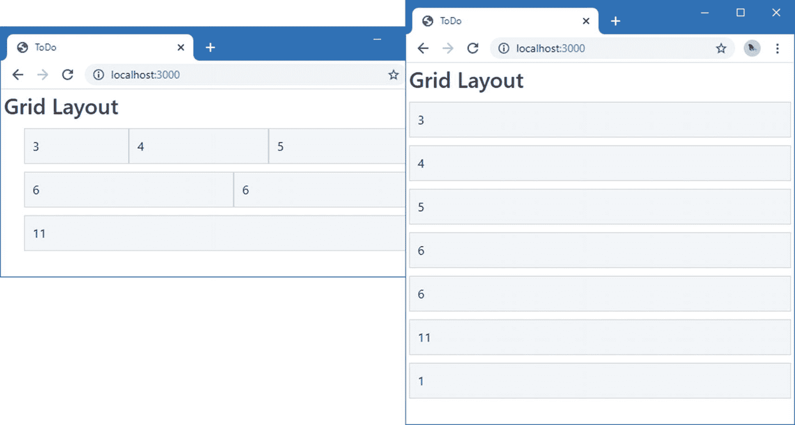

# 四、HTML 和 CSS 入门

开发人员通过许多途径进入 web 应用开发的世界，并不总是基于 web 应用所依赖的基本技术。在这一章中，我提供了一个 HTML 的简单入门，并介绍了引导 CSS 库，我用它来设计本书中的例子。在第 [5](05.html) 和 [6](06.html) 章中，我介绍了 JavaScript 和 TypeScript 的基础知识，并给出了理解本书其余部分中的例子所需的信息。如果你是一个有经验的开发者，你可以跳过这些初级章节，直接跳到第七章[中，在那里我使用 Angular 创建了一个更复杂和真实的应用。](07.html)

## 准备示例项目

对于这一章，我只需要一个简单的示例项目。我首先创建了一个名为`HtmlCssPrimer`的文件夹，在其中创建了一个名为`package.json`的文件，并添加了清单 [4-1](#PC1) 中所示的内容。

```ts
{
  "dependencies": {
    "bootstrap": "4.4.1"
  }
}

Listing 4-1.The Contents of the package.json File in the HtmlCssPrimer Folder

```

在`HtmlCssPrimer`文件夹中运行以下命令，下载并安装`package.json`文件中指定的 NPM 软件包:

```ts
npm install

```

接下来，我在`HtmlCssPrimer`文件夹中创建了一个名为`index.html`的文件，并添加了清单 [4-2](#PC3) 中所示的内容。

```ts
<!DOCTYPE html>
<html>
<head>
    <title>ToDo</title>
    <meta charset="utf-8" />
    <link href="node_modules/bootstrap/dist/css/bootstrap.min.css"
          rel="stylesheet" />
</head>
<body class="m-1">

    <h3 class="bg-primary text-white p-3">Adam's To Do List</h3>

    <div class="my-1">
        <input class="form-control" />
        <button class="btn btn-primary mt-1">Add</button>
    </div>

    <table class="table table-striped table-bordered">
        <thead>
            <tr>
                <th>Description</th>
                <th>Done</th>
            </tr>
        </thead>
        <tbody>
            <tr><td>Buy Flowers</td><td>No</td></tr>
            <tr><td>Get Shoes</td><td>No</td></tr>
            <tr><td>Collect Tickets</td><td>Yes</td></tr>
            <tr><td>Call Joe</td><td>No</td></tr>
        </tbody>
    </table>
</body>
</html>

Listing 4-2.The Contents of the index.html File in the HtmlCssPrimer Folder

```

这是一个简单的 HTML 文档，包含一个基本的待办事项列表，类似于我在第二章[T2 中用 Angular 创建的那个。在`HtmlCssPrimer`文件夹中运行以下命令，下载并运行 HTTP 服务器:](02.html)

```ts
npx lite-server@2.5.4

```

`lite-server`包包含一个开发 HTTP 服务器，当它检测到文件改变时，会自动触发浏览器刷新。一旦包被下载，服务器将启动，一个浏览器窗口将打开，显示如图 [4-1](#Fig1) 所示的内容。(如果您的系统配置为阻止浏览器自动打开，您可以请求`http://localhost:3000`。)



图 4-1。

运行示例应用

## 理解 HTML

HTML 的核心是*元素*，它告诉浏览器 HTML 文档的每个部分代表什么样的内容。以下是示例 HTML 文档中的一个元素:

```ts
...
<td>Buy Flowers</td>
...

```

如图 [4-2](#Fig2) 所示，这个元素有三个部分:开始标签、结束标签和内容。


图 4-2。

简单 HTML 元素的剖析

这个元素的*名称*(也称为*标签名称*或者仅仅是*标签*)是`td`，它告诉浏览器标签之间的内容应该被当作一个表格单元格。您可以通过将标签名称放在尖括号中(`<`和`>`字符)来开始一个元素，并以类似的方式使用标签来结束一个元素，除了您还可以在左尖括号(`<`)后添加一个`/`字符。出现在标签之间的是元素的内容，可以是文本(比如本例中的`Buy Flowers`)或其他 HTML 元素。

### 了解空元素

HTML 规范包括不允许包含内容的元素。这些被称为 *void* 或*自闭*元素，它们没有单独的结束标记，就像这样:

```ts
...
<input />
...

```

在单个标记中定义了一个 void 元素，并在最后一个尖括号(`>`字符)前添加了一个`/`字符。`input`元素是最常用的 void 元素，其目的是允许用户通过文本字段、单选按钮或复选框提供输入。在后面的章节中，你会看到很多使用这个元素的例子。

### 了解属性

您可以通过向元素添加*属性*来为浏览器提供附加信息。以下是示例文档中带有属性的元素:

```ts
...
<link href="node_modules/bootstrap/dist/css/bootstrap.min.css" rel="stylesheet" />
...

```

这是一个`link`元素，它将内容导入文档。有两个属性，我已经强调过了，所以它们更容易看到。属性总是被定义为开始标签的一部分，这些属性有一个名为*的*和一个值为*的*。

本例中两个属性的名称是`href`和`rel`。对于`link`元素，`href`属性指定要导入的内容，`rel`属性告诉浏览器这是哪种内容。这个`link`元素的属性告诉浏览器导入`bootstrap.min.css`文件，并把它当作一个样式表，它是一个包含 CSS 样式的文件。

### 应用不带值的属性

并非所有属性都应用了值；只需将它们添加到元素中，就可以告诉浏览器您想要某种特定的行为。下面是一个具有这种属性的元素的示例(不是来自示例文档；我只是虚构了这个示例元素):

```ts
...
<input class="form-control" required />
...

```

这个元素有两个属性。第一个是`class`，它被赋值，就像前面的例子一样。另一个属性就是`required`这个词。这是一个不需要值的属性的例子。

### 在属性中引用文字值

Angular 依赖 HTML 元素属性来应用它的许多功能。大多数时候，属性的值是作为 JavaScript 表达式来计算的，比如这个元素，摘自第 [2](02.html) 章:

```ts
...
<td [ngSwitch]="item.complete">
...

```

应用于`td`元素的属性告诉 Angular 读取一个对象上名为`complete`的属性的值，该对象已被分配给一个名为`item`的变量。有时，您需要提供一个特定的值，而不是让 Angular 从数据模型中读取一个值，这需要额外的引用来告诉 Angular 它正在处理一个文字值，如下所示:

```ts
...
<td [ngSwitch]="'Apples'">
...

```

属性值包含字符串`Apples`，用单引号和双引号引起来。当 Angular 计算属性值时，它会看到单引号并将该值作为文字字符串处理。

### 了解元素内容

元素可以包含文本，但也可以包含其他元素，如下所示:

```ts
...
<thead>
    <tr>
        <th>Description</th>
        <th>Done</th>
    </tr>
</thead>
...

```

HTML 文档中的元素形成一个层次结构。`html`元素包含`body`元素，后者包含内容元素，每个内容元素可以包含其他元素，依此类推。在清单中，`thead`元素包含`tr`元素，而`tr`元素又包含`th`元素。排列元素是 HTML 中的一个关键概念，因为它将外部元素的重要性传递给内部元素。

### 了解文档结构

有一些关键元素定义了 HTML 文档的基本结构:`DOCTYPE`、`html`、`head`和`body`元素。以下是这些元素之间的关系，其余内容已删除:

```ts
<!DOCTYPE html>
<html>
<head>
    ...head content...
</head>
<body>
    ...body content...
</body>
</html>

```

这些元素中的每一个在 HTML 文档中都扮演着特定的角色。元素告诉浏览器这是一个 HTML 文档，更确切地说，这是一个 *HTML5* 文档。早期版本的 HTML 需要额外的信息。例如，下面是 HTML4 文档的`DOCTYPE`元素:

```ts
...
<!DOCTYPE HTML PUBLIC "-//W3C//DTD HTML 4.01//EN"
    "http://www.w3.org/TR/html4/strict.dtd">
...

```

`html`元素表示包含 HTML 内容的文档区域。这个元素总是包含另外两个关键的结构元素:`head`和`body`。正如我在本章开始时解释的那样，我不打算讨论单个的 HTML 元素。它们太多了，描述 HTML5 完全花了我 HTML 书 1000 多页。也就是说，表 [4-1](#Tab1) 提供了我在清单 [4-2](#PC3) 中的`index.html`文件中使用的元素的简要描述，以帮助您理解元素如何告诉浏览器它们代表哪种内容。

表 4-1。

示例文档中使用的 HTML 元素

<colgroup><col class="tcol1 align-left"> <col class="tcol2 align-left"></colgroup> 
| 

元素

 | 

描述

 |
| --- | --- |
| `DOCTYPE` | 指示文档中内容的类型 |
| `body` | 降级包含内容元素的文档区域 |
| `button` | 表示一个按钮；通常用于向服务器提交表单 |
| `div` | 通用元素；通常用于为文档添加结构，以用于演示目的 |
| `h3` | 降级标题 |
| `head` | 降级包含元数据的文档区域 |
| `html` | 表示文档中包含 HTML 的区域(通常是整个文档) |
| `input` | 降级用于从用户处收集单个数据项的字段 |
| `link` | 将内容导入 HTML 文档 |
| `meta` | 提供关于文档的描述性数据，如字符编码 |
| `table` | 表示表格，用于将内容组织成行和列 |
| `tbody` | 表示表格的正文(与页眉或页脚相对) |
| `td` | 将表格行中的内容单元格降级 |
| `th` | 降级表格行中的标题单元格 |
| `thead` | 降级表格的标题 |
| `title` | 表示文档的标题；由浏览器用来设置窗口或选项卡的标题 |
| `tr` | 降级表格中的行 |

Understanding the Document Object Model

当浏览器加载并处理一个 HTML 文档时，它会创建*文档对象模型* (DOM)。DOM 是一种模型，其中 JavaScript 对象用于表示文档中的每个元素，DOM 是一种机制，通过它您可以以编程方式处理 HTML 文档的内容。

在 Angular 中很少直接使用 DOM，但是理解浏览器维护由 JavaScript 对象表示的 HTML 文档的动态模型是很重要的。当 Angular 修改这些对象时，浏览器会更新其显示的内容以反映修改。这是 web 应用的关键基础之一。如果我们不能修改 DOM，我们就不能创建客户端 web 应用。

## 了解引导程序

HTML 元素告诉浏览器它们代表什么样的内容，但是它们不提供任何关于内容应该如何显示的信息。关于如何显示元素的信息是使用*级联样式表* (CSS)提供的。CSS 由可用于配置元素外观各个方面的*属性*和允许应用这些属性的*选择器*组成。

CSS 是灵活和强大的，但它需要时间和对细节的密切关注来获得良好、一致的结果，特别是当一些传统浏览器实现的功能不一致时。CSS 框架提供了一组样式，可以很容易地应用这些样式来在整个项目中产生一致的效果。

使用最广泛的框架是 Bootstrap，它由 CSS 类和 JavaScript 代码组成，CSS 类可以应用于元素以保持一致的样式，JavaScript 代码执行额外的增强。我在本书中使用了引导 CSS 样式，因为它们让我不必在每一章中定义自定义样式就可以对我的例子进行样式化。我在本书中根本没有使用引导 JavaScript 特性，因为示例的交互部分是使用 Angular 提供的。

关于 Bootstrap，我不想讲太多细节，因为这不是本书的主题，但是我想给你足够的信息，这样你就可以知道例子的哪些部分是 Angular 特征，哪些部分是 Bootstrap 样式。参见 [`http://getbootstrap.com`](http://getbootstrap.com) 了解 Bootstrap 提供的特性的全部细节。

### 应用基本引导类

引导样式是通过`class`属性应用的，该属性用于对相关元素进行分组。`class`属性不仅用于应用 CSS 样式，而且是最常见的用法，它支持 Bootstrap 和类似框架的操作方式。下面是一个带有`class`属性的 HTML 元素，取自`index.html`文件:

```ts
...
<button class="btn btn-primary mt-1">Add</button>
...

```

`class`属性将`button`元素分配给三个类，它们的名称由空格分隔:`btn`、`btn-primary`和`mt-1`。这些类对应于 Bootstrap 定义的样式，如表 [4-2](#Tab2) 所述。

表 4-2。

三个按钮元素类

<colgroup><col class="tcol1 align-left"> <col class="tcol2 align-left"></colgroup> 
| 

名字

 | 

描述

 |
| --- | --- |
| `btn` | 这个类应用按钮的基本样式。它可以应用于`button`或`a`元素，以提供一致的外观。 |
| `btn-primary` | 该类应用样式上下文来提供关于按钮用途的视觉提示。请参见“使用上下文类”一节。 |
| `mt-1` | 这个类在元素的顶部和它周围的内容之间添加一个间隙。请参见“使用边距和填充”一节。 |

#### 使用上下文类

使用像 Bootstrap 这样的 CSS 框架的主要优点之一是简化了在整个应用中创建一致主题的过程。Bootstrap 定义了一组*样式上下文*，用于一致地设计相关元素的样式。这些上下文在表 [4-3](#Tab3) 中描述，用于将引导样式应用于元素的类的名称中。

表 4-3。

自举风格的上下文

<colgroup><col class="tcol1 align-left"> <col class="tcol2 align-left"></colgroup> 
| 

名字

 | 

描述

 |
| --- | --- |
| `primary` | 该上下文用于指示主要动作或内容区域。 |
| `secondary` | 该上下文用于指示内容的支持区域。 |
| `success` | 此上下文用于指示成功的结果。 |
| `info` | 该上下文用于呈现附加信息。 |
| `warning` | 该上下文用于显示警告。 |
| `danger` | 此上下文用于表示严重警告。 |
| `muted` | 这种语境是用来淡化内容的。 |
| `dark` | 该上下文通过使用深色来增加对比度。 |
| `white` | 该上下文用于通过使用白色来增加对比度。 |

Bootstrap 提供了允许样式上下文应用于不同类型元素的类。下面是应用于`h3`元素的`primary`上下文，取自本章开始时创建的`index.html`文件:

```ts
...
<h3 class="bg-primary text-white p-3">Adam's To Do List</h3>
...

```

元素被分配到的类之一是`bg-primary`，它使用样式上下文的颜色来设置元素的背景颜色。下面是应用于`button`元素的相同样式上下文:

```ts
...
<button class="btn btn-primary mt-1">Add</button>
...

```

`btn-primary`类使用样式上下文的颜色来设计按钮或锚元素的样式。使用相同的上下文来设计不同元素的样式将确保它们的外观是一致和互补的，如图 [4-3](#Fig3) 所示，该图突出显示了应用了样式上下文的元素。


图 4-3。

使用样式上下文保持一致性

#### 使用边距和填充

Bootstrap 包括一些实用程序类，用于添加填充(元素内边缘与其内容之间的空间)和边距(元素边缘与其周围元素之间的空间)。使用这些类的好处是它们在整个应用中应用一致的间距。

这些类的名称遵循一种定义良好的模式。下面是在本章开始时创建的`index.html`文件中的`body`元素，已经对其应用了边距:

```ts
...
<body class="m-1">
...

```

对元素应用边距和填充的类遵循一个定义良好的命名模式:首先是字母`m`(用于边距)或`p`(用于填充)，然后是一个连字符，然后是一个数字，指示应该应用多少空间(`0`表示没有间距，或者`1`、`2`或`3`表示增加的数量)。您还可以添加一个字母，仅将间距应用于特定的边，因此`t`用于顶部、`b`用于底部、`l`用于左侧、`r`用于右侧、`x`用于左侧和右侧、`y`用于顶部和底部。

为了帮助把这个方案放在上下文中，表 [4-4](#Tab4) 列出了在`index.html`文件中使用的组合。

表 4-4。

示例引导边距和填充类

<colgroup><col class="tcol1 align-left"> <col class="tcol2 align-left"></colgroup> 
| 

名字

 | 

描述

 |
| --- | --- |
| `p-1` | 这个类将填充应用到元素的所有边缘。 |
| `m-1` | 这个类将边距应用于元素的所有边缘。 |
| `mt-1` | 这个类将边距应用于元素的上边缘。 |
| `mb-1` | 这个类将边距应用于元素的下边缘。 |

#### 更改元素大小

您可以使用大小修改类来更改某些元素的样式。这些是通过组合基本类名、连字符和`lg`或`sm`来指定的。在清单 [4-3](#PC18) 中，我使用 Bootstrap 为按钮提供的大小修改类，将`button`元素添加到了`index.html`文件中。

```ts
<!DOCTYPE html>
<html>
<head>
    <title>ToDo</title>
    <meta charset="utf-8" />
    <link href="node_modules/bootstrap/dist/css/bootstrap.min.css"
          rel="stylesheet" />
</head>
<body class="m-1">

    <h3 class="bg-primary text-white p-3">Adam's To Do List</h3>

    <div class="my-1">
        <input class="form-control" />
        <button class="btn btn-lg btn-primary mt-1">Add</button>
        <button class="btn btn-primary mt-1">Add</button>
        <button class="btn btn-sm btn-primary mt-1">Add</button>
    </div>

    <table class="table table-striped table-bordered">
        <thead>
            <tr>
                <th>Description</th>
                <th>Done</th>
            </tr>
        </thead>
        <tbody>
            <tr><td>Buy Flowers</td><td>No</td></tr>
            <tr><td>Get Shoes</td><td>No</td></tr>
            <tr><td>Collect Tickets</td><td>Yes</td></tr>
            <tr><td>Call Joe</td><td>No</td></tr>
        </tbody>
    </table>
</body>
</html>

Listing 4-3.Using Button Size Modification Classes in the index.html File in the HtmlCssPrimer Folder

```

`btn-lg`类创建一个大按钮，`btn-sm`类创建一个小按钮。省略 size 类将使用元素的默认大小。请注意，我能够将一个上下文类和一个大小类结合起来。引导类修改一起工作，给你完全的控制元素的样式，创造出如图 [4-4](#Fig4) 所示的效果。


图 4-4。

更改元素大小

### 使用引导程序设计表格

Bootstrap 包括对样式化`table`元素及其内容的支持，这是我在本书中使用的一个特性。表 [4-5](#Tab5) 列出了使用表的关键引导类。

表 4-5。

表格的引导 CSS 类

<colgroup><col class="tcol1 align-left"> <col class="tcol2 align-left"></colgroup> 
| 

名字

 | 

描述

 |
| --- | --- |
| `table` | 对一个`table`元素及其行应用常规样式 |
| `table-striped` | 对`table`正文中的行应用隔行条带化 |
| `table-bordered` | 将边框应用于所有行和列 |
| `table-hover` | 当鼠标悬停在表格中的某一行上时，显示不同的样式 |
| `table-sm` | 减少表格中的间距以创建更紧凑的布局 |

所有这些类都直接应用于`table`元素，如清单 [4-4](#PC19) 所示，其中突出显示了应用于`index.html`文件中的表的引导类。

```ts
...
<table class="table table-striped table-bordered">
    <thead>
        <tr>
            <th>Description</th>
            <th>Done</th>
        </tr>
    </thead>
    <tbody>
        <tr><td>Buy Flowers</td><td>No</td></tr>
        <tr><td>Get Shoes</td><td>No</td></tr>
        <tr><td>Collect Tickets</td><td>Yes</td></tr>
        <tr><td>Call Joe</td><td>No</td></tr>
    </tbody>
</table>
...

Listing 4-4.Using Bootstrap to Style Tables

```

Tip

注意，在定义清单 [4-4](#PC19) 中的表格时，我使用了`thead`元素。如果一个`tbody`元素没有被使用，浏览器会自动添加任何`tr`元素，这些元素是`table`元素的直接后代。如果您在使用 Bootstrap 时依赖于这种行为，您会得到奇怪的结果，因为应用于`table`元素的大多数 CSS 类会导致样式被添加到`tbody`元素的后代中。

### 使用 Bootstrap 创建表单

Bootstrap 包括表单元素的样式，允许它们与应用中的其他元素保持一致。在清单 [4-5](#PC20) 中，我扩展了`index.html`文件中的表单元素，并临时删除了表格。

```ts
<!DOCTYPE html>
<html>
<head>
    <title>ToDo</title>
    <meta charset="utf-8" />
    <link href="node_modules/bootstrap/dist/css/bootstrap.min.css"
          rel="stylesheet" />
</head>
<body class="m-2">
    <h3 class="bg-primary text-white p-3">Adam's To Do List</h3>
    <form>
        <div class="form-group">
            <label>Task</label>
            <input class="form-control" />
        </div>
        <div class="form-group">
            <label>Location</label>
            <input class="form-control" />
        </div>
        <div class="form-group">
            <input type="checkbox" />
            <label>Done</label>
        </div>
        <button class="btn btn-primary">Add</button>
    </form>
</body>
</html>

Listing 4-5.Defining Additional Form Elements in the index.html File in the HtmlCssPrimer Folder

```

表单的基本样式是通过将`form-group`类应用到包含`label`和`input`元素的`div`元素来实现的，其中输入元素被分配给`form-control`类。Bootstrap 对元素进行样式化，使`label`显示在`input`元素上方，而`input`元素占据 100%的可用水平空间，如图 [4-5](#Fig5) 所示。



图 4-5。

样式表单元素

### 使用引导程序创建网格

Bootstrap 提供了样式类，可用于创建不同种类的网格布局，从 1 列到 12 列不等，并支持响应式布局(网格布局根据屏幕宽度而变化)。清单 [4-6](#PC21) 替换了示例 HTML 文件的内容来演示网格特性。

```ts
<!DOCTYPE html>
<html>
<head>
    <title>ToDo</title>
    <meta charset="utf-8" />
    <link href="node_modules/bootstrap/dist/css/bootstrap.min.css"
          rel="stylesheet" />
    <style>
        .row > div {
                    border: 1px solid lightgrey; padding: 10px;
                    background-color: aliceblue; margin: 5px 0;
                }
    </style>
</head>
<body class="m-2">
    <h3>Grid Layout</h3>
    <div class="container">
        <div class="row">
            <div class="col-1">1</div>
            <div class="col-1">1</div>
            <div class="col-2">2</div>
            <div class="col-2">2</div>
            <div class="col-6">6</div>
        </div>

        <div class="row">
            <div class="col-3">3</div>
            <div class="col-4">4</div>
            <div class="col-5">5</div>
        </div>

        <div class="row">
            <div class="col-6">6</div>
            <div class="col-6">6</div>
        </div>

        <div class="row">
            <div class="col-11">11</div>
            <div class="col-1">1</div>
        </div>

        <div class="row">
            <div class="col-12">12</div>
        </div>
    </div>
</body>
</html>

Listing 4-6.Using a Bootstrap Grid in the index.html File in the HtmlCssPrimer Folder

```

自举网格布局系统易于使用。一个顶级的`div`元素被分配给`container`类(或者是`container-fluid`类，如果你想让它跨越可用空间的话)。通过将`row`类应用到`div`元素来指定列，这具有为`div`元素包含的内容设置网格布局的效果。

每行定义 12 列，您可以通过指定一个名为`col-`后跟列数的类来指定每个子元素将占用多少列。例如，类`col-1`指定一个元素占据一列，`col-2`指定两列，依此类推，直到`col-12`，它指定一个元素填充整个行。在清单中，我用`row`类创建了一系列的`div`元素，每个元素都包含我应用了`col-*`类的进一步的`div`元素。在图 [4-6](#Fig6) 中可以看到浏览器中的效果。

Tip

Bootstrap 不会对一行中的元素应用任何样式，这就是为什么我使用了一个`style`元素来创建一个自定义的 CSS 样式，该样式设置背景颜色、设置行间距并添加边框。



图 4-6。

创建引导网格布局

#### 创建响应式网格

响应式网格根据浏览器窗口的大小调整布局。响应式网格的主要用途是允许移动设备和桌面显示相同的内容，充分利用任何可用的屏幕空间。为了创建一个响应网格，用表 [4-6](#Tab6) 中显示的类之一替换单个单元格上的`col-*`类。

表 4-6。

响应网格的引导 CSS 类

<colgroup><col class="tcol1 align-left"> <col class="tcol2 align-left"></colgroup> 
| 

引导类

 | 

描述

 |
| --- | --- |
| `col-sm-*` | 当屏幕宽度大于 576 像素时，网格单元水平显示。 |
| `col-md-*` | 当屏幕宽度大于 768 像素时，网格单元水平显示。 |
| `col-lg-*` | 当屏幕宽度大于 992 像素时，网格单元格水平显示。 |
| `col-xl-*` | 当屏幕宽度大于 1200 像素时，网格单元水平显示。 |

当屏幕的宽度小于类支持的宽度时，网格行中的单元格垂直堆叠，而不是水平堆叠。清单 [4-7](#PC22) 展示了`index.html`文件中的响应网格。

```ts
<!DOCTYPE html>
<html>
<head>
    <title>ToDo</title>
    <meta charset="utf-8" />
    <link href="node_modules/bootstrap/dist/css/bootstrap.min.css"
          rel="stylesheet" />
    <style>
        #gridContainer {padding: 20px;}
        .row > div {
                     border: 1px solid lightgrey; padding: 10px;
                     background-color: aliceblue; margin: 5px 0;
                    }
    </style>

</head>
<body class="m-1">

    <h3>Grid Layout</h3>
    <div class="container">
            <div class="row">
                <div class="col-sm-3">3</div>
                <div class="col-sm-4">4</div>
                <div class="col-sm-5">5</div>
            </div>

            <div class="row">
                <div class="col-sm-6">6</div>
                <div class="col-sm-6">6</div>
            </div>

            <div class="row">
                <div class="col-sm-11">11</div>
                <div class="col-sm-1">1</div>
            </div>
    </div>
</body>
</html>

Listing 4-7.Creating a Responsive Grid in the index.html File in the HtmlCssPrimer Folder

```

我从前面的例子中删除了一些网格行，并用`col-sm-*`替换了`col-*`类。其效果是当浏览器窗口宽度大于 576 像素时，该行中的单元格将水平堆叠，当浏览器窗口宽度小于 576 像素时，该行中的单元格将水平堆叠，如图 [4-7](#Fig7) 所示。



图 4-7。

创建响应式网格布局

#### 创建简化的网格布局

对于本书中依赖于 Bootstrap 网格的大多数示例，我使用一种简化的方法，在单行中显示内容，并且只需要指定列数，如清单 [4-8](#PC23) 所示。

```ts
<!DOCTYPE html>
<html>
<head>
    <title>ToDo</title>
    <meta charset="utf-8" />
    <link href="node_modules/bootstrap/dist/css/bootstrap.min.css"
          rel="stylesheet" />
</head>
<body class="m-1">
    <h3 class="bg-primary text-white p-3">Adam's To Do List</h3>
    <div class="container-fluid">
        <div class="row">
            <div class="col-4">
                <form>
                    <div class="form-group">
                        <label>Task</label>
                        <input class="form-control" />
                    </div>
                    <div class="form-group">
                        <label>Location</label>
                        <input class="form-control" />
                    </div>
                    <div class="form-group">
                        <input type="checkbox" />
                        <label>Done</label>
                    </div>
                    <button class="btn btn-primary">Add</button>
                </form>
            </div>
            <div class="col-8">
                <table class="table table-striped table-bordered">
                    <thead>
                        <tr>
                            <th>Description</th>
                            <th>Done</th>
                        </tr>
                    </thead>
                    <tbody>
                        <tr><td>Buy Flowers</td><td>No</td></tr>
                        <tr><td>Get Shoes</td><td>No</td></tr>
                        <tr><td>Collect Tickets</td><td>Yes</td></tr>
                        <tr><td>Call Joe</td><td>No</td></tr>
                    </tbody>
                </table>
            </div>
        </div>
    </div>
</body>
</html>

Listing 4-8.Using a Simplified Grid Layout in the index.html File in the HtmlCssPrimer Folder

```

这个清单使用`col-4`和`col-8`类并排显示两个`div`元素，允许显示待办事项的表单和表格水平显示，如图 [4-8](#Fig8) 所示。


图 4-8。

使用简化的网格布局

## 摘要

在这一章中，我提供了 HTML 和引导 CSS 框架的简要概述。您需要很好地掌握 HTML 和 CSS，以便在 web 应用开发中真正有效，但最好的学习方法是通过第一手经验，本章中的描述和示例将足以让您入门，并为前面的示例提供足够的背景信息。在下一章，我将继续初级主题，介绍我在本书中使用的 JavaScript 的基本特性。