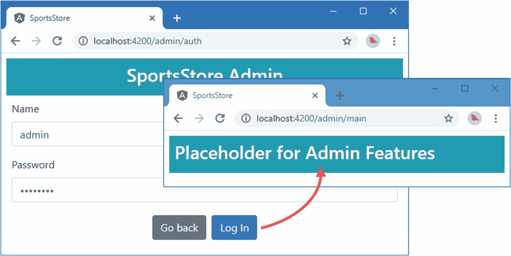
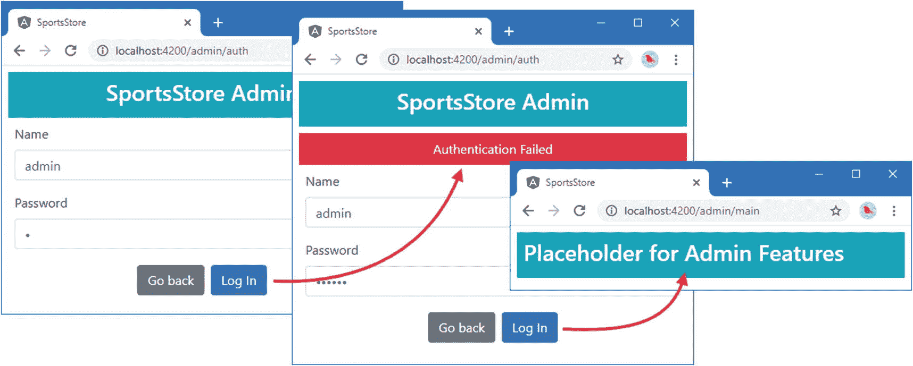

# 九、SportsStore：管理

在本章中，我将继续通过添加管理功能来构建 SportsStore 应用。需要访问管理功能的用户相对较少，因此在不太可能使用管理代码和内容时，强制所有用户下载这些代码和内容是一种浪费。相反，我将把管理特性放在一个单独的模块中，只在需要时才加载。

## 准备示例应用

本章不需要准备，继续使用第 [8 章](08.html)中的 SportsStore 项目。要启动 RESTful web 服务，请打开命令提示符并在`SportsStore`文件夹中运行以下命令:

```ts
npm run json

```

打开第二个命令提示符，在`SportsStore`文件夹中运行以下命令，启动开发工具和 HTTP 服务器:

```ts
ng serve --open

```

Tip

你可以从 [`https://github.com/Apress/pro-angular-9`](https://github.com/Apress/pro-angular-9) 下载本章以及本书其他章节的示例项目。如果在运行示例时遇到问题，请参见第 [1](01.html) 章获取帮助。

### 创建模块

创建功能模块的过程与您在前面章节中看到的模式相同。关键的区别在于，应用的任何其他部分都不依赖于模块或它包含的类，这一点很重要，否则会破坏模块的动态加载，并导致 JavaScript 模块加载管理代码，即使它没有被使用。

管理特性的起点是身份验证，这将确保只有授权用户才能管理应用。我在`src/app/admin`文件夹中创建了一个名为`auth.component.ts`的文件，并用它来定义清单 [9-1](#PC3) 中所示的组件。

```ts
import { Component } from "@angular/core";
import { NgForm } from "@angular/forms";
import { Router } from "@angular/router";

@Component({
    templateUrl: "auth.component.html"
})
export class AuthComponent {
    public username: string;
    public password: string;
    public errorMessage: string;

    constructor(private router: Router) {}

    authenticate(form: NgForm) {
        if (form.valid) {
            // perform authentication
            this.router.navigateByUrl("/admin/main");
        } else {
            this.errorMessage = "Form Data Invalid";
        }
    }
}

Listing 9-1.The Content of the auth.component.ts File in the src/app/admin Folder

```

该组件定义了用户名和密码的属性，这些属性将用于验证用户，一个`errorMessage`属性将用于在出现问题时显示消息，一个`authenticate`方法将执行验证过程(但目前不做任何事情)。

为了给组件提供模板，我在`src/app/admin`文件夹中创建了一个名为`auth.component.html`的文件，并添加了清单 [9-2](#PC4) 中所示的内容。

```ts
<div class="bg-info p-2 text-center text-white">
  <h3>SportsStore Admin</h3>
</div>
<div class="bg-danger mt-2 p-2 text-center text-white"
     *ngIf="errorMessage != null">
  {{errorMessage}}
</div>
<div class="p-2">
  <form novalidate #form="ngForm" (ngSubmit)="authenticate(form)">
    <div class="form-group">
      <label>Name</label>
      <input class="form-control" name="username"
             [(ngModel)]="username" required />
    </div>
    <div class="form-group">
      <label>Password</label>
      <input class="form-control" type="password" name="password"
             [(ngModel)]="password" required />
    </div>
    <div class="text-center">
      <button class="btn btn-secondary m-1" routerLink="/">Go back</button>
      <button class="btn btn-primary m-1" type="submit">Log In</button>
    </div>
  </form>
</div>

Listing 9-2.The Content of the auth.component.html File in the src/app/admin Folder

```

该模板包含一个 HTML 表单，该表单对组件的属性使用双向数据绑定表达式。有一个提交表单的按钮，一个导航回根 URL 的按钮，以及一个只有在显示错误消息时才可见的`div`元素。

为了创建管理特性的占位符，我在`src/app/admin`文件夹中添加了一个名为`admin.component.ts`的文件，并定义了清单 [9-3](#PC5) 中所示的组件。

```ts
import { Component } from "@angular/core";

@Component({
    templateUrl: "admin.component.html"
})
export class AdminComponent {}

Listing 9-3.The Contents of the admin.component.ts File in the src/app/admin Folder

```

该组件目前不包含任何功能。为了给组件提供一个模板，我在`src/app/admin`文件夹中添加了一个名为`admin.component.html`的文件，占位符内容如清单 [9-4](#PC6) 所示。

```ts
<div class="bg-info p-2 text-white">
  <h3>Placeholder for Admin Features</h3>
</div>

Listing 9-4.The Contents of the admin.component.html File in the src/app/admin Folder

```

为了定义特性模块，我在`src/app/admin`文件夹中添加了一个名为`admin.module.ts`的文件，并添加了清单 [9-5](#PC7) 中所示的代码。

```ts
import { NgModule } from "@angular/core";
import { CommonModule } from "@angular/common";
import { FormsModule } from "@angular/forms";
import { RouterModule } from "@angular/router";
import { AuthComponent } from "./auth.component";
import { AdminComponent } from "./admin.component";

let routing = RouterModule.forChild([
    { path: "auth", component: AuthComponent },
    { path: "main", component: AdminComponent },
    { path: "**", redirectTo: "auth" }
]);

@NgModule({
    imports: [CommonModule, FormsModule, routing],
    declarations: [AuthComponent, AdminComponent]
})
export class AdminModule { }

Listing 9-5.The Contents of the admin.module.ts File in the src/app/admin Folder

```

`RouterModule.forChild`方法用于定义功能模块的路由配置，然后包含在模块的`imports`属性中。

动态加载的模块必须是自包含的，并且包含 Angular 需要的所有信息，包括支持的路由 URL 和它们显示的组件。如果应用的任何其他部分依赖于该模块，那么它将与应用代码的其余部分一起包含在 JavaScript 包中，这意味着所有用户都必须为他们不会使用的功能下载代码和资源。

但是，允许动态加载的模块声明对应用主要部分的依赖。这个模块依赖于数据模型模块中的功能，它已经被添加到模块的`imports`中，以便组件可以访问模型类和存储库。

### 配置 URL 路由系统

动态加载的模块通过路由配置进行管理，当应用导航到特定的 URL 时，路由配置会触发加载过程。清单 [9-6](#PC8) 扩展了应用的路由配置，因此`/admin` URL 将加载管理功能模块。

```ts
import { NgModule } from "@angular/core";
import { BrowserModule } from "@angular/platform-browser";
import { AppComponent } from "./app.component";
import { StoreModule } from "./store/store.module";
import { StoreComponent } from "./store/store.component";
import { CheckoutComponent } from "./store/checkout.component";
import { CartDetailComponent } from "./store/cartDetail.component";
import { RouterModule } from "@angular/router";
import { StoreFirstGuard } from "./storeFirst.guard";

@NgModule({
    imports: [BrowserModule, StoreModule,
        RouterModule.forRoot([
            {
                path: "store", component: StoreComponent,
                canActivate: [StoreFirstGuard]
            },
            {
                path: "cart", component: CartDetailComponent,
                canActivate: [StoreFirstGuard]
            },
            {
                path: "checkout", component: CheckoutComponent,
                canActivate: [StoreFirstGuard]
            },
            {
                path: "admin",
                loadChildren: () => import("./admin/admin.module")
                    .then(m => m.AdminModule),
                canActivate: [StoreFirstGuard]
            },
            { path: "**", redirectTo: "/store" }
        ])],
    providers: [StoreFirstGuard],
    declarations: [AppComponent],
    bootstrap: [AppComponent]
})
export class AppModule { }

Listing 9-6.Configuring a Dynamically Loaded Module in the app.module.ts File in the src/app Folder

```

新的路径告诉 Angular，当应用导航到`/admin` URL 时，它应该从`admin/admin.module.ts`文件中加载一个由名为`AdminModule`的类定义的特性模块，其路径是相对于`app.module.ts`文件指定的。当 Angular 处理管理模块时，它会将包含的路由信息合并到整个路由集中，并完成导航。

### 导航到管理 URL

最后的准备步骤是为用户提供导航到`/admin` URL 的能力，以便加载管理功能模块并向用户显示其组件。清单 [9-7](#PC9) 在商店组件的模板中添加了一个按钮来执行导航。

```ts
<div class="container-fluid">
  <div class="row">
    <div class="col bg-dark text-white">
      <a class="navbar-brand">SPORTS STORE</a>
      <cart-summary></cart-summary>
    </div>
  </div>
  <div class="row">

    <div class="col-3 p-2">
      <button class="btn btn-block btn-outline-primary" (click)="changeCategory()">
        Home
      </button>
      <button *ngFor="let cat of categories"
          class="btn btn-outline-primary btn-block"
          [class.active]="cat == selectedCategory" (click)="changeCategory(cat)">
        {{cat}}
      </button>
      <button class="btn btn-block btn-danger mt-5" routerLink="/admin">
        Admin
      </button>
    </div>

    <div class="col-9 p-2">

      <!-- ...elements omitted for brevity... -->

    </div>
  </div>
</div>

Listing 9-7.Adding a Navigation Button in the store.component.html File in the src/app/store Folder

```

要反映这些更改，请停止开发工具，并通过在`SportsStore`文件夹中运行以下命令来重新启动它们:

```ts
ng serve

```

使用浏览器导航至`http://localhost:4200`，并使用浏览器的 F12 开发工具查看加载应用时浏览器发出的网络请求。管理模块的文件将不会被加载，直到你点击管理按钮，此时 Angular 将请求文件并显示如图 [9-1](#Fig1) 所示的登录页面。


图 9-1。

使用动态加载的模块

在表单域中输入任意名称和密码，点击登录按钮，查看占位符内容，如图 [9-2](#Fig2) 所示。如果您将任何一个表单域留空，将会显示一条警告消息。



图 9-2。

占位符管理功能

## 实施身份验证

RESTful web 服务已经过配置，因此它要求对管理特性所要求的请求进行身份验证。在接下来的小节中，我将通过向 RESTful web 服务发送 HTTP 请求来添加对用户身份验证的支持。

### 了解认证系统

当 RESTful web 服务对用户进行身份验证时，它将返回一个 JSON Web 令牌(JWT ),应用必须将它包含在后续的 HTTP 请求中，以表明身份验证已经成功执行。您可以在 [`https://tools.ietf.org/html/rfc7519`](https://tools.ietf.org/html/rfc7519) 阅读 JWT 规范，但是对于 SportsStore 应用来说，只需知道 Angular 应用可以通过向`/login` URL 发送 POST 请求来验证用户，包括在请求体中包含名称和密码属性的 JSON 格式的对象。我在第 [7](07.html) 章的申请中添加的验证码只有一组有效凭证，如表 [9-1](#Tab1) 所示。

表 9-1。

RESTful Web 服务支持的身份验证凭证

<colgroup><col class="tcol1 align-left"> <col class="tcol2 align-left"></colgroup> 
| 

用户名

 | 

密码

 |
| --- | --- |
| `admin` | `secret` |

正如我在第 [7](07.html) 章中提到的，您不应该在实际项目中硬编码凭证，但这是您在 SportsStore 应用中需要的用户名和密码。

如果正确的凭证被发送到`/login` URL，那么来自 RESTful web 服务的响应将包含一个 JSON 对象，如下所示:

```ts
{
  "success": true,
   "token":"eyJhbGciOiJIUzI1NiIsInR5cCI6IkpXVCJ9.eyJkYXRhIjoiYWRtaW4iLCJleHBpcmVz
           SW4iOiIxaCIsImlhdCI6MTQ3ODk1NjI1Mn0.lJaDDrSu-bHBtdWrz0312p_DG5tKypGv6cA
           NgOyzlg8"
}

```

`success`属性描述认证操作的结果，而`token`属性包含 JWT，它应该包含在使用`Authorization` HTTP 头的后续请求中，格式如下:

```ts
Authorization: Bearer<eyJhbGciOiJIUzI1NiIsInR5cCI6IkpXVCJ9.eyJkYXRhIjoiYWRtaW4iLC
    JleHBpcmVzSW4iOiIxaCIsImlhdCI6MTQ3ODk1NjI1Mn0.lJaDDrSu-
    bHBtdWrz0312p_DG5tKypGv6cANgOyzlg8>

```

我配置了服务器返回的 JWT 令牌，使它们在一小时后过期。如果向服务器发送了错误的凭证，那么响应中返回的 JSON 对象将只包含一个设置为`false`的`success`属性，如下所示:

```ts
{
  "success": false
}

```

### 扩展数据源

RESTful 数据源将完成大部分工作，因为它负责向`/login` URL 发送认证请求，并在后续请求中包含 JWT。清单 [9-8](#PC14) 向`RestDataSource`类添加了身份验证，并定义了一个变量，该变量将在获得 JWT 后存储它。

```ts
import { Injectable } from "@angular/core";
import { HttpClient } from "@angular/common/http";
import { Observable } from "rxjs";
import { Product } from "./product.model";
import { Cart } from "./cart.model";
import { Order } from "./order.model";
import { map } from "rxjs/operators";

const PROTOCOL = "http";
const PORT = 3500;

@Injectable()
export class RestDataSource {
    baseUrl: string;
    auth_token: string;

    constructor(private http: HttpClient) {
        this.baseUrl = `${PROTOCOL}://${location.hostname}:${PORT}/`;
    }

    getProducts(): Observable<Product[]> {
        return this.http.get<Product[]>(this.baseUrl + "products");
    }

    saveOrder(order: Order): Observable<Order> {
        return this.http.post<Order>(this.baseUrl + "orders", order);
    }

    authenticate(user: string, pass: string): Observable<boolean> {
        return this.http.post<any>(this.baseUrl + "login", {
            name: user, password: pass
        }).pipe(map(response => {
            this.auth_token = response.success ? response.token : null;
            return response.success;
        }));
    }
}

Listing 9-8.Adding Authentication in the rest.datasource.ts File in the src/app/model Folder

```

### 创建身份验证服务

我将创建一个可用于执行身份验证并确定应用是否已通过身份验证的服务，而不是直接向应用的其余部分公开数据源。我在`src/app/model`文件夹中添加了一个名为`auth.service.ts`的文件，并添加了清单 [9-9](#PC15) 中所示的代码。

```ts
import { Injectable } from "@angular/core";
import { Observable } from "rxjs";
import { RestDataSource } from "./rest.datasource";

@Injectable()
export class AuthService {

    constructor(private datasource: RestDataSource) {}

    authenticate(username: string, password: string): Observable<boolean> {
        return this.datasource.authenticate(username, password);
    }

    get authenticated(): boolean {
        return this.datasource.auth_token != null;
    }

    clear() {
        this.datasource.auth_token = null;
    }
}

Listing 9-9.The Contents of the auth.service.ts File in the src/app/model Folder

```

`authenticate`方法接收用户的凭证，并将它们传递给数据源`authenticate`方法，如果认证过程成功，返回一个将产生`true`的`Observable`，否则返回`false`。`authenticated`属性是一个 getter 专用属性，如果数据源已经获得了一个认证令牌，它将返回`true`。`clear`方法从数据源中移除令牌。

清单 [9-10](#PC16) 向模型特征模块注册新服务。它还为`RestDataSource`类添加了一个`providers`条目，该类在前面的章节中仅被用作`StaticDataSource`类的替代品。由于`AuthService`类有一个`RestDataSource`构造函数参数，它需要在模块中有自己的条目。

```ts
import { NgModule } from "@angular/core";
import { ProductRepository } from "./product.repository";
import { StaticDataSource } from "./static.datasource";
import { Cart } from "./cart.model";
import { Order } from "./order.model";
import { OrderRepository } from "./order.repository";
import { RestDataSource } from "./rest.datasource";
import { HttpClientModule } from "@angular/common/http";
import { AuthService } from "./auth.service";

@NgModule({
  imports: [HttpClientModule],
  providers: [ProductRepository, Cart, Order, OrderRepository,
    { provide: StaticDataSource, useClass: RestDataSource },
    RestDataSource, AuthService]
})
export class ModelModule { }

Listing 9-10.Configuring the Services in the model.module.ts File in the src/app/model Folder

```

### 启用身份验证

下一步是连接从用户处获取凭证的组件，以便它通过新服务执行身份验证，如清单 [9-11](#PC17) 所示。

```ts
import { Component } from "@angular/core";
import { NgForm } from "@angular/forms";
import { Router } from "@angular/router";
import { AuthService } from "../model/auth.service";

@Component({
    templateUrl: "auth.component.html"
})
export class AuthComponent {
    public username: string;
    public password: string;
    public errorMessage: string;

    constructor(private router: Router,
                private auth: AuthService) { }

    authenticate(form: NgForm) {
        if (form.valid) {
            this.auth.authenticate(this.username, this.password)
                .subscribe(response => {
                    if (response) {
                        this.router.navigateByUrl("/admin/main");
                    }
                    this.errorMessage = "Authentication Failed";
                })
        } else {
            this.errorMessage = "Form Data Invalid";
        }
    }
}

Listing 9-11.Enabling Authentication in the auth.component.ts File in the src/app/admin Folder

```

为了防止应用直接导航到管理特性，这将导致 HTTP 请求在没有令牌的情况下被发送，我在`src/app/admin`文件夹中添加了一个名为`auth.guard.ts`的文件，并定义了清单 [9-12](#PC18) 中所示的路由保护。

```ts
import { Injectable } from "@angular/core";
import { ActivatedRouteSnapshot, RouterStateSnapshot,
            Router } from "@angular/router";
import { AuthService } from "../model/auth.service";

@Injectable()
export class AuthGuard {

    constructor(private router: Router,
                private auth: AuthService) { }

    canActivate(route: ActivatedRouteSnapshot,
        state: RouterStateSnapshot): boolean {

        if (!this.auth.authenticated) {
            this.router.navigateByUrl("/admin/auth");
            return false;
        }
        return true;
    }
}

Listing 9-12.The Contents of the auth.guard.ts File in the src/app/admin Folder

```

清单 [9-13](#PC19) 将路由保护应用于由管理功能模块定义的路由之一。

```ts
import { NgModule } from "@angular/core";
import { CommonModule } from "@angular/common";
import { FormsModule } from "@angular/forms";
import { RouterModule } from "@angular/router";
import { AuthComponent } from "./auth.component";
import { AdminComponent } from "./admin.component";
import { AuthGuard } from "./auth.guard";

let routing = RouterModule.forChild([
    { path: "auth", component: AuthComponent },
    { path: "main", component: AdminComponent, canActivate: [AuthGuard] },
    { path: "**", redirectTo: "auth" }
]);

@NgModule({
    imports: [CommonModule, FormsModule, routing],
    providers: [AuthGuard],
    declarations: [AuthComponent, AdminComponent]
})
export class AdminModule {}

Listing 9-13.Guarding a Route in the admin.module.ts File in the src/app/admin Folder

```

要测试身份验证系统，请单击 Admin 按钮，输入一些凭证，然后单击 Log In 按钮。如果凭证是表 [9-1](#Tab1) 中的凭证，那么您将看到管理功能的占位符。如果您输入其他凭据，将会看到一条错误消息。图 [9-3](#Fig3) 说明了这两种结果。

Tip

令牌不会永久存储，因此如果可以，请在浏览器中重新加载应用以再次启动，并尝试一组不同的凭据。



图 9-3。

测试身份验证功能

## 扩展数据源和存储库

身份验证系统就绪后，下一步是扩展数据源，以便它可以发送经过身份验证的请求，并通过 order 和 product repository 类公开这些特性。清单 [9-14](#PC20) 向包含认证令牌的数据源添加方法。

```ts
import { Injectable } from "@angular/core";
import { HttpClient } from "@angular/common/http";
import { Observable } from "rxjs";
import { Product } from "./product.model";
import { Cart } from "./cart.model";
import { Order } from "./order.model";
import { map } from "rxjs/operators";
import { HttpHeaders } from '@angular/common/http';

const PROTOCOL = "http";
const PORT = 3500;

@Injectable()
export class RestDataSource {
    baseUrl: string;
    auth_token: string;

    constructor(private http: HttpClient) {
        this.baseUrl = `${PROTOCOL}://${location.hostname}:${PORT}/`;
    }

    getProducts(): Observable<Product[]> {
        return this.http.get<Product[]>(this.baseUrl + "products");
    }

    saveOrder(order: Order): Observable<Order> {
        return this.http.post<Order>(this.baseUrl + "orders", order);
    }

    authenticate(user: string, pass: string): Observable<boolean> {
        return this.http.post<any>(this.baseUrl + "login", {
            name: user, password: pass
        }).pipe(map(response => {
            this.auth_token = response.success ? response.token : null;
            return response.success;
        }));
    }

    saveProduct(product: Product): Observable<Product> {
        return this.http.post<Product>(this.baseUrl + "products",
            product, this.getOptions());
    }

    updateProduct(product): Observable<Product> {
        return this.http.put<Product>(`${this.baseUrl}products/${product.id}`,
            product, this.getOptions());
    }

    deleteProduct(id: number): Observable<Product> {
        return this.http.delete<Product>(`${this.baseUrl}products/${id}`,
            this.getOptions());
    }

    getOrders(): Observable<Order[]> {
        return this.http.get<Order[]>(this.baseUrl + "orders", this.getOptions());
    }

    deleteOrder(id: number): Observable<Order> {
        return this.http.delete<Order>(`${this.baseUrl}orders/${id}`,
            this.getOptions());
    }

    updateOrder(order: Order): Observable<Order> {
        return this.http.put<Order>(`${this.baseUrl}orders/${order.id}`,
            order, this.getOptions());
    }

    private getOptions() {
        return {
            headers: new HttpHeaders({
                "Authorization": `Bearer<${this.auth_token}>`
            })
        }
    }
}

Listing 9-14.Adding New Operations in the rest.datasource.ts File in the src/app/model Folder

```

清单 [9-15](#PC21) 向产品存储库类添加了新方法，允许创建、更新或删除产品。`saveProduct`方法负责创建和更新产品，这是一种在使用由组件管理的单个对象时工作良好的方法，您将在本章后面看到演示。清单还将构造函数参数的类型更改为`RestDataSource`。

```ts
import { Injectable } from "@angular/core";
import { Product } from "./product.model";
//import { StaticDataSource } from "./static.datasource";
import { RestDataSource } from "./rest.datasource";

@Injectable()
export class ProductRepository {
    private products: Product[] = [];
    private categories: string[] = [];

    constructor(private dataSource: RestDataSource) {
        dataSource.getProducts().subscribe(data => {
            this.products = data;
            this.categories = data.map(p => p.category)
                .filter((c, index, array) => array.indexOf(c) == index).sort();
        });
    }

    getProducts(category: string = null): Product[] {
        return this.products
            .filter(p => category == null || category == p.category);
    }

    getProduct(id: number): Product {
        return this.products.find(p => p.id == id);
    }

    getCategories(): string[] {
        return this.categories;
    }

    saveProduct(product: Product) {
        if (product.id == null || product.id == 0) {
            this.dataSource.saveProduct(product)
                .subscribe(p => this.products.push(p));
        } else {
            this.dataSource.updateProduct(product)
                .subscribe(p => {
                    this.products.splice(this.products.
                        findIndex(p => p.id == product.id), 1, product);
                });
        }
    }

    deleteProduct(id: number) {
        this.dataSource.deleteProduct(id).subscribe(p => {
            this.products.splice(this.products.
                findIndex(p => p.id == id), 1);
        })
    }
}

Listing 9-15.Adding New Operations in the product.repository.ts File in the src/app/model Folder

```

清单 [9-16](#PC22) 对订单存储库进行了相应的更改，添加了允许修改和删除订单的方法。

```ts
import { Injectable } from "@angular/core";
import { Observable } from "rxjs";
import { Order } from "./order.model";
//import { StaticDataSource } from "./static.datasource";
import { RestDataSource } from "./rest.datasource";

@Injectable()
export class OrderRepository {
    private orders: Order[] = [];
    private loaded: boolean = false;

    constructor(private dataSource: RestDataSource) { }

    loadOrders() {
        this.loaded = true;
        this.dataSource.getOrders()
            .subscribe(orders => this.orders = orders);
    }

    getOrders(): Order[] {
        if (!this.loaded) {
            this.loadOrders();
        }
        return this.orders;
    }

    saveOrder(order: Order): Observable<Order> {
        return this.dataSource.saveOrder(order);
    }

    updateOrder(order: Order) {
        this.dataSource.updateOrder(order).subscribe(order => {
            this.orders.splice(this.orders.
                findIndex(o => o.id == order.id), 1, order);
        });
    }

    deleteOrder(id: number) {
        this.dataSource.deleteOrder(id).subscribe(order => {
            this.orders.splice(this.orders.findIndex(o => id == o.id), 1);
        });
    }
}

Listing 9-16.Adding New Operations in the order.repository.ts File in the src/app/model Folder

```

订单存储库定义了一个`loadOrders`方法，该方法从存储库中获取订单，并确保在执行身份验证之前不会将请求发送到 RESTful web 服务。

## 创建管理功能结构

现在，身份验证系统已经就绪，存储库提供了完整的操作，我可以创建显示管理特性的结构了，这是通过构建现有的 URL 路由配置来创建的。表 [9-2](#Tab2) 列出了我将支持的 URL 以及每个 URL 将呈现给用户的功能。

表 9-2。

管理功能的 URL

<colgroup><col class="tcol1 align-left"> <col class="tcol2 align-left"></colgroup> 
| 

名字

 | 

描述

 |
| --- | --- |
| `/admin/main/products` | 导航到此 URL 将在一个表中显示所有产品，以及允许编辑或删除现有产品和创建新产品的按钮。 |
| `/admin/main/products/create` | 导航到这个 URL 将向用户呈现一个用于创建新产品的空编辑器。 |
| `/admin/main/products/edit/1` | 导航到该 URL 将向用户呈现一个填充的编辑器，用于编辑现有产品。 |
| `/admin/main/orders` | 导航到这个 URL 将向用户显示一个表中的所有订单，以及标记已发货订单和通过删除取消订单的按钮。 |

### 创建占位符组件

我发现向 Angular 项目添加特性的最简单方法是定义具有占位符内容的组件，并围绕它们构建应用的结构。一旦结构就位，我就返回组件并详细实现特性。对于管理特性，我首先将一个名为`productTable.component.ts`的文件添加到`src/app/admin`文件夹中，并定义清单 [9-17](#PC23) 中所示的组件。该组件将负责显示产品列表，以及编辑和删除它们或创建新产品所需的按钮。

```ts
import { Component } from "@angular/core";

@Component({
    template: `<div class="bg-info p-2 text-white">
                <h3>Product Table Placeholder</h3>
              </div>`
})
export class ProductTableComponent {}

Listing 9-17.The Contents of the productTable.component.ts File in the src/app/admin Folder

```

我在`src/app/admin`文件夹中添加了一个名为`productEditor.component.ts`的文件，并用它来定义清单 [9-18](#PC24) 中所示的组件，这将用于允许用户输入创建或编辑组件所需的细节。

```ts
import { Component } from "@angular/core";

@Component({
    template: `<div class="bg-warning p-2 text-white">
                <h3>Product Editor Placeholder</h3>
              </div>`
})
export class ProductEditorComponent { }

Listing 9-18.The Contents of the productEditor.component.ts File in the src/app/admin Folder

```

为了创建负责管理客户订单的组件，我在`src/app/admin`文件夹中添加了一个名为`orderTable.component.ts`的文件，并添加了清单 [9-19](#PC25) 中所示的代码。

```ts
import { Component } from "@angular/core";

@Component({
    template: `<div class="bg-primary p-2 text-white">
                <h3>Order Table Placeholder</h3>
              </div>`
})
export class OrderTableComponent { }

Listing 9-19.The Contents of the orderTable.component.ts File in the src/app/admin Folder

```

### 准备通用内容和功能模块

上一节中创建的组件将负责特定的特性。为了将这些特性结合在一起并允许用户在它们之间导航，我需要修改占位符组件的模板，我一直使用这个模板来演示成功的身份验证尝试的结果。我用清单 [9-20](#PC26) 中所示的元素替换了占位符内容。

```ts
<div class="container-fluid">
    <div class="row">
        <div class="col bg-dark text-white">
            <a class="navbar-brand">SPORTS STORE</a>
        </div>
    </div>
    <div class="row mt-2">
        <div class="col-3">
            <button class="btn btn-outline-info btn-block"
                    routerLink="/admin/main/products"
                    routerLinkActive="active">
                Products
            </button>
            <button class="btn btn-outline-info btn-block"
                    routerLink="/admin/main/orders"
                    routerLinkActive="active">
                Orders
            </button>
            <button class="btn btn-outline-danger btn-block" (click)="logout()">
                Logout
            </button>
        </div>
        <div class="col-9">
            <router-outlet></router-outlet>
        </div>
    </div>
</div>

Listing 9-20.Replacing the Content in the admin.component.html File in the src/app/admin Folder

```

该模板包含一个`router-outlet`元素，用于显示前一节中的组件。还有一些按钮将应用导航到`/admin/main/products`和`/admin/main/orders`URL，这将选择产品或订单功能。这些按钮使用`routerLinkActive`属性，当由`routerLink`属性指定的路由激活时，该属性用于将元素添加到 CSS 类中。

该模板还包含一个`Logout`按钮，该按钮有一个事件绑定，该事件绑定的目标是一个名为`logout`的方法。清单 [9-21](#PC27) 将该方法添加到组件中，该组件使用认证服务来移除不记名令牌并将应用导航到默认 URL。

```ts
import { Component } from "@angular/core";
import { Router } from "@angular/router";
import { AuthService } from "../model/auth.service";

@Component({
    templateUrl: "admin.component.html"
})
export class AdminComponent {

    constructor(private auth: AuthService,
                private router: Router) { }

    logout() {
        this.auth.clear();
        this.router.navigateByUrl("/");
    }
}

Listing 9-21.Implementing the Logout Method in the admin.component.ts File in the src/app/admin Folder

```

清单 [9-22](#PC28) 启用将用于每个管理特性的占位符组件，并扩展 URL 路由配置以实现来自表 [9-2](#Tab2) 的 URL。

```ts
import { NgModule } from "@angular/core";
import { CommonModule } from "@angular/common";
import { FormsModule } from "@angular/forms";
import { RouterModule } from "@angular/router";
import { AuthComponent } from "./auth.component";
import { AdminComponent } from "./admin.component";
import { AuthGuard } from "./auth.guard";
import { ProductTableComponent } from "./productTable.component";
import { ProductEditorComponent } from "./productEditor.component";
import { OrderTableComponent } from "./orderTable.component";

let routing = RouterModule.forChild([
    { path: "auth", component: AuthComponent },
    {
        path: "main", component: AdminComponent, canActivate: [AuthGuard],
        children: [
            { path: "products/:mode/:id", component: ProductEditorComponent },
            { path: "products/:mode", component: ProductEditorComponent },
            { path: "products", component: ProductTableComponent },
            { path: "orders", component: OrderTableComponent },
            { path: "**", redirectTo: "products" }
        ]
    },
    { path: "**", redirectTo: "auth" }
]);

@NgModule({
    imports: [CommonModule, FormsModule, routing],
    providers: [AuthGuard],
    declarations: [AuthComponent, AdminComponent,
        ProductTableComponent, ProductEditorComponent, OrderTableComponent]
})
export class AdminModule {}

Listing 9-22.Configuring the Feature Module in the admin.module.ts File in the src/app/admin Folder

```

单独的路由可以使用`children`属性来扩展，该属性用于定义以嵌套的`router-outlet`元素为目标的路由，我在第 [25 章](25.html)中对此进行了描述。正如您将看到的，组件可以从 Angular 获得活动路由的详细信息，因此它们可以调整自己的行为。路由可以包括路由参数，例如`:mode`或`:id`，它们匹配任何 URL 段，并且可以用来向组件提供信息，这些信息可以用来改变它们的行为。

保存所有更改后，点击 Admin 按钮，使用密码`secret`验证为`admin`。你会看到新的布局，如图 [9-4](#Fig4) 所示。点击产品和订单按钮将改变清单 [9-20](#PC26) 中`router-outlet`元素显示的组件。点击注销按钮将退出管理区。


图 9-4。

行政布局结构

### 实现产品功能

呈现给用户的初始管理功能将是一个产品列表，能够创建新产品以及删除或编辑现有产品。清单 [9-23](#PC29) 从产品表组件中删除了占位符内容，并添加了实现该特性所需的逻辑。

```ts
import { Component } from "@angular/core";
import { Product } from "../model/product.model";
import { ProductRepository } from "../model/product.repository";

@Component({
    templateUrl: "productTable.component.html"
})
export class ProductTableComponent {

    constructor(private repository: ProductRepository) { }

    getProducts(): Product[] {
        return this.repository.getProducts();
    }

    deleteProduct(id: number) {
        this.repository.deleteProduct(id);
    }
}

Listing 9-23.Replacing Content in the productTable.component.ts File in the src/app/admin Folder

```

组件方法提供了对存储库中产品的访问，并允许删除产品。其他操作将由编辑器组件处理，该组件将使用组件模板中的路由 URL 来激活。为了提供模板，我在`src/app/admin`文件夹中添加了一个名为`productTable.component.html`的文件，并添加了清单 [9-24](#PC30) 中所示的标记。

```ts
<table class="table table-sm table-striped">
    <thead>
        <tr>
            <th>ID</th><th>Name</th><th>Category</th><th>Price</th>
            <th></th>
        </tr>
    </thead>
    <tbody>
        <tr *ngFor="let p of getProducts()">
            <td>{{p.id}}</td>
            <td>{{p.name}}</td>
            <td>{{p.category}}</td>
            <td>{{p.price | currency:"USD":"symbol":"2.2-2"}}</td>
            <td>
                <button class="btn btn-sm btn-warning m-1"
                        [routerLink]="['/admin/main/products/edit', p.id]">
                    Edit
                </button>
                <button class="btn btn-sm btn-danger" (click)="deleteProduct(p.id)">
                    Delete
                </button>
            </td>
        </tr>
    </tbody>
</table>
<button class="btn btn-primary" routerLink="/admin/main/products/create">
    Create New Product
</button>

Listing 9-24.The Contents of the productTable.component.html File in the src/app/admin Folder

```

该模板包含一个表，该表使用`ngFor`指令为组件的`getProducts`方法返回的每个产品生成一行。每一行都包含一个调用组件的`delete`方法的删除按钮，还包含一个导航到指向编辑器组件的 URL 的编辑按钮。编辑器组件也是“创建新产品”按钮的目标，尽管使用了不同的 URL。

#### 实现产品编辑器

组件可以接收关于当前路由 URL 的信息，并相应地调整它们的行为。编辑器组件需要使用这个特性来区分创建新组件和编辑现有组件的请求。清单 [9-25](#PC31) 向编辑器组件添加了创建或编辑产品所需的功能。

```ts
import { Component } from "@angular/core";
import { Router, ActivatedRoute } from "@angular/router";
import { NgForm } from "@angular/forms";
import { Product } from "../model/product.model";
import { ProductRepository } from "../model/product.repository";

@Component({
    templateUrl: "productEditor.component.html"
})
export class ProductEditorComponent {
    editing: boolean = false;
    product: Product = new Product();

    constructor(private repository: ProductRepository,
                private router: Router,
                activeRoute: ActivatedRoute) {

        this.editing = activeRoute.snapshot.params["mode"] == "edit";
        if (this.editing) {
            Object.assign(this.product,
                repository.getProduct(activeRoute.snapshot.params["id"]));
        }
    }

    save(form: NgForm) {
        this.repository.saveProduct(this.product);
        this.router.navigateByUrl("/admin/main/products");
    }
}

Listing 9-25.Adding Functionality in the productEditor.component.ts File in the src/app/admin Folder

```

Angular 在创建 component 类的新实例时会提供一个`ActivatedRoute`对象作为构造函数参数，这个对象可以用来检查激活的 route。在这种情况下，组件会判断是应该编辑还是应该创建产品，如果是编辑，就从存储库中检索当前的详细信息。还有一个`save`方法，它使用存储库来保存用户所做的更改。

为了给组件提供模板，我在`src/app/admin`文件夹中添加了一个名为`productEditor.component.html`的文件，并添加了清单 [9-26](#PC32) 中所示的标记。

```ts
<div class="bg-primary p-2 text-white" [class.bg-warning]="editing"
     [class.text-dark]="editing">
    <h5>{{editing  ? "Edit" : "Create"}} Product</h5>
</div>
<form novalidate #form="ngForm" (ngSubmit)="save(form)">
    <div class="form-group">
        <label>Name</label>
        <input class="form-control" name="name" [(ngModel)]="product.name" />
    </div>
    <div class="form-group">
        <label>Category</label>
        <input class="form-control" name="category" [(ngModel)]="product.category" />
    </div>
    <div class="form-group">
        <label>Description</label>
        <textarea class="form-control" name="description"
                  [(ngModel)]="product.description">
        </textarea>
    </div>
    <div class="form-group">
        <label>Price</label>
        <input class="form-control" name="price" [(ngModel)]="product.price" />
    </div>
    <button type="submit" class="btn btn-primary m-1" [class.btn-warning]="editing">
        {{editing ? "Save" : "Create"}}
    </button>
    <button type="reset" class="btn btn-secondary" routerLink="/admin/main/products">
        Cancel
    </button>
</form>

Listing 9-26.The Contents of the productEditor.component.html File in the src/app/admin Folder

```

该模板包含一个表单，其中包含由`Product`模型类定义的属性字段，除了由 RESTful web 服务自动分配的`id`属性。

表单中的元素调整其外观，以区分编辑和创建功能。要查看该组件如何工作，请进行身份验证以访问管理功能，然后单击出现在产品表下的“创建新产品”按钮。填写表单，单击 Create 按钮，新产品将被发送到 RESTful web 服务，在那里它将被分配一个 ID 属性并显示在 product 表中，如图 [9-5](#Fig5) 所示。


图 9-5。

创造新产品

编辑过程以类似的方式工作。点击其中一个编辑按钮，查看当前的详细信息，使用表单字段对其进行编辑，点击保存按钮保存更改，如图 [9-6](#Fig6) 所示。


图 9-6。

编辑现有产品

### 实施订单功能

订单管理功能既漂亮又简单。它需要一个列出订单集的表，以及将 shipped 属性设置为 true 或完全删除订单的按钮。清单 [9-27](#PC33) 用支持这些操作所需的逻辑替换组件中的占位符内容。

```ts
import { Component } from "@angular/core";
import { Order } from "../model/order.model";
import { OrderRepository } from "../model/order.repository";

@Component({
    templateUrl: "orderTable.component.html"
})
export class OrderTableComponent {
    includeShipped = false;

    constructor(private repository: OrderRepository) {}

    getOrders(): Order[] {
        return this.repository.getOrders()
            .filter(o => this.includeShipped || !o.shipped);
    }

    markShipped(order: Order) {
        order.shipped = true;
        this.repository.updateOrder(order);
    }

    delete(id: number) {
        this.repository.deleteOrder(id);
    }
}

Listing 9-27.Adding Operations in the orderTable.component.ts File in the src/app/admin Folder

```

除了提供将订单标记为已发货和删除订单的方法之外，该组件还定义了一个`getOrders`方法，该方法允许根据名为`includeShipped`的属性值来包含或排除已发货的订单。这个属性在模板中使用，我通过将一个名为`orderTable.component.html`的文件添加到`src/app/admin`文件夹中来创建这个模板，其标记如清单 [9-28](#PC34) 所示。

```ts
<div class="form-check">
    <label class="form-check-label">
    <input type="checkbox" class="form-check-input" [(ngModel)]="includeShipped"/>
        Display Shipped Orders
    </label>
</div>
<table class="table table-sm">
    <thead>
        <tr><th>Name</th><th>Zip</th><th colspan="2">Cart</th><th></th></tr>
    </thead>
    <tbody>
        <tr *ngIf="getOrders().length == 0">
            <td colspan="5">There are no orders</td>
        </tr>
        <ng-template ngFor let-o [ngForOf]="getOrders()">
            <tr>
                <td>{{o.name}}</td><td>{{o.zip}}</td>
                <th>Product</th><th>Quantity</th>
                <td>
                    <button class="btn btn-warning m-1" (click)="markShipped(o)">
                        Ship
                    </button>
                    <button class="btn btn-danger" (click)="delete(o.id)">
                        Delete
                    </button>
                </td>
            </tr>
            <tr *ngFor="let line of o.cart.lines">
                <td colspan="2"></td>
                <td>{{line.product.name}}</td>
                <td>{{line.quantity}}</td>
            </tr>
        </ng-template>
    </tbody>
</table>

Listing 9-28.The Contents of the orderTable.component.html File in the src/app/admin Folder

```

请记住，RESTful web 服务提供的数据在每次流程启动时都会被重置，这意味着您必须使用购物车并结帐来创建订单。完成后，您可以使用管理工具的 Orders 部分检查和管理它们，如图 [9-7](#Fig7) 所示。


图 9-7。

管理订单

## 摘要

在本章中，我创建了一个动态加载的 Angular 特征模块，其中包含管理产品目录和处理订单所需的管理工具。在下一章中，我将完成 SportsStore 应用，并准备将其部署到生产环境中。