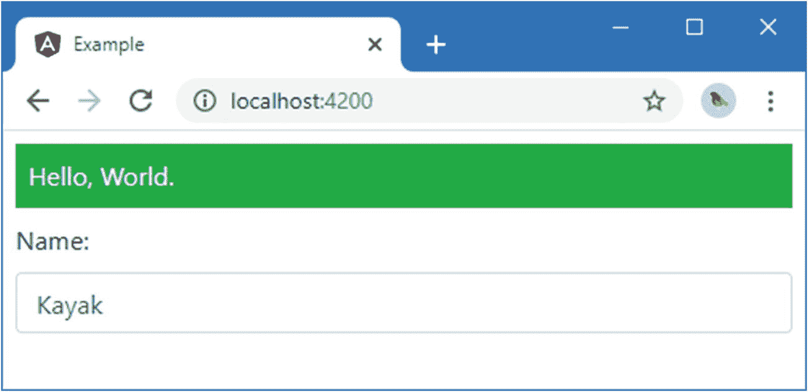
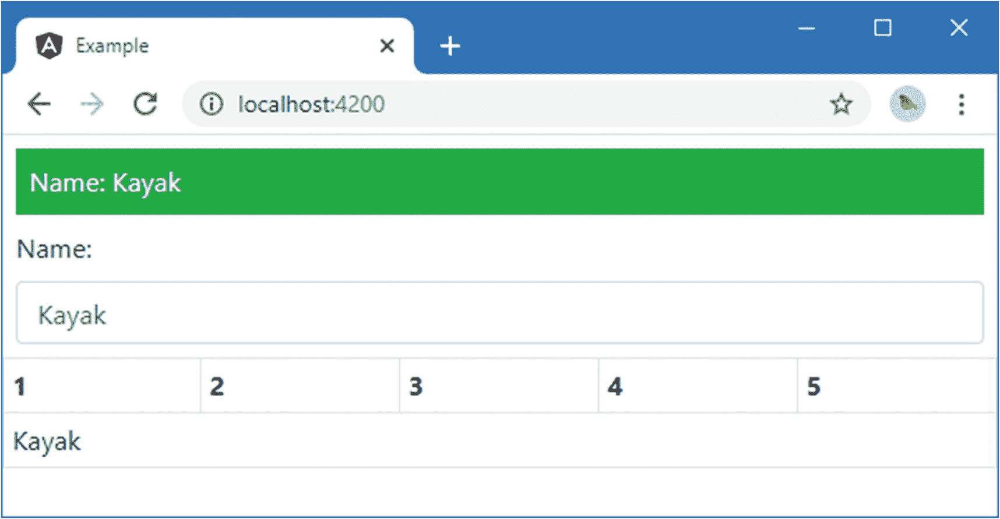

# 十二、使用数据绑定

前一章中的示例应用包含一个显示给用户的简单模板，该模板包含一个数据绑定，该数据绑定显示数据模型中有多少对象。在这一章中，我将描述 Angular 提供的基本数据绑定，并演示如何使用它们来生成动态内容。在后面的章节中，我将描述更高级的数据绑定，并解释如何用自定义特性扩展 Angular 绑定系统。表 [12-1](#Tab1) 将数据绑定放在上下文中。

表 12-1。

将数据绑定放在上下文中

<colgroup><col class="tcol1 align-left"> <col class="tcol2 align-left"></colgroup> 
| 

问题

 | 

回答

 |
| --- | --- |
| 它们是什么？ | 数据绑定是嵌入到模板中的表达式，用于在 HTML 文档中生成动态内容。 |
| 它们为什么有用？ | 数据绑定提供了 HTML 文档和模板文件中的 HTML 元素与应用中的数据和代码之间的链接。 |
| 它们是如何使用的？ | 数据绑定作为 HTML 元素的属性或字符串中的特殊字符序列来应用。 |
| 有什么陷阱或限制吗？ | 数据绑定包含简单的 JavaScript 表达式，计算这些表达式可以生成内容。主要的缺陷是在绑定中包含太多的逻辑，因为这样的逻辑不能在应用的其他地方正确地测试或使用。数据绑定表达式应该尽可能简单，并依赖组件(和其他有 Angular 的特性，如管道)来提供复杂的应用逻辑。 |
| 有其他选择吗？ | 不。数据绑定是 Angular 开发的重要组成部分。 |

表 [12-2](#Tab2) 总结了本章内容。

表 12-2。

章节总结

<colgroup><col class="tcol1 align-left"> <col class="tcol2 align-left"> <col class="tcol3 align-left"></colgroup> 
| 

问题

 | 

解决办法

 | 

列表

 |
| --- | --- | --- |
| 在 HTML 文档中动态显示数据 | 定义数据绑定 | 1–4 |
| 配置 HTML 元素 | 使用标准属性或特性绑定 | 5, 8 |
| 设置元素的内容 | 使用字符串插值绑定 | 6, 7 |
| 配置元素被分配到的类 | 使用类绑定 | 9–13 |
| 配置应用于元素的各个样式 | 使用样式绑定 | 14–17 |
| 手动触发数据模型更新 | 使用浏览器的 JavaScript 控制台 | 18, 19 |

## 为本章做准备

对于这一章，我继续使用第 [11](11.html) 章中的示例项目。为了准备本章，我向组件类添加了一个方法，如清单 [12-1](#PC1) 所示。

Tip

你可以从 [`https://github.com/Apress/pro-angular-9`](https://github.com/Apress/pro-angular-9) 下载本章以及本书其他章节的示例项目。如果在运行示例时遇到问题，请参见第 [1](01.html) 章获取帮助。

```ts
import { Component } from "@angular/core";
import { Model } from "./repository.model";

@Component({
    selector: "app",
    templateUrl: "template.html"
})
export class ProductComponent {
    model: Model = new Model();

    getClasses(): string {
        return this.model.getProducts().length == 5 ? "bg-success" : "bg-warning";
    }
}

Listing 12-1.Adding a Method in the component.ts File in the src/app Folder

```

在`example`文件夹中运行以下命令，启动 Angular 开发工具:

```ts
ng serve

```

打开一个新的浏览器并导航到`http://localhost:4200`以查看将要显示的内容，如图 [12-1](#Fig1) 所示。


图 12-1。

运行示例应用

## 了解单向数据绑定

*单向数据绑定*用于为用户生成内容，是 Angular 模板中使用的基本特征。术语*单向*指的是数据向一个方向流动的事实，这意味着数据从组件*向*数据绑定*流动，以便可以在模板中显示。*

Tip

还有其他类型的 Angular 数据绑定，我将在后面的章节中介绍。事件绑定从另一个方向流动，从模板中的元素到应用的其余部分，它们允许用户交互。*双向绑定*允许数据双向流动，最常用于表单中。其他绑定详见 [13](13.html) 和 [14](14.html) 章节。

为了开始单向数据绑定，我替换了模板的内容，如清单 [12-2](#PC3) 所示。

```ts
<div [ngClass]="getClasses()" >
    Hello, World.
</div>

Listing 12-2.The Contents of the template.html File in the src/app Folder

```

当您保存对模板的更改时，开发工具将重新构建应用并触发浏览器重新加载，显示如图 [12-2](#Fig2) 所示的输出。


图 12-2。

使用单向数据绑定

这是一个简单的例子，但它展示了数据绑定的基本结构，如图 [12-3](#Fig3) 所示。


图 12-3。

数据绑定的剖析

数据绑定有以下四个部分:

*   *主机元素*是 HTML 元素，绑定将通过改变它的外观、内容或行为来影响它。

*   方括号*告诉 Angular 这是一个单向数据绑定。当 Angular 在数据绑定中看到方括号时，它将计算表达式，并将结果传递给绑定的*目标*，以便修改主机元素。*

*   *目标*指定绑定将做什么。有两种不同类型的目标:一个*指令*或者一个*属性绑定*。

*   *表达式*是 JavaScript 的一个片段，使用模板的组件来提供上下文，这意味着组件的属性和方法可以包含在表达式中，就像示例绑定中的`getClasses`方法一样。

查看清单 [12-2](#PC3) 中的绑定，您可以看到主机元素是一个`div`元素，这意味着这是绑定想要修改的元素。表达式调用组件的`getClasses`方法，该方法在本章开始时定义。该方法根据数据模型中对象的数量返回一个包含引导 CSS 类的字符串。

```ts
...
getClasses(): string {
    return this.model.getProducts().length == 5 ? "bg-success" : "bg-warning";
}
...

```

如果数据模型中有五个对象，那么方法返回`bg-success`，这是一个应用绿色背景的引导类。否则，该方法返回`bg-warning`，这是一个应用琥珀色背景的引导类。

数据绑定的目标是一个指令，它是一个专门为支持数据绑定而编写的类。Angular 附带了一些有用的内置指令，您可以创建自己的指令来提供定制功能。内置指令的名称以`ng`开头，这告诉您`ngClass`目标是内置指令之一。目标通常给出指令做什么的指示，顾名思义，`ngClass`指令将在一个或多个类中添加或移除主机元素，当表达式被求值时，这些类的名称被返回。

综上所述，数据绑定将根据数据模型中项的数量将`div`元素添加到`bg-success`或`bg-warning`类中。

由于应用启动时模型中有五个对象(因为初始数据被硬编码到第 11 章[中创建的`SimpleDataSource`类中)，`getClasses`方法返回`bg-success`并产生如图](11.html) [12-3](#Fig3) 所示的结果，给`div`元素添加绿色背景。

### 了解绑定目标

当 Angular 处理数据绑定的目标时，它首先检查它是否匹配一个指令。大多数应用将依赖 Angular 提供的内置指令和提供应用特定功能的自定义指令的混合。您通常可以判断指令何时是数据绑定的目标，因为名称将是独特的，并给出了该指令的一些用途。内置指令可以通过前缀`ng`来识别。清单 [12-2](#PC3) 中的绑定提示您，目标是一个内置指令，与宿主元素的类成员资格相关。为了快速参考，表 [12-3](#Tab3) 描述了基本的内置 Angular 指令以及它们在本书中的描述位置。(在后面的章节中还描述了其他指令，但这些是最简单的，也是您最常使用的。)

表 12-3。

基本的内置 Angular 指令

<colgroup><col class="tcol1 align-left"> <col class="tcol2 align-left"></colgroup> 
| 

名字

 | 

描述

 |
| --- | --- |
| `ngClass` | 该指令用于将宿主元素分配给类，如“设置类和样式”一节中所述。 |
| `ngStyle` | 该指令用于设置单个样式，如“设置类和样式”一节所述。 |
| `ngIf` | 如第 [13 章](13.html)所述，该指令用于在表达式的值为`true`时在 HTML 文档中插入内容。 |
| `ngFor` | 该指令为数据源中的每一项在 HTML 文档中插入相同的内容，如第 [13](13.html) 章所述。 |
| `ngSwitchngSwitchCasengSwitchDefault` | 这些指令用于根据表达式的值选择插入 HTML 文档的内容块，如第 [13](13.html) 章所述。 |
| `ngTemplateOutlet` | 该指令用于重复内容块，如第 [13](13.html) 章所述。 |

#### 了解属性绑定

如果绑定目标与指令不对应，那么 Angular 会检查目标是否可以用来创建属性绑定。有五种不同类型的属性绑定，在表 [12-4](#Tab4) 中列出，以及详细描述它们的细节。

表 12-4。

Angular 属性绑定

<colgroup><col class="tcol1 align-left"> <col class="tcol2 align-left"></colgroup> 
| 

名字

 | 

描述

 |
| --- | --- |
| `[property]` | 这是标准属性绑定，用于在表示文档对象模型(DOM)中的主机元素的 JavaScript 对象上设置属性，如“使用标准属性和属性绑定”一节中所述。 |
| `[attr.name]` | 这是属性绑定，用于设置没有 DOM 属性的宿主 HTML 元素的属性值，如“使用属性绑定”一节所述。 |
| `[class.name]` | 这是特殊的类属性绑定，用于配置宿主元素的类成员资格，如“使用类绑定”一节所述。 |
| `[style.name]` | 这是特殊的样式属性绑定，用于配置宿主元素的样式设置，如“使用样式绑定”一节所述。 |

### 理解表达

数据绑定中的表达式是 JavaScript 代码的一个片段，对其求值以提供目标值。表达式可以访问组件定义的属性和方法，这就是清单 [12-2](#PC3) 中的绑定如何能够调用`getClasses`方法来为`ngClass`指令提供主机元素应该添加到的类的名称。

表达式不限于调用方法或从组件读取属性；他们还可以执行大多数标准的 JavaScript 操作。作为一个例子，清单 [12-3](#PC5) 显示了一个表达式，它有一个与`getClasses`方法的结果连接的字符串值。

```ts
<div [ngClass]="'text-white m-2 p-2 ' + getClasses()" >
    Hello, World.
</div>

Listing 12-3.Performing an Operation in the template.html File in the src/app Folder

```

表达式用双引号括起来，这意味着字符串文字必须用单引号定义。JavaScript 连接操作符是`+`字符，表达式的结果将是两个字符串的组合，如下所示:

```ts
text-white m-2 p-2 bg-success

```

其效果是，`ngClass`指令将主机元素添加到四个类中，`text-white`、`m-2`和`p-2`，Bootstrap 使用这些类来设置文本颜色，并在元素内容周围添加边距和填充；和`bg-success`，它设置背景颜色。图 [12-4](#Fig4) 显示了这两类的组合。


图 12-4。

在 JavaScript 表达式中组合类

编写表达式时很容易忘乎所以，在模板中包含复杂的逻辑。这可能会导致问题，因为表达式不会被 TypeScript 编译器检查，也不容易进行单元测试，这意味着在部署应用之前，错误很可能不会被发现。为了避免这个问题，表达式应该尽可能简单，并且理想情况下，只用于从组件中检索数据并将其格式化以供显示。所有复杂的检索和处理逻辑都应该在组件或模型中定义，在那里可以对其进行编译和测试。

### 理解括号

方括号(`[`和`]`字符)告诉 Angular 这是一个单向数据绑定，其中有一个表达式应该被求值。如果您省略了括号并且目标是一个指令，Angular 仍然会处理绑定，但是不会计算表达式，并且引号字符之间的内容将作为文字值传递给指令。清单 [12-4](#PC7) 用一个没有方括号的绑定向模板添加了一个元素。

```ts
<div [ngClass]="'text-white m-2 p-2 ' + getClasses()">
  Hello, World.
</div>
<div ngClass="'text-white m-2 p-2 ' + getClasses()">
  Hello, World.
</div>

Listing 12-4.Omitting the Brackets in a Data Binding in the template.html File in the src/app Folder

```

如果您在浏览器的 DOM 查看器中检查 HTML 元素(通过在浏览器窗口中右键单击并从弹出菜单中选择 Inspect 或 Inspect Element)，您将看到它的`class`属性已被设置为文字字符串，如下所示:

```ts
class="'text-white m-2 p-2 ' + getClasses()"

```

浏览器将尝试处理主机元素被分配到的类，但是元素的外观不会像预期的那样，因为类与 Bootstrap 使用的名称不对应。这是一个常见的错误，所以首先要检查一个绑定是否没有达到您预期的效果。

方括号并不是 Angular 在数据绑定中使用的唯一方括号。为了快速参考，表 [12-5](#Tab5) 提供了一套完整的括号，每个括号的含义，以及它们的详细描述。

表 12-5。

尖括号

<colgroup><col class="tcol1 align-left"> <col class="tcol2 align-left"></colgroup> 
| 

名字

 | 

描述

 |
| --- | --- |
| `[target]="expr"` | 方括号表示单向数据绑定，数据从表达式流向目标。这种绑定的不同形式是本章的主题。 |
| `{{expression}}` | 这是字符串插值绑定，在“使用字符串插值绑定”一节中有所描述。 |
| `(target) ="expr"` | 圆括号表示单向绑定，数据从目标流向表达式指定的目的地。这是用于处理事件的绑定，如第 [14](14.html) 章所述。 |
| `[(target)] ="expr"` | 这种括号的组合——被称为*盒中香蕉*——表示一种双向绑定，其中数据在由表达式指定的目标和目的地之间双向流动，如第 [14 章](14.html)中所述。 |

### 了解主体元素

宿主元素是数据绑定中最简单的部分。数据绑定可以应用于模板中的任何 HTML 元素，一个元素可以有多个绑定，每个绑定可以管理元素外观或行为的不同方面。在后面的示例中，您将看到具有多个绑定的元素。

## 使用标准属性和特性绑定

如果绑定的目标与指令不匹配，Angular 将尝试应用属性绑定。接下来的部分描述了最常见的属性绑定:标准属性绑定和属性绑定。

### 使用标准属性绑定

浏览器使用文档对象模型来表示 HTML 文档。HTML 文档中的每个元素，包括 host 元素，都使用 DOM 中的 JavaScript 对象来表示。像所有 JavaScript 对象一样，用于表示 HTML 元素的对象也有属性。这些属性用于管理元素的状态，例如，`value`属性用于设置`input`元素的内容。当浏览器解析 HTML 文档时，它会遇到每个新的 HTML 元素，在 DOM 中创建一个对象来表示它，并使用元素的属性来设置对象属性的初始值。

标准属性绑定允许您使用表达式的结果为表示宿主元素的对象设置属性值。例如，将一个绑定的目标设置为`value`将会设置一个`input`元素的内容，如清单 [12-5](#PC9) 所示。

```ts
<div [ngClass]="'text-white m-2 p-2 ' + getClasses()">
  Hello, World.
</div>
<div class="form-group m-2">
  <label>Name:</label>
  <input class="form-control" [value]="model.getProduct(1)?.name || 'None'" />
</div>

Listing 12-5.Using the Standard Property Binding in the template.html File in the src/app Folder

```

本例中的新绑定指定`value`属性应该绑定到一个表达式的结果，该表达式调用数据模型上的一个方法，通过指定一个键从存储库中检索数据对象。有可能没有带有那个键的数据对象，在这种情况下，存储库方法将返回`null`。

为了防止将`null`用于主机元素的 value 属性，绑定使用空条件操作符(`?`字符)来安全地导航该方法返回的结果，如下所示:

```ts
...
<input class="form-control" [value]="model.getProduct(1)?.name || 'None'" />
...

```

如果来自`getProduct`方法的结果不是`null`，那么表达式将读取`name`属性的值并将其用作结果。但是如果方法的结果是`null`，那么`name`属性将不会被读取，空合并操作符(`||`字符)将会把结果设置为`None`。

Getting to Know the HTML Element Properties

使用属性绑定可能需要做一些工作来确定需要设置哪个属性，因为 HTML 规范中存在不一致的地方。大多数属性的名称与设置其初始值的属性的名称相匹配，例如，如果您习惯于在一个`input`元素上设置`value`属性，那么您可以通过设置`value`属性达到相同的效果。但是有些属性名和属性名不匹配，有些属性根本不是由属性配置的。

Mozilla Foundation 为所有用于在 DOM 中表示 HTML 元素的对象提供了一个有用的参考。对于每个元素，Mozilla 提供了可用属性的摘要以及每个属性的用途。从`HTMLElement` ( `developer.mozilla.org/en-US/docs/Web/API/HTMLElement`)开始，它提供了所有元素共有的功能。然后，您可以分支到特定元素的对象中，比如用于表示`input`元素的`HTMLInputElement`。

当您保存对模板的修改时，浏览器会重新加载并显示一个`input`元素，其内容是模型库中关键字为`1`的数据对象的`name`属性，如图 [12-5](#Fig5) 所示。



图 12-5。

使用标准属性绑定

### 使用字符串插值绑定

Angular 提供了一个特殊版本的标准属性绑定，称为*字符串插值绑定*，用于在宿主元素的文本内容中包含表达式结果。要理解这种特殊绑定为什么有用，考虑一下如何使用标准属性绑定来设置元素的内容会有所帮助。属性用于设置 HTML 元素的内容，这意味着元素的内容可以使用数据绑定来设置，如清单 [12-6](#PC11) 所示。

```ts
<div [ngClass]="'text-white m-2 p-2 ' + getClasses()"
          [textContent]="'Name: ' + (model.getProduct(1)?.name || 'None')">
</div>
<div class="form-group m-2">
  <label>Name:</label>
  <input class="form-control" [value]="model.getProduct(1)?.name || 'None'" />
</div>

Listing 12-6.Setting an Element’s Content in the template.html File in the src/app Folder

```

新绑定中的表达式将一个文字字符串与一个方法调用的结果连接起来，以设置`div`元素的内容。

这个例子中的表达式很难写，需要特别注意引号、空格和括号，以确保输出中显示预期的结果。对于更复杂的绑定来说，这个问题变得更糟，因为在静态内容块中散布着多个动态值。

字符串插值绑定通过允许在元素内容中定义表达式片段简化了这个过程，如清单 [12-7](#PC12) 所示。

```ts
<div [ngClass]="'text-white m-2 p-2 ' + getClasses()">
  Name: {{ model.getProduct(1)?.name || 'None' }}
</div>
<div class="form-group m-2">
  <label>Name:</label>
  <input class="form-control" [value]="model.getProduct(1)?.name || 'None'" />
</div>

Listing 12-7.Using the String Interpolation Binding in the template.html File in the src/app Folder

```

字符串插值绑定使用成对的花括号(`{{`和`}}`)来表示。一个元素可以包含多个字符串插值绑定。

Angular 将 HTML 元素的内容与方括号的内容结合起来，为`textContent`属性创建一个绑定。结果和清单 [12-6](#PC11) 一样，如图 [12-6](#Fig6) 所示，但是编写绑定的过程更简单，更不容易出错。


图 12-6。

使用字符串插值绑定

### 使用属性绑定

HTML 和 DOM 规范中有一些奇怪的地方，这意味着并非所有的 HTML 元素属性在 DOM API 中都有等价的属性。对于这些情况，Angular 提供了*属性绑定*，用于设置主机元素的属性，而不是设置在 DOM 中表示它的 JavaScript 对象的值。

最常用的没有相应属性的属性是`colspan`，它用于设置一个`td`元素在一个表中所占的列数。清单 [12-8](#PC13) 展示了如何使用属性绑定来根据数据模型中对象的数量设置`colspan`元素。

```ts
<div [ngClass]="'text-white m-2 p-2 ' + getClasses()">
  Name: {{model.getProduct(1)?.name || 'None'}}
</div>
<div class="form-group m-2">
  <label>Name:</label>
  <input class="form-control" [value]="model.getProduct(1)?.name || 'None'" />
</div>
<table class="table table-sm table-bordered table-striped mt-2">
    <tr>
        <th>1</th><th>2</th><th>3</th><th>4</th><th>5</th>
    </tr>
    <tr>
        <td [attr.colspan]="model.getProducts().length">
            {{model.getProduct(1)?.name || 'None'}}
        </td>
    </tr>
</table>

Listing 12-8.Using an Attribute Binding in the template.html File in the src/app Folder

```

属性绑定是通过定义一个目标来应用的，该目标在属性的名称前加上前缀`attr.`(术语`attr`，后跟一个句点)。在清单中，我使用了属性绑定来设置表中一个`td`元素上的`colspan`元素的值，如下所示:

```ts
...
<td [attr.colspan]="model.getProducts().length">
...

```

Angular 将计算表达式并将`colspan`属性的值设置为结果。由于数据模型是从五个数据对象开始的，结果是`colspan`属性创建了一个跨越五列的表格单元，如图 [12-7](#Fig7) 所示。



图 12-7。

使用属性绑定

## 设置类别和样式

Angular 在属性绑定中为将宿主元素分配给类以及配置单个样式属性提供了特殊支持。我将在接下来的章节中描述这些绑定，以及提供密切相关特性的`ngClass`和`ngStyle`指令的细节。

### 使用类绑定

有三种不同的方法可以使用数据绑定来管理元素的类成员资格:标准属性绑定、特殊类绑定和`ngClass`指令。表 [12-6](#Tab6) 中描述了这三种方法，每种方法的工作方式略有不同，在不同的情况下都很有用，如下文所述。

表 12-6。

Angular 类绑定

<colgroup><col class="tcol1 align-left"> <col class="tcol2 align-left"></colgroup> 
| 

例子

 | 

描述

 |
| --- | --- |
| `<div [class]="expr"></div>` | 此绑定计算表达式，并使用结果替换任何现有的类成员身份。 |
| `<div [class.myClass]="expr"></div>` | 这个绑定对表达式求值，并使用结果来设置元素的成员资格`myClass`。 |
| `<div [ngClass]="map"></div>` | 该绑定使用 map 对象中的数据设置多个类的类成员资格。 |

#### 用标准绑定设置元素的所有类

标准属性绑定可用于在一个步骤中设置元素的所有类，这在组件中有一个方法或属性以单个字符串返回元素所属的所有类(名称用空格分隔)时非常有用。清单 [12-9](#PC15) 显示了组件中`getClasses`方法的修改，它基于`Product`对象的`price`属性返回不同的类名字符串。

```ts
import { Component } from "@angular/core";
import { Model } from "./repository.model";

@Component({
    selector: "app",
    templateUrl: "template.html"
})
export class ProductComponent {
    model: Model = new Model();

    getClasses(key: number): string {
        let product = this.model.getProduct(key);
        return "p-2 " + (product.price < 50 ? "bg-info" : "bg-warning");
    }
}

Listing 12-9.Providing All Classes in a Single String in the component.ts File in the src/app Folder

```

来自`getClasses`方法的结果将包括`p-2`类，它为所有的`Product`对象在主机元素的内容周围添加填充。如果`price`属性的值小于 50，结果中将包含`bg-info`类，如果值大于等于 50，将包含`bg-warning`类(这些类设置不同的背景颜色)。

Tip

您必须确保类名由空格分隔。

清单 [12-10](#PC16) 显示了模板中使用的标准属性绑定，使用组件的`getClasses`方法设置主机元素的`class`属性。

```ts
<div class="text-white m-2">
  <div [class]="getClasses(1)">
    The first product is {{model.getProduct(1).name}}.
  </div>
  <div [class]="getClasses(2)">
    The second product is {{model.getProduct(2).name}}
  </div>
</div>

Listing 12-10.Setting Class Memberships in the template.html File in the src/app Folder

```

当使用标准属性绑定来设置`class`属性时，表达式的结果将替换元素所属的任何以前的类，这意味着只有当绑定表达式返回所有需要的类时，才能使用它，如本例所示，产生如图 [12-8](#Fig8) 所示的结果。


图 12-8。

设置类成员资格

#### 使用特殊的类绑定设置单个类

特殊的类绑定提供了比标准属性绑定更细粒度的控制，并允许使用表达式管理单个类的成员资格。如果您希望在元素的现有类成员基础上构建，而不是完全替换它们，这将非常有用。清单 [12-11](#PC17) 展示了特殊类绑定的使用。

```ts
<div class="text-white m-2">
  <div [class]="getClasses(1)">
    The first product is {{model.getProduct(1).name}}.
  </div>
  <div class="p-2"
       [class.bg-success]="model.getProduct(2).price < 50"
       [class.bg-info]="model.getProduct(2).price >= 50">
    The second product is {{model.getProduct(2).name}}
  </div>
</div>

Listing 12-11.Using the Special Class Binding in the template.html File in the src/app Folder

```

这个特殊的类绑定是用一个 target 指定的，target 组合了术语`class`，后跟一个句点，再跟一个被管理成员的类名。在清单中，有两个特殊的类绑定，它们管理`bg-success`和`bg-info`类的成员。

如果表达式的结果是*真值*，那么特殊的类绑定会将主机元素添加到指定的类中(如“理解真值和假值”侧栏中所述)。在这种情况下，如果`price`属性小于 50，则主机元素将是`bg-success`类的成员，如果价格属性大于等于 50，则主机元素将是`bg-info`类的成员。

这些绑定相互独立，不会干扰元素所属的任何现有类，例如`p-2`类，Bootstrap 使用它在元素内容周围添加填充。

Understanding Truthy and Falsy

JavaScript 有一个奇怪的特性，表达式的结果可能是真的，也可能是假的，这为粗心的人提供了一个陷阱。以下结果总是假的:

*   `false` ( `boolean`)值

*   `0` ( `number`)值

*   空字符串(`""`)

*   `null`

*   `undefined`

*   `NaN`(特殊数值)

所有其他值都是真实的，这可能会令人困惑。例如，`"false"`(内容为单词`false`的字符串)为 truthy。避免混淆的最好方法是只使用评估为`boolean`值`true`和`false`的表达式。

#### 使用 nclass 指令设置类

`ngClass`指令是标准和特殊属性绑定的一种更灵活的替代方式，根据表达式返回的数据类型表现不同，如表 [12-7](#Tab7) 所述。

表 12-7。

ngClass 指令支持的表达式结果类型

<colgroup><col class="tcol1 align-left"> <col class="tcol2 align-left"></colgroup> 
| 

名字

 | 

描述

 |
| --- | --- |
| `String` | 主机元素被添加到由字符串指定的类中。多个类由空格分隔。 |
| `Array` | 数组中的每个对象都是宿主元素将被添加到的类的名称。 |
| `Object` | 对象上的每个属性都是一个或多个类的名称，用空格分隔。如果属性值为 true，则宿主元素将被添加到类中。 |

字符串和数组特性很有用，但是使用对象(称为*映射*)来创建复杂的类成员关系策略的能力使得`ngClass`指令特别有用。清单 [12-12](#PC18) 显示了返回地图对象的组件方法的添加。

```ts
import { Component } from "@angular/core";
import { Model } from "./repository.model";

@Component({
    selector: "app",
    templateUrl: "template.html"
})
export class ProductComponent {
    model: Model = new Model();

    getClasses(key: number): string {
        let product = this.model.getProduct(key);
        return "p-2 " + (product.price < 50 ? "bg-info" : "bg-warning");
    }

    getClassMap(key: number): Object {
        let product = this.model.getProduct(key);
        return {
            "text-center bg-danger": product.name == "Kayak",
            "bg-info": product.price < 50
        };
    }
}

Listing 12-12.Returning a Class Map Object in the component.ts File in the src/app Folder

```

`getClassMap`方法返回一个对象，该对象的属性值是一个或多个类名，其值基于`Product`对象的属性值，该对象的键被指定为方法参数。例如，当密钥为 1 时，该方法返回此对象:

```ts
...
{
  "text-center bg-danger":true,
  "bg-info":false
}
...

```

第一个属性将主机元素分配给`text-center`类(Bootstrap 使用它来水平居中文本)和`bg-danger`类(它设置元素的背景颜色)。第二个属性的值为`false`，这意味着主机元素不会被添加到`bg-info`类中。指定一个不会导致元素被添加到类中的属性可能看起来很奇怪，但是，您很快就会看到，表达式的值会自动更新以反映应用中的变化，并且能够定义一个以这种方式指定成员资格的 map 对象可能会很有用。

清单 [12-13](#PC20) 显示了`getClassMap`和它返回的映射对象，这些对象被用作针对`ngClass`指令的数据绑定的表达式。

```ts
<div class="text-white m-2">
  <div class="p-2" [ngClass]="getClassMap(1)">
    The first product is {{model.getProduct(1).name}}.
  </div>
  <div class="p-2" [ngClass]="getClassMap(2)">
    The second product is {{model.getProduct(2).name}}.
  </div>
  <div class="p-2" [ngClass]="{'bg-success': model.getProduct(3).price < 50,
                                'bg-info': model.getProduct(3).price >= 50}">
        The third product is {{model.getProduct(3).name}}
  </div>
</div>

Listing 12-13.Using the ngClass Directive in the template.html File in the src/app Folder

```

前两个`div`元素有使用`getClassMap`方法的绑定。第三个`div`元素显示了另一种方法，即在模板中定义地图。对于这个元素，`bg-info`和`bg-warning`类的成员关系与`Product`对象的价格属性的值相关联，如图 [12-9](#Fig9) 所示。应该小心使用这种技术，因为表达式包含不容易测试的 JavaScript 逻辑。


图 12-9。

使用 nclass 指令

### 使用样式绑定

有三种不同的方法可以使用数据绑定来设置主机元素的样式属性:标准属性绑定、特殊样式绑定和`ngStyle`指令。表 [12-8](#Tab8) 中描述了这三种方法，并在以下章节中进行了演示。

表 12-8。

有 Angular 的样式绑定

<colgroup><col class="tcol1 align-left"> <col class="tcol2 align-left"></colgroup> 
| 

例子

 | 

描述

 |
| --- | --- |
| `<div [style.myStyle]="expr"></div>` | 这是标准的属性绑定，用于将单个样式属性设置为表达式的结果。 |
| `<div [style.myStyle.units]="expr"></div>` | 这是特殊的样式绑定，它允许将样式值的单位指定为目标的一部分。 |
| `<div [ngStyle]="map"></div>` | 此绑定使用地图对象中的数据设置多个样式属性。 |

#### 设置单一样式属性

标准属性绑定和特殊样式绑定用于设置单个样式属性的值。这些绑定之间的区别在于，标准属性绑定必须包含样式所需的单元，而特殊绑定允许将单元包含在绑定目标中。为了演示不同之处，清单 [12-14](#PC21) 向组件添加了两个新属性。

```ts
import { Component } from "@angular/core";
import { Model } from "./repository.model";

@Component({
    selector: "app",
    templateUrl: "template.html"
})
export class ProductComponent {
    model: Model = new Model();

    getClasses(key: number): string {
        let product = this.model.getProduct(key);
        return "p-2 " + (product.price < 50 ? "bg-info" : "bg-warning");
    }

    getClassMap(key: number): Object {
        let product = this.model.getProduct(key);
        return {
            "text-center bg-danger": product.name == "Kayak",
            "bg-info": product.price < 50
        };
    }

    fontSizeWithUnits: string = "30px";
    fontSizeWithoutUnits: string= "30";
}

Listing 12-14.Adding Properties in the component.ts File in the src/app Folder

```

`fontSizeWithUnits`属性返回一个值，该值包括一个数量和表示该数量的单位:30 像素。属性只返回数量，没有任何单位信息。清单 [12-15](#PC22) 展示了如何将这些属性用于标准和特殊绑定。

Caution

不要试图使用标准属性绑定来针对`style`属性设置多个样式值。由表示 DOM 中主机元素的 JavaScript 对象的`style`属性返回的对象是只读的。有些浏览器会忽略这一点，允许进行更改，但结果是不可预测的，也是不可靠的。如果你想设置多个样式属性，那么为每个属性创建一个绑定或者使用`ngStyle`指令。

```ts
<div class="text-white m-2">
  <div class="p-2 bg-warning">
    The <span [style.fontSize]="fontSizeWithUnits">first</span>
    product is {{model.getProduct(1).name}}.
  </div>
  <div class="p-2 bg-info">
    The <span [style.fontSize.px]="fontSizeWithoutUnits">second</span>
    product is {{model.getProduct(2).name}}
  </div>
</div>

Listing 12-15.Using Style Bindings in the template.html File in the src/app Folder

```

绑定的目标是`style.fontSize`，它设置用于主机元素内容的字体大小。这个绑定的表达式使用了`fontSizeWithUnits`属性，其值包括设置字体大小所需的单位`px`像素。

特殊绑定的目标是`style.fontSize.px`，它告诉 Angular 表达式的值指定了像素数。这允许绑定使用组件的`fontSizeWithoutUnits`属性，它不包括单元。

Tip

您可以使用 JavaScript 属性名称格式(`[style.fontSize]`)或 CSS 属性名称格式(`[style.font-size]`)来指定样式属性。

两个绑定的结果是一样的，都是将`span`元素的字体大小设置为 30 像素，产生如图 [12-10](#Fig10) 所示的结果。


图 12-10。

设置单个样式属性

#### 使用 ngStyle 指令设置样式

`ngStyle`指令允许使用一个地图对象设置多个样式属性，类似于`ngClass`指令的工作方式。清单 [12-16](#PC23) 显示了添加一个组件方法，返回一个包含样式设置的地图。

```ts
import { Component } from "@angular/core";
import { Model } from "./repository.model";

@Component({
    selector: "app",
    templateUrl: "template.html"
})
export class ProductComponent {
    model: Model = new Model();

    getClasses(key: number): string {
        let product = this.model.getProduct(key);
        return "p-2 " + (product.price < 50 ? "bg-info" : "bg-warning");
    }

    getStyles(key: number) {
        let product = this.model.getProduct(key);
        return {
            fontSize: "30px",
            "margin.px": 100,
            color: product.price > 50 ? "red" : "green"
        };
    }
}

Listing 12-16.Creating a Style Map Object in the component.ts File in the src/app Folder

```

由`getStyle`方法返回的 map 对象表明`ngStyle`指令能够支持可用于属性绑定的两种格式，包括值中的单位或属性名。下面是当 key 参数的值为 1 时，`getStyles`方法产生的 map 对象:

```ts
...
{
  "fontSize":"30px",
  "margin.px":100,
  "color":"red"
}
...

```

清单 [12-17](#PC25) 显示了模板中使用`ngStyle`指令的数据绑定，其表达式调用`getStyles`方法。

```ts
<div class="text-white m-2">
  <div class="p-2 bg-warning">
    The <span [ngStyle]="getStyles(1)">first</span>
    product is {{model.getProduct(1).name}}.
  </div>
  <div class="p-2 bg-info">
    The <span [ngStyle]="getStyles(2)">second</span>
    product is {{model.getProduct(2).name}}
  </div>
</div>

Listing 12-17.Using the ngStyle Directive in the template.html File in the src/app Folder

```

结果是每个`span`元素接收一组定制的样式，基于传递给`getStyles`方法的参数，如图 [12-11](#Fig11) 所示。


图 12-11。

使用 ngStyle 指令

## 更新应用中的数据

当您开始使用 Angular 时，似乎需要花费很多精力来处理数据绑定，记住在不同的情况下需要哪种绑定。你可能想知道这是否值得努力。

绑定值得理解，因为当它们所依赖的数据改变时，它们的表达式会被重新计算。例如，如果您使用字符串插值绑定来显示属性值，则当属性值更改时，绑定将自动更新。

为了提供一个演示，我将跳到前面，向您展示如何手动控制更新过程。这不是正常 Angular 开发中需要的技术，但它提供了一个为什么绑定如此重要的坚实的演示。清单 [12-18](#PC26) 显示了对支持演示的组件的一些更改。

```ts
import { ApplicationRef, Component } from "@angular/core";
import { Model } from "./repository.model";
import { Product } from "./product.model";

@Component({
    selector: "app",
    templateUrl: "template.html"
})
export class ProductComponent {
    model: Model = new Model();

    constructor(ref: ApplicationRef) {
        (<any>window).appRef = ref;
        (<any>window).model = this.model;
    }

    getProductByPosition(position: number): Product {
        return this.model.getProducts()[position];
    }

    getClassesByPosition(position: number): string {
        let product = this.getProductByPosition(position);
        return "p-2 " + (product.price < 50 ? "bg-info" : "bg-warning");
    }
}

Listing 12-18.Preparing the Component in the component.ts File in the src/app Folder

```

我已经从`@angular/core`模块中导入了`ApplicationRef`类型。当 Angular 执行引导过程时，它创建一个`ApplicationRef`对象来表示应用。清单 [12-18](#PC26) 使用 Angular 依赖注入特性，向接收`ApplicationRef`对象作为参数的组件添加一个构造函数，我在第 [19 章](19.html)中对此进行了描述。现在不讨论细节，像这样声明一个构造函数参数告诉 Angular，当一个新的实例被创建时，组件想要接收`ApplicationRef`对象。

在构造函数中，有两个语句使演示成为可能，但如果在实际项目中使用，会破坏使用 TypeScript 和 Angular 的许多好处。

```ts
...
(<any>window).appRef = ref;
(<any>window).model = this.model;
...

```

这些语句在全局名称空间中定义变量，并将`ApplicationRef`和`Model`对象分配给它们。保持全局名称空间尽可能清晰是一个好习惯，但是公开这些对象允许通过浏览器的 JavaScript 控制台操作它们，这对本例很重要。

添加到构造函数中的其他方法允许根据位置从存储库中检索`Product`对象，而不是根据它的键，并根据`price`属性的值生成不同的类别映射。

清单 [12-19](#PC28) 显示了对模板的相应更改，它使用`ngClass`指令来设置类成员资格，并使用字符串插值绑定来显示 [`Product.name`](http://product.name) 属性的值。

```ts
<div class="text-white m-2">
  <div [ngClass]="getClassesByPosition(0)">
    The first product is {{getProductByPosition(0).name}}.
  </div>
  <div [ngClass]="getClassesByPosition(1)">
    The second product is {{getProductByPosition(1).name}}
  </div>
</div>

Listing 12-19.Preparing for Changes in the template.html File in the src/app Folder

```

保存对组件和模板的更改。浏览器重新加载页面后，在浏览器的 JavaScript 控制台中输入以下语句，然后按 Return 键:

```ts
model.products.shift()

```

该语句对模型中的`Product`对象的数组调用`shift`方法，从数组中移除第一个项目并返回它。您还看不到任何变化，因为 Angular 不知道模型已经被修改。要让 Angular 检查更改，请在浏览器的 JavaScript 控制台中输入以下语句，然后按 Return 键:

```ts
appRef.tvick()

```

`tick`方法启动 Angular 变化检测过程，其中 Angular 查看应用中的数据和数据绑定中的表达式，并处理任何变化。模板中的数据绑定使用特定的数组索引来显示数据，现在已经从模型中移除了一个对象，绑定将被更新以显示新的值，如图 [12-12](#Fig12) 所示。


图 12-12。

手动更新应用模型

值得花点时间来思考一下变更检测过程运行时发生了什么。Angular 重新评估了模板中绑定的表达式，并更新了它们的值。反过来，`ngClass`指令和字符串插值绑定通过改变它们的类成员和显示新内容来重新配置它们的宿主元素。

发生这种情况是因为 Angular 数据绑定是活动的，这意味着在初始内容显示给用户之后，表达式、目标和主机元素之间的关系继续存在，并动态地反映应用状态的变化。我承认，当您不必使用 JavaScript 控制台进行更改时，这种效果更令人印象深刻。我会在第 14 章[的](14.html)中解释 Angular 如何允许用户使用事件和表单来触发变化。

## 摘要

在本章中，我描述了 Angular 数据绑定的结构，并向您展示了如何使用它们来创建应用中的数据和显示给用户的 HTML 元素之间的关系。我介绍了属性绑定，并描述了如何使用两个内置指令— `ngClass`和`ngStyle`。在下一章，我将解释更多的内置指令是如何工作的。