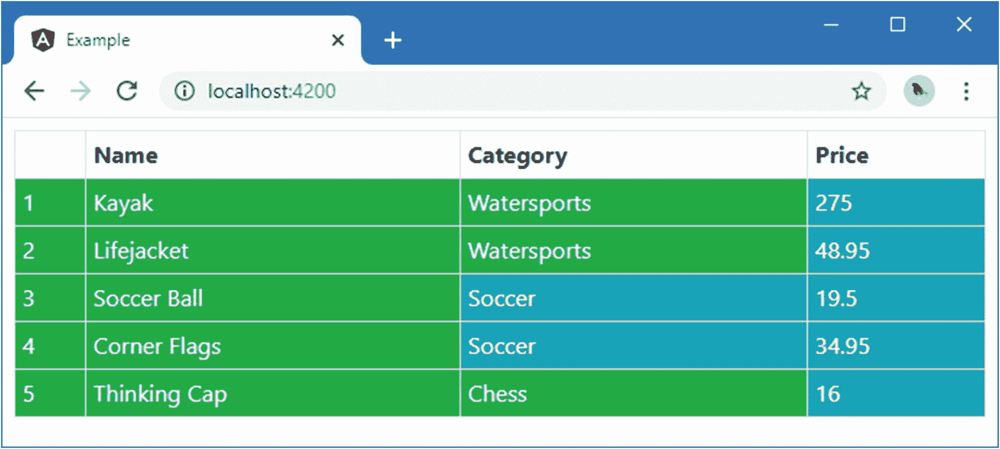
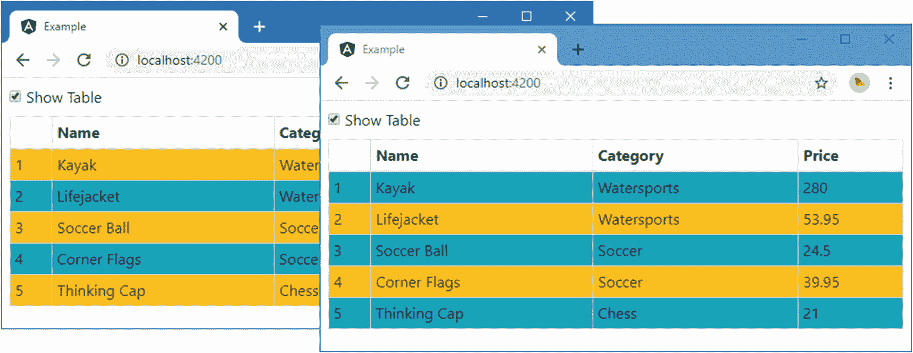
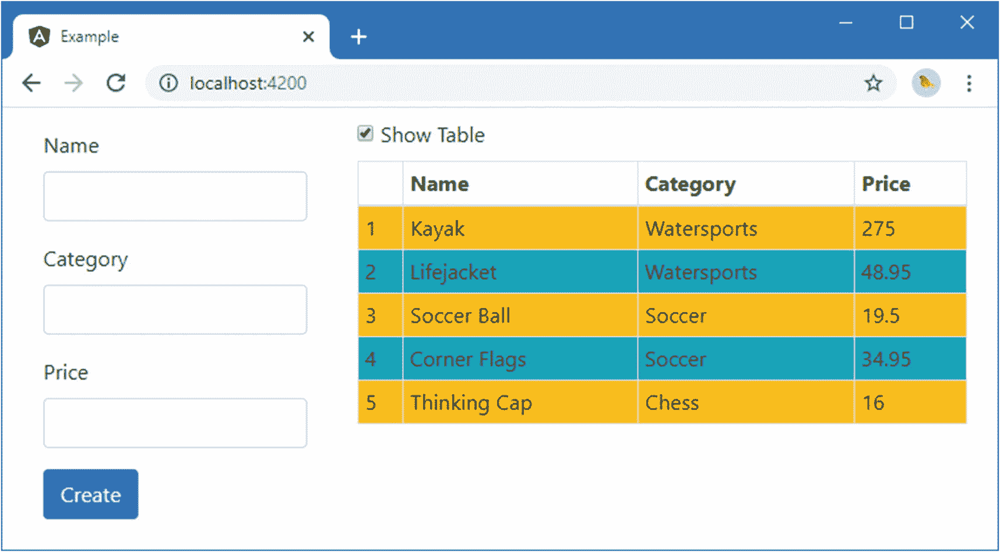
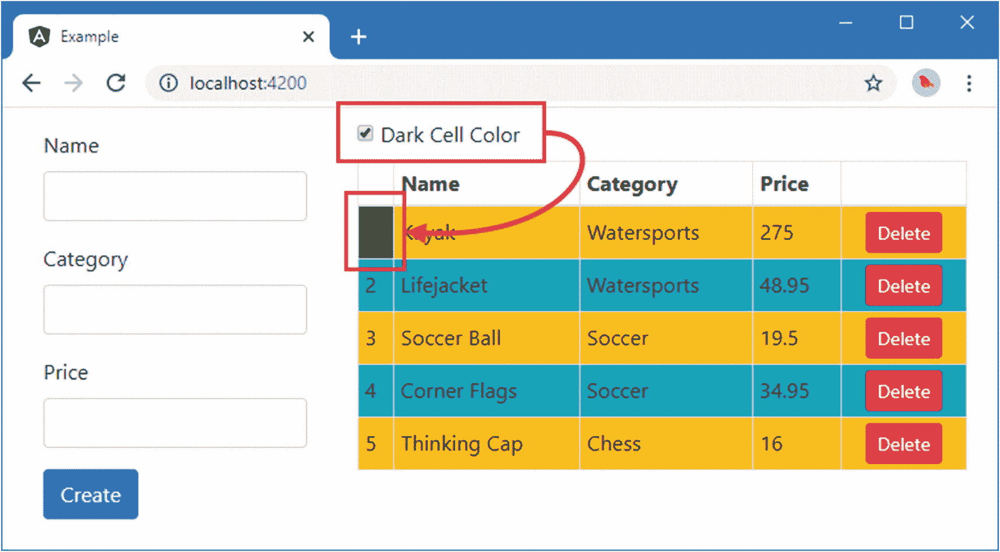
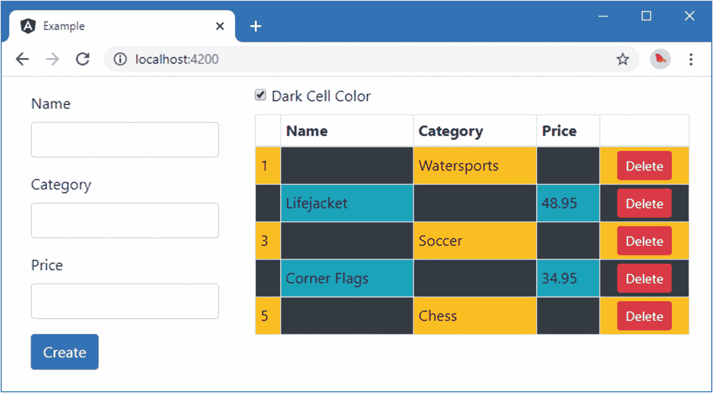

# 十六、创建结构化指令

结构指令通过添加和删除元素来改变 HTML 文档的布局。它们建立在第 [15 章](15.html)中描述的可用于属性指令的核心特性之上，并附加了对微模板的支持，微模板是组件使用的模板中定义的内容的小片段。您可以识别出什么时候使用了结构化指令，因为它的名称前面会有一个星号，比如`*ngIf`或`*ngFor`。在这一章中，我将解释如何定义和应用结构化指令，它们如何工作，以及它们如何响应数据模型中的变化。表 [16-1](#Tab1) 将结构指令放在上下文中。

表 16-1。

将结构指令放在上下文中

<colgroup><col class="tcol1 align-left"> <col class="tcol2 align-left"></colgroup> 
| 

问题

 | 

回答

 |
| --- | --- |
| 它们是什么？ | 结构化指令使用微型模板向 HTML 文档添加内容。 |
| 它们为什么有用？ | 结构化指令允许根据表达式的结果有条件地添加内容，或者为数据源(如数组)中的每个对象重复相同的内容。 |
| 它们是如何使用的？ | 结构化指令应用于一个`ng-template`元素，该元素包含构成其微模板的内容和绑定。template 类使用 Angular 提供的对象来控制内容的包含或重复内容。 |
| 有什么陷阱或限制吗？ | 除非小心处理，否则结构化指令会对 HTML 文档进行大量不必要的修改，这会破坏 web 应用的性能。正如本章后面的“处理集合级数据更改”一节中所解释的，仅在需要时进行更改是很重要的。 |
| 还有其他选择吗？ | 您可以将内置指令用于常见任务，但是编写定制的结构化指令可以为您的应用定制行为。 |

表 [16-2](#Tab2) 总结了本章内容。

表 16-2。

章节总结

<colgroup><col class="tcol1 align-left"> <col class="tcol2 align-left"> <col class="tcol3 align-left"></colgroup> 
| 

问题

 | 

解决办法

 | 

列表

 |
| --- | --- | --- |
| 创建结构指令 | 将`@Directive`装饰器应用于接收视图容器和模板构造器参数的类 | 1–6 |
| 创建迭代结构指令 | 在结构指令类中定义一个`ForOf`输入属性，并迭代它的值 | 7–12 |
| 在结构化指令中处理数据更改 | 使用差异检测`ngDoCheck`方法中的变化 | 13–19 |
| 查询已应用结构指令的宿主元素的内容 | 使用`@ContentChild`或`@ContentChildren`装饰器 | 20–26 |

## 准备示例项目

在这一章中，我继续使用我在第 [11](11.html) 章中创建的示例项目，并且一直使用至今。为了准备本章，我简化了模板，去掉了表单，只留下了表格，如清单 [16-1](#PC1) 所示。(我将在本章的后面添加表单。)

Tip

你可以从 [`https://github.com/Apress/pro-angular-9`](https://github.com/Apress/pro-angular-9) 下载本章以及本书其他章节的示例项目。如果在运行示例时遇到问题，请参见第 [1](01.html) 章获取帮助。

```ts
<div class="m-2">
  <table class="table table-sm table-bordered table-striped">
    <tr><th></th><th>Name</th><th>Category</th><th>Price</th></tr>
    <tbody class="text-white">
      <tr *ngFor="let item of getProducts(); let i = index"
          [pa-attr]="getProducts().length < 6 ? 'bg-success' : 'bg-warning'"
          [pa-product]="item" (pa-category)="newProduct.category=$event">
        <td>{{i + 1}}</td>
        <td>{{item.name}}</td>
        <td [pa-attr]="item.category == 'Soccer' ? 'bg-info' : null">
          {{item.category}}
        </td>
        <td [pa-attr]="'bg-info'">{{item.price}}</td>
      </tr>
    </tbody>
  </table>
</div>

Listing 16-1.Simplifying the Template in the template.html File in the src/app Folder

```

在`example`文件夹中运行以下命令，启动开发工具:

```ts
ng serve

```

打开一个新的浏览器窗口并导航到`http://localhost:4200`以查看如图 [16-1](#Fig1) 所示的内容。



图 16-1。

运行示例应用

## 创建简单的结构指令

从结构化指令开始的一个好地方是重新创建由`ngIf`指令提供的功能，这相对简单，易于理解，并且为解释结构化指令如何工作提供了一个良好的基础。我首先对模板进行修改，然后反向编写支持它的代码。清单 [16-2](#PC3) 显示了模板的变化。

```ts
<div class="m-2">

    <div class="checkbox">
        <label>
            <input type="checkbox" [(ngModel)]="showTable" />
            Show Table
        </label>
    </div>

    <ng-template [paIf]="showTable">
        <table class="table table-sm table-bordered table-striped">
            <tr><th></th><th>Name</th><th>Category</th><th>Price</th></tr>
            <tr *ngFor="let item of getProducts(); let i = index"
                [pa-attr]="getProducts().length < 6 ? 'bg-success' : 'bg-warning'"
                [pa-product]="item" (pa-category)="newProduct.category=$event">
                <td>{{i + 1}}</td>
                <td>{{item.name}}</td>
                <td [pa-attr]="item.category == 'Soccer' ? 'bg-info' : null">
                    {{item.category}}
                </td>
                <td [pa-attr]="'bg-info'">{{item.price}}</td>
            </tr>
        </table>
    </ng-template>
</div>

Listing 16-2.Applying a Structural Directive in the template.html File in the src/app Folder

```

这个清单使用完整的模板语法，其中指令应用于一个`ng-template`元素，该元素包含指令将使用的内容。在这种情况下，`ng-template`元素包含了`table`元素及其所有内容，包括绑定、指令和表达式。(还有一个简洁的语法，我在本章后面会用到。)

`ng-template`元素有一个标准的单向数据绑定，目标是一个名为`paIf`的指令，如下所示:

```ts
...
<ng-template [paIf]="showTable">
...

```

这个绑定的表达式使用了一个名为`showTable`的属性值。这与模板中另一个新绑定中使用的属性相同，该属性已应用于复选框，如下所示:

```ts
...
<input type="checkbox" checked="true" [(ngModel)]="showTable" />
...

```

本节的目标是创建一个结构指令，当`showTable`属性为`true`时，它将把`ng-template`元素的内容添加到 HTML 文档中，这将在复选框被选中时发生，当`showTable`属性为`false`时，它将删除`ng-template`元素的内容，这将在复选框未被选中时发生。清单 [16-3](#PC6) 向组件添加了`showTable`属性。

```ts
import { ApplicationRef, Component } from "@angular/core";
import { NgForm, FormGroup } from "@angular/forms";
import { Model } from "./repository.model";
import { Product } from "./product.model";
import { ProductFormGroup, ProductFormControl } from "./form.model";

@Component({
    selector: "app",
    templateUrl: "template.html"
})
export class ProductComponent {
    model: Model = new Model();
    formGroup: ProductFormGroup = new ProductFormGroup();
    showTable: boolean = false;

    getProduct(key: number): Product {
        return this.model.getProduct(key);
    }

    getProducts(): Product[] {
        return this.model.getProducts();
    }

    newProduct: Product = new Product();

    addProduct(p: Product) {
        this.model.saveProduct(p);
    }

    formSubmitted: boolean = false;

    submitForm() {
        this.addProduct(this.newProduct);
    }
}

Listing 16-3.Adding a Property in the component.ts File in the src/app Folder

```

### 实现结构指令类

从模板中可以知道指令应该做什么。为了实现这个指令，我在`src/app`文件夹中添加了一个名为`structure.directive.ts`的文件，并添加了清单 [16-4](#PC7) 中所示的代码。

```ts
import {
    Directive, SimpleChange, ViewContainerRef, TemplateRef, Input
} from "@angular/core";

@Directive({
    selector: "[paIf]"
})
export class PaStructureDirective {

    constructor(private container: ViewContainerRef,
        private template: TemplateRef<Object>) { }

    @Input("paIf")
    expressionResult: boolean;

    ngOnChanges(changes: { [property: string]: SimpleChange }) {
        let change = changes["expressionResult"];
        if (!change.isFirstChange() && !change.currentValue) {
            this.container.clear();
        } else if (change.currentValue) {
            this.container.createEmbeddedView(this.template);
        }
    }
}

Listing 16-4.The Contents of the structure.directive.ts File in the src/app Folder

```

`@Directive`装饰器的`selector`属性用于匹配具有`paIf`属性的主机元素；这对应于我在清单 [16-1](#PC1) 中添加的模板。

有一个名为`expressionResult`的输入属性，指令使用它从模板接收表达式的结果。该指令实现了`ngOnChanges`方法来接收变更通知，因此它可以响应数据模型中的变更。

这是一个结构化指令的第一个迹象来自构造函数，它要求 Angular 使用一些新类型提供参数。

```ts
...
constructor(private container: ViewContainerRef,
    private template: TemplateRef<Object>) {}
...

```

`ViewContainerRef`对象用于管理*视图容器*的内容，它是 HTML 文档中出现`ng-template`元素的部分，也是指令负责的部分。

顾名思义，视图容器负责管理一组*视图*。视图是 HTML 元素的一个区域，包含指令、绑定和表达式，它们是使用`ViewContainerRef`类提供的方法和属性创建和管理的，其中最有用的在表 [16-3](#Tab3) 中描述。

表 16-3。

有用的 ViewContainerRef 方法和属性

<colgroup><col class="tcol1 align-left"> <col class="tcol2 align-left"></colgroup> 
| 

名字

 | 

描述

 |
| --- | --- |
| `element` | 该属性返回一个代表容器元素的`ElementRef`对象。 |
| `createEmbeddedView(template)` | 此方法使用模板来创建新视图。详情见表后文字。该方法还接受上下文数据的可选参数(如“创建迭代结构指令”一节所述)和一个指定视图插入位置的索引位置。结果是一个`ViewRef`对象，可以与该表中的其他方法一起使用。 |
| `clear()` | 该方法从容器中移除所有视图。 |
| `length` | 该属性返回容器中视图的数量。 |
| `get(index)` | 该方法返回代表指定索引处视图的`ViewRef`对象。 |
| `indexOf(view)` | 该方法返回指定的`ViewRef`对象的索引。 |
| `insert(view, index)` | 此方法在指定索引处插入一个视图。 |
| `remove(Index)` | 此方法移除并销毁指定索引处的视图。 |
| `detach(index)` | 该方法将视图从指定的索引中分离出来，而不破坏它，这样就可以用`insert`方法重新定位它。 |

需要表 [16-3](#Tab3) 中的两个方法来重新创建`ngIf`指令的功能:`createEmbeddedView`向用户显示`ng-template`元素的内容，`clear`再次删除它。

`createEmbeddedView`方法将视图添加到视图容器中。这个方法的参数是一个`TemplateRef`对象，它代表了`ng-template`元素的内容。

该指令接收`TemplateRef`对象作为其构造函数参数之一，Angular 将在创建该指令类的新实例时自动为其提供一个值。

综上所述，当 Angular 处理`template.html`文件时，它发现了`ng-template`元素及其绑定，并确定它需要创建一个`PaStructureDirective`类的新实例。Angular 检查了`PaStructureDirective`构造函数，可以看到它需要为其提供`ViewContainerRef`和`TemplateRef`对象。

```ts
...
constructor(private container: ViewContainerRef,
    private template: TemplateRef<Object>) {}
...

```

`ViewContainerRef`对象表示 HTML 文档中被`ng-template`元素占据的位置，而`TemplateRef`对象表示`ng-template`元素的内容。Angular 将这些对象传递给构造函数，并创建指令类的新实例。

Angular 然后开始处理表达式和数据绑定。如第 [15](15.html) 章所述，Angular 在初始化期间(就在`ngOnInit`方法被调用之前)调用`ngOnChanges`方法，并且每当指令表达式的值改变时再次调用。

`PaStructureDirective`类对`ngOnChanges`方法的实现使用接收到的`SimpleChange`对象，根据表达式的当前值显示或隐藏`ng-template`元素的内容。当表达式为`true`时，指令通过将`ng-template`元素的内容添加到容器视图中来显示它们。

```ts
...
this.container.createEmbeddedView(this.template);
...

```

当表达式的结果是`false`时，该指令清除视图容器，这将从 HTML 文档中移除元素。

```ts
...
this.container.clear();
...

```

该指令不了解`ng-template`元素的内容，只负责管理它的可见性。

### 启用结构指令

该指令必须在 Angular 模块中启用才能使用，如清单 [16-5](#PC12) 所示。

```ts
import { NgModule } from "@angular/core";
import { BrowserModule } from "@angular/platform-browser";
import { ProductComponent } from "./component";
import { FormsModule, ReactiveFormsModule  } from "@angular/forms";
import { PaAttrDirective } from "./attr.directive";
import { PaModel } from "./twoway.directive";
import { PaStructureDirective } from "./structure.directive";

@NgModule({
    imports: [BrowserModule, FormsModule, ReactiveFormsModule],
    declarations: [ProductComponent, PaAttrDirective, PaModel, PaStructureDirective],
    bootstrap: [ProductComponent]
})
export class AppModule { }

Listing 16-5.Enabling the Directive in the app.module.ts File in the src/app Folder

```

结构指令以与属性指令相同的方式启用，并在模块的`declarations`数组中指定。

一旦你保存了修改，浏览器会重新加载 HTML 文档，你可以看到新指令的效果:`table`元素，也就是`ng-template`元素的内容，只有在复选框被选中时才会显示，如图 [16-2](#Fig2) 所示。(如果您在选中该框时没有看到更改或表格没有显示，请重新启动 Angular development tools，然后重新加载浏览器窗口。)


图 16-2。

创建结构指令

Note

元素的内容正在被销毁和重新创建，而不是简单的隐藏和显示。如果您想显示或隐藏内容而不从 HTML 文档中删除它，那么您可以使用样式绑定来设置`display`或`visibility`属性。

### 使用简明结构指令语法

元素的使用有助于说明视图容器在结构化指令中的作用。简洁的语法去掉了`ng-template`元素，并将指令及其表达式应用于它所包含的最外层元素，如清单 [16-6](#PC13) 所示。

Tip

简明结构指令语法旨在更易于使用和阅读，但这只是您使用哪种语法的偏好问题。

```ts
<div class="m-2">
  <div class="checkbox">
    <label>
      <input type="checkbox" [(ngModel)]="showTable" />
      Show Table
    </label>
  </div>

  <table *paIf="showTable"
         class="table table-sm table-bordered table-striped">
    <tr><th></th><th>Name</th><th>Category</th><th>Price</th></tr>
    <tbody class="text-white">
      <tr *ngFor="let item of getProducts(); let i = index"
          [pa-attr]="getProducts().length < 6 ? 'bg-success' : 'bg-warning'"
          [pa-product]="item" (pa-category)="newProduct.category=$event">
        <td>{{i + 1}}</td>
        <td>{{item.name}}</td>
        <td [pa-attr]="item.category == 'Soccer' ? 'bg-info' : null">
          {{item.category}}
        </td>
        <td [pa-attr]="'bg-info'">{{item.price}}</td>
      </tr>
    </tbody>
  </table>
</div>

Listing 16-6.Using the Concise Structural Directive Syntax in the template.html File in the src/app Folder

```

`ng-template`元素已被移除，该指令已被应用于`table`元素，如下所示:

```ts
...
<table *paIf="showTable" class="table table-sm table-bordered table-striped">
...

```

该指令的名称以星号(`*`字符)为前缀，告诉 Angular 这是一个使用简明语法的结构化指令。当 Angular 解析`template.html`文件时，它会发现指令和星号，并处理这些元素，就像文档中有一个`ng-template`元素一样。不需要对指令类进行任何更改来支持简洁的语法。

## 创建迭代结构指令

Angular 为需要迭代数据源的指令提供了特殊的支持。演示这一点的最佳方式是重新创建另一个内置指令:`ngFor`。

为了准备新的指令，我已经从`template.html`文件中移除了`ngFor`指令，插入了一个`ng-template`元素，并应用了一个新的指令属性和表达式，如清单 [16-7](#PC15) 所示。

```ts
<div class="m-2">
    <div class="checkbox">
      <label>
        <input type="checkbox" [(ngModel)]="showTable" />
        Show Table
      </label>
    </div>

    <table *paIf="showTable"
            class="table table-sm table-bordered table-striped">
        <thead>
            <tr><th></th><th>Name</th><th>Category</th><th>Price</th></tr>
        </thead>
        <tbody>
            <ng-template [paForOf]="getProducts()" let-item>
                <tr><td colspan="4">{{item.name}}</td></tr>
            </ng-template>
        </tbody>
    </table>
</div>

Listing 16-7.Preparing for a New Structural Directive in the template.html File in the src/app Folder

```

迭代结构指令的完整语法有点奇怪。在清单中，`ng-template`元素有两个用于应用指令的属性。第一个是标准绑定，其表达式获得指令所需的数据，绑定到名为`paForOf`的属性。

```ts
...
<ng-template [paForOf]="getProducts()" let-item>
...

```

这个属性的名称很重要。当使用一个`ng-template`元素时，数据源属性的名称必须以`Of`结尾，以支持简洁的语法，我将很快介绍这一点。

第二个属性用于定义*隐式值*，当指令遍历数据源时，它允许在`ng-template`元素中引用当前处理的对象。与其他模板变量不同，隐式变量没有赋值，它的目的只是定义变量名。

```ts
...
<ng-template [paForOf]="getProducts()" let-item>
...

```

在这个例子中，我使用了`let-item`来告诉 Angular，我希望将隐式值赋给一个名为`item`的变量，然后在字符串插值绑定中使用该变量来显示当前数据项的`name`属性。

```ts
...
<td colspan="4">{{item.name}}</td>
...

```

查看`ng-template`元素，您可以看到新指令的目的是遍历组件的`getProducts`方法，并为每个方法生成一个显示`name`属性的表行。为了实现这个功能，我在`src/app`文件夹中创建了一个名为`iterator.directive.ts`的文件，并定义了清单 [16-8](#PC19) 中所示的指令。

```ts
import { Directive, ViewContainerRef, TemplateRef,
             Input, SimpleChange } from "@angular/core";

@Directive({
    selector: "[paForOf]"
})
export class PaIteratorDirective {

    constructor(private container: ViewContainerRef,
        private template: TemplateRef<Object>) {}

    @Input("paForOf")
    dataSource: any;

    ngOnInit() {
        this.container.clear();
        for (let i = 0; i < this.dataSource.length; i++) {
            this.container.createEmbeddedView(this.template,
                 new PaIteratorContext(this.dataSource[i]));
        }
    }
}

class PaIteratorContext {
    constructor(public $implicit: any) {}
}

Listing 16-8.The Contents of the iterator.directive.ts File in the src/app Folder

```

`@Directive`装饰器中的`selector`属性匹配具有`paForOf`属性的元素，该属性也是`dataSource`输入属性的数据源，并提供将被迭代的对象的源。

一旦设置了输入属性的值，就会调用`ngOnInit`方法，该指令使用`clear`方法清空视图容器，并使用`createEmbeddedView`方法为每个对象添加一个新视图。

当调用`createEmbeddedView`方法时，该指令提供两个参数:通过构造函数接收的`TemplateRef`对象和一个上下文对象。`TemplateRef`对象提供要插入到容器中的内容，上下文对象提供隐式值的数据，隐式值是使用名为`$implicit`的属性指定的。这个对象及其`$implicit`属性被分配给`item`模板变量，并在字符串插值绑定中被引用。为了以类型安全的方式为模板提供上下文对象，我定义了一个名为`PaIteratorContext`的类，它唯一的属性名为`$implicit`。

`ngOnInit`方法揭示了使用视图容器的一些重要方面。首先，视图容器可以由多个视图填充，在本例中，数据源中的每个对象有一个视图。`ViewContainerRef`类提供了管理这些创建好的视图所需的功能，您将在接下来的章节中看到。

第二，一个模板可以被重用来创建多个视图。在这个例子中，`ng-template`元素的内容将用于为数据源中的每个对象创建相同的`tr`和`td`元素。`td`元素包含一个数据绑定，在创建每个视图时由 Angular 处理，并用于根据其数据对象定制内容。

第三，指令不了解它所处理的数据，也不了解正在生成的内容。Angular 负责为指令提供它需要的来自应用其余部分的上下文，通过输入属性提供数据源，通过`TemplateRef`对象为每个视图提供内容。

启用该指令需要添加一个 Angular 模块，如清单 [16-9](#PC20) 所示。

```ts
import { NgModule } from "@angular/core";
import { BrowserModule } from "@angular/platform-browser";
import { ProductComponent } from "./component";
import { FormsModule, ReactiveFormsModule  } from "@angular/forms";
import { PaAttrDirective } from "./attr.directive";
import { PaModel } from "./twoway.directive";
import { PaStructureDirective } from "./structure.directive";
import { PaIteratorDirective } from "./iterator.directive";

@NgModule({
    imports: [BrowserModule, FormsModule, ReactiveFormsModule],
    declarations: [ProductComponent, PaAttrDirective, PaModel,
        PaStructureDirective, PaIteratorDirective],
    bootstrap: [ProductComponent]
})
export class AppModule { }

Listing 16-9.Adding a Custom Directive in the app.module.ts File in the src/app Folder

```

结果是该指令遍历其数据源中的对象，并使用`ng-template`元素的内容为每个对象创建一个视图，为表格提供行，如图 [16-3](#Fig3) 所示。您需要选中该框来显示该表。(如果您没有看到更改，请启动 Angular 开发工具并重新加载浏览器窗口。)


图 16-3。

创建迭代结构指令

### 提供额外的上下文数据

结构化指令可以为模板提供额外的值，这些值将被分配给模板变量并在绑定中使用。例如，`ngFor`指令提供了`odd`、`even`、`first`和`last`值。上下文值是通过定义`$implicit`属性的同一个对象提供的，在清单 [16-10](#PC21) 中，我重新创建了与`ngFor`提供的值相同的一组值。

```ts
import { Directive, ViewContainerRef, TemplateRef,
             Input, SimpleChange } from "@angular/core";

@Directive({
    selector: "[paForOf]"
})
export class PaIteratorDirective {

    constructor(private container: ViewContainerRef,
        private template: TemplateRef<Object>) {}

    @Input("paForOf")
    dataSource: any;

    ngOnInit() {
        this.container.clear();
        for (let i = 0; i < this.dataSource.length; i++) {
            this.container.createEmbeddedView(this.template,
                 new PaIteratorContext(this.dataSource[i],
                     i, this.dataSource.length));
        }
    }
}

class PaIteratorContext {
    odd: boolean; even: boolean;
    first: boolean; last: boolean;

    constructor(public $implicit: any,
            public index: number, total: number ) {

        this.odd = index % 2 == 1;
        this.even = !this.odd;
        this.first = index == 0;
        this.last = index == total - 1;
    }
}

Listing 16-10.Providing Context Data in the iterator.directive.ts File in the src/app Folder

```

这个清单在`PaIteratorContext`类中定义了额外的属性，并扩展了它的构造函数，以便它接收额外的参数，这些参数用于设置属性值。

这些增加的效果是，上下文对象属性可以用来创建模板变量，然后可以在绑定表达式中引用这些变量，如清单 [16-11](#PC22) 所示。

```ts
<div class="m-2">
    <div class="checkbox">
      <label>
        <input type="checkbox" [(ngModel)]="showTable" />
        Show Table
      </label>
    </div>

    <table *paIf="showTable"
            class="table table-sm table-bordered table-striped">
        <thead>
            <tr><th></th><th>Name</th><th>Category</th><th>Price</th></tr>
        </thead>
        <tbody>
            <ng-template [paForOf]="getProducts()" let-item let-i="index"
                    let-odd="odd" let-even="even">
                <tr [class.bg-info]="odd" [class.bg-warning]="even">
                    <td>{{i + 1}}</td>
                    <td>{{item.name}}</td>
                    <td>{{item.category}}</td>
                    <td>{{item.price}}</td>
                </tr>
            </ng-template>
        </tbody>
    </table>
</div>

Listing 16-11.Using Structural Directive Context Data in the template.html File in the src/app Folder

```

模板变量是使用`let-<name>`属性语法创建的，并被赋予一个上下文数据值。在这个清单中，我使用了`odd`和`even`上下文值来创建同名的模板变量，然后将它们合并到`tr`元素上的类绑定中，从而得到条带化的表格行，如图 [16-4](#Fig4) 所示。该清单还添加了表格单元格来显示所有的`Product`属性。


图 16-4。

使用指令上下文数据

### 使用简明结构语法

迭代结构指令支持简洁的语法并省略了`ng-template`元素，如清单 [16-12](#PC23) 所示。

```ts
<div class="m-2">
    <div class="checkbox">
      <label>
        <input type="checkbox" [(ngModel)]="showTable" />
        Show Table
      </label>
    </div>

    <table *paIf="showTable"
            class="table table-sm table-bordered table-striped">
        <thead>
            <tr><th></th><th>Name</th><th>Category</th><th>Price</th></tr>
        </thead>
        <tbody>
            <tr *paFor="let item of getProducts(); let i = index; let odd = odd;
                    let even = even" [class.bg-info]="odd" [class.bg-warning]="even">
                <td>{{i + 1}}</td>
                <td>{{item.name}}</td>
                <td>{{item.category}}</td>
                <td>{{item.price}}</td>
            </tr>
        </tbody>
    </table>
</div>

Listing 16-12.Using the Concise Syntax in the template.html File in the src/app Folder

```

这是一个比属性指令所要求的更大的变化。最大的变化是用于应用指令的属性。当使用完整语法时，使用选择器指定的属性将指令应用于`ng-template`元素，如下所示:

```ts
...
<ng-template [paForOf]="getProducts()" let-item let-i="index" let-odd="odd"
    let-even="even">
...

```

使用简明语法时，属性的`Of`部分被省略，名称以星号为前缀，括号被省略。

```ts
...
<tr *paFor="let item of getProducts(); let i = index; let odd = odd;
            let even = even" [class.bg-info]="odd" [class.bg-warning]="even">
...

```

另一个变化是将所有的上下文值合并到指令的表达式中，替换单个的`let-`属性。主数据值成为初始表达式的一部分，附加的上下文值用分号分隔。

不需要对指令进行任何修改来支持简明语法，它的选择器和输入属性仍然指定一个名为`paForOf`的属性。Angular 负责扩展简洁的语法，该指令不知道也不关心是否使用了一个`ng-template`元素。

### 处理属性级数据更改

迭代结构指令所使用的数据源可能会发生两种变化。第一种情况发生在单个对象的属性改变时。这会对包含在`ng-template`元素中的数据绑定产生连锁效应，或者直接通过隐式值的变化，或者间接地通过指令提供的额外上下文值。Angular 自动处理这些变化，在依赖它们的绑定中反映上下文数据的任何变化。

为了演示，在清单 [16-13](#PC26) 中，我在 context 类的构造函数中添加了一个对标准 JavaScript `setInterval`函数的调用。传递给`setInterval`的函数改变了`odd`和`even`属性，并改变了用作隐式值的`Product`对象的`price`属性的值。

```ts
...
class PaIteratorContext {
    odd: boolean; even: boolean;
    first: boolean; last: boolean;

    constructor(public $implicit: any,
            public index: number, total: number ) {

        this.odd = index % 2 == 1;
        this.even = !this.odd;
        this.first = index == 0;
        this.last = index == total - 1;

        setInterval(() => {
            this.odd = !this.odd; this.even = !this.even;
            this.$implicit.price++;
        }, 2000);
    }
}
...

Listing 16-13.Modifying Individual Objects in the iterator.directive.ts File in the src/app Folder

```

每两秒钟，`odd`和`even`属性的值就会反转一次，并且`price`的值会递增。保存更改后，您会看到表格行的颜色发生变化，价格缓慢上升，如图 [16-5](#Fig5) 所示。



图 16-5。

针对单个数据源对象的自动更改检测

### 处理集合级别的数据更改

第二种类型的更改发生在添加、移除或替换集合中的对象时。Angular 不会自动检测这种变化，这意味着迭代指令的`ngOnChanges`方法不会被调用。

接收关于集合级更改的通知是通过实现`ngDoCheck`方法来完成的，只要在应用中检测到数据更改，就会调用该方法，而不管更改发生在哪里或者是哪种类型的更改。`ngDoCheck`方法允许一个指令响应变化，即使它们没有被 Angular 自动检测到。然而，实现`ngDoCheck`方法需要谨慎，因为它代表了一个会破坏 web 应用性能的陷阱。为了演示这个问题，清单 [16-14](#PC27) 实现了`ngDoCheck`方法，以便当有变化时，指令更新它显示的内容。

```ts
import { Directive, ViewContainerRef, TemplateRef,
             Input, SimpleChange } from "@angular/core";

@Directive({
    selector: "[paForOf]"
})
export class PaIteratorDirective {

    constructor(private container: ViewContainerRef,
        private template: TemplateRef<Object>) {}

    @Input("paForOf")
    dataSource: any;

    ngOnInit() {
        this.updateContent();
    }

    ngDoCheck() {
        console.log("ngDoCheck Called");
        this.updateContent();
    }

    private updateContent() {
        this.container.clear();
        for (let i = 0; i < this.dataSource.length; i++) {
            this.container.createEmbeddedView(this.template,
                 new PaIteratorContext(this.dataSource[i],
                     i, this.dataSource.length));
        }
    }
}

class PaIteratorContext {
    odd: boolean; even: boolean;
    first: boolean; last: boolean;

    constructor(public $implicit: any,
            public index: number, total: number ) {

        this.odd = index % 2 == 1;
        this.even = !this.odd;
        this.first = index == 0;
        this.last = index == total - 1;

        // setInterval(() => {
        //     this.odd = !this.odd; this.even = !this.even;
        //     this.$implicit.price++;
        // }, 2000);
    }
}

Listing 16-14.Implementing the ngDoCheck Methods in the iterator.directive.ts File in the src/app Folder

```

`ngOnInit`和`ngDoCheck`方法都调用一个新的`updateContent`方法，该方法清除视图容器的内容并为数据源中的每个对象生成新的模板内容。我还注释掉了对`PaIteratorContext`类中`setInterval`函数的调用。

为了理解集合级更改和`ngDoCheck`方法的问题，我需要将表单恢复到组件的模板，如清单 [16-15](#PC28) 所示。

```ts
<div class="row m-2">
    <div class="col-4">
        <form class="m-2" novalidate (ngSubmit)="submitForm()">
            <div class="form-group">
                <label>Name</label>
                <input class="form-control" name="name"
                    [(ngModel)]="newProduct.name" />
            </div>
            <div class="form-group">
                <label>Category</label>
                <input class="form-control" name="category"
                    [(ngModel)]="newProduct.category" />
            </div>
            <div class="form-group">
                <label>Price</label>
                <input class="form-control" name="price"
                    [(ngModel)]="newProduct.price" />
            </div>
            <button class="btn btn-primary" type="submit">Create</button>
        </form>
    </div>
    <div class="col-8">
        <div class="checkbox">
        <label>
            <input type="checkbox" [(ngModel)]="showTable" />
            Show Table
        </label>
        </div>

        <table *paIf="showTable"
                class="table table-sm table-bordered table-striped">
            <thead>
                <tr><th></th><th>Name</th><th>Category</th><th>Price</th></tr>
            </thead>
            <tbody>
                <tr *paFor="let item of getProducts(); let i = index; let odd = odd;
                        let even = even" [class.bg-info]="odd"
                        [class.bg-warning]="even">
                    <td>{{i + 1}}</td>
                    <td>{{item.name}}</td>
                    <td>{{item.category}}</td>
                    <td>{{item.price}}</td>
                </tr>
            </tbody>
        </table>
    </div>
</div>

Listing 16-15.Restoring the HTML Form in the template.html File in the src/app Folder

```

当您保存对模板的更改时，HTML 表单将显示在产品表的旁边，如图 [16-6](#Fig6) 所示。(您必须选中该框才能显示该表。)



图 16-6。

恢复模板中的表

`ngDoCheck`方法的问题在于，每当 Angular 检测到应用中的任何地方发生变化时，它就会被调用——而这些变化发生的频率比您预期的要高。

为了演示变化发生的频率，我在清单 [16-14](#PC27) 中的指令的`ngDoCheck`方法中添加了对`console.log`方法的调用，这样每次调用`ngDoCheck`方法时，浏览器的 JavaScript 控制台都会显示一条消息。使用 HTML 表单创建一个新产品，并查看有多少条消息被写到浏览器的 JavaScript 控制台，每条消息代表 Angular 检测到的一个变化，并导致对`ngDoCheck`方法的调用。

每当 input 元素获得焦点、每次触发按键事件、每次执行验证检查等等时，都会显示一条新消息。一个快速测试是在 Running 类别中添加一个价格为 100 美元的跑鞋产品，在我的系统上生成了 27 条消息，尽管确切的数量会根据您在元素之间导航的方式、您是否需要纠正输入错误等等而有所不同。

对于这 27 次中的每一次，结构指令销毁并重新创建其内容，这意味着用新的指令和绑定对象产生新的`tr`和`td`元素。

在示例应用中只有几行数据，但这些都是开销很大的操作，而且真正的应用可能会因为内容被反复破坏和重新创建而陷入停顿。这个问题最糟糕的部分是，除了一个更改之外，所有的更改都是不必要的，因为在新的`Product`对象被添加到数据模型之前，表中的内容不需要更新。对于所有其他更改，该指令销毁了其内容并创建了一个完全相同的替换。

幸运的是，Angular 提供了一些工具来更有效地管理更新，并只在需要时更新内容。对于应用中的所有更改，仍将调用`ngDoCheck`方法，但是指令可以检查其数据，以查看是否发生了需要新内容的任何更改，如清单 [16-16](#PC29) 所示。

```ts
import { Directive, ViewContainerRef, TemplateRef,
             Input, SimpleChange, IterableDiffer, IterableDiffers,
             ChangeDetectorRef, CollectionChangeRecord, DefaultIterableDiffer
} from "@angular/core";

@Directive({
    selector: "[paForOf]"
})
export class PaIteratorDirective {
    private differ: DefaultIterableDiffer<any>;

    constructor(private container: ViewContainerRef,
        private template: TemplateRef<Object>,
        private differs: IterableDiffers,
        private changeDetector: ChangeDetectorRef) {
    }

    @Input("paForOf")
    dataSource: any;

    ngOnInit() {
        this.differ =
           <DefaultIterableDiffer<any>> this.differs.find(this.dataSource).create();
    }

    ngDoCheck() {
        let changes = this.differ.diff(this.dataSource);
        if (changes != null) {
            console.log("ngDoCheck called, changes detected");
            changes.forEachAddedItem(addition => {
                this.container.createEmbeddedView(this.template,
                     new PaIteratorContext(addition.item,
                         addition.currentIndex, changes.length));
            });
        }
    }
}

class PaIteratorContext {
    odd: boolean; even: boolean;
    first: boolean; last: boolean;

    constructor(public $implicit: any,
            public index: number, total: number ) {

        this.odd = index % 2 == 1;
        this.even = !this.odd;
        this.first = index == 0;
        this.last = index == total - 1;
    }
}

Listing 16-16.Minimizing Content Changes in the iterator.directive.ts File in the src/app Folder

```

这样做的目的是计算出集合中是否有对象被添加、删除或移动。这意味着每次调用`ngDoCheck`方法时，该指令都必须做一些工作，以避免在没有集合更改要处理时不必要的和昂贵的 DOM 操作。

该过程从构造函数开始，构造函数接收两个新的参数，当创建 directive 类的新实例时，Angular 将提供这两个参数的值。`IterableDiffers`和`ChangeDetectorRef`对象用于在`ngOnInit`方法中设置数据源集合的变更检测，如下所示:

```ts
...
ngOnInit() {
    this.differ =
        <DefaultIterableDiffer<any>> this.differs.find(this.dataSource).create();
}
...

```

Angular 包含内置类，称为*differents*，可以检测不同类型对象的变化。`IterableDiffers.find`方法接受一个对象并返回一个能够为该对象创建不同类的`IterableDifferFactory`对象。`IterableDifferFactory`类定义了一个`create`方法，该方法返回一个`DefaultIterableDiffer`对象，该对象将使用构造函数中接收到的`ChangeDetectorRef`对象执行实际的变更检测。

这个咒语的重要部分是`DefaultIterableDiffer`对象，它被赋予了一个名为`differ`的属性，以便在调用`ngDoCheck`方法时可以使用。

```ts
...
ngDoCheck() {
    let changes = this.differ.diff(this.dataSource);
    if (changes != null) {
        console.log("ngDoCheck called, changes detected");
        changes.forEachAddedItem(addition => {
            this.container.createEmbeddedView(this.template,
                new PaIteratorContext(addition.item,
                    addition.currentIndex, changes.length));
        });
    }
}
...

```

`DefaultIterableDiffer.diff`方法接受一个对象进行比较，并返回一个更改列表，如果没有更改，则返回`null`。检查`null`结果可以让指令在应用的其他地方调用`ngDoCheck`方法进行更改时避免不必要的工作。`diff`方法返回的对象提供了表 [16-4](#Tab4) 中描述的属性和方法来处理变更。

表 16-4。

默认可变差异。差异结果方法和属性

<colgroup><col class="tcol1 align-left"> <col class="tcol2 align-left"></colgroup> 
| 

名字

 | 

描述

 |
| --- | --- |
| `collection` | 此属性返回已检查更改的对象集合。 |
| `length` | 此属性返回集合中对象的数量。 |
| `forEachItem(func)` | 此方法为集合中的每个对象调用指定的函数。 |
| `forEachPreviousItem(func)` | 此方法为集合的早期版本中的每个对象调用指定的函数。 |
| `forEachAddedItem(func)` | 此方法为集合中的每个新对象调用指定的函数。 |
| `forEachMovedItem(func)` | 这个方法为每个位置已经改变的对象调用指定的函数。 |
| `forEachRemovedItem(func)` | 此方法为从集合中移除的每个对象调用指定的函数。 |
| `forEachIdentityChange(func)` | 此方法为每个标识已更改的对象调用指定的函数。 |

传递给表 [16-4](#Tab4) 中描述的方法的函数将接收一个`CollectionChangeRecord`对象，该对象使用表 [16-5](#Tab5) 中显示的属性描述一个项目以及它是如何改变的。

表 16-5。

CollectionChangeRecord 属性

<colgroup><col class="tcol1 align-left"> <col class="tcol2 align-left"></colgroup> 
| 

名字

 | 

描述

 |
| --- | --- |
| `item` | 此属性返回数据项。 |
| `trackById` | 如果使用了`trackBy`函数，该属性返回标识值。 |
| `currentIndex` | 此属性返回集合中项的当前索引。 |
| `previousIndex` | 此属性返回集合中该项的上一个索引。 |

清单 [16-16](#PC29) 中的代码只需要处理数据源中的新对象，因为这是应用的其余部分可以执行的唯一更改。如果`diff`方法的结果不是`null`，那么我使用`forEachAddedItem`方法为每个被检测到的新对象调用一个粗箭头函数。该函数为每个新对象调用一次，并使用表 [16-5](#Tab5) 中的属性在视图容器中创建新视图。

清单 [16-16](#PC29) 中的变化包括一个新的控制台消息，只有当指令检测到数据变化时，该消息才会被写入浏览器的 JavaScript 控制台。如果您重复添加新产品的过程，您将会看到只有在应用首次启动和单击 Create 按钮时才会显示该消息。`ngDoCheck`方法仍在被调用，指令每次都要检查数据变化，所以仍有不必要的工作在进行。但是这些操作比销毁然后重新创建 HTML 元素要便宜和耗时得多。

#### 跟踪视图

当您处理新数据项的创建时，处理变化检测是简单的。其他操作——比如处理删除或修改——更复杂，需要指令跟踪哪个视图与哪个数据对象相关联。

为了演示，我将添加对从数据模型中删除一个`Product`对象的支持。首先，清单 [16-17](#PC32) 向组件添加了一个方法，使用产品的键来删除产品。这不是一个要求，因为模板可以通过组件的`model`属性访问存储库，但是当所有数据都以相同的方式访问和使用时，它可以帮助应用更容易理解。

```ts
import { ApplicationRef, Component } from "@angular/core";
import { NgForm, FormGroup } from "@angular/forms";
import { Model } from "./repository.model";
import { Product } from "./product.model";
import { ProductFormGroup, ProductFormControl } from "./form.model";

@Component({
    selector: "app",
    templateUrl: "template.html"
})
export class ProductComponent {
    model: Model = new Model();
    formGroup: ProductFormGroup = new ProductFormGroup();
    showTable: boolean = false;

    getProduct(key: number): Product {
        return this.model.getProduct(key);
    }

    getProducts(): Product[] {
        return this.model.getProducts();
    }

    newProduct: Product = new Product();

    addProduct(p: Product) {
        this.model.saveProduct(p);
    }

    deleteProduct(key: number) {
        this.model.deleteProduct(key);
    }

    formSubmitted: boolean = false;

    submitForm() {
        this.addProduct(this.newProduct);
    }
}

Listing 16-17.Adding a Delete Method in the component.ts File in the src/app Folder

```

清单 [16-18](#PC33) 更新了模板，使结构化指令生成的内容包含一列`button`元素，这些元素将删除与包含它的行相关联的数据对象。

```ts
...
<table *paIf="showTable"
        class="table table-sm table-bordered table-striped">
    <thead>
        <tr><th></th><th>Name</th><th>Category</th><th>Price</th><th></th></tr>
    </thead>
    <tbody>
        <tr *paFor="let item of getProducts(); let i = index; let odd = odd;
                let even = even" [class.bg-info]="odd"
                [class.bg-warning]="even">
            <td style="vertical-align:middle">{{i + 1}}</td>
            <td style="vertical-align:middle">{{item.name}}</td>
            <td style="vertical-align:middle">{{item.category}}</td>
            <td style="vertical-align:middle">{{item.price}}</td>
            <td class="text-center">
                <button class="btn btn-danger btn-sm"
                        (click)="deleteProduct(item.id)">
                    Delete
                </button>
            </td>
        </tr>
    </tbody>
</table>
...

Listing 16-18.Adding a Delete Button in the template.html File in the src/app Folder

```

`button`元素有调用组件的`deleteProduct`方法的`click`事件绑定。我还在现有的`td`元素上设置了 CSS 样式属性`vertical-align`的值，以便表格中的文本与按钮文本对齐。最后一步是处理结构化指令中的数据变化，这样当一个对象从数据源中移除时它就会响应，如清单 [16-19](#PC34) 所示。

```ts
import {
    Directive, ViewContainerRef, TemplateRef,
    Input, SimpleChange, IterableDiffer, IterableDiffers,
    ChangeDetectorRef, CollectionChangeRecord, DefaultIterableDiffer, ViewRef
} from "@angular/core";

@Directive({
    selector: "[paForOf]"
})
export class PaIteratorDirective {
    private differ: DefaultIterableDiffer<any>;
    private views: Map<any, PaIteratorContext> = new Map<any, PaIteratorContext>();

    constructor(private container: ViewContainerRef,
        private template: TemplateRef<Object>,
        private differs: IterableDiffers,
        private changeDetector: ChangeDetectorRef) {
    }

    @Input("paForOf")
    dataSource: any;

    ngOnInit() {
        this.differ =
            <DefaultIterableDiffer<any>>this.differs.find(this.dataSource).create();
    }

    ngDoCheck() {
        let changes = this.differ.diff(this.dataSource);
        if (changes != null) {
            changes.forEachAddedItem(addition => {
                let context = new PaIteratorContext(addition.item,
                    addition.currentIndex, changes.length);
                context.view = this.container.createEmbeddedView(this.template,
                    context);
                this.views.set(addition.trackById, context);
            });
            let removals = false;
            changes.forEachRemovedItem(removal => {
                removals = true;
                let context = this.views.get(removal.trackById);
                if (context != null) {
                    this.container.remove(this.container.indexOf(context.view));
                    this.views.delete(removal.trackById);
                }
            });
            if (removals) {
                let index = 0;
                this.views.forEach(context =>
                    context.setData(index++, this.views.size));
            }
        }
    }
}

class PaIteratorContext {
    index: number;
    odd: boolean; even: boolean;
    first: boolean; last: boolean;
    view: ViewRef;

    constructor(public $implicit: any,
            public position: number, total: number ) {
        this.setData(position, total);
    }

    setData(index: number, total: number) {
        this.index = index;
        this.odd = index % 2 == 1;
        this.even = !this.odd;
        this.first = index == 0;
        this.last = index == total - 1;
    }
}

Listing 16-19.Responding to a Removed Item in the iterator.directive.ts File in the src/app Folder

```

处理移除的对象需要两个任务。第一项任务是通过删除与由`forEachRemovedItem`方法提供的条目相对应的视图来更新视图集。这意味着跟踪数据对象和表示它们的视图之间的映射，我通过向`PaIteratorContext`类添加一个`ViewRef`属性并使用一个`Map`来收集它们，通过`CollectionChangeRecord.trackById`属性的值进行索引。

当处理集合更改时，该指令通过从`Map`中检索相应的`PaIteratorContext`对象、获取其`ViewRef`对象并将其传递给`ViewContainerRef.remove`元素来处理每个被移除的对象，以从视图容器中移除与该对象相关联的内容。

第二个任务是更新那些保留的对象的上下文数据，以便依赖于视图在视图容器中的位置的绑定被正确地更新。该指令为留在`Map`中的每个上下文对象调用`PaIteratorContext.setData`方法，以更新视图在容器中的位置，并更新正在使用的视图总数。如果没有这些改变，由上下文对象提供的属性将不能准确地反映数据模型，这意味着行的背景颜色将不会有条纹，删除按钮将不会指向正确的对象。

这些更改的效果是每个表格行都包含一个删除按钮，该按钮从数据模型中删除相应的对象，从而触发表格的更新，如图 [16-7](#Fig7) 所示。


图 16-7。

从数据模型中删除对象

## 查询主体元素内容

指令可以查询它们的主机元素的内容来访问它包含的指令，称为*内容子元素*，这允许指令协调它们自己一起工作。

Tip

指令也可以通过共享服务一起工作，我在第 [19](19.html) 章对此进行了描述。

为了演示如何查询内容，我在`src/app`文件夹中添加了一个名为`cellColor.directive.ts`的文件，并用它来定义清单 [16-20](#PC35) 中所示的指令。

```ts
import { Directive, HostBinding } from "@angular/core";

@Directive({
    selector: "td"
})
export class PaCellColor {

    @HostBinding("class")
    bgClass: string = "";

    setColor(dark: Boolean) {
        this.bgClass = dark ? "bg-dark" : "";
    }
}

Listing 16-20.The Contents of the cellColor.directive.ts File in the src/app Folder

```

`PaCellColor`类定义了一个简单的属性指令，它对`td`元素进行操作，并绑定到主机元素的`class`属性。`setColor`方法接受一个布尔参数，当值为`true`时，将`class`属性设置为`bg-dark`，这是深色背景的引导类。

在本例中，`PaCellColor`类将是嵌入到主机元素内容中的指令。目标是编写另一个指令，该指令将查询其主机元素以定位嵌入的指令并调用其`setColor`方法。为此，我在`src/app`文件夹中添加了一个名为`cellColorSwitcher.directive.ts`的文件，并用它来定义清单 [16-21](#PC36) 中所示的指令。

```ts
import { Directive, Input, Output, EventEmitter,
         SimpleChange, ContentChild } from "@angular/core";
import { PaCellColor } from "./cellColor.directive";

@Directive({
    selector: "table"
})
export class PaCellColorSwitcher {

    @Input("paCellDarkColor")
    modelProperty: Boolean;

    @ContentChild(PaCellColor)
    contentChild: PaCellColor;

    ngOnChanges(changes: { [property: string]: SimpleChange }) {
        if (this.contentChild != null) {
            this.contentChild.setColor(changes["modelProperty"].currentValue);
        }
    }
}

Listing 16-21.The Contents of the cellColorSwitcher.directive.ts File in the src/app Folder

```

`PaCellColorSwitcher`类定义了一个对`table`元素进行操作的指令，并定义了一个名为`paCellDarkColor`的输入属性。这个指令的重要部分是`contentChild`属性。

```ts
...
@ContentChild(PaCellColor)
contentChild: PaCellColor;
...

```

`@ContentChild` decorator 告诉 Angular，该指令需要查询主机元素的内容，并将查询的第一个结果赋给该属性。`@ContentChild` director 的参数是一个或多个指令类。在这种情况下，`@ContentChild`装饰器的参数是`PaCellColor`，它告诉 Angular 定位包含在主机元素内容中的第一个`PaCellColor`对象，并将其分配给被装饰的属性。

Tip

您还可以使用模板变量名进行查询，这样`@ContentChild("myVariable")`将会找到已经分配给`myVariable`的第一个指令。

查询结果为`PaCellColorSwitcher`指令提供了对子组件的访问，并允许它调用`setColor`方法来响应对输入属性的更改。

Tip

如果您想在结果中包含孩子的后代，那么您可以配置查询，就像这样:`@ContentChild(PaCellColor, { descendants: true})`。

在清单 [16-22](#PC38) 中，我修改了模板中的复选框，因此它使用`ngModel`指令来设置一个绑定到`PaCellColorSwitcher`指令的输入属性的变量。

```ts
...
<div class="col-8">

    <div class="checkbox">
        <label>
            <input type="checkbox" [(ngModel)]="darkColor" />
            Dark Cell Color
        </label>
    </div>

    <table class="table table-sm table-bordered table-striped"
            [paCellDarkColor]="darkColor">
        <thead>
            <tr><th></th><th>Name</th><th>Category</th><th>Price</th><th></th></tr>
        </thead>
        <tbody>
            <tr *paFor="let item of getProducts(); let i = index; let odd = odd;
                    let even = even" [class.bg-info]="odd"
                    [class.bg-warning]="even">
                    <td style="vertical-align:middle">{{i + 1}}</td>
                    <td style="vertical-align:middle">{{item.name}}</td>
                    <td style="vertical-align:middle">{{item.category}}</td>
                    <td style="vertical-align:middle">{{item.price}}</td>
                    <td class="text-center">
                        <button class="btn btn-danger btn-sm"
                                (click)="deleteProduct(item.id)">
                            Delete
                        </button>
                    </td>
            </tr>
        </tbody>
    </table>
</div>
...

Listing 16-22.Applying the Directives in the template.html File in the src/app Folder

```

清单 [16-23](#PC39) 向组件添加了`darkColor`属性。

```ts
import { ApplicationRef, Component } from "@angular/core";
import { NgForm, FormGroup } from "@angular/forms";
import { Model } from "./repository.model";
import { Product } from "./product.model";
import { ProductFormGroup, ProductFormControl } from "./form.model";

@Component({
    selector: "app",
    templateUrl: "template.html"
})
export class ProductComponent {
    model: Model = new Model();
    formGroup: ProductFormGroup = new ProductFormGroup();
    showTable: boolean = false;
    darkColor: boolean = false;

    getProduct(key: number): Product {
        return this.model.getProduct(key);
    }

    getProducts(): Product[] {
        return this.model.getProducts();
    }

    newProduct: Product = new Product();

    addProduct(p: Product) {
        this.model.saveProduct(p);
    }

    deleteProduct(key: number) {
        this.model.deleteProduct(key);
    }

    formSubmitted: boolean = false;

    submitForm() {
        this.addProduct(this.newProduct);
    }
}

Listing 16-23.Defining a Property in the component.ts File in the src/app Folder

```

最后一步是用 Angular 模块的`declarations`属性注册新指令，如清单 [16-24](#PC40) 所示。

```ts
import { NgModule } from "@angular/core";
import { BrowserModule } from "@angular/platform-browser";
import { ProductComponent } from "./component";
import { FormsModule, ReactiveFormsModule  } from "@angular/forms";
import { PaAttrDirective } from "./attr.directive";
import { PaModel } from "./twoway.directive";
import { PaStructureDirective } from "./structure.directive";
import { PaIteratorDirective } from "./iterator.directive";
import { PaCellColor } from "./cellColor.directive";
import { PaCellColorSwitcher } from "./cellColorSwitcher.directive";

@NgModule({
    imports: [BrowserModule, FormsModule, ReactiveFormsModule],
    declarations: [ProductComponent, PaAttrDirective, PaModel,
        PaStructureDirective, PaIteratorDirective,
        PaCellColor, PaCellColorSwitcher],
    bootstrap: [ProductComponent]
})
export class AppModule { }

Listing 16-24.Registering New Directives in the app.module.ts File in the src/app Folder

```

保存更改时，您会在表格上方看到一个新的复选框。当您选中该框时，`ngModel`指令将导致`PaCellColorSwitcher`指令的输入属性被更新，这将调用使用`@ContentChild`装饰器找到的`PaCellColor`指令对象的`setColor`方法。视觉效果很小，因为只有第一个`PaCellColor`指令受到影响，它是表格左上角显示数字`1`的单元格，如图 [16-8](#Fig8) 所示。(如果没有看到颜色变化，那么重新启动 Angular development tools，重新加载浏览器。)



图 16-8。

对内容子项进行操作

### 查询多个子内容

`@ContentChild` decorator 找到匹配参数的第一个指令对象，并将其分配给被修饰的属性。如果你想接收所有匹配参数的指令对象，那么你可以使用`@ContentChildren`装饰器，如清单 [16-25](#PC41) 所示。

```ts
import { Directive, Input, Output, EventEmitter,
         SimpleChange, ContentChildren, QueryList } from "@angular/core";
import { PaCellColor } from "./cellColor.directive";

@Directive({
    selector: "table"
})
export class PaCellColorSwitcher {

    @Input("paCellDarkColor")
    modelProperty: Boolean;

    @ContentChildren(PaCellColor, {descendants: true})
    contentChildren: QueryList<PaCellColor>;

    ngOnChanges(changes: { [property: string]: SimpleChange }) {
        this.updateContentChildren(changes["modelProperty"].currentValue);
    }

    private updateContentChildren(dark: Boolean) {
        if (this.contentChildren != null && dark != undefined) {
            this.contentChildren.forEach((child, index) => {
                child.setColor(index % 2 ? dark : !dark);
            });
        }
    }
}

Listing 16-25.Querying Multiple Children in the cellColorSwitcher.directive.ts File in the src/app Folder

```

当您使用`@ContentChildren`装饰器时，查询的结果通过`QueryList`提供，它使用表 [16-6](#Tab6) 中描述的方法和属性提供对指令对象的访问。`descendants`配置属性用于选择后代元素，如果没有该值，则只选择直接子元素。

表 16-6。

查询列表成员

<colgroup><col class="tcol1 align-left"> <col class="tcol2 align-left"></colgroup> 
| 

名字

 | 

描述

 |
| --- | --- |
| `length` | 此属性返回匹配的指令对象的数量。 |
| `first` | 此属性返回第一个匹配的指令对象。 |
| `last` | 此属性返回最后匹配的指令对象。 |
| `map(function)` | 这个方法为每个匹配的指令对象调用一个函数来创建一个新的数组，相当于`Array.map`方法。 |
| `filter(function)` | 该方法为每个匹配的指令对象调用一个函数来创建一个数组，该数组包含函数返回 true 的对象，相当于`Array.filter`方法。 |
| `reduce(function)` | 这个方法为每个匹配的指令对象调用一个函数来创建一个值，相当于`Array.reduce`方法。 |
| `forEach(function)` | 这个方法为每个匹配的指令对象调用一个函数，相当于`Array.forEach`方法。 |
| `some(function)` | 该方法为每个匹配的指令对象调用一个函数，如果函数至少返回一次`true`，则返回`true`，相当于`Array.some`方法。 |
| `changes` | 该属性用于监视更改的结果，如即将到来的“接收查询更改通知”一节中所述。 |

在清单中，该指令通过调用`updateContentChildren`方法来响应输入属性值的变化，该方法又在`QueryList`上使用`forEach`方法，并在每第二个匹配查询的指令上调用`setColor`方法。图 [16-9](#Fig9) 显示复选框被选中时的效果。



图 16-9。

操作多个子内容

### 接收查询更改通知

内容查询的结果是实时的，这意味着它们会自动更新以反映主体元素内容中的添加、更改或删除。当查询结果发生变化时，接收通知需要使用`Observable`接口，该接口由自动添加到项目中的 Reactive Extensions 包提供。我会在第 23 章[更详细地解释`Observable`对象是如何工作的，但是现在，知道 Angular 在内部使用它们来管理变化就足够了。](23.html)

在清单 [16-26](#PC42) 中，我已经更新了`PaCellColorSwitcher`指令，这样当`QueryList`中的子内容集发生变化时，它就会收到通知。

```ts
import { Directive, Input, Output, EventEmitter,
         SimpleChange, ContentChildren, QueryList } from "@angular/core";
import { PaCellColor } from "./cellColor.directive";

@Directive({
    selector: "table"
})
export class PaCellColorSwitcher {

    @Input("paCellDarkColor")
    modelProperty: Boolean;

    @ContentChildren(PaCellColor, {descendants: true})
    contentChildren: QueryList<PaCellColor>;

    ngOnChanges(changes: { [property: string]: SimpleChange }) {
        this.updateContentChildren(changes["modelProperty"].currentValue);
    }

    ngAfterContentInit() {
        this.contentChildren.changes.subscribe(() => {
            setTimeout(() => this.updateContentChildren(this.modelProperty), 0);
        });
    }

    private updateContentChildren(dark: Boolean) {
        if (this.contentChildren != null && dark != undefined) {
            this.contentChildren.forEach((child, index) => {
                child.setColor(index % 2 ? dark : !dark);
            });
        }
    }
}

Listing 16-26.Receiving Notifications in the cellColorSwitcher.directive.ts File in the src/app Folder

```

在调用`ngAfterContentInit`生命周期方法之前，不会设置内容子查询属性的值，所以我使用这个方法来设置更改通知。`QueryList`类定义了一个返回反应扩展`Observable`对象的`changes`方法，该对象定义了一个`subscribe`方法。这个方法接受一个函数，当`QueryList`的内容发生变化时，这个函数被调用，这意味着与`@ContentChildren`装饰器的参数匹配的指令集合发生了一些变化。我传递给`subscribe`方法的函数调用`updateContentChildren`方法来设置颜色，但是它是在对`setTimeout`函数的调用中完成的，这会延迟方法调用的执行，直到`subscribe`回调函数完成之后。如果不调用`setTimeout`，Angular 将会报告一个错误，因为该指令试图在现有内容更新被完全处理之前开始一个新的内容更新。这些变化的结果是深色会自动应用于使用 HTML 表单时创建的新表格单元格，如图 [16-10](#Fig10) 所示。


图 16-10。

对内容查询更改通知采取行动

## 摘要

在本章中，我通过重新创建内置的`ngIf`和`ngFor`指令的功能，解释了结构化指令是如何工作的。我解释了视图容器和模板的使用，描述了应用结构化指令的完整而简洁的语法，并向您展示了如何创建一个迭代数据对象集合的指令，以及指令如何查询它们的主机元素的内容。在下一章，我将介绍组件并解释它们与指令的不同。