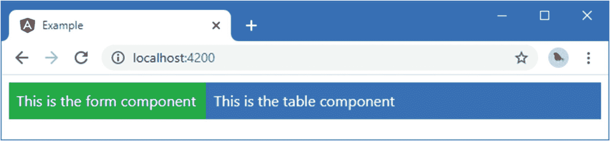
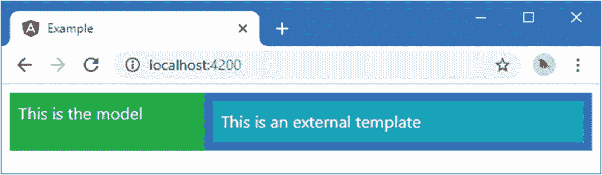
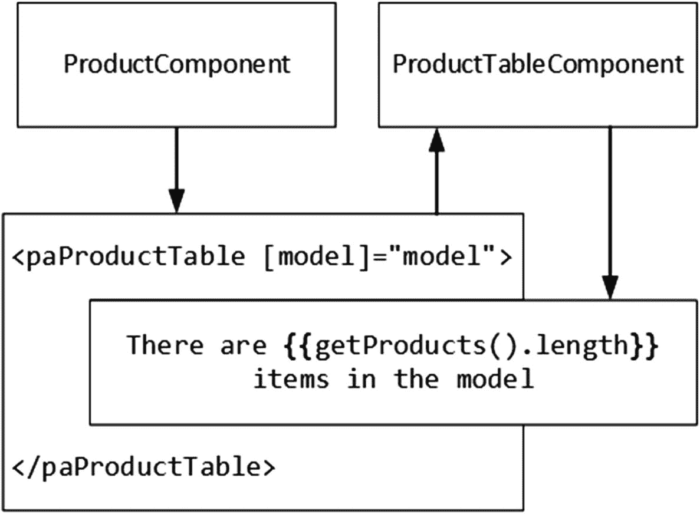
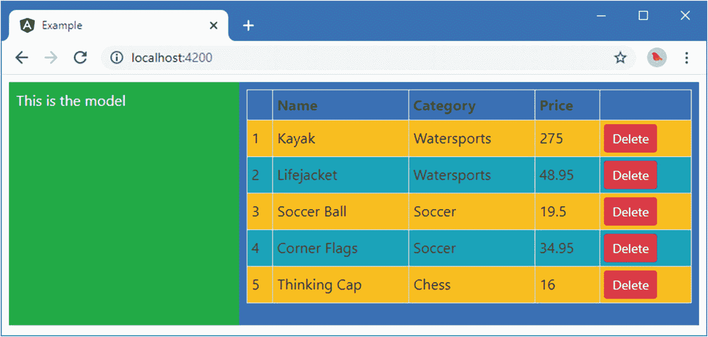
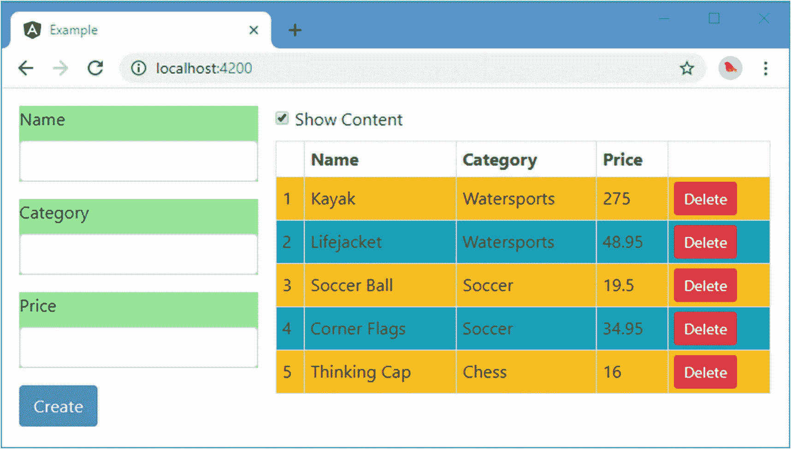
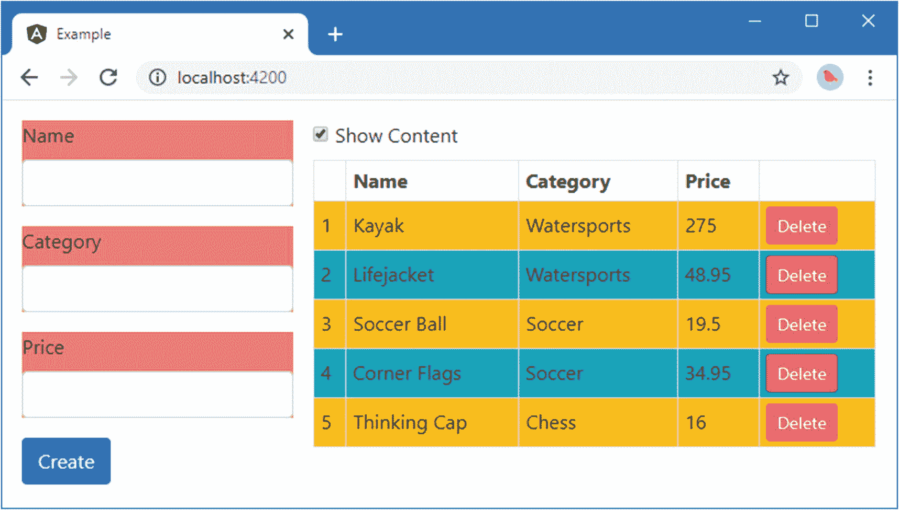
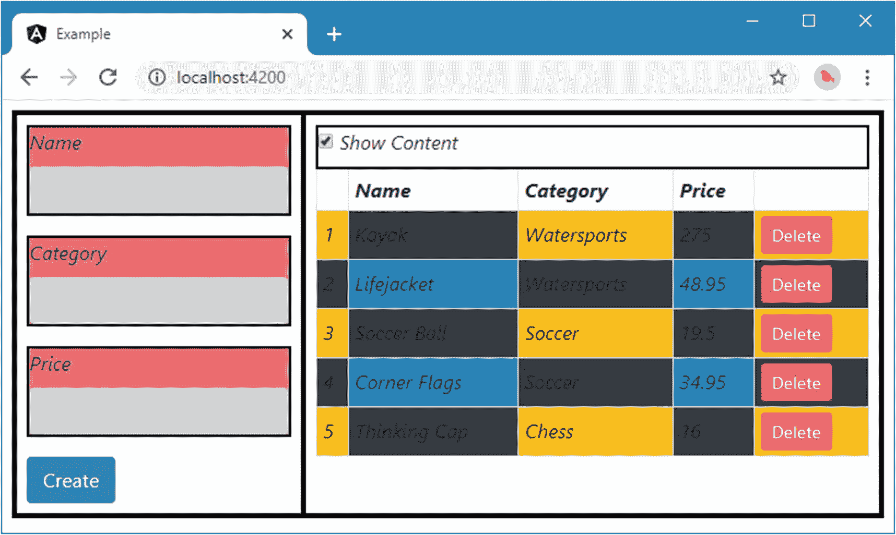

# 十七、了解组件

组件是拥有自己的模板的指令，而不是依赖于从其他地方提供的内容。组件可以访问前面章节中描述的所有指令特性，仍然有一个宿主元素，仍然可以定义输入和输出属性，等等。但是它们也定义了自己的内容。

很容易低估模板的重要性，但是属性和结构指令有局限性。指令可以做有用和强大的工作，但是它们对应用它们的元素没有太多的洞察力。指令在作为通用工具时最有用，例如`ngModel`指令，它可以应用于任何数据模型属性和任何表单元素，而不考虑数据或元素的用途。

相比之下，组件与其模板的内容紧密相关。组件提供数据和逻辑，这些数据和逻辑将由应用于模板中 HTML 元素的数据绑定使用，这些数据和逻辑提供用于评估数据绑定表达式的上下文，并充当指令和应用其余部分之间的粘合剂。组件也是一个有用的工具，允许将大 Angular 的项目分解成可管理的块。

在这一章中，我将解释组件是如何工作的，并解释如何通过引入一些额外的组件来重构一个应用。表 [17-1](#Tab1) 将组件放在上下文中。

表 17-1。

将组件放在上下文中

<colgroup><col class="tcol1 align-left"> <col class="tcol2 align-left"></colgroup> 
| 

问题

 | 

回答

 |
| --- | --- |
| 它们是什么？ | 组件是定义它们自己的 HTML 内容和 CSS 样式(可选)的指令。 |
| 它们为什么有用？ | 组件使得定义自包含的功能块成为可能，这使得项目更易于管理，并且允许功能更容易被重用。 |
| 它们是如何使用的？ | `@Component` decorator 应用于一个类，该类注册在应用的 Angular 模块中。 |
| 有什么陷阱或限制吗？ | 不需要。组件提供了指令的所有功能，还提供了自己的模板。 |
| 有其他选择吗？ | Angular 应用必须包含至少一个用于引导过程的组件。除此之外，您不必添加额外的组件，尽管最终的应用变得难以管理。 |

表 [17-2](#Tab2) 总结了本章内容。

表 17-2。

章节总结

<colgroup><col class="tcol1 align-left"> <col class="tcol2 align-left"> <col class="tcol3 align-left"></colgroup> 
| 

问题

 | 

解决办法

 | 

列表

 |
| --- | --- | --- |
| 创建组件 | 将`@Component`指令应用于一个类 | 1–5 |
| 定义组件显示的内容 | 创建内联或外部模板 | 6–8 |
| 在模板中包含数据 | 在组件的模板中使用数据绑定 | nine |
| 组件之间的协调 | 使用输入或输出属性 | 10–16 |
| 在应用了组件的元素中显示内容 | 投影主体元素的内容 | 17–21 |
| 样式组件内容 | 创建组件样式 | 22–30 |
| 查询组件模板中的内容 | 使用`@ViewChildren`装饰器 | Thirty-one |

## 准备示例项目

在这一章中，我继续使用我在第 [11](11.html) 章中创建的示例项目，并且一直在修改。准备本章不需要做任何改动。

Tip

你可以从 [`https://github.com/Apress/pro-angular-9`](https://github.com/Apress/pro-angular-9) 下载本章以及本书其他章节的示例项目。如果在运行示例时遇到问题，请参见第 [1](01.html) 章获取帮助。

在`example`文件夹中运行以下命令，启动 Angular 开发工具:

```ts
ng serve

```

打开新的浏览器并导航至`http://localhost:4200`以查看图 [17-1](#Fig1) 中的内容。


图 17-1。

运行示例项目

## 用组件构建应用

目前，示例项目只包含一个组件和一个模板。Angular 应用需要至少一个组件，称为*根组件*，它是 Angular 模块中指定的入口点。

只有一个组件的问题是，它最终包含了应用所有功能所需的逻辑，其模板包含了向用户公开这些功能所需的所有标记。结果是单个组件及其模板负责处理大量任务。示例应用中的组件负责以下内容:

*   提供 Angular 作为应用的入口点，作为根组件

*   提供对应用数据模型的访问，以便可以在数据绑定中使用它

*   定义用于创建新产品的 HTML 表单

*   定义用于显示产品的 HTML 表格

*   定义包含表单和表格的布局

*   创建新产品时检查表单数据是否有效

*   维护用于防止无效数据被用来创建数据的状态信息

*   维护关于是否应该显示表格的状态信息

对于这样一个简单的应用来说，有很多事情要做，而且并非所有这些任务都是相关的。随着开发的进行，这种影响往往会逐渐增加，但这意味着应用更难测试，因为单个功能无法有效隔离，并且更难增强和维护，因为代码和标记变得越来越复杂。

将组件添加到应用中，可以将功能分成构建块，这些构建块可以在应用的不同部分重复使用，并可以单独测试。在接下来的小节中，我将创建一些组件，这些组件将示例应用中包含的功能分解为可管理的、可重用的和独立的单元。在这个过程中，我将解释组件提供的不同于指令的特性。为了准备这些变化，我简化了现有组件的模板，如清单 [17-1](#PC2) 所示。

```ts
<div class="row text-white m-2">
  <div class="col-4 p-2 bg-success">
    Form will go here
  </div>
  <div class="col-8 p-2 bg-primary">
    Table will go here
  </div>
</div>

Listing 17-1.Simplifying the Content of the template.html File in the src/app Folder

```

当您保存对模板的更改时，您将看到图 [17-2](#Fig2) 中的内容。当我开发新组件并将它们添加到应用中时，占位符将被应用功能替换。


图 17-2。

简化现有模板

### 创建新组件

为了创建一个新的组件，我在`src/app`文件夹中添加了一个名为`productTable.component.ts`的文件，并用它来定义清单 [17-2](#PC3) 中所示的组件。

```ts
import { Component } from "@angular/core";

@Component({
    selector: "paProductTable",
    template: "<div>This is the table component</div>"
})
export class ProductTableComponent {

}

Listing 17-2.The Contents of the productTable.component.ts File in the src/app Folder

```

组件是一个已经应用了`@Component`装饰器的类。这是一个组件所能得到的最简单的东西，它提供了足够的功能来作为一个组件，而不需要做任何有用的事情。

定义组件的文件的命名惯例是使用一个描述性的名称，表明组件的用途，后跟一个句点，然后是`component.ts`。对于这个将用于生成产品表的组件，文件名是`productTable.component.ts`。类名应该同样具有描述性。这个组件的类被命名为`ProductTableComponent`。

`@Component`装饰器描述并配置组件。表 [17-3](#Tab3) 中描述了最有用的装饰器属性，其中还包括描述它们的细节(本章并未涵盖所有属性)。

表 17-3。

组件装饰器属性

<colgroup><col class="tcol1 align-left"> <col class="tcol2 align-left"></colgroup> 
| 

名字

 | 

描述

 |
| --- | --- |
| `animations` | 该属性用于配置动画，如第 [28](28.html) 章所述。 |
| `encapsulation` | 此属性用于更改视图封装设置，该设置控制组件样式如何与 HTML 文档的其余部分隔离。有关详细信息，请参见“设置视图封装”一节。 |
| `selector` | 此属性用于指定用于匹配宿主元素的 CSS 选择器，如表后所述。 |
| `styles` | 此属性用于定义仅应用于组件模板的 CSS 样式。样式是作为 TypeScript 文件的一部分内联定义的。有关详细信息，请参见“使用组件样式”一节。 |
| `styleUrls` | 此属性用于定义仅应用于组件模板的 CSS 样式。样式是在单独的 CSS 文件中定义的。有关详细信息，请参见“使用组件样式”一节。 |
| `template` | 该属性用于指定内联模板，如“定义模板”一节中所述。 |
| `templateUrl` | 该属性用于指定外部模板，如“定义模板”一节中所述。 |
| `providers` | 该属性用于为服务创建本地提供者，如第 [19](19.html) 章所述。 |
| `viewProviders` | 该属性用于为仅可用于查看孩子的服务创建本地提供者，如第 [20](20.html) 章所述。 |

对于第二个组件，我在`src/app`文件夹中创建了一个名为`productForm.component.ts`的文件，并添加了清单 [17-3](#PC4) 中所示的代码。

```ts
import { Component } from "@angular/core";

@Component({
    selector: "paProductForm",
    template: "<div>This is the form component</div>"
})
export class ProductFormComponent {

}

Listing 17-3.The Contents of the productForm.component.ts File in the src/app Folder

```

这个组件同样简单，目前只是一个占位符。在本章的后面，我将添加一些更有用的特性。要启用这些组件，它们必须在应用的 Angular 模块中声明，如清单 [17-4](#PC5) 所示。

```ts
import { NgModule } from "@angular/core";
import { BrowserModule } from "@angular/platform-browser";
import { ProductComponent } from "./component";
import { FormsModule, ReactiveFormsModule  } from "@angular/forms";
import { PaAttrDirective } from "./attr.directive";
import { PaModel } from "./twoway.directive";
import { PaStructureDirective } from "./structure.directive";
import { PaIteratorDirective } from "./iterator.directive";
import { PaCellColor } from "./cellColor.directive";
import { PaCellColorSwitcher } from "./cellColorSwitcher.directive";
import { ProductTableComponent } from "./productTable.component";
import { ProductFormComponent } from "./productForm.component";

@NgModule({
    imports: [BrowserModule, FormsModule, ReactiveFormsModule],
    declarations: [ProductComponent, PaAttrDirective, PaModel,
        PaStructureDirective, PaIteratorDirective,
        PaCellColor, PaCellColorSwitcher, ProductTableComponent,
        ProductFormComponent],
    bootstrap: [ProductComponent]
})
export class AppModule { }

Listing 17-4.Enabling New Components in the app.module.ts File in the src/app Folder

```

使用一个`import`语句将组件类引入范围，并添加到`NgModule`装饰器的`declarations`数组中。最后一步是添加一个与组件的选择器属性相匹配的 HTML 元素，如清单 [17-5](#PC6) 所示，这将为组件提供其主机元素。

```ts
<div class="row text-white m-2">
  <div class="col-4 p-2 bg-success">
    <paProductForm></paProductForm>
  </div>
  <div class="col-8 p-2 bg-primary">
    <paProductTable></paProductTable>
  </div>
</div>

Listing 17-5.Adding a Host Element in the template.html File in the src/app Folder

```

当所有的更改都被保存后，浏览器将显示如图 [17-3](#Fig3) 所示的内容，这表明 HTML 文档的一部分现在处于新组件的管理之下。



图 17-3。

添加新组件

#### 了解新的应用结构

新组件改变了应用的结构。以前，根组件负责应用显示的所有 HTML 内容。然而，现在有了三个组件，一些 HTML 内容的责任已经委托给了新添加的组件，如图 [17-4](#Fig4) 所示。


图 17-4。

新的应用结构

当浏览器加载`index.html`文件时，Angular 引导程序启动，Angular 处理应用的模块，该模块提供了应用所需的组件列表。Angular 检查其配置中每个组件的装饰器，包括用于标识哪些元素将成为宿主的`selector`属性的值。

Angular 然后开始处理`index.html`文件的主体，并找到由`ProductComponent`组件的`selector`属性指定的`app`元素。Angular 用组件的模板填充`app`元素，该模板包含在`template.html`文件中。Angular 检查`template.html`文件的内容，并找到`paProductForm`和`paProductTable`元素，它们与新添加组件的选择器属性相匹配。Angular 用每个组件的模板填充这些元素，产生如图 [17-3](#Fig3) 所示的占位符内容。

有一些重要的新关系需要理解。首先，浏览器窗口中显示的 HTML 内容现在由几个模板组成，每个模板由一个组件管理。其次，`ProductComponent`现在是`ProductFormComponent`和`ProductTableComponent`对象的父组件，这种关系是由新组件的主机元素在`template.html`文件(即`ProductComponent`模板)中定义的事实形成的。同样，新组件是`ProductComponent`的子组件。当涉及到 Angular 组件时，父子关系是一个重要的关系，正如我在后面的章节中描述组件如何工作时所看到的。

### 定义模板

尽管应用中有新的组件，但它们目前没有太大的影响，因为它们只显示占位符内容。每个组件都有自己的模板，该模板定义了用于替换 HTML 文档中其宿主元素的内容。有两种不同的方法来定义模板:在`@Component`装饰器中内联或者在 HTML 文件中外部定义。

我添加的新组件使用模板，其中一段 HTML 被分配给`@Component`装饰器的`template`属性，如下所示:

```ts
...
template: "<div>This is the form component</div>"
...

```

这种方法的优点是简单:组件和模板在一个文件中定义，它们之间的关系不会混淆。内联模板的缺点是，如果包含很多 HTML 元素，它们会失去控制，难以阅读。

Note

另一个问题是，在您键入时突出显示语法错误的编辑器通常依赖于文件扩展名来判断应该执行哪种类型的检查，而不会意识到`template`属性的值是 HTML，只会将其视为字符串。

如果您正在使用 TypeScript，那么您可以使用多行字符串使内联模板更具可读性。多行字符串用反斜杠字符表示(```ts 字符，也称为*重音符*，它们允许字符串跨多行，如清单 [17-6](#PC8) 所示。

```
import { Component } from "@angular/core";

@Component({
    selector: "paProductTable",
    template: `<div class='bg-info p-2'>
                   This is a multiline template
               </div>`
})
export class ProductTableComponent {

}

Listing 17-6.Using a Multiline String in the productTable.component.ts File in the src/app Folder

```ts

多行字符串允许保留模板中 HTML 元素的结构，这使得阅读更容易，并增加了模板的大小，在变得难以管理之前，实际上可以内联包含模板。图 [17-5](#Fig5) 显示了清单 [17-6](#PC8) 中模板的效果。


图 17-5。

使用多行内联模板

Tip

我的建议是对任何包含两三个以上简单元素的模板使用外部模板(在下一节中解释),主要是为了利用现代编辑器提供的 HTML 编辑和语法突出显示功能，这可以大大减少运行应用时发现的错误数量。

#### 定义外部模板

外部模板在不同于组件其余部分的文件中定义。这种方法的优点是代码和 HTML 没有混合在一起，这使得阅读和单元测试都更容易，这也意味着当您处理模板文件时，代码编辑器将知道他们正在处理 HTML 内容，这可以通过突出显示错误来帮助减少编码时的错误。

外部模板的缺点是，您必须管理项目中的更多文件，并确保每个组件都与正确的模板文件相关联。最好的方法是遵循一致的文件命名策略，这样文件包含给定组件的模板就显而易见了。Angular 的惯例是使用惯例`<componentname>.component.<type>`创建成对的文件，这样当您看到一个名为`productTable.component.ts`的文件时，您就知道它包含一个用 TypeScript 编写的名为`Products`的组件，当您看到一个名为`productTable.component.html`的文件时，您就知道它包含一个用于`Products`组件的外部模板。

Tip

这两种类型的模板的语法和功能是相同的，唯一的区别是内容存储在哪里，是与组件代码存储在同一个文件中，还是存储在一个单独的文件中。

为了使用命名约定定义外部模板，我在`src/app`文件夹中创建了一个名为`productTable.component.html`的文件，并添加了清单 [17-7](#PC9) 中所示的标记。

```
<div class="bg-info p-2">
    This is an external template
</div>

Listing 17-7.The Contents of the productTable.component.html File in the src/app Folder

```ts

这是我从第 11 章[开始就一直用于根组件的模板。为了指定一个外部模板，在`@Component`装饰器中使用了`templateURL`属性，如清单](11.html) [17-8](#PC10) 所示。

```
import { Component } from "@angular/core";

@Component({
    selector: "paProductTable",
    templateUrl: "productTable.component.html"
})
export class ProductTableComponent {

}

Listing 17-8.Using an External Template in the productTable.component.ts File in the src/app Folder

```ts

注意使用了不同的属性:`template`用于内联模板，`templateUrl`用于外部模板。图 [17-6](#Fig6) 显示了使用外部模板的效果。


图 17-6。

使用外部模板

#### 在组件模板中使用数据绑定

一个组件的模板可以包含所有的数据绑定，并以任何内置指令或已在应用的 Angular 模块中注册的自定义指令为目标。每个组件类都提供了用于评估其模板中的数据绑定表达式的上下文，并且默认情况下，每个组件都是相互隔离的。这意味着组件不必担心使用其他组件使用的相同的属性和方法名，并且可以依靠 Angular 来保持一切独立。作为一个例子，清单 [17-9](#PC11) 显示了一个名为`model`的属性被添加到表单子组件中，如果它们没有保持分离的话，就会与根组件中同名的属性发生冲突。

```
import { Component } from "@angular/core";

@Component({
    selector: "paProductForm",
    template: "<div>{{model}}</div>"
})
export class ProductFormComponent {

    model: string = "This is the model";
}

Listing 17-9.Adding a Property in the productForm.component.ts File in the src/app Folder

```ts

component 类使用`model`属性存储一条消息，该消息使用字符串插值绑定显示在模板中。图 [17-7](#Fig7) 显示了结果。



图 17-7。

在子组件中使用数据绑定

#### 使用输入属性在组件之间进行协调

很少有组件是孤立存在的，需要与应用的其他部分共享数据。组件可以定义输入属性来接收其宿主元素上的数据绑定表达式的值。表达式将在父组件的上下文中进行计算，但结果将传递给子组件的属性。

为了演示，清单 [17-10](#PC12) 向表格组件添加了一个输入属性，它将使用该属性来接收应该显示的模型数据。

```
import { Component, Input } from "@angular/core";
import { Model } from "./repository.model";
import { Product } from "./product.model";

@Component({
    selector: "paProductTable",
    templateUrl: "productTable.component.html"
})
export class ProductTableComponent {

    @Input("model")
    dataModel: Model;

    getProduct(key: number): Product {
        return this.dataModel.getProduct(key);
    }

    getProducts(): Product[] {
        return this.dataModel.getProducts();
    }

    deleteProduct(key: number) {
        this.dataModel.deleteProduct(key);
    }

    showTable: boolean = true;
}

Listing 17-10.Defining an Input Property in the productTable.component.ts File in the src/app Folder

```ts

该组件现在定义了一个输入属性，该属性将被赋予分配给主机元素上的`model`属性的值表达式。`getProduct`、`getProducts`和`deleteProduct`方法使用输入属性来提供对组件模板中绑定的数据模型的访问，这在清单 [17-11](#PC13) 中进行了修改。在本章后面的清单 [17-14](#PC16) 中，当我增强模板时会用到`showTable`属性。

```
There are {{getProducts().length}} items in the model

Listing 17-11.Adding a Data Binding in the productTable.component.html File in the src/app Folder

```ts

向子组件提供它所需要的数据意味着向它的宿主元素添加一个绑定，这是在父组件的模板中定义的，如清单 [17-12](#PC14) 所示。

```
<div class="row text-white m-2">
  <div class="col-4 p-2 bg-success">
    <paProductForm></paProductForm>
  </div>
  <div class="col-8 p-2 bg-primary">
    <paProductTable [model]="model"></paProductTable>
  </div>
</div>

Listing 17-12.Adding a Data Binding in the template.html File in the src/app Folder

```ts

这个绑定的作用是为子组件提供对父组件的`model`属性的访问。这可能是一个令人困惑的特性，因为它依赖于这样一个事实，即主机元素是在父组件的模板中定义的，而输入属性是由子组件定义的，如图 [17-8](#Fig8) 所示。



图 17-8。

在父组件和子组件之间共享数据

子组件的 host 元素作为父组件和子组件之间的桥梁，input 属性允许组件向子组件提供它需要的数据，产生如图 [17-9](#Fig9) 所示的结果。


图 17-9。

将数据从父组件共享到子组件

##### 在子组件模板中使用指令

一旦定义了输入属性，子组件就可以使用所有的数据绑定和指令，要么使用父组件提供的数据，要么定义自己的数据。在清单 [17-13](#PC15) 中，我恢复了前面章节中的原始表格功能，它显示了数据模型中的`Product`对象列表，以及一个决定是否显示表格的复选框。该功能以前由根组件及其模板管理。

```
<table class="table table-sm table-bordered table-striped">
    <tr><th></th><th>Name</th><th>Category</th><th>Price</th><th></th></tr>
    <tr *paFor="let item of getProducts(); let i = index; let odd = odd;
            let even = even" [class.bg-info]="odd" [class.bg-warning]="even">
        <td style="vertical-align:middle">{{i + 1}}</td>
        <td style="vertical-align:middle">{{item.name}}</td>
        <td style="vertical-align:middle">{{item.category}}</td>
        <td style="vertical-align:middle">{{item.price}}</td>
        <td class="text-xs-center">
            <button class="btn btn-danger btn-sm" (click)="deleteProduct(item.id)">
                Delete
            </button>
        </td>
    </tr>
</table>

Listing 17-13.Restoring the Table in the productTable.component.html File in the src/app Folder

```ts

使用相同的 HTML 元素、数据绑定和指令(包括像`paIf`和`paFor`这样的自定义指令)，产生如图 [17-10](#Fig10) 所示的结果。关键区别不在于表的外观，而在于它现在由一个专用组件管理的方式。



图 17-10。

恢复表格显示

#### 使用输出属性在组件之间进行协调

子组件可以使用定义自定义事件的输出属性，这些事件表示重要的更改，并允许父组件在事件发生时做出响应。清单 [17-14](#PC16) 展示了向表单组件添加一个输出属性，当用户创建一个新的`Product`对象时将触发该属性。

```
import { Component, Output, EventEmitter } from "@angular/core";
import { Product } from "./product.model";

@Component({
    selector: "paProductForm",
    templateUrl: "productForm.component.html"
})
export class ProductFormComponent {
    newProduct: Product = new Product();

    @Output("paNewProduct")
    newProductEvent = new EventEmitter<Product>();

    submitForm(form: any) {
        this.newProductEvent.emit(this.newProduct);
        this.newProduct = new Product();
        form.reset();
    }
}

Listing 17-14.Defining an Output Property in the productForm.component.ts File in the src/app Folder

```ts

输出属性称为`newProductEvent`，组件在调用`submitForm`方法时触发它。除了 output 属性之外，清单中增加的内容基于根控制器中的逻辑，它以前管理表单。我还移除了内联模板，在`src/app`文件夹中创建了一个名为`productForm.component.html`的文件，内容如清单 [17-15](#PC17) 所示。

```
<form novalidate #form="ngForm" (ngSubmit)="submitForm(form)">
    <div class="form-group">
        <label>Name</label>
        <input class="form-control"
            name="name" [(ngModel)]="newProduct.name" />
    </div>
    <div class="form-group">
        <label>Category</label>
        <input class="form-control"
            name="category" [(ngModel)]="newProduct.category" />
    </div>
    <div class="form-group">
        <label>Price</label>
        <input class="form-control"
            name="name" [(ngModel)]="newProduct.price" />
    </div>
    <button class="btn btn-primary" type="submit">
            Create
    </button>
</form>

Listing 17-15.The Contents of the productForm.component.html File in the src/app Folder

```ts

该表单包含使用双向绑定配置的标准元素。

子组件的主机元素充当到父组件的桥梁，父组件可以在自定义事件中注册兴趣，如清单 [17-16](#PC18) 所示。

```
<div class="row text-white m-2">
  <div class="col-4 p-2 text-dark">
    <paProductForm (paNewProduct)="addProduct($event)"></paProductForm>
  </div>
  <div class="col-8 p-2">
    <paProductTable [model]="model"></paProductTable>
  </div>
</div>

Listing 17-16.Registering for the Custom Event in the template.html File in the src/app Folder

```ts

新绑定通过将事件对象传递给`addProduct`方法来处理自定义事件。子组件负责管理表单元素并验证其内容。当数据通过验证时，自定义事件被触发，数据绑定表达式在父组件的上下文中进行计算，父组件的`addProduct`方法将新对象添加到模型中。由于模型已经通过其 input 属性与 table 子组件共享，新的数据显示给用户，如图 [17-11](#Fig11) 所示。


图 17-11。

在子组件中使用自定义事件

#### 投影主体元素内容

如果组件的主机元素包含内容，可以使用特殊的`ng-content`元素将其包含在模板中。这被称为*内容投影*，它允许创建将模板中的内容与宿主元素中的内容相结合的组件。为了演示，我在`src/app`文件夹中添加了一个名为`toggleView.component.ts`的文件，并用它来定义清单 [17-17](#PC19) 中所示的组件。

```
import { Component } from "@angular/core";

@Component({
    selector: "paToggleView",
    templateUrl: "toggleView.component.html"
})
export class PaToggleView {

    showContent: boolean = true;
}

Listing 17-17.The Contents of the toggleView.component.ts File in the src/app Folder

```ts

该组件定义了一个`showContent`属性，该属性将用于确定主机元素的内容是否会显示在模板中。为了提供模板，我在`src/app`文件夹中添加了一个名为`toggleView.component.html`的文件，并添加了清单 [17-18](#PC20) 中所示的元素。

```
<div class="checkbox">
    <label>
        <input type="checkbox" [(ngModel)]="showContent" />
        Show Content
    </label>
</div>
<ng-content *ngIf="showContent"></ng-content>

Listing 17-18.The Contents of the toggleView.component.html File in the src/app Folder

```ts

重要的元素是`ng-content`，Angular 将用宿主元素的内容替换。`ngIf`指令已经应用到了`ng-content`元素，因此只有当模板中的复选框被选中时，它才可见。清单 [17-19](#PC21) 向 Angular 模块注册组件。

```
import { NgModule } from "@angular/core";
import { BrowserModule } from "@angular/platform-browser";
import { ProductComponent } from "./component";
import { FormsModule, ReactiveFormsModule  } from "@angular/forms";
import { PaAttrDirective } from "./attr.directive";
import { PaModel } from "./twoway.directive";
import { PaStructureDirective } from "./structure.directive";
import { PaIteratorDirective } from "./iterator.directive";
import { PaCellColor } from "./cellColor.directive";
import { PaCellColorSwitcher } from "./cellColorSwitcher.directive";
import { ProductTableComponent } from "./productTable.component";
import { ProductFormComponent } from "./productForm.component";
import { PaToggleView } from "./toggleView.component";

@NgModule({
    imports: [BrowserModule, FormsModule, ReactiveFormsModule],
    declarations: [ProductComponent, PaAttrDirective, PaModel,
        PaStructureDirective, PaIteratorDirective,
        PaCellColor, PaCellColorSwitcher, ProductTableComponent,
        ProductFormComponent, PaToggleView],
    bootstrap: [ProductComponent]
})
export class AppModule { }

Listing 17-19.Registering the Component in the app.module.ts File in the src/app Folder

```ts

最后一步是将新组件应用于包含内容的主机元素，如清单 [17-20](#PC22) 所示。

```
<div class="row m-2">
  <div class="col-4 p-2">
    <paProductForm (paNewProduct)="addProduct($event)"></paProductForm>
  </div>
  <div class="col-8 p-2">
    <paToggleView>
      <paProductTable [model]="model"></paProductTable>
    </paToggleView>
  </div>
</div>

Listing 17-20.Adding a Host Element with Content in the template.html File in the src/app Folder

```ts

`paToggleView`元素是新组件的宿主，它包含`paProductTable`元素，该元素应用创建产品表的组件。结果是有一个控制表格可见性的复选框，如图 [17-12](#Fig12) 所示。新组件不知道其宿主元素的内容，只有通过`ng-content`元素才能将其包含在模板中。


图 17-12。

在模板中包含主体元素内容

### 完成组件重组

以前包含在根组件中的功能已经分配给新的子组件。剩下的就是整理根组件，删除不再需要的代码，如清单 [17-21](#PC23) 所示。

```
import { ApplicationRef, Component } from "@angular/core";
import { Model } from "./repository.model";
import { Product } from "./product.model";
import { ProductFormGroup } from "./form.model";

@Component({
    selector: "app",
    templateUrl: "template.html"
})
export class ProductComponent {
    model: Model = new Model();

    addProduct(p: Product) {
        this.model.saveProduct(p);
    }
}

Listing 17-21.Removing Obsolete Code in the component.ts File in the src/app Folder

```ts

根组件的许多职责已经转移到应用的其他地方。从本章开始的原始列表中，只有以下内容仍然是根组件的责任:

*   提供 Angular 作为应用的入口点，作为根组件

*   提供对应用数据模型的访问，以便可以在数据绑定中使用它

子组件承担了其余的责任，提供了更简单、更易于开发、更易于维护的自包含功能块，并且可以根据需要重用。

## 使用组件样式

组件可以定义仅应用于其模板中的内容的样式，这允许组件设置内容的样式，而不受其父组件或其他前身定义的样式的影响，也不会影响其子组件和其他后代组件中的内容。可以使用`@Component`装饰器的`styles`属性内联定义样式，如清单 [17-22](#PC24) 所示。

```
import { Component, Output, EventEmitter } from "@angular/core";
import { Product } from "./product.model";

@Component({
    selector: "paProductForm",
    templateUrl: "productForm.component.html",
    styles: ["div { background-color: lightgreen }"]
})
export class ProductFormComponent {
    newProduct: Product = new Product();

    @Output("paNewProduct")
    newProductEvent = new EventEmitter<Product>();

    submitForm(form: any) {
        this.newProductEvent.emit(this.newProduct);
        this.newProduct = new Product();
        form.reset();
    }
}

Listing 17-22.Defining Inline Styles in the productForm.component.ts File in the src/app Folder

```ts

属性被设置为一个数组，其中每个条目包含一个 CSS 选择器和一个或多个属性。在清单中，我指定了将`div`元素的背景色设置为`lightgreen`的样式。即使整个组合的 HTML 文档中有`div`个元素，这种样式也只会影响定义它们的组件的模板中的元素，在本例中是表单组件，如图 [17-13](#Fig13) 所示。



图 17-13。

定义内联组件样式

Tip

开发工具创建的包中包含的样式仍然适用，这就是为什么元素仍然使用 Bootstrap 进行样式化。

### 定义外部组件样式

内联样式提供了与内联模板相同的优点和缺点:它们很简单，并且将所有内容保存在一个文件中，但是它们很难阅读、管理，并且会使代码编辑器感到困惑。

另一种方法是在单独的文件中定义样式，并使用装饰器中的`styleUrls`属性将它们与组件关联起来。外部样式文件遵循与模板和代码文件相同的命名约定。我在`src/app`文件夹中添加了一个名为`productForm.component.css`的文件，并用它来定义清单 [17-23](#PC25) 中显示的样式。

```
div {
    background-color: lightcoral;
}

Listing 17-23.The Contents of the productForm.component.css File in the src/app Folder

```ts

这与内联定义的样式相同，但使用了不同的颜色值来确认这是组件使用的 CSS。在清单 [17-24](#PC26) 中，组件的装饰器已经被更新以指定样式文件。

```
import { Component, Output, EventEmitter } from "@angular/core";
import { Product } from "./product.model";

@Component({
    selector: "paProductForm",
    templateUrl: "productForm.component.html",
    styleUrls: ["productForm.component.css"]
})
export class ProductFormComponent {
    newProduct: Product = new Product();

    @Output("paNewProduct")
    newProductEvent = new EventEmitter<Product>();

    submitForm(form: any) {
        this.newProductEvent.emit(this.newProduct);
        this.newProduct = new Product();
        form.reset();
    }
}

Listing 17-24.Using External Styles in the productForm.component.ts File in the src/app Folder

```ts

属性被设置为一个字符串数组，每个字符串指定一个 CSS 文件。图 [17-14](#Fig14) 显示添加外部样式文件的效果。



图 17-14。

定义外部组件样式

### 使用高级样式功能

在组件中定义样式是一个有用的特性，但是您不会总是得到您期望的结果。一些高级功能允许您控制组件样式的工作方式。

#### 设置视图封装

默认情况下，特定于组件的样式是通过编写已应用于组件的 CSS 来实现的，这样它就以特殊属性为目标，然后 Angular 将这些属性添加到组件模板中包含的所有顶级元素中。如果您使用浏览器的 F12 开发工具检查 DOM，您将会看到清单 [17-23](#PC25) 中的外部 CSS 文件的内容被改写成这样:

```
...
<style>
div[_ngcontent-jwe-c40] {
    background-color: lightcoral;
}
</style>
...

```ts

选择器已经过修改，因此它匹配具有名为`_ngcontent-jwe-c40`的属性的`div`元素(尽管您可能会在浏览器中看到不同的名称，因为属性的名称是由 Angular 动态生成的)。

为了确保`style`元素中的 CSS 只影响由组件管理的 HTML 元素，模板中的元素被修改，因此它们具有相同的动态生成的属性，如下所示:

```
...
<div _ngcontent-jwe-c40="" class="form-group">
    <label _ngcontent-jwe-c40="">Name</label>
    <input _ngcontent-jwe-c40="" name="name" class="form-control ng-untouched
        ng-pristine ng-valid" ng-reflect-name="name">
</div>
...

```ts

这被称为组件的*视图封装*行为，Angular 正在做的是模拟一个被称为*阴影 DOM* 的特性，它允许域对象模型的各个部分被隔离，因此它们有自己的范围，这意味着 JavaScript、样式和模板可以应用于 HTML 文档的一部分。Angular 模拟这种行为的原因是它仅由最新版本的现代浏览器实现，但还有两个其他封装选项，它们是使用`@Component`装饰器中的`encapsulation`属性设置的。

Tip

可以在 [`http://developer.mozilla.org/en-US/docs/Web/Web_Components/Shadow_DOM`](http://developer.mozilla.org/en-US/docs/Web/Web_Components/Shadow_DOM) 了解更多暗影 DOM。在 [`http://caniuse.com/#feat=shadowdom`](http://caniuse.com/#feat=shadowdom) 可以看到哪些浏览器支持阴影 DOM 特性。

从`ViewEncapsulation`枚举中为`encapsulation`属性赋值，该枚举在`@angular/core`模块中定义，它定义了表 [17-4](#Tab4) 中描述的值。

表 17-4。

视图封装值

<colgroup><col class="tcol1 align-left"> <col class="tcol2 align-left"></colgroup> 
| 

名字

 | 

描述

 |
| --- | --- |
| `Emulated` | 指定该值后，Angular 通过编写内容和样式来添加属性，从而模拟阴影 DOM，如前所述。如果在`@Component`装饰器中没有指定`encapsulation`值，这是默认行为。 |
| `ShadowDom` | 指定该值时，Angular 使用浏览器的阴影 DOM 功能。只有在浏览器实现阴影 DOM 或使用多填充时，这种方法才有效。 |
| `None` | 当指定了这个值时，Angular 只是将未修改的 CSS 样式添加到 HTML 文档的 head 部分，并让浏览器使用普通的 CSS 优先规则来确定如何应用这些样式。 |

应谨慎使用`ShadowDom`和`None`值。浏览器对 shadow DOM 特性的支持是有限的，并且变得更加复杂，因为有一个 shadow DOM 特性的早期版本为了支持当前的方法而被放弃了。

`None`选项将组件定义的所有样式添加到 HTML 文档的`head`部分，并让浏览器决定如何应用它们。这样做的好处是可以在所有浏览器中工作，但是结果是不可预测的，并且不同组件定义的样式之间没有隔离。

为了完整起见，清单 [17-25](#PC29) 显示了被设置为`Emulated`的`encapsulation`属性，这是缺省值，并且在 Angular 支持的所有浏览器中都有效，不需要 polyfills。

```
import { Component, Output, EventEmitter, ViewEncapsulation } from "@angular/core";
import { Product } from "./product.model";

@Component({
    selector: "paProductForm",
    templateUrl: "productForm.component.html",
    styleUrls: ["productForm.component.css"],
    encapsulation: ViewEncapsulation.Emulated
})
export class ProductFormComponent {
    newProduct: Product = new Product();

    @Output("paNewProduct")
    newProductEvent = new EventEmitter<Product>();

    submitForm(form: any) {
        this.newProductEvent.emit(this.newProduct);
        this.newProduct = new Product();
        form.reset();
    }
}

Listing 17-25.Setting View Encapsulation in the productForm.component.ts File in the src/app Folder

```ts

#### 使用阴影 DOM CSS 选择器

使用影子 DOM 意味着存在常规 CSS 选择器无法跨越的界限。为了帮助解决这个问题，有一些特殊的 CSS 选择器在使用依赖于阴影 DOM 的样式时很有用(即使它正在被模拟)，如表 [17-5](#Tab5) 中所述，并在下面的章节中演示。

表 17-5。

阴影 DOM CSS 选择器

<colgroup><col class="tcol1 align-left"> <col class="tcol2 align-left"></colgroup> 
| 

名字

 | 

描述

 |
| --- | --- |
| `:host` | 该选择器用于匹配组件的宿主元素。 |
| `:host-context(classSelector)` | 该选择器用于匹配作为特定类成员的宿主元素的祖先。 |
| `/deep/ or >>>` | 父组件使用该选择器来定义影响子组件模板中元素的样式。这个选择器应该只在`@Component`装饰器的`encapsulation`属性被设置为`emulated`时使用，如“设置视图封装”一节所述。 |

##### 选择主体元素

组件的宿主元素出现在其模板之外，这意味着其样式中的选择器只应用于宿主元素包含的元素，而不是元素本身。这可以通过使用与主机元素匹配的`:host`选择器来解决。清单 [17-26](#PC30) 定义了一个仅当鼠标指针悬停在主机元素上时才应用的样式，这是通过组合`:host`和`:hover`选择器指定的。

```
div {
    background-color: lightcoral;
}
:host:hover {
    font-size: 25px;
}

Listing 17-26.Matching the Host Element in the productForm.component.css File in the src/app Folder

```ts

当鼠标指针在 host 元素上时，其`font-size`属性将被设置为 25px，这将使表单中所有元素的文本大小增加到 25 磅，如图 [17-15](#Fig15) 所示。


图 17-15。

在构件样式中选择主体元素

##### 选择主体元素的祖先

`:host-context`选择器用于根据宿主元素祖先(在模板之外)的类成员来设计组件模板中元素的样式。这是一个比`:host`更有限的选择器，不能用于指定除类选择器之外的任何东西，不支持匹配标签类型、属性或任何其他选择器。清单 [17-27](#PC31) 显示了`:host-context`选择器的使用。

```
div {
    background-color: lightcoral;
}
:host:hover {
    font-size: 25px;
}
:host-context(.angularApp) input {
    background-color: lightgray;
}

Listing 17-27.Selecting Ancestors in the productForm.component.css File in the src/app Folder

```ts

只有当宿主元素的祖先元素之一是名为`angularApp`的类的成员时，清单中的选择器才会将组件模板中`input`元素的`background-color`属性设置为`lightgrey`。在清单 [17-28](#PC32) 中，我将`index.html`文件中的`app`元素添加到了`angularApp`类中，它是根组件的宿主元素。

```
<!doctype html>
<html lang="en">
<head>
  <meta charset="utf-8">
  <title>Example</title>
  <base href="/">
  <meta name="viewport" content="width=device-width, initial-scale=1">
  <link rel="icon" type="image/x-icon" href="favicon.ico">
</head>
<body>
  <app class="angularApp"></app>
</body>
</html>

Listing 17-28.Adding the Host Element to a Class in the index.html File in the src/app Folder

```ts

图 [17-16](#Fig16) 显示了清单 [17-28](#PC32) 变更前后选择器的效果。


图 17-16。

选择主体元素的祖先

##### 将样式推入子组件的模板

组件定义的样式不会自动应用于子组件模板中的元素。作为示范，清单 [17-29](#PC33) 向根组件的`@Component`装饰器添加了一个样式。

```
import { ApplicationRef, Component } from "@angular/core";
import { Model } from "./repository.model";
import { Product } from "./product.model";
import { ProductFormGroup } from "./form.model";

@Component({
    selector: "app",
    templateUrl: "template.html",
    styles: ["div { border: 2px black solid;  font-style:italic }"]
})
export class ProductComponent {
    model: Model = new Model();

    addProduct(p: Product) {
        this.model.saveProduct(p);
    }
}

Listing 17-29.Defining Styles in the component.ts File in the src/app Folder

```ts

选择器匹配所有的`div`元素，应用边框并改变字体样式。图 [17-17](#Fig17) 显示了结果。


图 17-17。

应用常规 CSS 样式

有些 CSS 样式属性，如`font-style`，默认情况下是继承的，这意味着在父组件中设置这样的属性会影响子组件模板中的元素，因为浏览器会自动应用该样式。

其他属性，比如`border`，默认情况下不被继承，在父组件中设置这样的属性对子组件模板没有影响，除非使用`/deep/`或`>>>`选择器，如清单 [17-30](#PC34) 所示。(这些选择器是彼此的别名，具有相同的效果。)

```
import { ApplicationRef, Component } from "@angular/core";
import { Model } from "./repository.model";
import { Product } from "./product.model";
import { ProductFormGroup } from "./form.model";

@Component({
    selector: "app",
    templateUrl: "template.html",
    styles: ["/deep/ div { border: 2px black solid;  font-style:italic }"]
})
export class ProductComponent {
    model: Model = new Model();

    addProduct(p: Product) {
        this.model.saveProduct(p);
    }
}

Listing 17-30.Pushing a Style into Child Templates in the component.ts File in the src/app Folder

```ts

样式选择器使用`/deep/`将样式推送到子组件的模板中，这意味着所有的`div`元素都被赋予了一个边框，如图 [17-18](#Fig18) 所示。


图 17-18。

将样式推入子组件模板

## 查询模板内容

组件可以查询其模板的内容来定位指令或组件的实例，这被称为*视图子代*。这些类似于第 [16 章](16.html)中描述的指令内容子查询，但有一些重要的区别。

在清单 [17-31](#PC35) 中，我向管理查询`PaCellColor`指令的表的组件添加了一些代码，创建该表是为了演示指令内容查询。该指令仍然在 Angular 模块中注册，并选择`td`元素，因此 Angular 会将它应用到表格组件内容的单元格中。

```
import { Component, Input, ViewChildren, QueryList } from "@angular/core";
import { Model } from "./repository.model";
import { Product } from "./product.model";
import { PaCellColor } from "./cellColor.directive";

@Component({
    selector: "paProductTable",
    templateUrl: "productTable.component.html"
})
export class ProductTableComponent {

    @Input("model")
    dataModel: Model;

    getProduct(key: number): Product {
        return this.dataModel.getProduct(key);
    }

    getProducts(): Product[] {
        return this.dataModel.getProducts();
    }

    deleteProduct(key: number) {
        this.dataModel.deleteProduct(key);
    }

    showTable: boolean = true;

    @ViewChildren(PaCellColor)
    viewChildren: QueryList<PaCellColor>;

    ngAfterViewInit() {
        this.viewChildren.changes.subscribe(() => {
            this.updateViewChildren();
        });
        this.updateViewChildren();
    }

    private updateViewChildren() {
        setTimeout(() => {
            this.viewChildren.forEach((child, index) => {
                child.setColor(index % 2 ? true : false);
            })
        }, 0);
    }
}

Listing 17-31.Selecting View Children in the productTable.component.ts File in the src/app Folder

```

有两个属性装饰器用于查询模板中定义的指令或组件，如表 [17-6](#Tab6) 所述。

表 17-6。

视图子查询属性装饰者

<colgroup><col class="tcol1 align-left"> <col class="tcol2 align-left"></colgroup> 
| 

名字

 | 

描述

 |
| --- | --- |
| `@ViewChild(class)` | 这个装饰器告诉 Angular 查询指定类型的第一个指令或组件对象，并将其分配给属性。类名可以用模板变量替换。多个类或模板可以用逗号分隔。 |
| `@ViewChildren(class)` | 这个装饰器将指定类型的所有指令和组件对象分配给属性。可以用模板变量代替类，多个值之间用逗号分隔。结果在第 [16 章](16.html)中描述的`QueryList`对象中提供。 |

在清单中，我使用了`@ViewChildren`装饰器从组件的模板中选择所有的`PaCellColor`对象。除了不同的属性装饰器，组件有两种不同的生命周期方法，用于提供关于模板如何被处理的信息，如表 [17-7](#Tab7) 所述。

表 17-7。

其他组件生命周期方法

<colgroup><col class="tcol1 align-left"> <col class="tcol2 align-left"></colgroup> 
| 

名字

 | 

描述

 |
| --- | --- |
| `ngAfterViewInit` | 当组件的视图已经初始化时，调用此方法。视图查询的结果是在调用此方法之前设置的。 |
| `ngAfterViewChecked` | 在作为更改检测过程的一部分检查了组件视图之后，调用此方法。 |

在清单中，我实现了`ngAfterViewInit`方法来确保 Angular 已经处理了组件的模板并设置了查询结果。在方法中，我执行了对`updateViewChildren`方法的初始调用，该方法对`PaCellColor`对象进行操作，并使用`QueryList.changes`属性设置了当查询结果改变时将被调用的函数，如第 [16 章](16.html)所述。如第 [16](16.html) 章所述，子视图在对`setTimeout`函数的调用中被更新。结果是每隔一个表格单元格的颜色发生变化，如图 [17-19](#Fig19) 所示。



图 17-19。

查询视图子级

Tip

如果您使用了`ng-content`元素，您可能需要组合视图子查询和内容子查询。模板中定义的内容使用清单 [17-31](#PC35) 中显示的技术进行查询，但是项目内容——替换了`ng-content`元素——使用第 [16 章](16.html)中描述的子查询进行查询。

## 摘要

在这一章中，我回顾了组件的主题，并解释了如何将指令的所有特性与提供它们自己的模板的能力结合起来。我解释了如何构建应用来创建小模块组件，以及组件如何使用输入和输出属性在它们之间进行协调。我还向您展示了组件如何定义只应用于其模板而不应用于应用其他部分的 CSS 样式。在下一章中，我将介绍管道，它用于准备在模板中显示的数据。