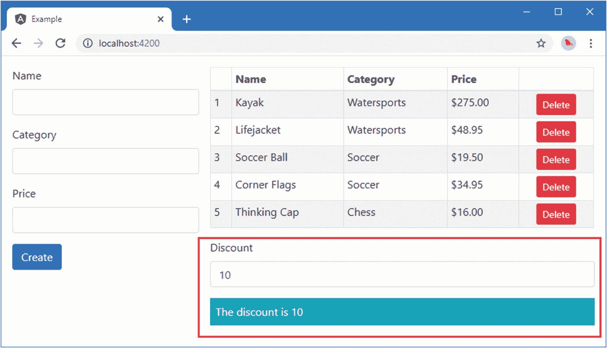
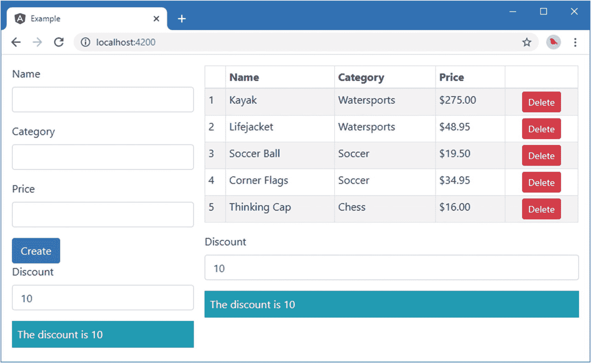
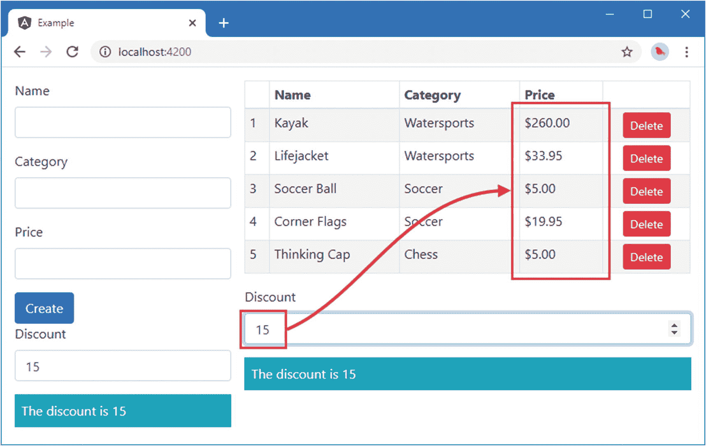

# 十九、使用服务

*服务*是提供通用功能以支持应用中其他构件的对象，例如指令、组件和管道。关于服务，重要的是它们被使用的方式，这是通过一个叫做*依赖注入*的过程。使用服务可以增加 Angular 应用的灵活性和可伸缩性，但是依赖注入可能是一个很难理解的话题。为此，我慢慢地开始这一章，解释服务和依赖注入可以用来解决的问题，依赖注入如何工作，以及为什么你应该考虑在你自己的项目中使用服务。在第 20 章[中，我介绍了 Angular 为服务提供的一些更高级的特性。表](20.html) [19-1](#Tab1) 将服务放在上下文中。

表 19-1。

将服务置于环境中

<colgroup><col class="tcol1 align-left"> <col class="tcol2 align-left"></colgroup> 
| 

问题

 | 

回答

 |
| --- | --- |
| 它们是什么？ | 服务是定义其他构建块(如组件或指令)所需功能的对象。服务与常规对象的区别在于，它们是由外部提供者提供给构建块的，而不是直接使用`new`关键字创建或由输入属性接收的。 |
| 它们为什么有用？ | 服务简化了应用的结构，使移动或重用功能变得更容易，并使隔离有效单元测试的构建块变得更容易。 |
| 它们是如何使用的？ | 类使用构造函数参数声明对服务的依赖，然后使用应用已配置的服务集解析这些参数。服务是已经应用了`@Injectable`装饰器的类。 |
| 有什么陷阱或限制吗？ | 依赖注入是一个有争议的话题，并不是所有的开发人员都喜欢使用它。如果您不执行单元测试，或者如果您的应用相对简单，实现依赖注入所需的额外工作不太可能带来任何长期回报。 |
| 还有其他选择吗？ | 服务和依赖注入是难以避免的，因为 Angular 使用它们来提供对内置功能的访问。但是如果您愿意的话，并不要求您为自己的定制功能定义服务。 |

表 [19-2](#Tab2) 总结了本章内容。

表 19-2。

章节总结

<colgroup><col class="tcol1 align-left"> <col class="tcol2 align-left"> <col class="tcol3 align-left"></colgroup> 
| 

问题

 | 

解决办法

 | 

列表

 |
| --- | --- | --- |
| 避免手动分发共享对象的需要 | 使用服务 | 1–14, 21–28 |
| 声明对服务的依赖 | 添加一个带有所需服务类型的构造函数参数 | 15–20 |

## 准备示例项目

我继续使用从第 [11 章](11.html)开始的本章中的示例项目。为了准备本章，我用清单 [19-1](#PC1) 中所示的元素替换了`ProductTable`组件模板的内容。

Tip

你可以从 [`https://github.com/Apress/pro-angular-9`](https://github.com/Apress/pro-angular-9) 下载本章以及本书其他章节的示例项目。如果在运行示例时遇到问题，请参见第 [1](01.html) 章获取帮助。

```ts
<table class="table table-sm table-bordered table-striped">
    <thead>
        <tr><th></th><th>Name</th><th>Category</th><th>Price</th><th></th></tr>
    </thead>
    <tbody>
        <tr *paFor="let item of getProducts(); let i = index">
            <td>{{i + 1}}</td>
            <td>{{item.name}}</td>
            <td>{{item.category}}</td>
            <td>{{item.price | currency:"USD":"symbol" }}</td>
            <td class="text-center">
                <button class="btn btn-danger btn-sm"
                        (click)="deleteProduct(item.id)">
                    Delete
                </button>
            </td>
        </tr>
    </tbody>
</table>

Listing 19-1.Replacing the Contents of the productTable.component.html File in the src/app Folder

```

在`example`文件夹中运行以下命令，启动 TypeScript 编译器和开发 HTTP 服务器:

```ts
ng serve

```

打开一个新的浏览器窗口并导航至`http://localhost:4200`以查看图 [19-1](#Fig1) 所示的内容。


图 19-1。

运行示例应用

## 理解对象分布问题

在第 [17](17.html) 章中，我向项目中添加了组件，以帮助打破应用的整体结构。为此，我使用输入和输出属性来连接组件，使用主体元素来桥接 Angular 在父组件及其子组件之间强制实施的隔离。我还向您展示了如何查询视图子模板的内容，它补充了第 [16](16.html) 章中描述的内容子特性。

如果谨慎应用，这些用于协调指令和组件的技术会非常强大和有用。但是它们也可能最终成为在整个应用中分发共享对象的通用工具，其结果是增加了应用的复杂性，并将组件紧密地绑定在一起。

### 演示问题

为了帮助演示这个问题，我将向项目添加一个共享对象和两个依赖于它的组件。我在`src/app`文件夹中创建了一个名为`discount.service.ts`的文件，并定义了清单 [19-2](#PC3) 中所示的类。我将在本章的后面解释文件名的`service`部分的意义。

```ts
export class DiscountService {
    private discountValue: number = 10;

    public get discount(): number {
        return this.discountValue;
    }

    public set discount(newValue: number) {
        this.discountValue = newValue || 0;
    }

    public applyDiscount(price: number) {
        return Math.max(price - this.discountValue, 5);
    }
}

Listing 19-2.The Contents of the discount.service.ts File in the src/app Folder

```

`DiscountService`类定义了一个名为`discountValue`的私有属性，用于存储一个数字，该数字将用于降低数据模型中的产品价格。这个值是通过名为`discount`的 getters 和 setters 公开的，有一个名为`applyDiscount`的便利方法可以降低价格，同时确保价格不低于 5 美元。

对于第一个使用了`DiscountService`类的组件，我在`src/app`文件夹中添加了一个名为`discountDisplay.component.ts`的文件，并添加了清单 [19-3](#PC4) 中所示的代码。

```ts
import { Component, Input } from "@angular/core";
import { DiscountService } from "./discount.service";

@Component({
    selector: "paDiscountDisplay",
    template: `<div class="bg-info text-white p-2">
                The discount is {{discounter.discount}}
               </div>`
})
export class PaDiscountDisplayComponent {

    @Input("discounter")
    discounter: DiscountService;
}

Listing 19-3.The Contents of the discountDisplay.component.ts File in the src/app Folder

```

`DiscountDisplayComponent`使用一个内嵌模板来显示折扣金额，该金额是从通过`input`属性接收的`DiscountService`对象中获得的。

对于使用`DiscountService`类的第二个组件，我在`src/app`文件夹中添加了一个名为`discountEditor.component.ts`的文件，并添加了清单 [19-4](#PC5) 中所示的代码。

```ts
import { Component, Input } from "@angular/core";
import { DiscountService } from "./discount.service";

@Component({
    selector: "paDiscountEditor",
    template: `<div class="form-group">
                   <label>Discount</label>
                   <input [(ngModel)]="discounter.discount"
                        class="form-control" type="number" />
               </div>`
})
export class PaDiscountEditorComponent {

    @Input("discounter")
    discounter: DiscountService;
}

Listing 19-4.The Contents of the discountEditor.component.ts File in the src/app Folder

```

`DiscountEditorComponent`使用带有`input`元素的内嵌模板，允许编辑折扣金额。`input`元素在针对`ngModel`指令的`DiscountService.discount`属性上有一个双向绑定。清单 [19-5](#PC6) 显示了 Angular 模块中启用的新组件。

```ts
import { NgModule } from "@angular/core";
import { BrowserModule } from "@angular/platform-browser";
import { ProductComponent } from "./component";
import { FormsModule, ReactiveFormsModule } from "@angular/forms";
import { PaAttrDirective } from "./attr.directive";
import { PaModel } from "./twoway.directive";
import { PaStructureDirective } from "./structure.directive";
import { PaIteratorDirective } from "./iterator.directive";
import { PaCellColor } from "./cellColor.directive";
import { PaCellColorSwitcher } from "./cellColorSwitcher.directive";
import { ProductTableComponent } from "./productTable.component";
import { ProductFormComponent } from "./productForm.component";
import { PaToggleView } from "./toggleView.component";
import { PaAddTaxPipe } from "./addTax.pipe";
import { PaCategoryFilterPipe } from "./categoryFilter.pipe";
import { LOCALE_ID } from "@angular/core";
import localeFr from '@angular/common/locales/fr';
import { registerLocaleData } from '@angular/common';
import { PaDiscountDisplayComponent } from "./discountDisplay.component";
import { PaDiscountEditorComponent } from "./discountEditor.component";

registerLocaleData(localeFr);

@NgModule({
  imports: [BrowserModule, FormsModule, ReactiveFormsModule],
  declarations: [ProductComponent, PaAttrDirective, PaModel,
    PaStructureDirective, PaIteratorDirective,
    PaCellColor, PaCellColorSwitcher, ProductTableComponent,
    ProductFormComponent, PaToggleView, PaAddTaxPipe,
    PaCategoryFilterPipe, PaDiscountDisplayComponent, PaDiscountEditorComponent],
  //providers: [{ provide: LOCALE_ID, useValue: "fr-FR" }],
  bootstrap: [ProductComponent]
})
export class AppModule { }

Listing 19-5.Enabling the Components in the app.module.ts File in the src/app Folder

```

为了让新组件工作，我将它们添加到父组件的模板中，将新内容放在列出产品的表格下面，这意味着我需要编辑`productTable.component.html`文件，如清单 [19-6](#PC7) 所示。

```ts
<table class="table table-sm table-bordered table-striped">
    <thead>
        <tr><th></th><th>Name</th><th>Category</th><th>Price</th><th></th></tr>
    </thead>
    <tbody>
        <tr *paFor="let item of getProducts(); let i = index">
            <td>{{i + 1}}</td>
            <td>{{item.name}}</td>
            <td>{{item.category}}</td>
            <td>{{item.price | currency:"USD":"symbol" }}</td>
            <td class="text-center">
                <button class="btn btn-danger btn-sm"
                        (click)="deleteProduct(item.id)">
                    Delete
                </button>
            </td>
        </tr>
    </tbody>
</table>

<paDiscountEditor [discounter]="discounter"></paDiscountEditor>
<paDiscountDisplay [discounter]="discounter"></paDiscountDisplay>

Listing 19-6.Adding Component Elements in the productTable.component.html File in the src/app Folder

```

这些元素对应于清单 [19-3](#PC4) 和清单 [19-4](#PC5) 中组件的`selector`属性，并使用数据绑定来设置输入属性的值。最后一步是在父组件中创建一个对象，它将为数据绑定表达式提供值，如清单 [19-7](#PC8) 所示。

```ts
import { Component, Input, ViewChildren, QueryList } from "@angular/core";
import { Model } from "./repository.model";
import { Product } from "./product.model";
import { DiscountService } from "./discount.service";

@Component({
    selector: "paProductTable",
    templateUrl: "productTable.component.html"
})
export class ProductTableComponent {
    discounter: DiscountService = new DiscountService();

    @Input("model")
    dataModel: Model;

    getProduct(key: number): Product {
        return this.dataModel.getProduct(key);
    }

    getProducts(): Product[] {
        return this.dataModel.getProducts();
    }

    deleteProduct(key: number) {
        this.dataModel.deleteProduct(key);
    }

    taxRate: number = 0;
    dateObject: Date = new Date(2020, 1, 20);
    dateString: string = "2020-02-20T00:00:00.000Z";
    dateNumber: number = 1582156800000;

    selectMap = {
        "Watersports": "stay dry",
        "Soccer": "score goals",
        "other": "have fun"
    }

    numberMap = {
        "=1": "one product",
        "=2": "two products",
        "other": "# products"
    }
}

Listing 19-7.Creating the Shared Object in the productTable.component.ts File in the src/app Folder

```

图 [19-2](#Fig2) 显示了新组件的内容。由一个组件提供的对`input`元素中的值的更改将反映在由另一个组件呈现的内容中，反映了共享的`DiscountService`对象及其`discount`属性的使用。



图 19-2。

向示例应用添加组件

直到最后阶段，添加新组件和共享对象的过程都是简单明了且符合逻辑的。问题出现在我创建和分发共享对象的方式上:类的实例。

因为 Angular 将组件彼此隔离，我没有办法在`DiscountEditorComponent`和`DiscountDisplayComponent`之间直接共享`DiscountService`对象。每个组件都可以创建自己的`DiscountService`对象，但是这意味着来自编辑器组件的更改不会显示在显示组件中。

这就是我在 product table 组件中创建`DiscountService`对象的原因，它是折扣编辑器和显示组件的第一个共享祖先。这允许我通过 product table 组件的模板分发`DiscountService`对象，确保需要它的两个组件共享一个对象。

但是有几个问题。首先，`ProductTableComponent`类实际上并不需要或使用一个`DiscountService`对象来交付它自己的功能。它恰好是需要该对象的组件的第一个共同祖先。在`ProductTableComponent`类中创建共享对象会使这个类稍微复杂一点，并且更难有效地测试。这是复杂性的适度增加，但它会发生在应用需要的每个共享对象上——一个复杂的应用可能依赖于许多共享对象，每个对象最终都是由组件创建的，而这些组件恰好是依赖它们的类的第一个公共祖先。

第二个问题由术语*第一个共同祖先*暗示。`ProductTableComponent`类恰好是依赖于`DiscountService`对象的两个类的父类，但是想想如果我想移动`DiscountEditorComponent`使其显示在表单下而不是表格下会发生什么。在这种情况下，我必须沿着组件树向上搜索，直到找到一个共同的祖先，这将成为根组件。然后，我必须沿着组件树添加输入属性和修改模板，以便每个中间组件可以从其父组件接收`DiscountService`对象，并将其传递给任何有需要它的后代的子组件。这同样适用于任何依赖于接收一个`DiscountService`对象的指令，其中任何其模板包含以该指令为目标的数据绑定的组件必须确保它们也是分发链的一部分。

结果是应用中的组件和指令紧密地绑定在一起。如果您需要在应用的不同部分移动或重用组件，并且输入属性和数据绑定的管理变得难以管理，则需要进行重大的重构。

### 使用依赖注入将对象作为服务分发

将对象分配给依赖它们的类有一个更好的方法，那就是使用*依赖注入*，对象从外部源提供给类。Angular 包含一个内置的依赖注入系统，并提供外部对象源，称为*提供者*。在接下来的小节中，我重新编写了示例应用来提供`DiscountService`对象，而不需要使用组件层次结构作为分发机制。

#### 准备服务

通过依赖注入管理和分发的任何对象都被称为*服务*，这就是为什么我选择了名称`DiscountService`作为定义共享对象的类，以及为什么这个类被定义在一个名为`discount.service.ts`的文件中。Angular 使用`@Injectable`装饰器表示服务类，如清单 [19-8](#PC9) 所示。`@Injectable`装饰器没有定义任何配置属性。

```ts
import { Injectable } from "@angular/core";

@Injectable()
export class DiscountService {
    private discountValue: number = 10;

    public get discount(): number {
        return this.discountValue;
    }

    public set discount(newValue: number) {
        this.discountValue = newValue || 0;
    }

    public applyDiscount(price: number) {
        return Math.max(price - this.discountValue, 5);
    }
}

Listing 19-8.Preparing a Class as a Service in the discount.service.ts File in the src/app Folder

```

Tip

严格地说，只有当一个类有自己的构造函数参数需要解析时，才需要使用`@Injectable`装饰器，但是无论如何应用它都是一个好主意，因为它提供了一个信号，表明这个类打算用作服务。

#### 准备相关组件

类使用其构造函数声明依赖关系。当 Angular 需要创建一个类的实例时——比如当它找到一个与组件定义的`selector`属性匹配的元素时——它的构造函数会被检查，每个参数的类型也会被检查。Angular 然后使用已经定义的服务来尝试满足依赖性。术语*依赖注入*的出现是因为每个依赖都被*注入*到构造函数中以创建新的实例。

对于示例应用，这意味着依赖于`DiscountService`对象的组件不再需要输入属性，而是可以声明一个构造函数依赖。清单 [19-9](#PC10) 显示了`DiscountDisplayComponent`类的变化。

```ts
import { Component, Input } from "@angular/core";
import { DiscountService } from "./discount.service";

@Component({
  selector: "paDiscountDisplay",
  template: `<div class="bg-info text-white p-2">
                The discount is {{discounter.discount}}
               </div>`
})
export class PaDiscountDisplayComponent {

  constructor(public discounter: DiscountService) { }
}

Listing 19-9.Declaring a Dependency in the discountDisplay.component.ts File in the src/app Folder

```

同样的变化可以应用到`DiscountEditorComponent`类，用通过构造函数声明的依赖项替换输入属性，如清单 [19-10](#PC11) 所示。

```ts
import { Component, Input } from "@angular/core";
import { DiscountService } from "./discount.service";

@Component({
    selector: "paDiscountEditor",
    template: `<div class="form-group">
                   <label>Discount</label>
                   <input [(ngModel)]="discounter.discount"
                        class="form-control" type="number" />
               </div>`
})
export class PaDiscountEditorComponent {

    constructor(public discounter: DiscountService) { }
}

Listing 19-10.Declaring a Dependency in the discountEditor.component.ts File in the src/app Folder

```

这些都是很小的变化，但是它们避免了使用模板和输入属性来分发对象的需要，并且产生了更灵活的应用。我现在可以从产品表组件中移除`DiscountService`对象，如清单 [19-11](#PC12) 所示。

```ts
import { Component, Input, ViewChildren, QueryList } from "@angular/core";
import { Model } from "./repository.model";
import { Product } from "./product.model";
import { DiscountService } from "./discount.service";

@Component({
    selector: "paProductTable",
    templateUrl: "productTable.component.html"
})
export class ProductTableComponent {
    //discounter: DiscountService = new DiscountService();

    @Input("model")
    dataModel: Model;

    getProduct(key: number): Product {
        return this.dataModel.getProduct(key);
    }

    getProducts(): Product[] {
        return this.dataModel.getProducts();
    }

    deleteProduct(key: number) {
        this.dataModel.deleteProduct(key);
    }

    taxRate: number = 0;
    dateObject: Date = new Date(2020, 1, 20);
    dateString: string = "2020-02-20T00:00:00.000Z";
    dateNumber: number = 1582156800000;

    selectMap = {
        "Watersports": "stay dry",
        "Soccer": "score goals",
        "other": "have fun"
    }

    numberMap = {
        "=1": "one product",
        "=2": "two products",
        "other": "# products"
    }
}

Listing 19-11.Removing the Shared Object in the productTable.component.ts File in the src/app Folder

```

由于父组件不再通过数据绑定提供共享对象，我可以将它们从模板中移除，如清单 [19-12](#PC13) 所示。

```ts
<table class="table table-sm table-bordered table-striped">
    <thead>
        <tr><th></th><th>Name</th><th>Category</th><th>Price</th><th></th></tr>
    </thead>
    <tbody>
        <tr *paFor="let item of getProducts(); let i = index">
            <td>{{i + 1}}</td>
            <td>{{item.name}}</td>
            <td>{{item.category}}</td>
            <td>{{item.price | currency:"USD":"symbol" }}</td>
            <td class="text-center">
                <button class="btn btn-danger btn-sm"
                        (click)="deleteProduct(item.id)">
                    Delete
                </button>
            </td>
        </tr>
    </tbody>
</table>

<paDiscountEditor></paDiscountEditor>
<paDiscountDisplay></paDiscountDisplay>

Listing 19-12.Removing the Data Bindings in the productTable.component.html File in the src/app Folder

```

#### 注册服务

最后一个变化是配置依赖注入特性，这样它就可以向需要它们的组件提供`DiscountService`对象。为了使服务在整个应用中可用，它被注册在 Angular 模块中，如清单 [19-13](#PC14) 所示。

```ts
import { NgModule } from "@angular/core";
import { BrowserModule } from "@angular/platform-browser";
import { ProductComponent } from "./component";
import { FormsModule, ReactiveFormsModule } from "@angular/forms";
import { PaAttrDirective } from "./attr.directive";
import { PaModel } from "./twoway.directive";
import { PaStructureDirective } from "./structure.directive";
import { PaIteratorDirective } from "./iterator.directive";
import { PaCellColor } from "./cellColor.directive";
import { PaCellColorSwitcher } from "./cellColorSwitcher.directive";
import { ProductTableComponent } from "./productTable.component";
import { ProductFormComponent } from "./productForm.component";
import { PaToggleView } from "./toggleView.component";
import { PaAddTaxPipe } from "./addTax.pipe";
import { PaCategoryFilterPipe } from "./categoryFilter.pipe";
import { LOCALE_ID } from "@angular/core";
import localeFr from '@angular/common/locales/fr';
import { registerLocaleData } from '@angular/common';
import { PaDiscountDisplayComponent } from "./discountDisplay.component";
import { PaDiscountEditorComponent } from "./discountEditor.component";
import { DiscountService } from "./discount.service";

registerLocaleData(localeFr);

@NgModule({
  imports: [BrowserModule, FormsModule, ReactiveFormsModule],
  declarations: [ProductComponent, PaAttrDirective, PaModel,
    PaStructureDirective, PaIteratorDirective,
    PaCellColor, PaCellColorSwitcher, ProductTableComponent,
    ProductFormComponent, PaToggleView, PaAddTaxPipe,
    PaCategoryFilterPipe, PaDiscountDisplayComponent, PaDiscountEditorComponent],
  providers: [DiscountService],
  bootstrap: [ProductComponent]
})
export class AppModule { }

Listing 19-13.Registering a Service in the app.module.ts File in the src/app Folder

```

`NgModule` decorator 的`providers`属性被设置为将被用作服务的类的数组。目前只有一种服务，由`DiscountService`级提供。

当您保存对应用的更改时，不会有任何可见的更改，但是依赖注入特性将被用来为组件提供它们需要的`DiscountService`对象。

#### 查看依赖注入更改

Angular 无缝地将依赖注入集成到它的特性集中。每当 Angular 遇到一个需要新构建块的元素，比如一个组件或一个管道，它就检查类构造函数来检查已经声明了哪些依赖项，并使用它的服务来尝试解决它们。用于解决依赖关系的服务集包括由应用定义的定制服务，例如在清单 [19-13](#PC14) 中注册的`DiscountService`服务，以及一组由 Angular 提供的内置服务，将在后面的章节中描述。

上一节中引入依赖注入的更改并没有导致应用工作方式的巨大变化，或者说根本没有任何可见的变化。但是应用的组装方式有很大的不同，这使得它更加灵活和流畅。最好的演示是将需要`DiscountService`的组件添加到应用的不同部分，如清单 [19-14](#PC15) 所示。

```ts
<form novalidate #form="ngForm" (ngSubmit)="submitForm(form)">
    <div class="form-group">
        <label>Name</label>
        <input class="form-control"
            name="name" [(ngModel)]="newProduct.name" />
    </div>
    <div class="form-group">
        <label>Category</label>
        <input class="form-control"
            name="category" [(ngModel)]="newProduct.category" />
    </div>
    <div class="form-group">
        <label>Price</label>
        <input class="form-control"
            name="name" [(ngModel)]="newProduct.price" />
    </div>
    <button class="btn btn-primary" type="submit">
            Create
    </button>
</form>

<paDiscountEditor></paDiscountEditor>
<paDiscountDisplay></paDiscountDisplay>

Listing 19-14.Adding Components in the productForm.component.html File in the src/app Folder

```

这些新元素复制了折扣显示和编辑器组件，因此它们出现在用于创建新产品的表单下方，如图 [19-3](#Fig3) 所示。



图 19-3。

复制具有从属关系的元件

有两点需要注意。首先，使用依赖注入使得向模板添加元素的过程变得简单，不需要修改祖先组件来使用输入属性提供一个`DiscountService`对象。

第二点需要注意的是，应用中所有声明依赖于`DiscountService`的组件都接收到了同一个对象。如果您编辑任一`input`元素中的值，更改将反映在另一个`input`元素和字符串插值绑定中，如图 [19-4](#Fig4) 所示。


图 19-4。

检查是否使用共享对象解决了依赖关系

### 在其他构建块中声明依赖项

不仅仅是组件可以声明构造函数依赖关系。一旦您定义了一个服务，您就可以更广泛地使用它，包括在应用的其他构建块中，比如管道和指令，如下面几节所演示的。

#### 在管道中声明依赖关系

管道可以通过为每个必需的服务定义一个带有参数的构造函数来声明对服务的依赖。为了演示，我在`src/app`文件夹中添加了一个名为`discount.pipe.ts`的文件，并用它来定义清单 [19-15](#PC16) 中所示的管道。

```ts
import { Pipe, Injectable } from "@angular/core";
import { DiscountService } from "./discount.service";

@Pipe({
    name: "discount",
    pure: false
})
export class PaDiscountPipe {

    constructor(private discount: DiscountService) { }

    transform(price: number): number {
        return this.discount.applyDiscount(price);
    }
}

Listing 19-15.The Contents of the discount.pipe.ts File in the src/app Folder

```

`PaDiscountPipe`类是一个接收`price`并通过调用`DiscountService.applyDiscount`方法生成结果的管道，其中服务通过构造函数接收。`@Pipe`装饰器中的`pure`属性是`false`，这意味着当`DiscountService`存储的值改变时，管道将被要求更新其结果，这不会被 Angular 变化检测过程识别。

Tip

正如第 [18 章](18.html)中所解释的，这个特性应该小心使用，因为它意味着`transform`方法将在应用的每次更改后被调用，而不仅仅是在服务更改时。

清单 [19-16](#PC17) 显示了在应用的 Angular 模块中注册的新管道。

```ts
import { NgModule } from "@angular/core";
import { BrowserModule } from "@angular/platform-browser";
import { ProductComponent } from "./component";
import { FormsModule, ReactiveFormsModule } from "@angular/forms";
import { PaAttrDirective } from "./attr.directive";
import { PaModel } from "./twoway.directive";
import { PaStructureDirective } from "./structure.directive";
import { PaIteratorDirective } from "./iterator.directive";
import { PaCellColor } from "./cellColor.directive";
import { PaCellColorSwitcher } from "./cellColorSwitcher.directive";
import { ProductTableComponent } from "./productTable.component";
import { ProductFormComponent } from "./productForm.component";
import { PaToggleView } from "./toggleView.component";
import { PaAddTaxPipe } from "./addTax.pipe";
import { PaCategoryFilterPipe } from "./categoryFilter.pipe";
import { LOCALE_ID } from "@angular/core";
import localeFr from '@angular/common/locales/fr';
import { registerLocaleData } from '@angular/common';
import { PaDiscountDisplayComponent } from "./discountDisplay.component";
import { PaDiscountEditorComponent } from "./discountEditor.component";
import { DiscountService } from "./discount.service";
import { PaDiscountPipe } from "./discount.pipe";

registerLocaleData(localeFr);

@NgModule({
  imports: [BrowserModule, FormsModule, ReactiveFormsModule],
  declarations: [ProductComponent, PaAttrDirective, PaModel,
    PaStructureDirective, PaIteratorDirective,
    PaCellColor, PaCellColorSwitcher, ProductTableComponent,
    ProductFormComponent, PaToggleView, PaAddTaxPipe,
    PaCategoryFilterPipe, PaDiscountDisplayComponent, PaDiscountEditorComponent,
    PaDiscountPipe],
  providers: [DiscountService],
  bootstrap: [ProductComponent]
})
export class AppModule { }

Listing 19-16.Registering a Pipe in the app.module.ts File in the src/app Folder

```

清单 [19-17](#PC18) 显示了应用于产品表中`Price`列的新管道。

```ts
<table class="table table-sm table-bordered table-striped">
    <thead>
        <tr><th></th><th>Name</th><th>Category</th><th>Price</th><th></th></tr>
    </thead>
    <tbody>
        <tr *paFor="let item of getProducts(); let i = index">
            <td>{{i + 1}}</td>
            <td>{{item.name}}</td>
            <td>{{item.category}}</td>
            <td>{{item.price | discount | currency:"USD":"symbol" }}</td>
            <td class="text-center">
                <button class="btn btn-danger btn-sm"
                        (click)="deleteProduct(item.id)">
                    Delete
                </button>
            </td>
        </tr>
    </tbody>
</table>

<paDiscountEditor></paDiscountEditor>
<paDiscountDisplay></paDiscountDisplay>

Listing 19-17.Applying a Pipe in the productTable.component.html File in the src/app Folder

```

`discount`管道处理价格以应用折扣，然后将值传递给`currency`管道进行格式化。您可以通过更改折扣`input`元素之一的值来查看在管道中使用服务的效果，如图 [19-5](#Fig5) 所示。



图 19-5。

在管道中使用服务

#### 在指令中声明依赖关系

指令也可以使用服务。正如我在第 [17](17.html) 章中解释的，组件只是带有模板的指令，所以在组件中工作的任何东西也将在指令中工作。

为了演示如何在指令中使用服务，我在`src/app`文件夹中添加了一个名为`discountAmount.directive.ts`的文件，并用它来定义清单 [19-18](#PC19) 中所示的指令。

```ts
import { Directive, HostBinding, Input,
    SimpleChange, KeyValueDiffer, KeyValueDiffers,
    ChangeDetectorRef } from "@angular/core";
import { DiscountService } from "./discount.service";

@Directive({
    selector: "td[pa-price]",
    exportAs: "discount"
})
export class PaDiscountAmountDirective {
    private differ: KeyValueDiffer<any, any>;

    constructor(private keyValueDiffers: KeyValueDiffers,
        private changeDetector: ChangeDetectorRef,
        private discount: DiscountService) { }

    @Input("pa-price")
    originalPrice: number;

    discountAmount: number;

    ngOnInit() {
        this.differ =
            this.keyValueDiffers.find(this.discount).create();
    }

    ngOnChanges(changes: { [property: string]: SimpleChange }) {
        if (changes["originalPrice"] != null) {
            this.updateValue();
        }
    }

    ngDoCheck() {
        if (this.differ.diff(this.discount) != null) {
            this.updateValue();
        }
    }

    private updateValue() {
        this.discountAmount = this.originalPrice
            - this.discount.applyDiscount(this.originalPrice);
    }
}

Listing 19-18.The Contents of the discountAmount.directive.ts File in the src/app Folder

```

指令没有与`pipes`使用的`pure`属性等价的属性，必须直接负责响应通过服务传播的变化。本指令显示产品的折扣金额。`selector`属性匹配具有`pa-price`属性的`td`元素，该属性也被用作输入属性来接收将要打折的价格。该指令使用`exportAs`属性导出其功能，并提供一个名为`discountAmount`的属性，其值设置为应用于产品的折扣。

关于这个指令还有另外两点需要注意。首先，`DiscountService`对象不是指令类中唯一的构造函数参数。

```ts
...
constructor(private keyValueDiffers: KeyValueDiffers,
            private changeDetector: ChangeDetectorRef,
            private discount: DiscountService) { }
...

```

`KeyValueDiffers`和`ChangeDetectorRef`参数也是 Angular 在创建 directive 类的新实例时必须解决的依赖关系。这些是 Angular 提供的内置服务的例子，它们提供了通常需要的功能。

第二点要注意的是指令如何处理它接收到的服务。使用`DiscountService`服务的组件和管道不必担心跟踪更新，因为 Angular 自动评估数据绑定的表达式，并在折扣率变化时更新它们(对于组件)，或者因为应用中的任何变化都会触发更新(对于不纯的管道)。该指令的数据绑定在`price`属性上，如果被更改，该属性将触发更改。但是也存在对由`DiscountService`类定义的`discount`属性的依赖。使用通过构造函数接收的服务来检测`discount`属性的变化，这些服务类似于在第 [16 章](16.html)中描述的用于跟踪可迭代序列变化的服务，但是它们操作于键值对对象，例如`Map`对象，或者定义属性的常规对象，例如`DiscountService`。当 Angular 调用`ngDoCheck`方法时，该指令使用键-值对 different 来查看是否发生了变化。(也可以通过跟踪 directive 类中以前的更新来处理这个更改方向，但是我想提供一个使用键值差异特性的示例。)

该指令还实现了`ngOnChanges`方法，以便它能够响应输入属性值的变化。对于这两种类型的更新，都调用了`updateValue`方法，该方法计算折扣价并将其分配给`discountAmount`属性。

清单 [19-19](#PC21) 在应用的 Angular 模块中注册新指令。

```ts
import { NgModule } from "@angular/core";
import { BrowserModule } from "@angular/platform-browser";
import { ProductComponent } from "./component";
import { FormsModule, ReactiveFormsModule } from "@angular/forms";
import { PaAttrDirective } from "./attr.directive";
import { PaModel } from "./twoway.directive";
import { PaStructureDirective } from "./structure.directive";
import { PaIteratorDirective } from "./iterator.directive";
import { PaCellColor } from "./cellColor.directive";
import { PaCellColorSwitcher } from "./cellColorSwitcher.directive";
import { ProductTableComponent } from "./productTable.component";
import { ProductFormComponent } from "./productForm.component";
import { PaToggleView } from "./toggleView.component";
import { PaAddTaxPipe } from "./addTax.pipe";
import { PaCategoryFilterPipe } from "./categoryFilter.pipe";
import { LOCALE_ID } from "@angular/core";
import localeFr from '@angular/common/locales/fr';
import { registerLocaleData } from '@angular/common';
import { PaDiscountDisplayComponent } from "./discountDisplay.component";
import { PaDiscountEditorComponent } from "./discountEditor.component";
import { DiscountService } from "./discount.service";
import { PaDiscountPipe } from "./discount.pipe";
import { PaDiscountAmountDirective } from "./discountAmount.directive";

registerLocaleData(localeFr);

@NgModule({
  imports: [BrowserModule, FormsModule, ReactiveFormsModule],
  declarations: [ProductComponent, PaAttrDirective, PaModel,
    PaStructureDirective, PaIteratorDirective,
    PaCellColor, PaCellColorSwitcher, ProductTableComponent,
    ProductFormComponent, PaToggleView, PaAddTaxPipe,
    PaCategoryFilterPipe, PaDiscountDisplayComponent, PaDiscountEditorComponent,
    PaDiscountPipe, PaDiscountAmountDirective],
  providers: [DiscountService],
  bootstrap: [ProductComponent]
})
export class AppModule { }

Listing 19-19.Registering a Directive in the app.module.ts File in the src/app Folder

```

为了应用新的指令，清单 [19-20](#PC22) 向表中添加了一个新列，使用字符串插值绑定来访问指令提供的属性，并将其传递给`currency`管道。

```ts
<table class="table table-sm table-bordered table-striped">
    <thead>
        <tr><th></th><th>Name</th><th>Category</th><th>Price</th><th></th></tr>
    </thead>
    <tbody>
        <tr *paFor="let item of getProducts(); let i = index">
            <td>{{i + 1}}</td>
            <td>{{item.name}}</td>
            <td>{{item.category}}</td>
            <td [pa-price]="item.price" #discount="discount">
                {{ discount.discountAmount | currency:"USD":"symbol"}}
            </td>
            <td class="text-center">
                <button class="btn btn-danger btn-sm"
                        (click)="deleteProduct(item.id)">
                    Delete
                </button>
            </td>
        </tr>
    </tbody>
</table>

<paDiscountEditor></paDiscountEditor>
<paDiscountDisplay></paDiscountDisplay>

Listing 19-20.Creating a New Column in the productTable.component.html File in the src/app Folder

```

该指令本来可以在`textContent`属性上创建一个主机绑定来设置其主机元素的内容，但是这会阻止使用`currency`管道。相反，该指令被分配给`discount`模板变量，然后在字符串插值绑定中使用该变量来访问并格式化`discountAmount`值。图 [19-6](#Fig6) 显示了结果。在折扣编辑器`input`元素中对折扣金额的更改将反映在新的表格列中。


图 19-6。

在指令中使用服务

## 理解测试隔离问题

示例应用包含一个相关的问题，服务和依赖注入可以用来解决这个问题。考虑如何在根组件中创建`Model`类。

```ts
import { ApplicationRef, Component } from "@angular/core";
import { Model } from "./repository.model";
import { Product } from "./product.model";
import { ProductFormGroup } from "./form.model";

@Component({
    selector: "app",
    templateUrl: "app/template.html"
})
export class ProductComponent {
    model: Model = new Model();

    addProduct(p: Product) {
        this.model.saveProduct(p);
    }
}

```

根组件被定义为`ProductComponent`类，它通过创建一个`Model`类的新实例为其`model`属性设置一个值。这是可行的——并且是创建对象的完全合法的方式——但是它使得有效地执行单元测试变得更加困难。

当您能够隔离应用的一小部分并集中精力执行测试时，单元测试效果最好。但是当您创建一个`ProductComponent`类的实例时，您也隐式地创建了一个`Model`类的实例。如果您要对根组件的`addProduct`方法运行测试并发现一个问题，您将无法知道这个问题是在`ProductComponent`还是`Model`类中。

### 使用服务和依赖注入隔离组件

潜在的问题是，`ProductComponent`类与`Model`类紧密绑定，而后者又与`SimpleDataSource`类紧密绑定。依赖注入可以用来分离应用中的构件，这样每个类都可以独立地被隔离和测试。在接下来的几节中，我将介绍分解这些紧密耦合的类的过程，基本上遵循与上一节相同的过程，但是会更深入地研究示例应用。

#### 准备服务

`@Injectable`装饰器用来表示服务，就像前面的例子一样。清单 [19-21](#PC24) 显示了应用于`SimpleDataSource`类的装饰器。

```ts
import { Injectable } from "@angular/core";
import { Product } from "./product.model";

@Injectable()
export class SimpleDataSource {
    private data:Product[];

    constructor() {
        this.data = new Array<Product>(
        new Product(1, "Kayak", "Watersports", 275),
        new Product(2, "Lifejacket", "Watersports", 48.95),
        new Product(3, "Soccer Ball", "Soccer", 19.50),
        new Product(4, "Corner Flags", "Soccer", 34.95),
        new Product(5, "Thinking Cap", "Chess", 16));
    }

    getData(): Product[] {
        return this.data;
    }
}

Listing 19-21.Denoting a Service in the datasource.model.ts File in the src/app Folder

```

不需要其他更改。清单 [19-22](#PC25) 显示了同样的装饰器被应用到数据仓库，由于这个类依赖于`SimpleDataSource`类，它声明它是一个构造函数依赖，而不是直接创建一个实例。

```ts
import { Injectable } from "@angular/core";
import { Product } from "./product.model";
import { SimpleDataSource } from "./datasource.model";

@Injectable()
export class Model {
    //private dataSource: SimpleDataSource;
    private products: Product[];
    private locator = (p:Product, id:number) => p.id == id;

    constructor(private dataSource: SimpleDataSource) {
        //this.dataSource = new SimpleDataSource();
        this.products = new Array<Product>();
        this.dataSource.getData().forEach(p => this.products.push(p));
    }

    // ...other members omitted for brevity...
}

Listing 19-22.Denoting a Service and Dependency in the repository.model.ts File in the src/app Folder

```

清单中需要注意的重要一点是，服务可以声明对其他服务的依赖。当 Angular 创建一个服务类的新实例时，它会检查构造函数，并尝试以处理组件或指令时相同的方式解析服务。

#### 注册服务

这些服务必须被注册，以便 Angular 知道如何解析对它们的依赖，如清单 [19-23](#PC26) 所示。

```ts
import { NgModule } from "@angular/core";
import { BrowserModule } from "@angular/platform-browser";
import { ProductComponent } from "./component";
import { FormsModule, ReactiveFormsModule } from "@angular/forms";
import { PaAttrDirective } from "./attr.directive";
import { PaModel } from "./twoway.directive";
import { PaStructureDirective } from "./structure.directive";
import { PaIteratorDirective } from "./iterator.directive";
import { PaCellColor } from "./cellColor.directive";
import { PaCellColorSwitcher } from "./cellColorSwitcher.directive";
import { ProductTableComponent } from "./productTable.component";
import { ProductFormComponent } from "./productForm.component";
import { PaToggleView } from "./toggleView.component";
import { PaAddTaxPipe } from "./addTax.pipe";
import { PaCategoryFilterPipe } from "./categoryFilter.pipe";
import { LOCALE_ID } from "@angular/core";
import localeFr from '@angular/common/locales/fr';
import { registerLocaleData } from '@angular/common';
import { PaDiscountDisplayComponent } from "./discountDisplay.component";
import { PaDiscountEditorComponent } from "./discountEditor.component";
import { DiscountService } from "./discount.service";
import { PaDiscountPipe } from "./discount.pipe";
import { PaDiscountAmountDirective } from "./discountAmount.directive";
import { SimpleDataSource } from "./datasource.model";
import { Model } from "./repository.model";

registerLocaleData(localeFr);

@NgModule({
  imports: [BrowserModule, FormsModule, ReactiveFormsModule],
  declarations: [ProductComponent, PaAttrDirective, PaModel,
    PaStructureDirective, PaIteratorDirective,
    PaCellColor, PaCellColorSwitcher, ProductTableComponent,
    ProductFormComponent, PaToggleView, PaAddTaxPipe,
    PaCategoryFilterPipe, PaDiscountDisplayComponent, PaDiscountEditorComponent,
    PaDiscountPipe, PaDiscountAmountDirective],
    providers: [DiscountService, SimpleDataSource, Model],
  bootstrap: [ProductComponent]
})
export class AppModule { }

Listing 19-23.Registering the Services in the app.module.ts File in the src/app Folder

```

#### 准备从属组件

不是直接创建一个`Model`对象，根组件可以声明一个构造函数依赖，Angular 将在应用启动时使用依赖注入来解析它，如清单 [19-24](#PC27) 所示。

```ts
import { ApplicationRef, Component } from "@angular/core";
import { Model } from "./repository.model";
import { Product } from "./product.model";
import { ProductFormGroup } from "./form.model";

@Component({
    selector: "app",
    templateUrl: "template.html"
})
export class ProductComponent {
    //model: Model = new Model();

    constructor(public model: Model) { }

    addProduct(p: Product) {
        this.model.saveProduct(p);
    }
}

Listing 19-24.Declaring a Service Dependency in the component.ts File in the src/app Folder

```

现在 Angular 需要解决一系列的依赖关系。当应用启动时，Angular 模块指定`ProductComponent`类需要一个`Model`对象。Angular 检查了`Model`类，发现它需要一个`SimpleDataSource`对象。Angular 检查了`SimpleDataSource`对象，发现没有已声明的依赖关系，因此知道这是链的结尾。它创建一个`SimpleDataSource`对象，并将其作为参数传递给`Model`构造函数，以创建一个`Model`对象，然后可以将其传递给`ProductComponent`类构造函数，以创建将用作根组件的对象。所有这些都是自动发生的，基于每个类定义的构造函数和`@Injectable`装饰器的使用。

这些改变不会在应用的工作方式上产生任何可见的变化，但是它们允许一种完全不同的方式来执行单元测试。`ProductComponent`类要求提供一个`Model`对象作为构造函数参数，这允许使用模拟对象。

打破应用中类之间的直接依赖关系意味着它们中的每一个都可以出于单元测试的目的而被隔离，并通过它们的构造函数被提供给模拟对象，从而允许方法或一些其他特性的效果被一致且独立地评估。

## 完成服务的采用

一旦您开始在应用中使用服务，这个过程通常就有了自己的生命，并且您开始检查您创建的构建块之间的关系。你引入服务的程度是——至少部分是——个人偏好的问题。

一个很好的例子是在根组件中使用`Model`类。尽管该组件实现了一个使用`Model`对象的方法，但它这样做是因为它需要处理来自它的一个子组件的定制事件。根组件需要一个`Model`对象的另一个原因是使用输入属性通过它的模板将其传递给另一个子组件。

这种情况并不是一个大问题，您可能更喜欢在一个项目中拥有这些类型的关系。毕竟，对于单元测试来说，每一个组件都可以被隔离，而且它们之间的关系有一定的用途，尽管是有限的。组件之间的这种关系有助于理解应用提供的功能。

另一方面，使用服务越多，项目中的构建块就越能成为独立的和可重用的功能块，随着项目的成熟，这可以简化添加或更改功能的过程。

没有绝对的对错，你必须找到适合你、适合你的团队、最终适合你的用户和客户的平衡点。不是每个人都喜欢使用依赖注入，也不是每个人都执行单元测试。

我倾向于尽可能广泛地使用依赖注入。我发现当我开始一个新项目时，我的应用的最终结构可能与我期望的有很大不同，并且依赖注入提供的灵活性帮助我避免了重复的重构周期。所以，为了完成这一章，我将把`Model`服务的使用推进到应用的其余部分，打破根组件和它的直接子组件之间的耦合。

### 更新根组件和模板

我要做的第一个更改是从根组件中移除`Model`对象，以及使用它的方法和模板中的输入属性，该模板将模型分发给其中一个子组件。清单 [19-25](#PC28) 显示了组件类的变化。

```ts
import { Component } from "@angular/core";
//import { Model } from "./repository.model";
//import { Product } from "./product.model";
//import { ProductFormGroup } from "./form.model";

@Component({
    selector: "app",
    templateUrl: "template.html"
})
export class ProductComponent {
    //model: Model = new Model();

    //constructor(public model: Model) { }

    //addProduct(p: Product) {
    //    this.model.saveProduct(p);
    //}
}

Listing 19-25.Removing the Model Object from the component.ts File in the src/app Folder

```

修改后的根组件类没有定义任何功能，现在只在其模板中提供顶级应用内容。清单 [19-26](#PC29) 显示了根模板中的相应变化，删除了定制事件绑定和输入属性。

```ts
<div class="row m-2">
  <div class="col-4 p-2">
    <paProductForm></paProductForm>
  </div>
  <div class="col-8 p-2">
    <paProductTable></paProductTable>
  </div>
</div>

Listing 19-26.Removing the Data Bindings in the template.html File in the src/app Folder

```

### 更新子组件

为创建新的`Product`对象提供表单的组件依赖于根组件来处理它的定制事件和更新模型。如果没有这种支持，组件现在必须声明一个`Model`依赖并自己执行更新，如清单 [19-27](#PC30) 所示。

```ts
import { Component, Output, EventEmitter, ViewEncapsulation } from "@angular/core";
import { Product } from "./product.model";
import { Model } from "./repository.model";

@Component({
    selector: "paProductForm",
    templateUrl: "productForm.component.html"
})
export class ProductFormComponent {
    newProduct: Product = new Product();

    constructor(private model: Model) { }

    // @Output("paNewProduct")
    // newProductEvent = new EventEmitter<Product>();

    submitForm(form: any) {
        //this.newProductEvent.emit(this.newProduct);
        this.model.saveProduct(this.newProduct);
        this.newProduct = new Product();
        form.reset();
    }
}

Listing 19-27.Working with the Model in the productForm.component.ts File in the src/app Folder

```

管理产品对象表的组件使用一个输入属性从其父对象接收一个`Model`对象，但是现在必须通过声明一个构造函数依赖来直接获得它，如清单 [19-28](#PC31) 所示。

```ts
import { Component, Input, ViewChildren, QueryList } from "@angular/core";
import { Model } from "./repository.model";
import { Product } from "./product.model";
import { DiscountService } from "./discount.service";

@Component({
    selector: "paProductTable",
    templateUrl: "productTable.component.html"
})
export class ProductTableComponent {
    //discounter: DiscountService = new DiscountService();

    constructor(private dataModel: Model) { }

    // @Input("model")
    // dataModel: Model;

    getProduct(key: number): Product {
        return this.dataModel.getProduct(key);
    }

    getProducts(): Product[] {
        return this.dataModel.getProducts();
    }

    deleteProduct(key: number) {
        this.dataModel.deleteProduct(key);
    }

    taxRate: number = 0;
    dateObject: Date = new Date(2020, 1, 20);
    dateString: string = "2020-02-20T00:00:00.000Z";
    dateNumber: number = 1582156800000;

    selectMap = {
        "Watersports": "stay dry",
        "Soccer": "score goals",
        "other": "have fun"
    }

    numberMap = {
        "=1": "one product",
        "=2": "two products",
        "other": "# products"
    }
}

Listing 19-28.Declaring a Model Dependency in the productTable.component.ts File in the src/app Folder

```

当保存所有更改并且浏览器重新加载 Angular 应用时，您将在浏览器窗口中看到相同的功能，但是功能的连接方式发生了很大的变化，每个组件通过依赖注入特性获得它需要的共享对象，而不是依赖其父组件来提供。

## 摘要

在这一章中，我解释了依赖注入可以用来解决的问题，并演示了定义和消费服务的过程。我描述了如何使用服务来增加应用结构的灵活性，以及依赖注入如何使隔离构建块成为可能，从而可以有效地对它们进行单元测试。在下一章中，我将描述 Angular 为服务提供的高级特性。