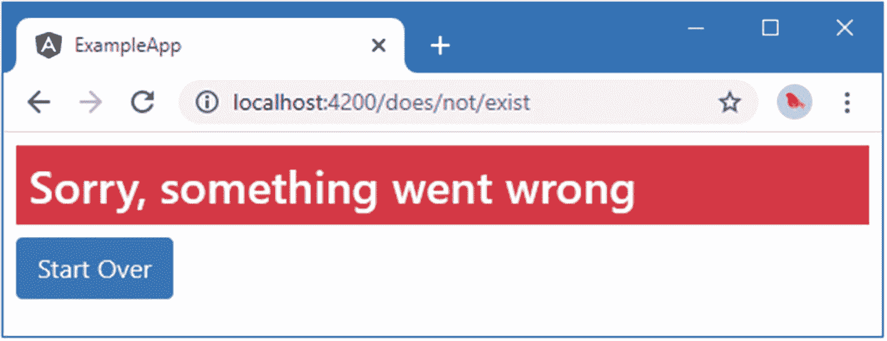
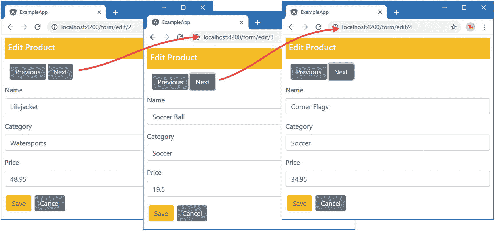
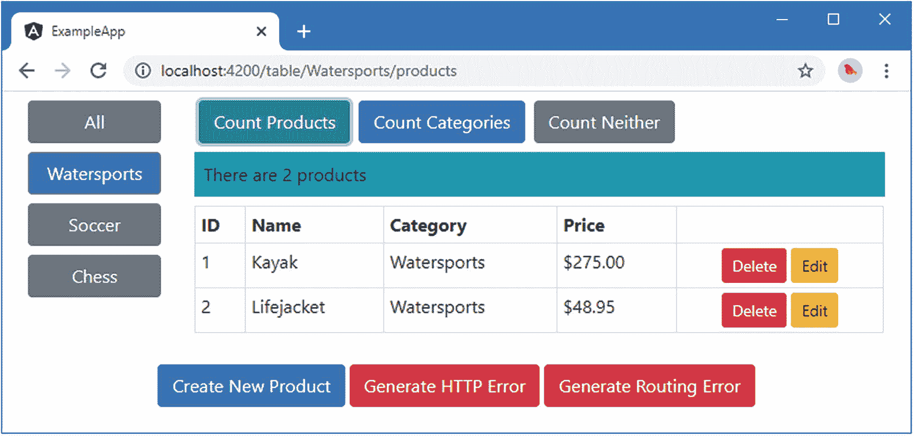

# 二十六、路由和导航：第二部分

在前一章中，我介绍了 Angular URL 路由系统，并解释了如何使用它来控制显示给用户的组件。路由系统有很多特性，我将在本章和第 [27](27.html) 章中继续描述。本章的重点是创建更复杂的路由，包括匹配任何 URL 的路由、将浏览器重定向到其他 URL 的路由、在组件内导航的路由以及选择多个组件的路由。表 [26-1](#Tab1) 总结了这一章。

表 26-1。

章节总结

<colgroup><col class="tcol1 align-left"> <col class="tcol2 align-left"> <col class="tcol3 align-left"></colgroup> 
| 

问题

 | 

解决办法

 | 

列表

 |
| --- | --- | --- |
| 用单个路由匹配多个 URL | 使用路由通配符 | 1–9 |
| 将一个 URL 重定向到另一个 URL | 使用重定向路由 | Ten |
| 在组件内导航 | 使用相对 URL | Eleven |
| 当激活的 URL 改变时接收通知 | 使用由`ActivatedRoute`类提供的`Observable`对象 | Twelve |
| 特定管线处于活动状态时设置元素的样式 | 使用`routerLinkActive`属性 | 13–16 |
| 使用布线系统显示嵌套元件 | 定义子路由并使用`router-outlet`元素 | 17–21 |

## 准备示例项目

对于这一章，我将继续使用在第 [22](22.html) 章中创建的 exampleApp 项目，并在随后的每一章中对其进行修改。为了准备本章，我在 repository 类中添加了两个方法，如清单 [26-1](#PC1) 所示。

Tip

你可以从 [`https://github.com/Apress/pro-angular-9`](https://github.com/Apress/pro-angular-9) 下载本章以及本书其他章节的示例项目。如果在运行示例时遇到问题，请参见第 [1](01.html) 章获取帮助。

```ts
import { Injectable } from "@angular/core";
import { Product } from "./product.model";
import { Observable } from "rxjs";
import { RestDataSource } from "./rest.datasource";

@Injectable()
export class Model {
    private products: Product[] = new Array<Product>();
    private locator = (p: Product, id: number) => p.id == id;

    constructor(private dataSource: RestDataSource) {
        this.dataSource.getData().subscribe(data => this.products = data);
    }

    getProducts(): Product[] {
        return this.products;
    }

    getProduct(id: number): Product {
        return this.products.find(p => this.locator(p, id));
    }

    getNextProductId(id: number): number {
        let index = this.products.findIndex(p => this.locator(p, id));
        if (index > -1) {
            return this.products[this.products.length > index + 2
                ? index + 1 : 0].id;
        } else {
            return id || 0;
        }
    }

    getPreviousProductid(id: number): number {
        let index = this.products.findIndex(p => this.locator(p, id));
        if (index > -1) {
            return this.products[index > 0
                ? index - 1 : this.products.length - 1].id;
        } else {
            return id || 0;
        }
    }

    saveProduct(product: Product) {
        if (product.id == 0 || product.id == null) {
            this.dataSource.saveProduct(product)
                .subscribe(p => this.products.push(p));
        } else {
            this.dataSource.updateProduct(product).subscribe(p => {
                let index = this.products
                    .findIndex(item => this.locator(item, p.id));
                this.products.splice(index, 1, p);
            });
        }
    }

    deleteProduct(id: number) {
        this.dataSource.deleteProduct(id).subscribe(() => {
            let index = this.products.findIndex(p => this.locator(p, id));
            if (index > -1) {
                this.products.splice(index, 1);
            }
        });
    }
}

Listing 26-1.Adding Methods in the repository.model.ts File in the src/app/model Folder

```

新方法接受一个 ID 值，定位相应的产品，然后返回存储库用来收集数据模型对象的数组中的下一个和上一个对象的 ID。我将在本章的后面使用这个特性来允许用户浏览数据模型中的对象集。

为了简化示例，清单 [26-2](#PC2) 删除了表单组件中的语句，这些语句接收产品的详细信息，以便使用可选的路由参数进行编辑。我还更改了构造函数参数的访问级别，这样我就可以在组件的模板中直接使用它们。

```ts
import { Component, Inject } from "@angular/core";
import { NgForm } from "@angular/forms";
import { Product } from "../model/product.model";
import { Model } from "../model/repository.model";
import { ActivatedRoute, Router } from "@angular/router";

@Component({
    selector: "paForm",
    templateUrl: "form.component.html",
    styleUrls: ["form.component.css"]
})
export class FormComponent {
    product: Product = new Product();

    constructor(public model: Model, activeRoute: ActivatedRoute,
        public router: Router) {

        this.editing = activeRoute.snapshot.params["mode"] == "edit";
        let id = activeRoute.snapshot.params["id"];
        if (id != null) {
            Object.assign(this.product, model.getProduct(id) || new Product());
        }
    }

    editing: boolean = false;

    submitForm(form: NgForm) {
        if (form.valid) {
            this.model.saveProduct(this.product);
            this.router.navigateByUrl("/");
        }
    }

    resetForm() {
        this.product = new Product();
    }
}

Listing 26-2.Removing Optional Parameters in the form.component.ts File in the src/app/core Folder

```

清单 [26-3](#PC3) 从表格组件的模板中删除可选参数，这样它们就不会包含在编辑按钮的导航 URL 中。

```ts
<table class="table table-sm table-bordered table-striped">
    <tr>
        <th>ID</th><th>Name</th><th>Category</th><th>Price</th><th></th>
    </tr>
    <tr *ngFor="let item of getProducts()">
        <td>{{item.id}}</td>
        <td>{{item.name}}</td>
        <td>{{item.category}}</td>
        <td>{{item.price | currency:"USD" }}</td>
        <td class="text-center">
            <button class="btn btn-danger btn-sm mr-1"
                    (click)="deleteProduct(item.id)">
                Delete
            </button>
            <button class="btn btn-warning btn-sm"
                [routerLink]="['/form', 'edit', item.id]">
                Edit
            </button>
        </td>
    </tr>
</table>
<button class="btn btn-primary m-1" routerLink="/form/create">
    Create New Product
</button>
<button class="btn btn-danger" (click)="deleteProduct(-1)">
    Generate HTTP Error
</button>

Listing 26-3.Removing Route Parameters in the table.component.html File in the src/app/core Folder

```

### 向项目中添加组件

我需要在应用中添加一些组件来演示本章中涉及的一些特性。这些组件很简单，因为我关注的是路由系统，而不是为应用添加有用的功能。我在`src/app/core`文件夹中创建了一个名为`productCount.component.ts`的文件，并用它来定义清单 [26-4](#PC4) 中所示的组件。

Tip

如果一个组件只通过路由系统显示，那么可以从`@Component`装饰器中省略`selector`属性。我倾向于添加它，这样我也可以使用 HTML 元素来应用组件。

```ts
import {
    Component, KeyValueDiffer, KeyValueDiffers, ChangeDetectorRef
} from "@angular/core";
import { Model } from "../model/repository.model";

@Component({
    selector: "paProductCount",
    template: `<div class="bg-info text-white p-2">There are
                  {{count}} products
               </div>`
})
export class ProductCountComponent {
    private differ: KeyValueDiffer<any, any>;
    count: number = 0;

    constructor(private model: Model,
        private keyValueDiffers: KeyValueDiffers,
        private changeDetector: ChangeDetectorRef) { }

    ngOnInit() {
        this.differ = this.keyValueDiffers
            .find(this.model.getProducts())
            .create();
    }

    ngDoCheck() {
        if (this.differ.diff(this.model.getProducts()) != null) {
            this.updateCount();
        }
    }

    private updateCount() {
        this.count = this.model.getProducts().length;
    }
}

Listing 26-4.The Contents of the productCount.component.ts File in the src/app/core Folder

```

这个`component`使用一个内联模板来显示数据模型中的产品数量，当数据模型改变时，这个模板会更新。接下来，我在`src/app/core`文件夹中添加了一个名为`categoryCount.component.ts`的文件，并定义了清单 [26-5](#PC5) 中所示的组件。

```ts
import {
    Component, KeyValueDiffer, KeyValueDiffers, ChangeDetectorRef
} from "@angular/core";
import { Model } from "../model/repository.model";

@Component({
    selector: "paCategoryCount",
    template: `<div class="bg-primary p-2 text-white">
                    There are {{count}} categories
               </div>`
})
export class CategoryCountComponent {
    private differ: KeyValueDiffer<any, any>;
    count: number = 0;

    constructor(private model: Model,
        private keyValueDiffers: KeyValueDiffers,
        private changeDetector: ChangeDetectorRef) { }

    ngOnInit() {
        this.differ = this.keyValueDiffers
            .find(this.model.getProducts())
            .create();
    }

    ngDoCheck() {
        if (this.differ.diff(this.model.getProducts()) != null) {
            this.count = this.model.getProducts()
                .map(p => p.category)
                .filter((category, index, array) => array.indexOf(category) == index)
                .length;
        }
    }
}

Listing 26-5.The Contents of the categoryCount.component.ts File in the src/app/core Folder

```

该组件使用一个差异来跟踪数据模型中的变化，并计算唯一类别的数量，这是使用一个简单的内联模板显示的。对于最后一个组件，我在`src/app/core`文件夹中添加了一个名为`notFound.component.ts`的文件，并用它来定义清单 [26-6](#PC6) 中所示的组件。

```ts
import { Component } from "@angular/core";

@Component({
    selector: "paNotFound",
    template: `<h3 class="bg-danger text-white p-2">Sorry, something went wrong</h3>
               <button class="btn btn-primary" routerLink="/">Start Over</button>`
})
export class NotFoundComponent {}

Listing 26-6The notFound.component.ts File in the src/app/core Folder

```

当路由系统出现问题时，该组件会显示一条静态消息。清单 [26-7](#PC7) 向核心模块添加了新的组件。

```ts
import { NgModule } from "@angular/core";
import { BrowserModule } from "@angular/platform-browser";
import { FormsModule } from "@angular/forms";
import { ModelModule } from "../model/model.module";
import { TableComponent } from "./table.component";
import { FormComponent } from "./form.component";
import { Subject } from "rxjs";
import { StatePipe } from "./state.pipe";
import { MessageModule } from "../messages/message.module";
import { MessageService } from "../messages/message.service";
import { Message } from "../messages/message.model";
import { Model } from "../model/repository.model";
import { RouterModule } from "@angular/router";
import { ProductCountComponent } from "./productCount.component";
import { CategoryCountComponent } from "./categoryCount.component";
import { NotFoundComponent } from "./notFound.component";

@NgModule({
    imports: [BrowserModule, FormsModule, ModelModule, MessageModule, RouterModule],
    declarations: [TableComponent, FormComponent, StatePipe,
        ProductCountComponent, CategoryCountComponent, NotFoundComponent],
    exports: [ModelModule, TableComponent, FormComponent]
})
export class CoreModule { }

Listing 26-7.Declaring Components in the core.module.ts File in the src/app/core Folder

```

打开一个新的命令提示符，导航到`exampleApp`文件夹，运行以下命令启动提供 RESTful web 服务器的服务器:

```ts
npm run json

```

打开一个单独的命令提示符，导航到`exampleApp`文件夹，运行以下命令启动 Angular 开发工具:

```ts
ng serve

```

打开一个新的浏览器窗口并导航到`http://localhost:4200`以查看如图 [26-1](#Fig1) 所示的内容。


图 26-1。

运行示例应用

## 使用通配符和重定向

应用中的路由配置会很快变得复杂，并包含冗余和奇怪的内容，以迎合应用的结构。Angular 提供了两个有用的工具，可以帮助简化路由，也可以在出现问题时进行处理，如以下部分所述。

### 在路由中使用通配符

角路由系统支持一个特殊的路径，由两个星号(`**`字符)表示，允许路由匹配任何 URL。通配符路径的基本用途是处理导航，否则会产生路由错误。清单 [26-8](#PC10) 向表格组件的模板中添加了一个按钮，该按钮导航到一个尚未由应用的路由配置定义的路由。

```ts
<table class="table table-sm table-bordered table-striped">
    <tr>
        <th>ID</th><th>Name</th><th>Category</th><th>Price</th><th></th>
    </tr>
    <tr *ngFor="let item of getProducts()">
        <td>{{item.id}}</td>
        <td>{{item.name}}</td>
        <td>{{item.category}}</td>
        <td>{{item.price | currency:"USD" }}</td>
        <td class="text-center">
            <button class="btn btn-danger btn-sm mr-1"
                    (click)="deleteProduct(item.id)">
                Delete
            </button>
            <button class="btn btn-warning btn-sm"
                [routerLink]="['/form', 'edit', item.id]">
                Edit
            </button>
        </td>
    </tr>
</table>
<button class="btn btn-primary m-1" routerLink="/form/create">
    Create New Product
</button>
<button class="btn btn-danger" (click)="deleteProduct(-1)">
    Generate HTTP Error
</button>
<button class="btn btn-danger m-1" routerLink="/does/not/exist">
    Generate Routing Error
</button>

Listing 26-8.Adding a Button in the table.component.html File in the src/app/core Folder

```

单击该按钮将要求应用导航到 URL `/does/not/exist`，因为没有为其配置路由。当一个 URL 与一个 URL 不匹配时，会抛出一个错误，然后由错误处理类拾取并处理，这导致消息组件显示一个警告，如图 [26-2](#Fig2) 所示。


图 26-2。

默认导航错误

这不是处理未知路由的有用方法，因为用户不知道什么是路由，也可能没有意识到应用试图导航到有问题的 URL。

更好的方法是使用通配符 route 来处理尚未定义的 URL 的导航，并选择一个组件来为用户提供更有用的消息，如清单 [26-9](#PC11) 所示。

```ts
import { Routes, RouterModule } from "@angular/router";
import { TableComponent } from "./core/table.component";
import { FormComponent } from "./core/form.component";
import { NotFoundComponent } from "./core/notFound.component";

const routes: Routes = [
    { path: "form/:mode/:id", component: FormComponent },
    { path: "form/:mode", component: FormComponent },
    { path: "", component: TableComponent },
    { path: "**", component: NotFoundComponent }
]

export const routing = RouterModule.forRoot(routes);

Listing 26-9.Adding a Wildcard Route in the app.routing.ts File in the src/app Folder

```

清单中的新路由使用通配符选择`NotFoundComponent`，当点击生成路由错误按钮时，显示如图 [26-3](#Fig3) 所示的消息。



图 26-3。

使用通配符路由

单击重新开始按钮导航到`/` URL，这将选择要显示的表格组件。

### 在路由中使用重定向

路由不必选择组件；它们也可以用作别名，将浏览器重定向到不同的 URL。重定向是使用路由中的`redirectTo`属性定义的，如清单 [26-10](#PC12) 所示。

```ts
import { Routes, RouterModule } from "@angular/router";
import { TableComponent } from "./core/table.component";
import { FormComponent } from "./core/form.component";
import { NotFoundComponent } from "./core/notFound.component";

const routes: Routes = [
    { path: "form/:mode/:id", component: FormComponent },
    { path: "form/:mode", component: FormComponent },
    { path: "does", redirectTo: "/form/create", pathMatch: "prefix" },
    { path: "table", component: TableComponent },
    { path: "", redirectTo: "/table", pathMatch: "full" },
    { path: "**", component: NotFoundComponent }
]

export const routing = RouterModule.forRoot(routes);

Listing 26-10.Using Route Redirection in the app.routing.ts File in the src/app Folder

```

`redirectTo`属性用于指定浏览器将被重定向到的 URL。定义重定向时，还必须指定`pathMatch`属性，使用表 [26-2](#Tab2) 中描述的值之一。

表 26-2。

路径匹配值

<colgroup><col class="tcol1 align-left"> <col class="tcol2 align-left"></colgroup> 
| 

名字

 | 

描述

 |
| --- | --- |
| `prefix` | 该值配置路由，使其匹配以指定路径开头的 URL，忽略任何后续的段。 |
| `full` | 该值配置路由，使其仅匹配由`path`属性指定的 URL。 |

在清单 [26-10](#PC12) 中添加的第一个路由指定了一个`prefix`的`pathMatch`值和一个`does`的路径，这意味着它将匹配任何第一段是`does`的 URL，比如通过生成路由错误按钮导航到的`/does/not/exist` URL。当浏览器导航到具有该前缀的 URL 时，路由系统会将其重定向到`/form/create` URL，如图 [26-4](#Fig4) 所示。


图 26-4。

执行路由重定向

清单 [26-10](#PC12) 中的其他路由将空路径重定向到显示表格组件的`/table` URL。这是一种使 URL 模式更明显的常用技术，因为它匹配默认 URL ( `http://localhost:4200/`)并将其重定向到对用户来说更有意义和更容易记住的内容(`http://localhost:4200/table`)。在这种情况下，`pathMatch`属性值是`full`，尽管这没有任何影响，因为它已经应用于空路径。

## 在组件内导航

上一章中的示例在不同的组件之间导航，因此单击表格组件中的按钮可以导航到表单组件，反之亦然。

这不是唯一可能的导航方式。您还可以在组件内导航。为了演示，清单 [26-11](#PC13) 向表单组件添加了按钮，允许用户编辑上一个或下一个数据对象。

```ts
<div class="bg-primary text-white p-2" [class.bg-warning]="editing">
    <h5>{{editing  ? "Edit" : "Create"}} Product</h5>
    <!-- Last Event: {{ stateEvents | async | formatState }} -->
</div>

<div *ngIf="editing" class="p-2">
    <button class="btn btn-secondary m-1"
            [routerLink]="['/form', 'edit', model.getPreviousProductid(product.id)]">
        Previous
    </button>
    <button class="btn btn-secondary"
            [routerLink]="['/form', 'edit', model.getNextProductId(product.id)]">
        Next
    </button>
</div>

<form novalidate #form="ngForm" (ngSubmit)="submitForm(form)" (reset)="resetForm()" >

    <div class="form-group">
        <label>Name</label>
        <input class="form-control" name="name"
               [(ngModel)]="product.name" required />
    </div>

    <div class="form-group">
        <label>Category</label>
        <input class="form-control" name="category"
               [(ngModel)]="product.category" required />
    </div>

    <div class="form-group">
        <label>Price</label>
        <input class="form-control" name="price"
               [(ngModel)]="product.price"
               required pattern="^[0-9\.]+$" />
    </div>

    <button type="submit" class="btn btn-primary m-1"
            [class.btn-warning]="editing" [disabled]="form.invalid">
        {{editing ? "Save" : "Create"}}
    </button>
    <button type="reset" class="btn btn-secondary m-1" routerLink="/">
            Cancel
    </button>
</form>

Listing 26-11.Adding Buttons to the form.component.html File in the src/app/core Folder

```

这些按钮绑定了针对数据模型中前一个和下一个对象的表达式的`routerLink`指令。这意味着，例如，如果您单击救生衣表格中的编辑按钮，下一个按钮将导航到编辑足球的 URL，上一个按钮将导航到 kayak 的 URL。

### 响应正在进行的路由更改

尽管单击“上一步”和“下一步”按钮时 URL 会发生变化，但显示给用户的数据不会发生变化。Angular 试图在导航过程中保持高效，它知道“上一步”和“下一步”按钮导航到的 URL 是由当前显示给用户的同一个组件处理的。它不是创建组件的新实例，而是简单地告诉组件所选的路由已经更改。

这是一个问题，因为表单组件没有设置为接收更改通知。它的构造函数接收 Angular 用来提供当前路由细节的`ActivatedRoute`对象，但是只使用它的`snapshot`属性。当 Angular 更新`ActivatedRoute`对象中的值时，组件的构造函数早已被执行，这意味着它错过了通知。当应用的配置意味着每次用户想要创建或编辑产品时都要创建一个新的表单组件时，这种方法是有效的，但是这已经不够了。

幸运的是，`ActivatedRoute`类定义了一组属性，允许相关方通过反应扩展`Observable`对象接收通知。这些属性对应于由快照属性返回的`ActivatedRouteSnapshot`对象提供的属性(在第 [25](25.html) 章中描述)，但是当有任何后续变化时发送新的事件，如表 [26-3](#Tab3) 中所述。

表 26-3。

ActivatedRoute 类的可观察属性

<colgroup><col class="tcol1 align-left"> <col class="tcol2 align-left"></colgroup> 
| 

名字

 | 

描述

 |
| --- | --- |
| `url` | 该属性返回一个`Observable<UrlSegment[]>`，它在每次路由改变时提供一组 URL 段。 |
| `params` | 该属性返回一个`Observable<Params>`，它在每次路由改变时提供 URL 参数。 |
| `queryParams` | 该属性返回一个`Observable<Params>`，它在每次路由改变时提供 URL 查询参数。 |
| `fragment` | 该属性返回一个`Observable<string>`，它在每次路由改变时提供 URL 片段。 |

这些属性可以被需要处理导航变化的组件使用，这些变化不会导致向用户显示不同的组件，如清单 [26-12](#PC14) 所示。

Tip

如果您需要组合来自路由的不同数据元素，例如同时使用路段和参数，那么为一个数据元素订阅`Observer`,并使用`snapshot`属性获取您需要的其余数据。

```ts
import { Component, Inject } from "@angular/core";
import { NgForm } from "@angular/forms";
import { Product } from "../model/product.model";
import { Model } from "../model/repository.model";
import { ActivatedRoute, Router } from "@angular/router";

@Component({
    selector: "paForm",
    templateUrl: "form.component.html",
    styleUrls: ["form.component.css"]
})
export class FormComponent {
    product: Product = new Product();

    constructor(public model: Model, activeRoute: ActivatedRoute,
        public  router: Router) {

        activeRoute.params.subscribe(params => {
            this.editing = params["mode"] == "edit";
            let id = params["id"];
            if (id != null) {
                Object.assign(this.product, model.getProduct(id) || new Product());
            }
        })
    }

    editing: boolean = false;

    submitForm(form: NgForm) {
        if (form.valid) {
            this.model.saveProduct(this.product);
            this.router.navigateByUrl("/");
        }
    }

    resetForm() {
        this.product = new Product();
    }
}

Listing 26-12.Observing Route Changes in the form.component.ts File in the src/app/core Folder

```

组件订阅了`Observer<Params>`,每次活动路由改变时，它都会向订阅者发送一个新的`Params`对象。由`ActivatedRoute`属性返回的`Observer`对象在调用 subscribe 方法时发送最近一次路由更改的细节，确保组件的构造函数不会错过导致它被调用的初始导航。

结果是，组件可以对不会导致 Angular 创建新组件的路由更改做出反应，这意味着单击下一个或上一个按钮会更改已被选择进行编辑的产品，如图 [26-5](#Fig5) 所示。



图 26-5。

响应路由变更

Tip

当激活的路由改变显示给用户的组件时，导航的效果是明显的。当仅仅是数据改变时，它可能不那么明显。为了帮助强调变化，Angular 可以应用动画来引起对导航效果的注意。详见第 [28](28.html) 章。

### 激活管线的样式链接

路由系统的一个常见用途是在它们选择的内容旁边显示多个导航元素。为了演示，清单 [26-13](#PC15) 向应用添加了一个新的路由，该路由将允许使用包含类别过滤器的 URL 来定位表格组件。

```ts
import { Routes, RouterModule } from "@angular/router";
import { TableComponent } from "./core/table.component";
import { FormComponent } from "./core/form.component";
import { NotFoundComponent } from "./core/notFound.component";

const routes: Routes = [
    { path: "form/:mode/:id", component: FormComponent },
    { path: "form/:mode", component: FormComponent },
    { path: "does", redirectTo: "/form/create", pathMatch: "prefix" },
    { path: "table/:category", component: TableComponent },
    { path: "table", component: TableComponent },
    { path: "", redirectTo: "/table", pathMatch: "full" },
    { path: "**", component: NotFoundComponent }
]

export const routing = RouterModule.forRoot(routes);

Listing 26-13.Defining a Route in the app.routing.ts File in the src/app Folder

```

清单 [26-14](#PC16) 更新了`TableComponent`类，以便它使用路由系统来获取活动路由的细节，并将`category`路由参数的值赋给一个可以在模板中访问的`category`属性。在`getProducts`方法中使用了`category`属性来过滤数据模型中的对象。

```ts
import { Component, Inject } from "@angular/core";
import { Product } from "../model/product.model";
import { Model } from "../model/repository.model";
import { ActivatedRoute } from "@angular/router";

@Component({
    selector: "paTable",
    templateUrl: "table.component.html"
})
export class TableComponent {
    category: string = null;

    constructor(public model: Model, activeRoute: ActivatedRoute) {
        activeRoute.params.subscribe(params => {
            this.category = params["category"] || null;
        })
    }

    getProduct(key: number): Product {
        return this.model.getProduct(key);
    }

    getProducts(): Product[] {
        return this.model.getProducts()
            .filter(p => this.category == null || p.category == this.category);
    }

    get categories(): string[] {
        return this.model.getProducts()
            .map(p => p.category)
            .filter((category, index, array) => array.indexOf(category) == index);
    }

    deleteProduct(key: number) {
        this.model.deleteProduct(key);
    }
}

Listing 26-14.Adding Category Filter Support in the table.component.ts File in the src/app/core Folder

```

还有一个新的`categories`属性，将在模板中用于生成过滤的类别集。最后一步是将 HTML 元素添加到允许用户应用过滤器的模板中，如清单 [26-15](#PC17) 所示。

```ts
<div class="container-fluid">
    <div class="row">
        <div class="col-auto">
            <button class="btn btn-secondary btn-block"
                    routerLink="/" routerLinkActive="bg-primary">
                All
            </button>
            <button *ngFor="let category of categories"
                    class="btn btn-secondary btn-block px-3"
                    [routerLink]="['/table', category]"
                    routerLinkActive="bg-primary">
                {{category}}
            </button>
        </div>
        <div class="col">
            <table class="table table-sm table-bordered table-striped">
                <tr>
                    <th>ID</th><th>Name</th><th>Category</th><th>Price</th><th></th>
                </tr>
                <tr *ngFor="let item of getProducts()">
                    <td>{{item.id}}</td>
                    <td>{{item.name}}</td>
                    <td>{{item.category}}</td>
                    <td>{{item.price | currency:"USD" }}</td>
                    <td class="text-center">
                        <button class="btn btn-danger btn-sm mr-1"
                                (click)="deleteProduct(item.id)">
                            Delete
                        </button>
                        <button class="btn btn-warning btn-sm"
                            [routerLink]="['/form', 'edit', item.id]">
                            Edit
                        </button>
                    </td>
                </tr>
            </table>
        </div>
    </div>
</div>
<div class="p-2 text-center">
    <button class="btn btn-primary m-1" routerLink="/form/create">
        Create New Product
    </button>
    <button class="btn btn-danger" (click)="deleteProduct(-1)">
        Generate HTTP Error
    </button>
    <button class="btn btn-danger m-1" routerLink="/does/not/exist">
        Generate Routing Error
    </button>
</div>

Listing 26-15.Adding Filter Elements in the table.component.html File in the src/app/core Folder

```

该示例的重要部分是使用了`routerLinkActive`属性，该属性用于指定一个 CSS 类，当由`routerLink`属性指定的 URL 与活动路由匹配时，该元素将被分配给该 CSS 类。

清单指定了一个名为`bg-primary`的类，它改变了按钮的外观，使选中的类别更加明显。当与添加到清单 [26-14](#PC16) 中的组件的功能相结合时，结果是一组按钮，允许用户查看单个类别中的产品，如图 [26-6](#Fig6) 所示。


图 26-6。

过滤产品

如果您单击足球按钮，应用将导航到`/table/Soccer` URL，并且表格将只显示足球类别中的那些产品。足球按钮也将被高亮显示，因为`routerLinkActive`属性意味着 Angular 将把`button`元素添加到 Bootstrap `bg-primary`类中。

### 修复全部按钮

导航按钮揭示了一个常见的问题，即 All 按钮总是被添加到`active`类中，即使用户已经过滤了表以显示特定的类别。

这是因为默认情况下,`routerLinkActive`属性在活动 URL 上执行部分匹配。在这个例子中，`/` URL 将总是导致 All 按钮被激活，因为它在所有 URL 的开始。这个问题可以通过配置`routerLinkActive`指令来解决，如清单 [26-16](#PC18) 所示。

```ts
...
<div class="col-auto">
    <button class="btn btn-secondary btn-block"
        routerLink="/table" routerLinkActive="bg-primary"
        [routerLinkActiveOptions]="{exact: true}">
        All
    </button>
    <button *ngFor="let category of categories"
            class="btn btn-secondary btn-block px-3"
            [routerLink]="['/table', category]"
            routerLinkActive="bg-primary">
        {{category}}
    </button>
</div>
...

Listing 26-16.Configuring the Directive in the table.component.html File in the src/app/core Folder

```

这个配置是通过绑定接受文字对象的`routerLinkActiveOptions`属性来执行的。`exact`属性是唯一可用的配置设置，用于控制匹配活动路由 URL。将该属性设置为`true`会将元素添加到由`routerLinkActive`属性指定的类中，仅当与活动路径的 URL 完全匹配时。有了这个改变，只有当所有的产品都显示时,“全部”按钮才会高亮显示，如图 [26-7](#Fig7) 所示。


图 26-7。

修复所有按钮问题

## 创建子路由

子路由允许组件通过在模板中嵌入`router-outlet`元素来响应 URL 的一部分，从而创建更复杂的内容安排。我将使用本章开始时创建的简单组件来演示子路由是如何工作的。这些组件将显示在产品表的上方，所显示的组件将在表 [26-4](#Tab4) 中显示的 URL 中指定。

表 26-4。

他们将选择的 URL 和组件

<colgroup><col class="tcol1 align-left"> <col class="tcol2 align-left"></colgroup> 
| 

统一资源定位器

 | 

成分

 |
| --- | --- |
| `/table/products` | 将显示`ProductCountComponent`。 |
| `/table/categories` | 将显示`CategoryCountComponent`。 |
| `/table` | 两个组件都不会显示。 |

清单 [26-17](#PC19) 显示了应用路由配置的变化，以实现表中的路由策略。

```ts
import { Routes, RouterModule } from "@angular/router";
import { TableComponent } from "./core/table.component";
import { FormComponent } from "./core/form.component";
import { NotFoundComponent } from "./core/notFound.component";
import { ProductCountComponent } from "./core/productCount.component";
import { CategoryCountComponent } from "./core/categoryCount.component";

const routes: Routes = [
    { path: "form/:mode/:id", component: FormComponent },
    { path: "form/:mode", component: FormComponent },
    { path: "does", redirectTo: "/form/create", pathMatch: "prefix" },
    {
        path: "table",
        component: TableComponent,
        children: [
            { path: "products", component: ProductCountComponent },
            { path: "categories", component: CategoryCountComponent }
        ]
    },
    { path: "table/:category", component: TableComponent },
    { path: "table", component: TableComponent },
    { path: "", redirectTo: "/table", pathMatch: "full" },
    { path: "**", component: NotFoundComponent }
]

export const routing = RouterModule.forRoot(routes);

Listing 26-17.Configuring Routes in the app.routing.ts File in the src/app Folder

```

子路由是使用`children`属性定义的，该属性被设置为一个路由数组，其定义方式与顶级路由相同。当 Angular 使用整个 URL 来匹配具有子路由的路由时，只有当浏览器导航到的 URL 包含既匹配顶级段又匹配由其中一个子路由指定的段时，才会有匹配。

Tip

请注意，我已经在路径为`table/:category`的路径之前添加了新的路径。Angular 尝试按照路径定义的顺序匹配路径。`table/:category`路径将匹配`/table/products`和`/table/categories`URL，并引导表格组件过滤不存在类别的产品。通过首先放置更具体的路由，`/table/products`和`/table/categories`URL 将在`table/:category`路径被考虑之前被匹配。

### 创建子路由出口

子路由选择的组件显示在父路由选择的组件模板中定义的`router-outlet`元素中。在本例中，这意味着子路由将指向表格组件模板中的一个元素，如清单 [26-18](#PC20) 所示，其中还添加了将导航到新路由的元素。

```ts
<div class="container-fluid">
    <div class="row">
        <div class="col-auto">
            <button class="btn btn-secondary btn-block"
                routerLink="/table" routerLinkActive="bg-primary"
                [routerLinkActiveOptions]="{exact: true}">
                All
            </button>
            <button *ngFor="let category of categories"
                    class="btn btn-secondary btn-block px-3"
                    [routerLink]="['/table', category]"
                    routerLinkActive="bg-primary">
                {{category}}
            </button>
        </div>
        <div class="col">
            <button class="btn btn-info mx-1" routerLink="/table/products">
                Count Products
            </button>
            <button class="btn btn-primary mx-1" routerLink="/table/categories">
                Count Categories
            </button>
            <button class="btn btn-secondary mx-1" routerLink="/table">
                Count Neither
            </button>
            <div class="my-2">
                <router-outlet></router-outlet>
            </div>
            <table class="table table-sm table-bordered table-striped">
                <tr>
                    <th>ID</th><th>Name</th><th>Category</th><th>Price</th><th></th>
                </tr>
                <tr *ngFor="let item of getProducts()">
                    <td>{{item.id}}</td>
                    <td>{{item.name}}</td>
                    <td>{{item.category}}</td>
                    <td>{{item.price | currency:"USD" }}</td>
                    <td class="text-center">
                        <button class="btn btn-danger btn-sm mr-1"
                                (click)="deleteProduct(item.id)">
                            Delete
                        </button>
                        <button class="btn btn-warning btn-sm"
                            [routerLink]="['/form', 'edit', item.id]">
                            Edit
                        </button>
                    </td>
                </tr>
            </table>
        </div>
    </div>
</div>
<div class="p-2 text-center">
    <button class="btn btn-primary m-1" routerLink="/form/create">
        Create New Product
    </button>
    <button class="btn btn-danger" (click)="deleteProduct(-1)">
        Generate HTTP Error
    </button>
    <button class="btn btn-danger m-1" routerLink="/does/not/exist">
        Generate Routing Error
    </button>
</div>

Listing 26-18.Adding an Outlet in the table.component.html File in the src/app/core Folder

```

`button`元素有`routerLink`属性，指定表 [26-4](#Tab4) 中列出的 URL，还有一个`router-outlet`元素，用于显示选中的组件，如图 [26-8](#Fig8) 所示，如果浏览器导航到`/table` URL，则没有组件。


图 26-8。

使用子路由

### 从子路由中访问参数

子路由可以使用顶级路由的所有可用功能，包括定义路由参数，甚至拥有自己的子路由。由于 Angular 将孩子与其父母隔离的方式，路由参数在子路由中值得特别注意。对于本节，我将添加对表 [26-5](#Tab5) 中描述的 URL 的支持。

表 26-5。

示例应用支持的新 URL

<colgroup><col class="tcol1 align-left"> <col class="tcol2 align-left"></colgroup> 
| 

名字

 | 

描述

 |
| --- | --- |
| `/table/:category/products` | 这条路由将过滤表格的内容并选择`ProductCountComponent`。 |
| `/table/:category/categories` | 这条路由将过滤表格的内容并选择`CategoryCountComponent`。 |

清单 [26-19](#PC21) 定义了支持表中所示 URL 的路由。

```ts
import { Routes, RouterModule } from "@angular/router";
import { TableComponent } from "./core/table.component";
import { FormComponent } from "./core/form.component";
import { NotFoundComponent } from "./core/notFound.component";
import { ProductCountComponent } from "./core/productCount.component";
import { CategoryCountComponent } from "./core/categoryCount.component";

const childRoutes: Routes = [
    { path: "products", component: ProductCountComponent },
    { path: "categories", component: CategoryCountComponent },
    { path: "", component: ProductCountComponent }
];

const routes: Routes = [
    { path: "form/:mode/:id", component: FormComponent },
    { path: "form/:mode", component: FormComponent },
    { path: "does", redirectTo: "/form/create", pathMatch: "prefix" },
    { path: "table", component: TableComponent, children: childRoutes },
    { path: "table/:category", component: TableComponent, children: childRoutes },
    { path: "", redirectTo: "/table", pathMatch: "full" },
    { path: "**", component: NotFoundComponent }
]

export const routing = RouterModule.forRoot(routes);

Listing 26-19.Adding Routes in the app.routing.ts File in the src/app Folder

```

`children`属性的类型是一个`Routes`对象，当您需要在 URL 模式的不同部分应用同一组子路由时，这使得路由配置中的重复最小化变得容易。在清单中，我在名为`childRoutes`的`Routes`对象中定义了子路由，并在两个不同的顶级路由中将它用作`children`属性的值。

为了能够定位这些新路由，清单 [26-20](#PC22) 改变了出现在表格上方的按钮的目标，以便它们相对于当前的 URL 进行导航。我已经删除了“既不计数”按钮，因为当空路径子路由与 URL 匹配时，将显示`ProductCountComponent`。

```ts
...
<div class="col">
    <button class="btn btn-info mx-1" routerLink="products">
        Count Products
    </button>
    <button class="btn btn-primary mx-1" routerLink="categories">
        Count Categories
    </button>
    <button class="btn btn-secondary mx-1" routerLink="/table">
        Count Neither
    </button>
    <div class="my-2">
        <router-outlet></router-outlet>
    </div>

    <table class="table table-sm table-bordered table-striped">
...

Listing 26-20.Using Relative URLs in the table.component.html File in the src/app/core Folder

```

当 Angular 匹配路由时，它提供给通过`ActivatedRoute`对象选择的组件的信息被分离，这样每个组件只接收选择它的那部分路由的细节。

在清单 [26-20](#PC22) 中添加的路由的情况下，这意味着`ProductCountComponent`和`CategoryCountComponent`接收到一个`ActivatedRoute`对象，该对象仅描述了选择它们的子路由，带有单个线段`/products`或`/categories`。同样，`TableComponent`组件接收一个`ActivatedRoute`对象，它不包含用于匹配子路由的线段。

幸运的是，`ActivatedRoute`类提供了一些属性，这些属性提供了对剩余路由的访问，允许父母和孩子访问剩余的路由信息，如表 [26-6](#Tab6) 中所述。

表 26-6。

子-父路由信息的 ActivatedRoute 属性

<colgroup><col class="tcol1 align-left"> <col class="tcol2 align-left"></colgroup> 
| 

名字

 | 

描述

 |
| --- | --- |
| `pathFromRoot` | 该属性返回一个由`ActivatedRoute`对象组成的数组，这些对象代表了用于匹配当前 URL 的所有路由。 |
| `parent` | 该属性返回一个代表选择组件的路由的父路由的`ActivatedRoute`。 |
| `firstChild` | 该属性返回一个`ActivatedRoute`，表示用于匹配当前 URL 的第一个子路由。 |
| `children` | 该属性返回一个由`ActivatedRoute`对象组成的数组，这些对象表示用于匹配当前 URL 的所有子路由。 |

清单 [26-21](#PC23) 展示了`ProductCountComponent`组件如何访问用于匹配当前 URL 的更广泛的路由集，以获取类别路由参数的值，并在针对单个类别过滤表格内容时调整其输出。

```ts
import {
    Component, KeyValueDiffer, KeyValueDiffers, ChangeDetectorRef
} from "@angular/core";
import { Model } from "../model/repository.model";
import { ActivatedRoute } from "@angular/router";

@Component({
    selector: "paProductCount",
    template: `<div class="bg-info p-2">There are {{count}} products</div>`
})
export class ProductCountComponent {
    private differ: KeyValueDiffer<any, any>;
    count: number = 0;
    private category: string;

    constructor(private model: Model,
            private keyValueDiffers: KeyValueDiffers,
            private changeDetector: ChangeDetectorRef,
            activeRoute: ActivatedRoute) {

        activeRoute.pathFromRoot.forEach(route => route.params.subscribe(params => {
            if (params["category"] != null) {
                this.category = params["category"];
                this.updateCount();
            }
        }))
    }

    ngOnInit() {
        this.differ = this.keyValueDiffers
            .find(this.model.getProducts())
            .create();
    }

    ngDoCheck() {
        if (this.differ.diff(this.model.getProducts()) != null) {
            this.updateCount();
        }
    }

    private updateCount() {
        this.count = this.model.getProducts()
            .filter(p => this.category == null || p.category == this.category)
            .length;
    }
}

Listing 26-21.Ancestor Routes in the productCount.component.ts File in the src/app/core Folder

```

`pathFromRoot`属性特别有用，因为它允许组件检查所有用于匹配 URL 的路由。Angular 最大限度地减少了处理导航所需的路由更新，这意味着如果只有父组件发生了变化，则由子路由选择的组件不会通过其`ActivatedRoute`对象接收到变化通知。正是因为这个原因，我订阅了由`pathFromRoot`属性返回的所有`ActivatedRoute`对象的更新，确保组件总是检测到`category`路由参数值的变化。

要查看结果，保存更改，单击 Watersports 按钮过滤表格内容，然后单击 Count Products 按钮，选择`ProductCountComponent`。组件报告的产品数量将与表格中的行数相对应，如图 [26-9](#Fig9) 所示。



图 26-9。

访问用于匹配 URL 的其他路由

## 摘要

在这一章中，我继续描述 Angular URL 路由系统提供的特性，超越了前一章描述的基本特性。我解释了如何创建通配符和重定向路由，如何创建相对于当前 URL 导航的路由，以及如何创建子路由来显示嵌套组件。在下一章，我将完成对 URL 路由系统的描述，重点放在最高级的特性上。