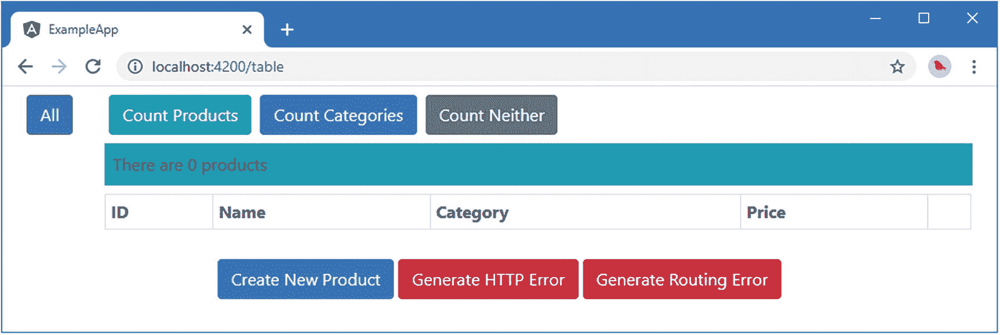
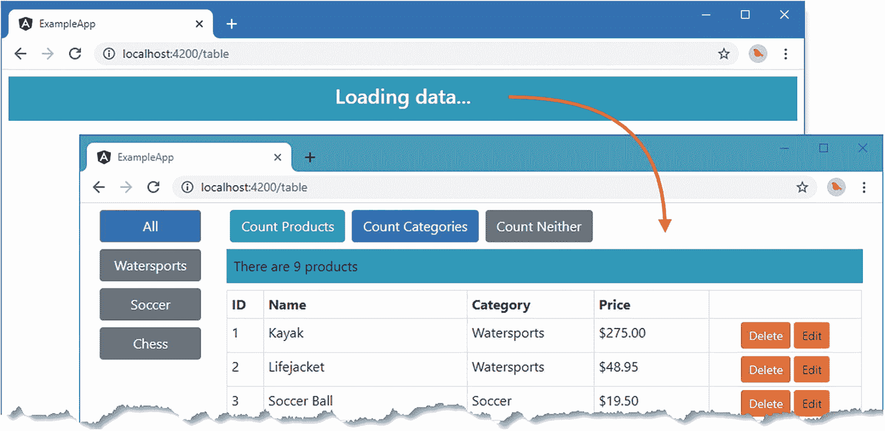
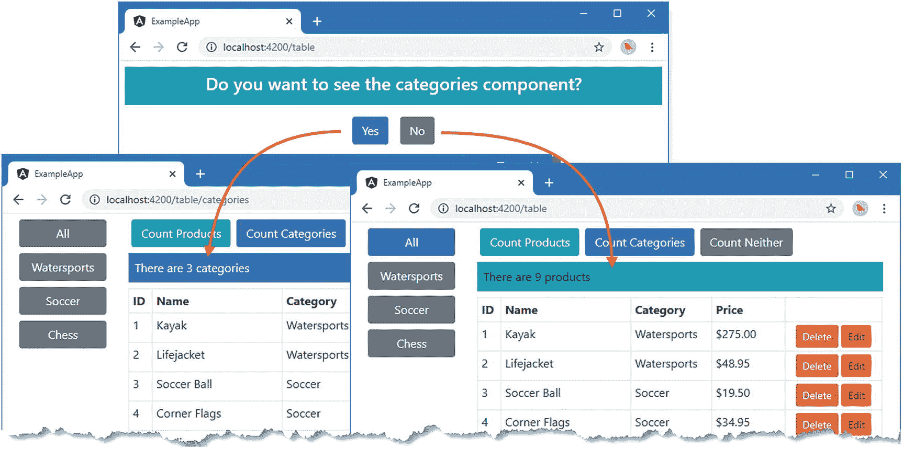
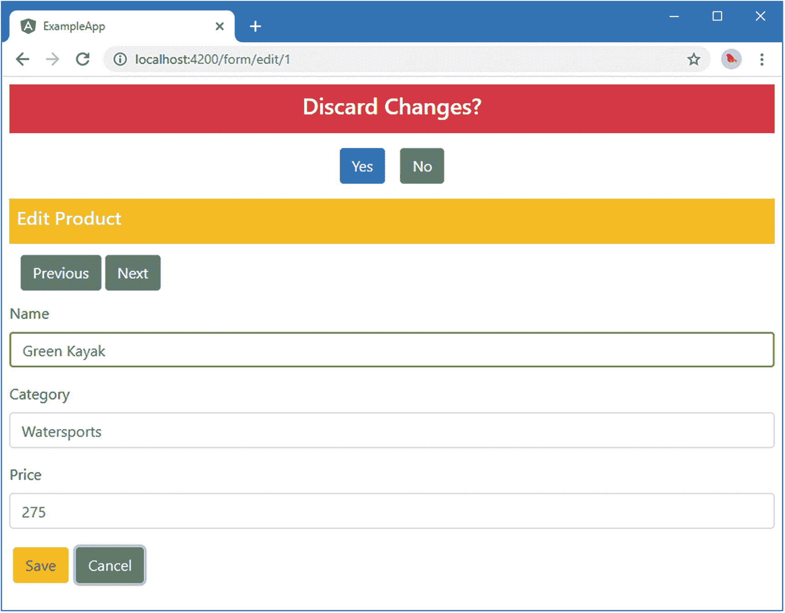

# 二十七、路由和导航：第三部分

在这一章中，我继续描述 Angular URL 路由系统，重点放在最高级的特性上。我解释了如何控制路由激活，如何动态加载特性模块，以及如何在一个模板中使用多个 outlet 元素。表 [27-1](#Tab1) 总结了本章内容。

表 27-1。

章节总结

<colgroup><col class="tcol1 align-left"> <col class="tcol2 align-left"> <col class="tcol3 align-left"></colgroup> 
| 

问题

 | 

解决办法

 | 

列表

 |
| --- | --- | --- |
| 延迟导航直到任务完成 | 使用路径解析器 | 1–7 |
| 阻止路由激活 | 使用激活防护装置 | 8–14 |
| 防止用户离开当前内容 | 使用去活保护装置 | 15–19 |
| 将功能模块的加载推迟到需要时 | 创建动态加载的模块 | 20–25 |
| 控制何时使用动态加载的模块 | 使用装载防护装置 | 26–28 |
| 使用路由来管理多个路由器出口 | 在同一模板中使用命名插座 | 29–34 |

## 准备示例项目

对于这一章，我将继续使用在第 [22](22.html) 章中创建的 exampleApp 项目，并在随后的每一章中对其进行修改。为了准备本章，我简化了路由配置，如清单 [27-1](#PC1) 所示。

Tip

你可以从 [`https://github.com/Apress/pro-angular-9`](https://github.com/Apress/pro-angular-9) 下载本章以及本书其他章节的示例项目。如果在运行示例时遇到问题，请参见第 [1](01.html) 章获取帮助。

```ts
import { Routes, RouterModule } from "@angular/router";
import { TableComponent } from "./core/table.component";
import { FormComponent } from "./core/form.component";
import { NotFoundComponent } from "./core/notFound.component";
import { ProductCountComponent } from "./core/productCount.component";
import { CategoryCountComponent } from "./core/categoryCount.component";

const childRoutes: Routes = [
    { path: "products", component: ProductCountComponent },
    { path: "categories", component: CategoryCountComponent },
    { path: "", component: ProductCountComponent }
];

const routes: Routes = [
    { path: "form/:mode/:id", component: FormComponent },
    { path: "form/:mode", component: FormComponent },
    { path: "table", component: TableComponent, children: childRoutes },
    { path: "table/:category", component: TableComponent, children: childRoutes },
    { path: "", redirectTo: "/table", pathMatch: "full" },
    { path: "**", component: NotFoundComponent }
]

export const routing = RouterModule.forRoot(routes);

Listing 27-1.Simplifying the Routes in the app.routing.ts File in the src/app Folder

```

打开一个新的命令提示符，导航到`exampleApp`文件夹，运行以下命令启动提供 RESTful web 服务器的服务器:

```ts
npm run json

```

打开一个单独的命令提示符，导航到`exampleApp`文件夹，运行以下命令启动 Angular 开发工具:

```ts
ng serve

```

打开一个新的浏览器窗口并导航到`http://localhost:4200`以查看如图 [27-1](#Fig1) 所示的内容。


图 27-1。

运行示例应用

## 守卫路由

目前，用户可以在任何时间导航到应用中的任何位置。这并不总是一个好主意，要么是因为应用的某些部分可能并不总是准备好，要么是因为应用的某些部分在执行特定操作之前受到限制。为了控制导航的使用，角撑*保护*，它们被指定为路由配置的一部分，使用`Routes`类定义的属性，如表 [27-2](#Tab2) 所述。

表 27-2。

警卫的路由属性

<colgroup><col class="tcol1 align-left"> <col class="tcol2 align-left"></colgroup> 
| 

名字

 | 

描述

 |
| --- | --- |
| `resolve` | 此属性用于指定在某些操作(如从服务器加载数据)完成之前延迟路由激活的保护。 |
| `canActivate` | 此属性用于指定将用于确定是否可以激活路由的防护。 |
| `canActivateChild` | 此属性用于指定将用于确定是否可以激活子路由的防护。 |
| `canDeactivate` | 此属性用于指定将用于确定是否可以停用路由的安全措施。 |
| `canLoad` | 该属性用于保护动态加载功能模块的路由，如“动态加载功能模块”一节所述。 |

### 使用解析器延迟导航

保护路由的一个常见原因是确保应用在激活路由之前已经收到了它所需要的数据。示例应用从 RESTful web 服务异步加载数据，这意味着在浏览器被要求发送 HTTP 请求的时刻和收到响应并处理数据的时刻之间可能会有延迟。您可能没有注意到这个延迟，因为浏览器和 web 服务运行在同一台机器上。在已部署的应用中，更有可能出现延迟，这是由网络拥塞、高服务器负载或许多其他因素造成的。

为了模拟网络拥塞，清单 [27-2](#PC4) 修改了 RESTful 数据源类，在从 web 服务收到响应后引入了一个延迟。

```ts
import { Injectable, Inject, InjectionToken } from "@angular/core";
import { HttpClient, HttpHeaders } from "@angular/common/http";
import { Observable, throwError } from "rxjs";
import { Product } from "./product.model";
import { catchError, delay } from "rxjs/operators";

export const REST_URL = new InjectionToken("rest_url");

@Injectable()
export class RestDataSource {
    constructor(private http: HttpClient,
        @Inject(REST_URL) private url: string) { }

    getData(): Observable<Product[]> {
        return this.sendRequest<Product[]>("GET", this.url);
    }

    saveProduct(product: Product): Observable<Product> {
        return this.sendRequest<Product>("POST", this.url, product);
    }

    updateProduct(product: Product): Observable<Product> {
        return this.sendRequest<Product>("PUT",
            `${this.url}/${product.id}`, product);
    }

    deleteProduct(id: number): Observable<Product> {
        return this.sendRequest<Product>("DELETE", `${this.url}/${id}`);
    }

    private sendRequest<T>(verb: string, url: string, body?: Product)
        : Observable<T> {

        let myHeaders = new HttpHeaders();
        myHeaders = myHeaders.set("Access-Key", "<secret>");
        myHeaders = myHeaders.set("Application-Names", ["exampleApp", "proAngular"]);

        return this.http.request<T>(verb, url, {
            body: body,
            headers: myHeaders
        })
        .pipe(delay(5000))
        .pipe(catchError((error: Response) =>
            throwError(`Network Error: ${error.statusText} (${error.status})`)));
    }
}

Listing 27-2.Adding a Delay in the rest.datasource.ts File in the src/app/model Folder

```

延迟是使用反应式扩展`delay`方法添加的，用于创建一个五秒的延迟，这个延迟足够长，可以创建一个明显的暂停，而不会因为每次重新加载应用而等待得太痛苦。要更改延迟，增加或减少`delay`方法的参数，它以毫秒表示。

延迟的结果是，当应用等待数据加载时，用户看到的是一个不完整且混乱的布局，如图 [27-2](#Fig2) 所示。



图 27-2。

等待数据

Note

该延迟适用于所有 HTTP 请求，这意味着如果您创建、编辑或删除产品，您所做的更改在五秒钟内不会反映在产品表中。

#### 创建解析服务

一个*解析器*用于确保一个任务在一个路由被激活之前被执行。为了创建一个解析器，我在`src/app/model`文件夹中添加了一个名为`model.resolver.ts`的文件，并定义了清单 [27-3](#PC5) 中所示的类。

```ts
import { Injectable } from "@angular/core";
import { ActivatedRouteSnapshot, RouterStateSnapshot } from "@angular/router";
import { Observable } from "rxjs";
import { Model } from "./repository.model"
import { RestDataSource } from "./rest.datasource";
import { Product } from "./product.model";

@Injectable()
export class ModelResolver {

    constructor(
        private model: Model,
        private dataSource: RestDataSource) { }

    resolve(route: ActivatedRouteSnapshot,
            state: RouterStateSnapshot): Observable<Product[]> {

        return this.model.getProducts().length == 0
            ? this.dataSource.getData() : null;
    }
}

Listing 27-3.The Contents of the model.resolver.ts File in the src/app/model Folder

```

解析器是定义接受两个参数的`resolve`方法的类。第一个参数是一个`ActivatedRouteSnapshot`对象，它使用第 [25 章](25.html)中描述的属性描述了正在被导航到的路由。第二个参数是一个`RouterStateSnapshot`对象，它描述了通过一个名为`url`的属性的当前路径。这些参数可用于使解析器适应将要执行的导航，尽管清单中的解析器不需要这两个参数，它使用相同的行为，而不管导航到的路由和来自的路由。

Note

本章描述的所有防护都可以实现在`@angular/router`模块中定义的接口。例如，解析器可以实现一个名为`Resolve`的接口。这些接口是可选的，我在本章中没有用到它们。

`resolve`方法可以返回三种不同类型的结果，如表 [27-3](#Tab3) 所述。

表 27-3。

resolve 方法允许的结果类型

<colgroup><col class="tcol1 align-left"> <col class="tcol2 align-left"></colgroup> 
| 

结果类型

 | 

描述

 |
| --- | --- |
| `Observable<any>` | 当`Observer`发出一个事件时，浏览器将激活新的路由。 |
| `Promise<any>` | 当`Promise`解析时，浏览器将激活新路由。 |
| 还有其他结果吗 | 一旦该方法产生结果，浏览器将激活新路由。 |

`Observable`和`Promise`结果在处理异步操作时很有用，比如使用 HTTP 请求请求数据。Angular 会等到异步操作完成后再激活新路由。任何其他结果都被解释为同步操作的结果，Angular 将立即激活新路由。

清单 [27-3](#PC5) 中的解析器使用其构造函数通过依赖注入接收`Model`和`RestDataSource`对象。当调用`resolve`方法时，它检查数据模型中对象的数量，以确定对 RESTful web 服务的 HTTP 请求是否已经完成。如果数据模型中没有对象，`resolve`方法从`RestDataSource.getData`方法返回`Observable`，当 HTTP 请求完成时，它将发出一个事件。Angular 将订阅`Observable`并延迟激活新路由，直到它发出一个事件。如果模型中有对象，则`resolve`方法返回`null`，由于这既不是`Observable`也不是`Promise`，Angular 将立即激活新路由。

Tip

结合异步和同步结果意味着解析器将延迟导航，直到 HTTP 请求完成并且数据模型被填充。这很重要，因为每次应用试图导航到应用了解析器的路径时，都会调用`resolve`方法。

#### 注册解析程序服务

下一步是将解析器注册为其特性模块中的服务，如清单 [27-4](#PC6) 所示。

```ts
import { NgModule } from "@angular/core";
import { Model } from "./repository.model";
import { HttpClientModule, HttpClientJsonpModule } from "@angular/common/http";
import { RestDataSource, REST_URL } from "./rest.datasource";
import { ModelResolver } from "./model.resolver";

@NgModule({
    imports: [HttpClientModule, HttpClientJsonpModule],
    providers: [Model, RestDataSource, ModelResolver,
        { provide: REST_URL, useValue: "http://localhost:3500/products" }]
})
export class ModelModule { }

Listing 27-4.Registering the Resolver in the model.module.ts File in the src/app/model Folder

```

#### 应用解析器

使用`resolve`属性将解析器应用于路由，如清单 [27-5](#PC7) 所示。

```ts
import { Routes, RouterModule } from "@angular/router";
import { TableComponent } from "./core/table.component";
import { FormComponent } from "./core/form.component";
import { NotFoundComponent } from "./core/notFound.component";
import { ProductCountComponent } from "./core/productCount.component";
import { CategoryCountComponent } from "./core/categoryCount.component";
import { ModelResolver } from "./model/model.resolver";

const childRoutes: Routes = [
    {   path: "",
        children: [{ path: "products", component: ProductCountComponent },
                   { path: "categories", component: CategoryCountComponent },
                   { path: "", component: ProductCountComponent }],
        resolve: { model: ModelResolver }
    }
];

const routes: Routes = [
    { path: "form/:mode/:id", component: FormComponent },
    { path: "form/:mode", component: FormComponent },
    { path: "table", component: TableComponent, children: childRoutes },
    { path: "table/:category", component: TableComponent, children: childRoutes },
    { path: "", redirectTo: "/table", pathMatch: "full" },
    { path: "**", component: NotFoundComponent }
]

export const routing = RouterModule.forRoot(routes);

Listing 27-5.Applying a Resolver in the app.routing.ts File in the src/app Folder

```

`resolve`属性接受一个 map 对象，其属性值是将应用于路径的解析器类。(属性名称无关紧要。)我想将解析器应用于显示产品表的所有视图，因此为了避免重复，我创建了一个具有`resolve`属性的路由，并将其用作现有子路由的父路由。

#### 显示占位符内容

Angular 在激活它所应用到的任何路由之前使用解析器，这使得用户在模型被来自 RESTful web 服务的数据填充之前看不到产品表。可悲的是，这仅仅意味着当浏览器等待服务器响应时，用户看到的是一个空窗口。为了解决这个问题，清单 [27-6](#PC8) 增强了解析器，使用消息服务告诉用户当数据被加载时发生了什么。

```ts
import { Injectable } from "@angular/core";
import { ActivatedRouteSnapshot, RouterStateSnapshot } from "@angular/router";
import { Observable } from "rxjs";
import { Model } from "./repository.model"
import { RestDataSource } from "./rest.datasource";
import { Product } from "./product.model";
import { MessageService } from "../messages/message.service";
import { Message } from "../messages/message.model";

@Injectable()
export class ModelResolver {

    constructor(
        private model: Model,
        private dataSource: RestDataSource,
        private messages: MessageService) { }

    resolve(route: ActivatedRouteSnapshot,
        state: RouterStateSnapshot): Observable<Product[]> {

        if (this.model.getProducts().length == 0) {
            this.messages.reportMessage(new Message("Loading data..."));
            return this.dataSource.getData();
        }
    }
}

Listing 27-6.Displaying a Message in the model.resolver.ts File in the src/app/model Folder

```

当接收到`NavigationEnd`事件时，显示来自服务的消息的组件清除其内容，这意味着当数据被加载时占位符将被移除，如图 [27-3](#Fig3) 所示。



图 27-3。

使用解析器确保数据已加载

#### 使用解析器来防止 URL 输入问题

正如我在第 [25 章](25.html)中解释的，当开发 HTTP 服务器收到一个没有对应文件的 URL 请求时，它将返回`index.html`文件的内容。与自动浏览器重新加载功能相结合，很容易在项目中进行更改，并让浏览器重新加载一个 URL，从而使应用跳转到一个特定的 URL，而无需经过应用期望的导航步骤并设置所需的状态数据。

要查看问题示例，请单击产品表中的编辑按钮之一，然后重新加载浏览器页面。浏览器将请求一个类似于`http://localhost:3500/form/edit/1`的 URL，但是这并没有达到预期的效果，因为在收到来自 RESTful 服务器的 HTTP 响应之前，激活路由的组件试图从模型中检索一个对象。因此，表单是空的，如图 [27-4](#Fig4) 所示。


图 27-4。

重新加载任意 URL 的效果

为了避免这个问题，可以更广泛地应用解析器，以便它保护其他路由，如清单 [27-7](#PC9) 所示。

```ts
import { Routes, RouterModule } from "@angular/router";
import { TableComponent } from "./core/table.component";
import { FormComponent } from "./core/form.component";
import { NotFoundComponent } from "./core/notFound.component";
import { ProductCountComponent } from "./core/productCount.component";
import { CategoryCountComponent } from "./core/categoryCount.component";
import { ModelResolver } from "./model/model.resolver";

const childRoutes: Routes = [
    {
        path: "",
        children: [{ path: "products", component: ProductCountComponent },
                   { path: "categories", component: CategoryCountComponent },
                   { path: "", component: ProductCountComponent }],
        resolve: { model: ModelResolver }
    }
];

const routes: Routes = [
    {
        path: "form/:mode/:id", component: FormComponent,
        resolve: { model: ModelResolver }
    },
    {
        path: "form/:mode", component: FormComponent,
        resolve: { model: ModelResolver }
    },
    { path: "table", component: TableComponent, children: childRoutes },
    { path: "table/:category", component: TableComponent, children: childRoutes },
    { path: "", redirectTo: "/table", pathMatch: "full" },
    { path: "**", component: NotFoundComponent }
]

export const routing = RouterModule.forRoot(routes);

Listing 27-7.Applying the Resolver to Other Routes in the app.routing.ts File in the src/app Folder

```

将`ModelResolver`类应用于以`FormComponent`为目标的路由可以防止图 [27-4](#Fig4) 中所示的问题。还有其他方法可以解决这个问题，包括我在第 [8](08.html) 章中为 SportsStore 应用使用的方法，该方法使用了本章“防止路由激活”一节中描述的路由保护功能。

### 用警卫阻止航行

解析器用于在应用执行一些先决工作(如加载数据)时延迟导航。Angular 提供的其他保护措施用于控制是否可以进行导航，当您希望提醒用户防止潜在的不必要的操作(如放弃数据编辑)或限制对应用部分的访问时，除非应用处于特定状态(如当用户已通过身份验证时)，这可能很有用。

路由保护的许多用途都引入了与用户的额外交互，以获得执行操作的明确批准或获得额外的数据，如身份验证凭证。在本章中，我将通过扩展消息服务来处理这种交互，这样消息就可以要求用户输入。在清单 [27-8](#PC10) 中，我在`Message`模型类中添加了一个可选的`responses`构造函数参数/属性，这将允许消息包含给用户的提示和当它们被选中时将被调用的回调。`responses`属性是一个 TypeScript 元组的数组，其中第一个值是响应的名称，它将被呈现给用户，第二个值是回调函数，它将被传递名称作为它的参数。

```ts
export class Message {

    constructor(public text: string,
        public error: boolean = false,
        public responses?: [string, (string) => void][]) { }
}

Listing 27-8.Adding Responses in the message.model.ts File in the src/app/messages Folder

```

实现该特性所需的唯一其他更改是向用户显示响应选项。清单 [27-9](#PC11) 在每个`response`的消息文本下添加了`button`元素。点击按钮将调用回调函数。

```ts
<div *ngIf="lastMessage"
     class="bg-info text-white p-2 text-center"
     [class.bg-danger]="lastMessage.error">
    <h4>{{lastMessage.text}}</h4>
</div>
<div class="text-center my-2">
    <button *ngFor="let resp of lastMessage?.responses; let i = index"
            (click)="resp[1](resp[0])"
            class="btn btn-primary m-2" [class.btn-secondary]="i > 0">
        {{resp[0]}}
    </button>
</div>

Listing 27-9.Presenting Responses in the message.component.html File in the src/app/core Folder

```

#### 阻止路由激活

防护可用于防止路由被激活，有助于防止应用进入不需要的状态或警告用户执行操作的影响。为了演示，我将保护`/form/create` URL，以防止用户开始创建新产品的过程，除非用户同意应用的条款和条件。

路由激活的保护是定义了名为`canActivate`的方法的类，该方法接收与解析器相同的`ActivatedRouteSnapshot`和`RouterStateSnapshot`参数。可以实现`canActivate`方法来返回三种不同的结果类型，如表 [27-4](#Tab4) 所述。

表 27-4。

canActivate 方法允许的结果类型

<colgroup><col class="tcol1 align-left"> <col class="tcol2 align-left"></colgroup> 
| 

结果类型

 | 

描述

 |
| --- | --- |
| `boolean` | 当执行同步检查以查看路由是否可以激活时，这种类型的结果非常有用。一个`true`结果将激活路由，而一个`false`结果将不会激活路由，实际上忽略了导航请求。 |
| `Observable<boolean>` | 当执行异步检查以查看路由是否可以激活时，这种类型的结果非常有用。Angular 将等待，直到`Observable`发出一个值，该值将用于确定该路由是否被激活。使用这种结果时，通过调用`complete`方法终止`Observable`很重要；否则 Angular 只会一直等下去。 |
| `Promise<boolean>` | 当执行异步检查以查看路由是否可以激活时，这种类型的结果非常有用。Angular 将等待直到`Promise`被解决，如果产生`true`则激活路由。如果`Promise`让出`false`，那么该路由将不会被激活，实际上忽略了导航请求。 |

首先，我在`src/app`文件夹中添加了一个名为`terms.guard.ts`的文件，并定义了清单 [27-10](#PC12) 中所示的类。

```ts
import { Injectable } from "@angular/core";
import {
    ActivatedRouteSnapshot, RouterStateSnapshot,
    Router
} from "@angular/router";
import { MessageService } from "./messages/message.service";
import { Message } from "./messages/message.model";

@Injectable()
export class TermsGuard {

    constructor(private messages: MessageService,
                private router: Router) { }

    canActivate(route: ActivatedRouteSnapshot, state: RouterStateSnapshot):
        Promise<boolean> | boolean {

        if (route.params["mode"] == "create") {

            return new Promise<boolean>((resolve) => {
                let responses: [string, () => void][]
                    = [["Yes", () => resolve(true)], ["No",  () => resolve(false)]];
                this.messages.reportMessage(
                    new Message("Do you accept the terms & conditions?",
                        false, responses));
            });
        } else {
            return true;
        }
    }
}

Listing 27-10.The Contents of the terms.guard.ts File in the src/app Folder

```

`canActivate`方法可以返回两种不同类型的结果。第一种类型是`boolean`，它允许警卫对不需要保护的路由立即做出响应，在这种情况下，它是任何缺少一个名为`mode`的参数，其值为`create`。如果路由匹配的 URL 不包含这个参数，`canActivate`方法返回`true`，告诉 Angular 激活路由。这一点很重要，因为编辑和创建要素都依赖于相同的路径，并且防护不应干扰编辑操作。

另一种类型的结果是一个`Promise<boolean>`，为了多样化，我用它代替了`Observable<true>`。`Promise`使用对消息服务的修改来请求用户的响应，确认他们接受(未指定的)条款和条件。用户有两种可能的反应。如果用户单击 Yes 按钮，那么承诺将被解析并产生`true`，它告诉 Angular 激活路由，显示用于创建新产品的表单。如果用户点击 No 按钮，这个`Promise`将解析并产生`false`，这告诉 Angular 忽略导航请求。

清单 [27-11](#PC13) 将`TermsGuard`注册为服务，这样它就可以在应用的路由配置中使用。

```ts
import { BrowserModule } from '@angular/platform-browser';
import { NgModule } from '@angular/core';
import { ModelModule } from "./model/model.module";
import { CoreModule } from "./core/core.module";
import { TableComponent } from "./core/table.component";
import { FormComponent } from "./core/form.component";
import { MessageModule } from "./messages/message.module";
import { MessageComponent } from "./messages/message.component";
import { AppComponent } from './app.component';
import { routing } from "./app.routing";
import { TermsGuard } from "./terms.guard"

@NgModule({
    imports: [BrowserModule, ModelModule, CoreModule, MessageModule, routing],
    declarations: [AppComponent],
    providers: [TermsGuard],
    bootstrap: [AppComponent]
})
export class AppModule { }

Listing 27-11.Registering the Guard as a Service in the app.module.ts File in the src/app Folder

```

最后，清单 [27-12](#PC14) 将保护应用于路由配置。使用`canActivate`属性将激活保护应用于路由，该属性被分配给一组保护服务。所有守卫的`canActivate`方法必须返回`true`(或者返回一个`Observable`或者最终产生`true`的`Promise`)Angular 才会激活路由。

```ts
import { Routes, RouterModule } from "@angular/router";
import { TableComponent } from "./core/table.component";
import { FormComponent } from "./core/form.component";
import { NotFoundComponent } from "./core/notFound.component";
import { ProductCountComponent } from "./core/productCount.component";
import { CategoryCountComponent } from "./core/categoryCount.component";
import { ModelResolver } from "./model/model.resolver";
import { TermsGuard } from "./terms.guard";

const childRoutes: Routes = [
    {
        path: "",
        children: [{ path: "products", component: ProductCountComponent },
                   { path: "categories", component: CategoryCountComponent },
                   { path: "", component: ProductCountComponent }],
        resolve: { model: ModelResolver }
    }
];

const routes: Routes = [
    {
        path: "form/:mode/:id", component: FormComponent,
        resolve: { model: ModelResolver }
    },
    {
        path: "form/:mode", component: FormComponent,
        resolve: { model: ModelResolver },
        canActivate: [TermsGuard]
    },
    { path: "table", component: TableComponent, children: childRoutes },
    { path: "table/:category", component: TableComponent, children: childRoutes },
    { path: "", redirectTo: "/table", pathMatch: "full" },
    { path: "**", component: NotFoundComponent }
]

export const routing = RouterModule.forRoot(routes);

Listing 27-12.Applying the Guard to a Route in the app.routing.ts File in the src/app Folder

```

创建并应用激活防护的效果是当用户点击创建新产品按钮时会得到提示，如图 [27-5](#Fig5) 所示。如果他们通过点击 Yes 按钮来响应，那么导航请求将被完成，Angular 将激活选择表单组件的路由，这将允许创建新产品。如果用户单击“否”按钮，导航请求将被取消。在这两种情况下，路由系统都会发出一个事件，向用户显示消息的组件会接收到该事件，从而清除其显示并确保用户不会看到过时的消息。


图 27-5。

保护路由激活

#### 巩固子路由守卫

如果您有一组子路由，您可以使用子路由保护来防止它们被激活，这个类定义了一个名为`canActivateChild`的方法。该保护被应用于应用配置中的父路由，并且每当任何子路由将要被激活时，就调用`canActivateChild`方法。该方法接收与其他守卫相同的`ActivatedRouteSnapshot`和`RouterStateSnapshot`对象，并可以返回表 [27-4](#Tab4) 中描述的结果类型集。

在这个例子中，通过在实现`canActivateChild`方法之前改变配置，可以更容易地处理这个防护，如清单 [27-13](#PC15) 所示。

```ts
import { Routes, RouterModule } from "@angular/router";
import { TableComponent } from "./core/table.component";
import { FormComponent } from "./core/form.component";
import { NotFoundComponent } from "./core/notFound.component";
import { ProductCountComponent } from "./core/productCount.component";
import { CategoryCountComponent } from "./core/categoryCount.component";
import { ModelResolver } from "./model/model.resolver";
import { TermsGuard } from "./terms.guard";

const childRoutes: Routes = [
    {
        path: "",
        canActivateChild: [TermsGuard],
        children: [{ path: "products", component: ProductCountComponent },
                   { path: "categories", component: CategoryCountComponent },
                   { path: "", component: ProductCountComponent }],
        resolve: { model: ModelResolver }
    }
];

const routes: Routes = [
    {
        path: "form/:mode/:id", component: FormComponent,
        resolve: { model: ModelResolver }
    },
    {
        path: "form/:mode", component: FormComponent,
        resolve: { model: ModelResolver },
        canActivate: [TermsGuard]
    },
    { path: "table", component: TableComponent, children: childRoutes },
    { path: "table/:category", component: TableComponent, children: childRoutes },
    { path: "", redirectTo: "/table", pathMatch: "full" },
    { path: "**", component: NotFoundComponent }
]

export const routing = RouterModule.forRoot(routes);

Listing 27-13.Guarding Child Routes in the app.routing.ts File in the src/app Folder

```

使用`canActivateChild`属性将子路由保护应用于路由，该属性设置为实现`canActivateChild`方法的服务类型数组。在 Angular 激活路由的任何子路由之前，将调用此方法。清单 [27-14](#PC16) 将`canActivateChild`方法添加到上一节的守卫类中。

```ts
import { Injectable } from "@angular/core";
import {
    ActivatedRouteSnapshot, RouterStateSnapshot,
    Router
} from "@angular/router";
import { MessageService } from "./messages/message.service";
import { Message } from "./messages/message.model";

@Injectable()
export class TermsGuard {

    constructor(private messages: MessageService,
        private router: Router) { }

    canActivate(route: ActivatedRouteSnapshot, state: RouterStateSnapshot):
        Promise<boolean> | boolean {

        if (route.params["mode"] == "create") {

            return new Promise<boolean>((resolve, reject) => {
                let responses: [string, (string) => void][] = [
                    ["Yes", () => resolve(true)],
                    ["No", () => resolve(false)]
                ];
                this.messages.reportMessage(
                    new Message("Do you accept the terms & conditions?",
                        false, responses));
            });
        } else {
            return true;
        }
    }

    canActivateChild(route: ActivatedRouteSnapshot, state: RouterStateSnapshot):
        Promise<boolean> | boolean {

        if (route.url.length > 0
            && route.url[route.url.length - 1].path == "categories") {

            return new Promise<boolean>((resolve, reject) => {
                let responses: [string, (string) => void][] = [
                    ["Yes", () => resolve(true)],
                    ["No ", () => resolve(false)]
                ];

                this.messages.reportMessage(
                    new Message("Do you want to see the categories component?",
                        false, responses));
            });
        } else {
            return true;
        }
    }
}

Listing 27-14.Implementing Child Route Guards in the terms.guard.ts File in the src/app Folder

```

守卫只保护`categories`子路由，对于任何其他路由将立即返回`true`。守卫提示用户使用消息服务，但是如果用户单击 No 按钮，则执行不同的操作。除了拒绝活动路由之外，守卫使用`Router`服务导航到不同的 URL，该服务作为构造函数参数接收。当用户被重定向到一个组件时，这是一种常见的身份验证模式，该组件将在尝试受限操作时请求安全凭据。在这种情况下，示例更简单，警卫导航到显示不同组件的同级路由。(您可以在第 [9](09.html) 章的 SportsStore 应用中看到使用路由卫士导航的示例。)

要查看守卫的效果，点击计数类别按钮，如图 [27-6](#Fig6) 所示。点击 Yes 按钮响应提示，将显示`CategoryCountComponent`，显示表格中的类别数。点击否将拒绝当前航路并导航到显示`ProductCountComponent`的航路。



图 27-6。

保护子路由

Note

仅当现用航路改变时，才应用防护。因此，例如，如果您在`/table` URL 处于活动状态时单击计数类别按钮，那么您将会看到提示，单击是将会更改活动路由。但是，如果您再次单击计数类别按钮，将不会发生任何事情，因为当目标路由和活动路由相同时，Angular 不会触发路由更改。

#### 防止路由停用

当您开始使用路由时，您会倾向于关注路由被激活以响应导航和向用户呈现新内容的方式。但是同样重要的是 route *去激活*，这发生在应用导航离开一条路由的时候。

停用保护最常见的用途是防止用户在有未保存的数据编辑时进行导航。在这一节中，我将创建一个防护，当用户在编辑产品时将要放弃未保存的更改时，它会向用户发出警告。为此，清单 [27-15](#PC17) 更改了`FormComponent`类以简化守卫的工作。

```ts
import { Component, Inject } from "@angular/core";
import { NgForm } from "@angular/forms";
import { Product } from "../model/product.model";
import { Model } from "../model/repository.model";
import { ActivatedRoute, Router } from "@angular/router";

@Component({
    selector: "paForm",
    templateUrl: "form.component.html",
    styleUrls: ["form.component.css"]
})
export class FormComponent {
    product: Product = new Product();
    originalProduct = new Product();

    constructor(public model: Model, activeRoute: ActivatedRoute,
        public router: Router) {

        activeRoute.params.subscribe(params => {
            this.editing = params["mode"] == "edit";
            let id = params["id"];
            if (id != null) {
                Object.assign(this.product, model.getProduct(id) || new Product());
                Object.assign(this.originalProduct, this.product);
            }
        })
    }

    editing: boolean = false;

    submitForm(form: NgForm) {
        if (form.valid) {
            this.model.saveProduct(this.product);
            this.originalProduct = this.product;
            this.router.navigateByUrl("/");
        }
    }

    //resetForm() {
    //    this.product = new Product();
    //}
}

Listing 27-15.Preparing for the Guard in the form.component.ts File in the src/app/core Folder

```

当组件开始编辑时，它创建一个从数据模型中获得的`Product`对象的副本，并将其分配给`originalProduct`属性。停用保护将使用该属性来查看是否有未保存的编辑。为了防止守卫中断保存操作，在导航请求之前，`originalProduct`属性被设置为`submitForm`方法中的编辑产品对象。

模板中需要相应的更改，这样取消按钮就不会调用表单的重置事件处理程序，如清单 [27-16](#PC18) 所示。

```ts
<div class="bg-primary text-white p-2" [class.bg-warning]="editing">
    <h5>{{editing  ? "Edit" : "Create"}} Product</h5>
</div>

<div *ngIf="editing" class="p-2">
    <button class="btn btn-secondary m-1"
            [routerLink]="['/form', 'edit', model.getPreviousProductid(product.id)]">
        Previous
    </button>
    <button class="btn btn-secondary"
            [routerLink]="['/form', 'edit', model.getNextProductId(product.id)]">
        Next
    </button>
</div>

<form novalidate #form="ngForm" (ngSubmit)="submitForm(form)">

    <div class="form-group">
        <label>Name</label>
        <input class="form-control" name="name"
               [(ngModel)]="product.name" required />
    </div>

    <div class="form-group">
        <label>Category</label>
        <input class="form-control" name="category"
               [(ngModel)]="product.category" required />
    </div>

    <div class="form-group">
        <label>Price</label>
        <input class="form-control" name="price"
               [(ngModel)]="product.price"
               required pattern="^[0-9\.]+$" />
    </div>

    <button type="submit" class="btn btn-primary m-1"
            [class.btn-warning]="editing" [disabled]="form.invalid">
        {{editing ? "Save" : "Create"}}
    </button>
    <button type="button" class="btn btn-secondary m-1" routerLink="/">
            Cancel
    </button>
</form>

Listing 27-16.Disabling Form Reset in the form.component.html File in the src/app/core Folder

```

为了创建防护，我在`src/app/core`文件夹中添加了一个名为`unsaved.guard.ts`的文件，并定义了清单 [27-17](#PC19) 中所示的类。

```ts
import { Injectable } from "@angular/core";
import {
    ActivatedRouteSnapshot, RouterStateSnapshot,
    Router
} from "@angular/router";
import { Observable, Subject } from "rxjs";
import { MessageService } from "../messages/message.service";
import { Message } from "../messages/message.model";
import { FormComponent } from "./form.component";

@Injectable()
export class UnsavedGuard {

    constructor(private messages: MessageService,
                private router: Router) { }

    canDeactivate(component: FormComponent, route: ActivatedRouteSnapshot,
        state: RouterStateSnapshot): Observable<boolean> | boolean {

        if (component.editing) {
            if (["name", "category", "price"]
                .some(prop => component.product[prop]
                    != component.originalProduct[prop])) {
                let subject = new Subject<boolean>();

                let responses: [string, (string) => void][] = [
                    ["Yes", () => {
                        subject.next(true);
                        subject.complete();
                    }],
                    ["No", () => {
                        this.router.navigateByUrl(this.router.url);
                        subject.next(false);
                        subject.complete();
                    }]
                ];
                this.messages.reportMessage(new Message("Discard Changes?",
                    true, responses));
                return subject;
            }
        }
        return true;
    }
}

Listing 27-17.The Contents of the unsaved.guard.ts File in the src/app/core Folder

```

停用保护定义了一个名为`canDeactivate`的类，它接收三个参数:即将被停用的组件以及`ActivatedRouteSnapshot`和`RouteStateSnapshot`对象。该保护检查组件中是否有未保存的编辑，如果有，则提示用户。为了多样化，这种保护使用一个`Observable<true>`，实现为一个`Subject<true>`而不是一个`Promise<true>`，根据用户选择的响应来告诉 Angular 它是否应该激活路由。

Tip

注意，在调用了`next`方法之后，我在`Subject`上调用了`complete`方法。Angular 将无限期地等待调用`complete`方法，实际上冻结了应用。

下一步是在包含它的模块中注册一个服务，如清单 [27-18](#PC20) 所示。

```ts
import { NgModule } from "@angular/core";
import { BrowserModule } from "@angular/platform-browser";
import { FormsModule } from "@angular/forms";
import { ModelModule } from "../model/model.module";
import { TableComponent } from "./table.component";
import { FormComponent } from "./form.component";
import { Subject } from "rxjs";
import { StatePipe } from "./state.pipe";
import { MessageModule } from "../messages/message.module";
import { MessageService } from "../messages/message.service";
import { Message } from "../messages/message.model";
import { Model } from "../model/repository.model";
import { RouterModule } from "@angular/router";
import { ProductCountComponent } from "./productCount.component";
import { CategoryCountComponent } from "./categoryCount.component";
import { NotFoundComponent } from "./notFound.component";
import { UnsavedGuard } from "./unsaved.guard";

@NgModule({
    imports: [BrowserModule, FormsModule, ModelModule, MessageModule, RouterModule],
    declarations: [TableComponent, FormComponent, StatePipe,
        ProductCountComponent, CategoryCountComponent, NotFoundComponent],
    providers: [UnsavedGuard],
    exports: [ModelModule, TableComponent, FormComponent]
})
export class CoreModule { }

Listing 27-18.Registering the Guard as a Service in the core.module.ts File in the src/app/core Folder

```

最后，清单 [27-19](#PC21) 将防护应用于应用的路由配置。使用`canDeactivate`属性将停用保护应用于路由，该属性设置为一组保护服务。

```ts
import { Routes, RouterModule } from "@angular/router";
import { TableComponent } from "./core/table.component";
import { FormComponent } from "./core/form.component";
import { NotFoundComponent } from "./core/notFound.component";
import { ProductCountComponent } from "./core/productCount.component";
import { CategoryCountComponent } from "./core/categoryCount.component";
import { ModelResolver } from "./model/model.resolver";
import { TermsGuard } from "./terms.guard";
import { UnsavedGuard } from "./core/unsaved.guard";

const childRoutes: Routes = [
    {
        path: "",
        canActivateChild: [TermsGuard],
        children: [{ path: "products", component: ProductCountComponent },
                   { path: "categories", component: CategoryCountComponent },
                   { path: "", component: ProductCountComponent }],
        resolve: { model: ModelResolver }
    }
];

const routes: Routes = [
    {
        path: "form/:mode/:id", component: FormComponent,
        resolve: { model: ModelResolver },
        canDeactivate: [UnsavedGuard]
    },
    {
        path: "form/:mode", component: FormComponent,
        resolve: { model: ModelResolver },
        canActivate: [TermsGuard]
    },
    { path: "table", component: TableComponent, children: childRoutes },
    { path: "table/:category", component: TableComponent, children: childRoutes },
    { path: "", redirectTo: "/table", pathMatch: "full" },
    { path: "**", component: NotFoundComponent }
]

export const routing = RouterModule.forRoot(routes);

Listing 27-19.Applying the Guard in the app.routing.ts File in the src/app Folder

```

要查看保护效果，请单击表格中的一个编辑按钮。编辑其中一个文本字段中的数据；然后单击取消、下一个或上一个按钮。在允许 Angular 激活您选择的路由之前，警卫会提示您，如图 [27-7](#Fig7) 所示。



图 27-7。

保护路由去激活

## 动态加载功能模块

Angular 支持仅在需要时加载功能模块，称为*动态加载*或*惰性加载*。这对于并非所有用户都需要的功能非常有用。在接下来的小节中，我将创建一个简单的功能模块，并演示如何配置应用，以便 Angular 仅在应用导航到特定 URL 时加载该模块。

Note

动态加载模块是一种权衡。对于大多数用户来说，该应用将更小，下载速度更快，从而改善他们的整体体验。但是需要动态加载特性的用户将不得不等待 Angular 获取模块及其依赖项。这种效果可能是不和谐的，因为用户不知道一些特性已经被加载，而另一些特性没有。当您创建动态加载的模块时，您正在平衡改善某些用户的体验和使其他用户的体验变差。考虑你的用户是如何归入这些群体的，注意不要降低你最有价值和最重要的客户的体验。

### 创建简单的特征模块

动态加载的模块必须只包含并非所有用户都需要的功能。我不能使用现有的模块，因为它们为应用提供了核心功能，这意味着我需要一个新的模块来完成本章的这一部分。我首先在`src/app`文件夹中创建一个名为`ondemand`的文件夹。为了给新模块一个组件，我在`example/app/ondemand`文件夹中添加了一个名为`ondemand.component.ts`的文件，并添加了清单 [27-20](#PC22) 中所示的代码。

Caution

重要的是不要在应用的其他部分和动态加载的模块中的类之间创建依赖关系，这样 JavaScript 模块加载器就不会在需要模块之前加载它。

```ts
import { Component } from "@angular/core";

@Component({
    selector: "ondemand",
    templateUrl: "ondemand.component.html"
})
export class OndemandComponent { }

Listing 27-20.The Contents of the ondemand.component.ts File in the src/app/ondemand Folder

```

为了给组件提供模板，我添加了一个名为`ondemand.component.html`的文件，并添加了清单 [27-21](#PC23) 中所示的标记。

```ts
<div class="bg-primary text-white p-2">This is the ondemand component</div>
<button class="btn btn-primary m-2" routerLink="/" >Back</button>

Listing 27-21.The ondemand.component.html File in the src/app/ondemand Folder

```

该模板包含一条消息，当组件被选中时，这条消息会很明显，并且包含一个`button`元素，当被单击时，这个元素会导航回应用的根 URL。

为了定义这个模块，我添加了一个名为`ondemand.module.ts`的文件，并添加了清单 [27-22](#PC24) 中所示的代码。

```ts
import { NgModule } from "@angular/core";
import { CommonModule } from "@angular/common";
import { OndemandComponent } from "./ondemand.component";

@NgModule({
    imports: [CommonModule],
    declarations: [OndemandComponent],
    exports: [OndemandComponent]
})
export class OndemandModule { }

Listing 27-22.The Contents of the ondemand.module.ts File in the src/app/ondemand Folder

```

该模块导入了`CommonModule`功能，该功能用于代替特定于浏览器的`BrowserModule`来访问按需加载的功能模块中的内置指令。

### 动态加载模块

设置动态加载模块有两个步骤。第一个是在特征模块内设置一个路由配置，提供允许 Angular 在模块加载时选择一个组件的规则。清单 [27-23](#PC25) 向特征模块添加一条路由。

```ts
import { NgModule } from "@angular/core";
import { CommonModule } from "@angular/common";
import { OndemandComponent } from "./ondemand.component";
import { RouterModule } from "@angular/router";

let routing = RouterModule.forChild([
    { path: "", component: OndemandComponent }
]);

@NgModule({
    imports: [CommonModule, routing],
    declarations: [OndemandComponent],
    exports: [OndemandComponent]
})
export class OndemandModule { }

Listing 27-23.Defining Routes in the ondemand.module.ts File in the src/app/ondemand Folder

```

动态加载模块中的路由使用与应用主要部分相同的属性来定义，并且可以使用所有相同的功能，包括子组件、保护和重定向。列表中定义的路由与空路径匹配，并选择`OndemandComponent`进行显示。

一个重要的区别是用于生成包含路由信息的模块的方法，如下所示:

```ts
...
let routing = RouterModule.forChild([
    { path: "", component: OndemandComponent }
]);
...

```

当我创建应用范围的路由配置时，我使用了`RouterModule.forRoot`方法。这是用于在应用的根模块中设置路由的方法。创建动态加载的模块时，必须使用`RouterModule.forChild`方法；该方法创建一个路由配置，当模块被加载时，该配置被合并到整个路由系统中。

#### 创建动态加载模块的路由

设置动态加载模块的第二步是在应用的主要部分创建一条路由，为 Angular 提供模块的位置，如清单 [27-24](#PC27) 所示。

```ts
import { Routes, RouterModule } from "@angular/router";
import { TableComponent } from "./core/table.component";
import { FormComponent } from "./core/form.component";
import { NotFoundComponent } from "./core/notFound.component";
import { ProductCountComponent } from "./core/productCount.component";
import { CategoryCountComponent } from "./core/categoryCount.component";
import { ModelResolver } from "./model/model.resolver";
import { TermsGuard } from "./terms.guard";
import { UnsavedGuard } from "./core/unsaved.guard";

const childRoutes: Routes = [
    {
        path: "",
        canActivateChild: [TermsGuard],
        children: [{ path: "products", component: ProductCountComponent },
                   { path: "categories", component: CategoryCountComponent },
                   { path: "", component: ProductCountComponent }],
        resolve: { model: ModelResolver }
    }
];

const routes: Routes = [
    {
        path: "ondemand",
        loadChildren: () => import("./ondemand/ondemand.module")
                                .then(m => m.OndemandModule)
    },
    {
        path: "form/:mode/:id", component: FormComponent,
        resolve: { model: ModelResolver },
        canDeactivate: [UnsavedGuard]
    },
    {
        path: "form/:mode", component: FormComponent,
        resolve: { model: ModelResolver },
        canActivate: [TermsGuard]
    },
    { path: "table", component: TableComponent, children: childRoutes },
    { path: "table/:category", component: TableComponent, children: childRoutes },
    { path: "", redirectTo: "/table", pathMatch: "full" },
    { path: "**", component: NotFoundComponent }
]

export const routing = RouterModule.forRoot(routes);

Listing 27-24.Creating an On-Demand Route in the app.routing.ts File in the src/app Folder

```

属性用于向 Angular 提供模块应该如何加载的细节。该属性被赋予一个调用`import`的函数，将路径传递给模块。结果是一个`Promise`，它的`then`方法用于在模块被导入后选择它。清单中的函数告诉 Angular 从`ondemand/ondemand.module`文件中加载`OndemandModule`类。

#### 使用动态加载的模块

剩下的就是添加对 URL 导航的支持，这将激活随需应变模块的路由，如清单 [27-25](#PC28) 所示，它为表格组件的模板添加了一个按钮。

```ts
<div class="container-fluid">
    <div class="row">
        <div class="col-auto">
            <button class="btn btn-secondary btn-block"
                routerLink="/table" routerLinkActive="bg-primary"
                [routerLinkActiveOptions]="{exact: true}">
                All
            </button>
            <button *ngFor="let category of categories"
                    class="btn btn-secondary btn-block px-3"
                    [routerLink]="['/table', category]"
                    routerLinkActive="bg-primary">
                {{category}}
            </button>
        </div>
        <div class="col">

                < !-- ...elements omitted for brevity... -->

        </div>
    </div>
</div>
<div class="p-2 text-center">
    <button class="btn btn-primary m-1" routerLink="/form/create">
        Create New Product
    </button>
    <button class="btn btn-danger" (click)="deleteProduct(-1)">
        Generate HTTP Error
    </button>
    <button class="btn btn-danger m-1" routerLink="/does/not/exist">
        Generate Routing Error
    </button>
    <button class="btn btn-danger" routerLink="/ondemand">
        Load Module
    </button>
</div>

Listing 27-25.Adding Navigation in the table.component.html File in the src/app/core Folder

```

不需要特别的措施来定位加载模块的路由，清单中的加载模块按钮使用标准的`routerLink`属性来导航到清单 [27-24](#PC27) 中添加的路由所指定的 URL。

要查看动态模块加载是如何工作的，使用以下命令在`exampleApp`文件夹中重新启动 Angular 开发工具，这将重建模块，包括按需模块:

```ts
ng serve

```

现在使用浏览器的开发工具来查看应用启动时加载的文件列表。在您单击“加载模块”按钮之前，您不会看到对按需模块中任何文件的 HTTP 请求。点击按钮时，Angular 使用路由配置加载模块，检查其路由配置，并选择将向用户显示的组件，如图 [27-8](#Fig8) 所示。


图 27-8。

动态加载模块

### 保护动态模块

您可以防止动态加载模块，以确保只有当应用处于特定状态时，或者当用户明确同意等待 Angular 进行加载时，才加载模块(后一种选项通常只用于管理功能，在这种情况下，用户应该对应用的结构有所了解)。

模块的防护必须在应用的主体部分定义，所以我在`src/app`文件夹中添加了一个名为`load.guard.ts`的文件，并定义了清单 [27-26](#PC30) 中所示的类。

```ts
import { Injectable } from "@angular/core";
import { Route, Router } from "@angular/router";
import { MessageService } from "./messages/message.service";
import { Message } from "./messages/message.model";

@Injectable()
export class LoadGuard {
    private loaded: boolean = false;

    constructor(private messages: MessageService,
                private router: Router) { }

    canLoad(route: Route): Promise<boolean> | boolean {

        return this.loaded || new Promise<boolean>((resolve, reject) => {
            let responses: [string, (string) => void] [] = [
                ["Yes", () => {
                    this.loaded = true;
                    resolve(true);
                }],
                ["No", () => {
                    this.router.navigateByUrl(this.router.url);
                    resolve(false);
                }]
            ];

            this.messages.reportMessage(
                new Message("Do you want to load the module?",
                    false, responses));
        });
    }
}

Listing 27-26.The Contents of the load.guard.ts File in the src/app Folder

```

动态加载守卫是实现名为`canLoad`的方法的类，当 Angular 需要激活它所应用的路由时调用该方法，并提供一个描述路由的`Route`对象。

只有当加载模块的 URL 第一次被激活时，才需要这个保护，所以它定义了一个`loaded`属性，当模块被加载时，该属性被设置为`true`,以便后续的请求被立即批准。否则，该保护遵循与前面示例相同的模式，并返回一个`Promise`，当用户单击消息服务显示的一个按钮时，该问题将被解决。清单 [27-27](#PC31) 将防护注册为根模块中的服务。

```ts
import { NgModule } from "@angular/core";
import { BrowserModule } from "@angular/platform-browser";
import { ModelModule } from "./model/model.module";
import { CoreModule } from "./core/core.module";
import { TableComponent } from "./core/table.component";
import { FormComponent } from "./core/form.component";
import { MessageModule } from "./messages/message.module";
import { MessageComponent } from "./messages/message.component";
import { routing } from "./app.routing";
import { AppComponent } from "./app.component";
import { TermsGuard } from "./terms.guard"
import { LoadGuard } from "./load.guard";

@NgModule({
    imports: [BrowserModule, CoreModule, MessageModule, routing],
    declarations: [AppComponent],
    providers: [TermsGuard, LoadGuard],
    bootstrap: [AppComponent]
})
export class AppModule { }

Listing 27-27.Registering the Guard as a Service in the app.module.ts File in the src/app Folder

```

#### 应用动态加载保护

使用`canLoad`属性将动态加载的保护应用于路由，该属性接受一组保护类型。清单 [27-28](#PC32) 将清单 [27-26](#PC30) 中定义的`LoadGuard`类应用于动态加载模块的路径。

```ts
import { Routes, RouterModule } from "@angular/router";
import { TableComponent } from "./core/table.component";
import { FormComponent } from "./core/form.component";
import { NotFoundComponent } from "./core/notFound.component";
import { ProductCountComponent } from "./core/productCount.component";
import { CategoryCountComponent } from "./core/categoryCount.component";
import { ModelResolver } from "./model/model.resolver";
import { TermsGuard } from "./terms.guard";
import { UnsavedGuard } from "./core/unsaved.guard";
import { LoadGuard } from "./load.guard";

const childRoutes: Routes = [
    {
        path: "",
        canActivateChild: [TermsGuard],
        children: [{ path: "products", component: ProductCountComponent },
                   { path: "categories", component: CategoryCountComponent },
                   { path: "", component: ProductCountComponent }],
        resolve: { model: ModelResolver }
    }
];

const routes: Routes = [
    {
        path: "ondemand",
        loadChildren: () => import("./ondemand/ondemand.module")
                                .then(m => m.OndemandModule),
        canLoad: [LoadGuard]
    },
    {
        path: "form/:mode/:id", component: FormComponent,
        resolve: { model: ModelResolver },
        canDeactivate: [UnsavedGuard]
    },
    {
        path: "form/:mode", component: FormComponent,
        resolve: { model: ModelResolver },
        canActivate: [TermsGuard]
    },
    { path: "table", component: TableComponent, children: childRoutes },
    { path: "table/:category", component: TableComponent, children: childRoutes },
    { path: "", redirectTo: "/table", pathMatch: "full" },
    { path: "**", component: NotFoundComponent }
]

export const routing = RouterModule.forRoot(routes);

Listing 27-28.Guarding the Route in the app.routing.ts File in the src/app Folder

```

结果是，在 Angular 第一次试图激活路径时，用户被提示确定是否要加载模块，如图 [27-9](#Fig9) 所示。


图 27-9。

保护动态负载

## 锁定指定的销售点

一个模板可以包含多个`router-outlet`元素，这允许一个 URL 选择多个组件显示给用户。

为了演示这个特性，我需要向`ondemand`模块添加两个新组件。我首先在`src/app/ondemand`文件夹中创建一个名为`first.component.ts`的文件，并用它来定义清单 [27-29](#PC33) 中所示的组件。

```ts
import { Component } from "@angular/core";

@Component({
    selector: "first",
    template: `<div class="bg-primary text-white p-2">First Component</div>`
})
export class FirstComponent { }

Listing 27-29.The Contents of the first.component.ts File in the src/app/ondemand Folder

```

该组件使用一个内联模板来显示一条消息，其目的只是为了清楚地表明路由系统选择了哪个组件。接下来，我在`src/app/ondemand`文件夹中创建了一个名为`second.component.ts`的文件，并创建了清单 [27-30](#PC34) 中所示的组件。

```ts
import { Component } from "@angular/core";

@Component({
    selector: "second",
    template: `<div class="bg-info text-white p-2">Second Component</div>`
})
export class SecondComponent { }

Listing 27-30.The Contents of the second.component.ts File in the src/app/ondemand Folder

```

该组件与清单 [27-29](#PC33) 中的组件几乎相同，不同之处仅在于它通过其内联模板显示的消息。

### 创建额外的出口元素

当您在同一个模板中使用多个 outlet 元素时，Angular 需要一些方法来区分它们。这是使用`name`属性来完成的，它允许一个插座被唯一地标识，如清单 [27-31](#PC35) 所示。

```ts
<div class="bg-primary text-white p-2">This is the ondemand component</div>
<div class="container-fluid">
    <div class="row">
        <div class="col-12 p-2">
            <router-outlet></router-outlet>
        </div>
    </div>
    <div class="row">
        <div class="col-6 p-2">
            <router-outlet name="left"></router-outlet>
        </div>
        <div class="col-6 p-2">
            <router-outlet name="right"></router-outlet>
        </div>
    </div>
</div>
<button class="btn btn-primary m-2" routerLink="/">Back</button>

Listing 27-31.Adding Outlets in the ondemand.component.html File in the src/app/ondemand Folder

```

新元素创造了三个新的出口。最多可以有一个`router-outlet`元素没有`name`元素，称为*主出口*。这是因为省略`name`属性与应用值为`primary`的属性具有相同的效果。到目前为止，本书中的所有路由示例都依赖于主出口向用户显示组件。

所有其他的`router-outlet`元素必须有一个具有唯一名称的`name`元素。我在清单中使用的名字是`left`和`right`，因为应用于包含商店的`div`元素的类使用 CSS 将这两个商店并排放置。

下一步是创建一个路由，它包括应该在每个 outlet 元素中显示哪个组件的细节，如清单 [27-32](#PC36) 所示。如果 Angular 找不到匹配特定出口的路由，则该元素中不会显示任何内容。

```ts
import { NgModule } from "@angular/core";
import { CommonModule } from "@angular/common";
import { OndemandComponent } from "./ondemand.component";
import { RouterModule } from "@angular/router";
import { FirstComponent } from "./first.component";
import { SecondComponent } from "./second.component";

let routing = RouterModule.forChild([
    {
        path: "",
        component: OndemandComponent,
        children: [
            { path: "",
              children: [
                   { outlet: "primary", path: "", component: FirstComponent, },
                   { outlet: "left", path: "", component: SecondComponent, },
                   { outlet: "right", path: "", component: SecondComponent, },
              ]},
        ]
    },
]);

@NgModule({
    imports: [CommonModule, routing],
    declarations: [OndemandComponent, FirstComponent, SecondComponent],
    exports: [OndemandComponent]
})
export class OndemandModule { }

Listing 27-32.Targeting Outlets in the ondemand.module.ts File in the src/app/ondemand Folder

```

`outlet`属性用于指定路由适用的出口元素。列表中的布线配置匹配所有三个插座的空路径，并为它们选择新创建的组件:主插座将显示`FirstComponent`，`left`和`right`插座将显示`SecondComponent`，如图 [27-10](#Fig10) 所示。要亲自查看效果，请单击“加载模块”按钮，并在出现提示时单击“是”按钮。


图 27-10。

使用多个路由器插座

Tip

如果您省略了`outlet`属性，那么 Angular 会假设路由以主出口为目标。我倾向于在所有路由中包含`outlet`属性，以强调哪些路由匹配 outlet 元素。

当 Angular 激活路由时，它会查找每个插座的匹配项。所有三个新的出口都有与空路径匹配的路由，这使得 Angular 能够呈现图中所示的组件。

### 使用多个插座时导航

更改每个出口显示的组件意味着创建一组新的路由，然后导航到包含这些路由的 URL。清单 [27-33](#PC37) 设置了一条与路径`/ondemand/swap`匹配的路由，该路由将切换三个插座显示的组件。

```ts
import { NgModule } from "@angular/core";
import { CommonModule } from "@angular/common";
import { OndemandComponent } from "./ondemand.component";
import { RouterModule } from "@angular/router";
import { FirstComponent } from "./first.component";
import { SecondComponent } from "./second.component";

let routing = RouterModule.forChild([
    {
        path: "",
        component: OndemandComponent,
        children: [
            {
                path: "",
                children: [
                    { outlet: "primary", path: "", component: FirstComponent, },
                    { outlet: "left", path: "", component: SecondComponent, },
                    { outlet: "right", path: "", component: SecondComponent, },
                ]
            },
            {
                path: "swap",
                children: [
                    { outlet: "primary", path: "", component: SecondComponent, },
                    { outlet: "left", path: "", component: FirstComponent, },
                    { outlet: "right", path: "", component: FirstComponent, },
                ]
            },
        ]
    },
]);

@NgModule({
    imports: [CommonModule, routing],
    declarations: [OndemandComponent, FirstComponent, SecondComponent],
    exports: [OndemandComponent]
})
export class OndemandModule { }

Listing 27-33.Setting Routes for Outlets in the ondemand.module.ts File in the src/app/ondemand Folder

```

清单 [27-34](#PC38) 将`button`元素添加到组件的模板中，该模板将导航到清单 [27-33](#PC37) 中的两组路由，交替显示给用户的组件集。

```ts
<div class="bg-primary text-white p-2">This is the ondemand component</div>
<div class="container-fluid">
    <div class="row">
        <div class="col-12 p-2">
            <router-outlet></router-outlet>
        </div>
    </div>
    <div class="row">
        <div class="col-6 p-2">
            <router-outlet name="left"></router-outlet>
        </div>
        <div class="col-6 p-2">
            <router-outlet name="right"></router-outlet>
        </div>
    </div>
</div>
<button class="btn btn-secondary m-2" routerLink="/ondemand">Normal</button>
<button class="btn btn-secondary m-2" routerLink="/ondemand/swap">Swap</button>
<button class="btn btn-primary m-2" routerLink="/">Back</button>

Listing 27-34.Navigating to Outlets in the ondemand.component.html File in the src/app/ondemand Folder

```

结果是，点击交换和正常按钮将导航到其子节点告诉 Angular 每个插座元件应显示哪些组件的路由，如图 [27-11](#Fig11) 所示。


图 27-11。

使用导航定位多个出口元素

## 摘要

在这一章中，我描述了 Angular URL 路由特性，并解释了如何保护路由以控制路由何时被激活，如何仅在需要时加载模块，以及如何使用多个 outlet 元素向用户显示组件。在下一章，我将向你展示如何将动画应用到 Angular 应用中。