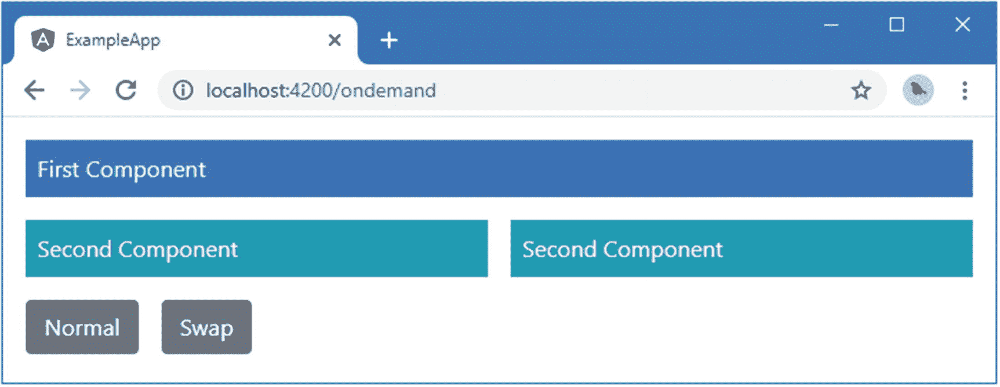

# 二十九、Angular 单元测试

在这一章中，我描述了 Angular 为单元测试组件和指令提供的工具。一些有 Angular 的构建块，比如管道和服务，可以使用我在本章开始时设置的基本测试工具进行独立测试。组件(在较小程度上还有指令)与它们的宿主元素和模板内容有着复杂的交互，并且需要特殊的特性。表 [29-1](#Tab1) 将 Angular 单元测试放在上下文中。

表 29-1。

放置 Angular 单元测试上下文

<colgroup><col class="tcol1 align-left"> <col class="tcol2 align-left"></colgroup> 
| 

问题

 | 

回答

 |
| --- | --- |
| 这是什么？ | Angular 组件和指令需要特殊的测试支持，以便它们与应用基础设施的其他部分的交互可以被隔离和检查。 |
| 为什么有用？ | 独立的单元测试能够评估实现组件或指令的类所提供的基本逻辑，但不能捕获与宿主元素、服务、模板和其他重要 Angular 特征的交互。 |
| 如何使用？ | Angular 提供了一个测试平台，允许创建一个真实的应用环境，然后用于执行单元测试。 |
| 有什么陷阱或限制吗？ | 像 Angular 的大部分内容一样，单元测试工具很复杂。可能需要花费一些时间和精力，才能轻松地编写和运行单元测试，并且确定已经隔离了应用中正确的测试部分。 |
| 还有其他选择吗？ | 如上所述，您不必对项目进行单元测试。但是如果你确实想进行单元测试，那么你将需要使用本章中描述的 Angular 特性。 |

Deciding Whether to Unit Test

单元测试是一个有争议的话题。本章假设你想做单元测试，并向你展示如何设置工具，并把它们应用到 Angular 组件和指令中。这不是对单元测试的介绍，我也没有努力说服持怀疑态度的读者单元测试是值得的。如果你想了解单元测试，这里有一篇很好的文章: [`https://en.wikipedia.org/wiki/Unit_testing`](https://en.wikipedia.org/wiki/Unit_testing) 。

我喜欢单元测试，我也在自己的项目中使用它——但并不是所有的项目，也不像你所期望的那样始终如一。我倾向于专注于为我知道很难编写的特性和功能编写单元测试，这些特性和功能很可能是部署中的错误来源。在这些情况下，单元测试有助于我思考如何最好地实现我需要的东西。我发现仅仅考虑我需要测试什么就有助于产生关于潜在问题的想法，这是在我开始处理实际的错误和缺陷之前。

也就是说，单元测试是一种工具，而不是宗教，只有你自己知道你需要多少测试。如果你不觉得单元测试有用，或者如果你有更适合你的不同的方法论，那么不要仅仅因为它是时髦的就觉得你需要单元测试。(然而，如果你没有更好的方法论，你根本没有在测试，那么你很可能是在让用户发现你的 bug，这很少是理想的。)

表 [29-2](#Tab2) 总结了本章内容。

表 29-2。

章节总结

<colgroup><col class="tcol1 align-left"> <col class="tcol2 align-left"> <col class="tcol3 align-left"></colgroup> 
| 

问题

 | 

解决办法

 | 

列表

 |
| --- | --- | --- |
| 对组件执行基本测试 | 初始化测试模块并创建组件的实例。如果组件有外部模板，则必须执行额外的编译步骤。 | 1–9, 11–13 |
| 测试组件的数据绑定 | 使用`DebugElement`类来查询组件的模板。 | Ten |
| 测试组件对事件的响应 | 使用 debug 元素触发事件。 | 14–16 |
| 测试组件的输出属性 | 订阅由组件创建的`EventEmitter`。 | 17, 18 |
| 测试组件的输入属性 | 创建一个测试组件，它的模板应用被测组件。 | 19, 20 |
| 执行依赖异步操作的测试 | 使用`whenStable`方法推迟测试，直到操作效果处理完毕。 | 21, 22 |
| 测试指令 | 创建一个测试组件，其模板应用测试中的指令。 | 23, 24 |

## 准备示例项目

我继续使用前面章节中的 exampleApp 项目。我需要一个简单的目标来关注单元测试，所以清单 [29-1](#PC1) 改变了路由配置，从而默认加载了`ondemand`特性模块。

Tip

你可以从 [`https://github.com/Apress/pro-angular-9`](https://github.com/Apress/pro-angular-9) 下载本章以及本书其他章节的示例项目。如果在运行示例时遇到问题，请参见第 [1](01.html) 章获取帮助。

```ts
import { Routes, RouterModule } from "@angular/router";
import { TableComponent } from "./core/table.component";
import { FormComponent } from "./core/form.component";
import { NotFoundComponent } from "./core/notFound.component";
import { ProductCountComponent } from "./core/productCount.component";
import { CategoryCountComponent } from "./core/categoryCount.component";
import { ModelResolver } from "./model/model.resolver";
import { TermsGuard } from "./terms.guard";
import { UnsavedGuard } from "./core/unsaved.guard";
import { LoadGuard } from "./load.guard";

const routes: Routes = [
    {
        path: "ondemand",
        loadChildren: () => import("./ondemand/ondemand.module")
                                .then(m => m.OndemandModule)
    },
    { path: "", redirectTo: "/ondemand", pathMatch: "full" }
]

export const routing = RouterModule.forRoot(routes);

Listing 29-1.Changing the Routing Configuration in the app.routing.ts File in the src/app Folder

```

这个模块包含一些简单的组件，我将用它们来演示不同的单元测试特性。为了保持应用显示的内容简单，清单 [29-2](#PC2) 整理了特性模块中顶层组件显示的模板。

```ts
<div class="container-fluid">
    <div class="row">
        <div class="col-12 p-2">
            <router-outlet></router-outlet>
        </div>
    </div>
    <div class="row">
        <div class="col-6 p-2">
            <router-outlet name="left"></router-outlet>
        </div>
        <div class="col-6 p-2">
            <router-outlet name="right"></router-outlet>
        </div>
    </div>
</div>
<button class="btn btn-secondary m-2" routerLink="/ondemand">Normal</button>
<button class="btn btn-secondary m-2" routerLink="/ondemand/swap">Swap</button>

Listing 29-2.Simplifying the ondemand.component.html File in the src/app/ondemand Folder

```

打开一个新的命令提示符，导航到`exampleApp`文件夹，运行以下命令启动提供 RESTful web 服务器的服务器:

```ts
npm run json

```

本章没有直接使用 RESTful web 服务，但是运行它可以防止错误。打开一个单独的命令提示符，导航到`exampleApp`文件夹，运行以下命令启动 Angular 开发工具:

```ts
ng serve

```

打开一个新的浏览器窗口并导航到`http://localhost:4200`以查看如图 [29-1](#Fig1) 所示的内容。



图 29-1。

运行示例应用

## 运行简单的单元测试

当使用`ng new`命令创建一个新项目时，单元测试所需的所有包和工具都会基于 Jasmine 测试框架进行安装。为了创建一个简单的单元测试来确认一切正常，我创建了`src/app/tests`文件夹，并在其中添加了一个名为`app.component.spec.ts`的文件，其内容如清单 [29-3](#PC5) 所示。单元测试的命名约定使得测试应用于哪个文件变得显而易见。

```ts
describe("Jasmine Test Environment", () => {
    it("is working", () => expect(true).toBe(true));
});

Listing 29-3.Replacing the Contents of the app.component.spec.ts File in the src/app/tests Folder

```

我很快会解释使用 Jasmine API 的基础知识，您可以暂时忽略语法。使用新的命令提示符，导航到`exampleApp`文件夹，并运行以下命令:

```ts
ng test

```

这个命令启动 Karma test runner，它打开一个新的浏览器选项卡，内容如图 [29-2](#Fig2) 所示。


图 29-2。

启动 Karma 测试运行程序

浏览器窗口用于运行测试，但是重要的信息被写出到用于启动测试工具的命令提示符中，在那里您会看到如下消息:

```ts
Chrome 80.0.3987 (Windows 10.0.0): Executed 1 of 1 SUCCESS (0.118 secs / 0.005 secs)

```

这表明项目中的单个单元测试已经被成功地定位和执行。每当您对项目中的一个 JavaScript 文件进行更新时，单元测试就会被定位和执行，任何问题都会被写到命令提示符中。为了展示一个错误是什么样子，清单 [29-4](#PC8) 改变了单元测试，使它失败。

```ts
describe("Jasmine Test Environment", () => {
    it("is working", () => expect(true).toBe(false));
});

Listing 29-4.Making a Unit Test Fail in the app.component.spec.ts File in the src/app/tests Folder

```

该测试将会失败，并会产生以下输出，该输出指出了失败的测试以及出错的原因:

```ts
Chrome 80.0.3987 (Windows 10.0.0) Jasmine Test Environment is working FAILED
        Error: Expected true to be false.
...
Chrome 80.0.3987 (Windows 10.0.0): Executed 1 of 1 (1 FAILED) ERROR
(0.125 secs / 0.118 secs)

```

## 和茉莉一起工作

Jasmine 提供的 API 将 JavaScript 方法链接在一起以定义单元测试。你可以在 [`http://jasmine.github.io`](http://jasmine.github.io) 找到 Jasmine 的完整文档，但是表 [29-3](#Tab3) 描述了 Angular 测试最有用的函数。

表 29-3。

有用的茉莉花方法

<colgroup><col class="tcol1 align-left"> <col class="tcol2 align-left"></colgroup> 
| 

名字

 | 

描述

 |
| --- | --- |
| `describe(description, function)` | 此方法用于对一组相关的测试进行分组。 |
| `beforeEach(function)` | 此方法用于指定在每个单元测试之前执行的任务。 |
| `afterEach(function)` | 此方法用于指定在每个单元测试之后执行的测试。 |
| `it(description, function)` | 此方法用于执行测试操作。 |
| `expect(value)` | 该方法用于识别测试结果。 |
| `toBe(value)` | 此方法指定测试的预期值。 |

你可以在清单 [29-4](#PC8) 中看到如何使用表 [29-3](#Tab3) 中的方法来创建单元测试。

```ts
...
describe("Jasmine Test Environment", () => {
    it("is working", () => expect(true).toBe(false));
});
...

```

您还可以看到测试失败的原因，因为已经使用了`expect`和`toBe`方法来检查`true`和`false`是否相等。因为情况并非如此，所以测试失败。

`toBe`方法不是评估单元测试结果的唯一方法。表 [29-4](#Tab4) 显示了 Angular 提供的其他评估方法。

表 29-4。

有用的 Jasmine 评估方法

<colgroup><col class="tcol1 align-left"> <col class="tcol2 align-left"></colgroup> 
| 

名字

 | 

描述

 |
| --- | --- |
| `toBe(value)` | 此方法断言结果与指定的值相同(但不必是同一个对象)。 |
| `toEqual(object)` | 此方法断言结果是与指定值相同的对象。 |
| `toMatch(regexp)` | 此方法断言结果匹配指定的正则表达式。 |
| `toBeDefined()` | 这个方法断言结果已经被定义。 |
| `toBeUndefined()` | 此方法断言结果尚未定义。 |
| `toBeNull()` | 该方法断言结果为空。 |
| `toBeTruthy()` | 该方法断言结果是真实的，如第 [12](12.html) 章所述。 |
| `toBeFalsy()` | 该方法断言结果为 falsy，如第 [12](12.html) 章所述。 |
| `toContain(substring)` | 此方法断言结果包含指定的子字符串。 |
| `toBeLessThan(value)` | 此方法断言结果小于指定值。 |
| `toBeGreaterThan(value)` | 此方法断言结果大于指定值。 |

清单 [29-5](#PC11) 展示了如何在测试中使用这些评估方法，取代前一节中失败的测试。

```ts
describe("Jasmine Test Environment", () => {
    it("test numeric value", () => expect(12).toBeGreaterThan(10));
    it("test string value", () => expect("London").toMatch("^Lon"));
});

Listing 29-5.Replacing the Unit Test in the app.component.spec.ts File in the src/app/tests Folder

```

当您将更改保存到文件中时，测试将被执行，结果将显示在命令提示符中。

## 测试 Angular 组件

不能孤立地测试 Angular 应用的构建块，因为它们依赖于 Angular 和项目的其他部分提供的底层特性，包括它包含的服务、指令、模板和模块。因此，测试一个构建块(比如一个组件)意味着使用 Angular 提供的测试实用程序来重新创建足够的应用，让组件正常工作，以便可以对其执行测试。在这一节中，我将介绍在`OnDemand`特性模块中的`FirstComponent`类上执行单元测试的过程，该模块是在第 [27 章](27.html)中添加到项目中的。提醒一下，下面是组件的定义:

```ts
import { Component } from "@angular/core";

@Component({
    selector: "first",
    template: `<div class="bg-primary text-white p-2">First Component</div>`
})
export class FirstComponent { }

```

这个组件非常简单，它本身没有要测试的功能，但是它足以演示测试过程是如何应用的。

### 使用 TestBed 类

Angular 单元测试的核心是一个名为`TestBed`的类，它负责模拟 Angular 应用环境，以便可以执行测试。表 [29-5](#Tab5) 描述了`TestBed`方法提供的最有用的方法，所有这些方法都是静态的，如第 [6 章](06.html)所述。

表 29-5。

有用的试验台方法

<colgroup><col class="tcol1 align-left"> <col class="tcol2 align-left"></colgroup> 
| 

名字

 | 

描述

 |
| --- | --- |
| `configureTestingModule` | 该方法用于配置 Angular 测试模块。 |
| `createComponent` | 此方法用于创建组件的实例。 |
| `compileComponents` | 该方法用于编译组件，如“使用外部模板测试组件”一节所述。 |

`configureTestingModule`方法用于配置测试中使用的 Angular 模块，使用由`@NgModel`装饰器支持的相同属性。就像在真实的应用中一样，一个组件不能在单元测试中使用，除非它已经被添加到模块的`declarations`属性中。这意味着大多数单元测试的第一步是配置测试模块。为了演示，我在`src/app/tests`文件夹中添加了一个名为`first.component.spec.ts`的文件，其内容如清单 [29-6](#PC13) 所示。

```ts
import { TestBed } from "@angular/core/testing";
import { FirstComponent } from "../ondemand/first.component";

describe("FirstComponent", () => {

    beforeEach(() => {
        TestBed.configureTestingModule({
            declarations: [FirstComponent]
        });
    });
});

Listing 29-6.The Contents of the first.component.spec.ts File in the src/app/tests Folder

```

在`@angular/core/testing`模块中定义了`TestBed`类，`configureTestingModule`接受一个对象，该对象的`declarations`属性告诉测试模块将使用`FirstComponent`类。

Tip

注意在`beforeEach`函数中使用了`TestBed`类。如果你试图在这个函数之外使用`TestBed`，你会看到一个关于使用`Promise` s 的错误

下一步是创建组件的一个新实例，以便它可以在测试中使用。这是使用`createComponent`方法完成的，如清单 [29-7](#PC14) 所示。

```ts
import { TestBed, ComponentFixture} from "@angular/core/testing";
import { FirstComponent } from "../ondemand/first.component";

describe("FirstComponent", () => {

    let fixture: ComponentFixture<FirstComponent>;
    let component: FirstComponent;

    beforeEach(() => {
        TestBed.configureTestingModule({
            declarations: [FirstComponent]
        });
        fixture = TestBed.createComponent(FirstComponent);
        component = fixture.componentInstance;
    });

    it("is defined", () => {
        expect(component).toBeDefined()
    });
});

Listing 29-7.Creating a Component in the first.component.spec.ts File in the src/app/tests Folder

```

`createComponent`方法的参数告诉测试床它应该实例化哪个组件类型，在本例中是`FirstComponent`。结果是一个`ComponentFixture<FirstComponent>`对象，它使用表 [29-6](#Tab6) 中描述的方法和属性提供了测试组件的特性。

表 29-6。

有用的组件夹具方法和属性

<colgroup><col class="tcol1 align-left"> <col class="tcol2 align-left"></colgroup> 
| 

名字

 | 

描述

 |
| --- | --- |
| `componentInstance` | 该属性返回组件对象。 |
| `debugElement` | 此属性返回组件的测试宿主元素。 |
| `nativeElement` | 该属性返回表示组件宿主元素的 DOM 对象。 |
| `detectChanges()` | 该方法使测试床检测状态变化，并将它们反映在组件的模板中。 |
| `whenStable()` | 这个方法返回一个`Promise`,当一个操作的效果被完全应用时，它被解析。有关详细信息，请参见“用异步操作进行测试”一节。 |

在清单中，我使用`componentInstance`属性获取测试平台已经创建的`FirstComponent`对象，并执行一个简单的测试，以确保它是通过使用`expect`方法选择`component`对象作为测试目标并使用`toBeDefined`方法执行测试而创建的。我将在接下来的小节中演示其他方法和属性。

#### 为依赖关系配置测试平台

Angular 应用最重要的特性之一是依赖注入，它允许组件和其他构建块通过使用构造函数参数声明对它们的依赖来接收服务。清单 [29-8](#PC15) 向`FirstComponent`类添加了对数据模型存储库服务的依赖。

```ts
import { Component } from "@angular/core";
import { Product } from "../model/product.model";
import { Model } from "../model/repository.model";

@Component({
    selector: "first",
    template: `<div class="bg-primary p-a-1">
                There are
                    <span class="strong"> {{getProducts().length}} </span>
                products
               </div>`
})
export class FirstComponent {

    constructor(private repository: Model) {}

    category: string = "Soccer";

    getProducts(): Product[] {
        return this.repository.getProducts()
            .filter(p => p.category == this.category);
    }
}

Listing 29-8.Adding a Service Dependency in the first.component.ts File in the src/app/ondemand Folder

```

该组件使用存储库来提供一个经过过滤的`Product`对象集合，这些对象通过一个名为`getProducts`的方法公开，并使用一个`category`属性进行过滤。内联模板有一个相应的数据绑定，显示了`getProducts`方法返回的产品数量。

能够对组件进行单元测试意味着为它提供存储库服务。只要通过测试模块进行配置，Angular 测试平台将负责解决依赖性。有效的单元测试通常要求组件与应用的其余部分隔离，这意味着模拟或伪造的对象(也称为*测试替身*)被用作单元测试中真实服务的替代品。清单 [29-9](#PC16) 配置测试平台，以便使用一个假的存储库来为组件提供服务。

```ts
import { TestBed, ComponentFixture} from "@angular/core/testing";
import { FirstComponent } from "../ondemand/first.component";
import { Product } from "..//model/product.model";
import { Model } from "../model/repository.model";

describe("FirstComponent", () => {

    let fixture: ComponentFixture<FirstComponent>;
    let component: FirstComponent;

    let mockRepository = {
        getProducts: function () {
            return [
                new Product(1, "test1", "Soccer", 100),
                new Product(2, "test2", "Chess", 100),
                new Product(3, "test3", "Soccer", 100),
            ]
        }
    }

    beforeEach(() => {
        TestBed.configureTestingModule({
            declarations: [FirstComponent],
            providers: [
                { provide: Model, useValue: mockRepository }
            ]
        });
        fixture = TestBed.createComponent(FirstComponent);
        component = fixture.componentInstance;
    });

    it("filters categories", () => {
        component.category = "Chess"
        expect(component.getProducts().length).toBe(1);
        component.category = "Soccer";
        expect(component.getProducts().length).toBe(2);
        component.category = "Running";
        expect(component.getProducts().length).toBe(0);
    });
});

Listing 29-9.Providing a Service in the first.component.spec.ts File in the src/app/tests Folder

```

变量`mockRepository`被赋予一个对象，该对象提供一个`getProducts`方法，该方法返回可用于测试已知结果的固定数据。为了给组件提供服务，传递给`TestBed.configureTestingModule`方法的对象的`providers`属性以与真实 Angular 模块相同的方式进行配置，使用值提供者通过`mockRepository`变量解析对`Model`类的依赖。测试调用组件的`getProducts`方法，并将结果与预期结果进行比较，改变`category`属性的值来检查不同的过滤器。

### 测试数据绑定

前面的例子展示了如何在单元测试中使用组件的属性和方法。这是一个好的开始，但是许多组件还会在包含在它们的模板中的数据绑定表达式中包含功能的小片段，这些也应该被测试。清单 [29-10](#PC17) 检查组件模板中的数据绑定是否正确显示了模拟数据模型中的产品数量。

```ts
import { TestBed, ComponentFixture} from "@angular/core/testing";
import { FirstComponent } from "../ondemand/first.component";
import { Product } from "../model/product.model";
import { Model } from "../model/repository.model";
import { DebugElement } from "@angular/core";
import { By } from "@angular/platform-browser";

describe("FirstComponent", () => {

    let fixture: ComponentFixture<FirstComponent>;
    let component: FirstComponent;
    let debugElement: DebugElement;
    let bindingElement: HTMLSpanElement;

    let mockRepository = {
        getProducts: function () {
            return [
                new Product(1, "test1", "Soccer", 100),
                new Product(2, "test2", "Chess", 100),
                new Product(3, "test3", "Soccer", 100),
            ]
        }
    }

    beforeEach(() => {
        TestBed.configureTestingModule({
            declarations: [FirstComponent],
            providers: [
                { provide: Model, useValue: mockRepository }
            ]
        });
        fixture = TestBed.createComponent(FirstComponent);
        component = fixture.componentInstance;
        debugElement = fixture.debugElement;
        bindingElement = debugElement.query(By.css("span")).nativeElement;
    });

    it("filters categories", () => {
        component.category = "Chess"
        fixture.detectChanges();
        expect(component.getProducts().length).toBe(1);
        expect(bindingElement.textContent).toContain("1");

        component.category = "Soccer";
        fixture.detectChanges();
        expect(component.getProducts().length).toBe(2);
        expect(bindingElement.textContent).toContain("2");

        component.category = "Running";
        fixture.detectChanges();
        expect(component.getProducts().length).toBe(0);
        expect(bindingElement.textContent).toContain("0");
    });
});

Listing 29-10.Unit Testing a Data Binding in the first.component.spec.ts File in the src/app/tests Folder

```

`ComponentFixture.debugElement`属性返回一个代表组件模板根元素的`DebugElement`对象，表 [29-7](#Tab7) 列出了由`DebugElement`类描述的最有用的方法和属性。

表 29-7。

有用的调试属性和方法

<colgroup><col class="tcol1 align-left"> <col class="tcol2 align-left"></colgroup> 
| 

名字

 | 

描述

 |
| --- | --- |
| `nativeElement` | 此属性返回表示 DOM 中 HTML 元素的对象。 |
| `children` | 这个属性返回一个代表这个元素的子元素的`DebugElement`对象数组。 |
| `query(selectorFunction)` | 为组件模板中的每个 HTML 元素向`selectorFunction`传递一个`DebugElement`对象，该方法返回函数返回`true`的第一个`DebugElement`。 |
| `queryAll(selectorFunction)` | 这类似于`query`方法，除了结果是函数返回`true`的所有`DebugElement`对象。 |
| `triggerEventHandler(name, event)` | 此方法触发一个事件。有关详细信息，请参见“测试组件事件”一节。 |

定位元素是通过`query`和`queryAll`方法完成的，这两个方法接受检查`DebugElement`对象的函数，如果它们应该包含在结果中，则返回`true`。在`@angular/platform-browser`模块中定义的`By`类使得通过表 [29-8](#Tab8) 中描述的静态方法定位组件模板中的元素变得更加容易。

表 29-8。

By 方法

<colgroup><col class="tcol1 align-left"> <col class="tcol2 align-left"></colgroup> 
| 

名字

 | 

描述

 |
| --- | --- |
| `By.all()` | 这个方法返回一个匹配任何元素的函数。 |
| `By.css(selector)` | 该方法返回一个使用 CSS 选择器匹配元素的函数。 |
| `By.directive(type)` | 该方法返回一个函数，该函数与应用了指定指令类的元素相匹配，如“测试输入属性”一节中所示。 |

在清单中，我使用`By.css`方法定位模板中的第一个`span`元素，并通过`nativeElement`属性访问表示它的 DOM 对象，这样我就可以在单元测试中检查`textContent`属性的值。

请注意，每次更改组件的`category`属性后，我都会调用`ComponentFixture`对象的`detectChanges`方法，如下所示:

```ts
...
component.category = "Soccer";
fixture.detectChanges();
expect(component.getProducts().length).toBe(2);
expect(bindingElement.textContent).toContain("2");
...

```

该方法告诉 Angular 测试环境处理任何更改，并评估模板中的数据绑定表达式。如果没有这个方法调用，对组件`category`值的更改将不会反映在模板中，测试将会失败。

### 使用外部模板测试组件

Angular 组件被编译成工厂类，要么在浏览器中，要么由我在第 [10 章](10.html)中演示的超前编译器编译。作为这个过程的一部分，Angular 处理任何外部模板，并将它们作为文本包含在 JavaScript 代码中，生成的代码类似于内联模板。当使用外部模板对组件进行单元测试时，必须显式执行编译步骤。在清单 [29-11](#PC19) 中，我修改了应用于`FirstComponent`类的`@Component`装饰器，这样它就指定了一个外部模板。

```ts
import { Component } from "@angular/core";
import { Product } from "../model/product.model";
import { Model } from "../model/repository.model";

@Component({
    selector: "first",
    templateUrl: "first.component.html"
})
export class FirstComponent {

    constructor(private repository: Model) {}

    category: string = "Soccer";

    getProducts(): Product[] {
        return this.repository.getProducts()
            .filter(p => p.category == this.category);
    }
}

Listing 29-11.Specifying a Template in the first.component.ts File in the src/app/ondemand Folder

```

为了提供模板，我在`exampleApp/app/ondemand`文件夹中创建了一个名为`first.component.html`的文件，并添加了清单 [29-12](#PC20) 中所示的元素。

```ts
<div class="bg-primary text-white p-2">
    There are
        <span class="strong"> {{getProducts().length}} </span>
    products
</div>

Listing 29-12.The first.component.html File in the exampleApp/app/ondemand Folder

```

这与之前内联定义的内容相同。清单 [29-13](#PC21) 更新了组件的单元测试，通过显式编译组件来处理外部模板。

```ts
import { TestBed, ComponentFixture, async } from "@angular/core/testing";
import { FirstComponent } from "../ondemand/first.component";
import { Product } from "../model/product.model";
import { Model } from "../model/repository.model";
import { DebugElement } from "@angular/core";
import { By } from "@angular/platform-browser";

describe("FirstComponent", () => {

    let fixture: ComponentFixture<FirstComponent>;
    let component: FirstComponent;
    let debugElement: DebugElement;
    let spanElement: HTMLSpanElement;

    let mockRepository = {
        getProducts: function () {
            return [
                new Product(1, "test1", "Soccer", 100),
                new Product(2, "test2", "Chess", 100),
                new Product(3, "test3", "Soccer", 100),
            ]
        }
    }

    beforeEach(async(() => {
        TestBed.configureTestingModule({
            declarations: [FirstComponent],
            providers: [
                { provide: Model, useValue: mockRepository }
            ]
        });
        TestBed.compileComponents().then(() => {
            fixture = TestBed.createComponent(FirstComponent);
            component = fixture.componentInstance;
            debugElement = fixture.debugElement;
            spanElement = debugElement.query(By.css("span")).nativeElement;
        });
    }));

    it("filters categories", () => {
        component.category = "Chess"
        fixture.detectChanges();
        expect(component.getProducts().length).toBe(1);
        expect(spanElement.textContent).toContain("1");
    });
});

Listing 29-13.Compiling a Component in the first.component.spec.ts File in the src/app/tests Folder

```

使用`TestBed.compileComponents`方法编译组件。编译过程是异步的，`compileComponents`方法返回一个`Promise`，当编译完成时，必须使用它来完成测试设置。为了在单元测试中更容易处理异步操作，`@angular/core/testing`模块包含一个名为`async`的函数，它与`beforeEach`方法一起使用。

### 测试组件事件

为了演示如何测试组件对事件的响应，我在`FirstComponent`类中定义了一个新属性，并添加了一个已经应用了`@HostBinding`装饰器的方法，如清单 [29-14](#PC22) 所示。

```ts
import { Component, HostListener} from "@angular/core";
import { Product } from "../model/product.model";
import { Model } from "../model/repository.model";

@Component({
    selector: "first",
    templateUrl: "first.component.html"
})
export class FirstComponent {

    constructor(private repository: Model) {}

    category: string = "Soccer";
    highlighted: boolean = false;

    getProducts(): Product[] {
        return this.repository.getProducts()
            .filter(p => p.category == this.category);
    }

    @HostListener("mouseenter", ["$event.type"])
    @HostListener("mouseleave", ["$event.type"])
    setHighlight(type: string) {
        this.highlighted = type == "mouseenter";
    }
}

Listing 29-14.Adding Event Handling in the first.component.ts File in the src/app/ondemand Folder

```

已经配置了`setHighlight`方法，这样当主机元素的`mouseenter`和`mouseleave`事件被触发时，它将被调用。清单 [29-15](#PC23) 更新组件的模板，以便它在数据绑定中使用新的属性。

```ts
<div class="bg-primary text-white p-2" [class.bg-success]="highlighted">
    There are
    <span class="strong"> {{getProducts().length}} </span>
    products
</div>

Listing 29-15.Binding to a Property in the first.component.html File in the src/app/ondemand Folder

```

事件可以通过`DebugElement`类定义的`triggerEventHandler`方法在单元测试中触发，如清单 [29-16](#PC24) 所示。

```ts
import { TestBed, ComponentFixture, async } from "@angular/core/testing";
import { FirstComponent } from "../ondemand/first.component";
import { Product } from "../model/product.model";
import { Model } from "../model/repository.model";
import { DebugElement } from "@angular/core";
import { By } from "@angular/platform-browser";

describe("FirstComponent", () => {

    let fixture: ComponentFixture<FirstComponent>;
    let component: FirstComponent;
    let debugElement: DebugElement;
    let divElement: HTMLDivElement;

    let mockRepository = {
        getProducts: function () {
            return [
                new Product(1, "test1", "Soccer", 100),
                new Product(2, "test2", "Chess", 100),
                new Product(3, "test3", "Soccer", 100),
            ]
        }
    }

    beforeEach(async(() => {
        TestBed.configureTestingModule({
            declarations: [FirstComponent],
            providers: [
                { provide: Model, useValue: mockRepository }
            ]
        });
        TestBed.compileComponents().then(() => {
            fixture = TestBed.createComponent(FirstComponent);
            component = fixture.componentInstance;
            debugElement = fixture.debugElement;
            divElement = debugElement.children[0].nativeElement;
        });
    }));

    it("handles mouse events", () => {
        expect(component.highlighted).toBeFalsy();
        expect(divElement.classList.contains("bg-success")).toBeFalsy();
        debugElement.triggerEventHandler("mouseenter", new Event("mouseenter"));
        fixture.detectChanges();
        expect(component.highlighted).toBeTruthy();
        expect(divElement.classList.contains("bg-success")).toBeTruthy();
        debugElement.triggerEventHandler("mouseleave", new Event("mouseleave"));
        fixture.detectChanges();
        expect(component.highlighted).toBeFalsy();
        expect(divElement.classList.contains("bg-success")).toBeFalsy();
    });
});

Listing 29-16.Triggering Events in the first.component.spec.ts File in the src/app/tests Folder

```

清单中的测试检查组件和模板的初始状态，然后触发`mouseenter`和`mouseleave`事件，检查每个事件的影响。

### 测试输出属性

测试输出属性是一个简单的过程，因为用来实现它们的`EventEmitter`对象是可以在单元测试中订阅的`Observable`对象。清单 [29-17](#PC25) 向被测组件添加一个输出属性。

```ts
import { Component, HostListener, Output, EventEmitter} from "@angular/core";
import { Product } from "../model/product.model";
import { Model } from "../model/repository.model";

@Component({
    selector: "first",
    templateUrl: "first.component.html"
})
export class FirstComponent {

    constructor(private repository: Model) {}

    category: string = "Soccer";
    highlighted: boolean = false;

    @Output("pa-highlight")
    change = new EventEmitter<boolean>();

    getProducts(): Product[] {
        return this.repository.getProducts()
            .filter(p => p.category == this.category);
    }

    @HostListener("mouseenter", ["$event.type"])
    @HostListener("mouseleave", ["$event.type"])
    setHighlight(type: string) {
        this.highlighted = type == "mouseenter";
        this.change.emit(this.highlighted);
    }
}

Listing 29-17.Adding an Output Property in the first.component.ts File in the src/app/ondemand Folder

```

该组件定义了一个名为`change`的输出属性，用于在调用`setHighlight`方法时发出一个事件。清单 [29-18](#PC26) 显示了一个针对输出属性的单元测试。

```ts
import { TestBed, ComponentFixture, async } from "@angular/core/testing";
import { FirstComponent } from "../ondemand/first.component";
import { Product } from "../model/product.model";
import { Model } from "../model/repository.model";
import { DebugElement } from "@angular/core";
import { By } from "@angular/platform-browser";

describe("FirstComponent", () => {

    let fixture: ComponentFixture<FirstComponent>;
    let component: FirstComponent;
    let debugElement: DebugElement;

    let mockRepository = {
        getProducts: function () {
            return [
                new Product(1, "test1", "Soccer", 100),
                new Product(2, "test2", "Chess", 100),
                new Product(3, "test3", "Soccer", 100),
            ]
        }
    }

    beforeEach(async(() => {
        TestBed.configureTestingModule({
            declarations: [FirstComponent],
            providers: [
                { provide: Model, useValue: mockRepository }
            ]
        });
        TestBed.compileComponents().then(() => {
            fixture = TestBed.createComponent(FirstComponent);
            component = fixture.componentInstance;
            debugElement = fixture.debugElement;
        });
    }));

    it("implements output property", () => {
        let highlighted: boolean;
        component.change.subscribe(value => highlighted = value);
        debugElement.triggerEventHandler("mouseenter", new Event("mouseenter"));
        expect(highlighted).toBeTruthy();
        debugElement.triggerEventHandler("mouseleave", new Event("mouseleave"));
        expect(highlighted).toBeFalsy();
    });
});

Listing 29-18.Testing an Output Property in the first.component.spec.ts File in the src/app/tests Folder

```

我本可以在单元测试中直接调用组件的`setHighlight`方法，但是我选择了触发`mouseenter`和`mouseleave`事件，这将间接地激活输出属性。在触发事件之前，我使用`subscribe`方法从`output`属性接收事件，然后用它来检查预期的结果。

### 测试输入属性

测试输入属性的过程需要一些额外的工作。首先，我向用于接收数据模型存储库的`FirstComponent`类添加了一个输入属性，替换了构造函数接收的服务，如清单 [29-19](#PC27) 所示。我还删除了主机事件绑定和输出属性，以保持示例简单。

```ts
import { Component, HostListener, Input } from "@angular/core";
import { Product } from "../model/product.model";
import { Model } from "../model/repository.model";

@Component({
    selector: "first",
    templateUrl: "first.component.html"
})
export class FirstComponent {

    category: string = "Soccer";
    highlighted: boolean = false;

    getProducts(): Product[] {
        return this.model == null ? [] : this.model.getProducts()
            .filter(p => p.category == this.category);
    }

    @Input("pa-model")
    model: Model;
}

Listing 29-19.Adding an Input Property in the first.component.ts File in the src/app/ondemand Folder

```

使用名为`pa-model`的属性设置`input`属性，并在`getProducts`方法中使用。清单 29-20 展示了如何编写一个针对输入属性的单元测试。

```ts
import { TestBed, ComponentFixture, async } from "@angular/core/testing";
import { FirstComponent } from "../ondemand/first.component";
import { Product } from "../model/product.model";
import { Model } from "../model/repository.model";
import { DebugElement } from "@angular/core";
import { By } from "@angular/platform-browser";
import { Component, ViewChild } from "@angular/core";

@Component({
    template: `<first [pa-model]="model"></first>`
})
class TestComponent {

    constructor(public model: Model) { }

    @ViewChild(FirstComponent)
    firstComponent: FirstComponent;
}

describe("FirstComponent", () => {

    let fixture: ComponentFixture<TestComponent>;
    let component: FirstComponent;
    let debugElement: DebugElement;

    let mockRepository = {
        getProducts: function () {
            return [
                new Product(1, "test1", "Soccer", 100),
                new Product(2, "test2", "Chess", 100),
                new Product(3, "test3", "Soccer", 100),
            ]
        }
    }

    beforeEach(async(() => {
        TestBed.configureTestingModule({
            declarations: [FirstComponent, TestComponent],
            providers: [
                { provide: Model, useValue: mockRepository }
            ]
        });
        TestBed.compileComponents().then(() => {
            fixture = TestBed.createComponent(TestComponent);
            fixture.detectChanges();
            component = fixture.componentInstance.firstComponent;
            debugElement = fixture.debugElement.query(By.directive(FirstComponent));
        });
    }));

    it("receives the model through an input property", () => {
        component.category = "Chess";
        fixture.detectChanges();
        let products = mockRepository.getProducts()
            .filter(p => p.category == component.category);
        let componentProducts = component.getProducts();
        for (let i = 0; i < componentProducts.length; i++) {
            expect(componentProducts[i]).toEqual(products[i]);
        }
        expect(debugElement.query(By.css("span")).nativeElement.textContent)
            .toContain(products.length);
    });
});

Listing 29-20.Testing an Input Property in the first.component.spec.ts File in the src/app/tests Folder

```

这里的技巧是定义一个组件，它只需要设置测试，并且它的模板包含一个元素，该元素与您想要作为目标的组件的选择器相匹配。在这个例子中，我用在`@Component`装饰器中定义的内联模板定义了一个名为`TestComponent`的组件类，该模板包含一个具有`pa-model`属性的`first`元素，该元素对应于应用于`FirstComponent`类的`@Input`装饰器。

测试组件类被添加到测试模块的`declarations`数组中，并使用`TestBed.createComponent`方法创建一个实例。我在`TestComponent`类中使用了`@ViewChild`装饰器，这样我就可以获得测试所需的`FirstComponent`实例。为了获得`FirstComponent`根元素，我使用了`DebugElement.query`方法和`By.directive`方法。

结果是我能够访问组件及其测试的根元素，这将设置`category`属性，然后验证来自组件的结果以及通过其模板中的数据绑定得到的结果。

### 使用异步操作进行测试

另一个需要特殊措施的领域是处理异步操作。为了演示这是如何做到的，清单 [29-21](#PC29) 修改了被测组件，以便它使用第 [24 章](24.html)中定义的`RestDataSource`类来获取数据。这不是一个打算在模型特性模块之外使用的类，但是它提供了一组有用的异步方法来返回`Observable`对象，所以我已经突破了应用的预期结构，以便我可以演示测试技术。

```ts
import { Component, HostListener, Input } from "@angular/core";
import { Product } from "../model/product.model";
import { Model } from "../model/repository.model";
import { RestDataSource } from "../model/rest.datasource";

@Component({
    selector: "first",
    templateUrl: "first.component.html"
})
export class FirstComponent {
    _category: string = "Soccer";
    _products: Product[] = [];
    highlighted: boolean = false;

    constructor(public datasource: RestDataSource) {}

    ngOnInit() {
        this.updateData();
    }

    getProducts(): Product[] {
        return this._products;
    }

    set category(newValue: string) {
        this._category;
        this.updateData();
    }

    updateData() {
        this.datasource.getData()
            .subscribe(data => this._products = data
                .filter(p => p.category == this._category));
    }
}

Listing 29-21.An Async Operation in the first.component.ts File in the src/app/ondemand Folder

```

组件通过数据源的`getData`方法获取数据，该方法返回一个`Observable`对象。组件订阅了`Observable`，并用数据对象更新了它的`_product`属性，这些数据对象通过`getProducts`方法暴露给模板。

清单 [29-22](#PC30) 展示了如何使用 Angular 为单元测试中的异步操作提供的工具来测试这类组件。

```ts
import { TestBed, ComponentFixture, async, fakeAsync, tick } from "@angular/core/testing";
import { FirstComponent } from "../ondemand/first.component";
import { Product } from "../model/product.model";
import { Model } from "../model/repository.model";
import { DebugElement } from "@angular/core";
import { By } from "@angular/platform-browser";
import { Component, ViewChild } from "@angular/core";
import { RestDataSource } from "../model/rest.datasource";
import { Observable } from "rxjs";
import { Injectable } from "@angular/core";

@Injectable()
class MockDataSource {
    public data = [
        new Product(1, "test1", "Soccer", 100),
        new Product(2, "test2", "Chess", 100),
        new Product(3, "test3", "Soccer", 100),
    ];

    getData(): Observable<Product[]> {
        return new Observable<Product[]>(obs => {
            setTimeout(() => obs.next(this.data), 1000);
        })
    }
}

describe("FirstComponent", () => {

    let fixture: ComponentFixture<FirstComponent>;
    let component: FirstComponent;
    let dataSource = new MockDataSource();

    beforeEach(async(() => {
        TestBed.configureTestingModule({
            declarations: [FirstComponent],
            providers: [
                { provide: RestDataSource, useValue: dataSource }
            ]
        });
        TestBed.compileComponents().then(() => {
            fixture = TestBed.createComponent(FirstComponent);
            component = fixture.componentInstance;
        });
    }));

    it("performs async op", fakeAsync( () => {
        dataSource.data.push(new Product(100, "test100", "Soccer", 100));

        fixture.detectChanges();

        tick(1000);

        fixture.whenStable().then(() => {
            expect(component.getProducts().length).toBe(3);
        });
    }));
});

Listing 29-22.Testing an Async Operation in the first.component.spec.ts File in the src/app/tests Folder

```

本例中的模拟对象比我之前创建的对象更加完整，只是为了展示实现相同目标的不同方式。需要注意的重要一点是，它实现的`getData`方法在返回样本数据之前引入了一秒钟的延迟。

这个延迟很重要，因为这意味着在单元测试中调用`detectChanges`方法的效果不会立即影响组件。为了模拟时间的流逝，我使用了`fakeAsync`和`tick`方法，并且为了处理异步变化，我调用了由`ComponentFixture`类定义的`whenStable`方法，该方法返回一个`Promise`，当所有的变化都被完全处理后，该方法将解析。这允许我推迟对测试结果的评估，直到模拟数据源返回的`Observable`将它的数据交付给组件。

## 测试 Angular 方向

测试指令的过程类似于测试输入属性所需的过程，因为测试组件和模板用于创建测试环境，在该环境中可以应用指令。为了测试一个指令，我在`src/app/ondemand`文件夹中添加了一个名为`attr.directive.ts`的文件，并添加了清单 [29-23](#PC31) 中所示的代码。

Note

我在这个例子中展示了一个属性指令，但是本节中的技术同样可以用来测试结构化指令。

```ts
import {
    Directive, ElementRef, Attribute, Input, SimpleChange
} from "@angular/core";

@Directive({
    selector: "[pa-attr]"
})
export class PaAttrDirective {

    constructor(private element: ElementRef) { }

    @Input("pa-attr")
    bgClass: string;

    ngOnChanges(changes: { [property: string]: SimpleChange }) {
        let change = changes["bgClass"];
        let classList = this.element.nativeElement.classList;
        if (!change.isFirstChange() && classList.contains(change.previousValue)) {
            classList.remove(change.previousValue);
        }
        if (!classList.contains(change.currentValue)) {
            classList.add(change.currentValue);
        }
    }
}

Listing 29-23.The Contents of the attr.directive.ts File in the src/app/ondemand Folder

```

这是一个基于第 [15 章](15.html)中一个例子的属性指令。为了创建一个以指令为目标的单元测试，我在`src/app/tests`文件夹中添加了一个名为`attr.directive.spec.ts`的文件，并添加了清单 [29-24](#PC32) 中所示的代码。

```ts
import { TestBed, ComponentFixture } from "@angular/core/testing";
import { Component, DebugElement, ViewChild } from "@angular/core";
import { By } from "@angular/platform-browser";
import { PaAttrDirective } from "../ondemand/attr.directive";

@Component({
    template: `<div><span [pa-attr]="className">Test Content</span></div>`
})
class TestComponent {
    className = "initialClass"

    @ViewChild(PaAttrDirective)
    attrDirective: PaAttrDirective;
}

describe("PaAttrDirective", () => {

    let fixture: ComponentFixture<TestComponent>;
    let directive: PaAttrDirective;
    let spanElement: HTMLSpanElement;

    beforeEach(() => {
        TestBed.configureTestingModule({
            declarations: [TestComponent, PaAttrDirective],
        });
        fixture = TestBed.createComponent(TestComponent);
        fixture.detectChanges();
        directive = fixture.componentInstance.attrDirective;
        spanElement = fixture.debugElement.query(By.css("span")).nativeElement;
    });

    it("generates the correct number of elements", () => {
        fixture.detectChanges();
        expect(directive.bgClass).toBe("initialClass");
        expect(spanElement.className).toBe("initialClass");

        fixture.componentInstance.className = "nextClass";
        fixture.detectChanges();
        expect(directive.bgClass).toBe("nextClass");
        expect(spanElement.className).toBe("nextClass");
    });
});

Listing 29-24.The Contents of the attr.directive.spec.ts File in the src/app/tests Folder

```

文本组件有一个应用指令的内联模板和一个在数据绑定中引用的属性。`@ViewChild` decorator 提供了对 Angular 在处理模板时创建的 directive 对象的访问，单元测试能够检查更改数据绑定使用的值是否对 directive 对象和它所应用的元素有影响。

## 摘要

在这一章中，我演示了 Angular 组件和指令进行单元测试的不同方法。我解释了安装测试框架和工具的过程，以及如何创建测试床来应用测试。我演示了如何测试组件的不同方面，以及如何将相同的技术应用于指令。

这就是我要教你的关于 Angular 的一切。我首先创建了一个简单的应用，然后带您全面浏览了框架中的不同构建块，向您展示了如何创建、配置和应用它们来创建 web 应用。

我希望你在你的角项目中取得成功，我只能希望你喜欢读这本书，就像我喜欢写它一样。