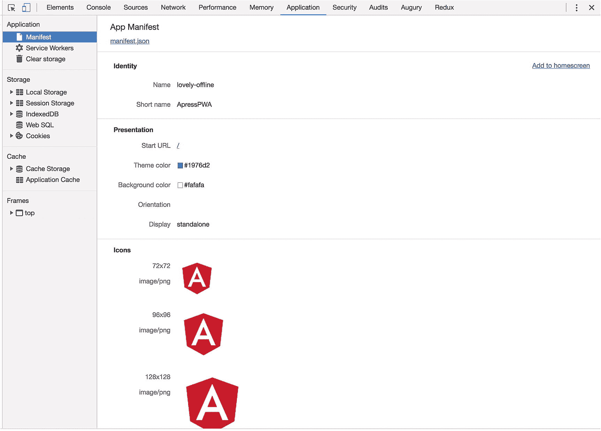
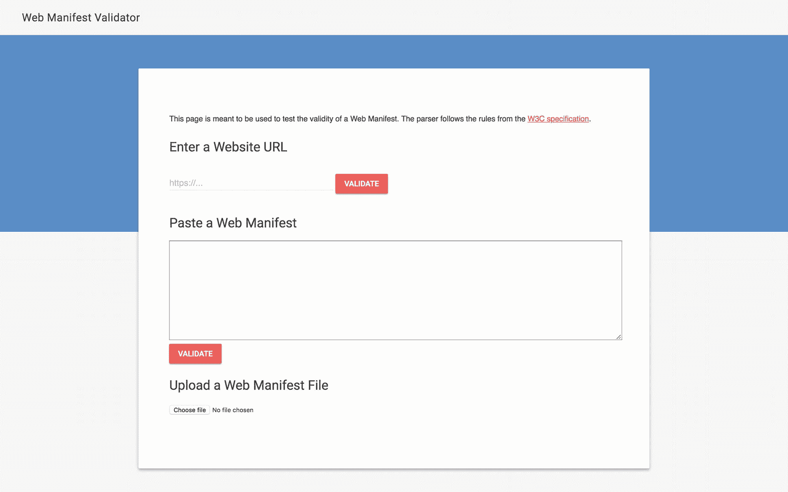
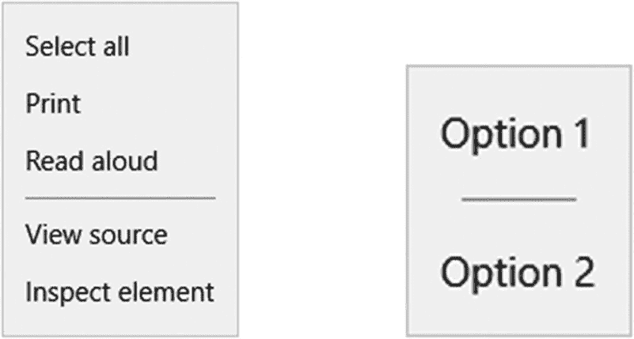
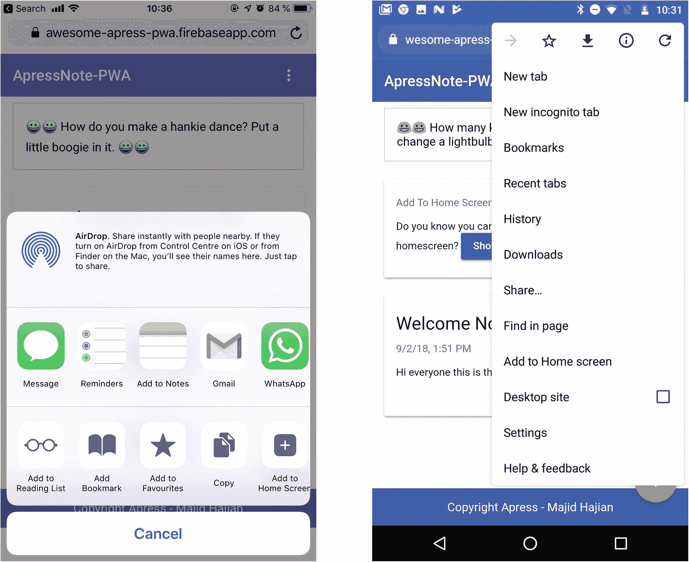

# 六、应用清单和可安装的 Angular 应用

到目前为止，我们已经关注了渐进式 Web 应用(PWA)的核心特性，即服务工作器。它使我们能够缓存静态资产和动态内容。该应用将继续离线工作，这在移动设备上尤为重要。然而，一个应用的“外观和感觉”是另一个重要因素，它可以增强用户体验，真正让用户高兴。

在这一章中，我们重点关注视觉吸引力，以及一些有助于提高应用参与度的不同方式。我们探讨了添加到主屏幕和定制等功能，这些功能会提示用户将网络添加到他们的设备主屏幕。

## Web 应用清单

Web 应用清单是一个遵循 Web 应用清单规范的 JSON 文本文件，它提供了有关应用的信息，如名称、作者、图标和描述。但更重要的是，这个文件允许用户在他们的设备上安装应用，并允许我们修改主题、应该打开的 URL、闪屏、主页上的图标等等。

让我们来看看 Angular CLI 默认创建的位于`/src/,`中的`manifest.json`。

```ts
{
  "name": "lovely-offline",
  "short_name": "ApressPWA",
  "theme_color": "#1976d2",
  "background_color": "#fafafa",
  "display": "standalone",
  "scope": "/",
  "start_url": "/",
  "icons": [
    {
      "src": "assets/icons/icon-72x72.png",
      "sizes": "72x72",
      "type": "image/png"
    },
    {
      "src": "assets/icons/icon-96x96.png",
      "sizes": "96x96",
      "type": "image/png"
    },
    {
      "src": "assets/icons/icon-128x128.png",
      "sizes": "128x128",
      "type": "image/png"
    },
    {
      "src": "assets/icons/icon-144x144.png",
      "sizes": "144x144",
      "type": "image/png"
    },
    {
      "src": "assets/icons/icon-152x152.png",
      "sizes": "152x152",
      "type": "image/png"
    },
    {
      "src": "assets/icons/icon-192x192.png",
      "sizes": "192x192",
      "type": "image/png"
    },
    {
      "src": "assets/icons/icon-384x384.png",
      "sizes": "384x384",
      "type": "image/png"
    },
    {
      "src": "assets/icons/icon-512x512.png",
      "sizes": "512x512",
      "type": "image/png"
    }
  ]
}

```

大多数属性都是不言自明的，但是我将尝试提供描述性的定义。清单文件中的每个属性都有一个角色，并告诉浏览器关于我们应用的外观和感觉的信息。尽管 Angular CLI 添加的默认`manifest.json`对于大多数用例来说应该没问题，但是我们可以添加更多属性来更好地增强用户体验，这取决于我们的需求和要求。

让我们来分解一下:

*   `name`:

    向用户显示或作为图标标签的应用的可读名称。

*   `short_name`:

    如果由于空间不足而不合适，替换名称的短名称。

*   `theme_color`:

    定义应用的默认主题颜色，以给操作系统或浏览器相关的用户界面着色:例如，浏览器的工具栏或 Android 的任务切换器。可以使用十六进制代码或颜色名称。

*   `background_color`:

    甚至在用户代理加载网站样式表之前，定义应用的预期背景颜色。通常，在启动 web 应用和加载站点内容之间会有一个短暂的间隔。这将创建一个平滑的过渡来填充延迟。您可以使用颜色十六进制代码或标准颜色的名称。请注意，在样式表可用之后，用户代理将不会使用这个背景。

*   `display`:

    网站的首选显示模式。根据规范，有四个选项可用，但并非在所有浏览器中都可用:

    `fullscreen`:使用所有可用的显示。如果不支持，则退回到`standalone`模式。

    大多数浏览器元素都是隐藏的。感觉像一个独立的应用。在这种模式下，用户代理将排除用于控制导航的 UI 元素，但可以包括其他 UI 元素，如状态栏。如果不支持，则退回到`minimal-ui`模式。

    这个应用看起来像一个独立的应用；但是，浏览器的基本用户界面仍然可见，如导航按钮。不支持，退回到`browser`模式。

    常规的浏览器标签或新窗口。

    It’s interesting to know what there is a feature in CSS where you can detect `display-mode`. See code below:

    ```ts
    @media all and (display-mode: minimal-ui) {
      /* ... */
    }
    @media all and (display-mode: standalone) {
      /* ... */
    }

    ```

*   `scope`:

    或多或少类似于定义该网站上下文导航范围的服务工作器范围。如果页面在此范围之外，它会返回到浏览器选项卡/窗口内的正常网页。对于相对 URL，基本 URL 将是清单的 URL。如果省略，默认为清单目录和所有子目录下的所有内容。

*   `start_url`:

    用户启动应用时加载的 URL。它可以不同于主页，例如，如果您希望您的 PWA 用户直接进入登录页面或注册页面，而不是主页。出于分析目的，可以精心制作`start_url`来指示应用是从浏览器外部启动的，这可以转换为 PWA。也就是:`"start_url": "/?launcher=homescreen"`

*   `icons`:

    一组图像文件，根据上下文来指定应用图标。每个图像都有三个属性:

    `src`:图像文件的路径；对于相对 URL，基本 URL 将是清单的 URL。

    `sizes`:指定图标尺寸(甚至是包含空格分隔的图像尺寸的多个尺寸)。我们应该支持各种不同的屏幕尺寸；我们包含的维度越多，图标的质量就越好。

    `type`:图像的媒体类型<sup>[1](#Fn1)</sup>；如果用户代理不支持这种类型，他们可以很快忽略它。

*   `prefer_related_applications`:

    这要求浏览器通过 PWA 向用户指示在下一个属性中推荐的指定本机应用。虽然这听起来可能很傻，但有时我们有一个非常具体的原生功能，而这在网络上并不存在，所以我们希望我们的用户使用原生应用来代替。如果省略，默认值为`false`。

*   `related_applications`:

    recommended native applications that are installable or accessible from underlying platform store. For example, link to an Android app from Google Play Store. The objects may contain `platform`, `url,` and `id`.

    ```ts
    {
        "platform": "play",
        "url": "https://play.google.com/store/apps/details?id=com.example.app1",
        "id": "com.example.app1"
      }, {
        "platform": "itunes",
        "url": "https://itunes.apple.com/app/example-app1/id123456789"
      }

    ```

*   `orientation`:

    sets the app work on default orientation. Orientation may be one of the following values:

    ```ts
    any, natural, landscape, landscape-primary, landscape-secondary
    portrait, portrait-primary, portrait-secondary

    ```

*   `dir`:

    指定`name`、`short_name`和`description`的主要文本方向。有两个值:`ltr, auto,`和`rtl`。省略该值时，默认为`auto`。

*   `lang`:

    与`dir`一起指定正确的显示语言。默认是`en-US.` <sup>[2](#Fn2)</sup>

*   `description`:

    网站功能的一般描述。

*   `serviceWorker`:

    this member represents an intended service worker registration in form of a registration object.

    ```ts
    "serviceworker": {
      "src": "sw.js",
      "scope": "/foo",
      "update_via_cache": "none"
    }

    ```

此功能可能无法在任何浏览器中运行。

*   `categories`:

    以小写形式指定 web 应用所属的预期应用类别的字符串数组。

*   `screenshots`:

    在常见使用场景中表示 web 应用的图像资源数组。这可能还不能在任何浏览器或平台上运行。

*   `iarc_rating_id`:

    代表国际年龄分级联盟(IARC) <sup>[3](#Fn3)</sup> 的 web 应用的认证代码。

为了引用清单文件，我们需要在 web 应用的所有页面的`head`之间添加一个`link`标签。然而，我们有一个带有 Angular 的单页面应用，`ng-cli`已经添加了到`index.html`和`angular.json`的链接，以便在构建后将这个文件复制到根文件夹中。

```ts
// index.html where we added manifest.json link.
<head>
.
.
  <base href="/">
  <link rel="manifest" href="manifest.json">
.
.
 </head>

```

### 调试 Web 应用清单

现在我已经介绍了 Web 应用清单并引用了 index HTML 页面，我们应该能够运行一个应用，然后在`Chrome`中导航到该应用。在`DevTools,`中，转到`Application`选项卡，点击左侧`Service Workers`正上方的`manifest`选项(见图 [6-1](#Fig1) )。

详细信息显示在那里，包括错误(如果有)。还有一个选项可以测试将应用添加到主屏幕的提示。



图 6-1

DevTools 中的应用清单详细信息

尽管 Chrome DevTools 可以很好地调试您的清单文件，但是您可以使用一些工具来验证您的清单文件是否符合 W3C 规范。一个例子是 manifest-validator.appspot.com，在那里你可以简单地审计你的清单文件。图 [6-2](#Fig2) 显示了 Web 清单验证器的屏幕截图。



图 6-2

Web 清单验证器是一个可以调试清单文件的工具

## 添加到主屏幕

默认情况下，本机应用会安装在您的主屏幕上。你会看到一个图标和短名称，当你需要运行这个应用时，很容易回到主屏幕，点击图标打开应用。作为网页开发者，吸引用户并让他们继续使用我们的应用是非常重要的。因此，作为原生应用的功能是解决参与度的难题之一。让我们的用户无缝地将我们的 web 应用添加到他们的主屏幕的一个很好的方法是添加到主屏幕(你可能会看到 A2HS)功能，也称为 web 应用安装横幅。

该功能使得在移动或桌面设备上安装 PWA 变得容易。它会显示一个提示，用户接受后，你的 PWA 会被添加到他们的启动器或主屏幕上。它将像任何其他已安装的应用一样运行，并且看起来与原生应用相似。

但是，除非满足以下条件，否则不会显示 web 应用安装横幅提示:

1.  在 HTTPS 上空服务(这是 PWA 的核心概念之一，也是服务工作器的要求)。

2.  Web 应用清单必须包括:
    1.  `short_name`或`name`

    2.  `icons`必须包括一个 192 像素和一个 512 像素大小的图标

    3.  `start_url`必须有适当的值

    4.  显示必须是下列之一:`fullscreen, standalone, or minimal-ui`

3.  web 应用尚未安装。

4.  适当的用户参与启发式。

    这一项可能会随着时间的推移而改变，所以你应该随时了解最新的消息，并不时查看不同浏览器的标准列表。在写这本书的时候，一个用户必须和这个域进行至少 30 秒的交互。

5.  App 有一个带有`fetch`事件处理程序的注册服务工作器。

虽然这个列表有点不稳定，并且经常更新，但是如果满足这些标准，Google Chrome 将触发一个名为`beforeinstallprompt`的事件，我们应该使用它来向用户显示提示。关注不同的浏览器，查看最新消息，看看它们是否支持这个事件或类似的事件。

虽然 Safari 不支持自动添加到主屏幕提示或`beforeinstsallprompt`事件，但手动添加到主屏幕是通过轻按共享按钮来显示的，即使它的行为与其他浏览器略有不同。我希望当你读到这本书时，Safari 和所有其他浏览器都将支持这一功能的自动版本。

### 注意

Chrome 67 和更早的版本显示了“添加到主屏幕”的横幅。它在 Chrome 68 中被删除，如果收听`beforeinstallprompt`并且用户点击具有正确手势事件的元素，将会显示一个对话框。

### 处理安装事件(推迟提示)

正如我们已经看到的，当满足所有标准时，`beforeinstallprompt`事件在`window`对象上触发。监听该事件以指示应用何时可安装是至关重要的，我们需要相应地对 web 应用采取行动，以显示适当的 UI 来通知我们的用户，他们可以在主屏幕上安装该应用。

虽然添加到主屏幕是我们的主要目标，但此事件也可用于其他目的，例如:

1.  将用户选择发送到我们的分析系统。

2.  推迟显示通知，直到我们确定这是显示哪个用户将点击或点击的最佳时间。

为了保存已经触发的事件，我们需要编写如下代码:

```ts
let deferredPrompt;

window.addEventListener('beforeinstallprompt', event => {

  // Prevent automatically showing the prompt if browser still supports it
  event.preventDefault();

  // Stash the event so it can be triggered later.
  deferredPrompt = event;

  // This is time to update UI, notify the user they can install app to home screen
  const button = document.getElementById('add-to-home-screen-button');
  button.style.display = 'block';

  button.addEventListner('click', () => {
    if (deferredPrompt) {
      // will show prompt
      deferredPrompt.prompt();

      // Wait for the user to respond to the prompt

      deferredPrompt.userChoice.then(choiceResult => {
        // outcome is either "accepted" or "dismissed"
        if (choiceResult.outcome === 'accepted') {
          // User accepted the A2HS prompt
          // send data to analytics
          // do whatever you want
        } else {
          // User dismissed the A2HS prompt
          // send data to analytics
          // do whatever you want
        }

         // we don't need this event anymore
        deferredPrompt = null;
        // delete or hide this button as it's not needed anymore
        button.style.display = 'none';
      });
    }
  });

});

```

只能对延迟事件调用一次`prompt()`。如果用户不理会它，我们需要等到浏览器在下一个页面导航中触发`beforeinstallprompt`事件。

### 迷你信息栏

在撰写本书时，`mini-info bar`是 Android 上 Chrome 的临时体验；它正朝着创建跨所有平台的一致体验的方向发展，包括 omnibox 中的安装按钮，如图 [6-3](#Fig3) 所示。


图 6-3

Android 上谷歌 Chrome 浏览器的迷你信息栏 <sup>[4](#Fn4)</sup>

这是 Chrome UI 组件，我们无法控制它。一旦被用户取消，它将不会再次出现，直到足够长的时间。不管`beforeinstallprompt`事件上的`preventDefault()`，如果网站满足以上所有标准，这个迷你吧就会出现。

这种实验功能在未来可能是可控的或完全根除的。

### 在 Angular App 中实现功能

现在让我们在 Angular sample 项目中实现上面的代码。首先创建一个名为`AddToHomeScreenService`的服务，并将其导入到`CoreModule.`

该服务将保存提示事件，并将根据模块共享该事件。

```ts
@Injectable({
  providedIn: 'root'
})
export class AddToHomeScreenService {
  public deferredPromptFired$ = new BehaviorSubject<boolean>(false);
  public deferredPrompt;

  get deferredPromptFired() {
    this.deferredPromptFired$.next(!!this.deferredPrompt);
    return this.deferredPromptFired$;
  }

  public showPrompt() {
    if (this.deferredPrompt) {
      // will show prompt
      this.deferredPrompt.prompt();

      // Wait for the user to respond to the prompt
      this.deferredPrompt.userChoice.then(choiceResult => {
        // outcome is either "accepted" or "dismissed"
        if (choiceResult.outcome === 'accepted') {
          // User accepted the A2HS prompt
          // send data to analytics
          // do whatever you want
          this.sendToAnalytics(choiceResult.userChoice);
        } else {
          // User dismissed the A2HS prompt

          // send data to analytics
          // do whatever you want
          this.sendToAnalytics(choiceResult.userChoice);
        }

        // we don't need this event anymore
        this.deferredPrompt = null;
        this.deferredPromptFired$.next(false);
      });
    }
  }

  public sendToAnalytics(userChoice) {
    // for example, send data to Google Analytics
    console.log(userChoice);
  }
}

```

在`app.component.ts`文件中，通过添加`@HostListener`，我们将监听一个`beforeinstallprompt`事件，通过注入`AddToHomeScreenService`，我们可以访问`deferredPrompt,`，这有助于保持我们的事件对象。

```ts
export class AppComponent implements OnInit {
  joke$: Observable<string>;

  @HostListener('window:beforeinstallprompt', ['$event'])
  onEventFire(e) {
    this.a2hs.deferredPrompt = e;
  }

  constructor(
 private db: DataService,
 private a2hs: AddToHomeScreenService
) {}

  ngOnInit() {
    this.joke$ = this.db.getRandomDadJoke();
  }
}

```

接下来，我决定在 notes list 页面上向我的用户显示一个通知框。我认为这是询问用户是否愿意安装该应用的最佳位置，因为他们已经从该应用中受益，他们很可能会接受提示。因此，最好不要用不想要的提示或通知打扰用户，而是在有意义的时候询问他们。

`AddToHomeScreenService`被注入到`NotesListComponent`中，并相应地创建了 UI。

```ts
export class NotesListComponent implements OnInit {

       isAddToHomeScreenEnabled$;

         constructor(private db: DataService,
       private a2hs: AddToHomeScreenService) {}

         ngOnInit() {
           // this.notes$ = this.db.getNotes();
           this.notes$ = this.db.initializeNotes();
           this.isDbLoading$ = this.db.isLoading$;
           this.isAddToHomeScreenEnabled$ = this.a2hs.deferredPromptFired;
         }
}

```

在 notes-list.component.html 文件中，在页面的顶部，我会添加一个简单的卡片，询问用户是否愿意在提示准备好的时候与它进行交互。

```ts
<mat-card *ngIf="isAddToHomeScreenEnabled$ | async">

  <mat-card-subtitle>Add To Home Screen</mat-card-subtitle>
  <mat-card-content>
    Do you know you can install this app on your homescreen?
    <button mat-raised-button color="primary" (click)="showPrompt()">Show me</button>
  </mat-card-content>

</mat-card>

<div *ngIf="notes$ | async as notes; else notFound">
  <app-note-card *ngFor="let note of notes" [note]="note" [loading]="isDbLoading$ | async" [routerLink]="['/notes', note.id]">
  </app-note-card>
</div>
<ng-template #notFound>
  <mat-card>
    <mat-card-title>
      Either you have no notes
    </mat-card-title>
  </mat-card>
</ng-template>

```

将所有这些放在一起，构建一个用于生产的应用，然后部署到 Firebase。

### 添加到手机和桌面的主屏幕

现在我们已经实现了所有的标准，是时候在移动和桌面上测试它了。由于谷歌 Chrome 为安装应用提供了最好的支持，你可能会问，当用户接受提示时，谷歌 Chrome 实际上做了什么？

Chrome 为我们处理了大部分繁重的工作:

1.  **手机**:

    Chrome 将生成一个 WebAPK， <sup>[5](#Fn5)</sup> ，为用户带来更好的综合体验。

2.  **桌面**:

    您的应用已安装，并将在 Mac 和 Windows 机器上的应用窗口 <sup>[6](#Fn6)</sup> 中运行。

### 注意

要在 Mac 上测试桌面 PWA 的安装流程，您需要在 Google Chrome 中启用#enable-desktop-pwas 标志。可能是以后或者你在看这本书的时候默认的。

让我们看看这在 Mac 和 Android 手机上的运行情况，如图 [6-4](#Fig4) 所示。


图 6-4

Android 和 Mac 上的 Chrome 一旦触发`beforeinstallprompt`,就会显示通知

当点击按钮显示提示时，会出现浏览器对话框提示(见图 [6-5](#Fig5) )。


图 6-5

Mac 上 Chrome 中的提示对话框

点击“安装”后，该应用将安装在 Chrome Apps 文件夹中，并可作为独立应用使用(见图 [6-6](#Fig6) )。这个功能在 Windows 10 上也有。


图 6-6

PWA 安装在 Mac 上的 Chrome 应用中

### 微软视窗 <sup>[7](#Fn7)</sup>

边缘的 PWA 是一等公民。一旦 PWA 通过微软商店发布，拥有 6 亿多月活跃用户的整个 Windows 10 安装群就是你的潜在应用受众！

有趣的是，当 pwa 在 Windows 10 中时，它们作为通用 Windows 平台应用运行，并将获得以下技术优势:

*   独立窗口

*   独立于浏览器的进程(隔离缓存，开销更少)

*   没有存储配额(用于索引数据库、本地存储等。)

*   离线和后台进程通过 JavaScript 访问本机 Windows 运行时(WinRT)API

*   出现在“应用”上下文中，如 Windows 开始菜单和 Cortana 搜索结果

最大的特性之一是能够访问 WinRT APIs。这只是确定您需要使用什么，获得必要的权限，并使用特性检测在支持的环境中调用该 API 的问题(参见图 [6-7](#Fig7) )。让我们看一个例子:



图 6-7

Microsoft Edge 和 Windows 应用上的上下文菜单

```ts
if (window.Windows && Windows.UI.Popups) {
    document.addEventListener('contextmenu', function (e) {

        // Build the context menu
        var menu = new Windows.UI.Popups.PopupMenu();
        menu.commands.append(new Windows.UI.Popups.UICommand("Option 1", null, 1));
        menu.commands.append(new Windows.UI.Popups.UICommandSeparator);
        menu.commands.append(new Windows.UI.Popups.UICommand("Option 2", null, 2));

        // Convert from webpage to WinRT coordinates
        function pageToWinRT(pageX, pageY) {
            var zoomFactor = document.documentElement.msContentZoomFactor;
            return {
                x: (pageX - window.pageXOffset) * zoomFactor,
                y: (pageY - window.pageYOffset) * zoomFactor
            };
        }

        // When the menu is invoked, execute the requested command
        menu.showAsync(pageToWinRT(e.pageX, e.pageY)).done(function (invokedCommand) {
            if (invokedCommand !== null) {
                switch (invokedCommand.id) {
                    case 1:
                        console.log('Option 1 selected');
                        // Invoke code for option 1
                        break;
                    case 2:
                        console.log('Option 2 selected');
                        // Invoke code for option 2
                        break;
                    default:
                        break;
                }
            } else {
                // The command is null if no command was invoked.
                console.log("Context menu dismissed");
            }
        });
    }, false);
}

```

### 安卓和 Chrome

Android 中 Chrome 的 Flow 类似。`beforeinstallprompt`事件被触发。一旦我们点击我们实现的按钮，对话框将会显示(见图 [6-8](#Fig8) )。


图 6-8

向用户安装应用通知并添加到主屏幕对话框

一旦用户接受安装，应用图标和`short_name`将被放置在主屏幕中其他本地应用图标的旁边，如图 [6-9](#Fig9) 所示。

### 注意

三星互联网浏览器的行为与 Chrome 相似，但反应略有不同。

当你点击打开应用时，没有浏览器 chrome(导航按钮、地址栏、菜单选项等。)在全屏选项下可见，你会注意到顶部的状态栏采用了我们在应用中配置的`theme_color,`(见图 [6-10](#Fig10) )。


图 6-10

打开后，PWA 看起来类似于本机应用


图 6-9

应用安装在主屏幕上，一旦点击打开，带有配置背景和图标的闪屏显示

When you tap to open the app, no browser

### 手动添加到主屏幕

不保证总是触发对话框提示。因此，有可能手动将 PWA 添加到主屏幕。Safari iOS 上也有这个功能。

在 Chrome 中，如果你点击浏览器右上角的菜单上下文菜单，你会看到菜单选项，你可以找到添加到主屏幕，点击它，一个提示对话框 UI 出现。

在 Safari 中,“添加到主屏幕”功能隐藏在“共享”按钮下。你应该明确点击共享，然后你会发现添加到主屏幕，如图 [6-11](#Fig11) 所示。然而，Safari 并不完全遵循 Web 应用清单规范，将来可能会有所改变——希望是在你阅读这本书的时候。



图 6-11

Safari 和 Chrome 上都有“添加到主屏幕”按钮

### 进一步增强

在不支持 web 清单的 Apple 和 Microsoft 中，有一些标签可用于改进 UI。我将它们添加到`head`标签之间的`index.html`。尽管这是一个微小的改进，但我们仍然在逐步增强我们的用户体验，这是我们在 PWA 中的目标。

```ts
  <!-- Enhancement for Safari-->
  <meta name="apple-mobile-web-app-capable" content="yes">
  <meta name="apple-mobile-web-app-status-bar-style" content="default">
  <meta name="apple-mobile-web-app-title" content="ApressNote">
  <link rel="apple-touch-startup-image" href="/assets/icons/icon-512x512.png">
  <link rel="apple-touch-icon" sizes="57x57" href="/assets/icons/icon-96x96.png">
  <link rel="apple-touch-icon" sizes="76x76" href="/assets/icons/icon-72x72.png">
  <link rel="apple-touch-icon" sizes="114x114" href="/assets/icons/icon-114x114.png">
  <link rel="apple-touch-icon" sizes="167x167" href="/assets/icons/apple-icon-384x384.png">
  <link rel="apple-touch-icon" sizes="152x152" href="/assets/icons/apple-icon-152x152.png">
  <link rel="apple-touch-icon" sizes="180x180" href="/assets/icons/apple-icon-384x384.png">
  <link rel="apple-touch-icon" sizes="192x192" href="/assets/icons/icon-192x192.png">
  <!-- Tile icon for Win8 (144x144 + tile color) -->
  <meta name="msapplication-TileImage" content="/asseimg/icon-144x144.png">
  <meta name="msapplication-TileColor" content="#3372DF">
  <meta name="msapplication-starturl" content="/">
  <meta name="application-name" content="ApressPWA">

  <!-- Mobile specific browser color -->
  <meta name="theme-color" content="#3f51b5">

```

**apple-mobile-we b-app-capable**:如果设置为 yes，其行为类似于全屏显示模式。我们使用 Safari 中的**window . navigator . standalone**来确定网页是否以全屏模式显示。

**apple-mobile-we B- app-status-bar-style**:这个 meta 标签没有任何作用，除非你首先按照*中的描述指定全屏模式。如果内容设置为默认，状态栏显示正常。如果设置为黑色，状态栏背景为黑色。如果设置为黑色半透明，状态栏为黑色半透明。如果设置为默认或黑色，web 内容将显示在状态栏下方。如果设置为黑色半透明，web 内容会显示在整个屏幕上，部分内容会被状态栏遮住。默认值为 default。*

**apple-touch-startup-image**:指定 web 应用启动时显示的启动屏幕图像。默认情况下，使用 web 应用上次启动时的屏幕截图。

**apple-mobile-we b-app-title**:指定启动图标的 web 应用标题。默认情况下，使用<标题>标签。

**apple-touch-icon**:<sup>[8](#Fn8)</sup>指定一个图标，代表用户可能想要添加到主屏幕的网络应用或网页。这些由图标表示的链接称为 Web 剪辑。

**应用名称** : <sup>[9](#Fn9)</sup> 默认名称用钉住的站点磁贴(或图标)显示。

**msapplication-starturl** :被钉住站点的根 url，类似于 web 清单中的`start_url`。

**msapplication-TileColor** :设置动态磁贴的背景色。

**msapplication-TileImage** :指定实时平铺背景图像中所需图像的 URI。

虽然您可以自己手动添加所有的增强功能，但 Google Chrome 团队有一个库可以帮助您自动缓解这个问题。

#### PWACompat 库 <sup>[10](#Fn10)</sup>

PWAcompat 是一个库，它将 Web 应用清单提供给不兼容的浏览器，以获得更好的 PWAs 你可以使用 PWACompat 库，我们将通过遗留的 HTML 标签为图标和主题填充空白，以便在大多数浏览器中获得更广泛的支持。基本上，您只需要在页面中包含库脚本，就大功告成了！

```ts
<link rel="manifest" href="manifest.json" />
<script async src="https://cdn.jsdelivr.net/npm/pwacompat@2.0.7/pwacompat.min.js"></script>

```

这个库实际上做的是更新你的页面和以下内容:

*   为清单中的所有图标创建元图标标签(例如，对于收藏夹图标、旧浏览器)

*   为各种浏览器(如 iOS、WebKit/Chromium forks 等)创建后备元标签。)描述 PWA 应该如何打开

*   根据清单设置主题颜色

对于 Safari，PWACompat 还:

*   将 apple-mobile-web-app-capable(不使用浏览器 chrome 打开)设置为独立、全屏或最小 ui 显示模式

*   创建苹果触摸图标图像，将清单背景添加到透明图标:否则，iOS 会将透明度渲染为黑色

*   创建动态的闪屏图像，与基于 Chromium 的浏览器生成的闪屏图像非常相似

对于可以访问 UWP API 的 Windows 上的 pwa:

*   设置标题栏的颜色

请关注库，查看最新版本和功能。

## 摘要

高级缓存和添加到主屏幕已经实现。我们离原生应用又近了一步。在下一章中，我们将提高 Angular 性能，并在 App Shell 上工作，以将我们的应用提升到一个新的水平。

<aside class="FootnoteSection" epub:type="footnotes">Footnotes [1](#Fn1_source)

[T2`https://www.iana.org/assignments/media-types/media-types.xhtml#image`](https://www.iana.org/assignments/media-types/media-types.xhtml%2523image)

  [2](#Fn2_source)

[T2`https://developer.mozilla.org/en-US/docs/Web/HTML/Global_attributes/lang`](https://developer.mozilla.org/en-US/docs/Web/HTML/Global_attributes/lang)

  [3](#Fn3_source)

[T2`https://www.globalratings.com/`](https://www.globalratings.com/)

  [4](#Fn4_source)

[T2`https://developers.google.com/web/updates/2018/06/a2hs-updates`](https://developers.google.com/web/updates/2018/06/a2hs-updates)

  [5](#Fn5_source)

[T2`https://developers.google.com/web/fundamentals/integration/webapks`](https://developers.google.com/web/fundamentals/integration/webapks)

  [6](#Fn6_source)

[T2`https://developers.google.com/web/progressive-web-apps/desktop#app-window`](https://developers.google.com/web/progressive-web-apps/desktop%2523app-window)

  [7](#Fn7_source)

[T2`https://docs.microsoft.com/en-us/microsoft-edge/progressive-web-apps`](https://docs.microsoft.com/en-us/microsoft-edge/progressive-web-apps)

  [8](#Fn8_source)

[T2`https://developer.apple.com/library/archive/documentation/AppleApplications/Reference/SafariWebContent/ConfiguringWebApplications/ConfiguringWebApplications.html`](https://developer.apple.com/library/archive/documentation/AppleApplications/Reference/SafariWebContent/ConfiguringWebApplications/ConfiguringWebApplications.html)

  [9](#Fn9_source)

[`https://technet.microsoft.com/en-us/windows/dn255024`](https://technet.microsoft.com/en-us/windows/dn255024) `(v=vs.60), to find out more about window site metadata`。

  [10](#Fn10_source)

[T2`https://github.com/GoogleChromeLabs/pwacompat`](https://github.com/GoogleChromeLabs/pwacompat)

 </aside>