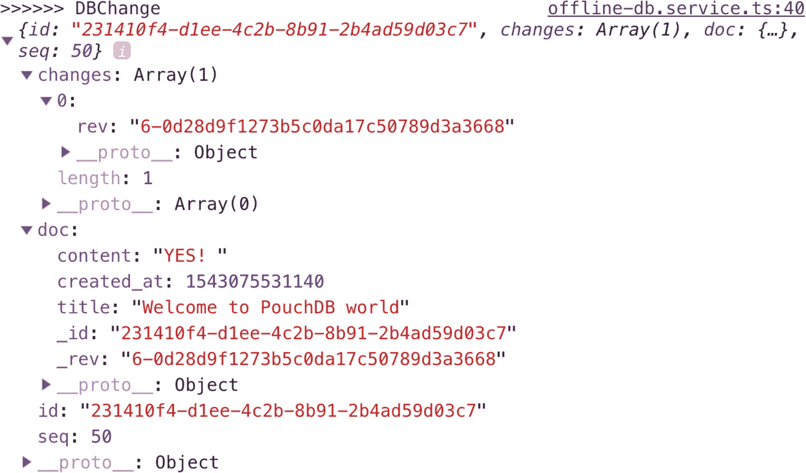
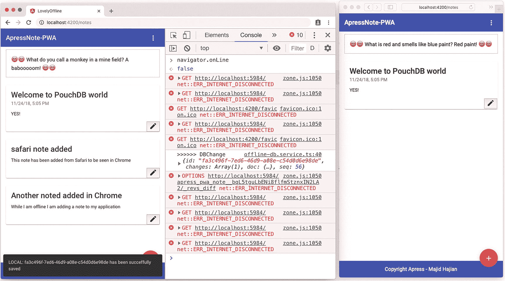
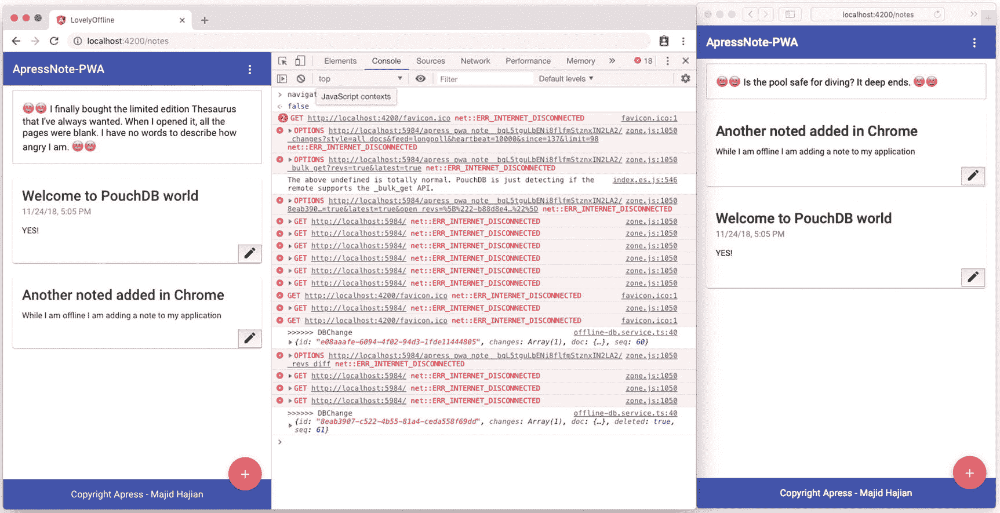

# 九、弹性 Angular 应用和离线浏览

PWAs 的一个重要方面是构建一个可以离线服务的应用的概念。到目前为止，我们已经开发了一个应用并启用了离线功能。我们已经看到了 Service Worker 的威力，它通过利用缓存 API 完成了大部分存储静态资产和动态内容的繁重工作。总的来说，与传统的 web 应用相比，这一成就意义重大。

然而，仍有改进的余地。假设您正在构建一个通过 REST API 进行通信的应用。虽然服务工作器正在促进缓存内容和更快地提供服务，但一旦必须应用网络优先策略，它对糟糕的互联网连接没有帮助，并且响应和请求有很长的延迟。或者我们应该如何处理应用状态或应用数据集？

在 PWA Note 应用中，用户的体验最有可能被中断，因为如果他们的互联网连接不好，我们会让他们等待，直到向服务器发送消息成功完成。事实上，超过 10 秒的延迟往往会使用户立即离开一个站点。如果你的业务依赖于这款应用，缓慢和缺乏可接受的用户体验可能会突然影响你的业务。

在这一章中，我将探索一种方法，无论用户的设备没有连接、连接有限还是连接良好，都可以提供一致的用户体验。这种模式将延迟降至零，因为它提供了对直接存储在设备上的内容的访问，并通过 HTTP 同步所有用户设备中的数据。

## 离线存储

在 HTML5 之前，应用数据必须存储在 cookies 中，包括在每个服务器请求中，而它被限制在 4 KB 以内。网络存储不仅更加安全，而且能够在不影响网站性能的情况下在本地存储大量数据。它是基于原点的，来自同一原点的所有页面都可以存储和访问相同的数据。web 存储器中的两种机制如下:

*   `sessionStorage`为每个给定的原点维护一个单独的存储区域，该区域在页面会话期间可用(只要浏览器打开，包括页面重新加载和恢复)。

*   做同样的事情，但即使在浏览器关闭并重新打开时仍然存在。

这个 API 有两个缺点:

1.  当你想存储(只有字符串)时，你需要序列化和反序列化数据。

2.  API 是同步的，这意味着它阻塞了应用，并且没有 Web Worker 支持。

由于这些问题，我们将重点转移到其他选项上，以便在 Web Worker 中获得更好的性能和支持。

*   `WebSQL`是异步的(基于回调)；然而，它也没有 Web Worker 支持，并被 Firefox 和 Edge 拒绝，但在 Chrome 和 Safari 中。也贬值了。

*   也是异步的(基于回调),并且在 Web Workers 和 Windows 中工作(尽管使用了同步 API)。不幸的是，它在 Chrome 之外并没有太大的吸引力，而且是沙箱化的(意味着你不能获得原生文件访问)。

*   `File API`正在改进文件和目录条目 API 和文件 API 规范。有一个文件 API 库，为了保存文件，我一直使用 FileSaver.js 作为权宜之计。可写文件的提议可能最终会给我们一个更好的无缝本地文件交互的标准跟踪解决方案。

*   `IndexedDB`是一个键值对 NoSQL 数据库，支持大规模存储(高达 20%–50%的硬盘容量)，支持多种数据类型，如数字、字符串、JSON、blob 等。因为它是异步的，所以它可以在任何地方使用，包括 Web 工作器，并且在浏览器中得到广泛支持。

*   `Cache API`为缓存的请求/响应对象对提供存储机制，例如，作为服务工作器生命周期的一部分。请注意，缓存接口向窗口范围和工作线程公开。

正如我们所见，似乎最佳选项是`IndexedDB`和`Cache API`。两种 API 的结合使它更加可靠，并提供了更好的用户体验。我们使用缓存 API 来存储 URL 可寻址资源，如静态文件，并从 REST APIs 请求和响应。对于如何使用和构建应用来利用这些 API，并没有硬性规定。有些应用可能非常简单，可以单独使用缓存 API，而其他应用可能会发现在 IDB 中部分缓存 JSON 有效负载很有价值，因此在没有缓存 API 支持的浏览器中，您仍然可以在会话期间获得一些本地缓存的好处。

### 注意

API 很强大，但是对于简单的情况来说似乎太复杂了。我推荐尝试像`LocalForage, Dexie.js, zangoDB, PouchDB, LoxiJs, JsStore, IDB, LokiJs`这样的库，它们有助于包装`IndexedDB`API，这使得它对程序员更友好。此外，这个 API 在 Safari 10 中漏洞百出，运行缓慢；因此，其中一些库在 Safari 中实现了回退到`WebSQL`，而不是`indexedDB`，以获得更好的性能。虽然这个问题已经解决，而且`IndexedDB`在所有主流浏览器中都是稳定的，但是如果你的应用因为某些原因面向旧的浏览器，你可能需要使用建议的库:例如`Localforage`

尽管没有具体的架构，但建议

*   对于离线时加载应用所需的网络资源，请使用`Cache.`

*   对于所有其他数据，使用`IndexedDB`，例如，应用状态和数据集是存储在`IndexedDB`中的最佳候选者。

### 离线优先方法

构建 web 应用的一种常见方式是作为后端服务器的消费者来存储和检索数据以实现持久性(图 [9-1](#Fig1) )。


图 9-1

传统 web 应用中的数据绑定方式

这种方法的一个问题是，不稳定或不存在的互联网连接可能会中断用户体验，并导致不可靠的性能。为了解决这一问题，我们使用了服务工作器，并将利用其他存储技术来大幅改善所有情况下的用户体验，包括完美的无线环境。

在这种方法中(如图 [9-2](#Fig2) 所示)，用户不断地与存储在客户端设备中的缓存进行交互；因此，将会有零延迟。


图 9-2

离线优先方法，4 向数据绑定

如果需要，服务工作器可以拦截客户机和服务器之间的请求。我们甚至可以想到如何将我们的数据与服务器同步。

### 注意

由于 Service Worker 中的后台同步事件，很容易解决同步问题。当我们实现 Workbox 时，我将在第 [14 章](14.html)中探讨`sync`事件，因为这个特性目前在 Angular Service Worker(Angular 7.1)中还不可用。

我将进一步对这个模型进行一些调整。如果我们可以实现一个逻辑，无论用户在线还是离线，它都可以与服务器同步数据；因此，该服务器可以操纵数据并在之后进行必要的调整(见图 [9-3](#Fig3) 和 [9-4](#Fig4) )。想想这种方法能在多大程度上改善用户体验。


图 9-4

数据可以通过所有用户的设备从/向同步服务器分发和同步


图 9-3

考虑同步的离线优先方法

让我们在 PWA Note 应用中试验离线第一数据库方法，看看它是如何工作的。

#### 使用同步服务器实现离线优先方法

我们已经发现`IndexedDB`是我们需要在客户端应用中使用的。下一个障碍是弄清楚如何存储和同步应用的数据和状态。离线同步比看起来更有挑战性。我认为克服这一障碍的最佳解决方案之一是使用`PouchDB` `.` <sup>[2](#Fn2)</sup> 请记住，您并不局限于这一解决方案，您可能需要为您的应用实现自己的逻辑，或者使用另一个第三方。 <sup>[3](#Fn3)</sup> 总而言之，目标是实现离线第一缓存用于存储数据并相应地同步回服务器。

### 注意

`PouchDB`是一个开源的 JavaScript 数据库，受 Apache `CouchDB` <sup>[4](#Fn4)</sup> 的启发，设计用于在浏览器中运行良好。`PouchDB`的创建是为了帮助 web 开发人员构建离线时和在线时一样好用的应用。它使应用能够在离线时在本地存储数据，然后在应用恢复在线时将其与`CouchDB`和兼容的服务器同步，无论用户下次登录到哪里，都可以保持用户数据的同步。

您也可以在没有同步功能的情况下使用`PouchDB`，但是为了离线功能，我在`PouchDB`中启用了同步和离线功能。

首先，我们需要安装`pouchdb:`

```ts
npm install pouchdb

```

`pouchdb-browser preset`包含为浏览器设计的`PouchDB`版本。特别是，它附带了作为默认适配器的`IndexedDB`和`WebSQL`适配器。它还包含复制、HTTP 和 map/reduce 插件。如果你只想在浏览器中使用`PouchDB`，而不想在 Node.js 中使用`preset`(例如，为了避免安装`LevelDB`)。)

因此，我不安装 pouchdb，而是交替安装`pouchdb-browser`:

```ts
npm install pouchdb-browser

```

通过运行以下命令，在 Angular 中继续并创建新的服务:

```ts
ng g s modules/core/offline-db

```

为了创建一个远程同步数据库服务器，为了简单起见，我安装了`pouchdb-server`。 <sup>[5](#Fn5)</sup>

```ts
npm install -g pouchdb-server

```

运行 PouchDB 服务器:

```ts
pouchdb-server --port 5984

```

如果您克隆了项目存储库并想要查看示例代码，首先安装 npm 包，然后安装`npm run pouchdb-server`

在`OfflineDbService,`中，我们需要实例化`PouchDB`。要进行同步，最简单的情况是单向复制，这意味着您只想让一个数据库将其更改镜像到另一个数据库。但是，对第二个数据库的写入不会传播回主数据库；然而，我们需要双向复制，让你可怜的、疲惫的手指做起来更容易；`PouchDB`有一个快捷 API。

```ts
import PouchDB from 'pouchdb-browser';

  constructor() {
// create new local database
    this._DB = new PouchDB(this.DB_NAME);
// shortcut API for bidirectional replication
    this._DB.sync(this.REMOTE_DB, {
      live: true,
      retry: true
    });
  }

```

### 注意

如果您在控制台中看到由于`undefined global`对象导致的错误，请在`Polyfills.ts.` <sup>[6](#Fn6)</sup> 底部添加`(window as any).global = window;`

数据库已成功实例化；因此，需要实现 CRUD 操作。

```ts
public get(id: string) {
    return this._DB.get(id);
  }
  public async delete(id) {
    const doc = await this.get(id);
    const deleteResult = this._DB.remove(doc);
    return deleteResult;
  }

  public add(note: any) {
    return this._DB.post({
      ...note,
      created_at: this.timestamp,
      updated_at: this.timestamp
    });
  }

  public async edit(document: any) {
    const result = await this.get(document._id);
    document._rev = result._rev;
    return this._DB.put({
      ...document,
      updated_at: this.timestamp
    });
  }

```

为了从数据库中检索所有笔记，我定义了另一个函数`getAll`，在加载应用时我将调用这个方法来向我的用户显示笔记。

```ts
public async getAll(page?: number) {
    const doc = await this._DB.allDocs({
      include_docs: true,
      limit: 40,
      skip: page || 0
    });
    this._allDocs = doc.rows.map(row => row.doc);
    // Handle database change on documents
    this.listenToDBChange();
    return this._allDocs;
  }

```

`PouchDB`提供了一个`changes() method`,它是一个事件发射器，将在每次文档更改时发出一个`'change'`事件，在所有更改都被处理后发出一个`'complete'`事件，在出现错误时发出一个`'error'`事件。调用`cancel()`会自动退订所有事件监听器。

```ts
  listenToDBChange() {
    if (this.listener) {
      return;
    }

    this.listener = this._DB
      .changes({ live: true, since: 'now', include_docs: true })
      .on('change', change => {
        this.onDBChange(change);
      });
  }

```

从现在开始，我们有了一个可以检测每个文档变化并相应地操作数据的监听器。例如，在`OfflineDbService`的`onDBChange`方法中，我实现了一个非常简单的逻辑来检测文档发生了什么类型的变化，并基于此运行一个逻辑。

```ts
private onDBChange(change) {
    this.ngZone.run(() => {
      const index = this._allDocs.findIndex(row => row._id === change.id);

      if (change.deleted) {
        this._allDocs.splice(index, 1);
        return;
      }

      if (index > -1) {
        // doc is updated
        this._allDocs[index] = change.doc;
      } else {
        // new doc
        this._allDocs.unshift(change.doc);
      }
    });
  }

```

总之，`OfflineDBServer`看起来如下:

```ts
export class OfflineDbService {
  private readonly LOCAL_DB_NAME = 'apress_pwa_note';
  private readonly DB_NAME = `${this.LOCAL_DB_NAME}__${this.auth.id}`;
  private readonly REMOTE_DB = `http://localhost:5984/${this.DB_NAME}`;
  private _DB: PouchDB.Database;
  private listener = null;
  private _allDocs: any[];

  get timestamp() {
    return;
  }

  constructor(private auth: AuthService, private ngZone: NgZone) {
    this._DB = new PouchDB(this.DB_NAME);
    this._DB.sync(this.REMOTE_DB, {
      live: true,
      retry: true
    });
  }

  listenToDBChange() {
    if (this.listener) {
      return;
    }

    this.listener = this._DB
      .changes({ live: true, since: 'now', include_docs: true })
      .on('change', change => {
        this.onDBChange(change);
      });
  }

  private onDBChange(change) {

    console.log('>>>>>> DBChange', change);
    this.ngZone.run(() => {
      const index = this._allDocs.findIndex(row => row._id === change.id);

      if (change.deleted) {
        this._allDocs.splice(index, 1);
        return;
      }

      if (index > -1) {
        // doc is updated
        this._allDocs[index] = change.doc;
      } else {
        // new doc
        this._allDocs.unshift(change.doc);
      }
    });
  }

  public async getAll(page?: number) {
    const doc = await this._DB.allDocs({
      include_docs: true,
      limit: 40,
      skip: page || 0
    });
    this._allDocs = doc.rows.map(row => row.doc);
    // Handle database change on documents
    this.listenToDBChange();
    return this._allDocs;
  }

  public get(id: string) {
    return this._DB.get(id); 

  }

  public async delete(id) {
    const doc = await this.get(id);
    const deleteResult = this._DB.remove(doc);
    return deleteResult;
  }

  public add(note: any) {
    return this._DB.post({
      ...note,
      created_at: this.timestamp,
      updated_at: this.timestamp
    });
  }

  public async edit(document: any) {
    const result = await this.get(document._id);
    document._rev = result._rev;
    return this._DB.put({
      ...document,
      updated_at: this.timestamp

    });
  }
}

```

现在我需要改变所有的组件，将`DataService`替换为`OfflineDbService.`，`NotesListComponent`，`:`

```ts
constructor(
    private offlineDB: OfflineDbService,
  ) {}

  ngOnInit() {
// here is we call getAll() and consequesntly subscribe to change listerner
    this.offlineDB.getAll().then(allDoc => {
      this.notes = allDoc;
    });
  }

```

`NotesAddComponent`上的`onSaveNote()`更新为

```ts
constructor(
    private router: Router,
    private offlineDB: OfflineDbService,
    private snackBar: SnackBarService
  ) {}

  onSaveNote(values) {
    this.loading$.next(true);

// Notice we add everything to local DB

    this.offlineDB.add(values).then(
      doc => {
        this.router.navigate(['/notes']);
        this.snackBar.open(`LOCAL: ${doc.id} has been succeffully saved`);
        this.loading$.next(false);
      },
      e => {
        this.loading$.next(false);
        this.errorMessages$.next('something is wrong when adding to DB');
      }
    );
  }

```

这里是对`NoteDetailsComponent`的相同更改，其中我们有`Edit`、`Get`、`Delete`操作。

```ts
constructor(
    private offlineDB: OfflineDbService,
    private route: ActivatedRoute,
    private snackBar: SnackBarService,
    private router: Router
  ) {}

  ngOnInit() {
    const id = this.route.snapshot.paramMap.get('id');
    this.id = id;
    this.getNote(id);
  }

  getNote(id) {

// get note from offline DB

    this.offlineDB.get(id).then(note => {
      this.note = note; 

    });
  }

  delete() {
    if (confirm('Are you sure?')) {

// delete note from offline DB

      this.offlineDB
        .delete(this.id)
        .then(() => {
          this.router.navigate(['/notes']);
          this.snackBar.open(`${this.id} successfully was deleted`);
        })
        .catch(e => {
          this.snackBar.open('Unable to delete this note');
        });
    }
  }

  edit() {
    this.isEdit = !this.isEdit; 

  }

  saveNote(values) {

// edit in offline DB

    this.offlineDB
      .edit(values)
      .then(() => {
        this.getNote(values._id);
        this.snackBar.open('Successfully done');
        this.edit();
      })
      .catch(e => {
        this.snackBar.open('Unable to edit this note');
        this.edit();
      });
  }

```

是时候测试应用了，我们不一定需要 Service Worker 因此，我们可以简单地在本地以开发模式运行我的应用。因此，运行`npm start`然后导航到`localhost:4200`来查看应用。尝试添加新注释并观察控制台消息(参见图 [9-5](#Fig5) )。



图 9-5

对于数据库中的每个更改，都会发出更改对象

如图 [9-5](#Fig5) 所示，每个文档都有一个自动添加的`_id`和`_rev`属性。change 对象包含所有必要的信息，我们可以在应用逻辑中使用这些信息来操作数据。

### 注意

响应中的`rev`字段表示文档的修订。每个文档都有一个名为`_rev`的字段。每次更新文档时，文档的`_rev`字段都会改变。每个修订版都指向它以前的修订版。`PouchDB`维护每个文档的历史(很像 git)。`_rev`允许`PouchDB`和`CouchDB`优雅地处理冲突，还有其他好处。

在你的电脑上打开两个不同的浏览器，例如 Chrome 和 Firefox，并在每个浏览器上打开应用。首先，你会注意到你在两个浏览器上都有完全相同的笔记。现在在一个浏览器中添加一个新的便签，勾选另一个(见图[9-6](#Fig6))；你会注意到新的笔记会很快出现在另一个打开应用的浏览器中。


图 9-6

该应用在两个不同的浏览器(设备)上运行，通过从一个浏览器添加笔记，一旦它被添加到同步服务器，就会发出更改，笔记会立即出现在另一个浏览器(设备)上

到目前为止还不错；您会注意到，显示或添加注释的延迟为零，因为内容会先添加到缓存中，然后再与服务器同步。因此，我们的用户不会注意到缓存和服务器之间的延迟。

如果我们的用户离线了怎么办？让我们来测试一下。我们将通过在 Chrome 中检查离线来断开网络连接，然后尝试从 Safari 中删除一个仍然在线的笔记，并从 Chrome 浏览器中添加一个离线的笔记(见图 [9-7](#Fig7) 和 [9-8](#Fig8) )。

### 注意

`PouchDB`有两种类型的数据:文档和附件。

### 文档

和在`CouchDB`中一样，您存储的文档必须是可序列化的 JSON。

### 附件

`PouchDB`也支持附件，这是存储二进制数据最有效的方式。附件可以作为 base64 编码的字符串或 Blob 对象提供。



图 9-8

即使用户脱机，也可以在浏览器(设备)中添加便笺。应用允许用户添加此注释；但是，在用户重新联机之前，它不会反映在远程数据库上。


图 9-7

从另一个在线的浏览器中删除一个便笺会反映到远程数据库中，但是由于另一个浏览器是离线的，所以它不会收到更新

一旦我完成，我会让 Chrome 网络再次上线，并会等待一段时间。几秒钟后，你会看到两个浏览器中的应用将成功同步(见图 [9-9](#Fig9) )。



图 9-9

当用户恢复在线时，两个浏览器(设备)中的应用会同步

用户体验没有出现中断，并且有快速的性能和可靠的数据和同步——这难道不令人惊讶吗？

如前所述，`PouchDB`是实现离线优先方法的一种方式。根据您的应用和需求，您可以使用不同的库，甚至是您自己的实现，直接使用`IndexedDB`API。

#### 用 Angular Firebase 实现持久数据

云 Firestore 支持离线数据持久化。此功能会缓存您的应用正在使用的云 Firestore 数据的副本，以便您的应用可以在设备离线时访问这些数据。您可以写、读、听和查询缓存的数据。当设备恢复在线时，云 Firestore 会将您的应用所做的任何本地更改同步到远程存储在云 Firestore 中的数据。

```ts
Offline persistence is an experimental feature that is supported only by the Chrome, Safari, and Firefox web browsers.

```

要启用离线持久化，在将`AngularFirestoreModule`导入到您的`@NgModule`时，必须调用`enablePersistence()`:

```ts
@NgModule({
  declarations: [AppComponent, LoadingComponent],
  imports: [
    CoreModule,
    LayoutModule,
    BrowserModule.withServerTransition({ appId: 'serverApp' }),
    HttpClientModule,
    AppRoutingModule,
    AngularFireModule.initializeApp(environment.firebase),
    AngularFirestoreModule.enablePersistence(),
    // AngularFirestoreModule, // needed for database features
    AngularFireAuthModule, // needed for auth features,
    BrowserAnimationsModule, // needed for animation
    ServiceWorkerModule.register('ngsw-worker.js', {
      enabled: environment.production
    }),
    RouterModule
  ],
  providers: [],
  bootstrap: [AppComponent]
})
export class AppModule {}
If a user opens multiple browser tabs that point to the same Cloud Firestore database, and offline persistence is enabled, Cloud Firestore will work correctly only in the first tab. However, As of September 2018, experimental multi-tab is available for you to play with. You just need to pass {experimentalTabSynchronization: true} to enbalePersistence() function such as:

```

```ts
AngularFirestoreModule.enablePersistence({experimentalTabSynchronization: true})

```

接下来，我们需要确保我们使用的是 Angular Firestore APIs。

比如在`NotesListComponent`中，用`getNotes()`的方法代替`initializedNotes()`

```ts
ngOnInit() {
        this.notes$ = this.db.getNotes();
            // this.notes$ = this.db.initializeNotes();
}

```

在`NoteDetailsComponent`中，使用`getNote()`方法代替`getNoteFromDirectApi():`

```ts
  ngOnInit() {
    const id = this.route.snapshot.paramMap.get('id');
    this.id = id;
    this.note$ = this.data.getNote(id);
    // this.note$ = this.data.getNoteFromDirectApi(id);
  }

```

并且在`NotesAddComponent`中，调用`DataService`上的`addNote()`方法。

```ts
onSaveNote(values) {
    this.data.addNote(values).then(

      doc => {
        this.snackBar.open(`LOCAL: ${doc.id} has been succeffully saved`);
      },
      e => {
        this.errorMessages$.next('something is wrong when adding to DB');
      }
    );
    this.router.navigate(['/notes']);
  }

```

运行应用并断开网络连接。即使您处于脱机状态，也可以添加便笺；一旦你重新上线，数据就会同步回 Firestore。

我们可以通过运行以下命令将应用部署到 Firebase:

```ts
npm run deploy

```

#### 用户界面注意事项

想象一下，即使用户离线，我们的应用也能工作。用户将继续添加内容和修改越来越多。用户通常不会注意到由于速度慢或没有互联网连接而导致的数据不同步。在这种情况下，可以在应用中完成一些 UI 考虑事项，以向用户显示一些信号，表明他们是离线还是在线:

1.  将页眉和页脚的颜色更改为其他颜色，以表明它们处于脱机状态；例如，在笔记应用中，当用户离线时，我们可以将蓝色标题变灰。

2.  当用户脱机时显示通知或弹出窗口；例如，当用户在 Note PWA 应用中添加笔记时，我们可以显示一条消息，表明您处于离线状态，但我们会在您在线时将数据同步回服务器。

3.  显示一个图标或其他指示，清楚地表明即使添加了笔记，它还没有与服务器同步，只存在于用户本地设备上。

4.  基于用户决策解决冲突；例如，当所有设备离线时，用户可能同时在不同的设备中编辑笔记，而当所有设备再次在线时，每个修订之间可能会有冲突。在这种情况下，向用户显示一个通知并告诉他们基于他们的编辑有不同的修订是一个好的做法；因此，他们可以选择需要应用哪个更新。

这些只是一些想法。基于你的应用，你可能会有更好的想法。重要的是增强用户界面，同时添加更多的功能和特性来提升用户体验。

最后但同样重要的是，通过监听 navigator.connection 上的更改事件，我们可以根据相应的更改对适当的逻辑做出反应。例如，看看下面的函数，从中我们可以找到更多的网络信息:

```ts
  constructor(
    private auth: AuthService,
    private swPush: SwPush,
    private snackBar: SnackBarService,
    private dataService: DataService,
    private router: Router
  ) {
    (<any>navigator).connection.addEventListener('change', this.onConnectionChange);
  }

  onConnectionChange() {
    const { downlink, effectiveType, type } = (<any>navigator).connection;

    console.log(`Effective network connection type: ${effectiveType}`);
    console.log(`Downlink Speed/bandwidth estimate: ${downlink}Mb/s`);
    console.log(
      `type of connection is ${type} but could be of bluetooth

, cellular, ethernet, none, wifi, wimax, other, unknown`
    );

    if (/\slow-2g|2g|3g/.test((<any>navigator).connection.effectiveType)) {
      this.snackBar.open(`You connection is slow!`);
    } else {
      this.snackBar.open(`Connection is fast!`);
    }
  }

```

如您所见，您可以根据网络信息的变化编写自己的逻辑。

### 注意

如果你想在你的机器上看到并运行所有的例子和代码，只需克隆 [`https://github.com/mhadaily/awesome-apress-pwa.git`](https://github.com/mhadaily/awesome-apress-pwa.git) ，然后转到`chapter09`。对于`pouchdb`的实现，你会发现`01-pouchdb`；进入文件夹，首先通过运行`npm install`安装所有软件包，然后通过分别运行`npm start`和`npm run pouchdb-server`运行 app 和`pouchdb-server`。对于`Firestore`实施，分别进入`02-firebase-presistent-db,`运行`npm install`和`npm start`。

## 摘要

PWAs 的一个主要方面是增强用户体验。提供离线体验——无论是在交通工具上的脆弱连接还是在飞机上的离线——对于提高用户满意度和改善应用的性能都是非常重要的。

为了在离线情况下支持有意义的体验，我们不仅应该缓存静态资产、请求和响应，而且在客户端存储数据似乎也是必不可少的。通过重新思考如何在前端构建应用并使其离线——首先通过利用浏览器离线存储，如`IndexedDB`,以及可用的库之一`(PouchDB),`,应用已被提升到下一个级别。

<aside class="FootnoteSection" epub:type="footnotes">Footnotes [1](#Fn1_source)

[T2`https://developer.mozilla.org/en/docs/Web/API/IndexedDB_API`](https://developer.mozilla.org/en/docs/Web/API/IndexedDB_API)

  [2](#Fn2_source)

[T2`https://pouchdb.com`](https://pouchdb.com)

  [3](#Fn3_source)

帽衫是另一个例子；你可以在 [`https://hood.ie`](https://hood.ie) `.`上找到更多信息

  [4](#Fn4_source)

[T2`http://couchdb.apache.org`](http://couchdb.apache.org)

  [5](#Fn5_source)

可以将数据同步回任何使用 CouchDB 复制协议的服务。`For examples, CouchDB, IBM Cloudant,` Couchbase。

  [6](#Fn6_source)

这是本书写作时`pouchdb` 7 和 Angular 6 和 7 的已知问题。

 </aside>