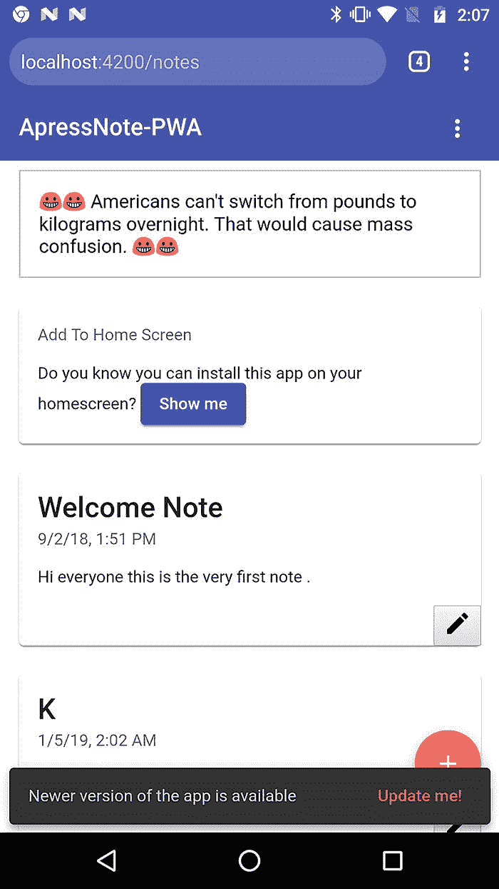
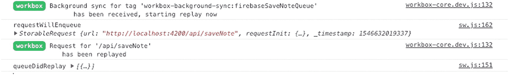
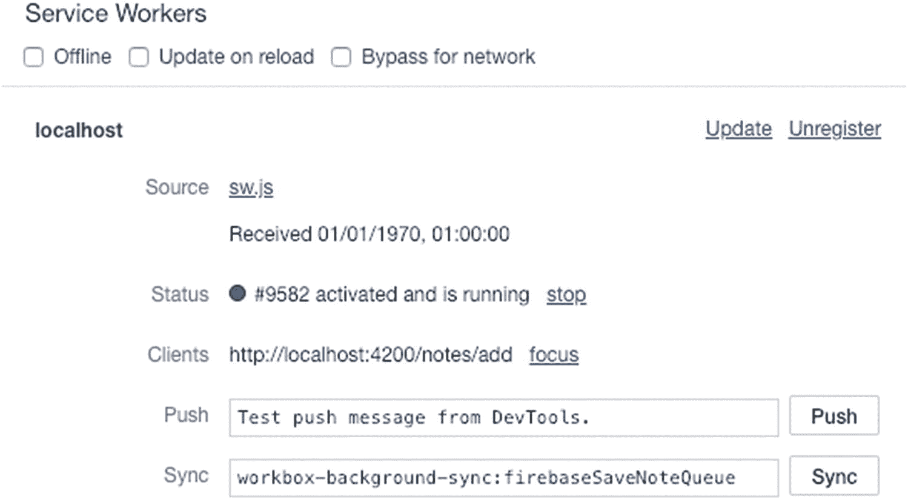
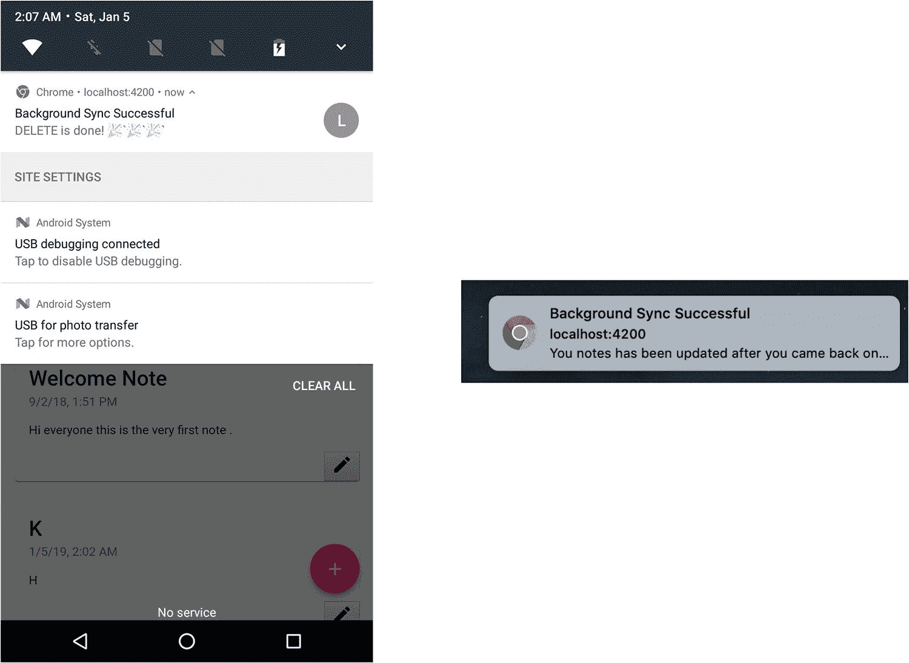
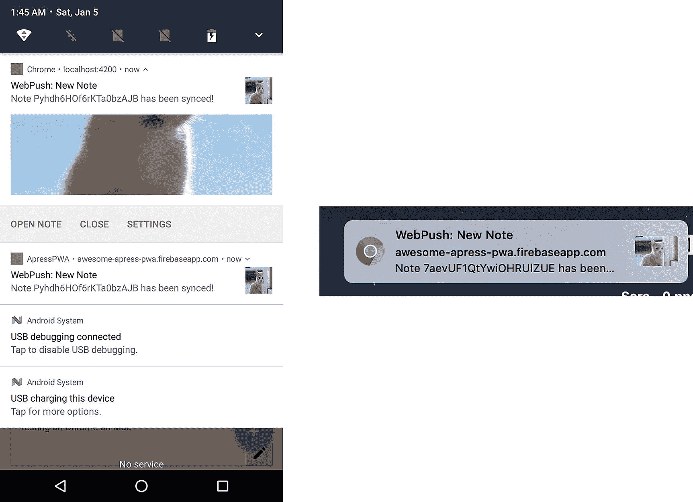

# 十四、高级 Workbox

在前一章中，我教了你如何在 Angular 项目中使用 Workbox，无论你是否已经使用了 Angular Service Worker 并希望用 Workbox 替换它，或者你只是想从头开始一个新项目。

在这一章中，我将向你展示如何实现后台同步，推送通知，离线分析，以及如何在有新的更新时通知用户。

## 处理更新

当用缓存条目响应请求时，虽然速度很快，但也有一个代价，那就是我最终会看到稳定的数据。Workbox 提供了广播更新模块，这有助于在缓存响应有可用更新时以标准方式通知 Window 客户端。虽然默认情况下，Workbox 会比较`Conent-Length`、`ETag`和`Last-Modified`标头来检测更新，但我们仍然可以定义要检查的自定义标头。

如果预缓存资产有可用的更新，我们将开始实现一个广播消息的通道。在`sw-source.js`中，我们将把`broadcastUpdate`插件添加到预缓存模块中，以便打开一个新的通道来接收更新通知消息:

```ts
workbox.precaching.addPlugins([new

workbox.broadcastUpdate.Plugin('app-shell-update')]);

```

或者我们可以将这个插件与`staleWhileRevalidate`缓存策略一起使用，因为该策略包括立即返回缓存的响应，而且还提供了一种异步更新缓存的机制。插件的第一个参数是频道名，第二个参数是为函数提供选项的对象。例如，我们可以传递`headersToCheck`，这是一个数组，用于定义所有的定制头，必须对这些头进行检查，以检测变化并通知整个通道。

```ts
  workbox.routing.registerRoute(
    new RegExp('https://fonts.(?:googleapis|gstatic).com/(.*)'),
    workbox.strategies.staleWhileRevalidate({
      cacheName: 'google-apis-cache',
      plugins: [
        new workbox.expiration.Plugin({
          maxEntries: 10,
          maxAgeSeconds: 10 * 24 * 60 * 60 // 10 Days
        })
        // new workbox.broadcastUpdate.Plugin('apis-updates', {
        //   headersToCheck: ['X-Custom-Header']
        // })
      ]
    })
  );

```

在 Angular app-component 中，我们需要监听我们在 Service Worker 中打开的通道，以便接收消息并执行相应的操作。例如，当收到消息时，将显示具有更新操作按钮的小吃店。单击或点击“更新我”操作按钮后，我们将强制重新加载窗口，这有助于新的更新自动到位。

```ts
  ngOnInit() {
    this.joke$ = this.db.getRandomDadJoke();
    this.checkForUpdates();
  }

checkForUpdates() {
    const updateChannel = new this.window.native.BroadcastChannel('app-shell-update');
    updateChannel.addEventListener('message', event => {
      console.log(event);
      this.snackBar
        .open('Newer version of the app is available', 'Update me!')
        .onAction()
        .subscribe(() => {
          this.window.native.location.reload();
        });
    });
  }

```

对象可能在 Angular 运行的任何地方都不可用，例如移动或网络工作人员；因此，您会注意到我们正在使用注入到 app-component 中的`WindowRef`服务，而不是直接获取对`window`对象的引用来根据环境更改给定对象的具体运行时实例。对于这个项目来说，它可能看起来过度劳累了，但是让我们以有 Angular 的方式做它。

```ts
// app-component.ts
constructor(private window: WindowRef){}

```

并通过创建如下的`WindowRefService`来包装`window`:

```ts
// window.service.ts
function _window(): any {
  // return the native window obj
  return window;
}

@Injectable()
export class WindowRef {
  get native(): any {
    return _window();
  }
}

```

值得一提的是，在 Service Worker 的安装过程中，有一种替代方法可以监听更新。ServiceWorkerRegistration 接口的 onupdatefound 属性是每当激发 statechange 类型的事件时调用的 EventListener 属性；每当 serviceworkerregistration . installing 属性获取新的服务工作线程时，都会触发该事件。

```ts
if ("serviceWorker" in navigator) {
  // register service worker file
  navigator.serviceWorker
    .register("service-worker.js")
    .then(reg => {
      reg.onupdatefound = () => {
        const installingWorker = reg.installing;
        installingWorker.onstatechange = () => {
          switch (installingWorker.state) {
            case "installed":
              if (navigator.serviceWorker.controller) {
                // new update available
              } else {
                // no update available
              }
              break;
          }
        };
      };
    })
    .catch(err => console.error("[SW ERROR]", err));
}

```

上面的代码是一个例子，我们可以通过它来了解更新的目的。

让我们构建并运行应用。要查看通知，首先确保您在 Android 和桌面上运行的应用在支持的浏览器中运行，如 Firefox、Chrome 和 Opera。 <sup>[1](#Fn1)</sup> 当有更新可用时，snackBar 会显示一条带有操作按钮的消息(图 [14-1](#Fig1) )。



图 14-1

“更新我”按钮将触发重新加载页面

## 后台同步

对于那些由于没有连接或服务器停机而失败的请求,`BackgroundSync` API 是一个理想的解决方案。当服务工作器检测到网络请求失败时，它可以注册一个`sync`事件，该事件在浏览器认为连接已经恢复时被发送。因此，我们可以保存请求，当`sync`事件发生时，重试发送请求。这比解决这个问题的传统策略更有效，因为即使用户已经离开应用，我们仍然可以将服务工作器的请求发送到服务器。

Workbox 提供了一个后台同步模块，帮助拦截失败的网络请求，并将其保存在 IndexedDB 中，以便在发生`sync`事件时重试。它还为还没有实现`BackgroundSync`的浏览器实现了一个后备策略。

实现后台同步的最佳选择是 Note PWA 中的 POST 和 DELETE 方法。为了演示后端 API，我们将创建一个简单的`express`应用来提供 POST 和 DELETE APIs:

```ts
const express = require('express');
const bodyParser = require('body-parser');
const axios = require('axios').default;
const app = express();

app.use(express.static(__dirname + '/dist'));
app.use(bodyParser.urlencoded({ extended: false }));
app.use(bodyParser.json());

app.post('/api/saveNote', async (req, res) => {
  try {
    const result = await axios.post('https://us-central1-awesome-apress-pwa.cloudfunctions.net/saveNote', req.body);
    return res.status(201).json(result.data);
  } catch (error) {
    return res.status(500).json({ success: false, error: { message: 'something went wrong with the endpoint' } });
  }
});

app.delete(`/api/deleteNote/users/:user_id/notes/:note_id`, async (req, res) => {
  try {
    const { user_id, note_id } = req.params;
    const { authorization } = req.headers;
    const result = await axios.delete(
      `https://firestore.googleapis.com/v1beta1/projects/awesome-apress-pwa/databases/(default)/documents/users/${user_id}/notes/${note_id}`,
      {
        headers: {
          Authorization: authorization
        }
      }

    );
    return res.json(result.data);
  } catch (error) {
    console.log(error);
    return res.status(500).json({ success: false, error: { message: 'something went wrong with the endpoint' } });
  }
});

// redirect all routes to index.html since we are running single page application
app.get('*', (req, res) => {
  res.sendfile('./dist/index.html');
});

app.listen(4200);
console.log('SEVER IS R'EADY -> PORT 4200');

```

您可以在终端`.`中运行这个服务器，就像`"node simple-express-server.js"`一样简单。您还记得，`DataService`负责发出 http 请求；因此，我们将稍微修改这个服务中的两个方法和端点，使它们指向新的后端 API。

我们将数据端点`SaveNote`指向我们的后端。

```ts
  protected readonly SAVE_NOTE_ENDPOINT = '/api/saveNote';
  saveNoteFromCloudFunction(note: Note): Observable<{ success: boolean; data: Note }> {
    return this.http.post<{ success: boolean; data: Note }>(this.SAVE_NOTE_ENDPOINT, {
      user: this.auth.id,
      data: {
        ...note,
        created_at: this.timestamp,
        updated_at: this.timestamp
      }
    });
  }

```

我还将定义一个新方法来删除指向我的后端 API 的注释。

```ts
  deleteNoteDirectly(id): Promise<any> {
    return this.auth
      .getToken()
      .pipe(
        switchMap(idToken => {
          return this.http.delete(`/api/deleteNote/users/${this.auth.id}/notes/${id}`, {
            headers: {
              Authorization: `Bearer ${idToken}`
            }
          });
        })
      )
      .toPromise();
  }

```

最后，我们将在保存和删除单个便笺时使用这些方法。一旦你克隆了 [`https://github.com/mhadaily/awesome-apress-pwa`](https://github.com/mhadaily/awesome-apress-pwa) ，进入第 [14 章](14.html)，然后 02-背景-同步。您会发现所有的示例代码，包括`NoteModule`、`DataService`和`sw-source.js.`中的所有新变化

我们将注册两条路由，以便拦截失败的网络请求，并使用`backgroundSync`插件来重试这些请求。

```ts
workbox.routing.registerRoute(

    new RegExp('/api/saveNote'),
    workbox.strategies.networkOnly({
      plugins: [
        new workbox.backgroundSync.Plugin('firebaseSaveNoteQueue',
 {
          callbacks: {
            queueDidReplay: StorableRequest => {
 // Invoked after all requests in the queue have successfully replayed.
              console.log('queueDidReplay', StorableRequest);
// show notification
              self.registration.showNotification('Background Sync Successful', {
                body: 'You notes has been saved in cloud! '});
            },
            requestWillEnqueue: StorableRequest => {
  // Invoked immediately before the request is stored to IndexedDB.
// Use this callback to modify request data at store time.
              console.log('requestWillEnqueue', StorableRequest);
            },
            requestWillReplay: StorableRequest => {
  // Invoked immediately before the request is re-fetched.
// Use this callback to modify request data at fetch time.
              console.log('requestWillEnqueue', StorableRequest);
            }

          },
          maxRetentionTime: 60 * 24 * 7 // 7 days in minutes
        })
      ]
    }),
    'POST'
  );

```

既然参数已经传递到了`registerRoute()`函数中，我们就来分解一下:

1.  第一个参数是匹配网络请求的正则表达式，在本例中是`/api/saveNote`。

2.  后台同步已被添加到插件中。第一个参数是队列名称，第二个参数是 options，这是可选的。在选项中，有几个属性，比如指示这个请求应该重试多长时间的`maxRetentionTime`和可以访问生命周期方法的`callbacks`。
    1.  `queueDidReplay`:在队列中的所有请求成功重放后调用。

    2.  `requestWillEnqueue`:在请求存储到 IndexedDB 之前立即调用。

    3.  `requestWillReplay`:在重新获取请求之前立即调用。

3.  第三个参数是 HTTP 方法。

我们将注册一个新的路由来拦截失败的`DeleteNote`网络请求。

```ts
  workbox.routing.registerRoute(
    new RegExp('/api/deleteNote/(.*)'),
    workbox.strategies.networkOnly({
      plugins: [
        new workbox.backgroundSync.Plugin('firebaseDeleteNoteQueue', {
          callbacks: {
            queueDidReplay: _ => {
              self.registration.showNotification('Background Sync Successful', {
                body: 'DELETE is done!'
              });
            }
          },
          maxRetentionTime: 24 * 60 // Retry for max of 24 Hours
        })
      ]

    }),
    'DELETE'
  );

```

可悲的是，测试`BackgroundSync`有些不直观和困难，原因有很多。最好的测试方法之一是使用以下步骤:



图 14-5

Workbox 登录后台同步的回调函数



图 14-4

Chrome 开发工具中的模拟后台同步



图 14-3

网络请求成功同步时的成功通知


图 14-2

indexeddb 中的队列数据库

1.  注册服务工作器时，在生产环境中构建并运行应用。

2.  关闭自己电脑的网络或者关闭后端服务器，也就是`simple-express-server.js`。请注意，你不能在 Chrome DevTools 中使用 offline，因为它只会影响来自页面的请求。服务工作器的请求将继续通过。

3.  发出应通过 Workbox 后台同步排队的网络请求。例如，添加注释或删除注释。

4.  您可以通过查看`Chrome DevTools > Application > IndexedDB > workbox-background-sync > requests.`来检查请求是否已经排队

5.  现在打开网络或运行网络服务器(`node simple-express-server.js`)。

6.  转到`Chrome DevTools > Application > Service Workers`，输入`workbox-background-sync:<your queue name>`的标签名称，例如`workbox-background-sync:firebaseSaveNoteQueue`，其中“”应该是您设置的队列名称，然后单击“同步”按钮，强制提前同步事件。

7.  您应该看到失败请求的网络请求通过，IndexedDB 数据现在应该是空的，因为请求已经被成功重放(图 [14-2](#Fig2) 、 [14-3](#Fig3) 、 [14-4](#Fig4) 和 [14-5](#Fig5) )。

如果你在`localhost`时查看控制台，你也能看到日志。

当同步完成时，你应该会看到一个通知，因为我们已经在`queueDidReplay`回调中使用了`showNotification()`。

## 推送通知

在第 8 章[中，我解释了网页推送通知的基础，并教你如何使用 Angular Service Worker `SwPush`服务。既然我们已经取出了这个模块，我们将首先创建一个名为`SwPushService`的服务，它提供与 Angular 相同的方法，并在我们的组件中使用它。](08.html)

```ts
@Injectable()
export class SwPushService {
  constructor() {}

  public async checkSW(): Promise<{ isEnabled: boolean; subscription: any }> {
      if (navigator.serviceWorker) {
        const registration = await navigator.serviceWorker.getRegistration();
        let subscription;
        if ('PushManager' in window && registration) {
          subscription = await registration.pushManager.getSubscription();
        }
        return { isEnabled: true, subscription };
      } else {
        return { isEnabled: false, subscription: null };
      }
    } else {
      return { isEnabled: false, subscription: null };
  }

  urlBase64ToUint8Array(base64String) {
    const padding = '='.repeat((4 - (base64String.length % 4)) % 4);
    const base64 = (base64String + padding).replace(/\-/g, '+').replace(/_/g, '/');
    const rawData = window.atob(base64);
    const outputArray = new Uint8Array(rawData.length);
    for (let i = 0; i < rawData.length; ++i) {
      outputArray[i] = rawData.charCodeAt(i);
    }
    return outputArray;
  }

  async requestSubscription({ serverPublicKey }) {
      const registration = await navigator.serviceWorker.getRegistration();
      return registration.pushManager.subscribe({
        userVisibleOnly: true,
        applicationServerKey: this.urlBase64ToUint8Array(serverPublicKey)
      });
  }

  async unsubscribe(): Promise<boolean> {
      const registration = await navigator.serviceWorker.getRegistration();
      const subscription = await registration.pushManager.getSubscription();
      return subscription.unsubscribe();
  }
}

```

让我们来分解一下:

1.  我们需要首先检查服务工作器是否准备好以及`PushManager`是否有空。我们用这个来确保当浏览器支持 web 推送通知时，UI 中的“订阅”按钮被显示。

2.  `requestSubscription()`方法接受`serverPublicKey`。我们在订购`pushManager`时使用它。服务器公钥必须通过调用`urlBase64ToUint8Array()`转换成`Uint8Array`。

3.  `Unsubscribe()`取消订阅推送管理器。

现在我们只是用有 Angular 的服务工作器来代替这项服务。既然我们已经提供了相同的方法，我们不需要改变太多东西，只需要在组件初始化上运行`checkSW()`。

```ts
constructor(
    private auth: AuthService,
    private swPush: SwPushService,
    private snackBar: SnackBarService,
    private router: Router,
    private dataService: DataService
  ) {}

ngOnInit() {
    this.checkSW();
  }

  async checkSW() {
    const { isEnabled, subscription } = await this.swPush.checkSW();
    this.isEnabled = isEnabled;
    this.subscription$.next(subscription);
  }

```

标题的其余部分将和我们在第 8 章[中创建的一样。让我们继续在`sw-source.js`中添加我们的推送通知事件。正如我们在本书前面讨论的，当收到推送通知时，`push`事件触发。因此，我们需要在服务工作器中倾听这一事件。](08.html)

```ts
  self.onpush = event => {
    const { notification } = event.data.json();
    const promiseChain  = self.registration.showNotification(notification.title, notification);
    event.waitUntil(promiseChain);
  };

```

我们还需要处理通知动作的点击事件。在第 [8](08.html) 章中，我们在 Firebase 函数方法中实现了一个逻辑，当保存笔记成功时会发送一个通知。发送的通知将有两个自定义动作:`open`和`cancel`。

```ts
// Custom notification actions
  self.onnotificationclick = event => {
    event.notification.close();
    switch (event.action) {
      case 'cancel': {
// do something if you want, e.g sending analytics to track these actions
        break;
      }
      case 'open': {
// we can track these actions in Analytics
        const URL = `${self.registration.scope}notes/${event.notification.data.noteID}`;
        event.waitUntil(clients.openWindow(URL));
        break;
      }
      default: {
        event.waitUntil(
          clients
            .matchAll({
              includeUncontrolled: true,
              type: 'window'
            })
            .then(clientList => {
              clientList.forEach(client => {
                if (client.url == '/' && 'focus' in client) {
                  return client.focus();
                }
              });
              if (clients.openWindow) {
                return clients.openWindow('/');
              }
            })
        );
      }

    }
  };
  // Closing notification action
  self.onnotificationclose = event => {
    console.log('Notification Close Event', event);
    // do something if you want!
  };

```

构建并再次运行应用后，添加注释。如果您拥有有效的订阅，将向浏览器发送通知并显示给用户(参见图 [14-6](#Fig6) )。



图 14-6

在手机和桌面上保存便笺后的网络推送通知

请注意，您可以克隆 [`https://github.com/mhadaily/awesome-apress-pwa`](https://github.com/mhadaily/awesome-apress-pwa) ，所有示例代码都可以在 [14 章](14.html)➤03-推送通知文件夹中找到。

## 离线分析

离线分析是一个模块，将使用后台同步，以确保谷歌分析的请求，无论当前的网络条件；这在用户离线时尤其有用。

无论是直接在`index.html`中使用 Google tracking tag，还是使用`angulartics2`之类的模块，都应该设置一个自定义维度来确定 app 何时离线，何时在线。让我们在`index.html`中添加脚本。

```ts
<script>
      /*
      (function(i, s, o, g, r, a, m) { i['GoogleAnalyticsObject'] = r;
        (i[r] = i[r] || function() {  (i[r].q = i[r].q || []).push(arguments);}),
        (i[r].l = 1 * new Date()); (a = s.createElement(o)), (m = s.getElementsByTagName(o)[0]);
        a.async = 1; a.src = g; m.parentNode.insertBefore(a, m);
      })(window, document, 'script', 'https://www.google-analytics.com/analytics.js', 'ga');
      ga('create', 'UA-XXXXX-Y', 'auto');
      // Set default value of custom dimension 1 to 'online'
      ga('set', 'networkstatus', 'online');
      ga('send', 'pageview');
      */
    </script>

```

启用离线分析可以像`sw-source.js:`中一样简单

```ts
    workbox.googleAnalytics.initialize({
      parameterOverrides: {
        networkstatus: 'offline'
      }
    });

```

在`googleAnalytics`初始化时，我们将传入我们定义的`parameterOverrides`来覆盖我们已经定义的维度，以确定应用离线时接收到的跟踪。

## 摘要

在本章中，高级主题已在 Angular 和 Service Worker with Workbox 中实现。我们演练了如何向`window`客户端发送消息，以通知客户端缓存中有更新。后台同步帮助我们在连接或端点重新联机后，重新尝试向服务器发送失败的请求。参与是我们通过实施推送通知实现的 PWA 的主要特征之一。最后，Workbox Google Analytics 模块提供了一种机制，我们可以在应用离线使用时跟踪它。话虽如此，让我们进入下一章，看看构建 PWA 的下一步是什么。

<aside class="FootnoteSection" epub:type="footnotes">Footnotes [1](#Fn1_source)

截至撰写本书时，广播频道 API 仅在这些浏览器中受支持，但以后可能会有所变化。然而，在 Workbox 4 中，如果不支持这个 API，将会有一个到另一个方法的回退。目前，我们使用的是 Workbox 3.6.3。

 </aside>