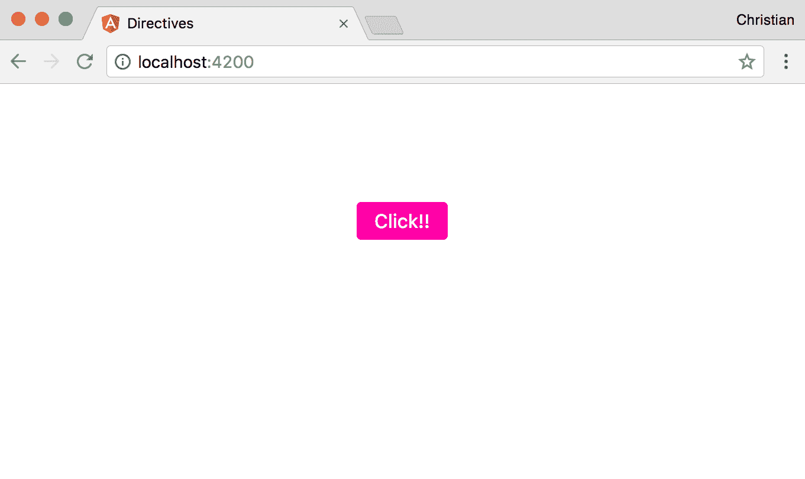
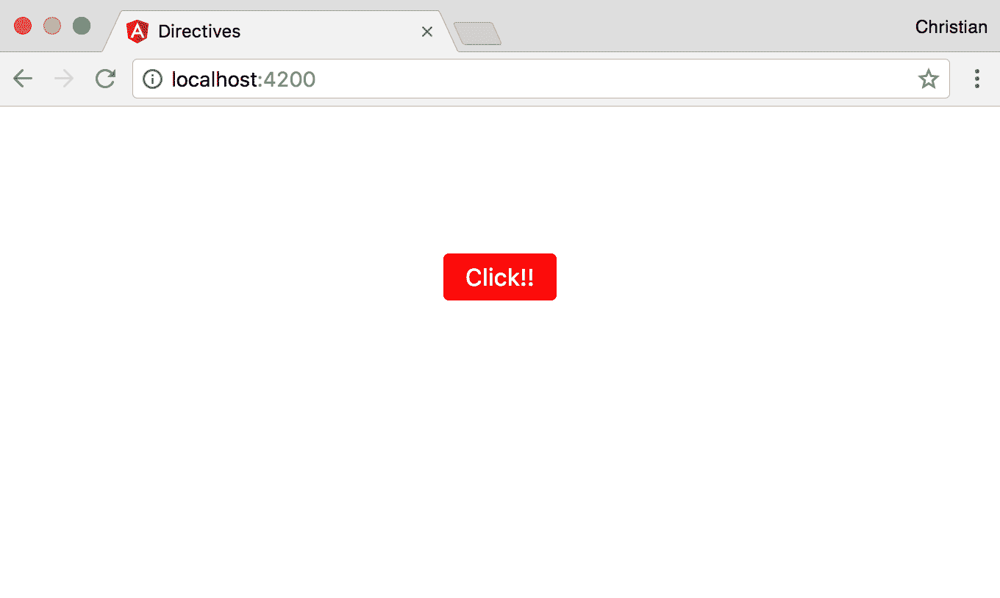
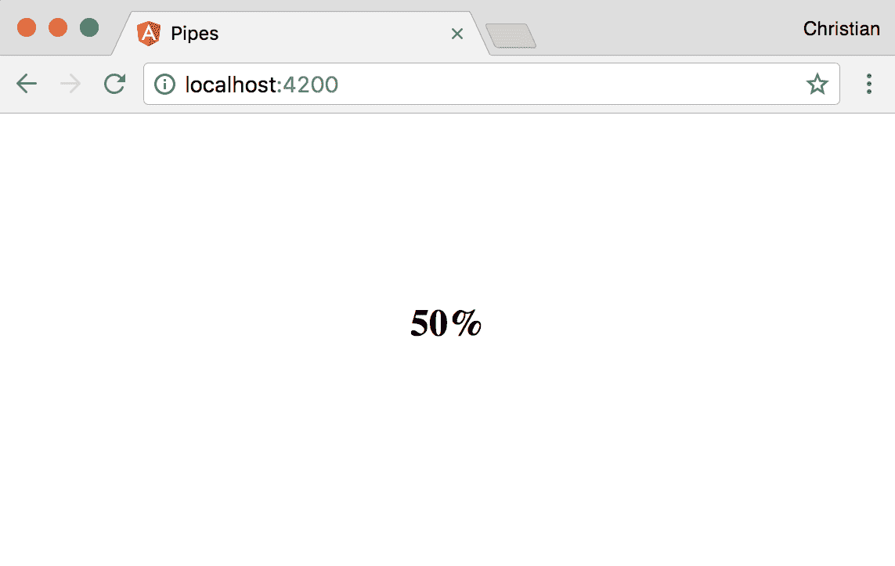
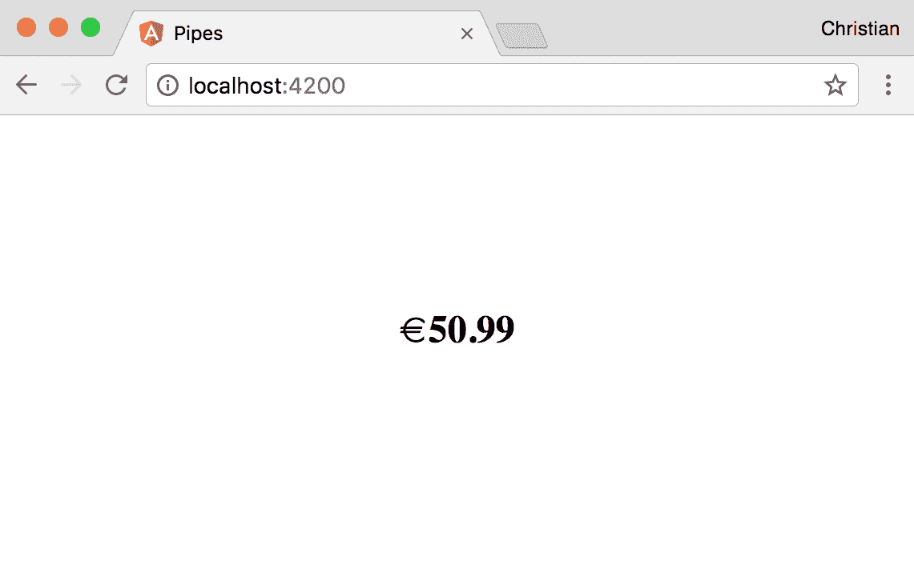
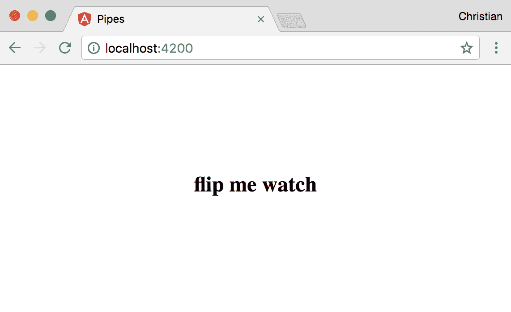

# 九、使用 TypeScript 编写模块、指令和管道

模块化对于构建大型软件系统至关重要，角度项目也不例外。当我们的应用程序开始增长时，在一个输入模块中管理其不同的成员开始变得非常困难和混乱。当您拥有大量服务、指令和管道时，它将变得更具挑战性。谈到指令和管道，我们将在本章中花一些时间讨论它们的用例和示例，同时通过模块更好地管理我们的应用程序。

# 指令

DOM 操作并不总是在组件中得到最好的处理。组件应尽可能精简；这样，事情就变得简单了，您的代码可以很容易地移动和重用。那么，我们应该在哪里处理 DOM 操作呢？答案是指令。正如您应该将数据操作任务带到服务中一样，最佳实践建议您将大量 DOM 操作带到指令中。

在 Angular 中有三种类型的指令：

*   组件
*   属性指令
*   结构指令

是的，组件！组件是合格的指令。它们是直接访问被操纵模板的指令。我们在本书中已经看到了足够多的组件；让我们关注属性和结构指令。

# 属性指令

这类指令用于向 DOM 中添加行为特征，而不是删除或添加任何 DOM 内容。更改外观、显示或隐藏元素、操纵元素属性等。

为了更好地理解属性指令，让我们构建一些应用于组件模板的 UI 指令。这些指令将在应用时更改 DOM 的行为。

使用以下命令在新项目中创建新指令：

```ts
ng generate directive ui-button
```

这将在应用程序文件夹中创建包含以下内容的空指令：

```ts
import { Directive } from '@angular/core';

@Directive({
  selector: '[appUiButton]'
})
export class UiButtonDirective {
  constructor() {}
}
```

`Directive`装饰器首先从`@angular/core`模块导入。decorator 用于任何预期用作指令的类。就像组件上的 decorator 一样，指令 decorator 接受具有选择器属性的对象。将此选择器应用于 DOM 时，将显示指令的行为。

在本例中，我们试图实现的行为需要使用一个属性设置一个完全没有样式的按钮的样式。假设我们的应用程序组件中有以下按钮：

```ts
<div class="container">
  <button>Click!!</button>
</div>
```

这只是屏幕上一个简单的无聊按钮：


要使用我们刚刚创建的 attribute 指令，请将其作为一个*值小于*的属性添加到按钮：

```ts
<button appUiButton>Click!!</button>
```

接下来，找到从`directive`类访问 button 元素的方法。我们需要这个访问权限，以便能够从类中将样式应用于按钮。感谢`ElementRef`类，当通过构造函数注入指令时，它使我们能够访问本机元素，在这里可以访问 button 元素：

```ts
import { Directive, ElementRef } from '@angular/core';

@Directive({
  selector: '[appUiButton]'
})
export class UiButtonDirective {
  constructor(el: ElementRef) {

  }
}
```

它被注入并解析为`el`属性。我们可以从属性访问 button 元素：

```ts
import { Directive, ElementRef } from '@angular/core';

@Directive({
  selector: '[appUiButton]'
})
export class UiButtonDirective {
  constructor(el: ElementRef) {
    el.nativeElement.style.backgroundColor = '#ff00a6';
  }
}
```

`nativeElement`属性允许您访问应用了 attribute 指令的元素。然后，您可以将该值视为 DOM API，这就是为什么我们可以访问`style`和`backgroundColor`属性：


您可以看到，粉红色背景被有效地应用。让我们使用更多样式使按钮更有趣，直接从指令：

```ts
import { Directive, ElementRef } from '@angular/core';

@Directive({
  selector: '[appUiButton]'
})
export class UiButtonDirective {
  constructor(el: ElementRef) {
    Object.assign(el.nativeElement.style, {
      backgroundColor: '#ff00a6',
      padding: '7px 15px',
      fontSize: '16px',
      color: '#fff',
      border: 'none',
      borderRadius: '4px'
    })
  }
}
```

我们没有使用几个点来设置值，而是使用`Object.assign`方法来减少我们必须编写的代码量。现在，我们在浏览器中有了一个更漂亮的按钮，完全采用了指令样式：



# 在指令中处理事件

指令非常灵活，允许您根据用户触发的事件应用不同的状态。例如，我们可以向按钮添加悬停行为，当鼠标光标移动到按钮上时，按钮会应用不同的颜色（例如黑色）：

```ts
import { 
  Directive, 
  ElementRef, 
  HostListener } from '@angular/core';

@Directive({
  selector: '[appUiButton]'
})
export class UiButtonDirective {
  constructor(private el: ElementRef) {
    Object.assign(el.nativeElement.style, {
      backgroundColor: '#ff00a6',
      ...
    })
  }

  @HostListener('mouseenter') onMouseEnter() {
    this.el.nativeElement.style.backgroundColor = '#000';
  }

  @HostListener('mouseleave') onMouseLeave() {
    this.el.nativeElement.style.backgroundColor = '#ff00a6';
  }
}
```

我们向该文件介绍了几个成员：

*   我们导入`HostListener`，一个扩展类中方法的装饰器。它将方法转换为附加到本机元素的事件侦听器。装饰器接受事件类型的参数。
*   我们在`onMouseEnter`和`onMouseLeave`上定义了两种方法，然后用`HostListener`来装饰这些方法。当鼠标悬停时，这些方法会更改按钮的背景色。

以下是将鼠标悬停在按钮上时的行为：


# 动态属性指令

如果我们，本指令的作者，是最终消费者会怎样？如果另一个开发人员将该指令作为 API 重用，该怎么办？我们如何使动态值具有足够的灵活性？当你在写指令时问自己这些问题时，是时候让它充满活力了。

在此期间，我们一直在使用没有任何价值的指令。我们实际上可以使用属性值接收指令的输入：

```ts
<button appUiButton bgColor="red">Click!!</button>
```

我们添加了一个新属性`bgColor`，它不是一个指令，而是一个输入属性。该属性用于向指令发送动态值，如下所示：

```ts
import { 
  Directive, 
  ElementRef, 
  HostListener, 
  Input,
  OnInit } from '@angular/core';

@Directive({
  selector: '[appUiButton]'
})
export class UiButtonDirective implements OnInit {
  @Input() bgColor: string;
  @Input() hoverBgColor: string;
  constructor(private el: ElementRef) {}

  ngOnInit() {
    Object.assign(this.el.nativeElement.style, {
      backgroundColor: this.bgColor || '#ff00a6',
      padding: '7px 15px',
      fontSize: '16px',
      color: '#fff',
      border: 'none',
      borderRadius: '4px'
    })
  }

  @HostListener('mouseenter') onMouseEnter() {
    console.log(this.bgColor);
    this.el.nativeElement.style.backgroundColor = this.hoverBgColor || '#000';
  }

  @HostListener('mouseleave') onMouseLeave() {
    this.el.nativeElement.style.backgroundColor = this.bgColor || '#ff00a6';
  }
}
```

以下是我们介绍的更改：

*   引入两个`Input`修饰属性`bgColor`和`bgHoverColor`，作为从模板到指令的动态值流。
*   此指令的设置从构造函数移到`ngOnInit`方法。这是因为输入修饰符是由 Angular 的更改检测设置的，这在构造函数中不会发生，因此当我们试图从构造函数访问`bgColor`和`bgHoverColor`时，它们是未定义的。
*   在设置样式时，我们使用通过`bgColor`接收的值，而不是硬编码`backgroundColor`的值。我们还有一个后备值，以防开发人员忘记包含属性。
*   鼠标进入和鼠标离开事件也会发生同样的情况。

现在，按钮的视觉效果受动态值的影响：



# 结构指令

结构指令与属性指令在创建方式上有很多共同之处，但在预期的行为方式上却有很大不同。与属性指令不同，结构指令需要创建或删除 DOM 元素。这不同于使用 CSS 显示属性来显示或隐藏元素。在这种情况下，元素仍在 DOM 树中，但在隐藏时最终用户不可见。

一个很好的例子是`*ngIf`。当使用`*ngIf`结构指令从 DOM 中删除元素时，该指令将从屏幕上消失，并从 DOM 树中删除。

# 为什么不同？

控制 DOM 元素可见性的方式可能会对应用程序的性能产生很大影响。

例如，您有一个手风琴，用户可以点击它来显示更多信息。用户可能会在查看内容后决定隐藏手风琴的内容，稍后再回来重新打开以供参考。手风琴的内容在任何时候都有被显示和隐藏的趋势，这一点变得越来越明显。

在这种情况下，最好使用一个属性指令，该指令不隐藏/删除手风琴内容，而只是隐藏它。这使得在需要时再次显示和隐藏的速度非常快。使用结构指令（如`*ngIf`）会不断创建和销毁 DOM 树的一部分，如果控制的 DOM 内容很大，这可能会非常昂贵。

另一方面，当您有一些内容时，您可以确定用户只会查看一次或最多两次，最好使用结构指令，如`*ngIf`。这样，您的 DOM 就不会被大量未使用的 HTML 内容所充斥。

# 该协议带有星号

所有结构指令之前的星号非常重要。当您从`*ngIf`和`*ngFor`指令中删除星号时，`*ngIf`和`*ngFor`指令拒绝工作，这意味着星号是必需的。因此，问题是：为什么星号必须在那里？

它们是有角度的语法糖，这意味着它们不必这样写。这就是它们的实际外观：

```ts
<div template="ngIf true">
  <p>Lorem ipsum dolor sit amet, consectetur adipisicing elit. Nesciunt non perspiciatis consequatur sapiente provident nemo similique. Minus quo veritatis ratione, quaerat dolores optio facilis dolor nemo, tenetur, obcaecati quibusdam, doloremque.</p>
</div>
```

该模板属性依次通过角度转换为以下内容：

```ts
<ng-template [ngIf]="true">
  <div template="ngIf true">
    <p>Lorem ipsum dolor sit amet, consectetur adipisicing elit....</p>
  </div>
</ng-template>
```

看看`ngIf`现在如何成为一个正常的角度属性，但被注入到模板中。当值为`false`时，模板从 DOM 树中移除（不隐藏）。以这种方式编写这样的指令需要编写大量代码，因此 Angular 添加了语法糖，以简化我们编写`ngIf`指令的方式：

```ts
<div *ngIf="true">
  <p>Lorem ipsum dolor sit amet, consectetur adipisicing elit. Nesciunt non perspiciatis consequatur sapiente provident nemo similique.</p>
</div>
```

# 创建结构指令

我们已经从前面的示例中了解了如何使用结构指令。我们如何创建它们？我们通过在终端中运行以下命令，以创建属性指令的相同方式创建它们：

```ts
ng generate directive when
```

是的，我们将指令命名为`when`。该指令与`*ngIf`完全相同，因此，希望它能帮助您更好地理解您已经使用过的指令的内部结构。

使用以下内容更新指令：

```ts
import { 
  Directive, 
  Input, 
  TemplateRef, 
  ViewContainerRef } from '@angular/core';

@Directive({
  selector: '[appWhen]'
})
export class WhenDirective {
  constructor(
    private templateRef: TemplateRef<any>,
    private viewContainer: ViewContainerRef) { }
}
```

我们介绍了一些您还不熟悉的成员。`TemplateRef`是对我们前面看到的`ng-template`模板的引用，其中包含我们控制的 DOM 内容。`ViewContainerRef`是对视图本身的引用。

当在视图中使用`appWhen`指令时，它应该接受一个条件，例如`ngIf`。要接收这样的条件，我们需要创建一个修饰的`Input`setter 方法：

```ts
export class WhenDirective {
  private hasView = false;

  constructor(
    private templateRef: TemplateRef<any>,
    private viewContainer: ViewContainerRef) { }

  @Input() set appWhen(condition: boolean) {
    if (condition && !this.hasView) {
      this.viewContainer.createEmbeddedView(this.templateRef);
      this.hasView = true;
    } else if (!condition && this.hasView) {
      this.viewContainer.clear();
      this.hasView = false;
    }
  }
}
```

指令中的 setter 方法检查值是否解析为`true`，然后显示内容并创建视图（如果尚未创建）。当值解析为`false`时，情况正好相反。

让我们通过单击要在属性指令部分中工作的按钮来测试该指令。单击按钮时，会将属性切换为`true`或`false`。此属性绑定到我们创建的指令的值。

使用以下内容更新应用程序组件类：

```ts
export class AppComponent {
  toggle = false;
  updateToggle() {
    this.toggle = !this.toggle;
  }
}
```

`updateToggle`方法绑定到按钮，以便用户点击时翻转`toggle`的值。以下是应用程序组件 HTML 的外观：

```ts
<h3 
  style="text-align:center" 
  *appWhen="toggle"
 >Hi, cute directive</h3>

<button 
  appUiButton 
  bgColor="red" 
  (click)="updateToggle()"
>Click!!</button>
```

单击按钮后，它会通过在屏幕上添加或删除文本来显示或隐藏文本：


# 管

我们还没有讨论的另一个有趣的模板特性是管道。管道允许您在模板中的适当位置设置模板内容的格式。不必格式化组件中的内容，只需在模板中编写一个管道即可。下面是一个完美的管道示例：

```ts
<div class="container">
  <h2>{{0.5 | percent}}</h2>
</div>
```

在十进制数字后添加`| percent`将值更改为百分比表示，如以下屏幕截图所示：



下面是另一个案例，其中一个案例管道：

```ts
<div class="container">
  <h2>{{0.5 | percent}}</h2>
  <h3>{{'this is uppercase' | uppercase}}</h3>
</div>
```

`uppercase`管道将文本字符串转换为大写。以下是前面代码示例的输出：


某些管道采用参数，这有助于在应用于某些内容时微调管道的行为。货币管道是此类管道的一个示例，它使用一个参数来定义内容的格式：

```ts
<h2>{{50.989 | currency:'EUR':true}}</h2>
```

以下屏幕截图显示了格式良好的值：



管道接受两个由冒号（`:`）分隔的参数。第一个论点是我们设定为欧元的货币。第二个参数是一个布尔值，指示所示货币符号的类型。由于该值为`true`，因此显示欧元符号。以下是数值为`false`时的输出：


不使用符号，而是在值前面加上货币代码（EUR）。

# 创建管道

我们已经看到了我们可以使用管道做什么，在哪里可以使用它们。接下来我们需要了解的是如何使用 TypeScript 类创建我们自己的自定义管道。首先，运行以下命令以生成空管道：

```ts
ng generate pipe reverse
```

然后，使用以下内容更新生成的类文件：

```ts
import { Pipe, PipeTransform } from '@angular/core';

@Pipe({
  name: 'reverse'
})
export class ReversePipe implements PipeTransform {

  transform(value: any, args?: any): any {
    return value.split('').reverse().join('');
  }

}
```

此示例获取一个字符串并返回该字符串的反转版本。`ReversePipe`类实现了一个`PipeTransform`接口，该接口定义了一个`transform`方法，该方法必须使用特定的签名创建，如前所述。

该类由一个`Pipe`修饰符装饰，该修饰符将配置对象作为参数。对象必须定义一个`name`属性，该属性在应用于模板时用作管道的标识符。在我们的例子中，管道的名称是`reverse`。

现在可以将自定义管道应用于模板：

```ts
<h3>{{'watch me flip' | reverse}}</h3> 
```

查看示例时，文本将反转，因此现在以 p 开头，以 w 结尾：


# 向管道传递参数

我们看到了如何创建管道，但我们的脑海中也有管道接受参数的想法。如何将这些参数添加到自定义管道中？

由于传递给 transform 方法的可选`args`参数，生成的管道可能已经给出了上一个示例中的提示：

```ts
transform(value: any, args?: any): any {
    ...
}
```

假设我们想要定义字符串的倒数是字母对字母还是单词对单词应用，那么给管道用户这个控件的最好方法是通过参数。以下是一个更新的示例：

```ts
export class ReversePipe implements PipeTransform {

  transform(value: any, args?: any): any {
    if(args){
      return value.split(' ').reverse().join(' ');
    } else {
      return value.split('').reverse().join('');
    }
  }

}
```

当提供的参数为`true`时，我们用单词而不是字母反转字符串。这是通过在有空格而不是空字符串的位置拆分字符串来完成的。当字符串为空时，我们将其拆分。

现在，我们可以在传递参数时使用管道：

```ts
<h2>{{'watch me flip' | reverse:true}}</h2> 
```

这是结果输出：



# 模块

我们在本文开头提到了模块，以及它们如何帮助我们组织项目。考虑到这一点，请查看此应用程序模块：

```ts
import { BrowserModule } from '@angular/platform-browser';
import { NgModule } from '@angular/core';

import { AppComponent } from './app.component';
import { UiButtonDirective } from './ui-button.directive';
import { WhenDirective } from './when.directive';

@NgModule({
  declarations: [
    AppComponent,
    UiButtonDirective,
    WhenDirective
  ],
  imports: [
    BrowserModule
  ],
  providers: [],
  bootstrap: [AppComponent]
})
export class AppModule { }
```

以下是指令中的一个模块：

```ts
examples:import { BrowserModule } from '@angular/platform-browser';
import { NgModule } from '@angular/core';

import { AppComponent } from './app.component';
import { ReversePipe } from './reverse.pipe';

@NgModule({
  declarations: [
    AppComponent,
    ReversePipe
  ],
  imports: [
    BrowserModule
  ],
  providers: [],
  bootstrap: [AppComponent]
})
export class AppModule { }
```

如果您如此关注细节，您可能已经注意到我们从未在指令中添加过`UiButtonDirective`或`WhenDirective`。我们也没有在管道示例中添加`ReversePipe`。当您运行`generate`命令时，除服务外，所有成员的这些添加都会自动进行。

对于您创建的所有成员，即组件、指令、管道和服务，您需要将它们包含在模块中它们所属的位置。

模块（通常称为`NgModule`是一个用`NgModule`装饰符装饰的类。此装饰器接受一个配置对象，该对象告诉 Angular 在应用程序中创建的成员及其所属的位置。

以下是不同的属性：

*   `declarations`：组件、指令和管道必须在`declarations`数组中定义，才能向应用程序公开。否则会将错误记录到控制台，告诉您忽略的成员无法识别。
*   `imports`：app 模块不是唯一存在的模块。您可以使用更小、更简单的模块将相关任务成员分组在一起。在这种情况下，您仍然需要将较小的模块导入应用程序模块。`imports`数组就是这样做的。这些较小的模块通常称为功能模块。一个功能模块也可以导入到另一个功能模块。
*   `providers`：如果您有抽象特定任务的服务，需要通过依赖注入注入到应用中，则需要在`providers`数组中指定此类服务。
*   `bootstrap`：`bootstrap`数组只在入口模块中声明，通常是 app 模块。此数组定义应首先启动的组件或作为应用程序入口点的组件。该值始终为`AppComponent`，因为这是入口点。

# 总结

您学习了很多概念，从指令、管道到模块。您学习了不同类型的指令（属性和结构）以及如何创建它们。我们还讨论了在创建管道时如何将参数传递给管道。在下一章中，我们将讨论 Angular 应用程序中的路由以及 TypeScript 如何发挥重要作用。