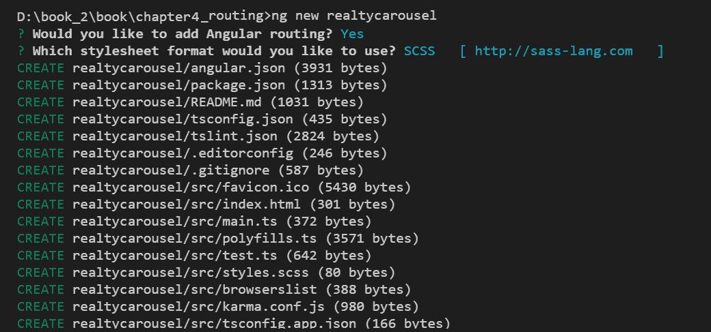
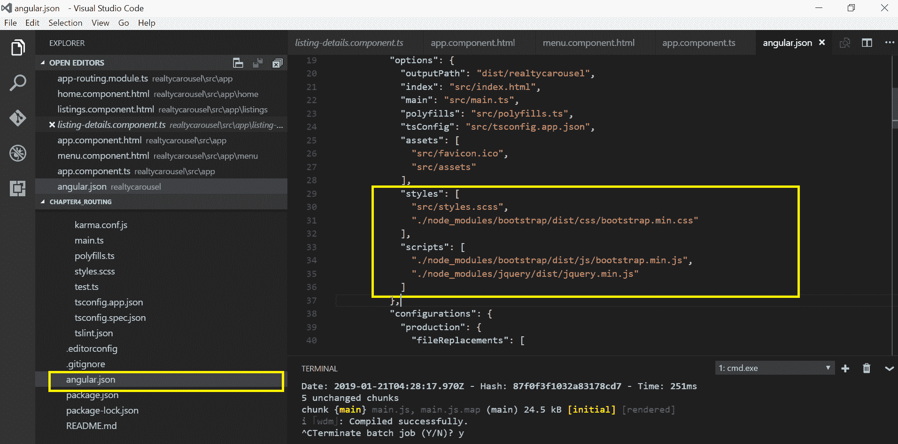
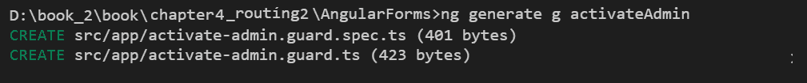
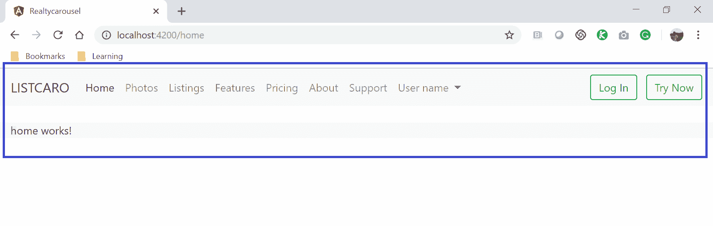

# 四、路由


前一章是一个怪物，但它需要给你两个崩溃的课程上的两个技术，你可能会使用，或应该绝对考虑使用，在你的 Web 开发项目（这是真实的，无论你的项目是否利用 Angular）。此外，[第 3 章](03.html)*Bootstrap-网格布局和组件*也在那里帮助为本书的其余部分搭建舞台。

相比之下，这一章要小得多，但它标志着我们进入这一领域的真正开始。从这一点开始的每一章，甚至是[第 12 章](12.html)、*集成后端数据服务*，其中主要关注的是在 Node 和 MongoDB 中构建后端服务，其中都包含 Angular 内容（具体来说，如何使用 Angular 的 HTTP 客户端以及如何将代码封装在 Angular 服务中）。

关于这一章，我想指出的另一点是，大多数关于 Angular 的书籍在介绍 Angular 模板和组件之前都没有介绍路由，这很好；但我们不会遵循这种方法。尽管布线和组件模板密不可分地联系在一起，这可能是大多数书籍在讨论组件之后再讨论布线的原因，但理解组件并不是理解布线的先决条件。

更一般地说，大多数编程书籍都会尝试提前呈现所有的材质和概念，然后在稍后的时间循环回来，以某种方式尝试并实现它们。这种方法的一个问题是，它与我们的大脑在吸收和内化新信息时的工作方式背道而驰。通常最好立即使用新信息，以小的增量步骤进行。

这本书的重点是尽可能的实用，尽快，以一种最大限度地保留和理解新材质的方式。因此，为了实现这一点，我们将在本书中一起构建示例应用，学习我们需要的主题，而不是之前。这意味着我们经常会实现一些尚未完全解释的事情。在我们实施它们的时候，或者在你的大脑准备好并寻找形成理解的模式之后，我们会向你解释它们。

所以，不要担心头朝下，这通常是最好的方式。我是你的向导，我会一直陪你到书的结尾。

以下是我们将在本章中共同讨论的内容：

*   为 Angular 应用定义什么是布线
*   使用 CLI 创建应用的外壳及其前几个组件
*   为我们的应用配置路由
*   查看路由重定向、参数化路由和路由防护
*   完成应用的路由配置
*   查看路由策略

有相当多的内容要覆盖（即使是像这一章这样的小章节），所以让我们开始吧！


# 什么是角形布线？


Angular 中的路由只是一组将请求的 URL 映射到组件的规则。这往往会让来自另一种有路由的技术的人感到困惑，特别是一种不是 SPA（即单页应用）框架的技术。让我解释一下。

Angular 应用只有一个页面（因此称为单页面应用），我们将在创建 Angular 应用时看到这一点。Angular 组件具有模板，这些模板是用于设计表示结构布局的标准 HTML 元素。正如我们将在[第 6 章](06.html)*建筑角组件*中看到的，它们也有样式。

正如本书第一章所提到的，Angular 应用可以被认为是组件树。这意味着组件可以包含其他组件，并且组件的嵌套可以根据应用的需要继续进行。

因此，尽管组件有模板（注意：一些 web 框架将网页称为模板），Angular 的路由将 URL 路径映射到组件，而不是网页或模板。当呈现所请求 URL 的组件的模板时（稍后我们将看到这是如何发生的），不仅呈现该组件的模板，而且还呈现所有嵌套组件的模板。Angular 的路由映射到的顶级组件可能包含其他子组件，而子组件又可以包含其他子组件，以此类推。这就是所谓的组件树。

在大多数情况下，Angular 应用中的数据从父组件流向其直接子组件。它不会从父组件流向其子组件。此外，数据不会向上流动。它是一个单向流，从父到子。我说*在很大程度上是*，因为有一些技术和库可以改变这种行为，例如，组件可以通过中介相互通信，我们将在本书后面介绍。然而，根据设计，在没有外部干预的情况下，数据从父代流向子代。

随着我们阅读本书，您将熟悉所有这些内容。在这一点上，为了理解路由，您需要理解的是 URL 映射到组件而不是页面，因为 Angular 应用只有一个页面。Angular 应用中唯一的页面是`index.html`页面，它位于应用目录中。在[第 6 章](06.html)*构建 Angular 组件*中，我们将看到默认组件是如何加载到`index.html`页面的。现在，让我们回到路由。


# 使用 CLI 创建应用外壳


这就是一切开始的地方。现在，我们将使用 CLI 创建应用的起点，以及将它们连接到路由配置所需的第一批组件。我们已经研究了如何安装 CLI，我们甚至一起创建了第一个 Angle 应用，尽管我们的 todo 应用很小，只是为了让我们在[第 1 章](01.html)、*快速入门*中重新开始。

如果您还没有安装 CLI，那么现在肯定要安装。一旦您完成了（希望您已经完成了），启动 CLI，让我们开始吧！

第一个任务是在您的机器上创建一个目录，您将在其中放置所有 Angular 项目。不要为示例应用创建目录，因为 CLI 将为您创建目录。只需在文件系统上创建一个文件夹，然后从命令行（如果您的操作系统是 Windows）或终端（如果您的操作系统是 Mac 或 Linux）导航到它。为了简洁起见，从这里开始，我将把它称为您的终端，把文件夹称为目录。

接下来，我们将使用 CLI 创建应用的框架（即根目录），以及 CLI 为我们创建的应用所需的所有附带文件和子目录。输入以下命令：

```ts
ng new realtycarousel 
```

**Note**: This will take about a minute to complete.

如果您看到 Project realtycarousel 成功创建。作为输出的最后一行，您现在应该有一个名为`realtycarousel`的目录，其中将包含我们的所有应用文件。

上述命令的输出显示在以下屏幕截图中：



现在让我们测试一下是否可以运行它。使用`cd`命令导航到您的`realtycarousel`目录：

```ts
cd realtycarousel
```

接下来，使用 CLI 的 server 命令启动 Angular 应用：

```ts
ng serve  
```

您应该看到一组输出到终端的线。如果其中一行类似于`*** NG Live Development* Server is listening on localhost:4200, open your browser on http://localhost:4200/ **`，而最后一行是`webpack: Compiled successfully`，则应打开浏览器并将其指向`http://localhost:4200`。

如果您看到一个带有 Angular 标志的页面，这意味着所有内容都设置正确。现在有一个空的 Angular 应用。

You can press *Ctrl* + *C* to stop the CLI's development server.

接下来，让我们添加几个组件，我们将在路由配置中引用这些组件。同样，现在不要担心组件。我们将在[第 6 章](06.html)、*建筑角组件*和[第 7 章](07.html)、*模板、指令和管道*中深入了解它们。

运行以下 CLI 命令列表，一次运行一个命令：

```ts
ng g c home
ng g c signup
ng g c login
ng g c logout
ng g c account
ng g c listings
ng g c createListing
ng g c editListing
ng g c previewListing
ng g c photos
ng g c uploadPhoto
ng g c editPhoto
ng g c previewPhoto
ng g c pageNotFound
```

第一个命令的输出如以下屏幕截图所示：


当我们创建所有其他组件时，应该会看到类似的输出。

我们现在有了我们需要的第一组组件。虽然他们的模板现在是空的，但这足以让我们为应用配置路由。

由于我们将在应用中使用 Bootstrap，比如它的导航栏和响应网格，所以我们需要安装 Bootstrap 及其依赖项。在[第 3 章](03.html)*Bootstrap-网格布局和组件*中，为了能够使用 Bootstrap，我们在`index.html`页面的标题中简单引用了一些 CDN URL。然而，我们现在将以不同的方式安装 Bootstrap，我们将使用`npm`。

You will need Node.js installed on your system in order to use the **node package manager** (**npm**).

要安装 Bootstrap、jQuery 和 Popper，请在终端中运行以下命令：

```ts
npm install bootstrap@4 jquery popper --save
```

我们已经安装了这些库，现在应该将它们包含在配置文件中，以便在整个应用中都可以使用它们。

打开`angular.json`文件，在相应的部分包含样式表和 JavaScript 文件，如下面的代码片段所示：

```ts
"styles": [
    "styles.css",
    "./node_modules/bootstrap/dist/css/bootstrap.min.css"
],
"scripts": [
    "../node_modules/jquery/dist/jquery.min.js",
    "./node_modules/bootstrap/dist/js/bootstrap.min.js"
] 
```

屏幕截图显示已编辑的`angular.json`文件：



准备就绪！

我们现在有了为应用设置路由所需的核心文件。我们还确保安装 Bootstrap，因为我们将在本章中为我们的应用创建导航栏。此外，我们的导航链接将包含 Angular 用于路由的特殊标记，这也是我们现在需要安装 Bootstrap 的另一个原因。

让我们使用 IDE 打开我们的项目（同样，如果您使用的是 Visual Studio 代码，这是最简单的，但是您可以使用您喜欢的 IDE），因此我们可以查看项目结构。此外，在下一节中，*完成我们的路由配置*，我们将对几个文件进行更改，以便进行设置，因此您希望能够轻松打开和编辑这些文件。

在 IDE 中打开项目后，导航到`app`目录，该目录位于`src`目录中。作为 Angular 开发者，我们将在`app`目录中花费绝大多数时间。在`app`目录中，您会发现许多文件都以*app*开头。这些文件构成了我们应用中的根组件（即应用组件），当我们来到[第 6 章](06.html)*构建 Angular 组件*时，我们将检查这些文件中的每个文件都做了什么，在这里您将非常熟悉 Angular 组件。您将在`app`目录中看到许多子目录，其中一个是我们刚才创建的每个组件的子目录，例如 about、account、home 等等。

记住，Angular 应用使用的语言是 TypeScript，这就是[T0]文件扩展名的含义。让我们卷起袖子，为应用配置路由。


# 第一件事-基本概念


在本节中，在我们开始向 Angular 应用添加路由之前，我们将快速接触 base 并对一些基本概念进行概述。在基本概念中，我们将学习`Base Href`、`RouterLink`和`RouterLinkActive`，在使用 Angular 路由时，我们需要在模板中实现这些。


# Base HREF


为了组成应用内部的链接，每个 Angular 应用都应该在父级定义`base href`。

打开 Angular CLI 生成的应用，查看`index.html`文件。我们将看到基础`href`定义为`/`，它解析为根层次结构或顶级层次结构。

以下屏幕截图显示了 Angular CLI 生成的默认基本`href`配置：


# RouterLink 和 RouterLink 处于活动状态


在[第 7 章](07.html)*模板、指令和管道*中，我们将详细了解组件、指令和模板。现在，请理解，就像 HTML5 中的锚元素和`href`属性一样，Angular 提供了一种绑定链接和 URL 资源的方法：

```ts
<nav>
 <a routerLink="/home" routerLinkActive="active">Home</a>
 <a routerLink="/listings" routerLinkActive="active">Listings</a>
</nav>
```

在前面的代码中，我们添加了两个链接。请注意，我们已经将`routerLink`属性添加到链接中，这将帮助我们分别绑定`/home`和`/listings`的值。

另外，请注意，我们添加了`routerLinkActive`属性，并将值指定为`active`。每当用户点击链接时，Angular 路由就会知道并激活它。有人称之为魔法！


# 为我们的应用配置路由


是时候将 Angular 路由添加到我们的应用中了。

我们有两个实施路由的选项：

*   我们可以使用 Angular CLI 在创建项目期间添加路由
*   或者，我们可以在应用中手动添加 Angular 路由

首先，让我们探索一种简单的方法，使用 Angular CLI 添加路由。

Angular CLI 为我们提供了向 Angular 应用添加路由功能的简单方法。生成新项目时，Angular CLI 将提示我们选择是否要向应用添加路由。

以下屏幕截图显示了 CLI 中显示的用于添加 Angular 布线的选项：


当我们选择在应用中添加路由选项时，我们正在使用 Angular CLI 创建文件、导入所需模块并创建路由的规则集。

现在，让我们手动将路由添加到项目中。让我们看看如何在应用中配置路由。

为了配置路由，我们需要遵循以下步骤：

1.  打开`app.module.ts`文件

2.  在文件顶部的`import`部分添加以下`import`语句：

```ts
import { NgModule } from '@angular/core';
import { Routes, RouterModule } from '@angular/router';
```

`RouterModule`包含路由服务和路由指令。
模块`Routes`玷污了 routes 类型（记住，TypeScript 在 JavaScript 中添加了变量类型）。

3.  在`app-routing.module.ts`文件中写入一些路由和规则集：

```ts
const appRoutes: Routes = [
  { path: ‘home’, component: HomeComponent },
  ...
  { path: ‘’, redirectTo: ‘/home’, pathMatch: ‘full’ },
  { path: ‘**’, component: PageNotFoundComponent  }
];
```

此代码仅显示三个映射：

*   `HomeComponent`的映射
*   重定向的映射
*   URL 请求的通配符或*全包*映射

第一个映射对象是最简单的情况。URL 路径（即域名后面的 URL 部分）映射到一个组件，没有任何参数（注意路由可以参数化，我们将在稍后的*参数化路由*部分中介绍）。此路由所做的是指示 Angular 在请求 URL 中的路径结束于主页时呈现`HomeComponent`模板。

第二个映射对象是如何获取一个路径以重定向到另一个 URL，从而路由的示例。这通常称为路由重定向。在我们的例子中，路径是一个空字符串，这意味着当浏览器位置栏中只输入域名时，Angular 的路由机制会将请求重定向（即更改 URL 中的路径）到`/home`。由于存在一个处理`/home`的映射对象，它将被触发，从而呈现`HomeComponent`模板。对于仅输入域名的网站来说，这是一种常见做法，通常会将用户带到主页或索引网页。在我们的例子中，因为我们正在构建一个 SPA（Angular web 应用就是这样），所以没有主页，而是一个主页组件，这意味着主页组件的模板被呈现以模拟主页。

第三个映射对象是通配符匹配的示例，并作为最后一个映射对象放置。Angular 的路由机制解析请求的 URL 时，会自上而下将其与映射对象进行比较。如果 URL 与任何映射规则集都不匹配，则会触发最后一个映射对象。这对于我们的应用意味着，如果没有匹配项，`PageNotFoundComponent`模板将被呈现。

4.  现在是时候导入我们的`appRoutes`；这就是我们讲述路线的方式。`appRoutes`是一个常数，用于保存我们的路线映射，所以让我们创建下一个：

```ts
imports: [
 BrowserModule,
 RouterModule.forRoot(appRoutes)
]
```

5.  最后，我们需要将`app-routing.module.ts`文件导入`app.module.ts`。

The complete code listing of the `app-routing.module.ts` file is in the *Completing our route configuration* section later in this chapter.

我们已将路线直接添加到`app.module.ts`文件中。始终将路由配置文件单独分开是一种很好的做法。更好的是，在创建项目时，始终使用 Angular CLI 直接添加路由。

就这样,；我们已经在我们的项目中实现了路由。在下一节中，我们将详细了解如何添加更多路由、为路由添加参数以及创建子路由。


# 参数化路由


参数化路由是具有可变值作为 URL 路径一部分的路由。例如，一个常见的例子是，我们通过 ID 引用某个对象，如下所示：

*   `/listing/23`（显示我们不动产现场的 23 处房产）
*   `/listing/55`（显示我们不动产现场的财产#55）
*   `/listing/721`（显示我们不动产现场的物业#721）

显然，必须配置数百条可能的路由不仅繁琐、低效且容易出错，而且这些路由的维护（即，在财产清单发生变化时删除路由并添加新路由）将非常麻烦。

幸运的是，Angular 允许参数化路由，这可以解决这些问题

查看以下代码段中更新的路由：

```ts
const routes: Routes = [
{ path: 'home'},
{ path: 'listings/:id', component: ListingDetailsComponent },
{ path: ‘’, redirectTo: ‘/home’, pathMatch: ‘full’ },
{ path: ‘**’, component: PageNotFoundComponent  }
];
```

如果您仔细看一下，在前面的路由中，我们又添加了一条路由，它捕获了清单的`id`，并且我们还将其映射到`ListingDetailsComponent `组件。

换句话说，我们也可以说我们已经为列表创建了一个通用模板，并且基于运行时传递的动态值，相应的数据将由组件显示。

那很容易。如果我们有一个更复杂的场景，涉及到创建子路由，该怎么办？继续读下去。


# 子路径


到目前为止，我们创建的路由是非常简单和直接的用例。在复杂的应用中，我们需要使用深度链接，它指的是在多个级别下查找链接

让我们来看看一些例子：

*   `/home/listings`（显示家中的物品）
*   `/listing/55/details`（显示清单 55 的详细信息）
*   `/listing/721/facilities`（显示清单 721 的设施）

在那里，儿童路线对我们来说非常方便。

在以下示例中，我们正在主路由路径内创建子路由：

```ts
const routes: Routes = [
{ path: 'home',
 component: HomeComponent,
 children: [
 { path: 'listings',
    component: ListingsComponent}
 ]
},
{path: 'listings/:id', component: ListingDetailsComponent },
{path: '', redirectTo: '/home', pathMatch: 'full'}
];
```

在前面的代码中，我们为*主*路径定义`children`，并且再次指定`path`和`component`，这将对应于子路由路径。

好的。这是好东西。

如果我们想在用户访问特定路由之前添加一些验证，该怎么办？像俱乐部外的保镖？那个保镖叫路线守卫。


# 路障


与大多数 web 应用一样，每个人都可以访问资源（即页面/组件模板）（如**欢迎页面**、**定价页面**、**关于我们的**页面和其他信息页面），还有一些其他资源只能由授权用户访问（如仪表板页面和帐户页面）。这就是路由防护的作用，它是 Angular 防止未经授权的用户访问我们应用受保护部分的方法。当有人试图访问为授权用户保留的 URL 时，他通常会被重定向到应用的公共主页。

在传统的 web 应用中，检查和验证是在服务器端代码中实现的，实际上没有选项来验证用户是否可以在客户端访问页面。但是使用 Angular route guard，我们可以在客户端实现检查，甚至不需要访问后端服务。

以下是我们可以在应用中使用的各种类型的防护装置，以增强授权的安全性：

*   `CanActivate`：帮助检查路由是否可以激活
*   `CanActivateChild`：帮助检查路由是否可以访问子路由
*   `CanDeactivate`：帮助检查路由是否可以停用
*   `Resolve`：帮助在激活任何路由之前检索路由数据
*   `CanLoad`：验证用户是否可以激活正在延迟加载的模块

在我们开始动手练习之前，我想给大家简要介绍一下 Angular 路线防护装置，比如在哪里使用它们，如何使用它们，返回类型是什么，等等。路线守卫总是作为服务注入（也就是说，我们有[T0]，我们需要注入它）。防护装置总是返回一个布尔值，`true`或`false`。我们可以让我们的路径卫兵返回可观察到的或承诺，这些在内部被解析为布尔值

我们将继续研究并扩展上一节中创建的示例。我们将添加一个新组件，并将其命名为**积垢**。作为用户，当您尝试访问`crud`路由时，我们将检查路由何时返回`true`，我们将允许用户导航并查看模板；否则，应用将抛出错误提示。

让我们深入研究一下实现路由保护的代码。正如我们学习了如何生成组件或服务一样，我们可以使用[T0]命令生成路由保护。在终端中，运行以下命令：

```ts
ng generate g activateAdmin
```

我们刚刚生成了一个名为`activateAdmin`的新路由守卫。前面命令的输出显示在此处：



让我们来看看由角 CLI 生成的文件。在编辑器中打开`activate-admin.guard.ts`文件。查看文件中生成的默认代码：

```ts
import { Injectable } from '@angular/core';
import { CanActivate, ActivatedRouteSnapshot, RouterStateSnapshot } from '@angular/router';
import { Observable } from 'rxjs';

@Injectable({
  providedIn: 'root'
})
export class ActivateAdminGuard implements CanActivate {
  canActivate(
    next: ActivatedRouteSnapshot,
    state: RouterStateSnapshot): Observable<boolean> | Promise<boolean> 
     | boolean {
    return true;
  }
}
```

前几行只是从 Angular router 导入所需的`CanActivate`、
`ActivatedRouteSnapShot`和`RouterStateSnapshot`模块。接下来，我们知道由于路由防护是可注入的，所以通过使用`@injectable`
装饰符，我们通知 Angular 将其注入根中。我们正在创建一个类`ActivatedAdminGuard`，其中已经创建了一个名为`canActivate`的方法。请注意，此方法必须返回一个布尔值，`true`或`false`。我们已经创建了路由保护，现在让我们在`app-routing.module.ts`文件中创建一个路由。

查看`app-routing.module.ts`文件的更新代码：

```ts
import { NgModule } from '@angular/core';
import { Routes, RouterModule } from '@angular/router';
import { CrudComponent } from './crud/crud.component';
import { LoginComponent } from './login/login.component';
import { RegisterComponent } from './register/register.component';
import {ActivateAdminGuard } from './activate-admin.guard';

const routes: Routes = [
    { path: 'login', component: LoginComponent },
    { path: 'register', component: RegisterComponent },
    { path: 'crud', component: CrudComponent, canActivate:[ActivateAdminGuard] }

    ];

@NgModule({
    imports: [RouterModule.forRoot(routes)],
    exports: [RouterModule]
})
export class AppRoutingModule { }
```

注意，在路由中，我们增加了`canActivate`接口，对于我们的`crud`路径，当我们尝试启动`crud`路由时，由于`canActivate`方法返回`true`，用户将能够看到组件模板。

现在，继续并将值设置为`false`并了解发生了什么。

If you see the application's routing go back to `base href`, don't be surprised.


# 完成我们的路线配置


如前几节所承诺的，我将分享`AppModule`的全部源代码，包括路由配置。下面的代码可能看起来很长或者很吓人，但是相信我，它实际上非常简单和直接

在学习本章的过程中，我们生成了许多组件并创建了它们的路径。我们只是导入组件并用它们的路径更新`appRoutes`。就这样。我保证。

以下是`app.module.ts`文件的完整列表：

```ts
import { BrowserModule } from '@angular/platform-browser';
import { NgModule } from '@angular/core';
import { RouterModule, Routes } from '@angular/router';
import { AppComponent } from './app.component';
import { HomeComponent } from './home/home.component';
import { SignupComponent } from './signup/signup.component';
import { LoginComponent } from './login/login.component';
import { ListingsComponent } from './listings/listings.component';
import {ListingDetailsComponent } from './listing-deatails/listing-details.component';
import { EditListingComponent } from './edit-listing/edit-listing.component';
import { PreviewListingComponent } from './preview-listing/preview-listing.component';
import { PhotosComponent } from './photos/photos.component';
import { UploadPhotoComponent } from './upload-photo/upload-photo.component';
import { EditPhotoComponent } from './edit-photo/edit-photo.component';
import { PreviewPhotoComponent } from './preview-photo/preview-photo.component';
import { PageNotFoundComponent } from './page-not-found/page-not-found.component';
import { FeaturesComponent } from './features/features.component';
import { PricingComponent } from './pricing/pricing.component';
import { AboutComponent } from './about/about.component';
import { SupportComponent } from './support/support.component';
import { AccountComponent } from './account/account.component';
import { LogoutComponent } from './logout/logout.component';

const appRoutes: Routes = [
 { path: 'home', component: HomeComponent },
 { path: '', redirectTo: '/home', pathMatch: 'full' },
 { path: 'signup', component: SignupComponent },
 { path: 'login', component: LoginComponent },
 { path: 'logout', component: LogoutComponent },
 { path: 'account', component: AccountComponent },
 { path: 'features', component: FeaturesComponent },
 { path: 'pricing', component: PricingComponent },
 { path: 'about', component: AboutComponent },
 { path: 'support', component: SupportComponent },
 { path: 'listings', component: ListingsComponent },
 { path: 'listing/:id', component: ListingDetailsComponent },
 { path: 'listing/edit', component: EditListingComponent },
 { path: 'listing/preview', component: PreviewListingComponent },
 { path: 'photos', component: PhotosComponent },
 { path: 'photo/upload', component: UploadPhotoComponent },
 { path: 'photo/edit', component: EditPhotoComponent },
 { path: 'photo/preview', component: PreviewPhotoComponent },
 { path: '**', component: PageNotFoundComponent }
];
@NgModule({
 declarations: [
 AppComponent,
 HomeComponent,
 SignupComponent,
 LoginComponent,
 ListingsComponent,
 CreateListingComponent,
 EditListingComponent,
 PreviewListingComponent,
 PhotosComponent,
 UploadPhotoComponent,
 EditPhotoComponent,
 PreviewPhotoComponent,
 PageNotFoundComponent,
 FeaturesComponent,
 PricingComponent,
 AboutComponent,
 SupportComponent,
 AccountComponent,
 LogoutComponent
 ],
imports: [
 BrowserModule,
 RouterModule.forRoot(appRoutes)
],
providers: [],
bootstrap: [AppComponent]
})
export class AppModule { }
```

我们刚刚创建了我们的路由，但是我们需要通过创建一些链接来更新模板文件，这些链接将具有上述定义路由的路径。

在任何应用中，最重要的一点是设计良好的菜单，它有助于 Bootstrap 用户并增加良好的用户体验。

在下一节中，我们将使用 Bootstrap`nav`组件为我们的应用设计一个菜单。


# Bootstrap 导航栏和路由链接指令


在结束本章之前，我们先回顾一下，为我们的应用创建 Bootstrap 导航栏。如果您还记得上一章[第 3 章](03.html)*Bootstrap-网格布局和组件*，我已经提到，我们将在本章介绍 Bootstrap 导航组件。这样做的原因是，我们将通过使用路由指令作为菜单链接，将导航栏与路由绑定在一起，因此最好在本章中介绍，因为它属于路由领域。

在上一节中，我给了您家庭作业，让您在浏览器栏中手动输入路由路径 URL，以查看路由是否正常工作。在本节中，我们将所有路由 URL 添加到 Bootstrap`navbar`组件中，以便用户只需单击并导航，而无需手动键入。

在本章开始时，我们简要介绍了`routerLink`和`routerLinkActive`。现在是时候看看他们的行动了。

让我们来看看 Apple T0 文件，它是我们的应用组件的模板。如果您熟悉 ASP.NET 中的母版页或 Rails 中的布局页的概念，那么可以将 App 组件模板视为 Angular 应用的等效项。这是因为应用组件是构成应用的组件树中的顶级组件。我之所以提出主布局的概念，是因为服务器通过在布局页面中呈现调用的页面来保留插入到主布局中的任何 HTML。虽然 Angular 并不是这样，因为它不是服务器端技术，但它在概念上是正确的。

我的意思是，无论我们在应用组件的模板中插入什么 HTML，当其他组件在其中呈现时，它通常仍然可见。这使得应用组件模板成为放置导航栏的理想位置，因为无论我们的路由规则集为用户请求的给定 URL 选择呈现什么组件模板，它都将始终可见。

下面是我们的`app.component.html`文件的代码清单：

```ts
<div>
 <nav class="navbar navbar-expand-lg navbar-light bg-light">
 <a class="navbar-brand" href="/">LISTCARO</a>
 <button class="navbar-toggler" type="button" data-toggle="collapse" 
   data-target="#navbarSupportedContent" 
   aria-controls="navbarSupportedContent" aria-expanded="false" 
   aria-label="Toggle navigation">
 <span class="navbar-toggler-icon"></span>
 </button>
 <div class="collapse navbar-collapse" id="navbarSupportedContent">
 <ul class="navbar-nav mr-auto">
 <li routerLinkActive="active" class="nav-item"> 
 <a routerLink="/" class="nav-link">Home</a>
 </li>
 <li routerLinkActive="active" class="nav-item"> 
 <a routerLink="photos" class="nav-link">Photos</a>
 </li> 
 <li routerLinkActive="active" class="nav-item"> 
 <a routerLink="listings" class="nav-link">Listings</a>
 </li> 
 <li routerLinkActive="active" class="nav-item"> 
 <a routerLink="features" class="nav-link">Features</a>
 </li>
 <li routerLinkActive="active" class="nav-item"> 
 <a routerLink="pricing" class="nav-link">Pricing</a>
 </li>
 <li routerLinkActive="active" class="nav-item"> 
 <a routerLink="about" class="nav-link">About</a>
 </li>
 <li routerLinkActive="active" class="nav-item"> 
 <a routerLink="support" class="nav-link">Support</a>
 </li>
 <li class="nav-item dropdown">
 <a class="nav-link dropdown-toggle" href="#" id="navbarDropdown" 
   role="button" data-toggle="dropdown" aria-haspopup="true" 
   aria-expanded="false">
 User name
 </a>
 <div class="dropdown-menu" aria-labelledby="navbarDropdown">
 <a routerLink="account" class="dropdown-item">Account</a>
 <div class="dropdown-divider"></div>
 <a routerLink="logout" class="dropdown-item">Log out</a>
 </div>
 </li>
 </ul>
 <form class="form-inline my-2 my-lg-0">
 <button class="btn btn-outline-success my-2 my-sm-0" type="submit">
   Log In</button>
 <button class="btn btn-outline-success my-2 my-sm-0" type="submit">
   Try Now</button>
 </form>
 </div>
 </nav>
 <br />
 <router-outlet></router-outlet>
</div>
```

深呼吸，让我们分析前面的代码行。我们使用的是 Angular 指令和属性，以及 Bootstrap 内置类。那么，让我们开始：

*   我们正在创建 Bootstrap 中提供的菜单`navbar`元素`<nav>`，并分配内置`navbar`类`navbar-expand-lg navbar-light bg-light`。
*   我们还使用`navbar-brand`类为应用的徽标创建元素和占位符。
*   使用`navbar-nav`类，我们定义了一组链接。
*   我们正在使用锚定标记`<a>`添加一些链接，并分配`nav-link`类，该类将在菜单部分中形成链接。
*   我们还使用`dropdown-menu`类创建了一个下拉菜单，并使用`dropdown-item`将项目添加到菜单中。
*   对于 Angular 指令和属性，我们使用`routerLink`和`routerLinkActive`，正如*第一件事-基本概念*一节所述，`routerLink`属性用于绑定链接的 URL 资源。
*   为了突出显示活动链接，我们使用了`routerLinkActive`属性。您会注意到，对于所有链接，我们已将属性值指定为`active`。运行时 Angular 将检测单击的链接并将其高亮显示。

太棒了，到目前为止做得很好。我们已经为我们的应用实现了一个`nav`菜单。我们离看到我们的应用投入使用只有一步之遥。


# 指定用于呈现组件模板的位置


我们需要告诉 Angular，我们希望在何处显示路由规则集中映射组件的组件模板。对于我们的应用，我们希望在导航栏下呈现路由调用的组件。

Angular 对此有一个指令`<router-outlet>`，该指令在`RouterModule`中定义。

在为创建 Bootstrap 导航栏而添加的 HTML 下，添加以下 HTML 行：

```ts
<router-outlet></router-outlet>
```

这就是告诉 Angular 路由服务调用的组件应该呈现在哪里所需的全部内容。


# 运行我们的应用


现在，我们已经完成了应用的路由配置，让我们快速了解一下。

还记得如何构建和启动 Angular 应用吗？正当使用 CLI 并发出如下的`serve`命令：

```ts
ng serve
```

Make sure you are in the application's root folder when you do this.

启动应用并一次性将浏览器打开到 localhost 的快捷方式是发出带有`open`选项的`ng server`命令，如下所示：

```ts
ng serve --open
```

您应该看到，浏览器位置栏中的 URL 指向`http://localhost:4200/home`，这是工作中的 Angular 路由。带有`open`选项的`ng serve`命令发出了`http://localhost:4200`URL，但这触发了到`/home`的路由重定向。很酷吧？

当我们运行应用时，我们应该看到以下屏幕截图中显示的输出：



在下一节中，我们将了解一些可以在应用中实施的路由策略。


# 路由策略


Angular 中有两种客户端路由策略：

*   `HashLocationStrategy`（通常用于客户端目的，如锚定标签）
*   `PathLocationStrategy`（这是默认值）

要启用`HashLocationStrategy`，在`app.module.ts`文件中，我们有`RouterModule.forRoot(appRoutes)`，添加`{ useHash: true }`作为`forRoot`方法中的第二个参数。它应该是这样的：

```ts
RouterModule.forRoot(appRoutes, { useHash: true })
```

带有[T0]的 URL 在其路径中有一个哈希符号（#）。以下是一个例子：

\12304；T0]http://madeuplistofpeople.com/superheros#cloudman \12304；T1]

前面的 URL 表示对[的 get 请求 http://madeuplistofpeople.com/superheros](http://madeuplistofpeople.com/superheros) 发送到服务器。

Everything from the hash onward is not part of the request, because the browser only sends everything in the browser's location bar, to the left of the hash sign, to the server.

URL 的`#cloudman`部分仅由客户端使用，通常，浏览器使用该部分自动向下滚动到页面上的锚定标记（在这种情况下，滚动到具有`name`属性`cloudman`的锚定标记）。

`HashLocationStrategy`策略的一个用途是使用哈希符号存储应用状态，这便于为 SPA 实现客户端路由。

举个例子，考虑下面的 URL：

*   \12304；T0]http://madeuplistofpeople.com/#/about \12304；T1]
*   \12304；T0]http://madeuplistofpeople.com/#/search \12304；T1]
*   \12304；T0]http://madeuplistofpeople.com/#/contactus \12304；T1]\12304；T2]

此 URL 模式非常适合 SPA，因为只有[请求才会发送到服务器 http://madeuplistofpeople.com](http://madeuplistofpeople.com) ，本质上是一页。客户端将以编程方式处理不同的散列片段（即，从散列符号到散列符号右侧的末尾）。

总结本节，`PathLocationStrategy`的一个重要概念是 Angular 利用了名为 pushstate 的 HTML5 历史 API。我们可以使用 pushstate API 更改 URL，同时抑制浏览器向服务器发送新请求（即更改后的 URL）的传统默认操作。这使得实现客户端路由而无需使用散列符号（#）成为可能。这就是为什么它是 Angular 中默认的客户端路由策略。

然而，也有不利的一面。如果要刷新浏览器，将向服务器发出请求，这将使用服务器返回的任何内容重置应用。换句话说，除非您实施了本地存储策略，否则应用将失去其状态。


# 总结


这是一个相当短的章节，但我们仍然涵盖了很多领域。在本章中，我们为应用创建了框架，包括创建路由映射到的组件。然后，我们一步一步地为应用配置路由。这包括导入两个必需的模块（即，`RoutingModule`和`Routes`），以映射对象的形式对路由规则集进行编码，并指定在何处呈现路由组件。

我们还将 Bootstrap 安装并集成到应用中，并在根组件的模板中创建了 Bootstrap 导航栏。然后我们了解了如何让 Angular 了解已安装的节点包，特别是 Bootstrap 和 jQuery，因为这就是我们安装 Bootstrap 及其依赖项（即 jQuery 和 Popper）的方式。

虽然我们在本章中没有使用参数化路由和路由保护，但我们在这里提到了它们，因为我们将在本书后面的[第 12 章](12.html)、*集成后端数据服务*和*[第 14 章](14.html)、高级 Angular 主题*中使用它们本着这本书的精神，在我们需要的时候而不是之前讨论问题，我们将把他们的演示推迟到适当的时候。

为了结束本章，我们研究了 Angular 允许我们选择的两种客户端路由策略。

我们在本章中反复提到了*组件*这个词，因为路由将 URL 路径映射到组件。我们甚至使用 CLI 创建了几个组件，但我们没有花时间了解组件。这很好，因为正如前面提到的，您不需要为了理解路由而理解组件。现在我们已经有了路由，我们将在前面的章节中查看组件。但就在我们这么做之前，还有另外一个简短的章节，[第 5 章](05.html)*Flex layout–Angular 的响应式布局引擎*，我们将快速介绍。这是一个有点奇怪的章节，因为 Flex 布局是 Bootstrap 的响应网格的替代品，因此，构建 Angular 应用根本不需要它。不过，我想你可能会感兴趣。话虽如此，让我们把注意力转向 Flex 布局。