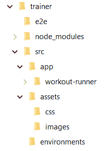
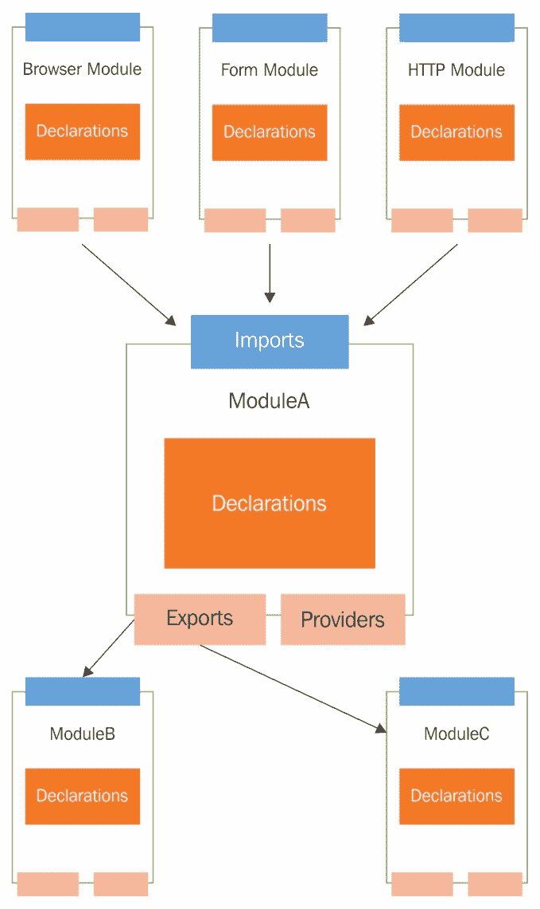
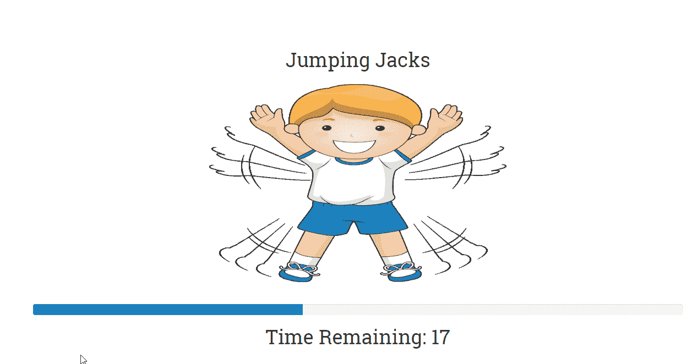
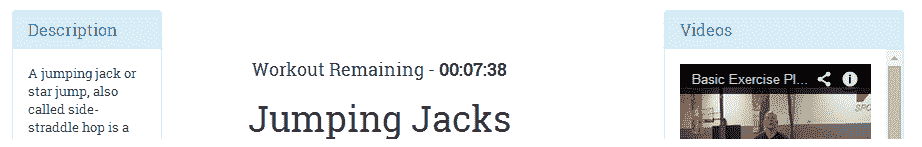
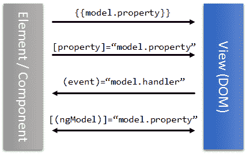

# 一、构建我们的第一个应用——7 分钟训练

我们将在 Angular 中构建一个新的应用，在此过程中，我们将更加熟悉该框架。该应用还将帮助我们探索 Angular 的一些新功能。

本章将介绍的主题包括：

*   **7 分钟锻炼问题描述**：我们在本章中详细介绍了我们构建的应用的功能。
*   **代码组织**：对于我们的第一个真实应用，我们将尝试解释如何组织代码，特别是Angular代码。
*   **设计模型**：我们的应用的构建模块之一就是它的模型。我们根据应用的需求设计应用模型。
*   **了解数据绑定基础设施**：在构建*7 分钟训练*视图的同时，我们将了解框架的数据绑定能力，包括*属性*、*属性*、*类*、*风格*和*事件*绑定。
*   **探索Angular平台指令**：我们将介绍的指令有`ngFor`、`ngIf`、`ngClass`、`ngStyle`和`ngSwitch`。

*   **与输入属性的跨组件通信**：在构建嵌套组件时，我们将了解如何使用输入属性将数据从父组件传递到其子组件。
*   **与事件的跨组件通信**：Angular组件可以订阅和引发事件。我们在 Angular 中介绍了事件绑定支持。
*   **角管道**：角管道提供了一种格式化视图内容的机制。我们探索了一些标准的Angular管道，并构建了我们自己的管道，以支持从秒到 hh:mm:ss 的转换。

让我们开始吧！我们要做的第一件事是定义我们的*7 分钟锻炼*应用。

# 什么是 7 分钟锻炼？

我们希望读这本书的每个人都身体健康。因此，这本书应该有双重目的；它不仅能刺激你的灰质，还能促使你注意自己的身体健康。还有什么比构建一个针对身体健康的应用更好的方法呢！

*7 分钟锻炼*是一款运动/锻炼应用，要求我们在 7 分钟的时间跨度内快速连续进行 12 次锻炼。*7 分钟锻炼*由于其一口大小的长度和巨大的益处而变得相当流行。我们无法证实或反驳这些说法，但做任何形式的剧烈运动总比什么都不做要好。如果您有兴趣了解更多有关训练的信息，请查看[http://well.blogs.nytimes.com/2013/05/09/the-scientific-7-minute-workout/](http://well.blogs.nytimes.com/2013/05/09/the-scientific-7-minute-workout/) 。

该应用的技术细节包括执行一组 12 个练习，每个练习花费 30 秒。在开始下一个练习之前，先休息一段时间。对于我们正在构建的应用，我们将每个应用休息 10 秒。所以，总的持续时间是 7 分钟多一点。

在本章末尾，我们将准备好*7 分钟锻炼*应用，该应用将如下所示：


The 7 Minute Workout app

# 下载代码库

此应用的代码可从 GitHub 网站下载（[https://github.com/chandermani/angular6byexample](https://github.com/chandermani/angular6byexample) 专为本书而设。由于我们正在以增量方式构建应用，因此我们创建了**多个检查点**，这些检查点映射到**GitHub 分支**，例如`checkpoint2.1`、`checkpoint2.2`等等。在叙述过程中，我们将突出该分支以供参考。这些分支将包含在该时间点之前在应用上完成的工作。

The *7 Minute Workout* code is available in the repository folder named `trainer`.

那么，让我们开始吧！

# 设置构建

请记住，我们正在构建一个浏览器仍然缺乏支持的现代平台。因此，在 HTML 中直接引用脚本文件是不可能的（虽然很常见，但这是一种过时的方法，无论如何我们都应该避免）。浏览器不理解**类型脚本**；这意味着必须有一个将用 TypeScript 编写的代码转换为标准的**JavaScript（ES5）**的过程。因此，为任何 Angular 应用建立一个构建变得非常必要。由于 Angular 的日益普及，我们从不缺少选择。

如果您是在 web 堆栈上工作的前端开发人员，则无法避免**Node.js**。这是 web/JavaScript 开发中使用最广泛的平台。所以，猜测大部分的Angular构建解决方案都是由 Node 支持的并没有什么好处。像**Grunt**、**Gulp**、**JSPM**和**webpack**这样的包是任何构建系统最常见的构建块。

Since we too are building on the Node.js platform, install Node.js before starting.

对于本书和本示例应用，我们认可**Angular CLI**（[http://bit.ly/ng6be-angular-cli](http://bit.ly/ng6be-angular-cli) ）。作为一个命令行工具，它有一个构建系统和一个脚手架工具，极大地简化了 Angular 的开发工作流程。它很受欢迎，易于设置，易于管理，并且几乎支持现代构建系统应该具备的所有功能。稍后再谈。

与任何成熟的框架一样，Angular CLI 不是 web 上唯一的选项。社区创建的一些著名入门网站和构建设置如下：

| **起始站点** | **位置** |
| `angular2-webpack-starter` | [http://bit.ly/ng2webpack](http://bit.ly/ng2webpack) |
| `angular-seed` | [https://github.com/mgechev/angular-seed](https://github.com/mgechev/angular-seed) |

让我们从安装 Angular CLI 开始。在命令行上，键入以下内容：

```ts
npm i -g @angular/cli
```

一旦安装，Angular CLI 将向我们的执行环境添加一个新命令`ng`。要从命令行创建新的Angular项目，请运行以下命令：

```ts
ng new PROJECT-NAME
```

这将生成一个文件夹结构，其中包含一组文件、一个样板应用和一个预配置的构建系统。要从命令行运行应用，请执行以下操作：

```ts
ng serve --open
```

你可以看到一个基本的Angular应用在行动！

对于我们的*7 分钟锻炼*应用，我们将从一个基于`ng new`生成的项目结构的版本开始，而不是从头开始，只需稍加修改。从以下步骤开始：

Curious about what the default project includes? Go ahead and run `ng new PROJECT-NAME`. Look at the generated content structure and the Angular CLI documentation to get an idea of what's part of a default setup.

1.  从[下载此应用的基本版本 http://bit.ly/ngbe-base](http://bit.ly/ngbe-base) 并将其解压缩到您机器上的某个位置。如果您熟悉 Git 的工作原理，只需克隆存储库并查看`base`分支：

```ts
git checkout base
```

此代码是我们应用的起点。

2.  从命令行导航到`trainer`文件夹，从命令行执行`npm install`命令，为我们的应用安装**包依赖项**。

 **Packages** in the Node.js world are third-party libraries (such as Angular for our app) that are either used by the app or support the app's building process. **npm** is a command-line tool for pulling these packages from a remote repository.

3.  一旦 npm 从 npm 商店中提取应用依赖项，我们就准备好构建和运行应用了。在命令行中，输入以下命令：

```ts
    ng serve --open
```

这将编译并运行应用。如果构建过程进展顺利，默认浏览器窗口/选项卡将打开一个基本的应用页面（`http://localhost:4200/`。我们都准备好开始在 Angular 中开发我们的应用了！

但在此之前，我们有兴趣了解更多关于 Angular CLI 以及我们在 Angular CLI 生成的默认项目模板上所做的定制。

# 角型 CLI

**Angular CLI**旨在标准化和简化 Angular 应用的开发和部署工作流。正如文件所示：

"The Angular CLI makes it easy to create an application that already works, right out of the box. It already follows our best practices!"

它包括：

*   基于**网页**的构建系统
*   一个**脚手架工具**，用于生成所有标准Angular工件，包括模块、指令、组件和管道
*   遵守**角型导轨**（[http://bit.ly/ngbe-styleguide](http://bit.ly/ngbe-styleguide) ），确保我们对各种形状和规模的项目采用社区驱动的标准

You may have never heard the term style guide, or may not understand its significance. A style guide in any technology is a set of guidelines that help us organize and write code that is easy to develop, maintain, and extend. To understand and appreciate Angular's own style guide, some familiarity with the framework itself is desirable, and we have started that journey.

*   有针对性的**短绒；**Angular CLI 与**编码器**（[集成 http://bit.ly/ngbe-codelyzer](http://bit.ly/ngbe-codelyzer) ），一种**静态代码分析工具**，它根据一组规则验证我们的 Angular 代码，以确保我们编写的代码符合 Angular style guide 中规定的标准
*   预配置的**单元**和**端到端**（**e2e**测试框架

还有更多！

想象一下，如果我们必须手动完成这一切！陡峭的学习曲线很快就会压倒我们。谢天谢地，我们不必处理它，它是为我们做的。

The Angular CLI build setup is based on webpack, but it does not expose the underlying webpack configuration; this is intentional. The Angular team wanted to shield developers from the complexities and internal workings of webpack. The ultimate aim of Angular CLI is to eliminate any entry level barriers and make setting up and running Angular code simple.
It doesn't mean Angular CLI is not configurable. There is a *config file* (`angular.json`) that we can use to alter the build setup. We will not cover that here. Check the configuration file for 7 Minute Workout and read the documentation here: [http://bit.ly/ng6be-angular-cli-config](http://bit.ly/ng6be-angular-cli-config).

我们对默认生成的项目模板所做的调整如下：

*   在`style.css`文件中引用了引导 CSS。
*   升级了一些 npm 库版本。
*   将生成代码的前缀配置从`app`更改为使用`abe`（示例为 Angular 的缩写）。通过此更改，我们所有的组件和指令选择器的前缀将由`app`改为`abe`。检查`app.component.ts`；`selector`是`abe-root`而不是`app-root`。

关于 Angular CLI 和构建的主题，我们在继续之前应该了解一些内容。

*我们编写的打字脚本代码会发生什么变化？*

# 代码传输

众所周知，浏览器只使用 JavaScript，它们不理解 TypeScript。因此，我们需要一种机制将我们的 TypeScript 代码转换为纯 JavaScript（**ES5**是我们最安全的选择）。**类型脚本编译器**完成这项工作。编译器获取 TypeScript 代码并将其转换为 JavaScript。这个过程通常被称为**transpiling**，由于 TypeScript 编译器执行此操作，因此称为**transpiler**。

JavaScript as a language has evolved over the years with every new version adding new features/capabilities to the language. The latest avatar, ES2015, succeeds ES5 and is a major update to the language. While released in June 2015, some of the older browsers still lack support for the ES2015 flavor, of JavaScript making its adoption a challenge.
When transpiling code from TypeScript to JavaScript, we can specify the flavor of JavaScript to use. As mentioned earlier, ES5 is our safest bet, but if we plan to work with only the latest and greatest browsers, go for ES2015\. For 7 Minute Workout, our code to transpile to is ES5 format. We set this TypeScript compiler configuration in `tsconfig.json` (see the `target` property).

有趣的是，透明可以发生在构建/编译时和运行时：

*   **构建时透明**：作为构建过程的一部分，透明将脚本文件（在本例中为 TypeScript`.ts`文件）编译成纯 JavaScript。Angular CLI 执行构建时透明。
*   **运行时透明**：运行时在浏览器中发生。我们直接引用 TypeScript 文件（本例中为`.ts`，TypeScript 编译器预先加载到浏览器中，动态编译这些脚本文件。这是一个仅适用于小示例/代码段的可行设置，因为加载 transpiler 和动态传输代码会带来额外的性能开销。

传输过程不限于打字脚本。每一种面向网络的语言，如**CoffeeScript**、**ES2015**（是 JavaScript 本身！）或任何其他浏览器无法理解的语言，都需要翻译。大多数语言都有 Transpiler，最突出的语言（打字脚本除外）是**tracuer**和**babel。**

Angular CLI 构建系统负责设置 TypeScript 编译器，并设置文件监视程序，以便在每次更改 TypeScript 文件时重新编译代码。

If you are new to TypeScript, remember that TypeScript does not depend on Angular; in fact, Angular has been built on TypeScript. I highly recommend that you look at the official documentation on TypeScript ([https://www.typescriptlang.org/](https://www.typescriptlang.org/)) and learn the language outside the realms of Angular.

让我们回到我们正在构建的应用，开始探索代码设置。

# 组织代码

Angular CLI 的优点是，它规定了一种适用于各种规模的应用的代码组织结构。以下是当前代码组织的外观：



*   `trainer`是应用根文件夹。
*   `trainer`中的文件是配置文件和一些标准文件，它们是每个标准节点应用的一部分。
*   `e2e`文件夹将包含应用的端到端测试。
*   `src`是进行所有开发的主文件夹。所有应用工件都进入`src`。
*   `src`中的`assets`文件夹承载静态内容（如图像、CSS、音频文件等）。
*   `app`文件夹中有应用的源代码。
*   `environments`文件夹用于为不同的部署环境（如*开发、qa、生产*等）设置配置。

为了在`app`文件夹中组织 Angular 代码，我们从 Angular 样式指南（[中取了一页）http://bit.ly/ng6be-style-guide](http://bit.ly/ng6be-style-guide) 由 Angular 团队发布。

# 功能文件夹

样式指南建议使用**功能文件夹**来组织代码。使用要素文件夹，链接到单个要素的文件将放在一起。如果一个特性增长了，我们将它进一步分解为子特性，并将代码塞入子文件夹。考虑一下，作为我们的第一个特性文件夹的文件夹 T0！随着应用的增长，`app`将添加子功能以更好地组织代码。

让我们直接开始构建应用。我们的第一个重点领域，应用的模型！

# 7 分钟训练模式

为此应用设计模型要求我们首先详细说明*7 分钟锻炼*应用的功能方面，然后推导出满足这些要求的模型。根据前面定义的问题陈述，一些明显的要求如下：

*   能够开始训练。
*   提供有关当前练习及其进展的视觉线索。这包括：
    *   提供当前练习的视觉描述
    *   提供关于如何进行特定练习的分步说明
    *   当前练习的剩余时间
*   训练结束时通知用户。

我们将在此应用中添加的其他一些有价值的功能如下：

*   暂停当前训练的功能。
*   提供有关下一个练习的信息。
*   提供音频提示，以便用户无需经常查看屏幕即可执行训练。这包括：
    *   计时器的咔嗒声
    *   下一个练习的详细信息
    *   发出演习即将开始的信号
*   显示正在进行的练习的相关视频以及播放这些视频的能力。

我们可以看到，该应用的中心主题是**锻炼**和**锻炼**。在这里，锻炼是在特定时间内按特定顺序进行的一组锻炼。那么，让我们继续为我们的锻炼和锻炼定义模型。

根据刚才提到的要求，我们需要有关练习的以下详细信息：

*   名字。这应该是独一无二的。
*   标题。这将显示给用户。
*   练习的描述。
*   有关如何执行此练习的说明。
*   练习的图像。
*   用于练习的音频剪辑的名称。
*   相关视频。

使用 TypeScript，我们可以为模型定义类。

`Exercise`类如下所示：

```ts
export class Exercise { 
  constructor( 
    public name: string,
    public title: string,
    public description: string, 
    public image: string,
    public nameSound?: string,
    public procedure?: string,
    public videos?: Array<string>) { }
} 
```

TypeScript tips
Declaring constructor parameters with `public` or `private` is a shorthand for creating and initializing class members at one go. The `?` suffix after `nameSound`, `procedure`, and `videos` implies that these are optional parameters.

对于训练，我们需要跟踪以下属性：

*   名字。这应该是独一无二的。
*   标题。这将显示给用户。
*   作为训练一部分的练习。
*   每次练习的持续时间。
*   两次练习之间的休息时间。

用于跟踪训练进度的模型类（`WorkoutPlan`）如下所示：

```ts
export class WorkoutPlan { 
  constructor( 
    public name: string, 
    public title: string, 
    public restBetweenExercise: number, 
 public exercises: ExercisePlan[], 
    public description?: string) { } 

  totalWorkoutDuration(): number { ... } 
} 
```

`totalWorkoutDuration`函数以秒为单位返回训练的总持续时间。

`WorkoutPlan`引用了前面定义中的另一个类`ExercisePlan`。它跟踪训练中的运动和运动持续时间，这一点在我们了解`ExercisePlan`的定义后非常明显：

```ts
export class ExercisePlan { 
  constructor( 
    public exercise: Exercise, 
    public duration: number) { } 
} 
```

让我为您节省一些输入，并告诉您从哪里获取模型类，但在此之前，我们需要决定在哪里添加它们。我们已经为我们的第一个功能做好了准备。

# 第一功能模块

*7 分钟训练*的主要特点是执行一组预定义的练习。因此，我们现在将创建一个功能模块，稍后将功能实现添加到此模块中。我们称这个模块为`workout-runner`。让我们使用 Angular CLI 的脚手架功能初始化该功能。

从命令行导航到`trainer/src/app`文件夹并运行以下操作：

```ts
ng generate module workout-runner --module app.module.ts
```

按照控制台日志了解生成了哪些文件。该命令主要包括：

*   在新的`workout-runner`文件夹中创建新的Angular`WorkoutRunnerModule`模块
*   将新创建的模块导入主应用模块 app（`app.module.ts`）

我们现在有一个新的**功能模块**。

Give every feature its own module. Make special note of the conventions Angular CLI follows when scaffolding Angular artifacts. From the preceding example, the module name provided with the command line was `workout-runner`. While the generated folder and filenames use the same name, the class name for the generated module is `WorkoutRunnerModule` (pascal case with the `Module` suffix).

打开新生成的模块定义（`workout-runner.module.ts`，查看生成的内容。`WorkoutRunnerModule`导入`CommonModule`，这是一个具有共同Angular指令的模块，如`ngIf`和`ngFor`，允许我们在`WorkoutRunnerModule`中定义的任何组件/指令中使用这些共同指令。

Modules are Angular's way of organizing code. We will touch upon Angular modules shortly.

从[复制`model.ts`文件 http://bit.ly/ng6be-2-1-model-ts](http://bit.ly/ng6be-2-1-model-ts) 进入`workout-runner`文件夹。很快，我们将看到如何利用这些模型类。

因为我们已经开始使用预配置的 Angular 应用，所以我们只需要了解应用是如何启动的。

# 应用引导

*7 分钟训练*的应用引导过程可以从`src`文件夹中执行。有一个`main.ts`文件通过调用以下命令来引导应用：

```ts
platformBrowserDynamic().bootstrapModule(AppModule)
    .catch(err => console.log(err));
```

繁重的工作由 Angular CLI 完成，后者编译应用，将脚本和 CSS 引用包含到`index.html`中，并运行应用。我们不需要配置任何东西。这些配置是默认 Angular CLI 配置（`.angular-cli.json`的一部分。

我们已经创建了一个新模块，并在`module`文件夹中添加了一些模型类。在我们进一步开始实现该功能之前，让我们先谈谈**Angular模块**。

# 探索角模

随着*7 分钟锻炼*应用的发展，我们向其添加了新的组件/指令/管道/其他工件，因此需要组织这些项目。每个项目都需要是Angular模块的一部分。

一种天真的方法是在我们的应用的根模块（`AppModule`中声明所有内容，就像我们在`WorkoutRunnerComponent`中所做的那样，但这违背了Angular模块的全部目的。

为了理解为什么单模块方法从来都不是一个好主意，让我们探索Angular模块。

# 理解角模

在 Angular 中，**模块**是一种将代码组织成块的方法，这些块属于一起，并作为一个内聚单元工作。模块是 Angular 对代码进行分组和组织的方式。

Angular模块主要定义：

*   它拥有的组件/指令/管道
*   它公开给其他模块使用的组件/指令/管道
*   它所依赖的其他模块
*   模块希望在应用范围内提供的服务

任何尺寸合适的 Angular 应用都会有相互链接的模块：一些模块使用来自其他模块的工件，一些模块向其他模块提供工件，而一些模块同时执行这两个操作。

作为标准实践，模块分离是基于特征的。将应用分为功能或子功能（对于大型功能），并为每个功能创建模块。即使是框架也遵循这一准则，因为所有框架结构都分为不同的模块：

*   `CommonModule`集合了每个基于浏览器的 Angular 应用中使用的标准框架结构
*   如果我们想要使用Angular路由框架，则存在`RouterModule`
*   如果我们的应用需要通过 HTTP 与服务器通信，则存在`HtppModule`

Angular 模块是通过对 TypeScript 类应用`@NgModule`修饰符创建的。decorator 定义公开了足够的元数据，允许 Angular 加载模块引用的所有内容。

装饰器具有多个属性，允许我们定义：

*   外部依赖项（使用`imports`）。
*   模块工件（使用`declarations`）。
*   模块导出（使用`exports`）。
*   模块内部定义的需要全局注册的服务（使用`providers`。
*   主应用视图称为**根组件**，它承载所有其他应用视图。只有根模块应该使用`bootstrap`属性设置此项。

此图突出显示了模块的内部结构及其相互链接的方式：



Modules defined in the context of Angular (using the `@NgModule` decorator) are different from modules we import using the `import` statement in our TypeScript file. Modules imported through the `import` statement are **JavaScript modules**, which can be in different formats adhering to *CommonJS*, *AMD*, or *ES2015* specifications, whereas Angular modules are constructs used by Angular to segregate and organize its artifacts. Unless the context of the discussion is specifically a JavaScript module, any reference to module implies an Angular module. We can learn more about this here: [http://bit.ly/ng2be6-module-vs-ngmodule](http://bit.ly/ng2be6-module-vs-ngmodule).

我们希望所有这些讨论都清楚一点：创建单个应用范围的模块不是 Angle 模块的正确用法，除非您正在构建一些基本的模块。

是时候开始激烈的行动了；让我们构建第一个组件。

# 我们的第一个组件-WorkutRunnerComponent

`WorkoutRunnerComponent`是我们*7 分钟训练*应用的核心部分，它将包含执行训练的逻辑。

我们在`WorkoutRunnerComponent`实施中要做的是：

1.  开始训练
2.  显示正在进行的训练并显示进度指示器
3.  完成一个练习后，显示下一个练习
4.  重复此过程，直到所有练习结束

我们已经准备好创建（或搭建）我们的组件。

从命令行导航到`src/app`文件夹并执行以下`ng`命令：

```ts
ng generate component workout-runner -is
```

生成器在`workout-runner`文件夹中生成一组文件（三个），并更新`WorkoutRunnerModule`中的模块声明，以包括新创建的`WorkoutRunnerComponent`。

The `-is` flag is used to stop generation of a separate CSS file for the component. Since we are using global styles, we do not need component-specific styles. Remember to run this command from the `src/app` folder and not from the `src/app/workout-runner` folder. If we run the preceding command from `src/app/workout-runner`, Angular CLI will create a new subfolder with the `workout-runner` component definition.

前面的`ng generate`组件命令生成这三个文件：

*   `<component-name>.component.html`：这是组件的视图 HTML。
*   `<component-name>.component.spec.ts`：单元测试中使用的测试规范文件
*   `<component-name>.component.ts`：包含组件实现的主组件文件。

同样，我们将鼓励您查看生成的代码，以了解生成的内容。Angular CLI 组件生成器为我们节省了一些击键，一旦生成，样板代码就可以根据需要进行演变。

While we see only four decorator metadata properties (such as `templateUrl`), the component decorator supports some other useful properties too. Look at the Angular documentation for component to learn more about these properties and their application. 

细心的读者可能已经注意到生成的`selector`属性值具有前缀`abe`；这是故意的。由于我们正在扩展 HTML**领域特定语言**（**DSL**）以包含一个新元素，前缀`abe`帮助我们界定我们开发的 HTML 扩展。因此，我们在 HTML 中使用`<abe-workout-runner></abe-workout-runner>`而不是`<workout-runner></workout-runner>`。前缀值已在`angular.json`中配置，请参见`prefix`属性。

Always add a prefix to your component selector.

我们现在有了`WorkoutRunnerComponent`样板；让我们开始添加实现，从添加模型引用开始。

在`workout-runner.component.ts`中，导入所有训练模型：

```ts
import {WorkoutPlan, ExercisePlan, Exercise} from './model';
```

接下来，我们需要设置训练数据。让我们在生成的`ngOnInit`函数中添加一些代码，并将相关的类属性添加到`WorkoutRunnerComponent`类中：

```ts
workoutPlan: WorkoutPlan; 
restExercise: ExercisePlan; 
ngOnInit() { 
   this.workoutPlan = this.buildWorkout(); 
   this.restExercise = new ExercisePlan( 
     new Exercise('rest', 'Relax!', 'Relax a bit', 'rest.png'),  
     this.workoutPlan.restBetweenExercise);   
} 
```

`ngOnInit`是组件初始化时 Angular 调用的特殊函数。我们稍后将讨论`ngOnInit`。

`WorkoutRunnerComponent`上的`buildWorkout`设置了完整的训练，我们将很快定义。我们还初始化了一个`restExercise`变量，以跟踪作为运动的休息时间（注意`restExercise`是一个类型为`ExercisePlan`的对象）。

`buildWorkout`函数是一个很长的函数，因此最好从 Git branch checkpoint2.1（[中提供的训练跑步者的实现中复制实现 http://bit.ly/ng6be-2-1-workout-runner-component-ts](http://bit.ly/ng6be-2-1-workout-runner-component-ts) ）。`buildWorkout`代码如下所示：

```ts
buildWorkout(): WorkoutPlan { 
let workout = new WorkoutPlan('7MinWorkout',  
"7 Minute Workout", 10, []); 
   workout.exercises.push( 
      new ExercisePlan( 
        new Exercise( 
          'jumpingJacks', 
          'Jumping Jacks', 
          'A jumping jack or star jump, also called side-straddle hop
           is a physical jumping exercise.', 
          'JumpingJacks.png', 
          'jumpingjacks.wav', 
          `Assume an erect position, with feet together and 
           arms at your side. ...`, 
          ['dmYwZH_BNd0', 'BABOdJ-2Z6o', 'c4DAnQ6DtF8']), 
        30)); 
   // (TRUNCATED) Other 11 workout exercise data. 
   return workout; 
} 
```

此代码构建`WorkoutPlan`对象，并将运动数据推送到`exercises`数组（一个`ExercisePlan`对象数组），返回新构建的训练。

初始化完成；现在，是时候实际实施*开始*训练了。在`WorkoutRunnerComponent`实现中增加`start`功能，如下：

```ts
start() { 
   this.workoutTimeRemaining =  
   this.workoutPlan.totalWorkoutDuration(); 
   this.currentExerciseIndex = 0;  
   this.startExercise(this.workoutPlan.exercises[this.currentExerciseIndex]); 
} 
```

然后在顶部声明函数中使用的新变量，以及其他变量声明：

```ts
workoutTimeRemaining: number; 
currentExerciseIndex: number; 
```

`workoutTimeRemaining`变量跟踪训练剩余的总时间，`currentExerciseIndex`跟踪当前执行的运动指数。对`startExercise`的呼叫实际上开始了一个练习。以下是`startExercise`的代码：

```ts
startExercise(exercisePlan: ExercisePlan) { 
    this.currentExercise = exercisePlan; 
    this.exerciseRunningDuration = 0; 
    const intervalId = setInterval(() => { 
      if (this.exerciseRunningDuration >=  this.currentExercise.duration) { 
          clearInterval(intervalId);  
      } 
      else { this.exerciseRunningDuration++; } 
    }, 1000); 
} 
```

我们从初始化`currentExercise`和`exerciseRunningDuration`开始。`currentExercise`变量跟踪正在进行的运动，`exerciseRunningDuration`跟踪其持续时间。这两个变量也需要在顶部声明：

```ts
currentExercise: ExercisePlan; 
exerciseRunningDuration: number; 
```

我们使用延迟 1 秒（1000 毫秒）的`setInterval`JavaScript 函数来取得进展。在`setInterval`回调中，`exerciseRunningDuration`每经过一秒就递增一次。一旦运动持续时间结束，嵌套的`clearInterval`调用将停止计时器。

TypeScript arrow functions
The callback parameter passed to `setInterval` (`()=>{...}`) is a lambda function (or an arrow function in ES 2015). Lambda functions are short-form representations of anonymous functions, with added benefits. You can learn more about them at [http://bit.ly/ng2be-ts-arrow-functions](http://bit.ly/ng2be-ts-arrow-functions).

组件的第一部分几乎完成了，只是它当前有一个静态视图（UI），因此我们无法验证实现。我们可以通过添加基本的视图定义来快速纠正这种情况。打开`workout-runner.component.ts`，注释掉`templateUrl`属性，添加一个内联模板属性（`template`，并将其设置为：

```ts
template: `<pre>Current Exercise: {{currentExercise | json}}</pre>
<pre>Time Left: {{currentExercise.duration - exerciseRunningDuration}}</pre>`,
```

Strings enclosed in backticks (`` ``) are a new addition to ES2015\. Also called template literals, such string literals can be multiline and allow expressions to be embedded inside (not to be confused with Angular expressions). Look at the MDN article at [http://bit.ly/template-literals](http://bit.ly/template-literals) for more details. Inline versus external view templateThe preceding `template` property is an example of **inline component template**. This allows the component developer to specify the component template inline instead of using a separate HTML file. The inline template approach generally works for components with a trivial view. Inline templates have a disadvantage: formatting HTML becomes difficult and IDE support is very limited as the content is treated as a string literal. When we externalize HTML, we can develop a template as a normal HTML document. We recommend you use an **external template file** (specified using `templateUrl`) for elaborate views. Angular CLI by default generates an external template reference, but we can affect this behavior by passing the `--inline-template` flag to the `ng` component generation command, such as `--inline-template true`.

前面的模板 HTML 将呈现原始的`ExercisePlan`对象和剩余的练习时间。在第一次插值中有一个有趣的表达式：`currentExercise | json`。`currentExercise`属性在`WorkoutRunnerComponent`中定义，但`|`符号及其后面的内容（`json`如何？在棱角分明的世界里，它被称为**管**。管道的唯一用途是转换/格式化模板数据。

这里的`json`管道进行 JSON 数据格式化。在本章后面，您将了解更多有关管道的信息，但为了大致了解`json`管道的功能，我们可以删除`json`管道和`|`符号，然后渲染模板；我们下一步要做这件事。

要呈现新的`WorkoutRunnerComponent`实现，必须将其添加到根组件的视图中。修改`src/components/app/app.component.html`并用以下代码替换`h3`标签：

```ts
<div class="container body-content app-container">
      <abe-workout-runner></abe-workout-runner>
</div>
```

虽然实现可能看起来很完整，但缺少一个关键部分。代码中没有任何地方我们可以真正开始训练。训练应该在我们加载页面后立即开始。

组件生命周期挂钩将拯救我们！

# 组件生命周期挂钩

角组件的寿命是多事之秋。组件被创建，在其生命周期内改变状态，最后被销毁。Angular 提供了一些**生命周期挂钩**/**函数**，当此类事件发生时，框架（在组件上）调用这些函数。考虑这些例子：

*   组件初始化时，Angular 调用`ngOnInit`
*   当组件的数据绑定属性更改时，Angular 调用`ngOnChanges`
*   当一个组件被破坏时，Angular 调用`ngOnDestroy`

作为开发人员，我们可以利用这些关键时刻，在各个组件中执行一些自定义逻辑。

我们这里要用的钩子是`ngOnInit`。`ngOnInit`函数在组件的数据绑定属性第一次初始化时触发，但在视图初始化开始之前触发。

While `ngOnInit` and the class constructor seem to look similar, they have a different purpose. *A constructor* is a language feature and it is used to initialize class members. `ngOnInit`, on the other hand, is used to do some initialization stuff once the component is ready. Avoid use of a constructor for anything other than member initialization.

通过调用将`ngOnInit`函数更新为`WorkoutRunnerComponent`类以开始训练：

```ts
ngOnInit() { 
    ...
    this.start(); 
} 
```

Angular CLI 作为组件脚手架的一部分已经生成了`ngOnInit`的签名。`ngOnInit`函数在`OnInit`接口上声明，该接口是核心框架的一部分。我们可以通过查看`WorkoutRunnerComponent`的进口部分来确认这一点：

```ts
import {Component,OnInit} from '@angular/core'; 
... 
export class WorkoutRunnerComponent implements OnInit {
```

There are a number of other lifecycle hooks, including `ngOnDestroy`, `ngOnChanges`, and `ngAfterViewInit`, that components support, but we are not going to dwell on any of them here. Look at the developer guide ([https://angular.io/guide/lifecycle-hooks](https://angular.io/guide/lifecycle-hooks)) on lifecycle hooks to learn more about other such hooks. Implementing the interface (`OnInit` in the preceding example) is optional. These lifecycle hooks work as long as the function name matches. We still recommend you use interfaces to clearly communicate the intent.

是时候运行我们的应用了！打开命令行，导航到`trainer`文件夹，然后键入此行：

```ts
ng serve --open
```

代码可以编译，但不呈现 UI。什么让我们失望？让我们看看浏览器控制台是否有错误。

打开浏览器的开发工具（常用键盘快捷键`F12`，查看控制台选项卡中的错误。存在模板分析错误。Angular 无法定位`abe-workout-runner`组件。让我们进行一些健全性检查以验证我们的设置：

*   `WorkoutRunnerComponent`执行完成—*检查*
*   `WorkoutRunnerModule`-*检查*中声明的组件
*   `WorkoutRunnerModule`导入`AppModule`-*检查*

但是，`AppComponent`模板无法定位`WorkoutRunnerComponent`。是因为`WorkoutRunnerComponent`和`AppComponent`在不同的模块中吗？事实上，这就是问题所在！虽然`WorkoutRunnerModule`已经导入`AppModule`，但`WorkoutRunnerModule`仍然没有导出新的`WorkoutRunnerComponent`，这将允许`AppComponent`使用它。

Remember, adding a component/directive/pipe to the `declaration` section of a module makes them available inside the module. It's only after we export the component/directive/pipe that it becomes available to be used across modules.

让我们通过将`WorkoutRunnerModule`声明的导出数组更新为以下内容来导出`WorkoutRunnerComponent`：

```ts
declarations: [WorkoutRunnerComponent],
exports:[WorkoutRunnerComponent]
```

这一次，我们应该看到以下输出：


Always export artifacts defined inside an Angular module if you want them to be used across other modules.

模型数据每过一秒就更新一次！现在，您将了解为什么插值（`{{ }}`）是一个很好的调试工具。

This will also be a good time to try rendering `currentExercise` without the `json` pipe and see what gets rendered.

我们还没做完！在页面上等待足够长的时间，我们意识到计时器在 30 秒后停止。应用不会加载下一个运动数据。该修了！

更新`setInterval`功能内的代码：

```ts
if (this.exerciseRunningDuration >=  this.currentExercise.duration) { 
   clearInterval(intervalId); 
 const next: ExercisePlan = this.getNextExercise(); if (next) { if (next !== this.restExercise) { this.currentExerciseIndex++; } this.startExercise(next);}
 else { console.log('Workout complete!'); } 
} 
```

`if`条件`if (this.exerciseRunningDuration >= this.currentExercise.duration)`用于在当前练习的持续时间结束后过渡到下一个练习。我们使用`getNextExercise`进行下一个练习，并再次调用`startExercise`重复该过程。如果`getNextExercise`呼叫未返回任何训练，则认为训练已完成。

在运动过渡期间，只有当下一个运动不是休息运动时，我们才会增加`currentExerciseIndex`。请记住，最初的锻炼计划没有休息锻炼。为了保持一致性，我们创建了一个休息练习，现在在休息和作为锻炼计划一部分的标准练习之间进行切换。因此，当下一个练习是休息时，`currentExerciseIndex`不会改变。

让我们也快速添加`getNextExercise`函数。将函数添加到`WorkoutRunnerComponent`类：

```ts
getNextExercise(): ExercisePlan { 
    let nextExercise: ExercisePlan = null; 
    if (this.currentExercise === this.restExercise) { 
      nextExercise = this.workoutPlan.exercises[this.currentExerciseIndex + 1]; 
    } 
    else if (this.currentExerciseIndex < this.workoutPlan.exercises.length - 1) { 
      nextExercise = this.restExercise; 
    } 
    return nextExercise; 
} 
```

`getNextExercise`函数返回需要执行的下一个练习。

Note that the returned object for `getNextExercise` is an `ExercisePlan` object that internally contains the exercise details and the duration for which the exercise runs.

实现是非常自解释的。如果当前练习为 rest，则从`workoutPlan.exercises`数组中取下一个练习（基于`currentExerciseIndex`；否则，下一个练习是休息，因为我们没有上一个练习（检查`else if`条件）。

有了这些，我们就可以测试我们的实现了。练习应该每 10 秒或 30 秒翻转一次。伟大的

The current build setup automatically compiles any changes made to the script files when the files are saved; it also refreshes the browser after these changes. But just in case the UI does not update or things do not work as expected, refresh the browser window. If you are having a problem with running the code, look at the Git branch `checkpoint2.1` for a working version of what we have done thus far. Or if you are not using Git, download the snapshot of Checkpoint 2.1 (a ZIP file) from [http://bit.ly/ng6be-checkpoint2-1](http://bit.ly/ng6be-checkpoint2-1). Refer to the `README.md` file in the `trainer` folder when setting up the snapshot for the first time.

现在我们已经在组件上做了足够的工作，让我们构建视图。

# 构建 7 分钟训练视图

在定义模型和实现组件时，已经完成了大部分艰苦的工作。现在，我们只需要使用 Angular 超棒的数据绑定功能对 HTML 进行蒙皮。这将是简单，甜蜜，优雅！

对于*7 分钟训练*视图，我们需要显示运动名称、运动图像、进度指示器和剩余时间。将`workout-runner.component.html`文件的本地内容替换为来自 Git 分支机构`checkpoint2.2`的文件内容，（或从[下载）http://bit.ly/ng6be-2-2-workout-runner-component-html](http://bit.ly/ng6be-2-2-workout-runner-component-html) ）。HTML 视图如下所示：

```ts
<div class="row">
  <div id="exercise-pane" class="col-sm">
    <h1 class="text-center">{{currentExercise.exercise.title}}</h1>
    <div class="image-container row">
      
    </div>
    <div class="progress time-progress row">
      <div class="progress-bar col-sm" 
            role="progressbar" 
            [attr.aria-valuenow]="exerciseRunningDuration" 
            aria-valuemin="0" 
            [attr.aria-valuemax]="currentExercise.duration"
            [ngStyle]="{'width':(exerciseRunningDuration/currentExercise.duration) * 
                                                                100 + '%'}">
      </div>
    </div>
    <h1>Time Remaining: {{currentExercise.duration-exerciseRunningDuration}}</h1>
  </div>
</div>
```

`WorkoutRunnerComponent`目前使用内联模板；相反，我们需要恢复到使用外部模板。更新`workout-runner.component.ts`文件，去掉`template`属性，然后取消注释`templateUrl`，我们之前已经注释掉了。

在我们理解视图中的Angular部分之前，让我们再次运行应用。将更改保存在`workout-runner.component.html`中，如果一切顺利，我们将看到健身应用焕然一新：



基本应用现在已启动并运行。此时将显示练习图像和标题，进度指示器显示进度，并且在练习时间结束时将发生练习转换。这感觉真棒！

If you are having a problem with running the code, look at the Git branch `checkpoint2.2` for a working version of what we have done thus far. You can also download the snapshot of `checkpoint2.2` (a ZIP file) from this GitHub location: [http://bit.ly/ng6be-checkpoint-2-2](http://bit.ly/ng6be-checkpoint-2-2) . Refer to the `README.md` file in the `trainer` folder when setting up the snapshot for the first time.

查看视图 HTML，除了一些引导样式之外，还有一些有趣的Angular片段需要我们注意。在详细讨论这些视图构造之前，让我们先分解这些元素并提供一个快速摘要：

*   `<h1 ...>{{currentExercise.exercise.title}}</h1>`：使用**插值**
*   ``：使用**属性绑定**将镜像的`src`属性绑定到组件模型属性`currentExercise.exercise.image`
*   `<div ... [attr.aria-valuenow]="exerciseRunningDuration" ... >`：使用**属性绑定**将*div*上的 aria 属性绑定到`exerciseRunningDuration`
*   `< div ... [ngStyle]="{'width':(exerciseRunningDuration/currentExercise.duration) * 100 + '%'}">`：使用**指令**`ngStyle`将进度条`div`上的`style`属性绑定到计算运动进度的表达式

呸！涉及到很多绑定。让我们深入研究绑定基础架构。

# Angular绑定基础结构

现在大多数现代 JavaScript 框架都具有强大的模型-视图绑定支持，Angular 也不例外。任何绑定基础设施的主要目的都是减少开发人员为保持模型和视图同步而需要编写的样板代码。一个健壮的绑定基础结构总是声明性的和简洁的。

Angular绑定基础设施允许我们将模板（原始）HTML 转换为绑定到模型数据的实时视图。基于使用的绑定构造，数据可以在两个方向流动和同步：从模型到视图和从视图到模型。

组件模型与其视图之间的链接是使用`@Component`装饰器的`template`或`templateUrl`属性建立的。除了`script`标记之外，几乎任何一段 HTML 都可以作为Angular绑定基础设施的模板。

要使这个绑定魔法发挥作用，Angular 需要获取视图模板，编译它，将它链接到模型数据，并使它与模型更新保持同步，而不需要任何自定义样板同步代码。

根据数据流方向，这些绑定可以有三种类型：

*   **从模型到视图的单向绑定**：在模型到视图绑定中，对模型的更改与视图保持同步。插值、属性、属性、类和样式绑定属于此类别。
*   **从视图到模型的单向绑定**：在该类别中，视图更改流向模型。事件绑定属于这一类。
*   **双向/双向绑定**：顾名思义，双向绑定使视图和模型保持同步。双向绑定有一个特殊的绑定构造，`ngModel`，一些标准的 HTML 数据输入元素如`input`和`select`支持双向绑定。

让我们了解如何利用 Angular 的绑定功能来支持视图模板化。Angular 提供以下绑定构造：

*   插值
*   属性绑定
*   属性绑定
*   类绑定
*   样式装订
*   事件绑定

现在是了解所有这些绑定构造的好时机。**插值**是第一个。

# 插值

**插值**非常简单。插值符号（`{{ }}`中的表达式（通常称为**模板表达式**）在模型（或组件类成员）的上下文中进行计算，计算结果（字符串）嵌入 HTML 中。用于显示组件数据/属性的便捷框架结构。我们使用插值呈现练习标题和剩余的练习时间：

```ts
<h1>{{currentExercise.exercise.title}}</h1>
... 
<h1>Time Remaining: {{currentExercise.duration?-exerciseRunningDuration}}</h1> 
```

请记住，插值使模型更改与视图同步。插值是将模型绑定到视图的一种方式。

View bindings in Angular are always evaluated in the context of the component's scope.

实际上，插值是属性绑定的一种特殊情况，它允许我们将任何 HTML 元素/组件属性绑定到模型。我们将很快讨论如何使用属性绑定语法编写插值。考虑插值作为句法糖属性绑定。

# 属性绑定

属性绑定允许我们将本机 HTML/组件属性绑定到组件的模型并保持它们同步（从模型->视图）。让我们从另一个上下文看属性绑定。

查看此视图摘录自 7 分钟训练的组件视图（`workout-runner.component.html`）：

```ts
 
```

似乎我们正在将`img`的`src`属性设置为在运行时进行计算的表达式。但是我们真的绑定到属性了吗？或者这是一处房产？属性和属性是否不同？

在 Angular 领域中，虽然前面的语法看起来像是在设置 HTML 元素的属性，但实际上它正在执行**属性绑定**。此外，由于我们中的许多人都不知道 HTML 元素的属性和属性之间的区别，所以这个语句非常混乱。因此，在我们研究属性绑定如何工作之前，让我们先了解元素的属性和属性之间的区别。

# 属性与属性

使用任何 DOM 元素 API，您都可以找到属性、属性、函数和事件。虽然事件和函数是自解释的，但很难理解属性和属性之间的区别。在日常使用中，我们交替使用这些词，这也没有多大帮助。以这行代码为例：

```ts
<input type="text" value="Awesome Angular"> 
```

当浏览器为这个输入文本框创建一个 DOM 元素（确切地说是`HTMLInputElement`时，它使用`input`上的`value`属性将`input`的`value`属性的初始状态设置为`Awesome Angular`。

在此初始化之后，`input`的`value`属性的任何更改都不会反映在`value`属性上；该属性始终具有`Awesome Angular`（除非再次明确设置）。这可以通过查询`input`状态来确认。

假设我们将`input`数据更改为`Angular rocks!`并查询`input`元素状态：

```ts
input.value // value property 
```

`value`属性始终返回当前输入内容，即`Angular rocks!`。鉴于此 DOM API 函数：

```ts
input.getAttribute('value')  // value attribute 
```

返回`value`属性，并且始终是最初设置的`Awesome Angular`。

元素属性的主要作用是在创建相应的 DOM 对象时初始化元素的状态。

还有许多其他细微差别加剧了这种混乱。这些措施包括：

*   属性和属性同步在属性之间不一致。正如我们在前面的示例中看到的，对`input`上的`value`属性所做的更改不会影响`value`属性，但并非所有属性值对都是如此。图像元素的`src`属性就是这方面的一个主要例子；对属性或属性值的更改始终保持同步。

*   令人惊讶的是，属性和属性之间的映射也不是一对一的。有许多属性没有任何支持属性（如`innerHTML`），也有一些属性没有在 DOM 上定义相应的属性（如`colspan`）。
*   属性和属性映射也增加了这种混淆，因为它们没有遵循一致的模式。Angular developer's guide（Angular开发人员指南）中提供了一个很好的例子，我们将在这里逐字复制：

The `disabled` attribute is another peculiar example. A button's `disabled` property is `false` by default so the button is enabled. When we add the disabled attribute, its presence alone initializes the button's `disabled` property to `true` so the button is disabled. Adding and removing the disabled attribute disables and enables the button. The value of the attribute is irrelevant, which is why we cannot enable a button by writing `<button disabled="false">Still Disabled</button>`.

本讨论的目的是确保我们理解 DOM 元素的属性和属性之间的区别。这个新的心智模型将帮助我们继续探索框架的属性和属性绑定功能。让我们回到关于属性绑定的讨论。

# 属性绑定继续。。。

现在我们了解了属性和属性之间的区别，让我们再次看看绑定示例：

```ts
 
```

`[propertName]`方括号语法用于将`img.src`属性绑定到Angular表达式。

属性绑定的一般语法如下所示：

```ts
[target]="sourceExpression"; 
```

在属性绑定的情况下，`target`是 DOM 元素或组件上的属性。通过属性绑定，我们可以直接绑定到元素 DOM 上的任何属性。`img`元素上的`src`属性就是我们使用的；此绑定适用于任何 HTML 元素及其上的每个属性。

Expression target can also be an event, as we will see shortly when we explore event binding. Binding source and targetIt is important to understand the difference between source and target in an Angular binding. The property appearing inside `[]` is a target, sometimes called **binding target**. The target is the consumer of the data and always refers to a property on the component/element. The **source** expression constitutes the data source that provides data to the target.

在运行时，表达式在组件/元素的属性（前面案例中的`WorkoutRunnerComponent.currentExercise.exercise.image`属性）的上下文中进行计算。

Always remember to add square brackets `[]` around the target. If we don't, Angular treats the expression as a string constant and the target is simply assigned the string value.
Property binding, event binding, and attribute binding do not use the interpolation symbol. The following is invalid: `[src]="{{'/statimg/' + currentExercise.exercise.image}}".` If you have worked on AngularJS, property binding together with event binding allows Angular to get rid of a number of directives, such as `ng-disable`, `ng-src`, `ng-key*`, `ng-mouse*`, and a few others.

从数据绑定的Angular来看，Angular 处理组件的方式与处理本机元素的方式相同。因此，属性绑定也适用于组件属性！组件可以定义可以绑定到视图的**输入**和**输出属性**，例如：

```ts
<workout-runner [exerciseRestDuration]="restDuration"></workout-runner> 
```

这个假设的代码片段将`WorkoutRunnerComponent`类上的`exerciseRestDuration`属性绑定到容器组件（父级）上定义的`restDuration`属性，允许我们将 rest duration 作为参数传递给`WorkoutRunnerComponent`。随着我们增强应用并开发新组件，您将了解如何在组件上定义自定义属性和事件。

We can enable property binding using the `bind-` syntax, which is a canonical form of property binding. This implies that `[src]=img/img/' + currentExercise.exercise.image"` is equivalent to the following: `bind-src="'/statimg/' + currentExercise.exercise.image"`. Property binding, like interpolation, is unidirectional, from the component/element source to the view. Changes to the model data are kept in sync with the view.

我们刚刚创建的模板视图只有一个属性绑定（在`[src]`上）。其他带方括号的绑定不是属性绑定。我们将很快报道它们。

# 属性绑定上的插值

我们通过将插值描述为属性绑定上的语法糖来结束插值部分。目的是强调两者如何可以互换使用。插值语法比属性绑定更简洁，因此非常有用。这是 Angle 解释插值的方式：

```ts
<h3>Main heading - {{heading}}</h3> 
<h3 [text-content]="' Main heading - '+ heading"></h3>
```

Angular 将第一条语句中的插值转换为`textContent`属性绑定（第二条语句）。

插值可以用在比你想象的更多的地方。以下示例对比了使用插值和属性绑定的相同绑定：

```ts

      // interpolation on attribute

<span [text-content]="helpText"></span>
<span>{{helpText}}</span>
```

虽然属性绑定（和插值）使我们很容易将任何表达式绑定到目标属性，但我们应该小心使用表达式。Angular 的更改检测系统将在应用的生命周期内多次评估表达式绑定，只要我们的组件处于活动状态。因此，在将表达式绑定到属性目标时，请记住这两条准则。

# 快速表达式求值

属性绑定表达式应该快速计算。缓慢的表达式计算可能会降低应用的性能。当执行 CPU 密集型工作的函数是表达式的一部分时，就会发生这种情况。考虑这种绑定：

```ts
<div>{{doLotsOfWork()}}</div> 
```

Angular 将在每次执行更改检测运行时计算前面的`doLotsOfWork()`表达式。这些变化检测运行发生的频率比我们想象的要高，并且基于一些内部启发式，因此我们使用的表达式必须快速求值。

# 无副作用的绑定表达式

如果在绑定表达式中使用函数，它应该没有副作用。考虑另一个约束：

```ts
<div [innerHTML]="getContent()"></div> 
```

以及基础功能`getContent`：

```ts
getContent() { 
  var content=buildContent(); 
  this.timesContentRequested +=1; 
  return content; 
} 
```

`getContent`调用通过每次调用`timesContentRequested`属性来更改组件的状态。如果在以下视图中使用此属性：

```ts
<div>{{timesContentRequested}}</div> 
```

Angular错误，例如：

```ts
Expression '{{getContent()}}' in AppComponent@0:4' has changed after it was checked. Previous value: '1'. Current value: '2'
```

The Angular framework works in two modes, dev and production. If we enable production mode in the application, the preceding error does not show up. Look at the framework documentation at [http://bit.ly/enableProdMode](http://bit.ly/enableProdMode) for more details.

底线是，在属性绑定中使用的表达式应该没有副作用。

现在让我们来看一些有趣的东西，`[ngStyle]`，它看起来像一个属性绑定，但实际上不是。`[]`中指定的目标不是组件/元素属性（`div`没有`ngStyle`属性），它是一个指令。

需要引入两个新概念，**目标选择**和**指令**。

# Angular指令

作为一个框架，Angular 试图增强 HTML**DSL**（简称**领域特定语言**：

*   在 HTML 中使用自定义标记引用组件，例如`<abe-workout-runner></abe-workout-runner>`（不是标准 HTML 构造的一部分）。这将突出显示第一个扩展点。
*   使用`[]`和`()`进行属性和事件绑定定义了第二种方法。
*   然后是**指令**，第三个扩展点，进一步分为**属性**和**结构指令**和**组件**（组件也是指令！）。

组件有自己的视图，属性指令用于增强现有元素/组件的外观和/或行为。

结构指令也没有自己的观点；它们更改应用它们的元素的 DOM 布局。我们将在本章后面的完整章节中专门介绍如何理解这些结构指令。

`workout-runner`视图中使用的`ngStyle`指令实际上是一个属性指令：

```ts
<div class="progress-bar" role="progressbar"  
 [ngStyle] = "{'width':(exerciseRunningDuration/currentExercise.duration) * 100 + '%'}"></div>  
```

`ngStyle`指令没有自己的观点；相反，它允许我们使用绑定表达式在 HTML 元素上设置多个样式（本例中为`width`。我们将在本书后面介绍一些框架属性指令。

Directive nomenclature
Directives is an umbrella term used for component directives (also known as components), attribute directives, and structural directives. Throughout the book, when we use the term directive, we will be referring to either an attribute directive or a structural directive depending on the context. Component directives are always referred to as components.

通过对 Angular 具有的指令类型的基本理解，我们可以理解绑定的目标选择过程。

# 绑定的目标选择

`[]`中指定的目标不限于组件/元素属性。虽然属性名称是一个常见的目标，但Angular模板引擎实际上会进行试探以确定目标类型。Angular 首先搜索具有匹配选择器的已注册已知指令（属性或结构），然后再查找与目标表达式匹配的属性。考虑这个视图片段：

```ts
<div [ngStyle]='expression'></div> 
```

对目标的搜索从一个框架开始，该框架使用匹配的选择器（`ngStyle`查看所有内部和自定义指令。由于 Angular 已经有一个`NgStyle`指令，因此它成为目标（指令类名为`NgStyle`，而选择器为`ngStyle`。如果 Angular 没有内置的`NgStyle`指令，绑定引擎将在底层组件上查找名为`ngStyle`的属性。

如果没有与目标表达式匹配的内容，则抛出未知指令错误*。*

这就完成了我们关于目标选择的讨论。下一节是关于属性绑定的。

# 属性绑定

Angular 中存在属性绑定的唯一原因是有些 HTML 属性没有支持 DOM 属性。`colspan`和`aria`属性是一些没有支持属性的属性的好例子。视图中的进度条 div 使用属性绑定。

If attribute directives are still playing your head, I cannot blame you, it can become a bit confusing. Fundamentally, they are different. Attribute directives (such as `[ngStyle]`) change the appearance or behavior of DOM elements and as the name suggests are directives. There is no attribute or property named `ngStyle` on any HTML element. Attribute binding, on the other hand, is all about binding to HTML attributes that do not have backing for a DOM property.

*7 分钟训练*在`[attr.aria-valuenow]`和`[attr.aria-valuemax]`两个位置使用属性绑定。我们可能会问一个问题：我们可以使用标准插值语法来设置属性吗？不，那不行！让我们试试：打开`workout-runner.component.html`并用突出显示的代码替换`[]`中包含的两个 aria 属性`attr.aria-valuenow`和`attr.aria-valuemax`：

```ts
<div class="progress-bar" role="progressbar"  
    aria-valuenow = "{{exerciseRunningDuration}}"  
    aria-valuemin="0"  
    aria-valuemax= "{{currentExercise.duration}}"  ...> </div> 
```

保存视图，如果应用未运行，请运行它。此错误将在浏览器控制台中弹出：

```ts
Can't bind to 'ariaValuenow' since it isn't a known native property in WorkoutRunnerComponent ... 
```

Angular 正在尝试搜索`div`中不存在的名为`ariaValuenow`的属性！请记住，插值实际上是属性绑定。

我们希望这一点能够得到理解：要绑定到 HTML 属性，请使用属性绑定。

Angular binds to properties by default and not to attributes.

为了支持属性绑定，Angular 在`[]`中使用前缀符号`attr`。属性绑定如下所示：

```ts
[attr.attribute-name]="expression" 
```

恢复到原始的 aria 设置以使属性绑定正常工作：

```ts
<div ... [attr.aria-valuenow]="exerciseRunningDuration" 
    [attr.aria-valuemax]="currentExercise.duration" ...> 
```

Remember that unless an explicit `attr.` prefix is attached, attribute binding does not work.

虽然我们在训练视图中没有使用基于样式和类的绑定，但这些是一些可以派上用场的绑定功能。因此，它们是值得探索的。

# 样式和类绑定

我们使用**类绑定**根据组件状态设置和移除特定类，如下所示：

```ts
[class.class-name]="expression" 
```

当`expression`为`true`时增加`class-name`，当`false`时删除。一个简单的例子如下所示：

```ts
<div [class.highlight]="isPreferred">Jim</div> // Toggles the highlight class 
```

使用样式绑定可以基于组件状态设置内联样式：

```ts
[style.style-name]="expression";
```

虽然我们在训练视图中使用了`ngStyle`指令，但我们也可以轻松地使用样式绑定，因为我们处理的是单一样式。使用样式绑定时，相同的`ngStyle`表达式将变为以下表达式：

```ts
[style.width.%]="(exerciseRunningDuration/currentExercise.duration) * 100" 
```

`width`是一种样式，由于它也需要单位，因此我们将目标表达式扩展为包含`%`符号。

Remember that `style.` and `class.` are convenient bindings for setting a single class or style. For more flexibility, there are corresponding attribute directives: `ngClass` and `ngStyle`.

在本章前面，我们正式介绍了指令及其分类。其中一种指令类型，属性指令（同样，不要将它们与属性绑定混淆，这是我们在上一节中介绍的）是我们在下一节中关注的焦点。

# 属性指令

属性指令是更改组件/元素的外观、感觉或行为的 HTML 扩展。如“Angular指令”一节所述，这些指令不定义自己的视图。

除了`ngStyle`和`ngClass`指令之外，还有一些属性指令是核心框架的一部分。`ngValue`、`ngModel`、`ngSelectOptions`、`ngControl`和`ngFormControl`是 Angular 提供的一些属性指令。

由于*7 分钟训练*使用了`ngStyle`指令，因此明智的做法是更多地关注该指令及其亲密伙伴`ngClass`。

While the next section is dedicated to learning how to use the `ngClass` and `ngStyle` attribute directives, it is not until [Chapter 4](04.html), *Angular Directives in Depth*, that we learn how to create our own attribute directives.

# 使用 ngClass 和 ngStyle 设置 HTML 样式

Angular 有两个优秀的指令，允许我们在任何元素上动态设置样式并切换 CSS 类。对于引导进度条，我们使用`ngStyle`指令在练习过程中动态设置元素的样式`width`：

```ts
<div class="progress-bar" role="progressbar" ... 
    [ngStyle]="{'width':(exerciseRunningDuration/currentExercise.duration) * 100 + '%'}"> </div> 
```

`ngStyle`允许我们一次将一个或多个样式绑定到组件的属性。它将对象作为参数。对象上的每个特性名称都是样式名称，值是绑定到该特性的Angular表达式，例如以下示例：

```ts
<div [ngStyle]= "{ 
'width':componentWidth,  
'height':componentHeight,  
'font-size': 'larger',  
'font-weight': ifRequired ? 'bold': 'normal' }"></div> 
```

样式不仅可以绑定到组件属性（`componentWidth`和`componentHeight`，还可以设置为常量值（`'larger'`。表达式解析器还允许使用三元运算符（`?:`）；查看`isRequired`。

如果 HTML 中的样式变得过于笨拙，我们还可以选择在组件中编写一个返回对象哈希的函数，并将其设置为表达式：

```ts
<div [ngStyle]= "getStyles()"></div> 
```

此外，组件上的`getStyles`如下所示：

```ts
getStyles () { 
    return { 
      'width':componentWidth, 
      ... 
    } 
} 
```

`ngClass`也适用于同一行，只是用于切换一个或多个类。例如，请查看以下代码：

```ts
<div [ngClass]= "{'required':inputRequired, 'email':whenEmail}"></div> 
```

当`inputRequired`为`true`时应用`required`类，当其计算结果为`false`时删除`required`类。

Directives (custom or platform) like any other Angular artifact, always belong to a module. To use them across modules, the module needs to be imported. Wondering where `ngStyle` is defined? `ngStyle` is part of the core framework module, `CommonModule,`, and has been imported in the workout runner module definition (`workout-runner.module.ts`). `CommonModule` defines a number of handy directives that are used across Angular.

好这涵盖了我们必须了解的关于我们新发展的观点的一切。

And as described earlier, if you are having a problem with running the code, look at the Git branch `checkpoint2.2`. If not using Git, download the snapshot of `checkpoint2.2` (a ZIP file) from [http://bit.ly/ng2be-checkpoint2-2](http://bit.ly/ng2be-checkpoint2-2). Refer to the `README.md` file in the `trainer` folder when setting up the snapshot for the first time.

是时候添加一些增强功能并进一步了解该框架了！

# 了解更多有关练习的信息

对于第一次做这项锻炼的人来说，最好详细说明每项锻炼所涉及的步骤。我们还可以为每个练习添加一些 YouTube 视频的参考，以帮助用户更好地理解练习。

我们将在左侧面板中添加练习说明和说明，并将其称为**说明面板**。我们还将在右侧面板（视频播放器面板）中添加对 YouTube 视频的引用。为了使事情更加模块化并学习一些新概念，我们将为每个描述面板和视频面板创建独立的组件。

这方面的模型数据已经可用。`Exercise`类中的`description`和`procedure`属性（参见`model.ts`提供了有关练习的必要细节。`videos`数组包含一些相关的 YouTube 视频 ID，这些 ID 将用于获取这些视频。

# 添加说明和视频面板

Angular 应用只是组件的层次结构，类似于树结构。截至目前，*7 分钟锻炼*有两个组件，根组件`AppComponent`和子组件`WorkoutRunnerComponent`，与 HTML 组件布局一致，如下所示：

```ts
<abe-root>
    ...
    <abe-workout-runner>...</abe-workout-runner>
</abe-root>
```

运行应用并查看源代码以验证此层次结构。当我们需要更多的组件来实现应用中的新功能时，这个组件树会成长并分支。

我们将在`WorkoutRunnerComponent`中添加两个子组件，每个子组件支持练习描述和练习视频。虽然我们可以直接在`WorkoutRunnerComponent`视图中添加一些 HTML，但我们希望在此了解更多关于跨组件通信的信息。让我们从左侧添加描述面板开始，了解组件如何接受输入。

# 具有输入的组件

导航到`workour-runner`文件夹并生成样板练习描述组件：

```ts
ng generate component exercise-description -is
```

在生成的`exercise-description.component.ts`文件中，添加突出显示的代码：

```ts
import { Component, OnInit, Input } from '@angular/core';
...
export class ExerciseDescriptionComponent { 
 @Input() description: string; 
  @Input() steps: string; } 
```

`@Input`装饰符表示组件属性可用于数据绑定。在深入研究`@Input`装饰器之前，让我们先完成视图并将其与`WorkoutRunnerComponent`集成。

从`workout-runner/exercise-description`文件夹中的 Git 分支`checkpoint2.3`复制练习描述的视图定义`exercise-description.component.html`。查看突出显示的 HTML 以获取练习说明：

```ts
<div class="card-body">
    <div class="card-text">{{description}}</div>
</div> 
...  
<div class="card-text">
    {{steps}}
</div> 
```

前面的插值引用了`ExerciseDescriptionComponent`：`description`和`steps`的输入属性。

组件定义已完成。现在，我们只需要在`WorkoutRunnerComponent`中引用`ExerciseDescriptionComponent`，并为`ExerciseDescriptionComponent`视图提供`description`和`steps`的值，以便正确渲染。

打开`workout-runner.component.html`并更新如下代码中突出显示的 HTML 片段。在`exercise-pane`div 之前添加一个名为`description-panel`的新 div，并在`exercise-pane`div 上调整一些样式，如下所示：

```ts
<div class="row">
    <div id="description-panel" class="col-sm-3">
 <abe-exercise-description 
            [description]="currentExercise.exercise.description"
 [steps]="currentExercise.exercise.procedure"></abe-exercise-description>
 </div>
   <div id="exercise-pane" class="col-sm-6">  
   ... 
```

如果应用正在运行，则说明面板应显示在左侧，并显示相关的练习详细信息。

`WorkoutRunnerComponent` was able to use `ExerciseDescriptionComponent` because it has been declared on `WorkoutRunnerModule` (see the `workout-runner.module.ts` declaration property). The Angular CLI component generator does this work for us.

回顾前面视图中的`abe-exercise-description`声明。我们引用`description`和`steps`属性的方式与本章前面提到的 HTML 元素属性（`; 
  safeVideoUrls: Array<SafeResourceUrl>; 

  constructor(private sanitizer: DomSanitizationService) { } 

  ngOnChanges() { 
    this.safeVideoUrls = this.videos ? 
        this.videos 
            .map(v => this.sanitizer.bypassSecurityTrustResourceUrl(this.youtubeUrlPrefix + v)) 
    : this.videos; 
  } 
} 
```

此处的`videos`输入属性采用字符串数组（YouTube 视频代码）。当我们将`videos`数组作为输入时，我们不会在视频播放器视图中直接使用该数组；相反，我们将输入数组转换为一个新的数组`safeVideoUrls`并绑定它。这可以通过查看视图实现来确认：

```ts
<div *ngFor="let video of safeVideoUrls"> 
   <iframe width="198" height="132" [src]="video" frameborder="0" allowfullscreen></iframe> 
</div> 
```

该视图还使用一个名为`ngFor`的新Angular指令绑定到`safeVideoUrls`数组。`ngFor`指令属于一类称为**结构指令**的指令。该指令的任务是获取一个 HTML 片段，并根据绑定集合中的元素数重新生成它。

如果您不清楚`ngFor`指令如何与`safeVideoUrls`一起工作，以及为什么我们需要生成`safeVideoUrls`而不是使用`videos`输入数组，请稍等片刻，因为我们将很快解决这些查询。但是，让我们先完成`VideoPlayerComponent`与`WorkoutRunnerComponent`的整合，看看最终结果。

通过在`exercise-pane`div 之后添加组件声明来更新`WorkoutRunnerComponent`视图：

```ts
<div id="video-panel" class="col-sm-3">
    <abe-video-player [videos]="currentExercise.exercise.videos"></abe-video-player>
</div> 
```

`VideoPlayerComponent`的`videos`属性绑定到练习的视频集合。

启动/刷新应用，视频缩略图应显示在右侧。

If you are having a problem with running the code, look at the Git branch `checkpoint2.3` for a working version of what we have done thus far. You can also download the snapshot of `checkpoint2.3` (a ZIP file) from [http://bit.ly/ng6be-checkpoint-2-3](http://bit.ly/ng6be-checkpoint-2-3). Refer to the `README.md` file in the `trainer` folder when setting up the snapshot for the first time.

现在，是时候回顾一下`VideoPlayerComponent`实现的各个部分了。我们特别需要了解：

*   `ngFor`指令的工作原理
*   为什么需要将输入`videos`数组转换为`safeVideoUrls`
*   Angular组件生命周期事件`OnChanges`的重要性（用于视频播放器）

首先，是时候正式介绍`ngFor`及其所属的指令类别：结构指令。

# 结构指令

指令的第三种分类，结构指令，处理组件/元素以操纵其布局。

Angular文档以简洁的方式描述了结构指令：

"Instead of defining and controlling a view like a Component Directive, or modifying the appearance and behavior of an element like an Attribute Directive, the Structural Directive manipulates the layout by adding and removing entire element sub-trees."

由于我们已经讨论了组件指令（如`workout-runner`和`exercise-description`）和属性指令（如`ngClass`和`ngStyle`），我们可以很好地将它们的行为与结构指令进行对比。

`ngFor`指令属于此类。我们可以通过`*`前缀轻松识别此类指令。除了`ngFor`之外，Angular 还附带了其他一些结构指令，如`ngIf`和`ngSwitch`。

# 非常有用的

每个模板语言都有允许模板引擎（通过重复）生成 HTML 的结构。Angular有`NgForOf`。`NgForOf`指令是一个非常有用的指令，用于多次复制 HTML 片段。让我们再看看我们是如何在视频播放器中使用`NgForOf`的：

```ts
<div *ngFor="let video of safeVideoUrls"> 
   <iframe width="198" height="132" [src]="video" frameborder="0" allowfullscreen></iframe> 
</div>
```

The directive selector for `NgForOf` is `{selector: '[ngFor][ngForOf]'}`, so we can use either `ngFor` or `ngForOf` in the view template. We also at times refer to this directive as `ngFor`.

前面的代码为每个练习视频重复`div`片段（使用`safeVideoUrls`数组）。`let video of safeVideoUrls`字符串表达式解释如下：获取`safeVideoUrls`数组中的每个视频，并将其分配给模板输入变量`video`。

这个输入变量现在可以在`ngFor`模板 HTML 中引用，就像我们在设置`src`属性绑定时所做的那样。

有趣的是，分配给`ngFor`指令的字符串不是典型的Angular表达式。相反，它是一种**微语法**——一种微语言，Angular 引擎可以解析它。

You can learn more about microsyntax in Angular's developer guide: [http://bit.ly/ng6be-micro-syntax](http://bit.ly/ng6be-micro-syntax).

这个 microsyntax 公开了许多迭代上下文属性，我们可以将这些属性分配给模板输入变量，并在`ngFor`HTML 块中使用它们。

其中一个例子是`index`。对于每次迭代，`index`从 0 增加到数组的长度，类似于任何编程语言中的`for`循环。以下示例显示了如何捕获它：

```ts
<div *ngFor="let video of videos; let i=index"> 
     <div>This is video - {{i}}</div> 
</div> 
```

除了`index`之外，还有更多的迭代上下文变量；其中包括`first`、`last`、`even`和`odd`。这个上下文数据允许我们做一些漂亮的事情。考虑这个例子：

```ts
<div *ngFor="let video of videos; let i=index; let f=first"> 
     <div [class.special]="f">This is video - {{i}}</div> 
</div> 
```

它对第一个视频`div`应用`special`类。

`NgForOf`指令可以应用于 HTML 元素以及我们的自定义组件。这是对`NgForOf`的有效使用：

```ts
<user-profile *ngFor="let userDetail of users" [user]= "userDetail"></user-profile>
```

始终记住在`ngFor`（和其他结构指令）之前添加星号（`*`）。`*`具有重要意义。

# 结构指令中的星号（*）

`*`前缀是表示结构指令的更简洁的格式。以视频播放器使用`ngFor`为例。`ngFor`模板：

```ts
<div *ngFor="let video of safeVideoUrls"> 
   <iframe width="198" height="132" [src]="video" frameborder="0" allowfullscreen></iframe> 
</div>
```

实际上扩展到以下内容：

```ts
<ng-template ngFor let-video [ngForOf]="safeVideoUrls">  
    <div>
        <iframe width="198" height="132"  [src]="video" ...></iframe>  
    </div> 
</ng-template>  
```

`ng-template`标记是一个Angular元素，具有`ngFor`声明、模板输入变量（`video`和指向`safeVideoUrls`数组的属性（`ngForOf`。上述两项声明均为`ngFor`的有效用法。

我不确定你的情况，但我更喜欢`ngFor`的第一种简洁格式！

# 绩效评估

由于`NgForOf`基于集合元素生成 HTML，因此它因导致性能问题而臭名昭著。但我们不能责怪该指令。它完成了它应该做的事情：迭代并生成元素！如果基础集合很大，UI 呈现可能会影响性能，特别是当集合更改太频繁时。为响应不断变化的集合而不断销毁和创建元素的成本很快就会变得令人望而却步。

`NgForOf`的一个性能调整允许我们在创建和销毁 DOM 元素时（添加或删除底层集合元素时）改变`ngForOf`的行为。

想象一个场景，我们经常从服务器获取一组对象，并使用`NgForOf`将其绑定到视图。`NgForOf`的默认行为是每次刷新列表时重新生成 DOM（因为 Angular 执行标准的对象相等性检查）。然而，作为开发人员，我们很可能知道没有太多的变化。可能添加了一些新对象，删除了一些，也可能修改了一些。但是 Angular 只是重新生成完整的 DOM。

为了缓解这种情况，Angular 允许我们指定一个定制的**跟踪功能**，它让 Angular 知道两个被比较的对象何时相等。请查看以下功能：

```ts
trackByUserId(index: number, hero: User) { return user.id; } 
```

在`NgForOf`模板中可以使用这样的函数，告诉 Angular 根据*用户*对象的`id`属性比较*用户*对象，而不是进行引用相等性检查。

这就是我们在`NgForOf`模板中使用上述函数的方式：

```ts
<div *ngFor="let user of users; trackBy: trackByUserId">{{user.name}}</div> 
```

`NgForOf`现在将避免为已呈现 ID 的用户重新创建 DOM。

请记住，如果用户的绑定属性已更改，Angular 仍可能更新现有的 DOM 元素。

在`ngFor`指令上已经足够了；让我们继续前进。

我们仍然需要了解`safeVideoUrls`和`OnChange`生命周期事件在`VideoPlayerComponent`实现中的作用。让我们先解决前一个问题，了解`safeVideoUrls`的必要性。

# Angular安全

要理解为什么需要绑定到`safeVideoUrls`而不是`videos`输入属性，最简单的方法是尝试使用`videos`数组。将现有的`ngFor`片段 HTML 替换为以下内容：

```ts
<div *ngFor="let video of videos"> 
    <iframe width="198" height="132"  
        [src]="'//www.youtube.com/embed/' + video"  frameborder="0" allowfullscreen></iframe> 
</div>
```

并查看浏览器的控制台日志（可能需要刷新页面）。框架引发了一系列错误，例如：

`Error: unsafe value used in a resource URL context (see http://g.co/ng/security#xss)`

猜猜发生了什么事没有奖赏！Angular 试图保护我们的应用免受**跨站点脚本**（**XSS**攻击。

这种攻击使攻击者能够将恶意代码注入我们的网页。一旦注入，恶意代码可以从当前站点上下文读取数据。这允许它窃取机密数据，还可以模拟登录用户，从而获得对特权资源的访问。

Angular 旨在通过清理注入 Angular 视图的任何外部代码/脚本来阻止这些攻击。请记住，内容可以通过多种机制注入视图，包括属性/属性/样式绑定或插值。

考虑一个通过组件模型绑定 HTML 标记到 HTML 元素（属性绑定）的“损坏”属性的示例：

```ts
this.htmlContent = '<span>HTML content.</span>'    // Component

<div [innerHTML]="htmlContent"> <!-- View -->
```

当 HTML 内容被释放时，任何不安全的内容（如*脚本*）都会被剥离（如果存在）。

但是 Iframes 呢？在前面的示例中，Angular 也在阻止绑定到 Iframe 的`src`属性的属性。这是对使用 Iframe 在我们自己的网站中嵌入第三方内容的警告。Angular也可以防止这种情况。

总之，该框架围绕内容清理定义了四个安全上下文。这些措施包括：

1.  **HTML 内容清理**，当使用`innerHTML`属性绑定 HTML 内容时
2.  **样式消毒**，将 CSS 绑定到`style`属性时
3.  **URL 清理**，当 URL 与`anchor`和`img`等标记一起使用时
4.  **资源消毒**，当使用`Iframes`或`script`标签时；在这种情况下，无法对内容进行清理，因此默认情况下会阻止该内容

Angular 正在尽力让我们远离危险。但有时，我们知道内容可以安全地呈现，因此希望绕过默认的清理行为。

# 信任安全内容

为了让 Angular 知道被绑定的内容是安全的，我们使用`DomSanitizer`并根据刚才描述的安全上下文调用适当的方法。可用功能如下：

*   `bypassSecurityTrustHtml`
*   `bypassSecurityTrustScript`
*   `bypassSecurityTrustStyle`
*   `bypassSecurityTrustUrl`
*   `bypassSecurityTrustResourceUrl`

在我们的视频播放器实现中，我们使用了`bypassSecurityTrustResourceUrl`；它将视频 URL 转换为受信任的`SafeResourceUrl`对象：

```ts
this.videos.map(v => this.sanitizer.bypassSecurityTrustResourceUrl(this.youtubeUrlPrefix + v)) 
```

`map`方法将视频数组转换为`SafeResourceUrl`对象的集合，并将其分配给`safeVideoUrls`。

前面列出的每个方法都接受一个字符串参数。这是我们想知道的内容是安全的。返回对象可以是`SafeStyle`、`SafeHtml`、`SafeScript`、`SafeUrl`或`SafeResourceUrl`中的任何一个，然后可以绑定到视图。

A comprehensive treatment of this topic is available in the framework security guide available at [http://bit.ly/ng6be-security](http://bit.ly/ng6be-security). A highly recommended read!

最后一个要回答的问题是，为什么在`OnChanges`角生命周期事件中会出现这种情况？

# 一次性生命周期事件

只要组件的输入发生变化，`OnChanges`生命周期事件就会触发。在`VideoPlayerComponent`的情况下，`videos`数组输入属性在加载新练习时会发生变化。我们使用此生命周期事件重新创建`safeVideoUrls`数组并将其重新绑定到视图。易于理解的

视频面板的实现现已完成。让我们再添加一些次要的增强，并在 Angular 中进一步探讨它。

# 使用 innerHTML 绑定格式化练习步骤

当前应用中的一个难点是练习步骤的格式。阅读这些步骤有点困难。

这些步骤应该有一个换行符（`<br>`），或者格式化为 HTML`list`，以便于阅读。这似乎是一项简单的任务，我们可以继续更改绑定到步骤插值的数据，或者编写一个管道，使用划线约定（`.`添加一些 HTML 格式。为了快速验证，我们更新`workout-runner.component.ts`中的第一个练习步骤，在每行后面添加一个中断（`<br>`）：

```ts
`Assume an erect position, with feet together and arms at your side. <br> 
 Slightly bend your knees, and propel yourself a few inches into the air. <br> 
 While in air, bring your legs out to the side about shoulder width or slightly wider. <br> 
 ... 
```

当训练重新开始时，看看第一个训练步骤。输出与我们的预期不符，如下所示：


断开标记在浏览器中按字面意思呈现。Angular 没有将插值渲染为 HTML；相反，它转义了 HTML 字符，我们知道为什么，安全！

如何修复它？容易的将插值替换为属性绑定，将步骤数据绑定到元素的`innerHTML`属性（在`exercise-description.html`中），就完成了！

```ts
<div class="card-text" [innerHTML]="steps"> 
```

刷新训练页面以确认。

Preventing Cross-Site Scripting Security (XSS) issues
By using `innerHTML`, we instruct Angular to not escape HTML, but Angular still sanitizes the input HTML as described in the security section earlier. It removes things such as `<script>` tags and other JavaScript to safeguard against XSS attacks. If you want to dynamically inject styles/scripts into HTML, use the `DomSanitizer` to bypass this sanitization check.

是时候再做一次改进了！是时候学习角形管道了。

# 使用管道显示剩余的训练持续时间

如果我们能告诉用户完成训练剩下的时间，而不仅仅是正在进行的训练的持续时间，那就太好了。我们可以在练习窗格中的某个位置添加倒计时，以显示剩余的总时间。

我们将在这里采用的方法是定义一个名为`workoutTimeRemaining`的组件属性。此属性将在训练开始时以总时间初始化，并将随着每一秒的流逝而减少，直到达到零。由于`workoutTimeRemaining`是一个数值，但我们希望以`hh:mm:ss`格式显示计时器，我们需要在秒数据和时间格式之间进行转换。**角管**是实现此功能的一个很好的选择。

# 角管

管道的主要目的是格式化视图中显示的数据。**管道**允许我们将此内容转换逻辑（格式化）打包为可重用元素。框架本身带有多个预定义管道，如`date`、`currency`、`lowercase`、`uppercase`、`slice`等。

以下是我们如何使用带有视图的管道：

```ts
{{expression | pipeName:inputParam1}} 
```

表达式后面是管道符号（`|`），管道符号后面是管道名称，然后是可选参数（`inputParam1`），由冒号（`:`分隔。如果管道接受多个输入，则可以将它们依次放置，并用冒号分隔，例如内置的`slice`管道，它可以切片数组或字符串：

```ts
{{fullName | slice:0:20}} //renders first 20 characters  
```

传递给管道的参数可以是常量或组件属性，这意味着我们可以将模板表达式与管道参数一起使用。请参见以下示例：

```ts
{{fullName | slice:0:truncateAt}} //renders based on value truncateAt 
```

以下是一些使用`date`管道的示例，如Angular`date`文档中所述。假设`dateObj`已初始化为*2015 年 6 月 15 日*21:43:11 且区域设置为*en US*：

```ts
{{ dateObj | date }}               // output is 'Jun 15, 2015        ' 
{{ dateObj | date:'medium' }}      // output is 'Jun 15, 2015, 9:43:11 PM' 
{{ dateObj | date:'shortTime' }}   // output is '9:43 PM            ' 
{{ dateObj | date:'mmss' }}        // output is '43:11'     
```

以下是一些最常用的管道：

*   **日期**：正如我们刚才看到的，日期过滤器用于以特定方式格式化日期。此筛选器支持多种格式，并且也支持区域设置。要了解日期管道支持的其他格式，请查看位于[的框架文档 http://bit.ly/ng2-date](http://bit.ly/ng2-date) 。
*   **大写**和**小写**：顾名思义，这两个管道改变了字符串输入的大小写。
*   **十进制**和**百分比**：`decimal`和`percent`管道用于根据当前浏览器区域设置设置十进制和百分比值的格式。
*   **币种**：用于根据当前浏览器区域设置将数值格式化为币种：

```ts
 {{14.22|currency:"USD" }} <!-Renders USD 14.22 --> 
    {{14.22|currency:"USD":'symbol'}}  <!-Renders $14.22 -->
```

*   **json**：这是一个方便的调试管道，可以使用`JSON.stringify`将任何输入转换为字符串。我们在本章开始时很好地利用了它来呈现`WorkoutPlan`对象（参见 Checkpoint 2.1 代码）。
*   **切片：**此管道允许我们拆分列表或字符串值，以创建较小的精简列表/字符串。我们在前面的代码中看到了一个示例。

我们不打算详细介绍前面的管道。从开发的Angular来看，只要我们知道有哪些管道以及它们的用途，我们就可以随时参考平台文档以获得确切的使用说明。

# 管道连接

管道的一个真正强大的功能是它们可以链接，其中一个管道的输出可以作为另一个管道的输入。考虑这个例子：

```ts
{{fullName | slice:0:20 | uppercase}} 
```

第一个管道将`fullName`的前 20 个字符切分，第二个管道将它们转换为大写。

既然我们已经了解了什么是管道以及如何使用它们，为什么不为*7 分钟锻炼*应用实现一个管道：一个**秒计时**管道？

# 实现自定义管道-SecondsToTimePipe

顾名思义，`SecondsToTimePipe`应该将一个数值转换成`hh:mm:ss`格式。

在`workout-runner`文件夹中创建一个文件夹`shared`，并从共享文件夹调用此 CLI 命令以生成管道样板文件：

```ts
ng generate pipe seconds-to-time
```

The `shared` folder has been created to add common components/directives/pipes that can be used in the `workout-runner` module. It is a convention we follow to organize shared code at different levels. In the future, we can create a shared folder at the app module level, which has artifacts shared globally. In fact, if the second to time pipe needs to be used across other application modules, it can also be moved into the app module.

将以下`transform`功能实现复制到`seconds-to-time.pipe.ts`（定义也可以从 GitHub 站点[的 Git 分支`checkpoint.2.4`下载）http://bit.ly/nng6be-2-4-seconds-to-time-pipe-ts](http://bit.ly/nng6be-2-4-seconds-to-time-pipe-ts) ：

```ts
export class SecondsToTimePipe implements PipeTransform { 
  transform(value: number): any { 
    if (!isNaN(value)) { 
      const hours = Math.floor(value / 3600);
      const minutes = Math.floor((value - (hours * 3600)) / 60);
      const seconds = value - (hours * 3600) - (minutes * 60);

      return ('0' + hours).substr(-2) + ':'
        + ('0' + minutes).substr(-2) + ':'
        + ('0' + seconds).substr(-2);
    } 
    return; 
  } 
} 
```

在角管道中，实现逻辑进入`transform`函数。作为`PipeTransform`接口的一部分，前面的`transform`函数将输入的秒值转换为*hh:mm:ss*字符串。`transform`功能的第一个参数是管道输入。后续参数（如果提供）是管道的参数，使用冒号分隔符（`pipe:argument1:arugment2..`）从视图中传递。

对于`SecondsToTimePipe`，虽然 Angular CLI 生成样板参数（`args?:any`），但我们不使用任何管道参数，因为实现不需要它。

管道实现非常简单，因为我们将秒转换为小时、分钟和秒。然后，我们将结果连接成一个字符串值并返回该值。对于`hours`、`minutes`和`seconds`变量中的每一个，在左侧添加 0，以便在小时、分钟或秒的计算值小于 10 时，使用前导 0 格式化该值。

我们刚刚创建的管道只是一个标准的 TypeScript 类。管道装饰器（`@Pipe`指示 Angular 将此类视为管道：

```ts
@Pipe({ 
  name: 'secondsToTime' 
}) 
```

管道定义是完整的，但要在`WorkoutRunnerComponent`中使用管道，必须在`WorkoutRunnerModule.`上声明管道。作为样板生成的一部分，Angular CLI 已经为我们这样做了（请参见`workout-runner.module.ts`中的`declaration`部分）。

现在我们只需要在视图中添加管道。通过添加突出显示的片段更新`workout-runner.component.html`：

```ts
<div class="exercise-pane" class="col-sm-6"> 
    <h4 class="text-center">Workout Remaining - {{workoutTimeRemaining | secondsToTime}}</h4>
    <h1 class="text-center">{{currentExercise.exercise.title}}</h1> 
```

令人惊讶的是，实施仍然没有完成！还有一步。我们有一个管道定义，并且我们在视图中引用了它，但是`workoutTimeRemaining`需要随着每一秒的流逝而更新`SecondsToTimePipe`才能生效。

我们已经在`start`函数中初始化了`WorkoutRunnerComponent`的`workoutTimeRemaining`属性，总训练时间为：

```ts
start() { 
    this.workoutTimeRemaining = this.workoutPlan.totalWorkoutDuration(); 
    ... 
} 
```

现在的问题是：如何在每过一秒时更新`workoutTimeRemaining`变量？请记住，我们已经有了更新`exerciseRunningDuration`的`setInterval`设置。虽然我们可以为`workoutTimeRemaining`编写另一个`setInterval`实现，但如果一个`setInterval`设置可以同时满足这两个需求，那就更好了。

在`WorkoutRunnerComponent`中增加一个名为`startExerciseTimeTracking`的函数；情况如下：

```ts
startExerciseTimeTracking() {
    this.exerciseTrackingInterval = window.setInterval(() => {
      if (this.exerciseRunningDuration >= this.currentExercise.duration) {
        clearInterval(this.exerciseTrackingInterval);
        const next: ExercisePlan = this.getNextExercise();
        if (next) {
          if (next !== this.restExercise) {
            this.currentExerciseIndex++;
          }
          this.startExercise(next);
        }
        else {
          console.log('Workout complete!');
        }
        return;
      }
      ++this.exerciseRunningDuration;
      --this.workoutTimeRemaining;
    }, 1000);
  }  
```

如您所见，该函数的主要目的是跟踪练习进度，并在练习完成后翻转。但是，它也跟踪`workoutTimeRemaining`（它将此计数器递减）。第一个`if`条件设置只是确保我们在完成所有练习后清除计时器。内部`if`条件用于保持`currentExerciseIndex`与跑步练习同步。

此函数使用名为`exerciseTrackingInterval`的数值实例变量。将其添加到类声明部分。稍后我们将使用此变量来实现练习暂停行为。

从`startExercise`中删除完整的`setInterval`设置，并将其替换为对`this.startExerciseTimeTracking();`的调用。我们都准备好测试我们的实现。如果需要，请刷新浏览器并验证实现：



下一节是关于另一个内置的Angular指令`ngIf`和另一个小增强。

# 使用 ngIf 添加下一个锻炼指标

在两次练习之间的短暂休息期间，让用户知道下一次练习是什么，这将是一件好事。这将帮助他们为下一个练习做准备。让我们加上它。

为了实现这个特性，我们可以简单地从`workoutPlan.exercises`数组输出下一个练习的标题。我们在`Time Remaining`倒计时部分旁边显示标题。

更改训练 div（`class="exercise-pane"`以包含突出显示的内容，并删除现有的`Time Remaining``h1`：

```ts
<div class="exercise-pane"> 
<!-- Exiting html --> 
   <div class="progress time-progress"> 
       <!-- Exiting html --> 
   </div> 
 <div class="row">
 <h4 class="col-sm-6 text-left">Time Remaining:
 <strong>{{currentExercise.duration-exerciseRunningDuration}}</strong>
 </h4>
 <h4 class="col-sm-6 text-right" *ngIf="currentExercise.exercise.name=='rest'">Next up:
 <strong>{{workoutPlan.exercises[currentExerciseIndex + 1].exercise.title}}</strong>
 </h4>
 </div>
</div> 
```

我们包装现有的`Time Remaining h1`并添加另一个`h3`标记，以在新的`div`中显示下一个练习，并进行一些样式更新。此外，第二个`h3`中还有一个新指令`ngIf`。`*`前缀表示它属于`ngFor`所属的同一套指令：**结构指令**。让我们谈谈`ngIf`。

`ngIf`指令用于根据提供给它的表达式是返回`true`还是`false`来添加或删除 DOM 的特定部分。当表达式的计算结果为`true`时，将添加 DOM 元素，否则将被销毁。将`ngIf`声明与前面的视图隔离开来：

```ts
ngIf="currentExercise.details.name=='rest'" 
```

指令表达式检查我们当前是否处于 rest 阶段，并相应地显示或隐藏链接的`h3`。

同样在同一个`h3`中，我们有一个插值，显示了`workoutPlan.exercises`数组中练习的名称。

这里需要注意的是：`ngIf`添加和销毁 DOM 元素，因此它与我们用来显示和隐藏元素的可见性构造不同。虽然`style`、`display:none`的最终结果与`ngIf`相同，但机制完全不同：

```ts
<div [style.display]="isAdmin" ? 'block' : 'none'">Welcome Admin</div> 
```

相对于这一行：

```ts
<div *ngIf="isAdmin" ? 'block' : 'none'">Welcome Admin</div> 
```

使用`ngIf`，每当表达式从`false`更改为`true`时，就会发生内容的完全重新初始化。递归地创建新元素/组件并设置数据绑定，从父级到子级。当表达式从`true`变为`false`时，情况正好相反：所有这些都被破坏了。因此，使用`ngIf`有时可能会成为一项昂贵的操作，如果它包装了大量内容，并且附加到它的表达式经常变化。但除此之外，在`ngIf`中包装视图比使用基于 CSS/样式的显示或隐藏更有效，因为当`ngIf`表达式的计算结果为`false`时，既不会创建 DOM，也不会设置数据绑定表达式。

Angular支撑分支构造的新版本。这允许我们在视图 HTML 中实现**if-then-else**流。以下样品直接取自`ngIf`平台文件：

```ts
<div *ngIf="show; else elseBlock">Text to show</div>
<ng-template #elseBlock>Alternate text while primary text is hidden</ng-template>
```

`else`绑定指向模板变量为`#elseBlock`的`ng-template`。

还有另一个属于这个联盟的指令：`ngSwitch`。在父 HTML 上定义时，它可以基于`ngSwitch`表达式交换子 HTML 元素。考虑这个例子：

```ts
<div id="parent" [ngSwitch] ="userType"> 
<div *ngSwitchCase="'admin'">I am the Admin!</div> 
<div *ngSwitchCase="'powerUser'">I am the Power User!</div> 
<div *ngSwitchDefault>I am a normal user!</div> 
</div> 
```

我们将`userType`表达式绑定到`ngSwitch`。基于`userType`（`admin`、`powerUser`或任何其他`userType`的值，将呈现一个内部 div 元素。`ngSwitchDefault`指令是一个通配符匹配/回退匹配，当`userType`既不是`admin`也不是`powerUser`时，会呈现该指令。

如果您还没有意识到这一点，请注意，这里有三条指令协同工作，以实现类似开关大小写的行为：

*   `ngSwitch`
*   `ngSwitchCase`
*   `ngSwitchDefault`

回到下一个练习实现，我们已经准备好验证实现，启动应用，并等待休息时间。在休息阶段应该提到下一个练习，如下所示：


这个应用进展顺利。如果您已经使用了该应用并进行了一些身体锻炼，那么您将严重缺少锻炼暂停功能。训练直到结束才停止。我们需要纠正这种行为。

# 暂停练习

要暂停练习，我们需要停止计时器。我们还需要在视图中的某个位置添加一个按钮，允许我们暂停并恢复训练。我们计划通过在页面中心的练习区域上绘制一个按钮覆盖层来实现这一点。单击时，它将在暂停和运行之间切换练习状态。我们还将添加键盘支持，使用键绑定`p`或`P`暂停和恢复训练。让我们更新组件。

更新`WorkoutRunnerComponent`类，添加这三个函数，并为`workoutPaused`变量添加声明：

```ts
workoutPaused: boolean; 
...
pause() { 
    clearInterval(this.exerciseTrackingInterval); 
    this.workoutPaused = true; 
} 

resume() { 
    this.startExerciseTimeTracking(); 
    this.workoutPaused = false; 
} 

pauseResumeToggle() { 
    if (this.workoutPaused) { this.resume();    } 
    else {      this.pause();    } 
} 
```

暂停的实现很简单。我们要做的第一件事是通过调用`clearInterval(this.exerciseTrackingInterval);`取消现有的`setInterval`设置。在恢复时，我们再次调用`startExerciseTimeTracking`，它再次开始跟踪我们结束时的时间。

现在我们只需要为视图调用`pauseResumeToggle`函数。在`workout-runner.html`中增加以下内容：

```ts
<div id="exercise-pane" class="col-sm-6"> 
 <div id="pause-overlay" (click)="pauseResumeToggle()"><span class="pause absolute-center" 
            [ngClass]="{'ion-md-pause' : !workoutPaused, 'ion-md-play' : workoutPaused}">
        </span> </div> 
    <div class="row workout-content"> 
```

div 上的`click`事件处理程序切换训练运行状态，`ngClass`指令用于在`ion-md-pause`和`ion-md-play`之间切换类-标准Angular。现在缺少的是通过*P*键暂停和恢复的功能。

一种方法是在 div 上应用`keyup`事件处理程序：

```ts
 <div id="pause-overlay" (keyup)= "onKeyPressed($event)"> 
```

但这种方法存在一些缺点：

*   `div`元素没有焦点的概念，因此我们还需要在 div 上添加`tabIndex`属性以使其工作
*   即使如此，它也只有在我们至少单击一次 div 时才起作用

有更好的方法来实现这一点；将事件处理程序附加到全局`window`事件`keyup`。这就是在`div`上应用事件绑定的方式：

```ts
<div id="pause-overlay" (window:keyup)= "onKeyPressed($event)">
```

注意`keyup`事件前的特殊`window:`前缀。我们可以使用此语法将事件附加到任何全局对象，例如`document`。角绑定基础设施的一个方便且非常强大的功能！`onKeyPressed`事件处理程序需要添加到`WorkoutRunnerComponent`中。将此函数添加到类：

```ts
onKeyPressed(event: KeyboardEvent) {
    if (event.which === 80 || event.which === 112) {
      this.pauseResumeToggle();
    }
  }
```

`$event`对象是 Angular 可用于操作的标准**DOM 事件对象**。因为这是一个键盘事件，所以专门的类是`KeyboardEvent`。`which`属性与`p`或`P`的 ASCII 值匹配。刷新页面，当鼠标悬停在练习图像上时，您应该会看到播放/暂停图标，如下所示：


当我们讨论**事件绑定**的主题时，这将是一个探索 Angular 的事件绑定基础架构的好机会

# Angular事件绑定基础结构

Angular事件绑定允许组件通过事件与其父级通信。

如果我们回顾一下应用实现，到目前为止我们遇到的是属性/属性绑定。这种绑定允许组件/元素从外部世界获取输入。数据流入组件。

事件绑定与属性绑定相反。它们允许组件/元素将任何状态更改通知外部世界。

正如我们在暂停/恢复实现中看到的，事件绑定使用圆括号（`()`）来指定目标事件：

```ts
<div id="pause-overlay" (click)="pauseResumeToggle()"> 
```

这会将一个`click`事件处理程序附加到`div`上，该处理程序在点击`div`时调用表达式`pauseResumeToggle()`。

Like properties, there is a canonical form for events too. Instead of using round brackets, the `on-` prefix can be used: `on-click="pauseResumeToggle()"`

Angular 支持所有类型的事件。与键盘输入、鼠标移动、按钮单击和触摸相关的事件。该框架甚至允许我们为创建的组件定义自己的事件，例如：

```ts
<workout-runner (paused)= "stopAudio()"></workout-runner> 
```

预计事件会产生副作用；换句话说，事件处理程序可能会更改组件的状态，这反过来可能会触发连锁反应，其中多个组件会对状态更改做出反应，并更改其自身的状态。这与属性绑定表达式不同，属性绑定表达式应该没有副作用。即使在我们的实现中，单击`div`元素也会切换练习运行状态。

# 事件冒泡

当 Angular 将事件处理程序附加到标准 HTML 元素事件时，事件传播的工作方式与标准 DOM 事件传播的工作方式相同。这也称为**事件冒泡**。子元素上的事件向上传播，因此父元素上也可以进行事件绑定，如下所示：

```ts
<div id="parent " (click)="doWork($event)"> Try 
  <div id="child ">me!</div> 
</div> 
```

单击任意一个 div 将导致调用父级`div`上的`doWork`函数。此外，`$event.target`包含对发送事件的`div`的引用。

Custom events created on Angular components do not support event bubbling.

如果指定给目标的表达式的计算结果为`falsey`值（例如`void`、`false`），则事件冒泡停止。因此，要继续传播，表达式应计算为`true`：

```ts
<div id="parent" (click)="doWork($event) || true"> 
```

在这里，`$event`对象也值得特别关注。

# 事件绑定$Event 对象

Angular 在触发目标事件时使`$event`对象可用。此`$event`包含所发生事件的详细信息。

这里需要注意的重要一点是，`$event`对象的形状取决于事件类型。对于 HTML 元素，它是一个 DOM 事件对象（[https://developer.mozilla.org/en-US/docs/Web/Events](https://developer.mozilla.org/en-US/docs/Web/Events) ），根据实际事件可能会有所不同。

但是，如果是自定义组件事件，`$event`对象中传递的内容由组件实现决定

我们现在已经介绍了 Angular 的大部分数据绑定功能，但双向绑定除外。在我们结束本章之前，有必要快速介绍双向绑定结构。

# ngModel 的双向绑定

**双向绑定**帮助我们保持模型和视图的同步。对模型的更改将更新视图，对视图的更改将更新模型。双向绑定适用的明显领域是表单输入。让我们看一个简单的例子：

```ts
<input [(ngModel)]="workout.name"> 
```

此处的`ngModel`指令在`input`的`value`属性和基础组件的`workout.name`属性之间设置了双向绑定。用户在前面的`input`中输入的任何内容都与`workout.name`同步，对`workout.name`的任何更改都会反映在前面的`input`上。

有趣的是，通过结合属性和事件绑定语法，我们可以在不使用`ngModel`指令的情况下获得相同的结果。考虑下一个例子；其工作方式与之前的`input`相同：

```ts
<input [value]="workout.name"  
    (input)="workout.name=$event.target.value" > 
```

在`value`属性上设置了一个属性绑定，在`input`事件上设置了一个事件绑定，使双向同步工作。

我们将在[第 2 章](02.html)、*私人教练*中深入了解双向绑定的更多细节，在这里我们建立了自己的定制训练。

我们已经创建了一个图表，总结了到目前为止我们讨论的所有绑定的数据流模式。下面是一个方便的图表，可帮助您记住每个绑定构造以及数据的流动方式：



我们现在有一个功能齐全的*7 分钟锻炼*，还有一些铃铛和口哨，希望你在创建应用时玩得开心。现在是结束本章并总结经验教训的时候了。

If you are having a problem with running the code, look at the Git branch `checkpoint2.4` for a working version of what we have done thus far. You can also download a snapshot of `checkpoint2.4` (a ZIP file) from this GitHub location: [http://bit.ly/ng6be-checkpoint-2-4](http://bit.ly/ng6be-checkpoint-2-4). Refer to the `README.md` file in the `trainer` folder when setting up the snapshot for the first time.

# 使用Angular事件的跨组件通信

现在是时候更深入地研究事件了。让我们为*7 分钟训练*添加音频支持。

# 用音频跟踪训练进度

对于*7 分钟锻炼*应用，添加声音支持至关重要。不停地盯着屏幕看是不能运动的。音频提示可以帮助用户有效地执行训练，因为他们只需按照音频说明操作即可。

下面是我们将如何使用音频线索支持练习跟踪：

*   一个滴答作响的时钟在练习过程中记录了进度
*   半路指示器发出声音，表示练习已进行了一半
*   当练习即将结束时，将播放练习完成音频剪辑
*   在休息阶段播放音频剪辑，并通知用户下一个练习

每个场景都会有一个音频剪辑。

现代浏览器对音频有很好的支持。HTML5`<audio>`标记提供了一种将音频剪辑嵌入 HTML 内容的机制。我们也将使用`<audio>`标签播放我们的剪辑。

由于计划使用 HTML`<audio>`元素，我们需要创建一个包装器指令，允许我们从Angular控制音频元素。请记住，指令是没有视图的 HTML 扩展。

The `checkpoint3.4` Git and the `trainer/static/audio` folder contain all the audio files used for playback; copy them first. If you are not using Git, a snapshot of the chapter code is available at [http://bit.ly/ng6be-checkpoint-3-4](http://bit.ly/ng6be-checkpoint-3-4). Download and unzip the contents and copy the audio files.

# 构建Angular指令以包装 HTML 音频

如果您经常使用 JavaScript 和 jQuery，您可能已经意识到我们有意避免直接访问任何组件实现的 DOM。没有必要这样做。Angular数据绑定基础设施，包括属性、属性和事件绑定，帮助我们在不接触 DOM 的情况下操作 HTML。

对于音频元素，访问模式也应该是 Angularish。在 Angularish 中，直接 DOM 操作唯一可以接受和实践的地方是内部指令。让我们创建一个指令来包装对音频元素的访问。

导航到`trainer/src/app/shared`并运行此命令生成模板指令：

```ts
ng generate directive my-audio
```

Since it is the first time we are creating a directive, we encourage you to look at the generated code.

由于该指令已添加到共享模块，因此也需要将其导出。在`exports`数组（`shared.module.ts`中也添加`MyAudioDirective`引用。然后使用以下代码更新指令定义：

```ts
    import {Directive, ElementRef} from '@angular/core'; 

    @Directive({ 
      selector: 'audio', 
      exportAs: 'MyAudio' 
    }) 
    export class MyAudioDirective { 
      private audioPlayer: HTMLAudioElement; 
      constructor(element: ElementRef) { 
        this.audioPlayer = element.nativeElement; 
      } 
    } 
```

`MyAudioDirective`类用`@Directive`装饰。`@Directive`装饰器与`@Component`装饰器相似，只是我们不能附带视图。因此，不允许使用`template`或`templateUrl`！

前面的`selector`属性允许框架识别在何处应用该指令。我们已将生成的`[abeMyAudioDirective]`属性选择器替换为`audio`。使用`audio`作为选择器，我们将为 HTML 中使用的每个`<audio>`标记加载指令。新选择器用作图元选择器。

In a standard scenario, directive selectors are attribute-based (such as `[abeMyAudioDirective]` for the generated code), which helps us identify where the directive has been applied. We deviate from this norm and use an element selector for the `MyAudioDirective` directive. We want this directive to be loaded for every audio element, and it becomes cumbersome to go to each audio declaration and add a directive-specific attribute. Hence an element selector.

当我们在视图模板中使用此指令时，`exportAs`的使用变得很清楚。

构造函数中注入的`ElementRef`对象是为其加载指令的Angular元素（本例中为`audio`。Angular 在编译和执行 HTML 模板时为每个组件和指令创建`ElementRef`实例。当构造器请求时，DI 框架将定位相应的`ElementRef`并将其注入。我们使用`ElementRef`获取代码中的底层音频元素（实例`HTMLAudioElement`。`audioPlayer`属性保存此引用。

该指令现在需要公开一个 API 来操作音频播放器。将这些功能添加到`MyAudioDirective`指令中：

```ts
    stop() { 
      this.audioPlayer.pause(); 
    }

    start() { 
      this.audioPlayer.play();
    }
    get currentTime(): number { 
      return this.audioPlayer.currentTime; 
    }

    get duration(): number { 
      return this.audioPlayer.duration; 
    }

    get playbackComplete() { 
      return this.duration == this.currentTime; 
    }
```

`MyAudioDirective`API 有两个函数（`start`和`stop`）和三个 getter（`currentTime`、`duration`和一个名为`playbackComplete`的布尔属性）。这些函数和属性的实现只是包装音频元素函数。

Learn about these audio functions from the MDN documentation here: [http://bit.ly/html-media-element](http://bit.ly/html-media-element).

为了了解如何使用音频指令，让我们创建一个新的组件来管理音频播放。

# 创建用于音频支持的 WorkUtaudioComponent

如果我们回头看一下所需的音频提示，有四个不同的音频提示，因此我们将创建一个包含五个嵌入的`<audio>`标记的组件（两个音频标记一起用于下一个音频）。

从命令行转到`trainer/src/app/workout-runner`文件夹，并使用 Angular CLI 添加新的`WorkoutAudioComponent`组件

打开`workout-audio.component.html`并用此 HTML 片段替换现有视图模板：

```ts
<audio #ticks="MyAudio" loop srcimg/audio/tick10s.mp3"></audio>
<audio #nextUp="MyAudio" srcimg/audio/nextup.mp3"></audio>
<audio #nextUpExercise="MyAudio" [src]=img/audio/' + nextupSound"></audio>
<audio #halfway="MyAudio" srcimg/audio/15seconds.wav"></audio>
<audio #aboutToComplete="MyAudio" srcimg/audio/321.wav"></audio> 
```

共有五个`<audio>`标签，以下各一个：

*   **滴答声音频**：第一个音频标签产生滴答声，并在训练开始后立即启动。
*   **下一个音频和练习音频**：下两个音频标签一起工作。第一个标签产生“下一个”声音。实际的练习音频由第三个标记处理（在前面的代码段中）。
*   **中途音频**：第四个音频标签在练习中途播放。
*   **即将完成音频**：最后一个音频标签播放一段，表示完成一个练习。

您是否注意到在每个`audio`标记中使用了`#`符号？有一些前缀为`#`的变量赋值。在Angular世界中，这些变量称为**模板参考变量**或有时称为**模板变量**。

正如《平台指南》所定义的：

模板引用变量通常是对模板中 DOM 元素或指令的引用。

Don't confuse them with the template input variables that we have used with the `ngFor` directive earlier, `*ngFor="let` video `of videos"`. The **template input variable's** (`video` in this case) scope is within the HTML fragment it is declared, whereas the template reference variable can be accessed across the entire template.

请看`MyAudioDirective`定义的最后一节。`exportAs`元数据设置为`MyAudio`。我们在为每个音频标签分配`template reference variable`时重复相同的`MyAudio`字符串：

```ts
#ticks="MyAudio"
```

`exportAs`的作用是定义可在视图中用于将此指令分配给变量的名称。请记住，单个元素/组件可以应用多个指令。`exportAs`允许我们根据 equals 右侧的内容选择应分配给模板引用变量的指令。

通常，模板变量一旦声明，就可以访问它们所附加到的视图元素/组件以及视图的其他部分，这一点我们将在稍后讨论。但在我们的例子中，我们将使用模板变量引用父组件代码中的多个`MyAudioDirective`。让我们了解如何使用它们。

使用以下大纲更新生成的`workout-audio.compnent.ts`：

```ts
import { Component, OnInit, ViewChild } from '@angular/core';
import { MyAudioDirective } from '../../shared/my-audio.directive';

@Component({
 ...
})
export class WorkoutAudioComponent implements OnInit {
 @ViewChild('ticks') private ticks: MyAudioDirective;
 @ViewChild('nextUp') private nextUp: MyAudioDirective;
 @ViewChild('nextUpExercise') private nextUpExercise: MyAudioDirective;
 @ViewChild('halfway') private halfway: MyAudioDirective;
 @ViewChild('aboutToComplete') private aboutToComplete: MyAudioDirective;
 private nextupSound: string;

  constructor() { } 
  ...
}
```

这个提纲中有趣的一点是针对五个属性的`@ViewChild`装饰器。`@ViewChild`修饰符允许我们将子组件/指令/元素引用注入其父级。传递给 decorator 的参数是模板变量名，这有助于 DI 匹配要注入的元素/指令。Angular 实例化 main`WorkoutAudioComponent`时，会根据`@ViewChild`装饰符和传递的模板引用变量名注入相应的音频指令。在我们详细了解`@ViewChild`之前，让我们先完成基本类的实现。

Without `exportAs` set on the `MyAudioDirective` directive, the `@ViewChild` injection injects the related `ElementRef` instance instead of the `MyAudioDirective` instance. We can confirm this by removing the `exportAs` attribute from `myAudioDirective` and then looking at the injected dependencies in `WorkoutAudioComponent`.

剩下的任务就是在正确的时间播放正确的音频组件。将这些功能添加到`WorkoutAudioComponent`：

```ts
stop() {
    this.ticks.stop();
    this.nextUp.stop();
    this.halfway.stop();
    this.aboutToComplete.stop();
    this.nextUpExercise.stop();
  }
  resume() {
    this.ticks.start();
    if (this.nextUp.currentTime > 0 && !this.nextUp.playbackComplete) 
        { this.nextUp.start(); }
    else if (this.nextUpExercise.currentTime > 0 && !this.nextUpExercise.playbackComplete)
         { this.nextUpExercise.start(); }
    else if (this.halfway.currentTime > 0 && !this.halfway.playbackComplete) 
        { this.halfway.start(); }
    else if (this.aboutToComplete.currentTime > 0 && !this.aboutToComplete.playbackComplete) 
        { this.aboutToComplete.start(); }
  }

  onExerciseProgress(progress: ExerciseProgressEvent) {
    if (progress.runningFor === Math.floor(progress.exercise.duration / 2)
      && progress.exercise.exercise.name != 'rest') {
      this.halfway.start();
    }
    else if (progress.timeRemaining === 3) {
      this.aboutToComplete.start();
    }
  }

  onExerciseChanged(state: ExerciseChangedEvent) {
    if (state.current.exercise.name === 'rest') {
      this.nextupSound = state.next.exercise.nameSound;
      setTimeout(() => this.nextUp.start(), 2000);
      setTimeout(() => this.nextUpExercise.start(), 3000);
    }
  } 
```

写这些函数有困难吗？它们可在`checkpoint3.3`Git 分支中获得。

在前面的代码中使用了两个新的模型类。将其声明添加到`model.ts`中，如下所示（在`checkpoint3.3`中再次提供）：

```ts
export class ExerciseProgressEvent {
    constructor(
        public exercise: ExercisePlan,
        public runningFor: number,
        public timeRemaining: number,
        public workoutTimeRemaining: number) { }
}

export class ExerciseChangedEvent {
    constructor(
        public current: ExercisePlan,
        public next: ExercisePlan) { }
} 
```

这些是跟踪进度事件的模型类。`WorkoutAudioComponent`实现会消耗这些数据。记住在`workout-audio.component.ts`中导入`ExerciseProgressEvent`和`ExerciseProgressEvent`的引用。

重申一下，音频组件通过定义两个事件处理程序来消耗事件：`onExerciseProgress`和`onExerciseChanged.`事件是如何生成的，这在我们前进的过程中变得很清楚。

当训练开始、暂停或完成时，`start`和`resume`功能停止并恢复音频。“恢复”功能的额外复杂性使它能够处理在下一次、即将完成或中途音频播放时暂停训练的情况。我们只想从我们结束的地方继续。

应调用`onExerciseProgress`函数来报告训练进度。它用于根据训练状态播放中途音频和即将完成的音频。传递给它的参数是包含练习进度数据的对象。

当练习更改时，应调用`onExerciseChanged`函数。输入参数包含行中的当前和下一个练习，并帮助`WorkoutAudioComponent`决定何时播放下一个向上练习音频。

在本节中，我们讨论了两个新概念：模板引用变量和将子元素/指令注入父元素。在我们继续实施之前，有必要更详细地探讨这两个概念。我们将从学习更多关于模板引用变量开始。

# 理解模板引用变量

**模板引用变量**在视图模板上创建，主要从视图中使用。正如您已经了解到的，这些变量可以通过用于声明它们的`#`前缀来识别。

模板变量的最大好处之一是，它们促进了视图模板级别的跨组件通信。声明后，同级元素/组件及其子级可以引用这些变量。查看以下代码段：

```ts
    <input #emailId type="email">Email to {{emailId.value}} 
    <button (click)= "MailUser(emaild.value)">Send</button> 
```

这个代码段声明了一个模板变量`emailId`，然后在插值和按钮`click`表达式中引用它。

Angular模板引擎将`input`（一个`HTMLInputElement`实例）的 DOM 对象分配给`emailId`变量。由于该变量在兄弟节点之间可用，因此我们在按钮的`click`表达式中使用它。

模板变量也适用于组件。我们可以轻松做到这一点：

```ts
    <trainer-app> 
     <workout-runner #runner></workout-runner> 
     <button (click)= "runner.start()">Start Workout</button> 
    </trainer-app> 
```

在这种情况下，`runner`引用了`WorkoutRunnerComponent`对象，该按钮用于启动训练。

The `ref-` prefix is the canonical alternative to `#`. The `#runner` variable can also be declared as `ref-runner`.

# 模板变量赋值

您可能没有注意到，但在最后几节中描述的模板变量赋值有一些有趣的地方。综上所述，我们使用的三个示例是：

```ts
<audio #ticks="MyAudio" loop src="/static/audio/tick10s.mp3"></audio> 

<input #emailId type="email">Email to {{emailId.value}}

<workout-runner #runner></workout-runner> 
```

分配给变量的内容取决于变量的声明位置。这取决于以下方面的规则：

*   如果元素上存在指令，如前面所示的第一个示例中的`MyAudioDirective`，则该指令将设置该值。`MyAudioDirective`指令将`ticks`变量设置为`MyAudioDirective`的实例。
*   如果不存在指令，则要么分配底层 HTML DOM 元素，要么分配组件对象（如`input`和`workout-runner`示例所示）。

我们将采用此技术实现训练音频组件与训练跑步者组件的集成。这一介绍为我们提供了我们需要的领先优势。

我们承诺要介绍的另一个新概念是使用`ViewChild`和`ViewChildren`修饰符的子元素/指令注入。

# 使用@ViewChild 装饰器

`@ViewChild`装饰器指示 Angular DI 框架在组件树中搜索特定的子组件/指令/元素，并将其注入父组件。这允许父组件使用对子组件的引用与子组件/元素交互，这是一种新的通信模式！

在前面的代码中，`MyAudioDirective`类的音频元素指令被注入到`WorkoutAudioComponent`代码中。

为了建立上下文，让我们重新检查`WorkoutAudioComponent`中的一个视图片段：

```ts
    <audio #ticks="MyAudio" loop src="/static/audio/tick10s.mp3"></audio> 
```

Angular 将指令（`MyAudioDirective`注入`WorkoutAudioComponent`属性：`ticks`。搜索是基于传递给`@ViewChild`装饰器的选择器完成的。让我们再看一次音频示例：

```ts
 @ViewChild('ticks') private ticks: MyAudioDirective;
```

`ViewChild`上的选择器参数可以是字符串值，在这种情况下，Angle 会像前面一样搜索匹配的模板变量。

也可以是*型。*有效，应注入`MyAudioDirective`实例：

```ts
@ViewChild(MyAudioDirective) private ticks: MyAudioDirective; 
```

然而，它在我们的案例中并不起作用。为什么？因为在`WorkoutAudioComponent`视图中声明了多个`MyAudioDirective`指令，每个`<audio>`标记一个指令。在这种情况下，将注入第一个匹配项。不是很有用。如果视图中只有一个`<audio>`标记，那么传递类型选择器就会起作用！

Properties decorated with `@ViewChild` are sure to be set before the `ngAfterViewInit` event hook on the component is called. This implies such properties are `null` if accessed inside the constructor.

Angular 还有一个装饰器来定位和注入多个子组件/指令：`@ViewChildren`。

# @ViewChildren 装饰程序

`@ViewChildren`的工作原理与`@ViewChild`类似，只是可以将多个子类型注入父类。再次以上面的音频组件为例，使用`@ViewChildren`可以得到`WorkoutAudioComponent`中的所有`MyAudioDirective`指令实例，如下图：

```ts
@ViewChildren(MyAudioDirective) allAudios: QueryList<MyAudioDirective>; 
```

仔细看；`allAudios`不是一个标准 JavaScript 数组，而是一个自定义类`QueryList<Type>`。`QueryList`类是一个不可变的集合，其中包含对 Angular 能够根据传递给`@ViewChildren`装饰器的筛选条件定位的组件/指令的引用。这个列表最好的地方是 Angular 将使这个列表与视图的状态保持同步。当指令/组件从视图中动态添加/删除时，此列表也会更新。使用`ng-for`生成的组件/指令就是这种动态行为的主要示例。考虑前面提到的用法和这个视图模板：

```ts
<audio *ngFor="let clip of clips" src="/static/audio/ "+{{clip}}></audio> 
```

Angular 创建的`MyAudioDirective`指令的数量取决于`clips`的数量。使用`@ViewChildren`时，Angular 将正确数量的`MyAudioDirective`实例注入`allAudio`属性，并在`clips`数组中添加或删除项目时保持同步。

虽然`@ViewChildren`的使用允许我们掌握所有`MyAudioDirective`指令，但它不能用于控制播放。你看，随着音频播放时间的变化，我们需要掌握单个`MyAudioDirective`实例。因此有了独特的`@ViewChild`实现。

一旦我们掌握了附在每个音频元素上的`MyAudioDirective`指令，就只需要在正确的时间播放音频曲目。

# 集成音频组件

虽然我们已经将音频播放功能组件化为`WorkoutAudioComponent`，但它现在和将来都会与`WorkoutRunnerComponent`实现紧密耦合。`WorkoutAudioComponent`从`WorkoutRunnerComponent`获得其操作智能。因此，这两个组件需要交互。`WorkoutRunnerComponent`需要提供`WorkoutAudioComponent`状态变化数据，包括训练开始的时间、训练进度、训练停止、暂停和恢复。

实现这种集成的一种方法是使用`WorkoutRunnerComponent`中当前公开的`WorkoutAudioComponent`API（停止、恢复和其他函数）。

可以通过将`WorkoutAudioComponent`注入`WorkoutRunnerComponent`来完成一些事情，就像我们之前将`MyAudioDirective`注入`WorkoutAudioComponent`时所做的那样。

在`WorkoutRunnerComponent's`视图中声明`WorkoutAudioComponent`，例如：

```ts
<div class="row pt-4">...</div>
<abe-workout-audio></abe-workout-audio>
```

这样我们就可以参考`WorkoutRunnerComponent`实现中的`WorkoutAudioComponent`：

```ts
@ViewChild(WorkoutAudioComponent) workoutAudioPlayer: WorkoutAudioComponent; 
```

然后可以从代码中的不同位置从`WorkoutRunnerComponent`调用`WorkoutAudioComponent`函数。例如，这就是`pause`的变化方式：

```ts
    pause() { 
      clearInterval(this.exerciseTrackingInterval); 
      this.workoutPaused = true; 
 this.workoutAudioPlayer.stop(); 
    }
```

要播放下一个 up 音频，我们需要更改`startExerciseTimeTracking`功能的部分：

```ts
this.startExercise(next); 
this.workoutAudioPlayer.onExerciseChanged(new ExerciseChangedEvent(next, this.getNextExercise()));
```

这是一个完全可行的选择，其中`WorkoutAudioComponent`成为`WorkoutRunnerComponent`控制的哑组件。这个解决方案唯一的问题是它给`WorkoutRunnerComponent`实现增加了一些噪音。`WorkoutRunnerComponent`现在也需要管理音频播放。

然而，还有另一种选择。

`WorkoutRunnerComponent`可以公开在训练执行的不同时间触发的事件，例如训练开始、训练开始和训练暂停。拥有`WorkoutRunnerComponent`暴露事件的优点是，它允许我们使用相同的事件将其他组件/指令与`WorkoutRunnerComponent`集成。无论是`WorkoutAudioComponent`还是我们未来创建的组件。

# 公开 WorkoutRunnerComponent 事件

到目前为止，我们只探索了如何使用事件。Angular也允许我们提出事件。Angular组件和指令可以使用`EventEmitter`类和`@Output`修饰符公开自定义事件。

将这些事件声明添加到变量声明部分末尾的`WorkoutRunnerComponent`：

```ts
workoutPaused: boolean; 
@Output() exercisePaused: EventEmitter<number> = 
    new EventEmitter<number>(); @Output() exerciseResumed: EventEmitter<number> = 
    new EventEmitter<number>() @Output() exerciseProgress:EventEmitter<ExerciseProgressEvent> = 
    new EventEmitter<ExerciseProgressEvent>(); @Output() exerciseChanged: EventEmitter<ExerciseChangedEvent> = 
    new EventEmitter<ExerciseChangedEvent>(); @Output() workoutStarted: EventEmitter<WorkoutPlan> = 
    new EventEmitter<WorkoutPlan>(); @Output() workoutComplete: EventEmitter<WorkoutPlan> = 
    new EventEmitter<WorkoutPlan>();
```

事件的名称是不言自明的，在我们的`WorkoutRunnerComponent`实现中，我们需要在适当的时间提出它们。

记住将`ExerciseProgressEvent`和`ExerciseChangeEvent`导入添加到顶部已经声明的`model`中。并将`Output`和`EventEmitter`进口添加到`@angular/core`。

让我们试着理解`@Output`装饰者和`EventEmitter`类的角色。

# @Output decorator

在本章中，我们介绍了大量的Angular事件处理功能。具体来说，我们学习了如何使用`bracketed ()`语法使用组件、指令或 DOM 元素上的任何事件。我们自己举办活动怎么样？

在 Angular 中，我们可以创建并引发我们自己的事件，这些事件表示组件/指令中发生了值得注意的事情。使用`@Output`装饰器和`EventEmitter`类，我们可以定义和引发自定义事件。

It's also a good time to refresh what we learned about events.

记住：组件可以通过事件与外部世界通信。当我们宣布：

```ts
@Output() exercisePaused: EventEmitter<number> = new EventEmitter<number>(); 
```

它表示`WorkoutRunnerComponent`公开一个事件`exercisePaused`（训练暂停时引发）。

要订阅此活动，我们可以执行以下操作：

```ts
<abe-workout-runner (exercisePaused)="onExercisePaused($event)"></abe-workout-runner>
```

这看起来与我们在“训练跑步者”模板中订阅 DOM 事件的方式非常相似。请参见“训练跑步者”视图中的示例点画：

```ts
<div id="pause-overlay" (click)="pauseResumeToggle()" (window:keyup)="onKeyPressed($event)"> 
```

`@Output`装饰器指示 Angular 使此事件可用于模板绑定。没有`@Output`装饰符创建的事件不能在 HTML 中引用。

The `@Output` decorator can also take a parameter, signifying the name of the event. If not provided, the decorator uses the property name: `@Output("workoutPaused") exercisePaused: EventEmitter<number> ...`. This declares a `workoutPaused` event instead of `exercisePaused`.

与任何 decorator 一样，`@Output`decorator 只是为 Angular 框架提供元数据。真正的重担是由`EventEmitter`类完成的。

# 使用 EventEmitter 进行事件处理

Angular 采用**反应式编程**（也称为**Rx**式编程），支持事件异步操作。如果您是第一次听到这个术语，或者对什么是反应式编程不太了解，那么您并不孤单。

反应式编程就是针对**异步数据流**进行编程。这样的流只不过是根据事件发生的时间排序的一系列正在进行的事件。我们可以将一个流想象成一个管道（以某种方式）生成数据并将其推送到一个或多个订户。由于订阅服务器异步捕获这些事件，因此它们被称为异步数据流。

数据可以是任何内容，从浏览器/DOM 元素事件到用户输入，再到使用 AJAX 加载远程数据。使用*Rx*样式，我们统一使用这些数据。

在 Rx 世界中，存在观察者和可观察者，这一概念源自非常流行的**观察者设计模式**。**可观察者**是发射数据的流。**观察者**则订阅这些事件。

Angular 的`EventEmitter`课程主要负责提供赛事支持。它同时充当*观察者*和*可观察者*。我们可以在上面触发事件，它也可以收听事件。

`EventEmitter`上有两个我们感兴趣的功能：

*   `emit`：顾名思义，使用此功能引发事件。它只接受一个参数，即事件数据。`emit`*是可观察的一方*。
*   `subscribe`：使用此功能订阅`EventEmitter`引发的事件。`subscribe`为观察方。

让我们进行一些事件发布和订阅，以了解前面的函数是如何工作的。

# 从 WorkoutRunnerComponent 引发事件

请看`EventEmitter`声明。这些已使用`type`参数声明。`EventEmitter`上的`type`参数表示发出的数据类型。

让我们将事件实现添加到`workout-runner.component.ts`中，从文件顶部开始向下移动。

将此语句添加到`start`函数的末尾：

```ts
this.workoutStarted.emit(this.workoutPlan);
```

我们使用`EventEmitter`的`emit`函数以当前训练计划为参数发起`workoutStarted`事件。

在`pause`中，添加此行以引发`exercisePaused`事件：

```ts
this.exercisePaused.emit(this.currentExerciseIndex); 
```

在`resume`中，添加以下行：

```ts
this.exerciseResumed.emit(this.currentExerciseIndex); 
```

每次我们在提升`exercisePaused`和`exerciseResumed`事件时，将当前运动指数作为参数传递给`emit`。

在`startExerciseTimeTracking`函数中，在调用`startExercise`后添加高亮显示的代码：

```ts
this.startExercise(next); 
this.exerciseChanged.emit(new ExerciseChangedEvent(next, this.getNextExercise()));
```

传递的参数包含将要开始的练习（`next`和第行中的下一个练习（`this.getNextExercise()`。

在同一函数中，添加突出显示的代码：

```ts
this.tracker.endTracking(true); 
this.workoutComplete.emit(this.workoutPlan); 
this.router.navigate(['finish']); 
```

训练完成后，将引发该事件。

在同一功能中，我们发起一个事件，传达训练进度。添加以下语句：

```ts
--this.workoutTimeRemaining; 
this.exerciseProgress.emit(new ExerciseProgressEvent( this.currentExercise, this.exerciseRunningDuration, this.currentExercise.duration -this.exerciseRunningDuration, this.workoutTimeRemaining));
```

这就完成了我们的事件实现。

正如您可能已经猜到的，`WorkoutAudioComponent`现在需要消耗这些事件。这里的挑战是如何组织这些组件，以便它们能够以最小的相互依赖性相互通信。

# 组件通信模式

根据目前的实施情况，我们有：

*   一个基本的`WorkoutAudioComponent`实现
*   通过暴露训练生命周期事件增强`WorkoutRunnerComponent`

这两个组件现在只需要相互对话。

如果家长需要与其子女沟通，可以通过以下方式进行：

*   **属性绑定**：父组件可以在子组件上设置属性绑定，将数据推送到子组件。例如，此属性绑定可以在暂停训练时停止音频播放器：

```ts
        <workout-audio [stopped]="workoutPaused"></workout-audio>
```

在这种情况下，属性绑定可以正常工作。暂停训练时，音频也会停止。但并非所有场景都可以使用属性绑定来处理。播放下一个练习音频或中途音频需要更多的控制。

*   **调用子组件上的函数**：父组件也可以调用子组件上的函数，如果父组件可以得到子组件。我们已经看到了如何在`WorkoutAudioComponent`实现中使用`@ViewChild`和`@ViewChildren`修饰符来实现这一点。在*音频组件*一节中，也简要讨论了这种方法及其缺点。

还有一个不太好的选择。子组件引用父组件，而不是引用子组件的父组件。这允许子组件调用父组件的公共函数或订阅父组件事件。

我们将尝试这种方法，然后放弃实现以获得更好的方法！从我们计划实施的并非最优的解决方案中可以获得很多知识。

# 将父组件注入子组件

将`WorkoutAudioComponent`添加到上次关闭`div`之前的`WorkoutRunnerComponent`视图中：

```ts
 <abe-workout-audio></abe-workout-audio> 
```

接下来，将`WorkoutRunnerComponent`注入`WorkoutAudioComponent`中。打开`workout-audio.component.ts`并添加以下声明并更新构造函数：

```ts
private subscriptions: Array<any>; 

constructor( @Inject(forwardRef(() => WorkoutRunnerComponent)) 
    private runner: WorkoutRunnerComponent) { 
    this.subscriptions = [ 
      this.runner.exercisePaused.subscribe((exercise: ExercisePlan) => 
          this.stop()), 
      this.runner.workoutComplete.subscribe((exercise: ExercisePlan) => 
          this.stop()), 
      this.runner.exerciseResumed.subscribe((exercise: ExercisePlan) => 
          this.resume()), 
      this.runner.exerciseProgress.subscribe((progress: ExerciseProgressEvent) => 
          this.onExerciseProgress(progress)),

      this.runner.exerciseChanged.subscribe((state: ExerciseChangedEvent) =>  
          this.onExerciseChanged(state))]; 
    } 
```

请记住添加这些导入：

```ts
    import {Component, ViewChild, Inject, forwardRef} from '@angular/core'; 
    import {WorkoutRunnerComponent} from '../workout-runner.component'  
```

让我们试着在运行应用之前了解我们做了什么。在施工注入中涉及到一些欺诈行为。如果我们直接尝试将`WorkoutRunnerComponent`注入`WorkoutAudioComponent`中，它将失败，因为无法找到所有依赖项。阅读代码并仔细思考；有一个微妙的依赖循环问题潜伏着。`WorkoutRunnerComponent`已经依赖于`WorkoutAudioComponent`，正如我们在`WorkoutRunnerComponent`视图中引用的`WorkoutAudioComponent`。现在通过在`WorkoutAudioComponent`中注入`WorkoutRunnerComponent`，我们创建了一个依赖循环。

循环依赖性对于任何 DI 框架都是一个挑战。当创建具有循环依赖关系的组件时，框架必须以某种方式解决该循环。在前面的示例中，我们通过使用`@Inject`修饰符并传递使用`forwardRef()`全局框架函数创建的令牌来解决循环依赖性问题。

一旦注入正确完成，在构造函数内部，我们使用`EventEmitter`的`subscribe`函数将处理程序附加到`WorkoutRunnerComponent`事件。只要事件发生时带有特定的事件参数，就会调用传递给`subscribe`的 arrow 函数。我们将所有订阅收集到一个`subscription`数组中。当我们需要取消订阅时，这个阵列非常方便，以避免内存泄漏。

关于`EventEmitter`的一点：`EventEmmiter`订阅（`subscribe`函数）有三个参数：

```ts
    subscribe(generatorOrNext?: any, error?: any, complete?: any) : any 
```

*   第一个参数是回调，在发出事件时调用回调
*   第二个参数是错误回调函数，当可观察对象（生成事件的部分）出错时调用
*   最后一个参数接受一个回调函数，该函数在可观察事件发布完成时调用

我们已经做了足够多的工作，使音频集成工作。运行应用并开始训练。除了滴答声之外，所有的`\`音频剪辑都在正确的时间播放。您可能需要等待一段时间才能听到其他音频片段。有什么问题？

事实证明，我们从未在训练开始时开始播放滴答声音频片段。我们可以通过在`ticks`音频元素上设置`autoplay`属性或使用组件生命周期事件触发滴答声来修复它。让我们采取第二种方法。

# 使用组件生命周期事件

`WorkoutAudioComponent`中注入的`MyAudioDirective`在视图初始化后才可用，如下图所示：

```ts
<audio #ticks="MyAudio" loop srcimg/audio/tick10s.mp3"></audio>
<audio #nextUp="MyAudio" srcimg/audio/nextup.mp3"></audio>
...
```

我们可以通过访问构造函数内部的`ticks`变量进行验证；它将是空的。Angular 还没有完成它的魔法，我们需要等待`WorkoutAudioComponent`的子元素被初始化。

组件的生命周期挂钩可以在这方面帮助我们。一旦组件的视图被初始化，`AfterViewInit`事件钩子就会被调用，因此是访问组件子指令/元素的安全位置。让我们快点做吧。

通过添加接口实现和必要的导入来更新`WorkoutAudioComponent`，如下所示：

```ts
import {..., AfterViewInit} from '@angular/core'; 
... 
export class WorkoutAudioComponent implements OnInit, AfterViewInit { 
    ngAfterViewInit() { 
          this.ticks.start(); 
    }
```

继续测试应用。该应用通过全面的音频反馈变得栩栩如生。美好的

虽然表面上看起来一切都很好，但现在应用中存在内存泄漏。如果在训练的中间，我们从锻炼页面导航（到开始或完成页面），并再次返回到锻炼页面，多个音频剪辑随机播放。

`WorkoutRunnerComponent`似乎没有在路线导航中被破坏，因此，所有子组件都没有被破坏，包括`WorkoutAudioComponent`。最终结果如何？每次我们导航到训练页面时，都会创建一个新的`WorkoutRunnerComponent`，但在导航离开时，它不会从内存中删除。

内存泄漏的主要原因是我们在`WorkoutAudioComponent`中添加的事件处理程序。当音频组件卸载时，我们需要取消订阅这些事件，否则`WorkoutRunnerComponent`引用将永远不会被取消引用。

另一个组件生命周期事件拯救了我们：`OnDestroy`将此实现添加到`WorkoutAudioComponent`类：

```ts
    ngOnDestroy() { 
      this.subscriptions.forEach((s) => s.unsubscribe()); 
    }
```

另外，记住向`OnDestroy`事件接口添加引用，就像我们对`AfterViewInit`所做的那样。

希望我们在事件订阅期间创建的`subscription`数组现在有意义。一次性退订！

此音频集成现已完成。虽然这种方法在集成这两个组件方面不是一种非常糟糕的方法，但我们可以做得更好。引用父组件的子组件似乎不受欢迎。

Before proceeding, delete the code that we have added to `workout-audio.component.ts` from the *Injecting a parent component into a child component* section onward.

# 使用事件和模板变量的同级组件交互

如果`WorkoutRunnerComponent`和`WorkoutAudioComponent`被组织为兄弟组件会怎样

如果`WorkoutAudioComponent`和`WorkoutRunnerComponent`成为兄弟，我们可以充分利用 Angular 的*事件*和*模板参考变量*。困惑的首先，这是组件的布局方式：

```ts
    <workout-runner></workout-runner> 
    <workout-audio></workout-audio> 
```

有什么意义吗？从这个模板开始，你能猜出最终的 HTML 模板是什么样子吗？想一想再继续。

还在挣扎？一旦我们让它们成为兄弟组件，Angular模板引擎的力量就会显现出来。以下模板代码足以集成`WorkoutRunnerComponent`和`WorkoutAudioComponent`：

```ts
<abe-workout-runner (exercisePaused)="wa.stop()" 
    (exerciseResumed)="wa.resume()" 
    (exerciseProgress)= "wa.onExerciseProgress($event)" 
    (exerciseChanged)= "wa.onExerciseChanged($event)" 
    (workoutComplete)="wa.stop()" 
    (workoutStarted)="wa.resume()"> 
</abe-workout-runner> 
<abe-workout-audio #wa></abe-workout-audio> 
```

`WorkoutAudioComponent`模板变量`wa`正在通过引用`WorkoutRunnerComponent`上事件处理程序表达式中的变量进行操作。相当优雅！我们仍然需要解决这种方法中最大的难题：前面的代码去了哪里？记住，`WorkoutRunnerComponent`是作为路线装载的一部分装载的。代码中没有这样的语句：

```ts
    <workout-runner></workout-runner> 
```

我们需要重新组织组件树，并引入一个可以承载`WorkoutRunnerComponent`和`WorkoutAudioComponent`的容器组件。路由器然后加载此容器组件而不是`WorkoutRunnerComponent`。让我们做吧。

通过导航到`trainer/src/app/workout-runner`并执行以下操作，从命令行生成新的组件代码：

```ts
ng generate component workout-container -is
```

将包含所述事件的 HTML 代码复制到模板文件中。训练容器组件已准备就绪。

我们只需要重新布线设置。打开`app-routing.module.ts`。更改训练跑步者的路线并添加必要的导入：

```ts
import {WorkoutContainerComponent} 
 from './workout-runner/workout-container/workout-container.component'; 
..
{ path: '/workout', component: WorkoutContainerComponent },
```

我们有一个工作的音频集成，清晰，简洁，赏心悦目！

现在是结束本章的时候了，但在解决前面几节中介绍的视频播放器对话框故障之前。视频播放器对话框打开时，训练不会停止/暂停。

我们不打算在这里详述修复程序，并敦促读者在不查阅`checkpoint3.4`代码的情况下尝试一下。

这里有一个明显的提示。使用事件基础设施！

另一个：从`VideoPlayerComponent`引发事件，每次播放开始和结束都有一个事件。

最后一个提示：对话框服务（`Modal`上的`open`函数返回一个承诺，该承诺在对话框关闭时得到解决。

If you are having a problem with running the code, look at the `checkpoint3.4` Git branch for a working version of what we have done thus far. Or if you are not using Git, download the snapshot of `checkpoint3.4` (a ZIP file) from [http://bit.ly/ng6be-checkpoint-3-4](http://bit.ly/ng6be-checkpoint-3-4). Refer to the `README.md` file in the `trainer` folder when setting up the snapshot for the first time.

# 总结

我们开始本章的目的是创建一个复杂的 Angular 应用。*7 分钟锻炼*应用符合要求，在构建该应用的过程中，您学到了很多关于Angular框架的知识。

为了构建应用，我们首先定义了应用的模型。一旦模型就位，我们就通过构建一个**角组件**开始实际的实现。Angular 组件只不过是用特定于框架的装饰器`@Component`装饰的类。

我们还了解了**Angular 模块**以及 Angular 如何使用它们来组织代码工件。

一旦我们有了一个功能齐全的组件，我们就为应用创建了一个支持视图。我们还探讨了框架的数据绑定能力，包括**属性**、**属性**、**类**、**样式、**和**事件绑定**。另外，我们强调了**插值**是属性绑定的一种特殊情况。

组件是具有附加视图的一类特殊指令。我们讨论了什么是指令以及指令的特殊类别，包括**属性**和**结构指令**。

我们学习了如何使用**输入属性**执行跨组件通信。我们组合在一起的两个子组件（`ExerciseDescriptionComponent`和`VideoPlayerComponent`使用输入属性从父级`WorkoutRunnerComponent`派生出它们的输入。

然后，我们介绍了另一个核心结构，即角形管道**和**。我们了解了如何使用日期管道等管道，以及如何创建自己的管道。

在本章中，我们讨论了一些Angular指示，包括以下内容：

*   `ngClass/ngStyle`：用于使用Angular绑定功能应用多种样式和类
*   `ngFor`：用于使用循环构造生成动态 HTML 内容
*   `ngIf`：用于有条件地创建/销毁 DOM 元素
*   `ngSwitch`：用于使用 switch-case 构造创建/销毁 DOM 元素

我们现在有一个基本的*7 分钟锻炼*应用。为了更好的用户体验，我们也添加了一些小的增强功能，但是我们仍然缺少一些让我们的应用更可用的功能。从框架的Angular来看，我们故意忽略了一些核心/高级概念，如**变更检测**、**依赖注入**、**组件****路由**和数据流模式。

最后，我们讨论了一个重要的主题：跨组件通信，主要使用Angular事件。我们详细介绍了如何使用`@Output`装饰器和`EventEmitter`创建自定义事件。

我们在本章中提到的`@ViewChild`和`@ViewChildren`装饰器帮助我们理解家长如何获得子组件以供使用。Angular DI 还允许将父组件注入子组件。

我们通过构建一个`WorkoutAudioComponent`来结束本章，并强调了兄弟组件如何使用Angular事件和模板变量进行通信。

下一步是什么？我们将构建一个新的应用，*私人教练*。此应用将允许我们建立自己的自定义训练。一旦我们可以创建自己的训练，我们将把*7 分钟训练*应用变形为通用*训练跑步者*应用，可以运行我们使用*私人教练*构建的训练。

在下一章中，我们将展示 Angular 的表单功能，同时构建一个 UI，允许我们创建、更新和查看自己的自定义训练/练习。