# 二、私人教练

*7 分钟锻炼*应用为我们提供了一个学习Angular训练的绝佳机会。通过该应用，我们已经介绍了一些Angular构造。尽管如此，仍有一些领域，如Angular表单支持和客户机-服务器通信，尚未开发。部分原因是，从功能Angular看，7 分钟的训练与最终用户的接触点有限。互动仅限于开始、停止和暂停训练。此外，该应用既不消耗也不生成任何数据（训练历史记录除外）。

在本章中，我们计划深入研究上述两个领域之一，角形支撑。为了跟上健康和健身主题（没有双关语），我们计划开发一款*私人教练*应用。新应用将是*7 分钟训练*的扩展，允许我们建立自己的定制训练计划，而不仅仅限于我们已有的*7 分钟训练*计划。

本章致力于理解Angular形式，以及在我们构建*私人教练*应用时如何使用Angular形式。

我们将在本章中介绍的主题如下：

*   **定义私人教练需求**：由于我们在本章中构建了一个新的应用，因此我们从定义应用需求开始。
*   **定义私人教练模式**：任何应用设计都从定义其模式开始。我们为*私人教练*定义了模型，该模型类似于之前构建的*7 分钟锻炼*应用。
*   **定义私人教练布局和导航**：我们定义新应用的布局、导航模式和视图。我们还建立了一个导航系统，该系统集成了Angular路线和主视图。
*   **添加支持页面**：在我们关注表单功能和构建训练组件之前，我们先构建一些用于训练和训练列表的支持组件。
*   **定义训练生成器组件结构**：我们布置了用于管理训练的训练生成器组件。
*   **构建表单**：我们广泛使用 HTML 表单和输入元素来创建自定义训练。在这个过程中，我们将学习更多关于Angular形式的知识。我们涵盖的概念包括：
    *   **表单类型**：可以用 Angular 构建的两种表单类型是模板驱动型和反应型。在本章中，我们将使用模板驱动和反应式表单。
    *   **ngModel**：这为模板驱动的表单提供了双向数据绑定，并允许我们跟踪更改和验证表单输入。
    *   **反应式表单控件**：包括表单生成器、表单控件、表单组和表单数组。它们用于以编程方式构造表单。
    *   **数据格式**：这些是 CSS 类，允许我们对用户反馈的样式进行设置。
    *   **输入验证**：我们将学习Angular表单的验证功能。

# 私人教练要求

基于管理训练和练习的理念，以下是我们的*私人教练*应用应满足的一些要求：

*   列出所有可用训练的功能。
*   创建和编辑训练的能力。创建和编辑训练时，它应具有：
    *   能够添加训练属性，包括名称、标题、描述和休息时间
    *   能够为训练添加/删除多个练习
    *   在训练中安排练习的能力
    *   保存训练数据的功能
*   列出所有可用练习的能力。
*   创建和编辑练习的能力。创建和编辑练习时，它应具有：
    *   能够添加练习属性，例如名称、标题、说明和过程
    *   为练习添加图片的能力
    *   能够为练习添加相关视频
    *   为练习添加音频线索的能力

所有的需求似乎都是不言自明的，所以让我们从应用的设计开始。按照惯例，我们首先需要考虑能够支持这些需求的模型。

# 《私人教练守则》入门

首先，从本书的 GitHub 存储库中的`checkpoint4.1`下载新的*私人教练*应用的基础版本。

该代码可在 GitHub[上获得 https://github.com/chandermani/angular6byexample](https://github.com/chandermani/angular6byexample) 供大家下载。检查点在 GitHub 中作为分支实现。要下载的分支如下：`GitHub Branch: checkpoint4.1`。如果您没有使用 Git，请从以下 GitHub 位置下载 Checkpoint 4.1 的快照（ZIP 文件）：[https://github.com/chandermani/angular6byexample/archive/checkpoint4.1.zip](https://github.com/chandermani/angular6byexample/archive/checkpoint4.1.zip) 。第一次设置快照时，请参考`trainer`文件夹中的`README.md`文件。

此代码包含完整的*7 分钟训练（训练跑步者）*应用。我们添加了更多内容以支持新的*私人教练*应用。一些相关更新包括：

*   添加新的`WorkoutBuilder`功能。此功能包含与*私人教练*相关的实施。
*   更新应用的布局和样式。
*   在`trainer/src/app`下的`workout-builder`文件夹中为*私人教练*添加一些组件和带有占位符内容的 HTML 模板。
*   定义到`WorkoutBuilder`功能的新路径。我们将在下一节介绍在应用中设置此路线。
*   正如我们刚才提到的，将现有的`model.ts`文件移动到`core`文件夹中。

让我们讨论一下如何使用该模型。

# 在训练生成器服务中使用私人教练模型

服务对于跨控制器和其他Angular构件共享数据非常有用。打开`app`下`core`文件夹中的`model.ts`文件。在这个类中，我们基本上没有任何数据，而是一个描述数据形状的蓝图。计划是使用服务来公开这个模型结构。我们已经在《跑步者训练》中这样做了。现在，我们将在“训练生成器”中执行相同的操作。

`model.ts`文件已移动到`core`文件夹中，因为它在*训练生成器*和*训练跑步者*应用中共享。注：在`checkpoint4.1`中，我们更新了`workout-runner.component.ts`、`workout-audio.component.ts`和`workout-history-tracker-service.ts`中的进口报表，以反映这一变化。

在[第 1 章](01.html)*构建我们的第一个应用-7 分钟训练*中，我们回顾了模型文件中的类定义：`Exercise`、`ExercisePlan`和`WorkoutPlan`**。**如前所述，这三个类构成了我们的基本模型。现在，我们将开始在新应用中使用此基本模型。

这些都在模型设计方面。接下来我们要做的是定义新应用的结构。

# 私人教练的布局

*私人教练*的骨架结构如下：

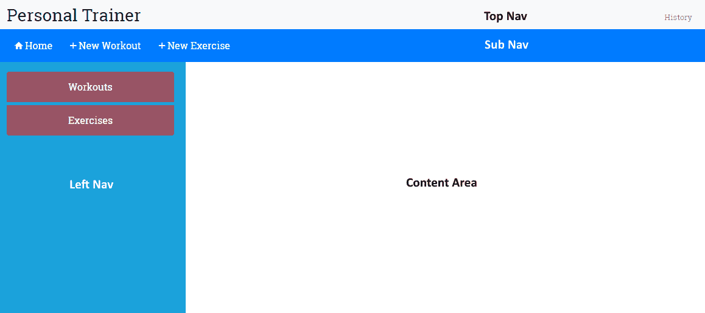

它包含以下组件：

*   顶部导航：包含应用品牌标题和历史链接。
*   子导航：该导航元素会根据活动组件进行更改。
*   左导航：包含依赖于激活组件的元素。
*   内容区：这是我们组件的主视图将显示的地方。这就是大部分动作发生的地方。我们将创建/编辑练习和训练，并在此处显示练习和训练列表。

查看源代码文件；`trainer/src/app`下有一个新文件夹`workout-builder`。它包含我们前面描述的每个组件的文件，以及一些占位符内容。在本章中，我们将构建这些组件。

然而，我们首先需要在应用中连接这些组件。这要求我们定义训练生成器应用的导航模式，并相应地定义应用路线。

# 私人教练导航路线

我们计划用于应用的导航模式是列表详细信息模式。我们将为应用中提供的练习和训练创建列表页面。单击任何列表项，我们将进入该项的详细视图，在该视图中，我们可以执行所有 CRUD 操作（创建/读取/更新/删除）。以下路线遵循此模式：

| **路线** | **说明** |
| `/builder` | 这只是重定向到**构建者/训练** |
| `/builder/workouts` | 这列出了所有可用的训练。这是*训练生成器*的登录页 |
| `/builder/workout/new` | 这将创建一个新的训练 |
| `/builder/workout/:id` | 这将编辑具有特定 ID 的现有训练 |
| `/builder/exercises` | 这列出了所有可用的练习 |
| `/builder/exercise/new` | 这将创建一个新的练习 |
| `/builder/exercise/:id` | 这将编辑具有特定 ID 的现有练习 |

# 开始使用私人教练导航

此时，如果您查看`src/app`文件夹中`app-routing.module.ts`中的路由配置，您会发现一个新的路由定义，`builder`**：**

```ts
const routes: Routes = [
    ...
    { path: 'builder', component: WorkoutBuilderComponent },
    ...
];
```

如果您运行该应用，您将看到“开始”屏幕显示另一个链接“创建训练”：


在幕后，我们为该链接添加了另一个路由链接到`start.component.html`：

```ts
<a routerLink="/builder" class="btn btn-primary btn-lg btn-block" role="button" aria-pressed="true">
   <span>Create a Workout</span>
   <span class="ion-md-add"></span>
</a>
```

如果单击此链接，您将进入以下视图：


同样，在幕后，我们使用以下内联模板将`workout-builder.component.ts`添加到`trainer/src/app/workout-builder`文件夹中：

```ts
  template: `
    <div class="row">
      <div class="col-sm-3"></div>
      <div class="col-sm-6">
          <h1 class="text-center">Workout Builder</h1>
      </div>
      <div class="col-sm-3"></div>
    </div>
  `
```

使用我们`app.component.html`模板中的路由出口，此视图显示在标题下方的屏幕上：

```ts
<div class="container body-content app-container"> 
    <router-outlet></router-outlet> 
</div>` 
```

我们已经将这个组件（以及我们为这个特性而删除的其他文件）包装在一个名为`workout-builder.module.ts:`的新模块中

```ts
import { NgModule } from '@angular/core';
import { CommonModule } from '@angular/common';

import { WorkoutBuilderComponent } from './workout-builder.component';
import { ExerciseComponent } from './exercise/exercise.component';
import { ExercisesComponent } from './exercises/exercises.component';
import { WorkoutComponent } from './workout/workout.component';
import { WorkoutsComponent } from './workouts/workouts.component';

@NgModule({
  imports: [
    CommonModule
  ],
  declarations: [WorkoutBuilderComponent, ExerciseComponent, ExercisesComponent, WorkoutComponent, WorkoutsComponent]
})
export class WorkoutBuilderModule { }
```

这里唯一看起来与我们创建的其他模块不同的是，我们正在导入`CommonModule`而不是`BrowserModule`。这避免了第二次导入整个`BrowserModule`，这将在我们开始为该模块实现延迟加载时产生错误。

最后，我们为`app.module.ts`添加了此模块的导入：

```ts
  ... 
@NgModule({ 
  imports: [ 
  ... 
 WorkoutBuilderModule], 
  ... 
```

所以，这里没有什么令人惊讶的。遵循这些模式，我们现在应该开始考虑为我们的新特性添加前面概述的附加导航。然而，在我们开始这样做之前，我们需要考虑两件事。

首先，如果我们开始将路由添加到`app.routing-module.ts`文件中，那么存储在那里的路由数量将会增加。*训练生成器*的这些新路线也将与*训练跑步者***的路线混合使用。**虽然我们现在增加的路线数量似乎微不足道，但随着时间的推移，这可能会成为一个维护问题。

其次，我们需要考虑到我们的应用现在包含两个功能-*训练跑步者*和*训练构建者*。我们应该考虑如何在我们的应用中分离这些特性，以便它们可以彼此独立地开发。

换句话说，我们希望我们构建的功能之间有**松耦合**。使用此模式可以在不影响其他功能的情况下交换应用中的一个功能。例如，我们可能希望将*训练跑步者*转换为移动应用，但将*训练生成器*作为基于 web 的应用保留原样。

这种将组件彼此分离的能力是使用 Angle 实现的**组件设计模式**的关键优势之一。幸运的是，Angular 的路由使我们能够将路由划分为逻辑组织的**路由配置**，这些配置与应用中的功能非常匹配。

为了完成这一分离，Angular 允许我们使用**子路由**，在这里我们可以隔离每个功能的路由。在本章中，我们将使用**子路由**来分离*训练生成器*的路由。

# 向训练生成器介绍儿童路线

Angular 支持我们为新的*训练生成器*隔离路由的目标，为我们提供在应用中创建路由组件层次结构的能力。我们目前只有一个路由组件，它位于应用的根组件中。但是 Angular 允许我们在根组件下添加所谓的**子路由组件**。这意味着一个功能可以不知道另一个正在使用的路由，并且每个功能都可以根据该功能内的更改自由调整其路由。

回到我们的应用，我们可以在 Angular 中使用**子路由**，将我们应用的两个特性的路由与将使用它们的代码相匹配。因此，在我们的应用中，我们可以为我们的*训练生成器*将路由构造为以下路由层次结构（此时，我们将*训练跑步者*保持原样，以显示前后比较）：


通过这种方法，我们可以按功能对路线进行逻辑分离，并使其更易于管理和维护。

那么，让我们从向应用添加子路由开始。

从本节的这一点开始，我们将添加到本章前面下载的代码中。如果您想查看下一节的完整代码，可以从 GitHub 存储库的`checkpoint 4.2`下载。如果您想在我们构建本节代码时与我们一起工作，请务必将`styles.css`中的更改添加到`trainer/src`文件夹中，这些更改是此检查点的一部分，因为我们在此不讨论这些更改。另外，请确保从存储库的`trainer/src/app/workout-builder`文件夹中添加用于练习、锻炼和导航的文件。在这个阶段，这些只是存根文件，我们将在本章后面实现。但是，为了实现*训练生成器*模块的导航，您需要这些存根文件。该代码可在 GitHub 上下载，网址为[https://github.com/chandermani/angular6byexample](https://github.com/chandermani/angular6byexample) 。检查点在 GitHub 中作为分支实现。需要下载的分支如下：`GitHub Branch: checkpoint4.2`。如果您没有使用 Git，请从以下 GitHub 位置下载`Checkpoint 4.2`（ZIP 文件）的快照：[https://github.com/chandermani/angular6byexample/archive/checkpoint4.2.zip](https://github.com/chandermani/angular6byexample/archive/checkpoint4.2.zip) 。第一次设置快照时，请参考`trainer`文件夹中的`README.md`文件。

# 添加子路由组件

在`workout-builder`目录中，添加一个名为`workout-builder.routing.module.ts`的新 TypeScript 文件，导入内容如下：

```ts
import { NgModule } from '@angular/core';
import { Routes, RouterModule } from '@angular/router';
import { WorkoutBuilderComponent } from './workout-builder.component';
import { WorkoutsComponent } from './workouts/workouts.component';
import { WorkoutComponent } from './workout/workout.component';
import { ExercisesComponent } from './exercises/exercises.component';
import { ExerciseComponent } from './exercise/exercise.component';
```

正如您所看到的，我们正在导入刚才提到的组件；它们将成为我们的*训练生成器*（锻炼、锻炼、锻炼和锻炼）的一部分。除了这些导入，我们还从 Angular 核心模块导入了`NgModule`，从 Angular 路由模块导入了`Routes`和`RouterModule`。这些导入将使我们能够添加和导出子路由。

我们这里不使用 Angular CLI，因为它没有用于创建路由模块的独立蓝图。但是，您可以让 CLI 在使用`--routing`选项创建模块时创建路由模块。在本例中，我们已经创建了一个现有模块，因此无法使用该标志。参见[https://github.com/angular/angular-cli/blob/master/docs/documentation/stories/routing.md](https://github.com/angular/angular-cli/blob/master/docs/documentation/stories/routing.md) 了解有关如何执行此操作的更多详细信息。

然后，将以下路由配置添加到文件中：

```ts
const routes: Routes = [
  {
    path: 'builder',
    component: WorkoutBuilderComponent,
    children: [
         {path: '', pathMatch: 'full', redirectTo: 'workouts'},
         {path: 'workouts', component: WorkoutsComponent },
         {path: 'workout/new', component: WorkoutComponent },
         {path: 'workout/:id', component: WorkoutComponent },
         {path: 'exercises', component: ExercisesComponent},
         {path: 'exercise/new', component: ExerciseComponent },
         {path: 'exercise/:id', component: ExerciseComponent }
    ]
  },
];
```

第一个配置`path: 'builder'`设置子路由的基本 URL，以便每个子路由都在其前面。下一个配置将`WorkoutBuilder`组件标识为该文件中子组件的特征区域根组件。这意味着它将是使用`router-outlet`显示每个子组件的组件。最终配置是一个或多个子组件的列表，该列表定义子组件的路由。

这里需要注意的是，我们已经将`Workouts`设置为具有以下配置的子路由的默认值：

```ts
{path:'', pathMatch: 'full', redirectTo: 'workouts'}, 

```

此配置表示如果有人导航到`builder`，他们将被重定向到`builder/workouts`路线。`pathMatch: 'full'`设置意味着仅当训练/构建后路径为空字符串时，才会进行匹配。如果路由是其他路由，例如`workout/builder/exercises`或我们在此文件中配置的任何其他路由，这将防止发生重定向。

最后，添加以下类声明，前面是定义模块导入和导出的`@NgModule`装饰符：

```ts
@NgModule({
  imports: [RouterModule.forChild(routes)],
  exports: [RouterModule]
})
export class WorkoutBuilderRoutingModule { }
```

此导入与`app.routing-module.ts`中的导入非常相似，但有一个区别-我们使用`RouterModule.forChild`而不是`RouterModule.forRoot`。差异的原因似乎不言而喻：我们正在创建子路由，而不是应用根目录中的路由，这就是我们的含义。然而，在引擎盖下，有一个显著的区别。这是因为我们的应用中不能有多个路由服务处于活动状态。`forRoot`创建路由服务，但`forChild`不创建。

# 更新 WorkoutBuilder 组件

我们接下来需要更新`WorkoutBuilder`组件以支持新的子路由。为此，请将训练生成器的`@Component`装饰器更改为：

1.  取下`selector`
2.  将`<abe-sub-nav-main>`自定义元素添加到模板中
3.  在模板中添加一个`<router-outlet>`标记

装饰器现在应该如下所示：

```ts
@Component({
  template: `<div class="container-fluid fixed-top mt-5">
                <div class="row mt-5">
                  <abe-sub-nav-main></abe-sub-nav-main>
                </div>
                <div class="row mt-2">
                  <div class="col-sm-12">
                    <router-outlet></router-outlet>
                  </div>
                </div>
            <div>`
})
```

我们正在删除选择器，因为`WorkoutBuilderComponent`不会嵌入到应用根目录`app.component.ts`中。相反，它将通过路由从`app.routing-module.ts`到达。虽然它将处理来自`app.routes.ts`的传入路由请求，但它将依次将它们路由到训练生成器功能中包含的其他组件。

这些组件将使用我们刚刚添加到`WorkoutBuilder`模板中的`<router-outlet>`标记显示它们的视图。考虑到`Workout BuilderComponent`的模板很简单，我们使用的是内联`template`而不是`templateUrl`。

通常，对于组件视图，我们建议使用指向单独 HTML 模板文件的`templateUrl`。当您预期视图将涉及多行 HTML 时，尤其如此。在这种情况下，在自己的 HTML 文件中使用视图要容易得多

我们还添加了一个`<abe-sub-nav-main>`元素，用于创建辅助顶级菜单，以便在*训练生成器*功能中导航。我们将在本章稍后讨论这一点。

# 更新“训练生成器”模块

现在更新`WorkoutBuilderModule`，首先在文件中添加以下导入：

```ts
import { WorkoutBuilderRoutingModule } from './workout-builder-routing.module';
```

它导入我们刚刚设置的子路由。接下来，更新`@NgModule`装饰器以添加`workoutBuilderRoutingModule`：

```ts
...
@NgModule({
  imports: [
    CommonModule,
    WorkoutBuilderRoutingModule
  ],
...
}) 
```

最后，添加可在`checkpoint4.2`中找到的新导航组件的导入和声明：

```ts
import { LeftNavExercisesComponent } from './navigation/left-nav-exercises.component';
import { LeftNavMainComponent } from './navigation/left-nav-main.component';
import { SubNavMainComponent } from './navigation/sub-nav-main.component';
...
  declarations: [
    ...
    LeftNavExercisesComponent,
    LeftNavMainComponent,
    SubNavMainComponent]
```

# 更新应用路由模块

最后一步：返回到`app.routing-module.ts`并删除`WorkoutBuilderComponent`的导入和指向构建器的路由定义：`{ path: 'builder', component: WorkoutBuilderComponent },`。

务必保持`app.module.ts`中`WorkoutBuilderModule`的导入不变。我们将在下一节讨论延迟加载时讨论如何删除它。

# 把它们放在一起

我们现在有了包含子路线的区域或功能路线，所有与*训练生成器*相关的路线现在分别包含在它们自己的路线配置中。这意味着我们可以管理`WorkoutBuilderRoutes`组件中*训练生成器*的所有路由，而不会影响应用的其他部分。

如果我们现在从起始页导航到训练生成器，我们可以看到路由如何将`app.routes.ts`中的路线与`workout-builder.routes.ts`中的默认路线相结合：


如果我们在浏览器中查看 URL，它是`/builder/workouts`。您会记得起始页上的路由链接是`['/builder']`。那么路由是如何把我们带到这个位置的呢？

它是这样做的：当点击链接时，Angular路由首先向`app-routing.module.ts`寻找`builder`路径，因为该文件包含应用中根路由的配置。路由找不到该路径，因为我们已将其从该文件中的路由中删除。

但是，`WorkoutBuilderModule`已经导入到我们的`AppModule`中，而该模块又导入了`workoutBuilderRoutingModule`。后一个文件包含我们刚才配置的子路由。路由发现`builder`是该文件中的父路由，因此它使用该路由。如果`builder`路径以空字符串结尾，它还会找到重定向到子路径`workouts`的默认设置，在本例中就是这样。

如果您查看屏幕，您将看到它正在显示`Workouts`的视图（与之前的*训练生成器*不同）。这意味着路由已成功地将请求路由到`WorkoutsComponent`，这是我们在`workoutBuilderRoutingModule`中设置的子路由配置中默认路由的组件。

此路由解析过程如下所示：

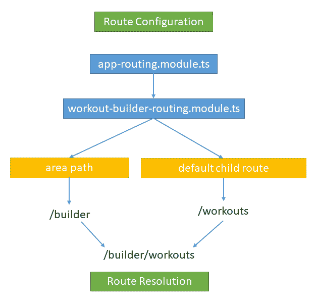

关于子路由的最后一个想法。当您查看我们的子路由组件`workout-builder.component.ts`时，您将看到它没有对其父组件`app.component.ts`的引用（已删除`<selector>`标记，因此`WorkoutBuilderComponent`未嵌入根组件）。这意味着我们已经成功地封装了`WorkoutBuilderComponent`（及其在`WorkoutBuilderModule`中导入的所有相关组件），使我们能够将其全部转移到应用的其他地方，甚至转移到新的应用中。

现在，我们要继续将训练生成器的路线转换为使用延迟加载并构建其导航菜单。如果您想查看下一节的完整代码，可以从`checkpoint 4.3`中的配套代码库下载。同样，如果您与我们一起构建应用，请确保并更新`styles.css`文件，我们在这里不讨论这个文件。

该代码也可在 GitHub 上获得：[https://github.com/chandermani/angular6byexample](https://github.com/chandermani/angular6byexample) 。检查点在 GitHub 中作为分支实现。要下载的分支如下：`GitHub Branch: checkpoint4.3`（文件夹-`trainer`），如果您没有使用 Git，请从以下 GitHub 位置下载`Checkpoint 4.3`（ZIP 文件）的快照：[https://github.com/chandermani/angular6byexample/archive/checkpoint4.3.zip](https://github.com/chandermani/angular6byexample/archive/checkpoint4.3.zip) 。第一次设置快照时，请参考`trainer`文件夹中的`README.md`文件。

# 延迟加载路由

当我们推出我们的应用时，我们希望我们的用户每天都能访问锻炼跑步者（我们知道，这对您来说也是如此！）。但是，我们预计他们只会偶尔使用锻炼生成器来构建他们的锻炼和锻炼计划。因此，如果我们能够避免在用户在“锻炼跑步者”中进行锻炼时加载锻炼生成器的开销，那就太好了。相反，当用户想要添加或更新他们的练习和训练计划时，我们更愿意只根据需要加载训练生成器。这种方法称为**延迟加载**。延迟加载允许我们在加载模块时采用异步方法。这意味着我们可以加载启动应用所需的内容，然后根据需要加载其他模块。

在幕后，当我们使用 Angular CLI 构建和服务我们的应用时，它使用 WebPack 的捆绑和分块功能来完成延迟加载。在讨论如何在应用中实现延迟加载时，我们将讨论这些功能

因此，在我们的*私人教练*中，我们希望更改应用，使其仅按需加载**训练生成器**。Angular路由允许我们使用延迟加载来实现这一点。

但是在我们开始执行惰性加载之前，让我们看看我们当前的应用以及它是如何加载我们的模块的。在 Sources 选项卡中打开开发者工具后，启动应用；当开始页面出现在浏览器中时，如果您查看源代码树中的“网页包”节点，您将看到应用中的所有文件都已加载，包括*训练跑步者*和*训练生成器*文件：

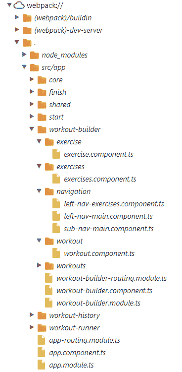

因此，即使我们可能只想使用*训练跑步者*，我们也必须加载*训练生成器*。在某种程度上，如果您将我们的应用视为一个**单页应用**（**SPA**），这是有道理的。为了避免往返服务器，SPA 通常会在用户首次启动应用时加载使用该应用所需的所有资源。但在我们的例子中，重要的一点是，当应用首次加载时，我们不需要*训练生成器*。相反，我们只希望在用户决定添加或更改训练或锻炼时加载这些资源。

那么，让我们开始实现这一点。

首先修改`app.routing-module.ts`为`WorkoutBuilderModule`增加如下路由配置：

```ts
const routes: Routes = [
    ...
    { path: 'builder', loadChildren: './workout-builder/workout-builder.module#WorkoutBuilderModule'},
    { path: '**', redirectTo: '/start' }
];
```

请注意，`loadChildren`属性是：

```ts
module file path + # + module name 
```

此配置提供加载和实例化`WorkoutBuilderModule`所需的信息

接下来返回到`workout-builder-routing.module.ts`并将`path`属性更改为空字符串：

```ts
export const Routes: Routes = [ 
    { 
 path: '', 
. . . 
    } 
]; 
```

我们之所以进行此更改，是因为我们现在正在为他们在`app.routing-module.ts`中添加的新配置中设置`WorkoutBuilderRoutes`的路径（`builder`。

最后返回到`app-module.ts`并删除该文件中`@NgModule`配置中的`WorkoutBuilderModule`导入。这意味着，应用首次启动时，我们不加载**训练生成器**功能，而只在用户访问*训练生成器*的路径时加载它。

让我们使用`ng serve`再次构建并运行应用。在终端窗口中，您应该会看到类似以下输出的内容：

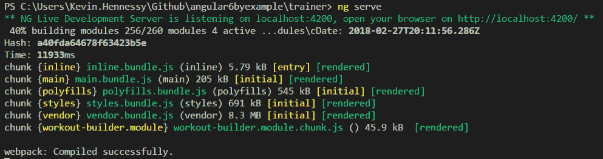

这里有趣的是最后一行，它显示了一个单独的名为`workout-builder.module.chunk.js.`的`workout.builder.module`文件。**WebPack**使用了所谓的代码拆分，将我们的训练生成器模块分割成一个单独的块。在需要之前（即路由导航到`WorkoutBuilderModule`时），此区块不会加载到我们的应用中。

现在，让 Chrome 开发者工具中的 Sources 选项卡保持打开状态，再次在浏览器中打开应用。加载起始页时，仅显示与*训练跑步者*相关的文件，而不显示与*训练生成器*相关的文件，如下所示：


然后，如果我们清除网络选项卡并单击创建训练链接，我们将看到`workout-builder.module`块加载：


这意味着我们已经实现了对新特性的封装，通过异步路由，我们能够在需要时使用延迟加载来加载其所有组件。

子路由和异步路由使得实现应用变得非常简单，这些应用允许我们既有蛋糕也有蛋糕。一方面，我们可以构建具有强大客户端导航功能的 SPA，另一方面，我们还可以将功能封装在单独的子路由组件中，并仅在需要时加载它们。

Angular router 的强大功能和灵活性使我们能够通过将应用的行为和响应能力紧密地映射到用户使用应用的方式来满足用户的期望。在这种情况下，我们利用这些功能来实现我们的目标：立即加载*训练跑步者*，这样我们的用户就可以立即开始练习，但避免加载*训练构建器*的开销，而只在用户想要构建训练时提供。

现在我们已经在*训练生成器*中设置了路线配置，我们将把注意力转向构建子层和左导航；这将使我们能够使用此路由。下一节将介绍如何实现此导航。

# 集成子级和侧级导航

将子级和侧级导航集成到应用中的基本思想是提供基于活动视图更改的上下文感知子视图。例如，当我们在列表页面上而不是编辑项目时，我们可能希望在导航中显示不同的元素。电子商务网站就是一个很好的例子。想象一下亚马逊的搜索结果页面和产品详细信息页面。当上下文从产品列表更改为特定产品时，加载的导航元素也会更改。

# 次级导航

我们将首先在*训练生成器*中添加子级别导航。我们已经将我们的`SubNavMainComponent`导入*训练生成器*。但是，目前它只是显示占位符内容：

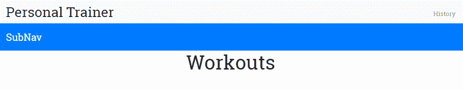

现在，我们将用三个路由链接替换该内容：主页、新锻炼和新锻炼。

打开`sub-nav-main.component.html`文件并将其中的 HTML 更改为以下内容：

```ts
<nav class="navbar fixed-top navbar-dark bg-primary mt-5">
    <div>
        <a [routerLink]="['/builder/workouts']" class="btn btn-primary">
        <span class="ion-md-home"></span> Home
        </a>
        <a [routerLink]="['/builder/workout/new']" class="btn btn-primary">
        <span class="ion-md-add"></span> New Workout
        </a>
        <a [routerLink]="['/builder/exercise/new']" class="btn btn-primary">
        <span class="ion-md-add"></span> New Exercise
        </a>
    </div>
</nav>
```

现在，重新运行应用，您将看到三个导航链接。如果我们点击新的练习链接按钮，我们将被路由到`ExerciseComponent`，其视图将出现在*训练生成器*视图的路由出口中：

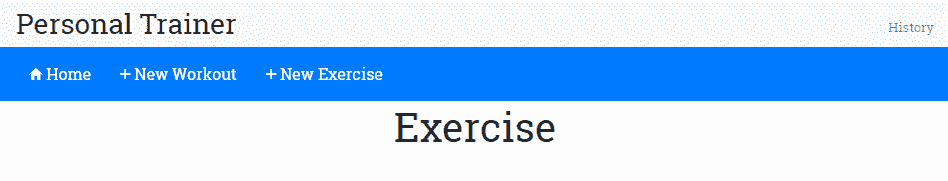

新的训练链接按钮将以类似的方式工作；点击后，它会将用户带到`WorkoutComponent`并在路由出口显示其视图。点击主页链接按钮将用户返回`WorkoutsComponent`并查看。

# 侧导航

*训练生成器*中的侧面导航将根据我们导航到的子组件而有所不同。例如，当我们第一次导航到*训练生成器*时，我们会进入训练屏幕，因为`WorkoutsComponent`路线是*训练生成器*的默认路线。该组件将需要侧导航；它将允许我们选择查看训练列表或训练列表。

Angular 基于组件的特性为我们提供了实现这些上下文相关菜单的简单方法。我们可以为每个菜单定义新的组件，然后将它们导入到需要它们的组件中。在本例中，我们有三个组件需要辅助菜单：**训练**、**训练**和**训练**。前两个组件实际上可以使用相同的菜单，因此我们只需要两个侧菜单组件：`LeftNavMainComponent`，它与前面的菜单类似，将由`Exercises`和`Workouts`组件使用；以及`LeftNavExercisesComponent`，它将包含现有练习的列表，并将由`Workouts`组件使用。

我们已经有了两个菜单组件的文件，包括模板文件，并且已经将它们导入到`WorkoutBuilderModule`中。现在，我们将把它们集成到需要它们的组件中。

首先修改`workouts.component.html`模板，增加菜单选择器：

```ts
<div class="row">
    <div>
        <abe-left-nav-main></abe-left-nav-main>
    </div>
    <div class="col-sm-10 builder-content">
        <h1 class="text-center">Workouts</h1>
    </div>
  </div>
```

然后，将`left-nav-main.component.html`中的占位符文本替换为指向`WorkoutsComponent`和`ExercisesComponent`的导航链接：

```ts
<div class="left-nav-bar">
    <div class="list-group">
        <a [routerLink]="['/builder/workouts']" class="list-group-item list-group-item-action">Workouts</a>
        <a [routerLink]="['/builder/exercises']" class="list-group-item list-group-item-action">Exercises</a>
    </div>
</div>
```

运行应用，您将看到以下内容：


按照完全相同的步骤完成`Exercises`组件的侧菜单。

We won't show the code for this menu here, but you can find it in the `workout-builder/exercises` folder under `trainer/src/app` in `checkpoint 4.3` of the GitHub repository.

对于训练屏幕的菜单，步骤相同，只是您应将`left-nav-exercises.component.html`更改为以下内容：

```ts
<div class="left-nav-bar">
  <h3>Exercises</h3>
</div> 
```

我们将使用此模板作为构建训练列表的起点，该列表将显示在屏幕的左侧，并可选择包含在训练中。

# 实施锻炼和锻炼清单

甚至在我们开始实施锻炼和锻炼列表页面之前，我们就需要一个用于锻炼和锻炼数据的数据存储。当前的计划是拥有内存中的数据存储，并使用 Angular 服务将其公开。在[第三章](03.html)*支持服务器数据持久化*中，我们讨论了服务器交互，我们将把这些数据移动到服务器存储中进行长期持久化。现在，内存中的存储就足够了。让我们添加存储实现。

# WorkoutService 作为训练和锻炼存储库

这里的计划是创建一个`WorkoutService`实例，负责跨两个应用公开运动和训练数据。该服务的主要职责包括：

*   **与练习相关的 CRUD 操作**：获取所有练习、根据其名称获取特定练习、创建练习、更新练习、删除练习
*   **训练相关 CRUD 操作**：与训练相关操作类似，但针对训练实体

该代码可在 GitHub 上下载，网址为[https://github.com/chandermani/angular6byexample](https://github.com/chandermani/angular6byexample) 。下载的分支如下：**GitHub 分支：checkpoint4.4**（文件夹`trainer`。如果您没有使用 Git，请从以下 GitHub 位置下载`Checkpoint 4.4`（ZIP 文件）的快照：[https://github.com/chandermani/angular6byexample/archive/checkpoint4.4.zip](https://github.com/chandermani/angular6byexample/archive/checkpoint4.4.zip) 。第一次设置快照时，请参考`trainer`文件夹中的`README.md`文件。同样，如果您正在与我们一起构建应用，请确保更新`styles.css`文件，我们在这里不讨论这个文件。因为本节中的一些文件相当长，而不是在这里显示代码，所以我们有时还建议您只需将这些文件复制到解决方案中。

在`trainer/src/core`文件夹中找到`workout-service.ts`。该文件中的代码应该如下所示，除了两个方法`setupInitialExercises`和`setupInitialWorkouts`的实现，由于它们的长度，我们省略了这两个方法：

```ts
import {Injectable} from '@angular/core'; 
import {ExercisePlan} from './model'; 
import {WorkoutPlan} from './model'; 
import {Exercise} from "./model";
import { CoreModule } from './core.module'; 

@Injectable({
  providedIn: CoreModule
})
export class WorkoutService { 
    workouts: Array<WorkoutPlan> = []; 
    exercises: Array<Exercise> = []; 

    constructor() { 
        this.setupInitialExercises(); 
        this.setupInitialWorkouts(); 
    } 

    getExercises(){ 
        return this.exercises; 
    } 

    getWorkouts(){ 
        return this.workouts; 
    } 
    setupInitialExercises(){ 
     // implementation of in-memory store. 
    } 

    setupInitialWorkouts(){ 
     // implementation of in-memory store. 
    } 
}} 
```

正如我们前面提到的，Angular服务的实现非常简单。在这里，我们用名称`WorkoutService`声明一个类，并用`@Injectable`装饰它。在`@Injectable`装饰器中，我们将`provided-in`属性设置为`CoreModule`。这将`WorkoutService`注册为 Angular 的**依赖注入**框架的提供者，并使其在整个应用中可用。

在类定义中，我们首先创建两个数组：一个用于`Workouts`，另一个用于`Exercises`。这些数组分别属于`WorkoutPlan`和`Exercise`类型，因此我们需要从`model.ts`导入`WorkoutPlan`和`Exericse`来获取它们的类型定义。

构造函数调用两个方法来设置训练和服务列表。目前，我们只是使用内存中的存储，用数据填充这些列表。

顾名思义，`getExercises`和`getWorkouts`这两种方法分别返回一个练习和训练列表。由于我们计划使用内存存储来存储训练和锻炼数据，`Workouts`和`Exercises`数组存储这些数据。随着我们的进展，我们将为服务添加更多功能。

是时候为训练和锻炼列表构建组件了！

# 训练和练习列表组件

首先，打开`trainer/src/app/workout-builder/workouts`文件夹中的`workouts.component.ts`文件，更新导入内容如下：

```ts
import { Component, OnInit } from '@angular/core';
import { Router } from '@angular/router';

import { WorkoutPlan } from '../../core/model';
import { WorkoutService } from '../../core/workout.service';; 
```

此新代码导入了Angular`Router`以及`WorkoutService`和`WorkoutPlan`类型。

接下来，用以下代码替换类定义：

```ts
export class WorkoutsComponent implements OnInit { 
    workoutList:Array<WorkoutPlan> = []; 

    constructor( 
        public router:Router, 
        public workoutService:WorkoutService) {} 

    ngOnInit() { 
        this.workoutList = this.workoutService.getWorkouts(); 
    } 

    onSelect(workout: WorkoutPlan) { 
        this.router.navigate( ['./builder/workout', workout.name] ); 
    } 
} 
```

这段代码添加了一个构造函数，我们在其中注入了`Router`和`WorkoutService`。然后，`ngOnInit`方法调用`WorkoutService`上的`getWorkouts`方法，并用从该方法调用返回的`WorkoutPlans`列表填充`workoutList`数组。我们将使用该`workoutList`数组填充将显示在`Workouts`组件视图中的训练计划列表。

您会注意到，我们正在将调用`WorkoutService`的代码放入`ngOnInit`方法中。我们希望避免将此代码放在构造函数中。最终，我们将用对外部数据存储的调用替换此服务使用的内存存储，我们不希望组件的实例化受到此调用的影响。向构造函数添加这些方法调用也会使测试组件变得复杂。

为了避免这种意外的副作用，我们将代码放在`ngOnInit`方法中。此方法实现 Angular 的生命周期挂钩之一`OnInit`，Angular 在创建服务实例后调用该挂钩。通过这种方式，我们依靠 Angular 以一种不影响组件实例化的可预测方式调用此方法。

接下来，我们将对`Exercises`组件进行几乎相同的更改。与`Workouts`组件一样，此代码将训练服务注入到我们的组件中。这一次，我们将使用训练服务检索训练。

As it is similar to the `Workouts` component, we won't show that code here. Just add it from the `workout-builder/exercises` folder in  `checkpoint 4.4`.

# 训练和练习列表视图

现在，我们需要实现到目前为止一直为空的列表视图！

在本节中，我们将使用`checkpoint 4.4`更新`checkpoint 4.3`中的代码。因此，如果您与我们一起编写代码，只需遵循本节中列出的步骤即可。如果您想查看完成的代码，只需将文件从`checkpoint 4.4`复制到您的解决方案中即可。

# 训练列表视图

要使视图正常工作，请打开`workouts.component.html`并添加以下标记：

```ts
<div class="row">
    <div>
        <abe-left-nav-main></abe-left-nav-main>
    </div>
    <div class="col-sm-10 builder-content">
        <h1 class="text-center">Workouts</h1>
        <div *ngFor="let workout of workoutList|orderBy:'title'" class="workout tile" (click)="onSelect(workout)">
          <div class="title">{{workout.title}}</div>
          <div class="stats">
              <span class="duration" title="Duration"><span class="ion-md-time"></span> - {{(workout.totalWorkoutDuration? workout.totalWorkoutDuration(): 0)|secondsToTime}}</span>
              <span class="float-right" title="Exercise Count"><span class="ion-md-list"></span> - {{workout.exercises.length}}</span>
          </div>
      </div>
    </div>
  </div>
```

我们正在使用 Angular core 指令之一`ngFor`，循环浏览训练列表，并将其显示在页面上的列表中。我们在`ngFor`前面添加`*`符号，以将其标识为Angular指令。使用`let`语句，我们将`workout`指定为一个局部变量，用于迭代训练列表，并确定每个训练要显示的值（例如，`workout.title`。然后，我们使用一个自定义管道`orderBy`，按标题的字母顺序显示训练列表。我们还使用另一个自定义管道`secondsToTime`来设置总训练时间的显示格式。

If you are coding along with us, you will need to move the `secondsToTime` pipe into the shared folder and include it in the `SharedModule`. Then, add `SharedModule` to `WorkoutBuilderModule` as an additional import. That change has already been made in `checkpoint 4.4` in the GitHub repository.

最后，我们将 click 事件绑定到我们添加到组件中的以下`onSelect`方法：

```ts
 onSelect(workout: WorkoutPlan) { 
     this.router.navigate( ['/builder/workout', workout.name] ); 
 }  
```

这将设置到“训练详细信息”页面的导航。当我们单击训练列表中的项目时，会出现此导航。所选训练名称作为路线`/URL`的一部分传递到训练详细信息页面。

继续并刷新生成器页面（`/builder/workouts`）；列出了一项训练，即 7 分钟训练。单击该训练的互动程序。您将进入训练屏幕，训练名称`7MinWorkout`将出现在 URL 的末尾：


The Workout screen

# 练习列表视图

对于`Exercises`列表视图，我们将采用与`Workouts`列表视图相同的方法，除了在本例中，我们实际上将实现两个视图：一个用于`Exercises`组件（当用户导航到该组件时，该组件将显示在主内容区），另一个用于`LeftNavExercisesComponent`上下文菜单（当用户导航到`Workouts`组件以创建或编辑训练时，将显示该选项）。

对于`Exercises`部分，我们将采用一种与我们在`Workouts`部分中显示训练列表几乎相同的方法。所以，我们不会在这里显示代码。只需从`checkpoint 4.4`添加`exercises.component.ts`和`exercises.component.html`的文件即可。

复制完文件后，单击左侧导航中的练习链接，加载您在`WorkoutService`中已配置的 12 个练习。

与`Workouts`列表一样，这将设置到练习详细信息页面的导航。单击练习列表中的一个项目，我们将进入练习详细信息页面。选择的练习名称作为路线`/URL`的一部分传递到练习详情页面。

在最终列表视图中，我们将添加一个练习列表，该列表将显示在*训练生成器*屏幕的左侧上下文菜单中。创建或编辑训练时，此视图将加载到左侧导航中。使用 Angular 基于组件的方法，我们将更新`leftNavExercisesComponent`及其相关视图以提供此功能。只需从`checkpoint 4.4`中的`trainer/src/app/navigation`文件夹中添加`left-nav-exercises.component.ts`和`left-nav-exercises.component.html`的文件即可。

复制完这些文件后，单击*训练生成器*中子导航菜单上的“新建训练”按钮，您现在将看到左侧导航菜单中显示的练习列表，我们已经在`WorkoutService`中配置了这些练习。

是时候添加加载、保存和更新运动/训练数据的功能了！

# 建立锻炼计划

核心功能*私人教练*围绕锻炼和锻炼构建提供中心。一切都支持这两个功能。在本节中，我们将重点介绍如何使用 Angular 构建和编辑训练。

`WorkoutPlan`模型已经定义，因此我们知道构成训练的要素。*训练生成器*页面便于用户输入，并允许我们构建/保存训练数据。

完成后，*训练生成器*页面将如下所示：


该页面有一个左侧导航，列出了可以添加到训练中的所有练习。单击右侧的箭头图标可将训练添加到训练结束。

中心区域指定用于健身大楼。它包括按从上到下的顺序排列的运动图块，以及允许用户提供有关训练的其他详细信息（如名称、标题、描述和休息时间）的表单。

此页面以两种模式运行：

*   创建/新建：此模式用于创建新训练。URL 为`#/ builder/workout/new`。
*   编辑：此模式用于编辑现有训练。URL 为`#/ builder/workout/:id`，其中`:id`映射到训练的名称。

有了对页面元素和布局的理解，是时候构建这些元素了。我们将从左导航开始。

# 完成左导航

在上一节的末尾，我们更新了`Workout`组件的左侧导航视图，以显示练习列表。我们的目的是让用户点击运动旁边的箭头，将其添加到训练中。当时，我们推迟了在绑定到点击事件的`LeftNavExercisesComponent`中实现`addExercise`方法。现在，我们将继续这样做。

我们有几个选择。`LeftNavExercisesComponent`是`WorkoutComponent`的子组件，所以我们可以实现子/父组件间的通信来完成。在上一章中，我们在进行*7 分钟训练*时介绍了这项技术。

然而，向训练添加练习是构建训练的更大过程的一部分，使用子/父组件间通信将使`AddExercise`方法的实现不同于我们将要添加的其他功能。

因此，采用另一种共享数据的方法更有意义，我们可以在整个训练过程中始终如一地使用这种方法。这种方法涉及使用服务。随着我们加入创建实际训练的其他功能，如保存/更新逻辑和实现其他相关组件，沿着服务路线走下去的好处将越来越明显。

因此，我们在图片中引入了一项新服务：`WorkoutBuilderService`。`WorkoutBuilderService`服务的最终目的是在构建训练时，在`WorkoutService`（检索并保存训练）和组件（如`LeftNavExercisesComponent`和我们稍后将添加的其他组件）之间进行协调，从而将`WorkoutComponent`中的代码量降至最低。

# 添加 WorkoutBuilderService

`WorkoutBuilderService`监控应用用户正在构建的训练状态。它：

*   跟踪当前训练
*   创建新的训练
*   加载现有训练
*   节省训练时间

从`checkpoint 4.5`中`trainer/src/app`下的`workout-builder/builder-services`文件夹复制`workout-builder-service.ts`。

该代码也可供每个人在 GitHub 上下载，网址为[https://github.com/chandermani/angular6byexample](https://github.com/chandermani/angular6byexample) 。检查点在 GitHub 中作为分支实现。下载的分支如下：`GitHub Branch: checkpoint4.5`（文件夹-`trainer`）。如果您没有使用 Git，请从以下 GitHub 位置下载`Checkpoint 4.5`（ZIP 文件）的快照：[https://github.com/chandermani/angular6byexample/archive/checkpoint4.5.zip](https://github.com/chandermani/angular6byexample/archive/checkpoint4.5.zip) 。第一次设置快照时，请参考`trainer`文件夹中的`README.md`文件。同样，如果您与我们一起构建应用，请确保更新`styles.css`文件，我们这里不讨论这个文件。

虽然我们通常在应用范围内提供服务，`WorkoutBuilderService`将仅在*训练生成器*功能中使用。因此，我们没有将其注册到`AppModule`中的提供者，而是将其注册到`WorkoutBuilderModule`的提供者数组中，如下所示（将其作为导入添加到文件顶部后）：

```ts
@NgModule({
....
  providers: [WorkoutBuilderService]
})
```

将其添加为提供程序意味着只有在访问*训练生成器*功能时才会加载，并且在该模块之外无法访问该功能。这意味着它可以独立于应用中的其他模块进行开发，并且可以在不影响应用其他部分的情况下进行修改。

让我们看看服务的一些相关部分。

`WorkoutBuilderService`需要`WorkoutPlan`、`ExercisePlan`和`WorkoutService`的类型定义，所以我们将它们导入到组件中：

```ts
import { WorkoutPlan, ExercisePlan } from '../../core/model';
import { WorkoutService } from '../../core/workout.service';
```

`WorkoutBuilderService`依赖`WorkoutService`提供持久化和查询功能。我们通过向`WorkoutBuilderService`**的构造函数中注入`WorkoutService`来解决此依赖关系**

```ts
 constructor(public workoutService: WorkoutService) {}
```

`WorkoutBuilderService`还需要跟踪正在进行的训练。我们使用`buildingWorkout`属性进行此操作。当我们调用服务上的`startBuilding`方法时，跟踪开始：

```ts
startBuilding(name: string){ 
    if(name){ 
        this.buildingWorkout = this.workoutService.getWorkout(name) 
        this.newWorkout = false; 
    }else{ 
        this.buildingWorkout = new WorkoutPlan("", "", 30, []); 
        this.newWorkout = true; 
    } 
    return this.buildingWorkout; 
} 
```

此跟踪功能背后的基本思想是设置一个`WorkoutPlan`对象（`buildingWorkout`，该对象将可供组件使用，以操纵训练细节。`startBuilding`方法将训练名称作为参数。如果未提供名称，则表示我们正在创建新的训练，因此将创建并分配一个新的`WorkoutPlan`对象；如果没有，我们通过调用`WorkoutService.getWorkout(name)`加载训练详细信息。在任何情况下，`buildingWorkout`对象都有正在进行的训练。

`newWorkout`对象表示训练是新的还是现有的。当调用此服务上的`save`方法时，用于区分保存和更新情况。

其余的方法，`removeExercise`、`addExercise`和`moveExerciseTo`都是不言自明的，并且会影响锻炼中的锻炼列表（`buildingWorkout`。

`WorkoutBuilderService`正在`WorkoutService`上调用一个新方法`getWorkout`，我们还没有添加。继续并从`checkpoint 4.5`中`trainer/src`下的`services`文件夹中的`workout-service.ts`文件复制`getWorkout`实现。我们不会详细讨论新的服务代码，因为实现非常简单。

让我们回到左导航并实现其余的功能。

# 使用 ExerciseNav 添加练习

要将练习添加到我们正在构建的训练中，只需导入`WorkoutBuilderService`和`ExercisePlan`，将`WorkoutBuilderService`注入`LeftNavExercisesComponent`中，并调用其`addExercise`方法，将所选练习作为参数传递：

```ts
constructor( 
    public workoutService:WorkoutService, 
 public workoutBuilderService:WorkoutBuilderService) {} 
. . . 
addExercise(exercise:Exercise) { 
 this.workoutBuilderService.addExercise(new ExercisePlan(exercise, 30)); 
} 
```

在内部，`WorkoutBuilderService.addExercise`使用新练习更新`buildingWorkout`模型数据。

前面的实现是在独立组件之间共享数据的典型案例。共享服务以受控的方式将数据公开给任何请求它的组件。在共享数据时，最好使用方法公开状态/数据，而不是直接公开数据对象。我们也可以在组件和服务实现中看到这一点。`LeftNavExercisesComponent`不直接更新训练数据；事实上，它无法直接访问正在构建的训练。相反，它依赖于服务方法`addExercise`来更改当前训练的练习列表。

因为服务是共享的，所以有一些陷阱需要注意。由于服务可以通过系统注入，我们无法阻止任何组件依赖于任何服务并以不一致的方式调用其功能，从而导致不期望的结果或错误。例如，`WorkoutBuilderService`需要在调用`addExercise`之前通过调用`startBuilding`进行初始化。如果组件在初始化之前调用`addExercise`会发生什么？

# 实现训练组件

`WorkoutComponent`负责管理训练。这包括创建、编辑和查看训练。由于`WorkoutBuilderService`的引入，该组件的整体复杂性将降低。除了与模板视图集成、公开和交互的主要职责外，我们将把大部分其他工作委托给`WorkoutBuilderService`。

`WorkoutComponent`与两个`routes/views`关联，即`/builder/workout/new`和`/builder/workout/:id`。这些路线处理创建和编辑训练场景。组件的第一项工作是加载或创建需要操纵的训练。

# 路线参数

但是在我们构建`WorkoutComponent`及其相关视图之前，我们需要简单地触摸一下导航，它会将用户带到屏幕上查看该组件。此组件处理创建和编辑训练方案。组件的第一项工作是加载或创建需要操纵的训练。我们计划使用 Angular 的路由框架将必要的数据传递给组件，以便它知道是编辑现有训练还是创建新训练，以及在现有训练的情况下，应该编辑哪个组件。

这是怎么做到的？`WorkoutComponent`与`/builder/workout/new`和`/builder/workout/:id`两条路由关联。这两条路线的区别在于这些路线的终点是什么；在一种情况下，它是`/new`，在另一种情况下，它是` /:id`。这些被称为**路线参数。**第二条路由中的`:id`是路由参数的令牌。路由将令牌转换为训练组件的 ID。正如我们前面看到的，这意味着在*7 分钟训练*的情况下传递给组件的 URL 将是`/builder/workout/7MinuteWorkout`。

我们如何知道此训练名称是 ID 的正确参数？正如您所记得的，当我们设置事件以处理“训练”屏幕上的“训练”互动程序（将我们带到“训练”屏幕）上的单击时，我们将训练名称指定为 ID 的参数，如下所示：

```ts
 onSelect(workout: WorkoutPlan) { 
     this.router.navigate( ['./builder/workout', workout.name] ); 
 }  
```

这里，我们使用路由的编程接口构建路由。`router.navigate`方法接受一个数组。这称为**链路参数数组**。数组中的第一项是路线的路径，第二项是指定训练 ID 的路线参数。在本例中，我们将`id`参数设置为训练名称。我们还可以构建与路由链接相同类型的 URL，或者只需在浏览器中输入 URL 即可进入训练屏幕并编辑特定训练。

两条路线中的另一条以`/new`结尾。由于此路由没有`token`参数，路由只需将未修改的 URL 传递给`WorkoutComponent`。然后，`WorkoutComponent`需要解析传入的 URL，以确定它应该创建一个新组件。

# 路障

但是在链接把用户带到第二层之前，我们需要考虑的还有一个步骤。在 URL 中传递的用于编辑训练的 ID 可能不正确或丢失，这种可能性始终存在。在这些情况下，我们不希望加载组件，而是希望将用户重定向到另一个页面或返回到他们的来源。

Angular 提供了一种通过**路线守卫**实现此结果的方法。顾名思义，路线守卫**提供了一种阻止导航到路线**的方法。route guard 可用于注入自定义逻辑，这些逻辑可以执行诸如检查授权、加载数据和进行其他验证等操作，以确定是否需要取消对组件的导航。所有这些都是在组件加载之前完成的，所以如果路由被取消，就永远看不到。

Angular 提供多个路线守卫，包括`CanActivate`、`CanActivateChild`、`CanDeActivate`、`Resolve`和`CanLoad`**。**此时，我们对`Resolve`路线防护**感兴趣。**路线防护`Resolve`不仅允许我们检查训练是否存在，还允许我们在加载`WorkoutComponent`之前加载与训练相关的数据。使用后一种方法的好处是，我们避免了检查以确保数据加载到`WorkoutComponent`中的必要性，也避免了在其组件模板中添加条件逻辑以确保数据在呈现时存在。这在下一章开始使用`observables`时将特别有用我们必须等待可观测数据完成，然后才能保证获得它提供的数据。`Resolve`防护装置将处理等待可观察对象完成的操作，这意味着`WorkoutComponent`将保证在加载之前获得所需的数据。

# 实现解析路由保护

`Resolve`防护装置允许我们为训练预取数据。在我们的例子中，我们要做的是使用`Resolve`检查为现有训练传递的任何 ID 的有效性。具体来说，我们将通过呼叫`WorkoutBuilderService`来检查该 ID，以检索训练计划并查看它是否存在。如果存在，我们将加载与训练计划相关的数据，以便可供`WorkoutComponent`使用；如果没有，我们将重定向回“训练”屏幕

从`checkpoint 4.5`中`trainer/src/app/workout`下的`workout-builder/workout`文件夹中复制`workout.resolver.ts`，您将看到以下代码：

```ts
import 'rxjs/add/operator/map';
import 'rxjs/add/operator/take';
import { Injectable } from '@angular/core';
import { Observable } from 'rxjs/Observable';
import { Router, Resolve, RouterStateSnapshot,
         ActivatedRouteSnapshot } from '@angular/router';
import { WorkoutPlan } from '../../core/model';
import { WorkoutBuilderService } from '../builder-services/workout-builder.service';

@Injectable()
export class WorkoutResolver implements Resolve<WorkoutPlan> {
  public workout: WorkoutPlan;

  constructor(
    public workoutBuilderService: WorkoutBuilderService,
    public router: Router) {}

  resolve(
    route: ActivatedRouteSnapshot,
    state: RouterStateSnapshot): WorkoutPlan {
    let workoutName = route.paramMap.get('id');

    if (!workoutName) {
        workoutName = '';
    }

    this.workout = this.workoutBuilderService.startBuilding(workoutName);

    if (this.workout) {
        return this.workout;
    } else { // workoutName not found
        this.router.navigate(['/builder/workouts']);
        return null;
    }
  }
}
```

如您所见，`WorkoutResolver`是一个实现`Resolve`接口的可注入类，代码将`WorkoutBuilderService`和`Router`注入类中，并使用`resolve`方法实现接口。`resolve`方法接受两个参数；`ActivatedRouteSnapshot`和`RouterStateSnapshot`。在本例中，我们只对这两个参数中的第一个`ActivatedRouteSnapshot`感兴趣。它包含一个`paramMap`，我们从中提取路由的 ID 参数。

然后，`resolve`方法使用路由中提供的参数调用`WorkoutBuildingService`的`startBuilding`方法。如果训练存在，则`resolve`返回数据并继续导航；如果没有，它会将用户重新路由到训练页面并返回 false。如果`new`作为 ID 传递，`WorkoutBuilderService`将加载新训练，`Resolve`守卫将允许导航到`WorkoutComponent`。

`resolve`方法可以返回`Promise`、`Observable,`或同步值。如果我们返回一个`Observable`，我们需要确保`Observable`在继续导航之前完成。然而，在本例中，我们对本地内存中的数据存储进行同步调用，因此我们只返回一个值。

要完成`WorkoutResolver`的实现，首先要确保将其作为提供者导入并添加到`WorkoutBuilderModule`：

```ts
....
import { WorkoutResolver } from './workout/workout.resolver';

@NgModule({
....
  providers: [WorkoutBuilderService, WorkoutResolver]
})
....
```

然后，通过更新`workout-builder-routing.module.ts`将其添加到`WorkoutComponent`的路由配置中，如下所示：

```ts
....
import { WorkoutResolver } from './workout/workout.resolver';
....
const routes: Routes = [
  {
    path: '',
    component: WorkoutBuilderComponent,
    children: [
         {path: '', pathMatch: 'full', redirectTo: 'workouts'},
         {path: 'workouts', component: WorkoutsComponent },
 {path: 'workout/new', component: WorkoutComponent, resolve: { workout: WorkoutResolver} },
 {path: 'workout/:id', component: WorkoutComponent, resolve: { workout: WorkoutResolver} },
         {path: 'exercises', component: ExercisesComponent},
         {path: 'exercise/new', component: ExerciseComponent },
         {path: 'exercise/:id', component: ExerciseComponent }
    ]
  },
];
```

如您所见，我们将`WorkoutResolver`添加到路由模块的导入中。然后，我们在`workout/new`和`workout/:id`的路由配置末尾添加`resolve { workout: WorkoutResolver }`。这指示路由使用`WorkoutResolver`解析方法，并将其返回值分配给路由数据中的`workout`。此配置意味着将在路由导航到`WorkoutComponent`之前调用`WorkoutResolver`，并且在`WorkoutComponent`加载时，训练数据将可供其使用。我们将在下一节的`WorkoutComponent`中看到如何提取这些数据。

# 继续实施训练组件。。。

现在我们已经建立了将我们带到`Workout`组件的路由，让我们开始完成它的实现。因此，从`checkpoint 4.5`中`trainer/src/app`下的`workout-builder/workout`文件夹中复制`workout.component.ts`文件。（另外，从`workout-builder`文件夹中复制`workout-builder.module.ts`，稍后我们将在讨论Angular表单时讨论此文件中的更改。）

打开`workout.component.ts`你会看到我们添加了一个注入`ActivatedRoute`和`WorkoutBuilderService`的构造函数：

```ts
    constructor( 
    public route: ActivatedRoute, 
    public workoutBuilderService:WorkoutBuilderService){ } 
```

此外，我们增加了以下`ngOnInit`方法：

```ts
  ngOnInit() {
      this.sub = this.route.data
          .subscribe(
            (data: { workout: WorkoutPlan }) => {
              this.workout = data.workout;
            }
          );
  }
```

该方法订阅`route`并从`route.data`中提取`workout`。无需检查训练是否存在，因为我们已经在`WorkoutResolver`中进行了检查。

我们之所以订阅`route.data`，是因为`route`作为`ActivatedRoute`公开其`data`作为`Observable`，在组件的使用寿命期间可能会发生变化。这使我们能够使用不同的参数重用相同的组件实例，即使该组件的`OnInit`生命周期事件只调用一次。我们将在下一章详细介绍`Observables`。

除此代码外，我们还在`Workout Component`中添加了一系列用于添加、删除和移动训练的方法。这些方法都在`WorkoutBuilderService`上调用了相应的方法，我们这里不再详细介绍。我们还添加了一个`durations`数组，用于填充持续时间下拉列表。

目前，这对于**组件**类实现来说已经足够了。让我们更新相关的`Workout`模板。

# 实现训练模板

现在，从`checkpoint 4.5`中`trainer/src/app`下的`workout-builder/workout`文件夹复制`workout.component.html`文件。运行应用，导航至`/builder/workouts`，然后双击*7 分钟训练*互动程序。这将加载*7 分钟训练*的详细信息，其视图类似于*构建训练*部分开头所示的视图。

In the event of any problem, you can refer to the `checkpoint4.5` code in the `GitHub repository: Branch: checkpoint4.5` (folder - `trainer`).

我们将花很多时间来讨论这个观点，所以让我们在这里了解一些细节。

练习列表 div（`id="exercise-list"`按顺序列出训练中的练习。我们在内容区域的左侧将它们显示为从上到下的平铺。从功能上讲，此模板具有：

*   单击“删除”按钮删除练习
*   对按钮进行重新排序，以便在列表中上下移动练习，以及将练习移动到顶部和底部

我们使用`ngFor`迭代练习列表并显示它们：

```ts
<div *ngFor="let exercisePlan of workout.exercises; let i=index" class="exercise-item"> 
```

您会注意到我们在`ngFor`前面使用了`*`星号，这是`<template>`标记的缩写。我们还使用`let`设置了两个局部变量：`exerisePlan`用于识别练习列表中的项目，`i`用于设置索引值，我们将使用该索引值在屏幕上显示练习的数字。我们还将使用索引值来管理重新排序和从列表中删除练习。

训练数据的第二个 div 元素（`id="workout-data"`包含用于详细信息（如姓名、标题和休息时间）的 HTML 输入元素，以及用于保存训练更改的按钮。

完整列表已包装在 HTML 表单元素中，以便我们可以利用 Angular 提供的表单相关功能。那么，这些能力是什么？

# 角形

表单是 HTML 开发不可或缺的一部分，任何面向客户端开发的框架都不能忽略它们。Angular 提供了一组小但定义良好的构造，使标准的基于表单的操作更容易。

如果我们仔细思考，任何形式的互动都可以归结为：

*   允许用户输入
*   根据业务规则验证这些输入
*   将数据提交到后端服务器

Angular 可以为前面的所有用例提供一些功能。

对于用户输入，它允许我们在表单输入元素和底层模型之间创建双向绑定，从而避免为模型输入同步而必须编写的任何样板代码。

它还提供了在提交输入之前验证输入的结构。

最后，Angular 为客户机-服务器交互和将数据持久化到服务器提供 HTTP 服务。我们将在[第 3 章](03.html)*支持服务器数据持久化*中介绍这些服务。

由于前两个用例是我们在本章中的主要关注点，所以让我们进一步了解Angular用户输入和数据验证支持。

# 模板驱动和反应式表单

Angular 提供两种形式：**模板驱动**和**反应式**。我们将在本章中讨论这两种形式。因为 Angular 团队指出，我们中的许多人将主要使用**模板驱动的表单**，这就是我们将在本章中开始的内容。

# 模板驱动表单

顾名思义，**模板驱动表单**强调在 HTML 模板中开发表单，并处理表单输入、数据验证、保存和更新模板中表单指令的大部分逻辑。结果是，与表单模板关联的组件类中只需要很少的表单相关代码。

**模板驱动表单**大量使用`ngModel`表单指令。我们将在下一节讨论它。它为表单控件提供了双向数据绑定，这确实是一个不错的特性。它允许我们编写更少的样板代码来实现表单。它还帮助我们管理表单的状态（例如表单控件是否已更改以及这些更改是否已保存）。此外，它还使我们能够轻松构造消息，在表单控件的验证要求未得到满足时显示这些消息（例如，未提供必填字段、电子邮件格式不正确等等）。

# 开始

为了在`Workout`组件中使用Angular形式，我们必须首先添加一些额外的配置。从`checkpoint 4.5`中`trainer/src/app`下的`workout-builder`文件夹中打开`workout-buider.module.ts`。您将看到它导入了`FormsModule`：

```ts
....
import { FormsModule } from '@angular/forms';
....
@NgModule({ 
    imports: [ 
        CommonModule, 
 FormsModule, 
        SharedModule, 
        workoutBuilderRouting 
    ], 
```

这带来了我们实施表格所需的一切，包括：

*   `NgForm`
*   `ngModel`

让我们开始使用这些来构建表单。

# 使用 NgForm

在我们的模板（`workout.component.html`中，我们添加了以下`form`标签：

```ts
<form #f="ngForm" class="row" name="formWorkout" (ngSubmit)="save(f.form)">. . . 
</form> 
```

让我们来看看这里的情况。有趣的是，我们仍然使用标准的`<form>`标记，而不是特殊的Angular标记。我们还使用了`#`来定义一个局部变量`f`，我们已经为其分配了`ngForm`。创建此局部变量使我们能够方便地将其用于表单中其他位置的表单相关活动。例如，您可以看到我们在参数`f.form`中的开始`form`标记末尾使用它，该参数正在传递给绑定到`(ngSubmit)`的`onSubmit`事件。

与`(ngSubmit)`的最后一个绑定应该告诉我们这里发生了一些不同的事情。尽管我们没有明确添加`NgForm`指令，但我们的`<form>`现在有了`ngSubmit`等附加事件，我们可以将动作绑定到这些事件。这是怎么发生的？好吧，这不是由我们将`ngForm`赋值给局部变量触发的。相反，它是自动发生的，因为我们将表单模块导入了`workout-builder.module.ts`。

导入到位后，Angular 扫描了我们的模板，寻找一个`<form>`标签，并将该`<form>`标签包装在`NgForm`指令中。Angular文档表明组件中的`<form>`元素将升级为使用Angular形式系统。这很重要，因为这意味着`NgForm`的各种功能现在可以与表单一起使用。其中包括`ngSubmit`事件，当用户触发表单提交时发出信号，并提供在提交之前验证整个表单的能力。

# ngModel

模板驱动表单的基本构建块之一是`ngModel`，您会发现它在整个表单中都被使用。`ngModel`的主要作用之一是支持用户输入和底层模型之间的双向绑定。使用这种设置，模型中的更改会反映在视图中，对视图的更新也会反映在模型上。到目前为止，我们讨论的大多数其他指令只支持从模型到视图的单向绑定。`ngModel`是双向的。但是，请注意，它仅在`NgForm`中可用于允许用户输入的元素。

如你所知，我们已经有了一个用于训练页面的模型，`WorkoutPlan`。以下是来自`model.ts`的`WorkoutPlan`模型：

```ts
export class WorkoutPlan { 
  constructor( 
    public name: string, 
    public title: string, 
    public restBetweenExercise: number, 
    public exercises: ExercisePlan[], 
    public description?: string) { 
  } 
totalWorkoutDuration(): number{ 
 . . . [code calculating the total duration of the workout]. . . 
} 
```

注意在`description`之后使用`?`。这意味着它在我们的模型中是一个可选属性，不需要创建一个`WorkoutPlan`。在我们的表格中，这意味着我们不需要输入描述，没有描述一切都会正常工作。

在`WorkoutPlan`模型中，我们还引用了由另一种类型的模型的实例组成的数组：`ExercisePlan`。`ExercisePlan`依次由一个编号（`duration`和另一个型号（`Exercise`组成，如下图：

```ts
export class Exercise {
    constructor(
        public name: string,
        public title: string,
        public description: string,
        public image: string,
        public nameSound?: string,
        public procedure?: string,
        public videos?: Array<string>) { }
}
```

这些嵌套类的使用表明，我们可以创建复杂的模型层次结构，这些模型都可以使用`NgModel`在表单中进行数据绑定。因此，在整个表单中，每当我们需要更新`WorkoutPlan`或`ExercisePlan`中的一个值时，我们都可以使用`NgModel`进行更新（在下面的示例中，`WorkoutPlan`模型将由一个名为`workout`的局部变量表示）。

# 使用带有输入和文本区域的 ngModel

打开`workout-component.html`并查找`ngModel.`它已应用于允许用户数据输入的表单元素。其中包括输入、文本区域和选择。训练名称输入设置如下所示：

```ts
<input type="text" name="workoutName" class="form-control" id="workout-name" placeholder="Enter workout name. Must be unique." [(ngModel)]="workout.name">
```

前面的`[(ngModel)]`指令在输入控件和`workout.name`模型属性之间建立了双向绑定。括号和括号看起来应该很熟悉。之前，我们分别使用它们：用于属性绑定的`[]`括号和用于事件绑定的`()`括号。在后一种情况下，我们通常将事件绑定到与模板关联的组件中的方法调用。您可以在表单中看到这样一个示例，其中包含用户单击以删除练习的按钮：

```ts
<span class="btn float-right trashcan" (click)="removeExercise(exercisePlan)"><span class="ion-ios-trash-outline"></span></span>

```

这里，click 事件显式绑定到我们的`Workout`组件类中名为`removeExercise`的方法。但是对于`workout.name`输入，我们没有显式绑定到组件上的方法。那么，这里发生了什么？在我们不调用组件上的方法的情况下，更新是如何发生的？这个问题的答案是，`[( )]`组合是将模型属性绑定到输入元素和连接更新模型的事件的简称。

换句话说，如果我们在表单中引用模型元素，`ngModel`足够聪明，知道当用户输入或更改绑定到的输入字段中的数据时，我们要做的是更新该元素（`workout.name`。在引擎盖下，Angular 创建了一个类似于我们自己编写的更新方法。美好的这种方法使我们不必编写重复的代码来更新模型。

Angular 支持大多数 HTML5 输入类型，包括文本、数字、选择、收音机和复选框。这意味着模型和这些输入类型之间的绑定是现成的。

`textarea`元素的工作原理与输入相同：

```ts
<textarea name="description" . . . [(ngModel)]="workout.description"></textarea> 
```

这里，我们将`textarea`绑定到`workout.description`。在引擎盖下，`ngModel`根据我们在文本区域中键入的每一项更改，更新我们模型中的训练描述。

为了测试它是如何工作的，我们为什么不验证这个绑定呢？在任何链接输入的末尾添加模型插值表达式，例如：

```ts
<input type="text". . . [(ngModel)]="workout.name">{{workout.name}} 
```

打开“训练”页面，在输入中键入内容，然后查看插值是如何即时更新的。双向绑定的魔力！


# 将 ngModel 与 select 结合使用

让我们看看`select`是如何建立的：

```ts
<select . . . name="duration" [(ngModel)]="exercisePlan.duration"> 
    <option *ngFor="let duration of durations" [value]="duration.value">{{duration.title}}</option> 
</select> 
```

我们在这里使用`ngFor`绑定到`Workout`组件类中的数组`durations`。该数组如下所示：

```ts
 [{ title: "15 seconds", value: 15 }, 
  { title: "30 seconds", value: 30 }, ...] 
```

`ngFor`组件将在数组上循环，并使用数组中的相应值填充下拉值，使用插值`{{duration.title}}`显示每个项目的标题。然后`[(ngModel)]`将下拉选择绑定到模型中的`exercisePlan.duration`。

注意这里我们绑定到嵌套模型：`ExercisePlan`。而且，我们可能有多个练习，我们将应用此绑定。在这种情况下，我们必须使用另一个 Angular form 指令-`ngModelGroup`-来处理这些绑定。`ngModelGroup`将允许我们在模型中创建一个嵌套组，其中包含训练中包含的练习列表，然后依次循环每个练习，将其持续时间绑定到模型。

首先，我们将在表单中创建的 div 标签中添加`ngModelGroup`，以保存练习列表：

```ts
<div id="exercises-list" class="col-sm-2 exercise-list" ngModelGroup="exercises">
```

它负责创建嵌套的练习列表。现在，我们必须处理该列表中的各个练习，我们可以通过在包含每个练习的各个 div 中添加另一个`ngModelGroup`来实现这一点：

```ts
<div class="exercise tile" [ngModelGroup]="i">
```

这里，我们使用 for 循环中的索引为每个练习动态创建一个单独的模型组。这些模型组将嵌套在我们创建的第一个模型组中。暂时将标签`<pre>{{ f.value | json }}</pre>`添加到表单底部，您将能够看到该嵌套模型的结构：

```ts
{
  "exercises": {
    "0": {
      "duration": 15
    },
    "1": {
      "duration": 60
    },
    "2": {
      "duration": 45
    },
    "exerciseCount": 3
  },
  "workoutName": "1minworkout",
  "title": "1 Minute Workout",
  "description": "desc",
  "restBetweenExercise": 30
}
```

这是一种强大的功能，使我们能够使用嵌套模型创建复杂的表单，所有这些模型都可以使用`ngModel`进行数据绑定**。**

您可能已经注意到我们刚才介绍的两个`ngModelGroup`指令标记之间的细微差异。第二个用尖括号括起来，`[]`，而第一个不是。这是因为对于第一个标记，我们只是命名模型组，而对于第二个标记，我们使用 for 循环的索引将其动态绑定到每个练习的 div 标记

与输入一样，select 也支持双向绑定。我们看到了更改 select 如何更新模型，但模型到模板的绑定可能并不明显。要验证模型与模板绑定是否有效，请打开*7 分钟训练*应用并验证持续时间下拉列表。每一个都有一个与模型值一致的值（30 秒）。

Angular 在使用`ngModel`保持模型和视图同步方面做得非常出色。更改模型并查看更新的视图；在模型即时更新时更改视图并观察。

现在，让我们在表单中添加验证。

下一节的代码也可在 GitHub 上下载，网址为[https://github.com/chandermani/angular6byexample](https://github.com/chandermani/angular6byexample) 。检查点在 GitHub 中作为分支实现。下载的分支如下：`GitHub Branch: checkpoint4.6`（文件夹-`trainer`）。或者，如果您没有使用 Git，请从以下 GitHub 位置下载 Checkpoint 4.6（ZIP 文件）的快照：[https://github.com/chandermani/angular6byexample/archive/checkpoint4.6.zip](https://github.com/chandermani/angular6byexample/archive/checkpoint4.6.zip) 。第一次设置快照时，请参考`trainer`文件夹中的`README.md`文件。同样，如果您与我们一起构建应用，请确保并更新`styles.css`文件，我们在此不讨论此文件。

# Angular验证

俗话说，*永远不要相信用户输入*。Angular 支持验证，包括所需的标准、最小值、最大值和模式，以及自定义验证程序。

# ngModel

`ngModel`是我们将用于实现验证的构建块。它为我们做了两件事：维护模型状态，并提供一种识别验证错误和显示验证消息的机制。

首先，我们需要将`ngModel`分配给我们将要验证的所有表单控件中的局部变量。在每种情况下，我们都需要为这个局部变量使用唯一的名称。例如，对于训练名称，我们在该控件的`input`标记中添加`#name="ngModel"`以及 HTML5`required`属性。训练名称`input`标签现在应如下所示：

```ts
<input type="text" name="workoutName" #name="ngModel" class="form-control" id="workout-name" placeholder="Enter workout name. Must be unique." [(ngModel)]="workout.name" required> 
```

继续填写表格，将`ngModel`分配给每个输入的局部变量。另外，为所有必填字段添加 required 属性。

# 角模型状态

每当我们使用`NgForm`时，表单中的每个元素，包括输入、文本区域和选择，都在相关模型上定义了一些状态。`ngModel`为我们跟踪这些状态。跟踪的州有：

*   `pristine`：只要用户不与输入交互，此值为`true`。对`input`字段和`ng-pristine`的任何更新都设置为`false`。

*   `dirty`：与`ng-pristine`相反。当输入数据被更新时，这是`true`。
*   `touched`：这是`true`如果控件有焦点。
*   `untouched`：这是`true`如果控件从未失去焦点。这与`ng-touched`正好相反。
*   `valid`：如果`input`元素上定义了验证，并且没有一个失败，则这是`true`。
*   `invalid`：如果在元素上定义的任何验证失败，则为`true`。

`pristine``dirty`或`touched``untouched`是有用的属性，可以帮助我们确定何时显示错误标签。

# Angular CSS 类

Angular 根据模型状态向输入元素添加一些 CSS 类。这些措施包括：

*   `ng-valid`：模型有效时使用
*   `ng-invalid`：模型无效时使用
*   `ng-pristine`：如果模型是原始的，则使用此选项
*   `ng-dirty`：当模型脏时使用
*   `ng-untouched`：当从未访问过输入时使用
*   `ng-touched`：输入有焦点时使用

要验证它，请返回到`workoutName`输入标记，并在`input`标记内添加一个名为`spy`的模板引用变量：

```ts
<input type="text" name="workoutName" #name="ngModel" class="form-control" id="workout-name" placeholder="Enter workout name. Must be unique." [(ngModel)]="workout.name" required #spy> 
```

然后，在标记下方添加以下标签：

```ts
<label>{{spy.className}}</label> 
```

重新加载应用并单击*训练生成器*中的新训练链接。触摸屏幕上的任何内容之前，您将看到显示以下内容：

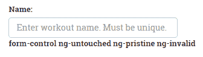

在“名称”输入框中添加一些内容，并从中删除选项卡。标签更改为：


我们在这里看到的是，当用户与该控件交互时，应用于该控件的 CSS 类发生了变化。您还可以通过检查开发人员控制台中的`input`元素来查看这些更改。

如果我们想根据元素的状态对其应用视觉线索，这些 CSS 类转换非常有用。例如，请看以下代码段：

```ts
input.ng-invalid {  border:2px solid red; } 
```

这会在包含无效数据的任何输入控件周围绘制红色边框。

当您向训练页面添加更多验证时，您可以观察（在开发人员控制台中）在用户与`input`元素交互时如何添加和删除这些类。

现在，我们已经了解了模型状态以及如何使用它们，让我们回到验证的讨论（在继续之前，删除刚才添加的变量名和标签）。

# 训练验证

训练数据需要在多种情况下进行验证。

在将`ngModel`的局部变量引用和所需属性添加到`input`字段之后，我们已经能够看到`ngModel`如何跟踪这些控件状态的变化以及如何切换 CSS 样式。

# 显示适当的验证消息

现在，输入需要有一个值；否则，验证将失败。但是，我们如何知道验证是否失败？`ngModel`来救我们。它可以提供特定输入的验证状态。这为我们提供了显示适当验证消息所需的信息。

让我们回到训练名称的输入控件。为了获得要显示的验证消息，我们必须首先将输入标记修改为以下内容：

```ts
<input type="text" name="workoutName" #name="ngModel" class="form-control" id="workout-name" placeholder="Enter workout name. Must be unique." [(ngModel)]="workout.name" required> 
```

我们添加了一个名为`#name`的局部变量，并将`ngModel`赋值给它。这称为模板引用变量，我们可以将其与以下标签一起使用，以显示输入的验证消息：

```ts
<label *ngIf="name.control.hasError('required') && (name.touched)" class="alert alert-danger validation-message">Name is required</label>  
```

如果未提供名称且已触摸控件，我们将显示验证消息。为了检查第一个条件，我们检索控件的`hasError`属性，并查看错误类型是否为`required`。我们检查名称输入是否为`touched`，因为我们不希望在表单首次加载新训练时显示消息。

您会注意到，我们使用了比这种情况下需要的更详细的样式来识别验证错误。我们本可以使用`!name. valid`而不是`name.control.hasError('required')`，它会工作得非常好。然而，使用更详细的方法可以让我们更具体地识别验证错误，这在我们开始向表单控件添加多个验证器时非常重要。我们将在本章稍后介绍如何使用多个验证器。为了保持一致性，我们将使用更详细的方法。

立即加载新的训练页面（`/builder/workouts/new`。在名称输入框中输入值，然后将其删除。错误标签将显示在以下屏幕截图中：

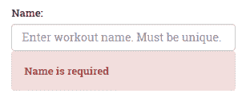

# 添加更多验证

Angular 提供了几种现成的验证器，包括：

*   `required`
*   `minLength`
*   `maxLength`
*   `email`
*   `pattern`

有关开箱即用验证器的完整列表，请参见[中的`Validators`类文档 https://angular.io/api/forms/Validators.](https://angular.io/api/forms/Validators)

我们已经看到了`required`验证器是如何工作的。现在，让我们看看另外两个现成的验证器：`minLength`和`maxLength`。除了要求它之外，我们还希望训练的标题在 5 到 20 个字符之间（我们将在本章稍后介绍`pattern`验证器）。

因此，除了我们之前添加到标题输入框的`required`属性外，我们还将添加`minLength`属性并将其设置为`5`，然后添加`maxLength`属性并将其设置为`20`，如下所示：

```ts
<input type="text" . . . minlength="5" maxlength="20" required> 
```

然后，我们添加另一个标签，其中包含一条消息，该消息将在不满足此验证时显示：

```ts
<label *ngIf="(title.control.hasError('minlength') || title.control.hasError('maxlength')) && workout.title.length > 0" class="alert alert-danger validation-message">Title should be between 5 and 20 characters long.</label>  
```

# 管理多个验证消息

您将看到显示消息的条件现在测试的长度不是零。这可防止在触摸控件但保留为空时显示消息。在这种情况下，应显示标题要求消息。此消息仅在字段中未输入任何内容时显示，我们通过明确检查控件的`hasError`类型是否为`required`来完成此操作：

```ts
<label *ngIf="title.control.hasError('required')" class="alert alert-danger validation-message">Title is required.</label>
```

由于我们将两个验证器附加到此输入字段，因此我们可以通过将两个验证器包装在一个 div 标记中来合并对所接触输入的检查，该标记检查是否满足该条件：

```ts
<div *ngIf="title.touched"> 
  . . . [the two validators] . . . 
</div> 
```

我们刚才所做的展示了如何将多个验证附加到单个输入控件，并在其中一个验证条件不满足时显示相应的消息。然而，很明显，这种方法无法扩展到更复杂的场景。一些输入包含大量验证，控制验证消息何时显示可能变得复杂。随着处理各种显示的表达式变得越来越复杂，我们可能需要重构并将它们移动到自定义指令中。创建自定义指令将在[第 4 章](04.html)、*深入Angular指令*中详细介绍。

# 用于练习的自定义验证消息

没有任何锻炼的锻炼是没有用的。训练中应至少有一项运动，我们应验证此限制。

练习计数验证的问题在于，它不是由用户直接输入并由框架验证的。尽管如此，我们仍然需要一种机制来以类似于此表单上其他验证的方式验证练习计数。

我们将要做的是在包含练习计数的表单中添加一个隐藏的输入框。然后我们将其绑定到`ngModel`并添加一个模式验证器，该验证器将进行检查以确保有多个练习。我们将输入框的值设置为练习的计数：

```ts
<input type="hidden" name="exerciseCount" #exerciseCount="ngModel" ngControl="exerciseCount" class="form-control" id="exercise-count" [(ngModel)]="workout.exercises.length" pattern="[1-9][0-9]*"> 
```

然后，我们将向其附加一条验证消息，类似于我们刚才对其他验证器所做的操作：

```ts
<label *ngIf="exerciseCount.control.hasError('pattern')" class="alert alert-danger extended-validation-message">The workout should have at least one exercise!</label>  
```

我们在这里使用的不是真正意义上的`ngModel`。不涉及双向绑定。我们只对使用它进行自定义验证感兴趣。

打开新的训练页面，添加一项训练，然后将其删除；我们应该看到这个错误：

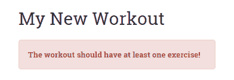

我们在这里所做的可以很容易地完成，而不需要涉及任何模型验证基础设施。但是，通过将验证与基础设施挂钩，我们确实获得了一些好处。我们现在可以以一致和熟悉的方式确定特定模型的错误和整体形式的错误。最重要的是，如果我们在此验证失败，整个表单将无效。

以我们刚才的方式实现自定义验证并不是您经常想做的事情。相反，在自定义指令中实现这种复杂的逻辑通常更有意义。我们将在[第 4 章](04.html)、*Angular指令*中详细介绍如何创建自定义指令。

我们新实施的`Exercise Count`验证的一个麻烦是，新`Workout`的屏幕首次出现时，它会显示出来。有了此消息，我们无法使用`ng-touched`隐藏显示。这是因为练习是以编程方式添加的，我们用来跟踪其计数的隐藏输入在添加或删除练习时从未改变。

为了解决这个问题，我们需要一个额外的值来检查练习列表的状态何时减少到零，除非表单是第一次加载的。出现这种情况的唯一方法是，用户在训练中添加训练，然后删除训练，直到不再有训练。因此，我们将向组件添加另一个属性，用于跟踪是否调用了 remove 方法。我们称该值为`removeTouched`，并将其初始值设置为`false`：

```ts
removeTouched: boolean = false; 
```

然后，在移除方法中，我们将该值设置为`true`：

```ts
removeExercise(exercisePlan: ExercisePlan) { 
    this.removeTouched = true; 
    this.workoutBuilderService.removeExercise(exercisePlan); 
} 
```

接下来，我们将在验证消息条件中添加`removeTouched`，如下所示：

```ts
<label *ngIf="exerciseCount.control.hasError('pattern') && (removeTouched)" 
```

现在，当我们打开新的训练屏幕时，将不会显示验证消息。但如果用户添加并删除所有练习，则会显示。

为了理解模型验证如何累积到表单验证中，我们需要了解表单级验证提供了什么。然而，即使在这之前，我们也需要实现保存训练并从训练表单调用它。

# 保存训练

我们正在构建的训练需要持久化（仅在内存中）。我们需要做的第一件事是扩展`WorkoutService`和`WorkoutBuilderService`。

`WorkoutService`需要两种新方法`addWorkout`和`updateWorkout`：

```ts
addWorkout(workout: WorkoutPlan){ 
    if (workout.name){ 
        this.workouts.push(workout); 
        return workout; 
    } 
} 

updateWorkout(workout: WorkoutPlan){ 
    for (var i = 0; i < this.workouts.length; i++) { 
        if (this.workouts[i].name === workout.name) { 
            this.workouts[i] = workout; 
            break; 
        } 
    } 
} 
```

`addWorkout`方法对训练名称进行基本检查，然后将训练推送到训练数组中。由于不涉及备份存储，因此如果刷新页面，数据将丢失。我们将在下一章中解决这个问题，在下一章中我们将数据持久化到服务器。

`updateWorkout`方法在现有训练数组中查找具有相同名称的训练，如果找到，则更新并替换它。

我们只在`WorkoutBuilderService`中添加了一种保存方法，因为我们已经在跟踪正在进行的训练构建的上下文：

```ts
save(){ 
    let workout = this.newWorkout ? 
        this._workoutService.addWorkout(this.buildingWorkout) : 
        this._workoutService.updateWorkout(this.buildingWorkout); 
    this.newWorkout = false; 
    return workout; 
} 
```

`save`方法根据是否正在创建新训练或编辑现有训练，在`Workout`服务中调用`addWorkout`或`updateWorkout`。

从服务的Angular来看，这应该足够了。是时候将保存训练的功能集成到`Workout`组件中，并进一步了解表单指令了！

在我们更详细地了解`NgForm`之前，让我们将保存方法添加到`Workout`中，以便在点击`Save`按钮时保存训练。将此代码添加到`Workout`组件：

```ts
save(formWorkout:any){ 
    if (!formWorkout.valid) return; 
    this.workoutBuilderService.save(); 
    this.router.navigate(['/builder/workouts']); 
}  
```

我们使用表单的 invalid 属性检查表单的验证状态，如果表单状态有效，则调用`WorkoutBuilderService.save`方法。

# 更多关于 NgForm 的信息

与将数据发布到服务器的传统表单相比，Angular 中的表单可以发挥不同的作用。如果我们返回并再次查看表单标记，我们将看到它缺少标准操作属性。使用完整页面回发将数据发布到服务器的标准表单行为在 SPA 框架（如 Angular）中没有意义。在 Angular 中，所有服务器请求都是通过源自指令或服务的异步调用发出的。

在引擎盖下，Angular 也在关闭浏览器的内置验证。正如您在本章中所看到的，我们仍在使用与本机 HTML 验证属性相同的验证属性，如`required`。然而，正如 Angular 文档所解释的，在 Angular 表单中，“Angular 使用指令将这些属性与框架中的验证器函数相匹配。”请参见[https://angular.io/guide/form-validation#template-驱动验证](https://angular.io/guide/form-validation#template-driven-validation)。

这里的表单起着不同的作用。当表单封装一组输入元素（如 input、textarea 和 select）时，它为以下内容提供 API：

*   根据窗体上的输入控件确定窗体的状态，例如窗体是脏的还是原始的
*   在窗体或控件级别检查验证错误

如果您仍然需要标准表单行为，您可以向`form`元素添加`ngNoForm`属性，但这肯定会导致整个页面刷新。您还可以通过添加`ngNativeValidate`属性来打开浏览器的内置验证。我们将探讨`NgForm`的细节当我们在本章稍后讨论保存表单和实现验证时，将使用 API

表单中`FormControl`对象的状态由`NgForm`监控。如果其中任何一个无效，则`NgForm`将整个表单设置为无效。在本例中，我们已经能够使用`NgForm`确定一个或多个`FormControl`对象无效，因此表单作为一个整体的状态也是无效的。

在我们完成本章之前，让我们再看一个问题。

# 修复表单和验证消息的保存

打开一个新的训练页面，直接点击保存按钮。表单无效时不会保存任何内容，但对单个表单输入的验证根本不会显示。现在很难知道哪些元素导致了验证失败。这种行为背后的原因很明显。如果我们查看 name 输入元素的错误消息绑定，它如下所示：

```ts
*ngIf="name.control?.hasError('required') && name.touched"
```

请记住，在本章前面，我们明确禁止显示验证消息，直到用户触摸输入控件。同样的问题再次困扰着我们，我们现在需要解决它。

我们没有办法将控件的触碰状态显式更改为未触碰状态。相反，我们将采取一些小伎俩来完成这项工作。我们将引入一个名为`submitted`的新属性。将其添加到`Workout`类定义的顶部，并将其初始值设置为`false`，如下所示：

```ts
submitted: boolean = false;
```

点击保存按钮，变量将被设置为`true`。通过添加突出显示的代码更新保存实现：

```ts
save(formWorkout){ 
 this.submitted = true; 
    if (!formWorkout.valid) return; 
    this._workoutBuilderService.save(); 
    this.router.navigate(['/builder/workouts']); 
} 
```

然而，这有什么帮助？这个修复程序还有一部分要求我们更改每个正在验证的控件的错误消息。表达式现在更改为：

```ts
*ngIf="name.control.hasError('required') && (name.touched || submitted)"   
```

使用此修复程序，当触摸控件或按下表单提交按钮时会显示错误消息（`submitted`为`true`。此表达式修复现在必须应用于出现检查的每个验证消息。

如果现在打开“新建训练”页面并单击“保存”按钮，我们将看到输入控件上的所有验证消息：

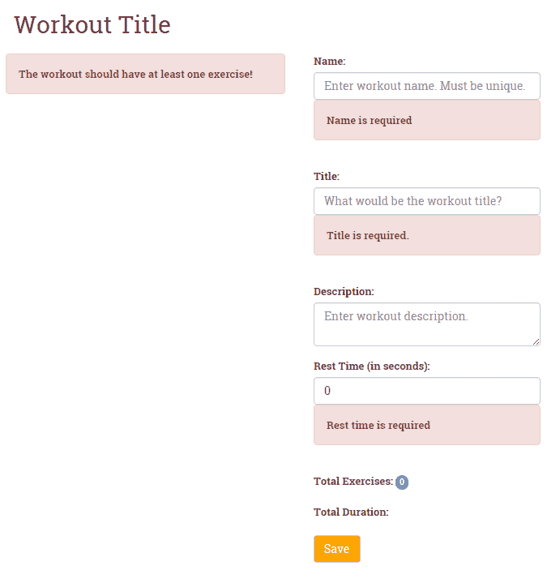

# 反应形式

角支撑的另一种形式称为**反应**形式。**反应形式**从组件类中构造的模型开始。通过这种方法，我们使用**表单生成器 API**在代码中创建表单并将其与模型关联。

考虑到为了使模板驱动的窗体工作，我们必须编写最少的代码，为什么我们应该考虑何时使用反应式？在几种情况下，我们可能需要使用它们。其中包括我们希望对创建表单进行编程控制的情况。正如我们将看到的那样，当我们试图基于从服务器检索的数据动态创建表单控件时，这尤其有益。

如果我们的验证变得复杂，用代码处理它通常会更容易。使用反应式表单，我们可以将这种复杂的逻辑排除在 HTML 模板之外，从而简化模板语法。

反应式表单的另一个显著优点是，它们使对表单进行单元测试成为可能，这与模板驱动表单不同。我们可以简单地在测试中实例化表单控件，然后在页面上的标记之外测试它们。

**反应式表单**使用了三个我们以前没有讨论过的新表单指令：`FormGroup`、`FormControl`和`FormArray`。这些指令允许在代码中构造的表单对象直接绑定到模板中的 HTML 标记。然后，在组件类中创建的表单控件可以直接在表单本身中使用。从技术上讲，这意味着我们不需要将`ngModel`（模板驱动表单的一部分）与反应式表单一起使用（尽管可以使用）。总体方法是一个更干净、更少混乱的模板，更关注驱动表单的代码。让我们开始构建一个反应式表单。

# 从反应式表单开始

我们将使用反应式表单来构建表单，以添加和编辑练习。除此之外，该表单还允许用户添加链接到 YouTube 上的运动视频。由于他们可以添加任意数量的视频链接，我们需要能够动态添加这些视频链接的控件。这项挑战将很好地检验反应式表单在开发更复杂表单时的有效性。

以下是表单的外观：


要开始，请打开`workout-builder.module.ts`并添加以下`import`：

```ts
import { FormsModule, ReactiveFormsModule }   from '@angular/forms'; 
 ... 
@NgModule({ 
    imports: [ 
        CommonModule, 
        FormsModule, 
 ReactiveFormsModule, 
        SharedModule, 
        workoutBuilderRouting 
    ],
```

`ReactiveFormsModule`包含我们构建反应式表单所需的内容。

接下来，从`checkpoint 4.6`中`trainer/src/app`下的`workout-builder/builder-services`文件夹复制`exercise-builder-service.ts`并导入`workout-builder.module.ts`：

```ts
import { ExerciseBuilderService } from "./builder-services/exercise-builder-service"; 
```

然后，将其作为附加提供程序添加到同一文件中的提供程序数组中：

```ts
@NgModule({ 
   . . . 
  providers: [
    WorkoutBuilderService,
    WorkoutResolver,
    ExerciseBuilderService,
    ExerciseResolver
   ]
}) 
```

You will notice here that we also have added `ExerciseResolver` as a provider. We won't be covering that here, but you should copy it from the `exercise` folder as well and also copy the updated `workout-builder-routing.module.ts`, which adds it as a route guard for the navigation to `ExerciseComponent`.

现在，打开`exercise.component.ts`并添加以下导入语句：

```ts
import { Validators, FormArray, FormGroup, FormControl, FormBuilder } from '@angular/forms';
```

这带来了以下内容，我们将使用这些内容构建表单：

*   `FormBuilder`
*   `FormGroup`
*   `FormControl`
*   `FormArray`

最后，我们将`FormBuilder`（以及`Router`、`ActivatedRoute`、`ExerciseBuilderService`注入到我们类的构造函数中：

```ts
  constructor(
      public route: ActivatedRoute,
      public router: Router,
      public exerciseBuilderService: ExerciseBuilderService,
      public formBuilder: FormBuilder
  ) {}
```

有了这些初步的步骤，我们现在可以开始构建我们的表单了。

# 使用 FormBuilderAPI

API 是反应型的基础。您可以将其视为生产我们在代码中构建的表单的工厂。继续向类中添加`ngOnInit`生命周期挂钩，如下所示：

```ts
  ngOnInit() {
    this.sub = this.route.data
        .subscribe(
          (data: { exercise: Exercise }) => {
            this.exercise = data.exercise;
          }
        );

      this.buildExerciseForm();
  } 
```

当`ngOnInit`触发时，它将从`ExerciseResolver`检索并返回的路由数据中提取现有或新`exercise`的数据。这与我们初始化`Workout`组件时遵循的模式相同。

现在，我们通过添加以下代码来实现`buildExerciseForm`方法：

```ts
buildExerciseForm(){ 
    this.exerciseForm = this.formBuilder.group({ 
        'name': [this.exercise.name, [Validators.required, AlphaNumericValidator.invalidAlphaNumeric]], 
        'title': [this.exercise.title, Validators.required], 
        'description': [this.exercise.description, Validators.required], 
        'image': [this.exercise.image, Validators.required], 
        'nameSound': [this.exercise.nameSound], 
        'procedure': [this.exercise.procedure], 
        'videos': this.addVideoArray() 
    }) 
}  
```

让我们检查一下这段代码。首先，我们使用注入的实例`FormBuilder`构造表单并将其分配给局部变量`exerciseForm`。使用`formBuilder.group`，我们向表单添加了几个表单控件。我们通过一个简单的键/值映射来添加它们：

```ts
'name': [this.exercise.name, Validators.required], 
```

映射的左侧是`FormControl`的名称，右侧是一个数组，第一个元素包含控件的值（在我们的例子中，是练习模型上的对应元素），第二个元素是验证器（在本例中，是开箱即用的验证器）。漂亮整洁！通过在模板之外设置表单控件，可以更容易地查看和解释表单控件。

这样我们不仅可以在我们的表单中构建`FormControls`，还可以添加`FormControlGroups`和`FormControlArray`，其中包含`FormControls`。这意味着我们可以创建包含嵌套输入控件的复杂表单。在我们的例子中，正如我们所提到的，我们需要考虑到我们的用户在一个练习中添加多个视频的可能性。我们可以通过添加以下代码来实现这一点：

```ts
'videos': this.addVideoArray() 
```

我们在这里做的是为视频分配一个`FormArray`，这意味着我们可以在这个映射中分配多个控件。为了构造这个新的`FormArray`，我们在类中添加了以下`addVideoArray`方法：

```ts
addVideoArray(){ 
    if(this.exercise.videos){ 
        this.exercise.videos.forEach((video : any) => { 
            this.videoArray.push(new FormControl(video, Validators.required)); 
        }); 
    } 
    return this.videoArray; 
} 
```

该方法为每个视频构造一个`FormControl`；然后将每个添加到分配给表单中视频控件的`FormArray`。

# 将表单模型添加到 HTML 视图中

到目前为止，我们一直在我们班的幕后工作，以建立我们的形式。下一步是将表单连接到视图。为此，我们在代码中使用与构建表单相同的控件：`formGroup`、`formControl`和`formArray`。

打开`exercise.component.html`并添加`form`标签，如下所示：

```ts
<form class="row" [formGroup]="exerciseForm" (ngSubmit)="onSubmit(exerciseForm)">  
```

在标记中，我们首先将刚刚内置代码的`exerciseForm`分配给`formGroup`。这将在我们的编码模型和视图中的表单之间建立连接。我们还在代码中将`ngSubmit`事件连接到`onSubmit`方法（稍后我们将讨论此方法）

# 将表单控件添加到表单输入

接下来，我们开始为表单构建输入。我们将从练习名称的输入开始：

```ts
<input name="name" formControlName="name" class="form-control" id="name" placeholder="Enter exercise name. Must be unique.">  
```

我们将编码表单控件的名称分配给`formControlName`。这将在代码中的控件和标记中的`input`字段之间建立链接。另一个有趣的问题是，我们不使用`required`属性。

# 添加验证

我们要做的下一件事是向控件添加一条验证消息，该消息将在发生验证错误时显示：

```ts
<label *ngIf="exerciseForm.controls['name'].hasError('required') && (exerciseForm.controls['name'].touched || submitted)" class="alert alert-danger validation-message">Name is required</label>
```

请注意，此标记与我们在模板驱动表单中用于验证的标记非常相似，只是用于标识控件的语法更为详细，它再次检查控件的`hasError`属性的状态以确保其有效。

但是等一下！我们如何验证这个输入？我们没有从标记中删除必需的属性吗？这就是我们在代码中添加的控件映射发挥作用的地方。如果您回顾表单模型的代码，您可以看到`name`控件的以下映射：

```ts
'name': [this.exercise.name, Validators.required], 
```

映射数组中的第二个元素将所需的验证器分配给 name 表单控件。这意味着我们不必向模板添加任何内容；相反，表单控件本身通过所需的验证器附加到模板。在代码中添加验证器的能力使我们能够方便地在模板之外添加验证器。这在编写具有复杂逻辑的自定义验证器时特别有用。

# 添加动态表单控件

我们正在构建的练习表单要求我们允许用户向练习中添加一个或多个视频。由于我们不知道用户可能要添加多少视频，因此我们必须在用户单击“添加视频”按钮时动态为这些视频构建`input`字段。下面是它的外观：

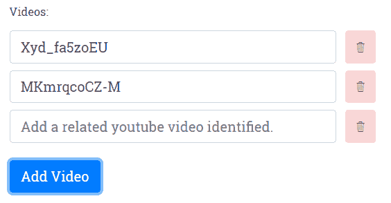

我们已经在我们的组件类中看到了用于执行此操作的代码。现在，让我们来看看它是如何在我们的模板中实现的。

我们首先使用`ngFor`循环浏览我们的视频列表。然后，我们将视频中的索引分配给一个局部变量`i`。到目前为止没有什么意外：

```ts
<div *ngFor="let video of videoArray.controls; let i=index" class="form-row align-items-center">
```

在循环中，我们做三件事。首先，我们为当前练习中的每个视频动态添加一个视频`input`字段：

```ts
<div class="col-sm-10">
    <input type="text" class="form-control" [formControlName]="i" placeholder="Add a related youtube video identified."/>
</div>
```

接下来，我们添加一个按钮，允许用户删除视频：

```ts
<span class="btn alert-danger" title="Delete this video." (click)="deleteVideo(i)">
    <span class="ion-ios-trash-outline"></span>
</span> 
```

我们将组件类中的`deleteVideo`方法绑定到按钮的`click`事件，并将被删除视频的索引传递给它。

然后，我们为每个视频`input`字段添加验证消息：

```ts
<label *ngIf="exerciseForm.controls['videos'].controls[i].hasError('required') && (exerciseForm.controls['videos'].controls[i].touched || submitted)" class="alert alert-danger validation-message">Video identifier is required</label>
```

验证消息的显示模式与本章其他部分使用的相同。我们深入到`exerciseFormControls`组，通过其索引找到特定的控制。同样，语法很冗长，但很容易理解。

# 保存表单

构建被动表单的最后一步是处理保存表单。在前面构造表单标记时，我们在代码中将`ngSubmit`事件绑定到以下`onSubmit`方法：

```ts
  onSubmit(formExercise: FormGroup) {
      this.submitted = true;
      if (!formExercise.valid) { return; }
      this.mapFormValues(formExercise);
      this.exerciseBuilderService.save();
      this.router.navigate(['/builder/exercises']);
  }
```

此方法将`submitted`设置为`true`，这将触发任何验证消息的显示，这些消息以前可能因为表单未被触摸而被隐藏。如果表单上存在任何验证错误，它也会返回而不保存。如果没有，则调用下面的`mapFormValues`方法，将表单中的值分配给要保存的`exercise`：

```ts
  mapFormValues(form: FormGroup) {
      this.exercise.name = form.controls['name'].value;
      this.exercise.title = form.controls['title'].value;
      this.exercise.description = form.controls['description'].value;
      this.exercise.image = form.controls['image'].value;
      this.exercise.nameSound = form.controls['nameSound'].value;
      this.exercise.procedure = form.controls['procedure'].value;
      this.exercise.videos = form.controls['videos'].value;
  }
```

然后，它调用`ExerciseBuilderService`中的 save 方法，并将用户路由回练习列表屏幕（请记住，任何新练习都不会显示在该列表中，因为我们尚未在应用中实现数据持久化）。

我们希望这能说明问题；当我们试图构建更复杂的表单时，被动表单提供了许多优势。它们允许从模板中删除编程逻辑。它们允许以编程方式将验证程序添加到表单中。而且，它们支持在运行时动态构建表单。

# 自定义验证器

现在，在结束本章之前，我们再看一件事。任何从事过 web 表单构建（Angular 或任何其他 web 技术）工作的人都知道，我们经常被要求创建我们正在构建的应用特有的验证。Angular 为我们提供了通过构建自定义验证器来增强反应式表单验证的灵活性。

在构建练习表时，我们需要确定输入的内容，因为名称只包含字母数字字符，不包含空格。这是因为当我们将练习存储在远程数据存储中时，我们将使用练习的名称作为其键。因此，除了标准的必填字段验证器之外，让我们构建另一个验证器来检查以确保输入的名称仅为字母数字形式。

创建自定义控件非常简单。在其最简单的形式中，Angular 自定义验证器是一个函数，它将控件作为输入参数，运行验证检查，并返回 true 或 false。那么，让我们首先添加一个名为`alphanumeric-validator.ts`的 TypeScript 文件。在该文件中，首先从`@angular/forms`导入`FormControl`，然后将以下类添加到该文件中：

```ts
export class AlphaNumericValidator {
    static invalidAlphaNumeric(control: FormControl): { [key: string]: boolean } {
        if ( control.value.length && !control.value.match(/^[a-z0-9]+$/i) ) {
            return {invalidAlphaNumeric: true };
        }
        return null;
    }
}
```

代码遵循我们刚才提到的创建验证器的模式。唯一可能有点令人惊讶的是，当验证失败时，它返回 true！只要您清楚这一怪癖，编写自己的自定义验证器应该没有问题。

# 将自定义验证器集成到表单中

那么，我们如何将自定义验证器插入到表单中呢？如果我们使用反应形式，答案很简单。当我们在代码中构建表单时，我们添加它就像一个内置的验证器。让我们这样做吧。打开`exercise.component.ts`并首先为我们的自定义验证器添加导入：

```ts
import { AlphaNumericValidator } from '../alphanumeric-validator'; 
```

然后，修改表单生成器代码，将验证程序添加到`name`控件：

```ts
buildExerciseForm(){ 
    this.exerciseForm = this._formBuilder.group({ 
'name': [this.exercise.name, [Validators.required, AlphaNumericValidator.invalidAlphaNumeric]], 
  . . . [other form controls] . . . 
    }); 
} 

```

由于 name 控件已经有了一个必需的验证器，因此我们使用包含两个验证器的数组添加了`AlphaNumericValidator`作为第二个验证器。该数组可用于向控件添加任意数量的验证程序。

最后一步是将控件的适当验证消息合并到模板中。打开`workout.component.html`并在显示所需验证器消息的标签下方添加以下标签：

```ts
<label *ngIf="exerciseForm.controls['name'].hasError('invalidAlphaNumeric') && (exerciseForm.controls['name'].touched || submitted)" class="alert alert-danger validation-message">Name must be alphanumeric</label> 
```

如果在名称输入框中输入了非字母数字值，则练习屏幕现在将显示验证消息：


正如我们希望您看到的，反应式表单使我们能够以一种简单的方式向表单中添加自定义验证器，从而允许我们在代码中维护验证逻辑，并轻松地将其集成到模板中。

您可能已经注意到，在本章中，我们没有介绍如何在模板驱动的表单中使用自定义验证器。这是因为实现它们需要构建自定义指令的附加步骤。我们将在[第 4 章](04.html)、*深入的Angular指令*中介绍这一点。

# 运行验证的配置选项

在我们开始验证之前，还有一个主题需要讨论，那就是运行验证的配置选项。到目前为止，我们一直在使用默认选项，它对每个输入事件运行验证检查。但是，您可以选择将它们配置为在“模糊”（即用户离开输入控件时）或提交表单时运行。您可以在表单级别或逐个控件设置此配置。

例如，我们可能会决定，为了避免处理训练表单中缺少的练习的复杂性，我们将该表单设置为仅在提交时验证。我们可以通过在表单标记中添加以下突出显示的分配`NgFormOptions`来设置：

```ts
<form #f="ngForm" name="formWorkout" (ngSubmit)="save(f.form)" [ngFormOptions]="{updateOn: 'submit'}" class="row">
```

这指示 Angular 仅在`submit`上运行我们的验证。尝试一下，您会发现在表单中输入条目时不会出现任何验证。将表单留空并按下保存按钮，您将看到验证消息出现。当然，采用这种方法意味着在用户按下“保存”按钮之前，不会有任何关于验证的视觉提示。

在我们的表单中使用这种方法还有一些其他意想不到的副作用。首先，当我们输入标题输入框时，标题不再在屏幕顶部更新。该值仅在按 Save 时更新。其次，如果您添加一个或多个训练，然后删除所有训练，您还会看到一条验证消息。这是因为我们为此控件设置了特殊条件，导致它在正常验证流之外触发。

所以，也许我们应该采取不同的方法。Angular 通过允许我们使用`ngModelOptions`在控制级别进行此类配置，提供了对验证流实施更细粒度控制的选项。例如，让我们从表单标记中删除`ngFormOptions`赋值，并修改 title 输入控件以添加`ngModelOptions`，如下所示：

```ts
<input type="text" name="title" class="form-control" #title="ngModel" id="workout-title" placeholder="What would be the workout title?" [(ngModel)]="workout.title" [ngModelOptions]="{updateOn: 'blur'}" minlength="5" maxlength="20" required>
```

然后您会注意到，当您在输入框中键入标题时，它不会更新屏幕上的标题，直到您将其移出（这会触发`updateOn`事件）：

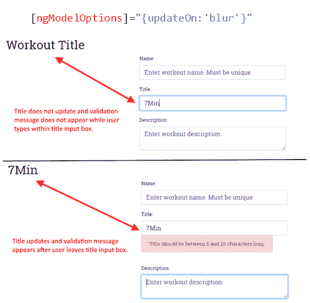

您会记得，默认选项会导致标题随着每次击键而更新。这是一个人为的例子，但它说明了这些配置中的差异是如何工作的。

在这里，您可能看不到使用“启用模糊”设置的必要性。但是，如果您可能通过调用外部数据存储来进行验证，这种方法可能有助于限制正在进行的调用的数量。在[第 4 章](04.html)、*深入的Angular指令*中，当我们实现一个定制指令时，进行这样的远程调用正是我们要做的。该指令将检查远程数据存储中已存在的重复名称。因此，让我们从 title 输入控件中删除此配置，并将其放在 name 输入控件上，如下所示：

```ts
<input type="text" name="workoutName" #name="ngModel" class="form-control" id="workout-name" placeholder="Enter workout name. Must be unique." [(ngModel)]="workout.name" [ngModelOptions]="{updateOn: 'blur'}" required>
```

我们还可以在反应式表单中设置验证时间选项。从我们已经了解到的反应式表单中，您不会惊讶地发现我们将在代码中而不是在模板中应用这些设置。例如，要为表单组设置它们，请使用以下语法：

```ts
new FormGroup(value, {updateOn: 'blur'}));
```

我们还可以将它们应用于单个表单控件，这就是我们在练习表单中要做的。与训练表单一样，我们希望能够通过远程呼叫验证名称的唯一性。因此，我们希望以类似的方式限制验证检查。我们将通过向创建 name form 控件的代码中添加以下内容来实现此目的：

```ts
  buildExerciseForm() {
      this.exerciseForm = this.formBuilder.group({
          'name': [
            this.exercise.name,
 {
 updateOn: 'blur',
 validators: [Validators.required, AlphaNumericValidator.invalidAlphaNumeric]
 }
          ],
        ....
      });
  }
```

请注意，我们将设置与`validators`数组一起放在一对花括号内的 options 对象中。

# 总结

我们现在有一个*私人教练*应用。将特定的*7 分钟锻炼*应用转换为通用*私人教练*应用的过程帮助我们学习了许多新概念。我们从定义新的应用需求开始本章。然后，我们将模型设计为共享服务。

我们为*私人教练*app 定义了一些新的视图和相应的路径。我们还使用子路由和异步路由将*训练生成器*从应用的其余部分中分离出来。

然后，我们将注意力转向了健身锻炼。本章的主要技术重点之一是Angular形式。*训练生成器*采用了许多表单输入元素，我们使用模板驱动和反应式表单实现了许多常见表单场景。我们还深入探讨了Angular验证，并实现了一个自定义验证器。我们还介绍了配置运行验证的计时选项。

下一章是关于客户机-服务器交互的。我们创建的训练和练习需要持续进行。在下一章中，我们将构建一个持久层，它将允许我们在服务器上保存训练和锻炼数据。

在我们结束本章之前，这里有一个友好的提醒。如果您还没有完成*私人教练*的锻炼计划，请继续进行。您始终可以将您的实现与配套代码库中提供的内容进行比较。您还可以向原始实现中添加一些内容，例如上传练习图像的文件，并且在您更加熟悉客户机-服务器交互后，进行远程检查以确定 YouTube 视频是否确实存在。**