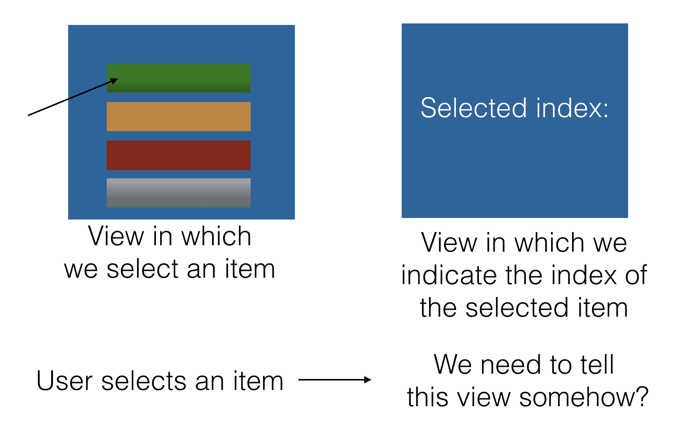
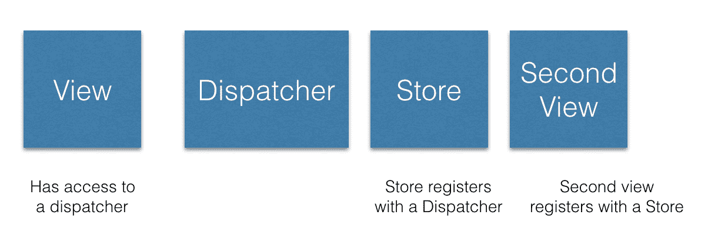
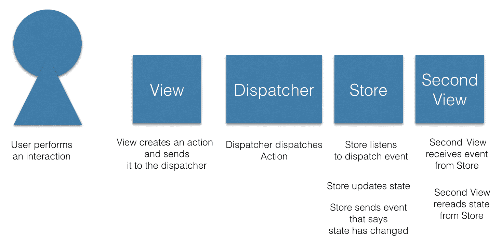
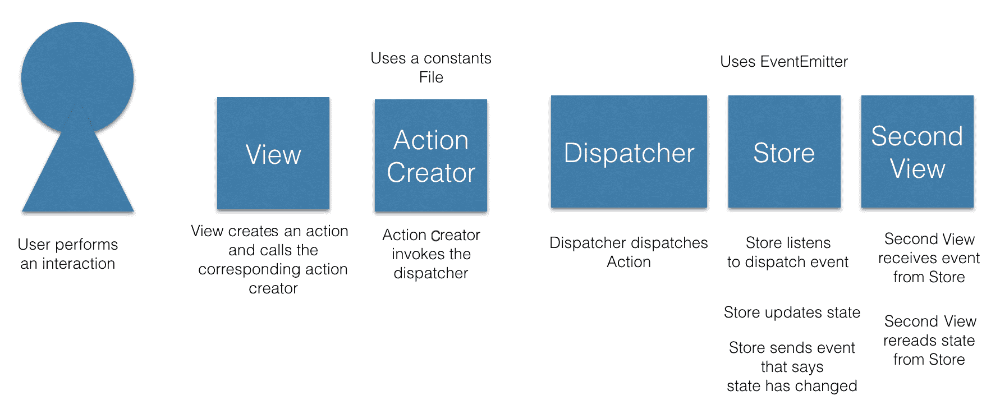

# 五、1.21 GW——解释 Flux 模式

您的应用已经增长，在这个过程中，您慢慢地感觉到您正在失去对应用在给定点知道的内容的跟踪，我们称之为应用的状态。可能还有其他问题，例如应用的某些部分与他们所知道的不一致。在一个部分中发生的更新可能没有应用到另一个部分中，您会挠头，思考是否应该如此困难，是否有更好的答案？

你完全有可能只是拿起这本书，因为你已经听说 NgRx 是构建你的应用的方法，你很好奇，想知道更多。

让我们先解释一下我们的标题。1.21 千兆瓦是什么意思？我将引用电影《回到未来》中的角色 Doc Brown（[）http://www.imdb.com/name/nm0000502/?ref_=tt_trv_qu](http://www.imdb.com/name/nm0000502/?ref_=tt_trv_qu) ：

"Marty, I'm sorry, but the only power source capable of generating 1.21 gigawatts of electricity is a bolt of lightning."

我们为什么要谈论《回到未来》这部电影？这就是 Flux 这个名字的由来。是时候引用同一部电影的另一句话了：

"Yes! Of course! November 5, 1955! That was the day I invented time-travel. I remember it vividly. I was standing on the edge of my toilet hanging a clock, the porcelain was wet, I slipped, hit my head on the sink, and when I came to I had a revelation! A vision! A picture in my head! A picture of this! This is what makes time travel possible: the **flux** capacitor!"

如你所见，Flux 这个名字有一个解释。它显然让我们能够及时旅行。至少对于 Redux，我们将在本书后面介绍，时间旅行可以通过一种叫做时间旅行调试的方式实现。亲爱的读者，这是否需要一道闪电，有待你去发现

Flux 是 Facebook 创建的一种架构模式。它的出现是因为人们认为 MVC 模式根本无法扩展。它不适用于大型代码库，因为它们往往变得脆弱，随着越来越多的特性被添加，通常变得复杂，最重要的是，不可预测。现在让我们暂且不谈这个词，不可预测。

大型系统被认为是不可预测的，因为当模型和视图的数量真正增长时，模型和视图之间的数据流是双向的，如下图所示：


在这里，我们可以看到模型和视图的数量开始增长。只要一个模型与一个视图对话，一切都在某种程度上处于控制之下，反之亦然。然而，这种情况很少发生。在前面的图中，我们看到一个视图突然可以与多个模型对话，反之亦然，这意味着我们对系统产生了级联效应，我们突然失去了控制。当然，只使用一支偏离方向的箭看起来并没有那么糟糕，但是想象一下，这支箭突然变成了十支箭，那么我们手上就有了一个真正的问题。

正是由于我们允许双向数据流发生，事情变得复杂，我们失去了可预测性。解决这一问题的药物或疗法被认为是一种更简单的数据流类型，即单向流。现在，有一些关键参与者参与了无方向数据流的实现，这让我们了解了本章的目的。

在本章中，我们将学习：

*   动作和动作创造者是什么
*   dispatcher 如何在应用中作为消息中心发挥中心作用
*   商店的状态管理
*   如何通过编写Flux应用流将我们对Flux的知识付诸实践

# 核心概念概述

流量模式的核心是单向数据流。它使用一些核心概念来实现这个流程。其主要思想是当在 UI 上创建事件时，通过用户的交互，创建一个动作。该动作由意图和有效载荷组成。目的就是你想要达到的。把意图想象成一个动词。添加项目、删除项目等。有效载荷是实现我们的意图所需的数据更改。如果我们试图添加一个项目，那么负载就是新创建的项目。然后，在调度器的帮助下，该操作在流中传播。该操作及其数据最终会存储在存储中。

构成Flux模式的概念包括：

*   Action 和 Action creators，我们在其中设置意图和数据有效负载
*   调度员，我们在网络上的蜘蛛，能够左右发送消息
*   商店，我们的国家和国家管理中心

所有这些一起形成了流量模式并促进了单向数据流。考虑下面的图表：


这里描述的是一个无方向的数据流。数据从**视图**到**动作**，从**动作**到**调度器**，从**调度器**到**存储**。触发流的方式有两种：

*   第一次加载应用，从**存储**中提取数据以填充视图。
*   用户交互发生在视图中，导致改变某些内容的意图。意图封装在**动作**中，然后通过**调度器**发送到**存储**。在**存储**中，它可以通过**API**保存在数据库中，或者保存为应用状态，或者两者兼而有之。

在接下来的部分中，让我们更详细地探讨每个概念，并重点介绍一些代码示例。

# 统一的数据流

让我们介绍一下统一数据流中涉及到的所有方面，从最高层开始，然后一个概念一个概念地慢慢往下介绍。我们将构建一个由两个视图组成的应用。在第一个视图中，用户将从列表中选择一个项目。这将导致创建一个操作。然后，该操作将由调度程序调度。该动作及其有效载荷将在存储中结束。另一个视图同时侦听来自存储的更改。当选择某个项目时，第二个视图将被识别，因此可以在其 UI 中指示已选择特定项目。从较高的层次来看，我们的应用及其流程如下所示：



# 行动–捕捉意图

一个动作就像一个意图和伴随的数据一样简单，也就是一条消息。然而，行动是如何发生的？当用户与 UI 交互时，会发生一个操作。用户可以选择列表中的特定项目，或按下按钮以提交表单。提交表单应该反过来导致创建产品。

让我们看两个不同的动作：

*   在列表中选择一个项目，我们感兴趣的是保存所选项目的索引
*   将待办事项保存到待办事项列表

动作由对象表示。该对象有两个感兴趣的属性：

*   类型：这是一个唯一的字符串，告诉我们操作的意图，例如，`SELECT_ITEM`
*   数据：这是我们想要保存的数据，例如，所选项目的数字索引

给出我们的第一个示例操作，该操作的代码表示如下所示：

```ts
{
  type: 'SELECT_ITEM',
  data: 3 // selected index
}
```

好的，我们已经准备好了我们的行动，我们也可以把它看作是一个信息。我们希望发送消息，以便在 UI 中突出显示所选项目。由于这是一个无方向的流程，我们需要遵循一个图表化的流程，并将消息传递给下一方，即调度员。

# Dispatcher–网络中的蜘蛛

可以把调度员想象成网络中处理传递给它的消息的蜘蛛，也可以把调度员想象成承诺你的消息将到达目标目的地的邮递员。一方面，调度员活着就是向任何愿意倾听的人发送消息。Flux 架构中通常只有一个`dispatcher`，典型用法如下所示：

```ts
dispatcher.dispatch(message);
```

# 听调度员的话

我们已经确定调度员向任何愿意听的人发送消息。现在是做那个倾听者的时候了。调度器需要一个`register`或`subscribe`方法，以便您能够监听传入消息。其设置通常如下所示：

```ts
dispatcher.register(function(message){});
```

现在，当您以这种方式设置侦听器时，它将能够侦听正在发送的任何消息类型。你想缩小这个范围；通常，侦听器被指定为仅处理特定主题周围的少数消息类型。您的听众很可能是这样的：

```ts
dispatcher.register((message) => {
  switch(message.type) {
    case 'SELECT_ITEM':
      // do something
  }
});
```

好的，所以我们可以只过滤出我们关心的消息类型，但是在实际填充一些代码之前，我们需要考虑这个侦听器是谁。答案很简单：就是商店。

# 存储–管理状态、数据检索和回调

我们很容易将存储视为数据所在的地方。然而，这并不是全部。商店的职责可以通过以下列表表达：

*   国家持有人
*   管理状态，可以在需要时进行更新
*   能够处理副作用，例如通过 HTTP 获取/持久化数据
*   处理回调

正如您所看到的，这不仅仅是存储状态。现在让我们重新连接到我们在使用`dispatcher`设置侦听器时正在做的事情。让我们将该代码移动到我们的存储文件`store.js`中，并将消息内容保存在我们的存储中：

```ts
// store.js

let store = {};

function selectIndex(index) {
  store["selectedIndex"] = index;
}

dispatcher.register(message => {
  switch (message.type) {
    case "SELECT_INDEX":
      selectIndex(message.data);
      break;
  }
});
```

好的，现在商店被告知新索引，但是缺少一个重要的部分，我们如何告诉用户界面？我们需要一种方法来告诉用户界面有些东西已经改变了。更改意味着 UI 应该重新读取其数据。

# 景色

要告诉观点某事已经发生并采取行动，需要发生三件事：

*   视图需要作为侦听器注册到存储
*   商店需要发送一个事件，表明发生了变化
*   视图需要重新加载其数据

从存储开始，我们需要构建它，以便您可以注册为其事件的侦听器。因此，我们增加了`addListener()`方法：

```ts
// store-with-pubsub.js

function selectIndex(index) {
  store["selectedIndex"] = index;
}

// registering with the dispatcher
dispatcher.register(message => {
  switch (message.type) {
    case "SELECT_INDEX":
      selectIndex(message.data);

      // signals to the listener that a change has happened
      store.emitChange();
 break;
 }
});

class Store {
  constructor() {
    this.listeners = [];
  }

  addListener(listener) {
 if (!this.listeners["change"]) {
      this.listeners["change"] = [];
    }
 this.listeners["change"].push(listener);
  }

  emitChange() {
    if (this.listeners["change"]) {
      this.listeners["change"].forEach(cb => cb());
    }
  }

  getSelectedItem() {
    return store["selectedIndex"];
  }
}

const store = new Store();
export default store;
```

在前面的代码中，我们还添加了通过添加`emitChange()`方法发出事件的功能。您可以轻松地切换此实现以使用`EventEmitter`或类似的。所以现在是时候把我们的观点与商店联系起来了。我们通过如下方式调用`addListener()`方法来实现：

```ts
// view.js

import store from "./store-with-pubsub";

class View {
  constructor(store) {
    this.index = 0;
    store.addListener(this.notifyChanged);
  }

  // invoked from the store
  notifyChanged() {
    // rereads data from the store
 this.index = store.getSelectedItem();

    // reloading the data
    render();
  }
  render() {
    const elem = document.getElementById('view');
    elem.innerHTML = `Your selected index is: ${this.index}`;
  }
}

let view = new View();

// view.html
<html>
  <body>
    <div id="view"></div>
  </body>
</html>
```

在前面的代码中，我们实现了`notifyChanged()`方法，该方法在调用时从存储调用`getSelectedItem()`方法，从而接收新值。

在这一点上，我们已经描述了整个链：一个视图如何接收用户交互，将其转化为一个动作，然后将其发送到一个商店，更新商店的状态。然后，存储发出另一个视图正在侦听的事件。当接收到事件时，在视图中重新读取存储区的状态，然后视图可以自由地以其认为合适的方式呈现该状态（它刚刚读入）。

我们在这里描述了两件事：

*   如何设置流程
*   信息是如何流动的

设置流程可以用下图描述：



对于第二个场景，即信息如何在系统中流动，可以用以下方式进行描述：



# 演示统一数据流

好的，我们已经描述了应用的组成部分：

*   用户可以在其中选择索引的视图
*   允许我们发送消息的调度器
*   包含所选索引的存储
*   从存储中读取所选索引的第二个视图

让我们从所有这些中构建一个真正的应用。以下代码位于`Chapter2/demo`下的代码库中。

# 创建选择视图

首先，我们需要执行选择的视图：

```ts
// demo/selectionView.js

import dispatcher from "./dispatcher";

console.log('selection view loaded');

class SelectionView {
  selectIndex(index) {
 console.log('selected index ', index);
    dispatcher.dispatch({
 type: "SELECT_INDEX",
      data: index
 });
 }
}

const view = new SelectionView();
export default view;
```

我们已经将我们打算使用的上述`selectIndex()`方法加粗。

# 添加调度程序

接下来，我们需要一个能够接收我们的消息的调度员，如下所示：

```ts
// demo/dispatcher.js

class Dispatcher {
  constructor() {
    this.listeners = [];
  }

  dispatch(message) {
    this.listeners.forEach(listener => listener(message));
  }

  register(listener) {
    this.listeners.push(listener);
  }
}

const dispatcher = new Dispatcher();
export default dispatcher;
```

# 添加商店

存储区将充当我们状态的数据源，但也可以在存储区发生更改时通知任何侦听器：

```ts
// demo/store.js

import dispatcher from './dispatcher';

function selectIndex(index) {
  store["selectedIndex"] = index;
}

// 1) store registers with dispatcher
dispatcher.register(message => {
  switch (message.type) {
    // 3) message is sent by dispatcher ( that originated from the first view)
    case "SELECT_INDEX":
      selectIndex(message.data);
      // 4) listener, a view, is being notified of the change
      store.emitChange();
      break;
    }
});

class Store {
  constructor() {
    this.listeners = [];
  }

  // 2) listener is added by a view
  addListener(listener) {
    if (!this.listeners["change"]) {
      this.listeners["change"] = [];
    }

    this.listeners["change"].push(listener);
  }

  emitChange() {
    if (this.listeners["change"]) {
      this.listeners["change"].forEach(cb => cb());
    }
  }

  getSelectedItem() {
    return store["selectedIndex"];
  }
}

const store = new Store();
export default store;
```

# 添加选定视图

此视图将向应用商店注册，并要求更新其内容。如果有任何更新，将通知它并读取存储中的数据，此视图将传达存储值现在是什么：

```ts
// demo/selectedView.js

import store from "./store";

console.log('selected view loaded');

class SelectedView {
  constructor() {
    this.index = 0;
    store.addListener(this.notifyChanged.bind(this));
  }

  notifyChanged() {
    this.index = store.getSelectedItem();
    console.log('new index is ', this.index);
  }
}

const view = new SelectedView();
export default SelectedView;
```

# 运行演示

在运行演示之前，我们需要一个应用文件`app.js`。`app.js`文件应在我们的视图中要求并进行选择：

```ts
// demo/app.js

import selectionView from './selectionView';
import selectedView from './selectedView';

// carry out the selection
selectionView.selectIndex(1);

```

要运行我们的演示，我们需要编译它。以上我们使用的是 ES2015 模块。要编译这些，我们将使用`webpack`。我们需要通过在终端中键入以下内容来安装`webpack`：

```ts
npm install webpack webpack-cli --save-dev
```

一旦我们这样做了，我们需要创建`webpack.config.js`文件，告诉 Webpack 如何编译我们的文件，以及在哪里放置生成的包。该文件如下所示：

```ts
// webpack.config.js

module.exports = {
  entry: "./app.js",
  output: { 
    filename: "bundle.js"
  },
  watch: false
};
```

这告诉 Webpack，`app.js`是我们的应用的入口点，它应该在创建输出文件`bundle.js`时对所有依赖项进行爬网。默认情况下，Webpack 会将`bundle.js`放在`dist`目录中。

还有一件事，我们需要一个 HTML 文件，我们将其命名为`index.html`。我们将把它放在`dist`文件夹下。应该是这样的：

```ts
// demo/dist/index.html

<html>
  <body>
    <script src="bundle.js"></script>
  </body>
</html>

```

最后，要运行我们的应用，我们需要用 Webpack 编译它，启动 HTTP 服务器并启动浏览器。我们将通过`demo`目录中的以下命令完成所有这些操作：

```ts
webpack && cd dist && http-server -p 5000
```

现在，启动浏览器并导航到`http://localhost:5000`。您应该看到以下内容：


所有这些都演示了如何使用调度器和存储进行通信。

# 向流程中添加更多操作

让我们在这里做一个现实检查。我们还没有尽可能完美地构建Flux流。总体情况是正确的，但如果我们能稍微清理一下，为更多的操作腾出空间，那就太好了，这样我们就能真正了解应用应该如何从这里发展

# 清理视野

业务的第一个顺序是查看我们的第一个视图，以及它对用户交互的反应。现在看起来是这样的：

```ts
// first.view.js

import dispatcher from "./dispatcher";

class FirstView {
  selectIndex(index) {
    dispatcher.dispatch({
      type: "SELECT_INDEX",
      data: index
    });
  }
}

let view = new FirstView();
```

向混合中添加更多操作意味着我们将使用以下几种方法扩展视图：

```ts
// first.viewII.js

import dispatcher from "./dispatcher";

class View {
  selectIndex(data) {
    dispatcher.dispatch({
      type: "SELECT_INDEX",
      data
    });
  }

  createProduct(data) {
    dispatcher.dispatch({
      type: "CREATE_PRODUCT",
      data
    });
  }

  removeProduct(data) {
    dispatcher.dispatch({
      type: "REMOVE_PRODUCT",
      data
    });
  }
}

let view = new View(); 
```

好了，现在我们来看看如何添加动作。所有这些对`dispatcher`和魔术字符串的调用看起来有点难看，所以我们通过创建一个名为`product.constants.js`的常量文件来清理这个问题，该文件由以下代码组成：

```ts
// product.constants.js

export const SELECT_INDEX = "SELECT_INDEX",
export const CREATE_PRODUCT = "CREATE_PRODUCT",
export const REMOVE_PRODUCT = "REMOVE_PRODUCT"
```

让我们再做一件事。让我们将`dispatcher`移动到`product.actions.js`中；这通常被称为动作创建者。这将包含`dispatcher`并参考我们的`product.constants.js`文件。那么，让我们创建所述文件：

```ts
// product.actions.js

import {
  SELECT_INDEX,
  CREATE_PRODUCT,
  REMOVE_PRODUCT
} from "./product-constants";
import dispatcher from "./dispatcher";
import ProductConstants from "./product.constants";

export const selectIndex = data =>
  dispatcher.dispatch({
    type: SELECT_INDEX,
    data
  });

export const createProduct = data =>
  dispatcher.dispatch({
    type: CREATE_PRODUCT,
    data
  });

export const removeProduct = data =>
  dispatcher.dispatch({
    type: REMOVE_PRODUCT,
    data
  });
```

通过这些构造，我们可以将视图清理得相当清楚，如下所示：

```ts
// first.viewIII.js

import { 
  selectIndex, 
  createProduct, 
  removeProduct 
} from 'product.actions';

function View() {
  this.selectIndex = index => {
    selectIndex(index);
  };

  this.createProduct = product => {
    createProduct(product);
  };

  this.removeProduct = product => {
    removeProduct(product)
  };
}

var view = new View();
```

# 清理商店

我们可以对商店进行一些改进。没有必要编写我们目前所做的所有代码。事实上，有些库在处理某些功能方面做得更好。

在我们应用我们所想到的所有这些更改之前，让我们回顾一下我们的商店可以做什么，以及在清理工作之后还需要哪些功能。

让我们提醒自己，到目前为止，我们的商店能够做到什么：

*   处理状态更改：它处理状态更改；无论是创建、更新、列出还是删除状态，存储都可以更改状态。
*   Subscribable：它允许您订阅它；对于商店来说，拥有订阅功能非常重要，例如，视图可以在商店更改时监听商店的状态。视图的适当反应是，例如，基于新数据重新排序。
*   可以传达状态更改：它可以发送其状态已更改的事件；这与能够订阅存储一起进行，但这实际上是通知侦听器状态已更改的行为。

# 添加事件发射器

最后两个项目符号实际上可以浓缩为一个主题，即事件，或者注册并触发事件的能力。

那么，商店的清理工作是什么样子的，我们为什么要清理它呢？清理它的原因是它使代码更简单。有一个标准库，通常在构建存储时使用，称为`EventEmitter`。该库只处理我们前面提到的内容，即它能够注册和触发事件。它是 pub-sub 模式的一个简单实现。基本上，`EventEmitter`允许您订阅某些事件，也允许您触发事件。有关模式本身的更多信息，请查看以下链接：[https://en.wikipedia.org/wiki/Publish%E2%80%93subscribe_pattern](https://en.wikipedia.org/wiki/Publish%E2%80%93subscribe_pattern) 。

您当然可以为此编写自己的代码，但是能够使用专用库，以便能够专注于其他重要的事情，例如解决业务问题，这是很好的。

我们决定使用`EventEmitter`库，我们采用以下方式：

```ts
// store-event-emitter.js

export const Store = (() => {
  const eventEmitter = new EventEmitter();
  return {
    addListener: listener => {
      eventEmitter.on("changed", listener);
    },
    emitChange: () => {
      eventEmitter.emit("changed");
    },
    getSelectedItem: () => store["selectedItem"]
  };
})();
```

这使我们的代码更简洁，因为我们不再需要保存内部订阅者列表。我们还可以做更多的改变，所以让我们在下一节讨论这个问题。

# 添加和清理寄存器方法

商店的工作之一就是处理事件，尤其是当商店想要传达其状态发生变化的观点时。在`store.js`文件中，其他事情也在发生，比如向`dispatcher`注册我们自己，以及能够接收发送的动作。我们使用这些操作来更改存储的状态。让我们提醒自己这是什么样子：

```ts
// store.js

let store = {};

function selectIndex(index) {
  store["selectedIndex"] = index;
}

dispatcher.register(message => {
  switch (message.type) {
    case "SELECT_INDEX":
      selectIndex(message.data);
      break;
  }
});
```

在这里，我们只支持一项行动，即`SELECT_INDEX`。我们需要做两件事：

*   增加另外两个动作`CREATE_PRODUCT`和`REMOVE_PRODUCT`，以及伴随的功能`createProduct()`和`removeProduct()`
*   停止使用魔术字符串，开始使用我们的常量文件
*   使用我们在`store-event-emitter.js`文件中创建的存储

让我们实施前面列表中建议的更改：

```ts
// store-actions.js

import dispatcher from "./dispatcher";
import {
  SELECT_INDEX,
  CREATE_PRODUCT,
  REMOVE_PRODUCT
} from "./product.constants";

let store = {};

function selectIndex(index) {
  store["selectedIndex"] = index;
}

export const Store = (() => {
  var eventEmitter = new EventEmitter();
  return {
    addListener: listener => {
      eventEmitter.on("changed", listener);
    },
    emitChange: () => {
      eventEmitter.emit("changed");
    },
    getSelectedItem: () => store["selectedItem"]
  };
})();

dispatcher.register(message => {
  switch (message.type) {
    case "SELECT_INDEX":
      selectIndex(message.data);
      break;
  }
});

const createProduct = product => {
  if (!store["products"]) {
    store["products"] = [];
  }
 store["products"].push(product);
};

const removeProduct = product => {
  var index = store["products"].indexOf(product);
  if (index !== -1) {
    store["products"].splice(index, 1);
  }
};

dispatcher.register(({ type, data }) => {
  switch (type) {
    case SELECT_INDEX:
      selectIndex(data);
      break;
    case CREATE_PRODUCT:
      createProduct(data);
 break;
    case REMOVE_PRODUCT:
      removeProduct(data);
 }
});
```

# 进一步改进

我们可以对这段代码做更多的改进。我们确实使用 ES2015 导入来导入其他文件，但我们的大部分代码都是用 ES5 编写的，所以为什么不使用 ES2015 提供的大部分内容呢？我们可以做的另一个改进是引入不变性，确保我们的存储不是变异的，而是从一种状态转换到另一种状态

让我们看一看存储文件，主要是因为这是我们可以添加最多 ES2015 语法的地方。目前，我们的模块模式如下所示：

```ts
// store-event-emitter.js

var Store = (function(){
  const eventEmitter = new EventEmitter();

  return {
    addListener: listener => {
      eventEmitter.on("changed", listener);
    },
    emitChange: () => {
      eventEmitter.emit("changed");
    },
    getSelectedItem: () => store["selectedItem"]
  };
})();
```

它可以替换为一个简单的类，而不是实例化一个`EventEmitter`，我们可以从它继承。平心而论，我们本可以使用 ES2015 继承或合并库，而不必创建单独的`EventEmitter`实例，但这表明 ES2015 是多么优雅：

```ts
// store-es2015.js

import { EventEmitter } from "events";
import {
SELECT_INDEX,
CREATE_PRODUCT,
REMOVE_PRODUCT
} from "./product.constants";

let store = {};

class Store extends EventEmitter {
  constructor() {}
    addListener(listener) {
 this.on("changed", listener);
  }

 emitChange() {
 this.emit("changed");
  }

 getSelectedItem() {
 return store["selectedItem"];
  }
}

const storeInstance = new Store();

function createProduct(product) {
  if (!store["products"]) {
    store["products"] = [];
  }
  store["products"].push(product);
}

function removeProduct(product) {
  var index = store["products"].indexOf(product);
  if (index !== -1) {
    store["products"].splice(index, 1);
  }
}

dispatcher.register(({ type, data }) => {
  switch (type) {
    case SELECT_INDEX:
      selectIndex(data);
      storeInstance.emitChange();
      break;
    case CREATE_PRODUCT:
      createProduct(data);
      storeInstance.emitChange();
      break;
    case REMOVE_PRODUCT:
      removeProduct(data);
      storeInstance.emitChange();
  }
});
```

# 添加不变性

我们可以做的另一件事是增加不变性。首先，使用不变性的原因是为了使代码更可预测，一些框架可以使用它进行更简单的更改检测，并且可以依赖于引用检查而不是脏检查。编写 AngularJS 时，AngularJS 的整个变化检测机制都发生了变化，就是这样。从实用的Angular来看，这意味着我们可以在存储中针对某些函数应用不变的原则。第一个原则是不变异，而是创建一个全新的状态，而不是新状态是*旧状态+状态改变*。下面是一个简单的例子：

```ts
var oldState = 3;
var newState = oldState + 2
```

在这里，我们正在创建一个新变量`newState`，而不是变异`oldState`变量。有一些函数将帮助我们实现这一点，称为`Object.assign`和函数过滤器。我们可以使用它们来更新场景，以及从列表中添加或删除内容。让我们使用这些并重写部分存储代码。让我们强调一下我们要更改的代码：

```ts
// excerpt from store-actions.js

const createProduct = product => {
  if (!store["products"]){ 
    store["products"] = [];
  }
  store["products"].push(product);
};

const removeProduct = product => {
  var index = store["products"].indexOf(product);
  if (index !== -1) {
    store["products"].splice(index, 1);
  }
};
```

让我们应用`Object.assign`和`filter()`，记住不要使事物发生变异。最终结果应如下所示：

```ts
// excerpt from our new store-actions-immutable.js

const createProduct = product => {
  if (!store["products"]) {
    store["products"] = [];
  }
  store.products = [...store.products, Object.assign(product)];
};

const removeProduct = product => {
  if (!store["products"]) return;

  store["products"] = products.filter(p => p.id !== product.id);
};
```

我们可以看到，`createProduct()`方法使用了一个 ES2015 构造，即 spread 参数`...`，它接受一个列表，并将其成员转换为逗号分隔的项目列表。`Object.assign()`用于复制对象的所有值，因此我们存储对象的值而不是其引用。当我们使用过滤方法时，`removeProduct()`方法变得非常简单。我们只是创建一个不包括我们应该移除的产品的投影；移除从未如此简单或优雅。我们没有任何变异。 

# 总结

我们的清理工作从风景开始；我们希望删除与 dispatcher 的直接连接，并且不再需要使用魔术字符串，因为这很容易出错，而且很容易拼写错误。相反，我们可以依赖常数。为了解决这个问题，我们创建了一个 action creator 类，该类与 dispatcher 对话。

我们还创建了一个常量模块来删除神奇的字符串

此外，我们通过开始使用`EventEmitter`来改进商店。最后，我们通过添加更多操作进一步改进了存储，并开始引用常量。

现在，我们的解决方案已经准备好添加更多操作，我们应该非常清楚需要添加哪些文件，因为我们支持越来越多的用户交互。

最后，我们添加了关于 ES2015 和不变性的改进，这使我们的代码看起来更干净。有了这个基础，我们现在准备从静态数据着手，在接下来的部分中使用副作用和 AJAX。

让我们在一个图表中总结一下我们的所有改进，该图表显示了添加到流程中的结构：



很明显，使用 action creator 并不是绝对必要的，但它确实会清理代码，在商店中使用`EventEmitter`也是如此；这很好，但不是必须的。

# 添加 AJAX 调用

到目前为止，我们只处理Flux流中的静态数据。现在是向流中添加真实数据连接的时候了，从而添加真实数据。现在是开始通过 AJAX 和 HTTP 与 API 对话的时候了。由于 FetchAPI 和 RxJS 等库，现在获取数据非常容易。将其纳入流程时需要考虑的是：

*   放置 HTTP 调用的位置
*   如何确保更新商店并通知感兴趣的视图

我们在`dispatcher`上注册了一个存储点，代码如下：

```ts
// excerpt from store-actions-immutable.js

const createProduct = (product) => {
  if (!store["products"]) {
    store["products"] = [];
  }

  store.products = [...store.products, Object.assign(product)];
}

dispatcher.register(({ type, data }) => {
  switch (type) {
    case CREATE_PRODUCT:
      createProduct(data);
      store.emitChange();
      break;
      /* other cases below */
  }
})
```

如果我们真的这样做，也就是说，调用一个 API 来持久化这个产品，`createProduct()`将是我们进行 API 调用的地方，如下所示：

```ts
// example use of fetch()

fetch(
  '/products' ,
  { method : 'POST', body: product })
  .then(response => {
   // send a message to the dispatcher that the list of products should be reread
}, err => {  
  // report error
});
```

调用`fetch()`返回一个`Promise`。但是，让我们使用 async/await，因为它使调用更具可读性。代码的差异可以在以下示例中看到：

```ts
// contrasting example of 'fetch() with promise' vs 'fetch with async/await'

fetch('url')
 .then(data => console.log(data))
 .catch(error => console.error(error));

 // using async/await
 try {
   const data = await fetch('url');
   console.log(data);
 } catch (error) {
   console.error(error);
 }
```

用这个替换`createProduct()`中发生的事情会增加代码的噪音，因此最好将 HTTP 交互封装在 API 构造中，如下所示：

```ts
// api.js 

export class Api {
  createProduct(product) {
    return fetch("/products", { method: "POST", body: product });
  }
}
```

现在让我们用对 API 构造的调用替换`createProduct()`方法内容，如下所示：

```ts
// excerpt from store-actions-api.js

import { Api } from "./api";

const api = new Api();

createProduct() {
  api.createProduct();
}
```

但这还不够。因为我们通过 API 调用创建了一个产品，所以我们应该发送一个操作，强制重新读取产品列表。我们在商店中没有这样的操作或支持方法来处理它，所以我们添加一个：

```ts
// product.constants.js

export const SELECT_INDEX = "SELECT_INDEX";
export const CREATE_PRODUCT = "CREATE_PRODUCT";
export const REMOVE_PRODUCT = "REMOVE_PRODUCT";
export const GET_PRODUCTS = "GET_PRODUCTS";
```

现在，让我们在 store 中添加所需的方法以及处理该方法的案例：

```ts
// excerpt from store-actions-api.js

import { Api } from "./api";
import {
  // other actions per usual
  GET_PRODUCTS,
} from "./product.constants";

const setProducts = (products) => {
 store["products"] = products;
}

const setError = (error) => {
  store["error"] = error;
}

dispatcher.register( async ({ type, data }) => {
  switch (type) {
    case CREATE_PRODUCT:
      try {
        await api.createProduct(data);
        dispatcher.dispatch(getProducts());
      } catch (error) {
        setError(error);
        storeInstance.emitError();
      }
      break;
    case GET_PRODUCTS:
 try {
 const products = await api.getProducts();
 setProducts(products);
 storeInstance.emitChange();
 }
 catch (error) {
 setError(error);
 storeInstance.emitError();
 }
 break;
  }
});
```

我们可以看到，`CREATE_PRODUCT`案例会调用相应的 API 方法`createProduct()`，完成后会发出`GET_PRODUCTS`动作。这样做的原因是，当我们成功创建产品时，我们需要从端点读取以获得产品列表的更新版本。我们没有看到详细信息，但正在通过我们调用`getProducts()`来调用它。同样，在所有被调度的东西上都有一个包装器是很好的，这个包装器是一个动作创建者。

完整文件如下所示：

```ts
// store-actions-api.js

import dispatcher from "./dispatcher";
import { Action } from "./api";
import { Api } from "./api";
import {
  CREATE_PRODUCT,
  GET_PRODUCTS,
  REMOVE_PRODUCT,
  SELECT_INDEX
} from "./product.constants";

let store = {};

class Store extends EventEmitter {
  constructor() {}
  addListener(listener) {
    this.on("changed", listener);
  }

  emitChange() {
    this.emit("changed");
  }

  emitError() {
    this.emit("error");
  }

  getSelectedItem() {
    return store["selectedItem"];
  }
}

const api = new Api();
const storeInstance = new Store();

const selectIndex = index => {
  store["selectedIndex"] = index;
};

const createProduct = product => {
  if (!store["products"]) {
    store["products"] = [];
  }
  store.products = [...store.products, Object.assign(product)];
};

const removeProduct = product => {
  if (!store["products"]) return;
  store["products"] = products.filter(p => p.id !== product.id);
};

const setProducts = products => {
  store["products"] = products;
};

const setError = error => {
  store["error"] = error;
};

dispatcher.register(async ({ type, data }) => {
  switch (type) {
    case "SELECT_INDEX":
      selectIndex(message.data);
      storeInstance.emitChange();
      break;
    case CREATE_PRODUCT:
      try {
        await api.createProduct(data);
        storeInstance.emitChange();
      } catch (error) {
        setError(error);
        storeInstance.emitError();
      }
      break;
    case GET_PRODUCTS:
      try {
        const products = await api.getProducts();
        setProducts(products);
        storeInstance.emitChange();
      } catch (error) {
        setError(error);
        storeInstance.emitError();
      }
      break;
   }
});
```

# 更大的解决方案

到目前为止，我们一直在描述一个解决方案，该解决方案只包含一个产品的主题，并且只从一个视图到另一个视图进行交流。在更现实的应用中，我们会有很多主题，如用户管理、订单等；它们的确切名称取决于应用的域。至于视图，您很可能会有大量视图收听另一个视图，如本例所示：


这描述了一个包含四个不同视图组件的应用，它们围绕各自的主题。**客户视图**包含一个客户列表，允许我们更改当前要关注的客户。其他三个支持视图显示**订单**、**消息**和**朋友**，其内容取决于当前突出显示的客户。从流量的Angular来看，**订单**、**消息**和**好友**视图可以很容易地在商店注册，以了解何时更新内容，从而获取/重新提取所需的数据。然而，想象一下，支持意见本身想要支持 CRUD 行动；然后他们需要自己的一组常量、动作创建者、API 和存储。因此，现在您的应用需要如下所示：

```ts
/customers 
  constants.js
  customer-actions.js
  customer-store.js
  customer-api.js
/orders
  constants.js
  orders-actions.js
  orders-store.js
  orders-api.js
/messages
  constants.js
  messages-actions.js
  messages-store.js
  messages-api.js
/friends
  constants.js
  friends-actions.js
  friends-store.js
  friends-api.js
/common
  dispatcher.js
```

这里存在两种有趣的情况：

*   你有一个独立的观点；所有积垢动作都发生在其中
*   您有一个视图需要听取其他视图

对于第一种情况，一个很好的经验法则是创建自己的常量集、action creator、API 和 store。

对于第二种情况，确保视图在该主题的存储中注册。例如，如果 friends 视图需要侦听 customer 视图，那么它需要向 customer store 注册自己

# 总结

我们开始尝试只解释Flux架构模式。很容易就可以开始提到它如何适合 React，以及如何有很好的库和工具支持 Flux 和 React。然而，这将使我们的注意力从从一个更为框架不可知的观点出发来解释模式。因此，本章的其余部分将阐述一些核心概念，如动作、动作创建者、分派器、存储和统一数据流。一点一点地，我们改进了代码，开始使用常量、动作创建者和一个很好的支持库，比如`EventEmitter`。我们解释了 HTTP 如何融入其中，最后，我们讨论了如何构建我们的应用。关于Flux还有很多可以说的，但是我们选择了限制范围来理解基本原理，这样我们可以在后面的章节中深入讨论 Redux 和 NgRx 时比较它的方法。

下一章将通过引入“函数 T0”的概念，建立功能性反应规划方法 T1。它更多地涉及如何围绕数据似乎在它想要的时候到达这一事实进行推理。虽然听起来很混乱，但如果我们将数据视为一个流，甚至可以对其进行建模，以创建一种结构感和秩序感。下一章将对此进行详细介绍。