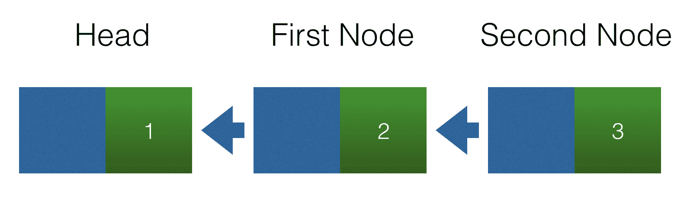
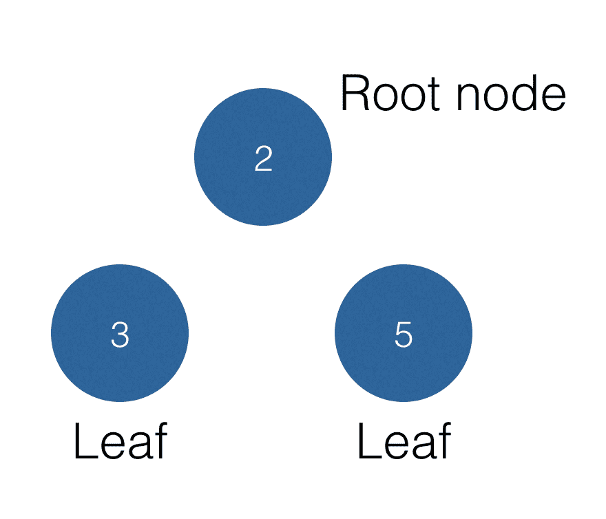
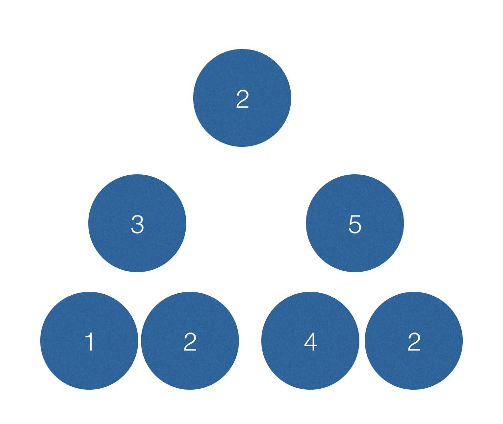
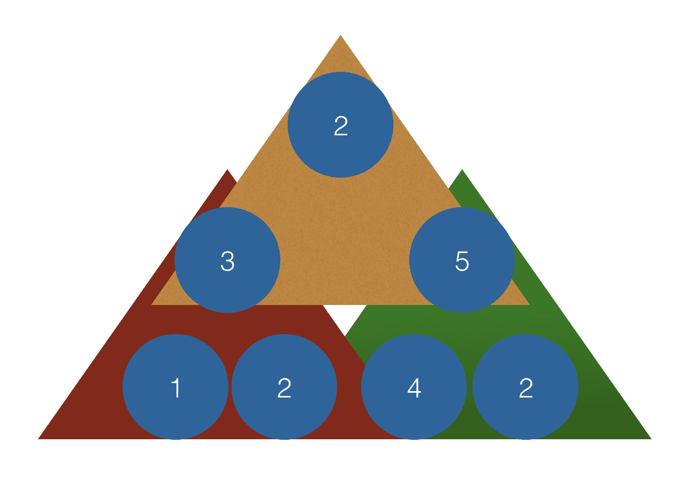
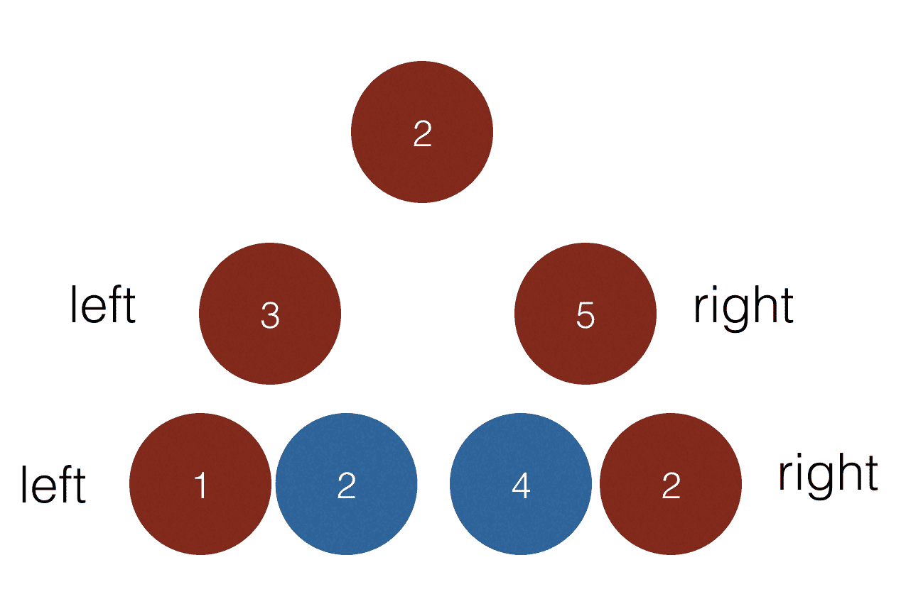
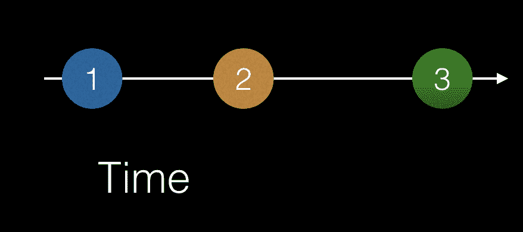

# 函数反应式编程

根据维基百科，**函数式反应式编程**（**FRP**）是一种反应式编程的编程范式，它使用函数式编程的构建块。好吧，听起来很花哨，但这是什么意思？为了理解整个句子，我们需要把它分开一点。让我们尝试定义以下内容：

*   **编程范式**是一种总体理论或工作方式，以程序的组织和结构为中心。面向对象编程和函数式编程是编程范例的例子。
*   **反应式编程**简而言之，就是用异步数据流编程。异步数据流是其值可以到达任何时间点的数据流。
*   **函数式编程**是一种采用更数学化方法的编程范式，因为它将函数调用视为一种数学计算，从而避免改变状态或处理可变数据。

因此，简而言之，我们的维基百科定义意味着我们有一个函数式编程方法来处理可能在任何时间点到达的值。这并不意味着什么，但希望到本章结束时事情会有所澄清。

在本章中，我们将了解：

*   异步数据流
*   如何操纵这些流

# 递归

"To understand the word recursion see the word recursion."

这是大多数工程学校的一个长期笑话，它用很短的方式解释了它是什么。递归是一个数学概念。让我们再解释一下。官方定义如下：

Recursion is the process a procedure goes through when one of the steps of the procedure involves invoking the procedure itself. A procedure that goes through recursion is said to be 'recursive'.

好吧，这在人类语言中是什么意思？它说在运行函数的某个时刻，我们将调用自己。这意味着我们有一个类似如下的函数：

```ts
function something() {
  statement;
  statement;
  if(condition) {
    something();
  }
  return someValue;
}
```

我们可以看到，函数`something()`在其体内的某个点调用自身。递归函数应遵守以下规则：

*   应该自称
*   最终应满足退出条件

如果递归函数没有退出条件，我们将耗尽内存，因为函数将永远调用自己。某些类型的问题比其他类型的问题更适合应用递归编程。例如：

*   穿越树木
*   编译代码
*   编写压缩算法
*   排序列表

还有更多的例子，但重要的是要记住，尽管它是一个很好的工具，但不应该在任何地方使用。让我们看一个例子，其中递归非常出色。我们的例子是一个链表。链表由了解所连接节点的节点组成。`Node`结构的代码如下所示：

```ts
class Node {
  constructor(
    public left, 
    public value
  ) {}
}
```

使用`Node`这样的结构，我们可以构建一个由多个链接节点组成的链表。我们可以通过以下方式连接一组节点实例：

```ts
const head = new Node(null, 1);
const firstNode = new Node(head, 2);
const secondNode = new Node(firstNode, 3);
```

前面代码的图形表示如下图所示。在这里，我们可以清楚地看到我们的节点由什么组成以及它们是如何连接的：



这里，我们有一个链表，其中有三个连接的节点实例。头部节点未连接到左侧的节点。然而，第二节点连接到第一节点，第一节点连接到头部节点。对列表执行以下类型的操作可能很有趣：

*   找到头部节点，给定列表中的任何节点
*   在列表中的给定点插入节点
*   从列表中的给定点删除节点

让我们看看如何解决第一个要点。首先，我们将使用命令式方法，然后我们将使用递归方法来查看它们之间的区别。更重要的是，让我们讨论一下为什么递归方法可能更受欢迎：

```ts
// demo of how to find the head node, imperative style

const head = new Node(null, 1);
const firstNode = new Node(head, 2);
const secondNode = new Node(firstNode, 3); 

function findHeadImperative (startNode)  {
  while (startNode.left !== null) {
    startNode = startNode.left;
  }
  return startNode;
}

const foundImp = findHeadImperative(secondNode);
console.log('found', foundImp);
console.log(foundImp === head);

```

正如我们在这里看到的，我们使用一个`while`循环遍历列表，直到找到`left`属性为 null 的节点实例。现在，让我们展示递归方法：

```ts
// demo of how to find head node, declarative style using recursion

const head = new Node(null, 1);
const firstNode = new Node(head, 2);
const secondNode = new Node(firstNode, 3); 

function findHeadRecursive(startNode) {
  if(startNode.left !== null) {
    return findHeadRecursive(startNode.left);
  } else {
    return startNode;
  }
}

const found = findHeadRecursive(secondNode);
console.log('found', found);
console.log(found === head);

```

在前面的代码中，我们检查`startNode.left`是否为空。如果是这样，我们已经达到了退出条件。如果我们还没有达到退出条件，我们会继续打电话给自己。

好的，我们有一个命令式方法和一个递归方法。为什么后者好得多？好的，使用递归方法，我们从一个长的列表开始，每次我们称自己时，我们都会将列表缩短：有点*分而治之*的方法。递归方法最突出的一点是，我们通过说“不，我们的退出条件还没有满足”来推迟执行，继续处理。持续处理意味着我们像在`if`条款中那样称呼自己。递归编程的目的是减少代码行数吗？这可能是结果，但更重要的是：它改变了我们解决问题的心态。在命令式编程中，我们有一种*让我们自上而下解决问题的思维方式*，而在递归编程中，我们的思维方式更多，定义我们何时完成并切分问题，使其更易于处理。在前面的例子中，我们丢弃了链表中不再有趣的部分

# 不再循环

当我们开始以更实用的方式编写代码时，一个更重要的变化是我们去掉了`for`循环。既然我们知道了递归，我们可以用它来代替。让我们看一段打印数组的简单命令式代码：

```ts
// demo of printing an array, imperative style

let array = [1, 2, 3, 4, 5];

function print(arr) {
  for(var i = 0, i < arr.length; i++) {
    console.log(arr[i]); 
  }
}

print(arr);
```

使用递归的相应代码如下所示：

```ts
// print.js, printing an array using recursion

let array = [1, 2, 3, 4, 5];

function print(arr, pos, len) {
  if (pos < len) {
    console.log(arr[pos]);
    print(arr, pos + 1, len);
  }
  return;
}

print(array, 0, array.length);
```

正如我们所看到的，我们的命令代码在精神上仍然存在。我们还是从`0`开始。此外，我们继续前进，直到到达阵列的最后一个位置。一旦达到中断条件，我们就退出该方法。

# 重现模式

目前，我们还没有真正将递归作为一个概念来销售。我们有点明白了，但可能不相信为什么好的老`while`或`for`循环不能用在它的位置上。当递归解决看起来像是重复出现的模式的问题时，它就会发光。例如一棵树。树有一些类似的概念，例如由节点组成。没有子节点连接的节点称为叶节点。具有子节点但与向上节点没有连接的节点称为根节点。让我们用一个图表来说明这一点：



我们希望在树上执行一些有趣的操作：

*   总结节点值
*   计算节点数
*   计算宽度
*   计算深度

为了解决这个问题，我们需要考虑如何将树存储为数据结构。最常见的建模方法是创建一个节点的表示，表示为具有一个值、一个`left`属性和一个`right`属性，然后这两个属性依次指向节点。因此，所述节点类的代码可能如下所示：

```ts
class NodeClass {
  constructor(left, right, value) {
    this.left = left;
    this.right = right;
    this.value = value;
  }
}
```

下一步是思考如何创建树本身。这段代码展示了如何创建一个包含根节点和两个子节点的树，以及如何将它们绑定在一起：

```ts
// tree.js

class NodeClass {
  constructor(left, right, value) {
    this.left = left;
    this.right = right;
    this.value = value;
  }
}

const leftLeftLeftChild = new NodeClass(null, null, 7);
const leftLeftChild = new NodeClass(leftLeftLeftChild, null, 1);
const leftRightChild = new NodeClass(null, null, 2);
const rightLeftChild = new NodeClass(null, null, 4);
const rightRightChild = new NodeClass(null, null, 2);
const left = new NodeClass(leftLeftChild, leftRightChild, 3);
const right = new NodeClass(rightLeftChild, rightRightChild, 5);
const root = new NodeClass(left, right, 2);

module.exports = root;

```

值得强调的是`left`和`right`实例如何没有孩子。我们可以看到这一点，因为我们在创建时将它们的值设置为`null`。另一方面，我们的根节点将对象实例`left`和`right`作为子节点。

# 总结

此后，我们需要考虑如何总结节点。看看它，看起来我们应该总结一下顶部节点及其两个子节点。因此，代码实现将从以下方式开始：

```ts
// tree-sum.js

const root = require('./tree');

function summarise(node) {
  return node.value + node.left.value + node.right.value;
}

console.log(summarise(root)) // 10
```

如果我们的树突然长成这样会怎么样：



让我们在前面的代码中添加如下内容：

```ts
// example of a non recursive code

function summarise(node) {
  return node.value + 
    node.left.value + 
    node.right.value +
    node.right.left.value +
    node.right.right.value + 
    node.left.left.value + 
    node.left.right.value;
}

console.log(summarise(root)) // 19
```

这是技术上可行的代码，但可以改进。在这一点上，我们应该看到，看着树，树上重复出现的模式。我们有以下三角形：



一个三角形由**2、****3**、**5**组成，另一个三角形由**3**、**1**、**2**组成，最后一个三角形由**5**、**4**、**2**组成。每个三角形都通过节点本身，加上其左子节点和右子节点来计算其和。递归就是这样的：发现一个重复出现的模式并对其进行编码。我们现在可以用递归实现我们的`summarise()`函数，如下所示：

```ts
function summarise(node) {
  if(node === null) {
    return 0;
  }
  return node.value + summarise(node.left) + summarise(left.right);
}
```

我们在这里所做的是将我们的重复模式表达为*节点+左节点+右节点*。当我们调用`summarise(node.left)`时，我们只需再次运行该节点的`summarise()`。前面的实现简短而优雅，能够遍历整个树。一旦您发现您的问题可以被看作是一个重复的模式，递归就非常优雅。完整代码如下所示：

```ts
// tree.js

class NodeClass {
  constructor(left, right, value) {
    this.left = left;
    this.right = right;
    this.value = value;
  }
}

const leftLeftLeftChild = new NodeClass(null, null, 7);
const leftLeftChild = new NodeClass(leftLeftLeftChild, null, 1);
const leftRightChild = new NodeClass(null, null, 2);
const rightLeftChild = new NodeClass(null, null, 4);
const rightRightChild = new NodeClass(null, null, 2);
const left = new NodeClass(leftLeftChild, leftRightChild, 3);
const right = new NodeClass(rightLeftChild, rightRightChild, 5);
const root = new NodeClass(left, right, 2);

module.exports = root;

// tree-sum.js

const root = require("./tree");

function sum(node) {
  if (node === null) {
    return 0;
  }
  return node.value + sum(node.left) + sum(node.right);
}

console.log("sum", sum(root));
```

# 计数

现在我们已经开始掌握递归的本质，实现一个计算树中所有节点的函数是非常简单的。我们可以重用以前的 summary 函数，只需将每个非空节点计数为`1`，空节点计数为`0`。因此，我们只需将现有的 summary 函数修改为：

```ts
//tree-count.js

const root = require("./tree");

function count(node) {
  if (node === null) {
    return 0;
  } else {
    return 1 + count(node.left) + count(node.right);
  }
}

console.log("count", count(root));
```

前面的代码确保我们成功地遍历每个节点。当我们到达 null 时，我们的退出条件发生。也就是说，我们试图从一个节点转到它的一个不存在的子节点。

# 宽度

要创建宽度函数，首先需要定义宽度的含义。让我们再看看我们的树：


这棵树的宽度为**4**。怎么样？对于树中的每一步，我们的节点都会向左扩展一步，向右扩展一步。这意味着要正确计算宽度，我们需要遍历树的边缘。每次我们必须向左或向右遍历节点时，我们都会增加宽度。从计算的角度来看，我们感兴趣的是这样遍历树：



因此，守则应反映这一事实。我们可以这样实施：

```ts
// tree-width.js

const root = require("./tree");

function calc(node, direction) {
  if (node === null) {
    return 0;
  } else {
    return (
      1 + (direction === "left" ? 
      calc(node.left, direction) : 
      calc(node.right, direction))
    );
  }
}

function calcWidth(node) {
  return calc(node.left, "left") + calc(node.right, "right");
}

console.log("width", calcWidth(root));
```

请特别注意，在`calcWidth()`函数中，我们分别使用`node.left`和`node.right`作为参数调用`calc()`。我们还添加了一个`left`和`right`参数，在方法`calc()`中，这意味着我们将继续朝这个方向前进。我们的退出条件是当我们最终达到空值时

# 异步数据流

异步数据流是一个数据流，其中值一个接一个地发出，其间有一个延迟。“异步”一词意味着所发出的数据可以在任何时间出现，例如，一秒钟后甚至两分钟后。异步流建模的一种方法是将发出的值放置在时间轴上，如下所示：



有很多事情可以被认为是异步的。其中之一就是通过 AJAX 获取数据。数据到达的时间取决于许多因素，例如：

*   连接的速度
*   后端 API 的响应性
*   数据的大小，以及更多的因素。

关键是数据并没有及时到达。

其他可以被视为异步的事件是用户启动的事件，例如滚动或鼠标单击。这些事件可以在任何时间点发生，具体取决于用户的交互。因此，我们可以将这些 UI 事件视为时间轴上的连续数据流。下图描述了表示用户多次单击的数据流。每次点击都会导致点击事件**c**，我们将其放置在时间轴上：


乍一看，我们的图表描述了四个单击事件。仔细看一下，我们发现点击事件似乎是分组的。上图包含两条信息：

*   已发生多个单击事件
*   单击事件在事件之间有一定的延迟

在这里，我们可以看到，最初的两次点击似乎在时间上非常接近；当两个事件在时间上非常接近时，这将被解释为双击。因此，我们上面的图像告诉我们所发生的事件；它还告诉我们它们发生的时间和频率。查看前面的图表，很容易区分单击和双击。

我们可以为每个单击行为指定不同的操作。双击可能意味着我们想要放大，而单击一次可能意味着我们想要选择一些东西；具体取决于您正在编写的应用程序

第三个例子是输入。如果我们遇到用户正在打字并在一段时间后停止打字的情况，该怎么办？经过一定时间后，用户期望 UI 做出反应。搜索字段就是这种情况。在这种情况下，用户可能会在搜索字段中输入一些内容，并在完成时按下搜索按钮。在 UI 中模拟这种情况的另一种方法是只提供一个搜索字段，然后等待用户停止键入，作为何时开始搜索用户想要的内容的标志。最后一个例子称为**自动完成**行为。可以通过以下方式对其进行建模：


输入的前三个字符似乎属于同一个搜索查询，而输入的第四个字符出现得比较晚，可能属于另一个查询。

本节的重点是强调不同的事物适合被建模为流，时间轴及其上发射值的位置可能具有某种意义。

# 将列表与异步流进行比较–为 RxJS 做准备

到目前为止，我们已经讨论了如何将异步事件建模为时间轴上的连续数据流或流建模。事件可以是 AJAX 数据、鼠标单击或其他类型的事件。以这种方式对事物进行建模有助于从一个有趣的角度来看待事物，但是，以双击的情况为例，除非我们能够挖掘出数据，否则意义不大。可能还有另一种情况，我们需要过滤掉一些数据。我们在这里讨论的是如何操作流。如果没有这种能力，流建模本身就没有实际价值。

操作数据有不同的方法：有时我们希望更改发送给其他数据的数据，有时我们可能希望更改发送给侦听器的数据频率。有时，我们希望我们的数据流成为一个完全不同的流。我们将尝试模拟以下情况：

*   **投影**：改变被发射值的数据
*   **过滤**：更改发出的内容

# 将函数式编程范式与 streams 相结合

本章介绍了函数式编程和异步数据流。使用 RxJS 并不需要对函数式编程有深入的理解，但您确实需要理解声明式的含义，以便专注于正确的事情。你们的重点应该放在你们想做什么上，而不是你们想怎么做。RxJS 作为一个库，会考虑怎么做

这似乎是两个不同的主题。然而，将两者结合起来，使我们能够操纵流。流可以看作是数据列表，其中数据在某个时间点可用。如果我们开始将流视为列表，特别是不可变列表，那么就有一些操作与列表一起执行，通过对列表应用运算符来操纵列表。操作的结果是一个新的列表，而不是一个变异的列表。让我们开始将列表原理及其运算符应用于以下情况

# 预测


在这里，我们可以看到我们的流正在发送值**1**、**2**、**3**和**4**，然后发生一个操作，通过将每个值增加 1 来更改每个值。这是一个相当简单的情况。如果我们认为这是一个列表，我们可以看到，我们在这里做的只是一个投影，我们会这样编码：

```ts
let newList = list.map(value => value + 1)
```

# 过滤

列表和流中可能有一些您不想要的项目。要解决这个问题，您需要创建一个过滤器来过滤掉不需要的数据。通过对初始数组、操作和结果数组进行建模，我们得到以下结果：


在 JavaScript 中，我们可以通过编写以下代码来实现这一点：

```ts
let array = [1,2,3];
let filtered = array.filter(data => data % 2 === 0);
```

# 结合心态

那么，我们想对这一部分说些什么呢。显然，我们已经展示了如何操作列表的示例。我们所做的就是展示如何在轴上显示项目。从这个意义上讲，我们可以看到，以同样的方式思考异步事件和值列表是多么容易，因为我们以同样的方式以图形方式描绘它们。问题是，我们为什么要这样做？原因是 RxJS 库希望您在开始操作和制作流时拥有这种心态。

# 总结

本章已经确定，我们可以将异步事件建模为时间轴上的值。我们引入了将这些流与列表进行比较的思想，从而对它们应用函数方法，这些函数方法不会改变列表本身，而只是创建一个新的列表。应用功能范式的好处在于，我们可以关注*要实现什么*而不是*如何*实现它，从而拥有一种陈述式方法。我们意识到将异步和列表结合起来并从中创建可读代码并不容易。幸运的是，这就是 RxJS 库为我们所做的。

正是这种认识让我们为[第 8 章](08.html)、*RxJS Advanced*做好了准备，这将涵盖更多的操作员和一些更先进的概念。