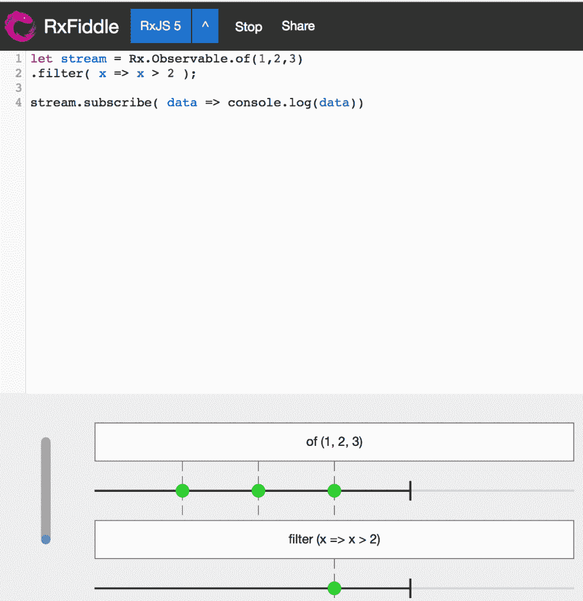
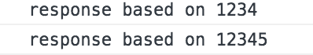

# 七、操纵流及其值

运算符是我们可以调用流以多种不同方式执行操作的函数。运算符是不可变的，这使得流很容易推理，也使它很容易测试。正如您在本章中所看到的，我们很少只讨论一个流，而是讨论多个流，正是了解如何锻造和控制这些流，让您从认为它是*暗魔法*转变为能够在需要时和需要的地方实际应用 RxJS。

在本章中，我们将介绍：

*   如何使用基本运算符
*   使用运算符以及现有工具调试流
*   深入挖掘不同的运营商类别
*   培养解决问题的思维方式

# 出发

您几乎总是从创建静态值流开始使用 RxJS 进行编码。为什么是静态值？嗯，没有必要让它变得不必要的复杂，你真正需要开始推理的只是一个`Observable`。随着问题解决过程的逐步推进，您可能会使用更合适的 AJAX 调用或来自其他异步源的调用来替换静态值。

然后你开始思考你想要实现什么。这将使您考虑您需要哪些操作符，以及按顺序执行这些操作。你也可以考虑如何把你的问题分开；这通常意味着创建多个流，其中每个流解决一个特定的问题，该问题连接到您试图解决的更大的问题。

让我们从创建流开始，看看如何开始使用流。

以下代码创建静态值流：

```ts
const staticValuesStream$ = Rx.Observable.of(1, 2, 3, 4);

staticValuesStream$.subscribe(data => console.log(data)); 
// emits 1, 2, 3, 4
```

这是如何创建流的一个非常基本的示例。我们使用`of()`创建操作符，它接受任意数量的参数。一旦有订户，所有参数都会一个接一个地发出。在前面的代码中，我们还通过调用`subscribe()`方法并传递一个以发出的值为参数的函数来订阅`staticValuesStream$`

让我们介绍一个操作符，`map()`，它的作用类似于投影，允许您更改正在发射的内容。在流中的每个值发出之前，`map()`操作符都会被调用

您通过向`map()`操作符提供函数并执行投影来使用它，如下所示：

```ts
const staticValuesStream$ = 
Rx.Observable
  .of(1, 2, 3, 4)
  .map(data => data + 1); 

staticValuesStream$.subscribe(data => console.log(data))
// emits 2, 3, 4, 5
```

在前面的代码中，我们将`map()`运算符附加到`staticValuesStream$`之后，我们将其应用于每个值，然后再将其发出并递增一。因此，结果数据会发生更改。这就是向流附加运算符的方式：只需创建流，或获取现有流，然后逐个附加运算符

让我们添加另一个操作符`filter()`，以确保我们真正了解如何与操作符协作。`filter()`做什么。嗯，就像`map()`操作符一样，它应用于每个值，但它不是创建投影，而是决定将发射哪些值。`filter()`采用布尔值。任何计算为`true`的表达式都表示将发出该值；如果为`false`，则不会发出表达式。

您可以通过以下方式使用`filter()`操作符：

```ts
const staticValuesStream$ = 
Rx.Observable
  .of(1, 2, 3, 4)
  .map(data => data + 1)
  .filter(data => data % 2 === 0 ); 

staticValuesStream$.subscribe(data => console.log(data));
// emits 2, 4
```

我们通过将`filter()`操作符链接到现有的`map()`操作符来添加它。我们给`filter()`运算符的条件是，对于可被`2`整除的值，只返回`true`，这就是模运算符的作用。我们从之前就知道，`map()`操作符单独确保值`2`、`3`、`4`和`5`被发射。这些是`filter()`运算符正在评估的值。在这四个值中，只有`2`和`4`满足`filter()`操作员设定的条件。

当然，在处理流和应用运算符时，事情可能并不总是像前面的代码那样简单。可能无法准确预测排放的物质。在这些场合，我们可以使用一些技巧。其中一个技巧是使用`do()`操作符，它允许我们检查每个值而不改变它。这使我们有充分的机会将其用于调试目的。根据我们在流中的位置，`do()`操作符将输出不同的值。让我们看一看`do()`运算符应用于何处的不同情况：

```ts
const staticValuesStream$ = 
Rx.Observable.of(1, 2, 3, 4)
  .do(data => console.log(data)) // 1, 2, 3, 4 
  .map(data => data + 1)
  .do(data => console.log(data)) // 2, 3, 4, 5
  .filter(data => data % 2 === 0 )
  .do(data => console.log(data)); // 2, 4 

// emits 2, 4
staticValuesStream$.subscribe(data => console.log(data))
```

正如您所看到的，只需使用`do()`操作符，我们就可以很好地调试我们的流，这在我们的流变得越来越复杂时变得非常必要

# 理解运算符

到目前为止，我们已经展示了如何创建一个流，并在其上使用一些非常基本的运算符来更改发出的值。我们还介绍了如何使用`do()`操作符在不改变流的情况下检查流。并非所有操作员都像`map()`、`filter()`和`do()`操作员那样容易理解。您可以使用不同的策略来尝试了解每个操作员的操作，以便知道何时使用它们。使用`do()`运算符是一种方法，但您可以采用图形化方法。这种方法称为大理石图。它由一个箭头组成，表示从左到右的时间。此箭头上有代表发射值的圆圈或大理石。大理石中有一个值，但大理石之间的距离也可以描述随时间发生的情况。大理石图通常包括至少两个带有大理石的箭头以及一个操作符。其思想是表示当应用操作符时，流会发生什么。第二个箭头通常表示结果流。

下面是大理石图的一个示例：


RxJS 中的大多数操作员在 RxMarbles:[站点上用大理石图表示 http://rxmarbles.com/](http://rxmarbles.com/) 。这是一个非常好的资源，可以快速了解运营商的工作。然而，要真正理解 RxJS，您需要编写代码；这是绕不过去的。当然，有不同的方法可以做到这一点。您可以轻松地设置自己的项目并从 NPM 安装 RxJS，通过 CDN 链接引用它，或者您可以使用 JS Bin（[www.jsbin.com](http://www.jsbin.com)）等页面，这使您能够轻松地将 RxJS 添加为库，并允许您立即开始编码。它看起来像这样：


JS-Bin 使其易于启动，但如果我们可以将大理石图和 JS-Bin 结合起来，并在您编写代码时获得代码的图形表示，这不是很好吗？您可以通过 RxFIDLE:[实现这一点 http://rxfiddle.net/](http://rxfiddle.net/) 。您可以输入您的代码，单击 Run，您将看到一个大理石图，上面显示了您刚刚编写的代码，如下所示：



# 小河中的小河

我们一直在研究不同的运算符，这些运算符会更改发出的值。流还有另一个不同的方面：如果需要从现有流创建新流，该怎么办？另一个好问题是：这种情况通常在什么时候发生？有很多种情况，例如：

*   基于 keyUp 事件流，执行 AJAX 调用。
*   计算单击次数并确定用户是单次单击、双击还是三次单击。

你明白了；我们从一种类型的流开始，需要转换为另一种类型的流。

让我们先来看看创建流，看看当我们尝试使用操作符创建流时会发生什么：

```ts
let stream$ = Rx.Observable.of(1,2,3)
  .map(data => Rx.Observable.of(data));

// Observable, Observable, Observable
stream$.subscribe(data => console.log(data));
```

此时，通过`map()`运算符的每个值都会产生一个新的`Observable`。当您订阅`stream$`时，发出的每个值都将是一个流。你的第一反应可能是在这些值上加上一个`subscribe()`，如下所示：

```ts
let stream$ = Rx.Observable
  .of(1,2,3)
  .map(data => Rx.Observable.of(data))

stream$.subscribe(data => {
  data.subscribe(val => console.log(val))
});

// 1, 2, 3
```

与这种冲动作斗争。这只会创建难以维护的代码。您要做的是将所有这些流合并为一个流，这样您只需要一个`subscribe()`。有一个专门的操作员，叫做`flatMap()`。`flatMap()`所做的是将您的流数组转换为一个流，一个元流

其使用方式如下：

```ts
let stream$ = Rx.Observable.of(1,2,3)
  .flatMap(data => Rx.Observable.of(data))

stream$.subscribe(data => {
  console.log(val);
});

// 1, 2, 3
```

好的，我们明白了，我们不想要一个可观察的流，而是一个值流。这个接线员看起来真的很棒。但是我们仍然不确定什么时候使用。让我们让这更现实一点。假设您有一个由输入字段组成的 UI。用户在该输入字段中输入字符。假设您希望对输入的一个或多个字符做出反应，例如，作为输入字符的结果执行 AJAX 请求。这里我们主要关注两件事：如何收集输入的字符以及如何执行 AJAX 请求。

让我们从第一件事开始，捕获输入字段中输入的字符。为此，我们需要一个 HTML 页面和一个 JavaScript 页面。让我们从 HTML 页面开始：

```ts
<html>
  <body>
    <input id="input" type="text">
    <script src="https://unpkg.com/rxjs/bundles/Rx.min.js"></script>
    <script src="app.js"></script>
  </body>
</html>

```

这描述了我们的输入元素和对 RxJS 的脚本引用，以及对`app.js`文件的引用。然后我们有`app.js`文件，在这里我们获得了对输入元素的引用，并在输入键击后立即开始监听它们：

```ts
let elem = document.getElementById('input');
let keyStream$ = Rx.Observable
  .fromEvent(elem, 'keyup')
  .map( ev => ev.key);

keyStream$.subscribe( key => console.log(key));

// emits entered key chars
```

值得强调的是，我们开始监听通过调用`fromEvent()`创建操作符发出的`keyup`事件。之后，我们应用`map()`操作符挖掘`ev.key`上的字符值存储。最后，我们订阅流。正如预期的那样，在 HTML 页面中输入值后，运行此代码将导致在控制台中键入字符。

让我们根据键入的内容执行 AJAX 请求，从而使这一点更加具体。为此，我们将使用`fetch()`API 和一个名为 swapi（swapi.com）的在线 API，其中包含一组包含星球大战电影信息的 API。让我们首先定义 AJAX 调用，然后看看它如何适合现有的键流。

我们说过我们会使用`fetch()`。它让我们可以制定一个 GET 请求，如下所示：

```ts
fetch('https://swapi.co/api/people/1')
  .then(data => data.json())
  .then(data => console.log('data', data));
```

当然，我们想把这个请求变成一个`Observable`，这样它就可以很好地与我们的`keyStream$`配合。幸运的是，通过使用`from()`操作符可以很容易地实现这一点。然而，让我们首先将我们的`fetch()`调用重写为一个易于使用的方法。重写的结果如下所示：

```ts
function getStarwarsCharacterStream(id) {
  return fetch('https://swapi.co/api/people/' + id)
    .then(data => data.json());
}

```

这段代码允许我们提供一个用于构造 URL 的参数，我们使用该 URL 使用 AJAX 获取一些数据。此时，我们已经准备好将函数连接到现有流。我们通过键入以下命令来完成此操作：

```ts
let keyStream$ = Rx.Observable.fromEvent(elem, 'keyup')
  .map(ev => ev.key)
  .filter(key => key !== 'Backspace')
 .flatMap( key =>
    Rx.Observable
      .from(getStarwarsCharacterStream(key))
  );

```

我们使用我们的`from()`转换运算符突出显示`flatmap()`运算符的粗体用法。上面提到的操作符将我们的`getStarwarsCharacterStream()`函数作为参数。`from()`运算符将所述函数转换为流

在这里，我们学习了如何连接两个不同的流，以及如何将`Promise`转换为流。尽管这种方法在纸上看起来很好，但使用`flatMap()`也有其局限性，了解它们是什么很重要。出于这个原因，我们接下来讨论一下`switchMap()`操作符。当我们执行长时间运行的任务时，使用`switchMap()`操作符的好处将更加明显。为了便于讨论，让我们定义这样一个任务，如下所示：

```ts
function longRunningTask(input) {
  return new Promise(resolve => {
    setTimeout(() => {
      resolve('response based on ' + input);
    }, 5000);
  });
}
```

在这段代码中，我们有一个需要 5 秒才能执行的函数；有足够的时间来说明我们试图表达的观点。接下来，让我们来说明如果我们在下面的代码中继续使用`flatMap()`运算符会产生什么效果：

```ts
let longRunningStream$ = keyStream$
  .map(ev => ev.key)
  .filter(key => elem.value.length >3)
  .filter( key => key !== 'Backspace')
  .flatMap( key =>
    Rx.Observable
      .from(longRunningTask(elem.value))
  );

longRunningStream$.subscribe(data => console.log(data));
```

前面的代码以以下方式工作：每次我们点击一个键，它都会生成一个事件。但是，我们有一个`.filter()`操作符，确保只有在输入至少四个键`filter(key => elem.value.length >3)`时才会生成事件。现在让我们谈谈用户的期望。如果用户在输入控件中输入键，他们很可能希望在完成输入时发出请求。用户将完成定义为输入几个字符，并且如果输入错误，他们应该能够删除字符。因此，我们可以假设以下输入序列：

```ts
// enters abcde
abcde
// removes 'e'
```

此时，他们输入了字符，并在合理的时间内编辑了答案。用户希望收到基于`abcd`的应答。然而，使用`flatMap()`操作符意味着用户将得到两个答案，因为实际上，他们键入了`abcde`和`abcd`。假设我们得到一个基于这两个输入的结果列表；很可能是两个看起来有些不同的列表。基于我们代码的响应如下所示：



我们的代码很可能能够通过在新的响应到达时重新提交结果列表来处理所描述的情况。但这有两个问题：首先，我们对`abcde`执行了一个不必要的网络请求，其次，如果后端响应足够快，我们将在 UI 中看到结果列表呈现一次时闪烁，然后在不久之后，根据第二次响应再次呈现。这是不好的，我们希望出现这样的情况：如果我们继续键入，第一个请求将被放弃。这就是`switchMap()`操作员的作用。正是这样。因此，让我们将前面的代码更改为：

```ts
let longRunningStream$ = keyStream$
  .map(ev => ev.key)
  .filter(key => elem.value.length >3)
  .filter( key => key !== 'Backspace')
  .switchMap( key =>
    Rx.Observable
    .from(longRunningTask(elem.value))
  );
```

在这段代码中，我们只是将`flatMap()`切换为`switchMap()`。当我们现在以完全相同的方式执行代码时，即用户首先键入`12345`并很快将其更改为`1234`，最终结果是：


正如我们所看到的，我们只收到一个请求。原因是当新事件发生时，前一个事件被中止-`switchMap()`正在发挥其魔力。用户很高兴，我们也很高兴。

# AJAX

我们已经谈到了发出 AJAX 请求的主题。有很多方法可以发出 AJAX 请求；两种最常见的方法是：

*   使用 fetchapi；fetchapi 是一种 web 标准，因此内置于大多数浏览器中
*   使用`ajax()`方法，现在内置到 RxJS 库中；它曾经存在于一个名为 Rx.Dom 的库中

# fetch（）

`fetch()`API 是一种 web 标准。您可以在以下链接找到官方文档：[https://developer.mozilla.org/en-US/docs/Web/API/Fetch_API](https://developer.mozilla.org/en-US/docs/Web/API/Fetch_API) 。`fetch()`API 基于`Promise`，这意味着我们需要在使用前将其转换为`Observable`。API 公开了一个`fetch()`方法，该方法将一个强制 URL 参数作为第一个参数，第二个参数是一个可选对象，允许您控制要发送的正文（如果有）、要使用的 HTTP 谓词等

我们已经提到了如何在 RxJS 的上下文中最好地处理它。不过，这值得重复。不过，这并不像把我们的 fetch 放入`from()`操作符那么简单。让我们编写一些代码，看看原因：

```ts
let convertedStream$ = 
Rx.Observable.from(fetch('some url'));

convertedStream$.subscribe(data => 'my data?', data);
```

我们的数据正确吗？对不起，没有，我们取回了一个`Response`物体。但这很简单，只要调用`map()`操作符中的`json()`方法，我们就可以得到数据了？同样，很抱歉，如果您键入以下内容，`json()`方法将返回一个`Promise`：

```ts
let convertedStream$ = Rx.Observable.from(fetch('some url'))
  .map( r=> r.json());

// returns PromiseObservable
convertedStream$.subscribe(data => 'my data?', data);
```

在上一节中，我们已经展示了一种可能的解决方案，即以下构造：

```ts
getData() {
  return fetch('some url')
    .then(r => r.json());
}

let convertedStream$ = Rx.Observable.from(getData());
convertedStream$.subscribe(data => console.log('data', data));
```

我们在这段代码中所做的只是在将数据交给`from()`操作员之前，将数据挖掘出来。在 RxJS 中玩弄承诺感觉不太好。您可以采取一种更基于流的方法；我们之前就快到了，我们只需要做一个小小的调整：

```ts
let convertedStream$ = Rx.Observable.from(fetch('some url'))
  .flatMap( r => Rx.Observable.from(r.json()));

// returns data
convertedStream$.subscribe(data => console.log('data'), data);
```

这就是：我们的`fetch()`呼叫现在像流一样为我们提供数据。那么我们做了什么？嗯，我们把我们的`map()`电话改为`flatMap()`电话。原因是当我们打电话给`r.json()`时，我们得到了`Promise`。我们通过在`from()`呼叫`Rx.Observable.from(r.json())`中包装它来解决这个问题。这将使流发出`PromiseObservable`，除非我们将`map()`更改为`flatMap()`。正如我们在上一节中了解到的，如果我们冒险在一条流中创建一条流，我们需要`flatMap()`来拯救我们，它确实做到了

# ajax（）运算符

与基于`Promise`的`fetch()`API 不同，`ajax()`方法实际上是基于`Observable`的，这使我们的工作更容易一些。使用它非常简单，如下所示：

```ts
Rx.Observable
  .ajax('https://swapi.co/api/people/1')
  .map(r => r.response)
  .subscribe(data => console.log('from ajax()', data));
```

如我们所见，前面的代码使用 URL 作为参数调用`ajax()`操作符。第二件值得一提的事情是对`map()`操作符的调用，它从`response`属性中挖掘出我们的数据。因为它是一个`Observable`，我们只需要像往常一样订阅它，通过调用`subscribe()`方法并为它提供一个侦听器函数作为参数。

这涵盖了一个简单的情况，即您希望使用 HTTP 动词`GET`获取数据。幸运的是，通过使用重载版本的`ajax()`操作符，可以很容易地创建、更新或删除`AjaxRequest`对象实例，该实例具有以下字段：

```ts
url?: string;
body?: any;
user?: string;
async?: boolean;
method?: string;
headers?: Object;
timeout?: number;
password?: string;
hasContent?: boolean;
crossDomain?: boolean;
withCredentials?: boolean;
createXHR?: () => XMLHttpRequest;
progressSubscriber?: Subscriber<any>;
responseType?: string;
```

从这个对象规范可以看出，所有的字段都是可选的，我们也可以根据请求配置很多东西，比如`headers`、`timeout`、`user`、`crossDomain`等等；这与我们期望的 AJAX 包装功能差不多。除了`ajax()`操作符过载外，还存在一些速记选项：

*   `get()`：使用`GET`动词获取数据
*   `put()`：使用`PUT`动词更新数据
*   `post()`：使用`POST`动词创建数据
*   `patch()`：使用`PATCH`动词的想法是更新部分资源
*   `delete()`：使用`DELETE`动词删除数据
*   `getJSON()`：使用`GET`动词获取数据，并将响应类型设置为`application/json`

# 级联呼叫

到目前为止，我们已经介绍了使用 AJAX 发送或接收数据的两种主要方法。当涉及到接收数据时，它通常不像获取数据并呈现数据那样简单。事实上，您很可能会依赖于何时可以获取哪些数据。一个典型的例子是，在获取剩余数据之前，需要执行登录调用。在某些情况下，您可能需要首先登录，然后获取登录用户的数据，一旦获得这些数据，您就可以获取消息、订单或特定用户所需的任何类型的数据。以这种方式获取数据的整个现象称为级联调用。

让我们看看如何使用带有承诺的级联调用，并逐步了解如何使用 RxJS 实现同样的功能。我们之所以绕道而行，是因为我们认为读这本书的大多数人都熟悉承诺。

让我们看看我们首先提到的依赖案例，其中我们需要按照以下顺序执行以下步骤：

1.  用户首先登录到系统
2.  然后我们获取关于用户的信息
3.  然后我们获取有关用户订单的信息

使用承诺，在代码中看起来像这样：

```ts
// cascading/cascading-promises.js

login()
  .then(getUser)
  .then(getOrders);

// we collect username and password from a form
const login = (username, password) => {
  return fetch("/login", {
    method: "POST",
    body: { username, password }
  })
  .then(r => r.json())
  .then(token => {
    localStorage.setItem("auth", token);
  });
};

const getUser = () => {
  return fetch("/users", {
    headers: {
      Authorization: "Bearer " + localStorage.getToken("auth")
    }
  }).then(r => r.json());
};

const getOrders = user => {
  return fetch(`/orders/user/${user.id}`, {
    headers: {
      Authorization: "Bearer " + localStorage.getToken("auth")
    }
  }).then(r => r.json());
};
```

这段代码描述了我们如何首先使用`login()`方法登录到系统并获取令牌。我们在将来的任何调用中都使用此令牌，以确保进行经过身份验证的调用。我们还将看到如何执行`getUser()`调用并获取用户实例。我们使用同一个用户实例执行最后一个调用`getOrders()`，其中用户 ID 用作路由参数：``/orders/user/${user.id}``

我们已经展示了如何使用承诺执行级联调用；我们这样做是为了为我们试图解决的问题建立一个共同点。RxJS 方法非常相似：我们已经证明了`ajax()`操作符的存在，并且在处理 AJAX 调用时使我们的生活更加轻松。为了用 RxJS 实现级联调用效果，我们只需要使用`switchMap()`操作符。这将导致我们的代码如下所示：

```ts
// cascading/cascading-rxjs.js

let user = "user";
let password = "password";

login(user, password)
  .switchMap(getUser)
  .switchMap(getOrders);

// we collect username and password from a form
const login = (username, password) => {
  return Rx.Observable.ajax("/login", {
    method: "POST",
    body: { username, password }
  })
  .map(r => r.response)
  .do(token => {
    localStorage.setItem("auth", token);
  });
};

const getUser = () => {
  return Rx.Observable.ajax("/users", {
    headers: {
      Authorization: "Bearer " + localStorage.getToken("auth")
    }
  }).map(r => r.response);
};

const getOrders = user => {
  return Rx.Observable.json(`/orders/user/${user.id}`, {
    headers: {
      Authorization: "Bearer " + localStorage.getToken("auth")
    }
  }).map(r => r.response);
};
```

我们在前面的代码中突出显示了需要更改的部分。简言之，这些变化是：

*   `fetch()`被`ajax()`操作员替换
*   我们称之为`.map(r => r.response)`而不是`.then(r => r.json())`
*   我们对每个级联调用执行`.switchMap()`调用，而不是`.then(getOrders)`

还有一个更有趣的方面，我们需要涵盖，即并行调用。当我们获取用户和订单时，我们等待前一个调用完全完成，然后才开始下一个调用。在许多情况下，这可能不是严格必要的。假设我们有一个与前一个类似的案例，但是我们想要获取的用户周围有很多有趣的信息。用户可能有一个朋友集合或消息集合，而不仅仅是获取订单。获取数据的先决条件只是我们获取了用户，因此我们知道应该查询哪些朋友集合以及需要哪些消息集合。在承诺的世界中，我们将使用`Promise.all()`构造来实现并行化。考虑到这一点，我们将`Promise`代码更新如下：

```ts
// parallell/parallell-promise.js

// we collect username and password from a form
login(username, password) {
  return new Promise(resolve => {
    resolve('logged in');
  });
}

getUsersData(user) {
  return Promise.all([
    getOrders(user),
    getMessages(user),
    getFriends(user) 
    // not implemented but you get the idea, another call in parallell
  ])
}

getUser() {
  // same as before
}

getOrders(user) {
  // same as before
}

login()
  .then(getUser)
  .then(getUsersData);
```

从前面的代码中我们可以看到，我们引入了新的`getUsersData()`方法，它并行获取订单、消息和朋友集合，使我们的应用响应更快，因为数据到达的时间比我们一个接一个地获取数据要早。

通过引入`forkJoin()`操作符，我们可以很容易地用 RxJS 实现同样的功能。它获取流列表并并行获取所有内容。因此，我们将 RxJS 代码更新为如下所示：

```ts
// parallell/parallell-rxjs.js

import Rx from 'rxjs/Rx';
// imagine we collected these from a form
let user = 'user';
let password = 'password';

login(user, password)
  .switchMap(getUser)
  .switchMap(getUsersData)

// we collect username and password from a form
login(username, password) {
  // same as before
}

getUsersData(user) {
  return Rx.Observable.forkJoin([
    getOrders(),
    getMessages(),
    getFriends()
  ])
}

getUser() {
  // same as before
}

getOrders(user) {
  // same as before
}

login()
  .then(getUser)
  .then(getUsersData);
```

# 更深入的观察

到目前为止，我们已经了解了一些允许您使用`map()`和`filter()`操作符创建流或更改流的操作符，我们已经了解了如何管理不同的 AJAX 场景，等等。基本知识就在这里，但我们还没有真正以结构化的方式探讨操作符的主题。这是什么意思？嗯，操作符可以被认为属于不同的类别。我们拥有的运营商数量惊人地超过 60 家。如果我们能做到的话，我们需要时间来学习所有这些。但问题是：我们只需要知道存在哪些不同类型的操作符，以便在适当的地方应用它们。这降低了我们的认知负荷和记忆力。一旦我们知道我们有哪些类别，我们只需要深入了解，最有可能的是，我们最终会知道总共 10-15 个操作员，其余的我们可以在需要时查找

目前，我们有以下几类：

*   **创建操作符**：这些操作符首先帮助我们创建流。在这些操作符的帮助下，几乎任何东西都可以转换成流。
*   **组合运算符**：这些运算符帮助我们组合值和流。
*   **数学运算符**：这些运算符对发出的值进行数学计算。
*   **基于时间的运算符**：这些运算符更改发出速度值的时间。
*   **分组运算符**：这些运算符的思想是对一组值进行操作，而不是对单个值进行操作。

# 创建运算符

我们使用创建操作符自己创建流，因为让我们面对现实：我们需要变成流的并不总是流，但通过将其变成流，它必须与其他流很好地配合，最重要的是，将充分利用使用操作符的能力。

那么，这些其他非流是由什么组成的呢？它可以是异步或同步的。重要的是，需要在某个点发出数据。因此，存在一系列创建操作符。在接下来的小节中，我们将展示所有存在的事物的子集，足以让您认识到将任何事物转化为流的力量。

# of（）运算符

我们已经有机会使用这个操作符好几次了。它接受未知数量的逗号分隔参数，这些参数可以是整数、字符串或对象。如果只想发出一组有限的值，则需要使用此运算符。要使用它，只需键入：

```ts
// creation-operators/of.js

const numberStream$ = Rx.Observable.of(1,2, 3);
const objectStream$ = Rx.Observable.of({ age: 37 }, { name: "chris" });

// emits 1 2 3
numberStream$.subscribe(data => console.log(data));

// emits { age: 37 }, { name: 'chris' }
objectStream$.subscribe(data => console.log(data));
```

从代码中可以看出，我们在`of()`操作符中放置什么并不重要，它无论如何都可以发出它。

# from（）运算符

该操作符可以将数组或`Promise`作为输入，并将它们转换为流。要使用它，只需这样称呼它：

```ts
// creation-operators/from.js

const promiseStream$ = Rx.Observable.from(
  new Promise(resolve => setTimeout(() => resolve("data"),3000))
);

const arrayStream$ = Rx.Observable.from([1, 2, 3, 4]);

promiseStream$.subscribe(data => console.log("data", data));
// emits data after 3 seconds

arrayStream$.subscribe(data => console.log(data));
// emits 1, 2, 3, 4
```

由于不必处理不同类型的异步调用，这为我们节省了很多麻烦。

# range（）运算符

此运算符用于指定范围、起始数字和结束数字。这是一个很好的速记，可以让您快速创建一个包含一系列数字的流。要使用它，只需键入：

```ts
// creation-operators/range.js

const stream$ = Rx.Observable.range(1,99);

stream$.subscribe(data => console.log(data));
// emits 1... 99 
```

# fromEvent（）运算符

现在它变得非常有趣。`fromEvent()`操作符允许我们混合一个 UI 事件，如`click`或`scroll`事件，并将其转换为流。到目前为止，我们一直假设异步调用只与 AJAX 调用有关。这远非事实。事实上，我们可以将 UI 事件与任何类型的异步调用混合在一起，这创造了一种非常有趣的情况，使我们能够编写真正强大、富有表现力的代码。我们将在下一节*流中思考*中进一步讨论这个话题。

要使用此运算符，需要为其提供两个参数：DOM 元素和事件名称，如下所示：

```ts
// creation-operators/fromEvent.js

// we imagine we have an element in our DOM looking like this <input id="id" />
const elem = document.getElementById("input");
const eventStream$ = Rx.Observable
  .fromEvent(elem, "click")
  .map(ev => ev.key);

// outputs the typed key
eventStream$.subscribe(data => console.log(data));
```

# 结合体

组合运算符用于组合来自不同流的值。我们有几个操作员可以帮助我们。由于某种原因，当我们不在一个地方拥有所有数据，但需要从多个地方获取数据时，这种操作符是有意义的。如果没有我们将要描述的强大的操作符，组合来自不同来源的数据结构可能是乏味且容易出错的工作

# merge（）运算符

`merge()`操作符从不同的流中获取数据并进行组合。但问题是：这些流可以是任何类型的，只要它们是类型`Observable`。这意味着我们可以组合来自定时操作、承诺、来自`of()`操作符的静态数据等的数据。合并所做的是交织发出的数据。这意味着在下面的示例中，它将同时从两个流发射。使用运算符有两种方式，一种是静态方法，另一种是实例方法：

```ts
// combination/merge.js

let promiseStream = Rx.Observable
.from(new Promise(resolve => resolve("data")))

let stream = Rx.Observable.interval(500).take(3);
let stream2 = Rx.Observable.interval(500).take(5);

// instance method version of merge(), emits 0,0, 1,1 2,2 3, 4
stream.merge(stream2)
  .subscribe(data => console.log("merged", data));

// static version of merge(), emits 0,0, 1,1, 2, 2, 3, 4 and 'data'
Rx.Observable.merge(
  stream,
  stream2,
  promiseStream
)
.subscribe(data => console.log("merged static", data));
```

这里的要点是，如果您只需要将一个流与另一个流组合，则使用此操作符的实例方法版本，但如果您有多个流，则使用静态版本。此外，流的指定顺序也很重要。

# 组合测试（）

假设您有这样一种情况，您已经与多个端点建立了连接，这些端点为您提供数据服务。您关心的是从每个端点发出的最新数据。您可能会遇到这样的情况：一个或多个端点在一段时间后停止发送数据，您想知道最后发生了什么。在这种情况下，我们希望能够组合来自所有相关端点的所有最新值。那就是`combineLatest()`接线员进来的地方。您可以按以下方式使用它：

```ts
// combination/combineLatest.js

let firstStream$ = Rx.Observable
  .interval(500)
  .take(3);

let secondStream$ = Rx.Observable
  .interval(500)
  .take(5);

let combinedStream$ = Rx.Observable.combineLatest(
  firstStream$,
  secondStream$
)

// emits [0, 0] [1,1] [2,2] [2,3] [2,4] [2,5]
combinedStream$.subscribe(data => console.log(data));
```

我们在这里可以看到，`firstStream$`在一段时间后停止发送值，这要感谢`take()`操作符，它限制了项目的数量。然而，`combineLatest()`操作符确保我们仍然得到最后一个发出的值`firstStream$`

# zip（）

此运算符的目的是将尽可能多的值缝合在一起。我们可以处理连续流，但也可以处理对其发出的值数量有限制的流。您可以按以下方式使用此运算符：

```ts
// combination/zip.js

let stream$ = Rx.Observable.of(1, 2, 3, 4);
let secondStream$ = Rx.Observable.of(5, 6, 7, 8);
let thirdStream$ = Rx.Observable.of(9, 10); 

let zippedStream$ = Rx.Observable.zip(
  stream$,
  secondStream$,
  thirdStream$
)

// [1, 5, 9] [2, 6, 10]
zippedStream$.subscribe(data => console.log(data))
```

我们可以看到，在这里，我们垂直地将值缝合在一起，通过最小公分母，`thirdStream$`是最短的，计算发射值的数量。这意味着我们将从左到右取值并将它们压缩在一起。由于`thirdStream$`只有两个值，我们最终只有两个发射。

# concat（）

乍一看，`concat()`操作符看起来像另一个`merge()`操作符，但这并不完全正确。不同之处在于，`concat()`等待其他流先完成，然后依次从下一个流发出流。您在呼叫`concat()`时如何安排流很重要。操作员的使用方式如下：

```ts
// combination/concat.js

let firstStream$ = Rx.Observable.of(1,2,3,4);
let secondStream$ = Rx.Observable.of(5,6,7,8);

let concatStream$ = Rx.Observable.concat(
  firstStream$,
  secondStream$
);

concatStream$.subscribe(data => console.log(data));
```

# 数学的

数学运算符只是对值执行数学运算的运算符，例如查找最大值或最小值、汇总所有值等。

# 最大值

`max()`运算符查找最大值。这有两种风格：我们要么只调用没有参数的`max()`操作符，要么给它一个`compare`函数。然后，`compare`函数决定某个值是否大于、小于或等于发出的值。让我们看看两个不同的版本：

```ts
// mathematical/max.js

let streamWithNumbers$ = Rx.Observable
  .of(1,2,3,4)
  .max();

// 4
streamWithNumbers$.subscribe(data => console.log(data)); 

function comparePeople(firstPerson, secondPerson) {
  if (firstPerson.age > secondPerson.age) {
    return 1; 
  } else if (firstPerson.age < secondPerson.age) {
    return -1;
  } 
  return 0;
}

let streamOfObjects$ = Rx.Observable
  .of({
    name : "Yoda",
    age: 999
  }, {
    name : "Chris",
    age: 38 
  })
  .max(comparePeople);

// { name: 'Yoda', age : 999 }
streamOfObjects$.subscribe(data => console.log(data));
```

我们可以在前面的代码中看到，我们返回了一个结果，它是最大的一个。

# 闵

`min()`运算符与`max()`运算符几乎相反；它有两种风格：带参数和不带参数。它的任务是找到最小的值。要使用它，请键入：

```ts
// mathematical/min.js

let streamOfValues$ = Rx.Observable
  .of(1, 2, 3, 4)
  .min();

// emits 1
streamOfValues$.subscribe(data => console.log(data));

```

# 总和

以前有一个名为`sum()`的操作符，但已有好几个版本了。取而代之的是`.reduce()`。有了`reduce()`操作符，我们可以很容易地实现同样的事情。以下是如何使用`reduce()`编写`sum()`操作符：

```ts
// mathematical/sum.js

let stream = Rx.Observable.of(1, 2, 3, 4)
  .reduce((acc, curr) => acc + curr);

// emits 10
stream.subscribe(data => console.log(data));
```

这样做的目的是循环所有发出的值并汇总结果。因此，本质上，它总结了一切。当然，这种运算符不仅可以应用于数字，还可以应用于对象。区别在于你如何执行`reduce()`操作。以下示例介绍了这种情况：

```ts
let stream = Rx.Observable.of({ name : "chris" }, { age: 38 })
  .reduce((acc, curr) => Object.assign({},acc, curr));

// { name: 'chris', age: 38 }
stream.subscribe(data => console.log(data)); 
```

从前面的代码中可以看到，`reduce()`操作符确保将对象的所有属性合并到一个对象中。

# 时间

在谈论流时，时间是一个非常重要的概念。假设您有多个具有不同带宽的流，或者一个流比另一个流快，或者您有一个场景，希望在某个时间间隔内重试 AJAX 调用。在所有这些情况下，我们需要控制数据的发送速度，而时间在所有这些场景中都扮演着重要角色。在我们的支配下，我们拥有大量的操作员，就像魔术师一样，使我们能够根据自己的意愿来设计和控制我们的价值观。

# 区间（）运算符

在 JavaScript 中，有一个`setInterval()`函数，允许您定期执行代码，直到您选择停止为止。RxJS 有一个与之类似的操作符，`interval()`操作符。它需要一个参数：通常，发出值之间的毫秒数。您可以按以下方式使用它：

```ts
// time/interval.js

let stream$ = Rx.Observable.interval(1000);

// emits 0, 1, 2, 3 ... n with 1 second in between emits, till the end of time
stream$.subscribe(data => console.log(data));
```

需要注意的是，该操作员将继续发射，直到您将其停止。阻止它的最好方法是将它与`take()`操作员结合使用。`take()`运算符接受一个参数，该参数指定在停止之前需要多少发射值。更新后的代码如下所示：

```ts
// time/interval-take.js

let stream$ = Rx.Observable.interval(1000)
  .take(2);

// emits 0, 1, stops emitting thanks to take() operator
stream$.subscribe(data => console.log(data));
```

# 计时器（）运算符

`timer()`操作员的任务是在一定时间后发出值。它有两种风格：要么在数毫秒后只发出一个值，要么在值之间保持一定的延迟。让我们看看两种不同的口味：

```ts
// time/timer.js

let stream$ = Rx.Observable.timer(1000);

// delay with 500 milliseconds
let streamWithDelay$ = Rx.Observable.timer(1000, 500) 

// emits 0 after 1000 milliseconds, then no more
stream$.subscribe(data => console.log(data));

streamWithDelay$.subscribe(data => console.log(data));
```

# delay（）运算符

`delay()`运算符延迟所有发出的值，并按以下方式使用：

```ts
// time/delay.js

let stream$ = Rx.Observable
.interval(100)
.take(3)
.delay(500);

// 0 after 600 ms, 1 after 1200 ms, 2 after 1800 ms
stream.subscribe(data => console.log(data));
```

# sampleTime（）运算符

`sampleTime()`运算符仅用于在采样周期结束后发出值。这方面的一个很好的用例是当您想要拥有*冷却*功能时。假设您的用户经常按“保存”按钮。保存可能需要几秒钟才能完成。一种方法是在保存时禁用保存按钮。另一种有效的方法是，在操作有机会完成之前，忽略任何按钮的按下。下面的代码就是这样做的：

```ts
// time/sampleTime.js

let elem = document.getElementById("btn");
let stream$ = Rx.Observable
  .fromEvent(elem, "click")
  .sampleTime(8000);

// emits values every 8th second
stream$.subscribe(data => console.log("mouse clicks",data));

```

# debounceTime（）运算符

`sampleTime()`操作员可以忽略用户一段时间，但`debounceTime()`操作员采取了不同的方法。作为一个概念，去盎司意味着我们在释放价值之前等待事情平静下来。设想用户输入的一个输入元素。用户最终将停止键入。我们希望确保用户实际上已经停止了，所以我们在实际执行某项操作之前要等待一段时间。这就是`debounceTime()`操作员为我们所做的。下面的示例演示了如何聆听用户键入输入元素，等待用户停止键入，最后执行 AJAX 调用：

```ts
// time/debounceTime.js
const elem = document.getElementById("input");

let stream$ = Rx.Observable.fromEvent(elem, "keyup")
  .map( ev => ev.key)
  .filter(key => key !== "Backspace")
  .debounceTime(2000)
  .switchMap( x => {
    return new Rx.Observable.ajax(`https://swapi.co/api/people/${elem.value}`);
  })
  .map(r => r.response);

stream$.subscribe(data => console.log(data));
```

当用户随后在文本框中键入数字时，2 秒不活动后将触发 keyup 事件。之后，将使用文本框输入执行 AJAX 调用

# 分组

分组运算符允许我们对一组收集的事件进行操作，而不是一次对一个发出的事件进行操作。

# buffer（）运算符

`buffer()`操作符的想法是，我们可以收集一系列事件，而不必立即发出它们。运算符本身接受一个参数，一个定义何时停止收集事件的`Observable`。到那时，我们可以选择如何处理这些事件。以下是如何使用此运算符：

```ts
// grouping/buffer.js

const elem = document.getElementById("input");

let keyStream$ = Rx.Observable.fromEvent(elem,"keyup");
let breakStream$ = keyStream$.debounceTime(2000);
let chatStream$ = keyStream$
  .map(ev => ev.key)
  .filter(key => key !== "Backspace")
  .buffer(breakStream$)
  .switchMap(newContent => Rx.Observable.of("send text as I type", newContent));

chatStream$.subscribe(data=> console.log(data));

```

这样做的目的是收集事件，直到出现 2 秒的不活动状态。此时，我们将释放已缓冲的所有关键事件。例如，当我们发布所有这些事件时，我们可以通过 AJAX 将它们发送到某个地方。这是聊天应用中的典型场景。使用前面的代码，我们始终可以发送键入的最新字符。

# bufferTime（）运算符

与`buffer()`非常相似的运算符是`bufferTime()`。这一个允许我们指定要为事件缓冲多长时间。它比`buffer()`灵活一些，但仍然非常有用。

# 在溪流中思考

到目前为止，我们已经经历了一系列场景，这些场景向我们展示了哪些运营商可供我们使用，以及如何将它们链接起来。我们还看到了`flatMap()`和`switchMap()`等操作符如何在我们从一种可观测类型移动到另一种类型时真正改变事物。那么，在处理可观察对象时，您应该采取哪种方法？显然，我们需要用操作符来表达一个算法，但是我们从哪里开始呢？我们需要做的第一件事是考虑开始和结束。我们希望捕获哪些类型的事件，以及最终结果应该是什么样的？这已经给了我们一个提示，我们需要进行多少次转换才能达到目的。如果我们只想转换数据，那么我们可以使用`map()`操作符和`filter()`操作符。如果我们想从一个`Observable`转换到下一个`Observable`，那么我们需要一个`flatMap()`或`switchMap()`。我们是否有特定的行为，例如等待用户停止键入？如果是这样，那么我们需要看看`debounceTime()`或类似的内容。这和所有的问题都是一样的：分解它，看看你有哪些部分，划分和征服。让我们尝试将其分解为一系列步骤：

*   输入是什么？UI 事件还是其他什么？
*   输出是什么？最终结果如何？
*   考虑到第二个问题，我需要进行哪些转换？
*   我是否处理多个流？
*   我是否需要处理错误，如果需要，如何处理

这有希望向您介绍如何思考流。记住，从小处着手，朝着你的目标努力。

# 总结

我们开始学习更多关于基本运算符的知识。在这样做的过程中，我们遇到了`map()`和`filter()`操作符，这使我们能够控制排放的内容。对`do()`操作符的了解为我们提供了调试流的方法。此外，我们还了解了沙盒环境的存在，如 JS-Bin 和 RxFIDLE，以及它们如何帮助我们快速开始使用 RxJS。AJAX 是我们深入研究的下一个主题，我们对可能发生的不同场景有了理解。继续深入研究 RxJS，我们研究了不同的操作符类别。我们几乎没有触及这个问题的表面，但它为我们提供了一种方法来了解库中存在哪些类型的操作符。最后，我们结束了本章，了解了如何改变和发展我们的思维方式来思考流

正是有了这些已获得的知识，我们现在准备在下一章进入更高级的 Rx 主题。我们知道自己的基本知识，现在是掌握它们的时候了。