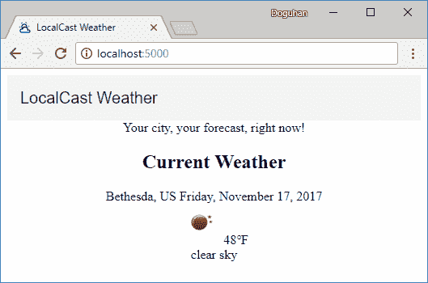
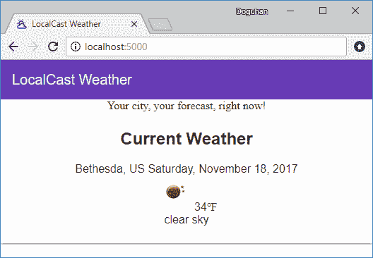
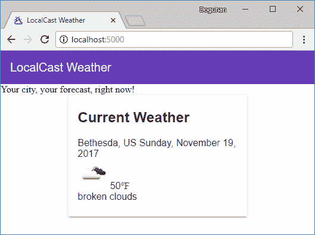
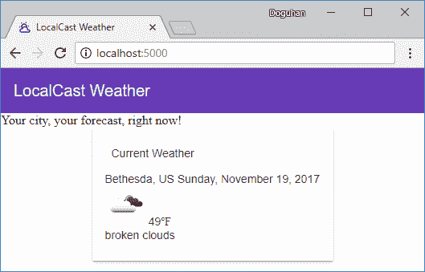
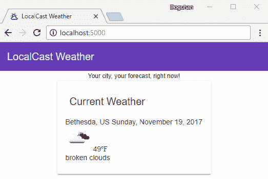
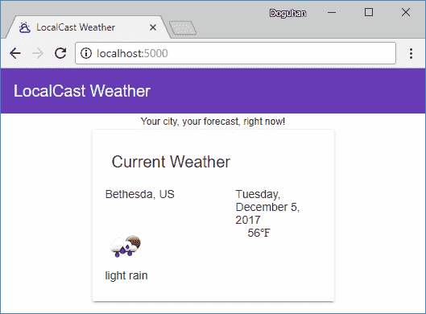
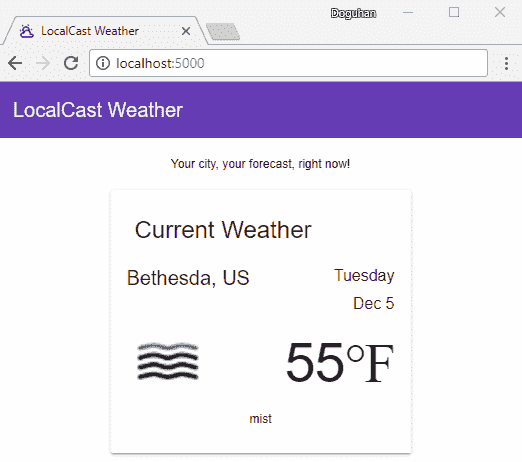
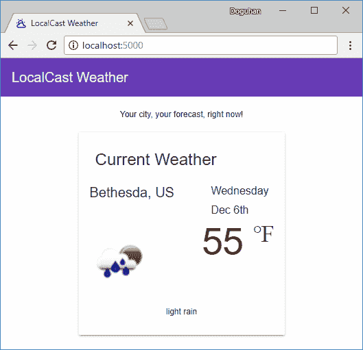
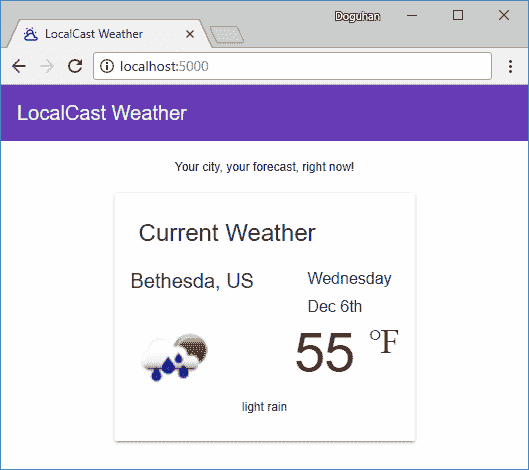

# 十一、使用 Angular 材质增强 Angular 应用

在[第 10 章](10.html)*中，为生产发布*准备 Angular 应用，我们提到了交付高质量应用的需要。目前，该应用的外观和感觉都很糟糕，仅适用于 90 年代后期创建的网站。用户或客户对您的产品或工作的第一印象非常重要，因此，我们必须能够创建一个外观美观的应用，它还可以跨移动和桌面浏览器提供出色的用户体验。

作为全栈开发人员，很难专注于应用的完善。随着应用的功能集快速增长，情况变得更糟。编写优秀的模块化代码来支持您的视图并不是一件有趣的事情，但为了改进您的应用，您必须立即恢复 CSS 技巧和内联样式。

Angular Material 是一个惊人的库，它与 Angular Material 密切协作开发。如果您学会了如何有效地利用Angular材质，那么无论您是在小型还是大型应用上工作，您创建的功能从一开始就会非常出色。Angular Material 将使您成为一名更有效的 web 开发人员，因为它附带了多种用户控件，您可以利用这些控件，而且您不必担心浏览器的兼容性。作为额外的好处，编写自定义 CSS 将成为一件稀罕事。

在本章中，您将学习以下内容：

*   如何配置角材质
*   使用Angular材质升级用户体验

# 向应用添加材质组件

现在我们已经安装了所有不同的依赖项，我们可以开始修改 Angular 应用以添加材质组件。我们将添加一个工具栏、材质设计卡元素，并涵盖可访问性和排版问题以及基本布局技术。

# 角材料示意图

通过 Angular 6 和原理图的引入，Material 之类的库可以提供自己的代码生成器。出版时，“Angular Material”附带三个基本生成器，用于创建带有侧导航、仪表板布局或数据表的Angular构件。有关发电机示意图的更多信息，请参见[https://material.angular.io/guide/schematics](https://material.angular.io/guide/schematics) 。

例如，可以通过执行以下操作创建侧导航布局：

```ts
$ ng generate @angular/material:material-nav --name=side-nav 

CREATE src/app/side-nav/side-nav.component.css (110 bytes)
CREATE src/app/side-nav/side-nav.component.html (945 bytes)
CREATE src/app/side-nav/side-nav.component.spec.ts (619 bytes)
CREATE src/app/side-nav/side-nav.component.ts (489 bytes)
UPDATE src/app/app.module.ts (882 bytes)
```

此命令更新了`app.module.ts`，直接将材料模块导入该文件，打破了我先前建议的`material.module.ts`模式。此外，一个新的`SideNavComponent`作为一个单独的组件添加到应用中，但正如[第 14 章](14.html)*设计验证和授权*中的*侧导航*部分所述，这种导航体验需要在应用的最底层实现。

简而言之，Angular Material Schematics 承诺，在 Angular 应用中添加各种材料模块和组件会大大减少麻烦；然而，正如本书所述，这些示意图不适用于创建灵活、可伸缩且结构良好的代码库。

目前，我建议将这些示意图用于快速原型或实验目的。

现在，让我们开始手动向 LocalCast Weather 添加一些组件。

# 使用材质工具栏修改登录页

在我们开始对`app.component.ts`进行进一步更改之前，让我们将组件切换为使用内联模板和内联样式，这样我们就不必为一个相对简单的组件在文件之间来回切换。

1.  更新`app.component.ts`以使用内联模板
2.  移除`app.component.html`和`app.component.css`

```ts
src/app/app.component.ts import { Component } from '@angular/core'

@Component({
  selector: 'app-root',
  template: `
    <div style="text-align:center">
      <h1>
      LocalCast Weather
      </h1>
      <div>Your city, your forecast, right now!</div>
      <h2>Current Weather</h2>
      <app-current-weather></app-current-weather>
    </div>
  `
})
export class AppComponent {}
```

让我们开始通过实现应用范围的工具栏来改进我们的应用：

3.  观察`app.component.ts`中的`h1`标签：

```ts
src/app/app.component.ts
<h1>
  LocalCast Weather
</h1>
```

4.  将`h1`标签更新为`mat-toolbar`：

```ts
src/app/app.component.ts    
<mat-toolbar>
  <span>LocalCast Weather</span>
</mat-toolbar>
```

5.  观察结果；您应该看到一个工具栏，如图所示：



LocalCast Weather Toolbar

6.  用更引人注目的颜色更新`mat-toolbar`：

```ts
src/app/app.component.ts    
<mat-toolbar color="primary">
```

为了获得更自然的感觉，工具栏必须接触浏览器的边缘。这在大屏幕和小屏幕格式上都能很好地工作。此外，当您将汉堡菜单或帮助按钮等可单击元素放置在工具栏的最左侧或最右侧时，您将避免用户单击空白区域的可能性。这就是为什么材质按钮的点击区域实际上比视觉显示的要大。这在打造无挫折的用户体验方面有很大的不同：

```ts
src/styles.css
body {
  margin: 0;
}
```

但是，如果你正在构建一个密集的应用，这将不适用于此应用；您会注意到，您的内容将一直延伸到应用的边缘，这不是一个理想的结果。考虑在 DIV 中包装内容区域，并使用 CSS 应用适当的边距，如图所示：

```ts
src/styles.css
.content-margin {
  margin-left: 8px;
  margin-right: 8px;
}
```

在下一个屏幕截图中，您可以看到应用了原色的边到边工具栏：


LocalCast Weather with Improved Toolbar

# 在材质卡片中表示天气

材料卡片是表示当前天气信息的一个很好的容器。卡片元素被一个阴影包围，阴影从其周围描绘内容：

1.  在`material.module`中导入`MatCardModule`：

```ts
src/app/material.module.ts
import { ..., MatCardModule} from '@angular/material'
...
@NgModule({
  imports: [..., MatCardModule],
  exports: [..., MatCardModule],
})
```

2.  在`app.component`中，用`<mat-card>`环绕`<app-current-weather>`：

```ts
src/app/app.component.ts
  <div style="text-align:center">
    <mat-toolbar color="primary">
      <span>LocalCast Weather</span>
    </mat-toolbar>
    <div>Your city, your forecast, right now!</div>
    <mat-card>
      <h2>Current Weather</h2>
      <app-current-weather></app-current-weather>
    </mat-card>
  </div>
```

3.  观察几乎无法分辨的卡元件，如图所示：



LocalCast Weather with Indistinguishable Card

为了更好地布局屏幕，我们需要切换到 Flex 布局引擎。首先，从零部件模板中删除训练控制盘：

4.  从周围的`<div>`移除`style="text-align:center"`：

要使页面中的元素居中，我们需要创建行，为中心元素指定一个宽度，并在任意一侧创建两个额外的列，可以调整以占用空白，例如：

```ts
src/app/app.component.ts
<div fxLayout="row">
  <div fxFlex></div>
  <div fxFlex="300px">  
    ...
  </div>
  <div fxFlex></div>
</div>
```

5.  用前面的 HTML 环绕`<mat-card>`
6.  观察卡元件是否正确居中，如下所示：



LocalCast Weather with Centered Card

阅读卡片文档并浏览[材料文档网站上的示例 https://material.angular.io/components/card/overview](https://material.angular.io/components/card/overview) ，您会注意到`mat-card`提供了房屋标题和内容的元素。我们将在接下来的章节中实现这一点。

On [material.angular.io](https://material.angular.io), you can view the source code of any example by clicking on  the brackets icons or launch a working example in Plunker by clicking on the arrow icon.

# 可达性

利用这些材料特性可能觉得没有必要；但是，在设计应用时，必须考虑响应性、样式化、间距和可访问性问题。Material 团队已经投入了大量的精力，以使您的代码在大多数情况下都能正常工作，并能以高质量的用户体验服务于尽可能多的用户群。这可能包括视障者或键盘主要用户，他们必须依靠专门的软件或键盘功能（如标签）来导航应用。利用材质元素为这些用户提供了至关重要的元数据，使他们能够浏览您的应用。

以下屏幕阅读器软件的材料索赔支持：

*   带 IE/FF/Chrome 的 NVDA 和 JAWS（在 Windows 上）
*   iOS 上的 Safari 和 OSX 上的 Safari/Chrome 画外音
*   Android 上的 Chrome 对讲

# 卡片标题和内容

现在我们来实现`mat-card`的标题和内容元素，如图所示：

```ts
src/app/app.component.ts    
<mat-toolbar color="primary">
  <span>LocalCast Weather</span>
</mat-toolbar>
<div>Your city, your forecast, right now!</div>
<div fxLayout="row">
  <div fxFlex></div>
  <mat-card fxFlex="300px">
    <mat-card-header>
      <mat-card-title>Current Weather</mat-card-title>
    </mat-card-header>
    <mat-card-content>
      <app-current-weather></app-current-weather>
    </mat-card-content>
  </mat-card>
  <div fxFlex></div>
</div>
```

对于材质，越少越好。您会注意到，我们能够移除中心`div`并直接在中心卡上应用`fxFlex`。所有材质元素都对 Flex 布局引擎提供了本机支持，这对复杂 UI 的可维护性具有巨大的积极意义。

我们申请`mat-card-header`后，您可以看到这个结果：



LocalCast Weather Card with Title and Content

请注意，卡中的字体现在与材质的 Roboto 字体匹配。然而，现在的天气不再像以前那样引人注目了。如果您在`mat-card-title`内的`h2`标签中加回，当前天气在视觉上看起来会更大；但是，字体与应用的其余部分不匹配。要解决此问题，您必须了解材质的排版功能。

# 材料排版

材料的文件恰当地说明如下：

Typography is a way of arranging type to make text legible, readable, and appealing when displayed.

Material 提供了不同级别的排版，具有不同的字体大小、行高和字体重量特征，可以应用于任何 HTML 元素，而不仅仅是现成提供的组件。

下表中是可用于应用材质排版的 CSS 类，如`<div class="mat-display-4">Hello, Material world!</div>`：

| **类名** | **用法** |
| `display-4`、`display-3`、`display-2`和`display-1` | 大型一次性标题，通常位于页面顶部（例如，英雄标题） |
| `headline ` | `<h1>`标签对应的章节标题 |
| `title ` | `<h2>`标签对应的章节标题 |
| `subheading-2` | `<h3>`标签对应的章节标题 |
| `subheading-1` | `<h4>`标签对应的章节标题 |
| `body-1` | 基本正文文本 |
| `body-2` | 粗体文本 |
| `caption ` | 较小的正文和提示文本 |
| `button` | 按钮和锚 |

您可以在[上阅读更多有关材料排版的信息 https://material.angular.io/guide/typography](https://material.angular.io/guide/typography) 。

# 应用排版

应用排版有多种方法。一种方法是利用`mat-typography`类并使用相应的 HTML 标记，如`<h2>`：

```ts
src/app/app.component.ts 
<mat-card-header class="mat-typography">
  <mat-card-title><h2>Current Weather</h2></mat-card-title>
</mat-card-header>
```

另一种方法是直接在元素上应用特定的排版，如`class="mat-title"`：

```ts
src/app/app.component.ts 
<mat-card-title><div class="mat-title">Current Weather</div></mat-card-title>
```

Note that `class="mat-title"` can be applied to `div`, `span` or an `h2` with the same results.

根据一般经验，实现更具体、更本地化的选项通常是更好的主意，这是第二种实现。

# 将标语更新为中心对齐的标题

我们可以使用`fxLayoutAlign`将应用的标语居中，并给它一个柔和的`mat-caption`字体，如下所示：

1.  执行布局更改和标题排版：

```ts
src/app/app.component.ts 
<div fxLayoutAlign="center">
  <div class="mat-caption">Your city, your forecast, right now!</div>
</div>
```

2.  观察结果，如图所示：



LocalCast Weather Centered Tagline

# 更新当前天气预报卡布局

要使 UI 看起来像设计，还需要做更多的工作，特别是当前天气卡的内容，如下所示：


为了设计布局，我们将利用 Angular Flex。

您将编辑`current-weather.component.html`，它使用`<div>`和`<span>`标记分别建立位于单独行或同一行上的元素。切换到 Angular Flex 后，我们需要将所有元素切换到`<div>`，并使用`fxLayout`指定行和列。

# 实施布局脚手架

我们需要从实施粗略的脚手架开始。

考虑模板的当前状态：

```ts
 src/app/current-weather/current-weather.component.html
 1 <div *ngIf="current">
 2  <div>
 3    <span>{{current.city}}, {{current.country}}</span>
 4    <span>{{current.date | date:'fullDate'}}</span>
 5  </div>
 6  <div>
 7    
 8    <span>{{current.temperature | number:'1.0-0'}}℉</span>
 9  </div>
10  <div>
11    {{current.description}}
12  </div>
13 </div>
```

让我们一步一步地浏览文件并更新它：

1.  将第 3、4 和 8 行的`<span>`元素更新为`<div>`
2.  用`<div>`包裹``元件
3.  将`fxLayout="row"`属性添加到第 2 行和第 6 行上有多个子元素的`<div>`元素中
4.  城市和国家栏占据了屏幕的大约 2/3，因此在第 3 行的`<div>`元素中添加`fxFlex="66%"`
5.  将`fxFlex`添加到第 4 行的下一个`<div>`元素，以确保它占用剩余的水平空间
6.  将`fxFlex="66%"`添加到新的`<div>`元素中，围绕``元素
7.  将`fxFlex`添加到第 4 行的下一个`<div>`元素

模板的最终状态应如下所示：

```ts
 src/app/current-weather/current-weather.component.html
 1 <div *ngIf="current">
 2   <div fxLayout="row">
 3     <div fxFlex="66%">{{current.city}}, {{current.country}}</div>
 4     <div fxFlex>{{current.date | date:'fullDate'}}</div>
 5   </div>
 6   <div fxLayout="row">
 7     <div fxFlex="66%">
 8       
 9     </div>
10     <div fxFlex>{{current.temperature | number:'1.0-0'}}℉</div>
11   </div>
12   <div>
13    {{current.description}}
14  </div>
15 </div>
```

您可以更详细地添加 Angular Flex 属性；然而，编写的代码越多，需要维护的代码就越多，这使得将来的更改更加困难。例如，第 12 行的`<div>`元素不需要`fxLayout="row"`，因为`<div>`隐式地获取新行。类似地，在第 4 行和第 7 行，右侧列不需要显式的`fxFlex`属性，因为左侧元素会自动压缩它。

从网格放置的Angular来看，您的所有元素现在都位于正确的*单元格*中，如图所示：



LocalCast Weather with layout scaffolding

# 对齐元素

现在，我们需要对齐每个单元格并设置其样式以匹配设计。日期和温度需要右对齐，描述居中：

1.  要右对齐日期和温度，请在`current-weather.component.css`中创建一个名为`.right`的新 css 类：

```ts
src/app/current-weather/current-weather.component.css
.right {
  text-align: right
}
```

2.  在第 4 行和第 10 行的`<div>`元素中添加`class="right"`
3.  将`<div>`元素居中以进行描述，方法与本章前面将应用的标语居中的方法相同
4.  观察各元件是否正确对齐，如下所示：


LocalCast Weather with correct alignments

# 样式元素

完成元素的样式通常是前端开发中最耗时的部分。我建议您先进行多次检查，以尽可能少的努力获得足够接近的设计版本，然后让您的客户或团队决定是否值得花费更多的资源来完善设计：

1.  添加新的 css 属性：

```ts
src/app/current-weather/current-weather.component.css
.no-margin {
  margin-bottom: 0
}
```

2.  对于城市名称，在第 3 行添加`class="mat-title no-margin"`
3.  对于日期，在第 4 行，将`"mat-subheading-2 no-margin"`添加到`class="right"`
4.  将日期的格式从`'fullDate'`更改为`'EEEE MMM d'`，以匹配设计
5.  修改第 8 行`,`增加`style="zoom: 175%"`
6.  对于温度，在第 10 行，附加`"mat-display-3 no-margin"`
7.  对于说明，在第 12 行添加`class="mat-caption"`

这是模板的最终状态：

```ts
src/app/current-weather/current-weather.component.html
<div *ngIf="current">
  <div fxLayout="row">
    <div fxFlex="66%" class="mat-title no-margin">{{current.city}}, {{current.country}}</div>
    <div fxFlex class="right mat-subheading-2 no-margin">{{current.date | date:'EEEE MMM d'}}</div>
  </div>
  <div fxLayout="row">
    <div fxFlex="66%">
      
    </div>
    <div fxFlex class="right mat-display-3 no-margin">{{current.temperature | number:'1.0-0'}}℉</div>
  </div>
  <div fxLayoutAlign="center" class="mat-caption">
    {{current.description}}
  </div>
</div>
```

8.  请注意，代码的样式化输出会发生更改，如图所示：


LocalCast Weather with styling

# 微调风格

标语可以从一些顶部和底部边距中受益。这是我们可能在整个应用中使用的常见 CSS，因此我们将其放在`styles.css`中：

1.  实施`vertical-margin`：

```ts
src/styles.css
.vertical-margin {
  margin-top: 16px;
  margin-bottom: 16px;
}
```

2.  申请`vertical-margin`：

```ts
src/app/app.component.ts
<div class="mat-caption vertical-margin">Your city, your forecast, right now!</div>
```

当前天气与城市名称的样式相同；我们需要区分两者。

3.  在`app.component.ts`中，使用`mat-headline`字体更新当前天气：

```ts
src/app/app.component.ts
<mat-card-title><div class="mat-headline">Current Weather</div></mat-card-title>
```

4.  图像和温度没有居中，因此在第 6 行中围绕这些元素的行中添加`fxLayoutAlign="center center"`：

```ts
src/app/current-weather/current-weather.component.html
<div fxLayout="row" fxLayoutAlign="center center">
```

5.  观察应用的最终设计，其外观如下所示：



LocalCast Weather final design

# 调整以匹配设计

这是一个你可能花费大量时间的领域。如果我们遵循 80-20 原则，像素完美的调整通常是最后 20%，需要 80%的时间才能完成。让我们检查一下我们的实现和设计之间的差异，以及如何弥合这一差距：


日期需要进一步定制。缺少数字序号*th*；为了实现这一点，我们需要引入第三方库，如 moment 或实施我们自己的解决方案，并将其绑定到模板上的日期旁边：

1.  更新`current.date`为其添加序号：

```ts
src/app/current-weather/current-weather.component.html
{{current.date | date:'EEEE MMM d'}}{{getOrdinal(current.date)}}
```

2.  执行`getOrdinal`功能：

```ts
src/app/current-weather/current-weather.component.ts export class CurrentWeatherComponent implements OnInit {
...
  getOrdinal(date: number) {
    const n = new Date(date).getDate()
    return n > 0
      ? ['th', 'st', 'nd', 'rd'][(n > 3 &amp;&amp; n < 21) || n % 10 > 3 ? 0 : n % 10]
      : ''
  }
  ...
}
```

请注意，`getOrdinal`的实现归结为一个复杂的单行程序，它不是非常可读，并且很难维护。如果这些功能对您的业务逻辑至关重要，那么它们应该经过大量的单元测试。

Angular 6, at the time of writing, doesn't support new line breaks in the date template; ideally, we should be able to specify the date format as `'EEEE\nMMM d'` to ensure that the line break is always consistent.

温度实现需要使用一个`<span>`元素将数字与单元分开，并用`<p>`包围，因此上标样式可以应用于单元，例如`<span class="unit">℉</span>`，其中单元是 CSS 类，使其看起来像上标元素。

3.  实现一个`unit`CSS 类：

```ts
src/app/current-weather/current-weather.component.css
.unit {
  vertical-align: super;
}
```

4.  申请`unit`：

```ts
src/app/current-weather/current-weather.component.html
...   
 7 <div fxFlex="55%">
...
10 <div fxFlex class="right no-margin">
11   <p class="mat-display-3">{{current.temperature | number:'1.0-0'}}
12     <span class="mat-display-1 unit">℉</span>
13   </p>
```

我们需要通过调整第 7 行的`fxFlex`值来试验预测图像应该有多少空间。否则，温度会溢出到下一行，您的设置可能会进一步受到浏览器窗口大小的影响。例如，`60%`在浏览器窗口很小的情况下运行良好，但当最大化时，它会强制溢出。然而，`55%`似乎同时满足两个条件：



LocalCast Weather after tweaks

一如既往，可以进一步调整边距和填充物，以进一步定制设计。但是，每个与库的偏差都会带来可维护性的后果。除非您真的在围绕显示天气数据建立业务，否则您应该将任何进一步的优化推迟到项目结束时，如果时间允许，并且如果经验可以作为指导，您将不会进行此优化。

有了两个负边距的底部破解，您可以获得与原始设计相当接近的设计，但我不会在这里介绍这些破解，并将其作为练习留给读者在 GitHub 存储库中发现。这种黑客行为有时是必要的，但总的来说，它们指出了设计和实现现实之间的脱节。到“调整”部分的解决方案是最佳点，在该点，Angular材质蓬勃发展：



LocalCast Weather after tweaks and hacks

# 更新单元测试

为了保持单元测试的运行，您需要将`MaterialModule`导入任何使用Angular材质的组件`spec`文件：

```ts
*.component.spec.ts
...
  beforeEach(
    async(() => {
      TestBed.configureTestingModule({
        ...
        imports: [..., MaterialModule, NoopAnimationsModule],
      }).compileComponents()
    })
  )
```

您还需要更新搜索特定 HTML 元素的任何测试，包括 e2e 测试。

例如，由于应用的标题 LocalCast Weather 不再位于`h1`标记中，因此您必须更新`spec`文件以在`span`元素中查找它：

```ts
src/app/app.component.spec.ts
expect(compiled.querySelector('span').textContent).toContain('LocalCast Weather')
```

类似地，在 e2e 测试中，您需要更新页面对象函数以从正确位置检索文本：

```ts
e2e/app.po.ts
getParagraphText() {
  return element(by.css('app-root mat-toolbar span')).getText()
}
```

# 更新角材料

您可以使用`ng update`获得快速、无痛的升级体验，如下所示：

```ts
$ npx ng update @angular/material
 Updating package.json with dependency @angular/cdk @ "6.0.0" (was "5.2.2")...
 Updating package.json with dependency @angular/material @ "6.0.0" (was "5.2.2")...
UPDATE package.json (5563 bytes)
```

此外，我还发现了 Angular 团队在[发布的`material-update-tool`https://github.com/angular/material-update-tool](https://github.com/angular/material-update-tool) 。在其当前的形式中，该工具被宣传为一种特殊的Angular材质 5.x 到 6.0 更新工具，因此它可能会像未来的`rxjs-tslint`工具一样成为`ng update`的一部分。您可以按如下所示运行该工具：

```ts
$ npx angular-material-updater -p .\src\tsconfig.app.json

√ Successfully migrated the project source files. Please check above output for issues that couldn't be automatically fixed.
```

如果你运气好，一切顺利，请跳过本节的其余部分。在本节的其余部分中，我将介绍一个特定场景，其中涉及在本示例开发过程中遇到的候选版本和 beta 版本，这突出了手动更新的必要性。首先，我们将了解当前版本，然后发现最新的可用版本，最后，更新并测试升级，就像我们手动更新 Angular 时所做的那样。

# 更新角材料

现在我们已经知道要升级到哪个版本，让我们继续执行以下操作：

1.  执行以下命令，将材质及其相关组件更新为其目标版本：

```ts
$ npm install @angular/material@^5.0.0 @angular/cdk@^5.0.0 @angular/animations@^5.0.0 @angular/flex-layout@^2.0.0-rc.1
```

2.  验证您的`package.json`以确保版本与预期版本匹配
3.  解决任何 NPM 警告

In this specific instance, we receive impossible-to-meet peer dependency warnings from the `@angular/flex-layout` package. Further investigation on GitHub ([https://github.com/angular/flex-layout/issues/508](https://github.com/angular/flex-layout/issues/508)) reveals that this is a known issue and in general to be expected from a Beta or RC package. This means it is safe to ignore these warnings.

# 总结

在本章中，您学习了在应用中应用特定的Angular材质组件。您开始意识到过度优化 UI 设计的陷阱。我们还讨论了如何使棱角材料保持最新。

在下一章中，我们将更新 weather 应用，以响应用户输入的反应式表单，并保持我们的组件解耦，同时使用`BehaviorSubject`实现它们之间的数据交换。在下一章之后，我们将完成天气应用，并将重点转移到构建更大的业务线应用上。