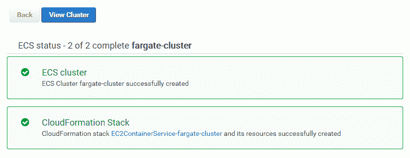
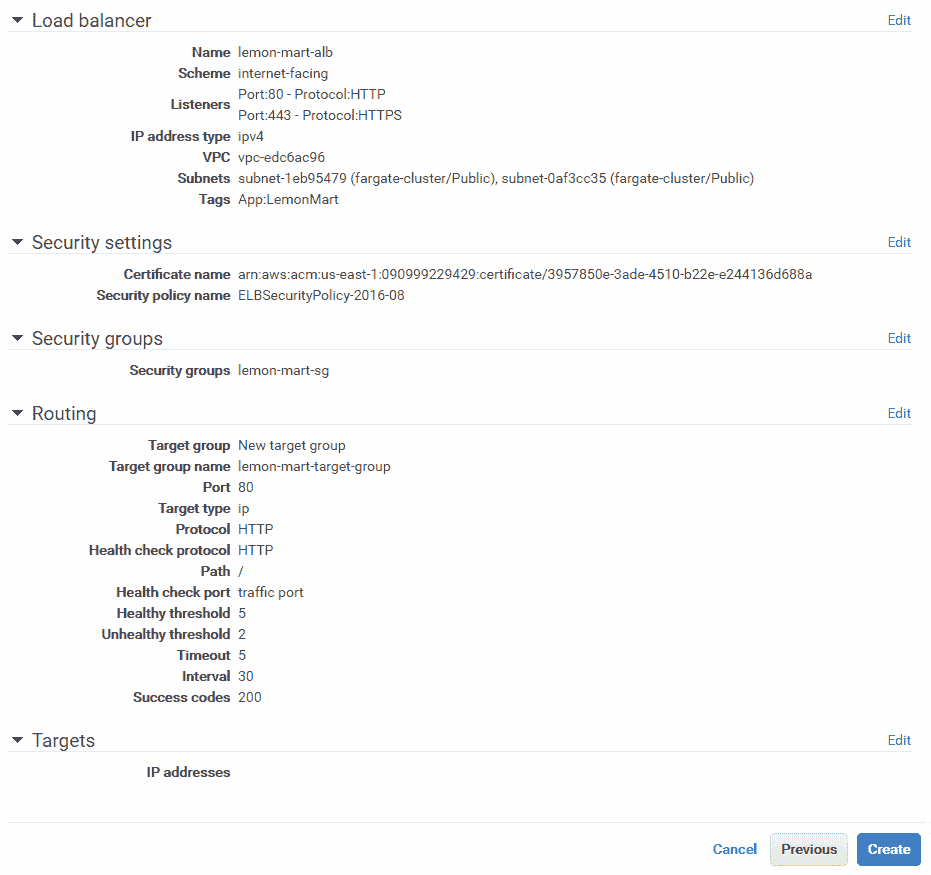
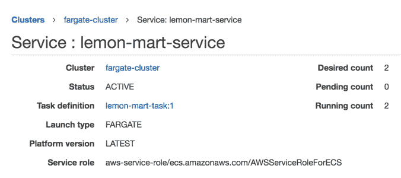
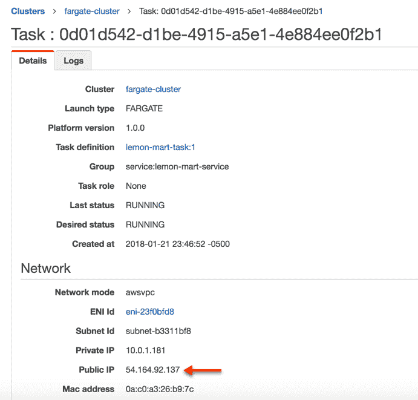
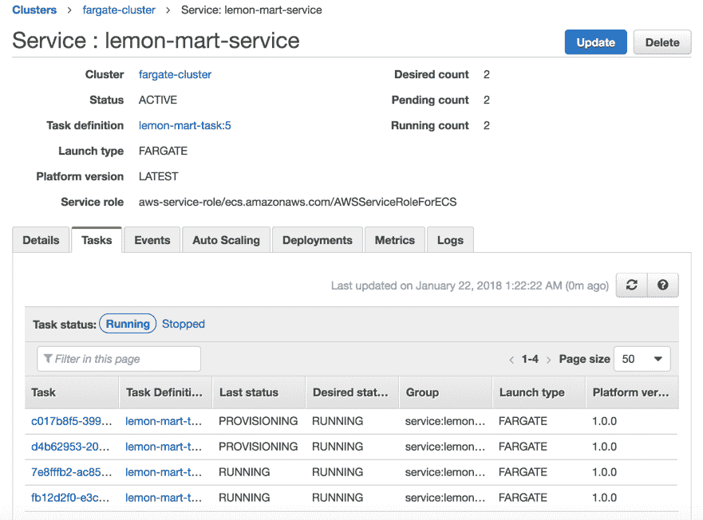

# 十六、AWS 上的高可用云基础设施

网络是一个充满敌意的环境。演员有好有坏。坏的参与者可能会试图戳破您的安全漏洞，或试图通过**分布式拒绝服务**（**DDoS**攻击摧毁您的网站。好演员，如果你幸运的话，会喜欢你的网站并且不会停止使用它。他们会给你大量的建议来改进你的网站，但同时，他们可能会遇到 bug，他们可能会过于热情，以至于你的网站可能会因为高流量而慢下来。在 web 上进行真实世界的部署需要大量的专业知识才能正确完成。作为一名全堆栈开发人员，您只能了解硬件、软件和网络的许多细微差别。幸运的是，随着云服务提供商的出现，许多这种专业技能已经转化为软件配置，困难的硬件和网络问题由提供商解决。

云服务提供商的最佳功能之一是云可伸缩性，它指的是您的服务器自动向外扩展以响应大量意外流量，并在流量恢复到正常水平时向下扩展以节省成本。**亚马逊网络服务**（**AWS**）超越了基本的云可伸缩性，引入了高可用性和容错概念，允许弹性本地和全球部署。我之所以选择向大家介绍 AWS，是因为它的强大功能远远超出了我在本书中所涉及的范围。使用 Route 53，您可以获得免费 DDoS 保护；使用 API Gateway，您可以创建 API 密钥；使用 AWS Lambda，您可以每月只花几美元处理数百万笔交易；使用 CloudFront，您可以将内容缓存在分散在世界主要城市的秘密边缘位置。此外，蓝绿色部署将允许您实现软件的无停机部署。

总的来说，您将在本章中学习的工具和技术适用于任何云提供商，并且正迅速成为任何完整堆栈开发人员的关键知识。我们将讨论以下主题：

*   创建和保护 AWS 帐户
*   适当规模的基础设施
*   实例测试简单到优化
*   配置并部署到 AWS ECS Fargate
*   脚本蓝绿色部署
*   演员表

# 适当规模的基础设施

优化基础架构的目的是保护公司的收入，同时最大限度地降低运营基础架构的成本。您的目标应该是确保用户不会遇到高延迟，也就是所谓的性能差或更糟、未完成或丢弃的请求，同时让您的企业保持可持续发展。

web 应用性能的三大支柱如下：

1.  CPU 利用率
2.  内存使用
3.  网络带宽

我有意将磁盘访问排除在关键考虑指标之外，因为只有在应用服务器或数据存储上执行的特定工作负载才会受到影响。只要应用资产是通过**内容交付网络**（**CDN**交付的，磁盘访问几乎不会影响为 web 应用提供服务的性能。也就是说，仍然要密切关注任何意外失控的磁盘访问，例如频繁创建临时文件和日志文件。例如，Docker 可以吐出可以轻松填满驱动器的日志。

在理想情况下，CPU、内存和网络带宽的使用应平均利用约 60-80%的可用容量。如果由于各种其他因素（如磁盘 I/O、第三方服务速度慢或代码效率低）而遇到性能问题，则最有可能的是，您的一个指标会窥视或接近最大容量，而另外两个指标则处于空闲状态或严重利用不足状态。这是一个使用更多 CPU、内存或带宽来补偿性能问题并均匀利用可用资源的机会。

将利用率定为 60-80%的目标背后的原因是为新实例（服务器或容器）预留一段时间，以便为用户提供服务。超过预定义阈值后，在配置新实例的同时，您可以继续为越来越多的用户提供服务，从而最大限度地减少未完成的请求。

Throughout this book, I have discouraged over-engineering or perfect solutions. In today's complicated IT landscape, it is nearly impossible to predict where you will encounter performance bottlenecks. Your engineering may, very easily, spend $100,000+ worth of engineering hours, where the solution to your problem may be a few hundred dollars of new hardware, whether it be a network switch, solid state drive, CPU, and more memory.

如果您的 CPU 太忙，您可能希望通过索引、哈希表或字典为代码引入更多簿记逻辑，您可以在内存中缓存这些逻辑，以加快逻辑的后续或中间步骤。例如，如果您不断运行数组查找操作来定位记录的特定属性，则可以对该记录执行操作，将记录的 ID 和/或属性保存在内存中的哈希表中，将运行时成本从*O（n）*降低到*O（1）*。

按照前面的示例，您可能会在哈希表中使用过多内存。在这种情况下，您可能希望使用空闲的网络带宽（如 Redis 实例）更积极地将缓存卸载或转移到速度较慢但数量更丰富的数据存储。

如果您的网络利用率太高，您可能希望调查 CDN 的使用情况，包括过期链接、客户端缓存、节流请求、滥用配额的客户的 API 访问限制，或者优化实例，使其具有与其 CPU 或内存容量相比过多的网络容量。

# 优化实例

在前面的一个例子中，我演示了如何使用我的`duluca/minimal-node-web-server`Docker 图像来托管我们的 Angular 应用。尽管 Node.js 是一个非常轻量级的服务器，但它并没有被优化为一个 web 服务器。此外，Node.js 具有单线程执行环境，这使得它对于同时向多个并发用户提供静态内容来说是一个糟糕的选择。

您可以通过执行`docker stats`来观察 Docker 镜像正在使用的资源：

```ts
$ docker stats
CONTAINER ID  CPU %  MEM USAGE / LIMIT    MEM %  NET I/O         BLOCK I/O  PIDS
27d431e289c9  0.00%  1.797MiB / 1.952GiB  0.09%  13.7kB / 285kB  0B / 0B       2
```

以下是节点和基于 NGINX 的服务器在静止时使用的系统资源的比较结果：

| **服务器** | **图像大小** | **内存使用** |
| `duluca/minimal-nginx-web-server` | 16.8 MB | 1.8MB |
| `duluca/minimal-node-web-server` | 71.8 MB | 37.0 MB |

然而，静态值只能说明故事的一部分。为了更好地理解，我们必须执行一个简单的负载测试，以查看负载下的内存和 CPU 利用率。

# 简单负载测试

为了更好地了解我们服务器的性能特征，让我们将其置于一定的负载下，并对其进行强调：

1.  使用`docker run`启动您的容器：

```ts
$ docker run --name <imageName> -d -p 8080:<internal_port> <imageRepo>
```

如果您正在使用`npm Scripts for Docker`，请执行以下命令启动您的容器：

```ts
$ npm run docker:debug
```

2.  执行以下 bash 脚本以启动负载测试：

```ts
$ curl -L http://bit.ly/load-test-bash [](http://bit.ly/load-test-bash) | bash -s 100 "http://localhost:8080"
```

此脚本将每秒向服务器发送 100 个**请求，直到您终止它。**

 **3.  执行`docker stats`观察性能特性。

以下是 CPU 和内存利用率的高级观察结果：

| **CPU 利用率统计** | **低** | **中期** | **高** | **最大内存** |
| `duluca/minimal-nginx-web-server` | 2% |                    15% |                       60% | 2.4 MB |
| `duluca/minimal-node-web-server` | 20% |                    45% |                     130% | 75MB |

如您所见，提供完全相同内容的两台服务器之间存在显著的性能差异。请注意，这种基于 requests/second 的测试有助于进行比较分析，并不一定反映实际使用情况。

很明显，我们的 NGINX 服务器将为我们带来最好的回报。有了最佳解决方案，让我们在 AWS 上部署应用。

# 部署到 AWS ECS Fargate

AWS**弹性容器服务**（**ECS**）Fargate 是一种经济高效且易于配置的方式，可以在云中部署容器。

ECS 由四个主要部分组成：

1.  容器存储库，**弹性容器注册表**（**ECR**），用于发布 Docker 图像
2.  服务、任务和任务定义，其中您将容器的运行时参数和端口映射定义为服务作为任务运行的任务定义
3.  集群，EC2 实例的集合，可以在其中配置和扩展任务
4.  Fargate 是一个托管集群服务，它将 EC2 实例、负载平衡器和安全组问题抽象出来

At the time of publishing, Fargate is only available in the AWS `us-east-1` region.

我们的目标是创建一个高可用的蓝绿色部署，这意味着在服务器出现故障时，甚至在部署期间，至少有一个应用实例将启动并运行

# 配置 ECS Fargate

您可以在 AWS 服务菜单下访问 ECS 功能，选择弹性容器服务链接。

If this is your first time logging in, you must go through a tutorial, where you will be forced to create a sample app. I would recommend going through the tutorial and deleting your sample app afterward. In order to delete a service, you'll need to update your service's number of tasks to 0\. In addition, delete the default cluster to avoid any unforeseen charges.

# 创建 Fargate 群集

让我们从配置 Fargate 集群开始，它在配置其他 AWS 服务时充当锚点。我们的集群最终将运行一个集群服务，我们将在以下部分逐步建立该服务。

At the time of publishing, AWS Fargate is only available in AWS US East region, with support for more regions and Amazon Elastic Container Service for Kubernetes (Amazon EKS) coming soon. Kubernetes is a widely preferred open source alternative to AWS ECS with richer capabilities for container orchestration with on-premises, cloud, and cloud-hybrid deployments.

让我们创建集群：

1.  导航到弹性容器服务
2.  单击群集|创建群集
3.  选择“仅网络”选项。。。由 AWS Fargate 模板提供动力

4.  单击下一步，您将看到创建集群步骤，如图所示：


AWS ECS Create Cluster

5.  将集群名称输入为`fargate-cluster`
6.  创建专有网络以将您的资源与其他 AWS 资源隔离
7.  单击 CreateCluster 完成设置

您将看到您的行动摘要，如下所示：



AWS ECS Fargate Cluster

现在您已经在自己的**虚拟私有云**（**VPC**中创建了一个集群，您可以在弹性容器服务【集群】下查看。

# 创建容器存储库

接下来，我们需要建立一个存储库，以便发布我们在本地或 CI 环境中构建的容器映像：

1.  导航到弹性容器服务
2.  单击存储库|创建存储库
3.  将存储库名称输入为`lemon-mart`
4.  复制屏幕上生成的存储库 URI
5.  将应用的`package.json`中的 URI 粘贴为新的`imageRepo`变量：

```ts
package.json ...
"config": {
  “imageRepo”: “000000000000.dkr.ecr.us-east-1.amazonaws.com/lemon-mart”,
  ...
}
```

6.  单击 CreateRepository
7.  单击“下一步”，然后单击“完成”，以完成设置

在摘要屏幕中，您将获得有关如何与 Docker 一起使用存储库的进一步说明。在本章的后面部分，我们将介绍一些脚本，这些脚本将为我们解决这个问题。


AWS ECS Repository

您可以在弹性容器服务|存储库下查看您的新存储库。我们将在接下来的`npm Scripts for AWS`部分中讨论如何发布您的图像。

# 创建任务定义

使用存储库中定义的容器目标，我们可以定义任务定义，其中包含运行容器所需的元数据，例如端口映射、保留 CPU 和内存分配：

1.  导航到弹性容器服务
2.  单击任务定义|创建新任务定义
3.  选择 Fargate 启动类型兼容性
4.  输入任务定义名称为`lemon-mart-task`
5.  选择任务角色`none`（您可以稍后添加一个以启用对其他 AWS 服务的访问）
6.  输入任务大小`0.5 GB`
7.  进入任务 CPU`0.25 CPU`
8.  单击添加容器：
    1.  将容器名称输入为`lemon-mart`
    2.  对于图像，粘贴来自早期的图像 repo URI，但在其上附加`:latest`标记，以便它始终提取存储库中的最新图像，例如`000000000000.dkr.ecr.us-east-1.amazonaws.com/lemon-mart:latest`
    3.  为 NGINX 设置`128 MB`的软限制，为 Node.js 设置`256 MB`的软限制
    4.  在端口映射下，为 NGINX 指定容器端口为`80`，为 Node.js 指定容器端口为`3000`
9.  接受剩余的默认值

10.  点击添加；以下是任务定义在创建之前的外观：


AWS ECS Task Definition

11.  单击“创建”完成设置

在弹性容器服务|任务定义下查看您的新任务定义。

请注意，默认设置将启用 AWS CloudWatch 日志记录，这是一种可以追溯访问容器实例的控制台日志的方法。在本例中，将创建名为`/ecs/lemon-mart-task`的 CloudWatch 日志组。

View your new Log Group under Cloud Watch | Logs. If you're adding a container that needs to persist data, the task definition allows you to define a volume and mount a folder to your Docker container. I've published a guide a for configuring AWS **Elastic File System** (**EFS**) with your ECS Container at [bit.ly/mount-aws-efs-ecs-container](http://bit.ly/mount-aws-efs-ecs-container).

# 创建弹性负载平衡器

在高可用性部署中，我们希望在两个不同的**可用性区域**（**AZs**之间运行您的容器的两个实例，正如我们刚才创建的任务定义所定义的那样。对于这种动态的向外扩展和向内扩展，我们需要配置一个**应用负载平衡器**（**ALB**来处理请求路由和释放：

1.  在单独的选项卡上，导航到 EC2 |负载平衡器|创建负载平衡器
2.  创建应用负载平衡器
3.  输入名称`lemon-mart-alb`：

为了支持侦听器下的 SSL 通信，您可以在端口`443`上为 HTTPS 添加一个新的侦听器。可以通过 AWS 服务和向导方便地实现 SSL 设置。在 ALB 配置过程中，AWS 提供指向这些向导的链接以创建证书。然而，这是一个复杂的过程，根据您现有的域托管和 SSL 认证设置，这个过程可能会有所不同。在这本书中，我将跳过 SSL 配置。您可以在我在[bit.ly/setupAWSECSCluster](http://bit.ly/setupAWSECSCluster)上发布的指南中找到与 SSL 相关的步骤。

4.  在可用性区域下，选择为 fargate 群集创建的 VPC
5.  选择列出的所有 AZ
6.  展开标签并添加一个键/值对，以便能够识别 ALB，如``"App": " LemonMart"``

7.  点击下一步
8.  选择默认 ELB 安全策略
9.  点击下一步
10.  创建新的群集特定安全组`lemon-mart-sg`，仅允许端口`80`入站或`443`（如果使用 HTTPS）

When creating your Cluster Service in the next section, ensure that the security group created here is the one selected during service creation. Otherwise, your ALB won't be able to connect to your instances.

11.  点击下一步
12.  将新的目标群体命名为`lemon-mart-target-group`
13.  将协议类型从`instance`更改为`ip`
14.  在健康检查下，如果在 HTTP 上服务网站，则保留默认路由`/`

运行状况检查对于扩展和部署操作的正常运行至关重要。这是 AWS 可以用来检查实例是否已成功创建的机制。

If deploying an API and/or redirecting all HTTP calls to HTTPS, ensure that your app defines a custom route that is not redirected to HTTPS. On HTTP server GET `/healthCheck` return simple 200 message saying `I'm healthy` and verify that this does not redirect to HTTPS. Otherwise, you will go through a lot of pain and suffering trying to figure out what's wrong, as all health checks fail and deployments inexplicably fail. `duluca/minimal-node-web-server` provides HTTPS redirection, along with an HTTP-only `/healthCheck` endpoint out of the box. With `duluca/minimal-nginx-web-server`, you will need to provide your own configuration.

15.  点击下一步
16.  不要*注册任何目标或 IP 范围。ECS Fargate 将为您神奇地管理这一点，如果您自己这样做，您将提供一个半破损的基础设施*

17.  点击下一步：回顾；您的 ALB 设置应与所示类似：



AWS Application Load Balancer Settings

18.  单击“创建”完成设置

在下一节中创建集群服务时，您将使用 lemon mart alb。

# 创建群集服务

现在，我们将通过使用任务定义和我们创建的 ALB 在集群中创建一个服务，将所有这些结合在一起：

1.  导航到弹性容器服务
2.  点击集群| fargate 集群
3.  在“服务”选项卡下，单击“创建”
4.  选择发射类型`Fargate`
5.  选择先前创建的任务定义

请注意，任务定义是版本化的，例如`lemon-mart-task:1`。如果要更改任务定义，AWS 将创建`lemon-mart-task:2`。要使更改生效，您需要使用此新版本更新服务。

6.  输入服务名称`lemon-mart-service`
7.  任务数量`2`
8.  最低健康百分比`50`
9.  最大百分比`200`
10.  点击下一步

Set minimum health percent to 100 for high-availability even during deployment. Fargate pricing is based on usage per second, so while deploying your application, you will be charged extra for the additional instances, while the old ones are being deprovisioned.

11.  在“配置网络”下，选择与先前版本中的群集相同的 VPC
12.  选择所有可用的子网；对于高可用性，至少应该有两个
13.  选择您在上一节中创建的安全组-`lemon-mart-sg`
14.  选择负载平衡器类型作为应用负载平衡器
15.  选择 lemon mart alb 选项
16.  通过单击添加到负载平衡器按钮，将容器端口添加到 ALB，例如`80`或`3000`
17.  选择已定义的侦听器端口
18.  选择已定义的目标组
19.  取消选中启用服务发现集成
20.  点击下一步

21.  如果希望实例在其容量达到某个限制时自动向外和向内扩展，请设置“自动缩放”

我建议您在初始设置服务时跳过自动缩放设置，以便更容易解决任何潜在的配置问题。您可以稍后再来设置。自动任务扩展策略依赖于报警，例如 CPU 利用率。

22.  单击“下一步”并查看更改，如图所示：


AWS Fargate cluster service settings

23.  最后，单击 Save 完成设置

在弹性集装箱服务|集群| fargate 集群| lemon mart 服务下观察您的新服务。在将映像发布到容器存储库之前，AWS 服务将无法提供实例，因为运行状况检查将持续失败。发布映像后，您需要确保服务的“事件”选项卡中没有错误。

AWS 是一个复杂的野兽，使用 Fargate，您可以避免很多复杂性。但是，如果您有兴趣使用自己的 Ec2 实例建立自己的 ECS 群集，您可以享受 1-3 年保留实例的优惠。我在[bit.ly/setupAWSECSCluster](http://bit.ly/setupAWSECSCluster)上有 75+的设置指南。

我们已经手动执行了许多步骤来创建集群。AWS CloudFormation 通过提供配置模板来解决此问题，您可以根据自己的需要进行自定义，也可以从头编写自己的模板脚本。如果你想认真对待 AWS，这种代码作为基础设施的设置绝对是一种选择。

对于生产部署，请确保您的配置是由 CloudFormation 模板定义的，这样就可以轻松地重新配置，而不是在发生与部署相关的失误时。

# 配置 DNS

如果您使用 AWS Route 53 管理您的域，则很容易将域或子域分配给 ALB：

1.  导航至路线 53 |托管区域
2.  选择您的域，如`thejavascriptpromise.com`
3.  单击创建记录集
4.  输入名称为`lemonmart`
5.  将别名设置为`yes`
6.  从负载平衡器列表中选择 lemon mart alb

7.  单击“创建”完成设置


Route 53 - Create record set

现在，您的站点将可以在您刚刚定义的子域上访问，例如`http://lemonmart.thejavascriptpromise.com`。

如果不使用 53 号公路，不要惊慌。在您的域提供商的网站上，编辑`Zone`文件以创建 ELB DNS 地址的`A`记录，您就完成了。

# 获取 DNS 名称

要获取负载平衡器的 DNS 地址，请执行以下步骤：

1.  导航到 EC2 |负载平衡器
2.  选择 lemon mart alb

3.  在描述选项卡中，注意 DNS 名称；考虑这个例子：

```ts
DNS name:
lemon-mart-alb-1871778644.us-east-1.elb.amazonaws.com (A Record)
```

# Prep Angular 应用

本节假设您已经设置了 Docker 和`npm Scripts for Docker`**，如[第 10 章](10.html)*所述，准备 Angular App 进行生产发布*，您可以在[bit.ly/npmScriptsForDocker](http://bit.ly/npmScriptsForDocker)获取这些脚本的最新版本。**

 **实施优化的`Dockerfile`：

```ts
Dockerfile 
FROM duluca/minimal-nginx-web-server:1.13.8-alpine
COPY dist /var/www
CMD 'nginx'
```

请注意，如果您正在使用`npm Scripts for Docker`，请将内部图像端口从`3000`更新为`80`，如图所示：

```ts
"docker:runHelper": "cross-conf-env docker run -e NODE_ENV=local --name $npm_package_config_imageName -d -p $npm_package_config_imagePort:80 $npm_package_config_imageRepo",
```

# 为 AWS 添加 npm 脚本

就像`npm Scripts for Docker`一样，我开发了一套名为`npm Scripts for AWS`的脚本，可以在 Windows 10 和 macOS 上运行。这些脚本将允许您以壮观、无停机、蓝绿色的方式上传和发布 Docker 图像。您可以在[bit.ly/npmScriptsForAWS](http://bit.ly/npmScriptsForAWS)获取这些脚本的最新版本：

1.  确保在项目中设置了[bit.ly/npmScriptsForDocker](http://bit.ly/npmScriptsForDocker)
2.  创建一个`.env`文件并设置`AWS_ACCESS_KEY_ID`和`AWS_SECRET_ACCESS_KEY`：

```ts
.env
AWS_ACCESS_KEY_ID=your_own_key_id
AWS_SECRET_ACCESS_KEY=your_own_secret_key
```

3.  确保您的`.env`文件在`.gitignore`文件中，以保护您的机密

4.  安装或升级到最新的 AWS CLI：
    *   关于 macOS`brew install awscli`
    *   在 Windows``choco install awscli``上
5.  使用您的凭据登录到 AWS CLI：
    1.  运行`aws configure`
    2.  配置 IAM 帐户时，您将需要您的访问密钥 ID 和机密访问密钥
    3.  设置默认区域名称，如`us-east-1`

6.  更新`package.json`以添加具有以下配置属性的新`config`属性：

```ts
package.json
  ...
  "config": {
    ...
    "awsRegion": "us-east-1",
    "awsEcsCluster": "fargate-cluster",
    "awsService": "lemon-mart-service"
  },
 ...
```

Ensure that you update `package.json` from when you configured `npm Scripts for Docker` so that the `imageRepo` property has the address of your new ECS repository.

7.  将 AWS`scripts`添加到`package.json`，如图所示：

```ts
package.json
...
"scripts": {
  ...
  "aws:login": "run-p -cs aws:login:win aws:login:mac",
  "aws:login:win": "cross-conf-env aws ecr get-login --no-include-email --region $npm_package_config_awsRegion > dockerLogin.cmd && call dockerLogin.cmd && del dockerLogin.cmd",
 "aws:login:mac": "eval $(aws ecr get-login --no-include-email --region $npm_package_config_awsRegion)"
}
```

`npm run aws:login`调用特定于平台的命令，自动执行其他多步骤操作，以从 AWS CLI 工具获取 Docker 登录命令，如图所示：

```ts
example
$ aws ecr get-login --no-include-email --region us-east-1
docker login -u AWS -p eyJwYXl...3ODk1fQ== https://073020584345.dkr.ecr.us-east-1.amazonaws.com
```

您将首先执行`aws ecr get-login`，然后复制粘贴生成的`docker login`命令并执行它，以便您的本地 Docker 实例指向 AWS ECR：

```ts
package.json
...
"scripts": {
  ...
  "aws:deploy": "cross-conf-env docker run --env-file ./.env duluca/ecs-deploy-fargate -c $npm_package_config_awsEcsCluster -n $npm_package_config_awsService -i $npm_package_config_imageRepo:latest -r $npm_package_config_awsRegion --timeout 1000"
  }
...
```

`npm run aws:deploy`使用您使用`aws ecr`命令提供的参数，拉取一个本身执行蓝绿色部署的 Docker 容器。关于这项工作原理的细节超出了本书的范围。要查看更多使用本机`aws ecr`命令的示例，请参阅[github.com/aws-samples/ecs-blue-green-deployment](https://github.com/aws-samples/ecs-blue-green-deployment)上的`aws-samples`存储库。

请注意，`duluca/ecs-deploy-fargate`蓝绿色部署脚本是原始`silintl/ecs-deploy`映像的分支，已修改为支持使用 PR`https://github.com/silinternational/ecs-deploy/pull/129`的 AWS ECS Fargate。一旦`silintl/ecs-deploy`合并了此更改，我建议您在蓝绿色部署中使用`silintl/ecs-deploy`：

```ts
package.json
...
"scripts": {
  ...
  "aws:release": "run-s -cs aws:login docker:publish aws:deploy"
}
...
```

最后，`npm run aws:release`简单地按照正确的顺序从`npm Scripts for Docker`和`aws:deploy`命令运行`aws:login`、`docker:publish`。

# 出版

您的项目已配置为部署在 AWS 上。您主要需要使用我们创建的两个命令来构建和发布图像：

1.  执行`docker:debug`在浏览器中测试、构建、标记、运行、跟踪并启动应用以测试图像：

```ts
$ npm run docker:debug
```

2.  执行`aws:release`以 AWS 配置 Docker 登录，发布您最新的镜像版本，并在 ECS 上发布：

```ts
 $ npm run aws:release
```

3.  验证您的任务是否已在服务级别启动并运行：



AWS ECS Service Ensure that running count and desired count are the same.

4.  验证实例是否在任务级别运行：



AWS ECS task instance

记下公共 IP 地址并导航到它；例如，`http://54.164.92.137`，您应该看到您的应用或 LemonMart 正在运行。

5.  在 DNS 级别验证负载平衡器设置是否正确。

6.  导航到 ALB DNS 地址，例如`http://lemon-mart-alb-1871778644.us-east-1.elb.amazonaws.com`，并确认应用呈现，如下所示：


LemonMart running on AWS Fargate

瞧！您的站点应该已启动并运行。

在第一个版本之后的后续版本中，您将能够观察到蓝绿色部署的实际情况，如图所示：



AWS Service during Blue-Green Deployment

有两个任务正在运行，其中两个新任务正在配置中。在验证新任务时，运行计数将上升到四个任务。在验证新任务并清空旧任务的连接后，运行计数将返回到 2。

通过使用已安装并运行`awscli`工具`npm Scripts for AWS`的容器，使用 AWS 凭据配置 CircleCI，您可以实现部署自动化。使用此技术，您可以实现到暂存环境的连续部署或到生产环境的连续交付。

# 总结

在本章中，您了解了正确保护 AWS 帐户的细微差别和各种安全注意事项。我们讨论了正确调整基础架构规模的概念。您以隔离的方式进行了简单的负载测试，以找出两个 web 服务器之间性能的相对差异。借助优化的 web 服务器，您配置了 AWS ECS Fargate 群集，以实现高可用的云基础设施。通过使用 AWS 的 npm 脚本，您了解了如何编写可重复、可靠、无停机的蓝绿色部署脚本。最后，您了解了在 AWS 和其他云提供商（如 Heroku、Zeit Now 和 Digital Ocean）上运行基础设施的基本成本。****