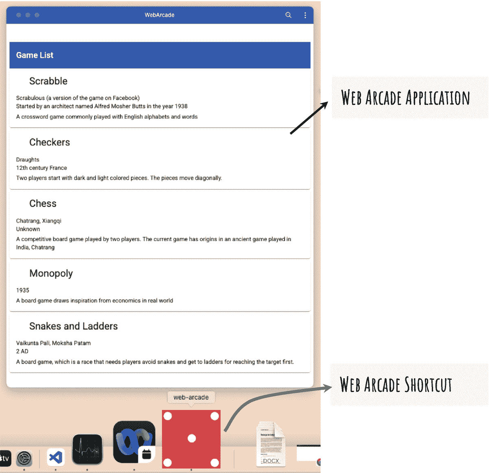

# 一、构建现代 Web 应用

欢迎光临！恭喜你选择了这本书来学习如何用 Angular 构建离线应用。这一介绍性的章节为这本书设定了期望和框架。它简要介绍了传统的 web 应用开发，以及为什么仅仅创建另一个传统的 web 应用是不够的。

## 奠定基础

这本书提供了一些观点，并详细阐述了服务工作器和索引数据库等前沿功能。它提供了创建 Angular 应用的分步说明，并逐步添加特性来构建复杂的 web 应用。这本书使用了一个虚构的在线游戏系统 Web Arcade 来说明这些技术。它充当构建现代 web 应用的用例，该应用对网络连接性下降和速度变化具有弹性。

让我们用一点历史来建立背景。您可能知道，web 应用已经流行了二十多年。已经构建了大量的应用。事实上，许多 web 应用对于业务运营至关重要。

在 21 世纪初，这些应用取代了安装在设备、台式机或笔记本电脑上的胖客户端。胖客户端带来了挑战，因为应用必须针对操作系统来构建。大多数应用不能在苹果 macOS 和微软 Windows 之间互操作；然而，也有例外。一些组织和开发人员使用基于 Java 的技术来构建胖客户端，这些客户端运行在 Java 虚拟机(JVM)上。在这种解决方案流行起来之前，web 应用占据了主导地位。很大程度上，胖客户端在不同的平台和操作系统之间是不兼容的。

网络应用帮助解决了这个问题。web 应用在浏览器上运行。浏览器解释并执行超文本标记语言(HTML)、JavaScript 和级联样式表(CSS)。这些特征由欧洲计算机制造商协会(ECMA)和技术委员会 39 (TC39)标准化。

随着在移动设备上安装和运行的移动应用的出现，这种情况发生了变化。这可能是一部手机或平板设备，如 iPad。始于 2008 年的苹果应用商店在组织和开发者向应用的转变中发挥了重要作用。如今，苹果的 iOS 和谷歌的 Android 是两大移动平台。iOS 使用 App Store，Android 使用 Google Play(也叫 Play Store)分发各自平台的应用。

## 原始问题

在移动设备上，应用又带来了最初的问题:你需要为各自的平台开发应用。你只需为 iOS 构建一次原生应用，然后为 Android 重复构建。当然，还有其他选择，包括混合和跨平台技术的变通方法。它们适合主要的用例，但是总有一些工作流，这样的解决方案没有帮助。此外，对原生用户体验有所妥协；如果用户界面最初是为 Android 开发的，那么 iOS 用户可能会觉得与平台不匹配。许多工作流和应用需要大屏幕和桌面级操作系统提供的灵活性。将 iOS 和 Android 应用带到桌面上的动力很小。在大多数情况下，用户体验是有限的。

## Web 应用解决方案的注意事项

组织和开发人员在 iOS 和 Android 以及 macOS 和 Microsoft Windows 上构建 web 应用，以满足所有主要平台和浏览器的需求。请记住，组织最初在远离胖客户端时采用了这种解决方案。当时，这些设备大多固定在桌子上，不能移动。他们通过电缆或无线网络连接。连接是稳定的。在构建应用时，连接不是一个考虑因素。

移动平台改变了这一场景。用户高度移动，进出网络。应用需要考虑连接性因素。假设用户暂时失去连接。当她试图启动移动 web 应用时，传统的 web 应用显示类似“无法显示页面”的消息，并且应用无法启动。用户无法继续。如果用户正在进行交易，问题可能会更严重。数据丢失，用户可能不得不重试整个工作流。

应用提供了现成的解决方案。记住，应用是安装在设备上的。用户可以启动应用，并与过去的数据或消息进行交互，即使用户断开连接。如果用户提交了交易或表格，应用可以临时缓存并在在线时同步。

以 Twitter 这样的社交应用为例。离线时，它允许你启动应用，查看缓存的推文，甚至撰写新推文并保存为草稿。

现代 web 应用支持这种高级缓存特性。这本书详细介绍了如何构建一个现代化的 web 应用，让用户在脱机时也能正常工作。

## 用例

这本书使用 Web Arcade，一个基于 Web 的在线游戏系统作为用例。您将使用 Angular 和 TypeScript 构建应用。这本书提供了如何创建应用、各种组件、服务等的分步说明。

在本书的整个过程中，您将学习如何做到以下几点:

*   安装和升级 web 应用。

*   缓存应用，以便在脱机时可以访问。

*   缓存检索到的数据。

*   使应用能够在脱机时运行。借助 Web Arcade 用例，我们将详细介绍如何向系统添加数据。离线时，数据缓存在设备上。一旦重新上线，该应用将提供与服务器同步的机会。

在桌面和移动设备上，谷歌 Chrome、微软 Edge、Safari(在 Mac 和 iOS 上)和 Firefox 等现代浏览器允许用户安装该应用。该书提供了一步一步的指导，使他们能够安装 web 应用并为该应用创建快捷方式。该快捷方式提供了对 web 应用的轻松访问，并在它自己的窗口中启动它(不像典型的 web 应用，它总是在浏览器中启动)。图 [1-1](#Fig1) 显示了安装在 macOS 上的 Web Arcade 应用。请注意 Dock 中的 Web Arcade 应用图标。您将在 Windows 任务栏中看到类似的图标。应用在它自己单独的窗口中，而不是在浏览器标签中。



图 1-1

安装在 macOS 上的 Web Arcade 应用

这本书详细介绍了如何使用服务工作器(带 Angular)来缓存应用。它提供了设置开发环境和测试缓存特性的分步说明。在这个阶段，即使网络不可用，应用也会加载。例如，即使在应用脱机时，您也可以使用该功能来掷骰子。可以想象，掷骰子不需要服务器端连接。它是在 1 和 6 之间生成的随机数。应用可视化滚动骰子(图 [1-2](#Fig2) )。


图 1-2

在 Web Arcade 应用中掷骰子

您将从缓存应用数据并在离线时(或在慢速网络上)使用它开始。您将看到当真正的服务器端服务不可用时，如何利用服务工作器缓存。

这本书还详细介绍了如何创建数据；具体来说，Web Arcade 应用将允许用户在离线时添加评论。使用 IndexedDB(一个本地数据库)缓存评论。一旦连接建立，应用就进行识别。它将缓存的离线评论与服务器端服务和数据库同步。

稍后，您需要创建应用和数据库的新版本。这本书涵盖了提示用户可用升级的特性和实现。它详细介绍了如何无缝过渡到新数据库并升级其结构。

## 代码示例

本节解释如何下载和运行代码示例。从这个 GitHub 位置: [`https://git-scm.com/downloads`](https://git-scm.com/downloads) 克隆 Web Arcade 库。打开终端/命令提示符并使用下面的命令，这需要在您的机器上安装 Git。

```ts
git clone https://github.com/kvkirthy/web-arcade.git

```

Note

Git 是一个流行的分布式源代码管理(SCM)工具。它占地面积小，在机器上使用最少的资源和磁盘空间。它也是免费和开源的。

默认情况下，您已经克隆了`master`分支。查看名为`book-samples`的分支，获取书中示例的样本。首先把目录改成`web-arcade`。接下来，检查一下`book-samples` *分店。*

```ts
cd web-arcade
git checkout book-samples

```

我们预计会有改进，并将相应地将反馈纳入`master`分支。然而，分支`book-samples`致力于精确匹配书中的代码样本。

接下来，运行以下命令来安装代码示例所需的所有包。在整本书中，我们提供了使用节点包管理器(NPM)和 Yarn 的说明。虽然 NPM 是 Node.js 的默认包管理器，但 Yarn 是一个由脸书支持的开源项目。由于其在性能和安全性方面的优势，它在开发人员社区中受到了广泛关注。我们建议你挑一个，坚持到书结束。

```ts
npm install
(or)
yarn install

```

Note

这个命令需要在你的机器上安装 Node.js、NPM 或者 Yarn。如果他们不在，暂时跟着读。下一章提供了详细的说明。

接下来，运行以下命令启动 Web Arcade 示例应用:

```ts
npm run start-pwa
(or)
yarn start-pwa

```

前面的命令启动一个运行在开发人员级 web 服务器上的成熟应用。在阅读和理解代码的同时运行应用是很有用的。但是，如果您正在进行更改和更新代码，这些更改需要在应用中显示出来。通常，页面会重新加载，应用会根据更改进行更新。使用前面的命令很难做到这一点。每次进行更改时，您可能都必须结束该过程并重新启动。因此，考虑在更新代码时使用下面的命令。它会立即用更改更新应用。

```ts
npm start
(or)
yarn start

```

让应用在后台运行是一个很好的做法。在整本书中，您将不断地创建和更新代码，并运行示例。前面代码运行的脚本保持应用正常运行。除非得到指示，否则不要终止此脚本。

Note

在撰写本文时，该命令不支持在应用离线时缓存和加载应用。这是本书中解释的示例应用和概念的一个重要特性。要使用服务工作器测试缓存特性，请使用`start-pwa`命令。

## 摘要

这一章提到了对新实现的需求，比如 service workers 和 IndexedDB，它们是大多数现代浏览器所固有支持的。本书的其余部分将详细介绍如何在 web 应用中实现和集成这些技术。我们还介绍了一个名为 Web Arcade 的用例，这是一个基于 Web 的在线游戏系统，将在本书的其余部分使用。