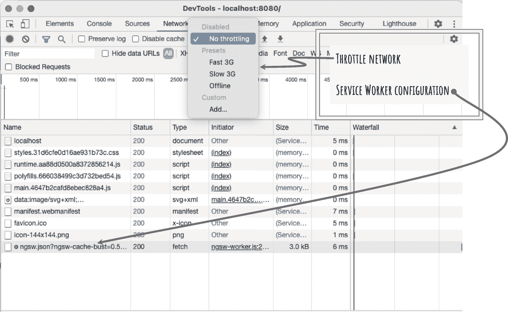

# 二、入门指南

本章提供了如何开始使用 Angular 应用的说明。这是所有即将到来的章节的基础。按照本章中详细介绍的步骤来设置您的开发环境。接下来的章节将使用本指南中详细介绍的软件、库和软件包。

具体来说，本章提供了创建一个示例应用(即 Web Arcade)的步骤。样例应用将为本书中的所有概念及其解释提供用例及示例。在本章中，您将从创建 Web Arcade Angular 应用开始。

您还将向 Web Arcade Angular 应用添加离线功能。您将看到如何在没有网络连接的情况下访问 Angular 应用的介绍性细节。

## 先决条件

要创建、运行和测试 Angular 应用，您需要在计算机上安装和设置软件列表。幸运的是，本书中列出和描述的所有软件和库都是开源的，可以免费使用，至少对个人开发者来说是这样。本节列出了开始创建 Angular 应用所需的最低软件要求。

### Node.js 和 NPM

Node.js 是一个跨平台的 JavaScript 运行时，在名为 V8 的 JavaScript 引擎上运行。它主要用于在服务器端和后端运行 JavaScript。

在本书中，您将在很大程度上使用 Node.js 安装附带的节点包管理器(NPM)。顾名思义，它是一个包管理器，帮助您安装和管理库和包。它跟踪一个包的整个依赖树。通过简单的命令，它可以帮助下载和管理库及其依赖项。

例如，Lodash 是一个非常有用的 JavaScript 实用程序和函数库。只需一个命令，您就可以将软件包作为依赖项安装并添加到项目中。其他人下载您的项目不需要执行额外的步骤。

从 Node.js 官方网站， [`https://nodejs.org`](https://nodejs.org) 下载安装 Node.js。单击网站上的下载链接。它列出了长期支持(LTS)和最新版本的安装程序。最好选择 LTS。接下来，根据您的操作系统和平台选择一个选项。它将下载安装程序。

它安装 Node.js 和 NPM。在撰写本书时，Node.js 版本是 14.17.0，NPM 是 6.14.13。

下载完成后，打开安装程序，按照步骤完成安装。介绍画面和版本信息见图 [2-1](#Fig1) 。


图 2-1

Node.js installer(节点. js 安装程序)

### 故事

虽然 NPM 是 Node.js 的默认包管理器，但 Yarn 是一个由脸书支持的开源项目。由于其在性能和安全性方面的优势，它在开发人员社区中受到了广泛关注。书中的例子包括纱线和 NPM 命令。如果你是 Angular 发展的新手，选择一个并在所有的例子和练习中坚持使用它。包括纱线为读者提供了一种选择。有时，团队和组织在选择他们的工具集时会很挑剔(出于各种原因，包括像安全性这样的重要考虑)。因此，它有助于学习 NPM 和纱线。

要安装 Yarn，请运行以下命令:

```ts
npm install -g yarn

```

Note

注意选项`-g`，它代表“全局”这个包可以在所有的项目和目录中使用。因此，它可能需要提升权限才能运行和安装。

在 Windows 计算机上，以管理员身份运行此命令。

在 macOS 上，以超级用户身份运行命令。考虑下面的片段。该命令将提示输入 root 用户密码。

```ts
 sudo npm install -g yarn

```

如果您不使用`-g`选项，您仍然可以在目录级别使用`yarn`(或者任何其他没有安装`-g`的工具)。您可能需要为每个新目录或项目重新安装它。如果您喜欢将资源保存在项目或目录的本地，这是一个不错的解决方案。

要验证安装是否成功，请运行`yarn --version`。确保`yarn`命令被识别并返回版本信息。

```ts
% yarn --version
1.22.10

```

### Angular CLI

在使用 Angular 应用时，Angular CLI 是一个非常有用的命令行工具。您将使用该工具完成所有与 angle 相关的任务，包括创建项目、添加新的 angle 组件、使用 angle 服务、运行 angle 应用、执行与构建相关的任务等。

使用以下命令安装 Angular CLI:

```ts
 npm install -g @angular/cli
# (or)
 yarn global add @angular/cli

```

要验证安装是否成功，请运行`ng --version`。见清单 [2-1](#PC5) 。确保 Angular CLI 命令被识别并返回版本信息。

```ts
% ng --version

Listing 2-1Verify Angular CLI Installation

```


```ts
Angular CLI: 12.0.1
Node: 14.16.1
Package Manager: npm 6.14.12
OS: darwin x64
Angular: undefined

Package                      Version
------------------------------------------------------
@angular-devkit/architect    0.1200.1 (cli-only)
@angular-devkit/core         12.0.1 (cli-only)
@angular-devkit/schematics   12.0.1 (cli-only)
@schematics/angular          12.0.1 (cli-only)

```

Note

注意在清单 [2-1](#PC5) 中，Angular 是未定义的；但是，Angular CLI 的版本是 12.0.1。安装成功。一旦您使用 CLI 创建项目，Angular 将显示一个版本。

### Visual Studio Code

严格地说，您可以使用任何简单的文本编辑器来编写 Angular 代码，并使用终端或命令提示符来编译、构建和运行应用。对于大多数编程语言来说，这可能是真的。但是，为了提高生产率和简化开发，请使用集成开发环境(IDE ),如 Visual Studio Code。该软件是由微软开发的，它是免费的，占用空间小，易于下载和安装。它的功能在处理 Angular 应用时非常有用。不过，这是个人喜好。你可以选择任何你觉得合适的 IDE 来创建和运行本书中描述的 Angular 应用。

从其网站 [`https://code.visualstudio.com`](https://code.visualstudio.com) 下载 Visual Studio Code。使用页面上的下载链接。在撰写本内容时，网站会自动识别您的操作系统，并提供相应的下载链接。

有关 Visual Studio Code 的快照，请参见图 [2-2](#Fig2) 。


图 2-2

Visual Studio Code 快照

以下是一些其他的选择:

*   这是一个共享软件，也是一个有用的文本编辑器。它非常适合 JavaScript 开发，因为它占用空间小、响应速度快、易于使用。

*   这是一个由 JetBrains 为 JavaScript 开发构建的复杂的 IDE。它为包括 Angular 和 Node.js 在内的许多流行框架提供了定制功能。但是，它是需要购买的专有软件。

*   Atom:这是一个开源的自由文本编辑器。它是一个用 HTML 和 JavaScript 构建的跨平台应用。

### http-服务器

Http-Server 是为静态文件运行基于 Node.js 的 web 服务器的一种快速有效的方式。在开发过程中，您将使用这个 NPM 包来处理缓存的应用。

运行以下命令在您的计算机上全局安装 Http-Server:

```ts
 npm install -g http-server
# (or)
 yarn global add http-server

```

要验证安装是否成功，请运行`http-server --version` *。*确保`http-server`命令被识别并返回版本信息。

```ts
% http-server --version
v0.12.3

```

Note

如果您在使用`yarn global add`时遇到问题，并且在全局安装后仍未找到包，请参考本章后面的“使用 yarn 全局添加”一节。

## 创建 Angular 应用

既然所有的先决条件都已具备，您就可以创建一个新的 Angular 应用了。您将使用刚刚安装的 Angular CLI(`@angular/cli`)。Angular CLI 的可执行文件命名为`ng`。换句话说，您将使用一个`ng`命令来运行该工具。它使用您通过`ng`命令提供的选项来执行任务。

按照以下说明创建新的 Angular 应用:

```ts
ng new web-arcade

```

`ng new`是创建新应用的 Angular CLI 命令。创建新应用时，CLI 通常会提示您选择是否要使用 Angular 路由和样式表格式。参见清单 [2-2](#PC10) 。

对于示例应用，选择实现路由。随着示例应用的发展，您将创建多个页面。这些页面之间的导航需要 Angular 路由。

Note

路由是单页应用(SPAs)的一个重要特性，因为大多数 web 应用都有不止一个页面。用户在页面之间导航。每个页面将有一个唯一的网址。

在 SPA 中，当用户在页面之间导航时，不会重新加载整个页面。在路由实现的帮助下(在这种情况下是角路由)，SPA 只更新页面中在两个 URL 之间变化的部分。

对于关于选择样式表格式的第二个提示，如果您希望匹配书中的示例，请选择 Sass。但是，如果您喜欢其他样式表格式，可以随意选择其他应用。

```ts
 % ng new web-arcade
? Would you like to add Angular routing? Yes
? Which stylesheet format would you like to use? Sass   [ https://sass-lang.com/documentation/syntax#the-indented-synt
ax ]

Listing 2-2Prompts While Creating a New Angular Application

```

现成的 Angular CLI 提供了以下样式表格式的选择:

*   *层叠样式表(CSS)* :这是样式表开发的传统方法。它在处理小代码单元时工作良好。

*   语法上令人敬畏的样式表(SCSS -时髦的 CSS) :与 CSS 相比，它提供了更好的编程类型的特性。这些特性包括变量、函数、混合和嵌套规则。它是 CSS 的超集。

样式表被写入扩展名为`.scss`的文件中。它被预处理成 CSS。它完全兼容 CSS。因此，所有有效的 CSS 语句也在一个`.scss`文件中工作。

SCSS 语法包括大括号来表示块的开始和结束，以及分号来表示样式表语句的结束。

*   *语法上令人敬畏的样式表(SASS)* :这类似于 SCSS，除了样式表语句是缩进的，而不是使用花括号和分号。为了明确指出文件格式，SASS 代码被写入`.sass`文件。

*   更精简的样式表(LESS) :这是 CSS 的另一个超集，允许你使用变量、函数、混合等等。

使用 Angular CLI 的一个优点是，它将构建过程构建为包括样式表的预处理。运行或构建应用时，不需要额外的工作来创建脚本或运行预处理程序。

接下来，Angular CLI 复制文件并安装应用(清单 [2-3](#PC11) )。

```ts
CREATE web-arcade/README.md (1055 bytes)
CREATE web-arcade/.editorconfig (274 bytes)
CREATE web-arcade/.gitignore (604 bytes)
CREATE web-arcade/angular.json (3231 bytes)
CREATE web-arcade/package.json (1072 bytes)
CREATE web-arcade/tsconfig.json (783 bytes)
CREATE web-arcade/.browserslistrc (703 bytes)
CREATE web-arcade/karma.conf.js (1427 bytes)
CREATE web-arcade/tsconfig.app.json (287 bytes)
CREATE web-arcade/tsconfig.spec.json (333 bytes)
CREATE web-arcade/src/favicon.ico (948 bytes)
CREATE web-arcade/src/index.html (295 bytes)
CREATE web-arcade/src/main.ts (372 bytes)
CREATE web-arcade/src/polyfills.ts (2820 bytes)
CREATE web-arcade/src/styles.sass (80 bytes)
CREATE web-arcade/src/test.ts (743 bytes)
CREATE web-arcade/src/assets/.gitkeep (0 bytes)
CREATE web-arcade/src/environments/environment.prod.ts (51 bytes)
CREATE web-arcade/src/environments/environment.ts (658 bytes)
CREATE web-arcade/src/app/app-routing.module.ts (245 bytes)
CREATE web-arcade/src/app/app.module.ts (393 bytes)
CREATE web-arcade/src/app/app.component.sass (0 bytes)
CREATE web-arcade/src/app/app.component.html (23809 bytes)
CREATE web-arcade/src/app/app.component.spec.ts (1069 bytes)
CREATE web-arcade/src/app/app.component.ts (215 bytes)
⠼ Installing packages (npm)..

Listing 2-3Angular CLI: Create and Install Web Arcade

```

### 添加服务工作器

要向 Angular 应用添加离线特性，运行清单 [2-4](#PC12) 中的命令。

```ts
ng add @angular/pwa

# This command install @angular/pwa on default project
# If you are running the above command on an existing Angular # solution that has multiple projects, use
# ng add @angular/pwa --project projectname

Listing 2-4Add Progressive Web App Features for Offline Access

```

服务工作器是渐进式 web 应用(PWAs)的功能之一。它们在浏览器的后台运行，使您能够缓存应用，包括脚本、资产、远程服务响应等。

传统上，web 应用易于部署和管理。为了添加新功能，开发人员或工程团队在一台或多台 web 服务器上部署新版本。用户下次打开网站时，可以访问新的应用和新的功能。但是，移动应用和安装的客户端应用(Windows 或 Mac)需要定期更新。安装需要在数以千计的客户端设备上进行(甚至更多，这取决于应用)。

但是，移动应用和客户端应用有一个优势，即使在网络不可用的情况下也可以访问。例如，社交媒体空间(Twitter 或脸书)中的移动应用可能会显示帖子，即使在没有网络可用的情况下。当网络不可用时，传统的 web 应用会显示一条消息，大意是“找不到页面”。用户完全无法访问应用。他们不能查看缓存的数据或与之交互。

进步的网络应用，特别是服务工作器，弥补了这一差距。您可以继续利用 web 应用的轻松部署和管理。它允许您安装应用、缓存脚本和资产等。

清单 [2-4](#PC12) 中的命令允许您缓存脚本、资产和数据。它添加所需的配置，并在 Angular 应用模块中注册服务工作器。

## 运行 Angular 应用

到目前为止，您已经建立了一个使用 Angular 应用的环境，创建了一个名为 Web Arcade 的新应用，并安装了 PWA 特性。接下来，运行这个基本的应用来验证一切都工作正常。要运行 Web Arcade 应用，请将目录更改为应用文件夹的根目录，并执行以下命令:

```ts
npm run build
#(or)
yarn build

```

前面的命令在`package.json`文件中运行一个 NPM 脚本(即`build`)。这是 Angular CLI 在创建新项目时创建的文件之一。在 Visual Studio Code 或您选择的 IDE 中打开该文件。您将在清单 [2-5](#PC14) 中看到脚本。

```ts
 "scripts": {
   "ng": "ng",
   "start": "ng serve",
   "build": "ng build",
   "watch": "ng build --watch --configuration development",
   "test": "ng test"
 },

Listing 2-5Scripts in the package.json File

```

Note

在清单 [2-5](#PC14) 之前提供的构建脚本运行`ng build`。记住，Angular CLI 的可执行文件是`ng`。你可以直接在控制台或终端上运行`ng build`。两者都会导致同样的结果。

先前的构建命令输出到`dist/web-arcade`。接下来，在这个目录中运行 Http-Server。它启动一个基于 Node.js 的 web 服务器来呈现 Angular 应用。web 服务器在默认端口 8080 上运行。参见清单 [2-6](#PC15) 。

```ts
% http-server dist/web-arcade

Starting up http-server, serving dist/web-arcade
Available on:
  http://127.0.0.1:8080
  http://192.168.0.181:8080

Listing 2-6Run Http-Server on Web Arcade Build Output

```

现在可以在端口号为 8080 的本地主机上访问该应用。在任何现代浏览器上打开链接`http://localhost:8080`。见图 [2-3](#Fig3) 。这张图片是在谷歌浏览器上拍摄的。


图 2-3

在 Http 服务器上运行的新应用

Note

您可以使用选项`-p <new port number>`在不同的端口上启动 Http-Server，例如`http-server dist/web-arcade -p 4100`。

请注意，这是由 Angular CLI 搭建的默认内容。它提供了有用的链接和文档，可以继续用 Angular 构建应用。在本书接下来的章节和代码片段中，我们将增强代码示例，并创建新的组件和服务来创建 Web Arcade 应用。

接下来，打开开发人员工具并重新加载应用。在谷歌浏览器上，你可以在“更多工具”菜单下找到开发者工具。导航到网络选项卡并查找`ngsw.json`。这是服务工作器的配置文件。这允许您在浏览器中注册 Web Arcade 服务工作器。见图 [2-4](#Fig4) 。



图 2-4

Web Arcade 的 Chrome 开发工具

在节流选项中(在开发工具的网络选项卡上)，选择选项离线*。*现在，如果您在此浏览器中导航到任何在线网站，它都不会加载页面。但是，localhost:8080 继续工作，从服务工作器缓存中呈现。

### 安全:服务工作器需要 HTTPS

服务工作器是一个强大的特性，它可以充当来自应用的所有网络请求的代理。代理实现可能会导致安全风险。因此，浏览器实施安全的 HTTPS 连接。如果没有 HTTPS 实现的网站试图注册服务工作器，浏览器会忽略该功能。

但是，请注意，在部署到 Http-Server 时，我们没有实现 HTTPS 证书。浏览器不会对本地主机上的 HTTPS 执行这种检查。这是规则的例外。它有助于轻松开发应用。出于开发目的实现 HTTPS 连接可能是一项单调乏味的任务。并且在本地主机上可访问的应用安装并运行在本地机器上；因此，不存在安全风险。

请注意，清单 [2-6](#PC15) 显示该应用在两个 IP 地址上可用，如下所示:

*   127.0.0.1.这代表本地主机。

*   192.x.x.x。这是机器的本地 IP 地址。它没有安装安全的 HTTPS 证书。

即使 192.x.x.x 是本地 IP 地址，浏览器也无法验证这一点。考虑到连接不是 HTTPS，浏览器不注册服务工作器。参见图 [2-5](#Fig5) 。浏览器处于脱机模式。尽管有服务工作器，服务工作器也不加载页面。当您将应用联机时，服务工作器不会加载到网络选项卡中。


图 2-5

服务工作器不在 HTTP 连接上工作

## 使用纱线全局添加

Yarn 提供了几个命令，包括`add`、`list`和`remove`，分别用来安装包、列出包和移除包。这些包安装在给定目录的`node_modules`中。目录是命令或操作的范围。

然而，由于前缀为`yarn global`，该命令在全局级别运行。全局级别通常是指登录用户的所有目录/项目。运行清单 [2-7](#PC16) 中的命令，查看 Yarn 的全局`bin`目录。请注意，它位于登录用户的目录下。这是纱线安装的默认路径。

```ts
# macOS
% yarn global bin
/Users/logged-in-user/.yarn/bin

# Microsoft Windows
C:> yarn global bin
C:\Users\logged-in-user\AppData\Local\Yarn\bin

Listing 2-7Show Global Yarn bin Directory

```

如果该目录不包含在环境变量`path`中，包甚至在全局安装后也不工作。设置路径并重试软件包安装。参见清单 [2-8](#PC17) 设置路径。

```ts
#On Microsoft Windows, set path with the following command
set PATH=%path%;c:\users\logged-in-user\AppData\Local\Yarn\bin

#On macOS, set path with the following command
export PATH="$(yarn global bin):$PATH"

Listing 2-8Set Path to Yarn Global bin Directory

```

## 摘要

这一章是一个入门指南，为离线功能的服务工作器构建一个 Angular 应用。它提供了必备软件和库的列表，以及下载和安装说明。本书中使用的大多数软件和库都是开源和免费的。

Exercise: Creating the Web Arcade Application

在计算机上为 Angular 设置一个开发环境。一定要安装 Node.js。

1.  选择一个包管理器来安装和管理 Angular 和 TypeScript(或 JavaScript)包。选择使用 NPM 或纱线。更好的是，在未来的练习中坚持你的决定。

2.  安装和验证 Angular CLI，最好是在全球层面。

3.  安装 Http-Server，最好是在全局级别。

4.  创建一个新的 Angular 项目并添加`@angular/pwa`。

5.  在 Http-Server 上构建和部署项目的第一个版本。

6.  查看并确保服务工作器在网络不可用时可用。