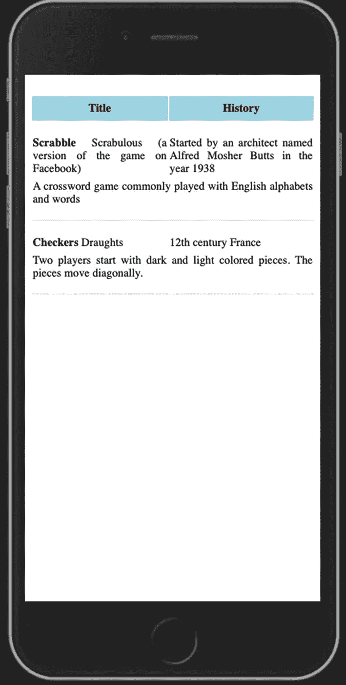
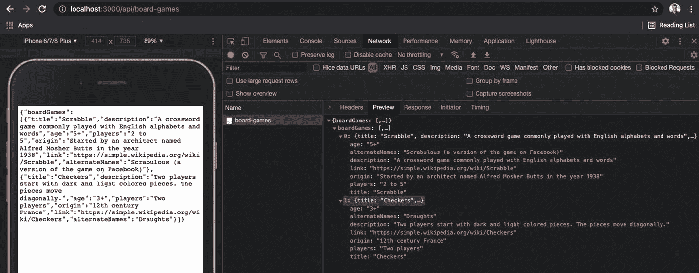

# 五、服务工作器缓存数据

服务工作器用于缓存数据响应。到目前为止，您已经看到了如何创建一个新的 Angular 应用，如何将应用配置为可安装的，以及如何缓存应用，以便即使在脱机时也可以访问它。本章介绍了如何缓存来自 HTTP 服务的数据响应。

本章首先创建一个新组件来检索和显示来自 HTTP 服务的数据。接下来，讨论如何创建一个接口，作为服务和 Angular 应用之间的契约。接下来，您将学习如何创建 Node.js Express 模拟服务，为 Angular 应用提供数据。它在 Angular 应用之外的独立进程中运行。本章详细介绍了如何创建一个 Angular 服务，它使用一个现成的`HttpClient`服务来调用 HTTP 服务。

既然您已经集成了 HTTP 服务并访问了数据，本章将详细介绍如何配置 Web Arcade 来缓存数据响应。它详细描述了配置，并展示了一个带有模拟离线浏览器的缓存数据响应。

记住，网络街机是一个在线游戏系统。想象一个列出应用上可用棋盘游戏的屏幕，如图 [5-1](#Fig1) 所示。按照说明来构建这个组件。它在 HTML 表格中显示数据。在加载页面时，组件调用服务来检索 Web Arcade 棋盘游戏。



图 5-1

棋盘游戏列表

## 添加一个组件来列出棋盘游戏

首先创建一个列出棋盘游戏的组件。记住第 [3](03.html) 章中的“Angular 组件”一节。通过运行以下命令创建一个新组件。它将为新组件搭建支架。

```ts
% ng generate component components/board-games

```

之前，您在`App`组件*中使用了`dice`组件。*更新它以使用新的组件，如清单 [5-1](#PC2) 所示。注意被称为`wade-dice`的`dice`组件已经被注释了。

```ts
<div class="container align-center">
   <!-- <wade-dice></wade-dice> -->
   <wade-board-games></wade-board-games>
</div>

Listing 5-1Use the Board Component

```

Note

Angular 单页应用(SPAs)使用路由在具有独立组件的两个页面之间导航。清单 [5-1](#PC2) 是临时的，所以本章的重点是数据缓存。第[章第 8](08.html) 章介绍 Angular 路由。

## 定义棋盘游戏的数据结构

接下来，定义棋盘游戏页面的数据结构。您创建一个 TypeScript 接口来定义数据结构。它定义了棋盘游戏数据对象的形状。TypeScript 使用一个接口来定义一个契约，这在 Angular 应用中以及与提供棋盘游戏数据的外部远程服务一起使用时非常有用。

TypeScript 接口强制执行棋盘游戏所需的字段列表。如果由于远程服务中的问题或 Angular 应用中的错误导致所需字段丢失，您将会注意到一个错误。接口充当 Angular 应用和外部 HTTP 服务之间的契约。

运行以下命令创建接口。它在名为`common`的新目录中创建了一个名为`board-games-entity.ts`的新文件。典型地，数据结构/实体在 Angular 应用中使用。因此，将这个目录命名为`common`。

```ts
ng generate interface common/board-games-entity

```

清单 [5-2](#PC4) 定义了棋盘游戏的特定区域。远程服务应该返回相同的字段。组件对数据使用这种形状和结构。将代码添加到`board-games-entity.ts`。

```ts
export interface BoardGamesEntity {
   title: string;
   description: string;
   age: string;
   players: string;
   origin: string;
   link: string;
   alternateNames: string;
}

/* Multiple games data returned, hence creating an Array */
export interface GamesEntity {
   boardGames: Array<BoardGamesEntity>;
}

Listing 5-2Interfaces for Board Games

```

`BoardGamesEntity`代表单一的棋盘游戏。考虑到 Web Arcade 将有多个游戏，`GamesEntity`包括了一系列的棋盘游戏。后来，`GamesEntity`可以扩展到网络街机系统中其他类别的游戏。

## 模拟数据服务

一个典型的服务是从数据库或后端系统中检索和更新数据，这超出了本书的范围。然而，为了与 RESTful 数据服务集成，本节将详细介绍如何开发模拟响应和数据对象。模拟服务以 JavaScript 对象符号(JSON)格式返回棋盘游戏数据。它可以很容易地与在前面的“向列表棋盘游戏添加组件*”一节中创建的 Angular 组件集成。*

您将使用 Node.js 的 Express 服务器来开发模拟服务。按照这些说明创建新服务。

使用 Express application generator 轻松生成 Node.js Express 服务。运行以下命令进行安装:

```ts
npm install --save-dev express-generator

# (or)

yarn add --dev express-generator

```

Note

注意带有`npm`命令的`--save-dev`选项和带有`yarn`命令的`--dev`选项。它在`package.json`的`dev-dependencies`安装这个包，使它成为一个开发工具。它不会包含在生产版本中，这有助于减少内存占用。参见清单 [5-3](#PC6) ，第 15 行。

```ts
01: {
02:  "name": "web-arcade",
03:  "version": "0.0.0", /* removed code for brevity */
04:  "dependencies": {
05:    "@angular/animations": "~12.0.1",
06:    /* removed code for brevity */
07:    "zone.js": "~0.11.4"
08:  },
09:  "devDependencies": {
10:    "@angular-devkit/build-angular": "~12.0.1",
11:    "@angular/cli": "~12.0.1",
12:    "@angular/compiler-cli": "~12.0.1",
13:    "@types/jasmine": "~3.6.0",
14:    "@types/node": "^12.11.1",
15:    "express-generator": "^4.16.1",
16:    "jasmine-core": "~3.7.0",
17:    "karma": "~6.3.0",
18:    "karma-chrome-launcher": "~3.1.0",
19:    "karma-coverage": "~2.0.3",
20:    "karma-jasmine": "~4.0.0",
21:    "karma-jasmine-html-reporter": "^1.5.0",
22:    "typescript": "~4.2.3"
23:  }
24: }

Listing 5-3Package.json dev-dependencies

```

接下来，为模拟服务创建一个新目录；命名为`mock-services`(一个任意的名字)。将目录更改为`mock-services`。运行以下命令创建新的快速服务。它构建了新的 Node.js Express 应用。

```ts
npx express-generator

```

Note

`npx`命令首先检查包的本地`node_modules`。如果找不到，该命令会将包下载到本地缓存并运行该命令。

前面的命令运行，即使没有前面步骤(`npm install --save-dev express-generator`)中的`dev-dependency`安装。如果您不打算经常运行这个命令，您可以跳过`dev-dependency`安装。

接下来，运行`mock-services`目录中的`npm install`(或`yarn install`)。

在 JSON 文件中创建和保存棋盘游戏数据。代码示例将其保存到`[application-directory]/mock-services/data/board-games.json`。服务器端 Node.js 服务将这些字段和值返回给 Angular 应用。该结构与清单 [5-2](#PC4) 中定义的角接口结构相匹配。参见清单 [5-4](#PC8) 。

```ts
{
   "boardGames": [
       {
           "title": "Scrabble",
           "description": "A crossword game commonly played with English alphabets and words",
           "age": "5+",
           "players": "2 to 5",
           "origin": "Started by an architect named Alfred Mosher Butts in the year 1938",
           "link": "https://simple.wikipedia.org/wiki/Scrabble",
           "alternateNames": "Scrabulous (a version of the game on Facebook)"
       },

       {
           "title": "Checkers",
           "description": "Two players start with dark and light colored pieces. The pieces move diagonally.",
           "age": "3+",
           "players": "Two players",
           "origin": "12th century France",
           "link": "https://simple.wikipedia.org/wiki/Checkers",
           "alternateNames": "Draughts"
       }

/* You may extend additional mock games data*/
   ]
}

Listing 5-4Board Games Mock Data

```

接下来，更新模拟服务应用以返回以前的棋盘游戏数据。在`mock-services/routes`下创建一个名为`board-games.js`的新文件。添加清单 5-5 中的代码。

```ts
01: var express = require('express'); // import express
02: var router = express.Router(); // create a route
03: var boardGames = require('../data/board-games.json');
04:
05: /* GET board games listing. */
06: router.get('/', function(req, res, next) {
07:     res.setHeader('Content-Type', 'application/json');
08:     res.send(boardGames);
09: });
10:
11: module.exports = router;

Listing 5-5New API Endpoint That Returns Mock Board Games Data

```

考虑以下解释:

*   第 3 行在一个变量上导入并设置棋盘游戏模拟数据。

*   第 6 到 9 行创建了返回棋盘游戏数据的端点。

*   注意第 6 行中的`get()`函数。端点响应 HTTP GET 调用，该调用通常用于检索数据(与创建、更新或删除相对)。

*   第 7 行将响应内容类型设置为`application/json`,确保客户端浏览器准确地解释响应格式。

*   第 8 行用棋盘游戏数据响应客户机。

*   第 11 行导出了封装服务端点的路由器实例。

接下来，端点需要与路由相关联，以便在客户端请求数据时调用前面的代码。在服务应用(`mock-services/app.js`)的根目录下编辑`app.js`。将清单 [5-6](#PC10) 中粗体显示的代码行(第 9 行和第 25 行)添加到文件中。

```ts
07: var indexRouter = require('./routes/index');
08: var usersRouter = require('./routes/users');
09: var boardGames = require('./routes/board-games');
10:
11: var app = express();
12:
13: // view engine setup
14: app.set('views', path.join(__dirname, 'views'));
15: app.set('view engine', 'jade');
16:
17: app.use(logger('dev'));
18: app.use(express.json());
19: app.use(express.urlencoded({ extended: false }));
20: app.use(cookieParser());
21: app.use(express.static(path.join(__dirname, 'public')));
22:
23: app.use('/', indexRouter);
24: app.use('/users', usersRouter);
25: app.use('/api/board-games', boardGames);

Listing 5-6Integrate the New Board Games Endpoint

```

考虑以下解释:

*   第 9 行导入了在前面的清单 [5-5](#PC9) 中导出的棋盘游戏路由实例。

*   第 25 行将路由`/api/board-games`添加到应用中。当客户端调用这个端点时，新服务被调用。

使用命令`npm start` *运行模拟服务。*默认情况下，它在端口 3000 上运行 Node.js Express 服务应用。通过访问`http://localhost:3000/api/board-games` *访问新端点。*见图 [5-2](#Fig2) 。



图 5-2

通过浏览器访问棋盘游戏端点

Note

请注意，您正在一个单独的端口 3000 上运行服务应用。记住，在前面的例子中，Angular 应用运行在端口 8080(使用 Http-Server)和 4200(使用在内部使用 Webpack 的`ng serve`命令)上。运行在其中一个端口上的 Angular 应用应该连接到运行在端口 3000 上的服务实例。

## 调用 Angular 应用中的服务

本节详细介绍了如何更新 Angular 应用来使用 Node.js 服务中的数据。在典型的应用中，Node.js 服务是从数据库或其他服务访问数据的服务器端远程服务。

### 在 Angular 应用中配置服务

Angular 提供了一种简单的方法来配置各种值，包括远程服务 URL。在 Angular 项目中，注意目录`src/environment`。默认情况下，您将看到以下内容:

*   `environment.ts`:这是开发人员在本地主机上使用的调试构建配置。通常，`ng serve`命令会使用它。

*   `environment.prod.ts`:这是针对生产部署的。运行`ng build`(或`yarn build`或`npm run build`)使用这个配置文件。

编辑文件`src/environments/environment.ts`并添加清单 [5-7](#PC11) 中的代码。它有一个到服务端点的相对路径。

```ts
1: export const environment = {
2:     boardGameServiceUrl: `/api/board-games`,
3:     production: false,
4:   };
5:

Listing 5-7Integrate the New Board Games Endpoint

```

考虑以下解释:

*   第 2 行添加了服务端点的相对路径。在调用服务时，您将导入并使用配置字段`boardGameServiceUrl`。

*   第 3 行将`production`设置为`false`。记住，文件`environment.ts`与`ng serve`命令一起使用，后者在 Webpack 的帮助下运行一个调试版本。它在替换环境文件`environment.prod.ts`中被设置为`true`。

### 创建有 Angular 的服务

Angular 服务是可重用的代码单元。Angular 提供了创建服务、实例化服务以及将服务注入组件和其他服务的方法。Angular 服务有助于分离关注点。Angular 组件主要关注表示逻辑。另一方面，您可以将服务用于其他不包括表示的可重用功能。请考虑以下示例:

*   服务可以用于在组件之间共享数据。想象一个有用户列表的屏幕。假设列表由一个`UserList`组件显示。用户可以选择一个用户。应用导航到另一个屏幕，加载另一个组件，比如说`UserDetails`。“用户详细信息”组件显示系统中用户的附加信息。用户详细信息组件需要关于所选用户的数据，以便它可以检索和显示附加信息。

您可以使用服务来共享选定的用户信息。第一个组件将选定的用户详细信息更新到公共服务。第二个组件从同一个服务中检索数据。

Note

服务是在组件之间共享数据的一种简单易行的方式。然而，对于大型应用，建议采用 Redux 模式。它有助于维护应用状态，确保单向数据流，提供选择器以便于访问 Redux 存储中的状态，并具有更多功能。对于 Angular，NgRx 是一个流行的库，它实现了 Redux 模式及其概念。

组件如何共享同一个服务实例？有关如何提供 Angular 服务以及如何在 Angular 应用中管理服务实例的详细信息，请参见下一节。

*   服务可以用来聚集和转换 JSON 数据。Angular 应用可能从各种数据源获取数据。创建一个具有可重用功能的服务来聚合和返回数据。这使得组件可以很容易地将 JSON 对象用于表示。

*   服务用于从远程 HTTP 服务中检索数据。在这一章中，您已经构建了一个与 Angular 应用共享棋盘游戏数据的服务。在单独的进程中运行的 Node.js Express 服务器(理想情况下在远程服务器上)通过 HTTP GET 调用共享这些数据。

通过运行以下 Angular CLI 命令创建新服务。您将使用这个服务来调用在上一节中构建的`api/board-games`服务。

```ts
ng generate service common/games

```

CLI 命令创建新的游戏服务。它在目录`common`中创建以下文件:

*   `common/games.services.ts`:添加 Angular 服务代码的 TypeScript 文件，Angular 服务代码对游戏数据进行 HTTP 调用

*   `common/games.services.spec.ts`:针对`games.service.ts`中函数的单元测试文件

考虑为游戏服务列出 [5-8](#PC13) 。添加一个名为`getBoardNames()`的新函数来调用 HTTP 服务。

```ts
01: @Injectable({
02:     providedIn: 'root'
03: })
04: export class GamesService {
05:
06:     constructor() { }
07:
08:     getBoardGames(){
09:     }
10: }

Listing 5-8Angular Service Skeleton Code

```

### 提供服务

注意第 1 行到第 3 行中的代码语句。这些行包含`Injectable`装饰器，而`provideIn`位于根级别。Angular 为整个应用共享一个实例。以下是备选方案:

*   *在模块级*提供:服务实例在模块内可用并共享。后面的章节给出了更多关于 Angular 模块的细节。

*   *在组件级*提供:服务实例被创建并可用于组件及其所有子组件。

服务一旦提供，就需要注入。一个服务可以被注入到一个组件或另一个服务中。在当前示例中，棋盘游戏组件需要数据，以便列出游戏供用户查看。注意，在前面的清单 [5-8](#PC13) 中，代码创建了一个名为`getBoardGames()`的新函数，用于从远程 HTTP 服务中检索列表。

将`GamesService`注入`BoardGamesComponent`，如清单 [5-9](#PC14) 第 5 行所示。构造函数创建了一个名为`gameService`的新字段，类型为`GamesService`。该语句将服务注入到组件中。

```ts
01: export class BoardGamesComponent implements OnInit {
02:
03:     games = new Observable<GamesEntity>();
04:
05:     constructor(private gameService: GamesService) { }
06:
07:     ngOnInit(): void {
08:       this.games = this.gameService.getBoardGames();
09:     }
10:
11:   }

Listing 5-9Inject Games Service into a Component

```

Note

第 7 行的`ngOnInit()`函数是一个 Angular 生命周期钩子。它在框架完成组件及其属性的初始化后被调用。这个函数非常适合在组件中进行额外的初始化，包括服务调用。

清单 [5-9](#PC14) 中的第 8 行调用检索棋盘游戏数据的服务函数。该数据是组件初始化的一部分，因为组件的主要功能是显示游戏列表。

### HttpClient 服务

接下来，调用远程 HTTP 服务。Angular 提供的`HttpClient`服务是`@angular/common/http` *套餐的一部分。*它提供了一个 API 来调用各种 HTTP 方法，包括 GET、POST、PUT 和 DELETE。

作为先决条件，从`@angular/common/http`导入`HttpClientModule`。将它(`HttpClientModule`)添加到 Angular 模块的导入列表中，如清单 [5-10](#PC15) ，第 7 行和第 13 行所示。

```ts
01: import {HttpClientModule} from '@angular/common/http';
02:
03: @NgModule({
04:   declarations: [
05:  // pre-existing declaratoins
06:   ],
07:   imports: [
08:    // pre-existing imports
09:     BrowserModule,
10:     HttpClientModule,
11:     AppRoutingModule,
12:
13:   ],
14:   providers: [],
15:   bootstrap: [AppComponent]
16: })
17: export class AppModule { }
18:

Listing 5-10Import HttpClientModule

```

请记住清单 [5-5](#PC9) (第 6 行)中的服务通过 GET 调用将数据返回给 Angular 应用。因此，我们将在`HttpClient`实例上使用`get()`函数来调用服务。记住，我们已经创建了函数`getBoardGames()`作为`GamesService`的一部分(参见清单 [5-8](#PC13) ，第 8 行)*。*

接下来，将`HttpClient`服务注入到`GamesService`中，并使用`get()` API 进行 HTTP 调用。参见清单 [5-11](#PC16) 。

```ts
01: import { Injectable } from '@angular/core';
02: import { HttpClient } from '@angular/common/http';
03: import { environment } from 'src/environments/environment';
04: import { GamesEntity } from './board-games-entity';
05: import { Observable } from 'rxjs';
06:
07:
08: @Injectable({
09:   providedIn: 'root'
10: })
11: export class GamesService {
12:
13:   constructor(private client: HttpClient) { }
14:
15:   getBoardGames(): Observable<GamesEntity>{
16:     return this
17:       .client
18:       .get<GamesEntity>(environment.boardGameServiceUrl);
19:   }
20: }
21:

Listing 5-11GamesService Injects and Uses HttpClient

```

考虑以下解释:

*   第 13 行将`HttpClient`注入`GamesService` *。*注意这个字段的名字(`HttpClient`的一个实例)是`client`。它是一个私有字段，因此只能在服务类中访问。

*   第 16 到 18 行的语句调用了`client.get()` API。因为客户机是该类的一个字段，所以使用`this`关键字来访问它。

*   `get()`函数接受一个参数，即服务的 URL。注意第 3 行中环境对象的 import 语句。它导入从环境配置文件导出的对象。参见清单 [5-7](#PC11) 。它是环境配置文件之一。使用配置中的`boardGameServiceUrl`字段(列表 [5-11](#PC16) ，第 18 行)。您可能在环境文件中配置了多个 URL。

*   请注意，`get()`函数应该检索`GamesEntity`。它是在清单 [5-2](#PC4) 中创建的。

*   `getBoardGames()`函数返回一个`Observable<GamesEntity>` *。* Observable 对于异步函数调用很有用。远程服务可能需要一些时间来返回数据，比如几毫秒或者几秒钟。因此，服务函数返回一个可观察的。订户提供函数回调。一旦数据可用，观察对象就执行函数回调。

*   注意，第 16 行返回了`get()`函数调用的输出。它返回一个指定类型的`Observable`。您在第 18 行指定了类型`GamesEntity`。因此，它返回一个类型为`GamesEntity`的`Observable`。与第 15 行`getBoardGames()`的返回类型匹配。

现在，服务功能准备好了。再次回顾清单 [5-9](#PC14) ，它是一个组件 TypeScript 类。它调用服务函数并将类型`Observable<GamesEntity>`的返回值设置为一个类字段。class 字段使用 HTML 模板中返回的对象。模板文件在页面上呈现棋盘游戏列表。参见清单 [5-12](#PC17) 。

```ts
01: <div>
02:     <table>
03:         <tr>
04:             <th> Title </th>
05:             <th> History </th>
06:         </tr>
07:         <ng-container *ngFor="let game of (games | async)?.boardGames">
08:             <tr>
09:                 <td>
10:                     <strong>
11:                         {{game.title}}
12:                     </strong>
13:                     <span>{{game.alternateNames}}</span>
14:                 </td>
15:                 <td>{{game.origin}}</td>
16:             </tr>
17:             <tr >
18:                 <td class="last-cell" colspan="2">{{game.description}}</td>
19:             </tr>
20:         </ng-container>
21:
22:     </table>
23: </div>

Listing 5-12Board Games Component Template Shows List of Games

```

考虑以下解释:

*   该模板将列表呈现为 HTML 表格。

*   注意，在第 7 行中，`*ngFor`指令遍历了`boardGames` *。*见清单 [5-2](#PC4) 。注意，`boardGames`是接口`GamesEntity`上的一个数组。

*   该模板显示了实体中每个游戏的字段。请参见第 11、13、15 和 18 行。它们显示了字段`title`、`alternateNames`、`origin`和`description`。

*   记住，类字段`games`是用服务返回的值设置的。该字段在模板中使用。见第 7 行。

*   注意第 7 行带有`async` ( `| async`)的管道。它应用在`Observable`上。记住，服务返回一个`Observable`。如前所述，`Observable`对于异步函数调用非常有用。远程服务可能需要几毫秒或者几秒钟的时间来返回数据。当数据可用时，换句话说，当从服务获得数据时，模板使用`games Observable`上的字段`boardGames`。

## 缓存棋盘游戏数据

到目前为止，我们已经创建了一个 HTTP 服务来提供棋盘游戏数据，创建了一个 Angular 服务来使用 HTTP 服务获取数据，并添加了一个新组件来显示列表。现在，配置服务工作器来缓存棋盘游戏数据(甚至其他 HTTP 服务响应)。

记住，在上一章中，我们列出了各种 Angular 维修工人的配置。如您所见，Angular 使用一个名为`ngsw-config.json`的文件进行服务工作器配置。在本节中，您将添加一个`dataGroups`部分来缓存 HTTP 服务数据。请参见清单 [5-13](#PC18) 了解缓存棋盘游戏数据的新配置。

```ts
01: "dataGroups": [{
02:     "name": "data",
03:     "urls": [
04:       "api/board-games"
05:     ],
06:     "cacheConfig": {
07:       "maxAge": "36h",
08:       "timeout": "10s",
09:       "maxSize": 100,
10:       "strategy":"performance"
11:     }
12:   }]

Listing 5-13Data Groups Configuration for a Service Worker in an Angular Application

```

考虑以下解释:

*   第 4 行配置服务 URL 来缓存数据。它是一个数组，我们可以在这里配置多个 URL。

*   URL 支持匹配模式。例如，您可以使用`api/*`来配置所有的 URL。

*   作为缓存配置的一部分(`cacheConfig`)，参见第 10 行。将`strategy`设置为`performance`。这指示服务工作器首先使用缓存的响应以获得更好的性能。或者，您可以使用`freshness`，它首先进入网络，仅在应用离线时使用缓存。

*   注意`maxAge`被设置为 36 小时，在此之后，服务工作器清除缓存的响应(棋盘游戏)。缓存数据时间过长可能会导致应用使用过时的字段和记录。服务工作器配置提供了一种定期自动清除数据的机制，确保应用不会使用过时的数据。

*   超时设置为 10 秒。这个要看`strategy`。假设`strategy`被设置为`freshness`，10 秒钟后，服务工作器使用缓存的响应。

*   `maxSize`设置为 100 条记录。通过设计来限制大小是一个很好的做法。浏览器(像其他平台一样)为每个应用管理和分配内存。如果应用超出上限，整个数据集和缓存都可能被收回。

清单 [5-13](#PC18) 有一个单一的数据组配置对象。随着我们进一步开发应用，额外的服务可能会有稍微不同的缓存需求。例如，玩家列表可能需要是最新的。如果你的朋友加入了街机，你更愿意看到她被列出来而不是显示旧的列表。因此，您可以将策略更改为`freshness` *。*将这个 URL 配置作为另一个对象添加到`dataGroups`数组中。另一方面，对于适合当前配置的服务，将 URL 添加到第 4 行的`urls`字段。

运行 Angular 构建并启动 Http-Server 来查看变化。请参见以下命令:

```ts
yarn build && http-server dist/web-arcade --proxy http://localhost:3000

```

请参见图 [5-3](#Fig3) 了解服务工作器缓存的服务响应。


图 5-3

服务工作器缓存的服务响应

## Angular 模块

传统上，Angular 有自己的模块化系统。新框架(Angular 2 和更高版本)使用 NgModules 为应用带来模块化。Angular 模块封装了包括组件、服务、管道等在内的指令。创建 Angular 模块以对特征进行逻辑分组。见图 [5-4](#Fig4) 。


图 5-4

Angular 模块

所有 Angular 应用至少使用一个根模块。通常，该模块被命名为`AppModule`，并在`src/app/app.module.ts`中定义。一个模块可以导出一个或多个功能。应用中的其他模块可以导入导出的组件和服务。

Note

Angular 模块独立于 JavaScript (ES6)模块。它们相辅相成。Angular 应用同时使用 JavaScript 模块和 Angular 模块。

## 摘要

本章提供了为棋盘游戏列表创建新组件的说明。通过这个代码示例，它演示了服务工作器如何缓存来自 HTTP 服务的数据响应。它提供了使用 Angular CLI 创建棋盘游戏组件的说明。您还更新了应用以使用这个新组件来代替`dice`。

它还定义了 Angular 应用和外部 HTTP 服务之间的数据契约，详细介绍了如何创建 Node.js Express 服务来为 Angular 应用提供数据，并介绍了 Angular 服务。

Exercise

*   在 Node.js Express 应用中创建一个新的路由，用于显示拼图游戏列表。

*   创建一个 Angular 服务来使用新的 jigsaw puzzles 服务端点并检索数据。

*   确保最新的拼图数据对用户可用。仅在用户离线或失去连接时缓存。

*   对于新服务，将配置为如果服务在一分钟后没有响应，则使用缓存中的数据。