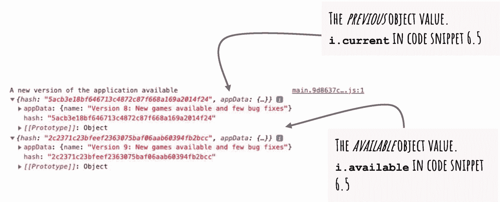
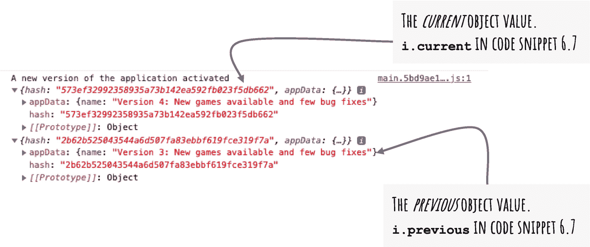

# 六、升级应用

到目前为止，您已经创建了一个 Angular 应用、注册的服务工作器和缓存的应用资源。本章详细介绍了如何发现应用的更新，如何与用户通信，以及如何处理事件以顺利升级到下一版本。

本章广泛使用 Angular 的`SwUpdate`服务，该服务提供了识别和升级应用的现成特性。它从包含(导入和注入)服务的指令开始。接下来，它详细介绍了如何识别可用的升级并激活升级。它还详细介绍了如何定期检查升级。最后，本章详细介绍了如何处理边缘情况，即浏览器清理未使用的脚本时的错误场景。

考虑到 Web Arcade 应用是可安装的，您需要一种机制来寻找更新，通知用户应用的新版本，并执行升级。服务工作器管理 Angular 应用的安装和缓存。本章详细介绍了如何使用`SwUpdate`，这是 Angular 提供的一种开箱即用的服务，旨在简化服务工作器的沟通。当新版本的应用可用、下载和激活时，它提供对事件的访问。您可以使用此服务中的功能定期检查更新。

## SwUpdate 入门

本节向您展示如何通过导入和注入服务来开始使用`SwUpdate`服务。`SwUpdate`服务是 Angular 模块`ServiceWorkerModule`的一部分，已经在`AppModule`的导入列表中引用。在`app.module.ts`文件中验证示例应用中的代码。当您运行第 [2](02.html) 章中的 Angular CLI `ng add @angular/pwa`命令时，它已包含在内。考虑清单 [6-1](#PC1) ，第 15 行和第 22 行。

```ts
01: import { NgModule } from '@angular/core';
02: import { BrowserModule } from '@angular/platform-browser';
03: import { environment } from '../environments/environment';
04: import { ServiceWorkerModule } from '@angular/service-worker';
05: import { BrowserAnimationsModule } from '@angular/platform-browser/animations';
06:
07: import { AppComponent } from './app.component';
08:
09: @NgModule({
10:   declarations: [
11:     AppComponent,
12:   ],
13:   imports: [
14:     BrowserModule,
15:     ServiceWorkerModule.register('ngsw-worker.js', {
16:       enabled: environment.production,
17:       // Register the ServiceWorker as soon as the app is stable
18:       // or after 30 seconds (whichever comes first).
19:       registrationStrategy: 'registerWhenStable:30000'
20:     }),
21:     BrowserAnimationsModule
22:   ],
23:   providers: [],
24:   bootstrap: [AppComponent]
25: })
26: export class AppModule { }
27:

Listing 6-1ServiceWorkerModule Imported in AppModule

```

确保`ServiceWorkerModule`如图所示导入(粗体)。这使得`SwUpdate`服务可以随时使用。创建一个新的 Angular 服务来封装代码，以便识别服务工作器的新版本、与用户通信以及管理细节。这有助于代码的可重用性和关注点的分离。要安装该服务，请运行以下命令:

```ts
ng g s common/sw-communication

```

Note

在代码片段中，`g`是“生成”的缩写，`s`是“服务”的缩写。

可以把前面的命令改写成`ng generate service common/sw-communication` *。*

Angular CLI 命令在目录`common`中创建了名为`SwCommunicationService`的新服务。默认情况下，它是在根级别提供的。将`SwUpdate`服务导入并注入`SwCommunicationService`，如清单 [6-2](#PC3) 所示。

```ts
01: import { Injectable } from '@angular/core';
02: import { SwUpdate } from '@angular/service-worker';
03:
04: @Injectable({
05:   providedIn: 'root'
06: })
07: export class SwCommunicationService {
08:   constructor(private updateSvc: SwUpdate)
09:   }
10: }

Listing 6-2Scaffolded SwCommunicationService

```

2、8 号线导入注入`SwUpdate`角服务。第 5 行提供了根级别的服务。虽然服务是在根级别提供的，但它还没有在应用中使用。与 Web Arcade 中创建的其他服务不同，它需要在后台运行，当您启动应用时或定期运行。因此，在根组件`AppComponent`中导入并注入`swCommunicationService`，如清单 [6-3](#PC4) ，第 2 行和第 9 行所示。

```ts
01: import { Component } from '@angular/core';
02: import { SwCommunicationService } from 'src/app/common/sw-communication.service';
03: @Component({
04:   selector: 'app-root',
05:   templateUrl: './app.component.html',
06:   styleUrls: ['./app.component.sass']
07: })
08: export class AppComponent {
09:   constructor(private commSvc: SwCommunicationService){
10:   }
11: }

Listing 6-3Import and Inject SwCommunicationService in AppComponent

```

## 识别应用的更新

接下来，更新`SwCommunicationService`以识别应用的更新版本是否可用。`SwUpdate`服务提供了一个名为`available`的可观察对象。订阅这个可观察的。当服务工作器识别出应用的更新版本时，就会调用它。

Note

此时，您已经知道服务器上有可用的升级。您尚未下载并激活它。

考虑列出 [6-4](#PC5) 。

```ts
1: export class SwCommunicationService {
2:   constructor(private updateSvc: SwUpdate
3:    ){
4:     this.updateSvc.available.subscribe( i => {
5:       console.log('A new version of the application available', i.current, i.available);
6:     });
7:   }
8: }

Listing 6-4Identify a New Version of the Application

```

考虑以下解释:



图 6-1

基于可观察数据的结果

*   如何在`updateSvc`上使用对象`available`(`SwUpdate`的一个对象)，见第 4 行。它是可观察的，当应用的新版本可用时，它发送值。

*   第 5 行打印`current`和`available`对象。考虑图 [6-1](#Fig1) 中的结果。请注意消息中的版本号。

Note

清单 [6-4](#PC5) 不会启动对新版本的检查。当一个新版本被识别时，订阅回调(第 5 行)运行。请参阅“检查新版本”一节，定期检查新版本。

另外，新版本*还没有*下载和激活。

*   记住应用的`ngsw-config.json`中的`appData`字段。(参见第 [4 章](04.html)。)对象`current`和`available`包括来自`appData` *的数据。*在示例应用中，我们添加了一个描述应用变化的字段名称。图 [6-1](#Fig1) 中的结果打印出`current`和`available`对象。它们是应用当前版本和新版本中来自`ngsw-config.json`的字段。`ngsw-config.json`见清单 [6-5](#PC6) 。

```ts
01: {
02:   "appData": {"name": "New games available and few bug fixes"},
03:   "$schema": "./node_modules/@angular/service-worker/config/schema.json",
04:   "index": "/index.html",
05:   "assetGroups": [
06:     {
07:       // Removed code for brevity. See code sample for the complete file.
42:     }]
43: }

Listing 6-5ngsw-config.json with appData

```

如前所述，`available`观察者验证服务工作器的新版本是否已经准备好并可用。这并不意味着它还在使用中。您可以提示用户更新应用。这为用户提供了完成当前工作流的机会。例如，在 Web Arcade 中，您不希望在用户玩游戏时重新加载并升级到新版本。

## 识别更新被激活的时间

到目前为止，您已经确定了升级是否可用。此步骤允许您识别已激活的升级。一旦服务工作器开始提供新版本应用的内容，就会触发`activated`观察。

考虑在`SwCommunicationService`中列出使用`activated`可观测值的 [6-6](#PC7) 。

```ts
01: export class SwCommunicationService {
02:
03:     constructor(private updateSvc: SwUpdate) {
04:       this.updateSvc
05:         .available
06:         .subscribe( i => {
07:             console.log('A new version of the application available', i.current, i.available);
08:       });

09:       this.updateSvc
10:         .activated
11:         .subscribe( i =>
12:             console.log('A new version of the application activated', i.current, i.previous));
13:     }
14:
15: }

Listing 6-6Activated Observable on SwUpdate

```

请参见第 9 行到第 13 行。请注意，您订阅了`activated`可观察值。它在激活应用的新版本时被触发。见第 12 行的`console.log`。这印出了`current`和`previous`和*。*类似于`available`可观察对象上的`current`和`available`对象(见清单 [6-4](#PC5) )，激活前。由于激活的可观察对象是在激活后触发的，所以可用版本现在是当前版本。结果如图 [6-2](#Fig2) 所示。



图 6-2

激活的可观察对象的结果

Note

类似于`available`可观察对象，`current`和`previous`对象包括来自`ngsw-config.json`的`appData`，用于应用的各个版本。

## 使用 SwUpdate 服务激活

当用户在新窗口中打开应用时，服务工作器会检查是否有新版本可用。服务工作器可能仍然从缓存中加载应用。这是因为新版本可能尚未下载和激活。它触发了`available`事件。对`available`可观察对象的`subscribe`回调将被调用(类似于清单 [6-4](#PC5) )。通常，下一次用户试图在新窗口中打开应用时，服务工作器和应用的较新版本被提供。确切的行为取决于配置和其他一些因素。

但是，一旦知道有新版本可用，您可以选择激活新版本。`SwUpdate`服务提供了`activateUpdate()` API 来激活应用的新版本。该函数返回一个`promise<void>`T3。激活更新后，调用承诺的成功回调。考虑清单 [6-7](#PC8) ，它激活了更新。

Note

该部分并不提示用户选择更新新版本。当您进行到下一部分时，您将添加代码来提醒用户有新版本的应用可用。

```ts
01: export class SwCommunicationService {
02:
03:     constructor(private updateSvc: SwUpdate) {
04:       this.updateSvc
05:         .available
06:         .subscribe( i => {
07:             console.log('A new version of the application available', i.current, i.available);
08:             this.updateSvc
09:                 .activateUpdate()
10:                 .then( () => {
11:                     console.log("activate update is successful");
12:                     window.location.reload();
13:                 });
14:       });
15:
16:       this.updateSvc
17:         .activated
18:         .subscribe( i => console.log('A new version of the application activated', i.current, i.previous));
19:     }
20:   }

Listing 6-7Activate Update with the SwUpdate Service

```

请参见第 8 行和第 13 行。第 9 行调用了`activateUpdate()`函数。它回报一个承诺。对返回的承诺调用`then()`函数。您提供了一个回调，该回调在承诺完成后被调用。参见第 11 行，它显示了一条消息“激活更新成功”

请注意，当有更新可用时，会调用`activateUpdate()`。在`available`可观察订阅中调用`activateUpdate()`方法。请参见第 6 行和第 14 行。这是对`available`可观察对象的订阅回调。

第 12 行在更新激活后重新加载应用(浏览器窗口)。成功更新后重新加载浏览器是一个很好的做法。在少数情况下，如果窗口在服务工作器和缓存刷新后没有重新加载，延迟加载路由可能会中断。

## 检查新版本

`SwUpdates`服务可以在服务器上检查应用的新版本(服务工作器配置)。如前所述，到目前为止，如果新版本可用或被激活，您已经收到了事件。如果新版本可用，您激活了它。但是，我们依赖浏览器和服务工作器的内置机制来寻找更新。

可以在`SwUpdate`的实例上调用函数`checkForUpdates()`来查找服务器上的更新。如果有新版本，它将触发`available`观察。如果您预计用户会让应用长时间保持打开状态，有时是几天，那么这个函数就特别有用。也有可能您预期对应用进行频繁的更新和部署。您可以设置一个时间间隔并定期检查更新。

考虑到`checkForUpdates()`与间隔一起使用，在检查更新之前确保 Angular 应用完全启动并稳定是很重要的。过于频繁地使用此功能可能会导致 Angular 应用不稳定。因此，检查应用是否稳定并使用`checkForUpdates`是一个好的实践，如清单 [6-8](#PC9) 所示。它被添加到`SwCommunicationService`的*中。*

```ts
01: import { SwUpdate } from '@angular/service-worker';
02: import { ApplicationRef, Injectable } from '@angular/core';
03: import { first} from 'rxjs/operators';
04: import { interval, concat } from 'rxjs';
05:
06: @Injectable({
07:   providedIn: 'root'
08: })
09: export class SwCommunicationService {
10:
11:   constructor(private updateSvc: SwUpdate,
12:     private appRef: ApplicationRef) {
13:
14:     let isApplicationStable$ = this.appRef.isStable.pipe(first(isStable => isStable === true));
15:     let isReadyForVersionUpgrade$ = concat( isApplicationStable$, interval (12 * 60 * 60 * 1000)); // //twelve hours in milliseconds
16:     isReadyForVersionUpgrade$.subscribe( () => {
17:       console.log("checking for version upgrade...")
18:       this.updateSvc.checkForUpdate();
19:     });
20:   }
21: }
22:

Listing 6-8Invoking CheckForUpdates at Regular Intervals

```

考虑以下解释:

*   你注入`ApplicationRef`来验证 Angular app 是否稳定。第 2 行和第 12 行分别导入和注入该类。

*   第 13 行验证应用是否稳定。字段`isStable`的类型为`Observable<boolean>`。订阅时，当应用稳定时返回 true。第 14 行将可观察值赋给局部变量`isApplicationStable$` *。*

*   在第 15 行，`interval()`函数返回一个`Observable<number>` *。*该函数接受以毫秒为单位的持续时间作为参数。在指定的时间间隔后调用订阅回调。请注意，代码片段以毫秒为单位指定了 12 小时。

*   第 15 行将`isApplicationStable$`与`interval()`返回的可观察值连接起来。由此产生的可观测值被设置为`isReadyForVersionUpgrade$` *。*订阅此可观察。当应用稳定并且经过了指定的时间间隔(12 小时)时，调用`success`回调。

Note

`concat`函数现已被弃用。如果您使用的是 RxJS 版本 8，使用`concatWith()`函数连接观察值。

*   在第 18 行，在可观察对象`isReadyForVersionUpgrade$`的`subscribe`回调中，您使用`SwUpdate`实例检查更新。

*   简单回顾一下，当应用稳定时，每 12 小时检查一次升级。`checkForUpdate()`函数可能触发`available`订户，该订户在成功激活新版本的应用后调用触发`activate`订户的`activateUpdate()`。

## 通知用户新版本

请注意，当识别出服务工作器的新版本时，当前代码会重新加载应用。它还没有提醒用户，并允许她选择何时重新加载。要提供此选项，请将应用与 Snackbar 组件集成在一起。这是角材库中可用的现成元件。Angular 材料为 Angular 应用提供材料设计实现。

我们为什么选择 Snackbar 组件？典型的警报会阻止用户工作流。在对警报采取措施之前，用户无法继续使用该应用。当没有用户的决定，工作流无法继续时，这样的范例工作得很好。例如，它可能是一个错误场景，这对于用户来说是非常重要的，用户需要确认并做出纠正。

另一方面，当新版本的服务工作程序(和应用)可用时，您不希望中断当前的用户会话。用户可以继续使用当前版本，直到手头的任务完成。例如，如果用户正在 Web Arcade 上玩游戏，则继续玩，直到游戏完成。当用户认为重新加载窗口是合适的时候，她可以选择响应警告。

Snackbar 组件非常适合我们的场景。它在应用的一角显示警告，而不会干扰页面的其余部分。默认情况下，警告显示在页面底部，靠近中央。见图 [6-3](#Fig3) 。如前所述，您应该允许用户单击 Snackbar 组件上的按钮来安装应用的新版本。


图 6-3

警告用户有新版本的应用可用的 Snackbar 组件

要安装 Snackbar 组件，请向 Web Arcade 应用添加 Angular 材质。运行以下命令:

```ts
ng add @angular/material

```

Angular Material 是一个 UI 组件，其他组件和样式表都符合 Google 的材质设计。首先，CLI 会提示您选择一个主题。见图 [6-4](#Fig4) 。


图 6-4

选择有 Angular 的材质主题

接下来，CLI 执行以下操作:

1.  提示您选择有 Angular 的材料排版。这是一个关于使用有 Angular 的材料字体、默认字体大小等的决定。

2.  提示您包含与 Angular 材料构件交互的浏览器动画。动画为用户动作提供视觉反馈，例如动画化点击按钮、转换内容标签等。

结果见清单 [6-9](#PC11) 。

```ts
✔ Package successfully installed.
? Choose a prebuilt theme name, or "custom" for a custom theme: Indigo/Pink        [ Preview: https://material.angular.io?theme=indigo-pink ]
? Set up global Angular Material typography styles? Yes
? Set up browser animations for Angular Material? Yes
UPDATE package.json (1403 bytes)
✔ Packages installed successfully.
UPDATE src/app/app.module.ts (1171 bytes)
UPDATE angular.json (3636 bytes)
UPDATE src/index.html (759 bytes)
UPDATE node_modules/@angular/material/prebuilt-themes/indigo-pink.css (77575 bytes)

Listing 6-9Result Installing Angular Material

```

向 Web Arcade 添加 Angular 材质允许您使用各种 Angular 材质组件。您将只导入和使用所需的组件。整个组件库不会增加包的大小。

要使用 Snackbar 组件，请将`MatSnackBarModule`导入 Web Arcade 中的`AppModule`。考虑上市 [6-10](#PC12) 。

```ts
01: import { MatSnackBarModule } from '@angular/material/snack-bar';
02:
03: @NgModule({
04:   declarations: [
05:     AppComponent,
06:     // You may have more components
07:   ],
08:   imports: [
09:     BrowserModule,
10:     AppRoutingModule,
11:     MatSnackBarModule,
12:     // You may have additional modules imported
13:   ],
14:   providers: [],
15:   bootstrap: [AppComponent]
16: })
17: export class AppModule { }

Listing 6-10Add the Snackbar Module to the Web Arcade Application

```

参见第一行，它从 Snackbar 组件的 Angular Material 模块导入`MatSnackBarModule`。另请参见第 11 行，它将模块导入 Web Arcade 上的`AppModule`。

接下来，将 Snackbar 组件导入并注入到`SwCommunication`服务中。请记住，当应用的新版本可用时，您会向用户显示一个警告。它在`SwCommunication`服务的构造函数中被识别。见清单 [6-11](#PC13) 。

```ts
01: import { Injectable } from '@angular/core';
02: import { SwUpdate } from '@angular/service-worker';
03: import { MatSnackBar } from '@angular/material/snack-bar';
04:
05: @Injectable({
06:   providedIn: 'root'
07: })
08: export class SwCommunicationService {
10:   constructor(private updateSvc: SwUpdate,
11:     private snackbar: MatSnackBar) {
13:     this.updateSvc.available.subscribe( i => {
14:       let message = i?.available?.appData as { "name": string };
15:       console.log('A new version of the application available', i.current, i.available);
16:       let snackRef = this.snackbar
17:         .open(`A new version of the app available. ${message.name}. Click to install the application`, "Install new version");
18:     });
19:   }
20: }

Listing 6-11Alert with a Snackbar that a new version of the application is available

```

考虑以下解释:

*   第 3 行从 Angular Material 的`snackbar`模块导入 Snackbar 组件。它被注入到第 11 行的服务中。

*   注意第 14 行和第 18 行之间的`success`回调。它在`available`上可以观察到。如前所述，当一个更新就绪时，就会触发这个观察者功能。

*   见第 16 行。`open()`函数显示了一个 Snackbar 组件。您需要提供两个参数，即显示在警报上的消息(Snackbar 组件)和 Snackbar 组件上操作(或按钮)的标题。重新查看图 [6-3](#Fig3) 以匹配代码和结果。

*   注意，open 函数也返回一个 Snackbar 引用对象。当用户单击 Snackbar 组件上的按钮时，您将使用此对象来执行操作。

*   注意`message.name`被插入第 17 行。`message`对象是在前一行 14 上获得的。注意它是`ngsw-config.json`上的`appData`物体。这是为应用的每个版本升级提供友好消息的一种方式，并在用户选择重新加载和安装新版本时向用户显示信息。见图 [6-3](#Fig3) 。来自`appData`的消息说，“我们给街机增加了更多的游戏。”

接下来，使用由`open()`函数返回的 Snackbar 组件引用，如第 16 行所示。参考对象被命名为`snackRef`。您使用`snackRef` *上的`onAction()`功能。*这返回了另一个可观察值。顾名思义，当用户在 Snackbar 组件上执行一个操作时，就会触发 observer 回调函数。请注意，在前面的代码示例中，您有一个操作，即 Snackbar 组件上的按钮“Install new version”。因此，当这个观察者被调用时，您知道用户点击了按钮并可以执行安装。见清单 [6-12](#PC14) 。使用修改后的代码，只有在用户通过单击 Snackbar 组件上的按钮选择安装后，您才能执行安装。

```ts
01:
02: // include this snippet after snackRef created in the SwCommunicationService
03: snackRef
04: .onAction()
05: .subscribe (() => {
06:   console.log("Snackbar action performed");
07:   this.updateSvc.activateUpdate().then( () => {
08:     console.log("activate update invoked");
09:     window.location.reload();
10:   });
11: });

Listing 6-12Add Snackbar Module to Web Arcade

```

考虑以下解释:

*   第 4 行调用了`snackRef`对象上的`onAction()`函数。你在返回的对象上链接`subscribe()`函数。如前所述，`onAction()`函数返回一个可观察值。

*   作为观察者提供的成功回调调用`SwUpdate`对象上的`activateUpdate()`函数。当用户在 Snackbar 组件上执行操作时，调用第 6 行和第 10 行之间的观察者回调。

*   请记住，第 6 行和第 10 行之间的代码与清单 [6-6](#PC7) 相同，它在识别出新版本后立即执行安装。

## 在不可恢复的情况下管理错误

用户可能有一段时间没有返回到机器上的应用。浏览器将清空缓存并占用磁盘空间。当用户返回到应用时(在缓存被清理之后)，服务工作器可能没有它需要的所有脚本。与此同时，假设在服务器上部署了一个新版本的应用。现在，浏览器无法(从缓存中)获取已删除的脚本，甚至无法从服务器获取。这导致应用处于不可恢复的状态。对用户来说，只剩下一个选择:升级到最新版本。

`SwUpdate`服务提供了一个名为`unrecoverable`的可观察对象来处理这样的场景，如清单 [6-13](#PC15) 所示。当出现不可恢复的状态时，添加一个错误处理程序。通知用户并重新加载浏览器窗口以清除错误。与前面的代码示例类似，在`SwCommunicationService`构造函数中添加代码。

```ts
01: export class SwCommunicationService {
02:
03:   constructor(private updateSvc: SwUpdate,
04:     private snackbar: MatSnackBar) {
05:     this.updateSvc.unrecoverable.subscribe( i => {
06:       console.log('The application is unrecoverable', i.reason);
07:       let snackRef = this.snackbar
08:       .open(`We identified an error loading the application. Use the following reload button. If the error persists, clear cache and reload the application`,
09:         "Reload");
10:     snackRef
11:       .onAction()
12:       .subscribe (() => {
13:         this.updateSvc.activateUpdate().then( () => {
14:           window.location.reload();
15:         });
16:      });
17:     });
18:   }
19: }

Listing 6-13Handle the Unrecoverable State

```

考虑以下解释:

*   见第 5 行。它在`SwUpdate`(即`updateSvc`)的实例上订阅了`unrecoverable`观察者。可观察对象的成功回调位于第 6 行和第 17 行之间。

*   You open a Snackbar component, which alerts the user about the error at the bottom center of the page. See Figure [6-5](#Fig5).

    

    图 6-5

    警告用户不可恢复的错误的 Snackbar 组件

*   注意第 6 行的原因字段。它有关于不可恢复状态的附加信息。您可以在浏览器控制台中打印和使用这些信息，或者将其记录到一个中心位置，以便进一步调查。

## 摘要

可安装和缓存的 web 应用非常强大。它们使用户能够在低带宽和离线情况下访问应用。然而，您还需要构建无缝升级应用的特性。如您所知，对于 Web Arcade，服务工作器管理缓存和离线访问功能。

本章详细介绍了如何无缝升级 Angular 应用并与服务工作器进行沟通。它广泛使用 Angular 的`SwUpdate`服务，该服务为识别和激活新版本的应用提供了许多现成的功能。它使用可观测量；当新版本的应用可用或激活时，您可以进行订阅。

Exercise

*   本章使用 Snackbar 组件在应用的新版本可用时发出警报。激活升级后显示警告。在`ngsw-config.json`中包含来自`appData`的信息。

*   扩展`ngsw-config.json`以显示关于发布的附加信息。包括增强功能和错误修复的详细信息。让它接近真实世界的用例。用户希望看到有关升级的详细信息摘要。

*   探索将 Snackbar 组件定位在页面上的不同位置(与默认的底部居中相对)。

*   探索使用除 Snackbar 组件之外的更多组件向用户发出警报。构建更适合不同用例的体验。请记住，我们使用了 Snackbar 组件，因为它不会中断和阻塞活动用户的工作流。然而，Snackbar 组件也用于警告不可恢复的错误场景。因此，为这种错误情况选择适当的警报组件和机制。