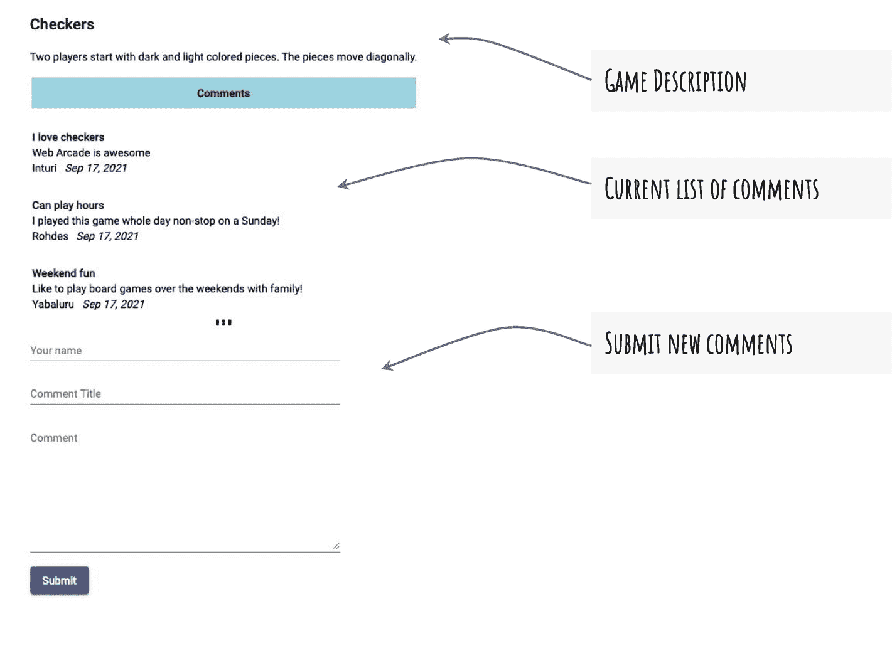
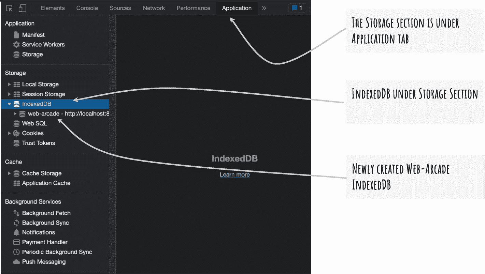
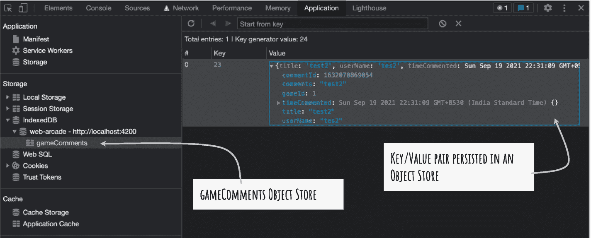
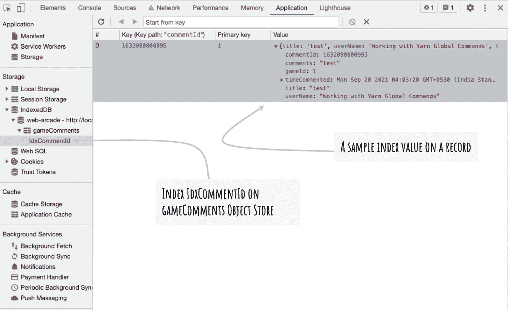

# 七、IndexedDB 简介

到目前为止，您已经缓存了应用框架和 HTTP GET 服务调用。RESTful 服务为数据检索提供 GET 调用。但是，HTTP 也支持 POST 来创建实体，PUT 和 PATCH 来更新，DELETE 来删除实体。除了 GET 调用之外，示例应用 Web Arcade 还不支持对服务调用的离线访问。

本章介绍了 IndexedDB，用于更高级的脱机操作。在本章中，你将对 IndexedDB 有一个基本的了解，它运行在浏览器的客户端。您将学习如何在 Angular 应用中使用 IndexedDB。JavaScript 提供 API 来与 IndexedDB 集成。您可以在 IndexedDB 中创建、检索、更新和删除数据，大多数现代浏览器都支持 indexed db。这一章着重于构建数据库，包括创建对象存储、索引等。在下一章中，您将通过创建和删除记录来处理数据。

传统上，web 应用使用各种客户端存储功能，包括 cookies、会话存储和本地存储。即使在今天，它们对于存储相当少量的数据也非常有用。另一方面，IndexedDB 为更复杂的客户端存储和检索提供了一个 API。大多数现代浏览器都支持 JavaScript API。IndexedDB 为相对大量的数据(包括 JSON 对象)提供持久存储。然而，没有一个数据库支持存储无限量的数据。相对于磁盘和设备的大小，浏览器对 IndexedDB 中存储的数据量设置了上限。

IndexedDB 对于持久化结构化数据很有用。它以键值对的形式保存数据。它像 NoSQL 数据库一样工作，支持使用包含数据记录的对象存储。对象存储类似于关系数据库中的表。传统的关系数据库在很大程度上使用根据列和约束(主键、外键等)具有预定义结构的表。).但是，IndexedDB 使用对象存储来保存数据记录。

IndexedDB 支持高性能搜索。借助于索引(在对象存储上定义)来组织数据，这有助于更快地检索数据。

## 术语

考虑以下使用 IndexedDB 的术语:

*   *对象存储*:一个 IndexedDB 可能有一个或多个对象存储。每个对象存储充当数据的键值对的容器。如前所述，对象存储类似于关系数据库中的表。
    *   对象存储为 IndexedDB 提供结构。创建一个或多个对象存储作为应用数据的逻辑容器。例如，您可以创建一个名为`users`的对象存储来存储用户详细信息，并创建另一个名为`games`的对象存储来保存游戏相关对象的列表。

*   *事务*:indexed db 上的数据操作是在事务的上下文中执行的。这有助于保持数据的一致性。记住，IndexedDB 在浏览器中的客户端存储和检索数据。用户可能会打开多个应用实例。它可以创建场景，其中创建/更新/删除操作由浏览器的每个实例部分执行。当更新操作正在进行时，其中一个浏览器可能会检索过时的数据。
    *   事务有助于避免前面提到的问题。事务锁定数据记录，直到操作完成。数据访问和修改操作是原子性的。也就是说，创建/更新/删除操作要么完全完成，要么完全回滚。检索操作仅在数据修改操作完成或回滚后执行。因此，retrieve 从不返回不一致和陈旧的数据对象。

    *   IndexedDB 支持三种交易模式，即`readonly`、`readwrite`、`versionchange`、T6。可以想象，`readonly`帮助检索操作，`readwrite`帮助创建/更新/删除操作。然而，`versionchange`模式有助于在 IndexedDB 上创建和删除对象存储。

*   *索引*:索引有助于更快地检索数据。对象存储按照键的升序对数据进行排序。键隐式不允许重复值。您可以创建额外的索引，这些索引也可以作为唯一性约束。例如，在社会保险号或身份证号上添加索引可以确保 IndexedDB 中没有重复项。

*   *游标*:游标帮助遍历对象存储中的记录。在查询和检索过程中迭代数据记录时，这很有用。

## IndexedDB 入门

主流浏览器都支持 IndexedDB。API 使应用能够在浏览器中创建、存储、检索、更新和删除本地数据库中的记录。本章详细介绍了如何在本机浏览器 API 中使用 IndexedDB。

以下是使用 IndexedDB 时的典型步骤:

1.  *创建和/或打开一个数据库*:第一次创建一个新的 IndexedDB 数据库。当用户返回 web 应用时，打开数据库以对数据库执行操作。

2.  *创建和/或使用对象存储库*:用户第一次访问该功能时，创建一个新的对象存储库。如前所述，对象存储类似于关系数据库管理系统(RDBMS)中的表。您可以创建一个或多个对象存储。您可以在对象存储中创建、检索、更新和删除文档。

3.  *开始一个事务*:在一个 IndexedDB 对象存储上作为一个事务执行动作。它使您能够保持一致的状态。例如，当对 IndexedDB 数据库执行操作时，用户可能会关闭浏览器。因为动作是在事务的上下文中执行的，所以如果动作没有完成，则事务被中止。事务确保错误或边缘情况不会使数据库处于不一致或不可恢复的状态。

4.  *执行 CRUD* :与任何数据库一样，您可以在 IndexedDB 中创建、检索、更新或删除文档。

考虑下面的 Web Arcade 用例，利用 IndexedDB。

在前面的章节中，你已经看到了一个显示棋盘游戏列表的页面。考虑用游戏细节页面来支持一个新的用例。图 [7-1](#Fig1) 详细描述了一个游戏的所有信息。在游戏描述的下面，显示了一个用户评论列表和一个允许用户添加新评论的表单。当用户输入新的注释并提交表单时，您将这些数据发送到远程 HTTP 服务。理想情况下，该服务将用户评论保存在永久性存储/数据库中，如 MongoDB、Oracle 或 Microsoft SQL Server。考虑到服务器端代码不在本书讨论范围内，我们将保持简单。在下一章中，代码示例展示了一个将用户评论存储在文件中的服务。

图 [7-1](#Fig1) 显示了带有当前评论列表和允许用户提交新评论的表单的页面部分。



图 7-1

在游戏详情页面上列出并提交评论

“提交”操作会创建新的注释。服务端点是一个 HTTP POST 方法。如前所述，Web Arcade 支持 HTTP GET 调用的离线访问。想象一下，当用户输入评论并点击提交时失去连接。典型的 web 应用会返回一个错误或类似“无法显示页面”的消息 Web Arcade 旨在对网络连接的丢失具有弹性。因此，Web Arcade 缓存用户评论，并在用户返回应用时与服务器端服务同步。

### 索引的 Angular 服务 b

通过运行以下命令创建新服务:

```ts
ng generate service common/idb-storage-access

```

该命令在目录`src/app/common` *中创建了一个名为`IdbStorageAccessService`的新服务。*该服务用于抽象访问 IndexedDB 的代码语句。它是一个中央服务，使用浏览器 API 与 IndexedDB 集成。在初始化期间，该服务执行一次性活动，如创建新的 IndexedDB 存储或打开数据库(如果它已经存在)。见清单 [7-1](#PC2) 。

```ts
01: @Injectable()
02: export class IdbStorageAccessService {
03:
04:   idb = this.windowObj.indexedDB;
05:
06:   constructor(private windowObj: Window) {
07:   }
08:
09:   init() {
10:     let request = this.idb
11:       .open('web-arcade', 1);
12:
13:     request.onsuccess = (evt:any) => {
14:       console.log("Open Success", evt);
15:     };
16:
17:     request.onerror = (error: any) => {
18:       console.error("Error opening IndexedDB", error);
19:     }
20:   }
21:
22: }
23:

Listing 7-1Initialize IndexedDB with the IdbStorageAccessService

```

Note

默认情况下，`ng generate service`命令在根级别提供服务。在 Web Arcade 应用的上下文中，您可能希望删除第 1 行的`provideIn: 'root'`语句。只需离开`inject()`装饰器，如第一行所示。

这将在下一节连同清单 [7-2](#PC3) 一起详细解释。

考虑以下解释:

*   第 4 行创建了类变量`idb`(indexed db 的缩写)。它被设置为全局窗口对象上的`indexedDB`实例。`indexedDB`对象有一个 API 来帮助打开或创建一个新的 IndexedDB。第 4 行在初始化`IdbStorageAccessService`时运行，类似于构造函数。

Note

注意，全局窗口对象是通过一个`Window`服务来访问的。参见第 6 行的构造函数。它注入窗口服务。实例变量被命名为`windowObj`。`Window`服务在`AppModule`提供。

*   关于初始化服务的`init()`函数，请参见第 9 行到第 20 行。

*   参见对`idb`对象运行`open()`函数的第 10 行和第 11 行。如果用户第一次在浏览器上打开应用，它会创建一个新的数据库。
    1.  第一个参数是数据库的名称`web-arcade`。

    2.  第二个参数(值 1)指定数据库的版本。可以想象，应用的新更新会导致 IndexedDB 结构的变化。IndexedDB API 使您能够随着版本的变化升级数据库。

要返回一个用户，数据库已经创建好，并且可以在浏览器上使用。`open()`函数试图打开数据库。它返回`IDBOpenDBRequest`对象的一个对象。

图 [7-2](#Fig2) 显示了一个新创建的 IndexedDB `web-arcade`。这张图片是用谷歌浏览器的开发工具拍摄的。包括 Firefox 和 Microsoft Edge 在内的所有主流浏览器都为开发者提供了类似的功能。



图 7-2

Google Chrome 开发工具中的 IndexedDB

几乎所有的 IndexedDB APIs 都是异步的。像 open 这样的操作不会尝试立即完成操作。您指定一个回调函数，该函数在完成操作后被调用。可以想象，打开操作可能成功，也可能出错。因此，为每个结果定义一个回调函数，`onsuccess`或`onerror` *。*见清单 [7-1](#PC2) 第 13-15 行和第 17-19 行。目前，您只需在控制台上打印结果(第 14 和 18 行)。我们将在接下来的代码片段中进一步增强对结果的处理。

什么时候调用`init()`函数？这是 Angular 服务的方法之一。您可以在组件中调用它，这意味着只有当您加载(或导航)到组件时，IndexedDB 才会被初始化。另一方面，像 Web Arcade 这样的应用高度依赖于 IndexedDB。您可能需要利用来自多个组件的服务。该服务需要完成初始化，并为 CRUD 操作做好准备。因此，在主模块`AppModule`启动时，将服务和应用一起初始化是一个好主意。考虑将 [7-2](#PC3) 上市。

```ts
03: import { NgModule, APP_INITIALIZER } from '@angular/core';
15: import { IdbStorageAccessService } from './common/idb-storage-access.service';
18:
19: @NgModule({
20:   declarations: [
21:     AppComponent,
25:   ],
26:   imports: [
27:     BrowserModule,
40:   ],
41:   providers: [
42:     IdbStorageAccessService,
43:     {
44:       provide: APP_INITIALIZER,
45:       useFactory: (svc: IdbStorageAccessService) => () => svc.init(),
46:       deps: [IdbStorageAccessService], multi: true
47:     }
48:   ],
49:   bootstrap: [AppComponent]
50: })
51: export class AppModule { }
52:

Listing 7-2Initialize IndexedDB with IdbStorageAccessService

```

考虑以下解释:

*   参见第 42 至 48 行。块中的第一行(第 42 行)提供了一个新创建的`IDBStorageAccessService` *。*我们为什么需要它？如您所见，我们没有在根级别提供服务。我们删除了`IdbStorageAccessService`(清单 [7-1](#PC2) )中的代码行`provideIn: 'root'`。

*   参见第 43 行到第 47 行，它们提供了`APP_INITIALIZER`并使用了调用`init()`的工厂函数。

*   总之，我们在模块级提供并初始化了`IdbStorageService`。在本例中，您在`AppModule`中完成。它可能是任何模块。

    它在浏览器上创建和/或打开`Web-Arcade` IndexedDB。它使数据库为进一步的操作(如 CRUD)做好准备。这段代码消除了将服务注入组件(或另一个服务)并调用`init()`函数的需要。服务随着`AppModule`一起初始化。

## 正在创建对象存储

虽然数据库是 IndexedDB 中的最高级别，但它可以有一个或多个对象存储。您为数据库中存储每个对象提供一个唯一的名称。对象存储是保存数据的容器。在当前的 Web Arcade 示例中，您将看到如何保存 JSON 对象。为了便于理解，对象存储类似于关系数据库中的表。

### 使用“onupgradeneeded”事件

创建或打开 IndexedDB 后，会触发一个名为`onupgradeneeded`的事件。您提供了一个回调函数，当该事件发生时，浏览器将调用该函数。对于新数据库，回调函数是创建对象存储的好地方。对于预先存在的数据库，如果需要升级，您可以在此处执行设计更改。例如，您可以创建新的对象存储，删除未使用的对象存储，并通过删除和重新创建来修改现有的对象存储。考虑上市 [7-3](#PC4) 。

```ts
01: init() {
02:     let request = this.idb
03:         .open('web-arcade', 1);
04:
05:     request.onsuccess = (evt: any) => {
06:         console.log("Open Success", evt);
07:     };
08:
09:     request.onerror = (error: any) => {
10:         console.error("Error opening IndexedDB", error);
11:     }
12:
13:     request.onupgradeneeded = function (event: any) {
14:         console.log("version upgrade event triggered");
15:         let dbRef = event.target.result;
16:         dbRef
17:             .createObjectStore("gameComments", { autoIncrement: true });
18:     };
19: }

Listing 7-3onupgradeneeded Event Callback

```

考虑以下解释:

*   注意，代码片段重复了清单 [7-1](#PC2) 中的`init()`函数。除了`onsuccess`和`onerror`回调之外，还包括一个名为`onupgradeneeded`的事件处理程序。参见第 13 行到第 18 行。

*   该事件作为参数提供给函数回调。

*   你可以访问一个对象上事件目标的 IndexedDB 的引用，即`target`。

*   使用`db`引用创建一个对象存储。在本例中，您将对象存储命名为`gameComments` *。*如前所述，如果用户失去连接，您可以使用 IndexedDB 和对象存储来缓存用户评论。

对象存储以键值对的形式保存数据。正如您将在接下来的几节中看到的，数据是使用键来检索的。它是唯一标识存储在 IndexedDB 中的值的主键。以下是创建键的两个选项(用于对象存储中存储的值)。这是在创建对象存储时决定的。参见清单 [7-3](#PC4) 中的第 17 行。注意`createObjectStore()`函数的第二个参数。您可以指定以下两个选项之一:

*   *自动递增* : IndexedDB 管理密钥。它为对象存储中添加的每个新对象创建一个数值和增量。

    ```ts
    dbRef.createObjectStore("gameComments", {
    autoIncrement: true });

    ```

*   *Key path* :在正在添加的 JSON 对象中指定一个 Key path。因为键值是显式提供的，所以请确保提供唯一的值。重复值会导致插入失败。

    A field called `commentId` is provided as a keypath. If used, ensure you provide a unique value for `commentId`.

    ```ts
    dbRef.createObjectStore("gameComments", {
    keypath: 'commentId' });

    ```

Note

只能为 JavaScript 对象提供键路径。因此，创建带有键路径的对象存储会限制它只能存储 JavaScript 对象。但是，使用自动增量，考虑到键是由 IndexedDB 管理的，您可以存储任何类型的对象，包括基本类型。

参见图 [7-3](#Fig3) 中新创建的`gameComments`对象库。



图 7-3

gameComments 对象存储和示例值

#### 创建索引

定义对象存储时，可以创建附加索引，这些索引也可以作为唯一性约束。该索引应用于对象存储中持久化的 JavaScript 对象中的字段。考虑下面的代码片段。它解释了对象存储引用上的`createIndex` API。

```ts
objectStoreReference.createIndex('indexName', 'keyPath', {parms})

```

考虑以下解释:

*   `Index name`:第一个参数是索引名(任意)。

*   `Key path`:第二个参数`keypath`，指定需要在给定的字段上创建索引。

*   `Params`:您可以为创建索引指定以下参数:
    1.  `unique`:这在 keypath 提供的字段上创建了一个唯一性约束。

    2.  `multiEntry`:应用于数组。

如果为 true，则约束确保数组中的每个值都是唯一的。为数组中的每个元素的索引添加一个条目。

如果为 false，索引将为整个数组添加一个条目。唯一性是在数组对象级别维护的。

在`gameComments`对象存储中，假设每个评论都有一个 ID。要确保 ID 是唯一的，请添加一个索引。考虑上市 [7-4](#PC8) 。

```ts
1: request.onupgradeneeded = function(event: any){
2:     console.log("version upgrade event triggered");
3:     let dbRef = event.target.result;
4:     let objStore = dbRef
5:       .createObjectStore("gameComments", { autoIncrement: true })
6:
7:     let idxCommentId = objStore.createIndex('IdxCommentId', 'commentId', {unique: true})
8:   };

Listing 7-4Create Index IdxCommentId for the Comment ID

```

注意，第 7 行使用对象存储引用`objStore`创建了一个索引。该索引被命名为`IdxCommentId`。该索引被添加到`commentId`字段。您可以看到参数`unique`被设置为 true，这确保了`commentId`对于每条记录都是不同的。图 [7-4](#Fig4) 展示了具有新索引的对象存储。



图 7-4

对象存储上的索引 IdxCommentId

## 浏览器支持

图 [7-5](#Fig5) 描述了浏览器对全局`indexedDB`对象(`windowObj.indexedDB`)的支持。请注意，这些数据是在 Mozilla 网站的 [`https://developer.mozilla.org/en-US/docs/Web/API/indexedDB`](https://developer.mozilla.org/en-US/docs/Web/API/indexedDB) 捕获的。对于 web 技术来说，它是一个可靠的开源平台。Mozilla 是开放网络的倡导者，也是包括 Firefox 浏览器在内的安全免费互联网技术的先驱。


图 7-5

window.indexedDB 浏览器支持

另请参考 CanIUse.com，它是浏览器兼容性数据的可靠来源。对于 IndexedDB，使用 URL [`https://caniuse.com/indexeddb`](https://caniuse.com/indexeddb) *。*

## 指数化的局限性 b

虽然 IndexedDB 为浏览器中的客户端持久化和查询提供了一个很好的解决方案，但了解以下限制很重要:

*   它不支持国际化排序，因此对非英语字符串进行排序可能会很棘手。很少有语言对字符串的排序不同于英语。在撰写本章时，IndexedDB 和所有浏览器都不完全支持本地化排序。如果这个特性很重要，您可能必须从数据库中检索数据，并编写额外的自定义代码来排序。

*   还不支持全文搜索。

*   IndexedDB 不能被视为数据的真实来源。这是临时存储。在以下情况下，数据可能会丢失或被清除:
    1.  用户重置浏览器或手动清除数据库。

    2.  用户在 Google Chrome 匿名窗口或私人浏览会话(在其他浏览器上)中启动应用。由于浏览器窗口关闭，考虑到这是一个私人会话，数据库将被删除。

    3.  永久存储的磁盘配额是根据一些因素计算的，包括可用磁盘空间、设置、设备平台等。应用可能超出了配额限制，进一步的持久化失败。

    4.  各种情况，包括损坏的数据库、由不兼容的更改导致的数据库升级错误等。

## 摘要

本章提供了对 IndexedDB 的基本理解，它运行在浏览器的客户端。JavaScript 提供了一个本地 API 来处理 IndexedDB。大多数现代浏览器都支持它。

本章还解释了如何使用`AppModule`初始化 Angular 服务。在初始化过程中，您为 Web Arcade 创建或打开 IndexedDB 商店。如果用户第一次在浏览器上访问应用，您将创建一个新的 IndexedDB 存储。如果已经存在，则打开预先存在的数据库。

接下来，本章解释了如何使用`onupgradeneeded`函数回调来创建对象存储和索引。这些是用户首次访问应用时的一次性活动。

Exercise

*   为创建新游戏创建一个额外的对象存储。加载应用(或 Angular 模块)时执行操作。

*   创建对象存储以使用指定的 ID 作为键(主)。不要使用自动增量。

*   在游戏标题上创建一个额外的索引。确保它是唯一的。