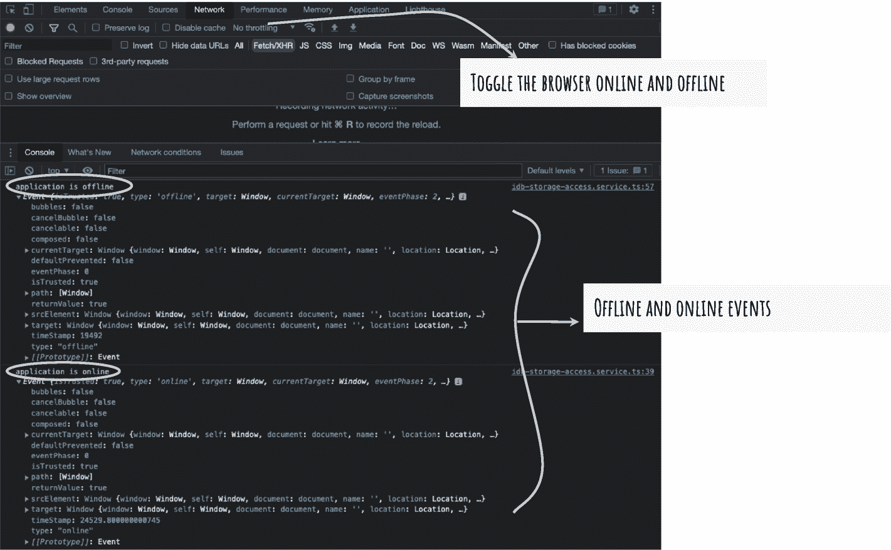
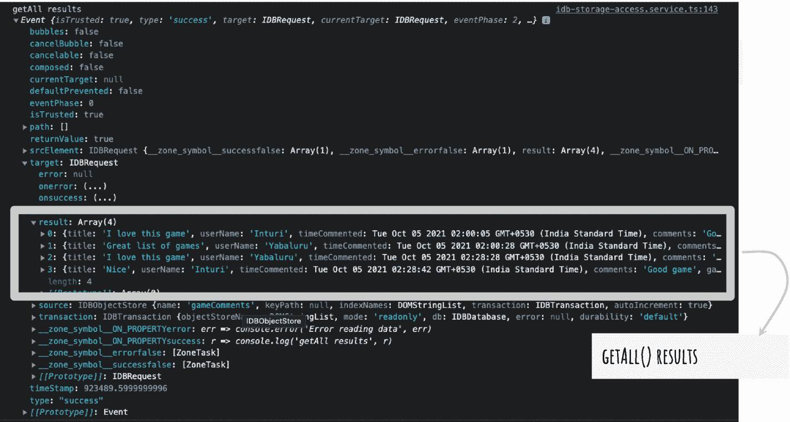

# 九、离线创建数据

在本书的前面，我们开始在 Angular 应用中集成 IndexedDB。我们还建立了一个离线创建数据的用例，即用户评论。假设一个用户在一个游戏详情页面上，并试图添加评论。但是，用户无法访问网络。Web Arcade 应用具有弹性，因为它将评论临时保存在客户端设备/浏览器上。当用户重新上线时，应用会在线同步评论。

本章详细阐述了如何离线创建数据。它以识别应用是在线还是离线的指令开始。您使用状态来确定如何访问服务器端服务或使用本地 IndexedDB 存储。接下来，本章详细介绍了如何在脱机状态下向 IndexedDB 添加注释。它详细说明了如何向用户提供应用脱机但数据被临时保存的反馈。

然后，本章介绍了一旦应用恢复在线，如何将离线注释与服务器端服务同步。记住，服务器端数据库和服务是数据的真实来源。IndexedDB 是临时的，为用户提供无缝体验。

## 在线和离线添加评论

前一章描述了如何添加注释。提交操作调用服务器端 HTTP 端点。如果设备离线并失去网络连接，典型的 web 应用会显示一个错误。一旦联机，用户可能必须重试该操作。如前所述，Web Arcade 使用 IndexedDB，临时保存数据，并在远程服务可用时进行同步。

### 用 Getter 识别联机/脱机状态

要识别设备(和浏览器)是否在线，请使用 navigator 对象上的 JavaScript API。它是`window`对象的只读属性。字段`onLine`返回当前状态，如果在线则为真，如果离线则为假。

谷歌 Chrome 上的开发者工具提供了一个降低网速的选项。这有助于应用评估其性能和用户体验。见图 [9-1](#Fig1) 。这些工具将`onLine`字段值打印在导航器对象上。请注意，浏览器窗口是离线节流的。


图 9-1

Google Chrome 开发者工具，在控制台上打印在线状态

Note

您可以在自己选择的浏览器上运行类似的命令。图 [9-1](#Fig1) 显示的是谷歌 Chrome，是任意选择的。

记住，我们创建了一个名为`IdbStorageAccessService`的服务来封装对 IndexedDB 的访问。联机/脱机状态决定了可以访问 IndexedDB 的组件。因此，您应该包含代码行来确定服务中的在线/离线状态。

将`Window`服务注入`IdbStorageAccessService`，如清单 [9-1](#PC1) 第 3 行所示。

```ts
1: @Injectable()
2: export class IdbStorageAccessService {
3:   constructor(
          private windowObj: Window) {
4:     // this.create();
5:   }
6: }

Listing 9-1Inject the Window Service

```

确保提供了`Window`服务。关于 Web Arcade 应用，请参见清单 [9-2](#PC2) ，第 10 行和第 15 行。您为`Window`服务提供了一个全局变量`window`，如第 14 行所示。这提供了对有用属性的访问，如`document`、`navigator`等。

```ts
01: @NgModule({
02:     declarations: [
03:       AppComponent,
04:       // ...
05:     ],
06:     imports: [
07:       BrowserModule,
08:       // ...
09:     ],
10:     providers: [
11:       IdbStorageAccessService,
12:       {
13:         provide: Window,
14:         useValue: window
15:       }
16:     ],
17:     bootstrap: [AppComponent]
18:   })
19:   export class AppModule { }

Listing 9-2Provide the Window Service

```

在`IdbStorageAccessService` *中创建一个名为`IsOnline`的 getter 函数。*服务实例可以使用`IsOnline`字段来获取浏览器的状态。代码在服务中被抽象。见清单 [9-3](#PC3) 。

```ts
1: get IsOnline(){
2:     return this.windowObj.navigator.onLine;
3: }

Listing 9-3IsOnline Getter as Part of IdbStorageAccessService

```

### 添加在线/离线事件监听器

当应用联机或脱机时，您可能会遇到需要执行某个操作的情况。窗口对象(以及窗口服务)提供事件`online`和`offline`。初始化时将这些事件添加到`IdbStorageAccessService`。事件处理程序回调函数在事件发生时被调用。

清单 [9-4](#PC4) 在浏览器控制台上打印一条包含事件数据的消息。您可以在事件触发时执行操作。具体参见第 8 至 11 行和第 13 至 16 行。

```ts
01: @Injectable()
02: export class IdbStorageAccessService {
03:
04:   constructor(private windowObj: Window) {
05:   }
06:
07:   init() {
08:     this.windowObj.addEventListener("online", (event) => {
09:       console.log("application is online", event);
10:       // Perform an action when online
11:     });
12:
13:     this.windowObj.addEventListener('offline', (event)=> {
14:         console.log("application is offline", event)
15:         // Perform an action when offline
16:     });
17:   }
18: }

Listing 9-4Online and Offline Events

```

图 [9-2](#Fig2) 显示了结果。



图 9-2

线上和线下活动

### 向索引添加注释 b

记住，当需要时，我们打算在 IndexedDB 中缓存注释。考虑到`IdbStorageAccessService`从应用的其余部分抽象出访问数据库的任务，增加服务并添加一个在 IndexedDB 中缓存注释的功能。但是在我们开始之前，清单 [9-5](#PC5) 显示了到目前为止服务的快速回顾。

```ts
01: @Injectable()
02: export class IdbStorageAccessService {
03:
04:   idb = this.windowObj.indexedDB;
05:
06:   constructor(private windowObj: Window) {
07:   }
08:
09:   init() {
10:
11:     let request = this.idb.open('web-arcade', 1);
12:
13:     request.onsuccess = (evt:any) => {
14:       console.log("Open Success", evt);
15:
16:     };
17:
18:     request.onerror = (error: any) => {
19:       console.error("Error opening IndexedDB", error);
20:     }
21:
22:     request.onupgradeneeded = function(event: any){
23:       let dbRef = event.target.result;
24:       let objStore = dbRef
25:         .createObjectStore("gameComments", { autoIncrement: true })
26:
27:       let idxCommentId = objStore.createIndex('IdxCommentId', 'commentId', {unique: true})
28:     };
29:
30:     this.windowObj.addEventListener("online", (event) => {
31:       console.log("application is online", event);
32:       // Peform an action when online
33:     });
34:
35:     this.windowObj.addEventListener('offline', (event) => {
36:         console.log("application is offline", event)
37:         // Perform an action when offline
38:     });
39:
40:   }
41: }

Listing 9-5IdbStorageAccessService

```

到目前为止，该服务创建了对 IndexedDB 的引用，打开了一个新的数据库，并创建了一个对象存储和一个索引。考虑下面对清单 [9-5](#PC5) 的详细解释:

*   在第 4 行，在一个类变量上设置了一个 IndexedDB 引用，即`idb`。

*   接下来，在`init()`函数(它初始化服务并出现在第 11 行)中，对`idb`对象运行`open()`函数。它返回`IDBOpenDBRequest`对象的一个对象。

*   如果这是用户第一次在浏览器上打开应用，它会创建一个新的数据库。
    1.  第一个参数是数据库的名称`web-arcade`。

    2.  第二个参数(值为 1)指定数据库的版本。可以想象，应用的新更新会导致 IndexedDB 结构的变化。IndexedDB API 使您能够随着版本的变化升级数据库。

对于再次访问的用户，数据库已经创建好，并且可以在浏览器上使用。`open()`函数试图打开数据库。

1.  IndexedDB APIs 是异步的。第 11 行的打开操作没有完成。您为成功和失败场景提供了一个函数回调。它们作为打开操作的结果被调用。
    1.  注意第 13 到 16 行的`onsuccess()`函数回调，如果打开数据库操作成功，就会调用这个函数。

    2.  如果 open database 动作失败，则调用第 18 到 20 行的`onerror()`函数回调。

    3.  open 函数调用返回`IDBOpenDBRequest` *。*之前的回调函数`onsuccess`和`onerror`被提供给这个返回的对象。

2.  参见第 22 到 28 行的代码，其中`onupgradeneeded`在创建或打开 IndexedDB 后被触发。您提供了一个回调函数，当此事件发生时，浏览器会调用该函数。`onupgradeneeded`事件的意义是什么？
    1.  对于新数据库，回调函数是创建对象存储的好地方。在当前用例中，您创建一个对象存储来保存游戏评论。你给它取名`gameComments`。

    2.  对于预先存在的数据库，如果需要升级，您可以在此处执行设计更改。

3.  最后，在第 30 到 38 行，查看当浏览器联机/脱机时，联机和脱机事件的函数回调。

Angular 服务`IdbStorageAccessService`需要对数据库`web-arcade`的引用。你用它来创建一个交易。使用 IndexedDB，您需要一个事务来执行创建、检索、更新和删除(CRUD)操作。第 11 行的语句，`this.idb.open('web-arcade',1)`函数调用，试图打开一个数据库，即`web-arcade`。如果成功，您可以访问数据库引用作为`onsuccess()`函数回调的一部分。考虑清单 [9-6](#PC6) 。

```ts
01: @Injectable()
02: export class IdbStorageAccessService {
03:
04:   idb = this.windowObj.indexedDB;
05:   indexedDb: IDBDatabase;
06:   init() {
07:
08:     let request = this.idb.open('web-arcade', 1);
09:
10:     request.onsuccess = (evt:any) => {
11:       console.log("Open Success", evt);
12:       this.indexedDb = evt?.target?.result;
13:     };
14:   }
15: }

Listing 9-6Access the web-arcade Database Reference

```

考虑以下解释:

*   见第 5 行。`indexedDB`是一个可以跨服务访问的类变量。

*   在成功打开`web-arcade`数据库时会分配一个值，如第 12 行所示。数据库实例在`event`(`event.target.result`)对象的`target`属性的`result`变量中可用。

接下来，添加一个函数在 IndexedDB 中创建注释。这将创建一个 IndexedDB 事务，访问对象存储，并添加一条新记录。考虑列出 [9-7](#PC7) 。

```ts
01: addComment(title: string, userName: string, comments: string, gameId: number, timeCommented = new Date()){
02:     let transaction = this.indexedDb
03:       .transaction("gameComments", "readwrite");
04:
05:       transaction.objectStore("gameComments")
06:         .add(
07:           {
08:             title,
09:             userName,
10:             timeCommented,
11:             comments,
12:             gameId,
13:             commentId: new Date().getTime()
14:           }
15:         )
16:
17:
18:       transaction.oncomplete = (evt) => console.log("add comment transaction complete", evt);
19:       transaction.onerror = (err) => console.log("add comment transaction errored out", err);
20:
21:   }

Listing 9-7Add a New Record in IndexedDB

```

考虑以下解释:

*   接下来，对 IndexedDB 执行添加记录操作。使用事务对象访问需要执行添加操作的对象存储。参见第 5 行，它使用了`objectStore`函数来访问对象`store()`。

*   请参见第 6 行和第 15 行。您存储了一个 JavaScript 对象，包括评论标题、用户名、评论时间、评论描述、添加评论的游戏 ID 和唯一的评论 ID。为了确保唯一性，可以使用时间值。您可以使用任何唯一的值。

*   正如您在 IndexedDB 中看到的，数据库操作是异步的。`add()`函数不会立即添加记录。它最终调用一个成功或错误回调函数。事务具有以下回调函数:
    1.  成功时调用。见第 18 行。它在控制台上打印状态。

    2.  `onerror`:出错时调用。见第 19 行。

*   首先，用类变量`indexedDB`创建一个新的事务(在清单 [9-6](#PC6) 中创建)。参见第 3 行的事务函数。它需要两个参数:
    1.  需要在其中创建事务的一个或多个对象存储。在这种情况下，您在对象存储库`gameComments`上创建一个事务。

    2.  指定交易模式，`readwrite`。IndexedDB 支持三种交易模式，即`readonly`、`readwrite`和`versionchange`、*。*可以想象，`readonly`帮助检索操作，`readwrite`帮助创建/更新/删除操作。然而，`versionchange`模式有助于在 IndexedDB 上创建和删除对象存储。

图 [9-3](#Fig3) 显示了 IndexedDB 中的一条记录。


图 9-3

索引中的新纪录 b

### 添加评论的用户体验

记得上一章提到过，`UserDetailsComponent`通过调用名为`addComments` *的`GameService`函数来添加注释。*这将调用服务器端 POST 调用来添加注释。如果应用脱机，它将出错。您向用户显示一个错误反馈，并请求用户重试。

在这一章中，如果浏览器离线，你已经完成了在 IndexedDB 中缓存注释的后台工作。接下来，更新组件以检查应用是在线还是离线，并调用相应的服务函数。考虑清单 [9-8](#PC8) 中的代码片段，它来自`GameDetailsComponent` ( `app/components/game-details/game-details.component.ts`)。

```ts
01: @Component({ /* ... */ })
02: export class GameDetailsComponent implements OnInit {
03:
04:     constructor(private idbSvc: IdbStorageAccessService,
05:         private gamesSvc: GamesService,
07:         private snackbar: MatSnackBar,
08:         private router: ActivatedRoute) { }
09:
10:     submitComment() {
11:         if (this.idbSvc.IsOnline) {
12:             this
13:                 .gamesSvc
14:                 .addComments(/* provide comment fields */)
15:                 .subscribe((res) => {
16:
17:                     this.snackbar.open('Add comment successful', 'Close');
18:                 });
19:         } else {
20:             this.idbSvc.addComment(this.title, this.name, this.comments, this.game.gameId);
21:             this.snackbar.open('Application is offline. We saved it temporarily', 'Close');
22:         }
23:     }
24: }

Listing 9-8Add a Comment in the Game Details Component

```

考虑以下解释:


图 9-4

指示应用脱机的 Snackbar 组件警报

*   请注意，在第 21 行，您显示了一条 Snackbar 组件消息，表明应用处于脱机状态。图 [9-4](#Fig4) 显示结果。

*   一开始，注射`IdbStorageAccessService`。见第 4 行。服务实例被命名为`idbSvc`。

*   第 11 行检查应用是否在线。注意，您使用了在清单 [9-3](#PC3) 中创建的`IsOnline` getter。
    1.  如果为真，继续调用游戏服务函数，`addComments()`。它调用服务器端服务。

    2.  如果离线，使用`IdbStorageAccessService`函数`addComment()`，将注释添加到 IndexedDB。参见清单 [9-7](#PC7) 中的实现。

## 将离线注释与服务器同步

当应用离线时，您可以使用 IndexedDB 将浏览器中的注释缓存在持久存储中。最终，一旦应用重新上线，当用户再次启动应用时，评论需要与服务器端同步。这一节详细介绍了识别应用在线并同步注释记录的实现。

当浏览器获得或失去连接时，`window`对象上的两个事件`online`和`offline`被触发。`IdbStorageAccessService`服务包括`online`和`offline`事件的事件处理程序。参见清单 [9-4](#PC4) 。

接下来，更新在线事件处理程序。考虑以下步骤来将数据与服务器端数据库同步。当应用重新联机时，您需要执行以下操作:

1.  从 IndexedDB 中检索所有缓存的注释。

2.  调用服务器端 HTTP 服务，该服务为用户评论更新主数据库。

3.  最后，清空缓存。删除与远程服务同步的注释。

让我们从前面列表中的第一步开始，从 IndexedDB 中检索所有缓存的注释。下一节详细介绍了从 IndexedDB 检索数据的各种选项和可用的 API。

### 从 IndexedDB 中检索数据

IndexedDB 提供了以下用于检索数据的 API:

*   `getAll()`:检索对象存储中的所有记录

如前所述，CRUD 操作在事务范围内运行。因此，您将在对象存储上创建一个只读事务(考虑它是一个数据检索操作)。调用`getAll()` API，它返回`IDBRequest`，如清单 [9-9](#PC9) 所示。

在`IDBRequest`对象上，提供`onsuccess`和`onerror`回调函数定义。如您所知，几乎所有的 IndexedDB 操作都是异步的。使用`getAll()`的数据检索不会立即发生。它回调提供的回调函数。

```ts
1: let request = this.indexedDb
2: .transaction("gameComments", "readonly")
3: .objectStore("gameComments")
4: .getAll();
5:
6: request.onsuccess = resObject => console.log('getAll results', resObject);
7: request.onerror = err => console.error('Error reading data', err);

Listing 9-9Using getAll()

```

结果如图 [9-5](#Fig5) 所示。注意清单 [9-9](#PC9) 中第 6 行的成功处理程序。结果变量命名为`resObject` *。*结果记录可以在`resObject` ( `resObject.target.result`)的`target`属性的`result`对象上获得。



图 9-5

getAll()结果

*   `get(key)`:按键检索记录。`get()`函数在对象存储上运行。

类似于`getAll()`，在对象存储上为`get()`创建一个只读事务。`get()` API 返回`IDBRequest`，如清单 [9-10](#PC10) 所示。

处理结果或错误的其余代码是相同的。在`IDBRequest`对象上，提供`onsuccess`和`onerror`回调函数定义。如您所知，几乎所有的 IndexedDB 操作都是异步的。使用`get()`的数据检索不会立即发生。它回调提供的回调函数。

```ts
1: let request = this.indexedDb
2:  .transaction("gameComments", "readonly")
3:  .objectStore("gameComments")
4:  .get(30);
5:
6: request.onsuccess = resultObject => console.log('get() results', resultObject);
7: request.onerror = err => console.error('Error reading data', err);

Listing 9-10Using get()

```

注意清单 [9-10](#PC10) 中第 6 行的成功处理程序。结果变量命名为`resultObject` *。*结果记录在`resultObject` ( `resultObject.target.result`)的`target`属性的结果对象上可用。

*   光标允许你遍历结果。它允许您一次处理一个记录。我们为注释用例选择了这个选项。它提供了在从 IndexedDB 读取数据时转换数据格式的灵活性。另外两个 API，`getAll()`和`get()`，需要一个额外的代码循环来转换数据。

如前所述，CRUD 操作在事务范围内运行。因此，您将在对象存储上创建一个只读事务(考虑它是一个数据检索操作)。调用`openCursor()` API，它返回`IDBRequest`。

同样，处理结果或错误的代码保持不变。在`IDBRequest`对象上，提供`onsuccess`和`onerror`回调函数定义。与`openCursor()`的数据检索是异步的，它调用上述的`onsuccess`或`onerror`回调函数。

创建一个新的私有函数来检索缓存的注释记录。提供任意名称`getAllCachedComments()`。在`IdbStorageAccessService` *中添加清单 [9-11](#PC11) 所示的私有函数。*

```ts
01: private getAllCachedComments() {
02:     return new Promise(
03:       (resolve, reject) => {
04:         let results: Array<{
05:           key: number,
06:           value: any
07:         }> = [];
08:
09:         let query = this.indexedDb
10:           .transaction("gameComments", "readonly")
11:           .objectStore("gameComments")
12:           .openCursor();
13:
14:           query.onsuccess = function (evt: any) {
15:
16:             let gameCommentsCursor = evt?.target?.result;
17:             if(gameCommentsCursor){
18:               results.push({
19:                 key: gameCommentsCursor.primaryKey,
20:                 value: gameCommentsCursor.value
21:               });
22:               gameCommentsCursor.continue();
23:             } else {
24:               resolve(results);
25:             }
26:           };
27:
28:           query.onerror = function (error: any){
29:             reject(error);
30:           };
31:
32:       });
33:   }

Listing 9-11Retrieve Cached Comments from IndexedDB

```

考虑以下解释:

*   该函数创建并返回一个承诺。见第 2 行。考虑到数据检索是异步的，您不能立即从`getAllCachedComments()`函数返回注释记录。一旦游标从 IndexedDB 中检索完数据，该承诺就会得到解决。

*   第 9 行和第 12 行创建一个只读事务，访问对象存储库`gameComments`，并打开一个游标。该语句返回一个`IDBRequest`对象，该对象被分配给一个局部变量`query`。

*   记住，如果光标能够从对象存储中检索数据，就会调用`onsuccess`回调。否则，调用`onerror`回调(第 28 和 30 行)。

*   参见第 14 至 26 行中定义的`onsuccesscallback()`。

*   在`event.target.result`访问结果。见第 16 行。

Note

`evt?.target?.result`中的`?.`语法执行空检查。如果一个属性未定义，它将返回 null，而不是抛出一个错误并使整个函数工作流崩溃。前面的语句可能返回结果或 null。

*   如果结果已定义，则将数据转换为键值对格式。将对象添加到名为`result`的局部变量中。

*   记住，光标一次只作用于单个注释记录(不像`get()`和`getAll()`)。要将光标移动到下一条记录，请对查询对象调用 continue 函数。记住，`query`对象是由`openCursor()`返回的`IDBRequest`对象。

*   第 17 行的`if`条件产生一个真值，直到游标中的所有记录都用完。

*   如果为 false，当整个数据集(注释记录)被检索并添加到局部变量`result`时，解析承诺。调用函数使用从`getAllCachedComments()` *成功解析的结果。*

这完成了前面描述的三个步骤中的第一步，如下所示:

1.  从 IndexedDB 中检索所有缓存的评论。

    接下来，让我们继续另外两个步骤:

2.  调用服务器端 HTTP 服务，该服务为用户评论更新主数据库。

3.  最后，清空缓存。删除与远程服务同步的注释。

### 在服务器端批量更新注释

用户可能在应用脱机时添加了多个注释。建议在一次通话中上传所有评论。服务器端 HTTP POST 端点`/comments`接受一组注释。

记住，Angular 服务`GameService` ( `src/app/common/game.service.ts`)封装了所有游戏相关的服务调用。添加一个新函数，该函数接受一组注释并进行 HTTP POST 调用。与早期的服务调用类似，新函数使用一个`HttpClient`对象进行 post 调用。新功能`addBulkComments`见清单 [9-12](#PC12) (功能名称随意)。请参见第 9 行和第 18 行。

```ts
02: @Injectable({
03:   providedIn: 'root'
04: })
05: export class GamesService {
06:
07:   constructor(private httpClient: HttpClient) { }
08:
09:   addBulkComments(comments: Array<{title: string,
10:     userName: string,
11:     comments: string,
12:     gameId: number,
13:     timeCommented: Date}>){
14:     return this
15:       .httpClient
16:       .post(environment.commentsServiceUrl, comments);
17:
18:   }
19: }

Listing 9-12Add Bulk Comments

```

Note

函数`addBulkComments()`使用匿名数据类型作为参数。注释变量的类型是`Array<{title: string, userName: string, comments: string, gameId: number, timeCommented: Date}>`。突出显示的类型没有名称。您可以对一次性数据类型使用这种技术。

您可以选择创建一个新实体并使用它。

服务函数现在是可用的，但是还没有被调用。但是，您可以使用服务功能来批量更新缓存的注释。在我们开始使用这个函数之前，考虑添加一个函数来删除。

这也完成了第二步。现在，您有了从 IndexedDB 中检索缓存注释的代码，并调用服务器端服务来同步离线注释。

1.  从 IndexedDB 中检索所有缓存的评论。

2.  **调用服务器端 HTTP 服务，该服务为用户评论**更新主数据库。

3.  最后，清空缓存。删除与远程服务同步的注释。

接下来，添加代码来清理 IndexedDB。

### 从索引中删除数据 b

IndexedDB 为从 IndexedDB 中删除数据提供了以下 API:

*   `delete()`:删除对象存储中的记录。这将通过记录 ID 选择要删除的记录。

如前所述，CRUD 操作在事务范围内运行。因此，您将在对象存储上创建一个读写事务。调用`getAll()` API，它返回`IDBRequest`。

在`IDBRequest`对象上，提供`onsuccess`和`onerror`回调函数定义。如前所述，几乎所有的 IndexedDB 操作都是异步的。删除操作不会立即发生。它回调提供的回调函数，如清单 [9-13](#PC13) 所示。请注意，它返回一个承诺。如果删除操作成功，则承诺得到解决。见第 10 行。如果失败了，这个承诺就被拒绝了。见第 14 行。

```ts
01: deleteComment(recordId: number){
02:     return new Promise( (resolve, reject) => {
03:       let deleteQuery = this.indexedDb
04:             .transaction("gameComments", "readwrite")
05:             .objectStore("gameComments")
06:             .delete(recordId);
07:
08:       deleteQuery.onsuccess = (evt) => {
09:         console.log("delete successful", evt);
10:         resolve(true);
11:       }
12:       deleteQuery.onerror = (error) => {
13:         console.log("delete successful", error);
14:         reject(error);
15:       }
16:     });
17:   }

Listing 9-13Using delete()

```

在`IdbStorageAccessService`中包含之前的功能。记住，这个服务封装了所有与 IndexedDB 相关的动作。现在，您已经有了同步脱机评论的所有三个步骤的代码。

1.  从 IndexedDB 中检索所有缓存的评论。

2.  **调用一个服务器端 HTTP 服务，它为用户评论更新主数据库。**

3.  **最后，清空缓存。删除与远程服务同步的注释。**

请注意，这些服务功能是可用的，但是当应用重新联机时，它们还没有被触发。在本章的前面，服务`IdbStorageAccessService`包括一个用于`online`事件的事件处理程序。当应用重新联机时，将调用它。更新此事件处理程序以同步脱机注释。考虑在`IdbStorageAccessService`更新清单 [9-14](#PC14) 。

```ts
01: this.windowObj.addEventListener("online", (event) => {
02:     this.getAllCachedComments()
03:     .then((result: any) => {
04:       if (Array.isArray(result)) {
05:         let r = this.transformCommentDataStructure(result);
06:         this
07:           .gameSvc
08:           .addBulkComments(r)
09:           .subscribe(
10:             () => {
11:               this.deleteSynchronizedComments(result);
12:             },
13:             () => ({/* error handler  */})
14:           );
15:       }
16:     });
17:   });

Listing 9-14The Online Event Handler

```

考虑以下解释:

*   首先，检索所有缓存的注释。参见第 2 行，它调用了`getAllCachedComments()`服务函数。参见清单 [9-11](#PC11) 查看从 IndexedDB 中检索缓存的注释。

*   该函数返回一个承诺。解决承诺后，您可以从 IndexedDB 访问注释记录。您使用这些数据在后端添加注释，同步服务器端服务和数据库。

*   在调用服务器端服务之前，将注释记录转换为请求对象结构。您遍历所有的注释，并根据服务器端服务的要求更改字段名称。
    1.  清单 [9-15](#PC15) 定义了一个名为`transformCommentDataStructure()` *的私有函数。*注意从 IndexedDB 对象存储中获得的注释数组上的`forEach()`。注释被转换并添加到一个本地变量`comments` *。*这是在函数结束时返回的。

*   接下来调用`GameService`函数`addBulkComments()`，该函数又调用服务器端服务。要查看`addBulkComments()`功能，请参见清单 [9-12](#PC12) 。

*   记住，函数`addBulkComments()`返回一个可观察值。你订阅了可观察的，它有成功和失败的处理器。成功处理程序指示注释被添加/与服务器端同步。因此，现在可以删除 IndexedDB 中缓存的注释。

*   调用被定义为服务`IdbStorageAccessService`的一部分的私有函数`deleteSynchronizedComments()`。它遍历每个注释记录，并从本地数据库中删除注释。关于`deleteSynchronizedComments()`功能的定义，参见清单 [9-16](#PC16) 。
    1.  注意，`forEach`循环使用了一个匿名类型和一个键值对。见第 3 行(`r: {key: number; value: any}`)。它定义了注释数据的预期结构。

    2.  `deleteComment()`按 ID 删除每条记录。要再次查看该功能，请参见清单 [9-13](#PC13) 。

```ts
1: private deleteSynchronizedComments(result: Array<any>){
2:     result
3:       ?.forEach( (r: {key: number; value: any}) => this.deleteComment(r.key));
4:   }

Listing 9-16Delete Synchronized Comments

```

```ts
01: private transformCommentDataStructure(result: Array<any>){
02:     let comments: any[] = [];
03:     result?.forEach( (r: {key: number; value: any}) => {
04:         comments.push({
05:           title: r.value.title,
06:           userName: r.value.userName,
07:           comments: r.value.comments,
08:           gameId: r.value.gameId,
09:           timeCommented: new Date()
10:         });
11:     });
12:     return comments ;
13: }

Listing 9-15Transform Comments Data

```

现在，您已经将离线评论与服务器端同步了。参见清单 [9-17](#PC17) ，其中包括用于处理在线事件的事件处理程序和编排同步步骤的私有函数。

```ts
01: @Injectable()
02: export class IdbStorageAccessService {
03:
04:   idb = this.windowObj.indexedDB;
05:   indexedDb: IDBDatabase;
06:
07:   constructor(private gameSvc: GamesService, private windowObj: Window) {
08:   }
09:
10:   init() {
11:     let request = this.idb
12:       .open('web-arcade', 1);
13:
14:     request.onsuccess = (evt:any) => {
15:       this.indexedDb = evt?.target?.result;
16:     };
17:
18:     request.onupgradeneeded = function(event: any){
19:         // Create object store for game comments
20:     };
21:
22:     this.windowObj.addEventListener("online", (event) => {
23:       console.log("application is online", event);
24:       this.getAllCachedComments()
25:       .then((result: any) => {
26:         if (Array.isArray(result)) {
27:           let r = this.transformCommentDataStructure(result);
28:           this
29:             .gameSvc

30:             .addBulkComments(r)
31:             .subscribe(
32:               () => {
33:                 this.deleteSynchronizedComments(result);
34:               },
35:               () => ({/* error handler  */})
36:             );
37:         }
38:       });
39:     });
40:
41:     this.windowObj.addEventListener('offline', (event) => console.log("application is offline", event));
42:
43:   }
44:
45:   private deleteSynchronizedComments(result: Array<any>){
46:     result?.forEach( (r: {key: number; value: any}) => {
47:       this.deleteComment(r.key);
48:     });
49:   }
50:
51:   private transformCommentDataStructure(result: Array<any>){
52:       let comments: any[] = [];
53:       result?.forEach( (r: {key: number; value: any}) => {
54:           comments.push({
55:             title: r.value.title,
56:             userName: r.value.userName,
57:             comments: r.value.comments,
58:             gameId: r.value.gameId,
59:             timeCommented: new Date()
60:           });
61:       });
62:       return comments ;
63:   }

64:
65:   deleteComment(recordId: number){
66:     // Code in the listing 9-13
67:   }
68:
69:   private getAllCachedComments() {
70:     // Code in the listing 9-11
71:   }
72:
73: }

Listing 9-17Synchronized Comments with Online Event Handler

```

## 更新索引数据库中的数据

IndexedDB 为更新 IndexedDB 中的数据提供了以下 API:

*   `put()`:更新对象存储中的记录。这将通过记录 ID 选择要更新的记录。

如前所述，CRUD 操作在事务范围内运行。因此，您将在对象存储上创建一个读写事务。调用`put()` API，它返回`IDBRequest`。

在`IDBRequest`对象上，提供`onsuccess`和`onerror`回调函数定义。如前所述，几乎所有的 IndexedDB 操作都是异步的。使用`put()`的数据检索不会立即发生。它回调提供的回调函数，如清单 [9-18](#PC18) 所示。

```ts
01: updateComment(recordId: number, updatedRecord: CommentEntity){
02:     /* let updatedRecord = {
03:         commentId: 1633432589457,
04:         comments: "New comment data",
05:         gameId: 1,
06:         timeCommented: 'Tue Oct 05 2021 16:46:29 GMT+0530 (India Standard Time)',
07:         title: "New Title",
08:         userName: "kotaru"
09:     } */
10:
11:     let update = this.indexedDb
12:         .transaction("gameComments", "readwrite")
13:         .objectStore("gameComments")
14:         .put(updatedRecord, recordId);
15:
16:     update.onsuccess = (evt) => {
17:         console.log("Update successful", evt);
18:     }
19:     update.onerror = (error) => {
20:         console.log("Update failed", error);
21:     }
22: }

Listing 9-18Update Records in IndexedDB

```

考虑以下解释:

*   您创建了一个新函数来更新注释。想象一个允许用户编辑评论的表单。前面的函数可以执行此操作。

    **注意**当前用例不包括编辑评论用例。前面的函数用于演示 IndexedDB 上的`put()` API。

*   注意第 2 行和第 9 行之间的注释代码行。这为更新的注释数据提供了一个任意的结构。然而，调用函数在一个`updatedRecord`变量中提供了更新的注释。

*   见第 14 行。put 函数有两个参数。
    1.  `updatedRecord`:这是替换当前对象的新对象。

    2.  `recordId`:标识第二个参数`recordId`要更新的记录。

## 摘要

本章提供了向 IndexedDB 添加记录的详细说明。在带有游戏细节页面的 Web Arcade 用例中，应用允许用户离线添加评论。数据临时缓存在 IndexedDB 中，最终与服务器端服务同步。

Exercise

*   您已经看到了如何使用`put()` API 来更新 IndexedDB 中的记录。添加编辑评论的功能。如果应用脱机，提供在 IndexedDB 中临时保存编辑内容的能力。

*   注意，`deleteComment()`函数一次删除一条记录。提供错误处理以识别和纠正故障。

*   当应用脱机时，提供一个可视指示器。您可以选择更改工具栏和标题的颜色。