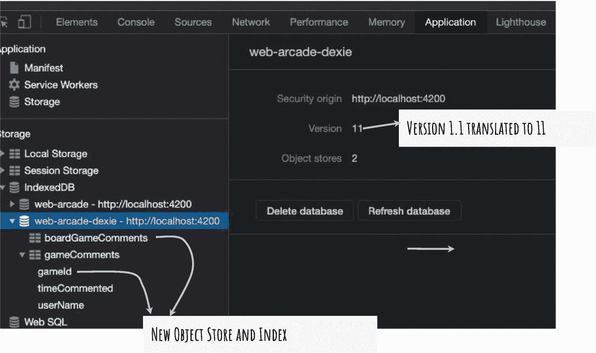

# 十、将 Dexie.js 用于 IndexedDB

到目前为止，您已经看到了在客户端使用数据库的用例及实现。您了解并实现了 IndexedDB。浏览器 API 使您能够创建数据库，执行创建/检索/更新/删除(CRUD)操作。这些功能是浏览器自带的。所有主流浏览器的最新版本都支持 IndexedDB。然而，可以说，IndexedDB API 是复杂的。一个普通的开发者可能需要一个简化的版本。

Dexie.js 是 IndexedDB 的包装器。这是一个简单易用的库，可安装在您的应用中。它是一个拥有 Apache 2.0 许可的开源存储库。许可证允许商业使用、修改、分发、专利使用和私人使用。但是，它在商标使用方面有限制，并且没有责任和担保。在将该库用于您可能正在开发的业务应用时，更好地理解该协议。

本章是对 Dexie.js 的介绍。它概述了 Web Arcade 使用案例参数中的库。首先是在 Web Arcade 应用中安装 Dexie.js 的说明。接下来，它详细介绍了如何在 TypeScript 文件中使用该库。您将创建一个新的类和一个服务，使用 Dexie.js 将数据访问逻辑封装到 IndexedDB 中。最后，本章在 IndexedDB 的基础上列出了一些额外的库和包装器。

## 安装 Dexie.js

安装 Dexie 包。

```ts
npm i -S dexie
or
yarn add dexie

```

Note

命令`npm i -S dexie`是`npm install --save dexie`的简称。

`-S`或`--save`是将 Dexie 添加到 Web Arcade 包中的选项。一个条目将被添加到`package.json`。这将确保将来的安装包括 Dexie。

Yarn 不需要这个选项。它是含蓄的；它总是会将包添加到 Web Arcade。

## 网络商场数据库

创建封装 Web Arcade IndexedDB 连接的 TypeScript 类。使用此类通过 Dexie API 访问 IndexedDB 数据库`web-arcade`。运行此命令创建一个 TypeScript 类:

```ts
ng generate class common/web-arcade-db

```

使用类`WebArcadeDb`指定要创建和连接的 IndexedDB 数据库。您还将使用该类来定义对象存储、索引等。将清单 [10-1](#PC3) 中所示的代码添加到新的类`WebArcadeDb`中。

```ts
01: import { Dexie } from 'dexie';
02: import { CommentsEntity } from './board-games-entity';
03:
04: const WEB_ARCADE_DB_NAME = 'web-arcade-dexie';
05: const OBJECT_STORE_GAME_COMMENTS = 'gameComments';
06: export class WebArcadeDb extends Dexie {
07:     comments: Dexie.Table<CommentsEntity>;
08:
09:     constructor() {
10:       super(WEB_ARCADE_DB_NAME);
11:       this.version(1.0).stores({
12:         gameComments: '++IdxCommentId,timeCommented,userName'
13:       });
14:       this.comments = this.table(OBJECT_STORE_GAME_COMMENTS);
15:      }
16:   }

Listing 10-1A TypeScript Class for the Web Arcade DB

```

考虑以下解释:

*   第 6 行创建了一个新的 TypeScript 类，`WebArcadeDb`。它扩展了`Dexie`类，该类提供了许多开箱即用的特性，包括打开数据库、创建商店等。

*   注意第 1 行的`Dexie`类是从`dexie` ES6 模块(Dexie 库的一部分)导入的。

*   向超类提供`web-arcade`数据库名称。参见第 10 行，构造函数的第一行。在这个代码示例中，TypeScript 类`WebArcadeDb`专用于一个 IndexedDB，`web-arcade`。数据库名在第 4 行被赋给一个常量。它在打开数据库连接时使用。

### 对象存储/表

考虑下面的解释，它详细说明了如何在第 11 行和第 14 行之间使用`stores()`和`table()`API:

*   构造函数还定义了对象存储结构。在当前示例中，它创建了一个名为`gameComments`的商店。请参见第 5 行中的字符串值。您可以通过在 JSON 对象中包含额外的字段来创建额外的对象存储。它作为参数传递给`stores()`函数。

*   `gameComments`对象存储定义了两个字段，`IdxCommentId`和`timeCommented`。

*   你在主键上加前缀(或后缀)`++`。此字段唯一标识每个注释。对于添加到对象存储中的每个记录，它都会自动递增。

*   对象存储包括一个或多个字段。在这个例子中，对象存储包括两个字段:`timeCommented`和`userName` *。*该语句使用列出的字段创建对象存储。

*   在将记录插入对象存储时，您可能会包括更多字段。然而，索引只在用`stores()` API 指定的字段上创建(第 12 行)。查询仅限于使用对象存储索引的字段。因此，包括您将来可能会查询的任何字段。

*   注意，stores 函数在一个`version()` API 中，它为 Web Arcade IndexedDB 定义了一个版本。正如您将在下一节中看到的，您可以创建数据库的附加版本并进行升级。

*   Dexie 使用名为`Table`的 TypeScript 类来引用对象存储。参见第 7 行的类变量注释。您创建了类型为`Table` ( `Dexie.Table`)的变量。

*   注意传递给`Table`类*的泛型类型`CommentsEntity`。*类变量`comments`被限制在接口`CommentsEntity`中。记住，评论实体包括与用户评论相关的所有字段。在`src/app/common/comments-entity.ts`重访`CommentsEntity`。参见清单 [10-2](#PC4) 。

*   接下来，请参见第 14 行。`this.table()`函数返回一个对象存储引用。`table()`函数继承自父类。注意，您为`table()`函数提供了一个对象存储名称。它使用该名称返回特定的对象存储，例如一个`gameComments`对象存储。

*   返回的对象存储被设置为类变量`comments`。在`WebArcadeDb`实例上访问这个变量指的是对象存储库`gameComments`。例如，`webArcadeDbObject.comments`指的是`gameComments`对象存储。

```ts
1: export interface CommentsEntity {
2:     IdxCommentId?: number;
3:     title: string;
4:     comments: string;
5:     timeCommented: string;
6:     gameId: number;
7:     userName:string;
8: }

Listing 10-2Comments Entity

```

### 索引数据库版本

随着应用的发展，预测数据库的变化。IndexedDB 支持版本在升级之间转换。Dexie 使用底层 API，并提供一种干净的方式来版本化 IndexedDB。

清单 [10-3](#PC5) 用一个对象存储和三个字段(一个主键和两个索引)创建了`web-arcade`数据库。见第 12 行。假设您需要在索引中添加一个额外的字段`gameId`,并为棋盘游戏评论创建一个新的对象存储。

在对数据库进行更改之前，请增加版本号。考虑将其更新到 1.1。

Note

在版本号 1.0 中，小数点前的数字称为*主版本*。小数点后的数字是*的小版本*。顾名思义，如果数据库结构有重大变化，请考虑更新主版本号。对于单个字段、索引或对象存储的次要添加，请更新次要版本。

接下来，为`gameId`添加一个新的索引。包括一个名为`boardGameComments`的新对象存储，带有一个主键`commentId`。考虑将 [10-3](#PC5) 上市。结果见图 [10-1](#Fig1) 。这是一个使用 Google Chrome 开发者工具的 IndexedDB 视图。



图 10-1

新的对象存储，版本 11 (1.1)中的索引

```ts
1: this.version(1.1).stores({
2:     gameComments: '++IdxCommentId,timeCommented, userName, gameId',
3:     boardGameComments: '++commentId'
4:   });

Listing 10-3Upgrade Web Arcade to a New Version

```

接下来，考虑一个场景，您需要删除一个对象存储和一个索引。考虑移除用户名上的索引并删除`boardGameComments`对象存储。请遵循以下说明:

1.  更新版本号。考虑用 1.2。这将在 IndexedDB 上转换为 12。

2.  将要删除的对象存储设置为空。在当前示例中，将`boardGameComments`设置为空。参见清单 [10-4](#PC6) 中的第 3 行。

3.  要对对象存储进行更改，请在数据库对象上使用`upgrade()` API。在当前的例子中，我们在对象存储库`gameComments`上删除了一个名为`userName`的索引，并提供了一个回调函数。函数参数是数据库的引用变量。考虑将 [10-4](#PC6) 上市。

*   第 8 行删除了`comments`对象上的用户。修改对象库`gameComments`T3 时获得`comments`引用。记住，Dexie 的表类(和实例)指的是一个对象存储。

```ts
1: this.version(1.2).stores({
2:     gameComments: '++IdxCommentId,timeCommented, userName, gameId',
3:     boardGameComments: null
4:   }).upgrade( idb =>
5:     idb.table(OBJECT_STORE_GAME_COMMENTS)
6:       .toCollection()
7:       .modify( comments => {
8:         delete comments.userName;
9:       }) );

Listing 10-4Remove Object Store and Index

```

## 与 Web-Arcade IndexedDB 连接

记住创造`IdbStorageAccessService`的思维过程。它从应用的其余部分抽象出 IndexedDB API。如果您选择使用 Dexie 而不是本机浏览器 API，请遵循类似的方法并创建一个服务。运行以下命令创建服务。为服务提供任意名称`dexie-storage-access`。

```ts
ng g s common/dexie-storage-access

```

Note

命令`ng g s common/dexie-storage-access`是`ng generate service common/dexie-storage-access` *的简称。*

*g-生成*

*s- service*

与`IdbStorageAccessService`类似，在应用启动时初始化`DexieStorageAccessService`。在初始化代码中包含一个`init()`函数。使用 Angular 的`APP_INITIALIZER`并将其包含在`AppModule`中。考虑清单 [10-5](#PC8) 。参见第 11 行到第 16 行。注意，应用初始化器调用了`init()`函数(第 13 行)。

```ts
01: @NgModule({
02:     declarations: [
03:       AppComponent,
04:       /* More declarations go here */
05:     ],
06:     imports: [
07:       BrowserModule,
08:       /* additional imports go here */
09:     ],
10:     providers: [
11:       {
12:         provide: APP_INITIALIZER,
13:         useFactory: (svc: DexieStorageAccessService) => () => svc.init(),
14:         deps: [DexieStorageAccessService],
15:         multi: true
16:       }
17:       /* More providers go here */
18:     ],
19:     bootstrap: [AppComponent]
20:   })
21:   export class AppModule { }

Listing 10-5Initialize DexieStorageAccessService at Application Startup

```

### 正在初始化 IndexedDB

`DexieStorageAccessService`使用`WebArcadeDB`类的实例初始化 IndexedDB(在清单 [10-3](#PC5) 中创建)。使用`open()`函数，如果数据库已经存在，它会打开一个到数据库的连接。如果没有，它将创建一个新的数据库并打开连接。考虑清单 [10-6](#PC9) 。

```ts
01: import { Injectable } from '@angular/core';
02: import { WebArcadeDb } from 'src/app/common/web-arcade-db';
03: import { CommentsEntity } from 'src/app/common/comments-entity';
04:
05: @Injectable({
06:   providedIn: 'root'
07: })
08: export class DexieStorageAccessService {
09:   webArcadeDb = new WebArcadeDb();
10:   constructor() {}
11:   init(){
12:     this.webArcadeDb
13:     .open()
14:     .catch(err => console.log("Dexie, error opening DB"));
15:   }
16: }

Listing 10-6Dexie Storage Access Service

```

考虑以下解释:

*   创建一个新的类级实例`WebArcadeDb`并实例化。它封装了 Web Arcade IndexedDB。参见清单 [10-9](#PC12) 中的第 9 行。

*   请记住，您在`APP_INITIALIZER`的帮助下从 app 模块调用了`init()`函数。注意第 11 到 15 行的定义。这通过调用 IndexedDB 上的`open()`来初始化。如前所述，它为 Web Arcade 创建一个数据库，如果它不存在的话。它将打开到 IndexedDB 的连接。

*   初始化后，IndexedDB 对包括 CRUD 在内的数据库操作开放。

*   open 函数返回一个承诺。如果失败了，这个承诺就被拒绝了。注意第 14 行。这是承诺被拒绝时的错误处理语句。在当前示例中，您将消息和错误记录到浏览器控制台。

## 处理

在事务中包含数据库操作是很重要的。事务确保所有封闭的操作都是原子的，即作为单个单元执行。要么执行所有操作，要么不执行任何操作。这有助于确保数据的一致性。

在一个示例中，假设您正在将数据从对象存储 1 传输到对象存储 2。您从对象存储 1 中读取并删除了数据。假设用户在对对象存储 2 的更新完成之前关闭了浏览器。如果没有事务，数据就会丢失。如果在将数据添加到对象存储 2 之前出现故障，事务确保从对象存储 1 的删除被恢复。这确保了数据不会丢失。

在一个`WebArcadeDb`对象上创建一个事务，如清单 [10-7](#PC10) 所示。

```ts
1: this.webArcadeDb.transaction("rw",
2:     this.webArcadeDb.comments,
3:     () => {
4:
5:     })

Listing 10-7Create a Transaction

```

考虑以下解释:

*   见第 1 行。在`WebArcadeDb`对象的实例上创建一个事务。它是`DexieStorageAccessService`上的类级变量。

*   交易函数的第一个参数是交易模式。两个值是可能的。
    *   `Read`:第一个参数的值为`r`。该事务只能执行读取操作。

    *   `Read-Write`:第一个参数的值为`rw`。参见清单 [10-10](#PC13) 中的第 1 行。该事务可以执行读写操作。

*   第二个参数是对象存储引用。见第 2 行。`comments`字段指向对象存储器`gameComments`。参见清单 [10-3](#PC5) 中的第 14 行。

*   您可以在一个事务中包含多个对象存储。

*   最后一个参数是函数回调。它包括对数据库执行创建、检索、更新或删除操作的代码。

## 增加

记住，到目前为止，您创建了一个名为`gameComments`的对象存储。清单 [10-8](#PC11) 向对象存储中添加一条记录。

```ts
01: addComment(title: string, userName: string, comments: string, gameId: number, timeCommented = new Date()){
02:     this.webArcadeDb
03:       .comments
04:       .add({
05:         title,
06:         userName,
07:         timeCommented: `${timeCommented.getMonth()}/${timeCommented.getDate()}/${timeCommented.getFullYear()}`,
08:         comments,
09:         gameId,
10:       })
11:       .then( id => console.log(`Comment added successfully. Comment Id is ${id}`))
12:       .catch( error => console.log(error))
13:       ;
14: }

Listing 10-8Add a Comment Record to the Object Store

```

考虑以下解释:

*   见第 2 行。您使用了一个`WebArcadeDb`对象的实例。它是`DexieStorageAccessService`上的类级变量。

*   `add()`函数将一条记录插入到对象存储中(第 4 行)。该记录包括各种注释字段，包括标题、用户名、注释日期和时间、注释描述以及添加了注释的游戏的 ID。

*   `add()`函数返回一个承诺。如果添加操作成功，则承诺得到解决。参见第 11 行，它将注释 ID(主键)记录到浏览器控制台。如果添加操作失败，承诺将被拒绝。第 12 行的`catch()`函数运行，它在浏览器控制台上打印错误信息。

## 删除

使用数据库对象`webArcadeDb`执行删除操作。调用数据库上的`delete()` API。它需要一个注释 ID，主键作为输入参数。考虑上市 [10-9](#PC12) 。

```ts
1: deleteComment(id: number){
2:     return this.webArcadeDb
3:       .comments
4:       .delete(id)
5:       .then( id => console.log(`Comment deleted successfully.`))
6:       .catch(err => console.error("Error deleting", err));
7: }
8:

Listing 10-9Delete a Comment Record in the Object Store

```

考虑以下解释:

*   见第 2 行。您使用了一个`WebArcadeDb`对象的实例。它是`DexieStorageAccessService`上的类级变量。

*   `delete()`函数从对象存储中删除一条记录(第 4 行)。要删除的记录由注释 ID(一个主键)标识。

*   `delete()`函数返回一个承诺。如果删除操作成功，则承诺得到解决。请参见第 5 行，该行向浏览器控制台记录了一条成功消息。如果删除操作失败，承诺将被拒绝。第 6 行的`catch()`函数运行，它在浏览器控制台上打印错误信息。

## 更新

使用数据库对象`webArcadeDb`执行更新操作。调用数据库上的`update()` API。它需要一个注释 ID，这是主键，作为第一个输入参数。它使用注释 ID 选择要更新的记录。它使用一个带有键路径和要更新的新值的对象。考虑上市 [10-10](#PC13) 。

```ts
1: updateComment(commentId: number, newTitle: string, newComments: string){
2:     this.webArcadeDb
3:       .comments
4:       .update(commentId, {title: newTitle, comments: newComments})
5:       .then( result => console.log(`Comment updated successfully. Updated record ID is ${result}`))
6:       .catch(error => console.error("Error updating", error));
7:   }

Listing 10-10Update a Comment Record

```

考虑以下解释:

*   见第 2 行。您使用了一个`WebArcadeDb`对象的实例。它是`DexieStorageAccessService`上的类级变量。

*   `update()`函数更新对象存储上的记录(第 4 行)。要更新的记录由注释 ID(一个主键)标识。第二个参数是一个对象，包含要更新的值的键值对。请注意，在对象存储中，一个键标识记录中要更新的字段。

*   例如，下面的代码片段用注释 ID 1(主键)更新一条记录。接下来的两个参数分别是新的标题和描述。

```ts
    this.updateComment(1, "New title", "new comment description");

```

图 [10-2](#Fig2) 显示了结果。


图 10-2

更新结果

*   `update()`函数返回一个承诺。如果更新操作成功，则承诺得到解决。请参见第 5 行，该行向浏览器控制台记录了一条成功消息。如果更新操作失败，承诺将被拒绝。第 6 行的`catch()`函数运行，它在浏览器控制台上打印错误信息。

Note

`update()`函数更新对象存储中记录的特定字段。要替换整个对象，请使用`put()`。

## 恢复

Dexie 提供了一个全面的函数列表，用于从 IndexedDB 中查询和检索数据。请考虑以下几点:

*   `get(id)`:使用 ID/主键选择对象存储中的记录。ID 作为参数传入。`get()`函数返回一个承诺。成功获取后，`then()`回调函数返回结果。

*   `bulkGet([id1, id2, id3])`:选择对象库中的多条记录。id 作为参数传入。`bulkGet()`函数返回一个承诺。在一次成功的 get 中，`then()`回调函数返回结果。

*   `where({keyPath1:value, keyPath2: value…, keyPath: value})`:根据`keyPath`指定的字段和给定值过滤记录。

*   `each(functionCallback)`:遍历对象库中的对象。API 异步调用提供的函数回调。考虑将 [10-11](#PC15) 上市。

```ts
1: getAllCachedComments(){
2:     this.webArcadeDb
3:       .comments
4:       .each( (entity: CommentsEntity) => {
5:         console.log(entity);
6:       })
7:       .catch(error => console.error("Error updating", error));
8: }
9:

Listing 10-11Get All Cached Comments from the gameComments Object Store

```

考虑以下解释:

*   第 2 行使用了一个`WebArcadeDb`对象的实例。它是`DexieStorageAccessService`上的类级变量。

*   第 4 行遍历`gameComments`对象存储中的每条记录。

*   回调函数使用类型为`CommentsEntity`的参数。当回调被异步调用时，局限于`CommentsEntity`接口的数据将被返回。

*   第 5 行将实体打印到浏览器控制台。

## 更多选项

在本书中，您已经看到了浏览器原生支持的 IndexedDB API。本章介绍了 Dexie.js，这是一个旨在简化数据库访问的包装器。

以下是几个额外的选项供您考虑。虽然实现细节超出了本书的范围，但是可以考虑阅读并进一步了解这些库。所有这些库都在底层使用 IndexedDB。

*   *本地饲料*:提供简单的 API 和函数。API 类似于本地存储。在不支持 IndexedDB 的传统浏览器上，Local feed 提供了一个 polyfill。它能够回退到 WebSQL 或本地存储。它是一个开源库，拥有 Apache 2.0 许可。

*   ZangoDB :这提供了一个简单易用的 API，模仿 MongoDB。该库使用 IndexedDB。包装器描述了一个用于过滤、排序、聚合等的简单 API。这是一个拥有 MIT 许可的开源库。

*   *JS Store* :为 IndexedDB 提供类似 API 的结构化查询语言(SQL)。它在一个类似于传统 SQL 的易于理解的 API 中提供了 IndexedDB 提供的所有功能。这是一个拥有 MIT 许可的开源库。

*   PouchDB :这提供了一个 API 来同步客户端的离线数据和 CouchDB。对于使用 CouchDB 服务器端后端的应用来说，这是一个非常有用的库。它是一个开源库，拥有 Apache 2.0 许可。

## 摘要

本章介绍了 Dexie.js。它在 Web Arcade 使用案例的参数内提供了对库的基本理解。它列出了将 Dexie.js NPM 软件包安装到 web arcade 应用的说明。

此外，本章在 IndexedDB 的基础上列出了一些额外的库和包装器。虽然实现细节超出了本书的范围，但它列出了名称和一行代码介绍以供进一步学习。

Exercise

*   更新游戏细节组件，以便在应用离线时使用 Dexie 存储访问服务来缓存评论。

*   更新 online 事件，以便在应用重新联机时使用 Dexie storage access 服务来检索记录。与服务器端服务集成，使用 Dexie.js API 同步数据和删除本地记录。

*   提供使用 Dexie 存储访问服务更新注释的能力。