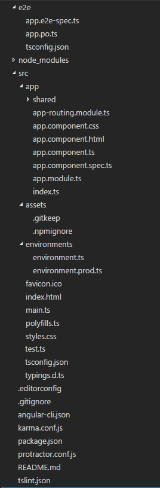
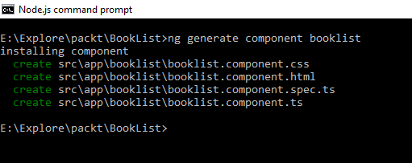
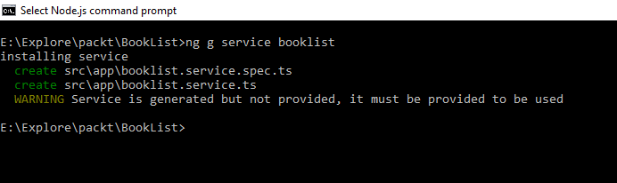

# 三、使用 Angular CLI 生成具有最佳实践的 Angular 应用


Angular CLI 是 Angular 的命令行界面，可帮助您使用遵循所有必要最佳实践的样板代码启动应用开发。通过执行 Angular CLI 中的命令，可以为应用生成服务、组件、路由和管道。

在本章中，我们将介绍以下主题：

*   引入Angular CLI
*   安装和设置 Angular CLI
*   为新应用生成代码
*   生成组件和路由
*   发电服务
*   生成指令和管道
*   创建针对各种环境的构建
*   为应用运行测试
*   更新 Angular CLI


# 引入Angular CLI


Angular CLI 是作为节点包提供的命令行界面。Angular CLI 随 Angular 一起引入，通过为新应用生成样板代码并向现有应用添加服务、管道、组件和指令等功能，帮助您更快地开发应用。Angular CLI 非常强大，可以方便地构建应用。在 Angular CLI 的帮助下，我们可以创建、构建、测试和运行我们的应用，这将大大减轻开发人员的负担。

Angular CLI 在 node 下运行，并且依赖于许多软件包。


# 安装和设置 Angular CLI


要安装 Angular CLI，我们必须在系统中安装最新版本的 node 和 npm。确保已安装所需的软件包，然后开始全局安装 Angular CLI。所需的最低 npm 版本为 3.x.x，节点版本为 4.x.x。有时，安装 Angular CLI 时可能会出错。在这种情况下，请确保已安装最新版本的 node.js。我们可以通过执行以下命令来验证节点的版本：

```ts
node --version

```

我们可以通过执行以下命令来检查 npm 的版本：

```ts
npm --version  

```

现在，我们知道了安装在开发机器中的 node 和 npm 的版本。让我们通过执行以下命令全局安装 Angular CLI：

```ts
npm install -g angular-cli 

```

Angular CLI 已安装并可在全球范围内用于我们的开发机器。


# 为新应用生成代码


我们现在已经准备好使用 Angular CLI 了。让我们为显示书籍列表的 Angular 应用生成一个样板代码。我们将该申请的名称命名为`BookList`。在 node.js 命令中执行以下命令：

```ts
ng new BookList

```

此命令将创建一个名为`BookList`的文件夹，并生成样板代码以开始使用 Angular 应用。下图显示了在生成的代码中组织的文件结构：



为了确保生成的代码正常工作，让我们通过执行以下命令来运行应用。首先通过执行以下语句导航到应用文件夹：

```ts
cd BookList

```

然后，执行以下代码以在开发服务器中启动应用：

```ts
ng serve

```

现在，让我们浏览到`http://localhost:4200/`，如果生成的代码没有问题，下面的页面将在浏览器中以默认文本呈现。如果出现错误，请确保防火墙未阻止端口 4200，并且在生成样板代码时，Angular CLI 未引发任何错误：


# 生成组件和路由


组件是适用于视图的功能、视图和样式的逻辑分组，以及与处理这些构件的组件相关联的类。组件负责根据业务逻辑需求呈现视图。

我们可以使用 Angular CLI 为组件生成代码。该工具在搭建组件时非常方便。让我们通过执行以下语句为应用生成一个名为`booklist`的组件。通过执行以下命令导航到 Angular project 文件夹：

```ts
cd BookList

```

然后，执行以下命令生成组件`Booklist`：

```ts
ng generate component booklist

```

执行上述语句将创建`booklist.component.css`、`booklist.component.html`、`booklist.component.spec.ts`和`booklist.component.ts`，如下图所示：



`booklist.component.ts`文件负责根据业务逻辑需求呈现关联视图。book 组件生成的代码片段如下所示：

```ts
import { Component, OnInit } from '@angular/core';   

@Component({   
  selector: 'app-booklist',   
  templateUrl: './booklist.component.html',   
  styleUrls: ['./booklist.component.css']   
})   
export class BooklistComponent implements   OnInit {   

  constructor() { }   

  ngOnInit() {   
  }   

}   

```

注意，`BooklistComponent`类用`@Component`指令以及选择器、`templateUrl`和`styleUrls`等元数据修饰。元数据选择器允许 Angular 在遇到`app-booklist`选择器时实例化组件`BooklistComponent`。

Angular CLI 还生成了包含以下内容的模板文件`booklist.component.html`。Angular 将根据组件中给出的说明解析和呈现此内容：

```ts
<p>   
  booklist works!   
</p>   

```

我们还可以在生成的文件`booklist.component.css`中添加特定于该模板的样式，组件将拾取这些样式，因为元数据`styleUrls`映射为`booklist.component.css`路径。

生成`booklist.component.spec.ts`是为了添加测试方法来断言`BooklistComponent`的功能。`booklist.component.spec.ts`的代码片段如下图所示：

```ts
/* tslint:disable:no-unused-variable */   

import { TestBed, async } from '@angular/core/testing';   
import { BooklistComponent } from './booklist.component';   

describe('Component: Booklist', () =>   {   
  it('should create an instance', ()   => {   
    let component = new   BooklistComponent();   
    expect(component).toBeTruthy();   
  });   
});   

```


# 路线


导航应用时使用的路径。路由允许 Angular 仅加载特定于路由的视图，而无需重新加载整个页面或应用。在编写本章时，已禁用并将很快启用使用 Angular CLI 生成路由。


# 发电服务


服务是用户定义的类，用于解决某些目的。Angular 建议在组件中仅使用特定于模板的代码。组件的职责是丰富Angular应用中的 UI/UX，并将业务逻辑委托给服务。组件是服务的消费者。

我们有一个组件可以帮助呈现`Booklist`模板。现在，让我们运行一个 CLI 命令来生成服务于书籍列表的服务。执行以下命令生成`booklist.services.ts`和`booklist.services.spec.ts`：



生成的`booklist.service.ts`的代码片段如下：

```ts
import { Injectable } from '@angular/core';   

@Injectable()   
export class BooklistService {   

  constructor() { }   

}   

```

请注意，`BooklistService`用`@Injectible`修饰，这样组件就可以使用此 booklist 服务。还有一条警告消息，服务已生成但未提供，必须提供才能使用。即消费`BooklistService`；它需要提供给将要使用它的组件。Angular 中的提供者将在[第 13 章](13.html)、*应用依赖注入*中详细讨论。

Angular CLI 还生成了一个文件来编写测试方法来断言`BooklistService`，下面显示了`booklist.service.spec.ts`的代码片段：

```ts
/* tslint:disable:no-unused-variable */   

import { TestBed, async, inject } from '@angular/core/testing';   
import { BooklistService } from './booklist.service';   

describe('Service: Booklist', () => {   
  beforeEach(() => {   
    TestBed.configureTestingModule({   
      providers: [BooklistService]   
    });   
  });   

  it('should ...',   inject([BooklistService], (service: 
      BooklistService) => {   
           expect(service).toBeTruthy();   
  }));   
});   

```


# 生成指令和管道


用[T0]修饰以附加元数据的类称为指令。它是呈现模板的说明或指南。

我们已经看到生成组件和服务。现在，让我们使用 Angular CLI 生成指令和管道。我们将从创建一个名为 book 的指令开始。运行以下命令以生成指令：

```ts
ng generate directive book       

```

执行该命令的结果如下所示：


执行此命令将创建两个文件，分别为`book.directive.spec.ts`和`book.directive.ts`。以下是`book.directive.ts`的代码片段：

```ts
import { Directive } from '@angular/core';
 @Directive({
    selector: '[appBookish]' 
   }) 
  export class BookishDirective { 
      constructor() { } 
  } 

```

`book.directive.spec.ts`的代码片段如下所示：

```ts
/* tslint:disable:no-unused-variable */ 
import { TestBed, async } from '@angular/core/testing';
import { BookDirective } from './book.directive'; 

describe('Directive: Book', () => {
   it('should create an instance', () => 
     { let directive = new BookDirective();   
        expect(directive).toBeTruthy();
    }); 
  }); 

```


# 管


管道在过滤或渲染输入数据时指示Angular。管道根据管道中给定的逻辑转换输入数据。

现在，让我们通过执行以下语句，使用 Angular CLI 生成一个管道：


在这里，我使用 Angular CLI 创建了一个名为`bookfilter`的管道。注意，它还创建了一个测试文件`bookfilter.pipe.spec.ts`，用于编写测试方法来断言管道。`bookfilter.pipe.ts`的代码片段如下所示：

```ts
import { Pipe, PipeTransform } from '@angular/core'; 
 @Pipe({ 
    name: 'bookfilter'
    }) 
 export class BookfilterPipe implements PipeTransform { 
        transform(value: any, args?: any): any {
    return null; 
  } 
} 

```

为测试文件`bookfilter.pipe.spec.ts`生成的代码片段如下所示：

```ts
/* tslint:disable:no-unused-variable */ 
import { TestBed, async } from '@angular/core/testing'; 
import { BookfilterPipe } from './bookfilter.pipe'; 
  describe('Pipe: Bookfilter', () => { 
   it('create an instance', () => {
         let pipe = new BookfilterPipe(); 
         expect(pipe).toBeTruthy(); 
   }); 
 }); 

```


# 创建针对各种环境的构建


使用 Angular CLI，我们还可以针对各种环境（如开发和生产环境）为应用创建构建。应用将针对特定环境进行配置。例如，可以将应用配置为在开发或暂存环境中使用 API 的暂存 URL，并且将在实时或生产环境中配置 API 的生产 URL。开发人员将根据构建应用的环境手动更新 URL 的配置。Angular 有助于通过针对各种环境来自动化创建构建的过程。

在名为`environment.ts`的文件中维护恒定变量环境。此文件将有助于根据执行 build 命令时传递的参数覆盖默认值。

要使用生产文件，我们需要执行以下命令：

```ts
 ng build --env=prod 

```

此命令将使用`environment.prod.ts`中的设置。`angular-cli.json`中说明了标识环境文件的映射，如下所示：

```ts
"environments": { 
  "source": "environments/environment.ts", 
   "dev": "environments/environment.ts", 
   "prod": "environments/environment.prod.ts" 
  } 

```


# 为应用运行测试


测试应用是在将其投入生产之前必须执行的基本过程。开发人员可以编写测试来断言应用的行为。编写适当的测试将保护应用不偏离要求。

Jasmine 是一个测试框架，它有助于编写测试来断言应用的行为，并使用 HTML 测试运行器在浏览器中执行测试。Karma 是一个测试运行程序，它使开发人员能够在开发阶段同时编写单元测试。一旦构建过程完成，将使用 Karma 执行测试。Protractor可用于运行端到端测试，以将应用的工作流断言为最终用户体验。

以下命令运行应用中的测试：

```ts
ng test 

```

可以通过在此处运行命令来执行端到端测试，并且只有当应用由命令 ng serve 提供服务时，它才会成功运行。此端到端测试由Protractor运行：

```ts
ng e2e 

```

我不打算详细介绍生成的每个文件的内容，因为有章节要详细解释它们。


# 更新 Angular CLI


我们可以在全局包和本地项目中更新 Angular CLI 版本。要全局更新 Angular CLI 包，请运行以下命令：

```ts
npm uninstall -g @angular/cli npm cache clean npm install -g @angular/cli@latest 

```

要更新本地项目文件夹中的 CLI，请在此处运行命令：

```ts
rm -rf node_modules dist # use rmdir /S/Q node_modules dist in Windows 
  Command Prompt; use rm -r -fo node_modules,dist in Windows PowerShell npm install --save-dev @angular/cli@latest npm install 

```


# 总结


那很顺利，很容易，不是吗？Angular CLI 为 Angular 应用的各种构件生成样板代码，从而简化了开发人员的工作。您开始学习功能强大的工具 Angular CLI，以及它如何帮助您使用样板代码启动应用。然后，您学习了使用 Angular 命令行界面生成组件、指令、管道、管线和服务。最后，您还了解了如何使用 Angular CLI 构建 Angular 应用。在下一章中，我们将讨论如何使用Angular组件。